# Prisma Markdown

> Generated by [`prisma-markdown`](https://github.com/samchon/prisma-markdown)

- [auth](#auth)
- [customer](#customer)
- [Seller](#seller)
- [Products](#products)
- [ProductVariants](#productvariants)
- [Inventory](#inventory)
- [Carts](#carts)
- [Wishlists](#wishlists)
- [Orders](#orders)
- [Shipping](#shipping)
- [Cancellations](#cancellations)
- [Refunds](#refunds)
- [Reviews](#reviews)
- [Snapshots](#snapshots)
- [Administration](#administration)
- [SellerApprovals](#sellerapprovals)
- [Categories](#categories)

## auth

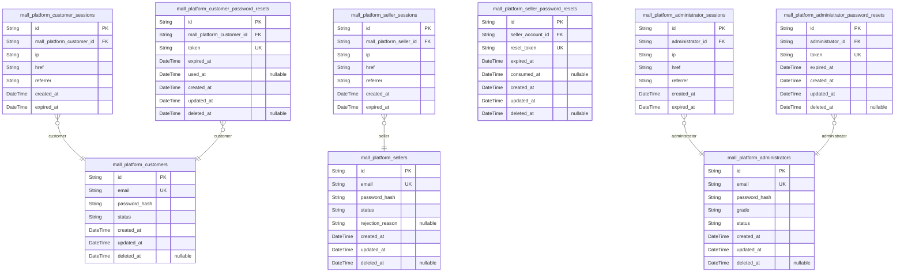

### `mall_platform_customers`

Registered customer accounts with email and password credentials and
account status for login control.

This table is the authentication root for customer shoppers in the
marketplace. It stores the unique sign-in identity, credential hash, and
account lifecycle state used to control access to customer features.

Customer-specific session, password reset, and profile data are managed
in separate tables owned by other components, so this model remains
focused on authentication and account status only.

Properties as follows:

- `id`: Primary key for the customer account.
- `email`: Unique email address used for customer login and account identification.
- `password_hash`: Hashed password used to authenticate the customer account.
- `status`
  > Current account state for login control, such as active, banned, or
  > deleted.
- `created_at`: Timestamp when the customer account was created.
- `updated_at`: Timestamp when the customer account was last updated.
- `deleted_at`: Timestamp when the customer account was soft-deleted, if applicable.

### `mall_platform_customer_sessions`

Stores authentication sessions for customer accounts. Each row represents
one login session used to validate customer access and support logout
behavior.

The table is append-only from a business perspective and records the
client context for each session together with its creation and expiration
timestamps. Each session belongs to exactly one {@link
mall_platform_customers} record.

Properties as follows:

- `id`: Primary Key.
- `mall_platform_customer_id`: Customer's [mall_platform_customers.id](#mall_platform_customers).
- `ip`: IP address observed when the session was created.
- `href`: Request URL or entry page associated with the session creation.
- `referrer`: Referrer URL recorded when the session was created.
- `created_at`: Timestamp when the session was created.
- `expired_at`: Timestamp when the session expires and becomes invalid.

### `mall_platform_customer_password_resets`

Stores password reset tokens for customer account recovery.

Each record belongs to exactly one customer account and represents a
time-bound recovery token used to verify password reset requests. The
table supports secure lookup, expiration handling, and auditability for
account recovery flows while keeping all relationships child-to-parent
only.

Properties as follows:

- `id`: Primary key for the customer password reset record.
- `mall_platform_customer_id`: Customer's [mall_platform_customers.id](#mall_platform_customers).
- `token`: Opaque password reset token used to verify the recovery request.
- `expired_at`: Time when the password reset token expires and can no longer be used.
- `used_at`: Time when the reset token was consumed, if it has already been used.
- `created_at`: Timestamp when the password reset record was created.
- `updated_at`: Timestamp when the password reset record was last updated.
- `deleted_at`: Soft delete timestamp for logical removal of the recovery record.

### `mall_platform_sellers`

Registered seller accounts used for authentication, account lifecycle
control, and platform moderation. This table stores the seller's login
credentials and account status only; public shop presentation data,
approval workflows, sessions, and password resets are handled by separate
tables in other components.

The record is the authoritative identity for a seller actor and supports
login, approval visibility, rejection handling, suspension, and deletion
controls without duplicating profile or request history data.

Properties as follows:

- `id`: Primary key for the seller account.
- `email`: Unique email address used for seller sign-in.
- `password_hash`: Hashed password used to authenticate the seller account.
- `status`
  > Current account state for seller login and moderation control, such as
  > pending, approved, rejected, suspended, or banned.
- `rejection_reason`
  > Reason provided when the seller registration is rejected. Null unless the
  > account is in a rejected state.
- `created_at`: Timestamp when the seller account was created.
- `updated_at`: Timestamp when the seller account was last updated.
- `deleted_at`
  > Timestamp when the seller account was soft-deleted. Null when the account
  > is active.

### `mall_platform_seller_sessions`

Stores login sessions for seller accounts so authenticated merchants can
remain signed in and safely log out.

Each session belongs to exactly one seller account and records the
network context at creation time together with an expiration timestamp
for security enforcement. This table is append-only and supports session
validation, revocation, and cleanup without storing any business data
beyond authentication state.

Properties as follows:

- `id`: Primary key for the seller session record.
- `mall_platform_seller_id`: Seller's [mall_platform_sellers.id](#mall_platform_sellers).
- `ip`: IP address captured when the session was created.
- `href`: Current page or request URL associated with the session creation context.
- `referrer`: Referrer URL captured at the time the session was created.
- `created_at`: Timestamp when the session was created.
- `expired_at`: Timestamp when the session expires and can no longer be used.

### `mall_platform_seller_password_resets`

Stores password reset tokens issued for seller account recovery. Each
record belongs to exactly one seller account and tracks the token
lifecycle so a seller can safely complete password reset within the
allowed time window.

The table is append-only from an auditing perspective, with one-time-use
reset tokens, expiration control, and standard temporal fields for record
management.

Properties as follows:

- `id`: Primary key for the seller password reset record.
- `seller_account_id`: Seller account's [mall_platform_seller_accounts.id](#mall_platform_seller_accounts).
- `reset_token`: Secure token used to authenticate the seller password reset request.
- `expired_at`: Time when the reset token becomes invalid.
- `consumed_at`
  > Time when the reset token was successfully used to reset the password, if
  > already consumed.
- `created_at`: Time when this reset token record was created.
- `updated_at`: Time when this reset token record was last updated.
- `deleted_at`
  > Soft deletion timestamp for the reset token record, if it was invalidated
  > or removed from active use.

### `mall_platform_administrators`

Privileged administrator accounts used for sign-in and platform-wide
access control. This table stores the administrator's authentication
credentials, authorization grade, and account status while leaving
sessions and password recovery to separate child tables. It is the
authoritative [mall_platform_administrators](#mall_platform_administrators) record for admin
identity and permission level.

Administrators may be regular or super administrators, and the account
status determines whether sign-in is allowed. The table is intentionally
compact so that audit history, sessions, and recovery flows remain
normalized in dedicated tables.

Properties as follows:

- `id`: Primary key for the administrator account.
- `email`
  > Unique email address used for administrator sign-in and account
  > identification.
- `password_hash`: Hashed password used to authenticate the administrator account.
- `grade`
  > Administrator authorization level. Supported values are regular
  > administrator and super administrator.
- `status`
  > Login and account state for the administrator account, such as active,
  > suspended, or banned.
- `created_at`: Timestamp when the administrator account was created.
- `updated_at`: Timestamp when the administrator account was last updated.
- `deleted_at`: Timestamp when the administrator account was soft-deleted, if applicable.

### `mall_platform_administrator_sessions`

Stores authenticated administrator login sessions for access control and
logout management. Each record represents one session token issued to a
single [mall_platform_administrators](#mall_platform_administrators) account and is used to
validate active access, track session provenance, and support secure
expiration.

This table follows the standard session lifecycle pattern for actor
accounts. It is append-only in practice, with one row per session and an
expiration timestamp used to invalidate access after the session window
ends.

Properties as follows:

- `id`: Primary Key.
- `administrator_id`: Administrator's [mall_platform_administrators.id](#mall_platform_administrators).
- `ip`: IP address captured when the session was created.
- `href`: Request URL or origin reference associated with session creation.
- `referrer`: Referrer URL associated with session creation.
- `created_at`: Timestamp when the session was created.
- `expired_at`: Timestamp when the session becomes invalid.

### `mall_platform_administrator_password_resets`

Stores password reset tokens and expiration metadata for {@link
mall_platform_administrators} account recovery.

Each record represents one administrator password reset request and is
used to validate a reset action before a new password is issued. The
table keeps only the token and its lifecycle timestamps, with a foreign
key back to the owning administrator account.

Properties as follows:

- `id`: Primary key for the administrator password reset request.
- `administrator_id`: Owning administrator's [mall_platform_administrators.id](#mall_platform_administrators).
- `token`: Secure password reset token used to verify the recovery request.
- `expired_at`: Time when the reset token becomes invalid.
- `created_at`: Timestamp when this reset request was created.
- `updated_at`: Timestamp when this reset request was last updated.
- `deleted_at`: Soft delete timestamp for invalidated reset requests.

## customer

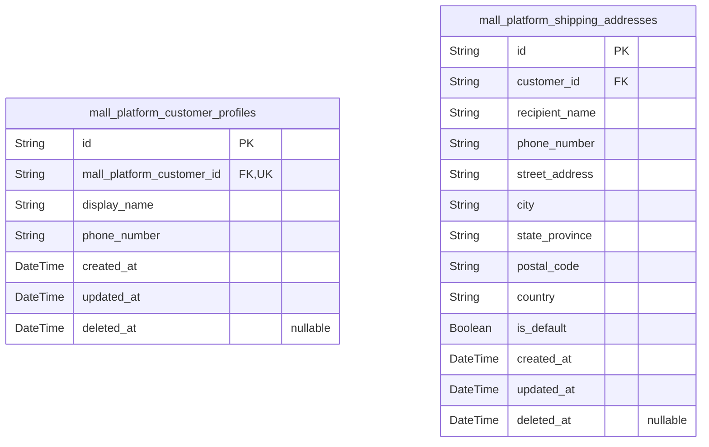

### `mall_platform_customer_profiles`

Stores the editable customer-facing identity details for one customer
account, including display name and phone number.

Each profile belongs to exactly one [mall_platform_customers](#mall_platform_customers)
record and is deleted when the owning customer account is removed. The
table contains only atomic profile attributes and standard temporal audit
columns so customer identity details remain normalized and easy to
maintain.

Properties as follows:

- `id`: Primary Key.
- `mall_platform_customer_id`: Owning customer's [mall_platform_customers.id](#mall_platform_customers).
- `display_name`: Customer-visible display name used on the account profile.
- `phone_number`: Customer contact phone number shown and edited in the profile.
- `created_at`: Record creation timestamp.
- `updated_at`: Last update timestamp.
- `deleted_at`: Soft delete timestamp for profile removal.

### `mall_platform_shipping_addresses`

Stores saved shipping addresses for customer accounts, including
recipient and location details, with support for a single default address
per customer.

Each row belongs to exactly one customer account and represents an atomic
shipping destination that can be selected during checkout. The table
keeps the address data normalized into separate fields so customer
profiles, orders, and checkout flows can reference a stable address
record without embedding denormalized location blobs.

The default-address marker is used to help customers choose their primary
shipping destination while preserving the full history of saved addresses
through soft deletion and timestamps.

Properties as follows:

- `id`: Primary Key.
- `customer_id`: Customer's [mall_platform_customers.id](#mall_platform_customers).
- `recipient_name`: Recipient name used for delivery labeling.
- `phone_number`: Recipient phone number for delivery contact.
- `street_address`: Street address line for the shipping destination.
- `city`: City or locality for the shipping destination.
- `state_province`: State, province, or region for the shipping destination.
- `postal_code`: Postal or ZIP code for the shipping destination.
- `country`: Country for the shipping destination.
- `is_default`: True when this address is the customer's default shipping address.
- `created_at`: Record creation timestamp.
- `updated_at`: Record update timestamp.
- `deleted_at`: Soft delete timestamp.

## Seller

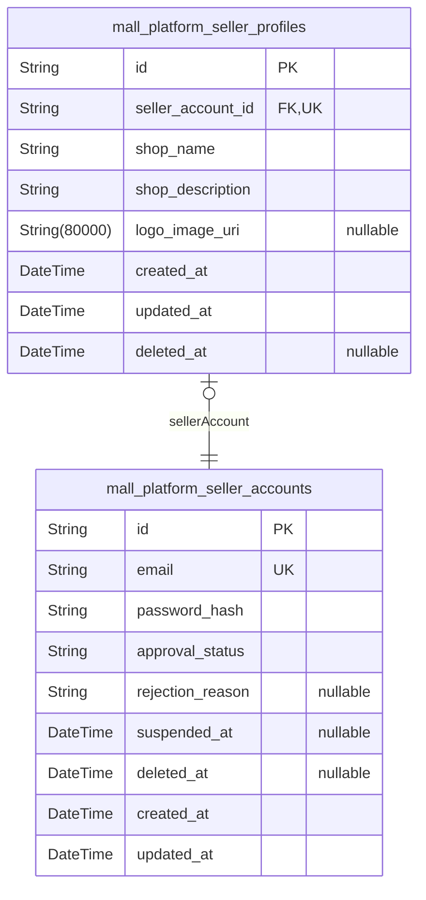

### `mall_platform_seller_accounts`

Merchant account record used for seller sign-in, approval tracking, and
seller account lifecycle management.

This table stores the seller's login identity and platform-controlled
lifecycle state, including approval outcome, suspension, and deletion
status. It is the owner table for the seller account boundary and
supports seller access control while related shop presentation data is
maintained in [mall_platform_seller_profiles](#mall_platform_seller_profiles).

Properties as follows:

- `id`: Primary key for the seller account.
- `email`: Unique email address used for seller login identity.
- `password_hash`: Hashed password used for seller authentication.
- `approval_status`: Current seller approval state such as pending, approved, or rejected.
- `rejection_reason`: Reason provided when a seller approval request is rejected.
- `suspended_at`: Timestamp when the seller account was suspended, if applicable.
- `deleted_at`: Timestamp when the seller account was soft-deleted, if applicable.
- `created_at`: Timestamp when the seller account record was created.
- `updated_at`: Timestamp when the seller account record was last updated.

### `mall_platform_seller_profiles`

Public shop profile information for one seller account, including the
shop name, shop description, and logo image reference shown to customers.

This table stores only the live profile state owned by {@link
mall_platform_seller_accounts}. Historical edits are preserved in the
separate seller profile snapshot table owned by another component, so
this model remains focused on the current public-facing profile record.

Properties as follows:

- `id`: Primary key for the seller profile record.
- `seller_account_id`: Owner seller account's [mall_platform_seller_accounts.id](#mall_platform_seller_accounts).
- `shop_name`: Public shop name displayed to customers.
- `shop_description`: Public shop description displayed on the seller profile page.
- `logo_image_uri`: URI of the current shop logo image shown to customers.
- `created_at`: Timestamp when the seller profile record was created.
- `updated_at`: Timestamp when the seller profile record was last updated.
- `deleted_at`: Timestamp when the seller profile record was soft deleted, if applicable.

## Products

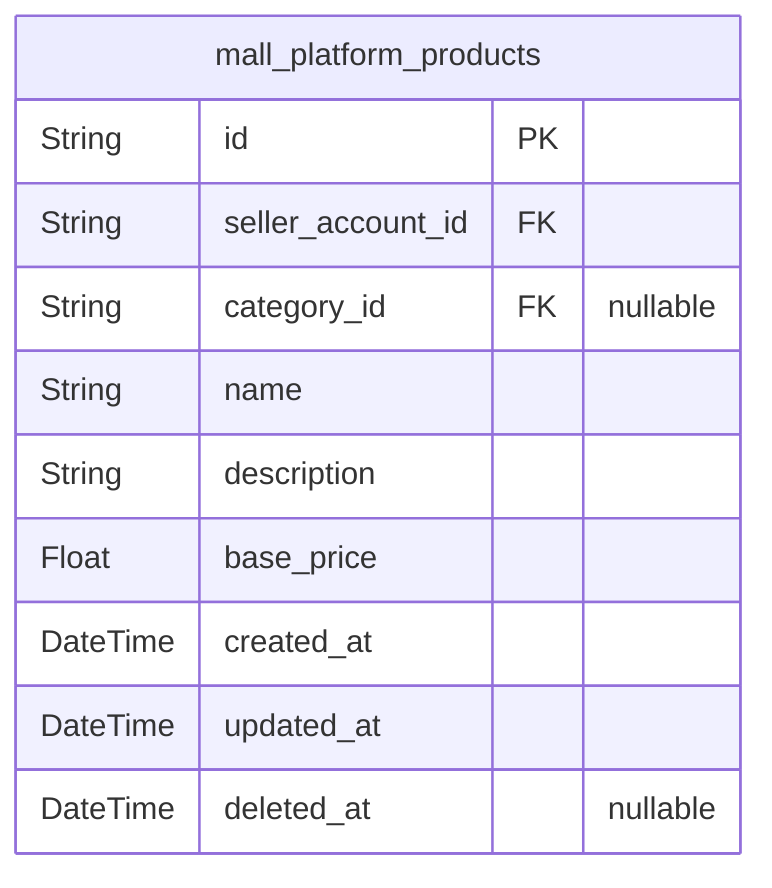

### `mall_platform_products`

Canonical sellable product records for the marketplace catalog, including
seller ownership, category assignment, product identity, description, and
base pricing for browsing and search.

This table represents the root product entity only. Product images,
product variants, inventory history, and snapshots are managed in
separate tables owned by other components, so this model stores only the
product-level references needed for catalog operations and historical
reconstruction through related entities.

Properties as follows:

- `id`: Primary key.
- `seller_account_id`: Seller's [mall_platform_seller_accounts.id](#mall_platform_seller_accounts).
- `category_id`: Category's [mall_platform_categories.id](#mall_platform_categories).
- `name`: Product display name used in listings and detail pages.
- `description`: Product description shown to customers on the detail page.
- `base_price`
  > Product base price used when variants do not override pricing and for
  > catalog price presentation.
- `created_at`: Timestamp when the product was created.
- `updated_at`: Timestamp when the product was last updated.
- `deleted_at`: Timestamp when the product was soft-deleted; null when active.

## ProductVariants

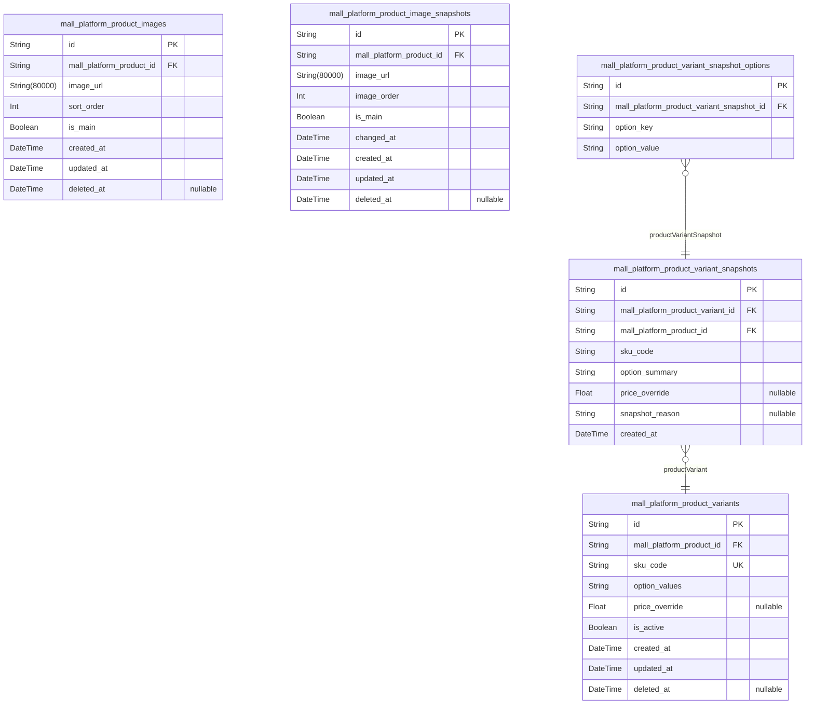

### `mall_platform_product_images`

Stores ordered presentation images for a product, including the main
thumbnail image used in listings and the customer-facing gallery order.

Each row belongs to exactly one product and represents a single uploaded
image. The table keeps image positioning separate from the product record
so products can have multiple images while preserving a deterministic
display order. Historical audit and snapshot preservation are handled by
a different table owned outside this generation task.

Properties as follows:

- `id`: Primary key.
- `mall_platform_product_id`: Product's [mall_platform_products.id](#mall_platform_products).
- `image_url`: Public or storage URL for the product image.
- `sort_order`
  > Display order of the image within the product gallery, starting from the
  > main thumbnail.
- `is_main`: Whether this image is the product's primary thumbnail image.
- `created_at`: Timestamp when the image record was created.
- `updated_at`: Timestamp when the image record was last updated.
- `deleted_at`: Timestamp when the image record was soft deleted, if applicable.

### `mall_platform_product_variants`

Stores purchasable SKU variants for a product, including SKU code, option
combination, optional price override, and availability state.

Each record belongs to one product and represents one sellable
configuration such as a color and size combination. The table supports
product browsing, cart selection, checkout, and seller-side management of
variant identity and pricing, while historical changes are preserved in
separate snapshot tables owned by another component.

Properties as follows:

- `id`: Primary key.
- `mall_platform_product_id`: Parent product's [mall_platform_products.id](#mall_platform_products).
- `sku_code`: Unique seller-defined stock keeping unit code for this variant.
- `option_values`
  > Human-readable option combination for the variant, such as color and size
  > labels.
- `price_override`
  > Optional variant-specific selling price that overrides the product base
  > price when present.
- `is_active`: Indicates whether the variant is currently available for sale and listing.
- `created_at`: Timestamp when the variant was created.
- `updated_at`: Timestamp when the variant was last updated.
- `deleted_at`: Timestamp when the variant was soft deleted, if applicable.

### `mall_platform_product_image_snapshots`

Immutable history records for product image changes, preserving prior
image state for audit and historical reconstruction. Each row captures
the state of a product image at a point in time so product presentation
can be reviewed after edits or deletion.

Properties as follows:

- `id`: Primary key for the product image snapshot record.
- `mall_platform_product_id`: Target product's [mall_platform_products.id](#mall_platform_products).
- `image_url`: Snapshot of the product image URL at the time the change was recorded.
- `image_order`
  > Snapshot of the display order used for the product image at the time the
  > change was recorded.
- `is_main`
  > Snapshot of whether the image was the main thumbnail at the time the
  > change was recorded.
- `changed_at`: Timestamp when the product image state was captured in this snapshot.
- `created_at`: Record creation timestamp.
- `updated_at`: Record update timestamp.
- `deleted_at`
  > Soft delete timestamp, if the snapshot record is ever marked as deleted
  > for system maintenance.

### `mall_platform_product_variant_snapshots`

Immutable point-in-time records of [mall_platform_product_variants](#mall_platform_product_variants)
edits. This table preserves the historical state of a product variant so
SKU changes, option updates, and price revisions can be reviewed later
for audit and dispute resolution.

Each row captures the snapshot's own version of the variant state at the
time the change was recorded. It links back to the live variant and its
parent product for traceability, while remaining append-only and never
being deleted.

Properties as follows:

- `id`: Primary Key.
- `mall_platform_product_variant_id`: Target's [mall_platform_product_variants.id](#mall_platform_product_variants).
- `mall_platform_product_id`: Target's [mall_platform_products.id](#mall_platform_products).
- `sku_code`: Snapshot copy of the variant SKU code at the time the change was recorded.
- `option_summary`
  > Snapshot copy of the variant option combination in a stable
  > human-readable form.
- `price_override`
  > Snapshot copy of the variant-specific price override, if any, at the time
  > the change was recorded.
- `snapshot_reason`: Reason or context for the variant change that triggered this snapshot.
- `created_at`: Timestamp when this snapshot record was created.

### `mall_platform_product_variant_snapshot_options`

Stores one atomic option-value pair for a specific product variant
snapshot. Each row preserves a single structured option entry, such as
color or size, so variant snapshot state remains fully normalized and can
be reconstructed without using JSON or array fields. The table belongs to
[mall_platform_product_variant_snapshots](#mall_platform_product_variant_snapshots) and supports historical
reconstruction of variant configuration at the time of the snapshot.

Properties as follows:

- `id`: Primary Key.
- `mall_platform_product_variant_snapshot_id`: Parent snapshot's [mall_platform_product_variant_snapshots.id](#mall_platform_product_variant_snapshots).
- `option_key`: Atomic option name within the variant snapshot, such as color or size.
- `option_value`: Atomic option value within the variant snapshot, such as red or large.

## Inventory

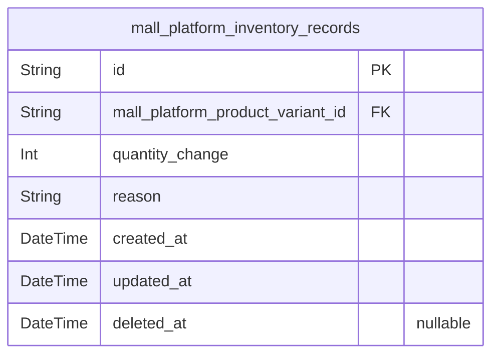

### `mall_platform_inventory_records`

Append-only stock movement history for a single product variant. Each
record captures one inventory change event, the quantity delta, the
business reason for the movement, and when it occurred so current stock
can be derived from the full history. This table is immutable in practice
and supports restocking, manual adjustments, order deductions, and stock
restoration events through [mall_platform_product_variants](#mall_platform_product_variants).

Properties as follows:

- `id`: Primary key for the inventory movement record.
- `mall_platform_product_variant_id`
  > The associated product variant's {@link
  > mall_platform_product_variants.id}.
- `quantity_change`
  > Signed quantity delta for this stock movement event; positive values
  > increase stock and negative values decrease stock.
- `reason`
  > Business explanation for the inventory movement, such as restock, order
  > deduction, cancellation restore, refund restore, or manual adjustment.
- `created_at`: Timestamp when this inventory movement was recorded.
- `updated_at`
  > Timestamp when this record was last updated by the system before being
  > treated as immutable.
- `deleted_at`
  > Soft delete timestamp, if ever used for administrative archival of
  > invalid records.

## Carts

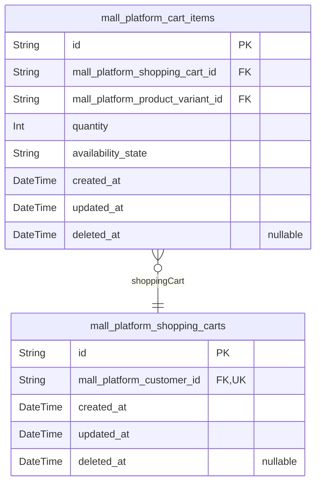

### `mall_platform_shopping_carts`

Customer-owned shopping cart header that groups cart lines and stores
checkout-preparation state for one customer account. The cart contains
only header-level ownership and lifecycle data; individual selected
variants, quantities, and line calculations are stored in {@link
mall_platform_cart_items}.

This table supports the active cart experience before checkout, including
one-cart-per-customer integrity and lifecycle tracking across updates and
soft deletion.

Properties as follows:

- `id`: Primary Key.
- `mall_platform_customer_id`: Customer account's [mall_platform_customers.id](#mall_platform_customers).
- `created_at`: When the cart record was created.
- `updated_at`: When the cart record was last updated.
- `deleted_at`: When the cart was soft-deleted, if applicable.

### `mall_platform_cart_items`

Stores one selected product variant line inside a customer shopping cart.

Each row represents a single cart entry with its parent cart, chosen
product variant, quantity, and current availability state used during
checkout validation. The table remains normalized by storing only
line-level facts; pricing totals are derived at query time, and the
parent cart plus referenced product variant provide the broader purchase
context.

Properties as follows:

- `id`: Primary key for the shopping cart item.
- `mall_platform_shopping_cart_id`: Parent shopping cart's [mall_platform_shopping_carts.id](#mall_platform_shopping_carts).
- `mall_platform_product_variant_id`: Selected product variant's [mall_platform_product_variants.id](#mall_platform_product_variants).
- `quantity`: Number of units of the selected product variant stored in this cart line.
- `availability_state`
  > Current cart-line availability marker used to indicate whether the
  > referenced variant is available, out of stock, or otherwise unavailable
  > for checkout.
- `created_at`: Timestamp when the cart item was created.
- `updated_at`: Timestamp when the cart item was last updated.
- `deleted_at`: Timestamp when the cart item was soft deleted, if applicable.

## Wishlists

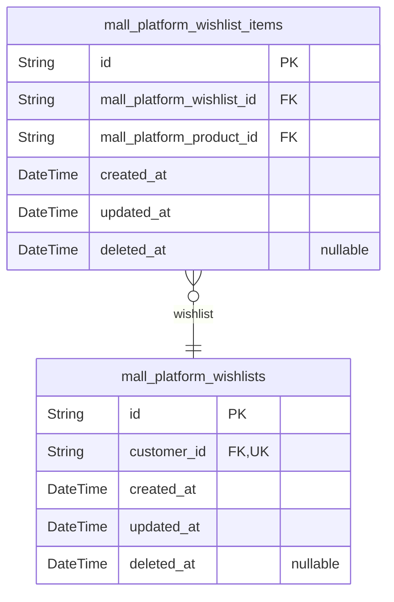

### `mall_platform_wishlists`

Stores one wishlist container for each customer account. The record
represents the saved-products collection owned by a customer and serves
as the parent entity for wishlist item rows managed in the separate
wishlist item table.

This table intentionally contains only the ownership and lifecycle
metadata required to support paginated wishlist browsing, while the
individual saved products remain normalized in {@link
mall_platform_wishlist_items}.

Properties as follows:

- `id`: Primary Key.
- `customer_id`: Customer's [mall_platform_customers.id](#mall_platform_customers).
- `created_at`: Timestamp when the wishlist record was created.
- `updated_at`: Timestamp when the wishlist record was last updated.
- `deleted_at`: Timestamp when the wishlist record was soft deleted, if applicable.

### `mall_platform_wishlist_items`

Stores one saved product entry within a customer wishlist. Each row links
exactly one wishlist to exactly one product, with no variant-specific
data, so customers can save products for later and the item can be
removed automatically when the product is deleted.

This table is a pure junction-style business entity that supports
wishlist browsing and item removal while keeping product details
normalized in [mall_platform_products](#mall_platform_products).

Properties as follows:

- `id`: Primary Key.
- `mall_platform_wishlist_id`: Wishlist's [mall_platform_wishlists.id](#mall_platform_wishlists).
- `mall_platform_product_id`: Product's [mall_platform_products.id](#mall_platform_products).
- `created_at`: Timestamp when this wishlist item was created.
- `updated_at`: Timestamp when this wishlist item was last updated.
- `deleted_at`: Timestamp when this wishlist item was soft deleted, if applicable.

## Orders

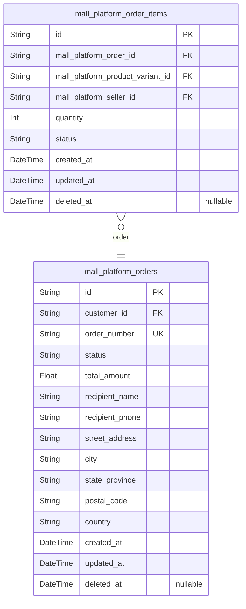

### `mall_platform_orders`

Stores one checkout result per customer, including the overall order
identity, status, totals, and preserved shipping destination for the
purchase.

This table represents the order header created after successful checkout.
It preserves the customer-owned purchase record and the shipping
destination that was selected at purchase time so historical orders
remain readable even if the customer later edits or deletes addresses.
Item-level purchase details, shipments, and snapshots are maintained in
their own component tables.

Properties as follows:

- `id`: Primary Key.
- `customer_id`: Customer's [mall_platform_customers.id](#mall_platform_customers).
- `order_number`: Human-readable order number shown to the customer and support staff.
- `status`
  > Derived overall order status for history and browsing, such as paid,
  > shipped, delivered, cancelled, refunded, or partially completed.
- `total_amount`: Total order amount at the time of checkout, including all purchased items.
- `recipient_name`: Preserved shipping recipient name captured at checkout.
- `recipient_phone`: Preserved shipping recipient phone number captured at checkout.
- `street_address`: Preserved street address used for shipment destination.
- `city`: Preserved city used for shipment destination.
- `state_province`: Preserved state or province used for shipment destination.
- `postal_code`: Preserved postal code used for shipment destination.
- `country`: Preserved country used for shipment destination.
- `created_at`: Timestamp when the order was created.
- `updated_at`: Timestamp when the order was last updated.
- `deleted_at`
  > Soft-delete timestamp for retained historical order visibility, when
  > applicable.

### `mall_platform_order_items`

Stores each purchased product variant line within an order, including
quantity, item status, and the preserved relational references needed to
reconstruct the purchase context.

Each row belongs to exactly one order and exactly one product variant,
and records the seller responsible for the item. The live table keeps the
operational order-item state, while immutable historical snapshots are
maintained in the dedicated snapshot table handled by the snapshots
component.

Properties as follows:

- `id`: Primary Key.
- `mall_platform_order_id`: Parent order's [mall_platform_orders.id](#mall_platform_orders).
- `mall_platform_product_variant_id`: Purchased variant's [mall_platform_product_variants.id](#mall_platform_product_variants).
- `mall_platform_seller_id`: Responsible seller's [mall_platform_sellers.id](#mall_platform_sellers).
- `quantity`: Number of units purchased for this order item.
- `status`
  > Current fulfillment status of the order item, such as paid, shipped,
  > delivered, cancelled, or refunded.
- `created_at`: Timestamp when this order item row was created.
- `updated_at`: Timestamp when this order item row was last updated.
- `deleted_at`: Timestamp when this order item row was soft deleted, if applicable.

## Shipping

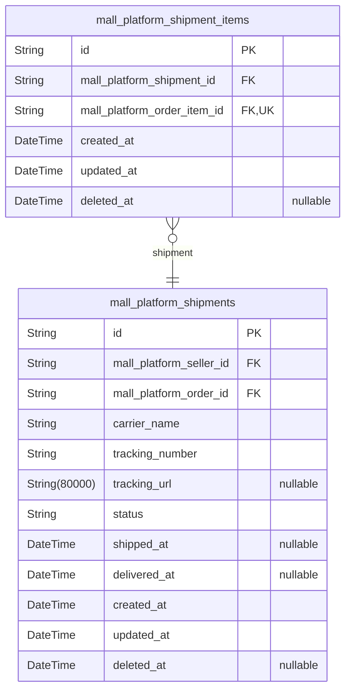

### `mall_platform_shipments`

Seller-specific delivery packages that group one or more order items from
the same seller and store the shared carrier and tracking information for
those items.

A shipment represents a fulfillment unit created during delivery
processing. It keeps the shipping metadata at the package level, while
item membership is stored in the separate shipment-item junction table.
This design supports shared tracking, package-level delivery
confirmation, and history preservation for dispute resolution.

Properties as follows:

- `id`: Primary key.
- `mall_platform_seller_id`: Seller's [mall_platform_sellers.id](#mall_platform_sellers).
- `mall_platform_order_id`: Order's [mall_platform_orders.id](#mall_platform_orders).
- `carrier_name`: Shipping carrier name used for this shipment.
- `tracking_number`: Carrier tracking number for the shipment.
- `tracking_url`: Optional carrier tracking URL for customer visibility.
- `status`
  > Current shipment status such as preparing, shipped, delivered, or
  > cancelled.
- `shipped_at`: Timestamp when the shipment was handed to the carrier.
- `delivered_at`: Timestamp when the shipment was confirmed delivered.
- `created_at`: Timestamp when the shipment record was created.
- `updated_at`: Timestamp when the shipment record was last updated.
- `deleted_at`: Soft delete timestamp for shipment records that are logically removed.

### `mall_platform_shipment_items`

Associates purchased order items with a shipment so each seller-specific
package can contain one or more eligible items.

This table is the junction between [mall_platform_shipments](#mall_platform_shipments) and
[mall_platform_order_items](#mall_platform_order_items). It stores only the assignment
relationship and standard temporal fields, while shipment carrier and
tracking data remain on the shipment header. The relationship supports
grouping multiple order items into a single package without duplicating
order or shipping details.

Properties as follows:

- `id`: Primary Key.
- `mall_platform_shipment_id`: Shipment's [mall_platform_shipments.id](#mall_platform_shipments).
- `mall_platform_order_item_id`: Order item's [mall_platform_order_items.id](#mall_platform_order_items).
- `created_at`: Timestamp when the shipment-item assignment was created.
- `updated_at`: Timestamp when the shipment-item assignment was last updated.
- `deleted_at`
  > Timestamp when the shipment-item assignment was soft deleted, if
  > applicable.

## Cancellations

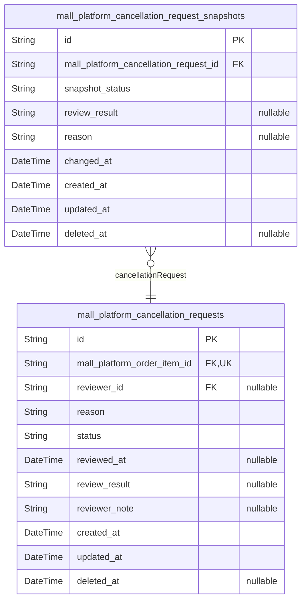

### `mall_platform_cancellation_requests`

Stores cancellation requests submitted for a single order item, including
the requester’s reason, current review state, and reviewer outcome.

Each request belongs to exactly one order item and records the state
needed for seller or administrator review. Immutable history is handled
by a separate snapshot table, which is managed in another component and
is not recreated here.

Properties as follows:

- `id`: Primary key.
- `mall_platform_order_item_id`: Target order item's [mall_platform_order_items.id](#mall_platform_order_items).
- `reviewer_id`
  > Reviewer account's [mall_platform_administrators.id](#mall_platform_administrators) or {@link
  > mall_platform_sellers.id}, depending on the actor who handled the
  > request.
- `reason`: Customer-provided explanation for requesting cancellation.
- `status`: Current request state such as pending, approved, or rejected.
- `reviewed_at`: Timestamp when the request was reviewed.
- `review_result`: Outcome text recorded when the request is approved or rejected.
- `reviewer_note`: Optional reviewer note explaining the decision.
- `created_at`: Timestamp when the request was created.
- `updated_at`: Timestamp when the request was last updated.
- `deleted_at`: Soft delete timestamp, if the request is removed from active use.

### `mall_platform_cancellation_request_snapshots`

Immutable audit snapshots for [mall_platform_cancellation_requests](#mall_platform_cancellation_requests)
that preserve cancellation request state changes for dispute review and
historical reconstruction.

Each row captures a point-in-time representation of the request after a
meaningful change, including the preserved status, reviewer outcome,
reason text, and audit context needed to understand what changed and
when. These records are append-only and are not intended to be edited or
deleted in normal operation.

Properties as follows:

- `id`: Primary Key.
- `mall_platform_cancellation_request_id`
  > Original cancellation request {@link
  > mall_platform_cancellation_requests.id}.
- `snapshot_status`
  > Preserved cancellation request status at the time this snapshot was
  > recorded.
- `review_result`
  > Preserved reviewer outcome or decision associated with the cancellation
  > request state at this moment.
- `reason`
  > Preserved cancellation reason text or reviewer note captured in the
  > snapshot.
- `changed_at`
  > The business timestamp when the captured cancellation request state
  > became effective.
- `created_at`: Timestamp when this immutable snapshot record was created.
- `updated_at`
  > Timestamp when this snapshot row was last updated in storage, if ever
  > required by infrastructure.
- `deleted_at`
  > Soft delete marker. Snapshot rows are normally retained permanently and
  > this value should remain null.

## Refunds

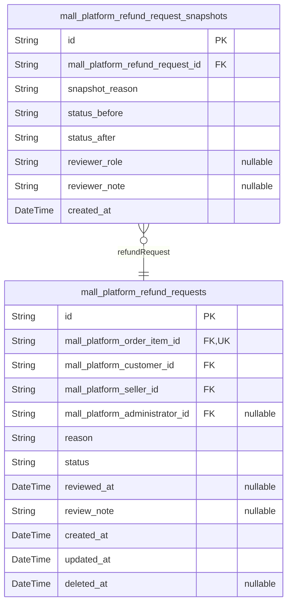

### `mall_platform_refund_requests`

Current refund requests submitted for a specific delivered order item,
including the request reason, current review status, and reviewer outcome
metadata.

Each record represents one refund workflow for one purchased order item.
The live table stores the current operational state only; immutable
before-and-after change history is preserved in the separate refund
request snapshot table. This table supports customer submission, seller
or administrator review, and dispute-oriented lookup by the owning
parties.

Properties as follows:

- `id`: Primary key for the refund request record.
- `mall_platform_order_item_id`: Target order item's [mall_platform_order_items.id](#mall_platform_order_items).
- `mall_platform_customer_id`: Requesting customer's [mall_platform_customers.id](#mall_platform_customers).
- `mall_platform_seller_id`
  > Responsible seller's [mall_platform_sellers.id](#mall_platform_sellers) for review and
  > resolution.
- `mall_platform_administrator_id`
  > Administrator reviewer’s [mall_platform_administrators.id](#mall_platform_administrators) when an
  > admin handles or overrides the request.
- `reason`: Customer-provided explanation for requesting the refund.
- `status`: Current request state, such as pending, approved, rejected, or cancelled.
- `reviewed_at`: Timestamp when the current review decision was made, if reviewed.
- `review_note`
  > Reviewer explanation or decision note shown to the customer when the
  > request is approved or rejected.
- `created_at`: Timestamp when the refund request was created.
- `updated_at`: Timestamp when the refund request was last updated.
- `deleted_at`
  > Soft delete timestamp for administrative cleanup while preserving
  > historical references.

### `mall_platform_refund_request_snapshots`

Immutable snapshot records for refund request changes. Each row preserves
the refund request state at a specific moment so approvals, rejections,
and other lifecycle updates can be reviewed later for audit and dispute
resolution.

This table belongs to [mall_platform_refund_requests](#mall_platform_refund_requests) and stores
historical state only. It is append-only and should not be updated or
deleted after creation.

Properties as follows:

- `id`: Primary key for the refund request snapshot record.
- `mall_platform_refund_request_id`: Parent refund request's [mall_platform_refund_requests.id](#mall_platform_refund_requests).
- `snapshot_reason`
  > Human-readable reason describing why this snapshot was created, such as
  > approval, rejection, or state correction.
- `status_before`: Refund request status before the recorded change.
- `status_after`: Refund request status after the recorded change.
- `reviewer_role`
  > Role of the reviewer or actor responsible for the state change at the
  > time of the snapshot.
- `reviewer_note`: Optional note or decision comment captured at the time of the snapshot.
- `created_at`: Timestamp when this immutable snapshot record was created.

## Reviews

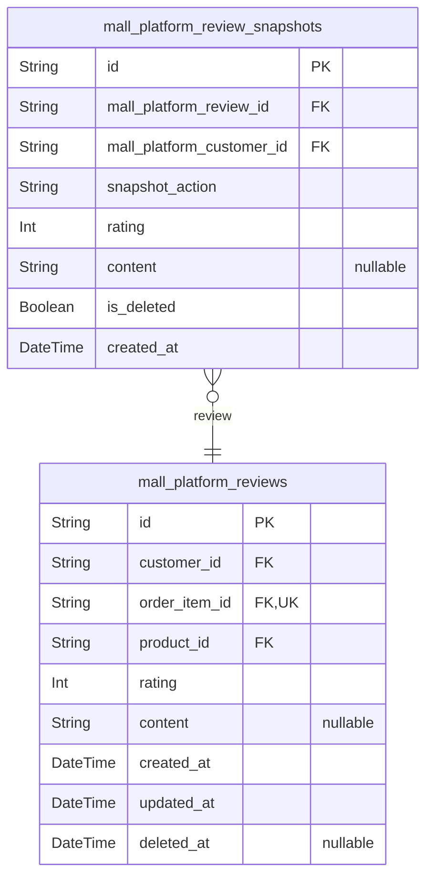

### `mall_platform_reviews`

Stores the current active customer review for a purchased product. Each
review belongs to one customer account and one purchased order item, and
it is displayed on the product detail page while preserving only the live
review state in this table.

The table keeps the active rating, optional written content, and deletion
state for customer-authored feedback. Historical edits and moderation
history are preserved in [mall_platform_review_snapshots](#mall_platform_review_snapshots), which is
managed separately.

Properties as follows:

- `id`: Primary key for the review record.
- `customer_id`: Customer account's [mall_platform_customers.id](#mall_platform_customers).
- `order_item_id`: Purchased order item's [mall_platform_order_items.id](#mall_platform_order_items).
- `product_id`: Reviewed product's [mall_platform_products.id](#mall_platform_products).
- `rating`: Star rating from 1 to 5 inclusive.
- `content`: Optional written review text provided by the customer.
- `created_at`: Timestamp when the review was created.
- `updated_at`: Timestamp when the review was last updated.
- `deleted_at`: Timestamp when the review was soft-deleted; null while active.

### `mall_platform_review_snapshots`

Immutable point-in-time snapshots of customer reviews for audit, edit
history, deletion preservation, and dispute resolution. Each row captures
the review state as it existed when a change occurred, including the
review content, rating, and moderation state, while preserving the
relationship to the source [mall_platform_reviews](#mall_platform_reviews) and the owning
[mall_platform_customers](#mall_platform_customers).

Properties as follows:

- `id`: Primary key for the review snapshot record.
- `mall_platform_review_id`: Source review's [mall_platform_reviews.id](#mall_platform_reviews).
- `mall_platform_customer_id`: Owning customer's [mall_platform_customers.id](#mall_platform_customers).
- `snapshot_action`
  > Reason this snapshot was created, such as edit, deletion, or moderation
  > change.
- `rating`: Preserved star rating at the time of the snapshot.
- `content`: Preserved review text content at the time of the snapshot.
- `is_deleted`: Whether the source review was marked deleted at the time of the snapshot.
- `created_at`: Timestamp when this immutable snapshot record was created.

## Snapshots

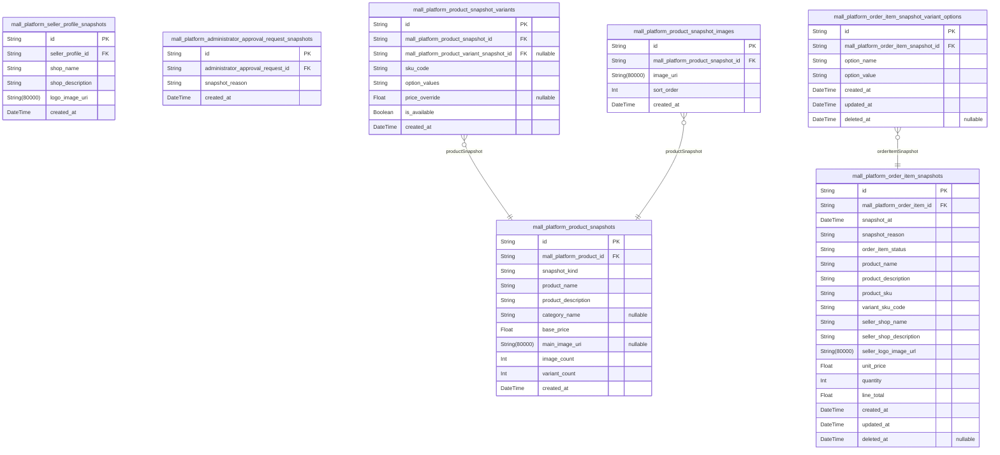

### `mall_platform_product_snapshots`

Immutable history records for product changes, preserving prior product
state for audit and dispute resolution.

Each row captures a point-in-time product state before or after an edit,
so the platform can reconstruct what customers and administrators saw at
that moment. The snapshot preserves the product’s identity, catalog
placement, pricing, presentation, and related variant state for dispute
handling and historical review.

Properties as follows:

- `id`: Primary key for the product snapshot record.
- `mall_platform_product_id`: Target product's [mall_platform_products.id](#mall_platform_products).
- `snapshot_kind`
  > Indicates whether this record captures the state before or after a
  > product change.
- `product_name`: Preserved product name at the time of the snapshot.
- `product_description`: Preserved product description at the time of the snapshot.
- `category_name`
  > Preserved category label for historical reconstruction when the live
  > category changes later.
- `base_price`: Preserved product base price at the time of the snapshot.
- `main_image_uri`: Preserved main image location for the product at the time of the snapshot.
- `image_count`: Number of product images captured in this snapshot state.
- `variant_count`: Number of product variants captured in this snapshot state.
- `created_at`: Timestamp when the snapshot was created.

### `mall_platform_seller_profile_snapshots`

Immutable history records for [mall_platform_seller_profiles](#mall_platform_seller_profiles)
changes, preserving shop identity and branding at each edit.

Each row captures a point-in-time copy of the seller profile so
administrators and sellers can review historical shop presentation during
dispute resolution and audit workflows. The snapshot is append-only and
should preserve the profile values as they existed when the change was
recorded.

Properties as follows:

- `id`: Primary Key.
- `seller_profile_id`: Target's [mall_platform_seller_profiles.id](#mall_platform_seller_profiles).
- `shop_name`: Captured shop name at the time of the snapshot.
- `shop_description`: Captured shop description at the time of the snapshot.
- `logo_image_uri`: Captured logo image reference at the time of the snapshot.
- `created_at`: Timestamp when this snapshot was created.

### `mall_platform_order_item_snapshots`

Immutable preserved records for order item state, including the purchased
product, variant, seller profile, and status at purchase time.

This table stores append-only audit history for order item changes so
disputes, legal retention, and historical reconstruction can rely on a
stable record of what the customer bought and what the seller presented
at the moment the record was captured. It references the live order item
and preserves the relevant product, variant, and seller identity details
as snapshot data rather than as mutable live references.

Properties as follows:

- `id`: Primary key for the order item snapshot record.
- `mall_platform_order_item_id`: Source order item's [mall_platform_order_items.id](#mall_platform_order_items).
- `snapshot_at`: Timestamp when this preserved order item state was captured.
- `snapshot_reason`
  > Human-readable reason for capturing the snapshot, such as purchase
  > completion, seller response, cancellation, refund, or administrative
  > preservation.
- `order_item_status`: Preserved order item status at the time this snapshot was captured.
- `product_name`
  > Preserved product name shown to the buyer at the time of purchase or
  > capture.
- `product_description`
  > Preserved product description shown to the buyer at the time of purchase
  > or capture.
- `product_sku`
  > Preserved product SKU or product identifier as displayed in the
  > historical snapshot context.
- `variant_sku_code`: Preserved SKU code of the purchased product variant.
- `seller_shop_name`: Preserved seller shop name shown at the time of purchase.
- `seller_shop_description`: Preserved seller shop description shown at the time of purchase.
- `seller_logo_image_url`: Preserved seller logo image URL shown at the time of purchase.
- `unit_price`: Preserved unit price for the item at the time of the snapshot.
- `quantity`: Preserved quantity for this order item at the time of the snapshot.
- `line_total`
  > Preserved line total calculated from the unit price and quantity at the
  > time of the snapshot.
- `created_at`: Timestamp when the snapshot record was created in the database.
- `updated_at`
  > Timestamp when the snapshot record was last updated in the database
  > metadata.
- `deleted_at`
  > Soft delete timestamp for internal retention handling, if ever applied to
  > administrative cleanup workflows.

### `mall_platform_administrator_approval_request_snapshots`

Immutable point-in-time history records for administrator approval
request changes.

Each row preserves the state of a single {@link
mall_platform_administrator_approval_requests} record at the moment a
review decision or status change occurred, so administrators and owners
can reconstruct approval history during audits and disputes.

This table is append-only and never updated or deleted after creation.

Properties as follows:

- `id`: Primary key for the administrator approval request snapshot record.
- `administrator_approval_request_id`
  > Parent administrator approval request's {@link
  > mall_platform_administrator_approval_requests.id}.
- `snapshot_reason`
  > Human-readable reason for creating this snapshot, such as status change
  > or review decision.
- `created_at`: Timestamp when this immutable snapshot record was created.

### `mall_platform_product_snapshot_variants`

Immutable normalized variant-state rows captured as part of a product
snapshot, preserving each variant's SKU, option values, pricing state,
and stock-relevant presentation at the time the snapshot was created.
This table supports historical reconstruction of {@link
mall_platform_product_snapshots} and must remain append-only for audit
and dispute review.

Properties as follows:

- `id`: Primary key for the product snapshot variant record.
- `mall_platform_product_snapshot_id`
  > Parent [mall_platform_product_snapshots.id](#mall_platform_product_snapshots) that owns this
  > historical variant state.
- `mall_platform_product_variant_snapshot_id`
  > Related [mall_platform_product_variant_snapshots.id](#mall_platform_product_variant_snapshots) if this row is
  > linked to a dedicated variant snapshot source record.
- `sku_code`: SKU code of the variant at the time of the snapshot.
- `option_values`
  > Serialized human-readable representation of the variant's option
  > combination at the time of the snapshot, kept atomic as a single
  > historical label.
- `price_override`: Variant price override captured at snapshot time, if present.
- `is_available`
  > Historical presentation flag indicating whether the variant was available
  > for purchase when the snapshot was recorded.
- `created_at`: Timestamp when this snapshot row was recorded.

### `mall_platform_product_snapshot_images`

Stores the image-state rows captured for each product snapshot so the
historical product presentation can be reconstructed exactly as it
appeared at that point in time.

Each row belongs to one [mall_platform_product_snapshots](#mall_platform_product_snapshots) record
and preserves the image URI together with its ordering position within
that snapshot. This table is immutable after creation and supports audit,
dispute resolution, and historical rendering of product image changes.

Properties as follows:

- `id`: Primary key for the product snapshot image record.
- `mall_platform_product_snapshot_id`: Owning product snapshot's [mall_platform_product_snapshots.id](#mall_platform_product_snapshots).
- `image_uri`: Image location preserved from the product snapshot.
- `sort_order`: Zero-based display order of the image within the snapshot.
- `created_at`: Timestamp when this snapshot image row was created.

### `mall_platform_order_item_snapshot_variant_options`

Stores one atomic option-value pair for a specific order item snapshot so
variant options remain normalized and queryable. Each row belongs to one
order item snapshot and preserves a single variant option key and its
corresponding value for historical reconstruction of the purchased
configuration.

Properties as follows:

- `id`: Primary key.
- `mall_platform_order_item_snapshot_id`: Parent order item's [mall_platform_order_item_snapshots.id](#mall_platform_order_item_snapshots).
- `option_name`
  > Atomic option name captured from the purchased variant snapshot, such as
  > color or size.
- `option_value`
  > Atomic option value captured from the purchased variant snapshot, such as
  > red or large.
- `created_at`: Timestamp when this snapshot option record was created.
- `updated_at`: Timestamp when this snapshot option record was last updated.
- `deleted_at`: Soft delete timestamp for this snapshot option record, if ever removed.

## Administration

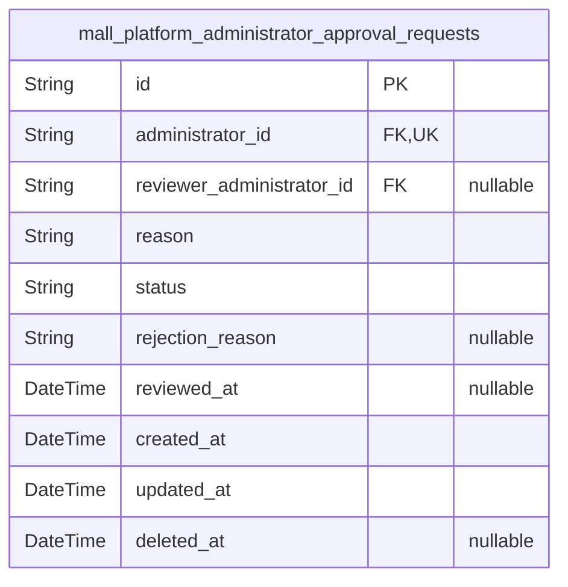

### `mall_platform_administrator_approval_requests`

Stores formal requests from existing administrator accounts that are
under review for approval lifecycle management, including the applicant
reference, submitted reason, current review status, reviewer decision
details, and timestamps for the request lifecycle.

The table serves as the authoritative record for administrator onboarding
review. It keeps the request itself normalized while referencing the
existing administrator account table for the applicant identity, and it
supports approval, rejection, and audit-friendly decision history without
duplicating snapshot data.

Properties as follows:

- `id`: Primary key for the administrator approval request.
- `administrator_id`: Applicant administrator's [mall_platform_administrators.id](#mall_platform_administrators).
- `reviewer_administrator_id`: Reviewing administrator's [mall_platform_administrators.id](#mall_platform_administrators).
- `reason`: Applicant's reason for requesting administrator status.
- `status`
  > Current review status of the request, such as pending, approved, or
  > rejected.
- `rejection_reason`: Explanation provided when the request is rejected.
- `reviewed_at`: Timestamp when the request was reviewed.
- `created_at`: Timestamp when the request was created.
- `updated_at`: Timestamp when the request was last updated.
- `deleted_at`
  > Soft delete timestamp for administrative cleanup workflows, if ever
  > applied.

## SellerApprovals

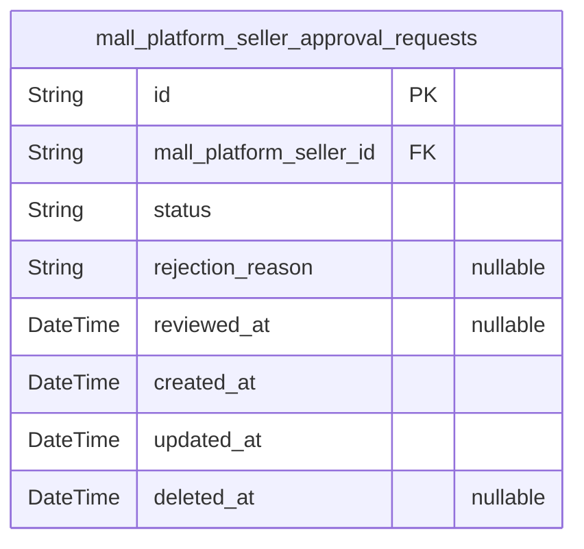

### `mall_platform_seller_approval_requests`

Seller registration review records that track approval status, rejection
reasons, and review timing for each seller onboarding request.

Each record belongs to one seller account and represents a single
submission for administrative review. The table supports pending,
approved, and rejected states, while preserving the reason for rejection
when applicable. It is the canonical live record for seller onboarding
decisions and can be used to reconstruct approval history alongside
related audit data.

Properties as follows:

- `id`: Primary key for the seller approval request record.
- `mall_platform_seller_id`: Seller account's [mall_platform_sellers.id](#mall_platform_sellers).
- `status`
  > Current review status of the seller approval request, such as pending,
  > approved, or rejected.
- `rejection_reason`: Explanation provided when the request is rejected.
- `reviewed_at`: Timestamp when an administrator completed the review.
- `created_at`: Timestamp when the approval request was created.
- `updated_at`: Timestamp when the approval request was last updated.
- `deleted_at`: Timestamp when the record was soft deleted, if ever.

## Categories

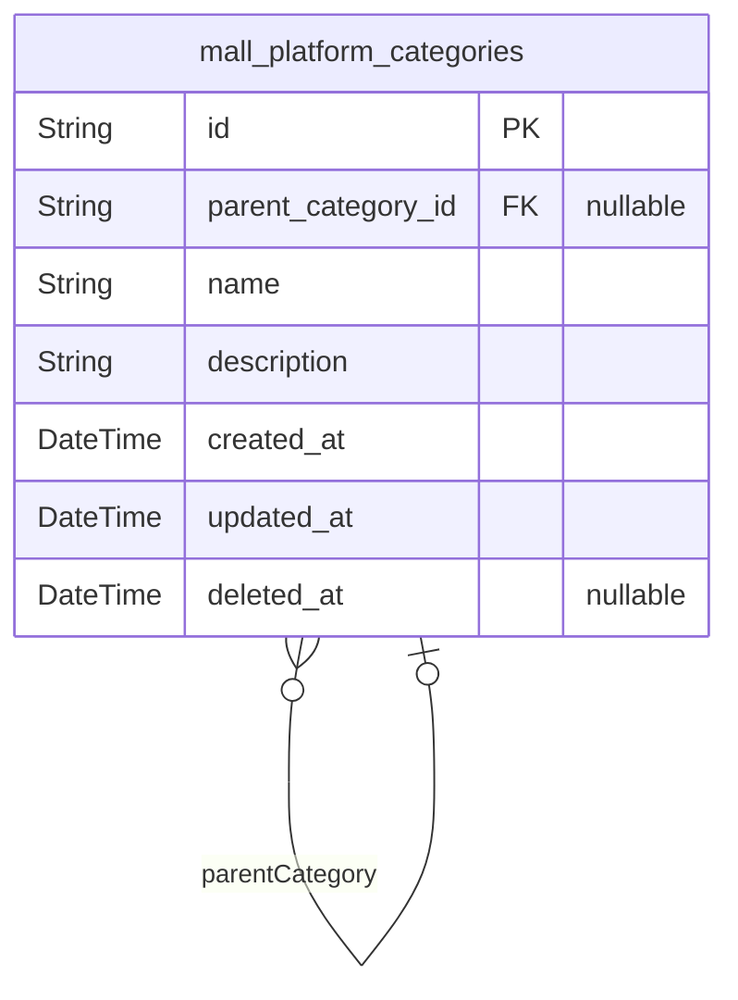

### `mall_platform_categories`

Stores administrator-managed marketplace categories and their direct
subcategories for catalog organization and browsing.

Each category has a name and description, and may optionally belong to
one parent category to represent the one-level hierarchy used in the
marketplace taxonomy. The table supports administrator maintenance of
category records while preserving historical references for products and
browsing workflows.

Properties as follows:

- `id`: Primary Key.
- `parent_category_id`
  > Parent category's [mall_platform_categories.id](#mall_platform_categories). Used to model a
  > direct subcategory within the marketplace taxonomy.
- `name`
  > Category display name used in catalog navigation and product
  > classification.
- `description`
  > Category description shown to help customers and administrators
  > understand the taxonomy.
- `created_at`: Timestamp when the category record was created.
- `updated_at`: Timestamp when the category record was last updated.
- `deleted_at`: Timestamp when the category record was soft-deleted, if applicable.
