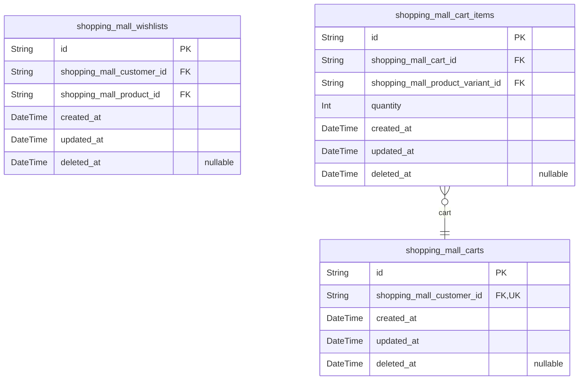
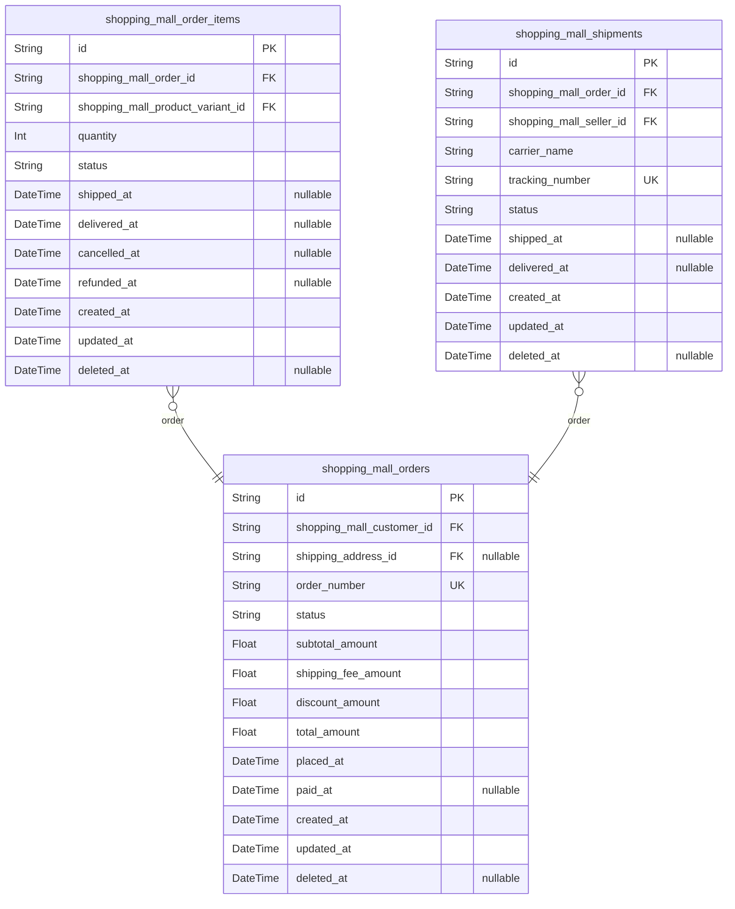
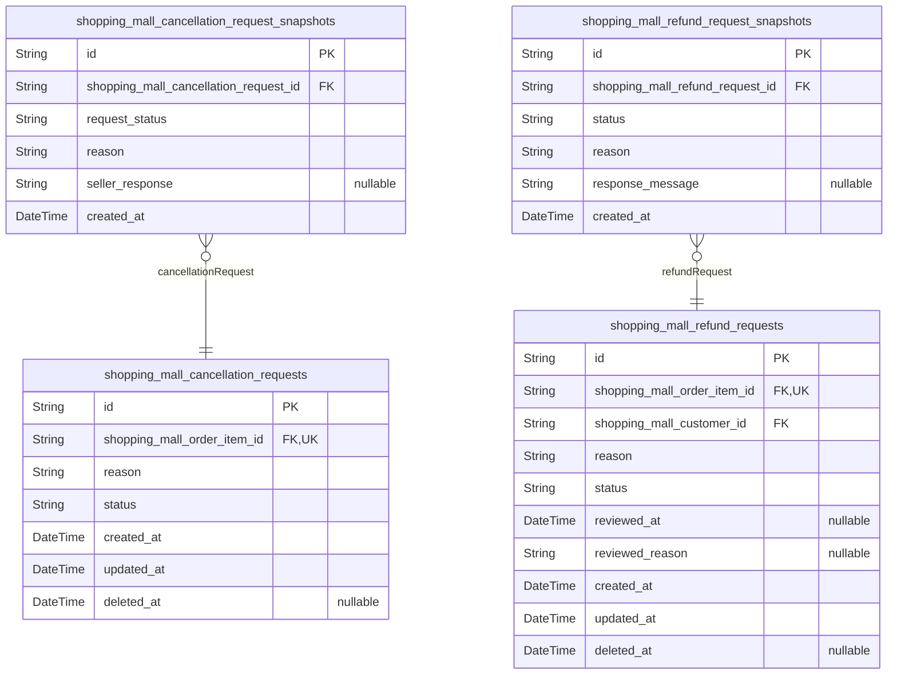
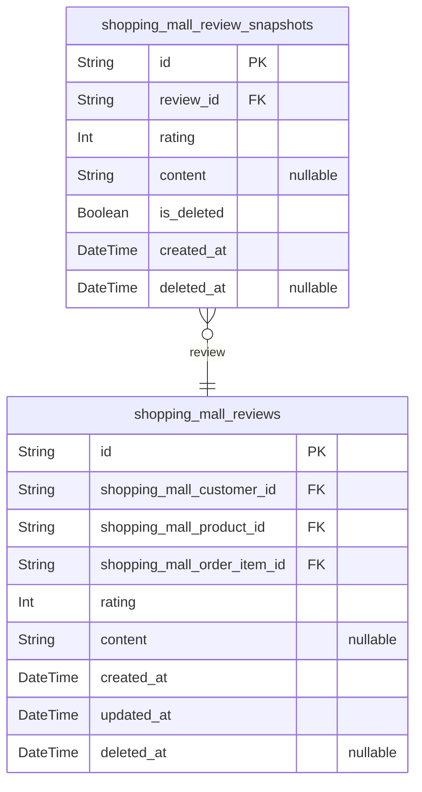
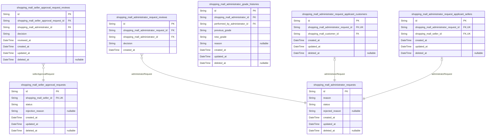
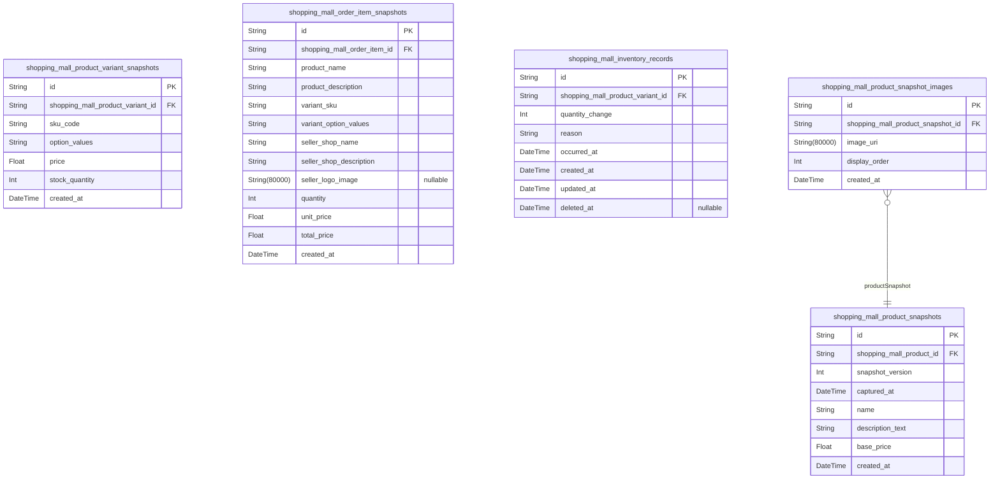
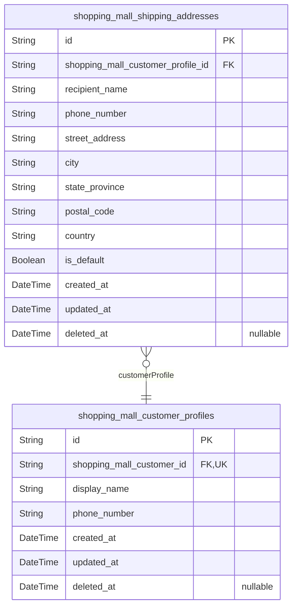
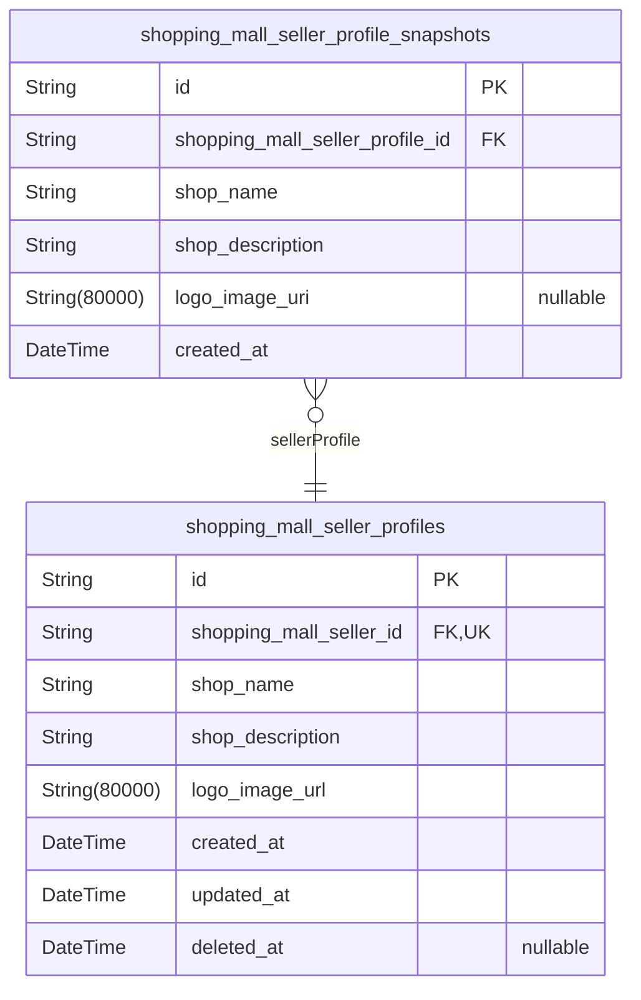
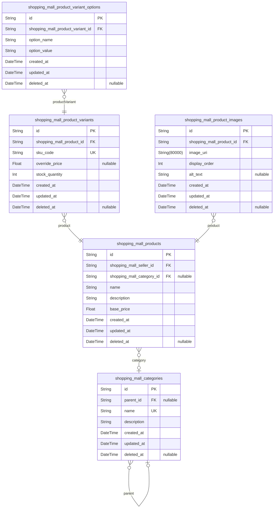

# Prisma Markdown

> Generated by [`prisma-markdown`](https://github.com/samchon/prisma-markdown)

- [Actors](#actors)
- [Shopping](#shopping)
- [Orders](#orders)
- [Claims](#claims)
- [Reviews](#reviews)
- [Administration](#administration)
- [Systematic](#systematic)
- [Customers](#customers)
- [SellerProfiles](#sellerprofiles)
- [Products](#products)

## Actors

```mermaid
erDiagram
"shopping_mall_customers" {
  String id PK
  String email UK
  String password_hash
  String account_status
  DateTime banned_at "nullable"
  DateTime deleted_at "nullable"
  DateTime created_at
  DateTime updated_at
}
"shopping_mall_customer_sessions" {
  String id PK
  String shopping_mall_customer_id FK
  String ip
  String href
  String referrer
  DateTime created_at
  DateTime expired_at
}
"shopping_mall_customer_password_resets" {
  String id PK
  String shopping_mall_customer_id FK
  String token UK
  DateTime expired_at
  DateTime used_at "nullable"
  DateTime created_at
  DateTime updated_at
  DateTime deleted_at "nullable"
}
"shopping_mall_customer_email_verifications" {
  String id PK
  String shopping_mall_customer_id FK
  String token UK
  DateTime sent_at
  DateTime verified_at "nullable"
  DateTime expired_at
  DateTime created_at
  DateTime updated_at
  DateTime deleted_at "nullable"
}
"shopping_mall_sellers" {
  String id PK
  String email UK
  String password_hash
  String approval_status
  String rejection_reason "nullable"
  String account_status
  DateTime approved_at "nullable"
  DateTime rejected_at "nullable"
  DateTime suspended_at "nullable"
  DateTime banned_at "nullable"
  DateTime last_login_at "nullable"
  DateTime created_at
  DateTime updated_at
  DateTime deleted_at "nullable"
}
"shopping_mall_seller_sessions" {
  String id PK
  String shopping_mall_seller_id FK
  String ip
  String href
  String referrer
  DateTime created_at
  DateTime expired_at
}
"shopping_mall_seller_password_resets" {
  String id PK
  String shopping_mall_seller_id FK
  String token UK
  DateTime expired_at
  DateTime used_at "nullable"
  DateTime created_at
  DateTime updated_at
  DateTime deleted_at "nullable"
}
"shopping_mall_seller_email_verifications" {
  String id PK
  String shopping_mall_seller_id FK
  String token UK
  DateTime expired_at
  DateTime verified_at "nullable"
  DateTime created_at
  DateTime updated_at
  DateTime deleted_at "nullable"
}
"shopping_mall_administrators" {
  String id PK
  String email UK
  String password_hash
  String grade
  String account_status
  DateTime created_at
  DateTime updated_at
  DateTime deleted_at "nullable"
}
"shopping_mall_administrator_sessions" {
  String id PK
  String shopping_mall_administrator_id FK
  String ip
  String href
  String referrer
  DateTime created_at
  DateTime expired_at
}
"shopping_mall_administrator_password_resets" {
  String id PK
  String administrator_id FK
  String token UK
  DateTime expired_at
  DateTime used_at "nullable"
  DateTime created_at
  DateTime updated_at
  DateTime deleted_at "nullable"
}
"shopping_mall_customer_sessions" }o--|| "shopping_mall_customers" : customer
"shopping_mall_customer_password_resets" }o--|| "shopping_mall_customers" : customer
"shopping_mall_customer_email_verifications" }o--|| "shopping_mall_customers" : customer
"shopping_mall_seller_sessions" }o--|| "shopping_mall_sellers" : seller
"shopping_mall_seller_password_resets" }o--|| "shopping_mall_sellers" : seller
"shopping_mall_seller_email_verifications" }o--|| "shopping_mall_sellers" : seller
"shopping_mall_administrator_sessions" }o--|| "shopping_mall_administrators" : administrator
"shopping_mall_administrator_password_resets" }o--|| "shopping_mall_administrators" : administrator
```

### `shopping_mall_customers`

Registered customer accounts with email and password credentials, account
security status, and lifecycle control for login access.

This table is the canonical identity record for the customer actor. It
owns authentication credentials and account-level status only; profile
data, sessions, password resets, and email verification records are
handled in separate tables. Order history, reviews, and other marketplace
records reference this model indirectly and are preserved independently
when the customer account is deleted.

Properties as follows:

- `id`: Primary Key.
- `email`: Email address used for customer login and account identity.
- `password_hash`: Hashed password used for authentication.
- `account_status`
  > Customer account state used to control login and administrative
  > restrictions, such as active, banned, or deleted.
- `banned_at`: Timestamp when the account was banned, if applicable.
- `deleted_at`: Timestamp when the customer account was soft-deleted, if applicable.
- `created_at`: Timestamp when the customer account was created.
- `updated_at`: Timestamp when the customer account was last updated.

### `shopping_mall_customer_sessions`

Stores login sessions for customer accounts so authenticated access can
be tracked, expired, and revoked securely.

Each row represents one customer session created during login and
supports auditability for authentication events. The session belongs to
exactly one customer and records connection context plus expiration
metadata for secure session management.

Properties as follows:

- `id`: Primary Key.
- `shopping_mall_customer_id`: Belonged customer's [shopping_mall_customers.id](#shopping_mall_customers).
- `ip`: IP address used when the customer session was created.
- `href`
  > Current request URL or page context associated with the session creation
  > event.
- `referrer`: Referrer URL recorded at session creation time.
- `created_at`: Time when the session was created.
- `expired_at`: Time when the session becomes invalid and can no longer be used.

### `shopping_mall_customer_password_resets`

Stores password reset tokens issued to a customer for account recovery
and password change flows.

Each record belongs to exactly one customer and is used to validate a
temporary reset operation within a limited time window. The table keeps
only the security token state and audit timestamps, while the customer
account remains in [shopping_mall_customers](#shopping_mall_customers).

Properties as follows:

- `id`: Primary Key.
- `shopping_mall_customer_id`
  > Customer account that requested the password reset token. {@link
  > shopping_mall_customers.id}.
- `token`: Secret reset token issued for a single password recovery attempt.
- `expired_at`: Time when the reset token becomes invalid.
- `used_at`: Time when the reset token was consumed, if it has already been used.
- `created_at`: Time when the reset token record was created.
- `updated_at`: Time when the reset token record was last updated.
- `deleted_at`: Time when the reset token record was soft-deleted, if applicable.

### `shopping_mall_customer_email_verifications`

Stores email verification tokens for customer registration confirmation
and email ownership validation.

Each record represents a single verification attempt issued to a customer
account. The table supports the account registration flow, email
revalidation, and secure token expiration handling while keeping
verification history separate from the customer identity record.

Properties as follows:

- `id`: Primary Key.
- `shopping_mall_customer_id`: Belonged customer's [shopping_mall_customers.id](#shopping_mall_customers).
- `token`: Secure verification token used to confirm the customer's email ownership.
- `sent_at`: Timestamp when the verification email was issued to the customer.
- `verified_at`
  > Timestamp when the email was successfully verified. Null until
  > verification completes.
- `expired_at`: Timestamp when the verification token expires and can no longer be used.
- `created_at`: Timestamp when this verification record was created.
- `updated_at`: Timestamp when this verification record was last updated.
- `deleted_at`: Timestamp when this verification record was soft-deleted, if applicable.

### `shopping_mall_sellers`

Registered seller accounts with email/password credentials, approval
workflow state, and account security status.

This table is the canonical identity record for seller actors in the
marketplace. It stores only the intrinsic account data needed for
authentication and lifecycle control, while seller profile data,
sessions, password resets, email verification, and approval review
history are managed in separate child tables.

The seller account can be used for login, approval gating, and
administrative moderation. Historical and dependent business artifacts
are preserved elsewhere so the account record remains normalized and
stable over time.

Properties as follows:

- `id`: Primary Key.
- `email`: Seller login email address used for authentication and account lookup.
- `password_hash`: Hashed seller password used for authentication.
- `approval_status`
  > Current administrative approval state for the seller account, such as
  > pending, approved, or rejected.
- `rejection_reason`: Reason provided when the seller account is rejected by an administrator.
- `account_status`
  > Security and access status of the seller account, such as active,
  > suspended, or banned.
- `approved_at`: Timestamp when the seller account was approved, if approval has occurred.
- `rejected_at`: Timestamp when the seller account was rejected, if rejection has occurred.
- `suspended_at`
  > Timestamp when the seller account was suspended, if the account is
  > currently or previously suspended.
- `banned_at`
  > Timestamp when the seller account was banned, if the account is currently
  > or previously banned.
- `last_login_at`: Timestamp of the most recent successful seller login.
- `created_at`: Timestamp when the seller account was created.
- `updated_at`: Timestamp when the seller account was last updated.
- `deleted_at`: Timestamp when the seller account was soft-deleted, if applicable.

### `shopping_mall_seller_sessions`

JWT session tokens for seller login sessions, including refresh token
tracking and revocation support. Each record belongs to exactly one
[shopping_mall_sellers](#shopping_mall_sellers) account and stores the connection context
needed to audit and manage seller authentication sessions.

This table is a session-level audit entity rather than business data. It
supports login persistence, revocation, and security review for seller
accounts while keeping the seller identity in the parent actor table.

Properties as follows:

- `id`: Primary Key.
- `shopping_mall_seller_id`: Belonged seller's [shopping_mall_sellers.id](#shopping_mall_sellers).
- `ip`: IP address recorded when the seller session was created.
- `href`: Current page or origin URL associated with the seller session.
- `referrer`: Referrer URL recorded for the seller session.
- `created_at`: Timestamp when the seller session was created.
- `expired_at`: Timestamp when the seller session expires and becomes invalid.

### `shopping_mall_seller_password_resets`

Stores password reset tokens issued for [shopping_mall_sellers](#shopping_mall_sellers)
during account recovery and password change flows. Each record represents
one reset request, including the token used to verify the request, its
expiration, and whether it has already been consumed. This table is a
seller-owned authentication support entity and is managed as part of the
seller account lifecycle.

Properties as follows:

- `id`: Primary Key.
- `shopping_mall_seller_id`: Owning seller's [shopping_mall_sellers.id](#shopping_mall_sellers).
- `token`: Secure password reset token used to validate the recovery request.
- `expired_at`: Timestamp when this reset token becomes invalid.
- `used_at`: Timestamp when the reset token was consumed, if it has already been used.
- `created_at`: Timestamp when the password reset request was created.
- `updated_at`: Timestamp when the password reset request was last updated.
- `deleted_at`: Timestamp when the password reset request was soft-deleted, if applicable.

### `shopping_mall_seller_email_verifications`

Stores email verification tokens issued for seller registration
confirmation and seller email ownership validation. Each record belongs
to one seller account and tracks the token lifecycle so verification
attempts can be confirmed, expired, or invalidated without mixing
credential data into the seller identity table.

This table supports seller onboarding and email re-verification flows. It
preserves a clean, normalized history of verification attempts while
referencing [shopping_mall_sellers.id](#shopping_mall_sellers) for ownership.

Properties as follows:

- `id`: Primary Key.
- `shopping_mall_seller_id`
  > Seller account that owns this email verification token. {@link
  > shopping_mall_sellers.id}.
- `token`
  > Unique email verification token used to confirm the seller's email
  > address.
- `expired_at`: Time when this verification token expires and can no longer be used.
- `verified_at`
  > Time when the seller email address was successfully verified. Null until
  > verification is completed.
- `created_at`: Record creation timestamp.
- `updated_at`: Record update timestamp.
- `deleted_at`: Soft delete timestamp for invalidated verification records.

### `shopping_mall_administrators`

Registered administrator accounts with email and password credentials,
role grade, and account security state. This table is the canonical
identity record for platform administrators, supporting login,
grade-based authorization, and account-level suspension or ban status.

Administrator session tracking, password recovery, and governance request
workflows are stored in separate tables. This separation keeps the actor
record focused on authentication and authorization while preserving
normalization and clear ownership boundaries.

Properties as follows:

- `id`: Primary Key.
- `email`
  > Administrator login email address used for authentication and account
  > lookup.
- `password_hash`: Hashed password used for administrator authentication.
- `grade`
  > Administrator privilege level. Regular administrators can manage platform
  > operations, while super administrators can also promote or demote
  > administrator grades.
- `account_status`
  > Security state of the administrator account, such as active, suspended,
  > or banned, used to control login access.
- `created_at`: Timestamp when the administrator account was created.
- `updated_at`: Timestamp when the administrator account was last updated.
- `deleted_at`: Timestamp when the administrator account was soft-deleted, if applicable.

### `shopping_mall_administrator_sessions`

JWT session tokens for administrator login sessions, including refresh
token tracking and revocation support.

This table stores one authentication session per administrator login
event and records the connection context needed for security auditing,
logout, and session expiration handling. It belongs to {@link
shopping_mall_administrators} through a child-to-parent relationship and
does not contain business domain data.

Properties as follows:

- `id`: Primary Key.
- `shopping_mall_administrator_id`: Belonged administrator's [shopping_mall_administrators.id](#shopping_mall_administrators).
- `ip`: IP address used when the administrator session was created.
- `href`: Current request URL or session entry point recorded at login time.
- `referrer`: Referrer URL recorded with the administrator session context.
- `created_at`: Session creation timestamp.
- `expired_at`
  > Session expiration timestamp used to revoke or invalidate the login
  > session.

### `shopping_mall_administrator_password_resets`

Password reset tokens for administrator account recovery and password
change flows. Each record belongs to one administrator account and stores
the recovery token lifecycle so password reset requests can be validated,
expired, and audited securely.

This table is a child of [shopping_mall_administrators](#shopping_mall_administrators) and does
not store any reusable identity data. It exists only to support secure
password reset operations for administrator accounts.

Properties as follows:

- `id`: Primary Key.
- `administrator_id`
  > Administrator account that owns this password reset token. {@link
  > shopping_mall_administrators.id}.
- `token`
  > Secret password reset token used to authorize an administrator password
  > recovery or change request.
- `expired_at`
  > Time when this password reset token becomes invalid and can no longer be
  > used.
- `used_at`
  > Time when the token was successfully consumed for a password reset
  > request. Null until the token is used.
- `created_at`: Time when this password reset token record was created.
- `updated_at`: Time when this password reset token record was last updated.
- `deleted_at`
  > Time when this token record was soft deleted, if ever removed from active
  > use.

## Shopping

### `shopping_mall_wishlists`

Stores each customer’s saved product interests for later reference. Each
record links one customer to one product so wishlist state stays
normalized and product-level rather than variant-level.

The wishlist is customer-owned pre-purchase intent data and is kept
separate from the cart because it does not represent a checkout-ready
selection. It supports browsing and later recall of products a customer
wants to revisit, while preserving referential integrity to {@link
shopping_mall_customers.id} and [shopping_mall_products.id](#shopping_mall_products).

Properties as follows:

- `id`: Primary Key.
- `shopping_mall_customer_id`
  > Customer who owns this wishlist entry. References {@link
  > shopping_mall_customers.id}.
- `shopping_mall_product_id`
  > Product saved by the customer for later reference. References {@link
  > shopping_mall_products.id}.
- `created_at`: Timestamp when the wishlist entry was created.
- `updated_at`: Timestamp when the wishlist entry was last updated.
- `deleted_at`: Timestamp when the wishlist entry was soft deleted, if applicable.

### `shopping_mall_carts`

Stores each customer's active pre-order basket and checkout preparation
state. The cart is a customer-owned container for selected variant items
and is separate from completed orders.

Each customer has at most one active cart, and the cart itself does not
store line items, totals, or product details. Those belong to {@link
shopping_mall_cart_items} and are managed as child records so the cart
remains normalized and focused on ownership and lifecycle only.

Properties as follows:

- `id`: Primary Key.
- `shopping_mall_customer_id`
  > Owning customer's [shopping_mall_customers.id](#shopping_mall_customers). Each customer can
  > have only one active cart.
- `created_at`: Timestamp when this cart record was created.
- `updated_at`: Timestamp when this cart record was last updated.
- `deleted_at`: Timestamp when this cart record was soft-deleted, if applicable.

### `shopping_mall_cart_items`

Stores the individual product-variant lines that belong to a customer's
cart. Each record represents one selected variant with its chosen
quantity, supporting editable pre-order shopping state before checkout.

The table references the owning [shopping_mall_carts](#shopping_mall_carts) record and
the selected [shopping_mall_product_variants](#shopping_mall_product_variants) record, but it does
not duplicate product details such as name, price, seller, or options.
Those values are resolved through the related variant and product tables
so the cart remains normalized and current while the customer is still
shopping.

Properties as follows:

- `id`: Primary Key.
- `shopping_mall_cart_id`: Owning cart's [shopping_mall_carts.id](#shopping_mall_carts).
- `shopping_mall_product_variant_id`: Selected product variant's [shopping_mall_product_variants.id](#shopping_mall_product_variants).
- `quantity`
  > Number of units of the selected product variant currently intended for
  > purchase.
- `created_at`: Timestamp when the cart item was created.
- `updated_at`: Timestamp when the cart item was last updated.
- `deleted_at`
  > Timestamp when the cart item was soft deleted, if removed from the cart
  > history.

## Orders

### `shopping_mall_orders`

Top-level purchase records for a customer's successful checkout. This
table stores the committed order header, including the order number,
owning customer, monetary totals, lifecycle status, and preserved
shipping destination context used for order history, seller fulfillment,
and legal record keeping. It intentionally does not store line items or
item snapshots, which are handled by [shopping_mall_order_items](#shopping_mall_order_items)
and related snapshot tables in other schema calls.

Properties as follows:

- `id`: Primary Key.
- `shopping_mall_customer_id`
  > Owning customer's [shopping_mall_customers.id](#shopping_mall_customers). The order remains
  > associated with the purchaser for history, support, and dispute
  > resolution.
- `shipping_address_id`
  > Selected shipping address's [shopping_mall_shipping_addresses.id](#shopping_mall_shipping_addresses)
  > used for this order at checkout time. The reference supports fulfillment
  > context while preserving the customer's address ownership model.
- `order_number`
  > Human-readable order identifier shown to customers, sellers, and
  > administrators. This value is generated for external reference and
  > support workflows.
- `status`
  > Overall order lifecycle state derived from its items and fulfillment
  > progress. Expected business states include paid, shipped, delivered,
  > cancelled, refunded, and partially_completed.
- `subtotal_amount`
  > Total amount before shipping fees, discounts, and other adjustments. This
  > reflects the monetary value of the purchased items at checkout time.
- `shipping_fee_amount`
  > Shipping charge applied to the order at checkout time. Stored separately
  > from item totals to preserve the committed transaction amount.
- `discount_amount`
  > Total discount applied to the order at checkout time. This is stored as a
  > positive amount representing the reduction from the gross total.
- `total_amount`
  > Final amount charged for the order after applying shipping fees and
  > discounts. This is the authoritative order total used for history and
  > reporting.
- `placed_at`
  > Timestamp when the checkout was successfully completed and the order was
  > created.
- `paid_at`
  > Timestamp when payment was successfully confirmed for the order. Nullable
  > only if the order can exist before payment confirmation in the
  > integration flow.
- `created_at`: Record creation timestamp.
- `updated_at`: Record last update timestamp.
- `deleted_at`
  > Soft deletion timestamp for administrative or retention workflows when an
  > order record is logically removed from active views while historical
  > preservation remains possible.

### `shopping_mall_order_items`

Purchased product-variant line items within an order. Each record
represents one specific variant purchase, the purchased quantity, and the
current fulfillment state for that line. The table keeps only the live
transactional references and item lifecycle fields; preserved
purchase-state details such as product, variant, and seller profile
snapshots are stored in the dedicated snapshot table {@link
shopping_mall_order_item_snapshots}.

Properties as follows:

- `id`: Primary Key.
- `shopping_mall_order_id`: Belonged order's [shopping_mall_orders.id](#shopping_mall_orders).
- `shopping_mall_product_variant_id`: Purchased variant's [shopping_mall_product_variants.id](#shopping_mall_product_variants).
- `quantity`: Number of units purchased for this variant in the order line.
- `status`
  > Current fulfillment state of the order item. Expected values are paid,
  > shipped, delivered, cancelled, or refunded.
- `shipped_at`: Timestamp when this item was marked shipped through a shipment record.
- `delivered_at`
  > Timestamp when this item was marked delivered or auto-completed as
  > delivered.
- `cancelled_at`: Timestamp when this item was cancelled.
- `refunded_at`: Timestamp when this item was refunded.
- `created_at`: Record creation timestamp.
- `updated_at`: Record last update timestamp.
- `deleted_at`: Soft delete timestamp for administrative or lifecycle archiving use.

### `shopping_mall_shipments`

Seller-specific fulfillment groups for an order, including carrier and
tracking details for the order items shipped together.

Each shipment belongs to exactly one order and one seller, and is used to
group one or more order items that are dispatched together under the same
tracking context. The table stores the shipment lifecycle state and
delivery timestamps so customers, sellers, and administrators can follow
fulfillment progress without duplicating order item data.

Properties as follows:

- `id`: Primary Key.
- `shopping_mall_order_id`: Belonged order's [shopping_mall_orders.id](#shopping_mall_orders).
- `shopping_mall_seller_id`: Belonged seller's [shopping_mall_sellers.id](#shopping_mall_sellers).
- `carrier_name`: Name of the shipping carrier used for this shipment.
- `tracking_number`: Tracking number or code assigned by the carrier for package lookup.
- `status`
  > Current shipment state such as created, shipped, delivered, or cancelled,
  > used to reflect fulfillment progress.
- `shipped_at`
  > Timestamp when the shipment was handed over to the carrier or marked as
  > shipped.
- `delivered_at`: Timestamp when the shipment was confirmed delivered.
- `created_at`: Record creation timestamp.
- `updated_at`: Record last update timestamp.
- `deleted_at`: Soft delete timestamp for shipment records that are no longer active.

## Claims

### `shopping_mall_cancellation_requests`

Stores a customer's cancellation request for a single order item. The
record keeps the current cancellation workflow state and the reason
submitted by the customer so sellers and administrators can review active
requests while the immutable decision history is preserved in {@link
shopping_mall_cancellation_request_snapshots}.

Properties as follows:

- `id`: Primary Key.
- `shopping_mall_order_item_id`
  > Order item that this cancellation request belongs to. References {@link
  > shopping_mall_order_items.id}.
- `reason`: Customer-provided reason for requesting cancellation of the order item.
- `status`
  > Current cancellation request status used to track the seller review
  > lifecycle.
- `created_at`: Timestamp when the cancellation request was created.
- `updated_at`: Timestamp when the cancellation request was last updated.
- `deleted_at`
  > Timestamp when the cancellation request was soft deleted, if ever removed
  > from active views.

### `shopping_mall_cancellation_request_snapshots`

Stores immutable historical snapshots of customer cancellation requests
for order items. Each record preserves the request state at the moment of
change, including the parent request reference, request status, reason,
and seller response context so the full cancellation history can be
reviewed later for audit and dispute resolution.

This table is append-only and represents a point-in-time record rather
than the live request. It exists to preserve the evolving state of {@link
shopping_mall_cancellation_requests} even after the active request
changes or is resolved.

Properties as follows:

- `id`: Primary Key.
- `shopping_mall_cancellation_request_id`
  > Parent cancellation request whose state is preserved in this snapshot.
  > References [shopping_mall_cancellation_requests.id](#shopping_mall_cancellation_requests).
- `request_status`
  > Cancellation request status at the time this snapshot was created, such
  > as pending, approved, or rejected.
- `reason`
  > Customer-provided reason captured from the cancellation request at the
  > time of snapshot creation.
- `seller_response`
  > Seller decision or response text preserved from the request state when
  > applicable. This records the review outcome context at the moment of
  > change.
- `created_at`: Timestamp when this immutable snapshot record was created.

### `shopping_mall_refund_requests`

Stores customer refund requests for individual delivered order items,
including the refund reason and current request status.

Each record belongs to one purchased order item and one customer, and it
represents the active refund claim that sellers review. Historical
changes to the request are preserved separately in {@link
shopping_mall_refund_request_snapshots}, so this table only keeps the
current live state needed for workflows and moderation.

Properties as follows:

- `id`: Primary Key.
- `shopping_mall_order_item_id`: Refund-requested order item's [shopping_mall_order_items.id](#shopping_mall_order_items).
- `shopping_mall_customer_id`: Requesting customer's [shopping_mall_customers.id](#shopping_mall_customers).
- `reason`: Customer-provided reason for requesting the refund.
- `status`
  > Current workflow status of the refund request, such as pending, approved,
  > rejected, or cancelled.
- `reviewed_at`
  > Timestamp when the request was last reviewed by the seller or
  > administrator.
- `reviewed_reason`: Reason provided when the request was approved or rejected.
- `created_at`: Record creation timestamp.
- `updated_at`: Record last update timestamp.
- `deleted_at`
  > Soft delete timestamp used to preserve request history while hiding
  > inactive records.

### `shopping_mall_refund_request_snapshots`

Immutable point-in-time snapshots of refund request state changes. Each
record preserves the refund request's status, reason, and response
context at the moment a change was recorded so later audits and dispute
reviews can reconstruct the full history of the request.

This table is append-only and belongs to {@link
shopping_mall_refund_requests}. It stores historical state only and must
not be edited in place. The parent refund request remains the live
record, while this table preserves each version of that record over time.

Properties as follows:

- `id`: Primary Key.
- `shopping_mall_refund_request_id`
  > Parent refund request's [shopping_mall_refund_requests.id](#shopping_mall_refund_requests) whose
  > historical state is being preserved in this snapshot.
- `status`
  > Refund request status captured at the time this snapshot was created,
  > such as pending, approved, or rejected.
- `reason`
  > Refund reason text preserved from the refund request at the time of the
  > snapshot.
- `response_message`
  > Seller or administrator response message preserved for audit and dispute
  > review when the request was decided.
- `created_at`: Timestamp when this historical snapshot row was recorded.

## Reviews

### `shopping_mall_reviews`

Stores each customer review for a purchased product and order item.

The table keeps the active review record with its rating, optional text
content, and visibility state for soft deletion. It is linked to the
customer who wrote the review, the purchased product, and the
corresponding order item so review eligibility and ownership can be
validated without storing redundant product or seller data. Historical
edits and deleted-state history are preserved in {@link
shopping_mall_review_snapshots}, while this table represents the current
review state used for product detail pages, moderation, and newest-first
review listing.

Properties as follows:

- `id`: Primary Key.
- `shopping_mall_customer_id`: Authoring customer's [shopping_mall_customers.id](#shopping_mall_customers).
- `shopping_mall_product_id`: Reviewed product's [shopping_mall_products.id](#shopping_mall_products).
- `shopping_mall_order_item_id`
  > Purchased order item's [shopping_mall_order_items.id](#shopping_mall_order_items) that
  > qualified the review.
- `rating`: Star rating from 1 to 5 given by the customer.
- `content`: Optional review body written by the customer.
- `created_at`: Timestamp when the review was created.
- `updated_at`: Timestamp when the review was last updated.
- `deleted_at`
  > Timestamp when the review was soft deleted, if it has been removed from
  > active display.

### `shopping_mall_review_snapshots`

Immutable historical snapshots of customer reviews. Each record preserves
the state of a review at a specific moment so edits and deletions can be
audited, moderated, and displayed for dispute resolution even after the
active review changes.

This table belongs to [shopping_mall_reviews](#shopping_mall_reviews) as append-only
history and must never be used as the live review record. It stores the
review content and metadata that can change over time, while the current
review state remains in the parent review table.

Properties as follows:

- `id`: Primary Key.
- `review_id`: Historical snapshot of [shopping_mall_reviews.id](#shopping_mall_reviews).
- `rating`: Snapshot of the review star rating at the time this version was recorded.
- `content`: Snapshot of the review text content at the time this version was recorded.
- `is_deleted`
  > Whether the review was marked deleted at the time this snapshot was
  > created.
- `created_at`: Timestamp when this snapshot record was created.
- `deleted_at`: Timestamp when this snapshot record was logically deleted, if applicable.

## Administration

### `shopping_mall_seller_approval_requests`

Stores seller registration approval requests submitted for administrative
review. Each record represents one seller's current application state,
including the applicant reference, the moderation status, and any
rejection reason, while the immutable review history is stored separately
in [shopping_mall_seller_approval_request_reviews](#shopping_mall_seller_approval_request_reviews).

This table is the canonical request header for seller onboarding
moderation. It supports queue browsing, status tracking, and lifecycle
management for pending, approved, and rejected applications without
duplicating per-review audit records.

Properties as follows:

- `id`: Primary Key.
- `shopping_mall_seller_id`: Applicant seller's [shopping_mall_sellers.id](#shopping_mall_sellers).
- `status`
  > Current moderation status of the seller approval request, such as
  > pending, approved, or rejected.
- `rejection_reason`
  > Reason provided when the request is rejected. Null while the request is
  > pending or approved.
- `created_at`: Timestamp when the approval request was created.
- `updated_at`: Timestamp when the approval request was last updated.
- `deleted_at`: Timestamp when the approval request was soft-deleted, if applicable.

### `shopping_mall_seller_approval_request_reviews`

Stores immutable review decisions for seller approval requests. Each row
records one administrative review event, including the reviewing
administrator, the decision outcome, and the time the decision was made.

This table functions as a historical audit trail for {@link
shopping_mall_seller_approval_requests} and preserves every review action
independently so the approval process can be traced after the current
request state changes.

Properties as follows:

- `id`: Primary Key.
- `shopping_mall_seller_approval_request_id`
  > Seller approval request being reviewed. References {@link
  > shopping_mall_seller_approval_requests.id}.
- `shopping_mall_administrator_id`
  > Administrator who performed the review decision. References {@link
  > shopping_mall_administrators.id}.
- `decision`
  > Review outcome for the seller approval request, such as approved or
  > rejected.
- `reviewed_at`: Timestamp when the review decision was made.
- `created_at`: Record creation timestamp.
- `updated_at`: Record update timestamp.
- `deleted_at`
  > Soft delete timestamp for audit-preserving removal of the active row, if
  > ever used.

### `shopping_mall_administrator_requests`

Administrator application requests submitted for super-administrator
review. This table stores the canonical request record, the applicant
type-specific linkage, the submitted reason, and the current request
status so the platform can manage pending applications, approvals, and
rejections as independent business records.

The request row is the current-state entity for the application
lifecycle. Applicant ownership must be modeled through a normalized
subtype structure instead of multiple nullable actor foreign keys, while
decision history is stored separately in {@link
shopping_mall_administrator_request_reviews}.

Properties as follows:

- `id`: Primary Key.
- `reason`: Reason provided by the applicant for becoming an administrator.
- `status`: Current application status, such as pending, approved, or rejected.
- `rejected_reason`
  > Reason provided when the request is rejected. Nullable because it exists
  > only for rejected applications.
- `created_at`: Timestamp when the request was created.
- `updated_at`: Timestamp when the request was last updated.
- `deleted_at`
  > Timestamp when the request was soft-deleted, if ever removed from active
  > use.

### `shopping_mall_administrator_request_reviews`

Stores the immutable review history for administrator application
requests. Each row records a super administrator's decision on a specific
administrator request, including whether it was approved or rejected and
when the decision was made.

This table is append-only and is used for auditability, dispute review,
and governance traceability. It references {@link
shopping_mall_administrator_requests.id} for the request under review and
[shopping_mall_administrators.id](#shopping_mall_administrators) for the reviewing super
administrator.

Properties as follows:

- `id`: Primary Key.
- `shopping_mall_administrator_request_id`
  > Administrator application request being reviewed. References {@link
  > shopping_mall_administrator_requests.id}.
- `shopping_mall_administrator_id`
  > Super administrator who performed the review decision. References {@link
  > shopping_mall_administrators.id}.
- `decision`
  > Review decision outcome for the administrator application request.
  > Expected values are approve or reject.
- `created_at`: Timestamp when the review decision was recorded.

### `shopping_mall_administrator_grade_histories`

Immutable audit history for administrator grade changes, including
promotions and demotions between regular administrator and super
administrator.

Each record preserves who was affected, who performed the change, what
the previous grade was, what the new grade became, and when the change
occurred. This supports accountability, governance review, and historical
reconstruction of administrator privilege changes through {@link
shopping_mall_administrators}.

Properties as follows:

- `id`: Primary Key.
- `shopping_mall_administrator_id`
  > Administrator whose grade changed. References {@link
  > shopping_mall_administrators.id}.
- `performed_by_administrator_id`
  > Administrator who performed the grade change. References {@link
  > shopping_mall_administrators.id}.
- `previous_grade`
  > Administrator grade before the change. Expected values are the platform's
  > administrator grades, such as regular administrator or super
  > administrator.
- `new_grade`
  > Administrator grade after the change. Expected values are the platform's
  > administrator grades, such as regular administrator or super
  > administrator.
- `reason`
  > Human-readable reason or note explaining why the administrator grade was
  > changed.
- `created_at`: Timestamp when this grade change record was created.
- `updated_at`: Timestamp when this grade change record was last updated.
- `deleted_at`
  > Soft deletion timestamp. This table is an audit history record and is
  > expected to remain retained, so this value is normally unused.

### `shopping_mall_administrator_request_applicant_customers`

Normalized applicant link table for administrator requests submitted by
customers. Each record connects one administrator request to the customer
who submitted it, allowing the main administrator request table to remain
free of multiple nullable actor foreign keys.

This table is a dependent subtype record used only for
customer-originated administrator applications. It preserves referential
integrity between [shopping_mall_administrator_requests](#shopping_mall_administrator_requests) and {@link
shopping_mall_customers} while keeping the ownership model fully
normalized.

Properties as follows:

- `id`: Primary Key.
- `shopping_mall_administrator_request_id`
  > Administrator request being submitted by the customer. {@link
  > shopping_mall_administrator_requests.id}.
- `shopping_mall_customer_id`
  > Customer who submitted the administrator request. {@link
  > shopping_mall_customers.id}.
- `created_at`: Timestamp when the applicant link record was created.
- `updated_at`: Timestamp when the applicant link record was last updated.
- `deleted_at`
  > Timestamp when the applicant link record was soft deleted, if ever
  > removed from active use.

### `shopping_mall_administrator_request_applicant_sellers`

Normalized applicant link table for administrator requests submitted by
sellers. This table stores which seller account is associated with a
given administrator request, allowing the main administrator request
record to remain free of multiple nullable actor foreign keys.

The record exists only to connect {@link
shopping_mall_administrator_requests} with [shopping_mall_sellers](#shopping_mall_sellers)
in a 1:1 applicant structure for seller-submitted administrator
applications. It supports the governance workflow while keeping the
request entity normalized and unambiguous.

Properties as follows:

- `id`: Primary Key.
- `shopping_mall_administrator_request_id`
  > Referenced administrator request {@link
  > shopping_mall_administrator_requests.id} for this seller applicant link.
- `shopping_mall_seller_id`
  > Referenced seller account [shopping_mall_sellers.id](#shopping_mall_sellers) that submitted
  > the administrator request.
- `created_at`: Timestamp when this seller applicant link record was created.
- `updated_at`: Timestamp when this seller applicant link record was last updated.
- `deleted_at`
  > Timestamp when this seller applicant link record was soft deleted, if
  > applicable.

## Systematic

### `shopping_mall_product_snapshots`

Immutable point-in-time snapshots of product state captured whenever a
product is edited. This table preserves the product's historical business
state for audit, dispute resolution, and change review, including the
product identity and the values that were current at the time of capture.
Related product image state is preserved through separate normalized
snapshot child records rather than an array or JSON field.

Properties as follows:

- `id`: Primary Key.
- `shopping_mall_product_id`
  > Product whose state was captured in this snapshot. References {@link
  > shopping_mall_products.id}.
- `snapshot_version`
  > Monotonic version number of this product snapshot for the related
  > product, used to order historical captures.
- `captured_at`
  > Timestamp when the product state was captured into this immutable
  > snapshot.
- `name`: Product name at the time of the snapshot.
- `description_text`: Product description at the time of the snapshot.
- `base_price`: Base price of the product at the time of the snapshot.
- `created_at`: Timestamp when this snapshot record was created.

### `shopping_mall_product_variant_snapshots`

Immutable point-in-time records of product variant state. This table
preserves the exact variant data at the moment a change occurred so
historical product listing, pricing, and availability can be reviewed
later.

Each record captures the snapshot version of a single product variant,
including SKU, option values, price, and stock-related attributes as they
existed at that time. These records are append-only audit artifacts and
are used for product history, dispute resolution, and restored view
generation, without mutating prior versions.

Properties as follows:

- `id`: Primary Key.
- `shopping_mall_product_variant_id`
  > Referenced product variant's [shopping_mall_product_variants.id](#shopping_mall_product_variants).
  > Identifies which variant this historical snapshot belongs to.
- `sku_code`: Snapshot of the variant SKU code at the time the snapshot was created.
- `option_values`
  > Atomic snapshot text of the variant option values at that point in time,
  > such as persisted labels for color and size.
- `price`
  > Snapshot of the variant price at the time of change. Preserves the
  > purchasable amount that applied to this version.
- `stock_quantity`
  > Snapshot of the variant stock quantity recorded for historical state
  > inspection.
- `created_at`: Timestamp when this immutable snapshot was created.

### `shopping_mall_order_item_snapshots`

Immutable point-in-time records of purchased order item state. This table
preserves the checkout-time business context for {@link
shopping_mall_order_items}, including the purchased product, selected
variant, seller storefront identity, quantity, and pricing details
exactly as they existed when the order was placed.

The record is append-only and serves as an audit artifact for historical
review, dispute resolution, and post-purchase integrity checks. It is
designed to outlive changes or deletion in the active product, variant,
or seller profile tables so that past purchases remain understandable
even after the source entities evolve.

Properties as follows:

- `id`: Primary Key.
- `shopping_mall_order_item_id`
  > Purchased order item's [shopping_mall_order_items.id](#shopping_mall_order_items) whose
  > checkout-time state is preserved by this snapshot.
- `product_name`: Snapshot of the product name at the time of purchase.
- `product_description`: Snapshot of the product description at the time of purchase.
- `variant_sku`: Snapshot of the purchased variant SKU code at the time of purchase.
- `variant_option_values`
  > Snapshot of the purchased variant option values as displayed at checkout.
  > This is stored as a normalized textual representation of the historical
  > option combination, not as a structured JSON field.
- `seller_shop_name`: Snapshot of the seller storefront name at the time of purchase.
- `seller_shop_description`: Snapshot of the seller storefront description at the time of purchase.
- `seller_logo_image`: Snapshot of the seller logo image reference at the time of purchase.
- `quantity`
  > Quantity of the variant purchased in the order item at the time the
  > snapshot was created.
- `unit_price`: Unit price charged for the purchased variant at the time of checkout.
- `total_price`
  > Total price for the order item at the time of checkout, derived from
  > quantity and unit price for historical preservation.
- `created_at`: Timestamp when this historical snapshot record was created.

### `shopping_mall_inventory_records`

Running inventory movement history for {@link
shopping_mall_product_variants}.

Each record stores a single atomic stock movement event for one product
variant, including the signed quantity change, the business reason for
the movement, and the event timestamp used to reconstruct current stock.
Current stock is calculated from the accumulated movement history rather
than stored directly in this table.

Properties as follows:

- `id`: Primary Key.
- `shopping_mall_product_variant_id`
  > Referenced product variant's [shopping_mall_product_variants.id](#shopping_mall_product_variants).
  > This identifies which variant received the stock movement.
- `quantity_change`
  > Signed inventory delta for the movement. Positive values represent stock
  > increases such as restocking or stock restoration, while negative values
  > represent stock decreases such as sales or manual deductions.
- `reason`
  > Business reason for the inventory movement, such as order deduction,
  > restock, cancellation restoration, refund restoration, or manual
  > adjustment.
- `occurred_at`
  > Timestamp when the inventory movement actually occurred in business
  > terms. This is used to reconstruct stock history in event order.
- `created_at`: Record creation timestamp for auditing and chronological listing.
- `updated_at`
  > Record update timestamp for auditing administrative corrections or system
  > maintenance edits.
- `deleted_at`
  > Soft delete timestamp for retention-aware cleanup. Inventory history is
  > typically preserved, so this should remain nullable.

### `shopping_mall_product_snapshot_images`

Normalized child records that preserve the image state of a product at
the moment a product snapshot was captured. Each row stores exactly one
image reference and its display order within the snapshot, allowing the
system to reconstruct the full product image set for historical review
and dispute resolution.

This table belongs to [shopping_mall_product_snapshots](#shopping_mall_product_snapshots) as an
immutable audit child and must not store product-level attributes such as
name, description, category, or price. It exists only to preserve the
snapshot-time image collection in a fully normalized form.

Properties as follows:

- `id`: Primary Key.
- `shopping_mall_product_snapshot_id`
  > Parent product snapshot's [shopping_mall_product_snapshots.id](#shopping_mall_product_snapshots) that
  > owns this captured image state.
- `image_uri`: Original image reference captured at the time of the product snapshot.
- `display_order`
  > Zero-based or one-based ordering position of this image within the
  > snapshot, used to reconstruct the historical gallery order.
- `created_at`: Timestamp when this snapshot-image row was created.

## Customers

### `shopping_mall_customer_profiles`

Stores the public-facing profile information for a customer account,
including the display name and phone number used for account and checkout
identity. This profile belongs to exactly one customer and is removed
when the customer account is deleted.

Properties as follows:

- `id`: Primary Key.
- `shopping_mall_customer_id`
  > Owning customer's [shopping_mall_customers.id](#shopping_mall_customers). Each customer has
  > exactly one profile record.
- `display_name`: Customer display name shown in account and customer-facing contexts.
- `phone_number`: Customer phone number used for contact and delivery-related communication.
- `created_at`: Timestamp when the profile record was created.
- `updated_at`: Timestamp when the profile record was last updated.
- `deleted_at`: Timestamp when the profile record was soft deleted, if applicable.

### `shopping_mall_shipping_addresses`

Stores one or more shipping addresses owned by a customer profile,
including recipient details and full delivery address components.

These addresses are used during checkout and order fulfillment so
customers can select a destination without re-entering delivery
information. The table is customer-owned, supports a default shipping
address, and keeps the address data normalized into atomic fields for
reliable editing, listing, and deletion.

Properties as follows:

- `id`: Primary Key.
- `shopping_mall_customer_profile_id`
  > Owner customer's [shopping_mall_customer_profiles.id](#shopping_mall_customer_profiles). This address
  > belongs to a single customer profile and is used for checkout and
  > delivery selection.
- `recipient_name`: Name of the person who should receive the shipment at this address.
- `phone_number`: Contact phone number for the recipient at the delivery destination.
- `street_address`
  > Street line and detailed delivery location information for this shipping
  > address.
- `city`: City or locality component of the delivery address.
- `state_province`: State, province, or region component of the delivery address.
- `postal_code`: Postal or ZIP code used for delivery routing.
- `country`: Country component of the delivery address.
- `is_default`
  > Whether this is the customer's default shipping address for checkout
  > convenience.
- `created_at`: Record creation timestamp.
- `updated_at`: Record update timestamp.
- `deleted_at`
  > Soft delete timestamp. When set, the address is treated as deleted while
  > preserving history.

## SellerProfiles

### `shopping_mall_seller_profiles`

Stores the current public storefront identity for each seller, including
the shop name, shop description, and logo image used in customer-facing
views.

This table represents the seller's active profile state only. Historical
changes are preserved separately in {@link
shopping_mall_seller_profile_snapshots}, so this model contains only the
latest editable storefront information and the seller ownership link.

Properties as follows:

- `id`: Primary Key.
- `shopping_mall_seller_id`
  > Owning seller's [shopping_mall_sellers.id](#shopping_mall_sellers). Each seller has at most
  > one current storefront profile.
- `shop_name`
  > Public storefront name shown to customers on product pages and seller
  > profile views.
- `shop_description`: Public description of the seller's shop and business identity.
- `logo_image_url`: URL of the seller's current logo image used in customer-facing views.
- `created_at`: When this storefront profile record was created.
- `updated_at`: When this storefront profile record was last updated.
- `deleted_at`: When this storefront profile record was soft deleted, if applicable.

### `shopping_mall_seller_profile_snapshots`

Immutable historical versions of seller storefront profile changes. Each
row preserves the seller profile state at a specific point in time so
prior shop identity values remain available for audit, dispute review,
and change history reconstruction.

This table is a snapshot of [shopping_mall_seller_profiles](#shopping_mall_seller_profiles) and
stores the captured profile data as it existed when the edit was made. It
is append-only in practice and should not be updated after creation.

Properties as follows:

- `id`: Primary Key.
- `shopping_mall_seller_profile_id`
  > The current seller profile whose previous state was captured in this
  > snapshot. References [shopping_mall_seller_profiles.id](#shopping_mall_seller_profiles).
- `shop_name`
  > Captured shop name value at the time this seller profile snapshot was
  > created.
- `shop_description`
  > Captured shop description value at the time this seller profile snapshot
  > was created.
- `logo_image_uri`
  > Captured logo image URI value at the time this seller profile snapshot
  > was created.
- `created_at`: Timestamp when this historical snapshot record was created.

## Products

### `shopping_mall_products`

Marketplace product listings created by sellers and shown in catalog
browsing, search, category pages, and product detail views.

This table stores the current canonical product record only: title,
description, base price, ownership, category assignment, and lifecycle
timestamps. Product images, variants, and historical snapshots are
modeled in separate tables to preserve normalization and to support
immutable history, while this table remains the source of truth for the
active listing.

Properties as follows:

- `id`: Primary Key.
- `shopping_mall_seller_id`
  > Owning seller's [shopping_mall_sellers.id](#shopping_mall_sellers). Product visibility,
  > editing rights, and deletion rules are based on this ownership relation.
- `shopping_mall_category_id`
  > Assigned category's [shopping_mall_categories.id](#shopping_mall_categories). This is optional
  > because products must remain available as uncategorized when a category
  > is deleted or cleared by administrators.
- `name`: Public product name shown in listings, detail pages, and search results.
- `description`
  > Public product description shown on the product detail page. It explains
  > what the product is and helps customers compare listings.
- `base_price`
  > Base price of the product before variant-specific overrides are
  > considered. This is used for listing display and as the fallback
  > purchasable price when a variant does not define its own price.
- `created_at`: Timestamp when the product record was created.
- `updated_at`: Timestamp when the product record was last updated.
- `deleted_at`
  > Timestamp when the product was soft-deleted. A null value means the
  > product is active and eligible for listings.

### `shopping_mall_product_variants`

Purchasable product variants for marketplace listings. Each row
represents one selectable SKU-level variant that belongs to a product and
can be purchased independently when in stock.

This table stores the raw variant identity and commercial state,
including the SKU code, optional price override, and current stock
quantity. Availability is derived from stock and deletion state rather
than stored as a separate calculated field. Structured option values are
normalized into a separate child table so that each variant remains 1NF
compliant and can support multiple option dimensions such as color and
size.

Properties as follows:

- `id`: Primary Key.
- `shopping_mall_product_id`: Belonged product's [shopping_mall_products.id](#shopping_mall_products).
- `sku_code`: Unique stock keeping unit code for this variant.
- `override_price`
  > Optional sale price for this variant when it differs from the product
  > base price.
- `stock_quantity`
  > Current raw stock quantity for this variant. This is the stored inventory
  > state used to determine whether the variant is in stock or out of stock.
- `created_at`: Creation timestamp.
- `updated_at`: Last update timestamp.
- `deleted_at`
  > Soft deletion timestamp. When set, the variant is no longer available for
  > new purchase flows but historical references remain valid.

### `shopping_mall_product_images`

Stores ordered image records for a product so each product can have
multiple gallery images with a stable display order. The first image is
used as the main thumbnail in product listings and detail pages, and all
image records belong to [shopping_mall_products](#shopping_mall_products).

Properties as follows:

- `id`: Primary Key.
- `shopping_mall_product_id`
  > Product that owns this image record. References {@link
  > shopping_mall_products.id}.
- `image_uri`
  > Public URI of the product image file used in listings and product detail
  > views.
- `display_order`
  > Zero-based or one-based ordering value used to determine the image
  > sequence for a product gallery; the smallest value is shown first as the
  > thumbnail.
- `alt_text`
  > Optional alternative text for accessibility and image presentation
  > metadata.
- `created_at`: Timestamp when this image record was created.
- `updated_at`: Timestamp when this image record was last updated.
- `deleted_at`: Timestamp when this image record was soft deleted, if applicable.

### `shopping_mall_categories`

Marketplace product categories used to organize listings across the
platform.

Each category stores a human-readable name and description, and may
optionally reference a parent category to represent one level of
subcategory nesting. Products can point to a category for browsing and
filtering, and if a category is removed, products may become
uncategorized without losing the product record itself.

Properties as follows:

- `id`: Primary Key.
- `parent_id`
  > Optional parent category for one-level subcategory organization. {@link
  > shopping_mall_categories.id}.
- `name`: Category display name used in browsing, filtering, and administration.
- `description`: Category explanation shown to help users understand the grouping purpose.
- `created_at`: Timestamp when the category was created.
- `updated_at`: Timestamp when the category was last updated.
- `deleted_at`: Timestamp when the category was soft deleted, when applicable.

### `shopping_mall_product_variant_options`

Stores one atomic option dimension for a single product variant, such as
color or size. This table exists to keep product variant option data
normalized and 1NF compliant, with one row per option name and option
value.

The records are managed through [shopping_mall_product_variants](#shopping_mall_product_variants)
and should never contain combined option strings, arrays, or JSON
payloads. Each row represents a single selectable attribute of the
variant and supports clean querying, editing, and snapshot preservation
in the product domain.

Properties as follows:

- `id`: Primary Key.
- `shopping_mall_product_variant_id`: Related product variant's [shopping_mall_product_variants.id](#shopping_mall_product_variants).
- `option_name`: Atomic option dimension name such as color, size, or material.
- `option_value`: Atomic option value for the option dimension, such as Red or Large.
- `created_at`: Record creation timestamp.
- `updated_at`: Record last update timestamp.
- `deleted_at`: Soft delete timestamp for the option row.
