**mallPlatform — Actor definitions, permission matrix, authentication, session, account lifecycle**

Actor definitions, permission matrix, authentication, session, account lifecycle

# Actor Definitions

Define all user actor types with their identity, permissions, and access boundaries.

## customer Actor

A customer is a registered end user who accesses the shopping mall as a buyer. This actor must sign in before using any platform features, because guest access is not available. Customers are limited to buyer-facing experiences and cannot manage products, categories, seller approvals, or administrator functions. Their access is centered on their own account, personal profile, addresses, wishlist, cart, orders, reviews, and related purchase history. Customers may view seller information and product information that is exposed to shoppers, but they do not manage seller content. They also participate in post-purchase activities such as delivery confirmation, cancellation requests, and refund requests for their own order items. Customer actions are constrained to their own account and their own purchases, so they cannot act on another user's private data or records. When a customer account is deleted, the account holder loses access to the buyer experience while preserved order and review records remain available for business and legal continuity. Any attempt to use seller or administrator capabilities should be treated as outside the customer role. If the customer is banned, the role remains defined but access to sign-in is blocked.

### Customer Actor

A customer is a registered end user who uses the platform as a buyer. Guest access is not available, so a person must be registered and signed in before using any platform feature. The customer role is limited to buyer-facing permissions and does not include product management, category management, seller approval, or administrator functions. The customer’s access is centered on their own account, their own profile, their own shipping addresses, their own shopping cart, their own wishlist, their own orders, and their own reviews. Customers may view seller and product information that is exposed to shoppers, but they do not manage seller content. Customers may participate in post-purchase actions for their own order items, including delivery confirmation, cancellation requests, and refund requests. If a customer account is deleted, the customer loses access to the buyer experience while preserved order and review records remain available for business and legal continuity. If a customer is banned, sign-in is blocked and the customer cannot access the platform as a buyer.

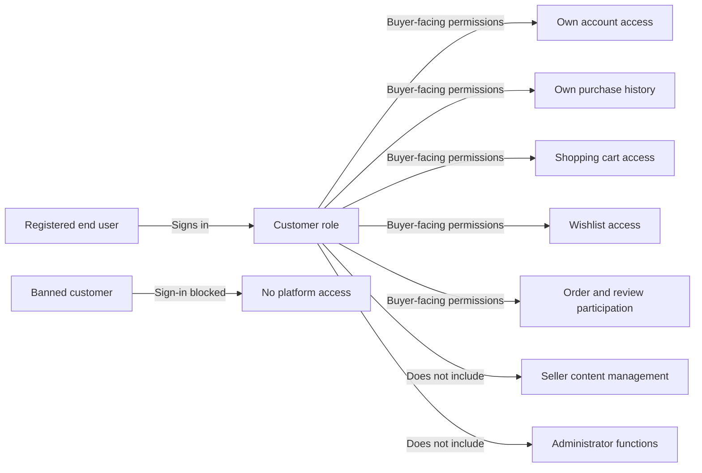

### Buyer Role

The buyer role describes the customer’s permitted use of the platform. A buyer can use only shopper-oriented functions that relate to browsing exposed seller and product information, managing personal account information, maintaining a shopping cart and wishlist, and acting on purchases made by that same customer. The buyer role does not extend to managing products, categories, seller registrations, approval workflows, or administrative oversight. Any action outside the buyer role is outside customer authority.

### Own Account and Purchase Scope

A customer may access only their own account information and their own purchase history. The customer may access and manage their own profile information and their own shipping addresses. The customer may view their own orders and their own reviews. A customer cannot access another customer’s private account data, purchase history, cart, wishlist, or reviews. Any attempt to view or act on another user’s private records is outside the customer role and must be denied.

### Buyer-Facing Permissions

A customer can use buyer-facing platform features that support shopping and post-purchase activity. These permissions include maintaining a shopping cart, maintaining a wishlist, viewing order history, and participating in delivery confirmation, cancellation requests, and refund requests for their own order items. These permissions apply only to the customer’s own purchases and do not grant access to seller operations or administrator operations.

### Prohibited Access

A customer cannot manage seller content. This includes products, categories, seller profiles, seller approvals, and any other seller-controlled content. A customer cannot access administrator functions, including approval workflows, moderation actions, or platform governance actions. If a customer attempts to use seller or administrator capabilities, the request is outside the customer role and must be rejected.

### Banned Customer Sign-In Blocked

When a customer is banned, the customer cannot sign in to the platform. A banned customer remains a customer account in the system, but buyer access is blocked until the ban is removed. While banned, the customer cannot use any platform feature that requires sign-in.

## seller Actor

A seller is a registered business user who operates a shop on the platform. This actor must sign in before using seller-facing features, and approval from administrators is required before the seller can actively sell. Sellers are allowed to manage their own shop presence and the items they offer, but they do not have authority over customer accounts or platform-wide governance. Their role includes access to shop-facing and fulfillment-related work, such as responding to purchase activity tied to their own items. Sellers can see information that helps them manage their business, including their approval state and any rejection reason when applicable. They may also participate in dispute-related activity for their own items, including cancellation and refund responses. Seller access is limited to the seller’s own shop and own selling activity, so one seller cannot manage another seller’s shop or records. A seller account can be deleted only when the platform’s seller-side account rules are satisfied, which preserves order history and snapshots for continuity. If a seller is suspended or banned, the role still exists conceptually, but active selling access is restricted according to platform policy. Seller capabilities never include administrator approval powers unless the user is separately granted administrator status.

### Seller Actor Identity and Role

A seller is a registered business user who operates a shop on the platform.
A seller represents a shop owner role and uses the platform to manage that shop’s selling activity.
A seller must sign in before using seller-facing features.
A seller is allowed to manage their own shop and the items they offer.
A seller can participate in fulfillment-related activity for their own items.
A seller does not have authority over customer accounts.
A seller does not have platform-wide governance authority.
A seller cannot act as an administrator unless the user is separately granted administrator status.

### Seller Approval and Registration Status

A seller account requires administrator approval before the seller can actively sell.
A seller can view their approval status.
The approval status can be pending, approved, or rejected.
If a seller is rejected, the seller can view the rejection reason.
If a seller is rejected, the seller can submit a new registration request.

### Seller Access to Own Shop and Selling Activity

A seller’s access is limited to the seller’s own shop and own selling activity.
A seller can manage information and content that belong to their own shop.
A seller can view information that helps them manage their own business, including approval status and rejection reason when applicable.
A seller can participate in dispute-related activity for their own items, including responding to cancellation and refund requests.
A seller cannot manage another seller’s shop.
A seller cannot access another seller’s selling records through seller-facing privileges.

### Seller Account Deletion Rules

A seller can delete their account only when the platform’s seller-side account deletion rules are satisfied.
A seller can delete their account only if they have no pending orders in paid or shipped status.
A seller can delete their account only if they have no pending cancellation requests.
A seller can delete their account only if they have no pending refund requests.
When a seller deletes their account, their order history and snapshots are preserved for continuity.
When a seller deletes their account, their shop name in past orders is preserved.
When a seller deletes their account, their products are deleted from listings.

### Suspended and Banned Seller Access

If a seller is suspended, their active selling access is restricted according to platform policy.
If a seller is suspended, they cannot create new products.
If a seller is suspended, they cannot edit existing products.
If a seller is suspended, they can still process existing orders, including shipping items and responding to cancellation or refund requests.
If a seller is banned, seller login access is blocked.
If a seller is banned, the seller cannot use seller-facing access until the ban is lifted.

## administrator Actor

An administrator is a privileged platform user responsible for governance, moderation, and oversight. This actor is separate from customers and sellers and is granted broader access for platform operations rather than shopping or storefront use. Administrators can review approval requests, manage seller and user account status, oversee categories and products, and handle order-related intervention when policy or disputes require it. The platform distinguishes between regular administrators and super administrators, with super administrators carrying additional privilege over administrator grade changes. Regular administrators have elevated operational access, but super administrators hold the highest authority within the platform’s account hierarchy. Administrator access is intended for platform control and dispute resolution, not for ordinary customer purchasing or seller storefront management. They may view snapshots and preserved records relevant to oversight so that disputes can be resolved from historical states. The role boundaries prevent administrators from being treated as ordinary buyers or merchants, even though a single person may hold more than one account role if separately granted. Super administrators cannot demote themselves, which preserves control over the highest privilege level. Any action outside the administrator role should remain unavailable unless it is explicitly supported by that actor’s permissions.

### Administrator Actor

An administrator is a privileged platform actor responsible for platform governance, moderation, and oversight rather than ordinary shopping or storefront activity. This actor is separate from customers and sellers and is used for platform control, dispute resolution, and account supervision.

Administrators may review approval requests, manage seller and user account status, oversee categories and products, and intervene in order-related matters when platform policy or disputes require it. They may also view snapshots and preserved records relevant to their oversight duties so disputes can be resolved using historical states.

An administrator is not treated as an ordinary buyer or merchant simply because the same person may also hold another account role in the platform. Access boundaries remain role-based, and administrator permissions apply only when acting in the administrator role.

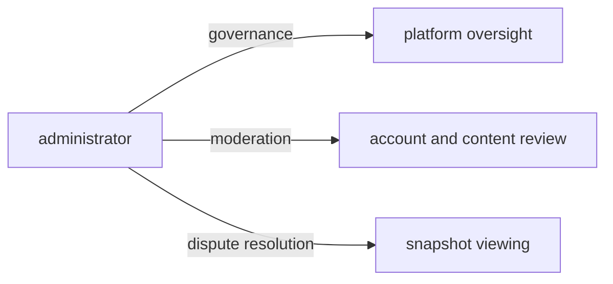

### Privilege Hierarchy

The platform distinguishes between regular administrators and super administrators. Regular administrators have elevated operational access for platform management, while super administrators hold the highest privilege level in the administrator hierarchy.

Super administrators have all regular administrator capabilities and additional authority over administrator grade changes. The hierarchy exists so that the platform always retains a highest authority level for governance decisions.

A regular administrator cannot grant the super administrator role unless that authority is explicitly part of the super administrator level. The privilege hierarchy is strictly ordered so that super administrators remain above regular administrators in authority.

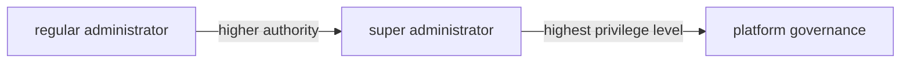

### Self-Demotion Restriction

Super administrators cannot demote themselves. This restriction preserves control over the highest privilege level and prevents the platform from losing its highest authority through self-action.

If a super administrator remains the only holder of the highest privilege level, the system must still enforce the same restriction. The self-demotion restriction applies only to the acting super administrator and does not prevent other authorized super administrators from changing another administrator’s grade.

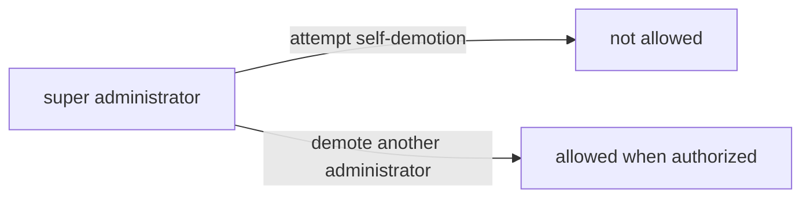

### Seller Approval Review

Administrators can review seller approval requests. This includes viewing pending seller registrations and deciding whether a seller account may proceed to selling activity.

When a seller registration is rejected, the rejection reason must be provided so the seller can understand why the request was not approved. Rejected sellers may submit a new registration request later.

Seller approval review is an administrator oversight function and is separate from seller profile management or product management.

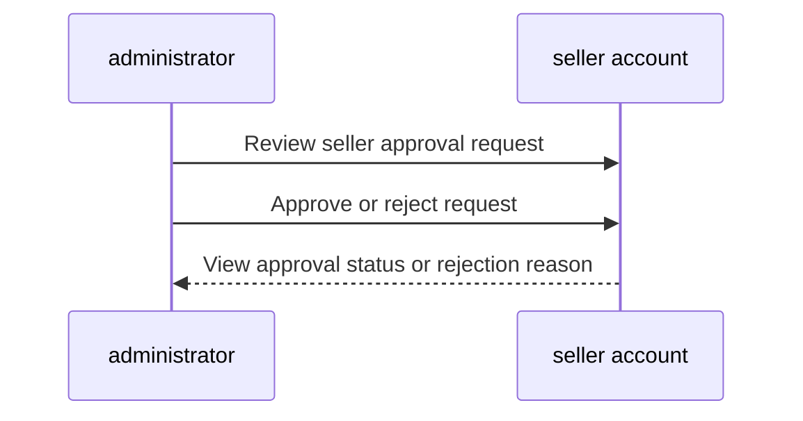

### User Account Management

Administrators can manage customer and seller account status. This includes viewing user accounts and applying account status controls such as banning and unbanning when platform policy requires it.

When a customer account is banned, the customer cannot log in. When a seller account is banned, the seller cannot log in, but existing orders remain in place.

User account management is an oversight permission and does not replace the account owner’s own account lifecycle actions.

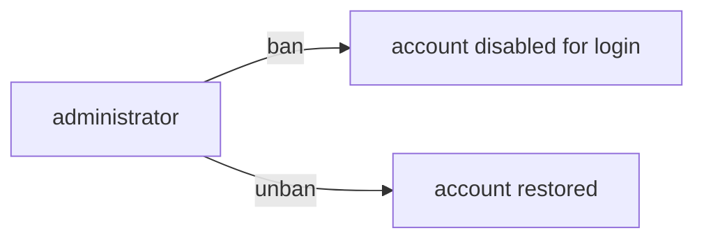

### Category Management Authority

Administrators have authority to create, edit, and delete categories and subcategories. Category management is reserved to administrators and is not available to customers or sellers.

When a category is deleted, products in that category become uncategorized. Category management authority applies to the category structure used to organize products across the platform.

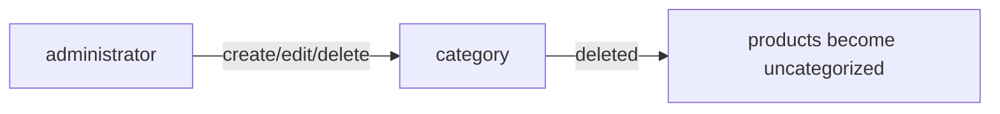

### Product Oversight Access

Administrators can view all products on the platform and may inspect product snapshots for any product. Product oversight access exists so administrators can review historical product states during disputes or policy review.

Administrators can also delete any product when policy enforcement requires it. This is broader than seller ownership, because administrative oversight applies across the platform rather than only to the administrator’s own products.

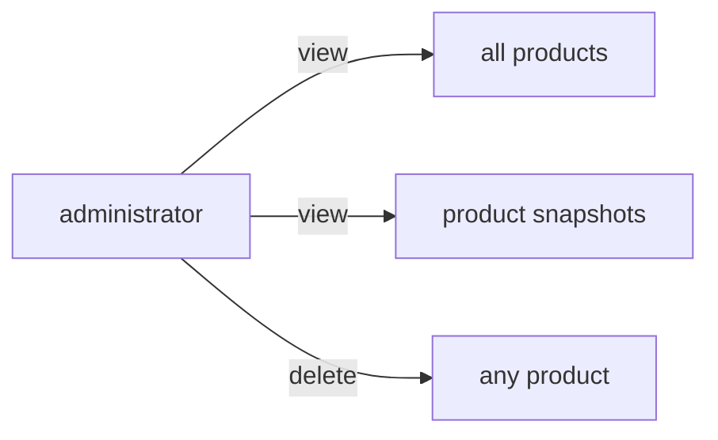

### Order Intervention Authority

Administrators can view all orders on the platform and intervene in order items when policy enforcement or dispute resolution requires it. This includes forcing cancellation or refund outcomes for individual items or entire orders.

Order intervention authority is an oversight permission used to resolve exceptional cases. When an administrator intervenes, the platform must preserve the order’s historical record and apply the appropriate stock restoration behavior associated with the intervention outcome.

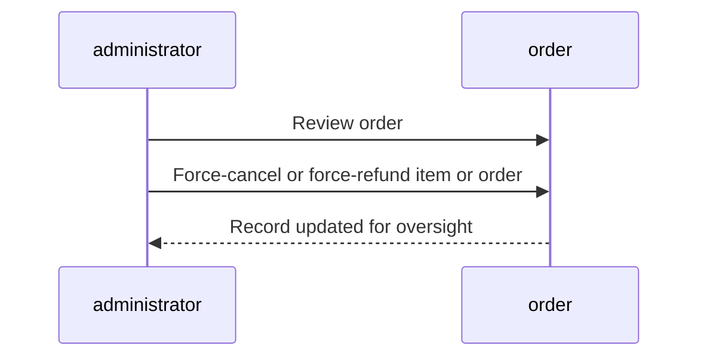

### Snapshot Viewing for Disputes

Administrators may view snapshots and preserved records relevant to disputes. Snapshot viewing supports review of prior states without changing those records.

Snapshots are part of the administrator’s oversight access, and they remain available for dispute resolution after the underlying editable data has changed. The administrator can use these historical records to understand what changed and when it changed.

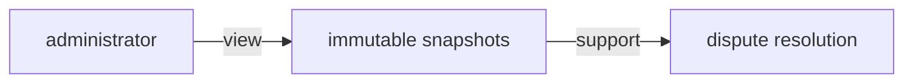

# Authentication Flows

Registration, login, logout, and session management from a user perspective.

## Registration and Login

Define user registration and login flows including validation and error handling.

### Registration

Customers and sellers must register before they can use the platform.

Customer registration requires an email address and password.
Seller registration requires an email address and password.
Registration creates a new account for the selected actor type.

A seller registration does not make the seller eligible to sell immediately; seller approval is handled separately (defined in the seller actor section).

Registration is not available to unregistered visitors because the platform does not allow guest browsing.

### Login

Customers can log in with their email address and password.
Sellers can log in with their email address and password.
Login is available only to registered accounts.

If the provided credentials do not match an existing account, access is denied.
If the account is not allowed to access the platform, access is denied.

A successful login allows the user to access the features available to their actor type, subject to the permissions defined in the actor sections.

### Authentication

Authentication verifies that a user is a registered customer, seller, or administrator before allowing access to platform features.

THE mallPlatform SHALL require authentication before any feature can be used.
WHEN a user provides valid account credentials, THE mallPlatform SHALL recognize the user as the matching account type.
IF credentials are invalid, THEN THE mallPlatform SHALL deny access.
IF an account is not permitted to access the platform, THEN THE mallPlatform SHALL deny access.

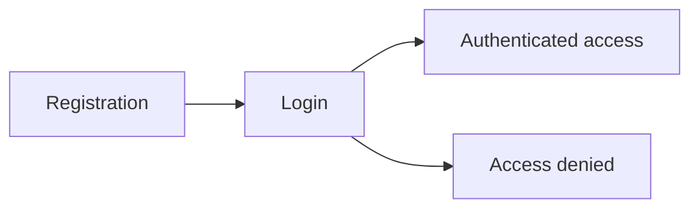

## Session and Logout

Define session behavior and logout from a user perspective.

### Session

A customer, seller, or administrator remains signed in while their session is active.
The platform shall keep the signed-in state available for authenticated use of the platform until the user ends the session.
The platform shall treat session state as part of the authenticated account lifecycle for all registered actors.
The platform shall allow a signed-in user to continue using the platform without repeating registration or login during the same active session.
The platform shall end the session when the user logs out.
The platform shall ensure that the current session reflects the correct actor identity and role.
The platform shall not allow an unsigned-out user to remain in an authenticated session.

Mermaid:
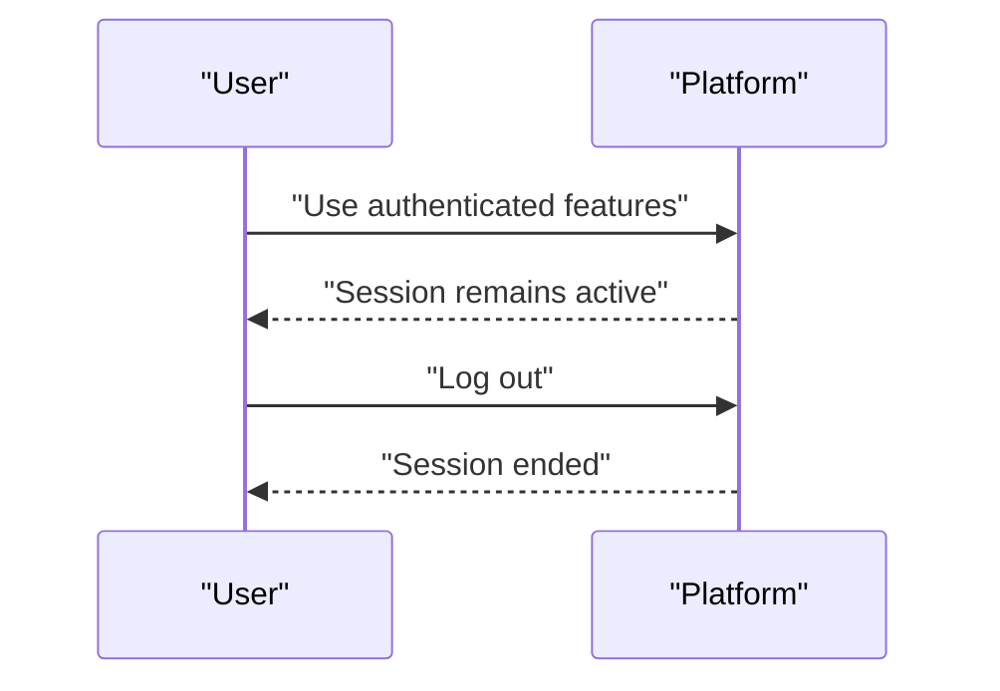

### Logout

A signed-in customer, seller, or administrator can end their own session at any time.
When a user logs out, the platform shall end the current session immediately.
When a user logs out, the platform shall stop treating the user as signed in.
When a user logs out, the platform shall require the user to sign in again before using authenticated features.
When a user logs out, the platform shall not change the user’s account data.
A logout action shall apply only to the current signed-in account.
The platform shall not allow logout to affect another user’s session.

Mermaid:
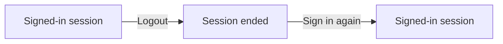

### Account Security

A customer or seller account shall be protected by email and password sign-in, as defined in the registration and login section.
The platform shall allow a customer or seller to change their password.
The platform shall allow a customer or seller to delete their own account.
The platform shall require administrator approval for seller accounts before they can sell.
The platform shall show seller approval status to the seller.
The platform shall show a rejection reason to a seller whose registration was rejected.
The platform shall allow a rejected seller to submit a new registration request.
The platform shall prevent banned customers from logging in.
The platform shall prevent banned sellers from logging in.
The platform shall allow a signed-in administrator to perform administrator-grade account oversight within their permissions.
The platform shall preserve order history, order items, and snapshots where the user requirements state that they must be preserved after account deletion.
The platform shall remove the user’s profile information when the customer deletes their account.
The platform shall remove a seller’s products from listings when the seller deletes their account.

Mermaid:
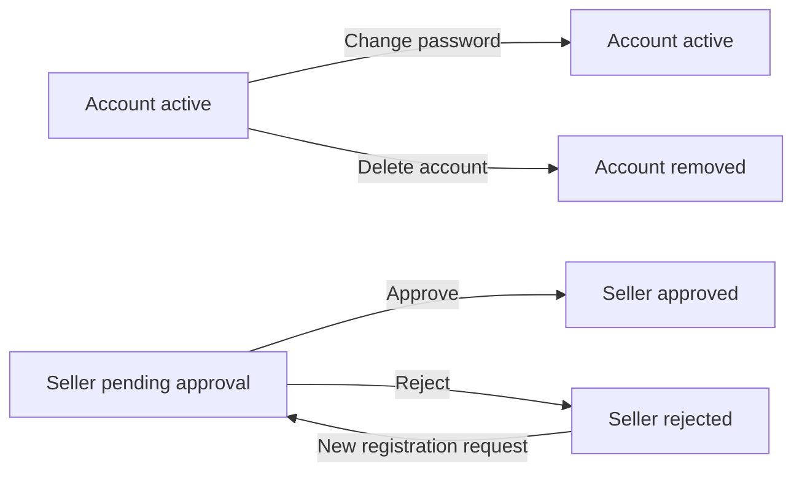

# Account Lifecycle

Account creation, deletion, and password management.

## Account Management

Define how users create accounts, delete accounts, and change passwords.

### Account Creation

Customers shall create an account before using any platform features. Customer account creation shall require email and password. Sellers shall create an account before using any platform features. Seller account creation shall require email and password. A created customer account shall be associated with a customer profile. A created seller account shall be associated with a seller profile and an approval status. Sellers shall not be able to sell until their account has been approved by an administrator. Rejected sellers shall be able to submit a new registration request.

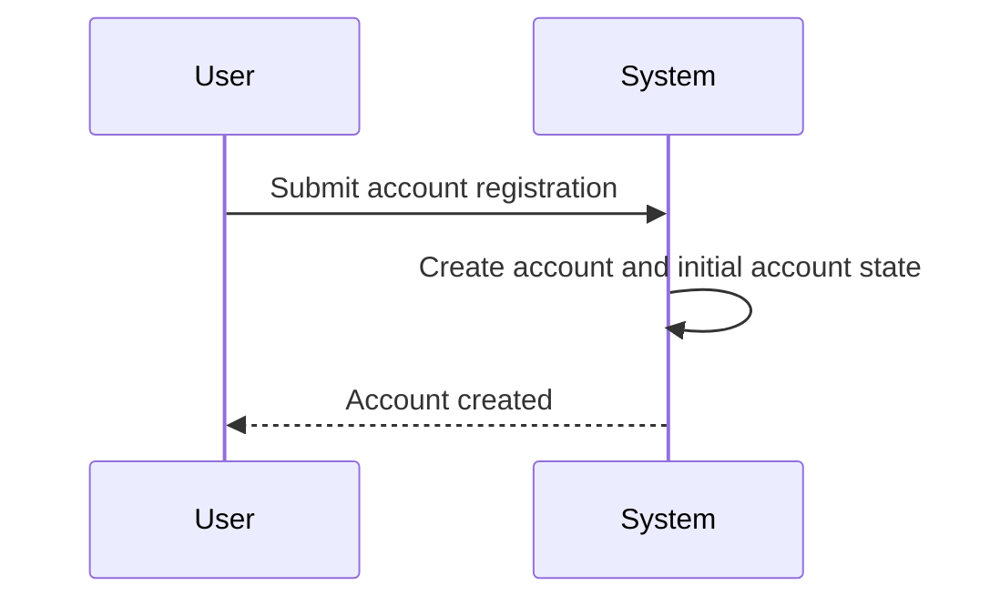

### Account Deletion

Customers shall be able to delete their own account. When a customer deletes their account, the system shall delete their profile information. When a customer deletes their account, the system shall preserve their orders and order history for seller records and legal purposes. When a customer deletes their account, the system shall preserve their reviews and show them as deleted user.

Sellers shall be able to delete their own account only when they have no pending orders in paid or shipped status and no pending cancellation or refund requests. When a seller deletes their account, the system shall delete their products from listings. When a seller deletes their account, the system shall preserve order history and snapshots. When a seller deletes their account, the system shall preserve their shop name in past orders.

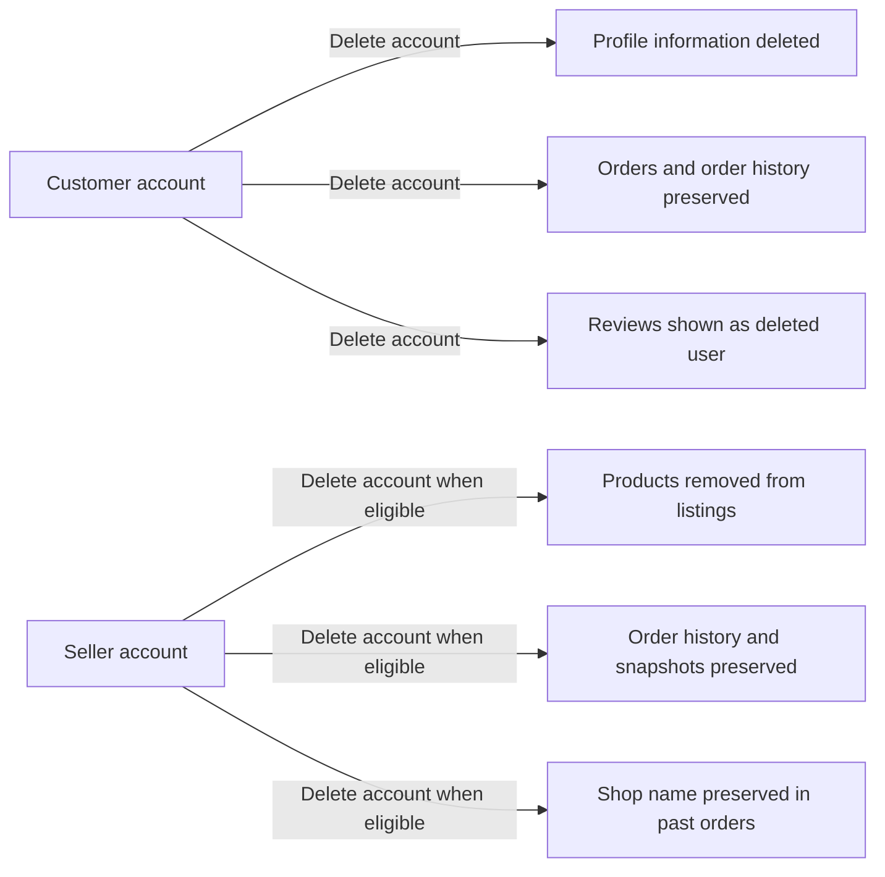

### Password Change

Customers shall be able to change their password. Sellers shall be able to change their password. Password change shall be available only to the account owner. A successful password change shall update the account’s login credentials for future sign-in attempts. If the password change request is invalid, the system shall reject it.

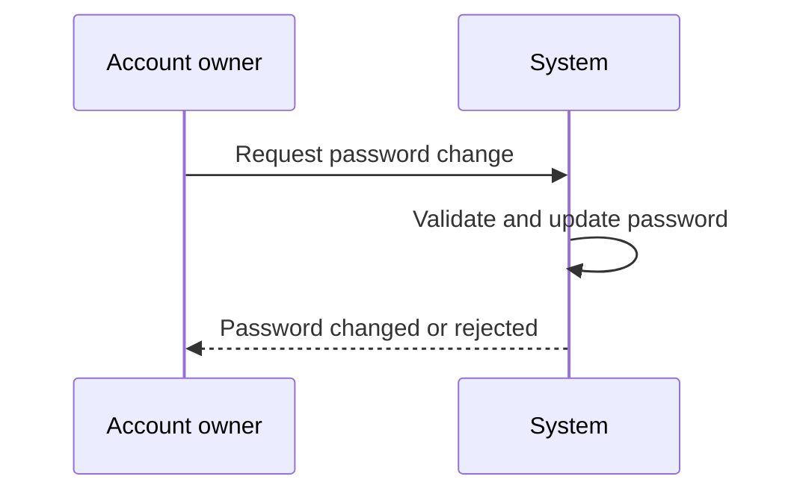