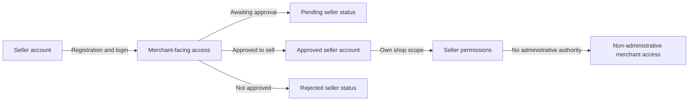
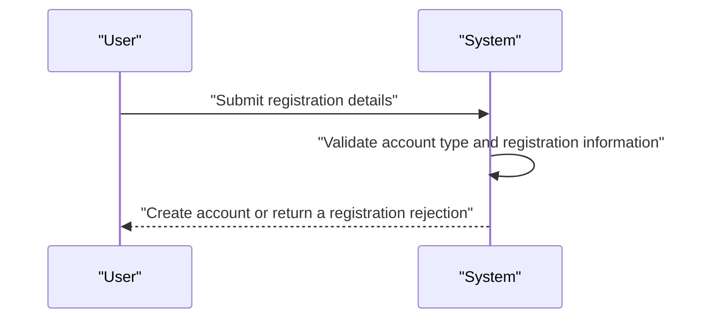
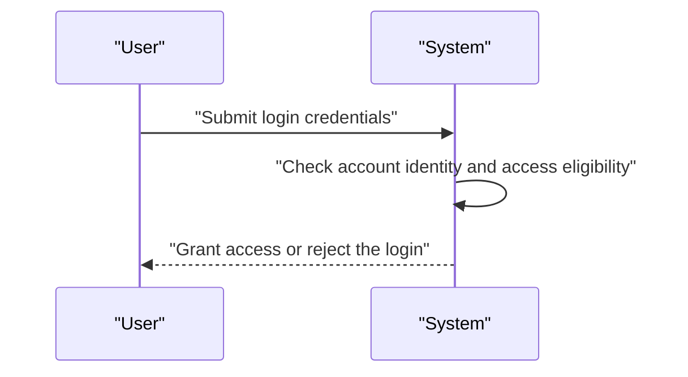
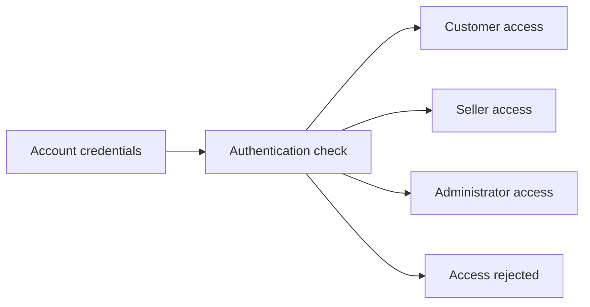
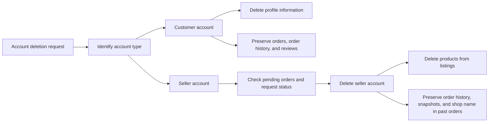
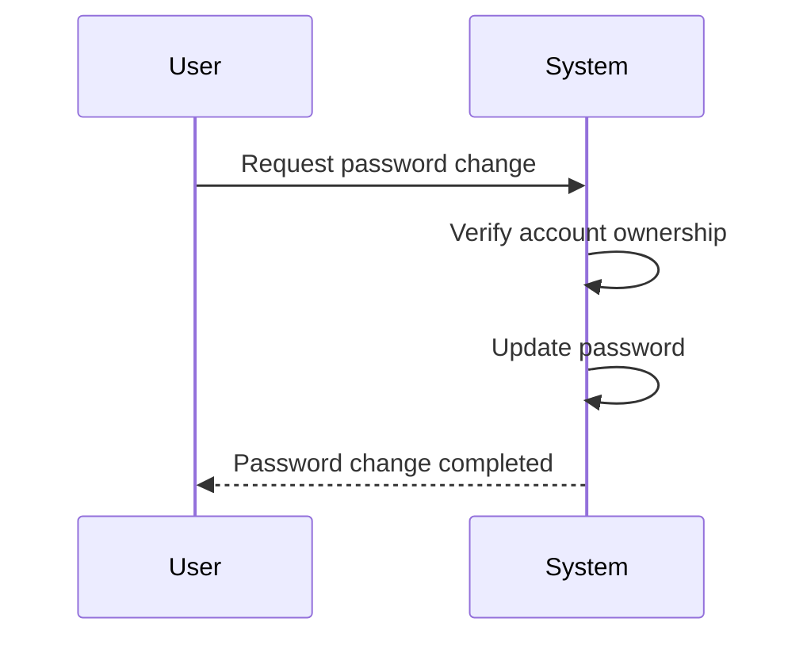

**shoppingMall — Actor definitions, permission matrix, authentication, session, account lifecycle**

Actor definitions, permission matrix, authentication, session, account lifecycle

# Actor Definitions

Define all user actor types with their identity, permissions, and access boundaries.

## customer Actor

A customer is a registered shopper identity used to access the platform. This actor represents the end user who is allowed to participate in shopping-related features after account registration and login. Customers can access customer-facing areas of the platform, including browsing and purchasing-related experiences that require a signed-in account. Their permissions are limited to their own account and their own activity, not to merchant administration or platform moderation. Customers can manage personal profile information and shipping details within their own account space. They can also interact with their own orders, wishlist, cart, and reviews as a shopper. Customers do not have authority to manage seller accounts, approve registrations, or administer platform settings. They also cannot act on behalf of other customers or sellers. Their access is restricted to normal shopper responsibilities and account-controlled actions. When a customer account is no longer active, the customer actor no longer has platform access under that identity.

### Registered Shopper Identity

A customer is a registered shopper identity used to access the platform.
A customer exists as a signed-in shopper rather than an anonymous visitor, because registration is required before any platform features are available.
A customer identity represents the person’s shopper presence on the platform and is tied to that person’s own account space.
A customer identity is used only for shopper-facing access and does not represent administrative authority.
A customer identity remains limited to the customer’s own activity scope and does not extend to other users’ accounts or seller operations.

### Customer Role and Access Boundary

The customer role is the normal shopper role on the platform.
THE platform SHALL allow a customer to access customer-facing areas after the customer is signed in.
THE platform SHALL limit a customer’s access to own account access and other customer activity that belongs to that customer.
WHEN a customer is acting within the customer role, THE platform SHALL treat the customer as a shopper with non-administrative access.
THE platform SHALL prevent a customer from using customer access to manage seller accounts, approve registrations, or administer platform settings.
THE platform SHALL prevent a customer from acting on behalf of another customer or seller.
WHILE a customer account is active, THE platform SHALL allow access only within the customer’s personal account scope.
WHEN a customer account is no longer active, THE platform SHALL end that customer’s platform access under that identity.

### Customer Permissions

THE platform SHALL allow a customer to access features that belong to the customer’s own account.
THE platform SHALL allow a customer to manage personal account information within the customer’s own account scope.
THE platform SHALL allow a customer to use customer-facing areas of the platform that are available to signed-in shoppers.
THE platform SHALL allow a customer to interact with the customer’s own shopping activity.
THE platform SHALL allow a customer to view and manage the customer’s own profile, shipping addresses, wishlist, cart, orders, and reviews as part of shopper-facing access.
THE platform SHALL restrict those permissions to the customer’s own records and activity.
THE platform SHALL not treat these permissions as administrative privileges.
THE platform SHALL not allow a customer to perform moderation or governance actions.

### Customer Access Restrictions

THE platform SHALL restrict customer access to the customer’s own account and related shopper activity.
WHEN a request concerns another user’s account or another seller’s data, THE platform SHALL deny customer access.
WHEN a request concerns a merchant administration task, THE platform SHALL deny customer access.
WHEN a request concerns platform governance, THE platform SHALL deny customer access.
THE platform SHALL ensure that customer access remains shopper-facing rather than administrative.
THE platform SHALL ensure that customer activity scope does not extend beyond the customer’s own records and actions.

## seller Actor

A seller is a merchant identity used to access seller-facing functions on the platform. This actor represents the business user responsible for managing a shop presence and participating in commerce as a product provider. Sellers can access the areas reserved for merchant activity after account registration and login. Their permissions are limited to their own seller identity and shop-related responsibilities. Sellers are separate from customers because they operate as merchants rather than shoppers only. They do not have authority to manage customer accounts or platform-wide administrative settings. Seller access is also limited by approval status, so an account may exist before it is allowed to sell. The seller actor may remain visible to the platform while awaiting approval or after rejection, but that status affects what the seller can do. Sellers cannot exercise administrator privileges unless they separately hold that role. Their access boundary is centered on their own shop and their own merchant account.

### Seller Actor

A seller is a merchant identity used to access seller-facing functions on the platform. The seller role represents the business user who operates a shop and participates in commerce as a product provider rather than as a shopper.

Sellers have merchant-facing access to the areas reserved for shop activity after account registration and login. Their access is limited to their own shop owner access, meaning they can act only within the scope of their own seller identity and shop-related responsibilities.

A seller account may exist before it is approved to sell. An approved seller account may use seller-facing functions that depend on approval. A pending seller status means the account exists but is still waiting for approval. A rejected seller status means the account was reviewed and not approved to sell.

Seller permissions apply only to the seller's own shop scope. Sellers can manage their own merchant presence and shop-related activities, but they do not have non-administrative authority over customer accounts or platform-wide administrative settings. They cannot act as administrators unless they separately hold an administrator role.

Sellers remain separate from customers because they operate as merchants rather than shoppers only. Their access boundary is centered on their own merchant identity, their own shop, and the permissions associated with that role.

## administrator Actor

An administrator is a platform governance identity used to oversee users and maintain platform order. This actor represents staff-level authority rather than a customer or merchant identity. Administrators can access management areas that are not available to ordinary customers or sellers. Their permissions are broader than standard user roles because they are responsible for approval, moderation, and platform oversight. The administrator actor is still bounded by grade, so not every administrator has the same level of authority. Regular administrators and super administrators are different access levels within the same actor family. Super administrators have the highest authority and can manage other administrators within the rules of the platform. Administrators are distinct from shoppers and merchants because their access is focused on supervision instead of buying or selling. They can review platform activity and enforce account-level control where permitted. Their access boundary is the administrative domain, not normal storefront participation.

### Administrator Actor

Administrators are the platform governance identity responsible for overseeing the marketplace and maintaining platform order. This actor represents staff-level authority rather than a customer or seller identity.

Administrators have platform management access for governance tasks that are not available to ordinary customers or sellers. Their access includes moderation authority, approval authority, and oversight authority within the platform management area.

Administrators are bounded by the administrative domain. They do not act as shoppers or merchants, and their access is limited to governance functions rather than storefront participation.

Administrators are distinct from other user actors because their role is to supervise, review, and control platform activity where permitted.

### Administrator Role and Permissions

Administrators can perform management actions that support platform governance. Their permissions include reviewing pending requests, making approval decisions, and overseeing platform activity within their authority.

Administrators can manage sellers, categories, users, products, and orders only where the platform assigns that responsibility to administrators.

Administrators can review platform records and moderation cases to support dispute handling and enforcement decisions.

Administrators can access information needed to carry out oversight and approval work, but they do not gain broader merchant or customer privileges through the administrator role.

### Administrator Grades

Administrators have two grades: regular administrator and super administrator.

A regular administrator has standard administrator authority for the permissions assigned to administrators.

A super administrator has the highest administrator grade and can manage other administrators within the rules of the platform.

Super administrator authority is broader than regular administrator authority, but it remains within the administrative domain.

Super administrators can promote regular administrators to super administrator and can demote other super administrators to regular administrator, except that a super administrator cannot demote themselves.

# Authentication Flows

Registration, login, logout, and session management from a user perspective.

## Registration and Login

Define user registration and login flows including validation and error handling.

### Registration

Customers and sellers can register only as identified account types supported by the platform.
Registration requires an email address and a password.
A customer registration creates a customer account.
A seller registration creates a seller account.
The platform does not allow guest use of any features, so registration is required before a person can use the platform.
Seller registration is not enough to begin selling; the seller account remains subject to administrator approval before selling is allowed.
If a seller registration is rejected, the seller can submit a new registration request.
If an account already exists for the same email address, the registration is rejected.

### Login

Customers can log in with their registered email address and password.
Sellers can log in with their registered email address and password.
Administrators can log in with their assigned account identity.
A login attempt succeeds only when the submitted credentials match an existing account that is allowed to access the platform.
A customer or seller whose account is banned cannot log in.
A seller whose account is pending approval, approved, or rejected remains governed by the seller account status described elsewhere in the document, and login access follows that account status.
If the credentials do not match, the login is rejected.
If the account does not exist, the login is rejected.

### Authentication

Authentication is the platform check that confirms a person is using a valid account before any feature can be used.
The platform requires successful authentication before customers, sellers, or administrators can access features.
Authentication is based on the account credentials associated with the account type.
If authentication fails, the requested feature is not available.
If an account is suspended or banned, authentication does not grant access.
Authentication distinguishes the active account type so the platform can apply the correct permissions for customers, sellers, and administrators.

## Session and Logout

Define session behavior and logout from a user perspective.

### Session

A signed-in customer, seller, or administrator remains authenticated through a session that allows continued use of the platform without signing in again for each action.
A session belongs to the account that created it and is limited to the permissions of that account type.
If the signed-in account is banned, the session no longer allows access to the platform.
If the signed-in account is suspended or otherwise loses access according to its account status, the session no longer allows access to the affected features.

### Logout

A signed-in customer, seller, or administrator can end the current session by logging out.
When a user logs out, the current session is ended immediately.
After logout, the user must sign in again before using any authenticated features.
Logout affects only the current session and does not change the account itself.
Logout does not delete profile information, orders, products, reviews, or any other stored business data.

### Account Security

A user can access authenticated features only while signed in with a valid session.
A user cannot use another actor type's features through the current session.
When an account is banned, that account cannot log in and cannot continue using existing authenticated access.
When a seller account is suspended, the seller cannot create new products or edit existing products through that account until access is restored.
When a user deletes their account, any active session for that account stops allowing access to authenticated features.

# Account Lifecycle

Account creation, deletion, and password management.

## Account Management

Define how users create accounts, delete accounts, and change passwords.

### Account Deletion

Customers can delete their accounts.
When a customer deletes an account, the system deletes the customer's profile information.
When a customer deletes an account, the system preserves the customer's orders and order history for seller records and legal purposes.
When a customer deletes an account, the system preserves the customer's reviews and shows them as written by a deleted user.
Sellers can delete their accounts only when they have no pending orders in paid or shipped status.
Sellers can delete their accounts only when they have no pending cancellation requests and no pending refund requests.
When a seller deletes an account, the system deletes the seller's products from listings.
When a seller deletes an account, the system preserves order history and snapshots.
When a seller deletes an account, the system preserves the seller shop name in past orders.
The account deletion outcome depends on the account type, and the preservation rules for customer data and seller data must be applied exactly as stated.

### Password Change

Customers can change their passwords.
Sellers can change their passwords.
Password change is available only to the account owner.
A password change updates the account's login credentials while keeping the account itself active.
The password change capability applies to both customer accounts and seller accounts, and no additional account data is changed by this action.

