**shoppingMall — Business concepts, relationships, and states from user perspective**

Business concepts, relationships, and states from user perspective

# Domain Concepts

Describe what each concept means in the business domain and its key attributes.

## Customer Concept

A Customer is a registered shopper identity on the platform. This concept represents a person who uses the site to browse products, place orders, and participate in post-purchase activities. A Customer is identified by account credentials and has an active account status that determines whether the person can use the platform. The Customer concept also includes profile information that supports a public-facing and contact-oriented identity. Customers may be associated with saved shipping addresses, a wishlist, a cart, orders, reviews, and account records that reflect their shopping history. Customer identity is distinct from seller and administrator identities, even when the same person belongs to more than one role. The account remains the basis for ownership of customer-facing data such as profile details, shipping addresses, wishlist entries, cart contents, and reviews. When a customer account is no longer active, the customer identity may still be referenced indirectly in preserved business records such as orders and reviews.

### Registered Shopper Identity

A customer is the platform’s registered shopper identity. This identity represents a person who has an account on the platform and is recognized as a customer within the shopping domain.

A customer identity is distinct from seller identity and administrator identity, even when the same person also holds one of those roles.

A customer identity is the basis for customer-owned shopping data, including profile information, shipping addresses, wishlist entries, cart contents, orders, and reviews.

### Account Status and Email-and-Password Account

A customer account has a status that determines whether the customer account is active for platform use.

A customer account is identified through email and password credentials.

The customer account is the account record that anchors the customer identity and supports access to customer-owned records such as the profile, shipping addresses, wishlist, cart, orders, and reviews.

When a customer account is no longer active, the customer identity may still be referenced indirectly in preserved business records such as orders and reviews.

### Customer Profile

A customer profile contains the customer’s display name and phone number.

The profile is part of the customer’s public-facing and contact-oriented identity on the platform.

The profile belongs to the customer and is separate from seller profile information.

### Shipping Addresses

A customer can have multiple shipping addresses.

Each shipping address belongs to one customer and represents a delivery destination that can be used for orders.

A shipping address contains recipient details and postal address details, including recipient name, phone number, street address, city, state or province, postal code, and country.

One shipping address may be treated as the default shipping address for the customer.

### Wishlist Ownership

A wishlist is a customer-owned collection of saved products.

The wishlist belongs to one customer and stores products rather than specific variants.

Wishlist membership represents customer interest in products and is separate from order history and cart contents.

### Cart Ownership

A cart is a customer-owned temporary purchase set.

The cart belongs to one customer and stores selected product variants and quantities.

Cart contents represent purchase intent before checkout and are distinct from saved products in the wishlist and completed purchases in order history.

### Order History

Order history is the customer’s record of completed purchases on the platform.

An order belongs to one customer and contains one or more order items.

Order history preserves the customer’s purchase record even when other account-related information changes later.

An order may contain items from different sellers, and each order item remains part of the customer’s order history.

### Review Author and Deleted User Display Name

A review is authored by the customer who purchased the related item.

The review author is the customer identity associated with the review, even if the customer account is later no longer active.

When a customer account has been deleted, preserved reviews show the author as deleted user.

The deleted user display name is used only to represent the preserved review author in the business record and does not restore the deleted customer account.

## Seller Concept

A Seller is a merchant identity that represents a business user who offers products on the platform. This concept captures the account used to manage a shop and connect products, orders, and seller-facing records to a merchant owner. A Seller is identified by account credentials and has an approval state that reflects whether the merchant is allowed to sell. The Seller concept is separate from the shop presentation shown to customers, which is handled through the seller profile. Sellers are associated with products they own, seller-side order items, shipment responsibility, and account-level moderation status. The seller account also carries business meaning for platform governance, since a seller may be pending approval, approved, rejected, suspended, or otherwise restricted. Seller identity is important for preserving order records, product ownership, and historical shop information even when the account changes or is removed. This concept does not describe the approval process itself, only the merchant identity and the attributes that define it.

### Seller as a Merchant Identity

A seller is the merchant identity used by a business user on the platform. It represents the person or business that offers products for sale and receives seller-specific records on the platform. The seller concept is the business identity that connects the merchant to products, orders, shipments, and moderation-related records. A seller is distinct from the seller profile, which represents how the shop is presented to customers.

A seller also functions as the merchant record for the platform. This record is the business identity that preserves the seller's ownership history, shop history, and selling-related records over time, even when the account state changes.

### Seller Account and Approval Status

A seller account is the account identity associated with the merchant record. It carries the seller's approval status, which indicates whether the seller is pending approval, approved, or rejected. The approval status is part of the seller's business meaning because it determines whether the merchant has been accepted into the selling role on the platform.

The seller account also carries the seller's account moderation status. This status reflects platform-level control over the merchant identity, separate from approval status, and shows whether the seller account is subject to administrative restriction.

### Shop Owner and Shop Business Identity

A seller is the shop owner for the products and shop activity associated with that seller account. The seller is the business owner behind the shop business identity shown on the platform.

The shop business identity is the merchant-facing identity that links the seller to the shop name, shop description, and logo image stored in the seller profile. This shop identity is separate from the seller account itself, but it belongs to the same merchant record and is used wherever the seller's business presentation must be preserved.

### Product Ownership and Seller-Side Order Items

A seller owns the products created under that seller account. Product ownership means the seller is the merchant responsible for the product listing and for the business records connected to that product.

Seller-side order items are the order items tied to products owned by the seller. These records represent the seller's portion of customer purchases and preserve the merchant's role in the order after the sale. The seller concept therefore includes responsibility for order items that belong to the seller's products, rather than the entire customer order.

### Shipment Responsibility

Shipment responsibility belongs to the seller for the order items associated with that seller's products. This means the seller is the merchant party connected to the shipping activity for those items.

Shipment responsibility is part of the seller concept because the platform must preserve which merchant handled the shipment for each seller-side order item and related shipment record.

### Seller Business State Over Time

The seller concept includes the merchant's business state over time, including whether the seller is approved, rejected, or otherwise restricted by account moderation status. These states are business meanings attached to the seller identity and are important for preserving the merchant record across account changes.

Merchants remain identifiable through their seller account and shop business identity even when their selling status changes, so historical products, orders, and shipping records can continue to reference the correct seller.

## Administrator Concept

An Administrator is a platform governance identity with moderation and oversight responsibilities. This concept represents a user who can be recognized as an administrator rather than a customer or seller. The administrator identity includes a grade that distinguishes regular administrators from super administrators. Administrator status matters because it governs who can oversee seller accounts, products, categories, orders, and user accounts. The concept also supports business rules around platform control, such as approval and promotion authority, without describing the specific steps of those actions. Administrator identity is separate from commercial identities so that a person can be understood in the system both as a marketplace participant and as an oversight actor. The administrator record is used to track who holds governance authority at a given time. This concept focuses on role meaning, hierarchy, and accountability within the platform.

### Administrator Identity

An administrator is a platform governance identity within the shopping mall platform. This identity represents a person who is recognized for oversight responsibilities rather than for shopping or selling activity. The administrator concept is separate from customer and seller identities, so the same person’s governance role can be understood independently from any commercial role they may hold.

The administrator identity supports account governance across the platform. It identifies who has authority to oversee seller accounts, product oversight, category oversight, order oversight, and user account oversight at a business level. This concept exists so the platform can distinguish governance responsibility from ordinary marketplace participation.

The administrator identity is used as the basis for accountability in moderation and oversight activities. It represents who is allowed to participate in platform control decisions and who is responsible for governance actions at the business level.

### Administrator Grade

An administrator has an administrator grade that distinguishes two levels of governance authority: regular administrator and super administrator. The administrator grade is part of the administrator concept and defines the scope of moderation authority and oversight role a person holds within the platform.

A regular administrator is an administrator with standard governance authority. A super administrator is an administrator with elevated governance authority. The grade establishes a promotion hierarchy within the administrator population, where super administrator is above regular administrator.

Administrator grade matters because it determines the level of account governance a person can represent in the business domain. The grade is a governance status, not a commercial status, and it exists to express relative authority within the platform administration structure.

### Moderation and Oversight Role

The administrator concept includes a moderation authority role and an oversight role. This role represents business control over sellers, products, categories, orders, and users at the platform level. The administrator is the governance identity that supports review, approval, rejection, suspension, and similar control responsibilities in the broader platform model.

Seller oversight means the administrator concept covers authority over seller account governance, including decisions about whether a seller may participate in the marketplace. Order oversight means the administrator concept also covers authority over orders and order-related control decisions at the platform level.

The moderation and oversight role is not the same as owning products, placing orders, or managing a shop. It exists to describe how administrators supervise the marketplace rather than participate in commerce as customers or sellers.

### Promotion Hierarchy

The administrator concept includes a promotion hierarchy between regular administrator and super administrator. This hierarchy defines an internal ordering of governance authority within the administration domain.

A super administrator is positioned above a regular administrator in the promotion hierarchy. The hierarchy is part of the administrator identity itself and exists to distinguish standard oversight authority from elevated oversight authority.

This hierarchy is relevant to account governance because it expresses that administrator grades are not interchangeable. Instead, they form a business structure in which governance authority can be recognized at different levels.

## Profile Concept

A Profile is the personal information set associated with a customer account. It represents the user-facing identity details that help other parties recognize and contact the customer. The profile includes a display name and a phone number, which together define the customer’s basic contact identity on the platform. Profile information is distinct from login credentials because it describes how the customer appears and can be reached in business interactions. The profile supports customer records that may be referenced in orders, delivery communication, and account management contexts. It belongs to the customer rather than to the platform as a shared asset. The concept is intentionally simple and focused on identifying and presenting the customer in a human-readable way. Profile data is part of the customer’s business identity, not an administrative or seller-facing structure.

### Profile Concept

A Profile is the customer’s personal information set on the platform. It is the part of the customer record that represents the customer’s user-facing identity and business identity in day-to-day interactions. The profile is used to identify the customer in a human-readable way and to support contact-related business interactions.

The profile includes the customer’s display name and phone number. The display name is the primary user-facing identity shown for the customer, while the phone number is part of the customer’s contact identity. Together, these details form the customer’s basic customer details on the platform.

The profile belongs to the customer and is not a shared platform record. It is separate from login credentials and exists to describe who the customer is in business terms rather than how the customer signs in. Because it is part of the customer record, the profile serves as a reference point for other business activities that need to recognize the customer as an individual person rather than as an account credential set.

The profile concept is intentionally narrow: it captures the customer’s personal information set needed for recognition and contact, and nothing more. In this domain, profile means the customer-facing identity details that support the customer record and the customer’s business identity on the platform.

## ShippingAddress Concept

A ShippingAddress is a customer-owned delivery destination used for receiving purchased items. It represents a complete mailing location with recipient details and postal information. The address includes recipient name, phone number, street address, city, state or province, postal code, and country. Shipping addresses are part of the customer’s account data and provide the business information needed to deliver orders correctly. A customer may have more than one shipping address, allowing different delivery destinations to be stored for future use. One address can be identified as the default shipping address, which gives it special status among the customer’s saved locations. The concept is separate from the customer profile because it describes where goods are sent rather than who the customer is. ShippingAddress is an important order-related concept because it links the buyer’s contact and location details to delivery records.

### Shipping Address as a Delivery Destination

A shipping address is the customer-owned delivery destination used to receive purchased items. It represents the place where the customer wants orders to be delivered and is part of the customer’s saved account information. A shipping address is distinct from the customer profile because it describes where goods are sent rather than who the customer is.

The shipping address concept exists to preserve the delivery location that should be used for order fulfillment. Because the platform supports multiple saved addresses for a customer, each shipping address is treated as an independent destination that can be selected for future purchases. This makes the address a reusable business record rather than a one-time delivery note.

A shipping address contains the delivery contact details needed for successful shipment, including the recipient name, phone number, street address, city, state or province, postal code, and country. These values together define a complete mailing location for delivery purposes.

### Shipping Address Components

The recipient name identifies the person who should receive the package at the shipping destination. It may be the customer or another person chosen by the customer for delivery purposes.

The street address identifies the specific delivery location within the city or town area. The city identifies the local municipality for the destination. The state or province identifies the larger regional division within the country. The postal code identifies the postal routing area for the destination. The country identifies the nation where delivery is to occur.

These address components are defined together as the business meaning of the shipping address and are used as the customer’s delivery contact details.

### Default Shipping Address

A customer may designate one saved shipping address as the default shipping address. The default shipping address has special status among the customer’s saved delivery destinations because it represents the preferred address for future deliveries.

The default shipping address remains a customer-owned address and does not replace the need for other saved shipping addresses. It simply provides a primary delivery destination within the customer’s address collection. If a customer has more than one shipping address, only one address can hold default status at a time.

## SellerProfile Concept

A SellerProfile is the public shop identity associated with a seller account. It describes how the merchant presents the shop to customers across the platform. The seller profile includes the shop name, shop description, and logo image, which together form the visible brand identity of the merchant. This concept is distinct from the seller account itself because it focuses on presentation rather than login or moderation status. Customers use the seller profile to understand who is selling a product and what the shop represents. The profile also provides historical continuity, since shop identity may need to be preserved in past business records. SellerProfile is relevant in product listings, product detail views, and order records where the shop identity matters. It serves as the merchant’s storefront branding within the marketplace.

### SellerProfile as Shop Identity

A SellerProfile represents the public shop identity associated with a seller. It is the merchant branding element that customers recognize across the platform and is separate from the seller account itself. The SellerProfile defines how the seller presents the shop to customers and serves as the seller storefront identity in customer-facing contexts.

A SellerProfile is the shop profile used for public shop presentation. It provides customer-facing seller information that helps shoppers identify the merchant behind a product and understand the shop’s overall presence. The SellerProfile is relevant wherever the platform needs to show who the merchant is in a branded, public-facing way.

The SellerProfile is a business concept centered on presentation rather than account access. It is the visible representation of the merchant shop, while the seller account remains the identity used for sign-in and account control.

### SellerProfile Details

A SellerProfile includes the shop name, shop description, and logo image. These attributes together define the shop identity that customers see on the platform.

The shop name is the primary label of the SellerProfile and is the most direct way customers identify the shop. The shop description provides a short presentation of what the shop represents. The logo image acts as the visual mark of the shop profile and supports merchant branding by making the shop recognizable in listings and other customer-facing contexts.

These details form the public shop presentation of the seller. They are the visible contents of the SellerProfile and together create a consistent customer-facing seller information set for the merchant.

### SellerProfile in Customer-Facing Contexts

A SellerProfile is used whenever the platform needs to present seller identity to customers. It supports the customer-facing seller information shown with products and in seller profile views so customers can recognize the merchant behind a listing.

The SellerProfile also carries historical importance because the shop identity may need to remain understandable in preserved business records. In this sense, the SellerProfile serves both as a public shop presentation and as a stable record of the merchant branding associated with the seller.

When the shop identity is displayed to customers, the SellerProfile provides the name, description, and logo image together as one shop profile. This keeps the seller storefront identity consistent wherever the merchant is shown on the platform.

## Category Concept

A Category is a business classification used to organize products within the marketplace. It groups related products so customers can browse and understand the catalog more easily. The category concept includes a name and a description that explain what the category covers. Categories may also have a parent category, which supports one level of subcategory organization. This means a category can act as a top-level grouping or as a narrower child within a broader product family. Category is part of the product structure rather than a seller-specific concept, so many sellers can place products under the same category when appropriate. The concept helps define how products are arranged in the shopping mall and how shoppers explore the catalog. Category is a shared domain classification used across browsing, product display, and catalog organization.

### Category as a Shared Marketplace Classification

A category is the shared marketplace concept used to classify and organize products across the platform. It provides a common way for products from different sellers to be grouped under the same business topic, making the catalog easier to understand and browse.

The category concept exists to support product classification and catalog grouping rather than seller-specific organization. A category represents a shared grouping label that can be applied to many products when they belong to the same product family or subject area.

Each category has a category name and a category description. The category name identifies the classification, while the category description explains what kinds of products belong in that category. These attributes define the meaning of the category as a business concept.

Category is a product organization concept because it helps arrange products within the marketplace catalog. Products can be grouped under categories so that shoppers can find related items together and understand how products are structured within the overall catalog.

A category may also have a parent category. When a parent category exists, the category functions as a subcategory within a broader grouping. This supports one level of nesting only, so a category can either stand alone as a top-level category or appear once beneath another category as a subcategory.

The shared nature of categories means that the same category can be used across the marketplace by multiple sellers, and it belongs to the overall catalog structure rather than to any individual seller.

## Product Concept

A Product is a sellable item listed by a seller on the platform. It represents the main commercial listing that customers discover, view, and evaluate before choosing a specific variant. The product includes a name, description, category, and base price as its core business attributes. A product belongs to the seller who created it, which establishes ownership and responsibility. Product identity is broader than any single variant because it represents the overall item while variants define specific purchasable configurations. The product may also be associated with multiple images and review information that help customers understand the offering. Product records are important for catalog display, search, and order history because they form the business reference for merchandise sold through the marketplace. This concept captures the product as a durable marketplace listing with descriptive and pricing information.

### Product as a Marketplace Listing

A product is the seller-owned marketplace listing that represents a sellable item on the platform. It is the business container customers discover in the catalog before choosing a specific purchasable variation. A product exists as the main commercial identity for an item, while its variants represent the specific combinations that can actually be purchased.

A product belongs to the seller who created it, which makes the seller responsible for the listing. The product is also assigned to a category so it can appear in the appropriate part of the catalog. This category assignment is part of the product’s identity in the marketplace and helps organize browseable merchandise for customers.

The product concept is broader than a single variant because it gathers the shared information that describes the item as a whole. It is the marketplace listing that anchors catalog presentation, seller ownership, and product-level visibility across the platform.

### Product Name, Description, and Base Price

A product has a product name that identifies the item in the catalog and a product description that explains what the item is. These two attributes define the core descriptive identity of the listing and are what customers use to understand the merchandise at a general level.

A product also has a base price, which represents the starting price for the listing before any variant-specific price is considered. The base price is part of the product’s commercial presentation and supports the product as a sellable item in the catalog.

These attributes belong to the product as a durable business record. They distinguish one listing from another and provide the essential information needed for customers to recognize the product in search, category browsing, and product detail viewing.

### Product Images and Visual Presentation

A product may have product images that visually represent the listing. The images belong to the product concept and are part of the merchandise information that helps customers evaluate the item before purchase.

Product images are treated as an ordered set for display purposes, so the image collection is part of the product’s business identity rather than a separate concept. The first image functions as the main visual representation of the listing, while the remaining images support a fuller presentation of the product.

Because product images are tied to the product itself, they contribute to the way the marketplace listing is recognized and compared within the catalog.

### Reviewed Merchandise

A product is reviewed merchandise when customers have written reviews for it. Reviews add customer feedback to the product concept and affect how the listing is perceived in the marketplace.

The product concept includes review-related meaning at the business level because it is the item customers evaluate, compare, and discuss after purchase. Review information belongs to the product as part of its reputation and customer feedback history, while the review itself remains a separate concept.

This makes the product not only a sellable item and catalog listing, but also a reviewed merchandise record that accumulates customer opinions over time.

## ProductVariant Concept

A ProductVariant is a specific purchasable form of a product. It represents one combination of options, such as color or size, within the broader product listing. The variant includes a SKU code, option values, a price, and stock quantity as its key business attributes. A product can have multiple variants, allowing the same product to be offered in different configurations. Variants are important because customers select them when buying, and each variant carries its own stock and pricing behavior. The SKU code serves as a unique identifier for the variant within the seller’s catalog. The option values describe the distinguishing characteristics that make one variant different from another. ProductVariant is the domain concept that connects product presentation with inventory and order-specific buying decisions.

### Product Variant as a Purchasable Form

A product variant is the specific purchasable form of a product. It represents one concrete product configuration within the broader product listing, such as a particular color and size combination. Variants are the form customers choose when they are ready to buy a product, because the product itself may not be sold as a single undifferentiated item.

A product can have multiple variants so that the same product can be offered in different configurations. Each variant belongs to exactly one product and represents one distinct choice within that product's range of options. If a product has no variants, the product is not considered purchasable as a variant-based item.

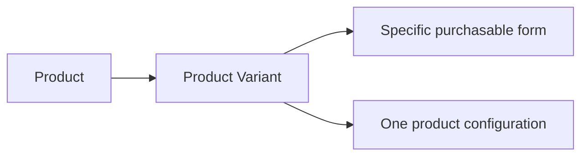

### Variant Identity and Option Values

A product variant is identified by its SKU code and its option values. The SKU code is the unique business identifier for the variant within the seller's catalog. The option values describe the characteristics that make one variant different from another, such as color and size.

A single product can use option values to express different choices in a consistent way. For example, one variant may be defined by the color option value "Red" and the size option value "Large", while another variant of the same product may use "Blue" and "Small". These option values define the variant's identity as a specific combination rather than as a general product.

The same product cannot have two variants that represent the same option combination. Each variant must remain distinguishable by its SKU code and its set of option values.

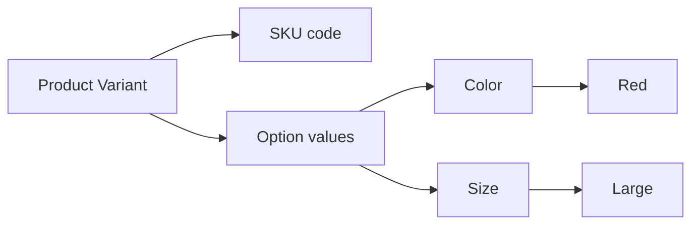

### Variant Price and Stock Quantity

A product variant carries its own price and stock quantity. The variant price is the amount associated with that specific configuration, and it may differ from the product's base price. If a variant does not override the base price, the product's base price remains the price reference for that variant.

The stock quantity is the business measure of how many units of that variant are currently available. Because stock is managed by variant, two variants of the same product may have different availability at the same time. When the stock quantity reaches zero, the variant is no longer available for purchase and is treated as out of stock.

A variant's price and stock quantity are part of its business identity because they describe how that exact configuration is sold and whether it can be purchased.

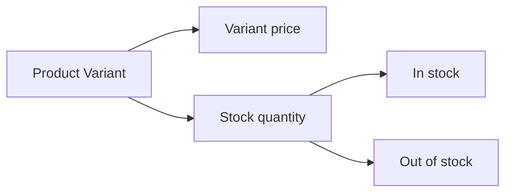

### Inventory by Variant

Inventory is tracked separately for each product variant. This means the stock position of one variant does not determine the stock position of another variant, even when both belong to the same product. Variant-level inventory makes it possible to know the available quantity for each specific purchasable form.

The variant's current stock position is the result of inventory changes recorded for that variant over time. This preserves a business-level view of availability by variant rather than by product as a whole. Inventory by variant is what allows the platform to distinguish between product availability and the availability of a particular configuration.

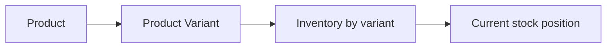

## ProductImage Concept

A ProductImage is a visual asset attached to a product listing. It helps customers understand the product appearance, style, and presentation before purchase. The image concept is part of the product’s content and supports the main shopping view of the item. Multiple product images can exist for one product, allowing the seller to show different angles or details. The order of images matters because the first image serves as the main image or thumbnail in product listings. ProductImage is not a standalone merchandise item; it is descriptive media associated with the product identity. It contributes to product browsing, product detail presentation, and overall catalog quality. This concept captures the visual side of the product record within the marketplace.

### Product Image Concept

A product image is a visual asset attached to a product listing. It is part of the product’s business content and is used to represent how the product looks in the marketplace. Product images help customers understand product appearance before purchase and support product presentation in browsing and product detail views. They are not standalone items for sale and do not represent separate merchandise.

Product images belong to a product as an ordered image set. Multiple product images can be associated with the same product so the seller can show different angles, details, or presentation views. The set is meaningful as a sequence rather than as unrelated pictures, because the order of images affects how the product is shown to customers.

The first image in the ordered set serves as the main image or thumbnail for catalog visuals. This image is the default visual shown when the product appears in lists, summaries, and other catalog views. If more than one image exists, the first image is the one used to represent the product at a glance.

In product detail media, the full set of product images supports a more complete view of the item. Customers use these images to inspect product appearance, compare visual details, and understand the product presentation more thoroughly than a single thumbnail can provide.

### Multiple Product Images and Visual Ordering

A product may have multiple product images to support richer catalog visuals and a more complete product presentation. The business purpose of allowing more than one image is to let the seller show the product from different perspectives, highlight visible details, and improve how the product is understood before purchase.

The ordering of images is part of the concept itself. The first image has special significance because it functions as the main image thumbnail, while the remaining images support the expanded product detail media. The ordered image set therefore defines both the default appearance of the product in listings and the sequence customers see when viewing the product in detail.

When a product image is referenced in the marketplace, it should be understood as contributing to the product’s visual identity rather than operating independently. Its role is to support product appearance, strengthen product presentation, and provide visual context for the catalog entry as a whole.

## InventoryRecord Concept

An InventoryRecord is a history entry that documents a change in stock for a specific product variant. It represents the business trail used to understand how inventory levels changed over time. Each record includes a quantity change, a reason, and a timestamp, which together explain the movement in stock. InventoryRecord is distinct from a snapshot because it is focused on stock movement rather than preserving a full before-and-after state of a business object. Positive and negative changes can both be represented, reflecting restocking, adjustments, orders, or reversals in inventory. The current stock for a variant is understood through the accumulated history of these records. This concept supports accountability for stock changes and gives sellers a clear history of inventory movement. InventoryRecord is the domain object that preserves the operational story of quantity changes for a variant.

### InventoryRecord Concept

An inventory record is a stock history entry for a specific product variant. It exists to preserve the business history of how that variant's stock changed over time and to provide a clear stock movement trail for review and accountability.

An inventory record includes a quantity change, a reason, and a timestamp. The quantity change shows how much the stock moved in that entry, the reason explains why the change happened, and the timestamp shows when the change was recorded.

An inventory record may represent a restocking record when the quantity change increases stock. It may also represent an inventory adjustment when the quantity change decreases stock or reflects another stock correction. Both positive and negative movements are part of the same inventory history.

Inventory records belong to a single product variant, so each variant has its own stock history entry set. This variant stock history is the business record used to understand how that specific variant's stock has changed across restocking, adjustments, order-related changes, and reversals.

Current stock is understood from the accumulated inventory records for the variant. The current stock calculation is based on the total effect of the recorded quantity changes over time, rather than on a standalone current-value field.

Inventory records are distinct from snapshots. A snapshot preserves the before and after state of an edited business object, while an inventory record preserves the movement of stock for a variant. This distinction allows stock changes to be tracked as a dedicated business history.

## Wishlist Concept

A Wishlist is a customer’s saved list of products that they want to keep for later reference. It represents interest in products without turning them into cart items or completed purchases. The wishlist is tied to the customer account and stores products rather than specific variants. This makes it a product-level collection rather than a purchase-ready selection. A wishlist helps customers manage shopping intent over time while browsing the marketplace. It is part of the customer’s personal shopping space and may include multiple saved products. Wishlist entries are meaningful because they reflect ongoing interest even before checkout. The concept is focused on saved product preferences within the customer account.

### Wishlist Concept

A wishlist is a customer’s personal shopping space for products they want to keep for later reference. It is a saved product list tied to the customer account, not a cart or an order, and it represents customer interest before a purchase is made.

A wishlist is a product-level collection. It stores products rather than specific variants, so each wishlist entry reflects interest in the product as a whole instead of a purchasable selection. This makes the wishlist useful as a shopping list for items the customer wants to revisit later.

A wishlist entry is meaningful because it expresses product preference over time. Customers may use the wishlist to save products for later, compare options, or keep track of items they want to consider again. The concept belongs to the customer account collection and remains part of the customer’s personal shopping space.

## Cart Concept

A Cart is the customer’s temporary purchase set used to prepare items for checkout. It represents selected variant items and the quantities the customer intends to buy. The cart belongs to a customer account and is separate from the final order record because it holds not-yet-purchased selections. Cart contents are important for pricing review, quantity planning, and purchase readiness. The cart stores item-level selections rather than general product interest, which makes it more specific than a wishlist. It summarizes the customer’s intended transaction before the order is finalized. The cart also serves as the business location where total cost and item combinations are understood from the buyer’s perspective. This concept captures the pre-order shopping state within the platform.

### Cart Concept

A cart is the customer’s shopping basket for pre-order selection. It represents a temporary purchase set that holds selected variant items the customer intends to buy before checkout is completed. The cart belongs to a customer and is separate from the final order because it captures purchase intent rather than a completed purchase.

The cart is used for checkout preparation by gathering the customer’s chosen items in one place. It supports item quantities so the customer can review how many units of each selected variant they intend to purchase. It also serves as a total cost summary for the customer’s pending purchase, bringing together the selected items and their combined value before the order is placed.

The cart is item-specific rather than product-general, so each entry reflects a selected variant item instead of only a broad product interest. This makes the cart the business concept that sits between product selection and order creation. In user-facing terms, it is the customer’s pre-order selection area where intended purchases are organized, reviewed, and prepared for checkout.

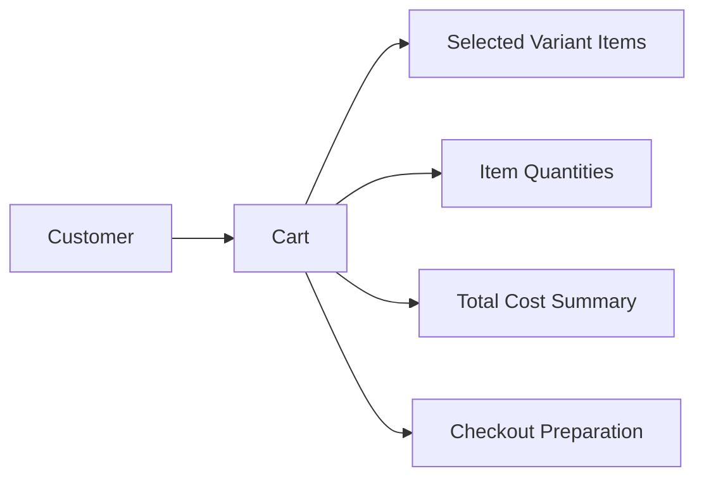

## CartItem Concept

A CartItem is one selected variant entry within a customer’s cart. It represents the specific product variant the customer intends to buy together with the chosen quantity. The cart item includes the variant selection, quantity, and subtotal as its core business meaning. CartItem is more detailed than a cart because it captures the individual line-level shopping choice. It is tied to a specific variant rather than a product in general, which is important when products have multiple options. This concept supports price calculation and item-by-item review in the cart. A cart can contain multiple cart items, each describing one purchasable selection. CartItem is the unit of intent that bridges product variant selection and eventual order creation.

### CartItem as a Specific Variant Entry

A cart item is the specific variant entry within a customer’s cart. It represents one item-level shopping choice rather than a product in general. This makes the cart item the business unit that captures exactly what the customer intends to buy when a product has multiple variants.

A cart item belongs to one cart and refers to one selected product variant. It does not describe the entire cart contents, only one line of intent inside the cart. In business terms, the cart item is the purchase line that connects the chosen variant to the customer’s intended purchase.

### Variant Selection and Quantity

A cart item records the selected variant as the exact product variant the customer chose for purchase intent. The chosen variant is the defining selection for the cart item and is what makes the item specific rather than generic.

A cart item also records quantity. Quantity expresses how many units of the selected variant the customer intends to buy as one purchase line. When a customer adds the same selected variant more than once, the cart item continues to represent that same variant selection with a combined quantity.

### Subtotal and Price Calculation

A cart item includes a subtotal as its business value for price calculation. The subtotal represents the price contribution of that cart item based on the selected variant and the quantity chosen.

The cart item is the level at which item-level price calculation happens inside the cart. It supports the cart’s total by contributing one line item amount for each selected variant entry. If the selected variant has a specific price, the cart item subtotal reflects that variant-specific price together with the quantity.

### Cart Contents and Purchase Line Meaning

Cart contents are made up of cart items, with each cart item acting as one line item in the customer’s cart. This structure allows the cart to represent multiple distinct purchase lines without mixing different variants together.

The cart item is the smallest shopping unit that appears in cart contents. It is the item-level shopping choice that the customer can review as part of the cart before checkout, and it is the business representation of one intended purchase line rather than a whole cart or a whole product.

## Order Concept

An Order is the completed purchase record created for a customer after payment is accepted. It represents the overall transaction that groups one or more purchased items into a single business record. The order includes an order number, a date, and a total price as its defining attributes. It acts as the customer’s historical record of what was bought and when it was bought. An order may include items from different sellers, so it can span more than one merchant relationship. The order serves as the parent business object for item-level statuses, shipping information, and post-purchase actions. It is a permanent commercial record used for history, fulfillment, and dispute-related reference. This concept captures the finalized transaction that sits between the cart and the shipment, review, or request records.

### Order Concept

An order is the completed purchase record created for a customer after payment is accepted. It represents the finalized transaction for the purchase and serves as the parent purchase record for the items included in that transaction.

An order is identified by an order number and an order date. The order number distinguishes the purchase record from other orders, and the order date identifies when the purchase was completed.

An order includes a total price that represents the full value of the purchase record. This total price reflects the combined purchase value of the items included in the order.

An order is part of the customer’s transaction history. It preserves the customer’s record of completed purchases so the customer can view past transactions over time.

An order may include items from more than one seller. In that case, the order remains a single customer purchase record while still grouping together multiple seller relationships within the same finalized transaction.

An order is the top-level business record for the purchase. It holds the overall transaction context for the order items, shipping information, and post-purchase records that belong to that purchase.

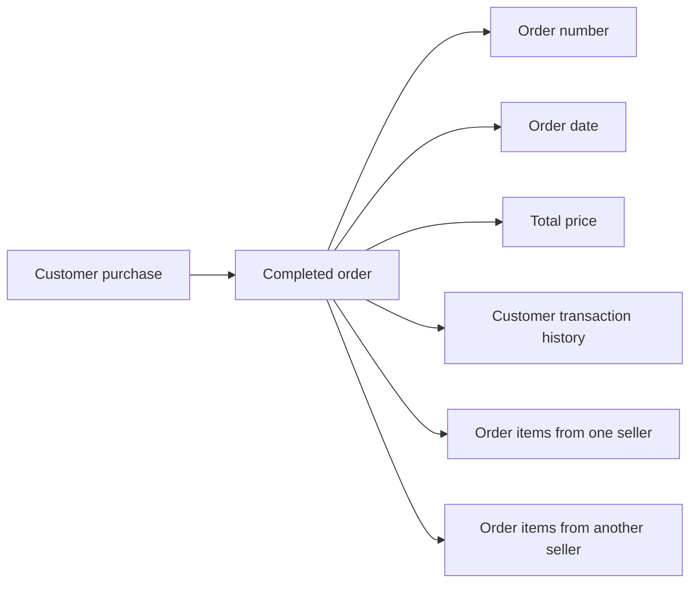

## OrderItem Concept

An OrderItem is one purchased product variant within an order. It represents the exact item, quantity, and status associated with a customer’s purchase. The order item includes preserved snapshots of the product, the selected variant, and the seller profile at the time of purchase. This makes OrderItem the key business record for understanding what the customer actually bought, independent of later catalog changes. Because an order can contain items from multiple sellers, each order item carries its own seller context. The item-level structure is important for shipping, cancellation, refund, and review-related business records. OrderItem preserves the commercial state of the purchase at the moment the transaction was made. It is the detailed evidence of what was bought, from whom, and in what purchased form.

### Order Item as the Purchased Unit

An order item is the smallest purchased unit within an order and represents one specific product variant purchased by a customer. It captures the exact purchased product variant, the purchased quantity, and the item status for that portion of the order. Because an order can contain items from different sellers, each order item is treated as its own item-level order record with its own seller context.

An order item serves as purchase evidence because it preserves what was actually bought at the time of purchase, rather than relying on the current product catalog. This makes the order item the authoritative record for later review of the purchase, shipping, cancellation, refund, and delivery history related to that item.

The order item is defined by the preserved purchase state of the product, the selected variant, and the seller profile at the time the order was placed. Later changes to the product, variant, or seller profile do not change the meaning of the already created order item.

### Purchased Product Variant and Quantity

An order item always refers to one purchased product variant, not to a product in general. The selected variant is the exact purchasable form that the customer bought, including the specific option combination associated with that purchase.

The quantity on an order item states how many units of that purchased product variant were included in the order. If a customer buys multiple units of the same variant in one order, they are represented together as one order item with the corresponding quantity.

The order item quantity is part of the preserved purchase state and is not a description of current availability. It remains the record of what was purchased, even if the variant later changes or is no longer available.

### Item Status

The item status belongs to the individual order item and describes the current business state of that purchased unit. Each order item has its own status because items within the same order may progress differently when they come from different sellers or move through different post-purchase outcomes.

The order item status is part of the item-level order record and is preserved as business evidence alongside the purchase details. It helps distinguish the current state of the item from the frozen purchase information captured at the time of the transaction.

Mermaid diagram:
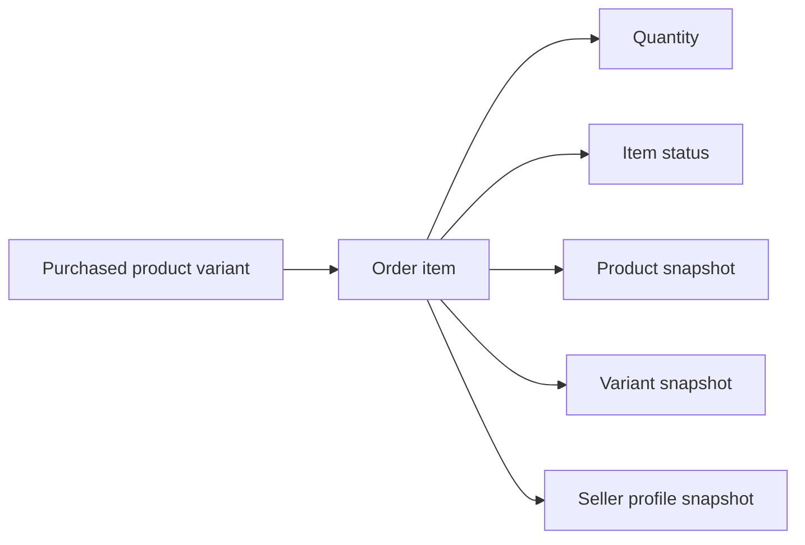

### Preserved Purchase State

An order item preserves the purchase state of three business elements at the time of purchase: the product snapshot, the variant snapshot, and the seller profile snapshot. Together, these snapshots preserve the exact commercial context of the item as it was sold.

The product snapshot captures the product as it existed when the order item was created. The variant snapshot captures the selected variant as it existed at that same moment. The seller profile snapshot captures the seller identity details that must remain associated with the item for historical and recordkeeping purposes.

This preserved purchase state ensures that the order item continues to show what the customer bought and from whom, even after later updates, deletions, or catalog changes elsewhere in the platform.

## Shipment Concept

A Shipment is a package-level delivery record associated with a seller’s fulfilled items. It represents the physical or logistical grouping used to track how purchased items are sent to the customer. The shipment concept includes carrier name and tracking number as core delivery attributes. A shipment can contain one or more order items from the same seller, which makes it distinct from the order itself. Shipment is the business object that connects shipping responsibility with delivery tracking details. It helps separate different sellers’ delivery flows, since items from different sellers are handled in separate shipments. The shipment record exists so customers can understand progress and tracking for grouped items. This concept captures the delivery container and its tracking identity within the marketplace.

### Shipment Identity

A shipment is the business record that identifies one package-level delivery from a seller to a customer. It serves as the delivery container for one or more order items that are sent together. Shipment identity is what allows the marketplace to distinguish one delivery package from another when multiple deliveries exist within the same order.

A shipment belongs to a single seller for the purpose of delivery grouping, so items from different sellers are not combined into the same shipment. This keeps the shipment tied to one seller’s fulfillment responsibility and one tracking identity.

The shipment concept exists to represent the packaged delivery unit rather than the order itself. In business terms, it is the delivery record that customers and sellers use to understand which purchased items travel together and how that delivery is identified over time.

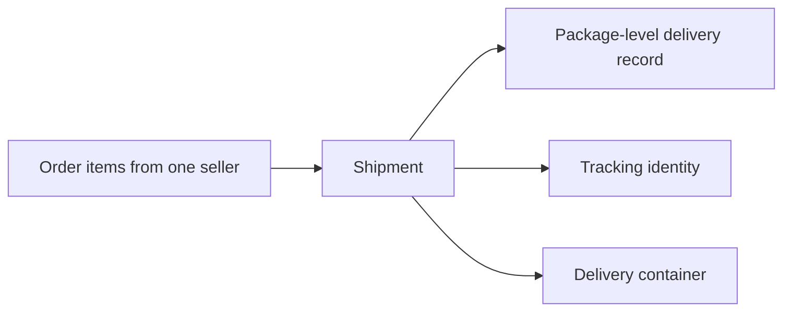

### Carrier and Tracking Information

A shipment includes carrier name and tracking number as its core tracking information. These values describe how the package is being transported and how the delivery can be recognized across the marketplace and by the delivery service.

The carrier name identifies the shipping service responsible for transporting the shipment. The tracking number identifies the specific shipment within that carrier’s delivery process. Together, they form the shipment’s tracking information and give the shipment its external delivery reference.

Tracking information belongs to the shipment as a package-level delivery record, not to the order as a whole. When a shipment is referenced in the business domain, its tracking details are part of what makes the shipment understandable as a distinct delivery container.

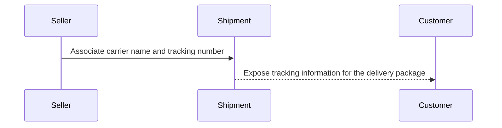

### Delivery Grouping and Order Item Grouping

A shipment is the delivery grouping used to collect order items that are sent together from the same seller. This grouping is what makes a shipment different from a single order item, because the shipment can contain one or more order items that share the same delivery trip.

Order item grouping happens at the shipment level: multiple items can be grouped into one shipment when they belong to the same seller and are being delivered together. If a customer has items from different sellers, each seller’s items are grouped into separate shipments rather than one shared delivery container.

This concept exists so the marketplace can represent grouped delivery in a way that reflects seller-specific fulfillment. The shipment is therefore both a package-level delivery record and the business unit that links grouped order items to one delivery identity.

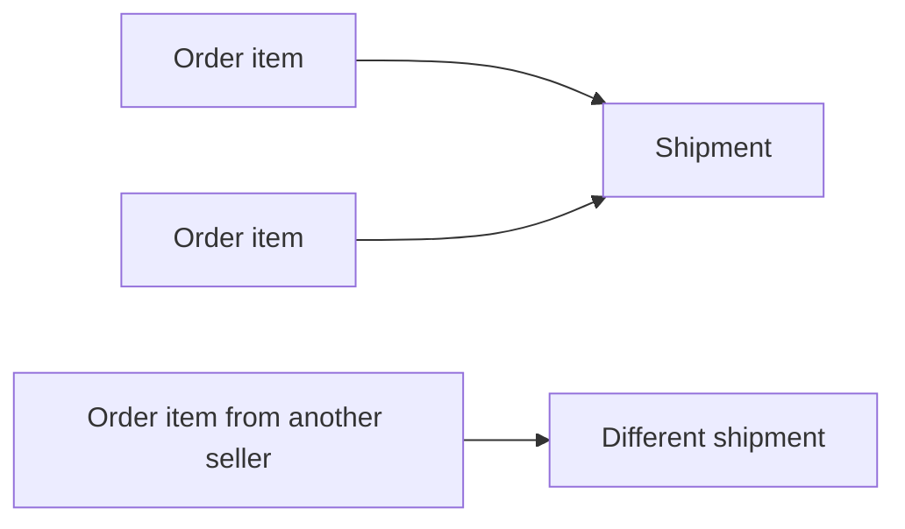

## CancellationRequest Concept

A CancellationRequest is a customer-initiated request to stop a purchased order item before it is fully processed. It represents a business record tied to one specific order item rather than an entire order. The cancellation request includes a reason and a status, which together describe why the request exists and where it stands. Because it is request-based, it preserves the state of the cancellation discussion as part of the transaction history. CancellationRequest is important for business accountability in cases where a customer changes their mind or there is a dispute about fulfillment. The request can carry response state snapshots so later reviews can understand what was decided. It belongs to the item-level post-purchase record set and is connected to the preserved order history. This concept captures the cancellation request as a tracked decision record for a single purchased item.

### Cancellation Request Concept

A cancellation request is a post-purchase dispute record created for one purchased order item. It represents a customer-initiated attempt to reverse the purchase of that item before the transaction is fully completed. The request belongs to a single order item and never represents an entire order. As a decision record, it preserves the business reason for the request and the current status of that request so the cancellation conversation can be understood later. This concept exists to support item-level cancellation handling and to keep the order item request history clear and auditable.

A cancellation request is tied to the purchased item itself, not to the overall order, because cancellation is handled at the item level. This means the request is part of the order item request record set and is used only for that specific purchased item. The request helps distinguish a purchase reversal request for one item from other post-purchase records that may exist for the same order.

The reason is a required part of the cancellation request concept. It captures why the customer is asking for cancellation and becomes part of the preserved business history for that item. The status is also part of the concept and shows where the request currently stands in the cancellation discussion. Together, the reason and status define the business meaning of the request and make it possible to understand the request without relying on outside context.

Each change in the cancellation request is preserved through a request state snapshot. The snapshot records the state of the request at the moment the decision changed, so later reviewers can see what the request looked like before and after the change. This is especially important for cancellation history and dispute resolution because the platform must preserve the business record of what was requested and how it changed over time.

Cancellation requests are part of the platform’s preserved transaction history. Even when the request is no longer active, its record remains available as a cancellation history item so the full story of the disputed purchase can be reviewed by the relevant parties.

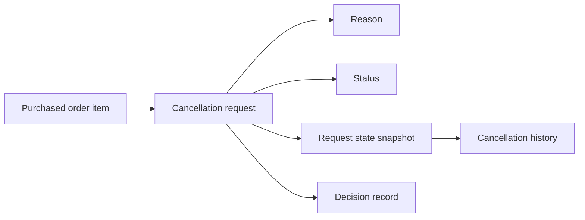


### Item-Level Cancellation

Item-level cancellation means the cancellation request applies to one specific order item rather than the whole order. This keeps the business record aligned with how post-purchase disputes are handled for purchased items. If a customer wants to reverse only one part of a multi-item order, the cancellation request remains limited to that single order item and does not redefine the rest of the order.

This concept is important because an order can contain more than one order item, and each item may need to be reviewed independently. The cancellation request therefore acts as an item-level decision record that belongs to the purchased item and reflects only that item’s cancellation discussion.

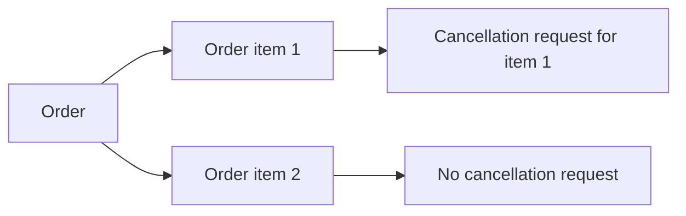


### Cancellation Request Status

The status of a cancellation request shows the current state of the request within the cancellation discussion. It identifies whether the request is still pending review, has been resolved, or is otherwise no longer active. The status is part of the request’s business meaning and is preserved as part of the cancellation record.

The status exists so that relevant parties can understand whether the post-purchase dispute is still open or already decided. Because the request is a decision record, the status is one of the key values that describes the record at any moment in time.

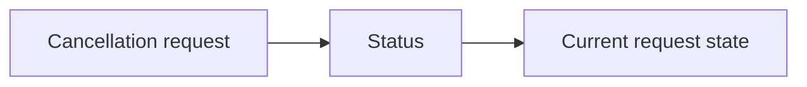


### Request State Snapshot and Cancellation History

A request state snapshot is the preserved record of a cancellation request at a specific point in time. It captures the state of the request so the platform can show how the request changed during the cancellation discussion. The snapshot supports cancellation history by keeping the earlier and later states available for later review.

The cancellation history is the sequence of preserved request states and decisions for the order item. It allows relevant parties to understand the full path of the post-purchase dispute without losing the earlier context. Because snapshots are part of the decision record, the history remains usable for accountability and review even after the request has moved on from its original state.

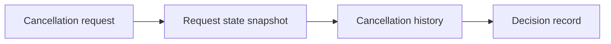


## RefundRequest Concept

A RefundRequest is a customer-initiated request for money to be returned for a delivered order item. It represents a business record tied to one specific item rather than the whole order. The refund request includes a reason and a status, which capture the justification and current state of the request. It is part of the post-delivery business history and reflects the customer’s claim that the item should be refunded. RefundRequest may also hold preserved response state so the record remains useful for later review or dispute resolution. This concept is important because it connects customer experience, seller accountability, and preserved transaction records. The request belongs to the item-level commercial history rather than the product catalog. RefundRequest captures the refund-related decision trail for a single purchased item.

### Refund Request as an Item-Level Customer Claim

A refund request is the customer’s request for money to be returned for one delivered order item.
It belongs to a single order item and does not represent the whole order.
It is a post-delivery request because it applies only after the item has been delivered.
It serves as a customer claim record for that item’s refund-related history.
The refund request captures the refund issue for the specific purchased item rather than the product catalog or the overall order.

### Refund Request Reason and Status

A refund request includes a reason, which records why the customer believes the delivered item should be refunded.
A refund request also includes a status, which records the current state of the request.
The reason and status together define the business meaning of the request at any point in time.
The status shows whether the request is still under consideration, has been resolved, or has reached another final request state defined by the business process.
The reason remains part of the preserved refund history even when the request state changes.

### Refund History and Dispute Record

A refund request is part of the refund history for the order item.
It contributes to the preserved business record of how the refund issue was raised and resolved.
Because the request is tied to a specific delivered item, it also functions as a dispute record for that item’s post-delivery commercial history.
The preserved record allows relevant parties to review the refund claim later when there is a need to understand the transaction history.
The refund history keeps the request separate from the product itself and focuses on the item-level purchase outcome.

### Request State Snapshot

A refund request includes a request state snapshot when its state changes.
The snapshot preserves the condition of the request at the time of review or response.
It records what changed, along with the values before and after the change.
The snapshot makes the request suitable for later review and dispute resolution because earlier request states remain preserved.
The request state snapshot is part of the broader snapshot principle applied to editable business records.

## Review Concept

A Review is a customer’s feedback record for a product that was purchased and experienced. It represents the customer’s evaluation of the product from a business and shopping perspective. The review includes a rating and text content, which together describe both the score and the written opinion. Reviews are associated with products rather than with sellers alone, so they contribute to the public perception of a product listing. The concept also supports visibility status so the platform can manage how the review appears in the record set. Review history matters because preserved review content may still be used even if the original account is no longer active. The review record helps build product reputation and informs other customers during product evaluation. This concept captures the user-generated assessment of a product within the marketplace.

### Review Concept

A review is a customer’s feedback record about a product they purchased and experienced. It represents the customer’s evaluation of that product from a shopping and product-quality perspective, and it is tied to a specific purchased product rather than to the seller alone.

The review contains a rating and text content. The rating expresses the customer’s score for the product, while the text content captures the customer’s written opinion and details about the experience. Together, these fields form the review’s public opinion record.

A review is associated with the purchased product context, so it reflects what the customer received at the time of purchase rather than a later version of the product. This makes the review part of the historical record of the purchase experience.

Reviews contribute to product reputation by showing how customers evaluate the product over time. The collection of reviews helps other customers understand how the product is perceived in the marketplace.

A review includes a visibility status (defined in [Business Category Definitions]) so the platform can manage how the review is represented in the record set. The visibility status does not change the fact that the review remains part of the review history.

Review history matters because reviews remain as part of the preserved business record even when the original customer account is no longer active. This preserves the customer’s feedback as part of the product’s long-term reputation record.

## Snapshot Concept

A Snapshot is a preserved record of how an editable business object looked at a specific point in time. It exists to keep a permanent historical view of changes in a money-related marketplace. The snapshot includes the time of change, what values changed, and the before and after state of the data. This makes Snapshot the business concept used for dispute review, audit awareness, and historical continuity. Snapshots are immutable, which means the preserved record itself is not meant to be altered or removed. The concept applies broadly across products, product variants, seller profiles, order-related records, reviews, cancellation requests, and refund requests. A snapshot is not the current live object; it is the historical evidence of a prior state. This concept captures the platform’s requirement to remember meaningful changes in business data.

### Snapshot Concept

A snapshot is the platform’s historical record of an editable business object at a specific moment in time. It preserves the state of the object before a change and the state after the change, together with the values that were changed and the time the change was made. This gives the platform a business history of important data changes so that the prior state can still be understood after the live data has moved on.

A snapshot is an immutable record. Once created, it is not altered or removed as part of normal business use, because its purpose is to preserve evidence of what existed before a change. The snapshot therefore represents preserved state rather than the current live object.

A snapshot supports audit trail review by showing when a change happened, what changed, and how the value differed before and after the change. This makes it useful for dispute review, where relevant parties need to inspect the history of a product, variant, seller profile, review, or request response without relying only on the current version.

A snapshot is not the business object itself and does not replace the current record. Instead, it acts as the preserved history of that record at a meaningful point in time. In this domain, the snapshot concept is the business mechanism that keeps previous states visible for accountability, continuity, and review.

## SellerApprovalRequest Concept

A SellerApprovalRequest is the registration request record for a seller account. It represents the business object that shows whether a merchant is waiting for approval, has been approved, or has been rejected. The request includes a registration status and, when applicable, a rejection reason. This concept helps separate the merchant’s desire to sell from the platform’s authorization to allow selling. SellerApprovalRequest is important for marketplace governance because seller participation depends on this approval record. It supports the life cycle of a seller account while preserving the reason for rejection if the request does not succeed. The concept belongs to seller onboarding and moderation records rather than product or order records. It captures the status of a seller’s request to become an active merchant on the platform.

### SellerApprovalRequest Concept

A seller approval request is the business record that represents a seller’s registration request for merchant authorization on the platform. It separates the seller’s desire to begin selling from the platform’s decision about whether that seller may participate as an active merchant.

This concept is a seller onboarding record and a seller moderation record because it tracks both the initial request to sell and the platform’s review outcome. The request exists to show whether the seller is still waiting for a decision, has been approved to sell, or has been rejected.

The request includes an approval status, which is the authoritative indicator of the current decision state for the seller’s application. The possible approval states are pending, approved, and rejected. A pending seller request means the platform has received the registration request but has not completed its decision. An approved seller request means the platform has accepted the seller for merchant authorization. A rejected seller request means the platform has refused the registration request.

The request also includes a rejection reason when the request has been rejected. The rejection reason preserves the explanation for the moderation outcome so the seller can understand why the request was not accepted.

A seller approval request belongs to the seller onboarding process rather than product management, order handling, or account profile data. It is the business object that records the moderation result for a merchant application.

Mermaid state flow:
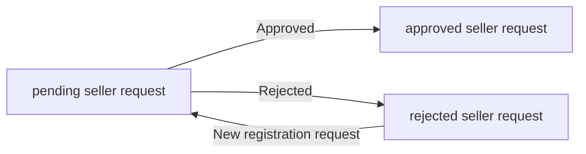


## AdministratorRequest Concept

An AdministratorRequest is a user-submitted request to become an administrator on the platform. It represents the business record that captures the reason a user wants to take on administrative responsibility. The request includes a reason and an approval status, which together define the request’s meaning in governance terms. This concept is distinct from the administrator identity itself because it reflects the path toward administrative status rather than the status after approval. AdministratorRequest supports platform oversight by preserving the intent and result of each application for administrative role membership. It applies to users who are currently customers or sellers and are seeking a governance role. The request record is part of the platform’s authority management history. This concept captures the application record for moving into the administrator domain.

### AdministratorRequest Concept

An AdministratorRequest is the business record that captures a user’s application to take on administrative responsibility on the platform. It represents an admin application, a governance application, and a role transition request from a customer or seller into the administrator domain.

The request records the reason supplied by the applicant. This request reason explains why the user is seeking administrative authority and forms part of the request’s meaning in governance review.

The request has an approval status that identifies whether it is pending, approved, or rejected. A pending administrator request is one that is still awaiting governance review. An approved administrator request is one that has been accepted as the basis for the user becoming a regular administrator. A rejected administrator request is one that has been declined and remains a historical record of the attempt.

An AdministratorRequest is also an authority management record. It preserves the platform’s history of who requested administrative authority, why the request was made, and how the request was resolved. This makes the request part of the platform’s oversight record rather than the administrator identity itself.

The AdministratorRequest belongs to a user who is currently a customer or seller and is seeking administrative status.

# Domain Relationships

Describe how concepts relate to each other from a business perspective.

## Conceptual Relationships

Describe how concepts relate to each other in business terms.

### Relationship Map

The platform is organized around a set of core business relationships that connect customers, sellers, administrators, products, orders, and supporting records.

A customer owns a profile, one or more shipping addresses, a wishlist, a cart, and orders. A customer also has many reviews and may have many administrator requests over time.

A seller owns a seller profile, products, product variants, product images, inventory records, shipments, cancellation requests, and refund requests through the products and orders they manage. A seller also has many approval requests over time.

An administrator is associated with governance activities across sellers, categories, customers, products, and orders. The administrator relationship is a platform oversight relationship rather than a product ownership relationship.

A product belongs to one seller and one category at a time. A product has many variants and may have many images. A product may also appear in many wishlists and carts through the product variants that customers select.

A product variant belongs to one product and has many inventory records. A product variant may also appear in many cart items and order items.

An order belongs to one customer and has many order items and many shipments. An order item belongs to one order and references one purchased product variant, while also preserving the product snapshot, variant snapshot, and seller profile snapshot for the purchase record.

A shipment belongs to one order and groups order items from one seller. A shipment can have many order items, but those items must remain from the same seller within that shipment.

A cancellation request or refund request belongs to one order item. A review belongs to one customer and one purchased order item, and it refers to the product that was purchased.

A snapshot belongs to the editable business data it preserves and is associated with the historical state of that data. Snapshots are used to preserve the prior state of products, product variants, seller profiles, reviews, cancellation requests, and refund requests.

### Ownership and Belonging

Ownership defines which business actor or parent concept controls a record, while belonging defines which record contains or organizes another record.

Customer ownership includes the customer profile, shipping addresses, wishlist, cart, and orders. These records are part of the customer’s account-based business identity.

Seller ownership includes the seller profile and the products created by that seller. Products then own their variants and images as part of the product structure.

Category ownership is hierarchical rather than personal ownership. A category may belong to another category as its parent category, creating one level of subcategory organization.

Order ownership follows the purchasing customer, while order items belong to the order and preserve what was purchased at the time of purchase. Shipments belong to the order and organize delivery by seller.

Inventory records belong to a specific product variant and represent the stock history for that variant only. A variant’s current stock is understood through the full set of its inventory records.

Approval requests belong to the account that submitted them. Seller approval requests belong to a seller, and administrator requests belong to a customer or seller.

Request responses, review visibility changes, and other editable records are part of the same ownership chain that produced them, so the preserved history remains tied to the original business record.

### Associated Historical Records

Historical records are associated with the business object they preserve and exist to show how that object changed over time.

When a product changes, its snapshot is associated with the product and includes the product’s complete business state at that moment. When a product variant changes, its snapshot is associated with the variant and records the variant’s state at that moment.

When a seller profile changes, the snapshot remains associated with that seller profile so past orders and disputes can still show the seller identity that existed at the time.

When a review is changed or removed, the snapshot remains associated with that review so the previous content can still be understood in context.

When a cancellation request or refund request changes state, the snapshot remains associated with that request so the request history can be reviewed later.

Snapshots do not replace the live business record. Instead, they are associated with it as a preserved historical view of the prior state.

### Many-to-One and One-to-Many Structure

The domain uses many-to-one and one-to-many business structures to keep records organized.

A customer has many shipping addresses. A customer has many reviews over time. A customer may also have many orders over time.

A seller has many products. A product has many variants and many images. A variant has many inventory records. An order has many order items. An order may also have many shipments.

A product belongs to one category, while a category can organize many products. A category may also have many subcategories, but only one level of nesting is allowed.

An order item belongs to one order and one purchased variant. A shipment belongs to one order and may include many order items from the same seller.

This structure ensures that business records are grouped by their parent concept and remain traceable to the original owner, product, or transaction they came from.

## Lifecycle and Retention

Describe concept lifecycle states and transitions only. Detailed retention/recovery policies belong in 05-non-functional. Operation details belong in 03-functional-requirements.

### Lifecycle

The platform maintains lifecycle states for business concepts that change over time, including accounts, products, variants, orders, shipments, requests, reviews, and snapshots.

A customer account, seller account, administrator account, product, product variant, review, cancellation request, and refund request each have a lifecycle that can move through active and inactive or final states as defined by the business process.

A seller approval request begins as pending and may move to approved or rejected.
A seller account may remain pending approval, become approved for selling, or become rejected.
An administrator request begins as pending and may move to approved or rejected.

A product may move from available to deleted.
A product variant may move from available to deleted or out of stock.
A review may move from visible to deleted while its historical record remains preserved.
A cancellation request and a refund request may move through pending, approved, and rejected states.

An order item may move through paid, shipped, delivered, cancelled, and refunded states.
A shipment may move from created to shipped and then to delivered through delivery confirmation or automatic completion.

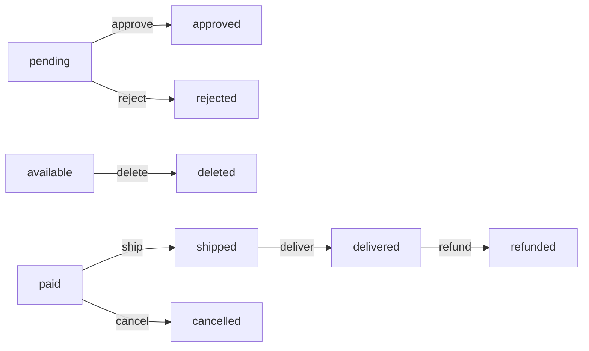

### Retention

The platform retains preserved business records when deletion or status change would otherwise remove them from active use.

When a customer deletes their account, the customer profile information is removed, but their orders and order history are retained for seller records and legal purposes, and their reviews are retained with the author shown as a deleted user.

When a seller deletes their account, their products are removed from listings, but order history and snapshots are retained, and the seller shop name remains preserved in past orders.

Snapshots are retained as immutable historical records after the related editable data changes.
Snapshots remain available for dispute resolution to relevant parties such as owners and administrators.

Product snapshots retain the full product state at the time of change, including the product and all of its variants at that moment.
Order item snapshots retain the purchased product, variant, and seller profile as they existed at the time of purchase.
Review snapshots retain prior review states after edits.
Cancellation request and refund request snapshots retain prior request states after seller responses.

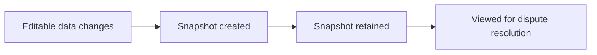

### Archival

Archival in this platform means preserving historical business information while the active record changes or is removed.

Past orders act as archived purchase records for customers, sellers, and administrators because they preserve order history even when related accounts are deleted.
Order items preserve snapshots of the product, variant, and seller profile so the original purchase context remains available after later edits or deletion.
Seller and product snapshots preserve the prior state of the business record so that past changes can be reviewed even after the live record no longer exists.

Reviews that were created by a deleted customer are archived in preserved form and displayed as coming from a deleted user.
Products removed by seller deletion or administrator action are archived in historical snapshots even though they no longer appear in active listings.

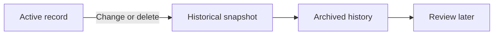

### Deletion Policy

Deletion removes the live record from active use, but only within the limits defined by the business rules for each concept.

A customer account deletion removes the customer profile information.
A seller account deletion removes the seller's products from active listings.
A product deletion removes the product and its variants from active listings.
A product image deletion removes the image from the product's active image set.
A review deletion removes the review from active display.

Deletion is not allowed when the related business record must remain active for ongoing commercial processing.
A seller account cannot be deleted while it still has pending orders, pending cancellation requests, or pending refund requests.
A product cannot be deleted while it still has pending order items, pending cancellation requests, or pending refund requests for any of its variants.
A product variant cannot be deleted while it still has pending order items, pending cancellation requests, or pending refund requests for that variant.

Deleted records that are required for historical business continuity remain preserved as snapshots or archived order history rather than as active records.

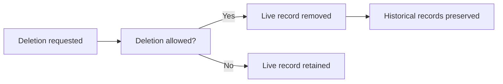

### Recovery

Recovery in this platform means restoring the business continuity of records that were affected by cancellation, refund, or deletion-related lifecycle changes.

When a cancellation request is approved, the cancelled order item restores its stock quantity through an inventory record.
When a refund request is approved, the refunded order item restores its stock quantity through an inventory record.
When a shipment is confirmed as delivered, the order item moves to delivered and remains available for later review or refund processing within the allowed business window.

When a seller is rejected, the seller can submit a new registration request.
When a rejected seller resubmits, the new request becomes the active approval record for that seller.

Historical snapshots themselves are not recovered by editing or replacement because they are immutable, but they remain available for viewing after the related live record has changed or been deleted.
This preserves the ability to recover the business context of earlier states without changing the preserved record.

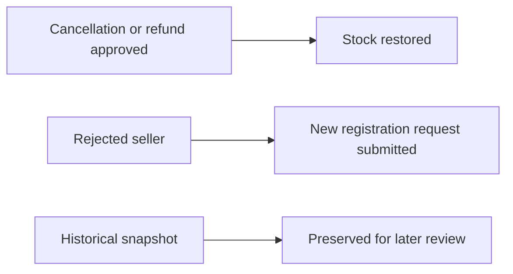

# Business Categories and State Flows

Business category classifications and state flow definitions.

## Business Category Definitions

Define all business category classifications with their allowed values and descriptions.

### Business Category

A business category is a product classification used to organize products on the platform.

A business category groups products into a navigable structure that customers can browse and use to narrow product discovery.

A business category can contain a description that explains what kinds of products belong in that category.

A business category may also contain a parent category when it is used as a subcategory.

A business category is managed by administrators only.

```mermaid
flowchart LR
    A["Business Category"] --> B["Classifies Products"]
    A --> C["Has Description"]
    A --> D["May Have Parent Category"]
```

### Classification

Classification means assigning a product to the business category that best represents it.

Each product belongs to one business category for classification purposes.

A subcategory is a classification option that sits one level below a parent category.

The classification structure is limited to one level of nesting only.

Customers can browse categories and view products within a category based on this classification structure.

```mermaid
flowchart LR
    A["Parent Category"] --> B["Subcategory"]
    B --> C["Product Classification"]
```

### Allowed Values

The allowed values for business category structure are limited to the following classification forms:

- A top-level category with no parent category
- A subcategory with one parent category

The allowed values for category information are the category name and category description.

The allowed values for the hierarchical structure do not include deeper nesting beyond one parent and one child level.

When a product is placed in a business category, the selected category may be either a top-level category or an allowed subcategory.

```mermaid
flowchart LR
    A["Top-Level Category"] --> B["Allowed"]
    C["Subcategory"] --> B
    D["Deeper Nesting"] --> E["Not Allowed"]
```

### Status Type

The status type for a business category describes whether the category can be used in product organization and browsing.

A category status type may be considered active when it is available for organizing products and browsing.

A category status type may be considered unavailable when it is not available for product organization or browsing.

If a category is removed, products in that category become uncategorized rather than remaining assigned to the removed category.

The status type concept supports category visibility and availability without changing the category's core definition as a product classification.

```mermaid
flowchart LR
    A["Active Category"] --> B["Available for Classification"]
    C["Unavailable Category"] --> D["Not Available for Classification"]
    C --> E["Products Become Uncategorized When Removed"]
```

## State Transitions

Define valid state transition paths for stateful concepts.

### State-Flow Overview

The platform uses explicit state flows for business concepts whose status changes affect selling, purchasing, shipping, cancellation, refunding, and moderation.

A state change is recorded whenever a concept moves from one valid status to another. The state flow must preserve the meaning of the business process at each step so that customers, sellers, and administrators can understand what is currently happening.

State flows apply to the following business concepts:
- seller approval requests
- seller accounts
- administrator requests
- products and product visibility
- product variants and stock availability
- order items
- shipments
- cancellation requests
- refund requests
- reviews

Each state flow must allow only the transitions that are part of the business workflow described in the source requirements. A state change that is not part of the approved workflow is not a valid business transition.

Mermaid diagram:
```mermaid
flowchart LR
    A["Business concept"] --> B["Current status"]
    B --> C["Allowed transition"]
    C --> D["New status"]
```


### Seller and Administrator Request Transitions

Seller approval requests follow a request workflow with approval and rejection outcomes.

- A seller approval request starts in a pending state.
- When an administrator approves the request, the seller approval request changes to approved.
- When an administrator rejects the request, the seller approval request changes to rejected.
- When a seller submits a new registration request after rejection, a new pending request is created rather than changing the rejected request back to pending.

Administrator requests follow a similar workflow.

- An administrator request starts in a pending state.
- When a super administrator approves the request, the request changes to approved and the applicant becomes a regular administrator.
- When a super administrator rejects the request, the request changes to rejected.
- An approved request does not return to pending.
- A rejected request does not become approved through the same request record.

Mermaid diagram:
```mermaid
flowchart LR
    A["pending"] -->|"Approve"| B["approved"]
    A -->|"Reject"| C["rejected"]
    C -->|"Submit new request"| A
```


### Order Item and Shipment Transitions

Order items follow a fulfillment workflow from payment to delivery, with optional cancellation or refund paths.

- An order item enters the paid state when payment for the order succeeds.
- A paid order item changes to shipped when a seller includes it in a shipment.
- A shipped order item changes to delivered when the shipment is confirmed delivered by the customer or when delivery occurs automatically after the delivery waiting period described in the source requirements.
- A paid order item can change to cancelled when a cancellation request is approved.
- A delivered order item can change to refunded when a refund request is approved.
- A cancelled item and a refunded item are terminal item states in the business workflow.

Shipments group order items from the same seller.

- A shipment starts when the seller creates a shipment for one or more eligible order items.
- When the shipment is created, every item in that shipment changes to shipped.
- When the shipment is confirmed delivered, every item in that shipment changes to delivered.
- Different sellers do not share the same shipment workflow.

Mermaid diagram:
```mermaid
flowchart LR
    A["paid"] -->|"Ship"| B["shipped"]
    B -->|"Confirm delivery"| C["delivered"]
    A -->|"Approve cancellation"| D["cancelled"]
    C -->|"Approve refund"| E["refunded"]
```


### Cancellation and Refund Request Status Changes

Cancellation requests and refund requests each follow their own request workflow.

Cancellation requests:
- A cancellation request starts in a pending state.
- When the seller approves the request, the cancellation request changes to approved and the related order item changes to cancelled.
- When the seller rejects the request, the cancellation request changes to rejected and the related order item remains in its current state.
- The request state change must be preserved as a snapshot when the seller responds.

Refund requests:
- A refund request starts in a pending state.
- When the seller approves the request, the refund request changes to approved and the related order item changes to refunded.
- When the seller rejects the request, the refund request changes to rejected and the related order item remains in its current state.
- The request state change must be preserved as a snapshot when the seller responds.

Mermaid diagram:
```mermaid
flowchart LR
    A["pending"] -->|"Approve"| B["approved"]
    A -->|"Reject"| C["rejected"]
```


### Product, Variant, Review, and Visibility Status Changes

Products and variants use status changes that reflect availability and seller control.

- A product becomes unavailable when it has no variants and remains visible in search in that state.
- A deleted product no longer appears in search or category listings.
- A suspended seller's products become hidden from search and category listings, and they become visible again when the seller is unsuspended.
- A variant becomes out of stock when its stock reaches zero.
- An out of stock variant cannot be added to the cart.
- A deleted variant is no longer available for purchase.

Reviews also have a visibility-related status flow.

- A review is created as a customer-visible review after the purchase conditions are met.
- A review may be edited by its owner, creating a snapshot of the status change.
- A review may be deleted by its owner, but the historical snapshot remains preserved.
- A deleted user’s review remains visible as authored by a deleted user.

Mermaid diagram:
```mermaid
flowchart LR
    A["available"] -->|"Stock reaches zero"| B["out of stock"]
    B -->|"Restock"| A
    C["visible"] -->|"Delete product"| D["deleted"]
    E["active review"] -->|"Delete review"| F["deleted"]
```