**mallPlatform — Business concepts, relationships, and states from user perspective**

Business concepts, relationships, and states from user perspective

# Domain Concepts

Describe what each concept means in the business domain and its key attributes.

## CustomerAccount Concept

CustomerAccount represents the basic identity of a shopper who is allowed to use the platform. It captures the account-level identity used for sign-in and access to customer features. The account is centered on email and password as the primary login identity. It also reflects that a customer must have a registered account before using the platform, since guest access is not allowed. This concept is separate from customer profile details, which describe the person’s public-facing contact information. It is also separate from shipping addresses, which are managed as a collection linked to the same account. When a customer account is removed, the platform preserves order-related records and review history for business and legal continuity, even though the customer profile itself is deleted. The account concept therefore supports both access control and long-term commerce recordkeeping.

### Registered Shopper Identity

The customer account is the registered identity for a shopper who is allowed to use the platform.
It represents the account-level identity used to recognize the shopper across platform activities.
A customer account exists as the business record that enables shopping participation and separates the shopper’s access identity from profile details.
The customer account is distinct from the customer profile, which contains public-facing contact information and is defined in the customer profile concept.
The customer account is also distinct from shipping addresses, which are separate saved records linked to the same account.

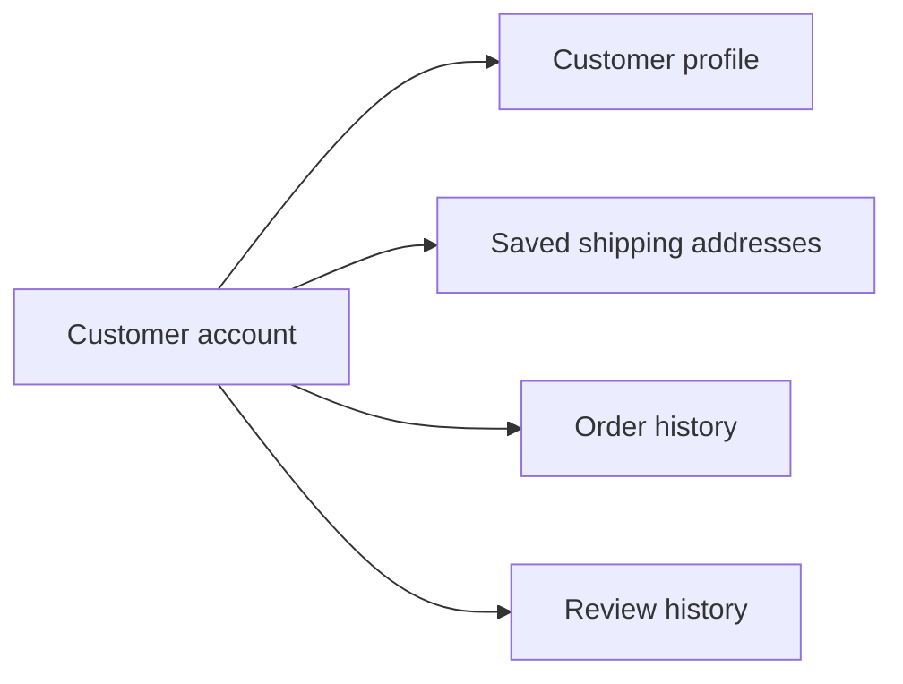

### Email and Password Login

The customer account uses email and password as its login identity.
The same account identity is used for sign-in across customer access to the platform.
This concept covers the account-level credential relationship only and does not redefine authentication behavior, which is handled in the authentication file.
The account remains the source of identity for a registered shopper across platform usage.

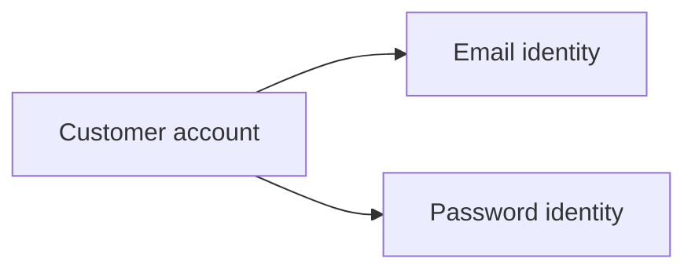

### No Guest Browsing and Account-Level Access

Customer access is account-level only, because the platform does not allow guest browsing.
A shopper must have a registered customer account before using platform features.
The customer account therefore acts as the required access record for shopper use of the platform.
This requirement describes the business meaning of the account as a gate to platform participation, not the detailed access rules themselves.

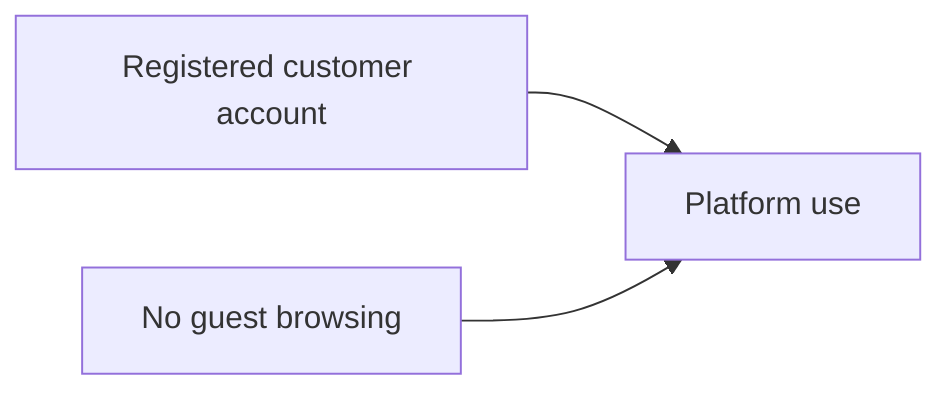

### Linked Saved Addresses

A customer account is linked to one or more saved shipping addresses.
The account is the parent business concept for address management, while each shipping address remains its own separate concept.
Saved addresses belong to the customer account and are used as part of the shopper’s stored identity and purchase readiness.
This relationship allows a single customer account to maintain multiple delivery destinations under one shopper identity.

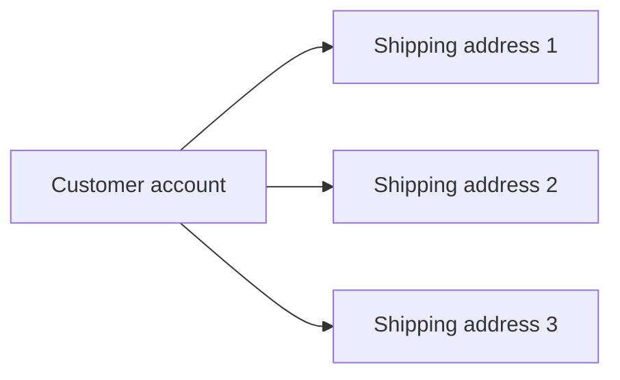

### Deletion and Preserved Order History

When a customer account is deleted, the account’s profile information is removed.
The customer’s order history is preserved after deletion for seller records and legal purposes.
The preserved order history remains associated with past commerce records even though the customer account itself is removed from active use.
This preserves the business continuity of completed transactions linked to the deleted customer account.

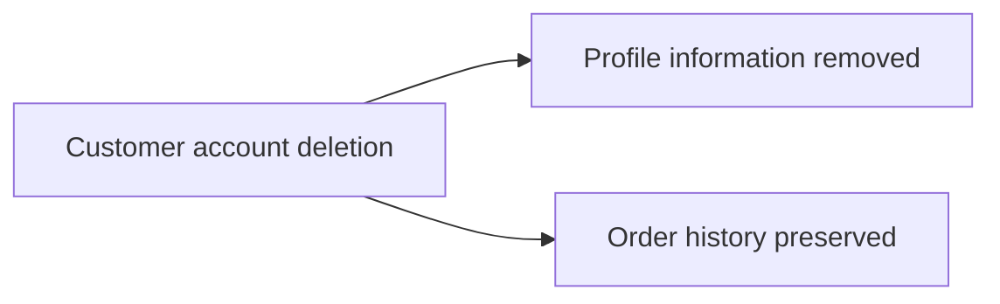

### Deletion and Preserved Review History

When a customer account is deleted, the customer’s reviews are preserved.
Preserved reviews are displayed as coming from a deleted user.
This means the review content remains part of the platform’s product history even after the customer identity is no longer active.
The deleted account no longer appears as an active customer identity, but the review record remains available in its preserved form.

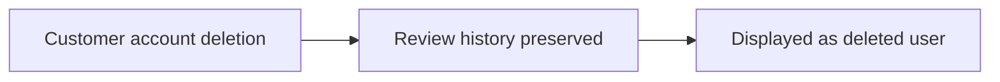

## CustomerProfile Concept

CustomerProfile represents the personal profile information associated with a customer account. It is the customer-facing identity used in the shopping experience, distinct from the sign-in credentials. The profile contains the display name shown to other users and the phone number used as contact information. This concept helps the platform present a more complete customer identity without exposing login details. It belongs to the customer account and exists alongside order, address, and review activity. The profile is treated as editable business data because it may need to reflect current contact or naming preferences. If the account is deleted, the profile information itself does not remain as an active customer profile. The concept is focused on how the customer is recognized in the marketplace rather than on authentication or purchase records.

### Customer Profile Overview

CustomerProfile is the personal profile associated with a customer account and used as the customer's customer-facing identity in the marketplace. It represents how the customer is recognized by others during shopping and related account activity, separate from sign-in credentials. The profile is linked to exactly one customer account and exists as profile details linked to account. The profile is editable personal profile data because the customer can update it as their shopping identity changes. The customer profile contains display name and phone number as its core details. The display name is the name shown to other users, and the phone number is the contact information used for reaching the customer. The profile information is deleted with the account when the customer account is deleted, so it does not remain as an active customer profile after account removal.

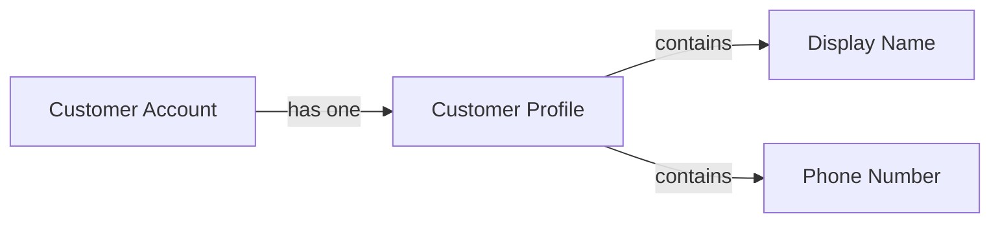

### Customer Profile Identity

The customer profile provides the shopping identity that appears in the customer experience and supports customer recognition across the platform. It is the business representation of the customer that other users can identify during marketplace activity. The profile information is limited to the display name and phone number defined for the customer profile concept, and those details together form the customer-facing identity. The customer profile remains associated with the customer account throughout the account lifecycle until the account is deleted. Because the profile is personal account data, it is treated as a mutable concept that can reflect the customer’s current preferred name and contact details. When the account is removed, the associated profile information is removed as well and is no longer available as an active customer identity.

### Customer Profile Lifecycle

A customer profile exists only in connection with a customer account. It is created as part of the account relationship and remains available while the account is active. The profile is considered editable because the customer can change the display name and phone number over time. The profile is not a separate independent business record; it is profile details linked to account. If the customer account is deleted, the customer profile information is deleted with it. This lifecycle makes the profile suitable for current customer presentation while keeping the identity tied to the owning account.

## ShippingAddress Concept

ShippingAddress represents a delivery destination saved under a customer account. It is used to identify where purchased items should be sent. Each address contains the recipient name, phone number, street address, city, state or province, postal code, and country. The concept supports customers who need more than one delivery destination, such as home, office, or family locations. A shipping address is a structured contact record rather than a general profile note. One address can be treated as the default shipping choice for convenience during checkout. The same customer can maintain multiple addresses at the same time. ShippingAddress is part of the customer’s commerce records and is distinct from product, order, or seller information.

### Shipping Address Concept

A shipping address is a delivery destination record saved under a customer account. It represents where purchased items should be sent and is part of the customer’s address book. A customer can maintain multiple shipping addresses at the same time, allowing different destinations such as home, office, or family locations.

The shipping address concept is defined by the following business information:

| Attribute | Meaning |
|---|---|
| Recipient name | The person who should receive the delivery. |
| Delivery phone number | The contact number used for delivery purposes. |
| Street address | The street-level location for the destination. |
| City | The city or locality for the destination. |
| State or province | The regional subdivision for the destination. |
| Postal code | The postal routing code for the destination. |
| Country | The destination country. |

A shipping address is a structured commerce record rather than a general profile note. It belongs to one customer account and is used when selecting where an order should be delivered. One saved address may be treated as the default shipping address for convenience during checkout. The same customer can have more than one saved address, and each saved address remains a separate delivery destination record.

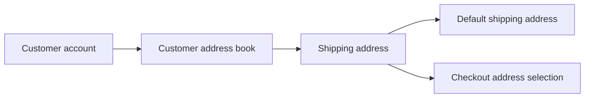

The checkout process uses the customer’s saved shipping addresses as selectable delivery destinations. When a default shipping address exists, it may be used as the customer’s preselected choice during checkout. If a customer chooses a different saved address, that selected shipping address becomes the delivery destination for the order.

## SellerAccount Concept

SellerAccount represents the identity of a merchant who wants to sell on the platform. It is the account-level record used for seller sign-in and platform access. Like customer accounts, it is based on email and password as the primary login credentials. The concept is separate from the seller profile, which carries shop presentation details. Seller accounts also carry approval-related status so the platform can distinguish sellers who are still waiting, approved, or rejected. Some seller lifecycle rules depend on account condition, including whether the seller can remain active or be removed. The seller account exists as part of the business-side identity used for product listings, order handling, and seller management. It is the root concept for merchant participation in the marketplace.

### Seller Account

A seller account is the account-level identity of a merchant who participates in the marketplace as a seller. It represents the seller’s business-side access to the platform and is the identity used for seller sign-in and seller account management.

A seller account is separate from the seller profile. The account identifies who the merchant is and whether the merchant is allowed to sell, while the seller profile contains the shop presentation details shown to customers.

A seller account uses email and password as the login credentials for seller access. It is the root business identity for merchant participation and platform selling access, and it exists independently from the shop-facing profile information.

A seller account carries an approval status so the platform can distinguish whether the merchant is pending, approved, or rejected. This status is part of the account-level seller identity and reflects whether the seller is waiting for approval, allowed to sell, or not approved to sell.

When a seller account is rejected, the rejection state is part of the account’s approval status history. The seller account remains the authoritative concept for the merchant’s selling identity even when approval has not been granted.

Merchants use the seller account to participate in the platform as sellers, while the seller profile presents the public shop identity that customers see.

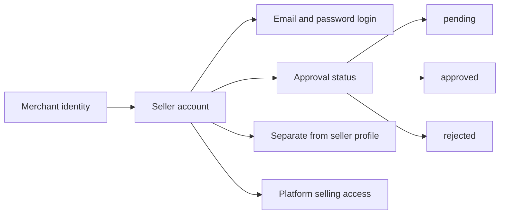


## SellerProfile Concept

SellerProfile represents the public shop identity shown to customers across the marketplace. It contains the shop name, shop description, and logo image that help customers recognize the seller. This profile is distinct from the seller account credentials and approval state. It is the branding layer attached to a merchant presence on the platform. Customers use seller profiles to understand who is selling a product and to compare shops. The profile also becomes part of preserved commerce records so the shop identity can remain visible in historical order information. Because the seller profile is editable business content, it may change over time while still needing snapshots for previous states. SellerProfile therefore defines the merchant’s public face rather than access rights or product inventory.

### Seller Profile

SellerProfile represents the seller’s public shop identity on the marketplace. It is the customer-visible seller information that helps shoppers recognize and distinguish one merchant from another.

The profile is the merchant branding layer attached to a seller account. It is separate from seller credentials and approval state, so changes to the public shop presentation do not change how the seller signs in or whether the seller account is approved.

SellerProfile contains three business attributes: shop name, shop description, and logo image. These values define the seller’s editable seller presentation and are the information customers see when visiting the seller profile or the seller identity shown with products.

Because the seller profile is public-facing business content, it is intended to be updated over time as the seller changes their shop presentation. Each change is part of the seller’s historical business record and supports preserved commerce information.

SellerProfile is also preserved in historical orders through snapshots. This ensures the shop identity in historical orders remains visible even if the seller later changes their branding or deletes their account.

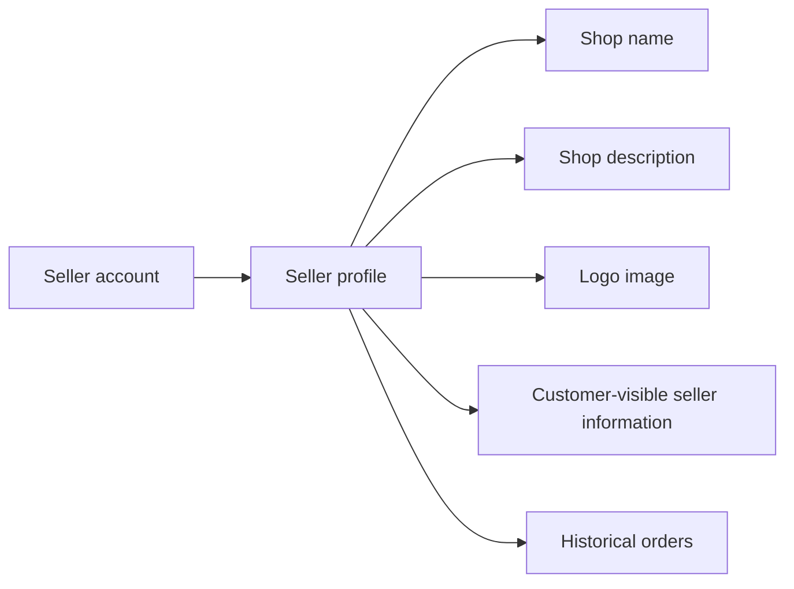

### Shop Name

The shop name is the seller’s public trading name shown to customers. It is part of the seller’s customer-visible identity and helps shoppers recognize the merchant across product listings, seller profiles, and preserved order records.

The shop name is editable seller presentation. When it changes, the new value becomes part of the current public profile while previous values remain available through preserved snapshots for historical reference and dispute review.

### Shop Description

The shop description is the text that describes the seller’s shop to customers. It is part of the seller’s merchant branding and supports the public shop identity by giving shoppers additional context about the merchant’s business.

The shop description is editable seller presentation and may change over time as the seller updates how they want the shop to be presented to customers. Previous versions remain preserved in snapshots.

### Logo Image

The logo image is the visual mark used for the seller’s public shop identity. It is part of the customer-visible seller information and contributes to the seller’s merchant branding.

The logo image is editable seller presentation. When updated, the current logo reflects the seller’s latest branding while earlier versions remain preserved in snapshots for historical review.

### Public Shop Identity

The public shop identity is the combined seller-facing brand that customers use to recognize the merchant. It is defined by the shop name, shop description, and logo image working together as one public representation of the seller.

This concept exists for customer visibility and comparison, not for account access. It is separate from seller credentials so that the merchant can present a consistent storefront identity independently of sign-in information or approval state.

### Historical Order Shop Identity

The shop identity in historical orders is the preserved seller presentation attached to past order records. It ensures that customers, sellers, and administrators can still see the shop name and logo image that were associated with a purchase at the time it was made.

This preserved identity is part of the platform’s historical commerce record. It remains available even if the seller later changes the public profile or deletes the account.

## Category Concept

Category represents a product grouping used to organize the marketplace. It gives customers a way to browse similar products together and helps sellers place products into a meaningful commercial structure. Each category has a name and description that explain what belongs in that group. Categories can also contain subcategories, but only one level of nesting is allowed, keeping the structure simple and predictable. This concept is important for browsing and searching because it shapes how products are discovered. Categories are managed centrally rather than by individual customers or sellers. They are part of the marketplace structure that supports navigation, classification, and product presentation. A category is therefore a business taxonomy concept, not a product or account record.

### Category as a Marketplace Taxonomy

Category is the marketplace taxonomy used to classify products into a central structure. It represents a product grouping that helps organize the catalog into meaningful commercial areas. Customers use categories to browse similar products together, while the platform uses the same structure to present products in a consistent way. A category is not a product itself; it is a classification concept that defines how products are grouped and discovered within the marketplace.

A category supports shopping navigation by giving customers a structured path through the catalog. The category concept is therefore part of the marketplace’s browsing and discovery model, not an individual seller-owned item. Categories are centrally managed so that the same classification structure applies across the platform.

### Category Attributes

Each category has a name and a description. The category name identifies the group in a way customers can recognize during browsing, while the category description explains what belongs in that group. These two attributes define the business meaning of the category and distinguish it from other groups in the marketplace.

The category description is part of the category’s descriptive identity and is used to help customers understand the scope of the classification. Together, the category name and description support product classification by making the grouping understandable to customers and administrators.

### Category Structure and Subcategories

A category may contain subcategories, but only one level of nesting is allowed. This creates a simple central category structure that is predictable for browsing and classification. A top-level category can therefore have direct subcategories, but subcategories do not branch into deeper levels.

This one-level structure supports product grouping without making the marketplace taxonomy overly complex. It helps customers browse similar products by narrowing from a broader category to a more specific subcategory when needed. The category structure is intended to remain consistent across the platform so that products can be classified in a clear and orderly way.

## Product Concept

Product represents a sellable item listed on the marketplace by a seller. It describes the overall merchandise independent of any specific option combination or stock count. Each product has a name, description, category, and base price as its core business identity. Products belong to the seller who created them, so ownership is part of the product concept. A product can be presented to customers through its images, variants, review information, and seller profile. Some products may later become unavailable if they no longer have variants, but the product concept still remains the central listing unit. Product is also a snapshot-sensitive concept because edits need to preserve what the product looked like at different moments. It is the primary commercial object customers see when browsing the mall.

### Product as a Sellable Marketplace Item

A product is the marketplace’s core sellable item. It represents the overall merchandise that customers browse and compare before selecting a specific variant. A product is owned by the seller who created it, and that seller is responsible for the product’s business identity and availability on the platform.

The product concept is the central listing unit for customer browsing. Customers encounter products first when searching, browsing categories, or opening product detail pages. Variants, images, reviews, and seller profile information all build on top of the product concept, but the product remains the primary item shown to customers.

### Product Identity and Classification

Each product has a name, a description, a category assignment, and a base price as its core business attributes.

The product name identifies the item in listings and product details. The product description explains what the item is. The category assignment places the product within the platform’s category structure, including the option to belong to a subcategory. The base price is the product’s starting price before any variant-specific price override is considered.

A product belongs to one seller and one category at a time, which makes it a seller-owned product with a defined place in the marketplace catalog.

### Product Visibility and Browse Experience

A product is the unit customers use to discover merchandise across the platform. It appears in search results and category listings, and it is the business object that customers open to view full product details.

When customers browse products, the product is presented as a single listing even though it may contain multiple variants. This allows the platform to show the same product across different browsing contexts while keeping the product itself as the shared commercial reference.

### Snapshot-Sensitive Product State

A product is snapshot-sensitive. Whenever a product is edited, the system preserves the previous state so the change history can be reviewed later.

Product snapshots preserve the product’s complete business identity at the time of change, including the product’s name, description, category, base price, and images. This supports dispute resolution and preserves what the product looked like at different points in time.

Because the product is the central listing unit, its preserved state is meaningful not only for the seller who owns it, but also for buyers and administrators who need to review the product as it existed at a specific moment.

### Product Concept Relationship Map

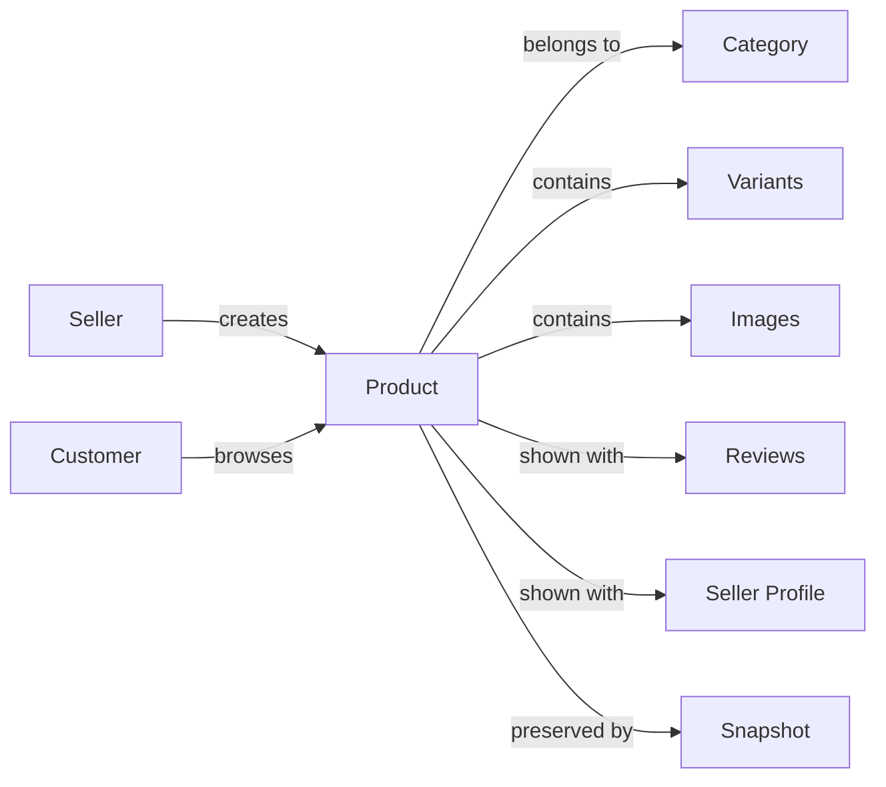

## ProductImage Concept

ProductImage represents a visual asset attached to a product listing. It helps customers understand what the product looks like before purchase. A product can have multiple images, and their order matters because one image serves as the main or thumbnail image. The image set is part of the product presentation and contributes to the overall shopping experience. Product images are not standalone sellable items; they belong to a specific product. When the product changes, image changes are part of the product’s preserved history so prior presentation can be reviewed later. This concept is focused on merchandising and visual communication rather than on pricing or stock. ProductImage therefore supports product discovery, comparison, and buyer confidence.

### Product Image as a Product Presentation Element

Product images are visual assets that are attached to a specific product listing. They are part of the product’s merchandising presentation and help communicate what the product looks like before purchase. A product image is not a standalone sellable item, and it exists only in connection with the product it belongs to. This concept supports visual product presentation, product discovery, and buyer confidence by letting customers inspect the appearance of a product before deciding to buy it.

### Multiple Images and Image Ordering

A product can have multiple product images. The order of those images matters because the first image serves as the main product image and the thumbnail image for the listing. Image ordering is therefore part of the product presentation, not a separate sellable attribute. When customers browse products, the main image represents the product at a glance, while the remaining images support a fuller visual understanding of the product.

### Image History in Snapshots

When a product changes, the product’s image set is preserved in snapshots as part of the product’s recorded history. Image changes are included so that the earlier visual presentation of the product can be reviewed later. This preserves how the product appeared at a specific point in time and supports later review of product presentation during dispute resolution or historical inspection.

## ProductVariant Concept

ProductVariant represents a specific purchasable version of a product. It captures differences such as color, size, or other option combinations that customers choose from a product listing. Each variant has a unique SKU code, option values, and a price that may override the product’s base price. The variant concept is also tied to stock status, since each variant has its own inventory position. Customers see variants as the exact choices available for purchase, while sellers see them as the business unit for inventory and fulfillment. A product can contain multiple variants, and a product with no variants is treated as unavailable for buying. Because variants can change over time, their current state must be preserved in snapshots when business data is edited. ProductVariant is therefore the detailed sellable form of a product.

### Product Variant as a Purchasable Version

A product variant is the specific purchasable version of a product. It represents the exact choice a customer can buy when a product is offered in more than one variation.

A variant is identified by a SKU code, which distinguishes it from other variants of the same product.

A variant carries option values that describe the variation choices that make it unique, such as color and size combinations.

The variant may use a price that overrides the product’s base price when that variant has its own price.

A variant is tied to its own stock status, so each variant can be available, out of stock, or unavailable based on its current inventory position.

A product can contain multiple variants, and each variant belongs to one product only.

A product with no variants is treated as unavailable for purchase, even if the product itself is still visible in listings.

### Variant Attributes and Option Combinations

Each variant has a SKU code, option values, and an optional price override.

The option values define the variation combination that customers select, such as color and size combinations.

Color and size combinations are one example of the option-value pattern used by variants; the same structure applies to other product option combinations.

The SKU code is the business identifier used to distinguish one variant from another within the same product.

When a variant has its own price, that price takes precedence over the product’s base price for that variant.

When a variant does not have its own price, the product’s base price remains the visible base value for that variant.

### Inventory and Stock Status by Variant

Inventory is tracked separately for each variant.

Each variant has its own stock position, and that stock position determines whether the variant can be purchased.

A variant’s stock status is derived from its current stock quantity.

When a variant’s stock quantity reaches zero, the variant is shown as out of stock.

Out-of-stock variants cannot be added to the cart.

A product can still appear in search results even when it has no purchasable variants, but it is shown as unavailable.

A product that has variants with different stock positions may show different availability states for different variants.

### Variant Snapshot History

Every change to a product variant creates a snapshot so that the previous state of the variant is preserved.

Variant snapshot history records what changed, when the change was made, and the values before and after the change.

Variant snapshot history preserves the business state of the variant over time for later review.

Variant snapshots are immutable and cannot be deleted.

A variant snapshot is part of the broader snapshot principle that preserves editable business data for dispute resolution and historical reference.

## InventoryRecord Concept

InventoryRecord represents one change entry in a variant’s stock history. It records how stock moved over time rather than only showing the current quantity. Each record includes a quantity change, a reason, and a timestamp, which together explain why inventory changed. Positive changes represent stock additions, while negative changes represent stock reductions. The current stock position is understood as the combined result of these records. This concept gives sellers a business history for restocking, adjustments, and order-related stock movement. It is different from snapshots because inventory history is meant to show the sequence of stock changes, not the previous full state of a product. InventoryRecord is therefore the accounting trail for variant stock.

### InventoryRecord

InventoryRecord is the business record that captures one change entry in a product variant’s stock history. It represents the accounting trail for stock movement over time rather than only the current stock position.

It records a quantity change, a reason for the stock change, and a timestamped record of when the change occurred. A positive stock change represents stock being added, such as through restocking. A negative stock change represents stock being removed, such as through order-related stock movement or stock adjustments.

The quantity change entries are interpreted together as the restocking history and overall stock history entry set for the variant. The current stock calculation is derived from the combined effect of all inventory records for that variant.

InventoryRecord is different from a snapshot because it preserves the sequence of stock movements, not a before-and-after full-state image of the product. It exists so sellers can understand how and why stock changed over time.

### InventoryRecord Attributes and Meaning

Each InventoryRecord must express three business facts: how much stock changed, why the change happened, and when the change was recorded.

The quantity change shows the direction and size of the stock movement. Positive values mean stock was added. Negative values mean stock was reduced.

The reason for stock change explains the business cause of the movement, such as restocking or another stock adjustment. The timestamp identifies the moment the stock history entry was created.

Because each record is immutable, it remains part of the inventory accounting trail and can be reviewed later to explain the stock position of a variant.

### InventoryRecord in Stock History

A product variant’s stock history is built from its InventoryRecord entries. Each entry adds one line to the variant’s inventory accounting trail.

The inventory accounting trail allows sellers to trace stock movements in the order they occurred. This makes restocking history understandable as a chronological record of additions and reductions.

The current stock calculation is the sum of the recorded stock changes for the variant. The inventory record therefore serves as the business record used to explain how the present stock position came to be.

## ShoppingCart Concept

ShoppingCart represents the temporary set of items a customer is preparing to buy. It holds selected product variants rather than products in general, because checkout depends on specific variant choices. The cart tracks quantities for each selected item and shows warning states when stock is insufficient. It also reflects whether an item has become unavailable because the variant was deleted or is out of stock. ShoppingCart is tied to the customer account and acts as the pre-order workspace in the purchasing flow. It is not a permanent commerce record like an order, but a working container for purchase intent. The cart summary also includes subtotals and the total price so customers can review the expected cost. As a concept, it bridges product selection and order placement.

### Shopping Cart Concept

The shopping cart is the customer’s temporary purchase workspace and pre-order container. It represents customer purchase intent before an order is placed, rather than a permanent purchase record.

The cart holds selected product variants, not products in general, because checkout depends on specific variant choices. Each selected variant is tracked with its quantity, and the cart combines repeated selections of the same variant into one cart line with a single combined quantity.

The cart summary presents the selected items, their subtotals, and the total price for the entire cart. These amounts are part of the cart’s pre-order review context and help the customer understand the expected cost before checkout.

A cart item may be marked as unavailable if the related variant is deleted or becomes out of stock. The cart may also show a stock warning when the available stock is lower than the quantity the customer has selected. These states describe the cart’s purchasing readiness and reflect whether the customer can proceed with the intended purchase.

The shopping cart belongs to one customer account and serves as the temporary holding place between product selection and order creation. It is tied to the customer’s current purchase intent and is not preserved as a finalized commerce record once the purchase is completed.

## CartItem Concept

CartItem represents one line in a shopping cart for a specific variant. It combines the chosen variant with a quantity so the platform can show what the customer intends to buy. If the same variant appears again, it is treated as the same item rather than a separate line. The cart item also carries pricing information needed to show the subtotal for that selection. This concept is narrower than ShoppingCart because it focuses on one variant entry instead of the full cart. It supports clear review of purchase intent before the customer places an order. CartItem becomes unavailable if the selected variant is removed or no longer purchasable. It is the unit that helps the cart remain organized and readable for the customer.

### CartItem Concept

A cart item represents one line in a shopping cart for a specific product variant. It is the business unit that combines the selected variant, the quantity the customer intends to buy, and the pricing needed to show the subtotal for that selection.

#### Single Cart Line
A cart item is always a single cart line, not a separate entry for each repeated selection of the same variant. If the same variant is selected again, it remains one cart line rather than becoming multiple lines.

#### Selected Variant
A cart item is tied to one selected variant. The cart item reflects the customer’s variant-based cart entry, so the purchase intent is expressed at the variant level rather than at the product level.

#### Quantity in Cart
A cart item stores the quantity chosen for that selected variant. The quantity expresses how many units of that variant the customer intends to purchase.

#### Combined Quantity Behavior
When the same variant appears more than once in the cart, the quantities are combined into one cart line. The cart item therefore always shows the total quantity for that variant selection.

#### Subtotal Display
A cart item carries the information needed to display the subtotal for the selected variant and quantity. The subtotal is the line-level value shown for that purchase intent detail.

#### Unavailable Cart Selection
A cart item can become unavailable when the selected variant is removed or no longer purchasable. In that state, the cart line remains the customer’s saved selection but no longer represents a purchasable item.

#### Purchase Intent Detail
A cart item is the smallest cart representation of purchase intent. It shows exactly what the customer plans to buy in terms of variant and quantity, making the cart readable before checkout.

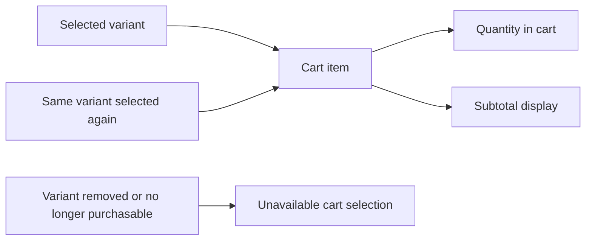

## Wishlist Concept

Wishlist represents a customer’s saved list of products they want to keep for later. It is a product-level collection, so it stores products rather than specific variants. The wishlist helps customers remember items they are interested in without placing them in the shopping cart. It may contain multiple products and is presented in a paginated view because the saved list can grow over time. The concept is tied to a customer account and reflects personal shopping intent rather than a completed purchase. If a product is deleted, it no longer belongs in saved lists because it is no longer available in the marketplace. Wishlist is therefore a lightweight planning and discovery aid within the shopping experience. It complements the cart by supporting future consideration instead of immediate checkout.

### Wishlist Concept

The wishlist is a customer’s saved products list for later purchase interest. It represents personal shopping memory and planning before checkout, allowing a customer to keep products they may want to buy in the future without placing them in the shopping cart.

The wishlist is a product-level collection, not a variant-specific collection. A saved item represents the product as a whole rather than a particular variant or option combination.

A wishlist belongs to one customer account and reflects that customer’s individual shopping intent. It is tied to the customer’s personal consideration of products rather than to a completed order or a purchased item.

Because a wishlist can grow over time, it is presented as a paginated saved items list. The paginated view helps the customer review stored products in manageable groups.

If a product is deleted from the marketplace, it is removed from the customer’s wishlist because it is no longer available as a saved product.

## Order Concept

Order represents a completed commercial purchase made by a customer. It groups one or more order items under a single order number and creation time. The order also has a total price that summarizes the purchase value across all included items. An order can contain items from different sellers, which means it may span multiple shop records while still being one customer transaction. The overall order state is derived from the statuses of its items rather than being independent of them. Orders form the permanent purchase history that customers and business users rely on for reference. Even when an account is deleted, order records are preserved for seller records and legal purposes. Order is therefore the central record of a finalized transaction in the marketplace.

### Order Concept

An order is the business record of a completed commercial purchase made by a customer. It represents one finalized transaction in the marketplace and groups one or more purchased items under a single purchase record.

An order has an order number that identifies the purchase in customer and business records. It also has a creation time that marks when the purchase was completed. The total price summarizes the value of all items included in the order.

An order may include items from different sellers. Even when multiple sellers are involved, the order remains one customer purchase history entry rather than separate purchases.

The overall status of an order is derived from the statuses of its items. The order does not have an independent business meaning separate from its item statuses.

An order is a permanent transaction record. It remains part of purchase history after account deletion and is preserved for seller records and legal purposes.

## OrderItem Concept

OrderItem represents one purchased variant within an order. It records the exact product variant, the quantity purchased, and the item-level status that tracks fulfillment or post-purchase handling. An order may contain several items, and each one can belong to a different seller. This concept is important because business actions are often decided at the item level rather than for the entire order. The purchased product snapshot is part of the item record so the original product name, description, option values, and price are preserved as they were at purchase time. The seller profile snapshot is also preserved with the item so the shop identity remains visible in historical records. OrderItem is therefore both a commerce line item and a historical reference point. It is the detail layer of the order structure.

### Order Item

An order item represents one purchased product variant within an order. It is the detail layer of the order structure and serves as the historical commerce line for a single purchase line within a larger order.

An order item records the purchased variant line, including the specific variant that was bought and the quantity purchased. If a customer buys multiple units of the same variant, they are represented as one order item with that quantity.

An order item can belong to an order that contains items from different sellers. This means an order item is a multi-seller order item in the sense that orders may combine separate seller items, but each item still belongs to exactly one seller.

An order item carries item status so the business can track what has happened to that purchased variant after checkout. The item status is independent from the status of other items in the same order.

An order item preserves purchase-time details so the original commercial record remains visible even if the source product or seller profile changes later. Those preserved details include the product snapshot and the seller profile snapshot taken at the time of purchase.

The purchased product snapshot preserves the product name, description, variant option values, and price as they were when the item was purchased. The seller profile snapshot preserves the shop name and logo as they were when the item was purchased.

An order item is therefore both a transactional purchase record and a historical reference point for later order review, dispute handling, and past purchase display.

Mermaid diagram:
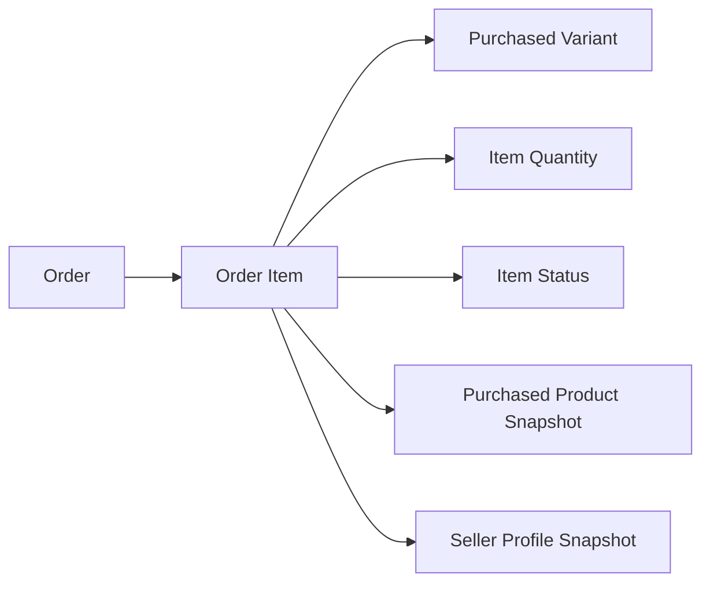


## Shipment Concept

Shipment represents a package or delivery unit sent by a seller. It groups one or more order items from the same seller so those items can travel together. Different sellers always produce separate shipments, which keeps shipping records aligned with merchant responsibility. A shipment carries tracking information such as the carrier name and tracking number. It is the business object that links fulfillment progress with the items inside the package. Customers use shipment information to understand where their items are in transit. The shipment concept is also tied to item-level fulfillment states because the items in it share the same delivery context. Shipment therefore describes the physical movement of purchased goods after the order is placed.

### Shipment

A shipment is the seller-specific delivery unit that groups order items moving together in the same fulfillment package. It represents the shipping context for a package sent by one seller and is the business object customers use to understand how purchased items are being delivered.

A shipment contains one or more order items from the same seller. Items from different sellers are not combined into the same shipment, so each seller’s items keep separate shipping context and separate delivery tracking.

Each shipment carries carrier name and tracking number information (defined in this section) so the customer can track the delivery progress of that shipment. The shipment therefore links a seller’s fulfillment package with the items included in it and provides the delivery grouping that ties those items to a shared shipping record.

Mermaid diagram:
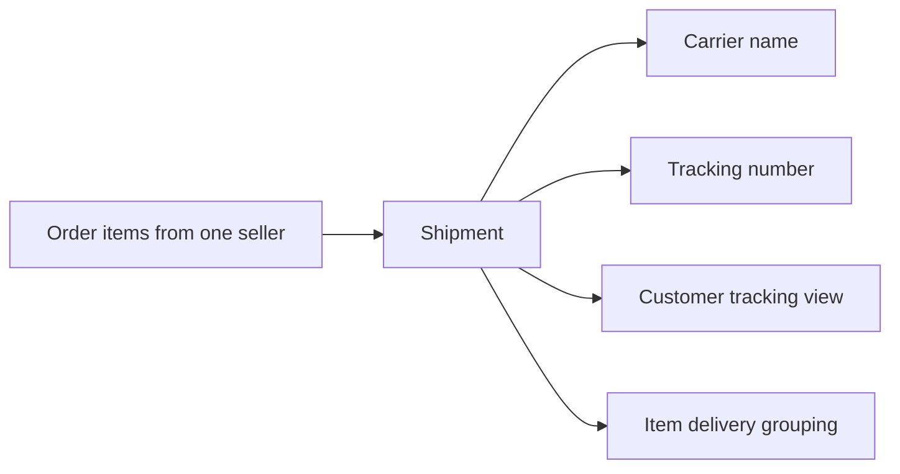

Key attributes:
- Seller-specific shipment: a shipment belongs to a single seller’s fulfillment context.
- Delivery unit: a shipment is the package-level unit used for shipping.
- Items from same seller: only items from one seller can be grouped together.
- Fulfillment package: the shipment represents the package being sent.
- Shipping context: the shipment carries the shared delivery context for its items.
- Customer tracking view: customers use shipment information to follow delivery progress.
- Item delivery grouping: the shipment groups items that travel together.

## CancellationRequest Concept

CancellationRequest represents a customer’s request to stop a paid order item before it is shipped. It is created for a specific order item rather than for the entire order. The request contains a reason written by the customer so the seller can understand why cancellation is being asked for. The request also has a status history that shows how the decision changes over time. This concept matters because cancellation is a controlled business event with recordkeeping requirements. A cancellation request is linked to snapshot preservation so the state of the request can be reviewed later in case of disagreement. It exists only for eligible items and remains part of the order’s post-purchase lifecycle. CancellationRequest is therefore a governed decision record for pre-shipment item handling.

### CancellationRequest

CancellationRequest represents a controlled business event for stopping a paid order item before shipment. It applies to one specific order item rather than to an entire order, so the cancellation decision is always made at item level.

The request is raised only for a pre-shipment item, which makes it part of the order item’s early post-purchase lifecycle. This concept exists to document a dispute record for a paid item cancellation request and to preserve the business reasoning behind the cancellation decision.

A cancellation request contains reason text written by the customer. That reason text captures why the customer is asking for the item to be cancelled and becomes part of the record that supports later review.

A cancellation request also maintains status history. The status history shows how the request changes over time, so the business can track the progression of the request from creation through later decision states.

When a response is made to the request, a request state snapshot is preserved. The snapshot keeps the state of the cancellation request for later review and dispute resolution, including the relevant change context at that moment.

This concept is distinct from the order itself: the request governs cancellation of one paid item, while the remaining items in the same order are unaffected unless they have their own separate request.

### CancellationRequest State

A cancellation request is a governed record with a lifecycle that begins when a customer asks to stop a paid item before shipment. The request’s status history is the business-visible trail of how that lifecycle changes.

The request state exists to support item cancellation decisions and later review. Because the request is tied to a specific order item, its state must be understood together with that item’s paid item cancellation context.

The preserved request state snapshot is immutable business evidence. It is used to review what the request looked like when the seller or administrator responded, which helps resolve disagreements about the cancellation decision.

Mermaid diagram:
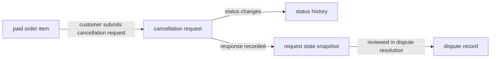

## RefundRequest Concept

RefundRequest represents a customer’s request to return value for a delivered order item. It is tied to one specific item instead of the entire order, because refund decisions are handled at item level. The request includes a reason that explains why the customer is asking for a refund. Its status history records how the seller response changes the request over time. Refund requests are important business documents because they affect payment outcomes, stock records, and dispute handling. Like other editable commerce records, the request state is preserved through snapshots so prior states can be reviewed if needed. The concept applies only after delivery and within the platform’s post-delivery business rules. RefundRequest is therefore the formal record of a customer’s post-delivery claim.

### RefundRequest Concept

RefundRequest is the formal business record that represents a customer’s refund claim for one delivered order item. It exists at the item level rather than the order level, because refund handling is tied to the specific purchased item that has already been delivered.

A refund request is a post-delivery request. It only applies after delivery and is used to record the customer’s reason text for asking that value be returned for that item. The request captures the customer’s explanation as part of the dispute handling record for that delivered purchase.

RefundRequest keeps a status history so the platform can preserve how the request changes over time as it is reviewed. That history is part of the request state snapshot trail, allowing each meaningful state change to remain reviewable later.

Like other editable commerce records, a refund request participates in snapshot-based preservation. When the request state changes, the previous request state is preserved through a snapshot that records what changed and the values before and after the change.

RefundRequest is also a payment outcome record in the business sense that it tracks the refund claim outcome for the purchased item. It preserves the formal record needed for dispute handling, seller review, and later reference.

RefundRequest is tied to one delivered order item, one customer reason text, one status history, and one preserved request state snapshot trail. It does not represent a whole-order refund, and it exists only for a completed delivery context.

## Review Concept

Review represents a customer’s public opinion about a purchased product. It is associated with a product and reflects the buyer’s experience after receiving the item. Each review contains a rating from one to five stars and may also include written text. Reviews are shown on the product detail page and contribute to the product’s average rating. The review concept is customer-generated content that supports trust and comparison across sellers. Reviews can exist in deleted form while still keeping their historical record for the platform. Because review edits must be preserved, the concept is snapshot-sensitive and part of the platform’s dispute and history model. Review is therefore both a feedback object and a marketplace reputation signal.

### Review as Purchase-Based Product Feedback

Review is the customer’s public feedback about a product they purchased. It reflects the buyer’s experience with that product after receiving it, so the concept is tied to a completed purchase rather than general browsing interest. Reviews help other customers understand product quality and seller reputation from real purchase experience. A review belongs to the product it evaluates and is also associated with the customer who wrote it. Because reviews are part of marketplace trust, they are shown as public product feedback on the product detail page. The review concept exists to capture purchase-based opinion, not general commentary about the platform or seller outside the purchased item context.

Mermaid:
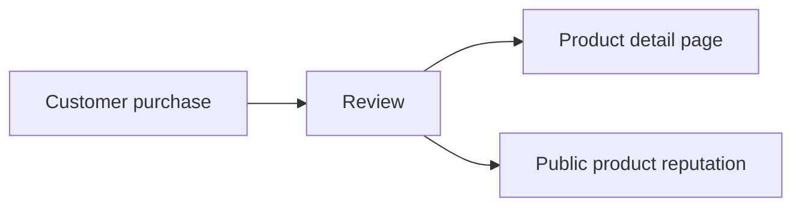

### Review Rating and Written Text

Each review contains a rating from one to five stars. The rating is the primary structured measure of customer satisfaction for the purchased product. A review may also include written text that explains the customer’s opinion in their own words. The written text is optional, but when present it provides additional context beyond the star rating. Together, the rating and the written text form the customer product feedback that appears in the marketplace. The same review can therefore communicate both a numeric judgment and a narrative comment about the purchase.

### Average Rating and Product Reputation

Reviews contribute to the product’s average rating, which represents the aggregated opinion of customers who have reviewed that product. The average rating is used as part of the product’s public reputation and helps customers compare products across sellers. Only reviews that remain part of the product’s active review history are included in the average rating. The average rating is therefore a derived reputation signal based on customer product feedback, not an independent product attribute. This concept is shown alongside product information on the product detail page as a summary of review sentiment.

Mermaid:
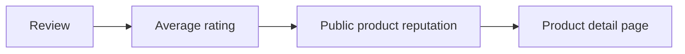

### Deleted Review History and Snapshot Preservation

A review can be deleted while still preserving its historical record. When a review is deleted, the platform keeps the review history so that the marketplace retains evidence of past customer feedback. Review edits are also preserved through snapshots, which record the review’s changed state over time. This makes the review concept snapshot-preserved and suitable for dispute resolution and audit history. The preserved history supports the platform’s rule that money-related marketplace activity must keep a record of modifications. A deleted review therefore remains part of the platform’s historical record even though it is no longer an active review in the same form.

Mermaid:
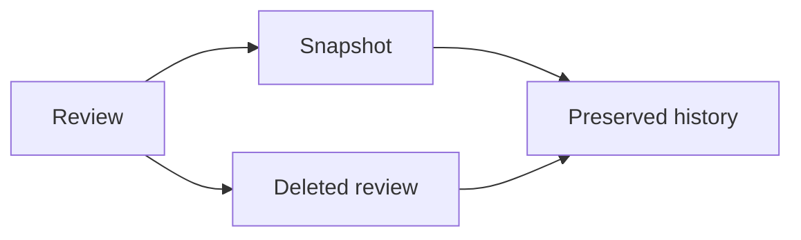

### Display of Review on Product Detail Pages

Reviews are displayed on the product detail page as part of the product’s feedback section. They help customers evaluate a product before purchase by showing prior buyers’ opinions, ratings, and written comments. The review concept is therefore both a feedback object and a marketplace reputation signal visible at the product level. Product detail feedback includes the review’s star rating and any written text, along with its place in the product’s broader review history. Because reviews are public product feedback, they contribute directly to how the product is presented to prospective customers.

## Snapshot Concept

Snapshot represents a preserved record of a previous state when editable business data changes. It exists because the platform handles financial transactions and must keep a traceable history of important modifications. Each snapshot records when the change happened, what changed, and the values before and after the change. Snapshots are immutable, so once created they remain part of the permanent record. They support dispute resolution by letting relevant parties review prior states of products, profiles, reviews, requests, and other editable concepts. The snapshot idea is broader than a simple audit note because it preserves meaningful business history, not just timestamps. It applies to many concepts that can change over time, including product details, seller profiles, reviews, and request states. Snapshot is therefore the platform’s memory of past business states.

### Snapshot Concept

A snapshot is a preserved business record of a previous state when editable data changes. It represents the platform’s memory of past states and exists so that important changes can be reviewed later as part of financial recordkeeping and dispute resolution evidence.

A snapshot records the time of the change, what changed, and the values before and after the change. It is a history entry for editable data, not a replacement for the current live data. The snapshot captures enough context to show how the business object looked immediately before the change and immediately after the change.

Snapshots are immutable history. Once a snapshot is created, it remains part of the permanent record and cannot be modified or deleted. This makes snapshots suitable for preserving the history of products, product variants, seller profiles, reviews, cancellation requests, refund requests, and other editable business data.

Snapshots are intended to support review of prior states by relevant parties, including owners and administrators, when a dispute needs evidence of what changed over time.

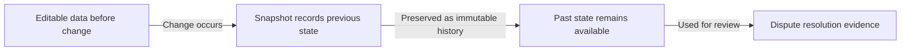

## AdministratorApprovalRequest Concept

AdministratorApprovalRequest represents a request from an existing user to gain administrator status. It is a formal application record rather than a normal account or profile object. The request contains a reason supplied by the applicant so the platform can understand why administrator access is being sought. Its status tracks whether the request is pending, approved, or rejected. This concept is important because administrator roles are granted through review rather than automatically. It supports the platform’s governance structure and separates ordinary users from administrative authority. The request belongs to the broader user management model and helps document access changes over time. AdministratorApprovalRequest is therefore the application trail for becoming an administrator.

### Administrator Approval Request

An AdministratorApprovalRequest represents a formal application from an existing user who wants administrator status. It is the business record that captures the request for admin status and serves as the approval trail for that role change application.

The request records the applicant’s reason for applying so the platform can understand why administrative access is being sought. This reason is part of the governance record and supports review of the application.

The request has a status that reflects its review state. The allowed status values are pending, approved, and rejected.

A pending request indicates that the application is waiting for admin status review. An approved request indicates that the application has been accepted and the user’s role change has been granted. A rejected request indicates that the application was not accepted.

AdministratorApprovalRequest exists as part of the platform’s user management approval process. It separates an administrative access request from the user’s normal account information and preserves a traceable record of how administrator authority is granted.

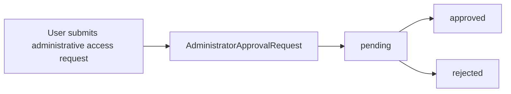

This concept is the authoritative record for tracking who requested administrator status, why the request was made, and what the review outcome was. It provides the approval trail needed for governance and user management oversight.

## SellerApprovalRequest Concept

SellerApprovalRequest represents the merchant registration review record for a seller account. It is the business object used to track whether a seller can participate in selling on the platform. The request includes the approval status, which indicates whether the seller is pending, approved, or rejected. When a rejection happens, the rejection reason becomes part of the record so the seller can understand the outcome. This concept is separate from the seller account itself because the account is the identity, while the approval request is the eligibility decision. It is central to marketplace governance because sellers cannot function as merchants until their approval state allows it. The request also supports resubmission after rejection, making it part of the seller onboarding lifecycle. SellerApprovalRequest is therefore the formal decision record for merchant participation.

### Seller Approval Request

SellerApprovalRequest is the merchant registration review record for a seller account. It represents the business decision about whether a seller is allowed to participate in selling on the platform. The request is separate from the seller account itself: the seller account is the identity record, while the approval request is the eligibility record.

The approval request exists to support seller onboarding lifecycle management. It captures the current approval status of the seller registration review and provides the formal record used to determine whether the seller is pending, approved, or rejected.

When a seller is rejected, the rejection reason becomes part of the request so the outcome can be understood and later reviewed. A rejected seller can submit a new registration request, which means the approval request supports resubmission after rejection as part of the same onboarding flow.

SellerApprovalRequest is part of marketplace governance because it records the administrative decision that controls merchant eligibility on the platform.

```mermaid
flowchart LR
    A["Seller account"] --> B["Seller approval request"]
    B --> C["pending"]
    B --> D["approved"]
    B --> E["rejected"]
    E --> F["rejection reason"]
    E --> G["resubmission after rejection"]
```

### Approval Status

The approval status describes the current review state of a seller registration request.

The allowed approval status values are:
- pending
- approved
- rejected

A pending status means the seller registration is waiting for review. An approved status means the seller has passed the review and can participate according to the broader seller account rules. A rejected status means the seller registration was not accepted and the request includes the reason for that outcome.

```mermaid
flowchart LR
    A["pending"] --> B["approved"]
    A --> C["rejected"]
    C --> D["new registration request"]
```

### Rejection Reason and Resubmission

When a seller approval request is rejected, the rejection reason is recorded in the request so the seller can understand why the registration was not approved.

A rejected seller may submit a new registration request. The new request represents a fresh review cycle and is part of the seller onboarding lifecycle. The existence of a rejection reason does not change the seller account itself; it remains a separate eligibility record tied to the review outcome.

```mermaid
sequenceDiagram
    participant S as Seller
    participant R as SellerApprovalRequest
    participant G as Governance
    S->>G: Submit registration request
    G->>R: Set status to rejected
    G->>R: Record rejection reason
    S->>G: Submit new registration request
```

# Domain Relationships

Describe how concepts relate to each other from a business perspective.

## Conceptual Relationships

Describe how concepts relate to each other in business terms.

### Ownership

Ownership defines which account or business concept controls a domain object.

- A customer account owns one customer profile.
- A customer account owns one or more shipping addresses.
- A customer account owns a shopping cart and a wishlist.
- A customer account owns the orders created by that customer.
- A customer account owns the reviews written by that customer.
- A seller account owns one seller profile.
- A seller account owns the products created by that seller.
- A seller account owns the order items for that seller’s products that require fulfillment.
- A product owns its images, variants, and inventory history through its variants.
- An order owns its order items, shipments, and shipping address snapshot.
- A product variant owns its inventory history records.
- A snapshot owns the preserved history of the change it records.

These ownership relationships define which concepts are managed together, which records are preserved together, and which records are considered part of the same business lifecycle. Ownership also determines which parties can later view preserved history for dispute resolution.

### Belongs-to Relationships

Belongs-to relationships describe where a concept is placed within the business structure and which parent concept it is associated with.

- A customer profile belongs to one customer account.
- A shipping address belongs to one customer account.
- A seller profile belongs to one seller account.
- A category may belong to a parent category when it is used as a subcategory.
- A product belongs to one seller account and one category.
- A product image belongs to one product.
- A product variant belongs to one product.
- An inventory record belongs to one product variant.
- A cart item belongs to one shopping cart and refers to one product variant.
- A wishlist belongs to one customer account.
- An order belongs to one customer account.
- An order item belongs to one order and refers to one product variant.
- A shipment belongs to one seller’s order items.
- A cancellation request belongs to one order item.
- A refund request belongs to one order item.
- A review belongs to one customer account and is tied to the purchased product context.
- A snapshot belongs to the concept whose previous state it preserves.
- An administrator approval request belongs to one customer or seller account.
- A seller approval request belongs to one seller account.

These relationships ensure each concept has a clear parent context for management, browsing, history tracking, and review.

### Has-many Relationships

Has-many relationships describe the collections that a concept can contain or manage.

- A customer account has many shipping addresses.
- A customer account has many orders over time.
- A customer account has many reviews.
- A seller account has many products.
- A seller account has many fulfilled order items related to its products.
- A category can have many products.
- A category can have many subcategories, but only one nesting level is allowed.
- A product can have many images.
- A product can have many variants.
- A product variant can have many inventory records.
- A shopping cart can have many cart items.
- A wishlist can have many saved products.
- An order can have many order items.
- An order can have many shipments.
- A shipment can contain many order items from the same seller.
- A single order item can have many status changes through cancellation or refund handling.
- A product, variant, seller profile, review, cancellation request, or refund request can have many snapshots over time.

These collection relationships support browsing lists, grouped fulfillment, preserved history, and repeated edits across the platform.

### Associations

Associations describe business connections that are not simple ownership or containment, but still define how concepts work together.

- Customers associate products with wishlists to save products for later interest.
- Customers associate order items with reviews after delivery.
- Customers associate shipping addresses with checkout and order placement.
- Sellers associate products with categories so products appear in the correct browsing context.
- Sellers associate order items with shipments when preparing delivery.
- Products associate with categories so they can appear in category browsing and search filtering.
- Products associate with search results, wishlists, carts, and order items at different stages of the purchase journey.
- Order items associate with product snapshots, variant snapshots, and seller profile snapshots so the purchase record reflects the state at the time of purchase.
- Cancellation requests and refund requests associate with the corresponding order item and preserve the review history of the request.
- Snapshots associate with the edit that created them and preserve the before and after values needed for dispute resolution.
- Administrator approval requests associate with the account that submitted the request and the review performed by super administrators.
- Seller approval requests associate with the seller account and the administrator decision that determines whether the seller may sell.

These associations define how the marketplace connects browsing, purchasing, fulfillment, history preservation, and governance across different concepts.

## Lifecycle and Retention

Describe concept lifecycle states and transitions only. Detailed retention/recovery policies belong in 05-non-functional. Operation details belong in 03-functional-requirements.

### Lifecycle

Each domain concept in this unit has a business lifecycle that describes how it is created, used, changed, and eventually removed or preserved according to the platform’s rules.

Snapshotable concepts follow a preserved-change lifecycle: when editable data changes, the previous state is retained as an immutable snapshot instead of being overwritten. This applies to products, product variants, seller profiles, reviews, cancellation requests, refund requests, and other preserved order-related data defined in the domain model.

Products follow a sellable lifecycle in which they can exist, be edited, be deleted, and remain absent from listings after deletion. A deleted product no longer appears in search or category listings, while its preserved history remains available for authorized review.

Product variants follow an inventory-linked lifecycle in which they can be created, edited, become unavailable, and be deleted when allowed by the business rules. Their current stock state is derived from inventory history, and their availability status changes when stock reaches zero.

Orders and order items follow a purchase lifecycle in which purchased items move through paid, shipped, delivered, cancelled, or refunded states. The overall order status is derived from the statuses of its items.

Shipments follow a delivery lifecycle in which items from the same seller are grouped for shipping, carry shared tracking information, and move toward delivery confirmation at the shipment level.

Cancellation requests and refund requests follow an approval lifecycle in which they are created against a specific order item, reviewed, and then approved or rejected. When their state changes, a snapshot of the request state is preserved.

Administrator approval requests and seller approval requests follow review lifecycles in which a request can remain pending, be approved, or be rejected, with the rejected seller request preserving the rejection reason.

Mermaid diagram:
```mermaid
flowchart LR
    A["created"] -->|"edited"| B["current state"]
    B -->|"snapshot preserved"| C["previous state retained"]
    A -->|"deleted"| D["deleted or hidden from listings"]
    D -->|"preserved history"| E["viewable by authorized parties"]
```


### Retention

Retention in this platform means that certain business records remain available after the active customer-facing object is no longer present.

Order records and order history are retained after a customer deletes their account because they are needed for seller records and legal purposes. The customer profile information is deleted, but the order record itself remains.

Reviews are retained after a customer deletes their account. In that case, the review remains visible and the author is shown as a deleted user.

Seller order history and snapshots are retained after seller account deletion. Past order records preserve the seller shop name that was captured at the time of purchase.

Product snapshots are retained even after product deletion. Product variant snapshots and seller profile snapshots are also retained when they are part of the preserved record set described in the domain model.

Snapshots are retained as immutable business history and cannot be deleted.

Inventory history is retained as a full record of stock changes for each variant. Current stock is derived from these retained records.

Merchant-created purchase records retain the values captured at the time of purchase, including product details, variant details, and seller profile details.

Mermaid diagram:
```mermaid
flowchart LR
    A["active object"] -->|"change occurs"| B["new snapshot or history record"]
    A -->|"deleted"| C["active object removed"]
    B -->|"retained"| D["preserved history"]
    C -->|"historical reference"| D
```


### Archival

Archival describes business data that is no longer active for day-to-day use but remains preserved for reference, dispute resolution, or historical traceability.

Snapshots function as archived business records for changed data because they preserve the previous and new values, the time of change, and what changed.

Order items preserve archived snapshots of the purchased product, product variant, and seller profile at the time of purchase so that later changes to the live product do not alter the purchase record.

Seller profile changes are archived through snapshots each time the profile is edited, preserving the shop name, description, and logo image history.

Review edits are archived through snapshots so that the history of the rating and text content remains available even if the review is later deleted.

Cancellation request and refund request state changes are archived through snapshots so that the history of each request can be reviewed during disputes.

Archived records are available to the relevant parties identified in the domain model, such as owners and administrators.

Mermaid diagram:
```mermaid
flowchart LR
    A["live record"] -->|"edited"| B["archived snapshot"]
    B -->|"preserves"| C["before values"]
    B -->|"preserves"| D["after values"]
    B -->|"preserves"| E["change time"]
```


### Deletion Policy

Deletion policy defines what happens to each concept when deletion is permitted by the business rules.

When a customer deletes their account, the customer profile information is deleted, but order records, order history, and reviews are retained.

When a seller deletes their account, their products are deleted from listings, but order history and snapshots are retained, and the shop name in past orders is preserved.

When a product is deleted, the product is removed from search and category listings, its variants and inventory records are removed as part of the product deletion outcome, and the preserved snapshots remain available.

When a category is deleted, products that were assigned to that category become uncategorized.

When a product deletion occurs, the product is also removed from customer wishlists.

When a review is deleted by its owner, the review no longer appears as an active review, but its snapshots remain preserved.

When a seller approval request is rejected, the rejection reason is preserved for the request record.

Deletion is not allowed where the domain model or business rules require the object to remain for unresolved orders, requests, or preserved history.

Mermaid diagram:
```mermaid
flowchart LR
    A["deletion requested"] --> B["check business conditions"]
    B -->|"allowed"| C["active record removed"]
    B -->|"not allowed"| D["deletion blocked"]
    C --> E["preserved history remains"]
```


### Recovery

Recovery describes how preserved business history supports restoration of state, dispute resolution, and continuity of records.

A preserved snapshot can be used to recover the previous state of a changed object for dispute resolution.

Order item, cancellation request, and refund request histories can be reviewed to understand the sequence of changes that led to the current state.

Inventory history supports recovery of stock history because every stock change is recorded as a history entry rather than being overwritten.

If a customer account is deleted, the related orders and reviews remain recoverable as historical records, even though the customer profile information is removed.

If a seller account is deleted, the preserved order records continue to show the shop name that was captured at the time of purchase.

If a product is deleted, its preserved snapshots allow the past product state to be recovered for review, even though the live product is no longer listed.

Recovery is limited to viewing and reconstructing historical business state; it does not imply restoration of deleted active records unless another section explicitly defines that behavior.

Mermaid diagram:
```mermaid
flowchart LR
    A["historical record"] --> B["review preserved snapshot"]
    B --> C["reconstruct prior state"]
    B --> D["dispute resolution"]
    B --> E["audit of change history"]
```

# Business Categories and State Flows

Business category classifications and state flow definitions.

## Business Category Definitions

Define all business category classifications with their allowed values and descriptions.

### Business Category

A business category is a marketplace classification used to group products for browsing and organization. It provides a shared way to describe where a product belongs in the catalog and how customers can find related products. A business category is defined by its name and description. It may contain subcategories, but only one level of nesting is allowed.

```mermaid
flowchart LR
    A["Business category"] --> B["Name"]
    A --> C["Description"]
    A --> D["Subcategory"]
    D --> E["One-level nesting only"]
```

The same category concept is used consistently across the platform for customer browsing and administrator-managed catalog structure. Products are assigned to a category or subcategory so they appear under the correct business grouping.

### Classification

Classification describes how the marketplace organizes categories into parent categories and subcategories. A top-level category is a primary business grouping. A subcategory is a narrower grouping that belongs directly under a top-level category.

Only one level of nesting is allowed. A subcategory may not contain another subcategory beneath it. This keeps the category structure simple and predictable for browsing.

```mermaid
flowchart LR
    A["Top-level category"] --> B["Subcategory"]
```

This classification model is used to organize products into meaningful groups without creating deeper category hierarchies.

### Allowed Values

The allowed values for category classification are limited by the category structure itself:

| Value type | Allowed value |
|---|---|
| Category level | Top-level category |
| Category level | Subcategory |
| Nesting depth | One level only |

A category may be either a top-level category or a subcategory. A subcategory may belong to only one parent category. No deeper category levels are permitted.

When a product is assigned to a category, it must belong to one of these allowed category placements.

### Status Type

Status type describes whether a category is available as an active business grouping in the catalog or no longer in use. Category status is part of the catalog’s business state and is used to represent whether the category can still organize products.

The category status type is a business classification for catalog state, not a product attribute.

```mermaid
flowchart LR
    A["Category status"] --> B["Active"]
    A --> C["Inactive or removed from use"]
```

The platform uses this status type to represent the category’s current business state while keeping the category concept distinct from products and other marketplace entities.

## State Transitions

Define valid state transition paths for stateful concepts.

### State Flow Overview

This section defines the conceptual relationships for stateful business records in the platform. It describes how ownership, containment, and association relationships connect records that have supported business states over their lifetime.

```mermaid
flowchart LR
    A["Stateful business record"] -->|"Owned by"| B["Owning account or seller"]
    A -->|"Contains"| C["Related child records"]
    A -->|"Associated with"| D["Related business context"]
    A -->|"Moves through"| E["Supported business states"]
```

The platform preserves prior values whenever a stateful record is changed, so previous values remain available through snapshots where snapshots are defined for that concept. State flow applies to editable business records, approval-driven records, and purchase-related records that change status over time.