**shoppingMall — What operations users can perform, use cases, business workflows**

What operations users can perform, use cases, business workflows

# Core Business Operations

What the system must do for each business concept.

## Customer Operations

Customers must register with email and password before using any shopping features. After registration, customers can log in, change their password, and delete their account. A customer profile is part of the account experience and must support viewing and updating the display name and phone number. Customers can manage their saved shipping addresses and choose one as the default for checkout. When a customer deletes an account, the profile information is removed, but orders, order history, and reviews remain available in their preserved form. Reviews left by a deleted customer continue to exist and are shown as coming from a deleted user. Customers are also expected to be able to view their account-related lists, such as saved addresses and order history. If an account is deleted, the customer can no longer use the platform with that identity.

### Customer Registration and Login

Customers must register with an email address and password before they can use any shopping features.
Customers must be able to log in with their email address and password after registration.
If a customer deletes their account, that identity can no longer be used to access the platform.

### Customer Password Management

Customers must be able to change their password after they have signed in.
The system must treat the new password as the customer’s active password after the change is completed.

### Customer Account Deletion

Customers must be able to delete their account.
When a customer deletes their account, the customer profile information is removed.
When a customer deletes their account, the customer’s orders and order history are preserved.
When a customer deletes their account, the customer’s reviews are preserved and shown as coming from a deleted user.
After account deletion, the customer can no longer use that account to shop or manage customer data.

### Customer Profile Updates

Customers must be able to view and update their profile information.
The customer profile includes the display name and phone number defined in the profile model.
Profile updates must apply only to the customer’s own account.

### Shipping Address Management

Customers must be able to add multiple shipping addresses to their account.
Customers must be able to view, edit, and delete their saved shipping addresses.
Customers must be able to choose one saved shipping address as the default shipping address.
Customers must be able to change which saved address is used as the default shipping address.

### Order History and Preserved Review Attribution

Customers must be able to view a list of their orders.
Customers must be able to view the full details of each order in their history.
If a customer account has been deleted, its preserved orders must remain available in order records.
If a review was written by a customer whose account has been deleted, the review must still be displayed as authored by a deleted user.

## Seller Operations

Sellers must register with email and password and log in before they can manage their shop. A seller account is not immediately active for selling because administrator approval is required. Sellers can check whether their approval is pending, approved, or rejected, and they can review the rejection reason when applicable. If rejected, a seller can submit a new registration request rather than starting over manually. Approved sellers can change their password and manage their own products and shop presence. Sellers can delete their account only when they have no pending order items and no pending cancellation or refund requests. When a seller deletes the account, their products are removed from listings, but order history and snapshots are preserved, and the shop name remains visible in past orders. Sellers can also view their shop-level information and their approval-related status as part of account operations.

### Seller Registration

Sellers can create an account using an email address and a password.
The system records the seller registration request as pending approval before the seller can sell products.
A seller registration request remains associated with the seller account until an administrator makes a decision.
If a seller registration request is rejected, the seller can submit a new registration request.
A rejected seller can use the new registration request instead of creating a separate account.

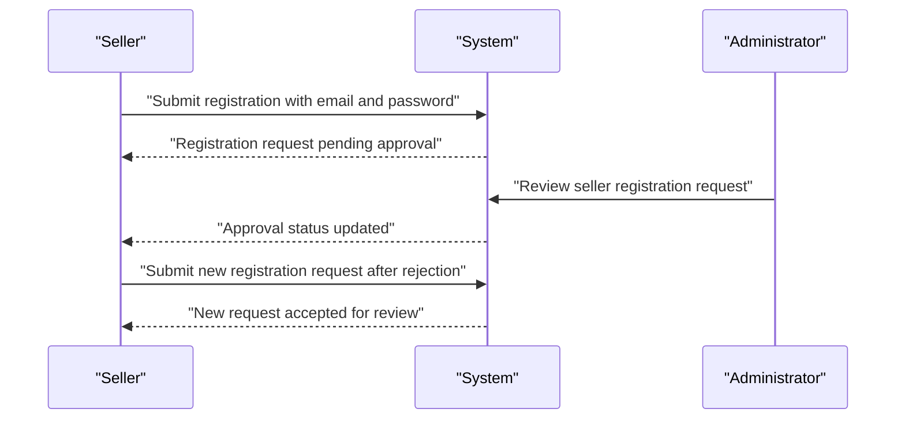

### Seller Login and Password Management

Approved sellers can log in using their email address and password.
Approved sellers can change their password after signing in.
If a seller account is not approved, the seller cannot use seller functions that require an approved account.
If a seller account is rejected, the seller can still use the account entry point to review the rejection outcome and submit a new registration request.

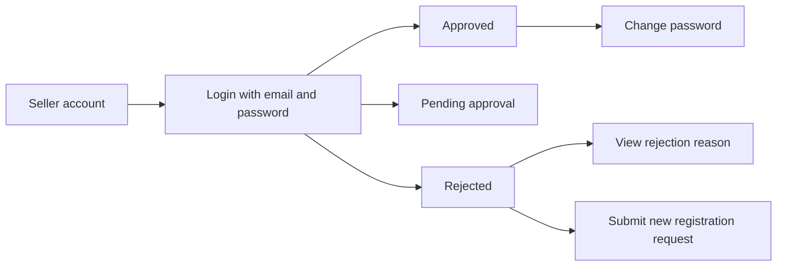

### Approval Status Review

Sellers can review their approval status at any time.
The approval status is shown as pending, approved, or rejected.
When the approval status is rejected, the seller can view the rejection reason.
The rejection reason is shown together with the rejected approval status so the seller can understand why the registration was not accepted.

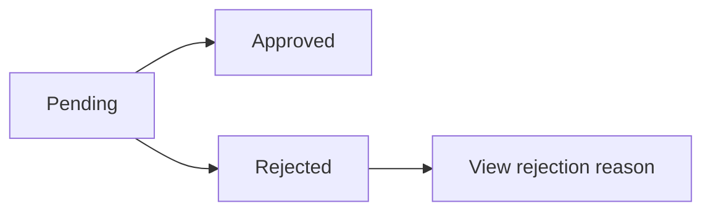

### Seller Account Deletion

A seller can delete the seller account only when there are no pending order items with paid or shipped status and no pending cancellation or refund requests.
When a seller deletes the account, the seller's products are removed from listings.
When a seller deletes the account, the seller's order history is preserved for seller records and legal purposes.
When a seller deletes the account, the seller's shop name remains preserved in past orders.
A deleted seller account no longer remains available for normal seller operations.

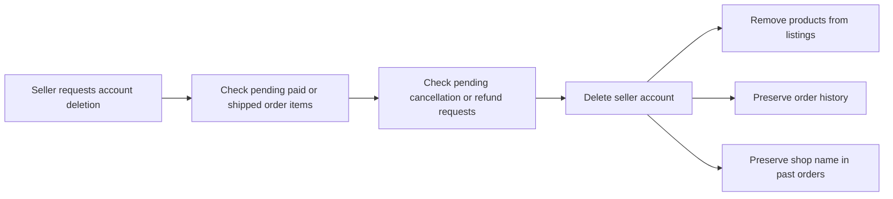

## Administrator Operations

Administrators manage platform governance and can approve or reject seller registrations. They also review requests from users who want to become administrators, then approve or reject those requests. Regular administrators and super administrators have different authority levels, and super administrators can promote or demote other administrators according to the grade rules. Administrators can create, edit, and delete categories, including subcategories, and they can view category structures for management purposes. They can view products, product snapshots, seller snapshots, and order-related records when handling disputes or policy checks. Administrators can also suspend and unsuspend sellers, ban and unban customers, and take enforcement actions on products and orders. Their operations are focused on platform oversight, approval workflows, moderation, and dispute support rather than ordinary shopping activity.

### Seller Approval Decisions

Administrators can review pending seller registration requests and decide whether to approve or reject them.

Administrators can approve a seller registration request only when the request is still pending.
Administrators can reject a seller registration request only when the request is still pending.
When a seller registration request is approved, the seller approval status becomes approved.
When a seller registration request is rejected, the seller approval status becomes rejected.
When a seller registration request is rejected, the administrator records a rejection reason.
When a seller registration request has already been approved or rejected, it cannot be processed again.
If a seller registration request is rejected, the seller can submit a new registration request.

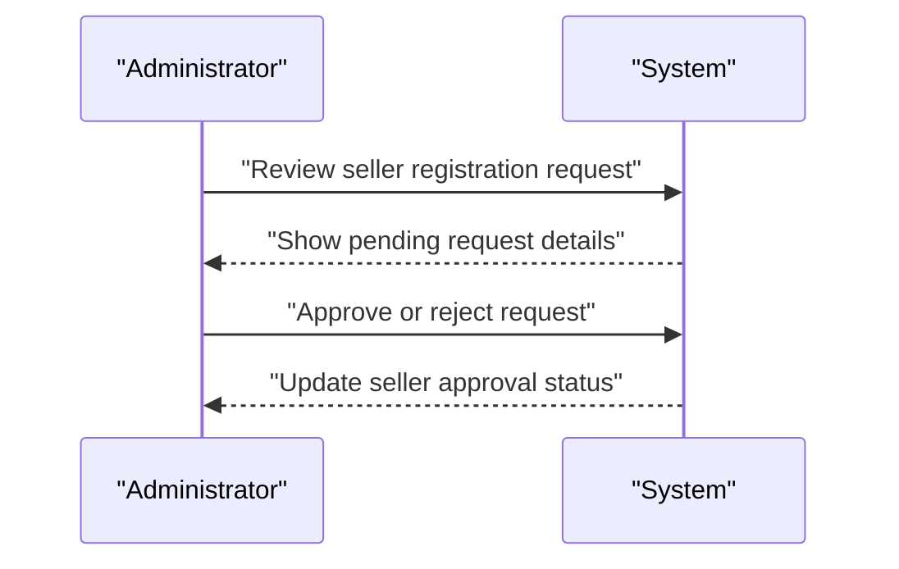

### Administrator Request Review

Administrators can review requests from users who want to become administrators.

A user can submit an administrator request with a reason.
Super administrators can review pending administrator requests.
Super administrators can approve a pending administrator request.
Super administrators can reject a pending administrator request.
When an administrator request is approved, the requester becomes a regular administrator.
When an administrator request is rejected, the request is marked as rejected.
When an administrator request is rejected, the system preserves the review decision associated with the request.
A resolved administrator request cannot be processed again.

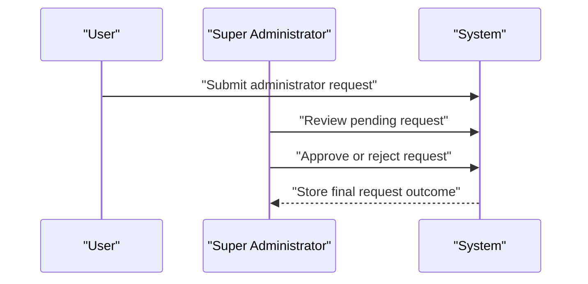

### Administrator Grade Management

Super administrators can manage administrator grades.

There are two administrator grades: regular administrator and super administrator.
Super administrators can promote a regular administrator to super administrator.
Super administrators can demote another super administrator to regular administrator.
A super administrator cannot demote themself.
When a regular administrator is promoted, the person gains super administrator grade.
When a super administrator is demoted, the person becomes a regular administrator.

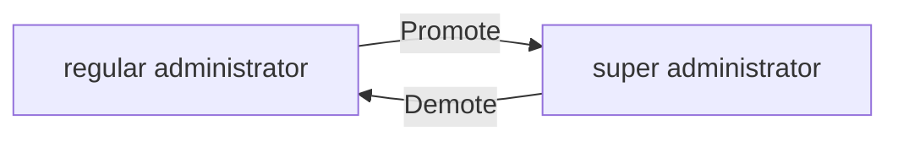

### Category Creation and Editing

Administrators can create categories and subcategories.

Administrators can create a category with a name and description.
Administrators can edit a category's name.
Administrators can edit a category's description.
Administrators can create a subcategory under an existing category.
The category structure supports only one level of subcategory nesting.
Category creation and editing are administrative operations and are not available to non-administrators.

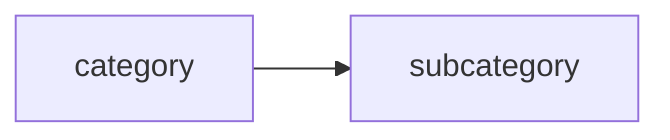

### Category Deletion

Administrators can delete categories.

When an administrator deletes a category, products that belonged to that category become uncategorized.
When an administrator deletes a category that has subcategories, the deletion is handled as a category management action and the affected products are no longer associated with the deleted category.
Category deletion is an administrative operation.
Deleted categories are removed from active category management views.

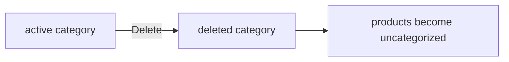

### Platform Oversight of Products and Orders

Administrators can oversee products and orders across the platform.

Administrators can view all products on the platform.
Administrators can view snapshots of any product.
Administrators can view all orders on the platform.
Administrators can force-cancel individual order items.
Administrators can force-cancel an entire order.
Administrators can force-refund individual order items.
Administrators can force-refund an entire order.
When an administrator force-cancels or force-refunds an order item, the affected stock is restored.
When an administrator force-cancels or force-refunds an order item, the order records reflect the final enforcement decision.

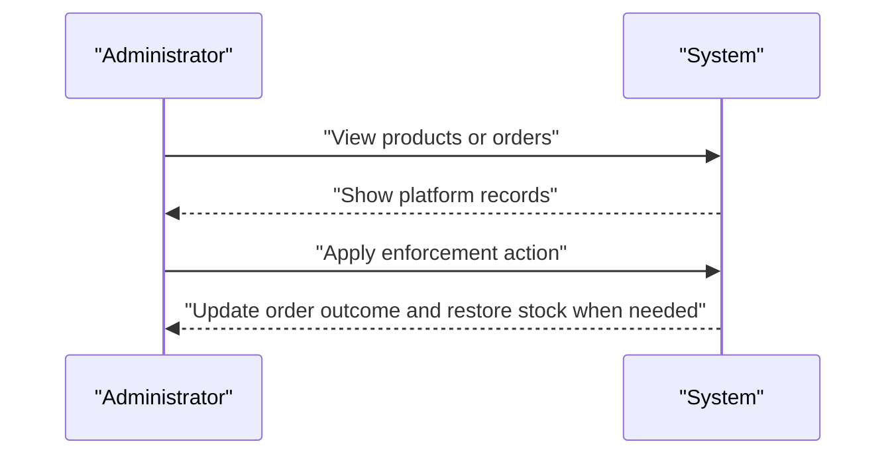

### Seller Suspension and Unsuspension

Administrators can suspend and unsuspend seller accounts.

When a seller is suspended, the seller's products are hidden from search and category listings.
When a seller is suspended, the seller's products cannot be purchased.
When a seller is suspended, the seller can still process existing orders.
When a seller is suspended, the seller cannot create new products.
When a seller is suspended, the seller cannot edit existing products.
Administrators can unsuspend a suspended seller.
When a seller is unsuspended, the seller's products become visible again.

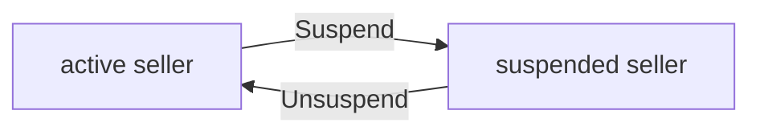

### Customer and Seller Account Bans

Administrators can ban and unban customer accounts and seller accounts.

When a customer is banned, the customer cannot log in.
When a customer is unbanned, the customer can log in again if the account is otherwise in good standing.
When a seller is banned, the seller cannot log in.
When a seller is banned, existing orders remain in place.
When a seller is unbanned, the seller can log in again if the account is otherwise in good standing.
Account bans and unbans are administrative enforcement actions.

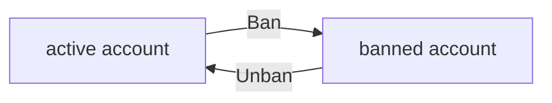

## Profile Operations

Every customer and seller has a profile that reflects their public or account-facing identity. A customer profile contains a display name and phone number, and the customer can view and edit both values. A seller profile contains the shop name, shop description, and logo image, and the seller can update those values. Profile changes are not silent because each edit must be preserved through snapshots for later review. Relevant parties such as the owner or administrators can view profile history when a dispute or audit requires it. Customers can see seller profiles as part of product and seller profile viewing. Profile deletion only happens indirectly through account deletion, while the related historical snapshots remain available. The profile operations therefore focus on presenting current identity information, allowing edits, and preserving prior states.

### Customer Profile Information

Customers have a profile that contains a display name and a phone number. The system shows these values as the customer’s account-facing identity. Customers can view their current display name and phone number at any time. The system keeps the profile information associated with the customer account unless the account is deleted.

### Edit Customer Profile Information

Customers can edit their display name and phone number. When a customer changes either value, the system updates the profile information and preserves the previous state in a snapshot. The updated profile becomes the current account-facing identity immediately after the change is accepted. If a customer account is no longer active because it has been deleted, the profile can no longer be edited as an active record.

### Seller Profile Information

Sellers have a profile that contains a shop name, a shop description, and a logo image. These values represent the seller’s storefront identity. The system makes the seller profile available so that the seller can manage it and so that customers can recognize the seller when viewing products and seller information.

### Edit Seller Profile Information

Sellers can edit their shop name, shop description, and logo image. When a seller changes any part of the profile, the system updates the current profile and preserves the previous state in a snapshot. Each profile change is recorded as a distinct change history entry so that prior versions remain available for later review. If a seller account is no longer active because it has been deleted, the seller profile can no longer be edited as an active record.

### Profile Change Snapshot History

Every profile change creates a snapshot that preserves the previous state of the changed profile information. The snapshot records when the change was made, what changed, and the values before and after the change. Snapshots are preserved as historical records and cannot be removed. This history allows the system to retain the earlier profile state even after later edits or account deletion.

### Profile History Review and Visibility

The owner of the profile can review the profile change history when needed for dispute resolution or account review. Administrators can also review profile history for the same purpose. Customers can view seller profiles when browsing products or seller information, but they only see the current seller profile details, not the edit history. Profile history remains available even when the related account is deleted, so earlier profile states can still be reviewed if needed.

## ShippingAddress Operations

Customers can maintain multiple shipping addresses for use during checkout. Each address stores recipient name, phone number, street address, city, state or province, postal code, and country. Customers can add a new address, view their saved addresses, edit an existing address, and delete an address they no longer need. One saved address can be marked as the default shipping address so checkout can proceed more quickly. The customer chooses among their saved addresses when placing an order, and the default address is used when they want the system to preselect one. Address management is tied to the customer account and is not available to guests. If an address is changed or removed, the customer must still have access to the remaining saved addresses for future orders. Address operations support convenient and accurate shipping without altering order records after checkout.

### Multiple Shipping Addresses

Customers can save more than one shipping address in their account.
A customer’s saved addresses are used only for that customer’s own checkout and address management needs.
Customers can view, add, edit, and delete their saved addresses at any time while their account is active.
Customers can keep addresses for different recipients or delivery locations, provided each address belongs to their account.

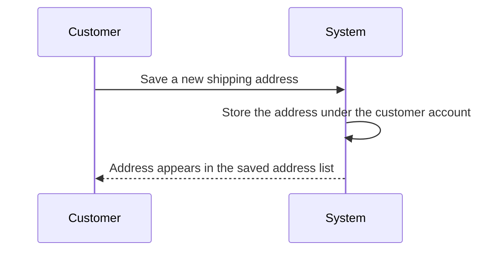

### Shipping Address Details

Each saved shipping address includes recipient name, phone number, street address, city, state or province, postal code, and country.
Customers can enter and later update any of these address details for an existing saved address.
If a customer adds a new address, the system records it as a complete shipping destination for future checkout use.
If a customer edits an address, the updated address is used for later orders, while existing orders keep the address information they already captured at checkout.

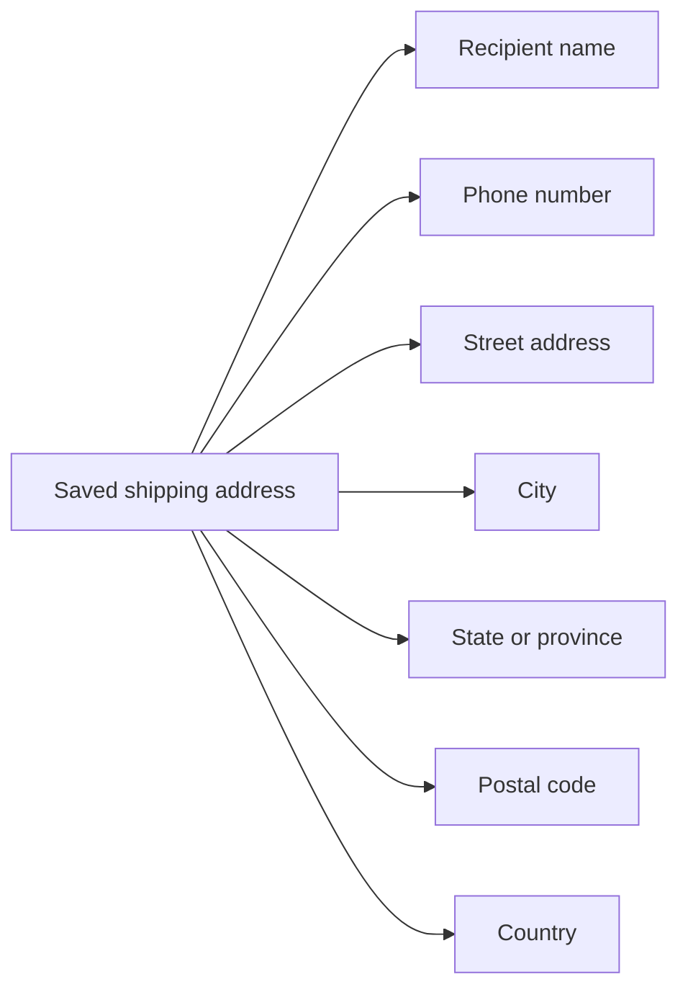

### Edit Saved Address

Customers can edit a saved shipping address that belongs to their account.
When a customer edits a saved address, the updated details replace the previous address details for future use.
The customer remains responsible for keeping the address accurate enough for delivery.
Editing one saved address does not change any other saved address.

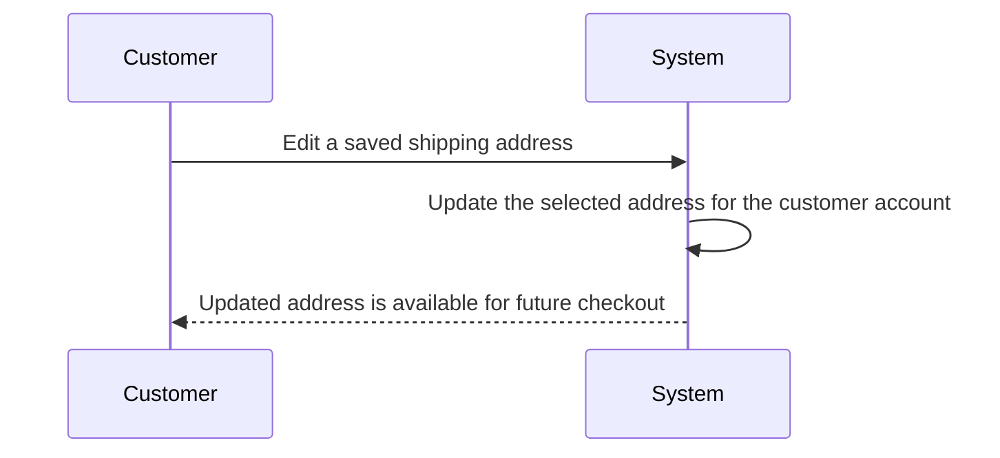

### Delete Saved Address

Customers can delete a saved shipping address that they no longer want to use.
When a saved address is deleted, it is removed from the customer’s available address list.
Deleting one saved address does not delete the customer account or any other saved addresses.
If a deleted address was previously selected for checkout, the customer must select another saved address before placing a new order.

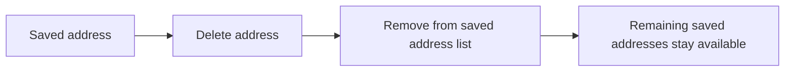

### Default Shipping Address

Customers can mark one saved address as their default shipping address.
The default shipping address is the address the system preselects when the customer begins checkout, if a default address exists.
A customer can change which saved address is set as the default shipping address.
Only one saved address can function as the default shipping address at a time for a customer.
If the default shipping address is deleted, the customer must choose another saved address for future checkout.

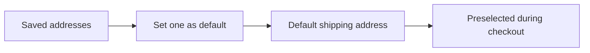

### View Saved Addresses

Customers can view the list of shipping addresses saved in their account.
The saved address list shows the stored shipping address details so the customer can choose the correct destination for delivery.
The list reflects the customer’s current saved addresses, including the address currently marked as default.
Customers cannot view saved addresses that belong to another customer account.

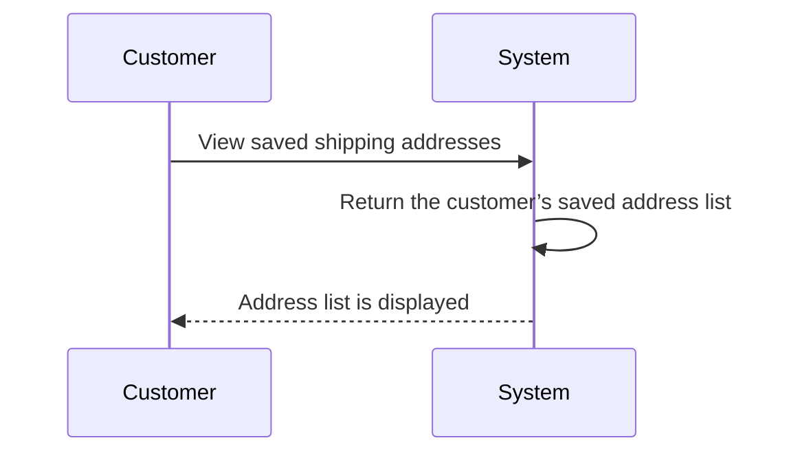

### Checkout Address Selection

At checkout, customers select one of their saved shipping addresses for the order.
If a default shipping address exists, the system may preselect it for the customer.
The selected shipping address is used for the order being placed and becomes part of that order’s shipping information.
A customer can choose a different saved address during checkout before the order is placed.
If no saved shipping address is available, the customer cannot complete checkout until one is added.

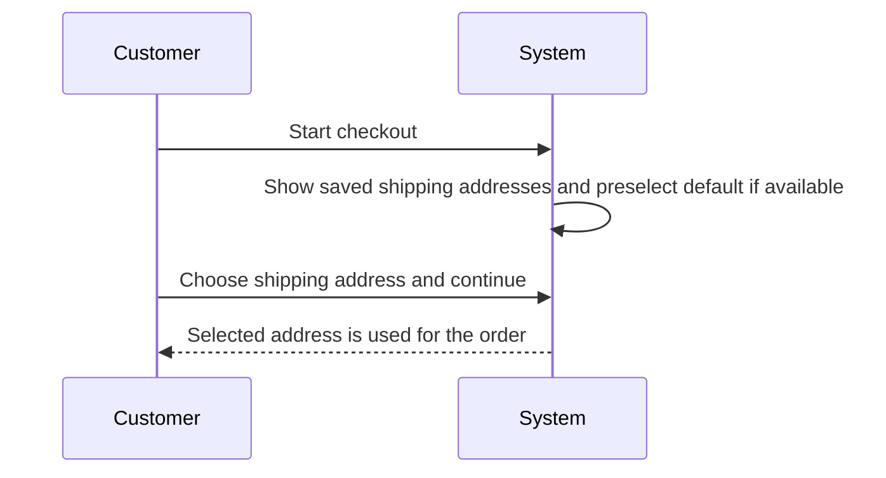

## SellerProfile Operations

A seller profile represents the shop identity shown to customers across the platform. It includes the shop name, shop description, and logo image, and sellers can update these values to keep their storefront current. Every edit to the seller profile must create a snapshot so the previous shop identity can be recovered for dispute review. Customers can view seller profiles when browsing products or opening a seller page. Past order items preserve the seller profile snapshot that was valid at the time of purchase, even if the seller later changes the profile or deletes the account. Seller profile operations therefore support storefront presentation, customer transparency, and historical preservation. The current profile is the public-facing version, while snapshots keep earlier versions available to relevant parties. These operations are essential for proving what a shop looked like when a transaction occurred.

### Seller Storefront Identity

A seller profile is the public storefront identity for a seller.
It defines how the seller is presented to customers across the platform and is the version of the shop identity currently associated with the seller.
The seller profile includes the shop name, shop description, and logo image.
When a seller updates any of these values, the storefront identity changes for future customer viewing, while earlier versions remain preserved through snapshots.

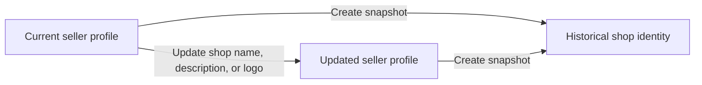

### Seller Profile Updates

The seller can update the shop name, shop description, and logo image in the seller profile.
Each update changes the current storefront identity for future viewing by customers.
Each update also creates a snapshot that preserves the prior seller profile state for dispute review and historical reference.
A seller profile update must preserve the complete shop identity that existed before the change, including the values that were replaced.

```mermaid
sequenceDiagram
    participant S as Seller
    participant P as Seller Profile
    participant H as Historical Record
    S->>P: Update shop information
    P->>H: Save previous state as snapshot
    P-->>S: Updated profile becomes current
```

### Customer Viewing of Seller Profiles

Customers can view a seller profile when browsing products or when opening the seller profile itself.
The customer sees the current public-facing seller profile, not an edited draft or hidden version.
The profile shown to customers reflects the seller storefront identity that is active at the time of viewing.
This visibility allows customers to identify the shop name, read the shop description, and recognize the logo image associated with the seller.

```mermaid
flowchart LR
    A["Customer opens seller profile"] --> B["System shows current shop name"]
    B --> C["System shows current shop description"]
    C --> D["System shows current logo image"]
```

### Seller Profile Snapshots and Historical Preservation

Every seller profile edit creates a snapshot of the previous state.
The snapshot preserves the historical shop identity so that earlier versions of the seller profile remain available for dispute resolution and record review.
Snapshots are kept even after later seller profile updates, so the shop identity can be traced over time.
Relevant parties can review snapshots to understand what the seller profile looked like before a change was made.

```mermaid
flowchart LR
    A["Seller profile edit"] --> B["Create snapshot of previous state"]
    B --> C["Historical shop identity preserved"]
    C --> D["Relevant parties can review snapshot"]
```

### Seller Profile at Time of Purchase

When a customer purchases a product, the seller profile state at that time is preserved with the purchase record.
The preserved seller profile in past orders remains associated with the order item even if the seller later changes the shop name, shop description, or logo image.
This preserved seller profile provides the historical shop identity that applied when the order was placed.
If the seller later deletes the account, the preserved seller profile in past orders remains available for order history and dispute review.


## Category Operations

Categories organize products so customers can browse and discover items by topic. Administrators create and manage categories, including one level of subcategories, and they can edit category names and descriptions. Customers can view the full list of categories and navigate into a category to see the products assigned to it. When a category is deleted, products are not removed from the platform, but they become uncategorized. The category structure must support both top-level categories and a single nested subcategory level, with no deeper hierarchy. Category operations are therefore centered on administration, browsing, and product organization. Customers are only consumers of category information, while administrators control the structure. Any category changes should preserve the browsing experience and keep products discoverable.

### Category Browsing

Customers can browse the full list of categories to discover how products are organized on the platform.
Customers can view a category as a browsing entry point for the products assigned to it.
Customers can navigate from a category into the products that belong to that category.
Customers can use category browsing to move through the platform’s product organization without needing administrative access.

```mermaid
flowchart LR
    A["Customer views category list"] --> B["Customer selects a category"]
    B --> C["System shows products in that category"]
```

### Category Structure Management

Administrators can manage the category structure for the platform.
Administrators can create top-level categories.
Administrators can create subcategories under a category.
A category can have only one level of nesting beneath a top-level category.
The system does not allow deeper category hierarchies beyond one subcategory level.
Category structure management is used to keep product organization consistent and understandable for customers.

```mermaid
flowchart LR
    A["Top-level category"] --> B["Subcategory"]
    B --> C["No deeper nesting"]
```

### Administrator-Managed Categories

Administrators are the only users who can create, edit, and delete categories.
Customers can view categories, but they cannot change category structure.
Category management is restricted to administrators so that product organization remains centrally controlled.
Category administration includes maintaining both category names and category descriptions.

```mermaid
sequenceDiagram
    participant A as Administrator
    participant S as System
    A->>S: Manage category structure
    S->>S: Apply category changes
    S-->>A: Category updated
```

### Category Name and Description Updates

Administrators can update a category’s name.
Administrators can update a category’s description.
When a category is edited, the updated name and description replace the previous category details for future browsing.
Category name and description updates are part of normal category structure maintenance.

```mermaid
flowchart LR
    A["Administrator edits category name or description"] --> B["System updates category details"]
    B --> C["Customers see updated category information"]
```

### Product Browsing by Category

Customers can view products within a selected category.
Products are shown under the category that organizes them.
If a category contains products, the category view presents those products as part of browsing and discovery.
If a category has no products, the category view still remains available to support category-based browsing.
Product browsing by category helps customers find products by topic or grouping rather than by search alone.

```mermaid
flowchart LR
    A["Customer selects category"] --> B["System shows products in category"]
    B --> C["Customer browses listed products"]
```

### Category Deletion and Uncategorized Products

Administrators can delete a category.
When a category is deleted, products that belonged to it are not deleted from the platform.
When a category is deleted, the affected products become uncategorized.
Deleted categories no longer remain available as active browsing destinations.
Category deletion must preserve the products while removing the category assignment.

```mermaid
flowchart LR
    A["Administrator deletes category"] --> B["System removes category"]
    B --> C["Products become uncategorized"]
    C --> D["Products remain on platform"]
```

### Customer Category List

Customers can view the complete list of available categories.
The category list is a customer-facing browsing feature and is separate from category management.
The category list provides the starting point for category-based product discovery.
Customers use the category list to move from a general product organization view into specific category browsing.

```mermaid
flowchart LR
    A["Customer views category list"] --> B["Customer selects a category"]
    B --> C["Customer views products in category"]
```

## Product Operations

Sellers can create products that belong to their own shop and must provide a name, description, category, and base price. Customers can browse product listings and view detailed product pages, while sellers can manage only their own products. Sellers can edit their products, and every edit must preserve the previous state through a snapshot. A product can be deleted only when there are no pending order items and no pending cancellation or refund requests for any of its variants. Deleting a product removes it from search and category listings, and it also deletes its variants and inventory records. Product snapshots remain available even after deletion, and sellers can review snapshots of their own products while administrators can review snapshots of any product. Product listing views should continue to show products by name, seller shop name, image, and pricing information when available. Products with no variants remain visible in search but are treated as unavailable for purchase.

### Product Creation

Sellers can create a product for their own shop.
A product shall belong to the seller who created it.
A product shall require a name.
A product shall require a description.
A product shall require a category.
A product shall require a base price.
A product may be created only by a seller.

```mermaid
flowchart LR
    A["Seller"] -->|"Creates product"| B["Product belongs to seller"]
    B --> C["Product includes required name, description, category, and base price"]
```

### Product Editing

Sellers can edit only their own products.
A product edit shall preserve the previous state by creating a snapshot.
The snapshot shall preserve the editable product information that changed during the edit.
A seller shall be able to review snapshots of their own products.
An administrator shall be able to review snapshots of any product.

```mermaid
sequenceDiagram
    participant S as Seller
    participant P as Product
    participant N as Snapshot
    S->>P: Edit own product
    P->>N: Create snapshot of previous state
    P-->>S: Updated product is saved
```

### Product Deletion

Sellers can delete only their own products.
A product shall be deletable only when there are no pending order items for any of its variants.
A product shall be deletable only when there are no pending cancellation requests for any of its variants.
A product shall be deletable only when there are no pending refund requests for any of its variants.
When a product is deleted, the product shall be removed from listings.
When a product is deleted, its variants shall be deleted with it.
When a product is deleted, its inventory records shall be deleted with it.
When a product is deleted, its snapshots shall remain available.
Deleted products shall no longer appear in search results or category listings.

```mermaid
flowchart LR
    A["Delete product request"] --> B["Check pending order items"]
    B --> C["Check pending cancellation requests"]
    C --> D["Check pending refund requests"]
    D -->|"If all clear"| E["Delete product and variants"]
    E --> F["Remove from listings"]
    E --> G["Preserve snapshots"]
```

### Product Visibility in Listings

Products shall continue to appear in product listings before deletion.
Product listing views shall present product information in a way that supports browsing by customers.
When a product has no variants, it may still appear in search but shall be treated as unavailable for purchase.
When a product is deleted, it shall no longer appear in search or category listings.
A deleted product shall remain represented in preserved snapshots for review and dispute resolution.

```mermaid
flowchart LR
    A["Product exists"] --> B["Visible in listings"]
    B --> C["Product deleted"]
    C --> D["Removed from search and category listings"]
    C --> E["Snapshots remain available"]
```

## ProductVariant Operations

Product variants let sellers offer different option combinations under the same product. Each variant has a unique SKU code, option values, an optional price override, and a stock quantity managed for availability. Sellers can add variants to their own products, edit the SKU code, option values, and price, and delete variants when business conditions allow it. A product must have at least one variant to be purchasable, so variants directly control whether the product can be bought. Variant edits must create snapshots so the historical state of options and pricing is preserved. Customers see available variants on the product detail page along with their pricing and stock status. Variants with zero stock are shown as out of stock and cannot be added to the cart. When a product has no variants, it remains visible but is treated as unavailable.

### Variant Identification and Pricing

A product variant is identified by its SKU code, which is required and must be unique within the product.

Each variant stores its option values as the specific combination of choices that distinguishes it from other variants of the same product.

A variant may define a price override. When a price override is present, it represents the selling price for that variant instead of the product's base price.

The product detail page shows each available variant together with its option values, price, and stock status.

```mermaid
flowchart LR
    A["Product"] --> B["Product Variant"]
    B --> C["SKU Code"]
    B --> D["Option Values"]
    B --> E["Price Override"]
    B --> F["Stock Quantity"]
    G["Product Detail Page"] --> B
```

### Adding Variants to a Product

Sellers can add variants to products they own.

When a seller adds a variant, the variant becomes part of that product and is available for customers to view on the product detail page when it is not out of stock.

A product can contain multiple variants, and each variant represents one purchasable option combination for that product.

```mermaid
sequenceDiagram
    participant S as Seller
    participant P as Product
    participant V as Product Variant
    S->>P: Add variant to product
    P->>V: Create variant under product
    V-->>S: Variant becomes available for product management
```

### Variant Stock Quantity and Availability

Each variant has its own stock quantity.

The stock quantity determines whether the variant is available for purchase.

When a variant's stock quantity reaches zero, the variant is shown as out of stock.

Out-of-stock variants cannot be added to the cart.

The product detail page shows the stock status for each variant so customers can see whether it is available.

```mermaid
flowchart LR
    A["Stock Quantity Above Zero"] --> B["Variant Available"]
    C["Stock Quantity = 0"] --> D["Out of Stock"]
    D --> E["Cannot Be Added to Cart"]
    B --> F["Shown on Product Detail Page"]
    D --> F
```

### Editing Variants and Preserving History

Sellers can edit the SKU code, option values, and price of their own variants.

Every variant edit creates a snapshot so the previous state of the variant is preserved.

The snapshot preserves the changed variant values so the history of option combinations and pricing can be reviewed later.

```mermaid
sequenceDiagram
    participant S as Seller
    participant V as Product Variant
    participant X as Snapshot
    S->>V: Edit SKU code, option values, or price
    V->>X: Record previous and updated values
    X-->>S: Historical state preserved
```

### Deleting Variants and Purchase Constraints

Sellers can delete variants only when the variant has no pending order items with paid or shipped status.

Sellers can delete variants only when the variant has no pending cancellation requests and no pending refund requests.

A variant cannot be deleted while it is still needed for active purchase processing.

When a variant is deleted, it is removed from the product's purchasable set.

```mermaid
flowchart LR
    A["Variant"] --> B["Pending Paid or Shipped Order Items"]
    A --> C["Pending Cancellation or Refund Requests"]
    B --> D["Deletion Blocked"]
    C --> D
    A --> E["No Active Purchase References"]
    E --> F["Variant Can Be Deleted"]
```

### Product Purchasability Depends on Variants

A product must have at least one variant to be purchasable.

If a product has no variants, it remains visible in search but is treated as unavailable.

Customers can view variant availability on the product detail page, but they cannot purchase a product that has no variants.

```mermaid
flowchart LR
    A["Product Has Variants"] --> B["Product Is Purchasable"]
    C["Product Has No Variants"] --> D["Product Is Unavailable"]
    D --> E["Visible in Search"]
    D --> F["Not Purchasable"]
```

## ProductImage Operations

Sellers can upload multiple images for each product to support product presentation. Images can be reordered, and the first image becomes the main thumbnail used in listings. Sellers can also delete individual images when they no longer represent the product well. Image changes are part of the product history and must be included in product snapshots. Customers see these images on product listings and the product detail page, where all images are available for viewing. Image operations must maintain the order that shoppers rely on for visual comparison and trust. Because image changes affect how the product is presented, each update is part of the product’s recorded history. These operations are focused on storefront display rather than separate content management.

### Product Image Management

Sellers can upload multiple images for a product to support product presentation.
The product image set is ordered, and that order is preserved whenever the product is viewed.
The first image in the ordered set is the main thumbnail image used for product listings.
Sellers can reorder the images for their own products, and the updated order becomes the new display order.
Sellers can delete individual product images when they no longer want them shown.
Customers can view all images for a product on the product detail page.
Product image changes are part of the product’s recorded history and are included in product snapshots.
Each image-related change preserves the previous state so the product’s visual presentation can be reviewed later.

```mermaid
flowchart LR
    A["Seller uploads product images"] --> B["Ordered image set is updated"]
    B --> C["First image becomes main thumbnail"]
    B --> D["Customers view all images on product detail page"]
    B --> E["Product snapshot records image change"]
    A --> F["Seller reorders images"]
    F --> B
    A --> G["Seller deletes an image"]
    G --> B
```


## InventoryRecord Operations

Inventory for each variant is tracked through inventory history records rather than by directly changing a current stock value. Sellers can add inventory for restocking and subtract inventory for adjustment or loss, and each record must include the quantity change, reason, and timestamp. Order placement automatically creates a negative inventory record, while cancellation or refund processing automatically creates a positive one. The current stock shown to customers and sellers is derived from the sum of all inventory history records. Sellers can view the full inventory history for each variant to understand how stock changed over time. Inventory records support accountability because they explain why stock increased or decreased. When the total stock reaches zero, the variant is marked out of stock and cannot be added to the cart. Inventory record operations therefore support stock visibility, auditability, and transaction-driven updates.

### Inventory History Record

Each change to a variant’s stock is recorded as an inventory history record.
An inventory history record identifies whether the change increases or decreases stock, the reason for the change, and the time the change occurred.
Inventory history records exist to explain how a variant’s stock changed over time and to support accountability for stock movements.
Inventory history records are preserved as part of the variant’s history and are not treated as a replacement for current stock visibility.
```mermaid
flowchart LR
    A["Stock change event"] --> B["Inventory history record"]
    B --> C["Variant stock history"]
    B --> D["Accountability review"]
```

### Restocking, Adjustment, and Automatic Stock Change Records

When a seller adds stock to a variant, the system creates an inventory history record with a positive quantity change.
When a seller records an adjustment or loss, the system creates an inventory history record with a negative quantity change.
The reason for a restocking change is recorded so sellers can distinguish replenishment from other stock movements.
The reason for an adjustment or loss is recorded so the stock history explains why stock decreased outside normal sales.
When an order is placed successfully, the system automatically creates a negative inventory history record for each purchased variant.
When a cancellation or refund restores stock, the system automatically creates a positive inventory history record for the affected variant.
```mermaid
sequenceDiagram
    participant S as Seller
    participant M as System
    participant O as Order Process
    participant R as Cancellation or Refund Process
    S->>M: Record restocking or adjustment
    M->>M: Create inventory history record
    O->>M: Order placed successfully
    M->>M: Create negative inventory history record
    R->>M: Cancellation or refund restores stock
    M->>M: Create positive inventory history record
```

### Timestamped Inventory Records and Current Stock Calculation

Each inventory history record includes the time the change was made.
The current stock for a variant is calculated from the full sequence of inventory history records for that variant.
The system does not rely on a manually entered stock value as the source of truth for current stock.
Customers and sellers see stock availability based on the stock calculated from history.
This approach ensures that every stock figure can be traced back to the underlying inventory history records.
```mermaid
flowchart LR
    A["Inventory history records"] --> B["Stock calculation"]
    B --> C["Current stock"]
    C --> D["Availability display"]
```

### Full Inventory History View

Sellers can view the full inventory history for each variant they own.
The inventory history view shows each recorded stock change in chronological order.
The view supports understanding when stock was added, reduced, or restored.
The view is intended to help sellers audit stock movement and explain discrepancies during review or dispute handling.
If a variant has no inventory history records, the history view shows that no stock changes have been recorded yet.
```mermaid
flowchart LR
    A["Seller"] --> B["Full inventory history view"]
    B --> C["Chronological stock changes"]
    C --> D["Audit and review"]
```

### Out of Stock Status and Inventory Accountability

When the calculated stock for a variant reaches zero, the system marks the variant as out of stock.
An out of stock variant cannot be added to the cart.
Inventory history records support accountability by showing the sequence of stock changes that led to the current stock state.
Because inventory history records are preserved, the system can explain why a variant became unavailable even after multiple restocks, sales, adjustments, cancellations, or refunds.
The combination of recorded reasons, timestamps, and change values allows sellers and administrators to review stock responsibility when needed.
```mermaid
flowchart LR
    A["Calculated stock reaches zero"] --> B["Variant marked out of stock"]
    B --> C["Cannot be added to cart"]
    A --> D["Inventory accountability review"]
```

## Wishlist Operations

Customers can save products to a wishlist for later consideration. The wishlist contains products rather than specific variants, and customers can view the list in a paginated format. Customers can add products to the wishlist and remove them when they are no longer interested. Wishlist items should reflect the current product availability experience, but the saved relationship is centered on the product itself. If a seller deletes a product, it is automatically removed from all wishlists so customers do not keep links to deleted items. Wishlist operations help customers track products they want without purchasing immediately. The feature is available only to registered customers because guest browsing is not allowed. The list must remain simple and focused on product saving and removal actions.

### Wishlist Product Saving and Removal

Customers can save products to their wishlist for later purchase consideration.
The wishlist acts as a customer product favorites list and stores products rather than specific variants.
When a customer saves a product to the wishlist, the saved item represents the product as a whole and not a selected variant.
A customer can remove a saved product from the wishlist when they no longer want to keep it as a favorite.
The system keeps the wishlist focused on product saving and removal only, without turning it into a variant selection list.
The wishlist is available only to registered customers, because guest browsing is not allowed.

```mermaid
sequenceDiagram
    participant C as "Customer"
    participant S as "System"
    C->>S: "Save product to wishlist"
    S->>S: "Store product as a favorite"
    S-->>C: "Product saved"
    C->>S: "Remove product from wishlist"
    S->>S: "Remove saved product"
    S-->>C: "Product removed"
```

### Wishlist Viewing and Pagination

A customer can view the list of products saved in the wishlist.
The wishlist list is paginated so customers can browse saved products in manageable groups.
When viewing the wishlist, the system shows saved products rather than product variants.
The wishlist view supports the customer's later purchase consideration by helping them revisit products they previously saved.
If a customer has no saved products, the wishlist view shows an empty list.
Only registered customers can access the wishlist view.

```mermaid
flowchart LR
    A["Customer opens wishlist"] --> B["System shows saved products"]
    B --> C["System applies pagination"]
    C --> D["Customer browses saved products"]
```

### Automatic Removal of Deleted Products from Wishlists

If a seller deletes a product, the system automatically removes that product from every customer's wishlist.
This automatic removal keeps customers from holding saved links to products that no longer exist.
The removal happens without requiring a customer to take any action.
After automatic removal, the deleted product no longer appears in any wishlist view.
The wishlist remains a list of active products that customers may consider for later purchase.

```mermaid
flowchart LR
    A["Seller deletes product"] --> B["System removes product from wishlists"]
    B --> C["Product no longer appears in wishlist view"]
```

## Cart Operations

Customers can keep a shopping cart that contains selected product variants and quantities. A cart is built from specific variants, not from products alone, because checkout requires a concrete purchase choice. When the same variant is added again, the quantity is combined into the existing cart entry instead of creating a duplicate line. Customers can view the cart, adjust item quantities, and remove items before checkout. The cart shows the total price of all items so customers can review cost before proceeding. If a variant has less stock than the cart quantity, a warning is shown, and if a variant becomes deleted or out of stock it is marked unavailable. Unavailable items cannot be checked out, which keeps the purchase flow aligned with current product availability. Cart operations are therefore about collecting purchasable variant selections and keeping them accurate until order placement.

### Variant-Based Cart Selection

Customers use the cart to collect specific product variants rather than products alone. Each cart item represents one selected variant and its quantity, so the cart reflects an exact purchasable choice.

When a customer adds a variant that is already in the cart, the system combines the quantities into the existing cart item instead of creating a duplicate cart line.

The cart keeps the selected variant identity visible to the customer so they can confirm which version of a product they intend to buy. If a product has multiple variants, the cart entry remains tied to the chosen variant and does not change into a product-level entry.

Mermaid diagram:
```mermaid
flowchart LR
    A["Customer selects variant"] --> B["Cart item created"]
    B --> C["Same variant added again"]
    C --> D["Quantities combined"]
    D --> E["Cart item remains one line"]
```

### View and Update Cart Contents

Customers can view the contents of their cart at any time. The cart shows each item with the product name, the selected variant details, the item quantity, and the item subtotal.

Customers can edit the quantity of any cart item before checkout. When a quantity is changed, the cart updates the item subtotal and the cart total price accordingly.

Customers can remove a cart item from the cart. After removal, the item no longer appears in the cart summary.

The cart total price is the combined total of all cart item subtotals, and it is shown so customers can review the full cost before proceeding to checkout.

Mermaid diagram:
```mermaid
sequenceDiagram
    participant C as Customer
    participant S as System
    C->>S: View cart
    S-->>C: Show cart items and total price
    C->>S: Change item quantity
    S-->>C: Update subtotal and total price
    C->>S: Remove cart item
    S-->>C: Remove item from cart
```

### Cart Availability Warnings and Checkout Readiness

If the available stock for a cart item is lower than the quantity in the cart, the system shows a stock warning for that item so the customer can review the mismatch before buying.

If a variant becomes deleted or out of stock, the system marks the cart item as unavailable. An unavailable cart item remains visible in the cart so the customer can see what needs attention.

Unavailable cart items cannot be checked out. The cart is considered ready for checkout only when the items included for checkout are available and the customer can proceed without unavailable items blocking the purchase.

Mermaid diagram:
```mermaid
flowchart LR
    A["Cart item in stock"] --> B["Stock falls below cart quantity"]
    B --> C["Show stock warning"]
    A --> D["Variant deleted or out of stock"]
    D --> E["Mark item unavailable"]
    E --> F["Block checkout for that item"]
    C --> G["Customer reviews cart"]
    F --> G
    G --> H["Checkout ready only with available items"]
```

## CartItem Operations

Each cart item represents one selected variant and its quantity within the customer's cart. Customers add a cart item by choosing a specific variant and specifying how many units they want. If the same variant is added again, the existing cart item quantity increases rather than creating a second cart item. Customers can update the quantity of a cart item or remove it entirely from the cart. Cart item display includes the product name, variant options, price, quantity, and subtotal so customers can verify the purchase details. When a variant changes to unavailable, the cart item remains visible but cannot be used for checkout until the issue is resolved. Cart item operations support precise purchase selection and quantity control. These operations are the line-level building blocks of the full cart experience.

### Variant-Based Purchase Line

A cart item represents one variant-based purchase line within a customer's cart.
A cart item is created only when the customer selects a specific product variant, not just a product.
A cart item stores the chosen variant and the quantity the customer wants to buy.
A cart item is treated as the line-level unit of cart control for changing or removing a selected purchase.

```mermaid
flowchart LR
    A["Customer selects a specific variant"] --> B["Cart item is created"]
    B --> C["Cart item represents one purchase line"]
    C --> D["Customer updates quantity or removes the line"]
```

### Cart Item Quantity and Merging

When a customer adds the same variant again, the system combines the quantities into the existing cart item.
The system does not create a second cart item for the same variant.
The cart item quantity always reflects the combined quantity for that selected variant.
When the customer updates the quantity of a cart item, the system changes the quantity for that existing line item.

```mermaid
sequenceDiagram
    participant C as Customer
    participant S as System
    C->>S: Add the same variant again
    S->>S: Combine quantities into the existing cart item
    C->>S: Update the cart item quantity
    S->>S: Change the quantity on that line item
```

### Cart Item Subtotal and Display

Each cart item shows the product name and the selected variant options so the customer can verify exactly what is being purchased.
Each cart item shows its subtotal based on the selected variant price and the cart item quantity.
The cart continues to show the cart item even when the selected variant becomes unavailable.
When a cart item is unavailable, it remains visible in the cart but cannot be used for checkout until it becomes available again.
If the selected variant is deleted or out of stock, the cart item is marked as unavailable in the cart.

```mermaid
flowchart LR
    A["Cart item is visible"] --> B["Product name and variant options are shown"]
    B --> C["Subtotal is shown for the line item"]
    C --> D["If variant is unavailable, checkout is blocked for that line"]
```

### Cart Item Removal

A customer can remove a cart item from the cart at any time.
Removing a cart item deletes that selected variant line from the cart.
Removal applies to the specific cart item only and does not affect other cart items in the cart.
If the customer adds the same variant later, the system creates or restores the cart item again through the normal add-to-cart behavior.

```mermaid
flowchart LR
    A["Customer removes cart item"] --> B["Selected variant line is deleted from cart"]
    B --> C["Other cart items remain unchanged"]
```

## Order Operations

An order is created only after checkout is completed and payment succeeds. Orders contain one or more order items, may include items from different sellers, and are shown to customers in a paginated history sorted by newest first. Customers can view order summaries and full order details, including the shipping address, line items, and shipment tracking information. Each order has an overall status derived from the statuses of its items, so the order reflects the state of the full purchase rather than a single line. After an order is placed, the shipping address cannot be changed. Order records must preserve the purchasing context for legal and seller-record purposes, even when a customer later deletes an account. Orders also support the lifecycle of cancellation, refund, shipping, and delivery across their items. The order operation set is primarily about recording and presenting completed purchases.

### Order Placement and Record Creation

An order is created only after checkout is completed and payment succeeds.
An order is not created when payment fails, and the customer may try again.
An order may contain items from different sellers.
Each purchased variant becomes an order item, and identical quantities for the same variant are combined into a single order item.
Once an order is placed, the shipping address for that order is locked and cannot be changed.
The order record preserves the purchase context needed for legal purposes and seller records, even if the customer later deletes the account.
A placed order must remain available for the customer to review in order history.

Mermaid flow:
```mermaid
flowchart LR
    A["Checkout complete"] --> B["Payment succeeds"]
    B --> C["Create order record"]
    C --> D["Create order items"]
    C --> E["Lock shipping address"]
    B --> F["Order not created when payment fails"]
```


### Order History List

Customers can view a list of their orders.
The order history is paginated.
The order history is sorted with the newest orders first.
Each order entry in the list shows the order number, order date, total price, and overall order status.
The order history continues to show preserved orders even after the customer deletes the account, because order records are retained for legal and seller-record purposes.

Mermaid flow:
```mermaid
flowchart LR
    A["Customer opens order history"] --> B["System retrieves preserved orders"]
    B --> C["Paginate results"]
    C --> D["Sort newest first"]
    D --> E["Display order list"]
```


### Order Summary and Full Details

Customers can review an order summary before placing the order.
The order summary shows the items being purchased, the shipping address, and the total price.
Customers can view the full details of a placed order.
The full order details show each item with product name, variant, quantity, price, and item status.
The full order details also show the shipping address and the shipments associated with the order.
The order detail view includes tracking information for each shipment and shows which items are included in each shipment.
Because orders may include items from different sellers, the order details must present the purchased items in a way that keeps each seller's shipped items grouped within their own shipment context.

Mermaid flow:
```mermaid
flowchart LR
    A["Order summary"] --> B["Items"]
    A --> C["Shipping address"]
    A --> D["Total price"]
    E["Full order details"] --> F["Item list"]
    E --> G["Shipping address"]
    E --> H["Shipments"]
    H --> I["Tracking information"]
```


### Order Status and Shipment Tracking in the Purchase Record

The overall order status is derived from the statuses of the order items.
If all order items are paid, the order status is paid.
If any order item is shipped and none are delivered yet, the order status is shipped.
If all order items are delivered, the order status is delivered.
If all order items are cancelled, the order status is cancelled.
If all order items are refunded, the order status is refunded.
If the order contains mixed item states, the order status is partially completed.
Order details must present shipment tracking information so customers can follow the delivery progress of the items in the order.
Shipment tracking information is part of the preserved order record so the purchase history remains complete after later account changes.

Mermaid flow:
```mermaid
flowchart LR
    A["Order items"] --> B["All paid"] --> C["Order paid"]
    A --> D["Any shipped and none delivered"] --> E["Order shipped"]
    A --> F["All delivered"] --> G["Order delivered"]
    A --> H["All cancelled"] --> I["Order cancelled"]
    A --> J["All refunded"] --> K["Order refunded"]
    A --> L["Mixed states"] --> M["Order partially completed"]
```


## OrderItem Operations

An order item represents a purchased product variant with a quantity, and it is the smallest unit for fulfillment and post-purchase actions. Each item keeps its own status, which can be paid, shipped, delivered, cancelled, or refunded. When an order is created, the purchased product and variant are captured as snapshots, along with the seller profile snapshot, so the order item preserves the state at the time of purchase. Customers can view item-level details inside an order, including product name, variant, quantity, price, and current item status. Sellers process shipping and respond to cancellation or refund requests at the item level, which allows different items in the same order to progress independently. Customers can request cancellation for paid items and refund for delivered items, subject to the business rules for each workflow. Order item operations are central to preserving transactional accuracy and making partial fulfillment possible. These records remain even when the related customer or seller account later changes or is deleted.

### Purchased Product Variant Line

Each order item shall represent one purchased product variant line within an order.
Each order item shall be tied to a single product variant and a single seller at the time of purchase.
If a customer purchases multiple units of the same variant in one order, the system shall keep them as one order item with a quantity greater than one.
An order item shall preserve the purchased product variant line even if the related product or variant is later changed or deleted.

### Quantity Per Order Item

Each order item shall store the quantity purchased for that variant.
The system shall treat the quantity as the number of units covered by that item’s status, shipping, cancellation, refund, and review history.
If the same variant is purchased more than once in the same order, the system shall combine the purchase into a single order item and increase the quantity instead of creating separate order items.
The quantity shown in order history shall match the quantity recorded for that order item at the time the order was placed.

### Item-Level Status

Each order item shall have its own status independent of other items in the same order.
The system shall support the item statuses paid, shipped, delivered, cancelled, and refunded.
A paid item shall indicate that payment has completed and the item is waiting for seller fulfillment.
A shipped item shall indicate that the seller has shipped the item.
A delivered item shall indicate that the item has been confirmed as received.
A cancelled item shall indicate that the item was cancelled through the cancellation workflow.
A refunded item shall indicate that the item was refunded through the refund workflow.
The status of one order item shall not force every other item in the same order to move to the same status.

### Product, Variant, and Seller Profile Snapshots in Order Items

Each order item shall preserve a snapshot of the purchased product at the time of purchase.
Each order item shall preserve a snapshot of the purchased variant at the time of purchase.
Each order item shall preserve a snapshot of the seller profile at the time of purchase.
The product snapshot stored with the order item shall preserve the product name, description, variant context, and price shown at purchase time.
The variant snapshot stored with the order item shall preserve the variant option values and price used for that purchase.
The seller profile snapshot stored with the order item shall preserve the shop name and logo shown at purchase time.
These snapshots shall remain available with the order item even if the current product, variant, or seller profile later changes or is deleted.

### Item-Level Cancellation and Refund

Customers shall be able to request cancellation for an order item only while the item is paid.
Customers shall be able to request a refund for an order item only while the item is delivered.
The system shall keep cancellation and refund behavior at the item level rather than at the whole-order level.
When a cancellation request is approved, only the requested order item shall become cancelled.
When a refund request is approved, only the requested order item shall become refunded.
The system shall allow other items in the same order to continue through their own fulfillment, cancellation, or refund process independently.

### Item Details in Order History

When customers view order history, the system shall show each order item’s purchased product name, variant information, quantity, price, and current item status.
When customers view the full details of an order, the system shall show the order items as separate item-level records rather than only as a combined order total.
The item details shown in order history shall reflect the preserved purchase snapshots for the product, variant, and seller profile.
If an item has been cancelled or refunded, the item details shall still remain visible in the order record with its final status.

### Partial Order Fulfillment

The system shall allow items in the same order to move through different statuses independently.
If some items in an order are shipped, delivered, cancelled, or refunded while others remain paid, the order shall remain partially completed.
The system shall support partial fulfillment by allowing a single order to contain a mix of item-level outcomes.
An order shall not be forced into a single final state until the statuses of all of its order items are considered together.
This behavior shall allow one customer order to be fulfilled across multiple item-level outcomes without losing the individual history of any item.

### Order Item State Progression

The system shall keep the item-level state progression aligned with the supported statuses for order items.
A paid order item may later become shipped, delivered, cancelled, or refunded according to the applicable business workflow.
A shipped order item may later become delivered according to the delivery workflow.
A cancelled order item shall remain cancelled.
A refunded order item shall remain refunded.
The system shall preserve the full item-level history needed to explain how the final status was reached.

### Preservation After Account Changes

An order item shall remain part of the customer’s order history even if the related customer account is later deleted.
An order item shall remain part of seller records even if the related seller account is later deleted.
The preserved product, variant, and seller profile snapshots shall allow the order item to remain understandable after related accounts or catalog data are no longer active.
The system shall continue to show the item-level record as part of the order history for relevant business and legal recordkeeping purposes.

## Shipment Operations

A shipment represents one package sent by a seller and can include one or more order items from that same seller. Different sellers ship separately, so a shipment never mixes items from different sellers. Sellers create shipments when they are ready to send items and must provide tracking information such as carrier name and tracking number. When a shipment is created, all included items move to shipped status together. Customers can view shipment information and use it to follow the delivery process. Delivery confirmation works at the shipment level, so the customer confirms the package rather than each individual item. If the customer does not confirm delivery, the shipment still completes automatically after the waiting period defined in the requirements. Shipment operations support packaging, tracking, and delivery visibility across the order lifecycle.

### Shipment Creation and Item Grouping

A shipment is created by a seller for one order and represents one package sent by that seller.
A shipment may include one or more order items, as long as all included items belong to the same seller.
The system shall not allow a shipment to mix order items from different sellers.
When a seller creates a shipment, the shipment shall be associated with the selected order items and the shipment details entered by the seller.

```mermaid
sequenceDiagram
    participant S as "Seller"
    participant M as "System"
    participant C as "Customer"
    S->>M: "Create shipment for selected order items"
    M->>M: "Validate seller ownership and item grouping"
    M->>M: "Create shipment"
    M-->>C: "Shipment becomes visible in order details"
```

### Shipment Tracking Information

Each shipment includes the carrier name and tracking number provided by the seller.
The system shall store the carrier name and tracking number as the shipment's tracking information.
Customers can view the tracking information for each shipment in their order details.
Sellers can review the tracking information they entered for a shipment after it is created.
If tracking information is not provided, the shipment cannot be completed as a shipping action.

```mermaid
flowchart LR
    A["Seller enters shipment details"] --> B["Carrier name provided"]
    A --> C["Tracking number provided"]
    B --> D["Shipment created"]
    C --> D
```

### Shipment Shipping Action

When a shipment is created for shipping, all order items included in that shipment change to shipped status together.
The system shall apply shipped status to every item in the shipment at the same time.
If an order item is not included in the shipment, its status does not change.
A shipment can be used to ship one item or multiple items from the same seller.

```mermaid
flowchart LR
    A["Shipment created"] --> B["Items included in shipment"]
    B --> C["All included items change to shipped status"]
    C --> D["Shipment is visible for tracking"]
```

### Shipment-Level Delivery Confirmation

Delivery confirmation is handled at the shipment level, not at the individual order item level.
Customers confirm delivery for a shipment after reviewing its tracking information.
When a customer confirms delivery for a shipment, all order items in that shipment change to delivered status together.
The system shall treat the shipment as the unit of delivery completion for customer confirmation.
If a shipment is not confirmed by the customer, the shipment still reaches delivery completion automatically after the waiting period defined for the platform.

```mermaid
flowchart LR
    A["Shipment shipped"] --> B["Customer views tracking information"]
    B --> C["Customer confirms delivery"]
    C --> D["All shipment items change to delivered status"]
    A --> E["No customer confirmation"]
    E --> F["Shipment completes automatically"]
```

### Shipment Visibility and Completion

Customers can view shipment details as part of their order history and order details.
The shipment view shows which order items are included in each shipment and the associated tracking information.
Different sellers always ship through separate shipments, so a single shipment never contains items from more than one seller.
Delivery completion for a shipment applies to all items in that shipment, and the shipment is considered complete only when its delivery confirmation process has finished.
The system shall preserve shipment details for customer review after the shipment is completed.

```mermaid
flowchart LR
    A["Order details"] --> B["Shipment details displayed"]
    B --> C["Tracking information shown"]
    C --> D["Delivery confirmation completed"]
    D --> E["Shipment marked complete"]
```

## CancellationRequest Operations

Customers can request cancellation for individual order items that are still in paid status and have not been shipped. Each request includes a reason, and the seller for that item can approve or reject it. When the seller responds, the state of the request must be preserved through a snapshot so the decision history is visible later. If approved, the item becomes cancelled and a refund is processed for that item only. Stock is restored through inventory history when a cancellation is completed. The remaining items in the same order continue to move through their own workflows without interruption. Sellers and administrators can view cancellation requests when handling disputes or monitoring operations. Cancellation request operations therefore support pre-shipment reversal with a documented decision trail.

### Cancel Paid Order Item

Customers can request cancellation for an individual order item only when the item is still in paid status and has not been shipped.
A cancellation request applies to one order item at a time and does not cancel the entire order.
The system keeps the other items in the same order active so they can continue through their own workflows.

```mermaid
flowchart LR
    A["Paid order item"] -->|"Request cancellation"| B["Cancellation request"]
    B -->|"Approve"| C["Item cancelled"]
    B -->|"Reject"| D["Item remains paid"]
```

The system shall allow a customer to create a cancellation request for a paid order item that has not been shipped.
The system shall keep the cancellation scope limited to the selected order item.
The system shall preserve the rest of the order when one item enters the cancellation workflow.

### Cancellation Reason and Decision Handling

Each cancellation request includes a reason provided by the customer.
The seller for the affected order item can review the request and either approve it or reject it.
When the seller responds, the decision becomes part of the preserved request history so the outcome can be reviewed later.

```mermaid
sequenceDiagram
    participant C as Customer
    participant S as Seller
    participant SYS as System
    C->>SYS: Submit cancellation request with reason
    SYS-->>S: Make request available for review
    S->>SYS: Approve or reject request
    SYS-->>C: Show final request outcome
```

The system shall record a cancellation reason for each submitted cancellation request.
The system shall allow the seller of the item to approve the request.
The system shall allow the seller of the item to reject the request.
The system shall preserve the seller’s decision as part of the request history.

### Request State Snapshot Preservation

When the seller approves or rejects a cancellation request, the system preserves the state of the request through a snapshot.
The snapshot captures the request state before and after the seller’s response so the decision history remains visible later.
This preserves the full cancellation decision trail for dispute resolution.

```mermaid
flowchart LR
    A["Request pending"] -->|"Seller responds"| B["Snapshot created"]
    B -->|"Approve or reject"| C["Final request state preserved"]
```

The system shall create a request state snapshot when the seller responds to a cancellation request.
The system shall preserve the request state before and after the seller response.
The system shall keep the snapshot available for later review as part of the decision history.
The system shall not remove preserved request history after the request is resolved.

### Approved Cancellation Effects

If the seller approves the cancellation request, the item becomes cancelled and a refund is processed for that item only.
The cancellation does not affect unrelated items in the same order.
The system restores stock for the cancelled item through inventory history so the stock change is recorded.

```mermaid
flowchart LR
    A["Approved cancellation request"] --> B["Item cancelled"]
    B --> C["Refund processed for item"]
    B --> D["Stock restored through inventory history"]
```

The system shall mark the affected order item as cancelled when the cancellation request is approved.
The system shall process a refund for the cancelled order item only.
The system shall restore stock for the cancelled item through inventory history.
The system shall leave the remaining order items unchanged when one item is cancelled.

### Pending Cancellation Request View and Decision History

Sellers and administrators can view pending cancellation requests when handling disputes or monitoring operations.
The preserved request history lets relevant parties review the original reason, the response, and the outcome after the request is resolved.
This supports pre-shipment reversal with a documented decision trail.

```mermaid
flowchart LR
    A["Pending request"] -->|"Viewed by seller or administrator"| B["Review request details"]
    B -->|"After resolution"| C["Decision history remains available"]
```

The system shall allow sellers to view pending cancellation requests for their items.
The system shall allow administrators to view pending cancellation requests.
The system shall keep resolved cancellation requests available for decision history review.
The system shall support pre-shipment reversal through the cancellation request workflow.

## RefundRequest Operations

Customers can request a refund for an individual order item after it has been delivered. Each refund request requires a reason and must be made within the allowed time window after delivery. The seller for that item can approve or reject the request, and the response state must be preserved through a snapshot. If approved, the item becomes refunded and stock is returned through inventory history. The remaining items in the order are not affected by the refund request. Sellers and administrators can review refund requests as part of service and dispute handling. Refund request operations support post-delivery reversal while keeping the rest of the order intact. The workflow must preserve both the customer’s claim and the seller’s decision for later reference.

### Refund Request Creation

Customers can request a refund for an individual order item only after that item has been delivered.
The request must describe the reason for the refund.
The request is part of an item-level workflow and applies to one purchased order item at a time, not to the entire order.
The refund request serves as a post-delivery reversal for that specific item.
The remaining items in the order continue their existing processing without being changed by the refund request.

```mermaid
flowchart LR
    A["Delivered order item"] -->|"Request refund"| B["Refund request"]
    B -->|"Applies to one item"| C["Item-level refund workflow"]
    B -->|"Does not change"| D["Remaining order items"]
```

### Refund Request Time Window and Reason

A refund request is valid only within the allowed time window after the order item has been delivered.
The request must include a refund reason so the seller can review the customer’s claim.
If the refund request is outside the allowed time window, it is not accepted.
If the refund reason is missing, the request is not accepted.
The time window and the reason together define the customer’s dispute review record for the request.

```mermaid
sequenceDiagram
    participant C as Customer
    participant S as System
    participant L as Seller
    C->>S: Submit refund request with reason
    S->>S: Check delivery timing and request reason
    S-->>C: Accept or reject the request
    S-->>L: Make request available for review
```

### Seller Review of Refund Requests

The seller for the order item can approve or reject the refund request.
The seller’s decision applies only to the requested order item.
When the seller responds, the system preserves the request state as a snapshot.
The snapshot records the state of the refund request at the moment of the seller’s response so the dispute review record can be reviewed later.
Once the seller has responded, the request state is preserved for later reference and dispute handling.

```mermaid
flowchart LR
    A["Refund request"] -->|"Seller approves"| B["Refund approved"]
    A -->|"Seller rejects"| C["Refund rejected"]
    B -->|"Create snapshot"| D["Request state snapshot"]
    C -->|"Create snapshot"| D
```

### Approved Refund Effects

When a refund request is approved, the refunded order item is marked as refunded.
The system restores the item’s stock through inventory history for the affected variant.
The refund changes only the selected order item and does not affect other items in the order.
If the refunded item is the last remaining non-final item in the order, the order status follows the order-level rules defined elsewhere.
The approved refund is preserved as part of the dispute review record along with the request snapshot.

```mermaid
flowchart LR
    A["Approved refund request"] --> B["Item marked refunded"]
    B --> C["Stock restored"]
    B --> D["Request snapshot preserved"]
    B --> E["Other order items remain unchanged"]
```

### Refund Request Review and Audit Visibility

Refund requests are available for later review by the parties allowed to inspect dispute records.
The preserved snapshot allows reviewers to see what changed, when the change happened, and the request state before and after the seller’s response.
The refund request history supports dispute handling by keeping the customer’s reason, the seller’s decision, and the resulting state together.
Snapshots related to refund requests are immutable and remain available after the request is resolved.

```mermaid
flowchart LR
    A["Refund request history"] --> B["Customer reason"]
    A --> C["Seller decision"]
    A --> D["Request state snapshot"]
    D --> E["Dispute review record"]
```

## Review Operations

Customers can write reviews only for products they have purchased and only after the related item has been delivered. Each review contains a required rating and optional text content, and customers can write only one review per product per order. Reviews are visible on the product detail page and are sorted by newest first. Customers can edit their own reviews, and every edit must create a snapshot so the previous text and rating remain available. Customers can delete their own reviews, but the historical snapshots remain preserved. Deleted customer accounts do not remove review history; instead, their reviews continue to appear as written by a deleted user. Product ratings are calculated from the non-deleted reviews that remain visible. Review operations therefore balance customer expression, purchase verification, and historical preservation.

### Review Eligibility

Customers can create a review only for a product variant that they purchased and only after the related order item has been delivered.
Customers cannot create a review for a product they did not purchase.
Customers cannot create a review before delivery has been confirmed for the related order item.

### One Review Per Product Per Order

A customer can write only one review for the same product within the same order.
If a customer has already submitted a review for that product in that order, the system does not allow another review for the same product and order combination.

### Review Content

Each review must include a star rating.
The star rating is required when the review is created.
Each review may include review text content.
Review text content is optional and a review may be submitted without it.

### Edit Own Review

Customers can edit their own reviews.
A customer can edit only a review they created.
When a review is edited, the updated rating and text replace the previously visible content.
Each review edit creates a snapshot of the prior state for historical preservation.

### Delete Own Review

Customers can delete their own reviews.
A customer can delete only a review they created.
When a review is deleted, the review is no longer shown as an active review.
Historical review snapshots are preserved after deletion.

### Deleted User Display for Reviews

If a customer deletes their account, their preserved reviews continue to exist.
Preserved reviews from deleted customer accounts are shown as written by a deleted user.
The system does not remove preserved review history when the customer account is deleted.

### Review Listing Order

Reviews are displayed in newest-first order.
When reviews are listed for a product, the most recently created review appears before older reviews.
The review listing order is preserved when customers view reviews on the product detail page.

### Review Operations Flow

```mermaid
sequenceDiagram
    participant C as "Customer"
    participant S as "System"
    C->>S: "Request review creation after delivery"
    S->>S: "Verify purchase and one-review rule"
    S->>S: "Save review with rating and optional text"
    C->>S: "Edit or delete own review"
    S->>S: "Preserve review snapshot and update visibility"
```

## Snapshot Operations

Snapshots preserve the previous state whenever editable business data changes. They are required for product edits, product variant edits, seller profile edits, review edits, and changes to cancellation or refund request states. A snapshot must show when the change occurred, what changed, and the values before and after the change. Snapshots are immutable and cannot be deleted because they are part of the platform’s financial and dispute record. Relevant parties such as owners and administrators can view snapshots when investigating disputes or checking historical changes. Product snapshots must capture the full product state, including images and the related variant snapshots at that moment. Order item snapshots also preserve the product, variant, and seller profile state at the time of purchase. Snapshot operations are therefore about historical truth, auditability, and dispute resolution across the platform.

### Editable Data Change History

Editable business data must retain a change history whenever it is modified. The system shall create a snapshot for each accepted change to editable product data, product variant data, seller profile data, review data, and cancellation or refund request state. The change history shall preserve the previous state so that the earlier values can be reviewed later for dispute resolution and audit purposes.

```mermaid
flowchart LR
    A["Editable business data"] -->|"Change accepted"| B["Snapshot created"]
    B -->|"Preserves previous state"| C["Change history available"]
    C -->|"Used for disputes and review"| D["Relevant parties"]
```

### Before and After Values

Each snapshot shall record both the values before the change and the values after the change. The system shall show what was changed in a way that allows a reviewer to compare the earlier state with the updated state. This applies to every editable business item that produces a snapshot, including products, variants, seller profiles, reviews, cancellation requests, and refund requests.

A snapshot must therefore make the difference between the prior state and the new state visible for later inspection. This requirement supports dispute resolution by allowing relevant parties to verify exactly how the data changed.

### Change Timestamp

Each snapshot shall include the time when the change was made. The timestamp shall allow reviewers to see when the edit, correction, or response occurred relative to other business events. The timestamp is part of the permanent historical record and is used together with the before and after values to understand the sequence of changes.

### Immutable Snapshot

Snapshots shall be immutable after they are created. A snapshot shall preserve the historical state exactly as it was recorded at the time of the change. The system shall treat each snapshot as a fixed record of business history rather than as editable current data.

```mermaid
flowchart LR
    A["Change occurs"] --> B["Snapshot created"]
    B --> C["Snapshot stored as immutable record"]
    C --> D["Snapshot remains unchanged"]
```

### Snapshot Deletion Is Not Allowed

The system shall not allow snapshots to be deleted. Because snapshots are part of the platform’s financial and dispute record, they must remain available after creation. Even if the related business data later changes or is removed, the snapshot itself must remain preserved for historical review.

### Owner and Administrator Visibility

Relevant owners and administrators shall be able to view snapshots when investigating disputes or checking historical changes. The system shall make snapshots available only to the parties who are entitled to review the historical record for that item. This visibility applies to the preserved history, not to a mutable working copy of the data.

### Product Snapshot With Images

When a product is edited, the system shall create a product snapshot that captures the full product state at that moment. The product snapshot shall include the product’s name, description, category, base price, and images. The snapshot shall also include the related variant snapshots that exist at that moment so that the product’s complete state can be reviewed later.

```mermaid
flowchart LR
    A["Product edited"] --> B["Product snapshot created"]
    B --> C["Includes product fields"]
    B --> D["Includes images"]
    B --> E["Includes variant snapshots"]
    C --> F["Complete product history"]
    D --> F
    E --> F
```

### Variant Snapshot History

When a product variant is edited, the system shall create a variant snapshot that preserves the variant’s historical state. The variant snapshot shall support later review of how the variant changed over time, including its option values, price, and SKU code as part of the preserved business history. Variant snapshot history shall remain available even after the variant or related product is no longer active.

### Seller Profile Snapshot History

When a seller profile is edited, the system shall create a snapshot of the seller profile’s previous state. The seller profile snapshot history shall preserve changes to the shop name, shop description, and logo image so that past seller identity details can be reviewed later. This history shall support both dispute resolution and review of past order records that reference the seller profile at the time of purchase.

### Review and Request State Snapshots

When a review is edited, the system shall create a snapshot of the review’s previous state. When a cancellation request or refund request changes state because the seller responds, the system shall create a snapshot of the request state. These snapshots shall preserve the state before and after the change so that the review history or request handling history can be examined later.

```mermaid
sequenceDiagram
    participant U as "User"
    participant S as "System"
    participant A as "Administrator"
    U->>S: "Edit review or request changes state"
    S->>S: "Create snapshot of prior state"
    S->>S: "Record before and after values"
    S-->>A: "Historical record available for review"
```

## SellerApprovalRequest Operations

A seller approval request is created when a seller registers and must pass administrator review before the seller can sell. Administrators can view pending requests, approve them, or reject them with a reason. Sellers can see the current approval status so they know whether they are pending, approved, or rejected. If a request is rejected, the seller can submit a new registration request instead of being permanently blocked from applying again. The request process is separate from ordinary seller login because approval determines whether selling is enabled. This workflow supports controlled onboarding for merchants while keeping the status visible to the applicant. Seller approval requests are part of platform governance and are important for managing marketplace quality. Their operations focus on registration, review, response, and resubmission.

### Seller Registration Request Submission

Sellers can submit a registration request as part of the merchant onboarding process.
A submitted registration request starts the seller approval lifecycle and enters a pending approval status.
The request represents the seller's intent to become eligible to sell on the platform.
The system keeps the registration request separate from ordinary seller login so that approval can be evaluated before selling is enabled.

```mermaid
sequenceDiagram
    participant S as Seller
    participant A as Administrator
    participant P as Platform
    S->>P: Submit registration request
    P->>P: Record request as pending
    A->>P: Review request
    P-->>S: Show current approval status
```

### Pending Approval Status and Status Visibility

A seller with a submitted registration request remains in pending approval status until an administrator completes review.
The seller can view the current approval status of the request at any time.
The visible approval status must communicate whether the request is pending, approved, or rejected.
The status view supports merchant onboarding control by letting applicants know whether they can proceed with selling or need to take further action.


### Administrator Review of Sellers

Administrators can review submitted seller registration requests as part of merchant onboarding control.
When reviewing a request, the administrator can approve the request or reject the request.
The review process determines whether the seller becomes eligible to sell on the platform.
The request remains associated with the seller during review so that the outcome is visible to the applicant.


### Approve Seller Registration

When an administrator approves a seller registration request, the request status becomes approved.
When the request is approved, the seller becomes eligible to sell on the platform.
Approval completes the registration request lifecycle for that request.
Approved sellers can continue to use the approved registration state as the basis for seller onboarding and selling access.

```mermaid
flowchart LR
    A["Submitted request"] -->|"Administrator approves"| B["Approved request"]
    B -->|"Selling enabled"| C["Eligible to sell"]
```

### Reject Seller Registration with Reason

When an administrator rejects a seller registration request, the request status becomes rejected.
A rejected request includes a rejection reason so the seller can understand why the application was not approved.
Rejection completes the request lifecycle for that request.
The rejection outcome is shown to the seller through the approval status view.


### Resubmit Rejected Registration

A seller whose registration request was rejected can submit a new registration request.
Resubmission allows the seller to try again after a rejection instead of being permanently blocked from merchant onboarding.
The new submission begins a new request lifecycle and is evaluated independently from the earlier rejected request.
The seller can use the approval status view to determine whether the resubmitted request is pending, approved, or rejected.


### Registration Request Lifecycle

The seller registration request lifecycle begins when a seller submits a registration request.
The request remains pending until an administrator reviews it.
The lifecycle ends when the request is approved or rejected.
If approved, the seller becomes eligible to sell.
If rejected, the seller may submit a new registration request.

```mermaid
flowchart LR
    A["No active request"] -->|"Submit registration request"| B["Pending approval"]
    B -->|"Approve"| C["Approved"]
    B -->|"Reject with reason"| D["Rejected"]
    D -->|"Submit new registration request"| B
```

## AdministratorRequest Operations

Any customer or seller can submit a request to become an administrator by explaining their reason. Super administrators review these requests and decide whether to approve or reject them. When approved, the applicant becomes a regular administrator rather than a super administrator. The request should remain visible to the reviewing super administrators as part of the governance workflow. This operation supports controlled growth of the administrative team without giving automatic privileges. Rejected requests remain part of the administrative decision history so the platform can show what happened to the application. The process is separate from seller approval and account management because it applies to platform authority. Administrator request operations therefore support role elevation with documented review and approval decisions.

### Administrator Application Request

Any customer or seller can submit an administrator application request to begin the role elevation process.
The system shall require the applicant to provide a reason for requesting administrative access.
The system shall store the request as pending after submission so it can be reviewed through the governance workflow.
The system shall allow only one active pending administrator application request for the same applicant at a time.
The system shall keep submitted administrator application requests visible to the reviewing super administrators until a decision is made.

```mermaid
sequenceDiagram
    participant A as "Applicant"
    participant S as "System"
    participant SA as "Super Administrator"
    A->>S: "Submit administrator application request"
    S->>S: "Store request with reason and pending status"
    SA->>S: "Open pending request list"
    S-->>SA: "Show pending request for review"
```

### Super Administrator Review

The system shall provide super administrators with a pending request list containing administrator application requests that have not yet been decided.
The system shall allow super administrators to review each pending request together with the applicant's reason for requesting administrative access.
The system shall support the governance workflow by presenting each request for an explicit approve or reject decision.
The system shall record the reviewer, the decision, and the time of the decision for each reviewed request.
The system shall keep the reviewed request available as decision history after the decision is made.

```mermaid
sequenceDiagram
    participant SA as "Super Administrator"
    participant S as "System"
    SA->>S: "Open pending request list"
    S-->>SA: "Display pending administrator application requests"
    SA->>S: "Review request and submit decision"
    S->>S: "Record decision history for the request"
```

### Approve Administrator Request

When a super administrator approves an administrator application request, the system shall mark the request as approved.
When a request is approved, the system shall complete the administrative role elevation for the applicant.
When a request is approved, the system shall make the applicant a regular administrator rather than a super administrator.
The system shall preserve the approved request in decision history for governance purposes.
The system shall show the approval outcome as part of the request's recorded history.

```mermaid
flowchart LR
    A["Pending administrator application request"] -->|"Approve"| B["Approved request"]
    B -->|"Become"| C["Regular administrator"]
    B -->|"Record"| D["Decision history"]
```

### Reject Administrator Request

When a super administrator rejects an administrator application request, the system shall mark the request as rejected.
The system shall preserve the rejected request in decision history for the governance workflow.
The system shall retain the applicant's submitted reason together with the rejection outcome as part of the request record.
The system shall show rejected requests separately from pending requests in the review workflow.
The system shall keep the rejection decision available for later reference by super administrators.

```mermaid
flowchart LR
    A["Pending administrator application request"] -->|"Reject"| B["Rejected request"]
    B -->|"Record"| C["Decision history"]
    B -->|"Keep for reference"| D["Governance workflow"]
```

### Decision History for Administrator Requests

The system shall preserve every administrator application request after submission, including requests that are approved or rejected.
The system shall preserve the decision history for each request so the governance workflow remains auditable.
The system shall show the request reason together with the final decision in the historical record.
The system shall make the decision history available to the super administrators who review administrator requests.
The system shall keep historical request records separate from the pending request list.

```mermaid
flowchart LR
    A["Submitted request"] --> B["Pending request list"]
    B -->|"Approve or reject"| C["Decision history"]
    C --> D["Governance workflow reference"]
```

# Error Scenarios and Edge Cases

Business-level error scenarios, edge case coverage, and expected system behaviors for exceptional conditions.

## Customer Error Scenarios

Customers cannot use shopping features unless they have a registered account, so any attempt to browse, wishlist, cart, or checkout without signing in must be blocked. If a customer tries to sign up with information that does not meet the account rules, the platform should reject the request and keep the customer unregistered. A customer who changes a password must use the current account identity, and the system should prevent unauthorized password changes. When a customer deletes their account, the platform must preserve orders and order history, while profile information is removed and reviews remain visible as coming from a deleted user. If a customer tries to interact with an order item that is not in the correct status, such as requesting cancellation for an item that is already shipped, the request should be rejected. When a customer requests a refund outside the allowed period or for an item that is not delivered, the platform should not accept the request. If a product, variant, or wishlisted item is deleted by a seller, the customer-facing lists should update so the removed item is no longer treated as active. Customer actions that depend on a default address should fall back to another saved address only when the user explicitly selects it, otherwise checkout should stop until a valid shipping address is chosen. Any operation involving unavailable items should clearly explain why the item cannot proceed. If the customer account is banned, login and all account-based operations must be denied.

### Customer Account Required Before Shopping

Customers must have a registered and signed-in account before they can use any shopping feature.
If a person is not signed in, the platform rejects access to shopping features such as browsing products, adding products to a wishlist, using a cart, or proceeding to checkout.
If a signed-out person attempts a shopping action, the platform keeps the action unavailable until the person signs in.

```mermaid
flowchart LR
    A["Signed-out visitor"] -->|"Attempts shopping feature"| B["Access rejected"]
    B -->|"Signs in"| C["Shopping features available"]
```

### Sign-Up Rejection For Invalid Customer Registration

When a customer submits a registration request that does not meet the account rules, the platform rejects the request.
If registration is rejected, the person remains unregistered and cannot use customer features.
Invalid registration attempts do not create a customer account.

```mermaid
sequenceDiagram
    participant P as Person
    participant S as System
    P->>S: Submit customer registration
    S->>S: Check account rules
    S-->>P: Reject registration if invalid
```

### Unauthorized Password Change Blocked

A customer can change a password only while acting as the authenticated account owner.
If a password change request is not made by the current account owner, the platform rejects the request.
If the request is rejected, the existing password remains unchanged.

```mermaid
flowchart LR
    A["Password change request"] -->|"Submitted by account owner"| B["Accepted"]
    A -->|"Submitted by other user"| C["Rejected"]
```

### Customer Account Deletion Preserves Orders And Reviews

When a customer deletes their account, the platform removes the customer profile information.
The platform preserves the customer's orders and order history for seller records and legal purposes.
The platform also preserves the customer's reviews.
After deletion, preserved reviews remain associated with the deleted account history rather than being removed.

```mermaid
flowchart LR
    A["Customer account deleted"] --> B["Profile information removed"]
    A --> C["Orders preserved"]
    A --> D["Reviews preserved"]
```

### Deleted User Shown On Preserved Reviews

When a preserved review belongs to a deleted customer account, the platform displays the reviewer as a deleted user.
The review content remains visible, but the original customer identity is not shown as an active account.
This labeling applies to preserved reviews after customer account deletion.

```mermaid
flowchart LR
    A["Preserved review"] --> B["Customer account deleted"]
    B --> C["Review shown as deleted user"]
```

### Cancel Request Rejected After Shipment

A customer can request cancellation only for an order item that is still in the paid status and has not been shipped.
If an order item has already been shipped, the platform rejects the cancellation request.
If the request is rejected, the item keeps its current status and continues in the order flow.

```mermaid
flowchart LR
    A["Paid order item"] -->|"Cancellation requested"| B["Request allowed"]
    C["Shipped order item"] -->|"Cancellation requested"| D["Request rejected"]
```

### Refund Request Rejected Before Delivery Or After Time Limit

A customer can request a refund only for an order item that has been delivered.
If an order item has not been delivered yet, the platform rejects the refund request.
If the refund request is submitted after the allowed time window has passed, the platform also rejects the request.
If the request is rejected, the item remains in its current order state.

```mermaid
flowchart LR
    A["Delivered order item within allowed time window"] -->|"Refund requested"| B["Request allowed"]
    C["Not delivered"] -->|"Refund requested"| D["Request rejected"]
    E["Delivered but time window passed"] -->|"Refund requested"| D
```

### Wishlist Item Removed When Product Is Deleted

If a seller deletes a product, the platform automatically removes that product from every customer's wishlist.
The customer does not need to remove the item manually.
After removal, the deleted product no longer appears as an active wishlist item.

```mermaid
flowchart LR
    A["Product deleted by seller"] --> B["Removed from all wishlists"]
    B --> C["No longer active in customer wishlist"]
```

### Checkout Blocked Until A Shipping Address Is Selected

A customer cannot proceed to checkout without a valid shipping address selection.
If the customer has no selected shipping address, the platform stops checkout and requires a shipping address to be chosen first.
If a default shipping address exists, it may be used only when the customer explicitly uses it for checkout.

```mermaid
sequenceDiagram
    participant C as Customer
    participant S as System
    C->>S: Proceed to checkout
    S->>S: Check selected shipping address
    S-->>C: Block checkout until an address is selected
```

### Banned Customer Login Denied

If a customer account is banned, the platform rejects login attempts for that account.
A banned customer cannot access account-based shopping features until the account is unbanned.
The ban state prevents the customer from signing in.

```mermaid
flowchart LR
    A["Banned customer account"] -->|"Login attempt"| B["Login denied"]
    B --> C["Account-based features unavailable"]
```

## Seller Error Scenarios

Sellers cannot sell or manage products until their account has been approved, and rejected sellers must see the rejection result before they can submit a new registration request. If a seller is suspended or banned, the platform must prevent login as well as product creation and product editing, while still allowing them to handle already existing orders when permitted. A seller trying to delete their account must be blocked whenever there are pending order items, pending cancellation requests, or pending refund requests. Sellers may only delete products and variants when there are no pending order items and no related pending requests tied to those items. If a product has no variants, it can remain visible in search but must be treated as unavailable for purchase. A seller cannot add a variant that would violate the product’s purchasable state rules, and deleting the last remaining variant should make the product unavailable rather than purchasable. Inventory changes must not allow stock handling that conflicts with order activity, and stock restoration should follow only approved cancellation or refund outcomes. When a seller edits products, variants, or profile information, the platform must preserve snapshots so previous states remain available for dispute resolution. If a seller attempts to ship order items that do not belong to their shop, the action must be rejected. Any seller operation that conflicts with a product’s deletion state, approval state, or pending request state must stop and show the reason clearly.

### Seller Approval and Re-registration

Seller accounts shall remain unable to sell until administrator approval has been granted.
If a seller registration request is rejected, the system shall show the rejection result to the seller.
If a seller registration request is rejected, the seller shall be allowed to submit a new registration request.
If a seller registration request is still pending, the system shall prevent the seller from selling.
If a seller registration request has already been approved, the system shall treat the seller as eligible to sell according to the account status rules defined elsewhere.

```mermaid
flowchart LR
    A["Seller registration submitted"] --> B["Pending approval"]
    B -->|"Approved"| C["Seller may sell"]
    B -->|"Rejected"| D["Seller sees rejection result"]
    D --> E["Submit new registration request"]
```

### Suspended Seller Restrictions

When a seller account is suspended, the system shall prevent the seller from creating new products.
When a seller account is suspended, the system shall prevent the seller from editing existing products.
When a seller account is suspended, the system shall continue to allow the seller to handle existing orders only where existing order handling is otherwise permitted.
If a suspended seller attempts to create or edit a product, the system shall reject the action.
If a suspended seller later returns to an active state, product creation and product editing shall remain governed by the seller account status at that time.

```mermaid
flowchart LR
    A["Seller account suspended"] --> B["Create product"]
    A --> C["Edit product"]
    B --> D["Rejected"]
    C --> D
    A --> E["Existing order handling"]
```

### Seller Account Deletion Blockers

If a seller has any pending order items in paid or shipped status, the system shall block seller account deletion.
If a seller has any pending cancellation requests, the system shall block seller account deletion.
If a seller has any pending refund requests, the system shall block seller account deletion.
If any of the deletion blockers are present, the system shall show the reason for the rejection.
If none of the deletion blockers are present, the seller account deletion process may continue according to the account lifecycle rules defined elsewhere.

```mermaid
flowchart LR
    A["Seller requests account deletion"] --> B["Check pending order items"]
    B -->|"Yes"| C["Deletion blocked"]
    B -->|"No"| D["Check pending cancellation requests"]
    D -->|"Yes"| C
    D -->|"No"| E["Check pending refund requests"]
    E -->|"Yes"| C
    E -->|"No"| F["Deletion may continue"]
```

### Product and Variant Deletion Safety

If a product has any pending order items in paid or shipped status, the system shall block product deletion.
If a product has any pending cancellation requests tied to any of its variants, the system shall block product deletion.
If a product has any pending refund requests tied to any of its variants, the system shall block product deletion.
If a variant has any pending order items in paid or shipped status, the system shall block variant deletion.
If a variant has any pending cancellation requests, the system shall block variant deletion.
If a variant has any pending refund requests, the system shall block variant deletion.
If the last remaining variant of a product is removed, the system shall mark the product as unavailable rather than purchasable.
If a product has no variants, the system shall allow the product to remain visible in search while treating it as unavailable for purchase.

```mermaid
flowchart LR
    A["Delete product or variant requested"] --> B["Check pending order items"]
    B -->|"Yes"| C["Deletion blocked"]
    B -->|"No"| D["Check pending cancellation requests"]
    D -->|"Yes"| C
    D -->|"No"| E["Check pending refund requests"]
    E -->|"Yes"| C
    E -->|"No"| F["Deletion allowed"]
    F --> G["If last variant removed, product becomes unavailable"]
```

### Seller Shipping Ownership Validation

A seller shall only ship order items that belong to that seller's own shop.
If a seller attempts to ship order items belonging to another shop, the system shall reject the action.
If a shipment contains more than one item, every item in that shipment shall still belong to the same seller.
If the shipping attempt does not match the seller ownership of the order items, the system shall show the rejection reason clearly.

```mermaid
flowchart LR
    A["Seller starts shipping"] --> B["Check item ownership"]
    B -->|"Own shop items"| C["Shipping may continue"]
    B -->|"Another shop's items"| D["Rejected"]
```

### Snapshot Preservation After Seller Edits

Whenever a seller edits editable seller data, the system shall create a snapshot of the previous state.
The snapshot shall preserve what changed, when the change was made, and the values before and after the change.
Seller profile edits shall create a snapshot.
Product edits shall create a snapshot.
Variant edits shall create a snapshot.
Snapshots created from seller edits shall remain available for dispute resolution according to the snapshot viewing rules defined elsewhere.
If a seller account is later deleted, the snapshots created from the seller's edits shall still be preserved.

```mermaid
flowchart LR
    A["Seller edits data"] --> B["Create snapshot"]
    B --> C["Store before and after values"]
    C --> D["Snapshot remains available"]
```

## Administrator Error Scenarios

Administrator actions must respect role boundaries, so only super administrators can approve, reject, promote, or demote administrator requests and grades. A super administrator cannot demote themselves, and attempts to do so must be rejected. When reviewing seller approvals, an administrator must supply a rejection reason if the seller application is rejected. If a seller approval request has already been resolved, the platform should not allow the same request to be approved again or rejected again. Category management must handle conflicts where a category is removed while products still reference it, in which case products should become uncategorized rather than blocked. Product oversight actions must preserve snapshots, and administrators should still be able to view historical states even after a product has been deleted. If an administrator force-cancels or force-refunds an order item that is already finalized by another action, the platform must reject the duplicate intervention. Banning and unbanning operations must be consistent with current account state, so an already banned account should not be banned again as a separate new state. Administrator requests should not be approved or rejected after final review, and the resolution state must remain stable once decided. Any administrative action that conflicts with an existing status, such as trying to change a non-pending request, should be blocked and explained.

### Super Administrator Review of Administrator Requests

Super administrator approval is required before an administrator request can be resolved as approved.

When an administrator request is pending, the system allows only a super administrator to approve or reject it.

If a non-super administrator attempts to approve or reject an administrator request, the action is rejected.

If an administrator request has already been approved or rejected, the system does not allow it to be resolved again.

```mermaid
sequenceDiagram
    participant SA as "Super Administrator"
    participant S as "System"
    SA->>S: "Review pending administrator request"
    S->>S: "Check that the request is still pending"
    S->>S: "Approve or reject the request once"
    S-->>SA: "Resolution recorded"
    SA->>S: "Attempt to resolve the same request again"
    S-->>SA: "Request rejected"
```

### Super Administrator Self-Demotion Is Blocked

A super administrator may demote another regular administrator only when the target account is eligible for demotion.

If a super administrator attempts to demote their own account, the action is rejected.

The system keeps the acting super administrator's grade unchanged when a self-demotion attempt is rejected.

```mermaid
flowchart LR
    A["Super administrator"] -->|"Attempt self-demotion"| B["System checks target account"]
    B -->|"Target is the acting account"| C["Reject action"]
    B -->|"Target is another account"| D["Allow demotion if permitted"]
```

### Seller Approval Rejection Requires a Reason

When an administrator rejects a seller approval request, a rejection reason must be provided.

If the rejection reason is missing, the rejection action is rejected.

A rejected seller approval request retains the rejection reason for later review.

If a seller approval request has already been resolved, the system does not allow it to be rejected again or approved again.

```mermaid
sequenceDiagram
    participant A as "Administrator"
    participant S as "System"
    A->>S: "Reject seller approval request"
    S->>S: "Check that a rejection reason was provided"
    S-->>A: "Reject request or block missing reason"
```

### Resolved Seller Approval Requests Cannot Be Processed Again

A seller approval request can be handled only while it is pending.

If a seller approval request has already been approved, it cannot be rejected afterward.

If a seller approval request has already been rejected, it cannot be approved afterward.

If an administrator attempts to act on a resolved seller approval request, the system rejects the action and preserves the final request state.

```mermaid
flowchart LR
    A["Pending seller approval request"] -->|"Approve or reject"| B["Resolved request"]
    B -->|"Attempt second decision"| C["Rejected by system"]
```

### Deleted Categories Leave Products Uncategorized

When an administrator deletes a category, any products that referenced that category are not blocked from existing as products.

Instead, those products become uncategorized.

Products that become uncategorized continue to exist, but they no longer belong to the deleted category.

This behavior applies when a category is removed even if products still reference it at the time of deletion.

```mermaid
flowchart LR
    A["Category"] -->|"Deleted"| B["Products that referenced it"]
    B -->|"Category removed"| C["Products become uncategorized"]
```

### Administrators Can View Product Snapshots After Deletion

Administrators can view snapshots of any product, including products that have already been deleted.

Deleting a product does not remove its snapshots.

Historical product states remain available for administrator review after product deletion.

If an administrator requests a deleted product's history, the system provides the preserved snapshots rather than rejecting the request because the product is deleted.

```mermaid
sequenceDiagram
    participant A as "Administrator"
    participant S as "System"
    A->>S: "View snapshots for a deleted product"
    S->>S: "Load preserved historical snapshots"
    S-->>A: "Snapshots displayed"
```

### Duplicate Force-Cancel Actions Are Blocked After Final Order Actions

If an administrator force-cancels an order item or order that has already been finalized by another action, the system rejects the duplicate intervention.

A final order action includes any action that has already brought the targeted item or order to a completed state.

The system does not apply a second force-cancel to the same finalized target.

When a duplicate force-cancel is rejected, the previous final state remains unchanged.

```mermaid
flowchart LR
    A["Administrator force-cancel request"] --> B["Check final order state"]
    B -->|"Already finalized"| C["Reject duplicate force-cancel"]
    B -->|"Not finalized"| D["Proceed with force-cancel"]
```

### Duplicate Force-Refund Actions Are Blocked After Final Order Actions

If an administrator force-refunds an order item or order that has already been finalized by another action, the system rejects the duplicate intervention.

A final order action includes any action that has already completed the targeted item or order.

The system does not apply a second force-refund to the same finalized target.

When a duplicate force-refund is rejected, the previous final state remains unchanged.

```mermaid
flowchart LR
    A["Administrator force-refund request"] --> B["Check final order state"]
    B -->|"Already finalized"| C["Reject duplicate force-refund"]
    B -->|"Not finalized"| D["Proceed with force-refund"]
```

### Already Banned Accounts Cannot Be Banned Again

When an administrator bans a customer or seller, the account enters a banned state.

If an administrator attempts to ban an account that is already banned, the action is rejected.

The system does not create a new banned state for an account that is already banned.

An already banned account remains in its current banned state until it is unbanned.

```mermaid
flowchart LR
    A["Account"] -->|"Ban"| B["Banned"]
    B -->|"Ban again"| C["Rejected by system"]
```

### Administrator Requests Cannot Be Resolved Twice

An administrator request can be approved or rejected only while it is pending.

If an administrator request has already been approved, the system blocks any later rejection.

If an administrator request has already been rejected, the system blocks any later approval.

Once an administrator request has been resolved, its decision state remains stable and cannot be changed by another administrative action.

```mermaid
sequenceDiagram
    participant SA as "Super Administrator"
    participant S as "System"
    SA->>S: "Resolve administrator request"
    S->>S: "Record final decision"
    SA->>S: "Attempt a second resolution"
    S-->>SA: "Request rejected"
```

## Profile Error Scenarios

Profile updates are only valid for registered accounts, so anonymous or deleted accounts cannot edit profile details. If a customer or seller submits a display name, phone number, or other profile value that conflicts with the account rules, the platform should reject the update. When a profile change is accepted, the previous state must be preserved in a snapshot for later review. If a deleted account is displayed in historical records, its preserved references should not be editable as an active profile. A customer profile should not accept changes after account deletion, and the same rule applies to seller profiles after seller account deletion. If multiple profile changes happen over time, each change should create its own snapshot rather than overwriting earlier history. When the platform shows profile data to other users, it must not expose deleted profile details as though they are still active. Any profile edit that would break account ownership or expected identity presentation should be blocked. If a profile update is requested while the account is suspended or otherwise inactive, the request should not proceed. The system should keep profile error handling consistent across customer and seller identities.

### Registered Account Required for Profile Edit

A profile edit request is valid only when the account is registered and active. Anonymous access cannot modify profile information.

If a profile edit is requested for an unregistered account, the platform rejects the request.

If a profile edit is requested for an account that is not active, the platform rejects the request.

```mermaid
flowchart LR
    A["Profile edit request"] --> B["Registered and active account"]
    A --> C["Not registered or not active"]
    B --> D["Accept profile edit"]
    C --> E["Reject profile edit"]
```

### Profile Update Blocked After Account Deletion

A deleted customer account cannot change profile information.

A deleted seller account cannot change profile information.

If a profile update is requested after account deletion, the platform rejects the request.

If a deleted account appears in historical records, its preserved profile reference remains read-only and cannot be updated as an active profile.

```mermaid
flowchart LR
    A["Profile update request"] --> B["Account deleted"]
    A --> C["Account not deleted"]
    B --> D["Reject profile update"]
    C --> E["Continue profile update processing"]
```

### Snapshot Created for Each Profile Change

Every accepted change to customer profile information creates a snapshot of the previous state and the new state.

Every accepted change to seller profile information creates a snapshot of the previous state and the new state.

A snapshot records when the change was made, what changed, and the values before and after the change.

Each accepted profile change creates its own snapshot, even when multiple changes happen over time.

Snapshots created for profile changes are preserved for later review.

```mermaid
flowchart LR
    A["Profile change accepted"] --> B["Create snapshot"]
    B --> C["Record before state"]
    B --> D["Record after state"]
    B --> E["Record change time"]
    B --> F["Preserve for review"]
```

### Deleted Profile Not Editable as Active Record

When a profile belongs to a deleted account, the platform treats it as preserved history rather than an active record.

An inactive preserved profile cannot be edited as though it were still active.

If a user attempts to edit a deleted profile through an active-profile workflow, the platform rejects the request.

This rule applies equally to customer profiles and seller profiles.

```mermaid
flowchart LR
    A["Profile reference"] --> B["Active account"]
    A --> C["Deleted account"]
    B --> D["Editable as active record"]
    C --> E["Read-only historical record"]
    E --> F["Reject active edit request"]
```

### Customer Profile Inactive During Account Suspension

When a customer account is suspended or otherwise inactive, profile edits cannot proceed.

If a customer submits a profile update while the account is suspended, the platform rejects the request.

A suspended customer profile remains unavailable for active editing until the account becomes active again.

```mermaid
flowchart LR
    A["Customer profile update request"] --> B["Account suspended or inactive"]
    A --> C["Account active"]
    B --> D["Reject request"]
    C --> E["Allow request to continue"]
```

### Seller Profile Inactive During Account Suspension

When a seller account is suspended or otherwise inactive, profile edits cannot proceed.

If a seller submits a profile update while the account is suspended, the platform rejects the request.

A suspended seller profile remains unavailable for active editing until the account becomes active again.

```mermaid
flowchart LR
    A["Seller profile update request"] --> B["Account suspended or inactive"]
    A --> C["Account active"]
    B --> D["Reject request"]
    C --> E["Allow request to continue"]
```

### Identity Presentation Conflict Rejected

If a profile change would conflict with the account's expected identity presentation, the platform rejects the request.

This applies when the requested profile value would no longer match the identity presentation the account is expected to maintain.

The platform does not apply the conflicting change, and the existing profile information remains unchanged.

```mermaid
flowchart LR
    A["Profile change request"] --> B["Identity presentation conflict"]
    A --> C["No conflict"]
    B --> D["Reject change"]
    C --> E["Apply change"]
```

### Profile History Preserved for Review

Accepted profile changes remain available in historical form for later review.

Profile history is preserved so that relevant parties can review prior values when needed.

The preserved history must remain associated with the profile change trail and must not be overwritten by later edits.

If multiple accepted edits exist, each edit remains separately reviewable in the history trail.

```mermaid
flowchart LR
    A["Accepted profile change"] --> B["Preserve history"]
    B --> C["Review prior values"]
    B --> D["Keep separate edit records"]
```

### Display Name Update Rejected

A customer display name update is rejected when the requested value violates the account rules described for profile editing.

A seller display name update is rejected when the requested value violates the account rules described for profile editing.

If the requested display name creates an identity presentation conflict, the platform rejects the update.

If the account is deleted, suspended, or otherwise inactive, the display name update is rejected.

```mermaid
flowchart LR
    A["Display name update request"] --> B["Meets profile rules"]
    A --> C["Violates profile rules"]
    B --> D["Accept update"]
    C --> E["Reject update"]
```

### Phone Number Update Rejected

A customer phone number update is rejected when the requested value violates the account rules described for profile editing.

A seller phone number update is rejected when the requested value violates the account rules described for profile editing.

If the requested phone number creates an identity presentation conflict, the platform rejects the update.

If the account is deleted, suspended, or otherwise inactive, the phone number update is rejected.

```mermaid
flowchart LR
    A["Phone number update request"] --> B["Meets profile rules"]
    A --> C["Violates profile rules"]
    B --> D["Accept update"]
    C --> E["Reject update"]
```

## ShippingAddress Error Scenarios

A shipping address can only be managed by a registered customer, and deleted customers must not be able to add or edit addresses. If a customer tries to save an address without the required recipient or location details, the platform should reject it. Customers may store multiple addresses, but only one address can be the default at a time. When a new default is chosen, the previous default must be cleared automatically so the account remains consistent. If a customer deletes the default address, the platform should not leave the account without a usable shipping choice when checkout is already in progress; the customer must select another valid address before placing the order. An address used by an order cannot be changed for that placed order, because the shipping destination is fixed once checkout is complete. When an address is edited, the platform should preserve the previous state in a snapshot for dispute handling. If a customer attempts to use an address that has been removed, checkout should stop and require another saved address. Address errors should always make it clear whether the problem is missing information, an invalid saved address, or a conflict with an active checkout. The system should treat default address selection and address deletion as customer-facing state changes that must remain stable and traceable.

### Registered Customer Access

A shipping address can be managed only by a registered customer.
If a person is not a registered customer, the platform rejects attempts to add, edit, delete, or select shipping addresses.
If a customer account is deleted, the platform rejects further shipping address management actions for that account.

```mermaid
flowchart LR
    A["Person"] -->|"Attempts address management"| B["Registered customer check"]
    B -->|"Registered customer"| C["Address management allowed"]
    B -->|"Not registered customer"| D["Request rejected"]
```

### Required Shipping Address Details

If a customer tries to save a shipping address without recipient details, the platform rejects the address.
If a customer tries to save a shipping address without shipping location details, the platform rejects the address.
The platform must treat missing recipient details and missing shipping details as separate rejection conditions so that the customer can identify what must be completed.

```mermaid
flowchart LR
    A["Save shipping address"] --> B["Check recipient details"]
    B -->|"Missing"| C["Reject address"]
    B -->|"Present"| D["Check shipping details"]
    D -->|"Missing"| C
    D -->|"Present"| E["Save address"]
```

### Default Shipping Address Rules

A customer may have multiple shipping addresses.
Only one shipping address can be the default at a time.
When a customer sets a new default shipping address, the previous default is cleared automatically so that the account remains consistent.
If a customer deletes the default shipping address, the platform must not leave multiple default addresses in the account.

```mermaid
flowchart LR
    A["Customer selects new default address"] --> B["System clears previous default"]
    B --> C["System marks selected address as default"]
    C --> D["One default address remains"]
```

### Deleted or Invalid Saved Address at Checkout

If a customer tries to use a shipping address that has been deleted, the platform blocks checkout until another valid saved address is chosen.
If a customer tries to use a shipping address that is no longer valid as a saved address, the platform blocks checkout.
The platform must make the address unavailable for checkout as soon as it is removed or otherwise invalidated as a saved address.

```mermaid
flowchart LR
    A["Checkout uses saved address"] --> B["Validate saved address"]
    B -->|"Valid"| C["Continue checkout"]
    B -->|"Deleted or invalid"| D["Block checkout"]
    D --> E["Choose another saved address"]
```

### Fixed Address After Order Placement

Once an order is placed, the shipping address for that order is fixed.
The shipping address used for a placed order cannot be changed afterward.
If a customer attempts to change the shipping address after order placement, the platform rejects the change and keeps the original order shipping destination.

```mermaid
flowchart LR
    A["Order placed"] --> B["Shipping address fixed"]
    B --> C["Customer attempts change"]
    C --> D["Change rejected"]
    D --> B
```

### Canonical Snapshot Handling for Shipping Address Edits

When a customer edits a shipping address, the platform preserves the previous state in a single snapshot.
The snapshot records the time of the change and the values before and after the edit.
Snapshots created for shipping address edits are immutable.

```mermaid
flowchart LR
    A["Existing shipping address"] --> B["Edit address"]
    B --> C["Create snapshot"]
    C --> D["Save updated address"]
    C --> E["Preserve previous state"]
```

### Active Checkout Conflicts

If a customer deletes a shipping address that is being used in an active checkout, the platform must require the customer to select another valid address before the order can be placed.
If a customer attempts to continue an active checkout with an address that has become unavailable, the platform blocks the checkout.
The platform must clearly treat this as a conflict between the saved address state and the in-progress checkout state.

```mermaid
flowchart LR
    A["Active checkout"] --> B["Address becomes unavailable or deleted"]
    B --> C["Checkout conflict detected"]
    C --> D["Block order placement"]
    D --> E["Select another valid address"]
```

## SellerProfile Error Scenarios

Seller profile changes are only allowed for approved and active sellers, and suspended or deleted sellers must not be able to update their shop information. If a seller tries to edit the shop name, shop description, or logo in a way that violates account or ownership rules, the platform should reject the change. Every accepted seller profile edit must preserve the previous state as a snapshot so later disputes can reference the earlier shop identity. If a seller deletes their account, the historical shop name and logo used in past orders must remain unchanged in those records. Customers viewing seller profiles should still see the latest active shop details, but deleted or inactive seller profiles must not appear as editable current profiles. If a logo image is removed or replaced, the change should be reflected in snapshots and the previous appearance should remain available historically. A seller cannot cause a current profile change to rewrite the shop identity stored in completed orders. If the seller profile is missing required visible information, customers should still be shown the preserved historical order data rather than an incomplete order reference. Profile errors should focus on protecting current shop identity and preserving past transactional context. Any attempt to update a seller profile outside the seller’s active account state must be blocked.

### Approved Seller Requirement for Profile Edit

A seller profile edit is allowed only when the seller has been approved to sell.
If a seller has not been approved, the platform rejects any attempt to change the shop name, shop description, or logo image.
If a seller approval request is still pending or has been rejected, the seller profile remains non-editable as a current shop profile.
A rejected seller may submit a new registration request instead of editing the unapproved profile state.
A customer-facing seller profile must never be updated from an unapproved seller account.

```mermaid
flowchart LR
    A["Seller attempts profile edit"] --> B["Is seller approved?"]
    B -->|"Yes"| C["Allow edit"]
    B -->|"No"| D["Reject edit"]
    D --> E["Seller profile remains unchanged"]
```

### Suspended or Deleted Seller Cannot Update Shop Profile

A suspended seller cannot update the shop name, shop description, or logo image.
A deleted seller cannot update the shop name, shop description, or logo image.
If a seller account is suspended or deleted before a profile change is submitted, the platform rejects the change and preserves the existing shop identity.
If a seller account is no longer active, the seller profile is treated as historical information rather than an editable current profile.
Any attempt to change a shop profile outside an active seller state must be blocked.

```mermaid
flowchart LR
    A["Seller profile change request"] --> B["Is seller account active?"]
    B -->|"Yes"| C["Check approval status"]
    B -->|"No"| D["Reject change"]
    C -->|"Approved"| E["Allow edit"]
    C -->|"Not approved"| D
```

### Snapshot Preservation for Shop Identity Changes

When a seller changes the shop name, the platform creates a snapshot of the previous shop identity.
When a seller changes the shop description, the platform creates a snapshot of the previous shop identity.
When a seller changes the logo image, the platform creates a snapshot of the previous shop identity.
Each accepted seller profile edit must preserve what the shop identity looked like before the change and after the change.
Snapshots for seller profile edits must remain available for later dispute resolution.
The previous state of the seller profile must remain recoverable as historical evidence even after later edits occur.

```mermaid
sequenceDiagram
    participant S as Seller
    participant P as Platform
    S->>P: Request shop profile change
    P->>P: Save previous shop identity as snapshot
    P->>P: Apply accepted change
    P-->>S: Change recorded
```

### Historical Order Identity Remains Unchanged

When a seller changes the shop name, past orders must continue to show the shop name that was preserved at the time of purchase.
When a seller changes the logo image, past orders must continue to show the logo that was preserved at the time of purchase.
A seller profile edit must not rewrite the shop identity stored in completed orders.
Order history must retain the historical seller identity even if the current seller profile later changes.
If a seller account is deleted, the seller identity shown in completed orders must remain the preserved historical identity.

```mermaid
flowchart LR
    A["Seller profile changes or seller account ends"] --> B["Completed orders exist"]
    B --> C["Keep preserved shop name and logo in orders"]
    C --> D["Do not overwrite historical identity"]
```

### Customer Views Active Seller Profile Only

Customers can view only the seller profile that is currently active.
Customers must not be shown a deleted seller profile as an editable current profile.
Customers must not be shown a suspended seller profile as if it were an active storefront identity.
If a seller profile is inactive, customers may still see preserved historical order information, but not an editable live profile.
The platform must present the latest active shop details when a seller profile is available.
If a seller profile lacks current visible information, historical order records must still remain accessible with their preserved seller identity.

```mermaid
flowchart LR
    A["Customer views seller information"] --> B["Is seller profile active?"]
    B -->|"Yes"| C["Show current seller profile"]
    B -->|"No"| D["Hide as active profile"]
    D --> E["Show preserved historical order identity only"]
```

## Category Error Scenarios

Category creation, editing, and deletion are reserved for administrators, so customer or seller attempts must be rejected. If a category name or description is missing or otherwise invalid, the platform should not save the category change. Because categories may have only one level of subcategory nesting, any attempt to create deeper nesting must be blocked. When a category is deleted, products in that category must become uncategorized rather than disappear from the platform unexpectedly. Customers should still be able to browse categories and category-linked products, but a deleted category should no longer behave as a normal active listing. If products remain associated with a category that has been removed, the system must handle that transition without breaking product visibility. Administrators editing a category must see the change reflected consistently across the browsing experience. Category errors should also prevent broken parent-child relationships that exceed the allowed subcategory structure. If a category operation conflicts with current product organization, the platform should preserve product access while applying the allowed uncategorized outcome. All category failures should clearly indicate whether the issue is authorization, missing data, or unsupported hierarchy.

### Administrator-Only Category Management

Only administrators can create, edit, or delete categories.
If a customer or seller attempts to change a category, the platform rejects the request.
The platform treats category management actions as administrator-only even when the category is referenced by products or browsing pages.
Category changes made by an administrator are applied consistently so that category browsing reflects the latest approved state.

```mermaid
flowchart LR
    A["Customer or seller attempts category change"] --> B["System checks category management permission"]
    B -->|"Not allowed"| C["Reject request"]
    B -->|"Allowed"| D["Apply category change"]
    D --> E["Browsing reflects updated category state"]
```


### Invalid Category Name Rejected

If a category name is missing or otherwise invalid, the platform rejects the category creation or category edit request.
The platform does not save a category change when the category name fails validation.
The rejection applies whether the category is being created as a top-level category or as a subcategory.
An invalid category name does not change the category’s current browsing visibility or its relationship to products.

```mermaid
flowchart LR
    A["Administrator submits category name"] --> B["System validates name"]
    B -->|"Invalid"| C["Reject change"]
    B -->|"Valid"| D["Save category change"]
```


### Invalid Category Description Rejected

If a category description is missing or otherwise invalid, the platform rejects the category creation or category edit request.
The platform does not save a category change when the category description fails validation.
A description validation failure does not alter the category’s current products or subcategories.
The category remains in its previous state when the description cannot be accepted.

```mermaid
flowchart LR
    A["Administrator submits category description"] --> B["System validates description"]
    B -->|"Invalid"| C["Reject change"]
    B -->|"Valid"| D["Save category change"]
```


### One-Level Subcategory Nesting

Categories can have at most one level of subcategory nesting.
If a category operation would create a deeper parent-child chain, the platform rejects the request.
A subcategory may belong to one parent category, but it cannot contain another subcategory beneath it.
The platform preserves the existing category hierarchy when a deeper nesting attempt is blocked.

```mermaid
flowchart LR
    A["Top-level category"] --> B["Subcategory"]
    B -->|"Attempt deeper nesting"| C["Reject request"]
```


### Broken Parent-Child Category Relationship Blocked

If a category change would produce a broken parent-child relationship, the platform rejects the request.
The platform blocks category edits that would leave a subcategory without a valid parent relationship or create an unsupported hierarchy.
A rejected hierarchy change does not remove products from their current browsing path unless the category is actually deleted through an allowed operation.
The platform keeps the category structure consistent after any rejected parent-child update.

```mermaid
flowchart LR
    A["Administrator edits category relationship"] --> B["System checks parent-child consistency"]
    B -->|"Broken relationship"| C["Reject request"]
    B -->|"Consistent"| D["Save relationship"]
```


### Category Deletion Preserves Product Visibility

When an administrator deletes a category, products assigned to that category do not disappear from the platform unexpectedly.
Products associated with the deleted category become uncategorized.
The platform preserves product visibility so that the products can still be found through product browsing paths that are not dependent on the removed category.
The deleted category no longer behaves as an active category in browsing.

```mermaid
flowchart LR
    A["Administrator deletes category"] --> B["System removes active category"]
    B --> C["Products become uncategorized"]
    C --> D["Product visibility is preserved"]
```


### Deleted Category Makes Products Uncategorized

If a category is deleted, every product that was assigned to that category is marked as uncategorized.
The uncategorized outcome applies instead of removing the product from the platform.
If the deleted category had subcategories, the products affected by that deletion remain visible as uncategorized products.
The platform preserves the product record after category deletion so that the product can continue to be managed.

```mermaid
flowchart LR
    A["Category deleted"] --> B["Associated products"] --> C["Marked uncategorized"]
```


### Category Edit Reflected Across Browsing

When an administrator edits a category name or description, the updated category information is reflected across category browsing.
The platform shows the latest saved category details wherever the category is presented to users.
If the edit affects a parent category, browsing also reflects the updated relationship for its subcategories.
A successful category edit does not leave inconsistent category information in different browsing views.

```mermaid
sequenceDiagram
    participant A as Administrator
    participant S as System
    participant U as User
    A->>S: Edit category information
    S->>S: Save category change
    U->>S: Browse categories
    S-->>U: Show updated category information
```


### Category Conflict with Product Organization

If a category operation conflicts with current product organization, the platform preserves product access while applying the permitted category outcome.
When a category is deleted, the conflict is resolved by making related products uncategorized rather than hiding or deleting them.
If a requested category change would disrupt product organization in a way that is not allowed, the platform rejects the request.
The platform handles category conflicts without breaking the ability to browse products that remain valid in the catalog.

```mermaid
flowchart LR
    A["Category change conflicts with product organization"] --> B["System evaluates allowed outcome"]
    B -->|"Allowed deletion outcome"| C["Products become uncategorized"]
    B -->|"Not allowed"| D["Reject request"]
    C --> E["Product access preserved"]
```


### Authorization Blocked for Category Changes

If a customer or seller attempts to manage categories, the platform blocks the request because category management is reserved for administrators.
An unauthorized category change does not create, update, or delete any category data.
The platform returns the same blocked outcome for unauthorized category creation, editing, and deletion attempts.
Unauthorized attempts do not alter category browsing results.

```mermaid
flowchart LR
    A["Customer or seller category request"] --> B["System checks authorization"]
    B -->|"Unauthorized"| C["Block request"]
    B -->|"Authorized"| D["Process category change"]
```


## Product Error Scenarios

Only sellers can create and edit their own products, and any attempt by another seller or customer must be rejected. A product cannot be created without the required name, description, category, and base price. If a seller tries to delete a product that still has pending order items or pending cancellation or refund requests for any variant, the platform must block the deletion. Deleting a product must also remove all of its variants and inventory records, and it must take the product out of search and category listings. If a product has already been deleted, the seller should not be able to edit it again. When a product is edited, the previous state must be preserved in a snapshot even if the product is later removed. If all variants have been removed, the product may still appear in search but should be shown as unavailable for purchase. Product errors must ensure that active order history and snapshot history remain intact even when the product itself is no longer available. Customers should not be able to interact with deleted products as if they are purchasable listings. Any product conflict should be resolved in favor of preserving orders, inventory history, and snapshots.

### Seller Ownership and Edit Rights

Only the seller who owns a product can edit that product.
If a seller attempts to edit a product owned by another seller, the system rejects the request.
If a customer attempts to edit a product, the system rejects the request.
If a product has been deleted, it is no longer editable as an active product.
The system preserves the product's historical record even when the active product is no longer available.

### Required Product Information Validation

A product cannot be created unless its name, description, category, and base price are provided.
If any required product information is missing, the system rejects the request.
A product cannot be treated as complete for selling purposes until all required product information is present.

### Product Deletion Blocked by Pending Order Items

A seller cannot delete a product while any variant of that product has pending order items.
Pending order items include items that are paid or shipped.
If such order items exist, the system rejects the deletion request.
The product remains available in the seller's active product history when deletion is blocked.

### Product Deletion Blocked by Cancellation Requests

A seller cannot delete a product while any variant of that product has a pending cancellation request.
If a pending cancellation request exists for any variant of the product, the system rejects the deletion request.
The system keeps the product active until the cancellation request is resolved.

### Product Deletion Blocked by Refund Requests

A seller cannot delete a product while any variant of that product has a pending refund request.
If a pending refund request exists for any variant of the product, the system rejects the deletion request.
The system keeps the product active until the refund request is resolved.

### Deleted Product Removed from Search and Category Listings

When a product is deleted, it no longer appears in search results.
When a product is deleted, it no longer appears in category listings.
Customers should not see deleted products as purchasable listings in browsing results.

### Product Snapshot Preserved After Edit

Whenever a product is edited, the system creates a snapshot of the previous state.
The snapshot preserves the product state even if the product is later deleted.
The snapshot remains available for dispute resolution by relevant parties.

### Product Unavailable When No Variants Remain

If all variants of a product have been removed, the product remains visible in search.
If all variants of a product have been removed, the product is shown as unavailable for purchase.
A product with no remaining variants cannot be treated as purchasable until at least one variant exists again.

### Active Product History Preserved After Deletion

Deleting a product does not remove the active order history associated with that product.
Deleting a product does not remove snapshots associated with that product.
Deleting a product does not remove inventory history associated with that product's variants.
The system preserves historical records so that past orders, prior product states, and related records remain available after deletion.

## ProductVariant Error Scenarios

Product variants can only be managed by the seller who owns the product. A variant must have a unique SKU code, defined option values, and a stock quantity that starts at zero, so any missing or conflicting variant information should be rejected. If a seller tries to delete a variant that still has pending order items or pending cancellation or refund requests, the deletion must not proceed. A product must keep at least one variant to remain purchasable, so removing the last variant should make the product unavailable rather than breaking the listing. When a variant is edited, the prior state must be recorded in a snapshot for later review. If a variant is out of stock or deleted, customers should see it as unavailable and should not be able to add it to the cart. Variant conflicts should also prevent an edited price or option set from creating ambiguous product choices. When variant state changes affect product availability, the platform should keep the product visible if required but clearly marked as unavailable. Inventory history must continue to reflect changes for the remaining active variants. Any variant error must prioritize order protection and accurate availability display.

### Variant Ownership and Identity

Product variants belong to the seller who owns the parent product. A seller can manage only the variants of their own products.

A variant must have a unique SKU code within the product. If a seller attempts to create or edit a variant so that its SKU code conflicts with another variant of the same product, the change is rejected.

A variant must have clearly defined option values. If the option values create an ambiguous choice that could be confused with another existing variant of the same product, the change is rejected.

### Variant Stock and Availability

A newly created variant starts with zero stock.

If a variant has zero stock, customers must see it as out of stock and must not be able to add it to the cart.

If a variant is deleted or otherwise no longer available, customers must see it as unavailable in the cart and must not be able to proceed with it as a purchasable item.

### Variant Deletion Protection

A seller cannot delete a variant if that variant has any pending order items.

A seller cannot delete a variant if that variant has any pending cancellation requests.

A seller cannot delete a variant if that variant has any pending refund requests.

If deleting a variant would remove the last remaining variant of a product, the product must remain visible but be treated as unavailable rather than being broken or removed incorrectly from the platform.

### Variant Edit History and Conflict Handling

When a variant is edited, the previous state of that variant must be preserved in a snapshot.

The snapshot must support later review of what changed and the values before and after the change.

If a seller attempts to edit a variant in a way that creates an ambiguous option combination for the product, the change is rejected.

If a variant edit would conflict with the product’s existing variant structure, the platform must prevent the change rather than allowing duplicate or unclear variant choices.

## ProductImage Error Scenarios

Product images can only be changed by the seller who owns the product. If a seller tries to upload too many images, remove an image that is not attached to the product, or reorder images that do not belong to the current product, the platform should reject the action. The first image must remain the main thumbnail, so reordering errors that would leave the product without a valid main image should not be accepted. Image updates must be included in product snapshots so earlier product presentation can still be reviewed later. If a product is deleted, its images should no longer appear in active listings. When an image is replaced or removed, the product detail view should continue to show the remaining images in the correct order. If image changes conflict with an edit that is already blocked for business reasons, the platform should not apply the image change separately. Customers should never see broken image state as part of a live product listing. Image errors should make clear whether the issue is ownership, invalid image membership, or an unsupported change to the image order. The system should keep historical image context only through snapshots, not through active deleted listings.

### Product Owner Control Over Images

The seller who owns a product is the only party who can change that product’s images.
If a seller attempts to upload, replace, remove, or reorder images for a product they do not own, the platform rejects the action.
If an image change is attempted while the product is in a state where the product edit itself is not allowed for business reasons, the image change is not applied separately.
If an image ownership conflict is detected, the platform rejects the request without changing the product’s current image set.

### Invalid Image Attachment Rejection

If a seller attempts to attach an image that is not part of the current product, the platform rejects the action.
If a seller attempts to remove an image that is not attached to the product, the platform rejects the action.
If a seller attempts to operate on an image that does not belong to the product’s current image set, the platform rejects the action as an invalid product image membership case.
The platform preserves the current product image set unchanged when an invalid attachment is rejected.

### Image Reorder Membership Validation

If a seller attempts to reorder images using an image that belongs to another product, the platform rejects the action.
If a seller attempts to reorder images using an image that is not currently attached to the product, the platform rejects the action.
If a reorder operation includes foreign images or invalid product image membership, the platform rejects the request and keeps the existing order unchanged.
The platform must not apply a partial reorder when one or more images in the reorder request are invalid.

### Main Thumbnail Ordering

The first image in a product’s image order is the main thumbnail image.
If a reorder request would leave the product without a valid first image, the platform rejects the action.
If a seller attempts to move an image in a way that removes the main thumbnail position or leaves the image order without a clear first image, the platform does not accept the change.
The product listing continues to use the current first image as the main thumbnail unless a valid reorder is successfully completed.

### Snapshot Capture for Image Changes

Whenever a product image is changed, the change is recorded in a product snapshot.
The snapshot preserves the product image state before the change and after the change.
The snapshot records which image change was made and when it was made.
The snapshot remains available for later review through the product’s historical record.
If an image change is rejected, no new snapshot is created for that rejected change.

### Deleted Product Image Handling

When a product is deleted, its images are removed from active listings.
Deleted product images no longer appear in live product browsing or product detail presentation.
Historical image information remains available only through snapshots.
The platform does not keep deleted product images visible as active content after the product is removed.

### Image Order Preservation After Removal

When an image is removed from a product, the remaining images keep their correct order.
The platform reuses the current image sequence so that the surviving images stay in the intended relative order.
If only one image remains after a removal, that remaining image becomes the product’s first image.
The platform does not scramble or reassign the order of the remaining images after a valid removal.

### Broken Image State Prevention in Live Listings

Customers must never see a broken image state in a live product listing.
If an image change would create an invalid or incomplete live listing state, the platform rejects the change.
If the current image set cannot be presented correctly because of an invalid image operation, the live listing remains unchanged.
Only valid image sets with a clear main thumbnail and valid membership may appear in active product listings.

## InventoryRecord Error Scenarios

Inventory history is tied to each product variant, so inventory changes must be made against the correct active variant. Sellers can add stock with a positive change or subtract stock with an adjustment reason, but the platform should reject inventory changes that are not tied to a valid reason or that conflict with the variant’s current availability. Because current stock is calculated from history, the platform must not allow inventory records that would break the integrity of that history. Order placement, cancellation, and refund events automatically create inventory changes, so duplicate manual corrections should not double-count the same business event. If a variant has already been deleted, its inventory history should remain available for review but should not accept new active adjustments. A stock level that reaches zero must be displayed as out of stock, and out of stock variants cannot be added to cart. Sellers viewing inventory history should see the full sequence of changes, including restocks and losses, so inconsistencies can be traced. Inventory errors should prevent negative or conflicting adjustments from hiding actual availability. If an inventory change conflicts with a pending order item or request outcome, the platform should resolve the conflict in a way that protects order accuracy. Historical records must remain readable even when the related product or variant is no longer active.

### Inventory Changes Must Be Tied to an Active Variant

Inventory records can be created only for a variant that is currently active and linked to an existing product.
If the related variant has been deleted, the platform rejects any new inventory change for that variant.
If the related variant is not the correct variant for the intended product, the platform rejects the inventory change.
If a seller attempts to adjust inventory for a variant that is no longer available for active stock management, the platform rejects the request.
Historical inventory records for that variant remain readable even after the variant is no longer active.

```mermaid
flowchart LR
    A["Inventory change requested"] --> B["Variant active and available"]
    B --> C["Record accepted"]
    A --> D["Variant deleted or inactive"]
    D --> E["Record rejected"]
    D --> F["History remains readable"]
```

### Restock and Adjustment Changes Require Valid Reasons

A positive inventory change used for restocking must be treated as a deliberate stock increase.
A negative inventory change used for adjustment or loss must include a reason.
If a seller submits an inventory adjustment without a valid reason, the platform rejects the request.
If a seller submits a restock or adjustment change that does not match the intended stock movement, the platform rejects the request.
The inventory history must clearly show the reason for each accepted stock change so that the change can be reviewed later.

```mermaid
flowchart LR
    A["Inventory change requested"] --> B["Positive restock change"]
    A --> C["Negative adjustment change"]
    C --> D["Reason provided"]
    D --> E["Record accepted"]
    C --> F["No reason"]
    F --> G["Record rejected"]
```

### Duplicate Stock Changes from the Same Business Event Are Prevented

The platform rejects a stock change when it would duplicate an inventory change that has already been recorded for the same business event.
If an order placement has already created the stock reduction for a purchased variant, a manual repeat of that same reduction is rejected.
If a cancellation or refund has already restored stock for the same item, a repeated restoration for the same event is rejected.
This rule protects the accuracy of the inventory history and prevents the same business event from affecting stock more than once.

```mermaid
flowchart LR
    A["Stock change requested"] --> B["Same business event already recorded"]
    B --> C["Duplicate change rejected"]
    A --> D["New business event"]
    D --> E["Change accepted"]
```

### Zero Stock Is Shown as Out of Stock

When the calculated stock for a variant reaches zero, the variant is shown as out of stock.
If stock is greater than zero, the variant is not shown as out of stock.
The out-of-stock state is based on the calculated inventory history for the variant.
The seller’s inventory history still remains visible after the variant reaches zero stock.

```mermaid
flowchart LR
    A["Inventory history recalculated"] --> B["Stock equals zero"]
    B --> C["Variant shown as out of stock"]
    A --> D["Stock above zero"]
    D --> E["Variant shown as available"]
```

### Out of Stock Variants Are Blocked from Cart Use

A variant shown as out of stock cannot be added to the cart.
If a customer tries to add an out-of-stock variant to the cart, the platform rejects the action.
If a variant becomes out of stock after it was already selected elsewhere in the shopping flow, it remains unavailable for cart use until stock becomes available again.
This rule applies to the variant’s current availability as determined by inventory history.

```mermaid
flowchart LR
    A["Customer selects variant"] --> B["Variant in stock"]
    B --> C["Can be added to cart"]
    A --> D["Variant out of stock"]
    D --> E["Add to cart rejected"]
```

### Sellers Can View the Full Inventory History of Each Variant

Sellers can view the full sequence of inventory records for each variant.
The history shows every accepted stock increase, stock decrease, restock, and adjustment for that variant.
Rejected inventory changes do not replace the recorded history of accepted changes.
The full inventory history remains available for review even when the related variant has been deleted.

```mermaid
flowchart LR
    A["Seller views variant history"] --> B["Accepted stock changes shown"]
    B --> C["History includes increases and decreases"]
    C --> D["History remains available after deletion"]
```

### Order-Driven Inventory Changes Must Not Be Counted Twice

When an order is placed, the inventory reduction caused by that order is recorded once for the purchased variant.
When a cancellation or refund restores stock, the restoration is recorded once for the affected item.
If the same order-driven change is already present in the inventory history, the platform rejects any repeated change that would count the event a second time.
This prevents order processing, cancellation processing, and refund processing from creating duplicate stock effects.

```mermaid
flowchart LR
    A["Order, cancellation, or refund event"] --> B["Inventory change recorded once"]
    B --> C["History updated"]
    A --> D["Same event submitted again"]
    D --> E["Duplicate rejected"]
```

### Historical Inventory Records Remain Readable After Deletion

Inventory history remains readable after the related variant is deleted.
The platform does not remove accepted inventory records simply because the variant is no longer active.
The historical record must continue to show the sequence of changes, their reasons, and their timestamps for review.
This allows sellers to trace past stock movements even when the active variant no longer exists.

```mermaid
flowchart LR
    A["Variant deleted"] --> B["Inventory history retained"]
    B --> C["Seller can read past records"]
    C --> D["Past stock movements remain traceable"]
```

## Wishlist Error Scenarios

Only registered customers can manage wishlists, so anonymous users and deleted accounts must be blocked. If a customer adds a product that later gets deleted by the seller, the platform should automatically remove that product from the wishlist. Wishlist actions must apply to products rather than specific variants, and attempts to save a variant directly should be rejected. A customer should not see duplicate wishlist entries for the same product. If a product is unavailable because it has no variants, the product may still appear in search but wishlist handling should not treat it as a purchasable variant. Wishlist pagination should continue to work even when some saved products are removed. If a customer removes an item that is no longer present, the platform should treat the request as already resolved rather than creating a conflict. Wishlist state should remain consistent with current product availability and deletion outcomes. Any wishlist error should clarify whether the issue is account access, product deletion, or an unsupported saved item type. The platform must keep the wishlist focused on current product references only.

### Registered Customer Required for Wishlist

Only registered customers can manage a wishlist.
If a person is not a registered customer, the system rejects any wishlist action.
If an account is not active or has been removed, the system treats the account as unable to manage a wishlist.
Wishlist access remains restricted to customer accounts and is not available to anonymous visitors.

### Deleted Account Cannot Manage Wishlist

When a customer account has been deleted, the system prevents that account from viewing, adding to, editing, or removing wishlist items.
A deleted account does not regain wishlist access through existing saved data.
Any wishlist action attempted from a deleted account is treated as an access failure.

### Wishlist Stores Products, Not Variants

A wishlist entry represents a product, not a specific variant.
The system rejects any attempt to save a variant directly to the wishlist.
If a customer attempts to add a product through a variant-specific action, the system does not create a variant-based wishlist entry.
Wishlist items remain product-level references only.

### Duplicate Wishlist Entry Rejected

The system keeps only one wishlist entry for the same product per customer.
If a customer tries to save a product that is already in the wishlist, the system rejects the duplicate entry.
The system does not create multiple wishlist rows or repeated copies of the same product in the wishlist.

### Deleted Product Removed from Wishlist

If a product is deleted, the system automatically removes that product from every customer wishlist that contains it.
Removed entries do not remain as active wishlist items after product deletion.
Wishlist views exclude products that no longer exist.

### Unavailable Product Not Treated as Variant

If a product has no variants and is shown as unavailable, the system does not treat that product as a purchasable variant for wishlist handling.
A customer cannot save an unavailable product by selecting a non-existent variant.
Wishlist logic continues to work at the product level even when the product is unavailable.

### Wishlist Pagination After Removals

Wishlist pagination remains valid when saved products are removed from the wishlist.
If removals reduce the number of remaining wishlist items, the system adjusts the visible pages accordingly.
The system does not show broken or empty wishlist pages caused only by removed items.

### Already Removed Wishlist Item Treated as Resolved

If a customer tries to remove a wishlist item that is no longer present, the system treats the request as already resolved.
The system does not create a conflict for an item that has already been removed automatically or manually.
The wishlist remains unchanged when the item is already absent.

### Wishlist Consistency with Product Availability

The wishlist stays consistent with the current availability of saved products.
If a saved product is deleted, the system removes it from the wishlist.
If a saved product is no longer supported as a wishlist target, the system does not keep an invalid wishlist reference.
Wishlist views always reflect the current valid set of saved products.

### Unsupported Variant Save Rejected

The system rejects any wishlist action that attempts to save a variant instead of a product.
If a customer selects an unsupported saved item type, the system does not store it in the wishlist.
Wishlist errors clearly indicate that the requested saved item type is not supported.

## Cart Error Scenarios

Only registered customers can use the cart, and the cart must reject actions from anonymous or deleted accounts. A customer must choose a specific product variant before adding an item, because products without variant selection are not valid cart items. If the same variant is added again, the platform should combine quantities instead of creating a duplicate line. When a variant becomes deleted, unavailable, or out of stock, the cart should mark it as unavailable and prevent checkout for that item. If the customer sets a quantity that exceeds available stock, the cart should show a warning so the mismatch is visible before checkout. Cart totals must stay consistent when items are removed or quantities are changed. If a product is deleted by the seller, the cart should keep the existing reference long enough to show that the item is unavailable, but it should not allow purchase. Cart operations should not allow unavailable items to be silently converted into valid purchase items. Any issue with the cart must be expressed as a business conflict between current inventory, product state, and the customer’s selected quantity. The cart should always preserve accurate item-level status for later checkout decisions.

### Registered Customer Cart Access

Only registered customers can use the cart.
If an anonymous user attempts to use the cart, the system rejects the action.
If a deleted customer account attempts to use the cart, the system rejects the action.
The cart must not be available as an active shopping area for users who do not have a valid customer account.

```mermaid
sequenceDiagram
    participant C as "Customer"
    participant S as "System"
    C->>S: "Use cart"
    S->>S: "Check customer account status"
    S-->>C: "Allow cart access or reject the action"
```

### Specific Variant Required for Cart Add

A customer must choose a specific product variant before adding an item to the cart.
A product without a selected variant cannot be added to the cart.
If a customer tries to add a product without selecting a variant, the system rejects the action.
The cart stores variant-based items, not product-only selections.


### Duplicate Variant Quantities Combined

If the same product variant is added to the cart again, the system combines the quantities into one cart item.
The system must not create a second cart line for the same variant.
When quantities are combined, the cart item quantity is updated to reflect the total selected amount.


### Deleted Variant Marked Unavailable in Cart

If a product variant is deleted after it has already been added to the cart, the cart item is marked as unavailable.
An unavailable deleted variant remains visible in the cart so the customer can see what changed.
A deleted variant cannot be treated as a valid purchasable cart item.


### Out of Stock Item Blocked at Checkout

If a cart item is out of stock, the item cannot be checked out.
The system must block checkout when any included item is out of stock.
Out of stock status takes priority over normal cart selection for purchase completion.


### Cart Quantity Exceeds Available Stock Warning

If the customer sets a cart quantity that exceeds the available stock for a variant, the system shows a warning.
The warning must make the quantity mismatch visible before checkout.
The cart may keep the selected quantity visible, but the customer must be informed that the requested quantity exceeds availability.


### Cart Totals Update After Item Changes

When a cart item is added, removed, or its quantity is changed, the cart totals are updated.
The total price must reflect the current cart contents.
The subtotal for each item must also reflect the current quantity.


### Deleted Product Remains Unavailable in Cart

If a product is deleted by the seller after it has already been added to the cart through one of its variants, the cart item is marked as unavailable.
The deleted product remains visible in the cart long enough for the customer to understand why it cannot be purchased.
A deleted product in the cart cannot be converted into a purchasable item.


### Cart Item State Reflects Current Inventory

The cart item state must reflect the current inventory and product availability status of the selected variant.
If the selected variant becomes deleted or out of stock, the cart item state changes to unavailable.
If the selected variant remains available, the cart item continues to be treated as valid for purchase.


### Unavailable Items Cannot Become Purchasable

An unavailable cart item cannot become purchasable without the underlying product variant becoming available again.
The system must not silently restore purchasability for an unavailable item.
If a cart item is unavailable, checkout must continue to treat it as unavailable until the underlying availability issue is resolved.

```mermaid
flowchart LR
    A["Cart item added"] --> B["Variant or product changes"]
    B --> C["Item remains valid"]
    B --> D["Item becomes unavailable"]
    D --> E["Checkout blocked for that item"]
```

## CartItem Error Scenarios

Cart items inherit the customer’s cart rules, so they cannot be edited or removed by anonymous users or by accounts that are no longer active. If a customer changes quantity for a variant that has become unavailable, the cart item should remain visible but must be treated as unavailable for checkout. A cart item should always represent one selected variant, and attempts to change it into a different product without re-adding the correct variant should be blocked. If the same variant already exists in the cart, quantity updates must preserve the combined line rather than splitting it. When stock drops below the cart quantity, the item should warn the customer instead of silently failing. If an item is removed from the cart after the related product or variant has been deleted, the platform should accept the removal and clear the conflict. Cart item pricing and subtotal display should reflect the current cart state, but invalid state changes must not overwrite the underlying product rules. A cart item that has become unavailable should not be treated as a valid checkout item until the customer resolves the issue. Business errors should keep cart item identity stable while allowing only legitimate quantity or removal changes. The platform should not allow cart item edits that bypass variant selection or availability checks.

### Cart Item Access and Visibility

Cart items follow the same access rules as the customer’s cart. If a customer is not allowed to access the cart, the cart item is not editable or removable by that customer. If the cart item’s related variant becomes unavailable, the cart item remains visible in the cart so the customer can recognize the problem. A cart item that is visible but unavailable must not be treated as a valid checkout item until the issue is resolved.

### Selected Variant Integrity

A cart item must always represent one selected variant. A cart item cannot be changed into a different product without selecting and adding the correct variant again. If a customer attempts to change a cart item into a different product or a non-selected variant, the change is rejected. This keeps the cart item tied to the originally selected variant until the customer explicitly replaces it through a valid cart action.

### Quantity Combination for the Same Variant

If the same variant already exists in the cart, adding that variant again combines the quantities into a single cart item rather than creating a second line. Quantity changes must preserve the combined cart item structure. The system must not split the same variant into multiple cart items when the customer is updating quantity for that variant.

### Unavailable Variant Quantity Changes

If a variant becomes unavailable, quantity changes for the related cart item are blocked until the variant is usable again. The cart item remains visible while unavailable, but the customer cannot increase or otherwise adjust its quantity as a valid cart action. This rule applies even when the cart item is still shown for review.

### Stock Warning for Cart Item Quantity

If the stock available for a variant is less than the quantity in the cart item, the cart item must show a warning to the customer. The warning must make the stock mismatch clear without removing the item automatically. The cart item should continue to display its current quantity while the warning is present.

### Removal After Product or Variant Deletion

If a cart item’s related product or variant has been deleted, removing the cart item must still be accepted. The customer can clear the deleted item from the cart without the deletion causing a failure. Once removed, the deleted product or variant conflict is cleared from the cart.

### Cart Item Subtotal and Current State

A cart item’s subtotal must reflect the current cart state. When the cart quantity changes, the subtotal updates to match the current quantity and current price shown in the cart. If the item becomes unavailable or deleted, the cart item may remain visible, but its displayed subtotal must continue to reflect the current cart state rather than a stale prior state.

### Checkout Blocking Until Cart Item Is Resolved

A cart item that is unavailable must block checkout until the customer resolves the issue. The customer cannot proceed to checkout with an unresolved unavailable cart item. Once the cart item is restored to a valid state or removed, checkout can proceed according to the cart’s remaining valid items.

## Order Error Scenarios

An order can only be created when payment succeeds, so a failed payment must leave no order behind and should allow the customer to retry. Once an order is placed, the shipping address is fixed and cannot be changed. If one or more items in the cart are unavailable, checkout must stop before an order is created. Order history should remain available to the customer even if the customer later deletes the account, because order records are preserved for seller records and legal purposes. If order items have mixed statuses, the overall order must reflect the derived status rules rather than forcing a simple single-state label. Duplicate order creation attempts from the same checkout flow should not create duplicate business records. When a customer views past orders, deleted products or sellers should still be shown through preserved order snapshots rather than live product data. If an order contains items from multiple sellers, each seller-related action must remain scoped to the correct item. Order errors should protect payment integrity, address consistency, and historical record preservation. Any failed order attempt must be treated as uncreated rather than partially committed.

### Payment Success Required for Order Creation

A checkout attempt can create an order only when payment succeeds.
If payment fails, the system shall not create an order.
If payment fails, the customer shall be allowed to retry checkout.
If payment fails, the customer’s cart shall remain available for a later checkout attempt.

### Failed Payment Creates No Order

If payment does not succeed, the checkout attempt shall be treated as uncreated.
If payment does not succeed, the system shall not save a partial order.
If payment does not succeed, the customer shall not see the attempt in order history.
If payment does not succeed, order creation shall not continue to the point of recording order items.

### Shipping Address Is Fixed After Order Placement

Once an order is placed, the shipping address for that order shall be fixed.
If an order has been placed, the customer shall not be able to change its shipping address.
If a customer later edits saved addresses in their account, the change shall not alter the shipping address already attached to a placed order.

### Unavailable Cart Items Block Checkout

If one or more items in the cart are unavailable, checkout shall stop before an order is created.
If an item is unavailable because it is deleted or out of stock, that item shall prevent checkout until the cart is corrected.
If checkout is blocked by unavailable items, the customer shall be able to review the cart and remove or replace the unavailable items before trying again.

### Customer Order History Remains After Account Deletion

If a customer deletes their account, their existing order history shall remain available through preserved order records.
If a customer deletes their account, previously placed orders shall not be removed from the system.
If a customer deletes their account, the order history shown for those orders shall remain based on the preserved order records rather than the deleted customer account.

### Derived Overall Order Status Rules

The overall order status shall be derived from the statuses of its order items.
If all order items are paid, the overall order status shall be paid.
If any order item is shipped and none are delivered yet, the overall order status shall be shipped.
If all order items are delivered, the overall order status shall be delivered.
If all order items are cancelled, the overall order status shall be cancelled.
If all order items are refunded, the overall order status shall be refunded.
If an order contains mixed item statuses, the overall order status shall be partially completed.

### Duplicate Checkout Orders Are Blocked

A duplicate checkout attempt shall not create a second order for the same successful purchase flow.
If the same checkout flow is submitted again after a successful order has already been created, the system shall block creation of a duplicate order.
If a duplicate checkout attempt is blocked, the customer shall not receive two separate orders for the same purchase attempt.

### Preserved Order Snapshots for Deleted Products

If a product is later deleted, past order items for that product shall continue to show the preserved order snapshot.
If a product is deleted after purchase, the customer’s past order details shall still show the product information captured at the time of purchase.
If a product is deleted after purchase, the seller’s product deletion shall not remove the snapshot stored with the order item.

### Order Items From Multiple Sellers Stay Separate

If an order contains items from multiple sellers, each seller-related action shall remain limited to that seller’s own order items.
If an order contains items from multiple sellers, the system shall not merge seller-specific handling into a single seller scope.
If an order contains items from multiple sellers, the customer’s order record shall keep the items separated by their seller context.

### Failed Checkout Leaves No Order Behind

If checkout fails before payment succeeds, the system shall treat the attempt as uncreated.
If checkout fails, the system shall not leave a partially committed order behind.
If checkout fails, the customer shall be able to retry without inheriting a partially created order.

## OrderItem Error Scenarios

Each order item belongs to one purchased variant and one seller, so actions must be scoped to the correct item and seller only. A customer can cancel only paid items that have not shipped, and a refund can be requested only after delivery and within the allowed time window. If an item is already cancelled, refunded, shipped, or delivered in a way that conflicts with the requested action, the platform should reject the new request. When a seller responds to a cancellation or refund request, the system must preserve a snapshot of the request state. If an item has already been handled by a previous approval or rejection, it should not accept the same action again. Order item snapshots must preserve the product, variant, and seller profile at the time of purchase, even if current catalog data changes later. If a seller account is deleted, the historical seller name in past order items must still remain visible. An order item should never be reassigned to another seller or another variant after purchase. Business errors must keep item-level history consistent and prevent cross-item interference. Item status changes should remain separate from the overall order unless the derived order rule requires a broader result.

### Order Item Scope and Ownership

Each order item is handled only within the seller context that owns the purchased variant at the time of purchase.
An order item must not be processed by a different seller.
An order item must remain tied to the purchased variant and the selling party that fulfilled it.
If a request targets an order item outside that seller scope, the request is rejected.
If a request attempts to move an order item from one seller to another after purchase, the request is rejected.
If a request attempts to change the purchased variant associated with an order item, the request is rejected.

```mermaid
flowchart LR
    A["Order item request"] --> B["Check seller scope"]
    B --> C["Matches owning seller"]
    B --> D["Does not match owning seller"]
    C --> E["Continue handling"]
    D --> F["Reject request"]
    E --> G["Keep item linked to original purchase"]
```

### Cancellation Eligibility and Status Conflicts

A customer can cancel only an order item that is still paid and has not been shipped.
If an order item has already been shipped, the cancellation request is rejected.
If an order item has already been delivered, cancelled, or refunded, the cancellation request is rejected.
If an order item is in any status that conflicts with cancellation, the request is rejected.
If a cancellation request is submitted for an item that has already been resolved, the new cancellation request is rejected.
If a cancellation request is submitted more than once for the same item while a prior request is already pending, the duplicate request is rejected.

```mermaid
flowchart LR
    A["Cancellation request"] --> B["Check item status"]
    B --> C["Paid and not shipped"]
    B --> D["Shipped, delivered, cancelled, or refunded"]
    C --> E["Accept request"]
    D --> F["Reject request"]
    E --> G["Allow seller response"]
    G --> H["Store request snapshot"]
```

### Refund Eligibility and Time Window

A customer can request a refund only after the order item has been delivered.
A refund request is rejected if the item has not been delivered yet.
A refund request is rejected if it is submitted outside the allowed time window after delivery.
If an order item is already refunded, cancelled, or otherwise resolved in a way that conflicts with refund handling, a new refund request is rejected.
If a refund request already exists for the same delivered item, a duplicate refund request is rejected.

```mermaid
flowchart LR
    A["Refund request"] --> B["Check delivery status"]
    B --> C["Delivered"]
    B --> D["Not delivered"]
    C --> E["Check request time window"]
    E --> F["Within allowed time window"]
    E --> G["Outside allowed time window"]
    D --> H["Reject request"]
    F --> I["Accept request"]
    G --> H
```

### Request Response Snapshot Preservation

When a seller responds to a cancellation request, the state of that request response is preserved in a snapshot.
When a seller responds to a refund request, the state of that request response is preserved in a snapshot.
The preserved snapshot records the request state at the moment the seller responded.
The preserved snapshot remains available even after the request has been approved or rejected.
If a seller tries to respond again to a request that has already been handled, the request is rejected.
The preserved snapshot must continue to reflect the historical response state for dispute resolution.

```mermaid
sequenceDiagram
    participant C as Customer
    participant S as Seller
    participant P as Platform
    C->>P: Submit cancellation or refund request
    S->>P: Respond to request
    P->>P: Preserve response snapshot
    P-->>S: Response recorded
    S->>P: Try to respond again
    P-->>S: Reject duplicate response
```

### Purchase-Time Snapshot Integrity

Each purchased order item preserves the product snapshot that existed at the time of purchase.
Each purchased order item preserves the seller profile snapshot that existed at the time of purchase.
If the current product name, description, variant options, or price changes later, the order item must still show the purchase-time snapshot values.
If the seller profile changes later, the order item must still show the purchase-time seller profile snapshot values.
The historical purchase record must not be rewritten to match later catalog changes.
If a request attempts to replace the preserved purchase-time snapshot with current catalog data, the request is rejected.

```mermaid
flowchart LR
    A["Order item created"] --> B["Capture product snapshot"]
    A --> C["Capture seller profile snapshot"]
    B --> D["Preserve historical item view"]
    C --> D
    D --> E["Current product or seller changes later"]
    E --> F["Historical snapshots stay unchanged"]
```

### Deleted Seller Name and Post-Purchase Immutability

If a seller account is deleted after an order was placed, the historical seller name in past order items remains visible.
A deleted seller must not erase or rewrite the seller name recorded in past order items.
An order item must not be reassigned to another seller after purchase.
An order item must not be reassigned to another variant after purchase.
If a request attempts to change the seller reference or variant reference on a completed order item, the request is rejected.
Historical order item records must remain consistent even when the seller account no longer exists.

```mermaid
flowchart LR
    A["Purchased order item"] --> B["Seller account later deleted"]
    B --> C["Keep historical seller name visible"]
    A --> D["Attempt to reassign seller or variant"]
    D --> E["Reject request"]
```

## Shipment Error Scenarios

A shipment can only include order items from the same seller, so any attempt to mix sellers in one shipment must be rejected. Sellers should only ship items that belong to their own products and that are currently eligible to be shipped. If a shipment is created with missing tracking information, the platform should not treat it as a complete shipment. Once a shipment exists, all included items must share the same tracking information, so conflicting tracking updates should be blocked. Customers confirm delivery per shipment, not per item, and the platform must reject delivery confirmation attempts for unrelated items. If delivery is not confirmed, items must still progress automatically to delivered after the required waiting period. Shipment state changes should not be duplicated by repeated shipping actions on the same items. If a shipment includes items that have been cancelled or refunded already, the platform should stop the shipment from being created. Shipment errors should preserve item-level status integrity and keep seller boundaries clear. Any conflict involving shipment contents, tracking details, or delivery confirmation should be handled without disturbing other sellers’ shipments.

### Shipment Items Must Belong to the Same Seller

A shipment shall contain order items from only one seller.
If a shipping attempt includes order items from more than one seller, the system shall reject the shipment creation.
A seller shall be able to include only order items that belong to that seller's products in a shipment.
If a seller attempts to ship an item that belongs to another seller, the system shall reject the action.
The system shall preserve seller boundaries when grouping order items into shipments.

```mermaid
flowchart LR
    A["Shipping attempt"] --> B["Check seller ownership"]
    B --> C["Items from one seller only"]
    B --> D["Items from multiple sellers"]
    D --> E["Reject shipment creation"]
```

### Shipment Tracking Information Must Be Present and Shared

A shipment shall not be considered complete unless tracking information is provided.
If tracking information is missing when a shipment is created, the system shall reject the shipment creation.
All order items included in the same shipment shall share the same tracking information.
If a seller attempts to assign conflicting tracking information to items within the same shipment, the system shall block the update.
If tracking information is changed for a shipment, the updated tracking information shall apply to all items in that shipment.

```mermaid
sequenceDiagram
    participant S as Seller
    participant P as Platform
    S->>P: Create shipment without tracking information
    P-->>S: Reject shipment creation
    S->>P: Create shipment with tracking information
    P-->>S: Accept shipment with shared tracking information
```

### Shipment Creation Must Exclude Cancelled or Refunded Items

A shipment shall not be created with an order item that has already been cancelled.
If a shipment creation attempt includes a cancelled item, the system shall reject the shipment creation.
A shipment shall not be created with an order item that has already been refunded.
If a shipment creation attempt includes a refunded item, the system shall reject the shipment creation.
The system shall keep cancelled and refunded items out of shipment flows so that shipment contents remain valid.

```mermaid
flowchart LR
    A["Shipment creation attempt"] --> B["Check item status"]
    B --> C["Item is eligible"]
    B --> D["Item is cancelled or refunded"]
    D --> E["Reject shipment creation"]
```

### Duplicate Shipping Actions Must Be Rejected

If a shipment already exists for the selected order items, the system shall reject a repeated shipping action for those same items.
If a seller tries to ship order items that have already been included in a shipment, the system shall not create a second shipment for the same items.
The system shall prevent duplicate shipment state changes for the same order items.
Repeated shipping actions shall not alter the status of items that are already part of an existing shipment.

```mermaid
flowchart LR
    A["Repeated shipping action"] --> B["Check existing shipment"]
    B --> C["Items already shipped"]
    C --> D["Reject duplicate action"]
```

### Delivery Confirmation and Automatic Delivery Handling

Customers shall confirm delivery per shipment rather than per individual order item.
If a customer attempts to confirm delivery for a single item outside its shipment context, the system shall reject the confirmation.
When a shipment is confirmed delivered, all order items in that shipment shall change to delivered.
If a shipment is not confirmed by the customer, the system shall still change the items in that shipment to delivered after the waiting period defined for delivery confirmation.
Automatic delivery shall apply to the full shipment, not to individual items within the shipment.

```mermaid
flowchart LR
    A["Shipment shipped"] --> B["Wait for customer confirmation"]
    B --> C["Customer confirms delivery"]
    C --> D["All shipment items become delivered"]
    B --> E["Waiting period ends without confirmation"]
    E --> F["All shipment items become delivered automatically"]
```

## CancellationRequest Error Scenarios

Cancellation requests can only be made for order items that are paid and not yet shipped, so any later status must cause the request to be rejected. The customer must provide a reason, and missing or unclear reasons should not create a valid request. Sellers can approve or reject cancellation requests, but they should not be able to respond twice to the same request. When a seller responds, the platform must create a snapshot of the request state before the status changes are finalized. If a request is already resolved, it should no longer accept new responses or edits. Approved cancellations must restore stock through inventory history, while rejected requests must leave the item order flow unchanged. Cancellation handling is per order item, so a request for one item must not affect other items in the same order. Requests tied to items that were already shipped or otherwise finalized must be blocked to protect the shipping workflow. The platform should keep past request records available for dispute review even after resolution. Any cancellation conflict should clearly show whether the problem is item status, missing reason, or an already resolved request.

### Cancellation Eligibility and Required Reason

Cancellation requests can be created only for an order item that is in paid status and has not been shipped.
If an order item has already been shipped, the platform rejects the cancellation request.
If an order item is in any status other than paid, the platform rejects the cancellation request.
A customer must provide a cancellation reason when submitting a request.
If the cancellation reason is missing, the platform rejects the request.
If the cancellation reason is unclear or not provided in a usable form, the platform does not create a valid cancellation request.
Cancellation handling applies to one order item at a time.
A cancellation request for one order item must not affect any other item in the same order.

### Seller Response and Request State Control

A seller can respond to a cancellation request only once.
If a seller has already approved or rejected a request, the platform rejects any additional response attempt.
If a cancellation request has already been resolved, the platform does not allow edits to the request.
If a cancellation request has already been resolved, the platform does not allow a new response to be recorded.
When a seller responds to a cancellation request, the platform creates a snapshot of the request state before the final status change is completed.
The snapshot preserves the request state for later dispute review.
The snapshot preserves the values before and after the seller response is applied.

### Approved and Rejected Cancellation Outcomes

If a cancellation request is approved, the corresponding order item is cancelled.
If a cancellation request is approved, the platform restores stock through inventory history for the affected item.
If a cancellation request is approved, the approved item does not continue through the normal shipping flow.
If a cancellation request is rejected, the corresponding order item remains unchanged.
If a cancellation request is rejected, the order item continues through its existing order flow without interruption.
If a cancellation request is rejected, the platform does not restore stock for that item.
If a cancellation request is rejected, only that request is affected and other items in the same order remain unchanged.

### Preservation for Dispute Review

Cancellation request records are preserved after the request is resolved.
Resolved cancellation request records remain available for dispute review.
The platform keeps the request history visible to relevant parties for review of the final outcome.
The preserved record includes the request state snapshots associated with seller responses.
The preserved record remains available even after the request is approved or rejected.

## RefundRequest Error Scenarios

Refund requests can only be made for delivered order items, and the request must be submitted within the allowed seven-day window after delivery. If the item is not delivered or the deadline has passed, the platform should reject the request. The customer must provide a reason, and a missing reason should not create a valid refund request. Sellers can approve or reject the refund request, but once they respond, the request should not be processed again in another state. Every seller response must create a snapshot so the previous request state remains visible for dispute handling. Approved refunds should restore stock through inventory history, while rejected refunds should leave the completed order item unchanged. A refund request applies to one order item only and must not affect other items in the same order. If the item has already been refunded, the platform should block a duplicate refund request. Requests for items that are still awaiting delivery must be denied. Any refund edge case should clearly distinguish between timing violations, item status violations, and repeat-resolution conflicts.

### Refund Eligibility and Timing

Customers can request a refund only for an order item whose delivery has been completed.
A refund request is valid only while the item remains within the allowed seven-day period after delivery.
If an order item is not delivered, the platform rejects the refund request.
If the seven-day period after delivery has passed, the platform rejects the refund request.
If a customer tries to request a refund for an item that has already been refunded, the platform rejects the request as a duplicate.
If a customer tries to request a refund for an item that has already been resolved through another final outcome, the platform rejects the request.

```mermaid
flowchart LR
    A["Delivered order item"] -->|"Within seven days"| B["Refund request allowed"]
    A -->|"After seven days"| C["Refund request rejected"]
    D["Undelivered order item"] --> C
    E["Already refunded item"] --> C
    F["Already resolved item"] --> C
```

### Refund Request Content and Scope

A refund request must include a reason.
If the reason is missing, the platform rejects the request.
A refund request applies to one order item only.
If a customer attempts to use one refund request for multiple order items, the platform rejects the request.
If a customer attempts to request a refund for an order item that does not meet the refund eligibility rules, the platform rejects the request.

```mermaid
flowchart LR
    A["Refund request"] --> B["One order item only"]
    A --> C["Reason provided"]
    B -->|"Yes"| D["Request can be reviewed"]
    B -->|"No"| E["Request rejected"]
    C -->|"Present"| D
    C -->|"Missing"| E
```

### Seller Response and Request State Handling

When a seller responds to a refund request, the platform creates a snapshot of the request state.
The snapshot preserves the previous state so that the response history remains available for dispute handling.
Once a refund request has already been resolved, the platform does not allow another seller response for the same request.
If a seller tries to respond to a refund request that has already been approved or rejected, the platform rejects the action.
If a seller tries to process the same refund request more than once, the platform rejects the action.

```mermaid
sequenceDiagram
    participant C as Customer
    participant S as Seller
    participant P as Platform
    C->>P: Submit refund request
    S->>P: Approve or reject refund request
    P->>P: Create request snapshot
    P-->>S: Request marked as resolved
    S->>P: Attempt second response
    P-->>S: Action rejected
```

### Approved and Rejected Refund Outcomes

If a refund request is approved, the platform restores stock for the refunded order item through inventory history.
If a refund request is rejected, the item remains unchanged.
An approved refund changes only the requested order item and does not affect other items in the same order.
A rejected refund changes nothing about the completed order item.
If a refund request has already been approved or rejected, the platform keeps that outcome final and does not allow it to be processed again.

```mermaid
flowchart LR
    A["Refund request"] --> B["Approved"]
    A --> C["Rejected"]
    B --> D["Stock restored"]
    B --> E["Item refunded"]
    C --> F["Item unchanged"]
```

## Review Error Scenarios

A review can only be written by a customer who purchased the product and only after the related item has been delivered. If the item is not delivered, the platform must reject the review submission. A customer can write only one review per product per order, so duplicate submissions for the same purchase should be blocked. Reviews must preserve their history through snapshots whenever they are edited. If a customer deletes a review, the snapshot history should remain available, but the active review should no longer count toward the product average rating. Reviews should continue to display on product detail pages in newest-first order, even if some reviews are deleted or show a deleted user identity. The platform should reject review edits from anyone other than the original author. If the product or seller is deleted later, the review history should still exist in preserved form. Rating and text content errors should not overwrite a review that already belongs to another purchase. Review conflicts should always be handled in favor of purchase ownership, delivery status, and snapshot preservation.

### Review Eligibility and Purchase Ownership

THE shoppingMall platform SHALL allow a customer to submit a review only when the customer owns the related purchase.
WHEN a customer attempts to submit a review for an item they did not purchase, THE shoppingMall platform SHALL reject the review.
WHEN a customer attempts to submit a review before the related order item has been delivered, THE shoppingMall platform SHALL reject the review.
IF the review is not tied to a delivered purchase, THEN THE shoppingMall platform SHALL not create the review.

```mermaid
sequenceDiagram
    participant C as "Customer"
    participant S as "System"
    C->>S: "Submit review"
    S->>S: "Check purchase ownership"
    S->>S: "Check delivery status"
    S-->>C: "Accept review or reject review"
```

### One Review per Product per Order

THE shoppingMall platform SHALL allow at most one review per product per order from the original purchaser.
WHEN a customer submits a review for a product that already has a review from the same order, THE shoppingMall platform SHALL reject the duplicate submission.
IF a customer attempts to submit a second review for the same product within the same order, THEN THE shoppingMall platform SHALL block the duplicate review.

```mermaid
flowchart LR
    A["Delivered order item"] --> B["Customer writes first review"]
    B --> C["Review is accepted"]
    B --> D["Second review for same product and order"]
    D --> E["Review is rejected"]
```

### Review Editing and Snapshot Preservation

WHEN a customer edits an existing review, THE shoppingMall platform SHALL preserve the previous state in a snapshot.
THE shoppingMall platform SHALL record the change time, the values before the edit, and the values after the edit for every review edit.
THE shoppingMall platform SHALL retain review snapshots after the review is updated.
IF a review is edited, THEN THE shoppingMall platform SHALL keep the review history available for dispute resolution.

```mermaid
flowchart LR
    A["Existing review"] --> B["Customer edits review"]
    B --> C["Snapshot of previous state is created"]
    B --> D["Review is updated"]
    C --> E["Snapshot history remains available"]
```

### Review Deletion and Preserved History

WHEN a customer deletes their own review, THE shoppingMall platform SHALL remove the active review from normal display.
WHEN a customer deletes a review, THE shoppingMall platform SHALL preserve the snapshot history of that review.
IF a review has been deleted, THEN THE shoppingMall platform SHALL keep the preserved review record available in history.
THE shoppingMall platform SHALL continue to show preserved review history even after the active review is deleted.

```mermaid
flowchart LR
    A["Active review"] --> B["Customer deletes review"]
    B --> C["Active review is removed"]
    B --> D["Snapshot history remains"]
    D --> E["History stays preserved"]
```

### Deleted User Identity on Preserved Reviews

WHEN a customer account is deleted, THE shoppingMall platform SHALL preserve that customer's existing reviews.
WHEN a preserved review belongs to a deleted customer account, THE shoppingMall platform SHALL display the reviewer identity as "deleted user".
THE shoppingMall platform SHALL continue to preserve review history even when the original customer identity is no longer available.
IF a review is shown after the author account is deleted, THEN THE shoppingMall platform SHALL not display the deleted customer's original account identity.

```mermaid
flowchart LR
    A["Customer account deleted"] --> B["Reviews are preserved"]
    B --> C["Review display uses deleted user identity"]
    C --> D["Review history remains visible"]
```

### Review Visibility and Rating Calculation

THE shoppingMall platform SHALL display product reviews on the product detail view in newest-first order.
WHEN a review has been deleted, THE shoppingMall platform SHALL exclude that review from the product's average rating.
THE shoppingMall platform SHALL continue to show preserved review history separately from the active review count.
IF deleted reviews exist for a product, THEN THE shoppingMall platform SHALL not include them in the rating used for the product summary.

```mermaid
flowchart LR
    A["Product detail view"] --> B["Reviews displayed newest first"]
    B --> C["Deleted reviews excluded from average rating"]
    C --> D["Active rating summary is updated"]
```

### Review Edit Authorization

WHEN a customer attempts to edit a review created by another customer, THE shoppingMall platform SHALL reject the edit.
THE shoppingMall platform SHALL allow review edits only from the original author of the review.
IF the requesting customer is not the original author, THEN THE shoppingMall platform SHALL not apply the review changes.
THE shoppingMall platform SHALL preserve the review snapshot history regardless of whether the edit is accepted or rejected.

```mermaid
sequenceDiagram
    participant C as "Customer"
    participant S as "System"
    C->>S: "Request review edit"
    S->>S: "Check original author"
    S-->>C: "Allow edit or reject edit"
```

## Snapshot Error Scenarios

Snapshots are immutable, so once a snapshot is created it cannot be edited or deleted. If editable data changes, the platform must create a new snapshot rather than modifying the prior one. Snapshot records must show when the change happened and what changed, including values before and after the change. Only relevant parties such as owners or administrators should be able to view snapshots for dispute resolution. If a business object is deleted later, its snapshots must remain available where the requirements preserve history. Snapshot handling should cover products, variants, seller profiles, order items, reviews, cancellation requests, and refund requests without mixing their histories together. If a change fails before it is accepted, no snapshot should be created for that failed attempt. Repeated edits should create separate snapshots for each accepted change so the history remains complete. A snapshot must not be treated as a live editable record. Any attempt to remove or rewrite snapshot history must be rejected to protect transaction traceability.

### Snapshot Immutability and Deletion Protection

Snapshots are permanent records once created.
Snapshots cannot be edited, rewritten, or deleted by any party.
A snapshot must remain a historical record and must not be treated as a live editable business object.
If a user attempts to change snapshot content directly, the request is rejected.
If a user attempts to remove snapshot history, the request is rejected.

```mermaid
flowchart LR
    A["Snapshot created"] --> B["Snapshot remains immutable"]
    B --> C["Edit attempt"]
    C --> D["Request rejected"]
    B --> E["Delete attempt"]
    E --> D
```

### Snapshot Creation for Accepted Changes

When editable business data is successfully changed, the platform creates a new snapshot for that accepted change.
Each accepted change produces its own snapshot entry rather than modifying an earlier one.
Repeated edits to the same business object create separate snapshots so that the history remains complete.
If a change is not accepted, no new snapshot is created for that failed attempt.

```mermaid
sequenceDiagram
    participant U as User
    participant S as System
    U->>S: Submit a change to editable data
    S->>S: Accept or reject the change
    alt Change accepted
        S->>S: Create a new snapshot
        S-->>U: Change recorded
    else Change rejected
        S-->>U: Change not recorded
    end
```

### Snapshot Content and Change Time

Each snapshot records the time the change was made.
Each snapshot records what changed.
Each snapshot records the values before the change and the values after the change.
These details must be visible in the historical record so the change can be reviewed later.
A snapshot that does not include the change time, the changed values, the prior values, and the later values does not satisfy the snapshot record requirement.

```mermaid
flowchart LR
    A["Editable data changes"] --> B["Snapshot created"]
    B --> C["Change time"]
    B --> D["Changed values"]
    B --> E["Before values"]
    B --> F["After values"]
```

### Snapshot Access for Dispute Resolution

Snapshots are viewable only by relevant parties such as owners and administrators.
A user who is not a relevant party cannot view snapshot history.
Snapshot access is intended for dispute resolution and historical review.
The platform must keep snapshot visibility separated from ordinary live record viewing so that historical records are reviewed only by the parties allowed to see them.

```mermaid
flowchart LR
    A["Snapshot history"] --> B["Owner"]
    A --> C["Administrator"]
    A --> D["Other user"]
    D --> E["Access rejected"]
```

### Snapshot Preservation After Deletion

If a business object is later deleted, its snapshots remain preserved when the requirements state that history must be retained.
Deleting the underlying business object does not delete its preserved snapshots.
Preserved snapshots remain available for later review by relevant parties.
The preserved history must still be identifiable as the history of the deleted business object.

```mermaid
flowchart LR
    A["Business object deleted"] --> B["Snapshots preserved"]
    B --> C["Historical review remains available"]
```

### Snapshot History Separation by Entity Type

Snapshot history must remain separate for each business object type.
A product snapshot must not be mixed with a product variant snapshot, seller profile snapshot, review snapshot, cancellation request snapshot, or refund request snapshot.
Each entity type keeps its own historical trail so the change history remains clear and traceable.
When a user reviews snapshots, the system must present the correct history for the specific entity being examined.

```mermaid
flowchart LR
    A["Snapshot histories"] --> B["Products"]
    A --> C["Product variants"]
    A --> D["Seller profiles"]
    A --> E["Reviews"]
    A --> F["Cancellation requests"]
    A --> G["Refund requests"]
```

## SellerApprovalRequest Error Scenarios

A seller approval request must be tied to a seller registration attempt, and requests that are missing required account context should not be accepted. If a seller application is already pending, the platform should not create a duplicate pending request for the same registration. Rejected sellers may submit a new registration request, but the new request should be treated as a fresh pending case rather than altering the old decision. When administrators approve or reject a request, the request state must stop changing afterward. A rejection must include a reason so the seller can understand why the application was denied. If a request has already been resolved, repeated approval or rejection attempts must be blocked. Seller approval status should remain visible so the seller can see whether the request is pending, approved, or rejected. The platform should keep the rejection reason available for rejected requests and prevent it from being overwritten without a new request. Approval request handling should not allow a seller to sell before approval is complete. Any request conflict should clearly distinguish duplicate submission, already resolved status, or missing rejection reason.

### Seller registration request context required

A seller approval request must be tied to a valid seller registration attempt.
The platform shall not accept a seller approval request when the account context for the seller registration is missing.
The platform shall treat a request without seller registration context as an invalid submission and not place it into the approval workflow.

```mermaid
flowchart LR
    A["Seller registration attempt"] --> B["Seller approval request"]
    B --> C["Pending review"]
    B --> D["Rejected as invalid"]
    E["Missing registration context"] --> D
```

### Duplicate pending seller request blocked

The platform shall allow only one pending seller approval request for the same seller registration at a time.
If a seller submits another request while a pending request already exists, the platform shall block the duplicate submission.
The platform shall keep the existing pending request unchanged when a duplicate pending submission is attempted.

A duplicate pending submission is treated as a conflict rather than a new registration case.

### Rejected seller submits fresh request

When a seller approval request has been rejected, the seller may submit a new registration request.
The platform shall treat the new submission as a fresh pending request.
The platform shall not alter the previously rejected request when the seller submits a new request.
The new request shall be reviewed independently from the earlier rejection.

### Request state locked after approval or rejection

Once an administrator approves or rejects a seller approval request, the request state shall stop changing.
The platform shall prevent any further approval or rejection action on a resolved request.
The platform shall preserve the final decision for the resolved request and keep it fixed after resolution.
Any later attempt to modify the resolved request shall be blocked.

### Rejection reason required

When an administrator rejects a seller approval request, a rejection reason shall be required.
The platform shall not allow a rejection to be completed without a reason.
The rejection reason shall remain available to explain why the seller registration was denied.

### Resolved seller approval request cannot change

A seller approval request that has already been approved or rejected shall be immutable in its decision state.
The platform shall block repeated approval attempts for an approved request.
The platform shall block repeated rejection attempts for a rejected request.
The platform shall distinguish this condition from a duplicate pending submission and from a missing registration context.

### Approval status visible to seller

The seller shall be able to view the current approval status of the seller approval request.
The visible approval status shall show whether the request is pending, approved, or rejected.
The platform shall keep the status visible after the request has been resolved so the seller can confirm the outcome.

### Rejection reason preserved for rejected request

When a seller approval request is rejected, the rejection reason shall remain available for that rejected request.
The platform shall not overwrite the rejection reason for the resolved request.
If the seller submits a new registration request later, the new request shall not erase or replace the reason recorded for the earlier rejection.

### Seller cannot sell before approval

A seller shall not be able to sell before the seller approval request has been approved.
The platform shall keep a seller in a non-selling state while the request is pending or rejected.
Only an approved seller approval request shall allow the seller to proceed as an active seller.

### Duplicate submission conflict

If a seller submits the same registration request more than once while a pending request already exists, the platform shall treat the repeated submission as a duplicate submission conflict.
If the platform detects the conflict, it shall not create an additional pending request.
The platform shall distinguish this conflict from a resolved request that cannot change and from a rejected request that may be resubmitted as a fresh case.

## AdministratorRequest Error Scenarios

Any registered customer or seller can submit an administrator request, but the request must include a reason. If the reason is missing or unclear, the platform should reject the request instead of creating an incomplete application. Super administrators are responsible for reviewing pending administrator requests, and once a request has been approved or rejected, it should not be processed again. A user should not be able to submit duplicate pending administrator requests that would create conflicting reviews. When approved, the user becomes a regular administrator, so the platform must keep the result consistent with the administrator grade rules. If a request is rejected, the rejection state must remain visible for future reference. Requests that are no longer pending should not remain editable as though they were still awaiting review. Administrator request errors should also prevent a non-super administrator from acting on the approval queue. The system should keep each request’s final state stable so the decision history is trustworthy. Any error in this area should identify whether the issue is missing reason, duplicate submission, or already resolved status.

### Administrator Request Submission Requires a Reason

When a customer or seller submits an administrator request, the platform SHALL require a request reason.
If the request reason is missing, the platform SHALL reject the submission and not create the administrator request.
If the request reason is unclear, the platform SHALL reject the submission and not create the administrator request.

### Duplicate Pending Administrator Requests Are Blocked

If a customer or seller already has a pending administrator request, the platform SHALL reject any new administrator request submission from the same user.
If a duplicate pending submission is rejected, the platform SHALL identify the conflict as a duplicate pending administrator request.

### Super Administrators Review Pending Requests

When an administrator request is pending, the platform SHALL allow a super administrator to review it.
When a super administrator approves an administrator request, the platform SHALL update the approval status to approved.
When a super administrator rejects an administrator request, the platform SHALL update the approval status to rejected.

### Resolved Administrator Requests Cannot Be Processed Again

If an administrator request has already been approved or rejected, the platform SHALL prevent it from being processed again.
If a resolved administrator request is submitted for review again, the platform SHALL reject the action because the request is already resolved.
If a resolved administrator request is edited, the platform SHALL reject the change and preserve the final state.

### Non-Super Administrators Cannot Review the Queue

If the current user is not a super administrator, the platform SHALL prevent that user from reviewing pending administrator requests.
If a non-super administrator attempts to access the review queue, the platform SHALL reject the action.

### Rejected Requests Remain Visible and Final State Stays Stable

If an administrator request is rejected, the platform SHALL keep the rejected request visible for future reference.
The platform SHALL preserve the final state of an approved or rejected administrator request without allowing it to change back to pending.
If the same submission is attempted again after resolution, the platform SHALL reject it as a duplicate submission conflict rather than creating a new pending request.

### Administrator Request Duplicate Submission Conflict

When the platform detects another submission that would repeat an already pending or already resolved administrator request for the same user, the platform SHALL treat it as a duplicate submission conflict.
If a duplicate submission conflict occurs, the platform SHALL not create a new request.
If a duplicate submission conflict occurs, the platform SHALL preserve the existing request state unchanged.

# End-to-End User Scenarios

Cross-domain user scenarios that span multiple concepts, describing complete user journeys.

## Cross-Domain User Scenarios

Define end-to-end user scenarios that span multiple concepts, describing complete user journeys from start to finish.

### Customer Shopping Journey

A customer’s end-to-end shopping journey begins after the account is created and continues through product discovery, cart management, checkout, payment, order fulfillment, and post-purchase actions.

```mermaid
sequenceDiagram
    participant C as "Customer"
    participant S as "System"
    participant K as "Seller"
    C->>S: "Search and review products"
    S-->>C: "Show products, categories, and product details"
    C->>S: "Add a specific variant to cart"
    S-->>C: "Update cart and totals"
    C->>S: "Proceed to checkout and confirm order"
    S-->>C: "Process payment and create the order"
    K->>S: "Ship order items"
    S-->>C: "Show tracking information"
    C->>S: "Confirm delivery"
    S-->>C: "Update item status and order history"
```

The customer can search products by name, browse categories, and open product details before deciding what to buy.
The customer can add a specific product variant to the cart and can review the cart before checkout.
The customer can choose a shipping address during checkout and can place the order after payment is confirmed.
After the order is created, the customer can view order history and order details, including shipment information.
After delivery, the customer can complete post-purchase actions such as writing a review for a purchased product.

### Seller Product-to-Fulfillment Journey

A seller’s end-to-end business journey covers approval, shop setup, product preparation, inventory management, shipping, and responses to item-level after-sales requests.

```mermaid
sequenceDiagram
    participant S as "Seller"
    participant A as "Administrator"
    participant P as "System"
    S->>P: "Submit seller registration"
    A->>P: "Review approval request"
    P-->>S: "Show approval status"
    S->>P: "Create and maintain products"
    S->>P: "Manage variants, images, and inventory"
    P-->>S: "Show incoming order items"
    S->>P: "Create shipment for one or more items"
    P-->>S: "Update shipment status"
    S->>P: "Respond to cancellation or refund requests"
```

The seller can view approval status before starting to sell.
Once approved, the seller can maintain the shop profile and create products with variants and images.
The seller can manage inventory for each variant and can see the full history of inventory changes.
When customer orders arrive, the seller can ship items and provide tracking information.
The seller can also review and respond to cancellation and refund requests for the seller’s own order items.

### Order Exception and Resolution Journey

The platform supports an end-to-end order exception journey that covers cancellation, refund, and delivery-related resolution for individual order items.

```mermaid
flowchart LR
    A["Paid item"] -->|"Customer requests cancellation"| B["Cancellation request pending"]
    B -->|"Seller approves"| C["Item cancelled and stock restored"]
    B -->|"Seller rejects"| D["Item continues normally"]
    E["Delivered item"] -->|"Customer requests refund"| F["Refund request pending"]
    F -->|"Seller approves"| G["Item refunded and stock restored"]
    F -->|"Seller rejects"| H["Item remains delivered"]
```

A customer can request cancellation only for an order item that has not been shipped.
A customer can request a refund only for a delivered order item and only within the allowed post-delivery window.
The seller can approve or reject each request, and the item continues through the appropriate outcome.
When a request is approved, the item’s status changes accordingly and stock is restored through inventory records.
When a request is rejected, the original order-item progress remains in place.

### Account Lifecycle and Preservation Journey

The platform’s multi-step account lifecycle supports account creation, profile updates, controlled deletion, and preservation of business records after deletion.

```mermaid
sequenceDiagram
    participant U as "Customer or Seller"
    participant S as "System"
    participant A as "Administrator"
    U->>S: "Create an account and sign in"
    U->>S: "Edit profile or shop information"
    S-->>U: "Record changes and create snapshots"
    U->>S: "Request account deletion"
    S-->>U: "Remove active account data where allowed"
    S-->>A: "Preserve orders, reviews, and snapshots for records"
```

A customer can update profile and address information during normal account use.
A seller can update shop information and product-related content while the account remains active.
When an account is deleted, active profile data is removed, but preserved business records remain available according to the platform’s retention behavior.
The preserved records continue to support seller records, legal purposes, and dispute review.
Snapshots remain available for relevant parties so that prior changes can still be reviewed after later account or content changes.

# External Integrations

Third-party API contracts, webhook handlers, and integration specifications.

## Integration Contracts

Define external API dependencies, authentication methods, request/response formats, and error handling for third-party integrations.

### Third-Party Integration Scope

The platform supports external integrations only for business processes that depend on outside services.

The platform shall treat each third-party service as a separate integration partner with its own contract, operational expectations, and business responsibility.

The platform shall support external services for authentication support, payment processing, and event notifications where those services are required by the platform’s business workflows.

The platform shall define each integration in terms of the business outcome it supports rather than in terms of internal technical implementation.

The platform shall allow integration partners to participate only in the parts of the workflow that are explicitly assigned to them by the platform’s business process.

```mermaid
flowchart LR
    A["Platform business workflow"] --> B["Third-party service"]
    B --> C["Business outcome"]
```

### OAuth Provider Integration

The platform shall support login through an external oauth-provider when that provider is part of the approved integration contract.

The platform shall use the oauth-provider only to support account access as defined by the platform’s authentication flow.

The platform shall treat the external identity returned by the oauth-provider as an authentication result, not as a replacement for the platform’s own account records.

The platform shall require the oauth-provider integration to preserve the distinction between customer access, seller access, and administrator access where those roles are part of the platform’s account model.

The platform shall reject an oauth-provider result that does not belong to the intended account flow.

The platform shall record oauth-provider usage as part of the relevant account access workflow so that the integration can be reviewed as a business event.

```mermaid
sequenceDiagram
    participant U as "User"
    participant P as "Platform"
    participant O as "OAuth provider"
    U->>P: "Request external sign-in"
    P->>O: "Send authentication request"
    O-->>P: "Return authentication result"
    P-->>U: "Allow or deny access"
```

### Payment Gateway Integration

The platform shall support payment processing through an external third-party payment service.

The platform shall rely on the payment service to determine whether a payment attempt succeeds or fails.

The platform shall create the order only when the payment service confirms success.

The platform shall not create the order when the payment service reports failure, and the customer shall be able to retry payment.

The platform shall treat the external payment result as the trigger for the order creation workflow and the related stock reduction workflow.

The platform shall allow the payment integration to participate only in checkout and order placement workflows.

The platform shall preserve the business result of the payment attempt for order processing and review by the relevant parties.

```mermaid
sequenceDiagram
    participant C as "Customer"
    participant P as "Platform"
    participant G as "Payment service"
    C->>P: "Place order"
    P->>G: "Request payment processing"
    G-->>P: "Return success or failure"
    P-->>C: "Create order or allow retry"
```

### Webhook Event Handling

The platform shall support webhook-based event notification from external third-party services when the integration contract requires asynchronous updates.

The platform shall use webhook events to receive externally generated business updates that affect platform workflows.

The platform shall treat each webhook event as an external notice that must be matched to the related business process before the platform applies the resulting change.

The platform shall process webhook events only for the integration partners and business events that are part of the approved contract.

The platform shall reject webhook events that cannot be associated with a recognized integration purpose.

The platform shall allow webhook-driven updates to support business states that depend on later confirmation from an external service, such as payment confirmation or other third-party status changes required by the platform’s workflows.

```mermaid
flowchart LR
    A["Third-party event"] --> B["Webhook notice"]
    B --> C["Platform validates business context"]
    C --> D["Workflow update"]
```