**mallPlatform — What operations users can perform, use cases, business workflows**

What operations users can perform, use cases, business workflows

# Core Business Operations

What the system must do for each business concept.

## CustomerAccount Operations

Customers must register before they can use any platform features, so account creation is the first required step in the customer journey. Registration uses email and password, and login also uses the same credentials. After registration, customers can access their account to manage their profile, addresses, cart, wishlist, orders, and reviews. Customers can change their password when they want to secure their account again. Customers can delete their account, but this only removes the customer profile information. Deleting the account must not remove order history or seller records, because those records must remain available for business and legal purposes. Reviews created by the customer must remain visible after account deletion, but the author should appear as a deleted user. The system should prevent any non-registered visitor from using shopping or purchase features because guest browsing is not allowed. If a seller account is deleted, that does not affect customer account behavior, since these are separate business roles.

### Customer Registration and Login

Customers must register before they can use any platform features.
Customers sign up using an email address and password.
Customers log in using the same email address and password.
Only registered customer accounts can access shopping and purchase features.
Non-registered visitors are not allowed to browse or use customer features on the platform.
If a customer has not registered, the system must treat them as unable to access customer operations.

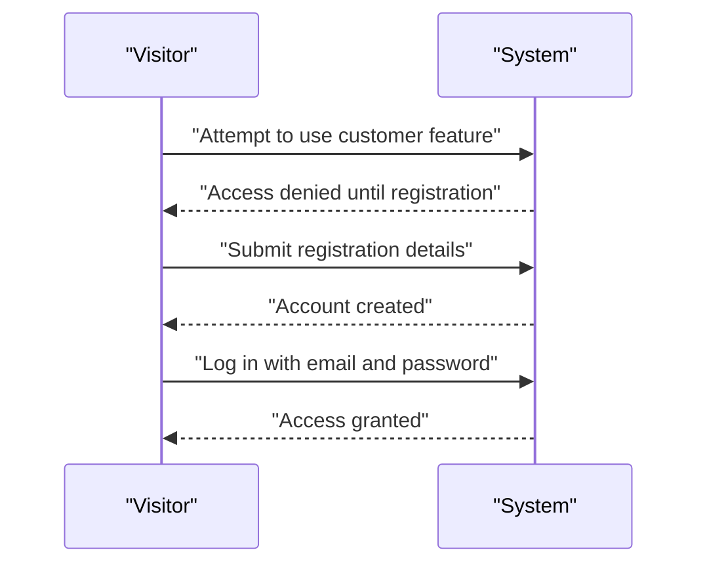

### Password Change

Customers can change their password after logging in.
The password change operation applies only to the customer’s own account.
A successful password change updates the customer’s login credentials for future access.
If the request is not made by the account owner, the change must not be applied.

### Customer Account Deletion

Customers can delete their own account.
When a customer deletes their account, the system removes the customer profile information.
When a customer deletes their account, the system preserves the customer’s order history.
When a customer deletes their account, the system preserves the customer’s orders for seller records and legal purposes.
When a customer deletes their account, the system preserves the customer’s reviews, but those reviews are shown as written by a deleted user.
Deleting a customer account does not remove the customer’s past purchasing records.
Deleting a customer account does not remove seller-side records associated with those orders.

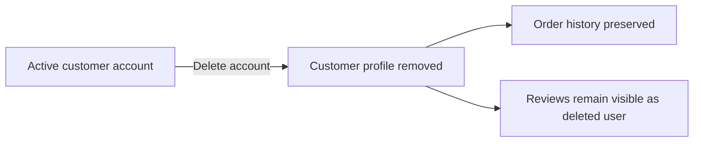

### Registered User Access Only

Customer operations are available only to registered users.
The system must not allow guest browsing.
The system must not allow non-registered visitors to use any customer account features.
Any request to use customer account features without a registered account must be rejected.
A deleted customer account no longer has access to customer operations.

## CustomerProfile Operations

Each customer account has a profile that stores the display name and phone number used across the shopping experience. Customers can view their profile details after logging in and update the display name or phone number when those details change. The profile supports identification in seller communication and order-related interactions, so the information should stay current. Changes to profile information must be treated as editable customer data and recorded through the platform's snapshot principle. The profile itself does not create separate purchase behavior, but it supports the customer's identity throughout the platform. If a customer deletes the account, the profile information is deleted as part of that account removal. Customers should not be able to manage profile details without being signed in. The system should keep profile operations separate from shipping addresses, because those are managed independently.

### Customer Profile Details

Each customer account has one profile that stores the customer’s display name and phone number. These profile details are the customer’s identity information used across the shopping experience and customer interactions on the platform. The profile is separate from shipping addresses and is maintained independently of them. The profile information is part of the customer account’s editable data and is preserved only while the account exists.

### View Profile Information

A signed-in customer can view their own profile information. The system shows the customer’s current display name and phone number. Profile viewing is available only after the customer has signed in, and the customer cannot manage profile details while signed out.

### Edit Profile Information

A signed-in customer can edit their own profile information. The customer can change the display name and phone number. The system must treat these changes as updates to editable customer data, and the updated values become the customer’s current profile information after a successful edit.

### Profile Snapshot on Change

Whenever a customer profile is modified, the system creates a snapshot of the change. The snapshot records when the change was made, what was changed, and the values before and after the change. Profile snapshots are part of the platform’s immutable history and cannot be deleted. Relevant parties may view these snapshots for dispute resolution, as defined for the snapshot principle.

### Profile Deleted with Account Deletion

If a customer deletes their account, the customer profile information is deleted as part of that account removal. After account deletion, the profile is no longer available for viewing or editing. The account deletion behavior for orders and reviews follows the customer account rules and does not change the separate handling of those records.

## ShippingAddress Operations

Customers can maintain multiple shipping addresses for use during checkout. Each address includes recipient name, phone number, street address, city, state or province, postal code, and country, so it can be used for delivery without extra correction. Customers can add a new address, edit an existing one, and delete an address they no longer want to use. One address can be marked as the default shipping address, which helps speed up checkout. During checkout, customers must select a shipping address or use the default if one is set. Once an order has been placed, the shipping address on that order cannot be changed. Address data is part of customer-owned information and should be available only to the signed-in customer. Address operations should support multiple saved locations rather than a single fixed destination.

### Multiple Shipping Addresses

Customers can maintain multiple shipping addresses for their account.
Each shipping address belongs to one customer account and is used for delivery during checkout.
The system supports more than one saved address so customers can keep separate destinations for different orders.
Customers can browse their saved addresses and use them when placing an order.

### Add Shipping Address

Customers can add a new shipping address to their account.
Each shipping address includes recipient name, phone number, street address, city, state or province, postal code, and country.
A newly added address becomes available for checkout and future deliveries.

### Edit Shipping Address

Customers can edit an existing shipping address they own.
When an address is edited, the updated details replace the previous address information for future use.
Customers can update any of the address details that belong to the shipping address.

### Delete Shipping Address

Customers can delete a shipping address they own.
Deleted shipping addresses are no longer available for selection during checkout.
Customers can continue using their remaining saved addresses after one address is deleted.

### Default Shipping Address

Customers can set one saved shipping address as the default shipping address.
The default shipping address is the address the system uses when the customer does not choose another address during checkout.
Customers can change which saved address is marked as the default.

### Shipping Address Fields

A shipping address contains recipient name and phone number, along with street address, city, state or province, postal code, and country.
These details are used to identify who receives the shipment and where the order should be delivered.
A shipping address is only complete when all address details are provided as part of the address record.

### Select Address at Checkout

During checkout, customers can select one of their saved shipping addresses for the order.
If a default shipping address is set, the customer can use it instead of selecting another saved address.
The selected shipping address is shown as part of the order review before the order is placed.

### Shipping Address Locked After Order Placement

Once an order has been placed, the shipping address for that order cannot be changed.
The shipping address used for the order remains fixed after placement so the order keeps the delivery destination that was confirmed at checkout.
Customers must choose the correct shipping address before the order is placed.

## SellerAccount Operations

Sellers register with email and password and log in with the same credentials. Sellers can change their password after account creation. Before a seller can sell, the account must be approved by an administrator, so registration alone does not grant selling rights. Sellers can view their approval status and see whether the account is pending, approved, or rejected. If the account is rejected, the seller can review the rejection reason and submit a new registration request. Sellers can delete their account only when they have no pending orders in paid or shipped status and no pending cancellation or refund requests. When a seller account is deleted, the seller's products are removed from active listings, but order history and snapshots remain preserved. Past orders must still show the seller shop name so older purchases remain understandable. Seller account operations should also respect suspension and ban outcomes from administrator management where applicable.

### Seller Registration and Login

Sellers can register using an email address and password.
Sellers can log in using the same email address and password they used to register.
Sellers can change their password after their account has been created.
A seller account does not become eligible to sell immediately after registration; administrator approval is required before selling is allowed.

### Seller Approval Status

Sellers can view the current approval status of their account.
The approval status is shown as pending, approved, or rejected.
If the account is rejected, the seller can view the reason for the rejection.
If the account is rejected, the seller can submit a new registration request.

### Seller Account Deletion

Sellers can delete their account only when they have no pending orders in paid or shipped status and no pending cancellation or refund requests.
When a seller account is deleted, the seller's products are removed from active listings.
When a seller account is deleted, the seller's order history is preserved for seller records and legal purposes.
When a seller account is deleted, the seller's shop name is preserved in past orders so earlier purchases remain understandable.

## SellerProfile Operations

Each seller has a profile that presents the shop name, shop description, and logo image to customers. Customers can view seller profiles from product pages and use them to understand who is selling the product. Sellers can edit the shop name, description, and logo when their store identity changes. Every edit must create a snapshot so past versions of the seller profile remain available for dispute resolution. Seller profile changes affect how the seller is presented in products and past orders, so the platform must preserve prior versions. The profile is not meant to be deleted separately from the seller account; it follows the seller account lifecycle. If the seller account is deleted, the profile information used in past order records must still remain visible in historical snapshots. Seller profile management should support a consistent storefront identity across browsing and order history.

### Shop Name Display

The seller profile SHALL display the shop name to customers wherever the seller profile is shown.
The shop name SHALL be the primary business name used to identify the seller in browsing contexts and product-related contexts.
The shop name SHALL remain associated with the seller profile as part of the seller’s storefront identity.
When a seller changes the shop name, the updated shop name SHALL be used for future customer-facing views of the seller profile.

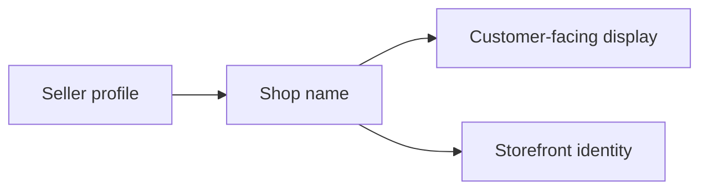

### Shop Description Display

The seller profile SHALL display the shop description to customers wherever the seller profile is shown.
The shop description SHALL help customers understand the seller’s storefront identity.
When a seller edits the shop description, the updated description SHALL be used for future customer-facing views of the seller profile.
The shop description SHALL be preserved in profile snapshots so previous versions remain available for dispute resolution.


### Logo Image Management

The seller profile SHALL include a logo image as part of the seller’s customer-facing presentation.
Sellers SHALL be able to change the logo image as part of editing their seller profile.
When the logo image is updated, the updated logo SHALL be used for future customer-facing views of the seller profile.
The logo image SHALL be preserved in seller profile snapshots so past versions of the storefront identity remain available.


### Customer View of Seller Profile

Customers SHALL be able to view seller profiles.
A customer view of a seller profile SHALL show the shop name, shop description, and logo image.
A customer viewing a product SHALL be able to use the seller profile to understand who is selling the product.
The seller profile view SHALL support a consistent storefront identity across product browsing and order history.


### Edit Seller Profile

Sellers SHALL be able to edit their seller profile.
The editable seller profile information SHALL include the shop name, shop description, and logo image.
When a seller edits the seller profile, the updated profile SHALL replace the previous customer-facing profile information for future views.
Seller profile edits SHALL support changes to the seller’s storefront identity over time.


### Seller Profile Snapshot on Edit

Every seller profile edit SHALL create a snapshot of the previous seller profile state.
Each seller profile snapshot SHALL record what changed and preserve the prior seller profile values.
Seller profile snapshots SHALL be immutable and SHALL remain available after later edits.
Seller profile snapshots SHALL support dispute resolution by preserving profile change history.


### Storefront Identity

The seller profile SHALL represent the seller’s storefront identity.
The storefront identity SHALL consist of the shop name, shop description, and logo image.
Changes to any part of the seller profile SHALL be reflected in the storefront identity shown to customers.
The platform SHALL preserve past storefront identity versions through seller profile snapshots.


### Past Order Seller Information

When a seller profile is changed, the seller information preserved in past order records SHALL remain unchanged.
Past orders SHALL continue to show the seller information captured at the time of purchase.
The preserved seller information in past orders SHALL support historical review and dispute resolution.
The seller profile used in past order records SHALL remain visible even if the seller profile later changes.


### Profile Change History Preserved

The platform SHALL preserve seller profile change history for all edits.
Seller profile change history SHALL remain available even after later seller profile updates.
Seller profile change history SHALL support review of prior shop name, shop description, and logo image values.
Seller profile change history SHALL be preserved for dispute resolution and historical reference.


## Category Operations

Products are organized into categories so customers can browse and find items by topic or type. Categories can also contain subcategories, but only one level of nesting is allowed, so category structure stays simple and understandable. Administrators create, edit, and delete categories, while customers can only browse the category list and view products inside a category. Each category has a name and description that help explain what belongs there. When a category is deleted, products that were assigned to it become uncategorized rather than disappearing from the platform. Customers should still be able to browse the full category list and navigate into subcategories where they exist. Category operations must support browsing flows as well as product organization for sellers and administrators. The category structure should remain stable enough to support search and category page listings.

### Category Organization

Products are organized into categories so customers can browse and find items by topic or type.

Categories may contain subcategories, but only one level of nesting is allowed. A subcategory may belong to a parent category, and no deeper nesting is permitted.

Each category has a name and a description that explain what belongs in that category.

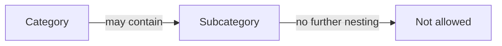

### Administrator Category Management

Administrators can create categories and subcategories.

Administrators can edit category names and descriptions.

Administrators can delete categories.

Category management is restricted to administrators only; customers can browse categories but cannot create, edit, or delete them.

### Customer Category Browsing

Customers can browse the full list of categories.

Customers can browse subcategories when a category contains them.

Customers can view products within a category.

Category listings presented to customers must reflect the category structure, including any available subcategories.

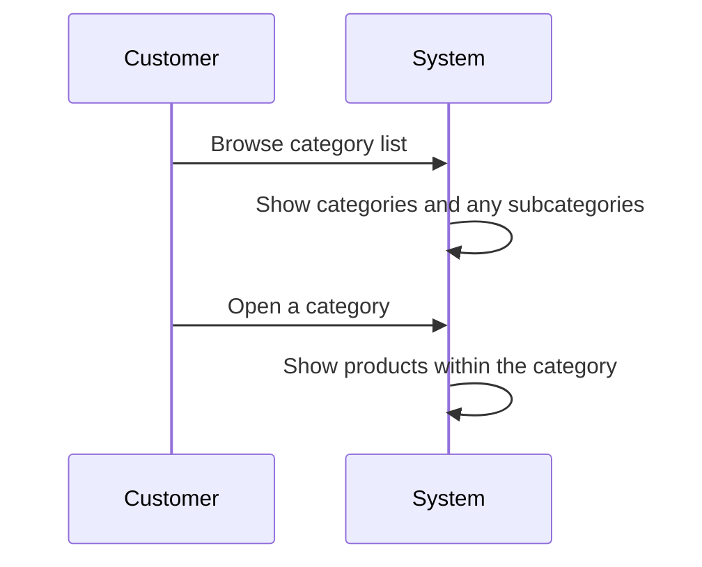

### Category Deletion and Product Reassignment

When a category is deleted, products assigned to that category become uncategorized rather than disappearing from the platform.

Customers can still browse the category list after a category deletion.

Subcategories are also removed from customer browsing when their category structure is deleted.

Products that become uncategorized remain available for other platform browsing and discovery flows that do not depend on a category assignment.

## Product Operations

Sellers can create products with a required name, description, category, and base price. A product belongs to the seller who created it, and only that seller can edit or delete it unless an administrator intervenes. Customers can browse products through search results, category pages, and product detail pages. Product edits must create snapshots so earlier versions remain available for dispute resolution. A product can be deleted only when there are no pending order items for any variant and no pending cancellation or refund requests. When a product is deleted, all of its variants and inventory records are removed from active use, and the product no longer appears in search or category listings. Deleted products must still have preserved snapshots for authorized viewing by the seller or administrator. If a product has no variants, it remains visible in search but is shown as unavailable. Product operations must support both active selling and historical record keeping.

### Product Creation and Ownership

Sellers can create products for sale.

A product must include a name, a description, a category, and a base price.

The selected category may be a subcategory.

Each product is owned by the seller who created it.

Only the owning seller can edit or delete the product, unless an administrator intervenes under administrator oversight rules defined elsewhere.

### Product Editing and Snapshot Creation

Sellers can edit their own products.

When a product is edited, the system creates a snapshot of the previous state.

The snapshot preserves the product’s state for later dispute resolution and historical reference.

If a product edit is not successfully saved, no snapshot is created.

### Product Deletion Rules

A seller can delete a product only when there are no pending order items for any of its variants.

A seller can delete a product only when there are no pending cancellation requests or refund requests for any of its variants.

When a product is deleted, all of its variants are deleted from active use.

When a product is deleted, all inventory records for its variants are removed from active use.

When a product is deleted, it no longer appears in search results or category listings.

Deleted products remain preserved in snapshot history for authorized viewing by the seller or an administrator.

### Product Availability Without Variants

A product must have at least one variant to be purchasable.

If a product has no variants, it remains visible in search results.

If a product has no variants, it is shown as unavailable.

### Snapshot Preservation After Deletion

Snapshots for a product are preserved after the product is deleted.

The preserved snapshots support later review by the seller who owns the product and by administrators.

Product snapshots must continue to represent the product’s prior state even after the active product has been removed.

## ProductImage Operations

Sellers can upload multiple images for each product to present the product clearly to customers. The images can be reordered, and the first image becomes the main thumbnail shown in listings. Sellers can also delete images they no longer want attached to the product. Image changes must be included in the product snapshot so the platform preserves the visual state of the product at the time of any edit. Customers view these images on the product detail page, so the image order directly affects the browsing experience. Product image management belongs to the seller who owns the product and should not be available to other sellers. If a product is deleted, its image history remains part of the preserved product snapshots. Image operations should support both merchandising and historical accuracy.

### Product Image Management

Sellers can add multiple images to a product to present it clearly to customers.

Sellers can upload images for products they own, and each uploaded image becomes part of that product’s image set.

Sellers can reorder a product’s images, and the first image in the order becomes the main thumbnail image used for product listings.

Sellers can remove an image from a product when they no longer want it attached to that product.

Customers view the product’s images on the product detail page, so the current image order directly affects how the product is presented during browsing.

Image management belongs to the seller who owns the product and is not available to other sellers.

When a product is deleted, its images are no longer managed as active product content, but the visual history remains preserved through the product snapshots.

### Image Snapshots and Preserved Visual History

Image changes are included in product snapshots so the platform preserves the visual state of a product whenever its images are changed.

A snapshot records the change time, what changed, and the values before and after the change.

The preserved visual history allows owners and administrators to review earlier image states for dispute resolution.

If a product image is reordered, added, or deleted, the previous image state is preserved in the product snapshot.

Product snapshots include the product’s image state at the time of the change, so the visual history remains available even after later edits or product deletion.

Only the seller who owns the product can manage its images, and image history remains tied to that seller-owned product record for historical review.

## ProductVariant Operations

A product can have multiple variants, and each variant represents a specific combination of option values such as color and size. Sellers can add variants to their own products and edit the SKU code, option values, and price later if needed. Each variant must have a unique SKU code, and stock quantity starts at zero. A product must have at least one variant to be purchasable, which means variants are essential for checkout. If a product has no variants, it can still be seen in search but is marked unavailable. Sellers can delete variants only when there are no pending order items and no pending cancellation or refund requests for that variant. Variant edits must create snapshots so earlier variant states can be reviewed. Customers do not manage variants directly, but they choose from available variants on the product detail page and in the cart. Variant operations must preserve both purchase readiness and historical versioning.

### Product Variant Combinations

A product variant represents one specific combination of option values for a product, such as a color and size combination.
Each variant is tied to one product and describes a purchasable combination of that product’s options.
Sellers can create multiple variants for the same product so customers can choose among the available combinations.
A variant’s combination must be distinct from the other variants of the same product so that each combination can be identified separately.

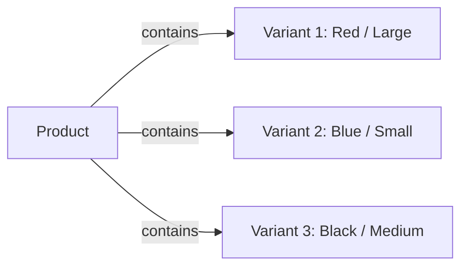

### SKU Code Management

Each product variant has an SKU code that identifies that variant.
The SKU code is required when a seller creates a variant.
The seller can edit the SKU code later as part of variant editing.
The system must treat the SKU code as the variant’s business identifier within the platform.
If a seller enters an SKU code that is already in use by another variant, the change is rejected.

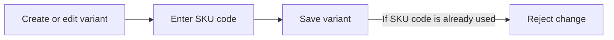

### Option Values Management

Each variant stores the option values that define its combination, such as color, size, or other product-specific choices.
Sellers can create variants by selecting the option values that belong to that product.
Sellers can later edit a variant’s option values.
Option values are part of the variant snapshot history, so earlier combinations can be reviewed after changes.
The option values for a variant must continue to represent a valid product combination after editing.

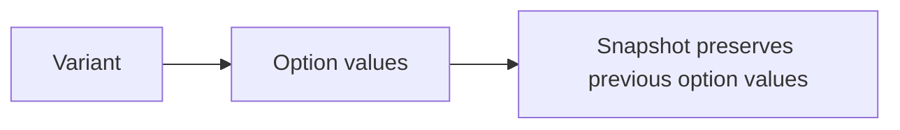

### Variant Pricing

Each variant has its own price.
A variant may use a price that differs from the product’s base price.
When a variant has its own price, that price is the one shown and used for that variant.
Sellers can edit a variant’s price later.
Every price change is captured in a snapshot so the previous price can be reviewed.

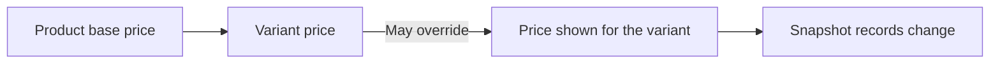

### Variant Stock Starts at Zero

When a seller creates a new variant, its stock quantity starts at zero.
The variant is not considered stocked until inventory records add quantity to it.
This starting state applies before any restocking or order activity occurs.
A zero-stock variant is still a valid variant record, but it is not available as stock until inventory is added.

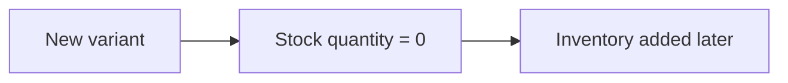

### Add Variant to Product

Sellers can add one or more variants to a product they own.
A product may contain multiple variants so that customers can choose among different combinations and prices.
When a seller adds a variant, the variant becomes part of that product’s purchasable options once it has stock and is otherwise available.
Adding a variant is a product-level operation performed by the seller of that product.

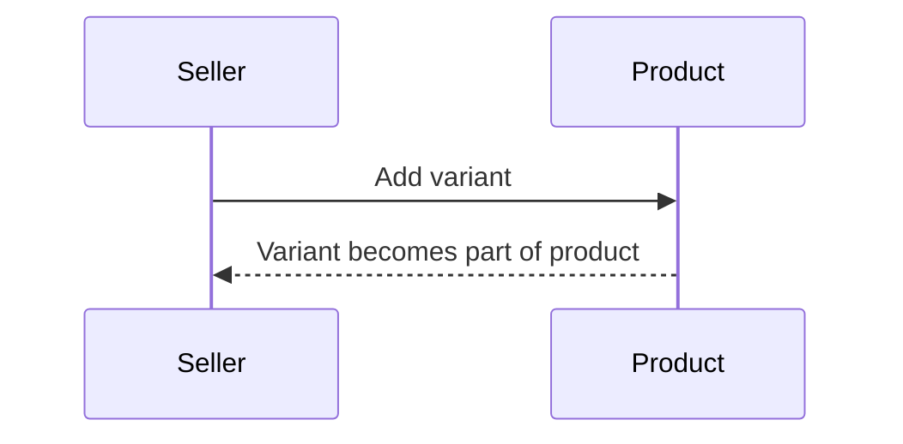

### Edit Variant Snapshot

When a seller edits a variant, the system creates a snapshot of the previous state.
The snapshot preserves the changed fields, the values before the change, the values after the change, and when the change was made.
Variant snapshots are immutable and remain available for later review.
This preserves the history of SKU code changes, option value changes, and price changes.

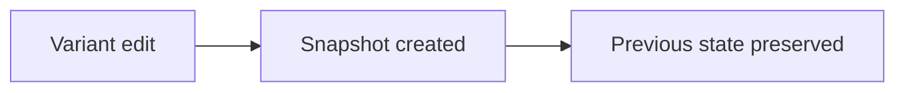

### Delete Variant Restrictions

Sellers can delete a variant only when no pending order items exist for that variant.
Sellers can delete a variant only when there are no pending cancellation requests for that variant.
Sellers can delete a variant only when there are no pending refund requests for that variant.
When a variant is deleted, it no longer remains available for future purchase selection.
Deletion is blocked whenever the variant is still needed for active order processing or dispute handling.

```mermaid
flowchart LR
    A["Delete variant request"] --> B{ "Pending order items?" }
    B -->|"Yes"| E["Reject deletion"]
    B -->|"No"| C{ "Pending cancellation or refund requests?" }
    C -->|"Yes"| E
    C -->|"No"| D["Delete variant"]
```

### Purchasable Only With at Least One Variant

A product must have at least one variant to be purchasable.
If a product has no variants, customers cannot buy it.
The product may still exist in the catalog, but it is not ready for purchase until at least one variant is present.
This rule ensures that every purchasable product has at least one selectable variant.

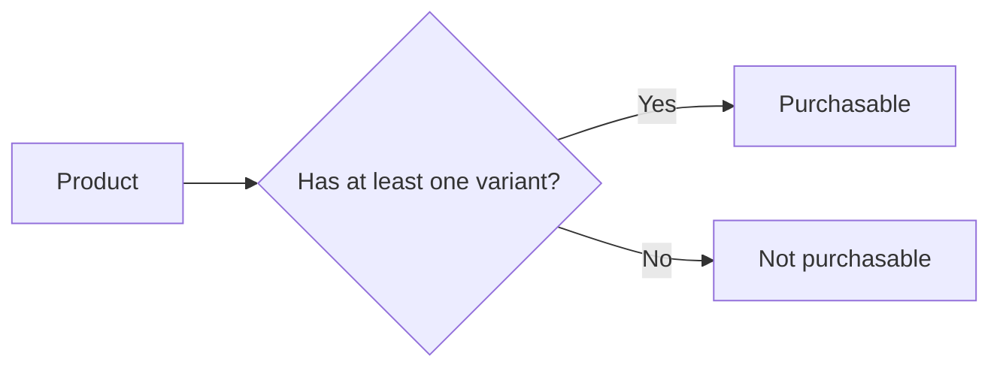

### Unavailable Product With No Variants

When a product has no variants, customers can still see it in search results.
A product with no variants is shown as unavailable.
An unavailable product cannot be treated as ready for purchase until variants are added.
This visibility rule lets customers see the product while making its current purchase state clear.

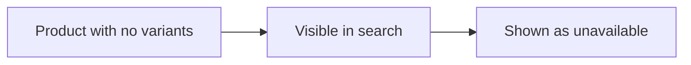

### Customer Selection of Variant Options

Customers choose a specific variant from the product detail page before buying.
Customers do not add only the product itself to the cart; they select a variant that matches the options they want.
The selected variant determines the item that can be added to the cart and later purchased.
If a product has no variants, customers cannot complete this selection because there is no purchasable variant to choose.

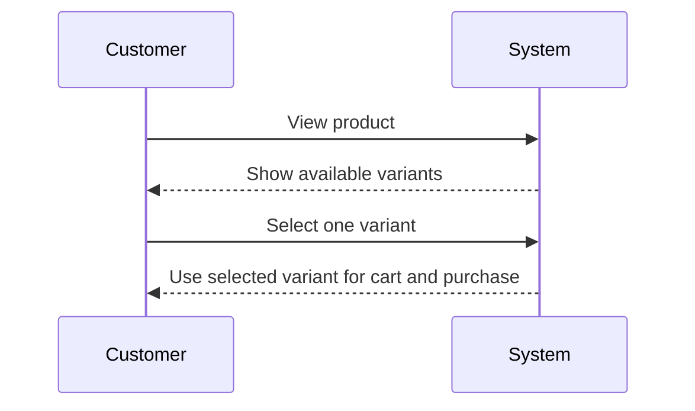

## InventoryRecord Operations

Inventory records track how the stock quantity of each product variant changes over time. Sellers can add inventory for restocking or subtract inventory for adjustments and loss, and each record must include the reason and timestamp for the change. Order placement automatically creates a negative inventory record, while cancellation and refund events create positive inventory records when stock is restored. Current stock is calculated from the full record history rather than from a manually edited balance. Sellers can view the full inventory history for each variant to understand how stock moved over time. Inventory records are part of business audit history, so they should support dispute resolution and operational review. When stock reaches zero, the variant is shown as out of stock and cannot be added to the cart. Inventory operations must reflect actual stock movement rather than simple counter edits.

### Stock Change History

Inventory records provide the business history of how stock changes for each product variant over time. Each record captures a stock change event as part of the audit trail for that variant.

The system records stock changes for restocking, inventory adjustments or loss, order placement, cancellation, and refund activity. This history is used to explain why stock increased or decreased instead of relying on a manually edited balance.

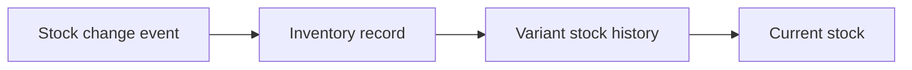

The inventory history for a variant must preserve the sequence of changes so that sellers can review how stock moved over time. This history is part of the business record for dispute resolution and operational review.

### Restocking Records

When a seller adds inventory to a product variant, the system records that increase as a restocking record. The record reflects that stock was added back into availability for that specific variant.

Restocking records are visible as part of the full inventory history for the variant. They contribute to the current stock total and are not treated differently from other stock change records once recorded, except for the fact that they represent a positive stock change initiated by the seller.

A restocking record must remain part of the immutable inventory history after it is created.

### Inventory Adjustments or Loss

When a seller needs to correct stock for damage, loss, shrinkage, or another inventory adjustment, the system records that change as an inventory adjustment record. This record reflects a stock decrease caused by a business adjustment rather than a customer order.

Inventory adjustment records are included in the variant’s full inventory history and affect the current stock total. They allow sellers to explain why stock was reduced outside of normal order processing.

The inventory history must show these adjustments clearly so that sellers can distinguish them from restocking and order-driven stock changes.

### Reason and Timestamp

Every inventory record must include the reason for the change and the time it was recorded. The reason explains why the stock changed, and the timestamp identifies when the change was made.

These details are part of the business history of the variant and support later review of stock movement. A record without a reason or timestamp is not a valid inventory history entry.

The recorded reason and timestamp must remain associated with the inventory record for the life of the history entry.

### Order-Driven Negative Inventory Records

When an order is placed successfully, the system creates a negative inventory record for each purchased variant. This record shows that stock decreased because the item was sold.

The negative inventory record is part of the same inventory history as seller-initiated stock changes. It contributes to the current stock calculation for the variant and helps explain why the available quantity changed after checkout.

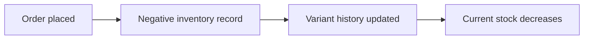

If the order is not successfully placed, no order-driven negative inventory record is created.

### Cancellation and Refund Positive Inventory Records

When an order item is cancelled or refunded and stock is restored, the system creates a positive inventory record for the affected variant. This record shows that stock increased because the item returned to inventory.

Positive inventory records created from cancellations and refunds are included in the variant’s inventory history. They are used to explain stock restoration after post-purchase business actions.

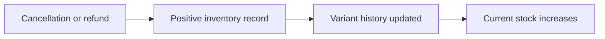

The restoration record must remain visible in the inventory history even after the related order item changes status.

### Current Stock From History

Current stock is calculated by summing all inventory records for the variant. The system does not rely on a manually edited stock balance as the source of truth.

This calculation includes positive records from restocking, cancellations, and refunds, as well as negative records from orders and inventory adjustments or loss. The result determines the stock quantity currently available for that variant.

Because stock is derived from history, the full record set for the variant must remain available for accurate stock review.

### Variant Inventory History

Sellers can view the full inventory history for each product variant. The history shows every inventory record associated with that variant in the order the changes were made.

The history is used to understand stock movement over time and to support dispute resolution. It includes all recorded increases and decreases, along with their reasons and timestamps.

The inventory history belongs to the variant and represents the complete business record of its stock movement.

### Out of Stock Display and Cart Restriction

When the current stock for a variant reaches zero, the system shows that variant as out of stock.

A variant shown as out of stock cannot be added to the cart. This rule applies even if the variant still exists in the product listing or inventory history.

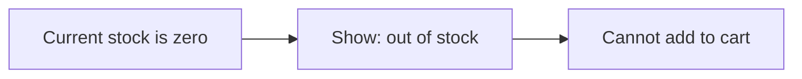

The out of stock display must reflect the stock status derived from inventory history, not a separate manual flag.

## ShoppingCart Operations

Customers use the shopping cart to prepare selected product variants for purchase. A customer can add a specific variant with a chosen quantity, and the system combines quantities if the same variant is added more than once. Customers can view the cart, change item quantities, and remove items before checkout. The cart must show item details, including product name, variant options, price, quantity, subtotal, and the total price of the cart. If a variant has less stock than the requested cart quantity, the cart should show a warning so the customer can adjust the order. If a variant is deleted or out of stock, it must be marked unavailable in the cart. Unavailable items cannot continue to checkout. Cart behavior should support careful purchase review before payment is confirmed.

### Add Variant to Cart

Customers can add a specific product variant to their shopping cart by choosing a quantity.
Adding to cart always targets one variant, not a product by itself.
If the customer adds a variant that is already present in the cart, the system combines the quantities into one cart item instead of creating a separate entry.
If the customer adds a variant that is no longer available, the system marks that cart item as unavailable.
If the customer adds a variant whose stock is lower than the requested quantity, the cart reflects that the quantity exceeds current stock and shows a warning to the customer.
If the requested quantity is valid and the variant is available, the item is added to the cart for later checkout.

```mermaid
flowchart LR
    A["Choose variant"] --> B["Choose quantity"]
    B --> C["Add to cart"]
    C --> D["Existing cart item?\"]
    D -->|"Yes"| E["Combine quantities"]
    D -->|"No"| F["Create cart item"]
    E --> G["Cart updated"]
    F --> G["Cart updated"]
```

### View Shopping Cart

Customers can view the contents of their shopping cart at any time before checkout.
The cart displays each item with the product name, variant options, price, quantity, and subtotal.
The cart also displays the total price of all items in the cart.
Items that are unavailable remain visible in the cart so the customer can see what must be resolved before checkout.
The cart view supports purchase review before the order is placed.

```mermaid
flowchart LR
    A["Open cart"] --> B["Show cart items"]
    B --> C["Show item details"]
    B --> D["Show totals"]
    B --> E["Show availability state"]
```

### Change Cart Quantity

Customers can change the quantity of an item already in their cart.
When the quantity is changed, the cart item stays linked to the same selected variant.
If the customer changes the quantity for the same variant, the cart updates the existing cart item rather than creating another line.
The cart recalculates the item's subtotal and the cart total after the quantity change.
If the new quantity is higher than the current stock, the cart shows a warning.
If the quantity is changed to a valid amount, the cart reflects the updated purchase intent.

```mermaid
flowchart LR
    A["Select cart item"] --> B["Change quantity"]
    B --> C["Update same cart line"]
    C --> D["Recalculate subtotal"]
    D --> E["Recalculate cart total"]
    B --> F["Check stock"]
    F -->|"Insufficient"| G["Show warning"]
```

### Remove Cart Item

Customers can remove an item from their shopping cart.
Removing an item deletes that selected variant from the cart view.
If the customer removes the last quantity for a variant, the cart no longer shows that variant as a cart item.
Removing a cart item updates the cart total accordingly.
If a customer attempts to remove an item that is not present, the cart remains unchanged.

```mermaid
flowchart LR
    A["Select cart item"] --> B["Remove item"]
    B --> C["Delete cart line"]
    C --> D["Update cart total"]
```

### Cart Subtotal and Total Price

Each cart item shows a subtotal based on that item's quantity and price.
The cart total is the sum of all item subtotals.
When a cart item quantity changes, the subtotal and total price are recalculated.
When an item is removed, the cart total is recalculated.
The cart must present pricing information clearly enough for the customer to review the purchase before checkout.

```mermaid
flowchart LR
    A["Item price"] --> B["Quantity"]
    B --> C["Item subtotal"]
    C --> D["Cart total"]
    E["Remove or change item"] --> D
```

### Low Stock Warning

If a variant has less stock than the quantity in the cart, the cart shows a warning.
The warning helps the customer notice that the requested quantity is higher than the current stock level.
The warning remains associated with the cart item until the quantity is adjusted or the stock situation changes.
The warning does not remove the item from the cart by itself.

```mermaid
flowchart LR
    A["Cart quantity"] --> B["Compare with stock"]
    B -->|"Stock is lower"| C["Show warning"]
    B -->|"Stock is enough"| D["No warning"]
```

### Unavailable Cart Item

If a variant is deleted, the corresponding cart item is marked as unavailable.
If a variant is out of stock, the corresponding cart item is marked as unavailable.
Unavailable cart items remain visible so the customer can identify what must be resolved before checkout.
An unavailable cart item cannot continue to checkout until it becomes available again.

```mermaid
flowchart LR
    A["Variant deleted or out of stock"] --> B["Mark cart item unavailable"]
    B --> C["Keep item visible"]
    C --> D["Block checkout for that item"]
```

### Out of Stock Cart Behavior

When a variant reaches zero stock, the cart marks that variant as out of stock.
An out-of-stock variant cannot be added to the cart.
If an item already exists in the cart and later becomes out of stock, the item is marked as unavailable.
The cart keeps the item visible so the customer can see why it cannot be checked out.
Out-of-stock behavior supports safe purchase preparation before payment.

```mermaid
flowchart LR
    A["Stock reaches zero"] --> B["Mark variant out of stock"]
    B --> C["Prevent new add to cart"]
    B --> D["Mark existing cart item unavailable"]
```

### Checkout Readiness

The cart is ready for checkout only when all items in the cart are available.
Unavailable cart items prevent checkout from continuing.
The customer must resolve unavailable items or adjust quantities before proceeding.
The cart must support a final review step before the order is placed.
Checkout readiness depends on the cart containing selectable items that can be purchased as part of the order process.

```mermaid
flowchart LR
    A["Cart contents"] --> B["Check availability"]
    B -->|"All available"| C["Ready for checkout"]
    B -->|"Any unavailable"| D["Checkout blocked"]
```

## CartItem Operations

Each cart item represents one selected product variant inside the shopping cart. The cart item stores the chosen quantity and contributes to the subtotal shown to the customer. When the same variant is added again, the quantities should combine into the existing cart item rather than creating a second line. Customers can update the quantity of a cart item or remove it entirely from the cart. The cart item must remain tied to a specific variant, because purchase preparation requires variant-level selection rather than product-level selection. If the linked variant becomes deleted or unavailable, the cart item must be marked unavailable. Cart items also support warning behavior when stock is lower than the selected quantity. These behaviors help customers confirm exactly what they are about to buy.

### Cart Item Quantity

Each cart item stores the quantity selected for one specific product variant. The quantity shown in the cart reflects the customer’s chosen amount for that variant and is used to calculate the cart item subtotal. Customers can change this quantity while reviewing their cart. If the quantity is changed, the cart item remains tied to the same variant and only the amount changes.

### Combined Cart Line Behavior

When a customer adds the same product variant to the cart more than once, the system combines the quantities into one cart item instead of creating a separate line. This combined behavior keeps the cart organized around one line per variant. The resulting cart item continues to represent the full quantity selected for that variant.

### Variant-Specific Cart Item

A cart item always represents a specific product variant, not a product in general. Customers must select a variant before an item can be added to the cart. This supports purchase preparation at variant level, because price, stock, and availability are determined by the chosen variant.

### Cart Item Subtotal

Each cart item shows a subtotal based on the selected quantity and the variant’s price. If the variant has an override price, that price is used for the cart item subtotal. The subtotal updates when the quantity changes or when the selected variant changes through cart replacement behavior elsewhere in the cart workflow.

### Update Item Quantity

Customers can update the quantity of a cart item. The cart item remains associated with the same variant after the update. If the updated quantity is accepted, the cart reflects the new amount and recalculates the cart item subtotal and the cart total accordingly.

### Remove Cart Item

Customers can remove a cart item from the cart. Removing the item deletes that selected variant line from the cart view and removes its subtotal contribution from the cart total. If the customer adds the same variant again later, it is treated as a new cart entry, subject to combined cart line behavior.

### Unavailable Cart Item After Variant Deletion

If the linked product variant is deleted, the cart item is marked as unavailable. An unavailable cart item remains visible in the cart so the customer can see that the selected item can no longer be purchased as originally selected. Unavailable cart items cannot be used for checkout.

### Low Stock Warning on Cart Item

If the variant’s stock is lower than the cart item quantity, the cart item shows a low stock warning. The warning informs the customer that the selected quantity exceeds the currently available stock for that variant. The warning does not change the selected quantity by itself.

### Variant-Level Purchase Selection

The cart supports purchase preparation only when the customer has selected specific variants. The customer cannot prepare a cart item for checkout using product-level selection alone. This ensures that the intended variant, quantity, and price are clear before checkout begins.

## Wishlist Operations

Customers can save products to a wishlist for later consideration. The wishlist contains products rather than specific variants, which makes it useful for product discovery and return visits. Customers can view the wishlist in a paginated list and remove products they no longer want to keep. If a seller deletes a product, the system must automatically remove that product from all wishlists so customers do not keep broken references. Wishlist items are separate from cart items because they are not intended for immediate checkout. Customers must be signed in to maintain a wishlist, since guest browsing is not allowed. The wishlist helps customers track products they may want to compare or purchase later. Wishlist operations should stay simple and focused on saved product interest.

### Save Product for Later

Customers can save products to their wishlist for later consideration.
Saving a product is a business action for expressing interest in a product without moving it into the shopping cart.
The system shall keep wishlist entries at the product level so customers can revisit products they may want to buy later.
Saved products are treated as part of the customer's product discovery list and support return visits to items of interest.

### Wishlist Contains Products, Not Variants

The wishlist contains products only and does not store specific variants.
A customer saves a product as a single wishlist item even when that product has multiple variants.
This keeps the wishlist focused on saved product interest rather than variant-level selection.
When a customer reviews the wishlist, each entry represents a product, not an option combination.

### View Paginated Wishlist

Customers can view their wishlist in a paginated list.
The wishlist view shows the products the customer has saved for later.
Pagination applies to wishlist browsing so customers can move through saved products in manageable groups.
The system shall preserve the customer's saved product list across visits to support repeat browsing.

### Remove Product from Wishlist

Customers can remove products from their wishlist.
Removing a product deletes that product from the customer's saved product list while leaving the product itself unchanged.
This allows customers to keep their wishlist focused on current product interest.
If a customer removes a product that is no longer present in the wishlist, the operation has no effect on the saved list.

### Automatic Removal When Product Deleted

If a seller deletes a product, the system automatically removes that product from all wishlists.
This prevents customers from keeping saved references to products that no longer exist.
Automatic removal applies to every customer's wishlist that contains the deleted product.
The deleted product no longer appears as a saved item in wishlist browsing after removal.

### Signed-In Wishlist Access

Customers must be signed in to use wishlist features.
Wishlist functionality is not available to unauthenticated visitors because guest browsing is not allowed on the platform.
Only a customer account can maintain saved products in a wishlist.
If a customer is not signed in, the system does not allow wishlist operations.

### Saved Product Interest and Wishlist Browsing

The wishlist is a customer-facing place for saved product interest.
Customers use it to browse products they have marked for later rather than items ready for immediate purchase.
The wishlist supports product discovery by helping customers return to products they have already considered.
Wishlist browsing is limited to the customer's own saved products and is intended to complement other product browsing activities.

## Order Operations

An order is created when payment succeeds after checkout review and confirmation. The order contains one or more order items, and the items can come from different sellers. Customers can view an order history list that is sorted by newest first and shows the order number, date, total price, and overall order status. Customers can also open a full order detail view that shows item details, shipping address, and shipments with tracking information. The overall order status is derived from the statuses of its items, so the order reflects the state of all purchased items together. Order placement must remove purchased items from the cart and decrease stock for each purchased variant. If payment fails, the order is not created and the customer can try again. Order operations preserve the commercial history of a transaction even when individual items later change state through cancellation or refund.

### Order Creation After Successful Payment

When a customer confirms checkout and payment succeeds, the system creates an order for the purchased items.

The order contains one or more order items, and those items may belong to different sellers.

When the order is created, the system decreases stock for each purchased variant and removes the purchased items from the customer’s cart.

Each purchased variant becomes an order item with its own status.

If payment fails, the system does not create an order, and the customer can try again.

```mermaid
sequenceDiagram
    participant C as "Customer"
    participant S as "System"
    participant P as "Payment"
    C->>S: "Confirm order"
    S->>P: "Process payment"
    P-->>S: "Payment succeeds"
    S->>S: "Create order"
    S->>S: "Decrease stock"
    S->>S: "Remove purchased items from cart"
    S-->>C: "Order created"
```

### Order History List

Customers can view a list of all their orders.

The order history list is paginated.

The order history list is sorted by newest first.

Each entry in the order history list shows the order number, the date, the total price, and the overall order status.

Customers can open an order from the list to view its full details.

### Order Summary Fields

The order list and order detail views present the order number and date as identifiers for the order.

The order list presents the total price of the order.

The order list and order detail views present the overall order status, which reflects the combined state of the order items.

If the order contains items with different states, the overall order status still represents the order as a whole.

### Order Detail View

Customers can view the full details of a single order.

The order detail view shows the list of items in the order, including the product name, variant, quantity, price, and item status.

The order detail view shows the shipping address used for the order.

The order detail view shows the shipments for the order, including tracking information.

The order detail view shows which items are included in each shipment.

### Shipping Address in Order

The shipping address selected at checkout becomes part of the order.

Once the order is placed, the shipping address cannot be changed.

The shipping address is shown in the order detail view so the customer can review the delivery destination associated with the order.

### Shipments and Tracking in Order

An order may include one or more shipments.

Each shipment belongs to one seller and may contain one or more order items from that seller.

Different sellers always ship separately.

Each shipment shows tracking information for the items included in that shipment.

The order detail view groups items by shipment so customers can see which items travel together.

### Cart Cleared After Order Placement

When an order is created successfully, the purchased items are removed from the customer’s cart.

Only the items included in the successful order are removed from the cart.

### Failed Payment No Order Created

If payment fails during checkout, the system does not create an order.

If payment fails, the customer can retry the payment process.

If payment fails, the customer’s cart remains available for another attempt.

## OrderItem Operations

Each order item represents a purchased product variant and quantity inside an order. Order items have their own status, which can move through paid, shipped, delivered, cancelled, or refunded depending on the business workflow. A single order can contain items from different sellers, so each item is managed according to its own seller relationship. When an order is created, each purchased item stores a snapshot of the product, variant, and seller profile so the purchase record remains accurate even if the source listings later change. Customers can see item-level details in order history, including product name, variant, quantity, price, and status. Sellers and administrators can view order items for operational handling such as shipping, cancellation, or refund review. Item-level control is important because some items in the same order may progress differently from others. Order item operations must preserve both current state and the purchased history for each item.

### Order Item as a Purchased Variant Line

An order item represents one purchased product variant within an order.

Each order item is created for a specific variant that the customer selected during checkout.

Each order item stores the quantity purchased for that variant.

If a customer buys multiple units of the same variant in one order, the system records them as one order item with a quantity greater than one.

Order items can belong to orders that contain products from different sellers.

A mixed-seller order is represented as one order containing multiple order items, with each item managed independently according to its own seller relationship.

```mermaid
flowchart LR
    A["Order"] --> B["Order Item"]
    B --> C["Purchased Product Variant"]
    B --> D["Quantity"]
    A --> E["Order Item"]
    E --> F["Purchased Product Variant"]
```


### Order Item Status

Each order item has its own status.

The order item status can be paid, shipped, delivered, cancelled, or refunded.

A paid order item means payment has been completed and the item is waiting for seller shipment.

A shipped order item means the seller has shipped the item.

A delivered order item means the item has been delivered.

A cancelled order item means the item was cancelled through the cancellation workflow.

A refunded order item means the item was refunded through the refund workflow.

Order item status is tracked separately for each item so that items within the same order can progress independently.

```mermaid
flowchart LR
    A["paid"] -->|"Ship"| B["shipped"]
    B -->|"Deliver"| C["delivered"]
    A -->|"Cancel"| D["cancelled"]
    C -->|"Refund"| E["refunded"]
```


### Seller-Specific Handling of Order Items

Each order item is associated with the seller of the purchased product.

Sellers handle only the order items that belong to their own products.

In an order containing items from multiple sellers, each seller manages shipping, cancellation review, and refund review only for their own items.

Items from different sellers are never combined into the same shipment.

Seller-specific handling ensures that operational actions apply only to the relevant item while the rest of the order continues independently.

```mermaid
flowchart LR
    A["Mixed Seller Order"] --> B["Seller A Items"]
    A --> C["Seller B Items"]
    B --> D["Seller A Shipment"]
    C --> E["Seller B Shipment"]
```


### Order Item Purchase Snapshot

When an order item is created, the system saves a snapshot of the purchased product.

The order item snapshot preserves the product name, description, variant options, and price at the time of purchase.

The snapshot ensures that the purchase record remains accurate even if the source product or variant changes later.

The order item also stores a snapshot of the seller profile at the time of purchase.

The seller profile snapshot preserves the shop name and logo at the time of purchase.

These snapshots are part of the order item record and are preserved for later viewing.


### Item-Level Order History

Customers can view order history at the order item level within an order.

For each item, the system shows the product name, variant, quantity, price, and item status.

Item-level history allows customers to understand the progress of each purchased variant even when other items in the same order have different statuses.

This item-level view is especially important for mixed-seller orders, where different items may be shipped or completed at different times.

Sellers and administrators can also use item-level history when handling shipping, cancellations, refunds, and dispute review.


## Shipment Operations

A shipment represents a package sent by one seller, and it can include one or more order items from that same seller. Different sellers always ship separately, so shipment grouping must respect seller boundaries. Sellers select the order items they want to send together and then enter tracking information such as carrier name and tracking number. When a shipment is created, all items in that shipment change to shipped status. Customers can view shipment tracking details from their order history. Customers confirm delivery per shipment, not per item, and that confirmation changes all items in the shipment to delivered. If the customer does not confirm delivery, the items automatically become delivered after the waiting period described by the business rules. Shipment operations support both seller fulfillment actions and customer delivery confirmation.

### Shipment by Seller

A shipment is a package sent by one seller.
A shipment may contain one or more order items, but all items in the shipment must belong to the same seller.
Different sellers always ship separately, so items from different sellers cannot be combined into the same shipment.
Sellers can create shipments only for order items that still need shipping.
Customers can view shipments as part of their order details and order history.

```mermaid
flowchart LR
    A["Order items needing shipping"] --> B["Select one seller's items"]
    B --> C["Create one shipment"]
    C --> D["Items remain grouped by seller"]
```

### Shipping Information

When creating a shipment, the seller provides the carrier name and tracking number.
All items included in the same shipment share the same tracking information.
Customers can view the tracking information for each shipment from their order details.
Tracking information is shown at the shipment level, not separately for each item.

```mermaid
sequenceDiagram
    participant S as Seller
    participant M as System
    participant C as Customer
    S->>M: Create shipment with tracking information
    M->>M: Store shipment details for the grouped items
    C->>M: View order shipment details
    M-->>C: Show carrier name and tracking number
```

### Shipment Creation and Item Status Change

When a shipment is created, all order items included in that shipment change to shipped status.
Shipment creation applies to every item in the shipment at the same time.
Once items are marked as shipped, they are treated as shipped order items for later delivery confirmation and order progress.
A shipment can be created only for items that still need shipping.

```mermaid
flowchart LR
    A["Items need shipping"] --> B["Shipment created"]
    B --> C["All included items become shipped"]
```

### Customer Delivery Confirmation

Customers confirm delivery per shipment, not per item.
When a customer confirms delivery for a shipment, all order items in that shipment change to delivered status.
Delivery confirmation is available to customers from the shipment details they can view in their order history.
The confirmation affects only the selected shipment and does not affect other shipments in the same order.

```mermaid
flowchart LR
    A["Shipment view"] --> B["Customer confirms delivery"]
    B --> C["All items in shipment become delivered"]
```

### Automatic Delivery After Waiting Period

If the customer does not confirm delivery, the items in the shipment automatically change to delivered after the waiting period described by the business rules.
This automatic delivery applies per shipment.
When automatic delivery occurs, all items in that shipment change together to delivered status.
The waiting period is defined in the business rules file and is not redefined here.

```mermaid
flowchart LR
    A["Shipment shipped"] --> B["Waiting period passes"]
    B --> C["All items in shipment become delivered"]
```

### Seller Fulfillment Workflow

Sellers can view the order items for their products that need shipping.
From those items, sellers choose one or more items to include in a shipment.
The seller then enters the shipment tracking information and creates the shipment.
After shipment creation, the items are marked as shipped and become visible to customers with tracking details.
This workflow supports seller fulfillment of their own order items while keeping shipments separated by seller.

```mermaid
sequenceDiagram
    participant S as Seller
    participant M as System
    participant C as Customer
    S->>M: View items that need shipping
    S->>M: Select one or more items
    S->>M: Enter carrier name and tracking number
    S->>M: Create shipment
    M->>M: Mark included items as shipped
    C->>M: View shipment tracking details
    M-->>C: Show shipment information
```

## CancellationRequest Operations

Customers can request cancellation for individual order items that are still in paid status and have not been shipped. A cancellation request must include a reason so the seller can understand the customer's concern. The seller for that item can approve or reject the request. When the seller responds, a snapshot of the request state is created so the decision history is preserved. If the request is approved, the item becomes cancelled and the refund is processed for that item only. Stock is restored through an inventory record when cancellation is approved. The remaining items in the order continue normally, so cancellation does not automatically affect the whole order unless every item is cancelled. Cancellation request operations must keep item-level business control and preserve dispute records.

### Cancel Paid Order Item

Customers can request cancellation for an individual order item only when the item is still in paid status and has not been shipped. The cancellation request is tied to that single order item, not to the full order. The customer provides a cancellation reason so the seller can understand why the item should be cancelled. The seller of the item reviews the request and either approves or rejects it. When the seller responds, the system records a snapshot of the request state so the decision history is preserved. If the request is approved, the item becomes cancelled, the customer receives a refund for that cancelled item only, and stock is restored for that item through an inventory record. If the request is rejected, the order item continues in its current processing flow. This operation supports item-level cancellation rather than whole-order cancellation, so other items in the same order continue normally unless they are separately cancelled.

### Cancellation Workflow and Partial Order Cancellation

A cancellation request is processed independently for each eligible order item. An order may contain multiple items from different sellers or with different statuses, and a cancellation decision applies only to the targeted item. When one item is cancelled, the remaining items in the order are not automatically changed. This allows partial order cancellation, where some items are cancelled and other items continue through shipping, delivery, or other later stages. If all items in an order are eventually cancelled, the overall order is considered cancelled. The cancellation workflow preserves item-level control so that each request, response, and outcome is tracked separately.

### Request State Snapshot

Every seller response to a cancellation request creates a snapshot of the request state. The snapshot preserves what changed, including the request state before and after the seller’s decision, so the cancellation history can be reviewed later. Snapshots are immutable and remain available for dispute resolution. Relevant parties can view these preserved records when they need to understand how the cancellation request was handled.

## RefundRequest Operations

Customers can request a refund for individual order items that have already been delivered. A refund request must include a reason, and it can only be submitted within the allowed time window after delivery. The seller for that item can approve or reject the request. When the seller responds, a snapshot of the request state is created to preserve the decision history. If approved, the item becomes refunded and its stock is restored through an inventory record. Refund handling is per item, so the rest of the order can continue to stand on its own. If all items in an order are refunded, the overall order becomes refunded. Refund request operations must support post-delivery issue handling while preserving audit history.

### Refund Request Creation

Customers can request a refund for an order item only after the item has been delivered.
The refund request must include a reason.
The request is time-limited and can be submitted only within the allowed period after delivery.
Refund requests are submitted per order item, not for the entire order.
Refund request creation supports post-delivery issue handling for items that do not meet the customer’s expectations after receipt.

```mermaid
sequenceDiagram
    participant C as Customer
    participant S as System
    participant V as Seller
    C->>S: Request refund for delivered item
    S->>S: Verify delivery and refund window
    S->>S: Record refund request and reason
    S-->>C: Refund request submitted
    S-->>V: Refund request available for review
```

### Refund Request Review

The seller of the order item can review the refund request.
The seller can approve the request or reject it.
When the seller responds, the system records a snapshot of the request state to preserve the decision history.
The snapshot preserves the state before and after the seller’s response.
Refund request review supports seller handling of post-delivery issue resolution.

```mermaid
sequenceDiagram
    participant V as Seller
    participant S as System
    V->>S: Approve or reject refund request
    S->>S: Record request state snapshot
    S->>S: Update request status
    S-->>V: Response recorded
```

### Refund Approval Outcome

If the seller approves the refund request, the order item becomes refunded.
When an item becomes refunded, the system restores the item’s stock through an inventory record.
Refund handling is performed per item, so other items in the same order continue according to their own statuses.
If all items in an order are refunded, the overall order becomes refunded.
This enables partial order refunds when only some items in the order are refunded.

```mermaid
flowchart LR
    A["delivered item"] -->|"Refund requested"| B["refund request"]
    B -->|"Approved"| C["refunded item"]
    C -->|"Restore stock"| D["inventory record"]
    C -->|"All items refunded"| E["refunded order"]
    B -->|"Rejected"| F["request closed without refund"]
```

### Refund Rejection Outcome

If the seller rejects the refund request, the order item does not become refunded.
The request outcome remains part of the preserved request history through its snapshot record.
A rejected refund request does not change the status of other items in the order.
Refund rejection supports resolution of post-delivery issues without altering the purchased item state.


### Refund Request View and History

Customers can view their refund requests.
Sellers can view refund requests for their own order items.
Relevant parties can view snapshots for dispute resolution.
Refund request history shows the request state changes preserved over time.
Preserved request history supports review of how a post-delivery issue was handled from submission through final decision.

## Review Operations

Customers can write reviews only for products they have purchased after the related item has been delivered. A customer may leave only one review per product per order, which prevents duplicate feedback for the same purchase. Each review includes a required rating and optional text content. Reviews appear on the product detail page and are sorted by newest first so the latest customer experiences are easy to see. Customers can edit their own reviews, and every edit must create a snapshot to preserve the previous version. Customers can also delete their own reviews, but the historical snapshots remain preserved. Product average rating is calculated only from non-deleted reviews. Review operations must support trustworthy product feedback while protecting historical records.

### Purchase-Based Review Eligibility

Customers can write a review only for a product they have purchased.
A review is allowed only after the related order item has been delivered.
A customer can write only one review per product per order, which prevents duplicate feedback for the same purchase.
Review eligibility is tied to the purchased order item rather than to the product in general.

### Review Content and Display

Each review includes a required rating and optional text content.
Reviews are shown on the product detail page.
Reviews are sorted by newest first so the latest customer feedback appears before older feedback.
Reviews remain visible even when the customer who wrote them later deletes their account; in that case, the review is shown as coming from a deleted user.

### Review Editing and Deletion

Customers can edit their own reviews.
When a review is edited, a snapshot is created to preserve the previous state.
Customers can delete their own reviews.
When a review is deleted, the review history is preserved through snapshots, while the review is no longer treated as active content.
Review edit and delete actions apply only to the customer who created the review.

### Review Rating Summary

A product’s average rating is calculated from all non-deleted reviews.
Deleted reviews do not affect the average rating.
The total review count shown with a product reflects the review set used for display on the product detail page.

## Snapshot Operations

Snapshots preserve the previous state whenever editable business data changes. They must record when the change was made, what was changed, and the values before and after the change. Snapshots are immutable, so they cannot be edited or deleted once created. Relevant parties such as owners and administrators can view snapshots for dispute resolution and historical review. The snapshot principle applies to products, variants, seller profiles, order items, reviews, cancellation requests, and refund requests. Product snapshots must preserve the full product state, including images and the full set of variant snapshots at that time. This makes it possible to see a complete historical version of a product and its variants at any point in time. Snapshot operations are essential for business transparency in a money-exchange platform.

### Snapshot Record

A snapshot is an immutable history record created when editable business data changes successfully.

Each snapshot records the time the change was made, the fields that changed, and the values before and after the change.

Snapshots are preserved as historical evidence and cannot be edited or deleted after creation.

Snapshots exist to support business transparency on a platform where money is exchanged and to preserve the prior state of changed data for later review.

### Snapshot Access and Dispute Review

Snapshots can be viewed by the owners of the related business data and by administrators.

Snapshot access is intended for dispute resolution and historical review.

Relevant parties can use snapshots to compare what changed, when it changed, and how the values differed before and after the change.

If a business record is changed, the related snapshot history remains available even when the underlying record is later deleted, provided the parent domain rules preserve that history.

### Product Full-State Snapshot

When a product is edited, the system creates a product snapshot that preserves the product's full state at that point in time.

The product snapshot includes the product's complete set of fields and the product's images.

The product snapshot also preserves the snapshots of all variants that exist at that moment, so the product and its variants can be reviewed together as one historical state.

This allows owners and administrators to inspect a complete previous version of a product without relying on the current product data.

### Variant Snapshot History

When a product variant is edited, the system creates a snapshot for that variant.

The variant snapshot records the changed fields, the change timestamp, and the before and after values.

Variant snapshot history preserves the historical state of the variant so owners and administrators can review how the variant changed over time.

Variant snapshots are part of the product's historical record and support review of variant-specific edits independently from the current variant state.

### Seller Profile Snapshot

When a seller profile is edited, the system creates a snapshot of the seller profile.

The seller profile snapshot records the changed fields, the change timestamp, and the before and after values.

Each edit creates a new preserved history entry so previous shop name, shop description, and logo image values remain available for review.

Seller profile snapshots support dispute resolution and review of the seller identity shown at the time a change occurred.

### Review Snapshot

When a review is edited, the system creates a snapshot of the review.

The review snapshot records the changed fields, the change timestamp, and the before and after values.

Review snapshots preserve the history of the review text and rating so the prior version remains available even after later edits or deletion.

Review snapshots can be viewed by relevant parties for dispute resolution and historical review.

### Cancellation Request Snapshot

When a cancellation request changes state or content, the system creates a snapshot of the request.

The cancellation request snapshot records the changed fields, the change timestamp, and the before and after values.

This preserves the request history as it moves through review and response, so relevant parties can see what was requested and how the request changed.

Cancellation request snapshots support dispute resolution by preserving the state of the request at each recorded change.

### Refund Request Snapshot

When a refund request changes state or content, the system creates a snapshot of the request.

The refund request snapshot records the changed fields, the change timestamp, and the before and after values.

This preserves the request history as it moves through review and response, so relevant parties can see what was requested and how the request changed.

Refund request snapshots support dispute resolution by preserving the state of the request at each recorded change.

## AdministratorApprovalRequest Operations

Any customer or seller can submit a request to become an administrator. The request must include a reason so super administrators can understand why the user wants elevated access. Super administrators can view the list of pending requests and decide whether to approve or reject them. If approved, the user becomes a regular administrator. If rejected, the request is closed and the user does not gain administrator privileges. This workflow should support platform governance by giving only super administrators the authority to review the requests. The request list is part of operational oversight rather than customer shopping activity. Administrator approval requests must keep a clear record of intent and decision status.

### Administrator Approval Request Submission

Any customer or seller can submit a request to become an administrator. The request must include a reason so that the platform can understand why the user is asking for elevated access. Submitting the request creates a pending administrator request for governance review. A user may use this request as the formal path to seek platform oversight responsibilities rather than ordinary shopping or selling access. The request remains in a tracked status until it is reviewed.

### Pending Administrator Request Review

Super administrators can view the list of pending administrator requests. The list is used for platform oversight and governance review, not for general customer browsing. Each request must remain visible in its current status until a super administrator decides to approve or reject it. The request status must clearly indicate whether it is pending, approved, or rejected.

### Administrator Request Decision

A super administrator can review a pending administrator request and either approve it or reject it. When a request is approved, the requesting user becomes a regular administrator. When a request is rejected, the user does not gain administrator privileges. The decision closes the review of that request and updates its tracked status accordingly.

### Administrator Access Governance

Only super administrators can review administrator approval requests. This workflow exists to control who can gain administrator access and to preserve platform governance. The request process must support oversight by distinguishing between ordinary users and users who are being considered for administrator responsibilities. Rejected requests do not grant administrator access, and approved requests grant regular administrator access only.

### Request Status Tracking and Oversight Records

Each administrator approval request must keep a clear record of its status so that the platform can show whether it is pending, approved, or rejected. The request must preserve the reason provided by the applicant and the outcome of the review. This record supports platform oversight and provides a traceable history of the request from submission to final decision.

## SellerApprovalRequest Operations

A seller registration request must wait for administrator approval before the seller can begin selling. Administrators review pending seller requests and decide whether to approve or reject them. When a request is rejected, the administrator must provide a rejection reason so the seller understands what needs attention. Sellers can view their approval status and see the rejection reason if applicable. Rejected sellers can submit a new registration request after addressing the issue. The request process protects the marketplace by controlling who can sell on the platform. Seller approval requests are separate from seller account login, because login does not imply selling rights until approval is granted. This workflow supports controlled marketplace entry and clear status visibility for sellers.

### Seller Registration Approval Workflow

A seller registration request must be reviewed by an administrator before the seller can begin selling on the platform. The system keeps seller requests in a pending state until an administrator approves or rejects the request. Administrators can review the list of pending seller requests and decide the outcome of each request. This workflow controls marketplace entry by ensuring that selling rights are granted only after approval.

### Seller Approval Status Visibility

Sellers can view the current approval status of their registration request. The available approval status values are pending, approved, and rejected. A pending status indicates that the request is waiting for administrator review. An approved status indicates that the seller is allowed to sell on the platform. A rejected status indicates that the request was not accepted.

### Seller Registration Rejection

When an administrator rejects a seller registration request, the administrator must provide a rejection reason. The rejection reason is shown to the seller so the seller can understand what needs to be addressed before trying again. A rejected request remains rejected unless the seller submits a new registration request.

### Seller Request Resubmission After Rejection

A seller whose registration request was rejected can submit a new registration request after addressing the rejection reason. The new request is treated as a separate reviewable request from the earlier rejected request. The system preserves the earlier request’s outcome for reference while allowing the seller to try again.

### Approved Seller Selling Rights

A seller gains selling rights only after the seller registration request has been approved by an administrator. Before approval, the seller cannot begin selling on the platform. After approval, the seller is eligible to proceed as a seller according to the platform’s marketplace rules.

# Error Scenarios and Edge Cases

Business-level error scenarios, edge case coverage, and expected system behaviors for exceptional conditions.

## CustomerAccount Error Scenarios

Customers cannot use any customer features until they register and log in, so attempts to access account-related actions without an authenticated account must be blocked. Registration fails when the email is already tied to an existing account or when the provided credentials do not meet the platform’s basic account rules. Login fails when the email and password do not match a registered customer account, and banned or deleted accounts must not be allowed back in. Password changes should only be allowed for the account owner, and the system must reject attempts that do not come from the current logged-in customer. If a customer deletes their account, the profile information is removed, but the customer’s orders, order history, and reviews remain available under the preserved deleted-user identity rules. If deletion is requested while the account is already in a deleted or otherwise inaccessible state, the system should treat it as unavailable rather than creating duplicate outcomes. Because customer records affect shopping, reviews, and order history, the system must keep preserved records stable even after the account itself is gone. Any account action that cannot be completed should leave the existing account state unchanged.

### Customer Account Access and Login Failures

Customers must register before they can use any customer features.
If a person tries to access customer account actions before registering and logging in, the system rejects the request.
If a registration attempt uses an email address that is already tied to an existing account, the system rejects the request.
If a login attempt uses an email and password combination that does not match a registered customer account, the system rejects the request.
If a customer account has been banned, the system rejects login attempts for that account.
If a customer account has been deleted, the system rejects any attempt to reuse that account for login or other customer access.
If a customer account is unavailable because it has been deleted or banned, the system does not restore access through the failed action.

```mermaid
flowchart LR
    A["Unregistered user"] -->|"Tries customer features"| B["Rejected"]
    C["Duplicate email"] -->|"Registers"| B
    D["Wrong credentials"] -->|"Logs in"| B
    E["Banned customer"] -->|"Logs in"| B
    F["Deleted customer"] -->|"Reuses account"| B
```

### Password Change and Account State Preservation

Only the owner of the customer account can change the password.
If a password change request does not come from the account owner, the system rejects the request.
If a customer account deletion request cannot be completed, the system leaves the existing account state unchanged.
If any customer account action fails, the system preserves the current account state and does not partially apply the change.
If a customer deletes their account, the profile information is removed while the customer’s orders and order history remain preserved.
If account deletion fails, preserved records remain unchanged.

```mermaid
flowchart LR
    A["Account owner"] -->|"Requests password change"| B["Allowed"]
    C["Non-owner"] -->|"Requests password change"| D["Rejected"]
    E["Deletion request"] -->|"Fails"| F["Account state unchanged"]
    G["Deletion request"] -->|"Succeeds"| H["Profile removed"]
    H --> I["Orders and order history preserved"]
```

### Deleted-User Identity and Preserved Reviews

When a customer deletes their account, the customer’s reviews are preserved.
Preserved reviews are shown as written by a deleted user instead of by the original customer identity.
If a review is already preserved under deleted-user identity, it remains available in that form.
The system must keep preserved reviews stable even after the original customer account no longer exists.
If review display or account deletion processing fails, the system does not alter the preserved review identity.

```mermaid
sequenceDiagram
    participant C as Customer
    participant S as System
    C->>S: Delete account
    S->>S: Remove profile information
    S->>S: Preserve orders and reviews
    S->>S: Show preserved reviews as deleted user
```

## CustomerProfile Error Scenarios

A customer profile can only be edited by the owning customer, so another account must not be able to change the display name or phone number. If the customer submits incomplete or unusable profile information, the system should reject the change and keep the existing profile intact. When profile edits are saved, the previous state must still be preserved through snapshot behavior, so failed updates must not create a misleading change record. If a customer has deleted their account, profile editing is no longer available because the profile information itself has been removed. The system should also prevent partial corruption where only one visible profile value changes while the rest of the profile remains in an undefined state. Customers may update either or both profile values, but an unsuccessful edit must not erase the existing display name or phone number. When profile data is viewed after changes, it should reflect the latest successful update only. If a request targets a profile that no longer exists, the system should respond as unavailable rather than recreating the account.

### Customer Profile Ownership and Edit Access

A customer can edit a customer profile only through the customer account that owns it.
If a customer profile is no longer available after account deletion, profile editing is unavailable.
If a request targets a missing profile, the system treats the profile as unavailable rather than recreating it.

### Invalid Display Name and Phone Number Updates

If a customer submits an invalid display name update, the system rejects the change and preserves the existing display name.
If a customer submits an invalid phone number update, the system rejects the change and preserves the existing phone number.
A failed update must not remove one profile value while leaving the other unchanged in an inconsistent state.
A customer may update the display name, the phone number, or both in one edit, but any invalid value causes the edit to fail.
When an edit fails, the profile continues to show the latest successful values only.

### Profile Snapshot Preservation

Every successful customer profile edit preserves the previous state through snapshot behavior.
The snapshot records what changed and preserves the values before and after the edit.
If an edit is rejected, no misleading snapshot is created for that failed change.
Snapshots remain available as historical records of successful profile changes.
The current profile display always reflects the latest successful edit, not failed attempts.

### Partial Update Safety and Data Consistency

A customer profile edit must not partially apply if one requested change is invalid.
If either the display name update or the phone number update fails validation, neither value is changed.
The system must prevent partial corruption where one visible profile value changes while the other becomes undefined.
A failed edit must not erase the existing profile data.
After any failed edit, the profile remains exactly as it was before the request.

## ShippingAddress Error Scenarios

Customers can manage multiple shipping addresses, but only an authenticated customer should be able to add, edit, or delete their own addresses. Address changes must be rejected when required recipient or location details are missing, because shipping depends on a complete delivery destination. If a customer edits an address that does not belong to them, the system must block the action and preserve the original record. A default shipping address can be set from the customer’s own saved addresses, and the system should not allow a deleted or unavailable address to remain the default. When the default address is removed, the customer should no longer rely on it during checkout and must choose another address. Deleting an address that is already absent should not affect the rest of the customer’s address list. Address operations should not disturb other saved addresses or the delivery information already used by existing orders. If an update fails, the customer’s previously saved address details should remain unchanged.

### Customer-Owned Shipping Address Only

Customers can add, edit, and delete only shipping addresses that belong to their own account.
If a customer attempts to manage a shipping address that belongs to another customer, the action is rejected and the original address remains unchanged.
Shipping address ownership is enforced for all address management actions, including marking an address as the default shipping address.
A customer’s saved address list is never modified by actions on another customer’s address.

```mermaid
flowchart LR
    A["Customer selects shipping address"] --> B["System checks ownership"]
    B -->|"Own address"| C["Allow action"]
    B -->|"Another customer's address"| D["Reject action"]
```

### Complete Delivery Details Required

A shipping address must include the full set of delivery details required for shipping: recipient name, phone number, street address, city, state or province, postal code, and country.
If any required delivery detail is missing, the system rejects the add or edit request.
A partially completed address cannot be saved as a usable shipping address.
The system preserves the previously saved address information when a save attempt fails because delivery details are incomplete.

```mermaid
flowchart LR
    A["Address save request"] --> B["Check delivery details"]
    B -->|"Complete"| C["Save address"]
    B -->|"Incomplete"| D["Reject request"]
```

### Default Address Must Remain Valid

A deleted shipping address cannot remain the default shipping address.
If the default shipping address is deleted, the system removes the default designation from that address before completing the deletion.
After the default address is removed, the customer no longer has a default shipping address until another saved address is selected as default.
Deleting the default address does not delete or alter the customer’s other saved addresses.

```mermaid
flowchart LR
    A["Default shipping address"] --> B["Delete address"]
    B --> C["Remove default designation"]
    C --> D["Default address no longer available"]
```

### Safe Deletion of Missing or Repeated Addresses

If a customer tries to delete a shipping address that is already absent, the system handles the request safely and leaves the customer’s saved address list unchanged.
If the same address is removed more than once, the repeated deletion attempt does not affect any remaining saved addresses.
A failed deletion attempt does not create any change to the customer’s address list.
The system preserves all unaffected saved addresses when handling deletion of a missing address.

```mermaid
flowchart LR
    A["Delete address request"] --> B["Check whether address exists"]
    B -->|"Exists"| C["Delete address"]
    B -->|"Missing"| D["Leave address list unchanged"]
```

### Checkout Requires an Available Default Address

If a customer has no default shipping address, the system does not assume one during checkout.
When checkout requires a shipping address, the customer must choose from the customer’s saved addresses if no default address exists.
If the customer expects to use a default address but none is available, the system requires the customer to select another saved address before checkout can continue.
The absence of a default shipping address does not change any existing saved addresses.

```mermaid
flowchart LR
    A["Checkout starts"] --> B["Default shipping address available?"]
    B -->|"Yes"| C["Use default or selected address"]
    B -->|"No"| D["Customer selects another saved address"]
```

### Address List Remains Unchanged on Failure

If an address add, edit, delete, or default-selection request fails, the customer’s saved address list remains unchanged.
A failed address operation does not partially update the address record.
The system keeps the previously saved values when an update cannot be completed.
Other saved addresses are not affected by a failed operation on one address.

```mermaid
flowchart LR
    A["Address operation fails"] --> B["No partial update"]
    B --> C["Saved address list unchanged"]
```

## SellerAccount Error Scenarios

Seller accounts require registration and login before any selling activity can happen, so unauthenticated access to seller actions must be blocked. Seller registration can be rejected during administrator review, and a rejected seller must see the rejection state before submitting a new registration request. Login fails when the email and password do not match a seller account, and banned or otherwise inaccessible seller accounts must not be allowed to sign in. Sellers can change their password only for their own account, and unauthorized password change attempts must be rejected. Account deletion is only allowed when the seller has no pending orders in paid or shipped status and no pending cancellation or refund requests. If any of those blocking conditions exist, the seller account must remain active and the deletion request must fail cleanly. When deletion is allowed, the seller’s products are removed from listings, while order history and snapshots remain preserved for records. If a seller tries to delete an account that is already unavailable, the system should not duplicate the deletion outcome.

### Seller Account Access and Login Errors

Sellers must be registered and signed in before they can use seller functions.
If a seller account is banned, the system must block sign-in for that account.
If the email and password do not match a seller account, the system must reject the sign-in attempt.
If a seller account is otherwise not eligible for access, the system must not allow seller actions to proceed.

### Seller Registration Review Outcomes

Seller registration is subject to administrator review.
If an administrator rejects a seller registration, the registration remains rejected and the seller must be able to see that outcome.
If a seller registration is rejected, the rejection reason must be available to the seller.
A rejected seller may submit a new registration request after seeing the rejected outcome.
A new registration request from a rejected seller must be treated as a new review request rather than an automatic approval.

### Seller Password Change Ownership Check

A seller can change the password only for the seller account they own.
If a seller attempts to change the password for an account they do not own, the change must be rejected.
If the seller is not authorized to act on the target seller account, the password change must not take effect.

### Seller Account Deletion Blocking Conditions

A seller account deletion request must be rejected if the seller has any pending order items in paid or shipped status.
A seller account deletion request must be rejected if the seller has any pending cancellation requests.
A seller account deletion request must be rejected if the seller has any pending refund requests.
If any blocking condition exists, the seller account must remain active and the deletion outcome must not be applied.
If a seller account has already been deleted or is no longer available for deletion, the system must not process the deletion outcome again.

### Seller Account Deletion Preserves Records

When a seller account is deleted, the seller’s products are removed from listings.
When a seller account is deleted, order history is preserved for records.
When a seller account is deleted, snapshots associated with the seller’s past activity are preserved.
When a seller account is deleted, the shop name shown in past orders is preserved.
When a seller account deletion is completed, preserved records must remain available for business and legal reference.

## SellerProfile Error Scenarios

A seller profile can be edited only by the owning seller, and other accounts must not be able to change the shop name, description, or logo. If the seller submits an incomplete or unusable profile update, the system should reject it and preserve the current profile values. Every successful edit creates a snapshot, so failed edits must not produce a false history entry or overwrite the previous state. If the seller account is suspended, the seller may still process existing orders but should not be able to create new profile changes that conflict with the suspension rules. Customers can view seller profiles, but a removed or deleted seller account should not expose editable profile actions. When the logo is changed, the new visual identity must replace the old one only after a successful save. If the seller profile no longer exists, edits and views should treat it as unavailable rather than recreating it implicitly. Any failed profile operation must leave the shop name, description, and logo unchanged.

### Owner-Only Editing and Failed Update Preservation

A seller profile can be edited only by the owning seller account. Any attempt by another account to change the shop name, shop description, or logo image must be rejected.

If a profile update fails for any reason, the system keeps the existing shop name, shop description, and logo image unchanged. A failed update must not partially apply changes. A failed update must also not create a snapshot or replace the previous state.

If the seller submits a profile update that does not complete successfully, the seller profile remains in its prior state exactly as it was before the attempt.

### Snapshot Creation After Successful Edit

A seller profile snapshot is created only after a successful edit. The snapshot records the previous and updated values for the profile change.

If the edit does not succeed, no snapshot is created. The preserved history must reflect only completed changes, not failed attempts.

This rule applies to seller profile edits as a single business operation, so each successful change produces a record of what changed and what the seller profile looked like before and after the change.

### Suspended Seller Profile Changes Blocked

When a seller account is suspended, changes to the seller profile are blocked. The suspended seller may still process existing orders, but the seller profile itself must not accept new changes while the suspension is in effect.

If a suspended seller attempts to change the shop name, shop description, or logo image, the request is rejected and the profile remains unchanged.

A suspension does not alter the current profile values; it only prevents profile edits during the suspended state.

### Customer View and Missing Seller Profile Handling

Customers can view seller profiles when the seller profile exists and is available.

If a seller account has been deleted, customer-facing viewing of that seller profile is unavailable. The system must not recreate the seller profile implicitly for viewing purposes.

If a seller profile is missing, views and edit attempts treat it as unavailable rather than as a new profile. A missing seller profile does not produce a replacement profile automatically.

When a seller profile has been deleted or is otherwise unavailable, the system preserves the prior state history already recorded, but the profile itself is not exposed as an active editable profile.

## Category Error Scenarios

Categories are managed by administrators only, so customer attempts to create, edit, or delete categories must be blocked. A category change should be rejected if the category target does not exist or if the request would break the allowed one-level subcategory structure. When a category is deleted, products in that category become uncategorized, so the system must preserve product visibility without leaving them in a removed category. If a category name or description update fails, the current category information should remain unchanged. Customers can browse categories and category products, but deleted categories should no longer appear in those browsing lists. The system must prevent creating deeper nesting beyond a single subcategory level, because the platform only supports one level of subcategories. If administrators try to delete a category that is already missing, the system should treat it as unavailable without affecting unrelated categories. Category operations should not break product browsing for items that were previously assigned to the category.

### Administrator-Only Category Management

Only administrators can create, edit, or delete categories.
Customer attempts to perform any category management operation are rejected.
Category management actions are limited to category records and their allowed one-level subcategories.

```mermaid
flowchart LR
    A["Customer"] -->|"Create or edit or delete category"| B["Rejected"]
    C["Administrator"] -->|"Create or edit or delete category"| D["Allowed"]
```

### One-Level Subcategory Structure Enforcement

The category structure supports only one level of subcategories.
A category may have subcategories, but a subcategory may not contain its own subcategories.
Any change that would create deeper nesting is rejected.
This rule applies to both new category creation and category edits.

```mermaid
flowchart LR
    A["Category"] --> B["Subcategory"]
    B -->|"Attempt another nesting level"| C["Rejected"]
```

### Invalid Category Edit Rejected

A category edit is rejected when the target category does not exist.
A category edit is also rejected when the requested change would violate the allowed category structure.
When an edit is rejected, the category remains unchanged.
If a category name or description update does not succeed, the existing category information is preserved.

```mermaid
sequenceDiagram
    participant U as Administrator
    participant S as System
    U->>S: Request category edit
    S->>S: Validate category target and structure
    S-->>U: Accept or reject without changing the category on failure
```

### Deleted Category Becomes Uncategorized

When a category is deleted, products that belonged to that category become uncategorized.
Category deletion does not remove the affected products.
Category deletion must preserve product visibility for those products.
Products that were assigned to the deleted category remain available through browsing paths that do not depend on the deleted category record.

```mermaid
flowchart LR
    A["Category"] -->|"Delete"| B["Deleted category"]
    B --> C["Products become uncategorized"]
    C --> D["Product visibility preserved"]
```

### Customer Browsing Excludes Deleted Categories

Customers browsing categories do not see deleted categories.
Customers browsing products within categories do not see products through deleted category listings.
Deleted categories are removed from category browsing results.
Browsing behavior remains available for products that were previously assigned to the deleted category, but the deleted category itself is not shown.

```mermaid
flowchart LR
    A["Customer browsing categories"] --> B["Deleted category"]
    B -->|"Excluded"| C["Not shown in browsing results"]
```

### Missing Category Treated as Unavailable

If a category target is missing, the system treats it as unavailable.
A missing category does not affect unrelated categories.
If an administrator attempts to delete a category that is already missing, the request is handled as an unavailable category condition.
If an administrator attempts to edit a missing category, the request is rejected and the existing category list remains unchanged.

```mermaid
flowchart LR
    A["Requested category"] --> B{"Exists?"}
    B -->|"No"| C["Unavailable"]
    B -->|"Yes"| D["Continue"]
```

### Category Deletion Preserves Product Browsing

Deleting a category must not break browsing for products that were previously assigned to it.
Products affected by category deletion remain visible in the platform according to their preserved product state.
Category deletion does not remove unrelated products from browsing.
After deletion, the system continues to support browsing of the remaining category structure without exposing the deleted category.

```mermaid
flowchart LR
    A["Delete category"] --> B["Affected products become uncategorized"]
    B --> C["Product browsing remains available"]
    A --> D["Deleted category removed from category lists"]
```

### Category and Subcategory Structure Validation

The system validates category and subcategory structure before accepting category changes.
A category cannot be assigned in a way that breaks the one-level nesting rule.
A category operation that would create invalid structure is rejected before any category data is changed.
Structural validation applies consistently to creation, editing, and deletion scenarios involving categories and subcategories.

```mermaid
flowchart LR
    A["Category operation"] --> B["Validate structure"]
    B -->|"Valid"| C["Accept"]
    B -->|"Invalid"| D["Reject"]
```

## Product Error Scenarios

Only the seller who owns a product can edit or delete it, so attempts by other sellers or customers must be rejected. Product creation must fail if the required product information is missing or if the product cannot be assigned to a valid category. A product cannot be deleted while any variant still has pending order items in paid or shipped status, or while there are pending cancellation or refund requests for any variant. If deletion is blocked, the existing product and its variants must remain visible according to their normal listing rules. When a product is removed, all of its variants and inventory records are deleted as part of the same business action, but historical snapshots are preserved. Deleted products must no longer appear in search or category listings, and they should also disappear from wishlists. Sellers should still be able to view their own product snapshots after deletion, and administrators should remain able to review any preserved snapshots. If a product edit fails, the previous product information and snapshot history should remain intact.

### Product Owner-Only Editing

Only the seller who owns a product can edit that product. Attempts by any other seller or by a customer to edit the product are rejected. If an edit is rejected, the product remains unchanged and its existing snapshot history remains intact.

### Missing Product Information Rejected

Product creation is rejected when any required product information is missing. A product must have a name, description, category, and base price before it can be created. If creation is rejected, the product is not added to listings and no new product snapshot is created.

### Invalid Category Assignment Rejected

Product creation and product editing are rejected when the product cannot be assigned to a valid category. A product may be assigned to a category or a subcategory only when that category assignment is valid. If category assignment is rejected, the product keeps its previous category and remains unchanged.

### Product Deletion Blocked by Pending Order Items

A seller cannot delete a product while any variant of that product has pending order items in paid or shipped status. If deletion is blocked for this reason, the product and its variants remain available according to their normal listing rules, and no deletion snapshot replaces the existing product history.

### Product Deletion Blocked by Cancellation Requests

A seller cannot delete a product while any variant of that product has a pending cancellation request. If deletion is blocked for this reason, the product remains available according to its normal listing rules, and all existing snapshots remain preserved.

### Product Deletion Blocked by Refund Requests

A seller cannot delete a product while any variant of that product has a pending refund request. If deletion is blocked for this reason, the product remains available according to its normal listing rules, and all existing snapshots remain preserved.

### Deleted Product Removed from Search Listings

When a product is deleted, it no longer appears in product search results. Deleted products are treated as removed from search even if they previously matched a customer search query.

### Deleted Product Removed from Category Listings

When a product is deleted, it no longer appears in category listings. Deleted products are treated as removed from category browsing even if they previously belonged to a category or subcategory.

### Product Snapshots Preserved After Deletion

When a product is deleted, all existing product snapshots are preserved. Sellers can still view snapshots of their own deleted products, and administrators can still view snapshots of any deleted product. Deletion does not remove the historical record of the product's prior states.

## ProductImage Error Scenarios

Product images belong to a seller’s product, so image changes must be restricted to the product owner. If a seller tries to upload, reorder, or delete images for a product they do not own, the system must reject the action. Image updates should fail cleanly when the product no longer exists or has been removed from sale. Because image changes are part of the product’s preserved history, a failed image operation must not disturb the existing image order or main image selection. The first image is treated as the main image, so reordering must keep exactly one image in that position after a successful change. If all images are removed, the product should still follow the platform’s product rules, but the image list itself should remain consistent and not produce broken display behavior. Product image edits must be reflected in product snapshots when the change succeeds, but not when it fails. Any unavailable image target should be handled as a normal business error rather than altering unrelated images.

### Product Image Ownership and Access Restrictions

If a seller tries to change images for a product they do not own, the system rejects the action.
If a seller tries to reorder images for a product they do not own, the system rejects the action.
If a seller tries to delete an image from a product they do not own, the system rejects the action.
If the product no longer exists or has been removed from sale, image changes are rejected.
If an image change is rejected, the existing image list remains unchanged.

### Main Image Position Rules

The first image in the product image order is the main image.
When image reordering succeeds, the product keeps exactly one main image position.
A successful reorder must not create more than one image in the main image position.
If a reorder request would leave the product without a valid main image position, the system rejects the action.
If a reorder request fails, the previous image order remains in place.

### Product Image Snapshot Behavior

When a product image change succeeds, the change is included in the product snapshot.
Image uploads, reordering, and deletions are all treated as product image changes for snapshot purposes.
If a product image operation fails, no new product snapshot is created for that failed attempt.
A failed image update must not alter the preserved image order or the main image selection.
The snapshot created after a successful change must reflect the updated image order.

### Unavailable Product Image Targets

If the target image for reordering no longer exists, the system handles the request as a normal business error.
If the target image for deletion no longer exists, the system handles the request as a normal business error.
If the target image is unavailable for any other product image operation, the system rejects the action without changing unrelated images.
Unavailable image targets must not cause any other product images to be reordered or deleted.
After an unavailable target error, the product keeps its existing image state.

## ProductVariant Error Scenarios

Variants can only be added, edited, or deleted by the seller who owns the parent product. A variant must have a unique SKU code, so duplicate identifiers should be rejected to avoid confusion across products and orders. Variant edits must fail if the seller tries to change option values, price, or SKU on a variant that belongs to another seller’s product. A product with no variants remains visible in search but is shown as unavailable, so attempts to purchase it should not proceed. Variant deletion is blocked when there are pending order items in paid or shipped status or when cancellation or refund requests are still pending for that variant. If a deletion request succeeds, the product may still remain purchasable only if other variants are available; otherwise the product becomes unavailable. Variant price overrides and option combinations must remain consistent with the parent product, and failed changes must not alter the current purchasable state. Any variant operation on a missing or already removed variant should be treated as unavailable rather than creating duplicate entries.

### Variant Ownership and Editing

A product variant can be managed only by the seller who owns the parent product. Any attempt by another seller to edit a variant is rejected. A variant edit must not be applied unless it is performed by the owning seller, and the current variant state must remain unchanged when the edit is rejected.

Mermaid diagram:
```mermaid
flowchart LR
    A["Seller attempts variant edit"] --> B["Owns parent product?"]
    B -->|"Yes"| C["Edit allowed"]
    B -->|"No"| D["Edit rejected"]
```

### SKU Code Uniqueness

A variant SKU code must be unique. If a seller attempts to create or edit a variant using a SKU code that is already in use, the change is rejected. This rule prevents two variants from sharing the same identifier and avoids confusion across products and orders.

### Product Availability Without Variants

A product with no variants is shown as unavailable. It remains visible in search, but it cannot be treated as purchasable until at least one variant exists. If all variants are removed from a product, the product becomes unavailable for purchase.

### Variant Deletion Blocking Conditions

A variant cannot be deleted when it has pending order items in paid or shipped status. A variant cannot be deleted when it has a pending cancellation request. A variant cannot be deleted when it has a pending refund request. If any of these conditions exist, the deletion request is rejected and the variant remains available in its current state.

Mermaid diagram:
```mermaid
flowchart LR
    A["Variant deletion requested"] --> B["Pending order items?"]
    B -->|"Yes"| H["Delete rejected"]
    B -->|"No"| C["Pending cancellation request?"]
    C -->|"Yes"| H
    C -->|"No"| D["Pending refund request?"]
    D -->|"Yes"| H
    D -->|"No"| E["Delete allowed"]
```

### Missing Variant Handling

If a customer or seller references a variant that no longer exists, the system treats it as unavailable. A missing variant must not be treated as selectable, purchasable, or editable. Missing-variant handling prevents duplicate entries from being created for an already removed variant.

### Option Value and Price Consistency

A variant edit must preserve consistency between the variant’s option values and its price changes. If an attempted change would leave the variant in an inconsistent state relative to the parent product, the change is rejected. When a rejected change occurs, the current variant options, price, and purchasable state remain unchanged.

## InventoryRecord Error Scenarios

Inventory history is used to calculate current stock, so every stock change must be recorded with a clear reason and timestamp. Restocking and adjustment actions should be rejected if the seller does not own the variant or if the variant no longer exists. The system must not allow inventory changes that would break the business meaning of the record, such as a missing reason for a manual adjustment. Order placement, cancellation, and refund actions create inventory changes automatically, so manual edits must not overwrite those automatic records. If an inventory operation fails, the current stock calculation should remain unchanged and still reflect the existing history. Inventory history should remain available for seller review even when a variant is out of stock or the product has been removed, as long as the historical record is still relevant. The system should treat invalid quantity changes as errors rather than silently correcting them, because stock history must remain trustworthy. When a variant reaches zero stock, the out-of-stock state should remain consistent until new inventory is added through a valid restock action.

### Inventory History Calculates Current Stock

Inventory history is the authoritative basis for current stock. The system calculates the current stock of each product variant by summing all inventory records for that variant. Sellers can rely on the inventory history as the source of truth when checking stock availability. If the inventory history is incomplete, the current stock state is not considered trustworthy until the missing record issue is resolved.

```mermaid
flowchart LR
    A["Inventory records"] --> B["Sum quantity changes"]
    B --> C["Current stock"]
    C --> D["Availability status"]
```

### Restock Rejected for Missing Variant

A restock action is rejected when the referenced product variant does not exist. A restock action is also rejected when the seller does not own the variant. The system does not create an inventory record for a missing or unauthorized variant, and the current stock remains unchanged. This prevents inventory history from containing records that cannot be tied to a valid variant.

### Manual Adjustment Requires Reason

A manual inventory adjustment requires a reason. The system rejects a manual adjustment when the reason is missing or unclear. This rule applies to quantity changes made for adjustment or loss, so that the inventory history always explains why the stock changed. The resulting record must remain meaningful to sellers reviewing stock history later.

### Automatic Inventory Records Preserved

Inventory records created automatically by order placement, cancellation, or refund are preserved as part of the stock history. These automatic records are not replaced by later manual edits. The history must remain intact so the sequence of stock changes can be reviewed after sales, cancellations, and refunds have occurred. This preservation supports trust in the inventory record trail.

### Failed Inventory Change Leaves Stock Unchanged

If an inventory operation fails, the system leaves the current stock unchanged. No partial stock update is applied when the operation cannot be completed. The existing inventory history remains the basis for the current stock calculation. This ensures that a failed change does not distort the stock count or break the historical trail.

### Seller Views Full Inventory History

Sellers can view the full inventory history for each of their product variants. The history includes both restocking and adjustment records, as well as automatic records created by order-related events. Sellers use this view to understand how stock has changed over time and to review the meaning of each recorded change. The history remains available even when the variant is out of stock or the product has been removed, if the historical record is still relevant.

### Zero Stock Remains Out of Stock

When a variant reaches zero stock, it remains marked as out of stock. The out-of-stock state does not change unless a valid inventory record increases the stock again. The system uses the current inventory history to keep the availability state consistent with the calculated stock total. A zero-stock variant cannot be treated as available until new stock is recorded.

### Invalid Quantity Change Rejected

The system rejects invalid quantity changes instead of correcting them automatically. Quantity changes must be valid for the intended stock action, and invalid values do not create inventory records. This protects the accuracy of stock history and prevents misleading inventory totals. Invalid quantity input leaves the existing stock calculation unchanged.

### Inventory Record Trustworthiness and Timestamp

Each inventory record must remain trustworthy as a historical entry. The record includes the timestamp of the change so sellers can understand when the stock movement occurred. Inventory history is only meaningful when each record clearly reflects a valid stock change with an understandable reason and a reliable time reference. Records that cannot be trusted do not support accurate stock review.

```mermaid
flowchart LR
    A["Valid stock change"] --> B["Create inventory record"]
    B --> C["Store reason"]
    B --> D["Store timestamp"]
    C --> E["Trustworthy history"]
    D --> E
```

## ShoppingCart Error Scenarios

Only registered customers can use the shopping cart, so access must be blocked for unauthenticated visitors. Customers can add only specific product variants, not general products, and attempts to add unavailable variants must be rejected. If a variant is deleted or out of stock, it should be marked unavailable in the cart and prevented from checkout. When the same variant is added multiple times, the system combines quantities instead of creating duplicate lines, so repeated adds should not split the cart into separate items. If the requested quantity exceeds available stock, the cart should show a warning so the customer understands the limitation before checkout. Cart updates should not silently replace the selected variant with another one or change the customer’s chosen quantity without instruction. Removing an item that is no longer in the cart should be handled safely without affecting other cart contents. Cart errors should leave the remaining items, totals, and warnings consistent with the latest valid state.

### Registered Customer Cart Access Only

Only registered customers can use the shopping cart. If a visitor has not registered, access to cart functions is blocked.

```mermaid
flowchart LR
    A["visitor"] -->|"register"| B["registered customer"]
    A -->|"cart access blocked"| C["no cart access"]
    B -->|"use cart"| D["shopping cart"]
```


### Specific Variant Required for Cart Items

Customers add specific product variants to the shopping cart, not general products. If a customer tries to add a product without selecting a specific variant, the request is rejected.

Cart items remain tied to the selected variant and do not change to a different variant automatically.

### Unavailable Variant Rejected in Cart

If a customer tries to add a variant that is unavailable, the request is rejected. Unavailable variants are not treated as valid cart selections.

A variant that is unavailable remains unavailable for cart use until its availability changes.

### Deleted Variant Marked Unavailable

If a variant is deleted after it has already been added to the cart, the cart shows that item as unavailable.

An unavailable cart item can remain visible in the cart, but it cannot be treated as a normal purchasable item.

### Out of Stock Variant Prevented from Checkout

If a variant is out of stock, it is shown as out of stock in the cart. Out of stock items cannot be checked out.

```mermaid
flowchart LR
    A["variant in cart"] -->|"stock reaches 0"| B["out of stock"]
    B -->|"checkout blocked"| C["cannot checkout"]
```


### Combined Quantity for Same Variant

If the same variant is added to the cart more than once, the system combines the quantities into a single cart item.

The system does not create duplicate cart lines for the same variant.

### Stock Warning in Cart

If a variant's stock is less than the quantity in the cart, the cart shows a warning.

The warning informs the customer that the requested quantity is higher than the available stock.

### Safe Removal of Missing Cart Item

If a customer tries to remove a cart item that is no longer present, the system handles the request safely.

This does not affect the other items in the cart.

### Shopping Cart Totals Remain Consistent

After cart errors or failed cart actions, the remaining cart items, item quantities, warnings, and total price remain consistent with the latest valid cart state.

A failed cart action does not silently change other cart contents.

## CartItem Error Scenarios

A cart item represents one selected variant and its quantity, so quantity changes must apply to the correct item only. If a customer changes the quantity to an invalid value, the update should be rejected and the existing cart item should remain unchanged. Cart items should not be created for unavailable variants, and already unavailable items should remain visible only as unavailable until removed or corrected. When the same variant is added again, the quantity should merge into the existing cart item rather than creating a duplicate line. If a cart item is removed and the customer tries to modify it afterward, the system should treat it as missing rather than restoring it automatically. Quantity updates that exceed stock should not erase the item, but they should preserve the warning state so the customer can adjust it. Cart item subtotal and total calculations must continue to use the latest valid quantity and price information. Any failure in a cart item action must not alter other cart items in the same cart.

### Cart Item Quantity Update Validation

A customer can change the quantity of a cart item only by updating the quantity for that specific variant line. If the requested quantity is not valid, the update is rejected and the existing cart item remains unchanged. If the same variant already exists in the cart, adding it again updates the existing line instead of creating a second line for the same variant. If a cart item is removed and later referenced for modification, the system treats it as missing rather than restoring it automatically. Any failed quantity update must not change other cart items in the same cart.

### Unavailable Cart Item Handling

If a cart item becomes unavailable because its variant is deleted or out of stock, the item remains visible in the cart as unavailable until the customer removes it or corrects it through a valid cart update. An unavailable cart item cannot be treated as a new cart item, and the system must preserve its unavailable state during cart viewing. If an unavailable item is referenced after removal, the system treats it as absent rather than recreating it.

### Stock-Aware Quantity Warnings

If a customer sets a cart item quantity higher than the variant’s current stock, the cart item remains in the cart and the stock warning remains visible. The warning must persist until the customer changes the quantity to a valid amount or removes the item. A quantity that exceeds stock does not remove the cart item and does not affect other cart items in the cart.

### Cart Item Subtotal Calculation

A cart item subtotal must always use the latest valid quantity for that cart item. If a quantity update is rejected, the subtotal remains based on the previous valid quantity. If a cart item is unavailable, its subtotal remains associated with the last valid cart state until the item is removed or corrected. Cart totals must reflect only the valid cart item quantities currently stored in the cart.

### Isolation Between Cart Items

A cart item change affects only the selected variant line and does not alter other cart items in the same cart. If one cart item update fails, the other items remain unchanged. If one cart item becomes unavailable, the availability state of the other cart items is not changed. The cart must preserve each item as an independent line so that modifications to one item do not merge into or overwrite a different variant line.

## Wishlist Error Scenarios

Only registered customers can maintain a wishlist, so browsing or editing a wishlist without an account must be blocked. Customers save products, not variants, and attempts to add a variant-only reference should be rejected. If the same product is added more than once, the wishlist should keep a single product entry rather than duplicating it. When a seller deletes a product, that product must automatically disappear from every customer wishlist. Removing a product that is no longer present in the wishlist should be handled safely without changing the remaining saved products. Because wishlist content is paginated, missing or deleted products should not break the rest of the saved list. A customer should not be able to keep an unavailable deleted product as a normal wishlist item. Failed wishlist updates must leave the rest of the customer’s saved products unchanged.

### Registered Customer Wishlist Access Only

Only registered customers can access and maintain a wishlist. Browsing, viewing, or editing wishlist content without a customer account is not permitted. Wishlist actions are available only to the account that owns the wishlist.

### Wishlist Stores Products, Not Variants

A wishlist entry represents a product, not a specific variant. Customers cannot save variant-only references to the wishlist. The same product must remain a single wishlist entry regardless of how many variants the product has.

### Duplicate Saved Product Is Ignored

If a customer adds a product that is already in the wishlist, the system keeps only one saved entry for that product. The existing wishlist entry remains unchanged, and the product is not duplicated in the list.

### Deleted Product Removed From Wishlist

When a seller deletes a product, that product is removed automatically from every customer wishlist. Deleted products must not continue to appear as saved wishlist items.

### Safe Removal of Missing Wishlist Product

Removing a product that is no longer present in the wishlist is handled safely. The system does not fail the removal action, and the customer's remaining wishlist items are preserved unchanged.

### Paginated Wishlist Remains Stable

Because the wishlist is paginated, missing or deleted products must not break the rest of the saved list. Customers can continue to view the remaining wishlist items normally even when some entries are no longer available.

### Deleted Product Not Kept as a Normal Wishlist Item

A product deleted by its seller must not remain in the wishlist as a normal saved item. If a deleted product is still encountered in wishlist content, it is treated as removed rather than retained as an active wishlist entry.

### Wishlist Update Failure Leaves Saved Items Unchanged

If a wishlist update cannot be completed, the customer's existing saved products remain unchanged. A failed wishlist operation must not partially modify the saved list or affect other wishlist entries.

### Wishlist Product Entry Deduplication

The wishlist maintains one entry per product. Repeated attempts to save the same product do not create multiple entries, and the customer's wishlist continues to show each saved product only once.

## Order Error Scenarios

An order is created only after payment succeeds, so payment failure must leave no order behind and should allow the customer to try again. If the checkout includes unavailable items, those items cannot be ordered and the order creation process must stop for them. Orders should preserve the shipping address selected at checkout, so later address changes must not alter an already placed order. If stock changes between cart review and payment completion, the order should reflect the actual available purchase result rather than silently assuming the cart is still valid. Customers must only see their own orders, and empty or unrelated order history views should not expose other customers’ data. Because an order may contain items from multiple sellers, one seller’s issue should not erase the other sellers’ items from the same order. If a full order is cancelled or refunded through item-level outcomes, the overall order status should follow the derived status rules rather than a manual overwrite. Failed order creation should not remove previously preserved snapshots or historical records from unrelated completed orders.

### Order Placement and Payment Outcome

Order placement requires successful payment. The system shall create an order only after payment succeeds. If payment fails, the system shall not create an order, and the customer shall be able to try placing the order again. If order creation fails after payment is not completed successfully, the customer’s existing order history shall remain unchanged.

```mermaid
sequenceDiagram
    participant C as "Customer"
    participant S as "System"
    C->>S: "Place order"
    S->>S: "Process payment"
    alt "Payment succeeds"
        S->>S: "Create order"
        S-->>C: "Order created"
    else "Payment fails"
        S-->>C: "No order created"
    end
```

### Checkout Eligibility and Shipping Address Locking

Unavailable items cannot be ordered. The system shall stop checkout for items that are unavailable. The system shall not allow an order to be placed with unavailable items included.

Once an order is placed, the shipping address shall remain locked to the address selected at checkout. Later changes to the customer’s shipping addresses shall not alter the shipping address stored on an already placed order.

### Stock Changes During Order Creation

If stock changes between cart review and payment completion, the system shall base order creation on the stock available at the time payment is completed. The system shall not silently treat an earlier cart review as still valid when stock has changed. If the available purchase result differs from the cart state because stock changed, the order creation result shall reflect the actual available purchase result.

### Customer Order Visibility

The system shall show each customer only their own orders. A customer shall not be able to view another customer’s order history or order details. Empty order history views shall not expose data belonging to other customers.

```mermaid
flowchart LR
    A["Customer"] --> B["Own orders only"]
    B --> C["Order history"]
    A --> D["Other customers' orders"]
    D --> E["Not visible"]
```

### Multi-Seller Order Preservation

An order may contain items from multiple sellers, and the system shall keep those items separate within the same order. One seller’s issue shall not erase the other sellers’ items from that order. The order shall preserve each seller’s items independently so that the order remains understandable even when multiple sellers are involved.

### Derived Overall Order Status

The overall order status shall be derived from the statuses of its order items. If all items are paid, the order shall be paid. If any item is shipped and none are delivered yet, the order shall be shipped. If all items are delivered, the order shall be delivered. If all items are cancelled, the order shall be cancelled. If all items are refunded, the order shall be refunded. Mixed item states shall result in a partially completed order.

### Unchanged History After Failed Order Creation

Failed order creation shall leave history unchanged. If order placement does not complete successfully, previously preserved snapshots and historical records related to other completed orders shall remain intact. A failed order attempt shall not remove or alter unrelated completed order history.

```mermaid
flowchart LR
    A["Payment attempt"] --> B["Payment fails"]
    B --> C["No order created"]
    C --> D["Existing history unchanged"]
```

## OrderItem Error Scenarios

Each order item belongs to a specific purchased variant and has its own status, so item actions must be evaluated individually. Customers cannot cancel an item that has already been shipped, and they cannot request a refund until the item has been delivered. If an item is already cancelled or refunded, the system should not allow the same item to be processed again in the opposite direction. Quantity-based items must remain grouped as one order item per variant, so duplicate item entries for the same purchase should not appear. A seller’s response to a cancellation or refund request should update only that item and not disrupt unrelated items in the order. If an item belongs to a seller who is suspended or otherwise restricted, the existing order item still needs to remain available for processing within the platform rules. When an item is included in a shipment, all items in that shipment move together through the delivery flow. Any failed item transition should leave the item’s current status unchanged.

### Order Item Status Is Handled Individually

Each order item is evaluated on its own status instead of as part of the entire order.

An item action applies only to the specific purchased variant represented by that item.

If an order contains multiple items, one item may move forward in its lifecycle while another remains in a different status.

A seller’s action on one item must not change the status of unrelated items in the same order.

When an item is already in a final state for the requested action, the system rejects the duplicate action for that item.

### Cancellation and Refund Eligibility by Item Status

A cancelled item cannot be cancelled again.

A refunded item cannot be refunded again.

If an item is not in the required status for the requested action, the request is rejected for that item.

If an item has already been cancelled or refunded, the system does not allow the opposite request to be created for the same item.

### One Order Item Per Purchased Variant

Each purchased variant is represented by one order item.

Multiple quantities of the same purchased variant remain grouped within that single order item rather than appearing as separate items.

If a customer buys the same variant in one purchase, the order shows one item with the combined quantity.

Duplicate order item entries for the same purchased variant are not created.

### Shipment Moves Item Statuses Together

When an item is included in a shipment, the items in that shipment move through the delivery flow together.

A shipment affects only the items assigned to that shipment.

If a shipment is created for multiple items, those items share the same shipment outcome for delivery confirmation.

An item that is not part of the shipment is not affected by that shipment’s status changes.

### Seller Response Affects Only One Item

When a seller approves or rejects a cancellation request, the response applies only to the requested item.

When a seller approves or rejects a refund request, the response applies only to the requested item.

A seller response does not change the status of other order items in the same order.

A seller response does not remove or overwrite unrelated request information belonging to other items.

### Failed Item Transition Leaves Status Unchanged

If an item transition fails, the item keeps its current status.

A failed cancellation or refund transition does not change the item status.

A failed shipment-related transition does not change the item status.

When a requested action cannot be completed for a specific item, the system leaves that item exactly as it was before the attempt.

### Shipment and Item Delivery Error Handling

If an item is not part of a shipment, shipment-based delivery changes do not apply to it.

If a shipment action is attempted on items that do not belong together in the same shipment, the action is rejected for that shipment set.

If a seller response is made for one item, the response must not trigger a state change for any other item in the order.

If an item has already reached its required final status for the requested action, the system rejects further processing for that same item.

## Shipment Error Scenarios

A shipment must contain order items from only one seller, so mixing items from different sellers should be rejected. Sellers can ship only items that belong to their products and still need shipping, so items already delivered or otherwise completed should not be added to a new shipment. If a shipment is created without tracking information, the system should reject it because customers must be able to follow delivery progress. A seller may bundle multiple eligible items into one shipment or send them individually, but each item can belong to only one shipment at a time. Once a shipment exists, its tracking information should apply consistently to every item included in that shipment. Delivery confirmation applies per shipment, so invalid attempts to confirm delivery for unrelated items should not change shipment status. If a shipment is missing or already completed, further shipping actions should be treated as unavailable rather than recreating the shipment. Failed shipment creation must not alter the statuses of the underlying order items.

### Single-Seller Shipment Restriction

A shipment may contain order items from only one seller.
If a seller tries to include order items from more than one seller in the same shipment, the shipment creation must be rejected.
A shipment that violates the single-seller rule must not be created.

### Eligible Items Must Still Need Shipping

Only order items that still need shipping may be added to a shipment.
If an order item is already delivered or otherwise completed, it must not be added to a new shipment.
Items that do not need shipping are treated as unavailable for shipment creation.

### Tracking Information Required for Shipment

A shipment cannot be created without tracking information.
If carrier information or tracking number information is missing, the shipment creation must be rejected.
Customers must not receive a shipment record that lacks tracking information.

### One Shipment Per Eligible Item Set

Each eligible order item may belong to only one shipment at a time.
If a seller attempts to ship the same eligible item again in another shipment, the new shipment request must be rejected for that item.
A seller may bundle multiple eligible items into one shipment or ship them individually, but the same item cannot be assigned to multiple active shipments.

### Shared Tracking Information Per Shipment

All order items included in the same shipment must share the same tracking information.
If a seller changes or enters tracking information for a shipment, the same tracking information must apply to every item in that shipment.
Tracking information cannot vary between items within the same shipment.

### Delivery Confirmation Per Shipment

Delivery confirmation is handled per shipment, not per individual order item.
If a customer confirms delivery for a shipment, all order items in that shipment are marked as delivered together.
If a customer attempts to confirm delivery for items outside the shipment, the shipment status must not change.

### Completed Shipment Treated as Unavailable

Once a shipment has already been completed, further shipping actions for that shipment are unavailable.
If a seller tries to recreate or resubmit a completed shipment, the system must treat the shipment as unavailable rather than creating a new one.
Completed shipments cannot be reopened through a new shipping action.

### Shipment Creation Failure Leaves Item Statuses Unchanged

If shipment creation fails, the statuses of the underlying order items must remain unchanged.
A failed shipment creation must not mark items as shipped.
A failed shipment creation must not partially change the state of any included order item.

### Bundle or Individual Shipping Allowed

A seller may ship eligible order items individually or bundle multiple eligible items into one shipment.
The choice to bundle or ship individually is allowed as long as the shipment contains items from only one seller, the items still need shipping, and tracking information is provided.
The shipment creation must reject only the invalid combination, not the choice between bundling and individual shipping.

## CancellationRequest Error Scenarios

Cancellation requests can only be submitted for order items that are still in paid status and have not been shipped. If the customer tries to cancel an item that is already shipped, delivered, cancelled, or refunded, the request must be rejected. A cancellation request must include a reason, and missing or unusable reasons should stop the request from being created. Sellers can approve or reject the request, and each response should create a snapshot of the request state so dispute records remain complete. If a seller responds after the item has already moved to another final state, the response should not overwrite the current item outcome. Approved cancellations restore stock and process the item-level refund, while rejected requests leave the order item active. Reopening or duplicating an already resolved request should not create a second active request for the same item. Any failure in the cancellation flow must leave the request and item in their last valid state.

### Paid Order Item Cancellation Only

A customer can submit a cancellation request only for an order item that is still in paid status.

If the order item has already moved to cancelled or refunded status, the system rejects the cancellation request.

If a cancellation request is submitted for an item that is already covered by another active cancellation request, the system rejects the duplicate request.

```mermaid
flowchart LR
    A["paid order item"] -->|"Cancel request allowed"| B["cancellation request submitted"]
    C["cancelled order item"] -->|"Cancel request rejected"| D["request not created"]
    E["refunded order item"] -->|"Cancel request rejected"| D
```

### Cancellation Reason Required

A cancellation request must include a reason.

If the reason is missing, empty, or otherwise unusable, the system rejects the request and does not create a cancellation request record.

The reason is part of the request content that is preserved for later review and dispute handling.

### Seller Response Recording

The seller of the order item can approve or reject the cancellation request.

When the seller responds, the system records that response as part of the request history.

If the seller responds after the order item has already moved to a final outcome, the response does not overwrite the item’s current outcome.

```mermaid
sequenceDiagram
    participant C as Customer
    participant S as Seller
    participant M as System
    C->>M: Submit cancellation request
    S->>M: Approve or reject request
    M->>M: Record seller response
    M-->>C: Request outcome is updated
```

### Cancellation Request Snapshot on Response

Each seller response creates a snapshot of the cancellation request state.

The snapshot preserves the request state at the moment of the response so dispute records remain complete.

Snapshots are created for both approved and rejected responses.

If the response cannot be applied, no new snapshot is created for that failed response attempt.

### Resolved Request Cannot Reopen

Once a cancellation request has been resolved, it cannot be reopened.

A resolved request cannot be resubmitted as a second active request for the same order item.

If a customer tries to reopen or duplicate a resolved request, the system rejects the attempt.

### Approved Cancellation Restores Stock

If the seller approves the cancellation request, the item is cancelled and the stock quantity for that item is restored through an inventory record.

The approved cancellation also triggers the item-level refund process for that order item only.

If the stock restoration cannot be completed, the cancellation outcome must not advance beyond the last valid request state.

### Rejected Cancellation Keeps Item Active

If the seller rejects the cancellation request, the order item remains active.

A rejected cancellation does not cancel the item and does not restore stock.

The rest of the order continues normally after the rejection.

### Cancellation Request State Remains Last Valid

Any failure in the cancellation flow leaves the cancellation request and the order item in their last valid state.

The system does not replace the current request state with a partial or incomplete result.

If an approval or rejection cannot be completed, the previous valid request state remains in effect.

## RefundRequest Error Scenarios

Refund requests can only be submitted for order items that have been delivered, and requests outside the allowed delivery window must be rejected. If the item has not been delivered, has already been refunded, or is otherwise not eligible, the system must not create a new refund request. A refund request must include a reason, and missing reasons should be treated as invalid. Sellers can approve or reject the request, and each response should preserve a snapshot of the request state for later review. If the seller responds after the item has already changed to another final state, the response should not replace the existing outcome. Approved refunds restore stock and complete the item-level refund, while rejected requests leave the item as delivered. Duplicate refund requests for the same item should not create conflicting active requests. Failed refund processing must keep the existing item and request state unchanged.

### Delivered Item Required for Refund Request

A customer can request a refund only for an order item whose status is delivered.
If the item has not been delivered, the refund request must be rejected.
If the item has already been refunded, the system must not create a new refund request for it.
If the item is otherwise not eligible for a refund request, the system must not create a new refund request.

### Refund Window Within Seven Days

A refund request can be submitted only within seven days after the item is delivered.
If the request is submitted after that window has passed, it must be rejected.
The refund eligibility check is based on the delivered item and the delivery date of that item.

### Refund Reason Required

A refund request must include a reason.
If the reason is missing, the refund request must be rejected.
A refund request without a reason is not valid for submission.

### Seller Approval or Rejection Recorded

The seller of the delivered item can approve or reject the refund request.
When the seller responds, the outcome must be recorded as part of the request state.
If the seller approves the request, the item is refunded.
If the seller rejects the request, the item remains delivered.

### Refund Request Snapshot on Response

When the seller approves or rejects a refund request, a snapshot of the request state must be created.
The snapshot must preserve the request state at the moment of the seller response.
Snapshot creation applies to each seller response for the request.

### Duplicate Refund Request Prevented

The system must not allow duplicate active refund requests for the same order item.
If a refund request already exists for the item, a new conflicting active request must not be created.
This prevents multiple active refund requests from being opened for one item.

### Approved Refund Restores Stock

If a refund request is approved, the refunded item must restore its stock quantity.
The stock restoration must occur through the inventory history for that variant.
The approved refund changes the item to refunded and returns the item quantity to stock.

### Refund Request State Stays Unchanged on Failure

If refund processing fails, the existing order item state and refund request state must remain unchanged.
A failed refund process must not replace the current outcome.
The item must keep its current status until the refund is completed successfully.

## Review Error Scenarios

A customer can write a review only after the purchased item has been delivered, so attempts to review earlier item states must be rejected. Customers can write only one review per product per order, and duplicate reviews for the same purchase should not be allowed. A review must include a rating, and invalid rating values should prevent the review from being created. Text content is optional, but when provided it should not break the review if the rating is valid. Customers can edit or delete only their own reviews, and any attempt to modify another customer’s review must be blocked. Review edits must preserve snapshot history, while deletions must keep the snapshots but mark the review as deleted. Deleted reviews should still support the platform’s preserved history behavior without contributing to the active average rating. If a review target no longer exists because the purchased product is unavailable, the preserved review record should still behave according to the deleted-user and snapshot rules.

### Delivery Required Before Review

A customer can write a review only for a product item that has already been delivered.
If the purchased item has not reached delivered status, the system rejects the review attempt.
Review availability is tied to the delivered state of the purchased item, so earlier item states do not qualify for review creation.

```mermaid
flowchart LR
    A["Purchased item"] -->|"Not delivered"| B["Review rejected"]
    A -->|"Delivered"| C["Review allowed"]
```

### One Review Per Product Per Order

A customer can write only one review for the same product within the same order.
If a review already exists for that product and order combination, the system rejects any additional review attempt.
This rule prevents duplicate reviews for the same purchase while still allowing separate reviews for different products or different orders.

```mermaid
flowchart LR
    A["Review attempt"] --> B{"Same product and same order already reviewed?"}
    B -->|"Yes"| C["Review rejected"]
    B -->|"No"| D["Review created"]
```

### Required Rating for Review

A review must include a rating.
If the rating is missing, the system rejects the review.
If the rating value is not valid, the system rejects the review instead of creating an incomplete review.
Text content may be optional, but a review cannot be created without a rating.

```mermaid
flowchart LR
    A["Review submission"] --> B{"Rating provided and valid?"}
    B -->|"No"| C["Review rejected"]
    B -->|"Yes"| D["Review created"]
```

### Own Review Only Editing

A customer can edit only their own review.
If a customer attempts to edit a review written by another customer, the system blocks the change.
The review owner remains the only person allowed to modify the review content or rating.

```mermaid
flowchart LR
    A["Edit review attempt"] --> B{"Review owner?"}
    B -->|"No"| C["Edit rejected"]
    B -->|"Yes"| D["Edit allowed"]
```

### Own Review Only Deletion

A customer can delete only their own review.
If a customer attempts to delete another customer’s review, the system blocks the deletion.
Deleting a review does not remove its preserved history, but the active review is no longer treated as available for normal display.

```mermaid
flowchart LR
    A["Delete review attempt"] --> B{"Review owner?"}
    B -->|"No"| C["Deletion rejected"]
    B -->|"Yes"| D["Deletion allowed"]
```

### Review Snapshot Preserved After Edit

When a review is edited, the system preserves a snapshot of the previous state.
The snapshot records the change time, the fields that changed, and the values before and after the edit.
A review edit must not overwrite its preserved history.

```mermaid
flowchart LR
    A["Review edit"] --> B["Create snapshot"]
    B --> C["Preserve previous state"]
    C --> D["Updated review"]
```

### Deleted Review Excluded From Average Rating

A deleted review does not contribute to the product’s average rating.
The product’s average rating is calculated only from active reviews that are not deleted.
Deleting a review therefore removes it from rating calculations while keeping the preserved history intact.

```mermaid
flowchart LR
    A["Reviews"] --> B["Active reviews"]
    A --> C["Deleted reviews"]
    B --> D["Average rating"]
    C --> E["Excluded from average rating"]
```

### Duplicate Review Prevented

The system prevents duplicate review creation for the same product purchase.
If a customer tries to submit another review for a product that has already been reviewed in the same order, the system rejects the duplicate.
This rule applies even if the new review contains different text or a different rating.

```mermaid
flowchart LR
    A["New review attempt"] --> B{"Existing review for same product and order?"}
    B -->|"Yes"| C["Duplicate prevented"]
    B -->|"No"| D["Review created"]
```

### Review Availability Tied to Delivered Item

A review remains available only when it is tied to a delivered purchased item.
If the purchased item has not been delivered, the review option is not available.
Once the item reaches delivered status, the customer may submit the review for that delivered purchase.
This availability rule ensures review creation follows the delivery state of the item.

```mermaid
flowchart LR
    A["Purchased item status"] --> B{"Delivered?"}
    B -->|"No"| C["Review unavailable"]
    B -->|"Yes"| D["Review available"]
```

## Snapshot Error Scenarios

Snapshots are immutable, so they must never be edited or deleted once created. If a business change fails, the system should not create a misleading snapshot that suggests the change was completed. Snapshots must only appear for changes that are actually allowed by the platform rules, such as successful edits to products, seller profiles, reviews, cancellation requests, and refund requests. Users with the right relationship to the data, such as owners or administrators, may view relevant snapshots, but others should not be able to access them. Because snapshots preserve before-and-after values, missing or incomplete change information should be treated as invalid rather than stored as a partial record. A preserved snapshot must continue to reflect the exact state at the time of change even if the live object is later deleted. If a related object no longer exists, the snapshot history should remain available for dispute resolution. Snapshot viewing failures should not alter the preserved history.

### Snapshot Immutability

Snapshots are immutable once created.
Snapshots cannot be edited, replaced, or deleted.
Any attempt to change a snapshot must be rejected.
If a user attempts to modify a snapshot, the preserved history must remain unchanged.

```mermaid
flowchart LR
    A["Created snapshot"] -->|"Attempt edit or delete"| B["Rejected"]
    A -->|"View"| C["Unchanged snapshot history"]
```

### Snapshot Creation on Successful Changes Only

A snapshot is created only when the related business change succeeds.
If a change fails, no snapshot is created for that attempt.
If a change is rejected by platform rules, the snapshot history must not contain a record suggesting the change occurred.
If a save operation does not complete successfully, the related data history must remain unchanged.

```mermaid
flowchart LR
    A["Change attempt"] --> B{ "Succeeded?" }
    B -->|"Yes"| C["Create snapshot"]
    B -->|"No"| D["Create no snapshot"]
```

### Snapshot Content Preservation

Each snapshot preserves the state of the change in a way that shows what changed and the values before and after the change.
A snapshot must preserve the change timestamp, the fields that changed, the previous values, and the new values.
If any of these parts are missing, the snapshot must be treated as invalid and must not be stored as a partial record.
Snapshots must remain accurate even if the live object later changes again.

```mermaid
flowchart LR
    A["Successful change"] --> B["Snapshot"]
    B --> C["Change timestamp"]
    B --> D["Changed fields"]
    B --> E["Before values"]
    B --> F["After values"]
```

### Snapshot Access for Relevant Parties

Relevant parties may view snapshots for dispute resolution.
The owner of the related data may view snapshots tied to that data.
Administrators may view snapshots when platform oversight or dispute resolution requires it.
Users without a relevant relationship to the data must not be able to view the snapshots.
If a snapshot view is requested by an unauthorized user, the request must be rejected.

```mermaid
flowchart LR
    A["Snapshot"] --> B["Owner"]
    A --> C["Administrator"]
    A --> D["Unauthorized user"]
    D -->|"Reject view"| E["Access denied"]
```

### Snapshot Preservation After Deletion

A snapshot remains available after the related live object is deleted.
Deletion of the related object must not remove or alter the preserved snapshot history.
If the related object no longer exists, the snapshot history must still be available for dispute resolution.
Historical snapshots must continue to reflect the exact state that existed when the change was made.

```mermaid
flowchart LR
    A["Live object"] -->|"Deleted"| B["Object no longer exists"]
    A --> C["Snapshot history remains"]
    B --> C
```

### Snapshot Viewing Does Not Alter History

Viewing snapshots must not change the preserved history.
Opening or inspecting a snapshot must not create a new snapshot.
Viewing a snapshot must not modify its timestamp, changed fields, before values, or after values.
If a snapshot view fails, the stored history must remain unchanged.

```mermaid
flowchart LR
    A["View snapshot"] --> B{ "Success?" }
    B -->|"Yes"| C["History unchanged"]
    B -->|"No"| C
```

## AdministratorApprovalRequest Error Scenarios

Any customer or seller can request administrator status, but each request must contain a reason and should be rejected if that reason is missing or unusable. A user cannot submit a duplicate pending request while another one is still under review. Super administrators are the only ones who can approve or reject these requests, so regular administrators must not process them. If a request is already approved or rejected, it should not be processed again as if it were still pending. When a request is rejected, the user should remain in the original role and the request should keep its final outcome. If a request is approved, the user becomes a regular administrator, not a super administrator. Pending request lists should not include completed requests, and failed review actions must leave the request state unchanged. The system should preserve the request outcome for later accountability and review.

### Administrator Request Reason Requirement

A request to become an administrator must include a reason.
If the reason is missing or unusable, the request is rejected.
The system only accepts requests that provide enough information to explain why the user is seeking administrator status.
This requirement applies to both customer and seller accounts that are eligible to submit the request.

### Duplicate Pending Request Blocking

A user cannot submit a new administrator request while another request from the same user is still pending.
If a pending request already exists, the new request is rejected.
This prevents multiple unresolved requests from being reviewed at the same time for the same user.
Once the earlier request reaches a final outcome, the user may submit a new request if needed.

### Super Administrator Review Only

Only super administrators can approve or reject administrator requests.
If a regular administrator attempts to review a request, the action is rejected and the request remains unchanged.
Pending requests are visible for review only to super administrators.
This ensures administrator approval requests are handled by the highest review role only.

### Approval Outcome Becomes Regular Administrator

When a pending administrator request is approved, the user becomes a regular administrator.
Approval does not make the user a super administrator.
The approved request keeps its final approved outcome for later reference.
The user’s new role is determined only by the approval outcome of the request.

### Rejection Preserves Original Role

When a pending administrator request is rejected, the user remains in the original role they had before the request.
Rejection does not change the user into an administrator.
The rejected request keeps its final rejected outcome for later reference.
A rejected request must not alter the user’s current role or grant any administrator privileges.

### Completed Request Cannot Be Processed Again

Once an administrator request has reached a final outcome, it cannot be approved or rejected again as if it were still pending.
Any later attempt to process the same completed request is rejected.
The stored outcome of the request remains unchanged.
This applies to requests that are already approved or already rejected.

### Pending List Excludes Completed Requests

The pending administrator request list includes only requests that are still under review.
Approved requests and rejected requests do not appear in the pending list.
If a request reaches a final outcome, it is removed from the list of pending requests.
This keeps the pending list limited to actionable requests only.

### Request Outcome Preservation for Accountability

The outcome of every administrator request is preserved for accountability and later review.
Approved and rejected requests remain available as completed records.
The preserved record supports later review of who requested administrator status, how the request was resolved, and what final outcome was recorded.
A completed request must keep its outcome even after it is no longer pending.

### Final State Enforcement

An administrator request must end in one of its final outcomes and stay there.
Once approved or rejected, the request cannot return to pending.
The system must treat the final outcome as the authoritative state for the request.
Any action that conflicts with the final state is rejected and leaves the request unchanged.

## SellerApprovalRequest Error Scenarios

A seller registration request can be rejected or approved by administrators only, and the request must remain pending until a final decision is made. If the seller is already approved or rejected, the system should not allow the same request to be processed again as pending. Rejection requires a reason, and missing rejection details should block the decision from being finalized. If a seller resubmits after rejection, the new registration request should be treated as a new request rather than reopening the old one. Seller approval should not bypass the requirement for administrator review, and a seller should not become active before the approval outcome is recorded. Pending sellers should see their current status correctly, while rejected sellers should see the rejection reason. If the request target is missing or no longer valid, the system should treat it as unavailable rather than creating a conflicting approval outcome. Any failed approval action must leave the existing seller request status unchanged.

### Seller Registration Pending Review

A seller registration request remains in pending review until an administrator makes a final decision.
A pending seller registration request can be approved or rejected only once.
If the request has already been approved or rejected, it is no longer treated as pending.
If a seller resubmits after rejection, the new submission is treated as a new registration request rather than reopening the old request.

### Administrator-Only Seller Approval

Only an administrator can approve or reject a seller registration request.
A seller registration request must not become active before administrator review is completed.
If a non-administrator attempts to process the request, the decision is not accepted and the request remains unchanged.

### Rejection Reason Required

A seller registration request cannot be rejected without a rejection reason.
If the rejection reason is missing, the rejection cannot be finalized.
A rejection decision without a reason leaves the seller registration request unchanged.

### Approved Seller Becomes Active

When a seller registration request is approved, the seller becomes active.
The approval outcome must be recorded before the seller is treated as active.
A seller must not be shown as active while the request is still pending.

### Rejected Seller Resubmits New Request

A rejected seller may submit a new registration request.
The new registration request is handled independently from the rejected request.
The previously rejected request remains rejected and is not reopened.

### Pending Request Cannot Be Reprocessed

A pending seller registration request cannot be processed again after a final decision has already been recorded.
If the request is already approved or rejected, it must not be processed as though it were still pending.
Any attempt to reprocess a finalised request leaves the existing seller registration request status unchanged.

### Seller Status Shown Correctly

A seller’s registration status is shown according to the current request state.
Pending sellers are shown as pending.
Rejected sellers are shown as rejected and can see the rejection reason.
Approved sellers are shown as approved.

### Missing Seller Request Treated as Unavailable

If the requested seller registration request is missing or no longer valid, it is treated as unavailable.
An unavailable request cannot be approved or rejected.
The system must not create a conflicting approval outcome for a missing request.

### SellerApprovalRequest Unchanged on Failed Decision

If a seller approval decision fails for any reason, the existing seller registration request status remains unchanged.
A failed approval action does not convert a pending request into approved or rejected.
A failed rejection action does not convert a pending request into rejected.

# End-to-End User Scenarios

Cross-domain user scenarios that span multiple concepts, describing complete user journeys.

## Cross-Domain User Scenarios

Define end-to-end user scenarios that span multiple concepts, describing complete user journeys from start to finish.

### End-to-End Purchase Journey

A customer must complete the full shopping journey from registration through purchase using an authenticated account.

The journey begins with account registration because the platform does not allow guest browsing.

After registration, the customer can browse categories, search products, open a product detail page, review seller and product information, and evaluate available variants.

The customer can add a selected variant to the cart with a chosen quantity.

The customer can proceed from the cart to checkout, select a shipping address or use the default shipping address, and review the order summary before placing the order.

The customer confirms payment, and the system completes the purchase only when payment succeeds.

When the purchase is completed, the system creates the order, reduces stock for the purchased variants, removes the purchased items from the cart, and records the purchase snapshots for the purchased product, variant, and seller profile.

If payment fails, the order is not created and the customer can retry payment.

If any item is unavailable during checkout, the customer cannot complete the purchase with that item included.

```mermaid
sequenceDiagram
    participant C as "Customer"
    participant S as "System"
    C->>S: "Register and log in"
    C->>S: "Browse categories or search products"
    C->>S: "View product details"
    C->>S: "Add selected variant to cart"
    C->>S: "Proceed to checkout"
    C->>S: "Select shipping address and review order"
    C->>S: "Confirm payment"
    S->>S: "Create order on successful payment"
    S-->>C: "Order completed or payment failed"
```

### Seller Product-to-Fulfillment Journey

A seller must complete the full operational journey from account approval to order fulfillment.

The seller begins by registering with email and password and waiting for administrator approval before selling.

After approval, the seller can create products, assign them to categories, add product images, and define product variants with stock quantity.

Every edit to a product, variant, or seller profile creates a snapshot so the previous state remains available for dispute resolution.

When customers place orders, the seller can view the order items that belong to the seller’s products and identify the items that need shipping.

The seller can create a shipment containing one or more order items from the same seller and enter shared tracking information for that shipment.

When the shipment is created, the included order items change to shipped.

The seller can also respond to cancellation requests for paid items and refund requests for delivered items.

If the seller account is deleted, the seller’s products are removed from listings while order history and snapshots are preserved.

```mermaid
flowchart LR
    A["Seller registration"] --> B["Administrator approval"]
    B --> C["Create products and variants"]
    C --> D["Edit product or profile"]
    D --> E["Snapshot created"]
    C --> F["Customer order received"]
    F --> G["Create shipment"]
    G --> H["Order items become shipped"]
    F --> I["Respond to cancellation or refund request"]
```

### Customer Post-Purchase Resolution Journey

A customer must be able to continue the journey after purchase by confirming delivery, requesting cancellations or refunds when eligible, and writing reviews after delivery.

For shipped items, the customer can view shipment tracking information and confirm delivery per shipment.

If the customer does not confirm delivery, the system automatically marks the items in that shipment as delivered after the delivery window described in the source requirements.

For items that are still paid and not shipped, the customer can request cancellation with a reason.

For items that are delivered, the customer can request a refund with a reason within the allowed refund window.

The seller reviews each request and either approves or rejects it, and the response state is preserved as a snapshot.

When a cancellation or refund is approved, the item status changes accordingly and stock is restored through inventory history.

After an item is delivered, the customer can write one review for the purchased product in that order, and later edit or delete the review.

If the customer account is deleted, the customer profile is removed while orders and reviews remain preserved, with reviews shown as coming from a deleted user.

```mermaid
flowchart LR
    A["Order item paid"] --> B["Request cancellation"]
    C["Order item shipped"] --> D["View tracking"]
    D --> E["Confirm delivery"]
    D --> F["Auto delivered later"]
    E --> G["Request refund after delivery"]
    F --> G
    G --> H["Seller approves or rejects"]
    H --> I["Write review after delivery"]
    I --> J["Edit or delete review"]
```

### Cross-Platform Account Lifecycle Journey

A customer, seller, or administrator applicant can move through several linked account journeys across the platform.

A customer must register before using the platform, and the customer can later change the password or delete the account.

A seller must register before selling, wait for approval, monitor approval status, and submit a new registration request if rejected.

A user can also submit a request to become an administrator with a reason, and super administrators review that request.

Administrators can manage sellers, products, categories, orders, and user accounts, including approving or rejecting seller registrations and banning or unbanning customers and sellers.

The same person may participate in multiple journeys as a customer, seller, or administrator depending on their approved account role.

```mermaid
sequenceDiagram
    participant U as "User"
    participant S as "System"
    participant A as "Administrator"
    U->>S: "Register as customer or seller"
    U->>S: "Log in and use available features"
    U->>S: "Request administrator role"
    A->>S: "Review pending requests"
    A-->>U: "Approve or reject"
    U->>S: "Change password or delete account"
```