**mallPlatform — Business rules, validation constraints, data browsing expectations, error scenarios**

Business rules, validation constraints, data browsing expectations, error scenarios

# Domain Business Rules

Per-concept business rules, validation logic, and domain constraints.

## CustomerAccount Rules

Customer accounts require an email and password before any platform features can be used. The email must be suitable for sign-in and must identify the customer account consistently across login and registration. Password changes must preserve account ownership and cannot weaken the requirement that the account remains protected by credentials. When a customer chooses to delete the account, the account data is removed, but the customer's order history and reviews remain available for business and legal records. Deleted-user reviews must continue to display, but the author is shown as a deleted user. The system must not allow anonymous use of customer-facing features because registration is mandatory. Any attempt to use customer features without a registered account is treated as invalid access. Account rules also need to support secure changes to login credentials without affecting unrelated profile or order records.

### Customer Account Registration and Sign-In

Customers shall register with an email and password before using any customer-facing features of the platform.

Customers shall sign in with their email and password.

The system shall not allow guest browsing or any other anonymous use of customer-facing features.

Any attempt to access customer features without a registered customer account shall be treated as invalid access.

Customers shall be able to change their password while keeping the same customer account.

### Customer Credential Protection

A customer account shall remain protected by credentials after registration, sign-in, password change, and account deletion-related actions.

Password changes shall preserve account ownership and shall not affect unrelated customer profile records, shipping addresses, orders, or reviews.

The system shall not permit customer account use without valid credentials because registration is mandatory.

If a customer account credentials update would break the requirement that the account remains protected by credentials, the change shall be rejected.

### Customer Account Deletion

Customers shall be able to delete their own account.

When a customer deletes their account, the customer's profile information shall be deleted.

When a customer deletes their account, the customer's orders and order history shall be preserved for seller records and legal purposes.

When a customer deletes their account, the customer's reviews shall be preserved.

When a customer deletes their account, preserved reviews shall continue to be displayed as written by a deleted user.

## CustomerProfile Rules

A customer profile contains a display name and a phone number. Both values belong to the customer's personal identity and should be kept current for contact and presentation purposes. The display name is used as the visible name for the customer in their account context. The phone number supports customer contact and should remain a valid personal contact value. Customers can update both profile values when their information changes. Profile changes must not alter the customer's account credentials or order records. The platform should reject profile data that is incomplete or otherwise unsuitable for normal customer use. Profile rules focus on keeping customer identity information clear, accurate, and editable.

### Customer Display Name

The customer profile SHALL contain a display name that identifies the customer in profile-related contexts.
The display name SHALL be used as the visible customer name wherever the customer profile is shown to the customer.
The display name SHALL be editable by the customer.
The display name SHALL remain part of the customer's personal identity details and SHALL be treated as profile information rather than account credentials.
If the display name is missing or unsuitable for normal customer use, then the profile update SHALL be rejected.

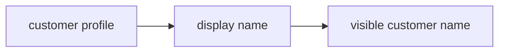

### Customer Phone Number

The customer profile SHALL contain a phone number that supports contact information maintenance for the customer.
The phone number SHALL be editable by the customer.
The phone number SHALL be treated as personal identity details in the customer profile.
If the phone number is missing or unsuitable for normal customer use, then the profile update SHALL be rejected.

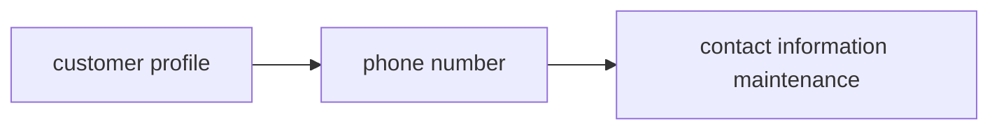

### Profile Updates

Customers SHALL be able to edit profile information for their own customer profile.
Profile updates SHALL apply only to the customer profile and SHALL not alter account credentials or order records.
A customer profile update SHALL preserve the relationship between the customer account and the customer's personal identity details.
Whenever a customer updates profile information, the system SHALL store the new current values for the customer profile.
If profile information is incomplete or otherwise unsuitable for normal customer use, then the update SHALL be rejected.

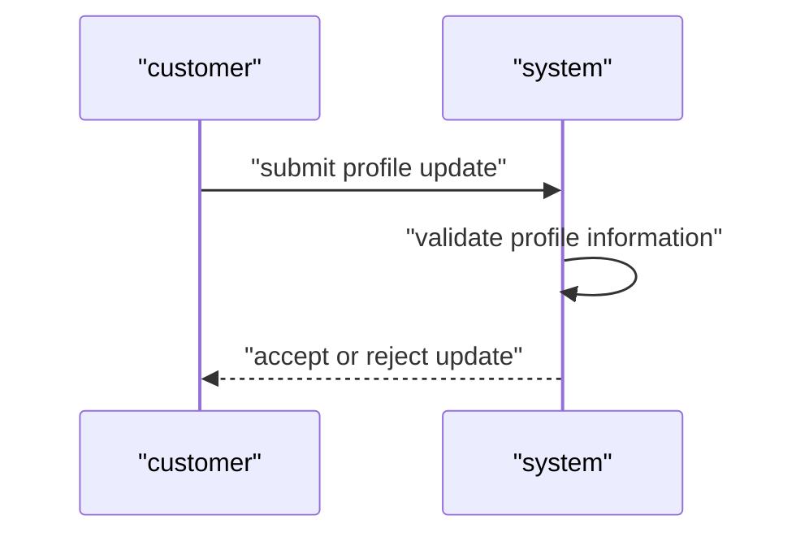

### Profile Validation

The system SHALL validate customer profile updates before applying them.
The system SHALL reject incomplete profile data.
The system SHALL reject profile data that is otherwise unsuitable for normal customer use.
Profile validation SHALL apply to both the display name and the phone number because both are part of the customer profile.
When validation fails, the customer profile SHALL remain unchanged.

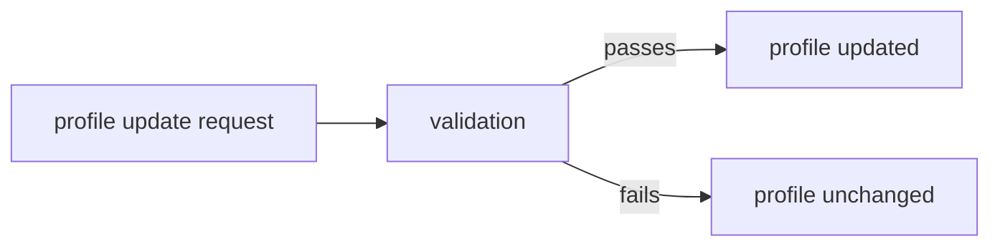

### Customer Profile Identity and Contact Expectations

The customer profile SHALL represent the customer's personal identity details within the platform.
The display name and phone number SHALL be maintained as current profile information for presentation and contact purposes.
The visible customer name SHALL come from the display name defined in the customer profile.
The customer SHALL be able to keep both personal identity details and contact information current by updating the profile.
Changes to the customer profile SHALL remain limited to profile data and SHALL not change other customer records.


## ShippingAddress Rules

A shipping address must contain the recipient name, phone number, street address, city, state or province, postal code, and country. Customers can keep multiple shipping addresses so they can choose the right destination for different orders. Each saved address should describe a complete delivery location rather than a partial note. The platform must allow one address to be marked as the default shipping address for quicker checkout selection. Customers can edit an address when delivery details change. Customers can delete an address when it is no longer needed. Address data should be treated as customer-owned shipping information and must remain clear enough for successful delivery. Incomplete or unusable address details should not be accepted as valid shipping destinations.

### Multiple Shipping Addresses

Customers can keep multiple shipping addresses in their account so they can use different delivery destinations for different orders.
A shipping address belongs to one customer account and is managed by that customer.
A customer can select any saved shipping address during checkout, subject to the rules for complete delivery location and address validation.
A customer can maintain one address as the default shipping address for quicker selection during checkout.
If a customer has no default shipping address, the customer must choose from the saved addresses when placing an order.
A customer can continue to add, edit, and delete shipping addresses over time as their delivery needs change.

### Recipient Name and Shipping Contact Details

A shipping address must include a recipient name.
A shipping address must include a phone number for the shipping contact.
A shipping address must include the street address, city, state or province, postal code, and country.
The recipient name and phone number are part of the delivery details used to identify who should receive the shipment.
A shipping address that is missing any of these required delivery details is not valid for use as a shipping destination.

### Edit and Delete Shipping Address

Customers can edit a saved shipping address when delivery details change.
Customers can delete a saved shipping address when it is no longer needed.
When a customer edits a shipping address, the updated address must still satisfy the rules for a complete delivery location.
When a customer deletes a shipping address, the address is removed from the customer’s saved list.
If a deleted address was the default shipping address, the customer must choose another saved address as the default shipping address.

### Default Shipping Address

A customer can mark one saved shipping address as the default shipping address.
The default shipping address is the preferred address for checkout selection.
A customer can change which saved address is the default shipping address.
Only one address can be the default shipping address for a customer at a time.
The default shipping address must still meet the same validation rules as any other saved shipping address.

### Complete Delivery Location

A shipping address must describe a complete delivery location rather than a partial note.
A complete delivery location includes the recipient name, phone number, street address, city, state or province, postal code, and country.
An address is valid only when all required delivery details are present and understandable enough for delivery use.
A partially completed address is not considered a complete delivery location.

### Address Validation

The system must validate shipping addresses before they are accepted as saved addresses.
The system must reject a shipping address that is missing the recipient name.
The system must reject a shipping address that is missing the shipping phone number.
The system must reject a shipping address that is missing the street address, city, state or province, postal code, or country.
The system must reject a shipping address that cannot be used as a complete delivery location.
The system must allow customers to save only addresses that pass the address validation rules.

## SellerAccount Rules

Seller accounts require an email and password before the seller can use platform features. The seller login credentials follow the same basic account protection expectations as customer accounts. A seller account is not immediately ready for selling until the account has been reviewed and approved by an administrator. The seller must be able to see the approval status so they understand whether the account is pending, approved, or rejected. If the account is rejected, the seller must be able to see the rejection reason. A rejected seller can submit a new registration request rather than starting from a completely different account identity. Sellers can change their password when they need to update their sign-in credentials. Sellers may delete their account only when they do not have pending orders or unresolved cancellation or refund requests tied to their selling activity.

### Seller Account Registration and Sign-In

Seller account registration requires an email address and password. Sellers use the same email and password to sign in. A seller must have a registered account before using seller features.

### Seller Password Change

A seller can change their password after signing in. The new password becomes the seller’s sign-in password for future access.

### Administrator Approval Requirement

A seller account is not eligible to sell until an administrator has reviewed it. Administrator approval is required before the seller can use selling functions.

### Approval Status Visibility

A seller can view the current approval status of the seller account. The status must be shown as one of the following values: pending, approved, or rejected. The approval status is the seller’s current registration state and is separate from any later account changes.

### Rejection Reason and Resubmission

If a seller account is rejected, the seller can view the rejection reason. A rejected seller can submit a new registration request instead of creating a different identity. The new request is treated as a fresh review request for the same seller account identity.

### Seller Account Deletion Restrictions

A seller can delete the seller account only when there are no pending orders in paid or shipped status. A seller can delete the seller account only when there are no pending cancellation requests or pending refund requests. If any of these conditions are not met, seller account deletion is not allowed.

## SellerProfile Rules

A seller profile contains the shop name, shop description, and logo image. These values represent the public identity of the seller's shop and must stay suitable for customer viewing. Sellers can edit their shop name, description, and logo when their branding changes. Each edit must preserve the current public presentation while keeping the profile information accurate. Customers can view seller profiles, so the information should be written in customer-facing language. The shop name is especially important because it appears in order-related displays and helps identify the seller. The profile should not contain unrelated account credentials or operational details. Seller profile rules focus on maintaining a recognizable and trustworthy storefront identity.

### Shop Name

The shop name identifies the seller’s public storefront and is customer-visible. It is used to help customers recognize the seller across product listings, product detail pages, and order-related displays. The shop name must remain suitable for customer viewing and must be written in customer-facing language.

The shop name is part of the seller’s public branding details and is preserved in purchase history snapshots when required by the platform’s snapshot principle.

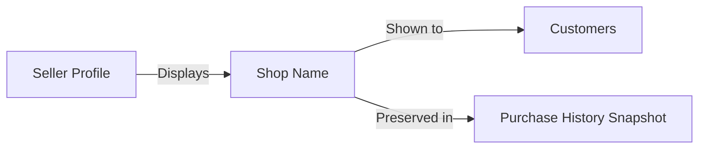

### Shop Description

The shop description provides customer-visible information about the seller’s storefront. It supports public storefront information by describing the shop in a way that customers can understand when viewing the seller profile.

The shop description is part of the seller’s branding details and may be updated when the seller wants to change how the storefront is presented to customers. The description must remain appropriate for public viewing and must not contain unrelated account credentials or operational details.

### Logo Image

The logo image is part of the seller’s public storefront information and customer-visible shop identity. It supports recognition of the seller’s branding across customer-facing views.

When the logo image is changed, the updated logo becomes part of the seller profile’s current public presentation. The logo image is also included in preserved profile snapshots whenever seller profile changes are recorded under the snapshot principle.

### Seller Profile Editing

Sellers can edit their shop name, shop description, and logo image to keep their storefront identity current. Each edit creates a snapshot so the previous public presentation is preserved.

A seller profile edit must record what changed and preserve the before and after values for dispute resolution. The edited profile remains the seller’s public storefront identity after the update.

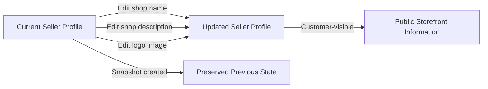

### Customer-Visible Shop Identity

The seller profile defines the customer-visible shop identity used by customers to recognize who is selling a product. This identity is formed by the shop name, shop description, and logo image.

Customers can view seller profiles, so the seller profile must present a clear and trustworthy storefront identity. The shop name is especially important because it appears in order-related displays and helps customers identify the seller who provided the purchase.

### Public Storefront Information

Seller profile information is public storefront information and is shown to customers. It must support a recognizable and trustworthy storefront presentation.

Public storefront information is limited to the seller profile details defined for customer viewing, specifically the shop name, shop description, and logo image. This information is used wherever the seller’s public identity needs to be displayed.

### Seller Branding Details

The shop name, shop description, and logo image are the seller’s branding details. These details define how the seller presents the shop to customers and may be updated as the seller’s branding changes.

Branding details must remain consistent with the seller’s customer-facing identity. When branding details change, the updated values become the seller profile’s current public presentation while the prior state remains preserved in snapshots.

### Shop Profile Updates

Shop profile updates are changes to the seller’s shop name, shop description, or logo image. Every update must preserve the previous state through a snapshot so that the change history remains available for dispute resolution.

Shop profile updates affect the seller’s current public storefront information but do not remove the preserved history of earlier profile values. The updated profile must continue to be suitable for customer viewing after the change.

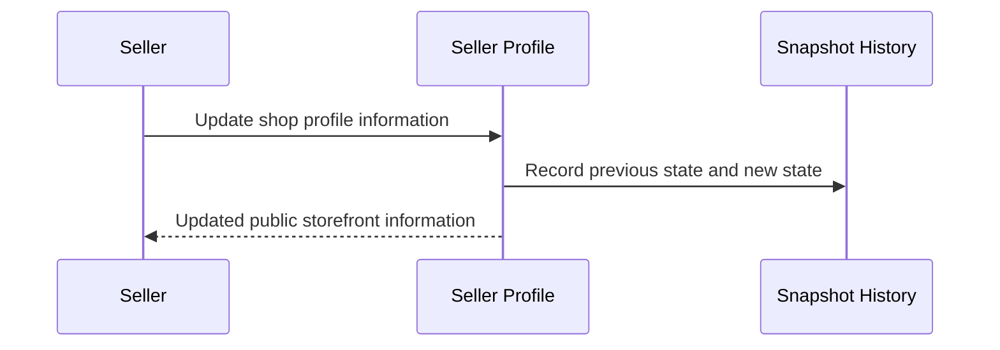

## Category Rules

Categories organize products into browsable groups. Each category has a name and a description so customers can understand what belongs there. The platform supports subcategories, but only one level of nesting is allowed. That means a category may have a direct child category, but deeper category chains are not part of the model. Categories are created and managed by administrators only. Customers can view category information and use it to understand the product structure of the mall. Category names should be distinct enough to support browsing and product grouping. If a category is removed, product organization must remain understandable to customers even when products become uncategorized.

### Category Structure and Hierarchy

Categories organize products into browsable groups so customers can understand how products are grouped within the mall.

Each category has a name and a description so its purpose is clear to customers and administrators.

A category may have subcategories, but only one level of nesting is allowed.

A category may contain direct child categories, but a child category may not contain its own subcategories.

The platform shall not support category chains deeper than one parent-to-child step.

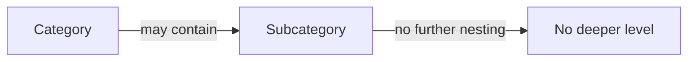

### Administrator-Managed Categories

Categories are created and managed by administrators only.

Customers cannot create, edit, or delete categories.

Category management includes maintaining the category name, description, and one-level subcategory structure.

If a category is removed, the category structure must remain understandable for browsing even when products are no longer assigned to that category.

### Customer Category Browsing

Customers can browse the list of all categories.

Customers can view category details to understand the category name and description.

Customers can view products within a category.

Browsing categories is limited to the category structure defined by administrators, including categories and their direct subcategories only.

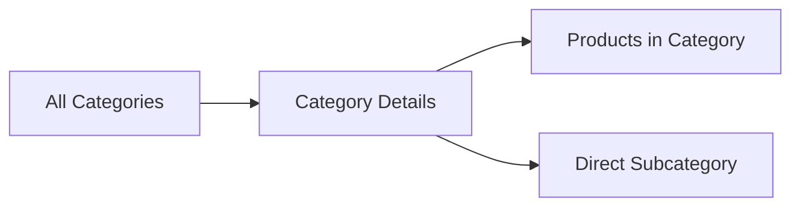

### Product Grouping by Category

Products are organized by category so that products appear in the appropriate browsable group.

Each product belongs to a category, and customers use that category grouping to browse products.

Products may be grouped under a direct subcategory when that subcategory is selected as the product's category.

Category-based grouping must preserve product discoverability in category listings.

### Uncategorized Products

If a category is removed, products in that category become uncategorized.

Uncategorized products remain understandable to customers as products that are no longer assigned to a category.

The platform must preserve product organization clarity when products are uncategorized.

Uncategorized products are not removed from the platform solely because their category was removed.

## Product Rules

A product must have a name, description, category, and base price. These values define the core merchandise information customers use to understand and compare items. A product belongs to the seller who created it, and that seller is the primary owner of the product's editable details. The category may be a subcategory, as long as it fits within the category structure allowed by the platform. Product information should be complete enough for customers to recognize what is being sold before they view variants or images. Sellers can edit their own product information when the product changes. Products without variants are still visible in search but are treated as unavailable for purchase. A product can be deleted only when there are no pending order items or unresolved cancellation or refund requests tied to any of its variants. Product edits must preserve a full change record through snapshots.

### Product Identity and Ownership

A product shall always have a name, description, category, and base price.
A product belongs to the seller who created it, and that seller is the owner of the product's editable details.
A product category may be a subcategory, as long as it follows the platform's one-level subcategory structure.
A product must be complete enough for customers to recognize what is being sold before they view variants or images.

### Product Availability Without Variants

A product must have at least one variant to be purchasable.
A product with no variants remains visible in search results.
A product with no variants is shown as unavailable.

### Product Deletion Restrictions

A seller can delete a product only when none of its variants have pending order items with paid or shipped status.
A seller can delete a product only when none of its variants have pending cancellation requests.
A seller can delete a product only when none of its variants have pending refund requests.
Deleting a product also deletes all of its variants and inventory records.
Deleted products no longer appear in search results or category listings.

### Product Edit Snapshot Rule

Whenever a product is edited, the system shall create a snapshot of the previous state.
Product snapshots preserve the product's editable information for dispute resolution and review.
Product snapshots remain available after the product is deleted.
Sellers can view snapshots of their own products.
Administrators can view snapshots of any product.

## ProductImage Rules

A product can contain multiple images to help customers understand the item visually. Image order matters because the first image is used as the main thumbnail image. Sellers can reorder product images when they want a different picture to lead the listing. Sellers can also delete images that no longer represent the product well. Image changes are part of the product's recorded history, so visual updates remain traceable. Product images should support clear product presentation rather than duplicate unrelated content. The image set should always help customers recognize the product from the listing and detail page. Rules for product images focus on presentation order, image maintenance, and preserving change history.

### Multiple Product Images

A product can contain multiple images to support clear visual presentation of the item.
Each image belongs to one product and is managed as part of that product's image set.
The image set should help customers recognize the product on the listing page and the product detail page.
Multiple images are used to show the product from different views or to provide additional visual context.
The system preserves the association between the product and all of its images so the full image set remains tied to the product it represents.

### Main Thumbnail Image

The first image in a product's image order is the main thumbnail image.
The main thumbnail image is the image shown first in product listings.
If the image order changes, the thumbnail position changes to match the new first image.
A product must always have a clear leading image when at least one image exists.
The thumbnail role is determined by image order rather than by a separate concept.

### Reorder Product Images

Sellers can change the order of a product's images.
Reordering images changes which image appears first and therefore which image becomes the main thumbnail image.
The image order shown on the product detail page follows the maintained order.
Reordering is a maintenance action that updates the product's visual presentation without changing the product itself.
Image order changes are recorded as part of the product's change history.

### Delete Product Image

Sellers can delete images from their products.
When an image is deleted, it is removed from the product's image set.
If the deleted image was the main thumbnail image, the next image in order becomes the new main thumbnail image.
If the deleted image was the only image, the product no longer has a thumbnail image until a new image is added.
Deleting an image is treated as product image maintenance and remains traceable in history.

### Visual Product Presentation

Product images exist to support visual presentation of the product.
The image set should help customers identify the product from listings and from the product detail page.
The image order matters because the first image affects the product's appearance in search and category listings.
Image presentation should remain consistent with the product it represents.
Product images are part of the product information that customers use to compare products visually.

### Image Changes in Snapshots

Any change to product images is included in the product's snapshots.
Image snapshots preserve the previous image state and the new image state when images are added, reordered, or deleted.
Image changes are recorded together with the rest of the product's editable data.
Snapshots must allow relevant parties to understand what the image set looked like before and after the change.
Image history remains available for dispute resolution through the product snapshot record.

### Product Image Maintenance

Sellers are responsible for maintaining the images on their products.
Maintenance includes adding images, reordering images, and deleting images.
Image maintenance should keep the product presentation accurate and useful for customers.
When the product changes visually, the image set should be updated so it continues to represent the product correctly.
Every maintenance change to images is preserved through snapshots.

### Listing Thumbnail Order

Product listings display the main thumbnail image first.
The listing presentation follows the maintained image order so the first image becomes the thumbnail shown to customers.
When image order is changed, the listing thumbnail presentation changes accordingly.
Deleted images no longer appear in the product's listing presentation.
The listing thumbnail order is part of the product's visual identity and follows the product image order exactly.

## ProductVariant Rules

A product can have multiple variants, and each variant represents a specific combination of option values such as color or size. Every variant requires a unique SKU code so it can be identified without ambiguity. Each variant also carries its option values and may have its own price, which can override the product's base price. Stock quantity is tracked per variant and starts at zero. A product must have at least one variant before customers can purchase it. Variants can be edited by the seller, and those edits must remain traceable through snapshots. A variant can be deleted only when there are no pending paid or shipped order items and no unresolved cancellation or refund requests for that variant. If a variant has zero stock, it is treated as out of stock and cannot be selected for cart addition. Variant rules keep product choices distinct, purchasable, and consistently priced.

### Variant Identity and Option Combinations

Each product variant represents one specific combination of product option values, such as a color and size combination. The combination of option values must clearly distinguish one variant from another within the same product. A variant is identified by its SKU code and its option values together, so customers and sellers can tell exactly which variation is being referenced. A product may have multiple variants, but each variant must represent a distinct option combination. If a product has no variants, the product is treated as unavailable for purchase.\n\n```mermaid\nflowchart LR\n    A["Product"] -->|"has one or more"| B["Variant 1"]\n    A -->|"has one or more"| C["Variant 2"]\n    B -->|"distinct option combination"| D["Option values"]\n    C -->|"distinct option combination"| E["Option values"]\n```

### SKU Code, Pricing, and Stock Rules

Each variant requires a SKU code, and the SKU code is mandatory for identifying that variant without ambiguity. Each variant also has its own option values and may have its own price. When a variant has its own price, that price overrides the product's base price for that variant. Stock quantity is tracked separately for each variant, and the starting stock quantity is zero. A variant with zero stock is considered out of stock and cannot be selected for cart addition.\n\nThe system treats stock as a property of the variant rather than the product overall. This means one variant can be available while another variant of the same product is out of stock. Variant availability is therefore determined by its own stock quantity.\n\n```mermaid\nflowchart LR\n    A["Variant"] -->|"requires"| B["SKU code"]\n    A -->|"has"| C["Option values"]\n    A -->|"may override"| D["Variant-specific price"]\n    A -->|"starts at"| E["Stock quantity 0"]\n    E -->|"when zero"| F["Out of stock"]\n```

### Variant Edit Snapshot Rule

Whenever a variant is edited, a snapshot of the previous state is created. The snapshot preserves the variant's change history so that the prior version can be reviewed later for dispute resolution. Variant snapshots are immutable and cannot be deleted. The snapshot must record what changed and the values before and after the change.\n\nVariant edits are traceable separately from the current variant state. This ensures that a seller can review how the SKU code, option values, or price changed over time.\n\n```mermaid\nsequenceDiagram\n    participant U as Seller\n    participant S as System\n    U->>S: Edit variant details\n    S->>S: Save snapshot of previous state\n    S->>S: Apply updated variant details\n```

### Variant Deletion Restrictions

A variant can be deleted only when there are no pending order items in paid or shipped status for that variant. A variant can also be deleted only when there are no pending cancellation requests and no pending refund requests for that variant. If any of those conditions are not met, the deletion is rejected.\n\nWhen a variant is deleted, it is no longer available for selection as a purchasable option. The deletion rule protects active purchases and unresolved customer requests from losing their product reference.\n\n```mermaid\nflowchart LR\n    A["Variant deletion request"] --> B{ "Paid or shipped order items exist?" }\n    B -->|"Yes"| H["Reject deletion"]\n    B -->|"No"| C{ "Pending cancellation request exists?" }\n    C -->|"Yes"| H\n    C -->|"No"| D{ "Pending refund request exists?" }\n    D -->|"Yes"| H\n    D -->|"No"| E["Delete variant"]\n```

## InventoryRecord Rules

Inventory records describe stock changes for each product variant. Each record contains a quantity change, a reason, and a timestamp so the inventory history can be understood later. Positive changes represent restocking, while negative changes represent order consumption or other reductions. Current stock is determined by combining all inventory records for the variant. Sellers can add inventory when replenishing stock and can subtract inventory when correcting losses or adjustments. Order placement creates a negative inventory change, and order cancellation or refund creates a positive inventory change. The history must remain readable because it explains why stock changed over time. Inventory records are separate from snapshots and are intended to preserve stock movement rather than general content changes.

### Inventory History Record

An inventory history record captures a single stock movement for one product variant. It is used to explain how the variant’s stock changed over time and must remain part of the variant’s history.

A record includes the quantity change, the reason for the change, and the timestamp of the change.

The quantity change may be positive or negative.

The reason explains why the stock changed, such as restocking, a seller adjustment, an order, a cancellation, or a refund.

The timestamp identifies when the inventory change was recorded.

Inventory history records are separate from snapshots and are not a substitute for change snapshots used by other business objects.

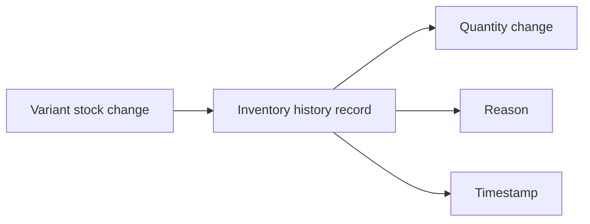

### Positive and Negative Stock Changes

A positive inventory history record represents stock being added back to a product variant.

A negative inventory history record represents stock being reduced from a product variant.

Positive changes are used for restocking and for restoring stock after a cancellation or refund.

Negative changes are used when stock leaves inventory because of an order or because a seller records a reduction.

The direction of the quantity change must match the business event it records.

If the event adds stock, the record must be positive.

If the event removes stock, the record must be negative.

### Current Stock Calculation

The current stock of a product variant is calculated by combining all inventory history records for that variant.

The stock on hand is not stored as a separate business value in this rule set; it is derived from the full inventory history.

A variant’s current stock must reflect every recorded increase and decrease.

If no inventory history records exist for a variant, the current stock is zero.

This calculation provides the stock status used by other parts of the platform, including out-of-stock handling defined elsewhere.

### Seller Restock Inventory

Sellers can add inventory to a product variant when replenishing stock.

A restock action creates a positive inventory history record.

The record must include the amount added, the reason for the restock, and the timestamp.

The restock reason must explain why the seller added stock.

Restocking increases the variant’s current stock after the new inventory history record is included in the variant’s history.

### Inventory Adjustment Loss

Sellers can reduce inventory for a product variant when correcting loss, damage, shrinkage, or another stock adjustment.

An inventory adjustment loss creates a negative inventory history record.

The record must include the amount removed, the reason for the reduction, and the timestamp.

The adjustment reason must explain why the seller reduced stock.

This rule is used for seller-initiated reductions that are not caused by customer orders.

### Order-Driven Stock Change

When an order is successfully placed, the purchased quantity for each affected product variant creates a negative inventory history record.

The record must reflect that stock was consumed by the order.

When an order item is cancelled or refunded, the affected product variant creates a positive inventory history record to restore the returned stock.

These order-driven stock changes must be recorded in the same inventory history used for all other stock movements.

The inventory history therefore shows both stock consumption and stock restoration caused by purchasing activity.

### Cancellation Restores Stock

When a cancellation is approved for an order item, the cancelled quantity restores stock through a positive inventory history record.

The restored quantity must match the cancelled quantity.

The reason must indicate that the change was caused by the cancellation.

This rule applies only to the inventory effect of the cancellation.

Refunds restore stock in the same way, but the cancellation-specific rule is that the approved cancellation returns the item’s quantity to inventory.

## ShoppingCart Rules

A shopping cart holds selected product variants rather than whole products. Customers must choose a specific variant before adding an item to the cart. Quantity is required when adding an item, because the cart represents the intended purchase amount. If the same variant is added more than once, the quantities are combined into a single cart line instead of creating duplicates. The cart should show warnings when requested quantity exceeds available stock. If a variant is deleted or becomes out of stock, it is treated as unavailable in the cart. Cart totals are based on the item quantities and prices currently shown in the cart. Shopping cart rules focus on variant-level purchasing intent and keeping cart contents aligned with stock reality.

### Variant-Based Cart Items

A shopping cart contains items at the product variant level rather than the product level. Each cart item represents one selected variant and its intended purchase quantity. A customer cannot place a product into the cart without first choosing a specific variant. If the same variant is added again, the system keeps one cart line for that variant and updates its quantity instead of creating a duplicate line.

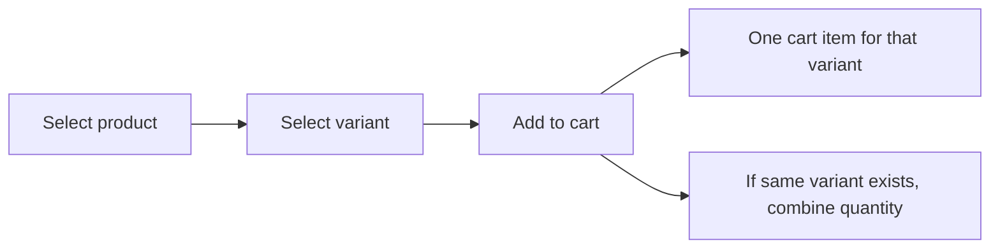

### Quantity Rules for Cart Items

Each cart item must carry a quantity because the cart represents an intended purchase amount. Customers can change the quantity of an existing cart item. If a customer adds the same variant again, the quantities are combined into the existing cart item quantity. Cart quantities must always be evaluated against the currently available stock for that variant. If the quantity requested in the cart exceeds available stock, the cart item is allowed to remain in the cart but must be marked with a stock warning.

If a customer reduces a cart item quantity, the cart reflects the new quantity for that variant only. If a customer removes a cart item, the variant is removed from the cart entirely.

### Cart Stock Warnings and Availability

The cart must warn customers when a cart item quantity is greater than the available stock for its variant. The cart must also warn customers when the available stock for a variant is zero. A variant that is deleted or out of stock is treated as unavailable in the cart.

An unavailable cart item remains visible in the cart so the customer can understand why checkout cannot continue, but it cannot be checked out. If a variant becomes unavailable after it was added to the cart, the cart must reflect that change. If a variant is out of stock, the cart must show it as out of stock; if a variant is deleted, the cart must show it as unavailable.

### Cart Total Price

The cart total price is the sum of all cart item subtotals shown in the cart. Each cart item subtotal is based on the item quantity and the current item price shown for that variant in the cart. The total price must update whenever a cart item quantity changes, an item is removed, or the displayed price for a cart item changes.

The cart must show the total price for all items currently included in the cart, including items that are still visible but unavailable. Unavailable items remain part of the cart display until they are removed by the customer or otherwise no longer present.

### Cart Item Quantity Control

Customers can increase or decrease the quantity of a cart item, and the cart must keep the item grouped by variant. Quantity controls apply to the selected variant item only and do not affect other cart items. When a customer changes a cart item quantity, the cart must recalculate that item’s subtotal and the overall cart total price.

If a quantity change would cause the cart item to exceed available stock, the cart must show a stock warning for that item. Quantity changes do not remove the item from the cart unless the customer explicitly removes it or the quantity is reduced to the system’s minimum supported cart quantity, if applicable.

### Unavailable Cart Item Handling

If a cart item’s variant is deleted or becomes out of stock, the cart item is marked as unavailable. Unavailable cart items remain identifiable in the cart so the customer can see which items cannot proceed to checkout. Unavailable cart items must not be eligible for checkout.

If a cart contains both available and unavailable items, only the available items may continue toward checkout. The cart must keep the unavailable item state visible until the customer removes the item or the variant becomes available again.

## CartItem Rules

A cart item represents one chosen product variant and the quantity the customer intends to buy. Cart items are not product-level placeholders; they are tied to a specific variant selection. The quantity on a cart item must stay meaningful for purchase planning and may be increased or reduced by the customer. The item price and subtotal should reflect the selected variant pricing shown to the customer. If the same variant is added again, the existing cart item quantity is updated rather than duplicated. A cart item should be treated as unavailable when the linked variant is deleted or has no stock. Cart item rules help keep the cart readable and ensure that each line reflects a single purchasable choice. These rules also support clear subtotal calculations for checkout review.

### Cart Item Variant Link

A cart item represents exactly one selected product variant.
A cart item must not represent a product without a specific variant selection.
The variant linked to a cart item determines which product options the customer intends to purchase.
If the linked variant is deleted or becomes unavailable, the cart item is marked unavailable.
A cart item remains associated with the same selected variant until the customer changes or removes it.

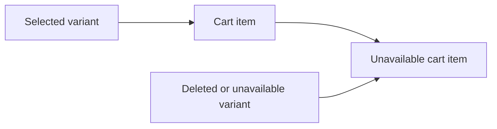

### Cart Line Per Variant

The cart must keep one line per variant.
If the same variant is added more than once, the system updates the existing cart line instead of creating another line.
Different variants of the same product must be stored as separate cart lines.
This rule keeps the cart readable and prevents duplicate lines for the same purchasable choice.

### Cart Item Quantity

A cart item stores the quantity the customer intends to buy for the selected variant.
The quantity on a cart item must always represent a purchase quantity for that specific variant.
Customers can increase or reduce the quantity of a cart item.
If the customer adds the same variant again, the quantities are combined into the existing cart item quantity.
The cart item quantity is used for purchase planning and subtotal calculation.

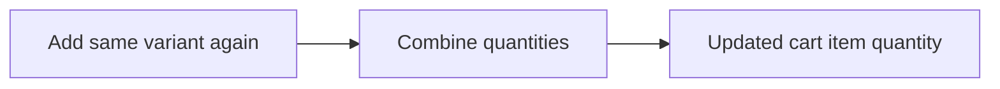

### Combined Duplicate Variant Quantity

When a customer adds a variant that is already present in the cart, the system combines the new quantity with the existing quantity.
The system must not create a second cart item for the same variant.
The combined quantity must remain tied to the same selected variant.
If the customer later changes the quantity, the updated quantity applies to that single cart line only.

### Selected Variant Pricing

A cart item price is based on the price of the selected variant.
If the selected variant has its own price, that price is used for the cart item.
If the selected variant does not override the product base price, the product base price is used.
The cart must show the selected variant pricing consistently for both the line item and subtotal.

### Subtotal Calculation

Each cart item subtotal is calculated from the selected variant price and the cart item quantity.
The cart subtotal for the full cart is the sum of all cart item subtotals.
If a cart item quantity changes, its subtotal must change accordingly.
If a selected variant price changes, the cart item must reflect the selected variant pricing shown to the customer according to the cart’s current state.

### Unavailable Cart Item State

A cart item is marked unavailable when the linked variant is deleted or has no stock.
An unavailable cart item cannot be checked out.
If a cart item becomes unavailable, it must remain visible in the cart as unavailable so the customer can identify the affected item.
A cart item that is unavailable may also be shown when the linked variant is no longer purchasable for any other reason covered by the cart rules in this section.

### Purchase Quantity Tracking

The cart item quantity represents the customer’s intended purchase quantity for that selected variant.
That quantity is the amount used to determine the line subtotal and the quantity requested at checkout.
If the available stock is less than the cart item quantity, the cart must show a warning for that line.
If the cart item quantity is reduced to a lower amount, the warning must reflect the new quantity and stock relationship.
The cart item quantity must stay tied to the selected variant until the cart line is removed or the variant selection changes.

## Wishlist Rules

A wishlist stores products that customers want to remember for later, and it stores products rather than individual variants. Customers can add products to the wishlist and remove them when they are no longer interested. The wishlist is paginated so large saved lists remain manageable. Because the list contains products only, it should stay at a product-level view rather than a variant-level selection. If a seller deletes a product, that product must disappear from wishlists automatically. Wishlist content should remain useful even when products move through normal catalog changes. The wishlist exists to support product saving and return visits, not purchase commitment. Wishlist rules should keep saved items current and tied to products that still exist in the catalog.

### Wishlist Content and Scope

The wishlist stores products, not individual variants. Customers use the wishlist as a saved-for-later list of products they want to revisit. A wishlist entry represents the product as a whole and does not preserve a variant-specific selection. Wishlist content remains at product level even when a product has multiple variants.

### Wishlist Browsing

Customers can browse their wishlist as a paginated list. Each page shows saved products rather than variant-level items. The wishlist remains a browsing aid for returning to products the customer has saved earlier. The list must stay usable when it grows large by supporting pagination.

### Adding and Removing Wishlist Products

Customers can add products to their wishlist and remove products from their wishlist. Removing a product from the wishlist removes that saved product entry for the customer. If a customer adds the same product again later, it is treated as a product-level saved item rather than a variant-specific save.

### Automatic Cleanup for Deleted Products

If a seller deletes a product, the product is automatically removed from all wishlists. Deleted products must no longer appear in wishlist browsing. Wishlist maintenance must keep saved items aligned with products that still exist in the catalog.

### Wishlist Maintenance Expectations

Wishlist items are maintained as current references to products that still exist. Wishlist browsing should not expose deleted products as saved items. The wishlist stays useful as a personal reminder list for products the customer may want to revisit later.

## Order Rules

An order is created only after a successful purchase. An order contains one or more order items, and those items may come from different sellers. The order keeps a total price and an order number so customers can recognize it later. Order items inside the order each have their own status, and the overall order status is derived from those item statuses. An order can move into mixed states when its items are not all in the same condition. The shipping address attached to the order should stay fixed after the order is placed. Order history must reflect the full purchase summary, including the items, prices, and delivery-related information. Order rules focus on keeping the purchase record complete and consistent across multiple sellers and item states.

### Successful Purchase Order

An order is created only after payment succeeds. If payment fails, the order is not created and the customer may retry payment. When a purchase succeeds, the order becomes the customer’s purchase record for the selected items and shipping address.

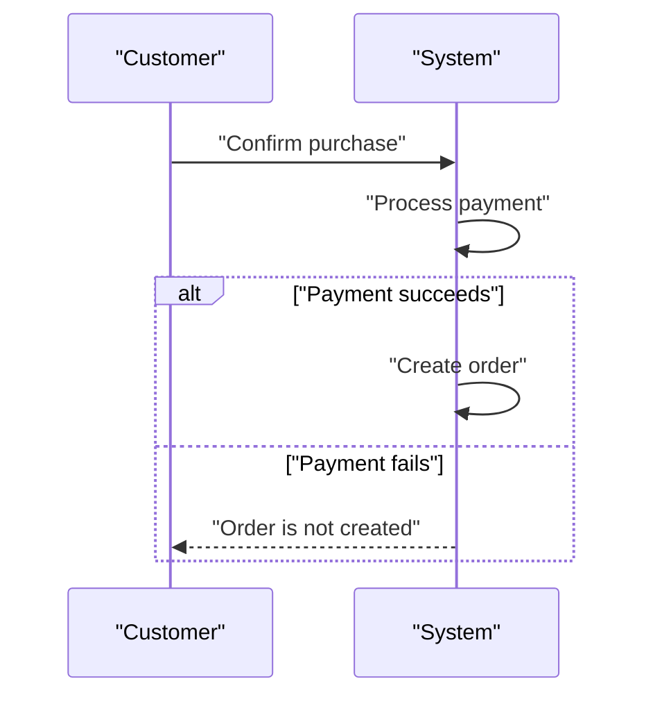

### Order Number and Total Price

Each order has an order number so customers can recognize it later. Each order also keeps a total price that summarizes the purchased items in that order. The order number and total price are shown in order history and order details.

The total price must reflect the items included in the order at the time the order is created. If an order contains items from different sellers, the total price still represents the full order as one purchase record.

### Multiple Order Items

An order contains one or more order items. If a customer buys multiple quantities of the same variant, those quantities are grouped into one order item for that variant. Order items within the same order may have different statuses because each item is managed separately.

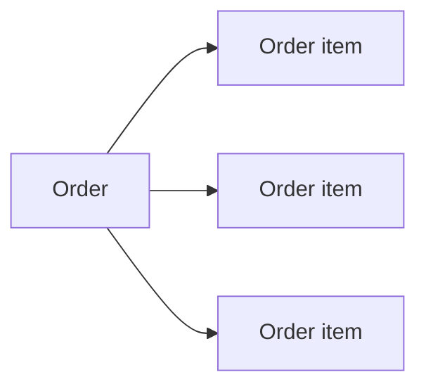

### Items from Different Sellers

An order may contain items from different sellers. Each order item belongs to the seller of the purchased product variant. Items from different sellers remain separate at the item level even when they are included in the same order. Order history must still present them under one order record for the customer.

### Derived Overall Order Status

The overall order status is derived from the statuses of its order items. If all items are paid, the order status is paid. If any item is shipped and none are delivered yet, the order status is shipped. If all items are delivered, the order status is delivered. If all items are cancelled, the order status is cancelled. If all items are refunded, the order status is refunded. Mixed item states result in a partially completed order.

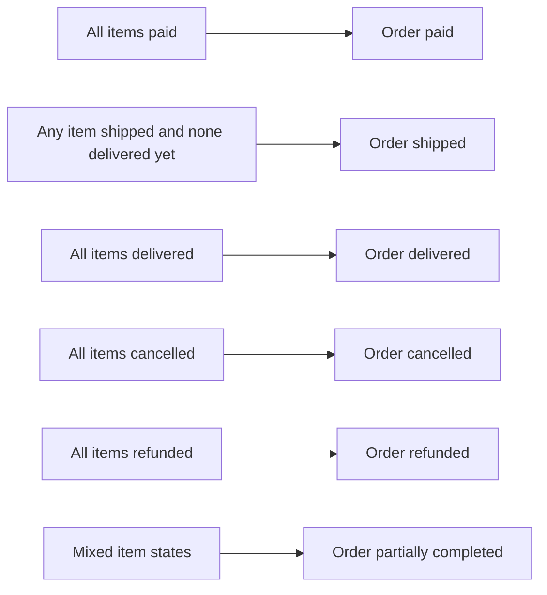

### Shipping Address Fixed After Placement

The shipping address attached to an order is fixed after the order is placed. Customers can choose a shipping address during checkout, but once the order is created, that shipping address remains part of the order record and does not change.

This rule preserves the purchase record exactly as it was at placement time, including the shipping destination used for the order.

### Order History Summary

Order history must show a summary of each order that includes the order number, date, total price, and overall order status. Customers can later open an order to see the full purchase details, including the items, prices, shipping address, and shipment information.

The order history summary is a condensed view of the order record and must remain consistent with the underlying order details.

### Mixed Order States

Mixed order states are allowed when items in the same order are not all in the same condition. In a mixed state, the overall order status becomes partially completed. This can happen when some items are delivered while others are cancelled, refunded, shipped, or still paid.

Mixed states must be reflected in the overall order status rather than forcing the order into a single-item status.

## OrderItem Rules

An order item represents one purchased product variant and its quantity within an order. If a customer buys multiple units of the same variant, they are grouped into a single order item with a larger quantity rather than separate lines. Each order item has its own status, which may differ from other items in the same order. The item captures the purchased product details and the seller context that applied at the time of purchase. A review can only be linked to an item after that item reaches delivered status. Cancellation and refund rules are also based on individual order items instead of the full order. The item record must remain suitable for later order history, dispute handling, and seller follow-up. Order item rules preserve the business meaning of a single purchased variant across its later state changes.

### Order Item per Variant

An order item represents exactly one purchased product variant within an order. An order item must not represent multiple variants, and a single variant must not be split across multiple order items within the same purchase. When a customer buys multiple units of the same variant, those units are grouped into one order item with a larger quantity rather than separate lines. If the same variant appears more than once in the same order context, it is treated as one order item for that variant. A seller-specific order item remains tied to the seller who owns the purchased variant, even when the overall order contains items from different sellers.

### Grouped Quantity on One Line

Quantity is tracked at the order item level for the purchased variant. When more than one unit of the same variant is purchased, the order item shows one line with the total quantity for that variant. The quantity on that line represents the full amount purchased for that variant and is used for order history, shipping, cancellation, refund, and review eligibility. Separate order lines are not created for repeated purchases of the same variant within the same order.

### Individual Item Status

Each order item has its own status, independent of other items in the same order. The status of one item may differ from the status of another item in the same order. The item status determines whether the item is waiting for shipping, has been shipped, has been delivered, has been cancelled, or has been refunded. Business actions that depend on item status apply only to the specific item and not to the full order unless the order-wide outcome is derived from the combined item states.

### Purchased Product Details Snapshot

Each order item preserves the product details that applied at the time of purchase. The preserved details include the purchased product information, the selected variant information, and the seller profile information that was visible when the purchase was made. These preserved details are used for later order history, dispute handling, and customer review context. The snapshot must reflect the state at purchase time rather than the current state of the product, variant, or seller profile.

### Review After Delivered Item

A review can be created only after the related order item has reached delivered status. The delivery requirement applies to the specific item being reviewed. A customer can write only one review for the same product within the same order. If the item has not been delivered, the review is not allowed. Reviews remain linked to the purchase context even after the item status has changed from delivered to a later state.

### Item-Level Cancellation

Cancellation is handled for a single order item rather than for the full order. A cancellation request can be made only for an item that has been paid and has not yet been shipped. The cancellation request belongs to the specific item being cancelled and carries its own reason and state history. If approved, only that item is cancelled, while the remaining items in the order continue through their own processing. If all items in the order are cancelled, the overall order is considered cancelled.

### Item-Level Refund

Refund is handled for a single order item rather than for the full order. A refund request can be made only for an item that has been delivered. The refund request belongs to the specific item being refunded and carries its own reason and state history. If approved, only that item is refunded, while the remaining items in the order remain unaffected. If all items in the order are refunded, the overall order is considered refunded.

### Seller-Specific Order Item

Each order item belongs to one seller, based on the seller who owns the purchased variant. Order items from different sellers remain separate in shipping and seller follow-up, even when they belong to the same customer order. A seller can act only on the items that belong to that seller. The seller-specific association is preserved in the item snapshot so that later order history and dispute handling show the correct seller context.

## Shipment Rules

A shipment is a package created by a seller for one or more order items from that same seller. Different sellers never share the same shipment, so each shipment stays seller-specific. A shipment carries carrier name and tracking number so customers can follow delivery progress. Sellers may bundle several eligible items together or ship them separately, depending on the order composition. When a shipment exists, all items inside it share the same tracking information. Customers view tracking by shipment rather than by individual item because the package is the delivery unit. Shipment rules should keep package contents consistent with one seller and one tracking identity. The shipment concept supports clear delivery grouping and tracking visibility for the customer.

### Seller-Specific Shipment

A shipment is always owned by one seller and contains only order items from that same seller. Different sellers never share the same shipment. This rule keeps fulfillment boundaries aligned with the seller who is responsible for the package. The shipment content must remain seller-specific at all times.

### Shipment Tracking Details

Each shipment includes a carrier name and a tracking number. These values identify the delivery service and the shipment’s tracking reference. They are part of the shipment’s business meaning and are shown together so the shipment can be followed as one delivery unit.

### Multiple Order Items Per Shipment

A shipment may contain one or more order items, as long as all items in that shipment belong to the same seller. A seller may place eligible items into a single shipment or split them into separate shipments. The shipment must stay internally consistent with one seller’s items only.

### Shipment Grouping by Seller

Order items are grouped into shipments by seller. Items from different sellers must be grouped into separate shipments even when they belong to the same order. This rule ensures each seller manages only the items they are responsible for shipping.

### Shared Tracking Information

All order items included in the same shipment share the same tracking information. When the shipment’s carrier name or tracking number is used, it applies to every item in that shipment. Shipment-level tracking therefore represents the full set of items bundled into the package.

### Customer Shipment Tracking

Customers view tracking information by shipment rather than by individual order item. The shipment is the customer-facing tracking unit because it represents the package being delivered. Customers can use the shipment’s carrier name and tracking number to follow delivery progress for the items included in that shipment.

### Package Delivery Unit

A shipment is the package delivery unit for this platform. It represents the physical package sent by a seller and serves as the unit for tracking and delivery visibility. Because the shipment is the delivery unit, one shipment can cover several order items from the same seller when they are shipped together.

## CancellationRequest Rules

A cancellation request belongs to a single order item and includes a reason from the customer. Cancellation is only meaningful for an item that has been paid and not yet shipped. The request must remain tied to that one item so other items in the order can continue normally. The seller of the item can approve or reject the request. When the seller responds, the request state must be preserved as part of the change history. Cancellation requests should remain understandable during dispute review, including why the customer asked for cancellation. If approved, the item is cancelled and stock is restored through inventory movement. If all items in an order are cancelled, the order can be treated as fully cancelled.

### Item-Level Cancellation Request

A cancellation request applies to exactly one order item and does not affect the rest of the order. The request must remain tied to the specific purchased item so that other items in the same order can continue through their own processing. A cancellation request is only valid for an item that has been paid and has not yet been shipped. If the item is no longer in that state, the cancellation request cannot proceed.

### Cancellation Reason Text

A cancellation request must include a reason from the customer. The reason is kept with the request so that the seller and other relevant parties can understand why cancellation was requested during later review.

### Seller Reviews the Cancellation Request

The seller of the order item decides whether to approve or reject the cancellation request. The seller’s decision is recorded as part of the request history. If the seller approves the request, the item is cancelled. If the seller rejects the request, the item remains unchanged and the request is closed with that outcome.

### Request State History

Every change to a cancellation request must be preserved in its history. The history records the request’s state changes so that the full sequence of events can be reviewed later. When the seller responds, that response becomes part of the preserved history and the prior request state remains visible for dispute review.

### Cancellation Dispute Review

Cancellation requests must remain understandable during dispute review. The preserved request history must show why the customer asked for cancellation and how the seller responded so that the request can be reviewed fairly by relevant parties.

### Stock Restoration Through Inventory

When a cancellation request is approved, the cancelled item’s stock is restored through an inventory record rather than by directly changing the current stock in place. The inventory movement must reflect the restoration caused by the cancellation so that stock history remains complete.

### Fully Cancelled Order

If every item in an order is cancelled, the entire order is treated as fully cancelled. If at least one item is still active, the order is not considered fully cancelled. This rule allows the order’s overall state to reflect the combined outcome of its items.

### Cancellation Request State Flow

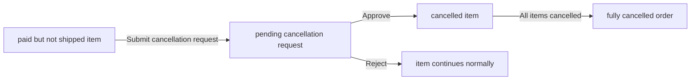

## RefundRequest Rules

A refund request belongs to a single order item and includes a reason from the customer. Refunds are limited to delivered items, so the item must already have reached the delivery state before a request can be made. The request should remain tied to that one item and not affect other items in the same order. The seller of the item can approve or reject the request. When the seller responds, the request history must preserve the state change for later review. Refund requests should remain clear enough for dispute handling and customer support. If approved, the item is refunded and stock is restored through inventory movement. If all items in an order are refunded, the order can be treated as fully refunded.

### Item-Level Refund Request

A refund request applies to one order item only and does not apply to the entire order.
A customer may request a refund only for the purchased item that is being reviewed.
The refund request stays associated with that single item throughout its review and resolution.
The rest of the order continues independently unless other items also receive their own refund outcomes.

### Refund Reason Text

A refund request includes a reason from the customer.
The reason is recorded as part of the request and is used when the seller reviews the request.
The reason remains part of the request history so it can be reviewed later during dispute handling or support investigation.

### Delivered Item Only

A refund request can be made only after the order item has been delivered.
If the item has not yet been delivered, the refund request must be rejected.
Refund eligibility is determined per item, not by the overall order status.

### Seller Approves or Rejects Refund

The seller of the order item reviews the refund request and either approves it or rejects it.
Only the seller responsible for that item may make the decision, unless an administrator handles the request through oversight processes defined elsewhere.
The decision changes the request status and determines whether the item is refunded or remains unchanged.

### Refund Request History

Each refund request preserves its status changes as history.
The history records the request state changes so later reviewers can see how the request was handled.
A history entry is created when the seller responds to the request, preserving the request’s review trail for later reference.

### Dispute Review for Refund

Refund requests must remain reviewable for dispute handling and customer support.
Relevant parties can view the preserved request history to understand the reason for the request and how it was resolved.
The review record is intended to support later dispute resolution and must remain available after the request is resolved.

### Stock Restoration Through Inventory

If a refund request is approved, the refunded item restores its stock through an inventory record.
The stock restoration is recorded as part of inventory history rather than by changing the stock directly.
The item’s stock history must reflect that the returned quantity was restored because of the refund outcome.

### Fully Refunded Order

If all items in an order are refunded, the order is considered fully refunded.
A fully refunded order is determined from the outcomes of its individual items.
If at least one item in the order is not refunded, the order is not fully refunded.

## Review Rules

A review can be written only by a customer who purchased the product. The review is tied to a delivered order item, so customers cannot review items that have not reached delivery. Each review includes a required rating and optional written text. Customers can submit only one review per product per order, which keeps feedback from being duplicated for the same purchase. Customers can edit their own reviews, and those edits must remain traceable. Customers can also delete their own reviews while preserving their history for records. Reviews remain part of the product's public feedback and help shape the average rating shown to shoppers. Review rules make sure feedback reflects real purchases and stays accountable over time.

### Verified Purchase Review

A review is allowed only when the customer purchased the product and the related order item has been delivered. The review must be tied to a delivered item so that feedback reflects a completed purchase experience.

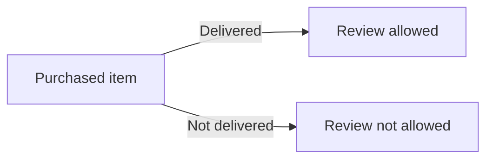

The system shall accept review creation only for a delivered purchase.
If the item has not been delivered, the review must be rejected.
The review must remain associated with the purchase context that qualifies it as a verified purchase review.

### Rating and Text Review

Each review includes a required rating and optional text content. The rating expresses the customer’s assessment, while the text content provides additional written feedback when the customer chooses to include it.

The system shall require a rating for every review.
The system shall allow optional text content in a review.
A review with missing rating must be rejected.
A review may be submitted with text content left blank.
A review may be submitted with both rating and text content.

### One Review per Product per Order

A customer can submit only one review for the same product within the same order. This prevents duplicate reviews for the same purchase while still allowing separate reviews for the same product in different orders.

The system shall allow only one review per product per order.
If a customer tries to submit another review for the same product within the same order, the request shall be rejected.
A separate order for the same product may have its own review.

### Edit Own Review

Customers can edit only their own reviews. When a review is edited, the updated review remains tied to the original purchase and continues to represent the customer’s feedback for that order item.

The system shall allow a customer to edit their own review.
If a customer tries to edit another customer’s review, the request shall be rejected.
When a review is edited, the updated content replaces the visible review content while the review history is preserved through snapshots.

### Delete Own Review

Customers can delete only their own reviews. Deleted reviews are no longer shown as active customer feedback, but their historical record is preserved.

The system shall allow a customer to delete their own review.
If a customer tries to delete another customer’s review, the request shall be rejected.
Deleted reviews shall remain preserved in snapshot history.

### Review Snapshot History

Every review edit creates a snapshot so that changes remain traceable over time. The snapshot records the review state before and after the change, along with the time of the change.

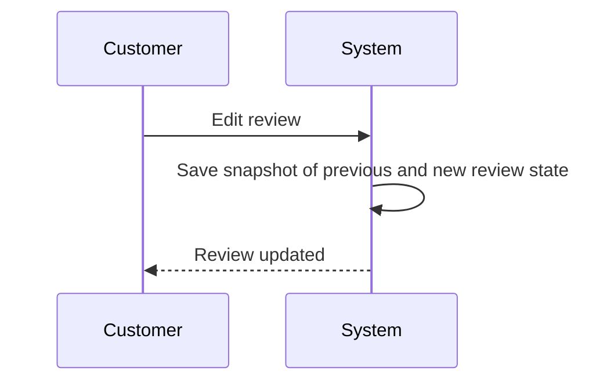

The system shall create a snapshot whenever a review is edited.
The snapshot shall preserve the previous state and the updated state of the review.
The snapshot shall record when the change was made.
Review snapshots shall be preserved even after the review is deleted.

### Average Rating from Reviews

A product’s average rating is calculated from all non-deleted reviews for that product. Deleted reviews do not contribute to the displayed average rating.

The system shall calculate the average rating from non-deleted reviews only.
If a product has no reviews, no average rating shall be shown.
If a review is deleted, it shall no longer contribute to the product’s average rating.

## Snapshot Rules

Snapshots preserve previous states whenever editable data changes. Each snapshot must record when the change happened, what was changed, and the values before and after the change. Snapshots are immutable, so once created they cannot be altered or deleted. They exist to support dispute resolution and business accountability across money-related data. Owners and administrators may view relevant snapshots when they need to understand how a record changed. Product snapshots must preserve the full state of the product and its variants at the moment of change. Seller profile, order item, review, cancellation request, and refund request changes also rely on snapshots to preserve history. Snapshot rules exist to make every meaningful modification traceable and trustworthy.

### Immutable Snapshot History

Snapshots are immutable records of meaningful changes. Once a snapshot is created, it cannot be altered or deleted. The system uses snapshots to preserve prior states whenever editable data changes, especially in money-related business records. Snapshots must remain available for dispute resolution and business accountability after the original record changes. Relevant parties such as owners and administrators can view snapshots when they need to understand how a record changed.

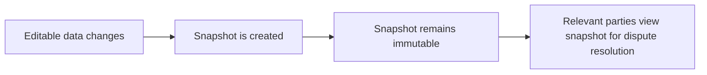

### Snapshot Change Details

Every snapshot records when the change was made. Every snapshot also records what was changed, along with the values before the change and the values after the change. The change record must be sufficient to show the previous state and the updated state of the affected data. This applies to all snapshot-covered edits so that the history of the change can be reviewed later.

The snapshot change details must include:
- the time the change occurred
- a description of what was changed
- the previous values
- the updated values

### Product Full-State Snapshot

When a product is edited, the system creates a product snapshot that preserves the complete product state at that moment. The product snapshot includes all product fields, including the product images. The product snapshot also includes the snapshots of all product variants at that same moment, so the saved history reflects the full product and variant state together. This preserves the complete state of a product and its variants at any point in time.

```mermaid
flowchart LR
    A["Product edit"] --> B["Product snapshot"]
    B --> C["All product fields"]
    B --> D["All product images"]
    B --> E["All variant snapshots at that moment"]
```

### Review Edit History

When a review is edited, the system creates a snapshot of that review change. The review snapshot preserves the review’s changed state over time, including the change timestamp, what was changed, and the values before and after the edit. Review snapshots are preserved even if the review itself is later deleted. This creates an edit history that can be used to understand how a review evolved.

A review’s edit history is part of the broader snapshot history and exists for dispute resolution and accountability.

### Cancellation Request Snapshot

When a cancellation request changes, the system creates a snapshot of the request state. The snapshot preserves the cancellation request’s history by recording the time of the change, what was changed, and the values before and after the change. Cancellation request snapshots are preserved so that seller responses and request changes can be reviewed later during dispute resolution. If the request state changes multiple times, each change must be captured as a separate immutable snapshot.

```mermaid
flowchart LR
    A["Cancellation request changes"] --> B["Snapshot created"]
    B --> C["Timestamp recorded"]
    B --> D["Before values recorded"]
    B --> E["After values recorded"]
    B --> F["What was changed recorded"]
```

### Refund Request Snapshot

When a refund request changes, the system creates a snapshot of the request state. The snapshot preserves the refund request’s history by recording the time of the change, what was changed, and the values before and after the change. Refund request snapshots are preserved so that seller responses and request changes can be reviewed later during dispute resolution. If the request state changes multiple times, each change must be captured as a separate immutable snapshot.

```mermaid
flowchart LR
    A["Refund request changes"] --> B["Snapshot created"]
    B --> C["Timestamp recorded"]
    B --> D["Before values recorded"]
    B --> E["After values recorded"]
    B --> F["What was changed recorded"]
```

## AdministratorApprovalRequest Rules

An administrator approval request can be submitted by either a customer or a seller who wants administrator access. The request must include a reason so the platform can understand why the role change is being requested. The request remains a business record until a super administrator reviews it. Because administrator privileges affect platform governance, the request should be handled with clear approval or rejection decisions. The result of the request must be understandable to the person who submitted it. This request type is separate from seller approval or customer account data. Its purpose is to justify elevated administrative access and document the reason for that change. Administrator approval rules should ensure that the request is meaningful, reviewable, and traceable.

### Administrator Role Request

An administrator approval record is created when a customer or seller requests access to the administrator role.
The request must include a reason for admin access so the request can be reviewed as a business justification.
The request exists as a governance record until it is reviewed by a super administrator.
The request must clearly identify the requesting account as either a customer or a seller.
The platform must preserve the request as part of governance request history for later review and traceability.

```mermaid
sequenceDiagram
    participant U as "Customer or Seller"
    participant S as "System"
    participant A as "Super Administrator"
    U->>S: "Submit administrator role request"
    S->>S: "Store request with reason"
    A->>S: "Review request"
    S-->>A: "Request history and current status"
```

### Super Administrator Review

Only a super administrator can review an administrator role request.
The review result must be recorded as either an approval or a rejection decision.
A reviewed request must keep its full history so the original request and the decision remain traceable.
If the request is approved, the result must be understandable to the requesting account as an approved administrator access request.
If the request is rejected, the result must be understandable to the requesting account as a rejected administrator access request.
The request history must show the progression from submitted request to final decision.

```mermaid
flowchart LR
    A["Submitted request"] --> B["Super administrator review"]
    B --> C["Approved"]
    B --> D["Rejected"]
```

### Approval or Rejection Decision

Each administrator approval record must end with one clear decision: approved or rejected.
The decision must be tied to the original reason for admin access so the business justification can be reviewed together with the outcome.
The record must remain available as an immutable governance history item after the decision is made.
A rejected request must remain identifiable as a rejected administrative privilege request.
An approved request must remain identifiable as an approved administrative privilege request.
The platform must preserve the decision as part of governance request history for future reference.

## SellerApprovalRequest Rules

A seller approval request represents a seller's attempt to be cleared for selling on the platform. The request must be reviewable by administrators before the seller can participate as a merchant. The approval status must be visible to the seller so they know whether the request is pending, approved, or rejected. If the request is rejected, the rejection reason must also be visible to the seller. A rejected seller can submit a new registration request to try again. The seller approval request exists to document the platform's approval decision and support transparent merchant onboarding. Its rules should keep the result understandable and reusable for future registration attempts. Seller approval requests are a key gate between account creation and the ability to sell products.

### Seller Registration Request

A seller registration request represents a seller's attempt to become eligible to sell on the platform.
The request exists as part of merchant onboarding and must be reviewed before the seller can participate as a merchant.
A seller registration request is associated with one seller account only.
The request is used to capture the platform's decision about whether the seller may sell on the platform.

### Approval Status

A seller approval status must be one of the following values: pending, approved, or rejected.
The approval status must be visible to the seller.
While the approval status is pending, the seller is waiting for administrator review.
When the approval status is approved, the seller is allowed to proceed as a merchant.
When the approval status is rejected, the seller is not approved for selling until a new registration request is submitted.

### Rejection Reason Visibility

If a seller registration request is rejected, the rejection reason must be visible to the seller.
The rejection reason explains why the request was not approved.
If the request has not been rejected, no rejection reason is shown.
The rejection reason is part of the seller's understanding of the decision and supports transparent merchant onboarding.

### Administrator Seller Approval

Administrator review is required for every seller registration request before the seller can sell.
An administrator can approve or reject a seller registration request.
The administrator's decision determines the seller's approval status.
Only administrators perform the approval decision for seller registration requests.

### New Registration After Rejection

A seller whose registration request was rejected can submit a new registration request.
A new registration request is treated as a fresh attempt at merchant onboarding.
The ability to submit a new registration request exists specifically for rejected sellers.
Submitting a new registration request allows the seller to try again after addressing the reason for rejection.

### Merchant Onboarding Approval

Merchant onboarding is completed only when a seller registration request has been approved.
Approval is the gate that allows a seller to move from registration to selling on the platform.
A rejected registration does not complete merchant onboarding.
The onboarding decision must remain understandable to the seller through the visible approval status and, when applicable, the rejection reason.

### Seller Approval Visibility

The seller must be able to see the current state of their seller registration request.
The visible state must distinguish between pending, approved, and rejected.
If the request is rejected, the seller must also be able to see the rejection reason.
This visibility is intended to make the onboarding decision clear to the seller.

### Seller Request Review

Each seller registration request must be reviewable by an administrator.
Review means the administrator evaluates the request and records a decision.
A seller registration request remains in the pending state until the administrator makes a decision.
The review outcome is reflected in the request's approval status.

# Data Browsing Expectations

Business expectations for how users browse, find, and navigate through lists of data.

## List Browsing Expectations

Define business expectations for how users find, filter, and browse lists.

### Filtering Rules

Customers can filter product search results by category, price range, and in-stock-only availability.

Filtering by category limits the results to products that belong to the selected category.
Filtering by price range limits the results to products whose listed price falls within the selected minimum and maximum values.
Filtering by in-stock only limits the results to products that have stock available.

If a customer applies multiple filters at the same time, the list must satisfy all selected filters.
If a filter produces no matching products, the system shows an empty result list.
Deleted products do not appear in filtered product listings.
Suspended seller products do not appear in filtered product listings.
Products with no variants may still appear in search results, but they are shown as unavailable rather than purchasable.

### Sorting Rules

Customers can sort product search results by newest first, price from low to high, and price from high to low.

Newest-first sorting places newer products before older products.
Price sorting uses the product price shown in the listing.
Where products have variant prices, the listing shows a price range, and the chosen sort order must be applied consistently to the prices used in the list display.
If no sort is selected, the system uses the default browse order defined for the list.
Sorting must not remove products from the list; it only changes their order.

### Pagination Rules

Product search results and wishlist results are paginated.

A paginated list shows only one page of results at a time.
Customers can move through the available pages to view more results.
Pagination must preserve the currently selected filters and sorting when moving between pages.
If the current page has fewer items than the page limit, the system shows only the available items on that page.
If there are no results, the system shows an empty page state rather than page content.
The list count and page navigation must reflect the currently filtered result set, not the full unfiltered catalog.

### Browsing Visibility Rules

Customers can browse the list of all categories and can view products within a category.

Category browsing shows top-level categories and their one-level subcategories.
Product listing views show the product’s main image, name, base price or price range, seller shop name, and average rating when reviews exist.
If a product is deleted, it no longer appears in search results or category listings.
If a seller is suspended, that seller’s products are hidden from search and category listings.
If a product has no available variants, it remains visible in search but is shown as unavailable.

# Error Conditions

Business error scenarios and how the system should respond.

## Error Scenarios

Describe error conditions and expected system responses in natural language.

### Rejection and Failure Handling

If a requested action violates a business rule, the system shall reject the request and preserve the existing data state unless the rules for that action explicitly require a change.

If a customer attempts to use any feature without registering first, the system shall reject the request because guest browsing is not allowed.

If a login attempt uses an unregistered email address or an incorrect password, the system shall reject the request.

If a customer or seller attempts to change a password without meeting the account’s access requirements, the system shall reject the request.

If a customer or seller account has been deleted, the system shall reject sign-in attempts for that account.

If a customer account has been banned, the system shall reject sign-in attempts for that account.

If a seller account has been banned, the system shall reject sign-in attempts for that account.

If a seller account is suspended, the system shall reject new product creation and product editing by that seller.

If a seller registration has been rejected, the system shall show the rejection result and reject selling activity until a new registration request is submitted and approved.

If a seller has not yet received approval, the system shall reject selling activity.

If a customer attempts to create, edit, or delete a shipping address that does not belong to that customer account, the system shall reject the request.

If a customer attempts to set a default shipping address that does not belong to that customer account, the system shall reject the request.

If a customer attempts to view or use a product, category, cart, wishlist, order, review, or shipping address they are not entitled to access, the system shall reject the request.

If a seller attempts to edit or delete a product that does not belong to that seller, the system shall reject the request.

If a seller attempts to edit a product variant that does not belong to one of their products, the system shall reject the request.

If a seller attempts to delete a product or variant while there are pending paid or shipped order items, the system shall reject the request.

If a seller attempts to delete a product or variant while there are pending cancellation or refund requests, the system shall reject the request.

If a customer attempts to add an out-of-stock variant to the cart, the system shall reject the addition.

If a customer attempts to proceed to checkout with an unavailable cart item, the system shall reject checkout.

If a customer attempts to place an order without selecting a shipping address, the system shall reject the order placement.

If payment fails, the system shall reject order creation and allow the customer to retry the payment.

If a customer attempts to request cancellation for an item that is not in paid status, the system shall reject the request.

If a customer attempts to request a refund for an item that is not in delivered status, the system shall reject the request.

If a customer attempts to request a refund after the allowed period for that delivered item, the system shall reject the request.

If a customer attempts to write a review before the item is delivered, the system shall reject the review.

If a customer attempts to write more than one review for the same product in the same order, the system shall reject the additional review.

If a seller attempts to delete an account while they still have pending orders, pending cancellation requests, or pending refund requests, the system shall reject the deletion.

If an administrator attempts to demote themself from super administrator, the system shall reject the request.

### State Exceptions and Business Overrides

When a customer deletes an account, the system shall preserve orders, order history, and reviews as required by the business rules, while deleting the customer profile information.

When a customer deletes an account, the system shall show their reviews as written by a deleted user.

When a seller deletes an account, the system shall delete the seller’s products from listings while preserving order history and snapshots.

When a seller deletes an account, the system shall preserve the seller name shown in past orders.

When a product is deleted, the system shall remove that product from wishlists automatically.

When a product has no variants, the system shall still show it in search but mark it as unavailable.

When a variant is deleted or out of stock, the system shall mark it as unavailable in the cart.

When a shipment is created, the system shall change the included items to shipped status.

When a customer confirms delivery for a shipment, the system shall change all items in that shipment to delivered status.

When cancellation is approved for an order item, the system shall cancel that item, restore its stock quantity through an inventory record, and keep the remaining order items active.

When refund is approved for an order item, the system shall refund that item, restore its stock quantity through an inventory record, and keep the remaining order items unaffected.

When all items in an order are cancelled, the system shall mark the entire order as cancelled.

When all items in an order are refunded, the system shall mark the entire order as refunded.

When some items in an order are completed in different ways, the system shall use the mixed-state order status defined for the order.

When a customer account is deleted, the system shall preserve review snapshots and other required snapshots because snapshots are immutable records.

When a seller or administrator views snapshots, the system shall allow access only to the relevant parties defined in the business rules.

When a category is deleted, the system shall leave the products in that category uncategorized.

When a seller profile, product, product variant, review, cancellation request, or refund request is edited, the system shall create a snapshot of the previous and current state.

When an order item belongs to a shipment, the system shall keep the shipment’s tracking information shared across the items in that shipment.

### Browsing, Validation, and Exception Conditions

If a search, category listing, wishlist, or order list contains more items than can be shown at once, the system shall display the list in pages.

If search filters or sorting options are applied, the system shall use only the rules defined for browsing expectations.

If a customer requests products within a category that does not exist, the system shall reject the request.

If a seller or administrator attempts to use a rejected, deleted, banned, suspended, or otherwise unavailable account state in a business operation, the system shall treat that state as unavailable for the purpose of the operation.

If an inventory adjustment would rely on a negative stock assumption beyond the recorded history, the system shall still calculate stock only from inventory history records.

If a product snapshot or variant snapshot is created, the system shall preserve the complete state described for snapshots even if the product or variant is later deleted.

If a review is deleted, the system shall preserve its snapshot and no longer count it in the product’s average rating.

If a cancellation or refund request changes status, the system shall preserve the prior and current request states in a snapshot.

If a user tries to access a list or detail view for an entity that has been deleted, the system shall continue to show any preserved historical information that the business rules require.

If two business rules conflict during an operation, the system shall follow the more specific rule for that entity or action.