**shoppingMall — Business rules, validation constraints, data browsing expectations, error scenarios**

Business rules, validation constraints, data browsing expectations, error scenarios

# Domain Business Rules

Per-concept business rules, validation logic, and domain constraints.

## Customer Rules

A customer must be registered before using any customer-facing features. Customer identity is based on email credentials for sign in, and the account must support password changes. A customer profile is limited to a display name and phone number, both of which must be editable by the customer. Customers may manage multiple shipping addresses, so the account rules must allow one default shipping address among several saved addresses. When a customer deletes the account, the profile information is removed while order records and reviews remain for business and legal continuity. Reviews tied to the customer must continue to exist, but the customer identity is no longer shown and is represented as a deleted user. Customer account rules also need to respect ban status, because banned customers cannot use sign in. These rules apply to the customer as a platform identity and do not change the preserved order history or review record rules.

### Customer Registration Required

Customers must register before they can use any customer-facing features on the platform.
If a visitor has not registered as a customer, access to customer-facing features is denied.
This rule applies to all customer actions, including browsing customer content, managing the account, managing shipping addresses, placing orders, and writing reviews.
If a sign-in attempt is made for a customer account that does not exist, the request is rejected.

### Email and Password Sign-In

A customer signs in using the email address and password associated with the customer account.
The email address used for sign-in must match a registered customer account.
The password used for sign-in must match the registered password for that customer account.
If the email address or password is incorrect, the sign-in request is rejected.
If the customer account is banned, sign-in is rejected even when the email address and password are otherwise correct.

### Customer Password Change

A customer can change the password for the customer account.
The current password must be verified before the password change is accepted.
If the current password is incorrect, the password change request is rejected.
After a successful password change, future sign-in attempts must use the updated password.

### Customer Account Deletion

A customer can delete the customer account.
When a customer account is deleted, the profile information is deleted.
When a customer account is deleted, the customer’s orders and order history remain preserved.
When a customer account is deleted, the customer’s reviews remain preserved.
When preserved reviews are shown after account deletion, the customer identity is displayed as "deleted user".
If a delete request is made for a customer account that does not exist, the request is rejected.

### Customer Profile Display Name

Each customer profile includes a display name.
The customer can edit the display name.
If a display name is updated, the new value replaces the previous display name in the customer profile.

### Customer Profile Phone Number

Each customer profile includes a phone number.
The customer can edit the phone number.
If a phone number is updated, the new value replaces the previous phone number in the customer profile.

### Multiple Shipping Addresses

A customer can save multiple shipping addresses in the customer account.
Each saved shipping address belongs to that customer.
The customer can add, edit, and delete saved shipping addresses.
If a shipping address is deleted, it is removed from the customer’s saved addresses.
If a customer has more than one saved shipping address, each address remains distinct and available for selection.

### Default Shipping Address

A customer can set one saved shipping address as the default shipping address.
At most one shipping address can be the default shipping address for a customer at any time.
If the customer sets a different address as the default shipping address, the previous default shipping address stops being the default.
If a default shipping address is deleted, the customer no longer has a default shipping address until another saved address is set as default.

### Deleted User Review Display

When a customer account has been deleted, any preserved reviews written by that customer continue to exist.
Preserved reviews from a deleted customer are displayed with the customer identity shown as "deleted user".
The review content and rating remain visible when the review is preserved.

### Banned Customer Sign-In Restriction

A banned customer cannot sign in to the platform.
If a sign-in attempt is made for a banned customer account, the request is rejected even if the email address and password are correct.
This restriction applies for as long as the customer account remains banned.

## Seller Rules

A seller must register with email and password before any merchant activity is allowed. Seller accounts are subject to administrator approval, and the approval result must be reflected as pending, approved, or rejected. A rejected seller must be able to submit a new registration request, so the seller identity rules must allow reapplication after rejection. Sellers may change their password and delete their account, but deletion is allowed only when there are no pending paid or shipped order items and no pending cancellation or refund requests. Seller account deletion also requires that products are removed from listings while order history and snapshots remain available for records. If a seller is suspended or banned, the account must not be able to sign in or create new products. Seller rules must also preserve the seller shop name in past orders and preserve seller profile snapshots for dispute handling. These constraints define when a seller can operate as a merchant and when the account must remain restricted.

### Seller Registration and Sign-In

A seller must register with an email address and a password before any merchant activity is allowed.
A seller must be able to sign in using the same email address and password used during registration.
A seller account remains in a non-selling state until administrator approval is completed.
A seller must be able to view the current approval status of the account.
The account approval status must be represented as pending, approved, or rejected.
If a seller is rejected, the seller must be able to see the rejection reason.
If a seller is rejected, the seller must be able to submit a new registration request.

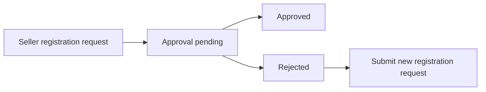

### Seller Account Deletion Restrictions

A seller may delete the account only when there are no pending order items with paid or shipped status.
A seller may delete the account only when there are no pending cancellation requests for the seller's items.
A seller may delete the account only when there are no pending refund requests for the seller's items.
If any pending paid or shipped order item exists, seller account deletion must be rejected.
If any pending cancellation request exists, seller account deletion must be rejected.
If any pending refund request exists, seller account deletion must be rejected.
When a seller account is deleted, the seller's products are removed from listings.
When a seller account is deleted, order history and snapshots remain available for record keeping.
When a seller account is deleted, the shop name used in past orders must remain preserved.

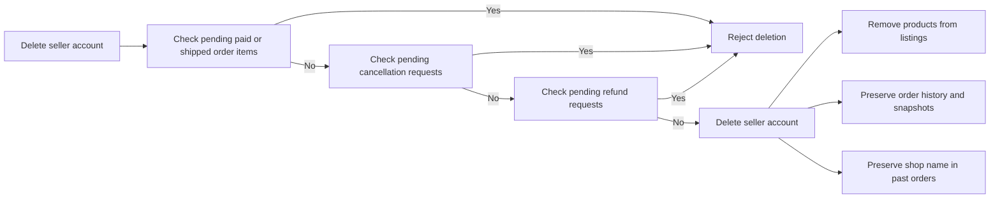

### Suspended Seller Access Restrictions

If a seller account is suspended, the seller must not be able to log in.
If a seller account is suspended, the seller must not be able to create new products.
If a seller account is suspended, the seller must not be able to edit existing products.
If a seller account is suspended, the seller may still process existing orders.
If a seller account is suspended, the seller may still ship items.
If a seller account is suspended, the seller may still respond to cancellation requests.
If a seller account is suspended, the seller may still respond to refund requests.
When a suspended seller is unsuspended, the seller's products become visible again.

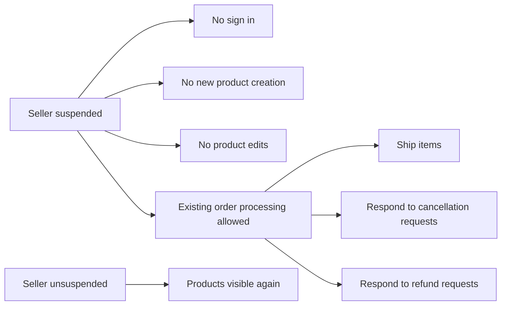

## Administrator Rules

An administrator account is distinct from customer and seller accounts and must support administrative authority over platform records. Any customer or seller may request administrator status, but the request must include a reason and be reviewed by super administrators. Administrator grades are limited to regular administrator and super administrator, and the grade determines whether promotion or demotion rights are available. Super administrators can promote regular administrators and demote other super administrators, but they cannot demote themselves. Administrators are allowed to manage seller approvals, category records, product oversight, and user moderation within the scope assigned to their grade. Administrator account rules must also respect ban and approval restrictions where applicable, so administrative ability depends on being in an active authorized state. The administrator identity is therefore a controlled privilege on top of a user account, not a separate consumer profile. These rules focus on who may hold administrative power and how that power is bounded.

### Administrator Request Reason

A request to become an administrator shall include a reason.
The reason shall be recorded as part of the administrator request and used during super administrator review.
A request without a reason shall be rejected as invalid.
The reason shall be the only required justification specific to the request itself and shall not replace the need for later approval by a super administrator.

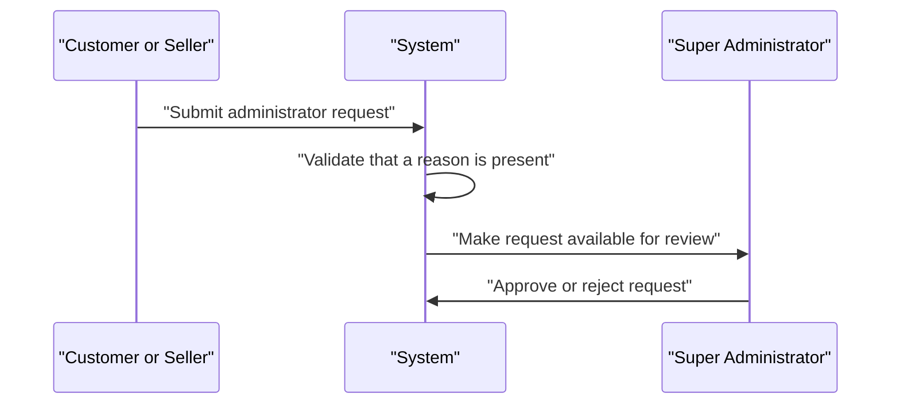

### Regular Administrator Grade

The system shall distinguish regular administrator as a valid administrator grade.
A regular administrator shall have administrative authority, but the grade shall not include the promotion and demotion powers reserved for super administrator.
When a user becomes an administrator through an approved request, the assigned grade shall be regular administrator.
A regular administrator shall remain a regular administrator until changed by a super administrator.

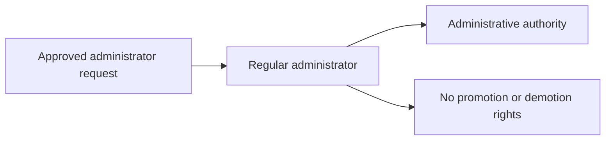

### Super Administrator Grade

The system shall distinguish super administrator as a valid administrator grade.
A super administrator shall have all privileges of a regular administrator and the additional authority to promote and demote other administrators.
A super administrator shall be able to review administrator requests and manage administrator grades within the permitted scope.
The super administrator grade shall be the only grade that can exercise promotion and demotion rights.

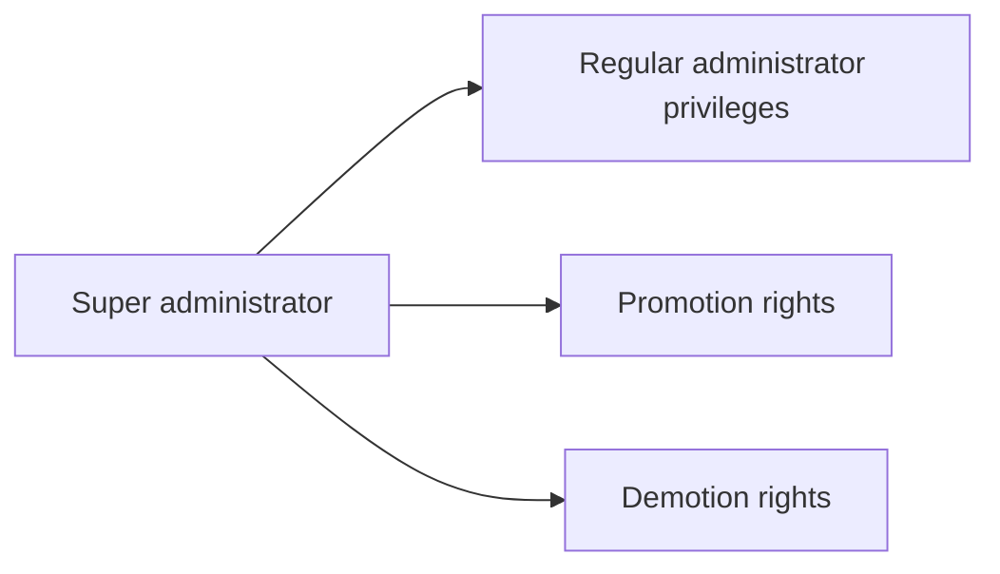

### Administrator Promotion Rights

A super administrator shall be able to promote a regular administrator to super administrator.
Promotion rights shall apply only to administrators who currently hold the regular administrator grade.
A promotion shall change the target administrator's grade from regular administrator to super administrator.
The system shall not allow promotion of a user who is not currently a regular administrator.

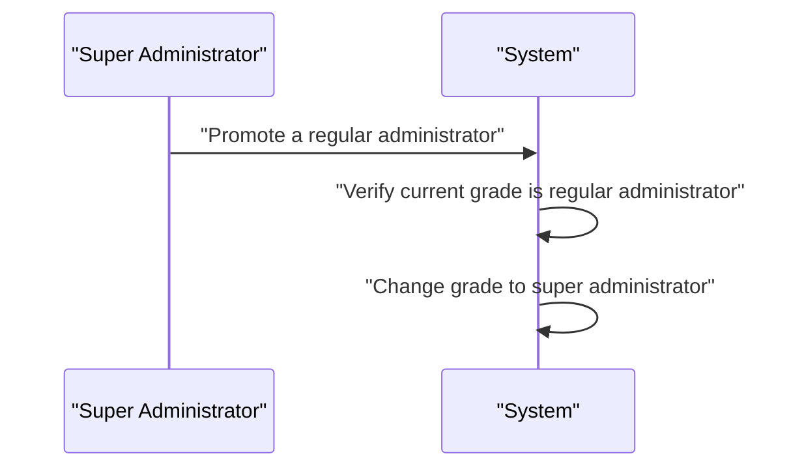

### Administrator Demotion Rights

A super administrator shall be able to demote another super administrator to regular administrator.
Demotion rights shall apply only to administrators who currently hold the super administrator grade.
A demotion shall change the target administrator's grade from super administrator to regular administrator.
The system shall not allow demotion of a user who is not currently a super administrator.

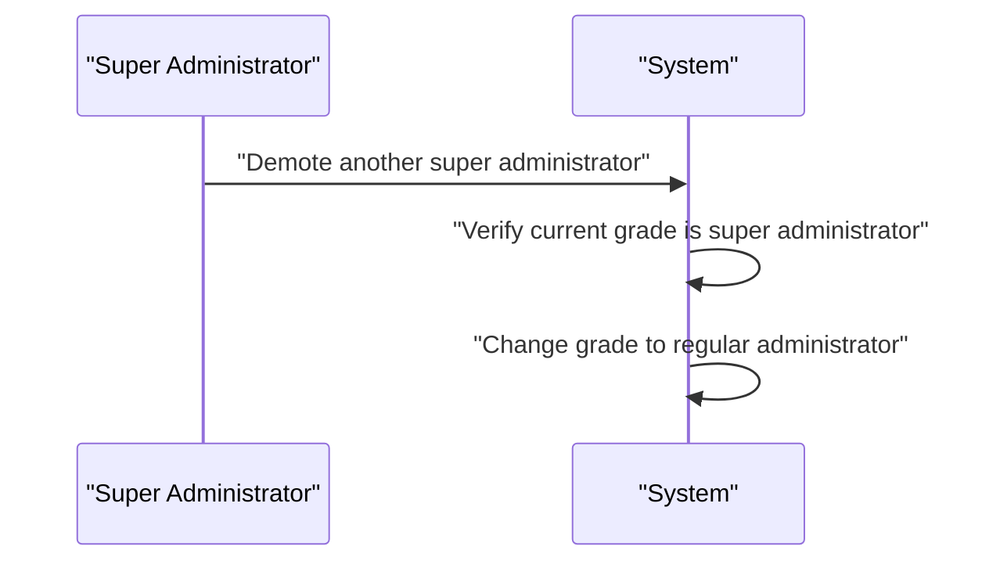

### Self Demotion Prohibited

A super administrator shall not be able to demote themselves.
If the selected target is the acting super administrator, the request shall be rejected.
This prohibition shall apply even when the acting user has otherwise valid demotion rights.
The system shall preserve the acting super administrator's grade when a self-demotion attempt occurs.

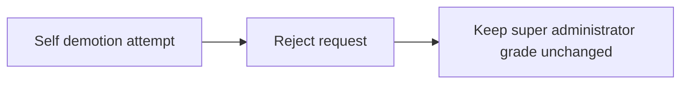

### Seller Approval Management

An administrator shall be able to manage seller approval records.
The system shall allow an administrator to view seller approval status values of pending, approved, and rejected.
The system shall allow an administrator to approve a pending seller approval request.
The system shall allow an administrator to reject a pending seller approval request and record a rejection reason.
A rejected seller approval request shall remain visible so the seller can submit a new registration request, as defined in the seller approval request rules.

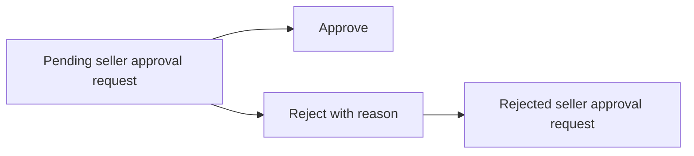

### Product Oversight Authority

An administrator shall be able to view all products on the platform.
An administrator shall be able to view product snapshots for any product.
An administrator shall be able to delete any product when product oversight action is required.
Product oversight authority shall apply across seller-owned products regardless of the seller who created them.
When a product is removed through administrator oversight, the system shall preserve the historical records required by the broader product rules and snapshot rules.

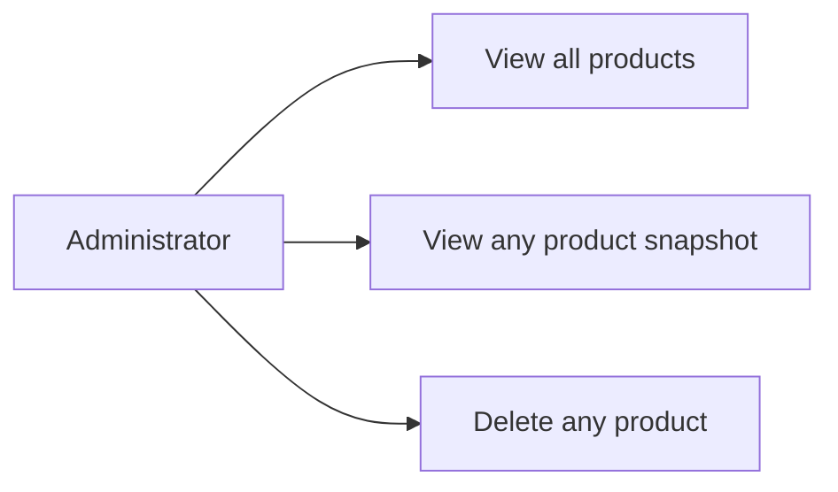

### Category Management Authority

An administrator shall be able to create categories.
An administrator shall be able to edit category names and descriptions.
An administrator shall be able to delete categories.
Category management authority shall apply only to administrators, not to customers or sellers.
When a category is deleted, products assigned to that category shall follow the category handling rule defined in the category rules section.

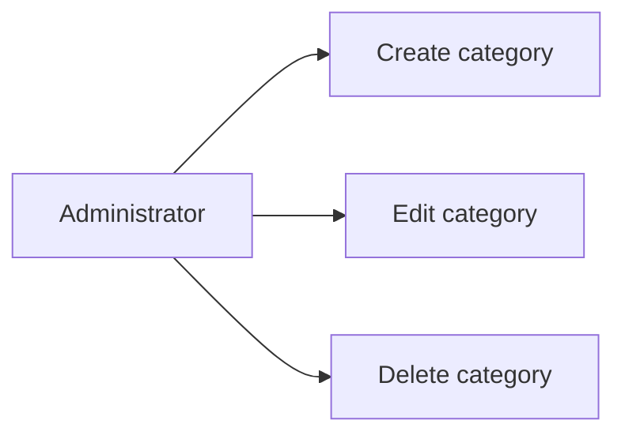

### User Moderation Authority

An administrator shall be able to view customer accounts and seller accounts.
An administrator shall be able to ban customers and unban customers.
An administrator shall be able to ban sellers.
A banned customer shall not be allowed to log in.
A banned seller shall not be allowed to log in, while their existing orders remain subject to the seller rules.
User moderation authority shall apply only to administrator accounts and shall be exercised according to the active status restrictions defined for those accounts.

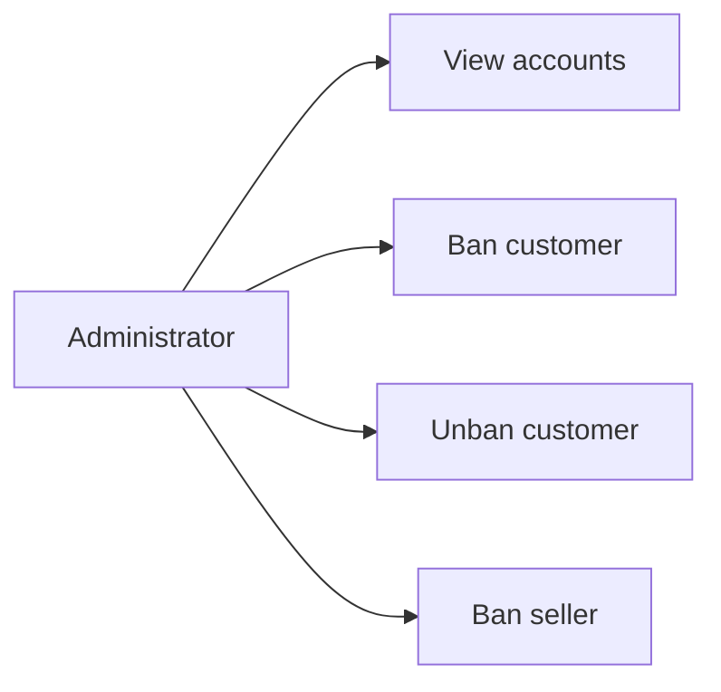

## Profile Rules

A customer profile contains only a display name and a phone number, and those values must be editable by the customer. A seller profile contains shop name, shop description, and logo image, and those values must be editable by the seller. Profile values should stay tied to the owning account type, so customer profile information does not mix with seller shop information. Because this platform preserves snapshots, every profile change must be treated as a meaningful business change that can be reviewed later. Profile data must remain understandable in historical records, especially when a seller profile is captured on an order item snapshot. For sellers, the shop name shown in past orders must remain the value that existed at purchase time even if the live profile changes later. For customers, profile deletion removes the active profile information while preserving related records that need a historical identity reference. The profile rules therefore govern what personal or shop-facing information belongs to each account type and how it can be revised.

### Customer Profile Fields

A customer profile shall contain only a display name and a phone number.
The display name and phone number shall be treated as profile information that belongs to the customer account.
A customer shall be able to update the display name and phone number of their own profile.
A customer profile shall not include seller-facing shop information.
When customer profile information is changed, the previous profile state shall be preserved in snapshot history.

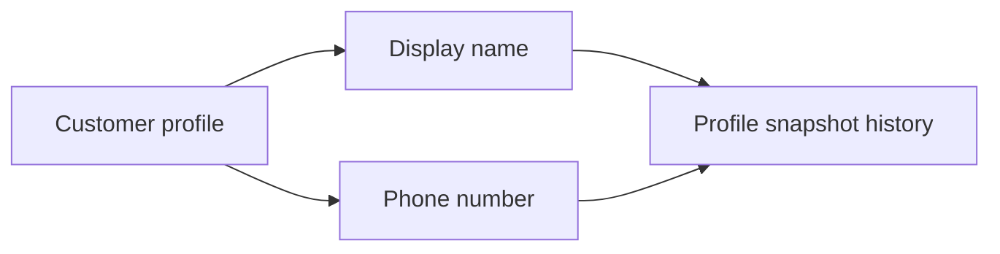

### Seller Shop Profile Fields

A seller profile shall contain a shop name, a shop description, and a logo image.
These values shall represent the seller's shop-facing identity and shall belong to the seller account.
A seller shall be able to update the shop name, shop description, and logo image of their own profile.
A seller profile shall not include customer profile information.
When seller profile information is changed, the previous profile state shall be preserved in snapshot history.

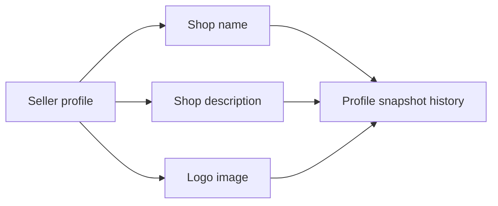

### Owner Editing of Profile Information

THE shoppingMall SHALL allow the owner of a profile to change that profile's editable values.
WHEN a customer updates a customer profile, THE shoppingMall SHALL treat the change as a customer-owned profile change.
WHEN a seller updates a seller profile, THE shoppingMall SHALL treat the change as a seller-owned profile change.
THE shoppingMall SHALL keep customer profile values and seller profile values separate so that an edit to one profile type does not alter the other profile type.
THE shoppingMall SHALL preserve the previous state of a profile whenever the owner changes the display name, phone number, shop name, shop description, or logo image.

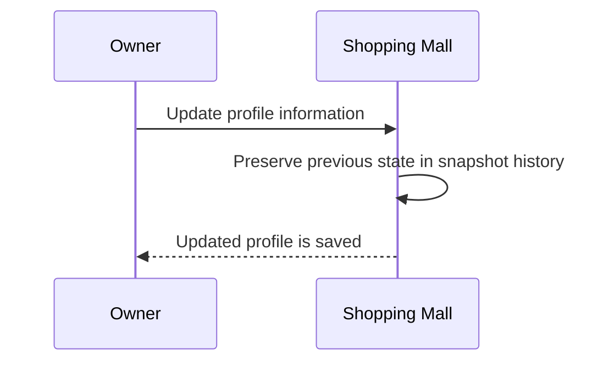

### Profile Snapshot History

A profile snapshot shall record the time the change was made.
A profile snapshot shall record what was changed.
A profile snapshot shall record the values before the change and the values after the change.
Profile snapshots shall be immutable after they are created.
Profile snapshots shall be available for later review when a relevant party needs to resolve a dispute.
Profile snapshot history shall exist for both customer profiles and seller profiles.

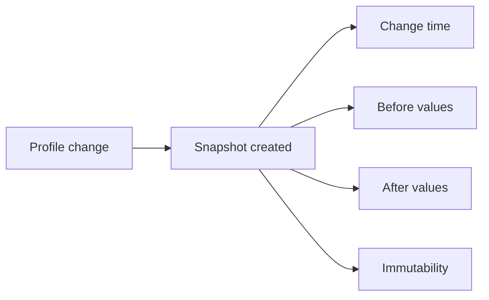

### Historical Profile Reference in Orders

When a seller profile is captured as part of an order item snapshot, the shop name shall remain the value that existed at the time of purchase.
Historical order records shall continue to show the preserved shop name even if the seller later changes the live profile.
The historical profile reference in an order shall support review of the seller identity that was in effect when the purchase occurred.
A customer profile change shall not alter any preserved seller profile values stored in historical order records.

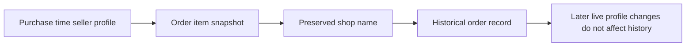

### Customer Profile Deletion

When a customer deletes their account, the active customer profile information shall be deleted.
The deletion of customer profile information shall not remove orders or order history that must be preserved.
The deletion of customer profile information shall not remove reviews that must remain visible as coming from a deleted user.
Customer profile deletion shall remove the living profile record while leaving historical references that are required for preserved records intact.

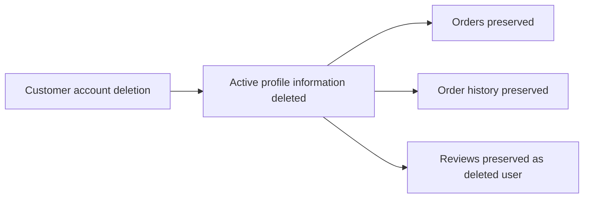

## ShippingAddress Rules

A customer may store multiple shipping addresses under one account. Each shipping address must contain recipient name, phone number, street address, city, state or province, postal code, and country. A customer may edit or delete an address, but the account must keep the address set coherent after changes. Exactly one address may be marked as the default shipping address, so the default choice must never be ambiguous. The default shipping address is a customer preference and can change over time as the customer updates saved addresses. Shipping address data is used for orders, so the rules must keep address information complete enough for delivery use. The shipping address belongs to the customer account and should be treated as part of customer-managed personal delivery data. These rules define the structure and consistency of saved delivery destinations.

### Multiple Shipping Addresses

A customer can save more than one shipping address under the same account.
Each saved address belongs to one customer only and is managed as part of that customer’s delivery destination records.
A customer’s saved addresses are used to support shipment delivery to different locations over time.

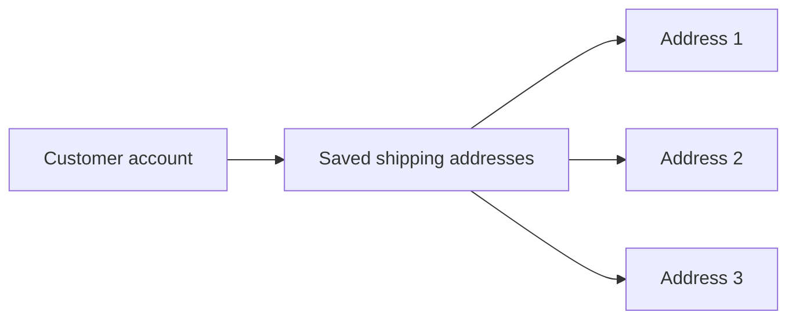

### Required Address Details

Every shipping address must include a recipient name, a phone number, a street address, a city, a state or province, a postal code, and a country.
A shipping address is not complete unless all required delivery details are present.
A customer cannot rely on an incomplete address as a delivery destination.

```mermaid
flowchart LR
    A["Shipping address"] --> B["Recipient name"]
    A --> C["Phone number"]
    A --> D["Street address"]
    A --> E["City"]
    A --> F["State or province"]
    A --> G["Postal code"]
    A --> H["Country"]
```

### Edit Shipping Address

A customer can edit any saved shipping address in their account.
When a shipping address is edited, the updated address must remain complete enough for delivery use.
Editing a shipping address does not change the fact that the address belongs to the same customer.
If the edited address is the default shipping address, it remains the default unless the customer changes the default choice.

```mermaid
sequenceDiagram
    participant C as Customer
    participant S as System
    C->>S: Update a saved shipping address
    S->>S: Check that the address still contains all required delivery details
    S-->>C: Save the updated delivery destination
```

### Delete Shipping Address

A customer can delete a saved shipping address from their account.
When a shipping address is deleted, it is removed from the customer’s list of saved delivery destinations.
If a deleted address was the default shipping address, the customer must still have a clear default choice after the deletion.
Deleting an address must not make the customer’s saved address set ambiguous.

```mermaid
flowchart LR
    A["Saved shipping address"] --> B["Delete address"]
    B --> C["Removed from saved addresses"]
    B --> D["Default choice remains clear"]
```

### Default Shipping Address

A customer can mark one saved shipping address as the default shipping address.
The default shipping address is the customer’s preferred delivery destination when a default is needed.
The default shipping address can change over time as the customer updates saved addresses.
The system must treat the default shipping address as a customer preference, not as a separate kind of address.

```mermaid
flowchart LR
    A["Saved shipping addresses"] --> B["Default shipping address"]
    B --> C["Preferred delivery destination"]
```

### One Default Address Only

A customer can have only one default shipping address at a time.
If the customer sets a different saved address as the default, the previous default stops being the default.
The customer’s default shipping address must never be ambiguous.
If no default has been chosen yet, the account does not have a default shipping address until the customer sets one.

```mermaid
flowchart LR
    A["Address A"] --> B["Default"]
    B --> C["Address B becomes default"]
    C --> D["Address A no longer default"]
```

## SellerProfile Rules

A seller profile contains shop name, shop description, and logo image, and all three pieces of information belong to the merchant presentation layer. Sellers may edit their own profile details, and each edit must be treated as a significant business change. Because the platform preserves snapshots, previous versions of the seller profile must remain available for review. The current seller profile should be the source for storefront presentation, while historical snapshots preserve the version that existed when a customer placed an order. The shop name is especially important because it must remain visible in past orders even if the live profile changes later. The logo image is part of the seller identity and should be handled consistently across profile updates and snapshots. Seller profile rules should not allow mixing another seller’s branding into the profile. These rules preserve both the live seller identity and the historical identity needed for order records and dispute review.

### Shop Name

The seller profile shall include a shop name as part of the seller’s merchant storefront identity.
The shop name shall be the primary public name used to identify the seller storefront.
The shop name used in the current seller profile shall be the source for storefront presentation.
The shop name preserved in historical order records shall remain visible even if the current shop name changes later.
The shop name shall not be allowed to represent another seller’s branding.

### Shop Description

The seller profile shall include a shop description as part of the seller’s merchant storefront identity.
The shop description shall describe the seller storefront for customers viewing the profile.
When a seller edits the shop description, the previous version shall remain available in the profile change history.
The shop description preserved in historical snapshots shall remain available for dispute review.
The shop description shall not be allowed to introduce another seller’s branding into the profile.

### Logo Image

The seller profile shall include a logo image as part of the seller’s merchant storefront identity.
The logo image shall be treated as part of the seller identity shown to customers.
When a seller edits the logo image, the previous version shall remain available in the profile change history.
The logo image preserved in historical snapshots shall remain available for dispute review.
The logo image shall remain consistent with the seller’s own branding and shall not be replaced with another seller’s branding.

### Seller Profile Edit

A seller shall be able to edit the shop name, shop description, and logo image in the seller profile.
When any seller profile field is edited, the system shall treat the change as a significant business change.
When any seller profile field is edited, the system shall preserve the previous state in a snapshot.
The live seller profile shall reflect the most recent approved profile values after the edit.
Seller profile edits shall affect only the seller’s own merchant storefront identity.

### Seller Profile Snapshot

Every seller profile edit shall create a snapshot of the previous seller profile state.
A seller profile snapshot shall record what changed, the values before the change, and the values after the change.
A seller profile snapshot shall preserve the seller’s profile change history for later review.
A seller profile snapshot shall be immutable and shall not be deleted.
Relevant parties shall be able to view seller profile snapshots for dispute resolution.

### Historical Seller Identity

The system shall preserve the seller’s historical identity when the seller profile changes over time.
Historical seller identity shall remain available for orders that were created before the profile change.
The shop name and logo image preserved at the time of purchase shall continue to represent the seller identity in past order records.
Historical seller identity shall support dispute review by showing the seller profile state that existed at the relevant time.
The current seller profile shall not replace the historical seller identity stored with past records.

### Shop Name in Past Orders

The shop name preserved with past orders shall remain visible even if the seller later changes the live shop name.
Past orders shall continue to show the shop name that was current when the order item was purchased.
The preserved shop name in past orders shall not be overwritten by later profile edits.
This rule shall ensure that order records keep a stable seller reference for seller records and legal purposes.

### Merchant Storefront Identity

The seller profile shall define the merchant storefront identity shown to customers.
The merchant storefront identity shall consist of the shop name, shop description, and logo image.
These profile values shall present one consistent storefront identity for the seller.
The merchant storefront identity shall be kept separate from any other seller’s branding.
Customers shall view the seller profile as the authoritative public storefront identity.

### Profile Change History

The system shall preserve profile change history whenever a seller profile field is modified.
Profile change history shall retain the previous seller profile state instead of replacing it.
Profile change history shall support review of the seller profile version that existed at a prior point in time.
Profile change history shall remain available for dispute resolution.
Profile change history shall include changes to the shop name, shop description, and logo image.

### Seller Branding Consistency

The seller profile shall maintain consistent branding across all profile changes.
When the shop name, shop description, or logo image is edited, the updated profile shall continue to represent the same seller storefront.
The system shall prevent the seller profile from mixing branding from another seller.
Historical snapshots shall preserve the branding that existed before each change.
Past order records shall continue to show the preserved seller branding that applied at the time of purchase.

## Category Rules

Categories organize products into a browsable structure, and each category has a name and description. Categories may have subcategories, but only one level of nesting is allowed, so deeper hierarchies are not valid. Category records are managed by administrators only, which means ordinary customers and sellers cannot change category definitions. A product may belong to a category or subcategory, and category rules must allow products to be categorized accordingly. If a category is removed, products in that category become uncategorized rather than disappearing from the platform. Customers can still browse category groupings, so category naming and descriptions should remain clear and meaningful. The category structure must stay simple enough for shopping navigation while still supporting subcategory organization. These rules define how product grouping is named, nested, and maintained over time.

### Category Name and Description

A category shall have a name and a description as its defining business information.
The category name shall be used to identify the category in browsing and management contexts.
The category description shall be used to explain what kinds of products belong in the category.
Category names and descriptions shall remain understandable to customers when they browse the platform’s category structure.

### One-Level Subcategory Structure

A category may contain subcategories, but only one level of nesting is allowed.
A subcategory shall belong directly to a parent category.
A category shall not contain a subcategory that itself contains another subcategory.
The category structure shall reject deeper nesting beyond one level.
The browsing structure shall reflect only top-level categories and their direct subcategories.

```mermaid
flowchart LR
    A["Category"] --> B["Subcategory"]
    B --> C["Deeper nesting not allowed"]
```

### Administrator-Managed Category Maintenance

Category creation, category changes, and category removal shall be managed by administrators only.
Customers and sellers shall not be able to create, edit, or delete categories.
Category management shall preserve a clear and controlled organization of products across the platform.
If a non-administrator attempts to manage a category, the action shall be rejected.

### Product Category Assignment

A product shall be assigned to a category as part of its organization on the platform.
A product may be assigned to either a top-level category or a direct subcategory.
Category assignment shall support product browsing by grouping products under the appropriate category branch.
A product shall not be assigned to a category structure that exceeds the one-level subcategory limit.

### Uncategorized Products After Category Deletion

If a category is deleted, products that were assigned to that category shall not be removed from the platform.
Instead, those products shall become uncategorized.
Uncategorized products shall remain available for browsing through product listings and other product discovery paths that do not depend on category assignment.
Category deletion shall therefore change product organization without deleting the products themselves.

### Category Browsing Structure

Customers shall be able to browse categories as an organized structure for shopping navigation.
The browsing structure shall present categories in a way that makes parent categories and their direct subcategories easy to understand.
Products shall be grouped according to their assigned category when customers browse category listings.
The category organization shall remain simple enough to support navigation while still allowing subcategory grouping.

### Nested Category Limit

The platform shall enforce a maximum of one level of subcategory nesting.
A category may have direct subcategories, but those subcategories shall not contain further nested categories.
Any category arrangement that attempts to extend beyond one subcategory level shall be considered invalid.
This limit shall keep category organization consistent across the platform.

### Category Organization and Removal Effect on Products

Category organization shall be based on clear parent-child grouping between a category and its direct subcategories.
When a category is removed, products previously assigned to it shall remain on the platform and shall be treated as uncategorized.
Category removal shall not remove product records from shopping access.
The platform shall preserve product availability while updating category organization after deletion.

```mermaid
flowchart LR
    A["Category deleted"] --> B["Products become uncategorized"]
    B --> C["Products remain available on the platform"]
```

## Product Rules

A product belongs to the seller who created it and cannot be treated as a shared merchant asset. Every product must have a name, description, category, and base price, so incomplete products are not valid. Sellers may edit only their own products, and product changes must be eligible for snapshot tracking because the platform preserves monetary history. A product may be assigned to a category or subcategory, and the category choice must remain consistent with the category structure rules. A product must have at least one variant to be purchasable, so a product without variants is only considered unavailable rather than sellable. Products with no variants may still appear in search, but they should be presented as unavailable to buyers. Sellers can delete their own products only when no pending paid or shipped order items exist for any variant and no pending cancellation or refund requests exist. Product deletion removes the product from listings and also removes its variants and inventory records, while historical snapshots remain preserved. These rules define when a product is complete, sellable, editable, and removable.

### Product Ownership

A product belongs to the seller who created it and is not shared across sellers.
A seller may manage only the products they own.
A product's ownership must remain associated with that seller until the product is deleted.

```mermaid
flowchart LR
    A["Seller"] --> B["Owns Product"]
    B --> C["Product Managed by Same Seller"]
```

### Required Product Information

A product is valid only when it has a name, description, category, and base price.
A product with any of these required values missing is incomplete and must not be treated as a valid sellable product.
The category requirement may be satisfied by a category or a subcategory, as long as it follows the category structure rules.

If any required product information is missing, the product is considered invalid until the missing information is provided.

### Product Editability

A seller may edit only the products they own.
When a product is edited, the change must be eligible for snapshot recording because the platform preserves changes to money-related data.
Product edits must continue to respect the product requirements for name, description, category, and base price.

A seller cannot rely on another seller's product as editable stock or a shared listing.

### Variant Requirement and Availability

A product must have at least one variant to be purchasable.
If a product has no variants, it is not sellable and must be treated as unavailable to buyers.
Products with no variants may still appear in search results, but they must be shown as unavailable rather than purchasable.
A product that has variants becomes purchasable only when at least one variant exists.

```mermaid
flowchart LR
    A["Product"] --> B["Has Variants?"]
    B -->|"Yes"| C["May Be Purchasable"]
    B -->|"No"| D["Unavailable"]
```

### Product Deletion Conditions

A seller may delete only their own product.
A product can be deleted only when there are no pending paid or shipped order items for any of its variants.
A product can be deleted only when there are no pending cancellation requests or pending refund requests for any of its variants.
If either active order items or pending request work remains, the product must not be deleted.

When a product is deleted, it is removed from listings, and its variants and inventory records are also removed.
A deleted product must no longer appear in search or category listings.

```mermaid
flowchart LR
    A["Delete Product Request"] --> B["Owned by Seller?"]
    B -->|"Yes"| C["Any Pending Paid or Shipped Items?"]
    C -->|"No"| D["Any Pending Cancellation or Refund Requests?"]
    D -->|"No"| E["Product Can Be Deleted"]
    C -->|"Yes"| F["Deletion Not Allowed"]
    D -->|"Yes"| F
```

### Product Snapshot Preservation

Every product edit must create a snapshot of the previous state.
A product snapshot must preserve the complete product state, including the product's name, description, category, base price, and images.
When a product is edited, the snapshot must preserve the earlier values before the change and the values after the change.
Product snapshots are immutable and cannot be deleted.
Product snapshots remain preserved even after the product itself has been deleted.
Sellers may view snapshots of their own products, and administrators may view snapshots of any product.

Snapshots are part of the platform's record of monetary history and dispute resolution.

## ProductVariant Rules

A product may contain multiple variants, and each variant represents one specific option combination such as color and size. Every variant must have a unique SKU code, option values, and a stock quantity, and the variant price may override the product base price. Stock quantity starts at zero, so a newly created variant is not assumed to be in stock until inventory is added. Sellers may edit the SKU code, option values, and price for their own variants, and these edits must be captured in snapshots. A variant may be deleted only when no pending paid or shipped order items exist for that variant and no pending cancellation or refund requests exist. Products without any variants are not purchasable, so variant presence is a business requirement for sale readiness. If a variant reaches zero stock, it is treated as out of stock and cannot be added to the cart. These rules govern the identity, pricing, and sellability of each product option combination.

### Variant Option Combination

A product variant represents one specific combination of product options such as color, size, or other selectable characteristics.
The option values for a variant must together describe a single, distinct purchasable choice within the product.
Two variants of the same product must not represent the same option combination.
A product variant is identified by its option combination in the context of that product, not by the product itself alone.

```mermaid
flowchart LR
    A["Product"] --> B["Variant with one option combination"]
    A --> C["Variant with a different option combination"]
    B --> D["Distinct purchasable choice"]
    C --> D
```

### Unique SKU Code

Every product variant must have a unique SKU code.
The SKU code must identify that variant as a distinct business record within the platform.
No two variants may share the same SKU code.
If a seller edits a variant, the SKU code may be changed, but the resulting SKU code must still remain unique.
A variant cannot be treated as valid for sale if its SKU code is duplicated with another variant.

```mermaid
flowchart LR
    A["Variant"] --> B["SKU code"]
    B --> C["Must be unique across variants"]
    C --> D["Distinct variant identity"]
```

### Option Values

Each product variant must store option values that describe the selected combination for that variant.
Option values belong to the variant and are part of the information that distinguishes one variant from another.
When a seller edits a variant, the option values may be updated to reflect the variant's current combination.
Option values must remain consistent with the product option choices that the variant is meant to represent.

```mermaid
flowchart LR
    A["Product option choices"] --> B["Variant option values"]
    B --> C["Describe one combination"]
    C --> D["Variant identity within the product"]
```

### Variant Price Override

A product variant may have its own price that overrides the product base price.
When a variant has a variant price, that price is the value used for that variant instead of the base price.
When a variant does not have its own price, the product base price remains the price reference for that variant.
A variant price is part of the editable variant information and is included in variant snapshots.

```mermaid
flowchart LR
    A["Product base price"] --> B["Variant price override"]
    B --> C["Variant-specific price used for that variant"]
    A --> D["Used when no override is set"]
```

### Starting Stock Zero

A newly created product variant starts with a stock quantity of zero.
A stock quantity of zero means the variant is not assumed to be available for purchase until inventory is added.
This starting condition applies before any inventory record increases the stock quantity.
The initial zero stock state is part of the variant's business rules and does not depend on product creation.

```mermaid
flowchart LR
    A["New variant created"] --> B["Stock quantity starts at zero"]
    B --> C["Inventory added later"]
    C --> D["Variant can become available"]
```

### Variant Edit Snapshot

Every edit to a product variant must create a snapshot of the previous state.
The snapshot must preserve the changed variant information before and after the edit.
Variant edits include changes to the SKU code, option values, and variant price.
Snapshots are part of the change history and must be preserved even after later edits.

```mermaid
sequenceDiagram
    participant S as Seller
    participant V as Variant
    participant P as Snapshot
    S->>V: Edit variant information
    V->>P: Record before and after values
    P-->>V: Preserve change history
```

### Variant Deletion Conditions

A seller may delete a product variant only when there are no pending order items for that variant with paid or shipped status.
A seller may delete a product variant only when there are no pending cancellation requests for that variant.
A seller may delete a product variant only when there are no pending refund requests for that variant.
If any of those conditions is not met, the variant cannot be deleted.
These deletion conditions protect active purchase and after-sale records from being removed too early.

```mermaid
flowchart LR
    A["Variant deletion requested"] --> B{"Any paid or shipped order items?"}
    B -->|"Yes"| H["Deletion not allowed"]
    B -->|"No"| C{"Any pending cancellation requests?"}
    C -->|"Yes"| H
    C -->|"No"| D{"Any pending refund requests?"}
    D -->|"Yes"| H
    D -->|"No"| E["Deletion allowed"]
```

### Product Purchasable Requirement

A product must have at least one variant before it can be purchased.
If a product has no variants, it is not considered purchasable.
A product without variants may still be visible in search, but it is treated as unavailable for purchase.
This rule makes variant presence a minimum condition for sale readiness.

```mermaid
flowchart LR
    A["Product"] --> B{"Has at least one variant?"}
    B -->|"No"| C["Not purchasable"]
    B -->|"Yes"| D["May be purchasable"]
```

### Out of Stock Variant

When a variant's stock quantity reaches zero, the variant is treated as out of stock.
An out of stock variant cannot be added to the cart.
Out of stock status reflects the current sellability of the variant based on available stock.
If stock is restored later through inventory changes, the variant may no longer be out of stock.

```mermaid
flowchart LR
    A["Variant stock quantity"] --> B{"Equals zero?"}
    B -->|"Yes"| C["Out of stock"]
    B -->|"No"| D["In stock"]
    C --> E["Cannot be added to cart"]
```

### Variant Sellability

A product variant is sellable only when it has a valid unique SKU code, a defined option combination, and stock greater than zero.
A variant with zero stock is not sellable.
A variant that is being deleted under the deletion conditions defined in this section is no longer available for sale.
Variant sellability is determined by the combination of its identity, option values, and current stock state.

```mermaid
flowchart LR
    A["Variant state"] --> B{"Unique SKU and option values defined?"}
    B -->|"No"| F["Not sellable"]
    B -->|"Yes"| C{"Stock greater than zero?"}
    C -->|"No"| F
    C -->|"Yes"| D{"Deletion conditions satisfied?"}
    D -->|"No"| E["Sellable"]
    D -->|"Yes"| F["Not sellable"]
```

## ProductImage Rules

A product may contain multiple images, and those images are part of the product presentation set. The image order matters because the first image is the main thumbnail shown in product listings. Sellers may change the image order and may remove images from their own products. Because product snapshots preserve the full state of a product, image changes must be included in the product history. Product image rules must keep the image set associated with the correct product so the storefront remains visually accurate. A product should still be understandable if images are updated, but the historical record must preserve earlier image arrangements. The image set is not separate from the product identity; it contributes to how customers see and compare products. These rules define how product visuals are maintained and recorded.

### Product Image Set

A product may contain multiple images, and the images together form the product image set.
The image set belongs to the product and must remain associated with that product unless the product itself is deleted.
Sellers can manage the image set for their own products.
Customers see the product image set as part of the product’s visual presentation.

### Main Thumbnail Image

The first image in the product image set is the main thumbnail image.
The main thumbnail image is the image used to represent the product in product listings.
When the order of images changes, the main thumbnail image changes to match the new first image.
If the first image is removed, the next image in the order becomes the main thumbnail image.

### Image Ordering and Reordering

The images in a product image set must have an order that can be changed by the seller.
Sellers can reorder the images in their own products.
Reordering images changes the visual presentation of the product for customers without changing which product the images belong to.
The product image order preserved in history must reflect the order that existed at the time the change was made.

### Delete Product Image

Sellers can delete images from their own products.
When an image is deleted, it is removed from the current product image set.
If the deleted image was the main thumbnail image, the next remaining image becomes the main thumbnail image.
A product image deletion must not remove the product itself.

### Image Changes in Snapshot

Any change to a product image set must be captured in the product snapshot history.
The snapshot must preserve the previous image state before the change and the updated image state after the change.
The snapshot must allow reviewers to see which image was added, removed, or reordered.
Historical image state must remain available for dispute resolution even after the current image set changes.

## InventoryRecord Rules

Each product variant has its own inventory history, and stock is determined by the sum of all inventory records. An inventory record must carry a quantity change, a reason, and a timestamp so that stock movements can be understood later. Positive changes represent restocking, while negative changes represent orders or adjustments and losses. Inventory records are separate from snapshots because they track stock movement rather than editable object history. Sellers can manage restocking and stock adjustments through inventory records, and the platform must keep the reason visible for audit purposes. Order placement and item cancellation or refund must also be reflected in inventory history so that stock movement remains consistent with business events. When current stock reaches zero, the associated variant is considered out of stock. These rules define how inventory changes are documented and how current stock remains trustworthy.

### Inventory History Record

Each inventory history record must describe a single stock movement for one product variant.
The system shall require every inventory history record to include a quantity change, a reason, and a timestamp so that the movement can be understood later.
The quantity change shall record how much stock was added or removed for that movement.
A restocking action shall be recorded as a positive inventory change.
An adjustment or loss shall be recorded as a negative inventory change.
The reason shall explain why the stock movement happened, including whether it was a restocking reason or an adjustment reason.
The timestamp shall show when the stock movement was recorded.
Current stock shall be calculated by summing all inventory history records for the variant, including both positive and negative changes.
When the calculated current stock reaches zero, the associated variant shall be considered out of stock.
The system shall treat inventory history as an audit trail for stock movement so that past stock changes can be reviewed in order.
Inventory history records shall remain visible as part of the stock audit trail and shall not be replaced by later stock changes.
The inventory audit trail shall allow relevant parties to understand how current stock was reached over time.

```mermaid
flowchart LR
    A["Stock movement occurs"] --> B["Inventory history record is created"]
    B --> C["Quantity change is stored"]
    B --> D["Reason is stored"]
    B --> E["Timestamp is stored"]
    B --> F["Current stock is recalculated"]
    F --> G["Stock is above zero"]
    F --> H["Variant is out of stock"]
```

## Wishlist Rules

A wishlist is a customer-curated list of products, not specific product variants. Customers may add and remove products from their wishlist, and the wishlist should preserve only product-level interest. Because the wishlist is tied to customer preference, it should allow multiple products to be saved without requiring purchase selection. If a seller deletes a product, that product must no longer remain in wishlists because the item no longer exists as a valid product choice. Wishlist rules should therefore tolerate product removal from the platform and keep the saved list coherent. The wishlist is a browsing and comparison aid rather than a commitment to buy. These rules define what can be saved, how it is represented, and when it must disappear from the customer’s saved list.

### Wishlist Rules

Customers can save products to a personal wishlist as a way to express product interest for later browsing and comparison.
A wishlist contains products only and does not store specific product variants.
A wishlist is a customer-curated saved list, and each saved item represents interest in the product as a whole rather than a purchase-ready selection.
Customers can remove any saved product from their wishlist.
If a product is deleted from the platform, the system automatically removes that product from all wishlists so the saved list remains coherent.
The wishlist is intended as a browsing aid and comparison preference list, not as a commitment to buy.
The wishlist must remain consistent when products are no longer available, so customers do not continue to see deleted products as saved items.

Mermaid diagram:
```mermaid
flowchart LR
    A["Customer saves product"] --> B["Product appears in wishlist"]
    B --> C["Customer reviews saved products"]
    C --> D["Customer removes product"]
    B --> E["Product deleted from platform"]
    E --> F["System removes product from all wishlists"]
```

## Cart Rules

A cart belongs to a customer and must contain variant-based purchase selections rather than product-level placeholders. The cart can hold multiple items, and the same variant should be combined into one cart item instead of being duplicated. Each cart item contributes to the cart total, so quantity and price consistency are important business rules. Customers may change quantities and remove items, and the cart must remain accurate after each change. If a variant is deleted or becomes out of stock, it must be marked as unavailable in the cart so the customer can see that it can no longer be purchased. If stock is lower than the quantity in the cart, a warning should be visible because the requested amount may not be fully available. The cart total is derived from the current item set and should reflect the active selections only. These rules govern how selected variants are collected before checkout.

### Customer Cart

Customers have a cart that belongs to their account and stores selected product variants for later purchase.
A cart contains purchase selections only after a specific variant has been chosen.
A cart does not store product-level placeholders.
A cart remains tied to the customer who created it and reflects that customer's selected items only.

```mermaid
flowchart LR
    A["Customer"] --> B["Cart"]
    B --> C["Variant-based selection"]
    C --> D["Cart item"]
    D --> E["Cart total price"]
```

### Variant-Based Selection

A cart item must represent one specific product variant.
Customers cannot add a product to the cart unless they have selected a variant.
If a product has multiple variants, the cart item must preserve the chosen variant options so the selected purchase item is unambiguous.
If a product has no purchasable variant, it cannot be added to the cart as a purchase selection.

```mermaid
flowchart LR
    A["Product"] --> B["Variant selection"]
    B --> C["Cart item"]
    C --> D["Purchase selection"]
```

### Combine Same Variant Quantities

If the same variant is added to the cart more than once, the cart combines the quantities into a single cart item instead of creating duplicate items.
The combined cart item must continue to represent the same variant.
The quantity shown for that cart item must reflect the full combined amount.
This rule keeps the cart item set accurate and prevents the same variant from appearing as separate lines.

```mermaid
flowchart LR
    A["Same variant added again"] --> B["Combine quantities"]
    B --> C["Single cart item"]
```

### Cart Item Quantity

Each cart item has a quantity that represents how many units of the selected variant the customer intends to buy.
The cart item quantity must be kept consistent with the selected variant and its price.
The subtotal for a cart item is derived from its quantity and the variant price.
If a cart item quantity changes, the cart item subtotal must change accordingly.

```mermaid
flowchart LR
    A["Variant price"] --> B["Cart item quantity"]
    B --> C["Cart item subtotal"]
```

### Cart Total Price

The cart total price is calculated from the current set of active cart items.
Only cart items that remain available for purchase contribute to the cart total price.
If a cart item is marked unavailable, it does not count toward the cart total price for purchase purposes.
When quantities change or items are removed, the cart total price must be updated to reflect the remaining active items.

```mermaid
flowchart LR
    A["Active cart items"] --> B["Cart total price"]
    C["Unavailable cart item"] -.-> B
```

### Change Cart Quantity

Customers can change the quantity of a cart item.
When the quantity is changed, the cart must continue to represent the same variant in that item.
The updated quantity must be reflected in the cart item subtotal and the cart total price.
If the quantity is increased or reduced, the cart must remain accurate after the change.

```mermaid
flowchart LR
    A["Customer changes quantity"] --> B["Cart item quantity updates"]
    B --> C["Cart item subtotal updates"]
    C --> D["Cart total price updates"]
```

### Remove Cart Item

Customers can remove a cart item from their cart.
When a cart item is removed, it no longer contributes to the cart total price.
If the removed item was the only item for that variant, the variant is no longer represented in the cart.
Removing an item must leave the cart accurate for the remaining selections.

```mermaid
flowchart LR
    A["Cart item"] --> B["Remove item"]
    B --> C["Remaining cart items"]
    C --> D["Updated cart total price"]
```

### Unavailable Cart Item

If a variant is deleted, the corresponding cart item must be marked as unavailable.
If a variant becomes out of stock, the corresponding cart item must be marked as unavailable.
An unavailable cart item remains visible so the customer can see that the selected variant can no longer be purchased.
An unavailable cart item cannot be treated as a valid purchase selection.

```mermaid
flowchart LR
    A["Variant deleted"] --> C["Unavailable cart item"]
    B["Variant out of stock"] --> C
    C --> D["Cannot purchase"]
```

### Out of Stock Warning

If the available stock for a variant is less than the quantity in the cart, a warning must be shown for that cart item.
The warning indicates that the requested amount may not be fully available.
A warning does not change the selected quantity by itself.
A warning exists to inform the customer before checkout that the cart quantity is higher than current availability.

```mermaid
flowchart LR
    A["Stock lower than cart quantity"] --> B["Out of stock warning"]
    B --> C["Customer review before checkout"]
```

### Cart Purchase Selection

The cart serves as the customer's purchase selection area before checkout.
Only variant-based selections are valid purchase selections in the cart.
Unavailable cart items are not valid purchase selections.
Cart items with warnings may remain in the cart, but the customer must review them before they are treated as ready for purchase.
The cart must always reflect the current set of selections the customer intends to buy.

```mermaid
flowchart LR
    A["Cart"] --> B["Valid purchase selections"]
    C["Unavailable cart item"] -.-> B
    D["Warning item"] --> B
```

## CartItem Rules

A cart item represents one specific product variant selected by the customer. It must carry the chosen quantity and contribute to the subtotal for the cart. Cart item information should display the product name, the variant options, the price, the quantity, and the subtotal so the customer can review what is being purchased. If the same variant is added again, the quantities are combined into the existing cart item rather than creating a second line. A cart item must stay consistent with the selected variant because the cart is built around variant-specific purchasing. If the related variant becomes unavailable or out of stock, the cart item must be treated as unavailable even if it remains visible. The cart item rules therefore focus on one line of purchasable intent and its pricing consistency. These rules keep each selected variant clear, countable, and ready for checkout review.

### Single Variant Line Item

A cart item SHALL represent one purchase intent line for one selected product variant.
A cart item SHALL refer to a specific product variant rather than a product in general.
If the customer selects a different variant, the system SHALL treat it as a different cart item line.
A cart item SHALL remain tied to the selected variant for the purpose of cart review and checkout.

```mermaid
flowchart LR
    A["Selected product variant"] --> B["Cart item line"]
    B --> C["Quantity"]
    B --> D["Subtotal"]
    B --> E["Review details"]
```

### Cart Item Quantity

A cart item SHALL store the quantity chosen by the customer for the selected variant.
If the customer changes the quantity of a cart item, the system SHALL update that same cart item line.
If the customer adds the same variant again, the system SHALL combine the quantities into the existing cart item line.
A cart item quantity SHALL be shown to the customer as part of cart review details.

```mermaid
flowchart LR
    A["Add same variant again"] --> B["Combine quantities"]
    B --> C["Single cart item line"]
    C --> D["Updated quantity"]
```

### Cart Item Subtotal

A cart item SHALL contribute a subtotal based on the selected variant price and the cart item quantity.
A cart item subtotal SHALL be shown to the customer as part of cart review details.
If the quantity changes, the cart item subtotal SHALL change accordingly.
If the selected variant price changes, the cart item price shown in the cart SHALL remain consistent with the price recorded for that cart item line until the cart item is updated or re-evaluated by the cart rules.

```mermaid
flowchart LR
    A["Variant price"] --> C["Cart item subtotal"]
    B["Cart item quantity"] --> C["Cart item subtotal"]
    C --> D["Cart total review"]
```

### Variant Options Display

A cart item SHALL display the selected variant options so the customer can identify the exact item being purchased.
The displayed variant options SHALL match the selected product variant.
Variant options SHALL appear together with the product name, price, quantity, and subtotal in cart review details.

```mermaid
flowchart LR
    A["Selected product variant"] --> B["Variant options display"]
    B --> C["Cart review details"]
```

### Duplicate Variant Combination

If the same product variant is added more than once, the system SHALL combine it into one cart item line.
The system SHALL not create a second cart item line for the same selected variant.
The combined cart item line SHALL keep one set of review details for that variant and SHALL update the quantity and subtotal to reflect the combined amount.

```mermaid
flowchart LR
    A["Same variant added again"] --> B["Combine into existing cart item"]
    B --> C["One cart item line"]
    C --> D["Updated quantity and subtotal"]
```

### Unavailable Cart Line

If the related variant becomes unavailable or out of stock, the cart item SHALL be treated as an unavailable cart line.
An unavailable cart line SHALL remain identifiable in the cart review details.
An unavailable cart line SHALL not be treated as ready for purchase until the variant becomes available again.
The cart item SHALL continue to show the selected variant options, product name, price, quantity, and subtotal so the customer can review what changed.

```mermaid
flowchart LR
    A["Variant becomes unavailable"] --> B["Cart item marked unavailable"]
    B --> C["Still visible in cart review"]
    B --> D["Not ready for purchase"]
```

### Cart Item Review Details

Cart item review details SHALL include the product name, selected variant options, price, quantity, and subtotal.
Cart item review details SHALL allow the customer to confirm the exact purchase intent line before checkout.
Cart item review details SHALL reflect the current state of the cart item, including whether the line is unavailable.
Cart item review details SHALL stay focused on the selected variant and SHALL not represent multiple variants in one line.

```mermaid
flowchart LR
    A["Product name"] --> E["Cart item review details"]
    B["Variant options"] --> E["Cart item review details"]
    C["Price"] --> E["Cart item review details"]
    D["Quantity and subtotal"] --> E["Cart item review details"]
```

## Order Rules

An order contains one or more order items, and the order may include items from different sellers. The order number and date identify the purchase record, and the total price summarizes the whole transaction. An order should reflect the combined business result of its items, so its overall status is derived from the item statuses. The order structure must preserve shipping address details selected at purchase time, because that address cannot change after placement. Once an order exists, it becomes a historical business record that supports customer order history and seller records. Orders must remain available for legal and dispute purposes even when the customer account is deleted. Because snapshots are preserved with order items, the order record must support historical product and seller identity references. These rules define the order as a stable purchase record built from multiple item-level outcomes.

### Order Identification and Purchase Summary

An order must always be identifiable by its order number and order date.
An order must summarize the full transaction through its total price.
An order must contain one or more order items.
An order may include order items from multiple sellers.
The order number, order date, and total price together must describe the completed purchase record in a way that supports later review and reference.

```mermaid
flowchart LR
    A["Order"] --> B["Order Number"]
    A --> C["Order Date"]
    A --> D["Order Total Price"]
    A --> E["One or More Order Items"]
    E --> F["Multiple Sellers Allowed"]
```

### Order as a Historical Purchase Record

An order must remain a historical purchase record after it has been created.
An order must preserve the purchase context needed for later customer order history and seller records.
An order must remain available for legal record retention even if the customer account is deleted.
The preserved order record must continue to represent the completed transaction, not the customer account.
The preserved record must support later review of the transaction without depending on the current customer profile.


### Shipping Address Locked at Purchase

The shipping address selected at the time of purchase becomes part of the order record.
Once an order is placed, the shipping address must be locked and must not be changeable.
The stored shipping address must reflect the address used for the purchase, even if the customer later edits or deletes addresses in their account.
This rule ensures that the order continues to show the original delivery destination used when the purchase was completed.


### Overall Order Status Derived From Order Items

The overall order status must be derived from the statuses of the order items.
If all order items are paid, the overall order status must be paid.
If any order item is shipped and no order item is delivered yet, the overall order status must be shipped.
If all order items are delivered, the overall order status must be delivered.
If all order items are cancelled, the overall order status must be cancelled.
If all order items are refunded, the overall order status must be refunded.
If the order items are in mixed states that do not fit a single completed outcome, the overall order status must be partially completed.

```mermaid
flowchart LR
    A["Order Items All Paid"] --> B["Paid"]
    C["Any Item Shipped and None Delivered Yet"] --> D["Shipped"]
    E["All Items Delivered"] --> F["Delivered"]
    G["All Items Cancelled"] --> H["Cancelled"]
    I["All Items Refunded"] --> J["Refunded"]
    K["Mixed Item States"] --> L["Partially Completed"]
```

### Order Item Snapshots Preserved With the Order

Each order item must preserve snapshots of the purchased product and variant at the time of purchase.
Each order item must preserve a seller profile snapshot at the time of purchase.
The preserved order item snapshots must keep the purchase record stable even if the product, variant, or seller profile changes later.
The stored snapshots must support later review of what was actually purchased at the time the order was placed.
The order must keep these snapshots as part of its historical record so the purchase can be understood in its original context.


## OrderItem Rules

An order item represents one purchased product variant with a quantity, even when the customer buys several units of the same variant. Each order item has its own status, so business decisions can be made at the item level rather than for the whole order. The order item must preserve a snapshot of the product, variant, and seller profile at the time of purchase, including the product name, description, variant options, and price. This preserved snapshot ensures that later product edits do not change the meaning of an earlier purchase record. An order item may move through paid, shipped, delivered, cancelled, or refunded states, and those states determine what follow-up actions remain valid. Because different sellers can appear in the same order, the order item must keep its seller context intact. The order item is also the basis for cancellation, refund, shipping, and review eligibility rules. These rules keep the purchased unit precise, historically accurate, and independently traceable.

### Purchased Product Variant and Quantity

An order item shall represent one specific purchased product variant rather than a product in general.
An order item shall keep the selected variant identified so the purchased variant remains clear even when the product has multiple variants.
An order item shall store the purchased quantity as a single line item quantity, even when the customer buys multiple units of the same variant.
If a customer purchases several units of the same variant in one order, the system shall record them as one order item with that quantity.
If the same order contains a different variant of the same product, the system shall record it as a separate order item.
An order item shall remain tied to the original purchased variant for the full lifetime of the order item.

```mermaid
flowchart LR
    A["Selected product variant"] --> B["Order item"]
    B --> C["Order item quantity"]
    C --> D["Single purchased line"]
    B --> E["Original variant remains identifiable"]
```

### Item Status and Item-Level Status

Each order item shall have its own status independent of the overall order status.
An order item status shall be used to determine whether the item can still be cancelled, refunded, shipped, or reviewed.
The system shall treat item status as an item-level status rather than a whole-order status.
The status of one order item shall not automatically change the status of other items in the same order unless the business action specifically applies to those other items.
When order items in the same order reach different statuses, the order shall be treated as a mixed seller order or mixed-state order at the order level, while each item retains its own status.
An order item shall preserve its own lifecycle history so that later actions are evaluated against that item’s current status.

```mermaid
flowchart LR
    A["Paid item"] --> B["Shipped item"]
    B --> C["Delivered item"]
    A --> D["Cancelled item"]
    C --> E["Refunded item"]
    F["Different item in same order"] --> G["Own status"]
```

### Product, Variant, and Seller Profile Snapshots at Purchase

When an order item is created, the system shall preserve the product snapshot at purchase.
The product snapshot at purchase shall retain the product name, description, category, base price, and images as they were at the time of purchase.
When an order item is created, the system shall preserve the variant snapshot at purchase.
The variant snapshot at purchase shall retain the variant option values, SKU code, and price as they were at the time of purchase.
When an order item is created, the system shall preserve the seller profile snapshot at purchase.
The seller profile snapshot at purchase shall retain the seller’s shop name and logo as they were at the time of purchase.
These snapshots shall ensure that later edits to the product, variant, or seller profile do not change the historical meaning of the purchased order item.
The preserved snapshots shall be part of the purchase history record for that item.

```mermaid
flowchart LR
    A["Purchase event"] --> B["Product snapshot at purchase"]
    A --> C["Variant snapshot at purchase"]
    A --> D["Seller profile snapshot at purchase"]
    B --> E["Historical order item record"]
    C --> E
    D --> E
```

### Purchase History Accuracy and Mixed Seller Orders

An order item shall preserve enough historical information to keep purchase history accurate after the seller changes product, variant, or shop details.
Purchase history shall continue to show the product and seller information that matched the item at the time of purchase, not the current live information.
If an order contains items from more than one seller, each order item shall keep the correct seller context for that item.
A mixed seller order shall not blur or merge seller-specific information across order items.
The system shall preserve each order item independently so that a later change to one seller’s product data does not affect another seller’s item in the same order.
The historical record of an order item shall remain understandable even when the order includes items from different sellers.

```mermaid
flowchart LR
    A["Order with multiple items"] --> B["Item from seller A"]
    A --> C["Item from seller B"]
    B --> D["Seller A snapshot"]
    C --> E["Seller B snapshot"]
    D --> F["Accurate purchase history"]
    E --> F
```

### Order Item Eligibility

An order item shall only be eligible for follow-up actions that match its current item status.
A paid order item shall be eligible for cancellation request handling.
A delivered order item shall be eligible for refund request handling and review eligibility rules.
A shipped, delivered, cancelled, or refunded order item shall not be treated as eligible for actions that require a paid item unless the relevant business rule explicitly allows it.
An order item shall be considered ineligible for actions that depend on a different status when its current status does not match that requirement.
Eligibility shall be evaluated per order item, not by the status of the entire order.

```mermaid
flowchart LR
    A["Order item status"] --> B["Paid"]
    A --> C["Delivered"]
    A --> D["Shipped"]
    A --> E["Cancelled"]
    A --> F["Refunded"]
    B --> G["Cancellation eligibility"]
    C --> H["Refund and review eligibility"]
    D --> I["No paid-item eligibility"]
    E --> I
    F --> I
```

## Shipment Rules

A shipment represents a package sent by one seller, so items from different sellers must never be mixed into the same shipment. A shipment may contain one or more order items from the same seller, which allows either individual shipping or bundled shipping. Each shipment carries tracking information, including carrier name and tracking number, and all items in the shipment share that tracking context. Shipment status is tied to the package and must remain consistent for all items inside it. Customers review shipment information as a delivery record, so the shipment must clearly identify which items were included. Because shipment delivery is confirmed per shipment, the grouping of items inside a shipment is a meaningful business boundary. These rules define the package-level structure that connects a seller’s fulfillment activity to the buyer’s delivery view.

### One Seller per Shipment

A shipment belongs to exactly one seller. Items from different sellers must not be combined into the same shipment. This rule preserves shipment as a seller-specific fulfillment package and ensures the shipment always reflects a single seller’s dispatch activity.

```mermaid
flowchart LR
    A["Order items for shipping"] --> B["Select items from one seller"]
    B --> C["Create shipment"]
    C --> D["Shipment belongs to that seller"]
    B --> E["Items from a different seller"]
    E --> F["Must not be included in the same shipment"]
```

### Bundle or Individual Shipping

A shipment may contain one order item or several order items, as long as all included items belong to the same seller. This allows the seller to ship items individually or bundle multiple items into one package. The shipment must keep the bundled items together as one delivery record rather than splitting them into separate packages.

```mermaid
flowchart LR
    A["Seller prepares items"] --> B["Ship one item"]
    A --> C["Ship multiple items together"]
    B --> D["One shipment"]
    C --> D
```

### Shipment Tracking Information

A shipment carries tracking information that identifies the package for delivery follow-up. The shipment must include a carrier name and a tracking number. The tracking information applies to the shipment as a whole and is shared by every order item included in that shipment. Customers view this information as the package’s delivery record.

```mermaid
sequenceDiagram
    participant S as Seller
    participant M as Shipment
    participant C as Customer
    S->>M: Add carrier name and tracking number
    M->>C: Display shared tracking information
```

### Shared Tracking Context

All order items included in the same shipment share one tracking context. That means the carrier name and tracking number shown for the shipment are the same for every item inside it. The shipment must not present separate tracking identities for items that are grouped together in the same package.

```mermaid
flowchart LR
    A["Shipment"] --> B["Carrier name"]
    A --> C["Tracking number"]
    A --> D["Order item 1"]
    A --> E["Order item 2"]
    A --> F["Order item 3"]
```

### Shipment Item Grouping

The items inside a shipment form a meaningful group for both seller fulfillment and customer delivery review. The shipment must clearly show which order items are included so that the package contents are unambiguous. This grouping is the business boundary used when the customer reviews the shipment as a delivery record.

```mermaid
flowchart LR
    A["Shipment"] --> B["Included order items"]
    B --> C["Item 1"]
    B --> D["Item 2"]
    B --> E["Item 3"]
```

### Package Delivery Record

A shipment functions as the package delivery record for the items it contains. Customers use the shipment to understand what was sent together, which tracking information applies to the package, and how the delivered items are grouped. The record must remain tied to the shipment itself rather than to individual items as separate delivery packages.

```mermaid
flowchart LR
    A["Shipment"] --> B["Package delivery record"]
    B --> C["Included items"]
    B --> D["Carrier name"]
    B --> E["Tracking number"]
```

### Shipment-Level Status

Shipment status applies to the package as a whole, not separately to each item inside it. When shipment status is presented, it must represent the condition of the shipment package and remain consistent across all items in that shipment. This ensures the shipment is treated as a single delivery unit in the customer’s order record.

```mermaid
flowchart LR
    A["Shipment package"] --> B["Shipment-level status"]
    B --> C["Consistent for all included items"]
```

### Shipment by Seller

Shipment behavior is organized around the seller who is sending the package. A seller may create shipments only from items they own, and each shipment must stay within that seller’s fulfillment boundary. This rule ensures the shipment reflects one seller’s outbound delivery activity and supports seller-specific shipment handling.

```mermaid
flowchart LR
    A["Seller"] --> B["Seller-owned order items"]
    B --> C["Shipment"]
    C --> D["Seller-specific package"]
```

## CancellationRequest Rules

A cancellation request applies to a single order item rather than an entire order. The request can only be made for an item that is still in the paid state, because shipped items are no longer eligible for cancellation. A cancellation request must include a reason so the seller can evaluate the customer’s concern. The seller who owns the item is the decision maker for the request, and the request must support approval or rejection. When the seller responds, the request state must be recorded in a snapshot so the response history remains immutable. If approved, the related order item is cancelled and the stock impact is reflected through inventory history. If rejected, the item continues normally and the rejection history is preserved. These rules define the valid scope and review requirements for cancellation handling.

### Single Item Scope

A cancellation request applies to one order item only and does not apply to an entire order.
A cancellation request must always reference exactly one item from the order.
If a request is made for more than one item at the same time, the request is rejected.
If the referenced item does not belong to the order, the request is rejected.
Cancellation review and outcome are determined for the individual item, even when the order contains other items that continue normally.

### Paid Status Only

A cancellation request can be submitted only when the related order item is in the paid status.
If the order item is already shipped, delivered, cancelled, or refunded, the request is rejected.
The system must prevent a cancellation request from being created for any item that is no longer eligible under the paid-status rule.

### Cancellation Reason

A cancellation request must include a reason from the customer.
If the reason is missing, the request is rejected.
The reason is preserved as part of the request so the seller can review the customer’s concern.
The reason remains available in the cancellation history after the request is decided.

### Seller Review of Request

The seller who owns the order item reviews the cancellation request.
Only the owning seller can approve or reject the request.
If the request is reviewed by a seller who does not own the item, the action is rejected.
The request remains pending until the owning seller makes a decision.

### Approve or Reject Cancellation

The seller can approve a pending cancellation request.
The seller can reject a pending cancellation request.
If a request has already been approved or rejected, it cannot be decided again.
When the seller approves the request, the related order item becomes cancelled.
When the seller rejects the request, the related order item keeps its current status and continues normally.

### Request Response Snapshot

When the seller approves or rejects a cancellation request, a snapshot of the request response is created.
The snapshot records the change made during the seller’s response and preserves the state before and after the decision.
The response snapshot cannot be deleted.
The response snapshot remains available for dispute resolution to relevant parties.

### Cancelled Item Status

If a cancellation request is approved, the related order item changes to cancelled.
A cancelled order item is treated as no longer active in the order’s ongoing processing.
If a cancellation request is rejected, the order item does not change to cancelled.
The cancelled status applies only to the specific order item covered by the approved request.

### Inventory Restoration After Cancellation

When a cancellation request is approved, the stock for the cancelled item is restored through inventory history.
The restored stock applies only to the cancelled order item’s purchased variant.
If the cancellation request is rejected, no stock restoration occurs.
The inventory change caused by cancellation is recorded so the stock movement is traceable.

### Cancellation History

Each cancellation request keeps its history of review and response.
The history shows that the request was submitted, reviewed, and either approved or rejected.
The preserved history must include the original reason and the seller’s decision outcome.
Cancellation history remains available for later review by relevant parties.

### Cancellation Request Audit Trail

A cancellation request must preserve a complete review trail for the order item it concerns.
The audit trail must allow a reviewer to understand who decided the request, what decision was made, and what reason was submitted by the customer.
If the request is still pending, the audit trail must show that no decision has been made yet.
The audit trail is part of the request’s permanent business record.

## RefundRequest Rules

A refund request applies to one delivered order item rather than the entire order. The request can only be made within seven days after delivery, so the timing of the request is a core business constraint. A refund request must include a reason and must be reviewed by the seller of the item. The seller may approve or reject the request, and the response state must be captured in a snapshot for immutable history. If approved, the item is refunded and the stock impact is recorded through inventory history. If rejected, the item remains unchanged and the response history stays available for review. Refund rules are separate from cancellation rules because the item must already be delivered before a refund can be requested. These constraints protect the refund process while keeping a clear decision record.

### Delivered Item Refund Eligibility

A refund request applies only to an order item that has already been delivered.
A refund request cannot be created for an item that has not been delivered.
A refund request applies to a single order item and does not apply to the entire order.
The delivery state of the item is the basis for determining whether the refund request is eligible.

### Seven-Day Refund Window

A refund request can be created only within seven days after the order item is delivered.
A refund request created after the seven-day window is rejected.
The seven-day limit is measured from the delivery time of the item, not from the time the customer received the order record or shipment information.

### Refund Reason Requirement

A refund request must include a reason.
A refund request without a reason is rejected.
The reason becomes part of the refund request record and is available for later review.

### Seller Review of Refund Requests

The seller of the order item reviews each refund request for that item.
A refund request remains pending until the seller approves or rejects it.
Only the seller associated with the order item can make the refund decision.

### Refund Approval or Rejection

The seller can approve or reject a refund request.
If the seller approves the refund request, the order item is marked as refunded.
If the seller rejects the refund request, the order item is not marked as refunded and remains in its current state.
The seller’s decision must be recorded for later review.

### Request Response Snapshot

When the seller responds to a refund request, a snapshot of the response state is created.
The snapshot preserves the request state at the moment of the seller’s decision.
The snapshot captures the before and after values associated with the response.
Snapshots of refund request responses are immutable and remain available for dispute review.

### Refunded Item Status

When a refund request is approved, the affected order item changes to refunded status.
A refunded item remains linked to the original order item for history and review purposes.
A refunded item is not treated as an unpaid or shipped item after the refund decision.

### Inventory Restoration After Refund

When a refund request is approved, the stock for the refunded order item is restored through inventory history.
The inventory change is recorded as a positive quantity change for the affected variant.
The refund process does not remove the inventory history created for the original purchase.

### Refund History

Refund requests form part of the item’s refund history.
The refund history shows the request reason, the seller’s decision, and the recorded response snapshot.
Refund history remains available for later review by relevant parties.

## Review Rules

A review may be written only for a product that the customer has purchased and only after the related order item is delivered. A customer may write one review per product per order, which prevents duplicate reviews for the same purchase. Each review requires a rating from one to five stars, and the text content is optional. Customers may edit their own reviews, and each edit must create a snapshot so the change history is preserved. Customers may also delete their own reviews, but the deleted review history and snapshots remain available. Reviews are shown on the product detail page and contribute to the product’s average rating when they are not deleted. If the customer account is deleted, the review remains visible as a deleted user review rather than disappearing. These rules define review eligibility, uniqueness, and historical preservation.

### Purchase-Based Review Eligibility

A customer may write a review only for a product that the customer has purchased.
A customer may write a review only when the related order item has been delivered.
A review may be written only for the purchased product and the specific order item it belongs to.
If a customer has not purchased the product, the review is rejected.
If the related order item has not been delivered, the review is rejected.

```mermaid
flowchart LR
    A["Purchased product"] --> B["Related order item delivered"]
    B --> C["Review is allowed"]
    A --> D["If not purchased, reject review"]
    B --> E["If not delivered, reject review"]
```

### One Review Per Product Per Order

A customer may submit only one review for the same product within the same order.
If a customer attempts to write another review for the same product in the same order, the request is rejected.
The uniqueness rule applies even when the product appears through different order items in the same order.
The uniqueness rule applies to the customer who placed the order and does not allow duplicate reviews for the same purchase.

```mermaid
flowchart LR
    A["Customer reviews product in order"] --> B["Review exists for that product and order"]
    B --> C["Another review attempt"]
    C --> D["Reject as duplicate"]
```

### Review Rating and Text Content

Every review requires a rating from one to five stars.
A review with a rating below one star or above five stars is rejected.
Review text content is optional.
A review may be saved with only a rating and no text content.
If text content is provided, it becomes part of the review content and is shown with the review.

```mermaid
flowchart LR
    A["Review submitted"] --> B["Check rating"]
    B --> C["1 to 5 stars"]
    B --> D["Reject if outside range"]
    C --> E["Text content optional"]
```

### Edit Own Review

A customer may edit only their own review.
A customer may edit the rating and the text content of their own review.
If a customer attempts to edit a review written by another customer, the request is rejected.
Every edit of a review preserves the review history through a new snapshot.
The edited review continues to represent the same product review after the change.

```mermaid
flowchart LR
    A["Customer selects own review"] --> B["Edit rating or text"]
    B --> C["Save updated review"]
    C --> D["Create review snapshot"]
    E["Another customer's review"] --> F["Reject edit"]
```

### Delete Own Review

A customer may delete only their own review.
If a customer attempts to delete a review written by another customer, the request is rejected.
When a review is deleted, the review is no longer treated as an active review for display and averaging purposes.
The deleted review history remains preserved through snapshots.

```mermaid
flowchart LR
    A["Customer selects own review"] --> B["Delete review"]
    B --> C["Review becomes inactive"]
    C --> D["Snapshots remain preserved"]
    E["Another customer's review"] --> F["Reject delete"]
```

### Review Snapshot History

Every review edit creates a snapshot that preserves the previous state.
A review snapshot records what changed, including the values before and after the change.
Review snapshots are immutable and cannot be deleted.
Review snapshots remain available after the review is edited or deleted.
Review snapshots may be viewed by relevant parties for dispute resolution.

```mermaid
flowchart LR
    A["Review change"] --> B["Create snapshot"]
    B --> C["Before state"]
    B --> D["After state"]
    B --> E["Immutable history"]
```

### Average Rating From Active Reviews

A product’s average rating is calculated from active reviews only.
Deleted reviews are excluded from the average rating.
A review that has not been deleted contributes to the product’s average rating.
If a product has no active reviews, no average rating is shown from review data.
The average rating reflects only the currently active review set.

```mermaid
flowchart LR
    A["Active reviews"] --> B["Average rating"]
    C["Deleted reviews"] --> D["Excluded from average"]
```

### Deleted User Review Display

If a customer account is deleted, that customer’s existing reviews are not removed from the product record.
A review from a deleted customer is displayed as a review from a deleted user.
The deleted user display applies to preserved reviews so that the review history remains understandable.
A deleted user review may still appear with its preserved rating and text content, subject to the review’s own visibility state.

```mermaid
flowchart LR
    A["Customer account deleted"] --> B["Review preserved"]
    B --> C["Display as deleted user"]
    C --> D["Review history remains visible"]
```

## Snapshot Rules

A snapshot is the preserved record of a change to editable business data. It must record when the change was made, what changed, and the values before and after the change. Snapshots are immutable, so once created they cannot be edited or deleted. Because this platform handles money and disputes, snapshots must be available for relevant parties such as owners and administrators. Snapshots apply to products, product variants, seller profiles, order items, reviews, cancellation requests, and refund requests as defined by the business rules. Product snapshots must preserve the complete product state, including product fields and the variant states at that moment. Historical snapshots remain valid even if the live record is later changed or deleted. These rules make snapshots the authoritative memory of business changes.

### Change History Record

A snapshot is the preserved change history record for editable business data on the platform.

A snapshot records that a change occurred to a supported business record.
A snapshot identifies the time of the change, what was changed, and the values before and after the change.
A snapshot is created whenever editable business data is modified.
A snapshot is linked to the business record that changed so that the previous state can be reviewed later.
A snapshot remains valid even if the live record is changed again after the snapshot was created.

Mermaid flow:
```mermaid
flowchart LR
    A["Editable business data"] -->|"Modified"| B["Snapshot created"]
    B -->|"Preserves"| C["Change history record"]
    B -->|"Includes"| D["Before and after values"]
    B -->|"Includes"| E["Change timestamp"]
```

### Before and After Values

Each snapshot must capture the values that existed immediately before the change and the values that existed immediately after the change.
The before state shows the preserved prior business value.
The after state shows the new business value resulting from the change.
The before and after values must be sufficient to understand what changed without relying on the live record.
If more than one business field changes in a single edit, the snapshot records the before and after values for the full set of changed values.

A snapshot may be used to compare the prior state and the current state during later review or dispute handling.

### Change Timestamp

Each snapshot must include the time at which the change was made.
The change timestamp identifies when the preserved change history record was created.
The change timestamp is part of the immutable snapshot record and cannot be altered later.
When snapshots are viewed, the change timestamp helps establish the order of historical changes.

### Immutable Snapshot

A snapshot is immutable once created.
An immutable snapshot cannot be edited.
An immutable snapshot cannot be deleted.
An immutable snapshot continues to exist even when the live business record is later changed or deleted.
Because snapshots are immutable, they serve as the authoritative historical record for past business state.
If a current record no longer exists, the preserved snapshot still remains available according to access rules.

### Owner Access to Snapshots

The owner of a changed business record can view snapshots for that record when snapshots are available to relevant parties.
Owner access is intended to support review of the owner’s own historical changes and dispute resolution.
Owners can view snapshots for their own products, product variants, seller profiles, reviews, cancellation requests, and refund requests when those records have snapshot history.
Owner access applies only to snapshots related to records the owner controls or created in the normal course of business.

### Administrator Access to Snapshots

Administrators can view snapshots for business records that are within their review scope.
Administrator access supports moderation and dispute resolution across the platform.
Administrators can view snapshots for products, product variants, seller profiles, reviews, cancellation requests, and refund requests when those snapshots exist.
Administrator access applies even if the live record has later changed or been deleted, because the historical snapshot remains preserved.

### Product Snapshot Completeness

A product snapshot must preserve the complete state of the product at the moment the snapshot is created.
A complete product snapshot includes the product’s name, description, category, base price, and images.
A complete product snapshot also includes the snapshot state of all variants that exist at that moment.
A product snapshot must therefore represent both the product and its variant history as one preserved historical state.
If a product image is changed, reordered, or removed, the resulting product snapshot must still preserve the full product state at that time.

### Variant Snapshot History

Every edit to a product variant creates a new snapshot for that variant.
A variant snapshot preserves the variant’s SKU code, option values, and price at the time of the change.
Variant snapshot history must allow the historical state of a variant to be reviewed after later edits.
Variant snapshots are preserved even if the variant is later deleted.
When a product snapshot is created, it includes the variant snapshots that represent the variant state at that moment.

### Review Change Snapshot

Every review edit creates a snapshot of the review change.
A review snapshot preserves the review’s rating and text content before and after the edit.
A review snapshot is preserved even if the review is later deleted.
Review snapshots support later review of how the customer’s opinion changed over time.

### Dispute Resolution Record

Snapshots are available to relevant parties for dispute resolution.
A dispute resolution record must show the preserved historical state needed to explain what changed, when it changed, and what the values were before and after the change.
For dispute handling, the snapshot is the authoritative record of the past state of the edited business data.
The preserved snapshot must remain readable after the live record changes or is deleted.

Mermaid flow:
```mermaid
sequenceDiagram
    participant U as "Owner or Administrator"
    participant S as "Snapshot"
    participant D as "Dispute Review"
    U->>S: "View historical change"
    S-->>U: "Show timestamp, before values, after values"
    U->>D: "Use snapshot for review"
    D-->>U: "Resolve dispute using preserved record"
```

## SellerApprovalRequest Rules

A seller approval request represents a merchant registration request that must be reviewed before selling is allowed. The request is associated with a seller identity and has a status that reflects whether it is pending, approved, or rejected. Rejection requires a reason so the seller can understand why the request was not accepted. A rejected seller may submit a new registration request, so the approval request rules must support a fresh attempt after rejection. The request exists to control seller eligibility rather than product behavior, and it is central to platform governance. Administrator review of the request must be able to determine whether the seller can become active. These rules define the approval record that gates seller access to the marketplace.

### Seller Registration Request

A seller registration request records a seller's intent to join the marketplace as a merchant.
A seller registration request belongs to one seller identity and is used to evaluate whether that seller may sell on the platform.
A seller registration request exists separately from the seller profile and product data, and it is the business record that begins merchant eligibility review.
A seller registration request shall reflect the seller's approval status as pending, approved, or rejected.
A seller registration request with pending status shall indicate that the seller is waiting for merchant eligibility review.
A seller registration request with approved status shall indicate that the seller has passed merchant eligibility review and may proceed toward selling access.
A seller registration request with rejected status shall indicate that the seller has not passed merchant eligibility review.
A seller registration request shall keep the approval status visible to the seller so the seller can understand the current result of the request.

```mermaid
flowchart LR
    A["Seller submits registration request"] --> B["Pending review"]
    B --> C["Approved"]
    B --> D["Rejected"]
```

### Rejection Reason and Seller Reapplication

When a seller registration request is rejected, the rejection reason shall be recorded.
A rejection reason shall be provided with the rejected request so the seller can understand why the request was not accepted.
A rejection reason shall be shown together with the rejected approval status.
A rejected seller shall be allowed to submit a new seller registration request.
A new seller registration request after rejection shall be treated as a fresh request rather than a continuation of the rejected one.
A rejected seller's new request shall again start in pending status and undergo merchant eligibility review.
A seller registration request that is approved shall not require a rejection reason.
A seller registration request that is pending shall not display a rejection reason because no rejection decision has been made yet.

```mermaid
flowchart LR
    A["Rejected seller request"] --> B["Review rejection reason"]
    B --> C["Submit new request"]
    C --> D["Pending review"]
```

### Merchant Eligibility Review and Sell Authorization Gate

Merchant eligibility review is the business review used to decide whether a seller may sell on the platform.
Only a seller registration request that has completed merchant eligibility review can become approved or rejected.
The approval status shall act as the sell authorization gate for the seller.
While a seller registration request is pending, the seller shall not be treated as authorized to sell.
Only an approved seller registration request shall indicate that the seller has passed the sell authorization gate.
A rejected seller registration request shall indicate that the seller has not passed the sell authorization gate.
The approval status shall be the authoritative indicator for whether the seller may sell, rather than the seller's intent to register alone.

```mermaid
flowchart LR
    A["Seller registration request"] --> B["Merchant eligibility review"]
    B --> C["Pending"]
    B --> D["Approved"]
    B --> E["Rejected"]
    D --> F["Sell authorization granted"]
    E --> G["Sell authorization denied"]
```

### Administrator Decision Record

The seller registration request shall retain the administrator decision record associated with the review outcome.
The decision record shall show the final approval status assigned to the seller registration request.
When the request is rejected, the decision record shall also include the rejection reason.
The decision record shall allow the seller and administrators to understand how the merchant eligibility review was resolved.
A seller registration request with pending status shall not yet contain a final administrator decision record because the review is not complete.
A seller registration request with approved or rejected status shall contain a completed decision record.
The decision record shall support later reference as part of the platform's seller approval governance.

```mermaid
sequenceDiagram
    participant S as Seller
    participant A as Administrator
    participant R as Request
    S->>R: Submit seller registration request
    A->>R: Review merchant eligibility
    A->>R: Record decision and outcome
    R-->>S: Show approval status and reason when rejected
```

## AdministratorRequest Rules

An administrator request is submitted by a customer or seller who wants to become an administrator. The request must include a reason, because the platform requires a business justification for granting elevated authority. Only super administrators may review pending requests and decide whether the request is approved or rejected. When approved, the requester becomes a regular administrator rather than a super administrator by default. The request record must preserve its decision history so the administrative promotion path can be audited later. This rule set is about eligibility for administrative privilege, not about broader user management. It ensures that administrative power is granted deliberately and with traceable justification. These rules define the governance record for becoming an administrator.

### Administrator Request Eligibility

A customer or seller may submit an administrator request only if they are a registered user of the platform.
An administrator request is used to express administrator eligibility, meaning the requester is asking to be considered for administrative privileges.
The request belongs to the customer or seller who submitted it and must clearly identify that requester as the source of the request.
A request from any other type of user is not valid for this rule set.

```mermaid
flowchart LR
    A["Customer or seller"] -->|"Submits request"| B["Administrator request"]
    B -->|"Represents eligibility for"| C["Administrator review"]
```

### Administrator Request Reason

Every administrator request must include a reason.
The reason is the requester’s business justification for asking to receive administrative privileges.
The system uses the reason as the explanation that supports the governance approval record.
A request without a reason is not valid.

If the reason is missing, the request is rejected as incomplete.
If the reason is present, the request can be reviewed by a super administrator.

### Super Administrator Review

Only a super administrator may review a pending administrator request.
The review determines whether the requester is eligible to become a regular administrator.
The review is based on the submitted request reason and the request’s current pending state.
Requests that are not pending are not eligible for review under this rule set.

```mermaid
sequenceDiagram
    participant R as "Requester"
    participant S as "Super administrator"
    participant A as "Administrator request"
    R->>A: "Submits reason for review"
    S->>A: "Reviews pending request"
    S->>A: "Approves or rejects request"
```

### Approve Administrator Request

When a super administrator approves an administrator request, the requester becomes a regular administrator.
Approval grants administrative privilege at the regular administrator level, not the super administrator level.
The approval outcome must be recorded as part of the request’s decision history.
Approval confirms that the request has been accepted as the governance path for administrative eligibility.

If approved, the request is no longer pending.
If approved, the requester’s result is regular administrator.

### Reject Administrator Request

When a super administrator rejects an administrator request, the requester does not become an administrator.
Rejection must be recorded as part of the request’s decision history.
Rejection is the governance outcome used when the request is not accepted for administrative eligibility.
A rejected request remains a record of the decision and the original justification.

If rejected, the requester does not receive administrative privilege through that request.
If rejected, the request’s decision history preserves the rejection outcome.

### Request Decision History

Each administrator request must preserve its decision history.
The decision history records the governance approval record for the request.
The decision history must show that a review occurred and must preserve the approval or rejection outcome.
The decision history supports later audit of how administrative privilege was granted or denied.

```mermaid
flowchart LR
    A["Pending request"] -->|"Reviewed by super administrator"| B["Approval decision history"]
    A -->|"Reviewed by super administrator"| C["Rejection decision history"]
```

### Governance Approval Record

The administrator request serves as the governance approval record for a potential administrative privilege change.
The record must preserve the requester’s reason and the final review outcome.
The governance approval record exists so the platform can show why administrative eligibility was considered and how it was decided.
This record is immutable in the sense that the decision outcome must remain available for later review.

A governance approval record for an approved request shows the path to regular administrator status.
A governance approval record for a rejected request shows that administrative eligibility was denied.

# Data Browsing Expectations

Business expectations for how users browse, find, and navigate through lists of data.

## List Browsing Expectations

Define business expectations for how users find, filter, and browse lists.

### Filtering

Users can narrow product lists by category, price range, and stock availability.
Filtering by category includes both top-level categories and subcategories that belong to them.
When users choose a price range, only products whose displayed price or price range fits within the selected range are shown.
When users choose the in-stock-only filter, only products with at least one available variant are shown.
If a product has no variants, it remains visible in product lists but is shown as unavailable and is not treated as in stock.
Filters apply to the current list being viewed and only return items that match all selected filter conditions.
If no products match the selected filters, the list is shown as empty rather than showing unrelated products.

```mermaid
flowchart LR
    A["Product List"] --> B["Apply Category Filter"]
    A --> C["Apply Price Range Filter"]
    A --> D["Apply In-Stock Only Filter"]
    B --> E["Matching Results"]
    C --> E
    D --> E
    E --> F["Empty List When No Matches"]
```

### Sorting

Users can sort product lists by newest first, price from low to high, and price from high to low.
Sorting by newest first shows the most recently created products before older products.
Sorting by price uses the product price shown in the list, including price ranges where variants have different prices.
When products have the same sort value, their relative order is not changed by the sorting rule alone.
Sorting is applied to the current filtered list so that users can refine results before ordering them.

```mermaid
flowchart LR
    A["Filtered Product List"] --> B["Newest First"]
    A --> C["Price Low to High"]
    A --> D["Price High to Low"]
    B --> E["Sorted Results"]
    C --> E
    D --> E
```

### Pagination

Long product lists are divided into pages so users can browse them in smaller groups.
Search results and wishlist results are paginated.
Each page shows only a subset of the total matching items.
Users can move between pages to continue browsing the full result set.
The ordering of items remains consistent across pages for the same filter and sort selection.
If a page contains no items because the result set is smaller than the requested page position, the list is shown as empty.
Pagination applies after filtering and sorting so that users browse the final ordered result set page by page.

```mermaid
flowchart LR
    A["Full Result Set"] --> B["Filter"]
    B --> C["Sort"]
    C --> D["Page 1"]
    C --> E["Page 2"]
    C --> F["Page 3"]
```

# Error Conditions

Business error scenarios and how the system should respond.

## Error Scenarios

Describe error conditions and expected system responses in natural language.

### Account Rejection and Failure Cases

If a customer tries to use platform features without an active registration, the request is rejected.
If a customer tries to register with information that does not meet the account requirements, the registration is rejected.
If a customer tries to log in with credentials that do not match an existing account, access is rejected.
If a customer tries to change the password for an account that cannot be used, the request is rejected.
If a customer tries to delete an account that is already in a deleted state, the request is rejected.
If a customer tries to perform a profile change after the account has been deleted, the request is rejected.
If a seller tries to log in while the seller account is banned or suspended, access is rejected.
If a seller tries to delete an account that still has pending orders, the request is rejected.
If a seller tries to delete an account that still has pending cancellation or refund requests, the request is rejected.
If a seller tries to submit a new registration request after rejection, the request is accepted only as a new request and not as an update to the previous rejected request.

```mermaid
flowchart LR
    A["Account action requested"] --> B["Validate account state"]
    B -->|"State is not allowed"| C["Reject request"]
    B -->|"State is allowed"| D["Continue processing"]
```

### Product, Variant, and Inventory Exceptions

If a seller tries to create or edit a product without the required business information, the request is rejected.
If a seller tries to delete a product that still has pending order items for any variant, the request is rejected.
If a seller tries to delete a product that still has pending cancellation or refund requests for any variant, the request is rejected.
If a seller tries to delete a variant that still has pending order items, the request is rejected.
If a seller tries to delete a variant that still has pending cancellation or refund requests, the request is rejected.
If a customer tries to add an out-of-stock variant to the cart, the request is rejected.
If a customer tries to check out an unavailable item, the request is rejected.
If a product has no variants, the product remains visible but is treated as unavailable for purchase.
If an inventory change would result in a stock state that does not match the recorded movement, the request is rejected.
If a seller tries to view inventory history for a variant that does not belong to the seller's product, access is rejected.

```mermaid
flowchart LR
    A["Product or inventory action requested"] --> B["Check product, variant, and stock state"]
    B -->|"Rule violated"| C["Reject request"]
    B -->|"Rule satisfied"| D["Apply change"]
```

### Checkout, Payment, and Order Creation Failures

If a customer tries to proceed to checkout with unavailable items in the cart, the checkout is rejected.
If a customer tries to place an order without selecting a shipping address or a valid default shipping address, the request is rejected.
If a customer tries to change the shipping address after an order has been placed, the request is rejected.
If payment fails, the order is not created and the customer may retry the purchase.
If payment succeeds, the order is created and the purchased items are removed from the cart.
If stock cannot be reduced for every purchased variant, the order placement is rejected.
If the requested purchase would exceed the available stock for any variant, the request is rejected.
If the payment outcome cannot be completed, the system does not treat the order as placed.

```mermaid
sequenceDiagram
    participant C as Customer
    participant S as System
    C->>S: Request checkout
    S->>S: Validate cart and shipping address
    S->>S: Process payment
    alt Payment succeeds
        S->>S: Create order and update stock
    else Payment fails
        S-->>C: Reject order placement
    end
```

### Cancellation, Refund, and Shipping Exceptions

If a customer requests cancellation for an item that is not in paid status, the request is rejected.
If a customer requests a refund for an item that is not in delivered status, the request is rejected.
If a customer requests a refund after the allowed refund window has passed, the request is rejected.
If a seller responds to a cancellation or refund request that is no longer pending, the response is rejected.
If a seller tries to ship items from different sellers in the same shipment, the request is rejected.
If a shipment contains items that do not belong to the same seller, the shipment is rejected.
If a customer tries to confirm delivery for a shipment that does not belong to one of the customer's orders, the confirmation is rejected.
If a customer tries to confirm delivery for a shipment that has already been delivered, the confirmation is rejected.
If automatic delivery completion is attempted for a shipment that is already delivered, no duplicate status change is created.

```mermaid
flowchart LR
    A["Cancellation, refund, or shipping action requested"] --> B["Check item status, seller ownership, and timing"]
    B -->|"Rule violated"| C["Reject request"]
    B -->|"Rule satisfied"| D["Continue processing"]
```

### Review, Snapshot, and Browsing Exceptions

If a customer tries to write a review for an item that has not been delivered, the request is rejected.
If a customer tries to write more than one review for the same product in the same order, the request is rejected.
If a customer tries to edit or delete a review that does not belong to the customer, the request is rejected.
If a user tries to delete a snapshot, the request is rejected because snapshots are immutable.
If a user tries to modify a snapshot, the request is rejected because snapshots are immutable.
If a user tries to view a snapshot without being a relevant party, the request is rejected.
If a customer tries to view a deleted product through a direct browse path, the product is not shown.
If a customer tries to view an account, product, or order record that has been removed from active use, the system responds by preserving the related records that are defined to remain available and hiding only the removed active entity.

```mermaid
flowchart LR
    A["Review or snapshot action requested"] --> B["Check ownership, delivery state, and visibility"]
    B -->|"Rule violated"| C["Reject request"]
    B -->|"Rule satisfied"| D["Allow action"]
```

# Integration Error Handling

Error handling and retry policies for external integrations.

## Integration Failure Policies

Define retry strategies, circuit breaker policies, fallback behavior, and error escalation for external service failures.

### Retry Policy for External Integration Failures

When an external integration fails, the system shall retry the failed integration request according to the retry policy defined for integration failures.
The system shall apply the retry policy only to failures that are eligible for retry.
The system shall stop retrying when the retry policy is exhausted.
If a retry attempt succeeds, the system shall continue the original business process as successful.
If all retry attempts fail, the system shall treat the integration failure according to the configured fallback behavior.

```mermaid
sequenceDiagram
    participant S as System
    participant E as External Service
    S->>E: Send request
    E-->>S: Integration failure
    S->>E: Retry request
    E-->>S: Success or failure
    S->>S: Apply fallback if retries are exhausted
```

### Circuit-Breaker Handling

When repeated integration failures indicate that an external service is unstable, the system shall open the circuit-breaker for that integration.
While the circuit-breaker is open, the system shall not continue sending normal requests to the affected external service.
The system shall use the circuit-breaker state to prevent repeated failed integration attempts.
When the circuit-breaker is open, the system shall handle the request through the defined fallback behavior.
When the circuit-breaker is no longer open, the system shall allow integration attempts again according to the failure policy.

```mermaid
flowchart LR
    A["Integration request"] --> B["Failure detected"]
    B --> C["Circuit-breaker opens"]
    C --> D["Fallback behavior"]
    C --> E["Requests paused for affected integration"]
    E --> F["Circuit-breaker closes"]
    F --> A
```

### Fallback Behavior for Failed Integrations

When an external integration cannot complete successfully, the system shall use the configured fallback behavior.
The fallback behavior shall define what the business process does when the external integration is unavailable or continues to fail.
The system shall apply fallback behavior after retry attempts are exhausted or while the circuit-breaker is open.
The fallback behavior shall allow the business process to fail gracefully rather than continue as if the integration succeeded.
The system shall surface an integration-error when the fallback behavior is reached because the external integration could not be completed successfully.

```mermaid
flowchart LR
    A["External integration failure"] --> B["Retry policy applied"]
    B --> C["Retries exhausted"]
    C --> D["Circuit-breaker open or fallback triggered"]
    D --> E["Integration-error"]
```

### Integration Error Escalation

When the system cannot complete an external integration after applying retry, circuit-breaker, and fallback behavior, the system shall register an integration-error.
The system shall treat an integration-error as a business failure condition for the affected process.
The system shall not present an integration-error as a successful completion of the affected business action.
If the same integration continues to fail, the system shall continue to handle it through the established failure policy rather than attempting unrestricted repeated calls.
The system shall preserve the error outcome for operational handling within the integration failure policy.