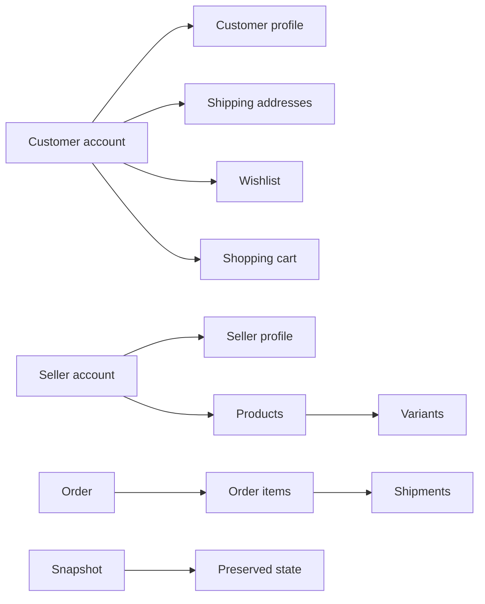
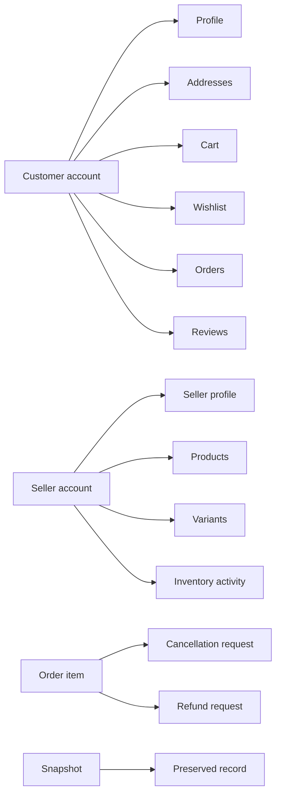
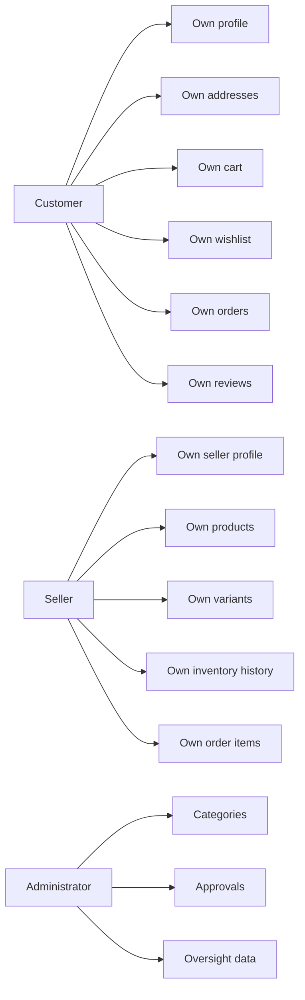
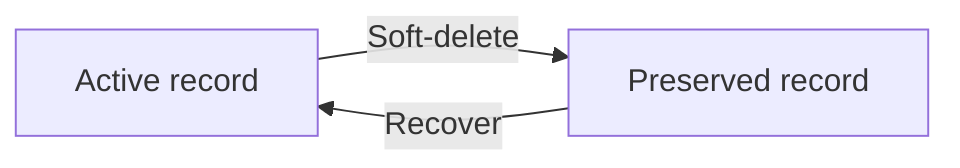
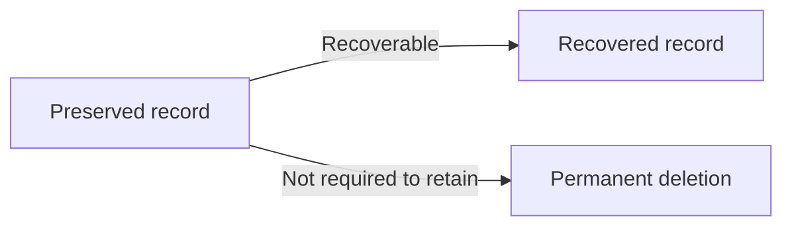

**mallPlatform — Data ownership, privacy, retention, and recovery policies**

Data ownership, privacy, retention, and recovery policies

# Data Policies

Data ownership, privacy, retention, and recovery policies from a business perspective.

## Data Ownership and Privacy

Define who owns what data, who can access it, and privacy boundaries between users.

### Data Isolation

The platform SHALL keep each customer account’s profile information, shipping addresses, cart items, and wishlist items separate from other customer accounts.
The platform SHALL keep each seller account’s profile information, products, product variants, inventory history, and seller dashboard data separate from other seller accounts.
The platform SHALL keep each order associated with the customer account that placed it while preserving seller-visible order history and snapshots for the relevant sellers and administrators.
The platform SHALL keep each product associated with the seller account that created it.
The platform SHALL keep each category separate from product, seller, and customer account data except where the category is used to organize products.
The platform SHALL keep snapshots associated with the data they preserve and restrict them to the relevant parties defined elsewhere in the document.
The platform SHALL keep reviews associated with the customer account that wrote them and with the purchased product context they describe.
The platform SHALL keep cancellation requests and refund requests associated with the specific order item they concern.
The platform SHALL keep shipment information associated with the order items included in that shipment.

Mermaid diagram:

### Ownership

Customer accounts own their profile information, shipping addresses, cart items, wishlist items, orders, and reviews they create.
Seller accounts own their seller profile information and the products, variants, and inventory activity created under their account.
Administrators own category management responsibilities and approval decisions for seller registrations and administrator requests.
Each product belongs to the seller who created it.
Each order belongs to the customer account that placed it, while each order item also preserves the seller profile snapshot tied to the purchased item.
Each review belongs to the customer account that wrote it, even when the customer account is later deleted and the review is displayed as coming from a deleted user.
Each shipping address belongs to one customer account only.
Each cancellation request and refund request belongs to one order item only.
Each snapshot belongs to the record it preserves and is not transferable to another record.

Mermaid diagram:

### Access Control

Customers can access only their own profile information, shipping addresses, cart, wishlist, orders, and reviews, except where preserved purchase history or deleted-user display rules apply.
Sellers can access only their own seller profile, their own products, their own variants, their own inventory history, their own order items, and the snapshots for their own editable data.
Administrators can access categories, seller approvals, administrator approval requests, and platform-wide product, order, and account oversight within the permissions defined elsewhere in the document.
Relevant parties can view snapshots for dispute resolution, limited to the ownership rules of the preserved data.
Customers can view seller profiles and product listings that are available for customer browsing.
Customers can view order history and shipment tracking information for their own orders only.
Sellers can view order items for their products and respond to cancellation and refund requests for those items.
Administrators can view snapshots of any product and can view platform data needed for oversight as defined in the permissions section.

Mermaid diagram:

### Privacy

The platform SHALL preserve the privacy of customer profile information and shipping addresses so that they are visible only according to the ownership and access rules defined in this section and in the permissions section.
The platform SHALL preserve the privacy of seller profile information so that it is shown to customers through seller profile viewing and product listings only as defined elsewhere in the document.
The platform SHALL preserve the privacy of customer reviews while honoring the rule that deleted customer accounts are displayed as deleted user for preserved reviews.
The platform SHALL preserve the privacy of order snapshots, product snapshots, seller profile snapshots, cancellation request snapshots, and refund request snapshots by exposing them only to relevant parties for dispute resolution.
The platform SHALL preserve the privacy of administrator approval requests and seller approval requests so that they are visible only to the reviewers defined elsewhere in the document.
The platform SHALL preserve the privacy of account deletion outcomes so that deleted customer profile information is removed while orders, order history, and reviews remain preserved according to the user requirements.
The platform SHALL preserve the privacy of deleted seller account outcomes so that deleted products are removed from listings while order history, snapshots, and preserved shop names remain available in historical records.
The platform SHALL not expose hidden seller products to customers when the seller account is suspended, because suspended products must not appear in search or category listings.

## Data Retention and Recovery

Define what happens to deleted data, how long it is retained, and how users can recover it.

### Soft Delete and Recovery

Accounts, products, reviews, cancellation requests, and refund requests may be soft-deleted when the platform needs to preserve records for business or legal purposes.

A soft-deleted record remains preserved for authorized recovery or review where the business rules allow it, rather than being removed immediately from the platform’s retained records.

When a record is soft-deleted, the platform shall keep the preserved record available according to the retention policy defined in this document.

A record that is soft-deleted may be recovered only where the business rules for that record allow recovery.

If a record is recovered, the platform shall restore the preserved record rather than creating a new business record.

Mermaid diagram:

### Retention of Preserved Records

The platform shall retain preserved records after deletion when the business requirements require the information to remain available for seller records, legal purposes, dispute resolution, or historical order context.

The platform shall retain order history, order item snapshots, seller profile snapshots tied to purchase history, product snapshots, variant snapshots, review snapshots, cancellation request snapshots, refund request snapshots, and immutable snapshots created from edits and status changes.

The platform shall retain reviews after customer account deletion and display them as reviews from a deleted user.

The platform shall retain seller order history and preserved snapshots after seller account deletion.

The platform shall retain product snapshots even after the related product is deleted.

The platform shall retain snapshots as immutable records and shall not allow them to be deleted.

The platform shall retain records needed to preserve the history of changes to money-related activities and dispute-related activities.

### Recovery and Permanent Deletion

Recovery is allowed only for records that the business rules designate as recoverable.

When recovery is allowed, the platform shall restore the preserved state of the record together with the business information needed to continue the relevant history.

Permanent deletion applies only to data that the business rules do not require the platform to retain.

When a record is permanently deleted, it is no longer available for recovery or historical review.

The platform shall not permanently delete records that must be preserved for seller records, legal purposes, or dispute resolution.

If a related business object has been permanently deleted, any preserved snapshots or retained history required by the platform shall remain available according to the retention policy.

Mermaid diagram:
