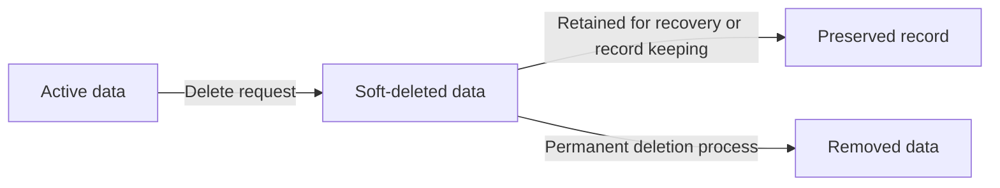
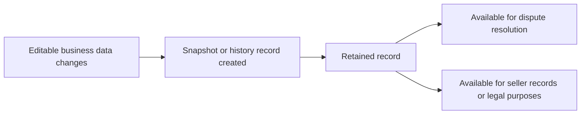
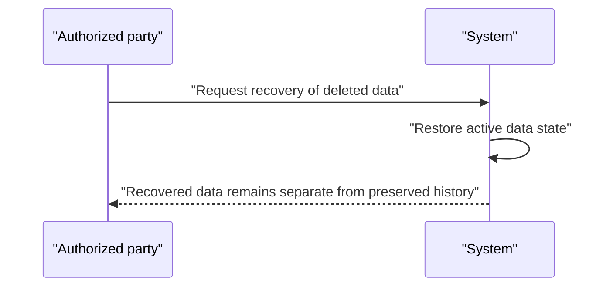
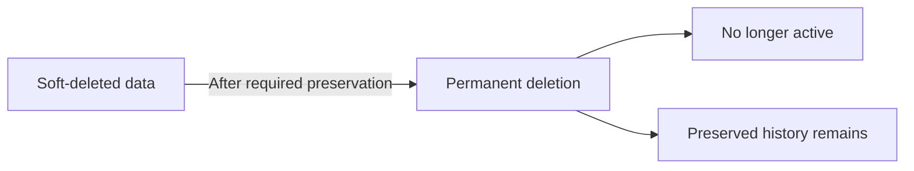
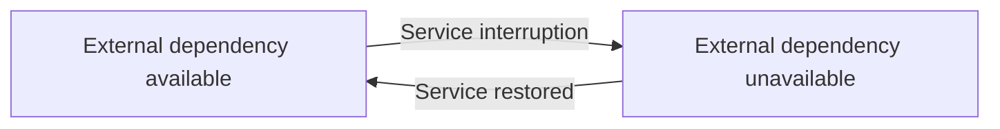
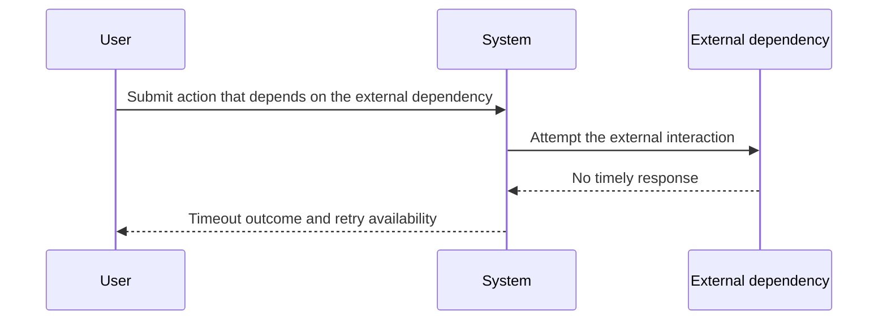
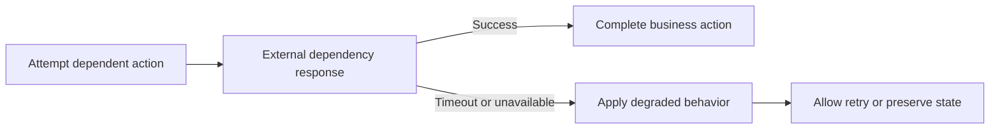

**shoppingMall — Data ownership, privacy, retention, and recovery policies**

Data ownership, privacy, retention, and recovery policies

# Data Policies

Data ownership, privacy, retention, and recovery policies from a business perspective.

## Data Ownership and Privacy

Define who owns what data, who can access it, and privacy boundaries between users.

### Data Isolation

Customer, seller, and administrator data shall be logically separated so that each actor type can access only the data that belongs to its permitted business scope.

Customer-facing data shall be isolated so that one customer cannot view another customer’s profile information, shipping addresses, wishlist, cart contents, or order history.

Seller-facing data shall be isolated so that one seller cannot view another seller’s private account information, shop profile data, product management data, inventory history, or order-item details outside its own business scope.

Administrator access shall remain separate from customer and seller privacy boundaries and shall be limited to the platform-wide oversight that is explicitly granted elsewhere in the requirements.

Data that is preserved for business records or legal purposes shall remain isolated from the former account holder’s active access after account deletion, unless a separate requirement explicitly allows viewing it for the relevant parties.

### Ownership

A customer owns the personal account data, profile data, shipping addresses, wishlist entries, cart contents, and reviews created under that customer account, subject to the platform rules for preservation and visibility defined elsewhere.

A seller owns the seller account data, seller profile data, products, variants, inventory history, and seller-created records that belong to that seller’s business activity, subject to the platform rules for preservation and visibility defined elsewhere.

A customer owns the order relationship created from that customer’s purchase history, but individual order items, snapshots, and preserved order records may remain available to other relevant parties when business or legal preservation is required.

An administrator does not own customer or seller business data by default and may access it only for the administrative purposes defined in the approved business requirements.

When a record is preserved after account deletion, the original ownership of the record does not transfer to another user; instead, the record remains associated with the original business context for continuity and dispute handling.

### Access Control

A customer shall be able to access only the customer data and customer-owned records that belong to that account, except for preserved order, shipment, snapshot, and review records that are intentionally retained and exposed under the platform rules.

A seller shall be able to access only the seller data and seller-owned records that belong to that account, including the seller’s own products, order items, shipments, cancellation responses, refund responses, and snapshots that are available to the relevant parties.

An administrator shall be able to access the data needed for platform oversight, moderation, and dispute resolution, including records that are explicitly made available to administrators in the approved requirements.

Access to preserved snapshots shall be limited to the owners and administrators that are entitled to view them for dispute resolution.

If a user account is deleted or suspended, access shall be limited according to the account lifecycle and preservation rules defined elsewhere, and the account holder shall not regain access to records that are no longer part of the active account context.

### Privacy

Personal information shall be treated as private data and shall not be exposed to other users unless a requirement explicitly makes it visible as part of a business process.

Customer profile information shall remain private to the customer except where it is needed to support order fulfillment, shipping, or other platform processes defined elsewhere.

Seller profile information shall be visible to customers only through the seller-facing presentation that is explicitly part of the shopping and purchase experience.

When a customer account is deleted, the customer’s profile information shall no longer be shown as active customer data, while preserved reviews shall remain visible under the deleted-user label.

When a seller account is deleted, the seller’s preserved order-related history and snapshots shall continue to support business records and legal purposes without exposing the deleted seller as an active account holder.

Privacy boundaries shall be maintained across all preserved records so that only the minimum necessary identity information remains visible in historical business records, as required by the platform’s preservation rules.

## Data Retention and Recovery

Define what happens to deleted data, how long it is retained, and how users can recover it.

### Soft-Delete

Deleted customer profiles and deleted seller profiles are retained in a soft-deleted state rather than being removed immediately.
Soft-deleted customer profile information is no longer available as an active profile.
Soft-deleted seller accounts are no longer available as active seller accounts.
Soft-deleted products are removed from active listings.
Soft-deleted wishlist entries are no longer shown to customers.
Soft-deleted reviews remain preserved and are shown as coming from a deleted user when the original customer account no longer exists.
Soft-delete status is used to keep business records available for retention and recovery purposes while preventing normal use of the deleted data.

### Retention

The platform retains data that must remain available for seller records, legal purposes, and dispute resolution even after the related account or item is deleted.
Customer orders and order history are retained after customer account deletion.
Seller order history and order snapshots are retained after seller account deletion.
Snapshots are retained and cannot be deleted.
Inventory history records are retained as the full history of stock changes for each variant.
Cancellation request and refund request history is retained so that request handling can be reviewed later.
Retained records remain available to the relevant parties described in the data ownership and privacy policies.
Retention applies to the preserved historical state of changed business data, not only to the current active version.

### Recovery

Soft-deleted data can be recovered when the business rules for that data allow restoration.
Recovered data returns to its active state with its previous business meaning intact.
If a deleted customer account is recovered, the customer profile returns as an active profile.
If a deleted seller account is recovered, the seller account returns as an active seller account.
If a deleted product is recovered, it returns to active product use only if its business status allows it.
Recovery must not remove or alter preserved snapshots, order history, inventory history, or other retained records.
Recovery is limited to restoring deleted business data; it does not rewrite preserved history.

### Permanent-Deletion

Permanent deletion applies only after the platform has preserved the required historical records.
When permanent deletion occurs, active personal or business data is removed from use and cannot be recovered.
Permanent deletion does not remove records that the platform must keep for seller records, legal purposes, dispute resolution, or snapshot preservation.
Snapshots remain immutable and are not eligible for deletion.
Order history, order item snapshots, seller order snapshots, inventory history, cancellation request history, and refund request history remain preserved when the business rules require them.
Where a record is permanently deleted, it is no longer available as active data or for ordinary customer use.

# External Dependency SLOs

Service level objectives for external dependency availability.

## External Dependency SLOs

Define availability expectations, timeout thresholds, and degradation policies for external service dependencies.

### External Dependency Availability Expectations

The platform relies on external dependencies for payment processing and must define availability expectations for those dependencies.

The platform shall treat external dependency availability as a business concern that affects whether the shopping flow can be completed.

The platform shall consider an external dependency unavailable when it cannot be reached or cannot complete the required interaction for the current business operation.

The platform shall distinguish between normal operation and degraded operation when an external dependency is unavailable.

The platform shall record the availability state of an external dependency for operational review.

### External Dependency Timeout Handling

The platform shall define timeout expectations for interactions with external dependencies.

The platform shall stop waiting for an external dependency when the interaction exceeds the configured timeout for that dependency.

When a timeout occurs, the platform shall treat the external dependency as unavailable for that business operation.

When a timeout occurs, the platform shall not leave the customer in a completed checkout state unless the payment outcome has been confirmed.

When a timeout occurs, the platform shall allow the customer to retry the affected action if the business flow supports retrying.

### Degradation Behavior for External Dependency Failures

When an external dependency is unavailable or times out, the platform shall apply a degraded behavior that protects the integrity of the affected business process.

When payment processing fails, the platform shall not create the order and shall allow the customer to retry the payment.

When an external dependency failure affects checkout, the platform shall prevent the affected order from being treated as successfully placed.

When a degraded behavior is active, the platform shall preserve the state needed for the user to continue once the external dependency becomes available again.

The platform shall not silently convert a failed external dependency interaction into a successful business outcome.

