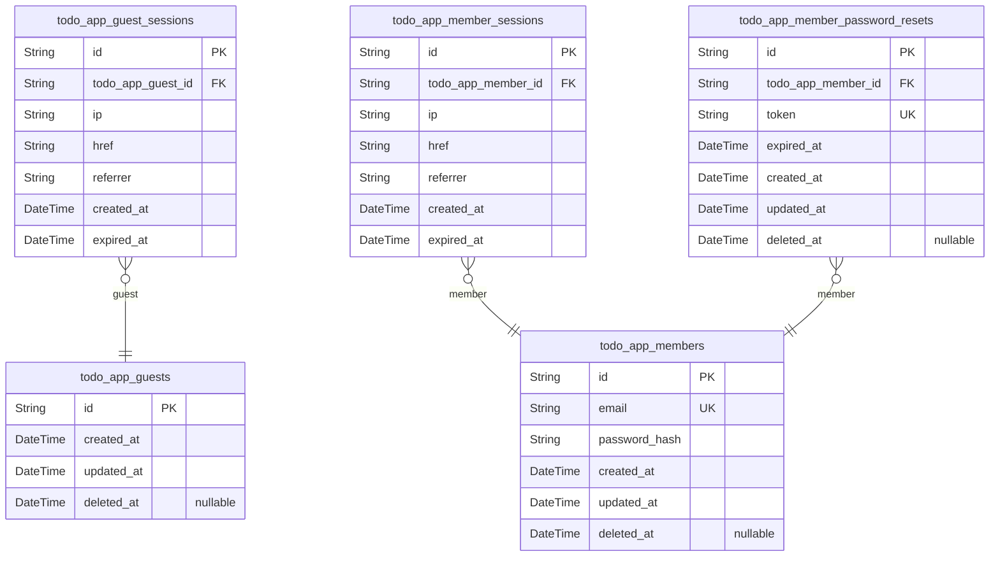
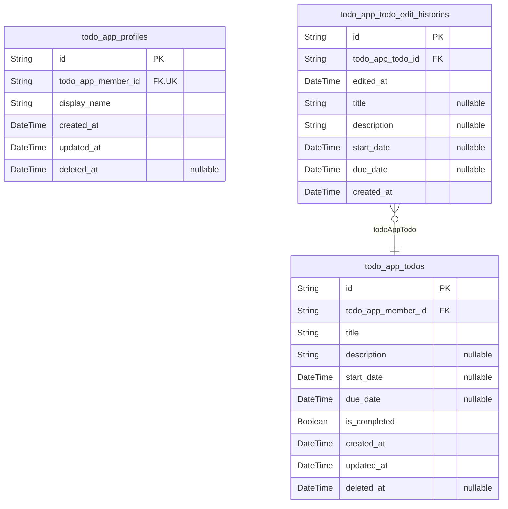

# Prisma Markdown

> Generated by [`prisma-markdown`](https://github.com/samchon/prisma-markdown)

- [todo_app_auth](#todo_app_auth)
- [todo_app](#todo_app)

## todo_app_auth

### `todo_app_guests`

Temporary anonymous guest identities for unauthenticated visitors.

This table stores a minimal record for visitors who have not signed in
yet. It provides a stable parent identity for anonymous access flows
without storing credentials, profile data, or activity details.

Session metadata and temporary access tokens belong in {@link
todo_app_guest_sessions}, which references this table. No email,
password, or other authenticated account attributes are stored here.

Properties as follows:

- `id`: Primary key for the anonymous guest record.
- `created_at`
  > Timestamp when the guest record was created.
  >
  > This records when the anonymous visitor identity first entered the system.
- `updated_at`
  > Timestamp when the guest record was last updated.
  >
  > This changes when lifecycle metadata for the guest record is modified.
- `deleted_at`
  > Timestamp when the guest record was soft deleted.
  >
  > This nullable field supports lifecycle cleanup without immediately
  > removing the record.

### `todo_app_guest_sessions`

Temporary session records for anonymous visitors in the private todo
application.

This table stores one row per guest session and belongs to exactly one
[todo_app_guests](#todo_app_guests) record. It captures request provenance and
expiration so anonymous access can be traced and invalidated without
storing credentials or business data.

The record is managed by authentication flows as a security-sensitive
session artifact. It should be treated as append-only, with lifecycle
controlled by expiration and session revocation policies.

Properties as follows:

- `id`: Primary key for the guest session record.
- `todo_app_guest_id`
  > References the guest actor that owns this anonymous session.
  >
  > This child-to-parent foreign key links to [todo_app_guests](#todo_app_guests). Each
  > session must belong to exactly one guest and must never reference a child
  > table.
- `ip`
  > Client IP address observed when the guest session was created.
  >
  > This supports request tracing, abuse prevention, and session provenance
  > capture.
- `href`
  > Request URL associated with the guest session.
  >
  > This stores the page or endpoint context at the moment the session was
  > established.
- `referrer`
  > Referrer URL associated with the guest session.
  >
  > This records the immediately preceding HTTP referrer when available for
  > navigation analysis.
- `created_at`
  > Timestamp when the guest session was created.
  >
  > This marks the start of the session record and supports ordering and
  > auditing.
- `expired_at`
  > Timestamp when the guest session expires.
  >
  > This required security boundary ensures anonymous access is automatically
  > invalidated after the allowed lifetime ends.

### `todo_app_members`

Registered member accounts with email and password credentials for
private authenticated access.

This table stores the authenticated identity for {@link
todo_app_member_sessions} and [todo_app_member_password_resets](#todo_app_member_password_resets),
but those dependent tables are managed separately and are intentionally
not referenced here to preserve child-to-parent foreign key direction.

Members sign in with email and password, and the record also carries
lifecycle timestamps for creation, update, and soft deletion. The email
address must be unique for login identity and account recovery flows.

Properties as follows:

- `id`: Primary Key.
- `email`
  > Email address used to sign in.
  >
  > This value uniquely identifies a member account for authentication and
  > account lookup.
- `password_hash`
  > Hashed password credential for authenticating the member.
  >
  > The raw password must never be stored here; only a secure one-way hash
  > belongs in this field.
- `created_at`
  > Record creation timestamp.
  >
  > This marks when the member account was first registered.
- `updated_at`
  > Record last update timestamp.
  >
  > This changes whenever account data such as credentials or lifecycle state
  > is modified.
- `deleted_at`
  > Soft delete timestamp for the member account.
  >
  > A non-null value indicates the account was deactivated and should be
  > treated as removed from normal access while preserving data for lifecycle
  > handling.

### `todo_app_member_sessions`

Session records for authenticated members, storing active login tokens
and session metadata.

This table stores one login session per record for {@link
todo_app_members} and supports authentication, session auditing, and
expiration enforcement. It is an append-only security table and must only
reference its owning member through a child-to-parent foreign key.

Properties as follows:

- `id`: Primary Key.
- `todo_app_member_id`
  > The member that owns this session.
  >
  > This foreign key links each session record to exactly one {@link
  > todo_app_members} row and is used for authenticated request verification,
  > logout, and session invalidation.
- `ip`
  > The IP address associated with the session creation request.
  >
  > This is stored for security review and anomaly detection.
- `href`
  > The request URL associated with the session creation event.
  >
  > This captures the context of the login or session issuance request for
  > auditing.
- `referrer`
  > The referrer URL associated with the session creation event.
  >
  > This helps with traffic-origin analysis and security diagnostics.
- `created_at`
  > The timestamp when this session was created.
  >
  > This is used for auditing and for the required member session lookup
  > index.
- `expired_at`
  > The timestamp when this session expires.
  >
  > This is required so expired sessions can be invalidated securely.

### `todo_app_member_password_resets`

Password reset requests for member accounts.

Each record stores one reset token issued to exactly one {@link
todo_app_members} account, together with its expiration and audit
timestamps. The table supports password recovery and password change
workflows without storing password data itself.

Properties as follows:

- `id`: Primary key for a password reset request record.
- `todo_app_member_id`
  > The member account that owns this password reset request.
  >
  > This links the reset token to exactly one [todo_app_members](#todo_app_members) record
  > so the token can be validated and invalidated for that account only.
- `token`
  > Opaque reset token used to authorize a password reset request.
  >
  > The token must be unique and unguessable so it can be safely delivered
  > through the reset flow and validated before allowing credential changes.
- `expired_at`
  > The time at which the reset token becomes invalid.
  >
  > Tokens must not be accepted after this timestamp to protect account
  > security and limit the lifetime of recovery links.
- `created_at`
  > The time when this password reset request was created.
  >
  > This records when the token was issued and supports auditing and
  > expiry-related cleanup logic.
- `updated_at`
  > The time when this password reset request was last updated.
  >
  > This tracks administrative or system-side changes to the reset request
  > record.
- `deleted_at`
  > The time when this password reset request was soft deleted.
  >
  > This supports invalidation or cleanup without immediately removing the
  > audit trail.

## todo_app

### `todo_app_profiles`

Account-linked profile data for the private todo app.

This table stores each authenticated member’s profile inside the private
todo application boundary. It is a dependent entity owned by exactly one
[todo_app_members](#todo_app_members) record and exists separately from authentication
data so the profile can be managed without mixing credentials into the
business domain.

The only business attribute stored here is the member’s display name. All
account identity, login, and session concerns remain in the authorization
component, while this table provides the profile information used by the
owning member.

Properties as follows:

- `id`: Primary Key.
- `todo_app_member_id`
  > Owning member reference for this profile.
  >
  > This foreign key links each profile to exactly one {@link
  > todo_app_members} record. The relationship is mandatory and one-to-one so
  > a member can have only one profile, and the profile cannot exist without
  > its owner.
- `display_name`
  > The member’s display name shown in the private todo app.
  >
  > This is the single editable profile attribute stored in this table. It is
  > separated from authentication data and represents the profile label used
  > by the owning member inside the application.
- `created_at`
  > Record creation timestamp.
  >
  > This stores when the profile row was first created so the system can
  > track profile lifecycle history.
- `updated_at`
  > Record update timestamp.
  >
  > This stores the most recent time the profile was modified, including
  > display name changes.
- `deleted_at`
  > Soft delete timestamp.
  >
  > This is set when the profile is logically deleted while preserving the
  > row for retention and account lifecycle handling.

### `todo_app_todos`

Owned todo items in the private todo application.

Each record belongs to exactly one [todo_app_members](#todo_app_members) account and
stores the user-managed todo data: required title, optional description,
optional start date, optional due date, and completion status. The table
also carries created, updated, and soft-delete timestamps so active
lists, trash views, restoration, and permanent deletion workflows can be
supported without denormalized data.

Properties as follows:

- `id`: Primary Key.
- `todo_app_member_id`
  > Owning account for this todo.
  >
  > Each todo belongs to exactly one [todo_app_members](#todo_app_members) record, which
  > enforces private per-user ownership and keeps all todo access
  > member-scoped.
- `title`
  > Short title of the todo.
  >
  > This is the required summary shown in list views and single-item views.
- `description`
  > Detailed todo description.
  >
  > This stores the full user-entered body text and may be empty when the
  > user provides no description.
- `start_date`
  > Optional planned start date for the todo.
  >
  > When unset, the todo is treated as unscheduled for start-date sorting.
- `due_date`
  > Optional due date for the todo.
  >
  > When unset, the todo is treated as unscheduled for due-date sorting.
- `is_completed`
  > Completion state of the todo.
  >
  > This supports a simple complete/incomplete toggle and defaults to false
  > on creation.
- `created_at`
  > Time when this todo was created.
  >
  > Used for auditing and for creation-date sorting in the user's todo list.
- `updated_at`
  > Time when this todo was last updated.
  >
  > This changes whenever the title, description, dates, or completion state
  > changes.
- `deleted_at`
  > Time when this todo was soft-deleted.
  >
  > When populated, the todo is hidden from the normal list and may appear in
  > the trash until it is restored or permanently deleted.

### `todo_app_todo_edit_histories`

Immutable edit history entries for [todo_app_todos](#todo_app_todos).

This table records each change event made to a todo as an append-only
audit trail. It stores only the values that changed in that edit,
allowing the application to reconstruct how the todo evolved over time
without duplicating ownership, completion state, or lifecycle data.

Each record belongs to exactly one [todo_app_todos](#todo_app_todos) row and is
removed when the parent todo is permanently deleted. The table is
intentionally atomic and narrow so history can be displayed
chronologically from newest to oldest without violating normalization.

Properties as follows:

- `id`: Primary Key.
- `todo_app_todo_id`
  > The todo that this edit history entry belongs to.
  >
  > This foreign key connects each immutable history row to its parent {@link
  > todo_app_todos} record so the application can list changes per todo and
  > cascade-remove the history when the todo is permanently deleted.
- `edited_at`
  > The time when this edit was made.
  >
  > This business timestamp is used to order history entries from most recent
  > to oldest and to show when a particular change occurred.
- `title`
  > The new title after this edit, when the title was changed.
  >
  > When present, this field stores the updated title value for the todo at
  > the moment this history row was created. If the title was not changed in
  > the edit, this field remains null.
- `description`
  > The new description after this edit, when the description was changed.
  >
  > When present, this field stores the updated description value for the
  > todo at the moment this history row was created. If the description was
  > not changed in the edit, this field remains null.
- `start_date`
  > The new start date after this edit, when the start date was changed.
  >
  > When present, this field stores the updated start date value for the todo
  > at the moment this history row was created. If the start date was cleared
  > or not changed, this field remains null.
- `due_date`
  > The new due date after this edit, when the due date was changed.
  >
  > When present, this field stores the updated due date value for the todo
  > at the moment this history row was created. If the due date was cleared
  > or not changed, this field remains null.
- `created_at`
  > The time when this history record was created.
  >
  > This audit timestamp tracks when the database row was inserted and
  > supports immutable record keeping for the edit history trail.
