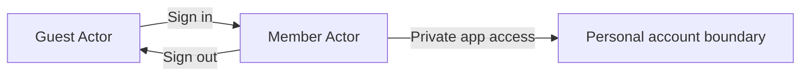
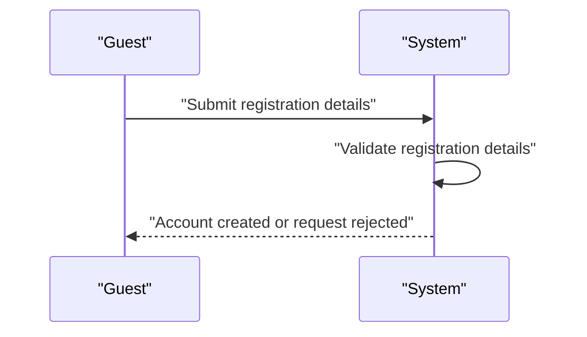
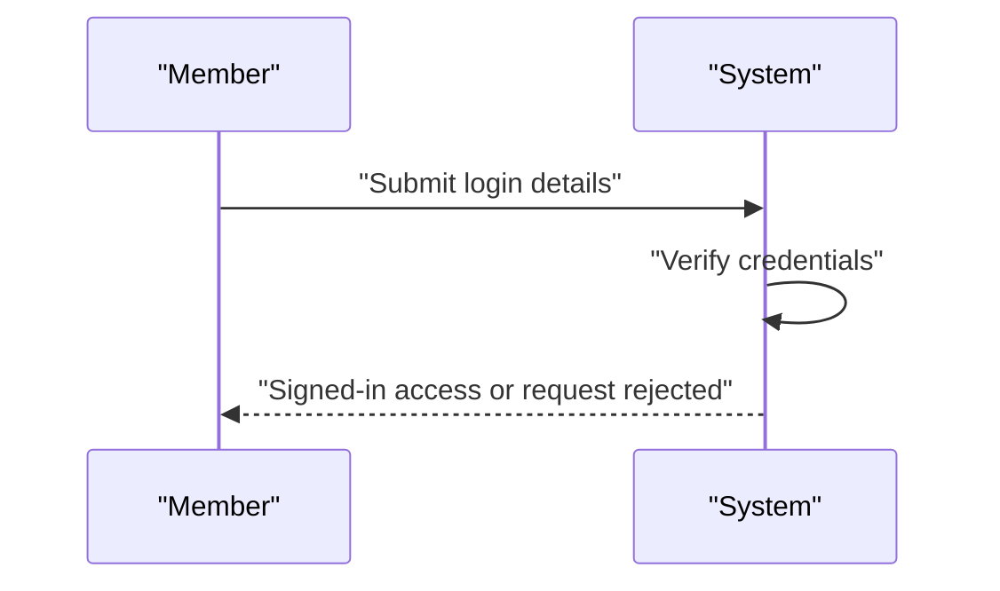
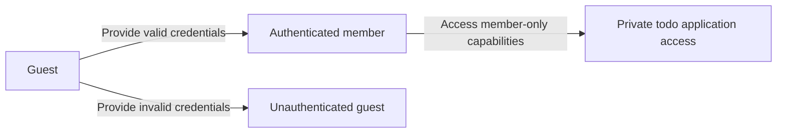
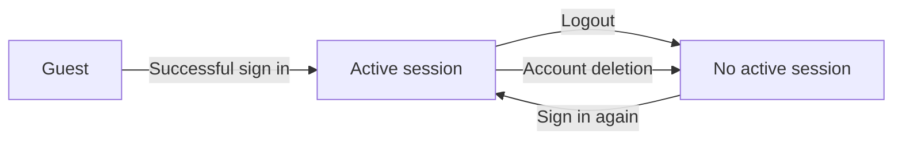
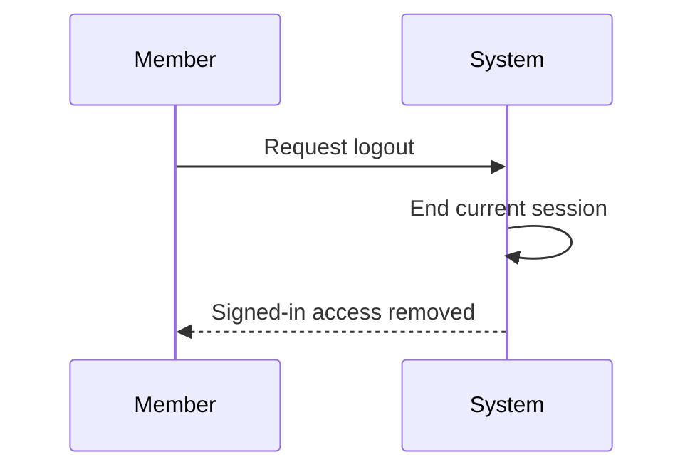
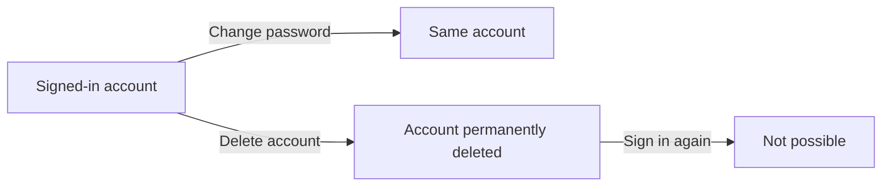
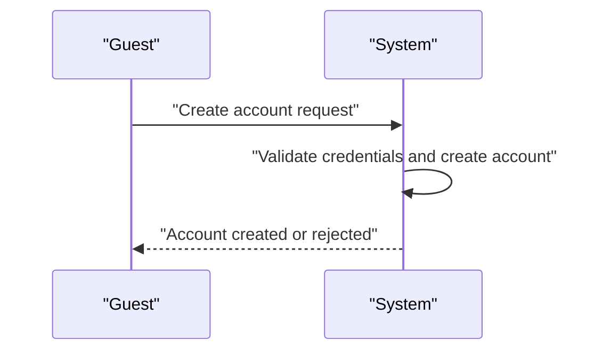
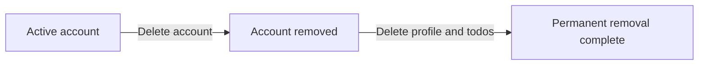
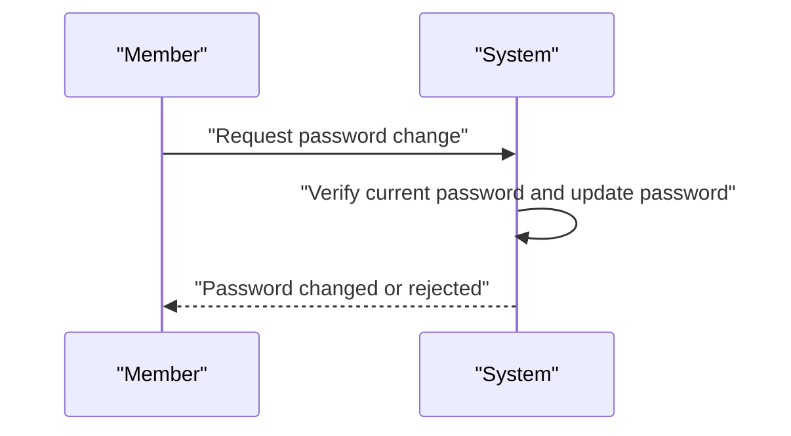

**todoApp — Actor definitions, permission matrix, authentication, session, account lifecycle**

Actor definitions, permission matrix, authentication, session, account lifecycle

# Actor Definitions

Define all user actor types with their identity, permissions, and access boundaries.

## guest Actor

A guest is a person who has not yet created an account or signed in. The guest role represents the lowest level of access in the application. Guests do not have permission to use member-only areas of the app. They are outside the authenticated user boundary until they complete sign-up and sign in. Guest access is limited to the unauthenticated entry experience only. Once a person becomes an authenticated user, they are no longer treated as a guest. The guest role does not carry ownership of any private content. Guest access should never be confused with access to another user's private space. The application treats guests as separate from active members in all permission checks.

### Guest Actor Identity

A guest is an unauthenticated visitor who has not signed in and is in the pre-sign-in state. The guest role describes anonymous access at the entry access boundary before a person becomes an authenticated user. A guest is not a member and has no member permissions. Once sign-in is completed, the person is no longer treated as a guest.

### Guest Access Boundary

The guest role applies only at the entry access boundary for unauthenticated visitors. Guests remain outside the signed-in account boundary and cannot be treated as authenticated users. Guest access is limited to the pre-sign-in state and does not extend into member-only areas of the application. The application must separate guest access from member access in permission checks.

### Guest Permission Scope

A guest has no member permissions. The guest role does not include access to private user content, ownership of private content, or any capability reserved for signed-in members. The system must treat anonymous access as distinct from authenticated access whenever permissions are evaluated.

## member Actor

A member is a user who has successfully created an account and signed in. The member role is the authenticated actor for the application. Members have access to the private areas reserved for account holders. Their permissions are broader than a guest's because they are recognized by the system as signed-in users. A member acts within a personal account boundary rather than as a public visitor. This role is the standard identity used for all private app interactions. Members are expected to operate only within their own access scope. The application treats each member as a distinct authenticated person. When a member signs out, they no longer hold active authenticated access.

### Member Actor

A member actor is a user who has successfully created an account and signed in.

The member actor is the authenticated user for the application. This role represents the signed-in account holder who is recognized by the system as the current private user.

The member actor is the standard role used for private app access. The role exists so that a person can use the application after authentication and within a personal account boundary.

A member actor is distinct from a guest actor. A guest is an unauthenticated visitor, while a member is a signed-in account holder with member permissions.

Mermaid diagram:

### Authenticated User

An authenticated user is a member who has completed sign-in and is recognized by the application as the current user.

The authenticated user is also the logged-in user while the sign-in state remains active.

This term refers to the same business role as the signed-in account holder and member actor in this file. The different names describe the same private-app identity after authentication.

### Signed-in Account Holder

A signed-in account holder is a member who currently has active access after successful sign-in.

The signed-in account holder is the person to whom private app access applies.

The signed-in account holder operates within a personal account boundary and does not represent a public visitor.

### Private App Access

Private app access is the access scope available only to a member after authentication.

This access scope is reserved for the signed-in account holder and is not available to a guest.

Private app access means the application recognizes the member as the current private user rather than as an unauthenticated visitor.

### Member Permissions

Member permissions are the access rights granted to the member actor.

Member permissions apply only after sign-in.
Member permissions belong to the signed-in account holder.
Member permissions are limited to the member's personal account boundary.
Member permissions do not apply to a guest actor.

Member permissions define who can use private app access in this file. Operation-specific permissions are defined in later sections.

### Personal Account Boundary

A personal account boundary is the private scope associated with one signed-in account holder.

The member actor acts only within this boundary.

The personal account boundary separates one member's private app access from another member's private app access. It is the access boundary used to describe private use of the application.

### Active Session User

An active session user is a member whose sign-in state is currently active.

While the sign-in state remains active, the active session user is also the logged-in user.

When the active session ends, the user is no longer treated as an active session user and no longer has private app access.

### Member Role

The member role is the authenticated role used by a signed-in account holder.

The member role is the same business role as the member actor and authenticated user in this file.

A person has the member role only after successful sign-in and while private app access remains available.

### Logged-in User

A logged-in user is a member whose sign-in is currently active.

The logged-in user is the same business concept as the active session user and authenticated user in this file.

The logged-in user is the person the application recognizes for private app access until sign-out or the end of the active session.

# Authentication Flows

Registration, login, logout, and session management from a user perspective.

## Registration and Login

Define user registration and login flows including validation and error handling.

### Registration

Members can register a new account with an email address and a password.
The system shall create a user account only after the submitted registration details are accepted.
The system shall create a profile for the new account with a display name.
If the registration details are incomplete or invalid, the system shall reject the registration request.
If the email address is already associated with an existing account, the system shall reject the registration request.

### Login

Members can log in with an email address and password.
The system shall authenticate a user only when the submitted email address and password match an existing account.
If the login details are invalid, the system shall reject the login request.
If the account does not exist, the system shall reject the login request.
A successful login establishes signed-in access for the member.

### Authentication

Authentication is the process the system uses to confirm that a member is the holder of the submitted account credentials.
Only authenticated members can access member-only capabilities in the private todo application.
Unauthenticated visitors remain guests and do not receive member access.
If authentication cannot be confirmed, the system shall deny member access.

## Session and Logout

Define session behavior and logout from a user perspective.

### Session

A session represents a member's signed-in access to the private todo application.
A session begins when a member signs in with the correct email and password.
While a session is active, the member remains signed in and can use member-only capabilities.
While a session is not active, the user is a guest and cannot use member-only capabilities.
A member can continue using the application only while the session remains active.
If the session ends, the member must sign in again before using member-only capabilities.
If the account is deleted, the session ends with the account.

### Logout

A signed-in member can log out at any time.
When a member logs out, the current session ends.
After logout, the member is treated as a guest until signing in again.
Logout removes signed-in access from the current session only.
Logout does not delete the account.
Logout does not delete the member's profile or todos.
If a user is already a guest, there is no active session to end.

### Account Security

Account access is private to the account holder.
A member must use the correct email and password to sign in before a session can begin.
A member can change the password for the signed-in account.
After a password change, the account remains the same account and the member can continue using the application.
A member can delete the account while signed in.
When the account is deleted, the account and all associated todos, including todos in trash, are permanently deleted.
After account deletion, the former member can no longer use that account.
Other users cannot view another user's profile or todos.

# Account Lifecycle

Account creation, deletion, and password management.

## Account Management

Define how users create accounts, delete accounts, and change passwords.

### Account Creation

#### Account Creation
The system shall allow a guest to create a member account using an email address and password.
The system shall create a profile for the new account with a display name.
The system shall make the new account available for sign-in after creation.
The system shall reject account creation when the email address is already associated with an existing account.
The system shall reject account creation when the email address or password is missing.

### Account Deletion

#### Account Deletion
The system shall allow a member to delete their own account.
The system shall permanently delete the member's profile when the account is deleted.
The system shall permanently delete all of the member's todos, including todos in trash, when the account is deleted.
The system shall prevent further use of a deleted account.
The system shall reject account deletion requests for accounts that do not belong to the requesting member.

### Password Change

#### Password Change
The system shall allow a member to change their own password.
The system shall require the member to provide the current password before accepting a password change.
The system shall reject a password change when the current password is incorrect.
The system shall use the new password for future sign-in attempts after a successful change.
The system shall reject password change requests for accounts that do not belong to the requesting member.

