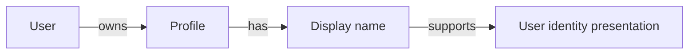
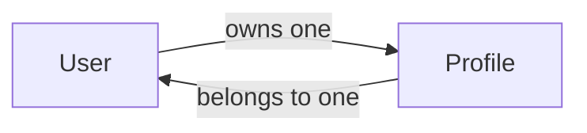
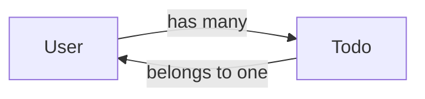
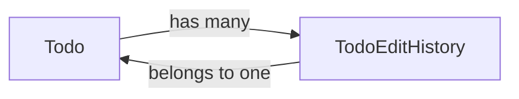
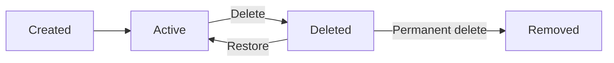
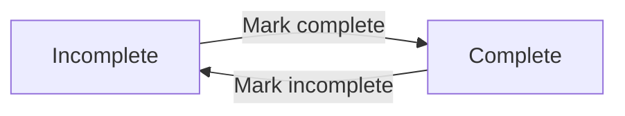
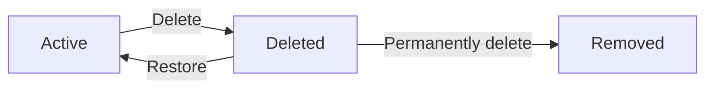
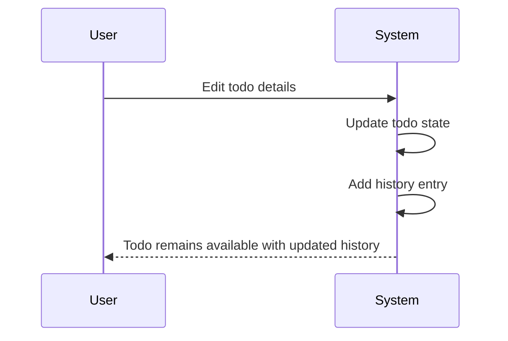

**todoApp — Business concepts, relationships, and states from user perspective**

Business concepts, relationships, and states from user perspective

# Domain Concepts

Describe what each concept means in the business domain and its key attributes.

## User Concept

A User represents a private account holder in the todo application. It is the business identity that owns todos and a personal profile. The User concept centers on account identity, password credential, and account status as the core attributes. A user is treated as a distinct person within the app, with no shared visibility into other users’ data. The account status reflects whether the account is active or no longer available in the business sense. The password credential is part of the user’s private account security and is not exposed as a shared business detail. Because the application is multi-user, the User concept is the basis for separating ownership and privacy across all todo data. This concept does not include todo content itself, only the identity that controls it.

### User Concept

A User is the business concept that represents a private account holder in the todo application. In the domain, the User is the account-level identity that owns personal data and establishes the boundary between one person’s todos and another person’s todos.

The User concept has these core attributes:
- Account identity, which distinguishes one private account holder from another
- Password credential, which belongs to the user’s private account
- Account status, which expresses whether the account is active or no longer available in the business sense

Multi-user ownership is part of the User concept because each user owns their own data rather than shared data. Personal data separation is the business meaning of that ownership boundary: one user’s content remains separate from every other user’s content.

Todo ownership is derived from the User concept. A todo belongs to the user who owns the account, and that ownership relationship is what keeps each user’s todo set private within the application.

## Profile Concept

A Profile represents the public-facing personal identity information attached to a user account within the app. In this domain, the profile is limited to the display name attribute. The display name is the label other parts of the application use to identify the person in a readable way. The Profile concept exists separately from the user’s password credential so that identity presentation is distinct from account security. It is still private within the application because users cannot view other users’ profiles. The profile belongs to one user and reflects that user’s chosen name within the system. This concept does not describe editing behavior or viewing behavior, only the business meaning of the profile data itself. The profile helps define how a user is represented while still preserving the app’s private nature.

### Profile Concept

A profile is the business concept that represents a user's personal account label within the application domain. It describes how the user is identified in a readable, private way inside the todo app.

The profile's key attribute is the display name. The display name is the account identity display used for user identity presentation throughout the business domain.

A profile is a single-user profile. It belongs to one user and is not shared with any other user.

A profile is private. Other users cannot view another user's profile, so profile privacy is part of the concept's business meaning.

The profile exists separately from the user's password credential. This separation keeps identity presentation distinct from account security while preserving the private nature of the application.

In business terms, the profile is the personal account label that represents a user in human-readable form. The label is the display name, and it is the only profile attribute defined in this concept.

## Todo Concept

A Todo represents a private task item owned by a single user. It captures the task’s title as the core required business attribute. It may also include a description, a start date, and a due date when those details are available. The todo concept carries both content and timing information so users can plan and track work. A todo also has a completion status that shows whether it is complete or incomplete. Creation date is part of the todo’s business identity because it helps place the item in time. The concept is designed for one owner only, since every todo belongs to the user who created it. This means the todo is not a shared object and is understood only within that user’s private workspace.

### Todo Concept

A todo is a private task item in the todoApp business domain. It is a user-owned todo and a single-owner task, meaning it belongs to one user only and is not shared with other users.

The business meaning of a todo is to capture one user’s work item in a way that can be tracked privately over time. The concept exists as a personal task record rather than a collaborative item.

A todo has the following core attributes:
- Title: the required core attribute that identifies the task
- Description: optional supporting detail
- Start date: optional timing information for when work may begin
- Due date: optional timing information for when work should be finished
- Completion status: indicates whether the todo is complete or incomplete
- Creation date: identifies when the todo was created

The title is the essential business attribute because every todo must have one. The description, start date, and due date add detail when available, but they are not required for the todo to exist. The completion status captures the todo’s current state as complete or incomplete. The creation date provides a time reference for the todo as part of its business identity.

A todo remains private throughout its life as a user-owned todo. Its meaning is limited to the owner’s private workspace, and it is not intended to be visible as a shared business object.

## TodoEditHistory Concept

A TodoEditHistory entry represents one recorded change made to a todo over time. It exists as part of the business record for a todo and preserves how the todo has evolved. Each entry includes the moment the edit was made as its central tracking attribute. It also records the new title value when the title changes. It records the new description value when the description changes. The history concept can also capture changes to the start date and due date when those values are updated. A todo can have multiple history entries, creating a chronological account of changes. This concept is about preserving edit records for user review and accountability, not about describing how edits are performed.

### TodoEditHistory Concept

A TodoEditHistory entry is a domain concept that represents the edit record for a todo. It is the business record that preserves how a todo changes over time and provides a chronological change log for that todo.

A history entry is one recorded change within that log. Each history entry captures a single edit point and belongs to one todo. A todo can have many history entries, and together those entries form the todo's chronological change log.

The attributes of a history entry are:
- Edited at timestamp, which identifies when the edit was made.
- Changed title value, which records the title value associated with that edit when the title changed.
- Changed description value, which records the description value associated with that edit when the description changed.
- Changed start date value, which records the start date value associated with that edit when the start date changed.
- Changed due date value, which records the due date value associated with that edit when the due date changed.

A history entry may contain one or more changed values depending on which todo attributes were updated in that edit. If an attribute did not change, it is not represented as a changed value in that history entry.

This concept is a todo change record used to preserve edit history for user review. It describes the structure and meaning of the edit record, not the process of creating or viewing it.

# Domain Relationships

Describe how concepts relate to each other from a business perspective.

## Conceptual Relationships

Describe how concepts relate to each other in business terms.

### User Ownership and Profile Relationship

A user owns one profile. The profile belongs to that user and represents the user's private identity details within the application. This ownership relationship means the profile is not shared with other users.

### User and Todo Association

A user has many todos. Each todo belongs to one user and is part of that user's private todo collection. This association defines the business boundary for todo ownership and keeps each todo linked to a single account.

### Todo and Edit History Association

A todo has many edit history entries. Each edit history entry belongs to one todo and records a change made to that todo over time. This relationship keeps the history attached to the specific todo it describes.

## Lifecycle and Retention

Describe concept lifecycle states and transitions only. Detailed retention/recovery policies belong in 05-non-functional. Operation details belong in 03-functional-requirements.

### Todo Lifecycle

A todo follows a business lifecycle from creation to either temporary removal or permanent removal. The lifecycle begins when the todo is created and becomes active in the owner's normal todo list.

A todo can move from active use into a deleted state when the owner removes it. In the deleted state, the todo remains associated with the same owner but is no longer part of the normal todo list. The deleted state is temporary when the todo is intended to be recovered later.

A todo ends its lifecycle when it is permanently deleted. At that point, the todo is no longer recoverable and no longer exists as part of the owner's todo set.

### Retention of Deleted Todos

Retention describes how deleted todos remain available for a period of recovery instead of being removed immediately. While retained, a deleted todo stays linked to the same owner and can still be restored.

Retention applies only while the todo is in the deleted state. A retained todo is excluded from the normal todo list, but it remains part of the owner's private todo collection until it is restored or permanently deleted.

If a todo is permanently deleted, retention ends and the todo is no longer kept for recovery.

### Archival in the Trash

Archival is the business behavior that places a deleted todo into the trash. The trash is the archive for deleted todos, meaning it stores todos in a recoverable deleted state rather than removing them at once.

Archived todos remain available for review as deleted items until they are restored or permanently deleted. Archival does not change the todo's owner or its place in the edit history of that todo.

The archived state is the same business state as being in the trash, and it exists only to support later recovery or permanent removal.

### Deletion Policy

The deletion policy distinguishes between soft deletion and permanent deletion. Soft deletion moves a todo into the trash and preserves it for later recovery. Permanent deletion removes the todo from the trash and ends retention.

A permanently deleted todo is not kept for later recovery. A permanently deleted todo also loses its edit history, because the edit history is deleted together with the todo.

A deleted todo does not return to the normal todo list unless it is restored. Permanent deletion is the final deletion outcome.

### Recovery of Deleted Todos

Recovery applies to todos that are currently archived in the trash. Recovery returns the same todo to the normal todo list and makes it active again.

A recovered todo keeps its existing details and remains the same todo rather than becoming a new one. Its edit history remains attached when the todo is restored.

A todo that has been permanently deleted cannot be recovered because permanent deletion removes both the todo and its edit history.

### Edit History Retention During Lifecycle Changes

A todo's edit history follows the todo through its lifecycle while the todo is retained. When a todo is deleted and later restored, the edit history remains associated with that same todo.

The edit history is removed together with the todo when the todo is permanently deleted. After permanent deletion, the edit history is not retained as a separate recoverable record.

This means lifecycle changes do not break the link between a todo and its edit history unless the todo is permanently deleted.

# Business Categories and State Flows

Business category classifications and state flow definitions.

## Business Category Definitions

Define all business category classifications with their allowed values and descriptions.

### Business Category

The business category definitions describe the named domain concepts used by the todo application from the user perspective. In this unit, the business categories are the user account, profile, todo item, and todo edit history.

These categories provide the shared domain vocabulary for the application and are used to distinguish identity, personal information, task data, and change records as separate business concepts.

### Classification

The classification of the domain concepts is based on how each concept behaves in the business model.

- User is the account identity that belongs to a person using the application.
- Profile is the personal display information associated with a user.
- Todo is the task item that a user creates and manages.
- Todo edit history is the record of changes made to a todo.

Each concept is classified once so the domain model remains clear and the concepts do not overlap in meaning.

### Allowed Values

The allowed values for this unit are limited to the approved domain concept names used by the application: user, profile, todo, and todo edit history.

These are the only permitted business category values in this section. They define the complete set of concept names for the domain model and prevent additional categories from being introduced here.

### Status Type

The status type for this unit refers to the completion state of a todo. A todo uses a simple two-state completion model: complete and incomplete.

This status type applies only to todo completion. It does not define any other business condition, and it expresses whether a todo is finished or still pending from the user perspective.

## State Transitions

Define valid state transition paths for stateful concepts.

### Todo Completion State Flow

A todo has two completion states: incomplete and complete. A newly created todo starts in the incomplete state. A user can change the completion status from incomplete to complete, and can change it back from complete to incomplete. This workflow is a direct two-state transition with no additional completion states.

### Todo Deletion Transition

A todo can move from the active state to the deleted state when the user deletes it. A deleted todo is no longer part of the normal todo list. The user can restore a deleted todo, which returns it to the active state. The user can also permanently delete a deleted todo, which ends the todo's lifecycle and removes its edit history at the same time.

### Todo Edit History Status Change

A todo's edit history changes whenever the todo is edited. Each edit creates a new history entry, and the history is kept in reverse chronological order from most recent to oldest. When a todo is permanently deleted, its edit history is also deleted, so the history is no longer available for that todo.

