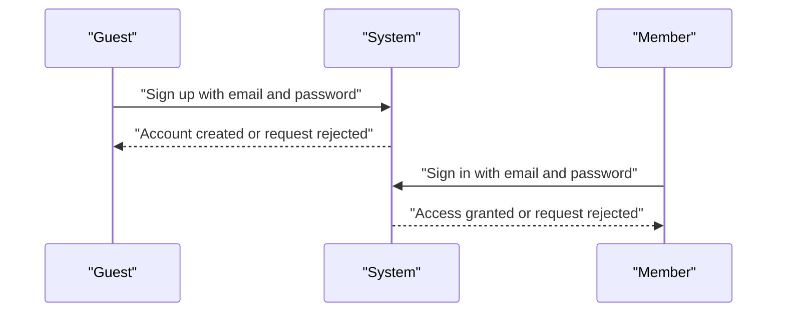
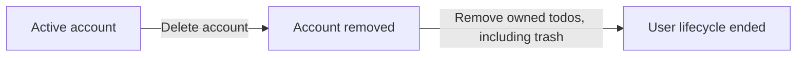
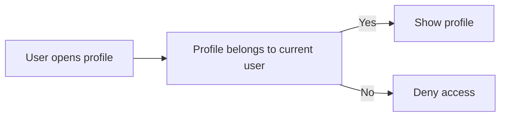
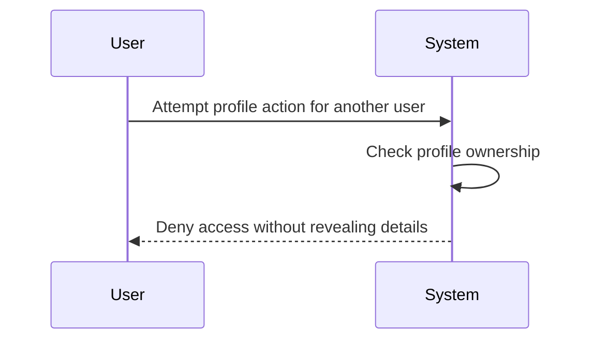

**todoApp — What operations users can perform, use cases, business workflows**

What operations users can perform, use cases, business workflows

# Core Business Operations

What the system must do for each business concept.

## User Operations

Users can sign up with email and password to create a new account in the app. They can log in with those same credentials to access only their own private workspace. A user can change their password when they need to update account access credentials. A user can also delete their account, and this must permanently remove that user together with all of their todos, including todos that are already in trash. User operations do not allow one person to access another person's account details or account actions. The app treats each account as private and separate from all others. These operations support the full account lifecycle from creation through removal. The business rules must keep account ownership limited to the signed-in user at all times.

### Account Creation and Sign-In

THE todoApp SHALL allow a guest to create a user account with an email address and a password.
THE todoApp SHALL allow a guest to sign up as a new member by providing an email address and a password.
THE todoApp SHALL allow a member to sign in by providing the email address and password associated with their own account.
IF the provided email address and password do not match an existing account, THEN the todoApp SHALL reject the sign-in request.
IF the sign-up information does not identify a valid new account, THEN the todoApp SHALL reject the sign-up request.
WHILE a user account exists, THE todoApp SHALL treat that account as private to its owner.

### Password Change

WHILE a member owns an existing account, THE todoApp SHALL allow that member to change the password for that account.
IF a user attempts to change the password for an account they do not own, THEN the todoApp SHALL reject the request.
WHEN a password change is completed, THE todoApp SHALL keep the same account ownership and private account access in place.
WHEN a password change is completed, THE todoApp SHALL preserve the user account lifecycle without creating a new account.

### Account Deletion

WHEN a member deletes their own account, THE todoApp SHALL permanently remove that user account.
WHEN a member deletes their own account, THE todoApp SHALL permanently remove all todos owned by that user, including todos that are already in trash.
WHEN a user account is deleted, THE todoApp SHALL end the user account lifecycle for that user.
IF a user attempts to delete an account they do not own, THEN the todoApp SHALL reject the request.

### Private Account Ownership

THE todoApp SHALL associate each user account with exactly one owner.
THE todoApp SHALL allow a user to perform account actions only for their own account.
IF a user attempts to access another user's account details or account actions, THEN the todoApp SHALL reject the request.
WHILE an account is active, THE todoApp SHALL keep account ownership limited to the signed-in user.
WHILE an account is active, THE todoApp SHALL prevent one user from viewing or using another user's account information.

## Profile Operations

Each user has a profile that contains a display name. A user can view their own profile and update the display name when they want to change how they are identified in the app. The profile is private, so no user can view another user's profile. Profile changes affect only the user's identity label and do not change todo content or account access. There is no shared profile directory or public profile browsing in this app. Profile operations are intentionally simple and focused on the single editable display name. The user should always experience profile management as part of their own private account area. These rules keep the profile separate from todo ownership while still tied to the same user account.

### View Own Profile

A member can view their own profile in the private todo app.
The profile is account-linked, so the member sees only the profile that belongs to their own user account.
The profile view shows the display name, which is the single profile field in this app.
Viewing the profile supports the member's identity label without affecting todo content or account access.
The member cannot use profile viewing to reach any other user's profile.

### Edit Display Name

A member can edit the display name in their own profile.
The profile update changes the member's identity label in the app.
The display name is the only editable profile field, so profile update is limited to that single profile field.
The update applies only to the member's account-linked profile and does not change todo content or account access.
The updated display name becomes the member's current profile label within the private todo app.

### Private Profile

The profile is private in this todo app.
A member can access only the profile that belongs to their own account.
There is no way to view another user's profile, and there is no shared profile directory.
The private profile design keeps profile information separate from todo ownership while still tied to the same user account.
All profile operations remain within the member's own account area.

### No Other User Profiles

The system does not expose other user profiles to a member.
A member cannot browse, open, or otherwise access another user's profile.
The only profile available to a member is the account-linked profile for that member's own account.
This restriction applies to profile viewing and profile update behavior.
The todo app remains private by preventing cross-user profile access.

### Account-Linked Profile

Each profile belongs to one user account.
Profile operations always apply to the profile linked to the current user's account.
This account-linked profile contains the display name as its single profile field.
The account-linked profile supports identity labeling for the member without creating a separate shared identity space.
Profile ownership stays with the same user account for the life of the profile.

## Todo Operations

Users can create a todo with a required title and optional description, start date, and due date. When a todo is created, it starts as incomplete by default. Users can view a paginated list of their own todos and open any one of them to see full details, including the complete description. The list shows the title, completion status, start date when present, due date when present, and creation date. Users can mark a todo complete or incomplete, and the app treats that as a simple two-state toggle. Users can edit the title, description, start date, and due date of their own todos. Users can delete their own todos, which sends them to trash instead of removing them right away. Users can restore deleted todos from trash or permanently delete them from trash when they no longer need them. Users can also filter the todo list by completion status and sort it by creation date, start date, or due date, with items missing a start date or due date placed at the end for that sort order.

### Todo Creation

THE todoApp SHALL allow a member to create a todo for their own account.
THE todoApp SHALL require a title when a todo is created.
THE todoApp SHALL allow a description to be omitted when a todo is created.
THE todoApp SHALL allow a start date to be omitted when a todo is created.
THE todoApp SHALL allow a due date to be omitted when a todo is created.
WHEN a todo is created, THE todoApp SHALL set its completion status to incomplete by default.

### Paginated Todo List and Single Todo Details

THE todoApp SHALL allow a member to view a paginated list of their own todos.
THE todoApp SHALL show the title, completion status, start date when present, due date when present, and creation date for each todo in the list.
THE todoApp SHALL allow a member to open a single todo to view its full details.
THE single todo details view SHALL include the full description in addition to the information shown in the list.

### Completion Toggle

THE todoApp SHALL allow a member to mark one of their own todos as complete.
THE todoApp SHALL allow a member to mark one of their own todos as incomplete.
THE todoApp SHALL treat completion as a simple toggle between complete and incomplete.

### Edit Own Todo

THE todoApp SHALL allow a member to edit the title of one of their own todos.
THE todoApp SHALL allow a member to edit the description of one of their own todos.
THE todoApp SHALL allow a member to edit the start date of one of their own todos.
THE todoApp SHALL allow a member to edit the due date of one of their own todos.
THE todoApp SHALL record each successful edit in the todo's history, as defined in TodoEditHistory Operations.

### Soft Delete to Trash

THE todoApp SHALL allow a member to delete one of their own todos.
WHEN a member deletes a todo, THE todoApp SHALL move it to trash instead of removing it permanently.
THE todoApp SHALL exclude deleted todos from the normal todo list.

### Restore Deleted Todo and Permanent Delete from Trash

THE todoApp SHALL allow a member to view their deleted todos in trash.
THE todoApp SHALL allow a member to restore a deleted todo from trash.
WHEN a member restores a deleted todo, THE todoApp SHALL return it to the normal todo list.
THE todoApp SHALL allow a member to permanently delete a todo from trash.
WHEN a member permanently deletes a todo from trash, THE todoApp SHALL remove its edit history as well.

### Filter and Sort Todo List

THE todoApp SHALL allow a member to filter their todo list by completion status.
THE todoApp SHALL support filtering for all todos, only complete todos, and only incomplete todos.
THE todoApp SHALL allow a member to sort their todo list by creation date.
THE todoApp SHALL allow a member to sort their todo list by start date.
THE todoApp SHALL allow a member to sort their todo list by due date.
WHEN sorting by start date, THE todoApp SHALL place todos without a start date at the end.
WHEN sorting by due date, THE todoApp SHALL place todos without a due date at the end.

## TodoEditHistory Operations

Every edit to a todo creates a new edit history entry. Each history entry records when the change was made so users can trace the sequence of updates over time. The history also records what the title changed to, what the description changed to, what the start date changed to, and what the due date changed to when those values were changed. Users can view the full edit history for any of their own todos. History entries are shown from the most recent change to the oldest change. The history belongs to the todo and is part of that todo's private record. When a todo is permanently deleted from trash, its edit history is also removed. This keeps the change record aligned with the todo's lifecycle while still letting users review how the todo evolved before it was deleted.

### Todo Edit History Overview

THE todoApp SHALL maintain an edit history for each todo as part of the todo's private record.

THE todoApp SHALL treat the edit history as belonging to the todo rather than as a separate user-managed item.

THE todoApp SHALL allow the owner of a todo to review that todo's edit history.

### History Entry on Each Edit

WHEN a todo edit is successfully saved, THE todoApp SHALL create a new history entry for that todo.

IF a todo edit is not successfully saved, THEN THE todoApp SHALL not create a history entry.

THE todoApp SHALL create one history entry per successful edit.

### Recorded Values in History Entries

THE todoApp SHALL record the time the edit was made in each history entry.

WHERE the title changes, THE todoApp SHALL record the changed title value in the corresponding history entry.

WHERE the description changes, THE todoApp SHALL record the changed description value in the corresponding history entry.

WHERE the start date changes, THE todoApp SHALL record the changed start date value in the corresponding history entry.

WHERE the due date changes, THE todoApp SHALL record the changed due date value in the corresponding history entry.

### Full History View for an Own Todo

THE todoApp SHALL allow a user to view the full history for any todo owned by that user.

THE todoApp SHALL show all history entries for the selected todo in the full history view.

THE todoApp SHALL limit the full history view to the todo owner.

### History Ordering

THE todoApp SHALL present history entries in order from most recent first to oldest last.

WHEN a user views a todo's history, THE todoApp SHALL place the newest entry first.

WHEN a user views a todo's history, THE todoApp SHALL place the oldest entry last.

### History Removed on Permanent Delete

WHEN a todo is permanently deleted from trash, THE todoApp SHALL also remove that todo's edit history.

AFTER permanent deletion, THE todoApp SHALL not make the removed edit history available for viewing.

### Private Change Record

THE todoApp SHALL keep each todo's edit history private to the owner of that todo.

IF a user attempts to view another user's todo history, THEN THE todoApp SHALL reject the request.

THE todoApp SHALL not provide a shared or public change record for todos.

# Error Scenarios and Edge Cases

Business-level error scenarios, edge case coverage, and expected system behaviors for exceptional conditions.

## User Error Scenarios

Users must provide both email and password when signing up or logging in, and the system should reject attempts that omit either value. If a user tries to sign up with an email that is already in use, the account should not be created and the person should be told that the account already exists. If login credentials do not match an existing account, access should be denied without exposing whether the email or password was incorrect. A user can change their password only when they can prove they are the current account holder, so an unauthenticated or otherwise invalid request should be rejected. When a user deletes their account, the system must treat that account as gone and permanently remove all of that user’s todos, including items that are already in trash. After account deletion, the former user should no longer be able to sign in or access any personal data. Because the app is private, any attempt to act on another user’s account must be blocked. The system should handle repeated sign-up, login, password change, or account deletion attempts in a consistent way that does not leak private account details. Account-related failures should leave the user’s existing account data unchanged unless the account was intentionally deleted.

### Sign-Up Validation and Duplicate Email Rejection

WHEN a guest signs up with an email address and a password, THE todoApp SHALL create a user account only when both values are provided.

IF a sign-up request omits the email address or the password, THEN THE todoApp SHALL reject the request.

IF a sign-up request uses an email address that is already associated with an existing account, THEN THE todoApp SHALL reject the request and SHALL not create a duplicate account.

WHEN the todoApp rejects a sign-up request, THE todoApp SHALL keep the existing account data unchanged.

### Login Failure with Invalid Credentials

WHEN a guest or member submits login credentials, THE todoApp SHALL allow access only when the credentials match an existing account.

IF login credentials do not match an existing account, THEN THE todoApp SHALL reject the request.

WHEN the todoApp rejects a login request, THE todoApp SHALL keep the existing account data unchanged.

### Password Change Requires Account Ownership

WHEN a member requests a password change, THE todoApp SHALL allow the change only when the request is made by the current account holder.

IF a password change request is not made by the current account holder, THEN THE todoApp SHALL reject the request.

WHEN the todoApp rejects a password change request, THE todoApp SHALL keep the account unchanged.

### Account Deletion and Post-Deletion Access

WHEN a member deletes their account, THE todoApp SHALL permanently remove that account and all of that user's todos, including todos in trash.

WHEN a member's account is deleted, THE todoApp SHALL prevent that former user from signing in again.

IF a user attempts to access another user's account or private data, THEN THE todoApp SHALL reject the request because the app is private.

WHEN the todoApp rejects access to another user's account or private data, THE todoApp SHALL leave the requesting user's own account data unchanged.

## Profile Error Scenarios

A profile belongs to one user only, so no one should be able to view another user’s display name or profile details. If a user tries to open a profile outside their own account context, the system should deny access. When editing the display name, the system should reject a request that does not come from the profile owner. A user can only update their own display name, and any attempt to change another person’s profile must fail. If a display name edit is submitted without a usable new value, the profile should remain unchanged. Because the app is private, profile-related actions should not reveal whether another user exists. Profile failures should not affect the user’s todo data or account status. The system should keep the existing display name intact whenever an edit does not complete successfully. If a user’s account has been deleted, their profile should no longer be available for viewing or editing.

### Private Profile Access Denied

A user can view only their own profile. If a user attempts to open a profile that belongs to another user, the system shall deny access and shall not show that profile's display name or other profile details. Because the app is private, the system shall not provide a way to view another user's profile.

### Viewing Another User Profile Blocked

If a user tries to view a profile outside their own account, the system shall block the request. The system shall treat the attempt as unauthorized profile access and shall not return any profile content. A user shall only be able to view the profile that belongs to their own account.

### Display Name Edit by Profile Owner Only

The system shall allow a display name edit only when the request comes from the profile owner. If a user attempts to edit another user's profile, the system shall reject the edit. A user shall not be able to change the display name for any profile other than their own.

### Invalid Display Name Edit Rejected

If a display name edit is submitted without a usable new display name, the system shall reject the request. The system shall not accept an empty display name or any other unusable display name value. The existing display name shall remain in place after the rejected edit.

### Profile Remains Unchanged After Failed Edit

When a profile edit fails, the system shall leave the profile unchanged. The display name shall remain exactly as it was before the failed edit, and no partial profile update shall be applied. A failed edit shall not alter any profile detail.

### No Profile Visibility Across Users

The system shall not allow users to view, browse, or inspect other users' profiles. Profile information shall be visible only to the profile owner. Profile-related actions shall not reveal another user's display name or other profile details.

### Deleted Account Profile Unavailable

If a user account has been deleted, the system shall make that user's profile unavailable for viewing or editing. No profile-related action shall succeed for a deleted account. A deleted account shall not expose profile details to any user.

### Profile Operations Do Not Expose Other Users

Profile operations shall not expose whether another user exists. If a user attempts any profile-related action involving another user's account, the system shall deny the action without revealing the other user's profile details, display name, or account presence.

## Todo Error Scenarios

A todo must have a title, so the system should reject any create or edit attempt that leaves the title empty. Description, start date, and due date are optional, so leaving them blank should be accepted when creating or editing a todo. Newly created todos should always start as incomplete, and the system should not allow creation to begin in a completed state. Users can only view, edit, complete, or delete their own todos, so any attempt to access another user’s todo must be blocked. If a todo has been deleted into trash, it should no longer appear in the normal todo list, but it should remain available in trash until restored or permanently removed. Restoring a todo should return it to the normal list without making it complete by default unless it was already complete before deletion. Permanent deletion should remove the todo entirely so it can no longer appear in either list. Filtering and sorting should never surface deleted todos in the normal list, and pagination should continue to work even when the user has many todos or none at all. When sorting by start date or due date, todos without those dates should appear at the end, and the system should keep that rule consistent across both ascending and descending views. Completion toggles should only switch between complete and incomplete, with no third state.

### Required Todo Title Validation

IF a create or edit action leaves the todo title empty, THEN THE todoApp SHALL reject the action. IF title validation fails, THEN THE todoApp SHALL leave the todo unchanged.

### Optional Description and Date Fields

WHERE a user creates or edits a todo, THE todoApp SHALL accept the description, start date, and due date being left empty. IF one of these optional fields is cleared during an edit, THEN THE todoApp SHALL update only that field and SHALL preserve the other todo details.

### New Todo Starts Incomplete

WHEN a user creates a todo, THE todoApp SHALL set the completion status to incomplete. IF a create action attempts to set a new todo as complete, THEN THE todoApp SHALL reject the action.

### Private Todo Ownership Enforcement

A user shall only be able to view, edit, complete, delete, restore, or permanently delete their own todos. IF a user attempts to access another user's todo, THEN THE todoApp SHALL block the action. The todoApp shall not expose another user's todos through normal list access or trash access.

### Deleted Todo Excluded from Normal List

WHEN a todo is deleted, THE todoApp SHALL remove it from the normal todo list. Deleted todos shall remain available in trash until they are restored or permanently deleted. THE todoApp SHALL not include deleted todos in normal list results, filtered normal list results, or sorted normal list results.

### Restore Todo from Trash

WHEN a user restores a deleted todo from trash, THE todoApp SHALL return it to the normal todo list. THE todoApp SHALL preserve the todo's completion status when the todo is restored.

### Permanent Todo Deletion from Trash

WHEN a user permanently deletes a todo from trash, THE todoApp SHALL remove it from trash and from the normal todo list. IF a todo has been permanently deleted, THEN THE todoApp SHALL no longer make it available for restore.

### Pagination on Todo List

THE todoApp SHALL paginate the normal todo list. THE todoApp SHALL paginate the trash list. Pagination shall continue to work when the user has many todos or no todos.

### Filter by Completion Status

THE todoApp SHALL allow the normal todo list to be filtered by all todos, only complete todos, and only incomplete todos. The selected filter shall not change any todo's completion status. Deleted todos shall not appear in the filtered normal list.

### Sort by Creation Date

THE todoApp SHALL allow the normal todo list to be sorted by creation date in newest-first order and oldest-first order. Deleted todos shall not appear in creation-date sort results.

### Sort by Start Date with Missing Dates Last

THE todoApp SHALL allow the normal todo list to be sorted by start date in earliest-first order and latest-first order. Todos without a start date shall appear at the end in both start-date sort orders. Deleted todos shall not appear in start-date sort results.

### Sort by Due Date with Missing Dates Last

THE todoApp SHALL allow the normal todo list to be sorted by due date in earliest-first order and latest-first order. Todos without a due date shall appear at the end in both due-date sort orders. Deleted todos shall not appear in due-date sort results.

### Completion Toggle Between Two States

WHEN a user changes a todo's completion status, THE todoApp SHALL toggle the todo between complete and incomplete. THE todoApp SHALL not allow any completion state other than those two states.

## TodoEditHistory Error Scenarios

A history entry should be created whenever a todo edit succeeds, and no new history should appear for a failed edit. Users can only view the edit history of their own todos, so access to another user’s history must be denied. If a todo has never been edited, its history should simply be empty rather than showing invented changes. Each history entry should reflect only the fields that actually changed, so unchanged title, description, start date, or due date values should not be presented as edits. The edit history must stay ordered from most recent to oldest, even when there are many changes. If a todo is permanently deleted from trash, its edit history should also be deleted and should no longer be available for viewing. Restoring a deleted todo should not erase its existing history, because the history belongs to that todo until permanent deletion happens. If an edit changes only one field, the history should capture just that field and still record when the edit was made. History viewing should not expose any information for todos the user does not own.

### Edit History Created on Successful Todo Edit

WHEN a todo edit succeeds, THE todoApp SHALL create a new edit history entry for that todo.
WHEN a todo edit succeeds, THE todoApp SHALL record the time the edit was made in the new history entry.

### No History Entry for Failed Todo Edit

IF a todo edit fails, THEN the todoApp SHALL not create a new edit history entry for that todo.
IF a todo edit fails, THEN the todoApp SHALL leave the existing edit history unchanged.

### View Own Todo Edit History Only

THE todoApp SHALL allow a user to view the edit history only for their own todos.
IF a user requests the edit history of a todo they do not own, THEN the todoApp SHALL block access.

### Empty History for Never-Edited Todo

IF a todo has never been edited, THEN the todoApp SHALL present its edit history as empty.
IF a todo has never been edited, THEN the todoApp SHALL not invent history entries for it.

### Changed Title Value in History

WHEN a todo edit changes the title, THE todoApp SHALL record the changed title value in the new history entry.
WHEN a todo edit does not change the title, THE todoApp SHALL not record a changed title value for that entry.

### Changed Description Value in History

WHEN a todo edit changes the description, THE todoApp SHALL record the changed description value in the new history entry.
WHEN a todo edit does not change the description, THE todoApp SHALL not record a changed description value for that entry.

### Changed Start Date Value in History

WHEN a todo edit changes the start date, THE todoApp SHALL record the changed start date value in the new history entry.
WHEN a todo edit does not change the start date, THE todoApp SHALL not record a changed start date value for that entry.

### Changed Due Date Value in History

WHEN a todo edit changes the due date, THE todoApp SHALL record the changed due date value in the new history entry.
WHEN a todo edit does not change the due date, THE todoApp SHALL not record a changed due date value for that entry.

### History Sorted Most Recent First

THE todoApp SHALL present todo edit history from most recent to oldest.
THE todoApp SHALL keep the most recent history entry first regardless of how many entries exist.

### Permanent Deletion Removes Edit History

WHEN a todo is permanently deleted from trash, THE todoApp SHALL delete its edit history.
IF a todo has been permanently deleted, THEN the todoApp SHALL no longer make its edit history available.

### Restored Todo Keeps Existing History

WHEN a deleted todo is restored, THE todoApp SHALL keep its existing edit history.
WHEN a deleted todo is restored, THE todoApp SHALL not erase or recreate its edit history.

### History Access Blocked for Other Users

IF a user attempts to access the edit history of another user's todo, THEN the todoApp SHALL block that access.
IF access is blocked, THEN the todoApp SHALL not reveal edit history details for that todo.

# End-to-End User Scenarios

Cross-domain user scenarios that span multiple concepts, describing complete user journeys.

## Cross-Domain User Scenarios

Define end-to-end user scenarios that span multiple concepts, describing complete user journeys from start to finish.

### End-to-End Account to Todo Journey

A guest can complete an end-to-end user scenario that begins with account creation and continues into private todo use as a member.

The journey starts when the guest creates a new account using email and password. After account creation, the same person can log in with the same credentials and become a member. As a member, the person can view and edit their own display name, create a todo with a required title and optional description, start date, and due date, and then view the todo in the list of their own todos.

This scenario is end-to-end because it connects the account lifecycle, private profile use, and todo creation into one continuous user journey.

### Multi-Step Todo Management Journey

A member can complete a multi-step user journey for managing one todo from creation through ongoing changes and review.

The journey begins when the member creates a todo. The member can later edit the todo's title, description, start date, and due date. Each successful edit creates a history entry for that todo. The member can open the todo at any time to review its full details, including the full description, and can also review the edit history from most recent to oldest.

The member can complete the same todo, later mark it incomplete again, and continue using the todo as part of the same journey. This scenario is multi-step because it covers creation, editing, history review, and completion changes for one todo.

### Private Todo User Journey

A member can complete a private user journey that stays within their own account, profile, todos, and trash.

The journey includes viewing only their own profile, viewing only their own todos, and using the trash for their own deleted todos. A deleted todo can be restored from the trash back to the normal todo list, or it can be permanently deleted from the trash. When a todo is permanently deleted, its edit history is also removed.

This scenario is a user-journey because it shows how a member moves through the application's private areas without ever leaving the boundary of their own data.