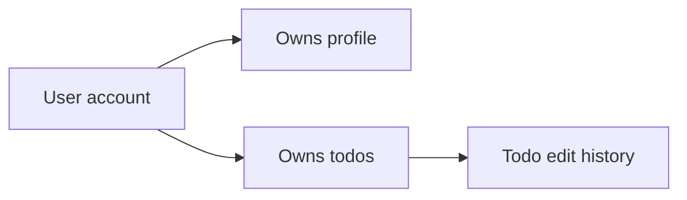
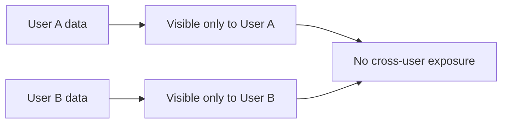
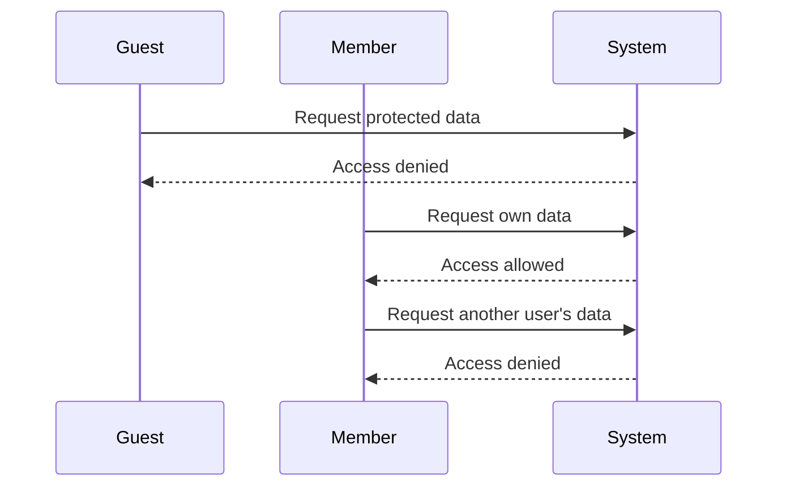
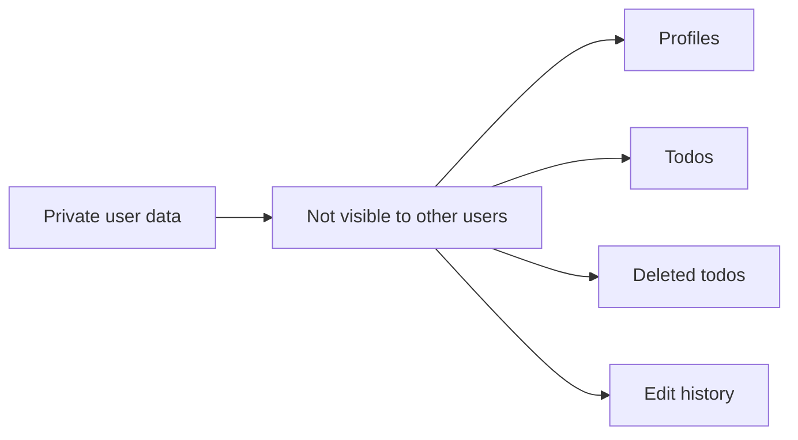

**todoApp — Data ownership, privacy, retention, and recovery policies**

Data ownership, privacy, retention, and recovery policies

# Data Policies

Data ownership, privacy, retention, and recovery policies from a business perspective.

## Data Ownership and Privacy

Define who owns what data, who can access it, and privacy boundaries between users.

### Data Ownership

The user owns their account data, profile data, and todos that belong to that account.
The system shall treat a todo as owned only by the user whose account it belongs to.
The system shall treat a profile as owned only by the user whose account it belongs to.
The system shall preserve ownership boundaries so that one user's data is not presented as another user's data.
The system shall prevent changes to another user's owned data.
The system shall ensure that deleting an account permanently removes all data owned by that account, including todos that are otherwise in a deleted state.

### Data Isolation

The system shall isolate each user's account data from every other user's account data.
The system shall isolate each user's profile data from every other user's profile data.
The system shall isolate each user's todo list from every other user's todo list.
The system shall isolate each user's trash view from every other user's trash view.
The system shall ensure that lists, details, and edit history are only available within the owning user's private data set.
The system shall not expose the existence, content, or history of another user's todos through normal viewing or browsing actions.
The system shall keep data isolation in place whether the todo is active, deleted, restored, or viewed through edit history.

### Access Control

The system shall allow a user to access only their own account data.
The system shall allow a user to access only their own profile.
The system shall allow a user to access only their own todos.
The system shall allow a user to access only their own deleted todos in the trash.
The system shall allow a user to access only the edit history of their own todos.
The system shall deny access when a user attempts to view, edit, delete, restore, or permanently delete data that does not belong to them.
The system shall deny access when a guest attempts to access data that requires an account.

### Privacy

The system shall keep user profiles private.
The system shall keep todos private.
The system shall keep deleted todos private.
The system shall keep todo edit history private.
The system shall not provide any way to view or access another user's profile, todos, deleted todos, or edit history.
The system shall not provide any way to share a user's profile or todo data with another user.
The system shall ensure that private data remains private across normal viewing, browsing, and recovery actions.

## Data Retention and Recovery

Define what happens to deleted data, how long it is retained, and how users can recover it.

### Soft Delete

Deleted todos are retained in a soft-deleted state instead of being removed immediately. A soft-deleted todo no longer appears in the normal todo list, but it remains available in the trash until it is restored or permanently deleted. Soft deletion applies to the todo itself and preserves the todo's edit history while the todo remains in trash.

### Retention

Soft-deleted todos remain available in trash until the user restores them or permanently deletes them. This retention policy exists so users can recover deleted todos when needed. No additional retention period is defined beyond keeping the deleted todo available in trash until one of those user actions occurs.

### Recovery

Users can recover a soft-deleted todo from trash. When a todo is restored, it returns to the normal todo list and is treated as an active todo again. After recovery, the todo no longer appears in trash.

### Permanent Deletion

Users can permanently delete a todo from trash. Permanent deletion removes the todo so it can no longer be restored. Permanent deletion also removes the todo's edit history, and the deleted todo no longer appears in either the normal todo list or trash.