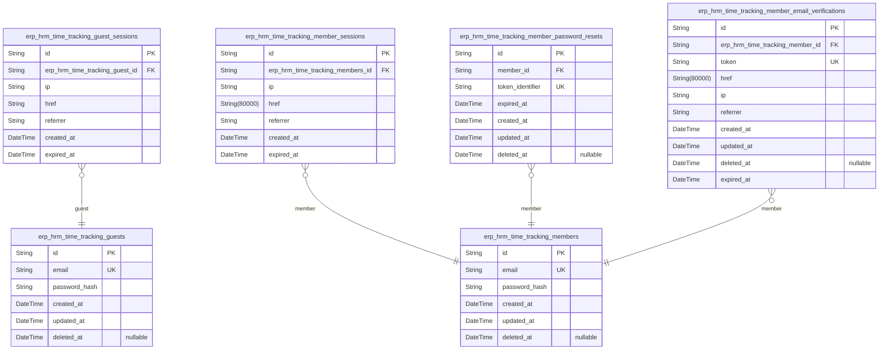
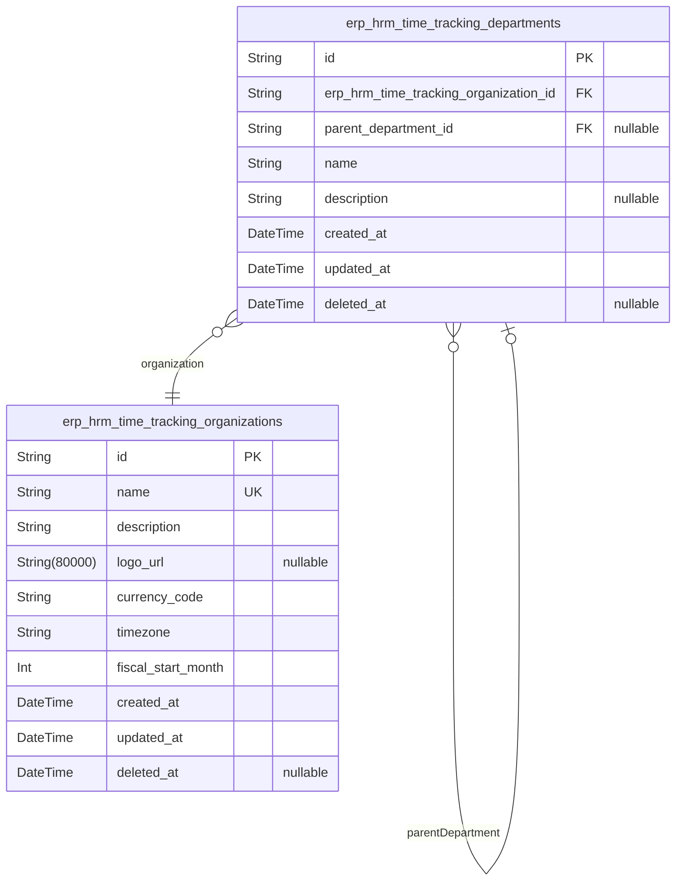
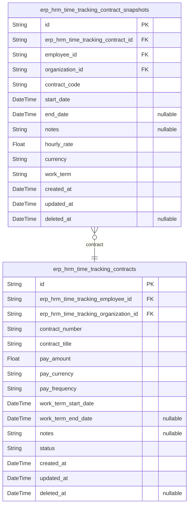
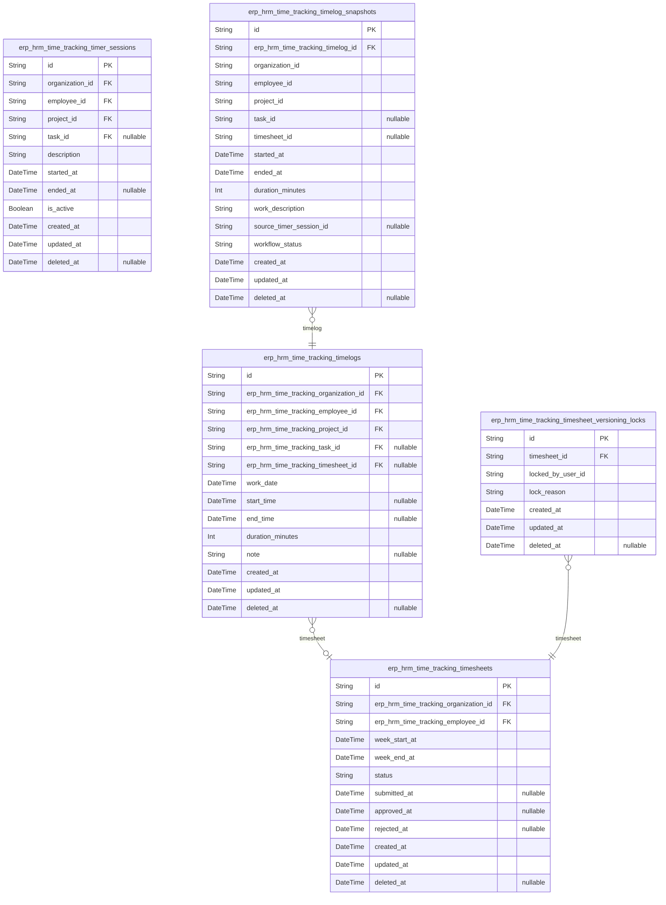
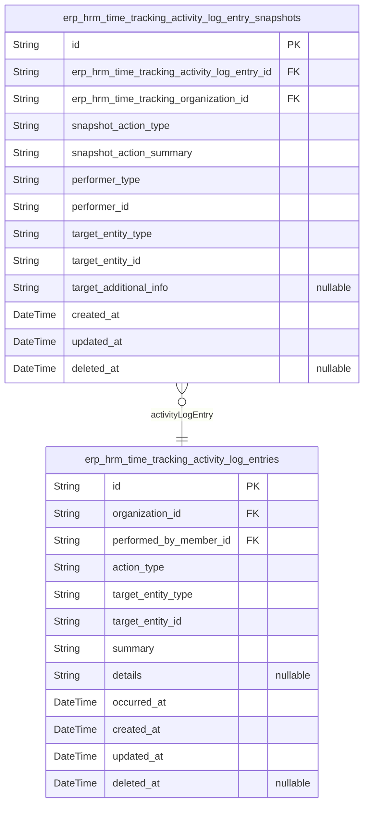
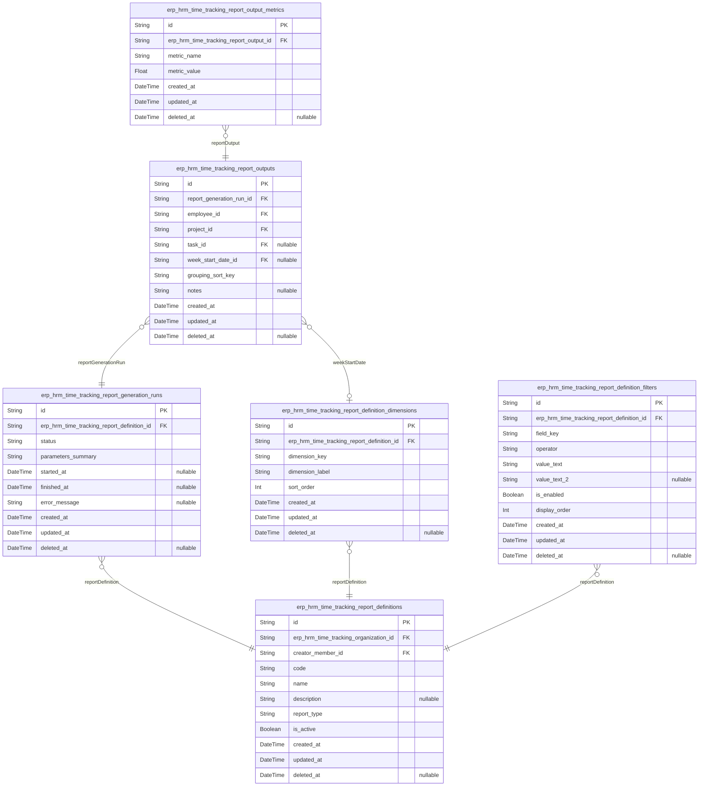

# Prisma Markdown

> Generated by [`prisma-markdown`](https://github.com/samchon/prisma-markdown)

- [Actors](#actors)
- [Organization](#organization)
- [Contracts](#contracts)
- [Projects](#projects)
- [TimeTracking](#timetracking)
- [Audit](#audit)
- [Reporting](#reporting)

## Actors

### `erp_hrm_time_tracking_guests`

Guest identity records used to correlate anonymous access attempts
without credentials.

This table represents the system’s guest actor identity. It is used as
the parent for guest sessions ({@link
erp_hrm_time_tracking_guest_sessions}) so that protected endpoints can be
gated by a valid session even before a user authenticates.

The guest actor itself is treated as an identity row; session connection
metadata and expiry live in the dedicated guest session table.

Properties as follows:

- `id`: Primary Key.
- `email`
  > Email address used to identify the guest identity for login correlation.
  > This value is unique across all guest identities.
- `password_hash`
  > Password hash for guest authentication where guest accounts are allowed
  > to authenticate with email/password.
- `created_at`: Creation timestamp.
- `updated_at`: Last update timestamp.
- `deleted_at`: Soft delete timestamp; null means the guest identity is active.

### `erp_hrm_time_tracking_guest_sessions`

Guest session records for permissionless entry gating to protected
endpoints. Each row represents a guest authentication/session token
instance with connection context (IP and referrer) and an explicit
expiration time for security auditing.

Properties as follows:

- `id`: Primary Key.
- `erp_hrm_time_tracking_guest_id`: Belonged guest identity record [erp_hrm_time_tracking_guests.id](#erp_hrm_time_tracking_guests).
- `ip`: Client IP address used when the guest session was created.
- `href`: Requested URL or token issuance href associated with this guest session.
- `referrer`: HTTP referrer header value recorded at session creation time.
- `created_at`: Session creation timestamp.
- `expired_at`
  > Expiration timestamp for this guest session; used to invalidate tokens
  > after expiry.

### `erp_hrm_time_tracking_members`

Registered authenticated member accounts for the ERP HRM time tracking
service.

This table is the canonical identity record for the "member" actor type
and stores credential-based authentication data (email and password
hash). It is the parent for member session and member self-service
workflow tables such as sessions, password resets, and email
verifications (implemented as separate tables in this component).

Soft deletion is supported via deleted_at; business logic should treat
soft-deleted members as unavailable for login and membership-related
operations.

Properties as follows:

- `id`: Primary Key.
- `email`
  > Unique email address used as the login identifier for member
  > authentication.
- `password_hash`
  > BCrypt/argon hash of the member's password for credential-based
  > authentication.
- `created_at`: Record creation timestamp.
- `updated_at`: Record update timestamp.
- `deleted_at`
  > Soft delete timestamp. When set, the member is considered deleted and
  > should not be authenticated.

### `erp_hrm_time_tracking_member_sessions`

Member login session records used to authenticate member requests and
support security features such as logout/revocation.

Each row represents a single session for exactly one {@link
erp_hrm_time_tracking_members.id} member, storing connection and request
context (IP, href, referrer) along with creation and expiry timestamps
for session validity auditing.

Properties as follows:

- `id`: Primary Key.
- `erp_hrm_time_tracking_members_id`: Belonged member [erp_hrm_time_tracking_members.id](#erp_hrm_time_tracking_members).
- `ip`: IP address observed when the session was created.
- `href`: The URL (href) associated with the session creation request.
- `referrer`: Referrer header value associated with the session creation request.
- `created_at`: Session creation timestamp.
- `expired_at`
  > Session expiration timestamp. After this time the session is considered
  > invalid.

### `erp_hrm_time_tracking_member_password_resets`

Stores password reset requests submitted by a member. Each row represents
a single reset token issuance, including the token identifier used by the
client and the expiration timestamp for validity checks.

This table references [erp_hrm_time_tracking_members.id](#erp_hrm_time_tracking_members) to
associate reset requests with the member who owns the credential reset
flow. Rows may be soft-deleted for retention/compliance without breaking
referential integrity.

Properties as follows:

- `id`: Primary Key.
- `member_id`
  > Belonged member for this password reset request ({@link
  > erp_hrm_time_tracking_members.id}).
- `token_identifier`
  > Opaque identifier embedded in the reset link/code, used to locate the
  > reset request during verification.
- `expired_at`: When this password reset token expires and must no longer be accepted.
- `created_at`: When the password reset request was created.
- `updated_at`: When the password reset request was last updated.
- `deleted_at`
  > Soft-delete timestamp to hide expired/invalidated reset requests while
  > preserving auditability.

### `erp_hrm_time_tracking_member_email_verifications`

Stores email verification tokens issued for member accounts so that a
member can confirm ownership of their registered email address. Each
record belongs to exactly one member and is used to validate a provided
token until it expires.

Properties as follows:

- `id`: Primary Key.
- `erp_hrm_time_tracking_member_id`: Belonged member [erp_hrm_time_tracking_members.id](#erp_hrm_time_tracking_members).
- `token`: Verification token presented by the member during email confirmation.
- `href`
  > Verification URL (or route link) associated with this token for
  > client-side confirmation.
- `ip`: IP address from which the verification was requested.
- `referrer`: HTTP referrer for audit context when the verification was requested.
- `created_at`: Record creation time.
- `updated_at`: Record last update time.
- `deleted_at`
  > Soft delete timestamp. Set when this token record is invalidated or
  > removed.
- `expired_at`: When this verification token expires and can no longer be used.

## Organization

### `erp_hrm_time_tracking_organizations`

Stores each organization (tenant) identity and its configuration settings.

An organization is the tenant boundary for all HR and time tracking data.
This table holds the core organization profile used for onboarding,
context switching, and interpreting business time-related fields such as
timezone and fiscal/calendar framing.

It is the root parent of organization-scoped entities like employees,
departments, projects, timelogs, and reports in other components via
foreign keys.

Properties as follows:

- `id`: Primary Key.
- `name`: Human-friendly organization name shown in the application tenant context.
- `description`
  > Brief description of the organization for internal/contextual display
  > purposes.
- `logo_url`: Optional logo image URL for branding in the organization context selector.
- `currency_code`
  > Currency code used for the organization’s financial framing (e.g., for
  > payroll-related calculations or monetary displays).
- `timezone`
  > IANA timezone identifier used to interpret date/time values within this
  > organization (e.g., Asia/Seoul).
- `fiscal_start_month`
  > The month number (1-12) that the organization uses as the start of its
  > fiscal period.
- `created_at`: Creation timestamp.
- `updated_at`: Last update timestamp.
- `deleted_at`: Soft delete timestamp. Null means the organization is active.

### `erp_hrm_time_tracking_departments`

Stores departments within an organization and supports an optional parent
department to model hierarchical org charts. Each department belongs to
exactly one organization, and may reference a parent department within
the same organization for nesting.

Properties as follows:

- `id`: Primary Key.
- `erp_hrm_time_tracking_organization_id`: Belonged organization [erp_hrm_time_tracking_organizations.id](#erp_hrm_time_tracking_organizations).
- `parent_department_id`
  > Optional parent department for hierarchical organization chart nesting
  > within the same organization.
- `name`: Department display name within the organization.
- `description`
  > Optional free-text description about the department’s purpose or
  > responsibilities.
- `created_at`: When the department record was created.
- `updated_at`: When the department record was last updated.
- `deleted_at`
  > When the department record was soft-deleted. Null means the record is
  > active.

## Contracts

### `erp_hrm_time_tracking_contracts`

Employment agreement records for a specific employee within an organization.

This table stores the contractual employment terms such as pay details
and working-term attributes. Each contract belongs to exactly one
organization and exactly one employee (an employee representation that
ties to user identity and organizational context). Contracts support
historical tracking through edits managed at the application level; soft
deletion is available for retiring records without breaking references.

[erp_hrm_time_tracking_members](#erp_hrm_time_tracking_members) provides the employee context, and
[erp_hrm_time_tracking_organizations](#erp_hrm_time_tracking_organizations) provides tenant isolation.

Properties as follows:

- `id`: Primary Key.
- `erp_hrm_time_tracking_employee_id`
  > Belonged employee [erp_hrm_time_tracking_members.id](#erp_hrm_time_tracking_members). This contract
  > is issued for a specific employee within an organization.
- `erp_hrm_time_tracking_organization_id`
  > Belonged organization [erp_hrm_time_tracking_organizations.id](#erp_hrm_time_tracking_organizations).
  > Used for tenant isolation and scoping.
- `contract_number`
  > External/internal contract reference number used for identification and
  > reconciliation.
- `contract_title`: Human-readable contract title summarizing the agreement.
- `pay_amount`
  > Pay amount specified by the contract (base amount before unit
  > interpretation).
- `pay_currency`
  > Currency code for the pay amount, typically aligned with the organization
  > currency.
- `pay_frequency`
  > Pay frequency or schedule type defined by the contract (e.g., monthly,
  > biweekly).
- `work_term_start_date`: Start date/time of the working term covered by the contract.
- `work_term_end_date`
  > Optional end date/time of the working term. Null indicates an open-ended
  > agreement.
- `notes`: Optional free-form notes or clause summaries associated with the contract.
- `status`
  > Contract lifecycle status (e.g., active, ended, draft) used to determine
  > whether the terms are currently in effect.
- `created_at`: Record creation timestamp.
- `updated_at`: Record last update timestamp.
- `deleted_at`
  > Soft delete timestamp. When set, the contract is considered retired
  > without hard deletion.

### `erp_hrm_time_tracking_contract_snapshots`

Point-in-time snapshots of employment contract data for auditability and
historical timeline views.

Each snapshot preserves the contract attributes as they existed at the
time of the snapshot. This allows reporting and auditing even after
changes are made to the active contract record.

[erp_hrm_time_tracking_contracts](#erp_hrm_time_tracking_contracts) is the source entity for the
snapshot (many snapshots per contract). The snapshot also stores stable
references to the owning [erp_hrm_time_tracking_members](#erp_hrm_time_tracking_members) and {@link
erp_hrm_time_tracking_organizations} to support historical queries.

Properties as follows:

- `id`: Primary Key.
- `erp_hrm_time_tracking_contract_id`: Belonged contract [erp_hrm_time_tracking_contracts.id](#erp_hrm_time_tracking_contracts).
- `employee_id`
  > Belonged employee [erp_hrm_time_tracking_members.id](#erp_hrm_time_tracking_members) for historical
  > querying.
- `organization_id`
  > Belonged organization [erp_hrm_time_tracking_organizations.id](#erp_hrm_time_tracking_organizations) for
  > tenant isolation in historical reads.
- `contract_code`
  > Business code or external reference for the contract at the time of
  > snapshot.
- `start_date`: Contract start date as recorded in the contract at snapshot time.
- `end_date`: Optional contract end date as recorded in the contract at snapshot time.
- `notes`: Optional free-form notes about the contract captured at snapshot time.
- `hourly_rate`: Pay rate (per hour) captured at snapshot time.
- `currency`: Currency code used for pay values captured at snapshot time.
- `work_term`
  > Working term / employment arrangement captured at snapshot time (e.g.,
  > full-time, part-time) as defined by the contract.
- `created_at`: When this snapshot record was created.
- `updated_at`
  > When this snapshot record was last updated (typically immutable after
  > creation).
- `deleted_at`: Soft-delete timestamp for the snapshot record.

## Projects

```mermaid
erDiagram
"erp_hrm_time_tracking_projects" {
  String id PK
  String erp_hrm_time_tracking_organization_id FK
  String name
  String color
  String status
  DateTime created_at
  DateTime updated_at
  DateTime deleted_at "nullable"
}
"erp_hrm_time_tracking_project_memberships" {
  String id PK
  String project_id FK
  String employee_id FK
  String membership_role
  DateTime created_at
  DateTime updated_at
  DateTime deleted_at "nullable"
}
"erp_hrm_time_tracking_tasks" {
  String id PK
  String erp_hrm_time_tracking_project_id FK
  String parent_task_id FK "nullable"
  String assigned_employee_id FK "nullable"
  String title
  String description "nullable"
  String status
  String priority
  Float estimated_hours "nullable"
  DateTime due_date "nullable"
  DateTime created_at
  DateTime updated_at
  DateTime deleted_at "nullable"
}
"erp_hrm_time_tracking_project_memberships" }o--|| "erp_hrm_time_tracking_projects" : project
"erp_hrm_time_tracking_tasks" }o--|| "erp_hrm_time_tracking_projects" : project
"erp_hrm_time_tracking_tasks" }o--o| "erp_hrm_time_tracking_tasks" : parentTask
```

### `erp_hrm_time_tracking_projects`

Projects within an organization. A project represents a
workspace/container for tasks and time logging, with a lifecycle status
used to filter projects and to prevent starting new timelogs after a
project is archived or completed.

Properties as follows:

- `id`: Primary Key.
- `erp_hrm_time_tracking_organization_id`: Belonged organization [erp_hrm_time_tracking_organizations.id](#erp_hrm_time_tracking_organizations).
- `name`
  > Project display name used for selection and filtering within an
  > organization.
- `color`
  > Hex-like or UI color value associated with the project for visual
  > identification in the UI.
- `status`
  > Lifecycle status of the project (e.g., active, archived, completed) used
  > to control allowed time logging and filtering.
- `created_at`: When the project record was created.
- `updated_at`: When the project record was last updated.
- `deleted_at`: Soft delete timestamp. Null means the project is not deleted.

### `erp_hrm_time_tracking_project_memberships`

Links an Employee to a Project as a single, explicit assignment. This
table is the basis for determining which employees can manage tasks
within a project and for driving the employee’s assigned project list.

Each row represents one employee-to-project membership. The membership
includes a role indicator (for example, regular member vs project-lead)
that drives authorization decisions at the service layer. Soft deletion
is supported so that historical data can be preserved while removing
active access.

Properties as follows:

- `id`: Primary Key.
- `project_id`: Belonged project [erp_hrm_time_tracking_projects.id](#erp_hrm_time_tracking_projects).
- `employee_id`: Belonged employee [erp_hrm_time_tracking_members.id](#erp_hrm_time_tracking_members).
- `membership_role`
  > Role of the employee within the project (e.g., project-lead vs member).
  > Used to drive permission decisions and UI presentation.
- `created_at`: When this project membership was created.
- `updated_at`: When this project membership was last updated.
- `deleted_at`: Soft delete timestamp. Null means the membership is active.

### `erp_hrm_time_tracking_tasks`

Tasks are work items inside a project. Each task belongs to exactly one
project, can optionally be nested under a single parent task (one-level
nesting), and can optionally be assigned to an employee who is eligible
for the project via project membership rules.

This table stores task metadata used for planning and execution such as
title, description, workflow status, priority, estimated working hours,
due date, and the optional assignee reference. Lifecycle timestamps
support auditing and soft deletion.

Properties as follows:

- `id`: Primary Key.
- `erp_hrm_time_tracking_project_id`: The task's owning project [erp_hrm_time_tracking_projects.id](#erp_hrm_time_tracking_projects).
- `parent_task_id`
  > Optional parent task for one-level nesting, referencing {@link
  > erp_hrm_time_tracking_tasks.id}.
- `assigned_employee_id`
  > Optional task assignee referencing the employee {@link
  > erp_hrm_time_tracking_members.id}. Eligibility is enforced by membership
  > rules at the service layer.
- `title`: Human-readable task title.
- `description`: Optional additional details describing what the task involves.
- `status`
  > Task workflow status (e.g., progress state) used to control how the task
  > is handled and displayed.
- `priority`: Task priority level used for ordering and planning.
- `estimated_hours`
  > Optional estimated effort for the task, expressed in hours for planning
  > and reporting context.
- `due_date`: Optional due date for scheduling and reminders. Stored as a datetime.
- `created_at`: Timestamp when the task was created.
- `updated_at`: Timestamp when the task was last updated.
- `deleted_at`: Soft delete timestamp. Null means the task is active.

## TimeTracking

### `erp_hrm_time_tracking_timelogs`

Recorded time entries for employees within an organization.

Each timelog belongs to an [erp_hrm_time_tracking_members.id](#erp_hrm_time_tracking_members)
(member/employee within an organization), is attributed to an {@link
erp_hrm_time_tracking_projects.id} (project), and may optionally be
associated with an [erp_hrm_time_tracking_tasks.id](#erp_hrm_time_tracking_tasks) (task within
the project). A timelog can also be included in a particular {@link
erp_hrm_time_tracking_timesheets.id} timesheet week when it has been
submitted/approved as part of that timesheet workflow.

This table stores the atomic unit of work captured by the user, including
the worked time window/amount and any optional note. Historical changes
are preserved in [erp_hrm_time_tracking_timelog_snapshots](#erp_hrm_time_tracking_timelog_snapshots) rather
than through inline JSON fields.

Soft deletion is supported via {@code deleted_at}.

Properties as follows:

- `id`: Primary Key.
- `erp_hrm_time_tracking_organization_id`: Belonged organization [erp_hrm_time_tracking_organizations.id](#erp_hrm_time_tracking_organizations).
- `erp_hrm_time_tracking_employee_id`: Belonged member/employee [erp_hrm_time_tracking_members.id](#erp_hrm_time_tracking_members).
- `erp_hrm_time_tracking_project_id`: Belonged project [erp_hrm_time_tracking_projects.id](#erp_hrm_time_tracking_projects).
- `erp_hrm_time_tracking_task_id`
  > Optional task attribution within the project {@link
  > erp_hrm_time_tracking_tasks.id}.
- `erp_hrm_time_tracking_timesheet_id`
  > Optional timesheet container this timelog is included in {@link
  > erp_hrm_time_tracking_timesheets.id}.
- `work_date`
  > The date/time representing when the work was performed (used for
  > timesheet week grouping).
- `start_time`: Optional start timestamp of the work interval.
- `end_time`: Optional end timestamp of the work interval.
- `duration_minutes`: Total duration of the worked entry in minutes.
- `note`: Optional free-form note describing the work performed.
- `created_at`: Record creation time.
- `updated_at`: Record last update time.
- `deleted_at`: Soft delete timestamp. Null means the record is active.

### `erp_hrm_time_tracking_timesheets`

Weekly container that groups an employee’s timelogs for a specific time
period and drives the approval workflow.

Each timesheet belongs to exactly one employee within exactly one
organization and represents one week (or week-like period) identified by
start/end boundaries. Timelogs are associated from the timelog side (via
an optional timesheet reference), while this table stores the workflow
status used to control editing and approval flows.

Properties as follows:

- `id`: Primary Key.
- `erp_hrm_time_tracking_organization_id`: Belonged organization [erp_hrm_time_tracking_organizations.id](#erp_hrm_time_tracking_organizations).
- `erp_hrm_time_tracking_employee_id`: Belonged member/employee [erp_hrm_time_tracking_members.id](#erp_hrm_time_tracking_members).
- `week_start_at`: Start timestamp of the timesheet week period (inclusive).
- `week_end_at`
  > End timestamp of the timesheet week period (inclusive or exclusive based
  > on service interpretation).
- `status`
  > Workflow status of the timesheet (e.g., draft, submitted, approved,
  > rejected).
- `submitted_at`: Timestamp when the timesheet was submitted for approval.
- `approved_at`: Timestamp when the timesheet was approved.
- `rejected_at`: Timestamp when the timesheet was rejected.
- `created_at`: When this timesheet record was created.
- `updated_at`: When this timesheet record was last updated.
- `deleted_at`: Soft delete timestamp. Null means the record is active.

### `erp_hrm_time_tracking_timer_sessions`

Live tracking session started by an employee while recording time. The
session stores the employee's currently selected project and optional
task, along with a running description used during active tracking.

This table supports concurrency-safe access by limiting active sessions
per employee (only one row marked as active for a given employee). Soft
deletion is supported via {@link
erp_hrm_time_tracking_timer_sessions.deleted_at} for auditability.

Properties as follows:

- `id`: Primary Key.
- `organization_id`: Belonged organization [erp_hrm_time_tracking_organizations.id](#erp_hrm_time_tracking_organizations).
- `employee_id`: Belonged member/employee [erp_hrm_time_tracking_members.id](#erp_hrm_time_tracking_members).
- `project_id`: Selected project [erp_hrm_time_tracking_projects.id](#erp_hrm_time_tracking_projects).
- `task_id`: Optional selected task [erp_hrm_time_tracking_tasks.id](#erp_hrm_time_tracking_tasks).
- `description`: Running description text attached to the active tracking session.
- `started_at`: When the tracking session started.
- `ended_at`: When the tracking session ended, if it has finished.
- `is_active`
  > Whether this session is currently active for the employee (only one
  > active session per employee).
- `created_at`: Creation timestamp.
- `updated_at`: Last update timestamp.
- `deleted_at`
  > Soft delete timestamp. Set when the session is removed from active use
  > but retained for history/audit.

### `erp_hrm_time_tracking_timesheet_versioning_locks`

Locks a specific timesheet to prevent concurrent edits during versioning
and workflow-sensitive periods. The lock is owned by an editing actor
context so the system can determine whether an update is allowed and can
safely release the lock when editing is completed.

Properties as follows:

- `id`: Primary Key.
- `timesheet_id`
  > The locked timesheet that this versioning lock applies to ({@link
  > erp_hrm_time_tracking_timesheets.id}).
- `locked_by_user_id`
  > The user identifier that holds the lock for the timesheet versioning
  > session (used to enforce lock ownership and safe release).
- `lock_reason`
  > Human-readable reason or workflow context for why the lock was created
  > (e.g., editing, approval preparation).
- `created_at`: When the versioning lock record was created.
- `updated_at`: When the versioning lock record was last updated.
- `deleted_at`
  > Soft-delete timestamp; set when the lock is released/cancelled and should
  > no longer be treated as active.

### `erp_hrm_time_tracking_timelog_snapshots`

Point-in-time audit history for an employee timelog. Each row captures
the full state of a timelog at the moment of snapshot creation,
preserving historical values even when the live {@link
erp_hrm_time_tracking_timelogs} record is edited or its workflow state
changes.

Properties as follows:

- `id`: Primary Key.
- `erp_hrm_time_tracking_timelog_id`: Belonged timelog snapshot owner [erp_hrm_time_tracking_timelogs.id](#erp_hrm_time_tracking_timelogs).
- `organization_id`: Organization owning this timelog at the time of the snapshot.
- `employee_id`: Employee that owns this timelog at the time of the snapshot.
- `project_id`: Project associated with the timelog at the time of the snapshot.
- `task_id`: Optional task associated with the timelog at the time of the snapshot.
- `timesheet_id`: Optional timesheet that includes this timelog at the time of the snapshot.
- `started_at`
  > Start timestamp of the work interval recorded in the timelog at the time
  > of the snapshot.
- `ended_at`
  > End timestamp of the work interval recorded in the timelog at the time of
  > the snapshot.
- `duration_minutes`
  > Computed duration in minutes for the interval recorded in the timelog at
  > the time of the snapshot.
- `work_description`
  > Free-text description/notes of the work for the timelog at the time of
  > the snapshot.
- `source_timer_session_id`
  > Optional timer session that produced this timelog at the time of the
  > snapshot.
- `workflow_status`
  > Workflow status of the timelog at the time of the snapshot (e.g.,
  > draft/submitted/approved/rejected).
- `created_at`: Snapshot creation time.
- `updated_at`: Last update time of the snapshot record metadata.
- `deleted_at`: Soft delete time for snapshot retention and administrative recovery.

## Audit

### `erp_hrm_time_tracking_activity_log_entries`

Organization-scoped audit activity entries recording who performed an
action, when it happened, what action type occurred, and which target
entity was affected. This table is used as a cross-domain observability
and audit trail that can reference different business entities through a
typed target reference without duplicating business data. Ownership is
enforced via {@link
erp_hrm_time_tracking_activity_log_entries.organization_id} pointing to
[erp_hrm_time_tracking_organizations.id](#erp_hrm_time_tracking_organizations). The actor performing the
action is stored via {@link
erp_hrm_time_tracking_activity_log_entries.performed_by_member_id}.

Target entity linkage is represented by a typed reference ({@link
erp_hrm_time_tracking_activity_log_entries.target_entity_type} + {@link
erp_hrm_time_tracking_activity_log_entries.target_entity_id}) so the
audit log can cover updates across the whole application without
introducing multiple nullable foreign keys.

Properties as follows:

- `id`: Primary Key.
- `organization_id`
  > Belonged organization for which this audit entry is recorded {@link
  > erp_hrm_time_tracking_organizations.id}.
- `performed_by_member_id`
  > Member user who performed the action {@link
  > erp_hrm_time_tracking_members.id}.
- `action_type`
  > Logical action key representing what happened (e.g., created, updated,
  > approved, rejected) in an application-specific taxonomy.
- `target_entity_type`
  > Business entity type name of the affected target (e.g., timesheet,
  > timelog, project). Used together with target_entity_id for polymorphic
  > targeting.
- `target_entity_id`
  > Business entity identifier of the affected target. Combined with
  > target_entity_type to form a typed target reference.
- `summary`
  > Human-readable short summary of the activity for auditing and support.
  > Kept generic to avoid duplicating full target entity details.
- `details`
  > Optional additional human-readable context explaining the change for
  > auditing purposes (e.g., key parameters, notes).
- `occurred_at`: When the action actually occurred in business time.
- `created_at`: When the audit entry record was created.
- `updated_at`: When the audit entry record was last updated.
- `deleted_at`
  > Soft delete timestamp for logically removing the audit entry when
  > required by data retention policies.

### `erp_hrm_time_tracking_activity_log_entry_snapshots`

Point-in-time immutable snapshots of {@link
erp_hrm_time_tracking_activity_log_entries} state for audit retention.

Each row captures the full, queryable context of an activity log entry as
it existed at the time the snapshot was created, so historical audit
trails remain available even if referenced domain entities are later
updated or deleted.

This table is append-only in practice and is designed for safe long-term
audit queries by time, actor, and affected target entity.

Properties as follows:

- `id`: Primary Key.
- `erp_hrm_time_tracking_activity_log_entry_id`
  > Belonged activity log entry that this snapshot represents {@link
  > erp_hrm_time_tracking_activity_log_entries.id}.
- `erp_hrm_time_tracking_organization_id`
  > Belonged organization tenant of this audit snapshot {@link
  > erp_hrm_time_tracking_organizations.id}.
- `snapshot_action_type`
  > Categorization of the action type that occurred for this activity log
  > entry snapshot.
- `snapshot_action_summary`: Human-readable summary of what the activity represents for audit viewing.
- `performer_type`
  > Actor category that performed the action (e.g., member). Used with
  > performer_id for polymorphic performer lookup in application queries.
- `performer_id`
  > Actor identifier of the performer for this snapshot. Pair with
  > performer_type for polymorphic lookup.
- `target_entity_type`: Type/category of the entity affected by this activity log entry snapshot.
- `target_entity_id`
  > Identifier of the affected entity. Pair with target_entity_type for
  > polymorphic lookup.
- `target_additional_info`
  > Optional extra textual details helpful for audit interpretation about the
  > target entity at snapshot time (stored as plain text, not structured
  > JSON).
- `created_at`: Snapshot creation time.
- `updated_at`: Snapshot record update time (should rarely change after creation).
- `deleted_at`: Soft delete timestamp for the snapshot record.

## Reporting

### `erp_hrm_time_tracking_report_definitions`

Organization-owned persisted report configuration. Each row represents a
reusable report definition that can later be used to generate report runs
and outputs for the [erp_hrm_time_tracking_organizations.id](#erp_hrm_time_tracking_organizations) tenant
context.

Properties as follows:

- `id`: Primary Key.
- `erp_hrm_time_tracking_organization_id`: Belonged organization [erp_hrm_time_tracking_organizations.id](#erp_hrm_time_tracking_organizations).
- `creator_member_id`
  > Member who created this report definition for organizational audit and
  > traceability [erp_hrm_time_tracking_members.id](#erp_hrm_time_tracking_members).
- `code`
  > Stable unique code identifying this report definition within the
  > organization (used by clients and integrations).
- `name`: Human-readable report name displayed in reporting UI.
- `description`
  > Optional longer explanation of what the report represents and how it is
  > intended to be used.
- `report_type`
  > Report type key (e.g., a template identifier) that determines supported
  > output shape for generated runs.
- `is_active`
  > Whether this report definition is currently active and eligible for new
  > generations.
- `created_at`: When this report definition was created.
- `updated_at`: When this report definition was last updated.
- `deleted_at`: Soft-delete timestamp. Null means the definition is not deleted.

### `erp_hrm_time_tracking_report_generation_runs`

Persisted record for each generation of a time-tracking report based on a
specific report definition. Stores generation status for auditability and
operational traceability, along with the generation parameter summary
needed to reproduce/identify the run.

Properties as follows:

- `id`: Primary Key.
- `erp_hrm_time_tracking_report_definition_id`
  > Belonged report definition {@link
  > erp_hrm_time_tracking_report_definitions.id} that this generation run was
  > created from.
- `status`
  > Current lifecycle status of the generation run (e.g., pending, running,
  > succeeded, failed).
- `parameters_summary`
  > Atomic summary string of the generation parameters used for this run to
  > support traceability and debugging.
- `started_at`
  > When generation started. Nullable because a run may be created in a
  > pending state before starting.
- `finished_at`: When generation finished (successfully or with failure).
- `error_message`: Error message captured when the run fails; null for successful runs.
- `created_at`: Record creation timestamp.
- `updated_at`: Record last update timestamp due to status/metadata changes.
- `deleted_at`: Soft delete timestamp. Null when the record is active.

### `erp_hrm_time_tracking_report_outputs`

Generated report output rows/aggregations produced for a specific report
generation run. Each row represents one grouped result (e.g., per
employee/project/task, optionally per week) and can be further broken
down by metric lines via {@link
erp_hrm_time_tracking_report_output_metrics}.

Properties as follows:

- `id`: Primary Key.
- `report_generation_run_id`
  > Belonged report generation run {@link
  > erp_hrm_time_tracking_report_generation_runs.id}.
- `employee_id`: Grouped employee [erp_hrm_time_tracking_members.id](#erp_hrm_time_tracking_members).
- `project_id`: Grouped project [erp_hrm_time_tracking_projects.id](#erp_hrm_time_tracking_projects).
- `task_id`
  > Grouped task [erp_hrm_time_tracking_tasks.id](#erp_hrm_time_tracking_tasks). If the report
  > definition does not include task grouping, this may be null.
- `week_start_date_id`
  > Optional grouped week start date token referenced from report definition
  > grouping settings. When the report definition uses week dimension, this
  > identifies the week bucket; otherwise it is null.
- `grouping_sort_key`
  > Deterministic string key derived from grouping values for stable ordering
  > and deduplication across generators.
- `notes`
  > Optional descriptive notes stored with this output grouping (e.g., for
  > exports or debugging).
- `created_at`: Creation time of the report output row.
- `updated_at`: Last update time of the report output row.
- `deleted_at`: Soft delete time of the report output row.

### `erp_hrm_time_tracking_report_output_metrics`

Optional per-output breakdown lines for multi-metric reports.

Each record stores one metric (identified by metric_name) and its
metric_value for a single generated report output row. This normalizes
metric name/value pairs so that report outputs can be generated with
varying metric sets without storing arrays or JSON in a single field.

This table belongs to a specific {@link
erp_hrm_time_tracking_report_outputs} row and is typically read and
exported together with its parent output. Soft deletion is supported via
deleted_at for audit-safe removal.

Properties as follows:

- `id`: Primary Key.
- `erp_hrm_time_tracking_report_output_id`: Belonged report output [erp_hrm_time_tracking_report_outputs.id](#erp_hrm_time_tracking_report_outputs).
- `metric_name`
  > Metric identifier/name for this breakdown line (e.g., 'hours', 'amount',
  > 'billable_hours').
- `metric_value`: Numeric value of the metric for the parent report output row.
- `created_at`: Record creation timestamp.
- `updated_at`: Record last update timestamp.
- `deleted_at`
  > Soft delete timestamp. When set, the metric line is treated as removed
  > without hard deletion.

### `erp_hrm_time_tracking_report_definition_dimensions`

Report grouping dimensions configured for a specific {@link
erp_hrm_time_tracking_report_definitions.id}.

Each row represents exactly one dimension used when aggregating report
output (for example employee, project, task, or week). The record is
designed to be managed as part of the report definition configuration,
not as a standalone entity.

Properties as follows:

- `id`: Primary Key.
- `erp_hrm_time_tracking_report_definition_id`
  > Belonged report definition {@link
  > erp_hrm_time_tracking_report_definitions.id} that owns this grouping
  > dimension.
- `dimension_key`
  > Machine-readable key identifying the grouping dimension (e.g.,
  > "employee", "project", "task", "week").
- `dimension_label`
  > Human-friendly label for the dimension used in report output headers or
  > UI rendering.
- `sort_order`
  > 1-based ordering of dimensions for deterministic grouping and
  > presentation.
- `created_at`: Record creation time.
- `updated_at`: Record last update time.
- `deleted_at`
  > Soft delete timestamp. When set, the dimension is considered removed from
  > the configuration.

### `erp_hrm_time_tracking_report_definition_filters`

Defines a single filter rule configured for an {@link
erp_hrm_time_tracking_report_definitions.id} report definition. Each row
represents one filter condition in a relational form so that report
generation can reliably apply filtering without storing JSON arrays.

Properties as follows:

- `id`: Primary Key.
- `erp_hrm_time_tracking_report_definition_id`
  > Belonged report definition {@link
  > erp_hrm_time_tracking_report_definitions.id}.
- `field_key`
  > The logical key of the report field/attribute to which this filter
  > applies (e.g., employee, project, task, date range).
- `operator`
  > The comparison/operator used to evaluate this filter (e.g., equals,
  > not_equals, in_list, contains, between).
- `value_text`
  > The primary filter value serialized as text for atomic storage. The
  > interpretation depends on the selected field_key and operator.
- `value_text_2`: Optional second value for range-style operators (e.g., between start/end).
- `is_enabled`: Whether this filter is currently enabled for the report definition.
- `display_order`
  > Ordering hint for deterministic evaluation/presentation of multiple
  > filters for the same report definition.
- `created_at`: Record creation timestamp.
- `updated_at`: Record last update timestamp.
- `deleted_at`: Soft delete timestamp. Null means the filter is active.
