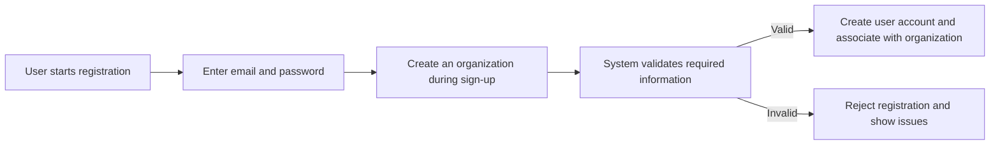
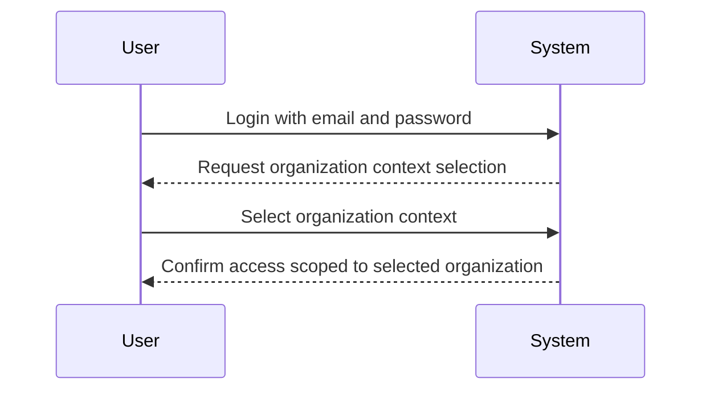
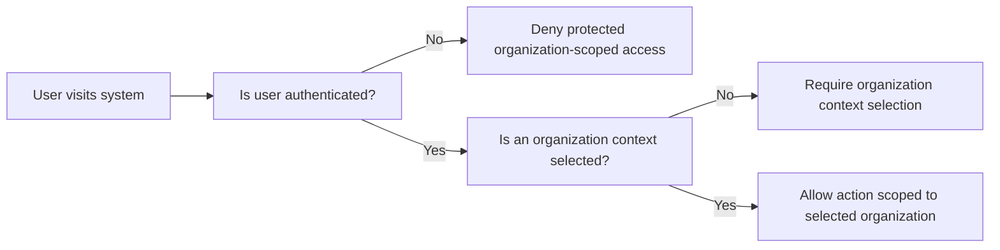
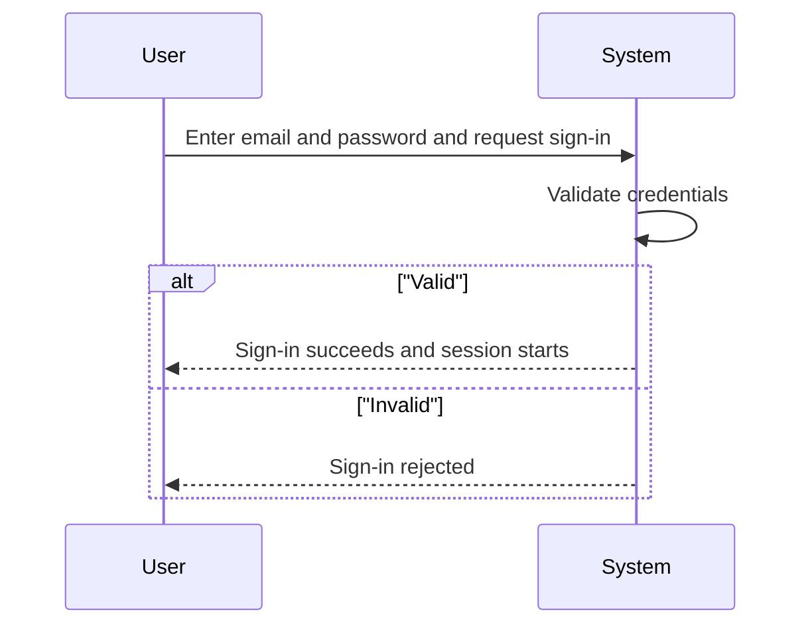
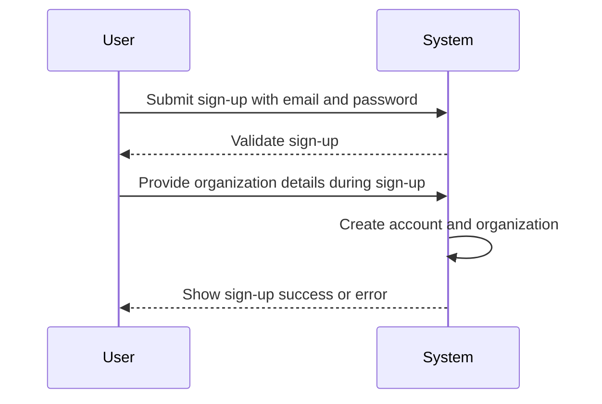
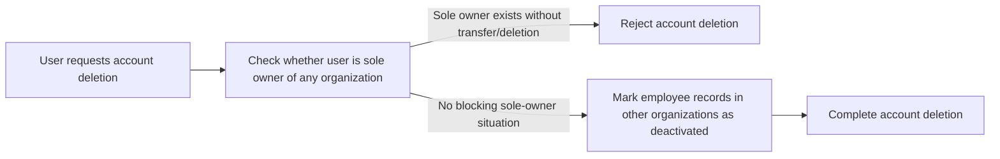
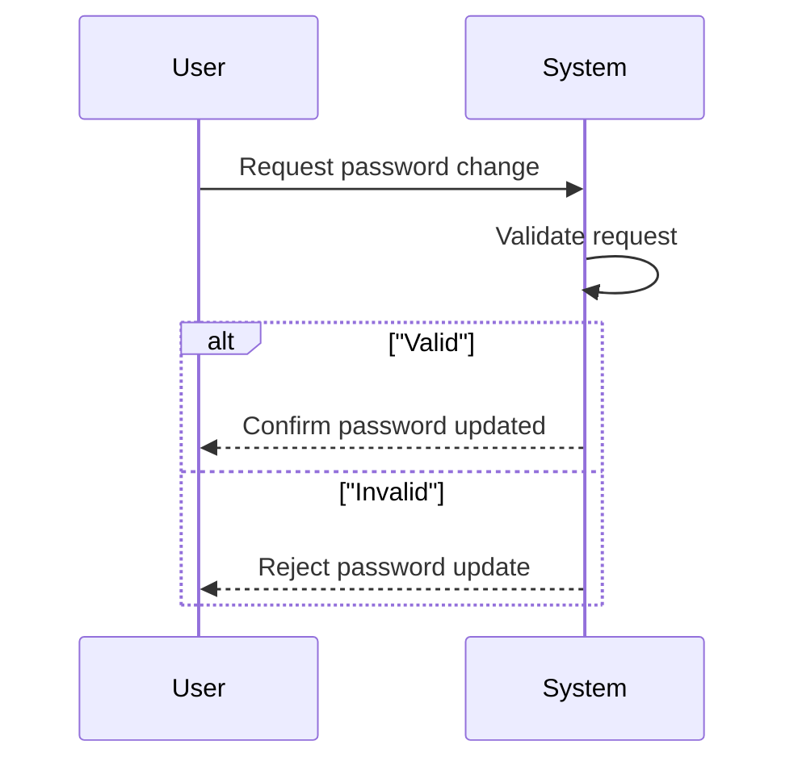

**erpHrmTimeTracking — Actor definitions, permission matrix, authentication, session, account lifecycle**

Actor definitions, permission matrix, authentication, session, account lifecycle

# Actor Definitions

Define all user actor types with their identity, permissions, and access boundaries.

## guest Actor

The guest actor represents a visitor who has not successfully authenticated into the platform. This actor has no organization context selected and therefore cannot perform actions that require an authenticated user. The guest actor does not have assigned roles within an organization because roles only apply after an authenticated session is established. Any permissions that could grant access to employee, project, time tracking, or reporting functionality are not available to the guest actor. The guest actor is limited to entry points that support signing up or initiating a login. If a guest attempts to access areas that require authentication, the platform must deny access and ask the visitor to sign in or create an account. The guest actor’s actions do not affect existing organization data, roles, or memberships. In practice, the guest actor should experience access boundaries that ensure all protected features remain unreachable until the user is authenticated.

### Guest Identity and Organization Context Absence

The guest actor represents a visitor who has not successfully authenticated into the platform.

While the visitor is a guest, the platform has no active organization context for them.

While the visitor is a guest, the platform does not associate them with any organization role.

Because no organization role is assigned, the guest actor does not have organization-specific permissions (even if they attempted to access features directly).

Any feature availability for the guest must be based solely on the fact that the visitor is unauthenticated and has no selected organization context.

### Permission-less Access Boundaries for Guest

The platform must restrict the guest actor from accessing any functionality that requires an authenticated user.

The platform must not grant the guest actor access to employee management, project and task management, time tracking, timesheet approvals, reports, activity log viewing, or organization dashboards.

If a guest attempts to access protected functionality, the platform must treat the guest as permission-less and deny access rather than attempting to infer permissions.

The platform must ensure that the guest actor’s actions do not affect organization data, roles, memberships, employee records, projects, tasks, timelogs, timesheets, or reports.

### Access Denied for Protected Areas (Session-Required Gating)

When a visitor who is a guest tries to reach any area that requires an authenticated session and an organization context, the platform must deny access.

After denial, the platform must guide the visitor to sign in or create an account, because the visitor’s current state does not include authentication.

The platform must ensure that the denial behavior is consistent across protected areas: the guest cannot proceed to viewing or changing protected content.

The platform must not reveal organization-specific information to the guest in the process of denial (such as existence of organizations or protected resources).

### Sign-up or Login Entry Behavior for Guest

The guest actor is allowed to reach entry behaviors that support creating an account or signing in.

When the visitor chooses to continue, the platform must transition the visitor out of the guest state only after successful authentication.

If the visitor chooses to sign up, the platform must proceed with the account creation flow; after the account exists, the platform must still require the visitor to establish an authenticated session before any protected organization-scoped actions can occur.

If the visitor chooses to sign in, the platform must validate the provided credentials as part of the sign-in process and establish an authenticated session only upon success.

Until authentication is successful, all protected organization-scoped actions remain unreachable.

### Guest-to-Authenticated Flow Gate (Business Flow)

flowchart LR
    A["guest (unauthenticated visitor)"] -->"sign up or login" B["entry to account creation or sign-in"]
    B -->"successful authentication" C["authenticated session established"]
    C -->"organization context required" D["user selects an organization to work in"]
    A -->"attempt protected area" E["access denied (session required)" ]
    E -->"sign in or create account" B

## member Actor

The member actor represents an authenticated user working within a specific selected organization context. The member actor has an organization-scoped role that determines what the user is allowed to do inside that organization. Roles are the basis for permissions, and the member actor’s permissions change depending on which organization context is currently selected. This actor can belong to multiple organizations, but only the currently selected organization’s role grants access at any given time. Built-in roles provide full or limited access according to their predefined capabilities, while custom roles can extend or reduce permissions based on the owner’s configuration. The member actor’s access boundaries ensure they can only reach functionality aligned with their granted permissions, such as managing employees, approving timesheets, or viewing reports when those permissions are present. If the member actor tries to perform actions without the required permission, the system must deny the request and keep the user within the boundaries of their role. The member actor’s identity and permissions remain consistent throughout their authenticated session for the selected organization until the user switches organization context or the session ends.

### Authenticated member identity and organization-scoped access

The member actor represents an authenticated user (authenticated organization-scoped user) who operates inside a specific selected organization context.

While a user is authenticated, the system must require that the user’s current organization context is selected before granting access to organization-scoped functionality.

The system must scope all authorization decisions for the member actor to the selected organization context (selected organization context).

If a user belongs to multiple organizations, the system must ensure the member actor’s accessible resources and permitted actions correspond only to the role granted in the currently selected organization.

The system must prevent cross-organization access by ensuring that a member actor cannot access organization-scoped information or functionality from an organization other than the currently selected one (cross-organization access via switching context is required; otherwise access is denied).

If the member actor attempts to access organization-scoped functionality while no organization context is selected, the request must be denied (permission-missing access denied scenarios).

### Role-based permission control within the selected organization

The member actor’s capabilities must be determined using role-based permission control (role-based permission control).

For a given selected organization context, the system must calculate what the member actor can do based on the organization-scoped role assigned to the user in that organization.

The system must treat permissions as additive based on the member actor’s assigned role: if the required permission for an action is not present in the assigned role for the selected organization, the request must be denied.

The member actor’s access boundaries must ensure that actions without the required permission are not allowed (permission-missing access denied scenarios).

When a member actor changes organization context within the same authenticated session, the system must update the member actor’s authorization scope accordingly, based on the role in the newly selected organization (session consistency for granted permissions is handled within the organization selection boundary).

### Built-in role capability boundaries (Owner, Manager, Employee)

The selected organization context must determine which built-in role capability boundaries apply to the member actor.

Owner: The system must allow a member actor with the built-in Owner role to have full access to all features within the selected organization, including managing roles and members.

Manager: The system must allow a member actor with the built-in Manager role to manage employees, manage projects, approve timesheets, and view organization reports within the selected organization (built-in role capability boundaries).

Employee: The system must allow a member actor with the built-in Employee role to track time, submit timesheets, and view their own data within the selected organization.

The system must deny any capability that is not included in the selected built-in role’s predefined permission set when performed by a member actor (permission-missing access denied scenarios).

The system must ensure built-in roles cannot be deleted as part of role management in the selected organization context (built-in role capability boundaries).

### Custom role permission configuration and enforcement

Organization owners can create custom roles in the selected organization context.

A custom role must have a configurable name and a set of permissions (custom role permission configuration).

The system must allow organization owners to edit custom roles’ permission sets in the selected organization context.

The system must enforce custom role permissions by granting only the permissions configured for that custom role to member actors assigned to it in the selected organization context.

If a member actor’s configured custom role does not include a permission required for an attempted action, the request must be denied (permission-missing access denied scenarios).

Custom role deletion must be blocked unless no employees are assigned to that custom role in the selected organization context.

Each employee in an organization must have exactly one role in that organization, and the member actor’s permissions must reflect only that single assigned role in the selected organization context.

### Cross-organization switching behavior for a member actor

A member actor who belongs to multiple organizations must be able to switch organizations without logging out (cross-organization access via switching context).

When switching organization context, the system must immediately update the member actor’s role-based permission scope to match the role in the newly selected organization context.

The system must prevent scenarios where the member actor could continue to access capabilities from a previously selected organization after switching to a new one.

If the member actor attempts to perform an action in the currently selected organization context that the member actor’s role does not permit, the system must deny the request (permission-missing access denied scenarios).

### Session consistency for granted permissions during the selected organization context

The member actor’s granted permissions must remain consistent throughout the authenticated session for the currently selected organization context (session consistency for granted permissions).

If the user changes only the organization context during the session, the member actor’s permission set must change accordingly to reflect the newly selected organization’s role.

If role assignments or permission configurations are modified for a role while a user is authenticated, the system must ensure authorization checks continue to apply according to the member actor’s role in the selected organization context, so that the user does not gain access to actions outside the permissions of the role applicable to that selected context.

The system must ensure that the member actor does not retain access to actions that become disallowed after the relevant selected organization context or role assignment is no longer applicable.

# Authentication Flows

Registration, login, logout, and session management from a user perspective.

## Registration and Login

Define user registration and login flows including validation and error handling.

### User Registration (Organization Creation Included)

- Users can sign up with an email address and password.
- During initial sign-up, the system allows the user to create an organization.
- An organization created during sign-up must include an organization name and description, and an organization logo image.
- An organization created during sign-up must include a currency, a timezone, and a fiscal start month.
- After sign-up, the newly created user account is associated with the organization created during sign-up.
- Users can belong to multiple organizations; membership is established through organization invitation flows (defined elsewhere) or organization creation during sign-up.
- The system must validate that required registration inputs are present; if required information is missing, registration is rejected.
- If the provided email is already in use for an existing account, the system must not create a duplicate account and must guide the user to login instead.
- If registration includes organization details, and any required organization detail is missing, the system must reject the registration request.
- If registration succeeds, the user is authenticated and can proceed to select an organization context for subsequent actions.

### Login and Organization Context Selection

- Users can log in using their email address and password.
- After a successful login, the system requires the user to select which organization context to work in.
- All subsequent actions after login must be scoped to the selected organization context.
- Users can switch organization context without logging out.
- If a user attempts to perform an organization-scoped action without selecting an organization context, the system must deny the action.
- If the email and password combination is incorrect, the system must reject the login attempt.
- The system must not allow users to access organization data that does not belong to the organization context they have selected.

### Authentication Behavior and Access Boundaries

- When a user is not authenticated, the system restricts access to protected organization-scoped features.
- When authenticated, the system enforces organization-scoped access based on the user’s selected organization context.
- If a user tries to access functionality that requires an authenticated organization context, the system must deny the request.
- The system must treat organization membership as the basis for what organization-scoped data the user can access.

## Session and Logout

Define session behavior and logout from a user perspective.

### Session Scope and Organization Context

When a user is logged in, the system maintains a session for the user.

After login, the user selects an organization context to work in.

While an organization context is selected, all subsequent actions are performed only within that selected organization.

If the user belongs to multiple organizations, the user can switch the selected organization context without logging out.

For any action that requires an organization context, the system requires an active selected organization context; if none is selected, the action is not allowed.

For any action that belongs to an organization (such as viewing employees, projects, tasks, timelogs, timesheets, timer activity, reports, or activity log), the system ensures the data shown or affected is from the selected organization only.

If a user switches organizations during an active session, the new selection changes which organization data is available for subsequent actions.

While the session is active, the user’s role and permissions for the selected organization determine which features are accessible within that organization.

### Logout Behavior

When a user chooses to log out, the system ends the current session.

After logout, the user no longer has access to features that require an authenticated session.

After logout, the user returns to an unauthenticated state with no organization context selected.

If the user logs back in, the organization context selection process occurs again as part of the new session.

The system records logout as a completed end of session action such that subsequent attempts to perform organization-scoped actions without logging in are not allowed.

### Account Security: Authentication Session Validity

User sign-in is based on email and password.

A user may change their password from their account.

When a user changes their password, the account password used for subsequent logins must reflect the new password.

After a successful login, the user can access session-based features according to the role assigned in the selected organization.

If login credentials are incorrect, the sign-in attempt is rejected and the user remains unauthenticated.

If a user attempts to perform protected actions without being authenticated, the action is rejected.

If a user’s account is deleted, the user can no longer authenticate and any existing session is no longer usable.

### Account Deletion Impact on Session and Access

When a user requests account deletion, the system determines whether the user is eligible based on organization ownership constraints.

If the user is the sole owner of any organization, the system does not allow account deletion until the user transfers ownership or deletes those organizations first.

If the user is eligible to delete their account, the system deletes the user account.

After account deletion, the user’s existing session is ended and the user can no longer access organization-scoped features.

For organizations other than the ones deleted during the account deletion process, the user’s employee records in those organizations are marked as deactivated.

Deactivated employees cannot log time or submit timesheets after the user account has been deleted.

A user who is no longer associated with any organization due to their account deletion cannot select an organization context in subsequent sessions.

# Account Lifecycle

Account creation, deletion, and password management.

## Account Management

Define how users create accounts, delete accounts, and change passwords.

### Account Creation

### Account Creation
Members and guests interact with account creation during sign-up. Users can create a new account by providing an email and a password.

### Organization Creation During Sign-Up
When a user signs up, they must create an organization as part of the initial sign-up flow.

### Required Organization Settings on Creation
At organization creation time, the organization must be created with:
- organization name
- organization description
- organization logo image
- currency
- timezone
- fiscal start month

### Initial Ownership
The creator of an organization becomes an organization owner for that organization.

### Adding Users to Multiple Organizations
After the initial sign-up, a user can belong to multiple organizations; future organization membership does not require the user to log out.

### Error Conditions for Account Creation
If the sign-up inputs are invalid or cannot create the required account and initial organization, the system rejects the request and does not create a partial account or organization.

### Account Deletion

### Account Deletion Availability
Users can request to delete their own account.

### Sole Owner Dependency for Organization Deletion
If the user is the sole owner of any organization, the system must not complete account deletion until the user first transfers ownership or deletes the organization(s) the user owns.

### Deactivation of Employee Records Across Organizations
When a user deletes their account, their employee records in other organizations must be marked as deactivated.

### Organization Deletion Preconditions Triggered by Account Deletion
The system must enforce organization deletion preconditions for any organization owned by the user, including that the organization can only be deleted when:
- all pending timesheets are resolved (approved or rejected)
- there are no active employee contracts

### Organization Deletion Data Handling
When an organization is deleted, the system permanently deletes organization-related data, including employees, projects, tasks, timelogs, and timesheets.

### Account Deletion Outcome for Remaining Ownerships
After an account deletion completes, the user’s account must remain non-associated with any organization; the system must ensure the user cannot act in any organization context.

### Error Conditions for Account Deletion
If the user attempts to delete their account while they still satisfy the “sole owner” condition for an organization without transferring ownership or deleting that organization first, the system rejects account deletion.

### Organization Context After Deletion
After account deletion, the user cannot select an organization context and cannot perform organization-scoped actions.

### Password Change

### Password Change Capability
Users can change their password.

### Authenticated Use Scope
A password change request applies to the currently signed-in user account.

### Password Change Input Requirements
A password change must include the information required to identify the new password choice, and the system must validate the request so that an invalid change does not affect the existing password.

### Effect of Password Change
After a successful password change, the updated password becomes the credential used for future logins.

### Error Conditions for Password Change
If the password change request is invalid, rejected, or cannot be applied to the user account, the system must reject the request and keep the existing password unchanged.

### Consistency With Subsequent Logins
If a user attempts to log in using the old password after a successful password change, the system must not authenticate the user with the old password and must require use of the updated password.

