**erpHrmTimeTracking — Business concepts, relationships, and states from user perspective**

Business concepts, relationships, and states from user perspective

# Domain Concepts

Describe what each concept means in the business domain and its key attributes.

## Organization Concept

An organization represents an independent business tenant within the ERP HRM and time tracking platform. It defines the boundary for all employee, project, task, and time-tracking information a user can work with while in that organization context. Each organization has its own identity, including a name and a description that help distinguish it from other organizations. Organizations also carry a logo image used for UI branding. A key attribute is currency, because time and budgeting views are meaningful in the organization’s chosen currency. The organization defines its timezone, which matters for how dates and weekly boundaries are interpreted in day-to-day reporting and time activities. It also defines its fiscal start month, which influences how the business considers financial periods. In the domain, the organization is the container that makes multi-tenancy real by ensuring other organizations’ data stays separate. When a user is associated with multiple organizations, the organization chosen as context determines which organization’s concepts they are referring to at any moment. Deletion of an organization has domain-level consequences: the organization’s employees, projects, tasks, time logs, and timesheets are permanently removed from that tenant context, while the owner’s account remains as a user without an organization association. Overall, organization attributes describe how the tenant is identified, localized, and financially framed in the platform.

### Organization as Independent Tenant Boundary

An organization is an independent tenant within the platform, creating a clear boundary for all HRM and time-tracking data.

Within an organization, employees, projects, tasks, timelogs, and timesheets belong to that organization’s context and are treated as separate from other organizations.

A user may belong to multiple organizations, and the organization selected for the session determines which organization’s employee, project, task, time tracking, and reporting information the user can access at that moment.

Data belonging to one organization must not be visible in the context of another organization.

If an organization is deleted, the tenant’s data boundary is removed: all organization employees, projects, tasks, timelogs, and timesheets are permanently removed from the platform.

After organization deletion, the user’s account is not removed; the account remains as a user account that is no longer associated with any organization that was deleted.

### Organization Identity Attributes

Each organization has an identity used to distinguish it within the platform.

An organization includes a name and a description.

An organization includes a logo image that represents the organization’s branding context.

The organization also includes a fiscal start month, which is used by the organization’s business period framing when working with organization-scoped business activities.

A user who is an organization owner can edit the organization’s identity and settings attributes.

If an organization is deleted, the organization’s identity no longer applies because the organization itself and its contained tenant data are permanently removed.

### Organization Currency and Business Financial Framing

Each organization defines a currency that characterizes how organization views involving budgeting and time-related reporting are presented.

Currency is an organization-level attribute, so users see currency-consistent reporting and budgeting information based on the currently selected organization.

When the organization’s owner edits organization settings, the organization’s currency can be updated and should then be used for subsequent organization-scoped reporting views.

### Organization Timezone and Interpretation of Time

Each organization defines a timezone that governs how time-related activities are interpreted within that organization.

The timezone is used so that employees and managers understand dates and weekly boundaries consistently for the selected organization.

Because time tracking and weekly timesheets depend on date boundaries, the organization timezone is treated as an organization-scoped context attribute for interpreting those time periods.

### Logo and Branding Context Across Organization Switching

The organization’s logo image is part of the organization’s branding context.

When a user switches the organization context, the branding context changes accordingly, reflecting the newly selected organization’s logo.

This ensures the same user can move between multiple organizations while maintaining clarity about which organization’s data and activities they are currently working within.

### Owner Account Remaining After Organization Deletion

When an organization is deleted, the organization owner account remains in the platform.

The remaining user account is no longer associated with the deleted organization, meaning the user cannot access any of the deleted organization’s employees, projects, tasks, timelogs, timesheets, or reports because those tenant data have been permanently removed.

This ensures that deleting an organization impacts only the organization tenant data boundary and not the continued existence of the user account itself.

## User Concept

A user represents a person who can access the ERP HRM and time tracking platform with authentication based on email and password. The user has a global profile that includes a display name, an avatar image, and a phone number. A single user account can be associated with multiple organizations, meaning the same person can work under different organizational contexts. The user’s relationship to organizations determines what role and access they have within each organization, rather than changing the global profile itself. From a domain perspective, the user is the anchor for identity across the entire platform, while organization context scopes what the user can see and affect. User-facing concepts tied to time tracking and HR—such as employee records, contracts, and timelogs—are connected to a user through organization membership and employment records. When a user deletes their account, the domain impact includes deactivating their employee records in other organizations where they are not the owner. This makes the user concept responsible for both ongoing participation and the possibility of being deactivated within tenant employment context. Overall, user attributes describe who the person is globally, while their membership across organizations determines how they are represented inside each tenant.

### User as Global Identity Anchor

A user represents a single person who can access the ERP HRM and time tracking platform using email-and-password authentication.

A user has a global identity that persists across all organizations they belong to.

A user can be associated with multiple organizations, and membership is what determines what the user can access inside each organization.

When the user’s account is deleted, the user concept remains relevant to other organizational data outcomes described elsewhere in the document, including deactivation of employee records in non-owned organizations.

The platform must treat the user’s global profile identity as shared across all organizations the user belongs to, rather than recreating a separate profile per organization context.

User identity is anchored to the user account itself, while organization context determines what HR and time tracking data the user can view and affect.

### Email and Password Based Access

Users access the platform by signing up with an email and password.

Users access the platform by logging in using their email and password.

Users can change their password.

After a user logs in, every subsequent action is associated with a specific organization context selected for that session (defined conceptually by organization scoping).

The platform must ensure that selecting an organization context determines which organization-scoped data and actions are available to the user, rather than mixing data across organizations.

### Global Profile Details

Each user has a global profile containing: display name, avatar image, and phone number.

Users can edit their global profile details.

Global profile information is shared across all organizations the user belongs to, meaning profile changes apply consistently in every organization context.

The profile details support both personal identification and communication within the platform’s organization-scoped settings and views.

### Display Name and Avatar

The user’s display name is part of the global profile (defined in [Global Profile Details]) and is used to represent the user across the platform in all organization contexts.

The user’s avatar image is part of the global profile (defined in [Global Profile Details]) and is used for visual representation of the user across the platform.

A user can update their display name and avatar as part of editing their global profile.

### Phone Number in Profile

The user’s phone number is part of the global profile (defined in [Global Profile Details]) and is available as a profile attribute across all organizations the user belongs to.

A user can update their phone number when editing their global profile.

The platform must consistently treat the phone number as a global profile attribute rather than an organization-specific value.

### Belonging to Multiple Organizations

A user can belong to multiple organizations.

A single user’s organization memberships determine which roles and employee representations exist for the user within each organization.

Membership in one organization does not imply membership in another organization.

When a user belongs to multiple organizations, the platform must support organization switching without requiring the user to log out.

While the user remains the same global identity, the user’s effective access and data visibility change when the organization context changes.

### Organization Context Scoping

When a user logs in, the platform requires an organization context selection to determine the scope for all subsequent actions.

All organization-scoped concepts tied to HR and time tracking—such as employee representation, contracts, timelogs, and timesheets—are interpreted within the selected organization context.

Switching the organization context changes what organization-scoped data the user can view and affect, without changing the user’s global profile.

Users can switch organizations without logging out, and the new selection must immediately scope subsequent actions to the newly selected organization.

### Employee Deactivation When Account is Deleted

When a user deletes their account, the platform must mark the user’s employee records in other organizations as deactivated.

Employee deactivation applies to organizations where the deleted user is not the owner.

Deactivated employee records preserve historical data outcomes defined elsewhere in the document, while preventing the deactivated employee from logging time or submitting timesheets.

If the user account deletion affects the user’s role as an employee in an organization, the platform must ensure that the employee representation within that organization no longer behaves as an active employee.

### Account Remaining Even After Organization Deletion

When an organization is deleted, the user’s account remains.

After organization deletion, the user who owned that organization remains associated with their account but is no longer associated with the deleted organization.

Organization deletion impacts organization-scoped data outcomes described elsewhere (including deletion of organization employees, projects, tasks, timelogs, and timesheets), while leaving global user accounts intact.

The platform must clearly preserve the distinction between account lifecycle (global user) and organization lifecycle (tenant), so that deleting one organization does not delete the user account.

### Organization Switching Flow (Conceptual Scoping)

flowchart LR
    A["User logs in"] --> B["Select organization context"]
    B --> C["System scopes actions to the selected organization"]
    C --> D["User switches organization without logging out"]
    D --> B
    C --> E["Global profile remains unchanged across contexts"]

### Account Deletion Impact Flow (Conceptual Deactivation)

flowchart LR
    A["User deletes their account"] --> B["For non-owned organizations: employee records are marked deactivated"]
    B --> C["Historical timekeeping data is preserved as defined elsewhere"]

## UserOrganization Concept

UserOrganization represents the membership link between a user and a specific organization. It captures the idea that a single user can participate in multiple organizations while each organization treats them as part of its own workforce and governance. The most important business attribute for UserOrganization is the role context, because it determines the user’s role within that organization. This role context is what connects the user’s membership to the permissions they are expected to have inside that tenant’s HR, projects, roles, and time approval workflows. UserOrganization is also the conceptual basis for separating what a user can do in one organization versus another, even if the same user account is used. If a user is deactivated from an organization due to account removal or other domain events, the user remains a global account but is no longer active as an employee within that tenant. When a user selects an organization context, the domain interpretation switches to the relevant UserOrganization membership. In other words, UserOrganization is the bridge that turns a global user into an organization-specific actor. This concept is central to the strict data isolation between organizations in the platform.

### User–Organization Membership Link

UserOrganization represents the membership link between a single user account and a specific organization within the platform.

A user can be associated with multiple organizations at the same time, and each association is represented as its own UserOrganization membership.

The organization side of the membership establishes the scope for workforce and governance concepts, so business data that is part of the organization (such as employees, projects, tasks, timelogs, and timesheets) is interpreted through the user’s membership in that organization.

If the user’s membership in an organization is removed or otherwise ends, the global user account can remain active, but the user is no longer treated as an employee within that organization.

### Role Context Per Organization

UserOrganization stores the role context for the user inside that specific organization.

The role context determines what the user is expected to be able to do inside that organization, because each organization treats roles as organization-specific authorities.

Each user must have exactly one role context within an organization at any time, reflecting the organization role that governs that user’s actions within that organization.

Built-in and custom roles are both applicable as role context within an organization, but the role context is always evaluated within the boundaries of the organization where the membership exists.

### Organization-Scoped Identity Through Context Switching

When a user selects an organization context, the platform interprets subsequent actions and displayed information based on the user’s UserOrganization membership for that selected organization.

Switching organization context does not require the user to log out and log in again; the user remains the same global account while the business interpretation changes to match the newly selected organization.

All organization-scoped identity expectations are tied to the selected UserOrganization membership, meaning the user’s effective role context and resulting visibility and capabilities are specific to the current organization context.

### Permission Expectations Via Role Context

For any organization-scoped action, the platform determines whether the user is permitted to perform that action by using the role context stored in their UserOrganization membership.

As a result, the same global user account can have different permission expectations in different organizations, depending on which role context the membership carries in each organization.

The role context must be the deciding factor for permission expectations rather than the user’s global profile attributes, so permissions are aligned to the organization’s workforce governance.

### A Global User Can Have Changing Employment Within Organizations

UserOrganization supports the idea that a user stays a global account even if their employment relationship changes within a particular organization.

A user may remain globally active while their employee representation within an organization changes over time, including becoming inactive as an employee.

This separation allows a user to belong to multiple organizations while each organization can individually control whether the user is an active employee for time tracking and workforce-related activities.

### Active Versus Deactivated Employee State (Within a Membership)

Within an organization, the employee representation of a user depends on that user’s membership state in the organization.

When a user is deactivated as an employee in an organization, the user cannot log time or submit timesheets in that organization.

Even when a user is deactivated, the user’s historical timekeeping information (such as timelogs and timesheets) remains preserved as historical records.

A deactivated employee can be reactivated later, restoring their ability to log time and participate in timesheet submission within that organization according to their role context.

### Tenant Isolation Through Membership

UserOrganization is the conceptual basis for strict tenant isolation.

Because data is isolated per organization, employees in one organization cannot see data from another organization even if those employees belong to multiple organizations as global users.

Users who belong to multiple organizations only see organization-specific data for their currently selected organization context, because their access and interpretation of data are driven by the corresponding UserOrganization membership.

When an organization is deleted, the effect is that the user’s association with that organization no longer produces any organization-scoped employee capability, while the global user account can remain but is no longer associated with any organization context that was removed.

## Role Concept

A role represents the set of expectations a person has within an organization, expressed through a role name and the permissions associated with it. Each organization has its own roles, meaning role names and meaning are tenant-specific rather than one universal definition. The domain includes three built-in roles that cannot be deleted: Owner, Manager, and Employee. These built-in roles define the highest-level categories of responsibilities users can hold inside an organization. Roles can also be custom, created to match how a particular organization wants to structure responsibility. A role is characterized by whether it is built-in or custom, which affects how it is treated within the domain. The core business meaning of a role is that it standardizes who can manage employees, manage projects and tasks, approve time, view reports, and manage organization settings—depending on the permissions attached to that role. Each employee in an organization is assigned exactly one role, making the role assignment the primary way the domain understands an employee’s authority. Custom roles can be edited as long as they meet the domain rules for assignments, and they can only be removed when no employees are associated with them. Overall, roles provide the vocabulary for organizational authority and help define what a user’s role means within that organization’s HR and time-tracking operations.

### Role as Organization Authority

A role represents the expectations a person has within a specific organization, expressed through a role name and the permissions associated with that role.

Each organization maintains its own roles, so the meaning of a role name is tenant-specific and does not automatically carry across organizations.

A user’s effective responsibilities inside an organization are determined by the role that the user holds in that organization.

Role permissions define what actions are allowed for a user in that organization, based on the permission set attached to the role.

A role is the primary domain mechanism for understanding organizational authority: it standardizes who can manage employees, who can manage projects and tasks, who can approve time, and who can view organization reports—according to the permissions configured for the role.

Every employee in an organization is assigned exactly one role, making role assignment the single source of role-based authority for that employee within the organization.

Roles are either built-in or custom, and the distinction affects how the role can be managed within the organization lifecycle.

### Built-in Roles Categories (Owner, Manager, Employee)

Each organization includes three built-in roles that cannot be deleted: Owner, Manager, and Employee.

Built-in roles act as the default responsibility categories for organizational operations and cover the most common patterns of authority for HR management and time tracking.

Owner is a built-in role that provides full access to all features within the organization, including management of roles and members.

Manager is a built-in role that is responsible for operational oversight across HR and time tracking, including managing employees, managing projects, approving timesheets, and viewing reports.

Employee is a built-in role focused on executing time-tracking work: tracking time, submitting timesheets, and viewing their own data.

The built-in role categories establish a baseline set of responsibilities that align with the platform’s HR and time-tracking workflows, while still using the same permission-driven model as custom roles.

### Owner Role Full Access

Within a given organization, users assigned the Owner role have full access to all features in that organization.

The Owner role includes the ability to manage organization roles and members.

The Owner role is the only built-in responsibility category explicitly defined to manage organization-wide authorization structures (roles and membership) in that organization.

Owner is governed by the role-based permission model, meaning the system derives allowed capabilities from the permissions attached to the Owner role in that organization.

### Manager Role Approval and Oversight

Within a given organization, users assigned the Manager role are responsible for oversight and management of day-to-day HR and time-tracking activities.

The Manager role can manage employees and projects and can approve or reject timesheets.

The Manager role can view organization reports.

Manager capabilities are defined by the permissions attached to the Manager role inside the organization.

When a Manager role is assigned to a user as an employee within the organization, the permissions attached to that role determine the user’s authority for managing employees, projects, and for reviewing timekeeping outcomes through timesheet approval.

### Employee Role Time Tracking

Within a given organization, users assigned the Employee role focus on tracking time and handling their own timekeeping records.

The Employee role can log time entries (timelogs), submit timesheets for approval, and view their own data.

The Employee role cannot manage employees, manage projects, approve timesheets for others, or view organization reports that are reserved for roles with the corresponding permissions.

Employee capabilities are determined by the permissions attached to the Employee role within that organization.

When a user is an employee in the organization under the Employee role, all employee-facing time-tracking actions are governed by that role’s permission set.

### Custom Role Creation and Definition

Organization owners can create custom roles to better match how the organization wants to structure responsibilities.

A custom role is defined by a role name and a set of permissions.

Custom roles use the same permission-based authority model as built-in roles: the system derives which actions are allowed for users holding the custom role from the permissions attached to it.

Organization owners can edit custom roles, updating both the custom role definition and its associated permissions.

Custom roles are intended to represent responsibility patterns not fully covered by the built-in categories, while still remaining strictly permission-driven within the organization.

### Built-in Versus Custom Roles (Domain Treatment)

Built-in roles are part of the organization by default and cannot be deleted.

Custom roles are created and managed by organization owners and can be edited as long as they satisfy role-assignment constraints.

A role’s category (built-in or custom) affects lifecycle management rules—built-in roles remain non-deletable, while custom roles can be removed only when it is safe with respect to employee assignments.

Regardless of category, roles participate in the same domain model of role assignment and permission-based authority within an organization.

### Role Assignment Exactly One Per Employee

Within an organization, each employee record is assigned exactly one role.

Role assignment establishes the employee’s authority within that organization for all role-permission-governed capabilities.

Because each employee has exactly one role, there is no ambiguity in which permission set governs the employee’s actions.

Any role assignment change applies to the employee within that organization, meaning the employee’s role authority is evaluated based on the current single role assignment.

### Custom Role Removal Depends on Assignments

Organization owners can delete custom roles only if no employees are assigned to them.

If employees are currently assigned to a custom role, the system must prevent deletion of that custom role to preserve role assignment integrity.

Once a custom role has no employees assigned to it, it can be removed by an organization owner.

Built-in roles are not subject to this deletion rule because they cannot be deleted by the organization at all.

### Role Basis for Organizing Permissions

Roles act as containers for permission expectations within an organization.

The permission set attached to a role determines whether a user can manage organization settings, manage or view employees, manage or view projects and tasks, manage or view timelogs, approve or reject timesheets, and view reports.

Because permission expectations are attached to roles, the system can interpret organizational capabilities consistently by evaluating the employee’s single assigned role.

In the domain, this creates a clear mapping from “what a role means” to “which capabilities are enabled,” enabling consistent authorization behavior across employees and organizational functions.

Custom roles extend the permission model by allowing organization owners to define new combinations of these permission expectations for the organization, while built-in roles provide pre-defined responsibility patterns.

## RolePermission Concept

RolePermission represents a single permission capability that can be attached to a role inside an organization. A role permission has a permission key that names what kind of action the permission allows in business terms. The platform’s permission model includes permissions for managing organization settings, managing employees, viewing employees, managing projects, viewing projects, managing time entries, approving time sheets, viewing time broadly, and viewing reports. In the domain, RolePermission is what translates a role into concrete business capabilities rather than being just a label. Each permission capability is meaningful only within the organization where the role exists, reinforcing tenant isolation. Built-in permissions reflect the platform’s core governance, such as editing organization settings and approving or rejecting timesheets. Role permissions also describe whether a person can add, edit, deactivate employees, and whether they can view employee lists and details. For project and task work, role permissions distinguish between creating and editing versus only viewing. For time tracking, role permissions distinguish between managing timelogs and the ability to approve or reject timesheets. For reporting and oversight, role permissions distinguish whether the user can view organization reports. Overall, RolePermission defines the actionable boundary for what a role can do in HRM, projects, time tracking, and reporting within its organization context.

### RolePermission as an Organization-Scoped Capability Attached to a Role

A role permission represents a single permission capability that can be attached to a role within an organization.

Each role permission capability has a business meaning that describes what actions a person with the role can perform in that organization.

A role permission capability exists only within the organization where the role is defined, so the same role name in different organizations can yield different authorization behavior because the attached role permissions are organization-scoped.

When a user’s role context is selected for a specific organization, the user’s available capabilities are determined by the set of role permissions attached to the role assigned for that organization.

Built-in roles and custom roles both use role permissions to define what users can do; role permissions are the mechanism that translates role definitions into concrete capabilities.

Role permissions for a role define governance boundaries across human resource management, project and task work, time tracking, timesheet review, and organization reporting, as described by the included permission capabilities.

A role permission capability is treated as a unit of authorization: either the role includes the permission capability (and the user can perform the business capability) or it does not (and the user cannot perform that capability in the selected organization context).

### Permission Key Business Meaning and Capability Categories

Each role permission capability has a permission key that names the capability in business terms.

The platform includes the following permission keys, each representing a business capability category:

- org:manage — the capability to edit organization settings.
- employee:manage — the capability to add, edit, and deactivate employees.
- employee:view — the capability to view employee lists and employee details.
- project:manage — the capability to create, edit, and delete projects and tasks.
- project:view — the capability to view projects and tasks.
- time:manage — the capability to edit or delete any employee’s timelogs.
- time:approve — the capability to approve or reject timesheets.
- time:view_all — the capability to view all employees’ timelogs and timesheets.
- report:view — the capability to view organization reports.

The permission key’s business meaning is what users should understand as the action boundary; it does not merely label the role, and it is not dependent on any single screen.

Permission keys are used consistently to express different capability types across HRM (organization and employees), delivery planning and execution (projects and tasks), timekeeping operations (timelogs and timesheets), and insight access (reports).

The capability categories collectively cover:
- Organization management permission
- Employee management and viewing
- Project management and viewing
- Time management capability
- Timesheet approval and rejection
- View-all time permission scope
- Report viewing permission

### Organization Management Permission Capability (org:manage)

The org:manage permission capability grants users the business capability to edit organization settings.

This permission capability is scoped to the selected organization, meaning a user can only edit settings for the organization where the role includes org:manage.

The org:manage permission capability is intended for governance over the organization’s HRM and time tracking setup context, rather than for day-to-day employee or timekeeping operations.

If a user’s role does not include org:manage within the selected organization, the user cannot perform edits to organization settings in that organization context.

### Employee Management and Viewing Permission Capabilities

The employee:manage permission capability grants users the business capability to add, edit, and deactivate employees within the selected organization.

Employee:manage also includes the business capability to change employee records within the organization as part of HR administration.

The employee:view permission capability grants users the business capability to view the employee list and view employee details within the selected organization.

employee:manage and employee:view are distinct capability categories: users may have one without the other, depending on the set of role permissions attached to their role.

Both employee:manage and employee:view are scoped to the selected organization, so a user’s ability to view or manage employees applies only to employees in that organization.

If a user’s role does not include employee:view in the selected organization, the user cannot view the employee list or employee details for that organization.

If a user’s role does not include employee:manage in the selected organization, the user cannot add, edit, or deactivate employees in that organization.

### Project Management and Viewing Permission Capabilities

The project:manage permission capability grants users the business capability to create, edit, and delete projects and tasks within the selected organization.

The project:view permission capability grants users the business capability to view projects and tasks within the selected organization.

project:manage and project:view are distinct capability categories: having one does not automatically grant the other.

Project-related permission capabilities are scoped to the selected organization, so the user’s ability to manage or view projects and tasks applies only within that organization’s project space.

If a user’s role does not include project:view in the selected organization, the user cannot view projects and tasks there.

If a user’s role does not include project:manage in the selected organization, the user cannot create, edit, or delete projects or tasks there.

### Time Management Permission Capability (time:manage)

The time:manage permission capability grants users the business capability to edit or delete any employee’s timelogs within the selected organization.

This permission capability expands timekeeping operations beyond actions taken by the timelog owner and applies to timelogs belonging to other employees in that organization.

time:manage is scoped to the selected organization, so the ability to edit or delete timelogs for other employees applies only within that organization context.

If a user’s role does not include time:manage in the selected organization, the user cannot edit or delete timelogs that belong to other employees in that organization.

### Timesheet Approval and Rejection Permission Capability (time:approve)

The time:approve permission capability grants users the business capability to approve or reject timesheets within the selected organization.

This permission capability covers the business responsibility of reviewing timesheets submitted for approval.

time:approve is scoped to the selected organization, so a user can only approve or reject timesheets for employees in that organization where their role includes time:approve.

If a user’s role does not include time:approve in the selected organization, the user cannot approve or reject timesheets submitted within that organization.

### View-All Time Permission Scope (time:view_all)

The time:view_all permission capability grants users the business capability to view all employees’ timelogs and timesheets within the selected organization.

This permission capability defines a wider viewing scope than viewing only one’s own time records.

time:view_all is scoped to the selected organization, so the user’s ability to view timelogs and timesheets across employees applies only within that organization context.

If a user’s role does not include time:view_all in the selected organization, the user cannot view timelogs and timesheets for all employees within that organization.

### Report Viewing Permission Capability (report:view)

The report:view permission capability grants users the business capability to access organization reports within the selected organization.

report:view is scoped to the selected organization, so report access applies only to reports of that organization where the user’s role includes report:view.

If a user’s role does not include report:view in the selected organization, the user cannot access organization reports in that organization context.

### Organization-Scoped Permissions and Tenant Isolation

Permissions represented by role permissions are organization-scoped.

When a user belongs to multiple organizations, their role permissions are applied based on the organization context selected at login.

Switching organization context changes the active set of role permissions and therefore changes what the user can do and view in that newly selected organization.

No employee, project, time record, timesheet, or report access is granted across organizations through role permissions; role permissions do not override tenant isolation.

As a result, the same user can have different permission outcomes in different organizations based on the role permissions attached to the role assigned in each organization.

## Employee Concept

An employee represents a person employed within a specific organization, tying a user account to workforce details used for HR and time tracking. Each employee record belongs to one organization and includes role assignment within that organization, which is the basis for what the employee can do in the domain. Employee information also includes optional department and optional position or title, allowing organizations to categorize their workforce. The employment type attribute describes the contractual relationship category, such as full-time, part-time, contractor, or intern. Employees also have a status that can be active or deactivated, reflecting whether they are currently considered available for time tracking and submission activity. Deactivated employees remain part of the historical workforce context, but they cannot perform new time tracking actions in their organization. Importantly, historical timekeeping data associated with a deactivated employee is preserved for auditing and reporting purposes. An employee can be reactivated, restoring their active status in the organization. The employee concept is where contract history attaches, since each employee can have multiple contracts over time. Employees also connect to projects through project membership, enabling time logging and task visibility based on project assignment. Overall, employee attributes define how a user is represented as part of the organization’s workforce and how active workforce status influences time-tracking eligibility, while preserving historical records.

### Employee as Organization Workforce Representation

An employee represents a person within a specific organization, connecting workforce information to the time tracking and reporting domain.
Each employee record belongs to exactly one organization and is used to scope employee-related data to that organization.
An employee record is the organization-scoped workforce identity for a user account, meaning the same user can have separate employee records across different organizations.
An employee record includes the employee’s assigned role in the organization (defined as part of role assignment for employee authority).
An employee record may optionally include a department and optional position/title to support organizational categorization.
An employee record includes an employment type that classifies the nature of the employment relationship as one of the allowed categories: full-time, part-time, contractor, or intern.
An employee record includes an employment status that can be active or deactivated, where status reflects whether the employee is currently eligible to perform time tracking and submission within the organization.
Employees are the link between workforce records and historical employment-related records such as contract history and timekeeping activity for the organization.
Employees can be associated with project work through project membership (defined in the project membership concept), and this association is what enables assignment-aware time tracking and viewing.

### Role Assignment for Employee Authority

Each employee in an organization is assigned exactly one role, and that role determines the employee’s permitted authority within the organization.
Built-in roles define the baseline authority categories within an organization, including Owner, Manager, and Employee.
When an employee’s role assignment is changed, the employee’s domain authority within that organization updates accordingly to reflect the new assigned role.
Custom roles (defined as part of role concepts) can also be assigned to employees in the organization to tailor authority.
Role assignment is a prerequisite for employees to meaningfully participate in the domain, because employee authorization expectations are derived from the role assigned to the employee in that organization.

### Optional Department and Position

An employee may be associated with a department in the organization, where the department attribute is optional.
If an employee has no department set, the employee remains a valid workforce record while not belonging to any department categorization.
An employee may optionally include a position/title to provide descriptive workforce labeling; this attribute is optional.
Department association and position/title are organization-scoped workforce details used to support employee categorization and reporting views.
If an organization removes a department, employee department references are cleared so that employees can still exist in the organization without a department association.

### Employment Type Categories

Each employee record uses employment type as a categorization of the employment relationship.
Employment type is one of the following allowed categories: full-time, part-time, contractor, intern.
Employment type is required as part of the employee record classification, enabling consistent filtering and reporting based on employment category.
Employment type remains a workforce classification over time and is tied to the employee record within the organization, supporting understanding of workforce composition in reports and views.

### Active Versus Deactivated Status

An employee’s status can be either active or deactivated.
Active status indicates the employee is currently considered available for time tracking and timesheet submission eligibility within the organization.
Deactivated status indicates the employee is not currently eligible to log time or submit timesheets.
Employee status changes affect time-tracking eligibility immediately for the employee’s organization-scoped workforce record.
An employee with deactivated status remains a persisted workforce record for the organization, so the organization can preserve historical workforce context.

### Deactivated Employees Cannot Log Time

If an employee is deactivated, the employee cannot create new timelogs in the organization.
If an employee is deactivated, the employee cannot submit timesheets for approval in the organization.
Deactivated employees may still access historical timekeeping data for viewing purposes, preserving the ability to audit past work (historical data preservation is defined separately in this file).
This eligibility restriction is driven by the employee’s status being deactivated within the selected organization context.

### Historical Data Preserved After Deactivation

When an employee is deactivated, historical timekeeping data associated with that employee is preserved.
Preserved historical data includes timelogs and timesheets already created for the employee while they were associated with the organization.
Preservation of historical data ensures that reporting, auditing, and review of past timekeeping activity remains possible even after deactivation.
Historical preservation applies even though the deactivated employee cannot perform new time tracking actions or timesheet submissions.

### Reactivation Back to Active State

An employee whose status is deactivated can be reactivated back to active status.
When the employee is reactivated, time-tracking eligibility is restored so the employee can log time and submit timesheets in the organization.
Reactivation updates the employee’s current status in the organization while preserving historical timekeeping records created previously.
Reactivation does not erase the employee’s historical context; it only changes the current eligibility status.

### Employee Linked to Contracts and Project Membership

Each employee is the attachment point for that employee’s contract history.
An employee can have multiple contracts over time, with the contract concept maintaining historical agreement records tied to the employee.
Employees are linked to projects through project membership, enabling the employee to participate in project-associated task visibility and time tracking within projects they belong to.
A specific employee’s ability to log time against a project is governed by the employee’s project membership association with that project.
Even when an employee is deactivated, their existing contract history and project membership context may still support viewing historical information and reporting needs.

## Department Concept

A department represents an organizational unit used to organize employees within an organization. Each department has a name and a description, helping users understand what the department stands for in the business. Departments can also be nested by having an optional parent department, allowing one level of hierarchy to be expressed. In the domain, departments are optional for employees, meaning not every employee must belong to a department. Departments exist as part of the organization’s HR structure and support filtering and viewing of employee information. When a department is removed from the organization’s structure, employees’ department association becomes null rather than deleting the employees, preserving workforce identity. This makes departments a flexible categorization layer rather than a mandatory employment record. Employees can view the list of departments, which reflects the organization’s current structural choices. Overall, departments provide a human-centered way to describe how the organization organizes its people, with attributes focused on naming, explanation, and optional hierarchy.

### Department Definition and Purpose

A department represents an organizational unit used to organize employees within a single organization.

A department provides a human-understandable grouping for workforce organization within the organization.

Departments exist as part of an organization’s HR structure, enabling users to understand how employees are categorized.

### Department Name and Description

Each department has a name.

Each department has a description that explains what the department stands for.

The department name and description are used to help users distinguish departments in the organization.

### Optional Parent Department (One-Level Hierarchy)

A department may have an optional parent department.

The parent relationship supports one level of hierarchy within the organization.

If a department has a parent, the department is considered a child within that single-level structure.

### Employees May Have No Department

An employee’s department association is optional.

An employee may have no department, meaning the employee is not assigned to any department within the organization.

If an employee has no department, the employee remains part of the organization workforce representation.

### Department Structure Within an Organization

Departments are defined within the context of an organization.

The department structure is specific to the selected organization, so the departments a user sees reflect that organization’s current HR structure.

Department relationships (including optional parent department links) apply within the same organization.

### Department Deletion Preserves Employees

If a department is removed from the organization’s structure, employees’ department association is set to null rather than deleting employees.

Deleted departments do not remove employee workforce identity; employees remain in the organization with no department assignment.

Historical workforce continuity is preserved by keeping employees even when their department is removed.

### Employees View the Department List

Employees can view the list of departments for their organization.

The displayed department list reflects the organization’s current department structure.

Employee viewing supports understanding available department categories even if an employee currently has no department assigned.

### Department Categorization for Filtering

Departments act as categorization labels that support how employees are organized and understood within the organization.

Employees can use department categorization when filtering and browsing employee information.

When employees filter by department, the available results reflect the employees whose department association is currently set to that department or left unset where applicable.

## Contract Concept

A contract represents an employment agreement record associated with an employee within an organization. Each employee can have multiple contracts over time, reflecting changes in pay or working terms across different periods. The contract includes a required start date to anchor when the agreement begins. It also includes an optional end date, where an ongoing contract has no end date. The contract has a pay rate and a pay period type, such as hourly, daily, weekly, or monthly. Contracts also store working hours per week as a required value, capturing expected weekly work capacity. Notes are optional, allowing additional context about the agreement’s terms. From a domain perspective, contracts are historical: only the current agreement is changeable in terms of updates, while past agreements remain immutable records for auditability. This historical nature ensures time and reporting can remain consistent with how employment terms changed over time. Employees can view their own contracts, making contract history part of the employee’s personal HR reference. Users with broader employee viewing authority can view contracts for any employee in the organization. Overall, the contract concept defines compensation and working expectations across time for an employee, while treating earlier contracts as permanent history.

### Contract as Employment Agreement Record

A contract represents an employment agreement record associated with an employee within an organization.

The contract is used to capture the employment terms that apply to that employee for a defined period.

A contract includes the following required elements:
- start date (required)
- pay rate (required)
- pay period type (required)
- working hours per week (required)

A contract may also include optional elements:
- end date (optional; may be left open for ongoing contracts)
- notes (optional)

From a business perspective, contracts are the historical record of employment terms over time, ensuring that time tracking and related understanding of compensation and expectations can reflect how terms changed.

### Multiple Contract History per Employee

Each employee can have multiple contracts over time.

The set of contracts for a single employee represents that employee’s contract history, reflecting changes in pay or working terms across different periods.

Only one contract is treated as the employee’s currently active agreement at any given time based on the contract’s start date and end date relationship.

Contracts are historical records: earlier contracts remain part of the employee’s contract history even after newer contracts begin.

### Required Start Date and Contract Timing Anchor

A contract must have a start date, and this start date serves as the timing anchor for when that employment agreement begins.

The active agreement for an employee is determined through the contract’s start date combined with its end date (where present) to establish whether the agreement is in effect for the relevant time period.

No contract can exist without a start date, because the start date is required to define when the agreement begins.

### Optional End Date for Ongoing Contracts and Active Concept

A contract includes an end date that is optional.

When a contract’s end date is not provided, the contract is treated as ongoing.

The end date establishes the period of validity for a contract; the agreement is considered active through the end date when an end date is provided, and remains active without an end date.

The concept of an active contract is defined by whether the contract is ongoing or whether the end date has not yet passed, ensuring that the employee has one currently active agreement at a time.

### Pay Rate and Pay Period Type

Each contract includes a pay rate.

Each contract also includes a pay period type that describes how the pay rate applies, using one of the allowed pay period types:
- hourly
- daily
- weekly
- monthly

Together, the pay rate and pay period type define the compensation terms for the contract period.

The pay rate and pay period type apply to the contract as an employment agreement record and are part of the employee’s historical contract set.

### Working Hours per Week

Each contract includes working hours per week as a required value.

This value captures the expected weekly work capacity under that contract’s employment terms.

Working hours per week is part of the contract’s historical record, enabling consistent understanding of employment expectations across contract changes over time.

Only the contract that is currently active represents the employee’s current working-hours expectation; prior contracts preserve their historical working-hours expectation.

### Optional Contract Notes

A contract can include optional notes.

Notes are used to store additional context about the contract’s terms.

Notes are part of the contract’s historical record, meaning that notes associated with an earlier contract remain available as part of that contract history.

Notes are not required for a contract to exist; the contract can still be complete based on its required timing and compensation elements.

### Historical Immutability of Past Contracts

Past contracts are immutable historical records.

Once a contract is no longer the active agreement, it becomes part of the employee’s contract history and is treated as not editable.

This historical immutability preserves the integrity of past employment terms so that contract history remains consistent over time.

The contract history therefore supports auditability of employment changes by preserving earlier agreement details as they were when they were active.

### Employee and Manager Visibility of Contracts

Employees can view their own contracts.

This includes viewing contract history over time, including past agreements and the currently active contract.

Users with broader employee viewing authority can view contracts for any employee within the organization.

Contract viewing applies to both historical contracts and the active contract, enabling managers to understand current terms and historical changes across employees.

## Project Concept

A project represents a work effort tracked within an organization, used to organize timelogs and the tasks employees work on. Projects have a name that identifies them and a description that can provide additional context for what the work is about. A project also includes a color code used for visual representation in the user experience. Projects have a status that describes where they are in their lifecycle, such as active, archived, or completed. Projects can optionally define budget hours as a total estimated amount for tracking budget consumption over time. Projects may also include optional start and end dates to express planned timing. In the domain, project status affects how new time tracking interacts with the project, because archived or completed projects are not meant to receive new timelogs while their existing timelogs remain preserved. Project deletion is governed by whether the project has any timelogs associated with it, reinforcing that time history is a durable asset. Projects form the top-level structure that tasks belong to, and project membership determines which employees can be associated with a project. Users with project viewing rights can browse projects with filtering by status, and lists are paginated for practical navigation. Overall, the project concept captures the essential identity, budgeting context, lifecycle status, and scheduling hints used to manage work and time tracking within an organization.

### Project as a Work Container

A project represents a work effort tracked within an organization and acts as the container that organizes employees’ work time and related tasks.

Within a project, tasks provide structure for specific items of work, and employees’ timelogs are associated to record time spent on the project’s work.

Because projects are organization-scoped, a project is used only within the organization it belongs to; employees and other time-tracking records associated to a project are therefore also scoped to that same organization.

Project membership determines which employees can be associated with a project for time tracking and task assignment purposes (via the defined project membership relationships).

### Project Identity: Name and Description

A project has a name that identifies it and is the primary label used when users browse or select the project.

A project also has an optional description that provides additional context about what the project is about.

The project name and description together define the business meaning and human-readable identity of the project for users working within the organization.

### Project Color Code for Visual Identity

Each project includes a color code intended for visual representation.

The color code is required so that the project can be consistently recognized visually when users view projects and when project context is shown alongside time-tracking and work items.

### Project Status Lifecycle: Active, Archived, Completed

A project has a status that expresses where it is in its lifecycle. The allowed project statuses are: active, archived, and completed.

The project status affects how time tracking interacts with the project:
- When a project is archived or completed, the project is treated as not accepting new timelogs.

Existing timelogs that were already associated with an archived or completed project remain part of the record and are preserved as historical time data.

Project status therefore separates projects that are currently usable for logging time (active) from projects that are closed to new time entries while retaining historical data (archived and completed).

### Budget Hours as Estimation and Reporting Context

A project may define budget hours as an optional total estimated amount of work time.

When budget hours are present, they serve as the baseline used to compare planned effort versus actual logged effort in organizational reporting.

Projects without budget hours are treated as not having budget context for budget comparison reporting.

### Optional Planned Timing: Start and End Dates

A project may optionally define a start date and an end date to express planned timing.

Either date may be omitted:
- The project can have only a start date.
- The project can have only an end date.
- The project can have both dates or none.

Start and end dates provide business planning context for the project, independent from the project’s lifecycle status.

### Archived and Completed Projects Preserve Existing Timelogs

When a project is archived or completed, the system preserves any existing timelogs already associated with that project.

The preserved historical timelogs remain available for viewing and reporting as time history.

Preservation applies even after the project transitions out of the active lifecycle status.

### Closed Projects Do Not Accept New Timelogs

When a project’s status is archived or completed, users are not allowed to record additional timelogs against that project.

The intent is that time history stays intact, while new time entries cannot be created for projects that are closed to new logging.

This rule is based on the project’s current status lifecycle state.

### Project Deletion Depends on Timelog Existence

Project deletion is governed by whether the project has timelogs associated with it.

A project can be deleted only when it has no timelogs associated with it.

If a project has timelogs, the timelog history acts as a durability constraint and prevents deletion, ensuring existing time records are not removed through project removal.

### Project Browsing: Filtering by Status and Pagination

Users who have project viewing rights can browse the list of projects within the organization.

The project list supports filtering by project status (active, archived, completed) so users can narrow the browsing scope to a lifecycle stage.

The project list is paginated, meaning results are returned in pages to support practical navigation through potentially large numbers of projects.

## ProjectMembership Concept

ProjectMembership represents the relationship between an employee and a project within an organization. It defines that an employee can be assigned to multiple projects, enabling flexible participation across work streams. Each membership is characterized by the employee, the project they belong to, and a project role that describes the employee’s responsibility within that project. The domain supports project roles such as member and project-lead, which influence how that employee can manage within the project. A project lead is the role that enables project-specific task management capability in the business domain. Membership also establishes whether an employee is considered a project participant for purposes such as viewing tasks and logging time against that project. Because timelogs require selecting a project that the employee is assigned to, the membership concept is central to which projects are eligible for time tracking. Removing an employee’s project membership changes their active set of project assignments, while not erasing the historical existence of their past time entries already recorded for that project. Overall, ProjectMembership is the domain bridge that turns a general employee into an authorized participant for a particular project and role within it.

### ProjectMembership: Relationship Between Employee and Project

ProjectMembership represents the relationship between an employee and a project within a single organization.
Each ProjectMembership includes:
- the employee (the participant in the organization’s workforce)
- the project (the work container within the organization)
- a project role that describes the employee’s responsibility within that project.
An employee can be assigned to multiple projects through multiple ProjectMembership records.
A project membership makes the employee a project participant for the purpose of viewing that project’s tasks and for time tracking against that project.
ProjectMembership is organization-scoped, meaning an employee’s membership applies only within the organization where the employee belongs.
When an employee is removed from a project, the employee’s current project assignments change, but the employee’s historical time entries recorded in the past remain associated with the project and remain part of the time history.

### Employee Can Join Multiple Projects (Multiple Memberships)

The domain supports employees participating in multiple projects at the same time.
An employee’s participation across projects is represented by multiple ProjectMembership entries—one per project.
Having more than one project membership determines the set of projects the employee is eligible to track time against.
ProjectMembership creation and removal directly affects what projects the employee is currently assigned to, without changing the employee’s global profile shared across organizations.
Employees can therefore log time across different projects based on the projects they are currently assigned to.

### Membership Includes Project Role (Member vs Project-Lead)

Each ProjectMembership includes exactly one project role that defines the employee’s responsibilities on that project.
The domain provides two relevant project roles:
- member
- project-lead
A project role determines the employee’s level of authority for task management within the specific project that the membership belongs to.
Project role is part of the membership relationship, so the same employee can have different roles on different projects through different memberships.
The project role within a ProjectMembership is what distinguishes responsibility for task management in that project context.

### Member vs Project-Lead Responsibilities

A member project role represents a participating employee who can be included in the project for the purposes of viewing project work and for time tracking eligibility through membership.
A project-lead project role represents a higher-responsibility role within the project, enabling project-specific task management capability in the business domain.
Both members and project-leads remain project participants for viewing tasks and for time tracking eligibility, but project-leads have additional task-management responsibility within the project.
Project-lead responsibilities apply within the boundaries of the project defined by the ProjectMembership; they do not automatically extend to other projects the employee may be assigned to.

### Project-Leads Manage Tasks Within Their Project

ProjectMembership with the project-lead role enables task management capability within the project that the membership belongs to.
Task management authority is tied to project-lead membership for that specific project, reflecting that project-lead capability is project-scoped.
Employees without a project-lead ProjectMembership for a given project do not have project-lead task-management responsibility for that project.
Because ProjectMembership can be removed or changed, project-lead capability for task management must follow the current membership state of the employee for each project.

### Membership Determines Eligible Time Tracking Projects

Time tracking against a project is eligible only when the employee is currently assigned to that project via ProjectMembership.
When an employee is assigned to a project, that project becomes eligible for the employee’s time tracking.
When an employee is removed from a project, that project is no longer eligible for the employee’s current time tracking assignments.
This eligibility is based on membership as the bridge between employee participation and project-level time tracking selection.
Historical time entries already recorded remain associated with the project even if the employee is later removed from the project.

### Employees Can View Which Projects They Are Assigned To

Employees can view the set of projects they are assigned to within the organization.
This view is based on the employee’s current ProjectMembership entries.
The employee’s current project list reflects active assignments resulting from membership creation and removal, rather than relying on historical time entries.
The projects shown for an employee correspond to the projects for which the employee is currently a participant through ProjectMembership.

### Removal Changes Current Assignments While Preserving History

Removing an employee’s project membership changes the employee’s current assignments by taking away that membership for the specific project.
After removal, the employee’s eligible projects for time tracking and project participation (for viewing and time tracking selection) must reflect the updated membership set.
The removal must not erase the employee’s historical time entries that were previously recorded for that project.
Past time entries remain associated with their projects for the purpose of historical reporting and auditability, even when the employee is no longer currently assigned.

## Task Concept

A task represents a unit of work inside a project, used to organize work items that employees can contribute time to. Each task has a required title that identifies it clearly and an optional description to explain what needs to be done. Tasks have a status that tracks their progress through states like open, in-progress, completed, and closed. A task also has a priority level, including low, medium, high, or urgent, which helps the business triage work importance. Tasks can optionally include estimated hours to express how much effort is expected. They can also optionally include a due date for scheduling and planning awareness. A task may be assigned to a specific employee, but that employee must be a project member, tying task assignment to project membership in the domain. Tasks also support optional subtasks through a parent task relationship, with only one level of nesting allowed, which keeps task hierarchies shallow and manageable. Task history records status changes over time, including the previous status, the new status, and who made the change, providing accountability in the domain. Tasks are visible to employees when they are assigned to them within projects. Overall, the task concept captures planned work details, progress tracking attributes, and the accountability trail for status transitions within a project context.

### Task as a Work Item Inside a Project

A task represents a unit of work inside a project (defined in [Project Concept]).
A task belongs to exactly one project.
A task is used to organize work items that employees can contribute time to via timelogs linked to tasks (timelog-task relationship is defined in [Timelog Concept]).
Tasks provide a clear identity within a project through a required title (defined in [Task Title]).
Tasks track their progress using a defined task status (defined in [Task Status Progress States]).

### Task Title and Optional Description

Each task has a required title that identifies the task clearly.
Each task may include an optional description to explain what needs to be done.
The title is required whenever a task is created.
If a task is created without a title, the task is not created and the request is rejected.
The description is optional and may be empty or omitted without affecting task creation.

### Task Status Progress States

Each task has a status that represents its progress through the business workflow: open, in-progress, completed, and closed.
A task’s status changes over time as work progresses and as users update the task (task status change history is defined in [Task Status Change History Accountability]).
The status values must be exactly one of the allowed progress states: open, in-progress, completed, or closed.
Closed indicates a terminal state for the task’s lifecycle in the business domain (task history records the transition to and from this state). 

```mermaid
flowchart LR
    A["open"] -->"in-progress" B["in-progress"]
    B -->"completed" C["completed"]
    C -->"closed" D["closed"]
    B -->"open" A
```

The business workflow diagram shows typical progression from open to in-progress to completed to closed, while still allowing changes back to open from in-progress as the domain permits status reversals that are recorded in history.

### Task Priority Levels

Each task has a priority value that helps triage the importance of the work.
Priority values must be exactly one of: low, medium, high, urgent.
The priority is used to support filtering and sorting when viewing tasks (filtering and sorting are handled in [04-business-rules.md]).
If a priority is not set for a task, the task must still have a valid priority value per the allowed set.

### Estimated Hours for Effort Planning

Each task may optionally include estimated hours to express the expected effort for the work.
Estimated hours are planning information and may be omitted.
When provided, estimated hours represent an estimate rather than the computed total from timelogs (estimated hours are distinct from time reported in reports).
Estimated hours are associated with the task as part of its domain attributes (defined in this section) and are shown when viewing task details.

### Optional Due Date for Scheduling

Each task may optionally include a due date to support scheduling and planning awareness.
If due date is not provided, the task can still exist without a due date.
When a due date is provided, it is used as a reference point for planning and for sorting/filtering behavior when tasks are listed (sorting by due date is defined in [04-business-rules.md]).

### Assigned Employee and Project-Member Constraint

A task may optionally be assigned to an employee.
If a task is assigned to an employee, that employee must be a project member of the task’s project (project membership is defined in [ProjectMembership Concept]).
A task assignment to an employee is therefore always scoped to membership within the task’s project.
Tasks may have no assigned employee when no person is responsible yet.

### Task Optional Assignment and Employee Visibility

Employees can view tasks in projects they are assigned to.
If a task has an assigned employee, that employee is included in the set of tasks visible to them within the project.
If a task has no assigned employee, it is not treated as specifically assigned to any employee, and therefore it does not create employee-specific visibility based on assignment.
Users without appropriate project scope (membership context is defined in [ProjectMembership Concept]) do not see tasks based on assignment alone; visibility is driven by the project membership context and the task assignment when applicable.

### One-Level Subtask Nesting via Parent Task

A task may optionally support subtasks through a parent task relationship.
The parent task relationship is limited to one level of nesting, meaning a task can have at most one parent task and can itself act as a parent for direct subtasks only.
Subtasks are organized within the same project context as their parent task.
A task can exist as a top-level task with no parent task, and can exist as a subtask with exactly one parent task.

### Task Status Change History Accountability

A task maintains a task history that records status changes over time.
Each task history entry records: the timestamp of the change, the old status, the new status, and who made the change.
Only status changes are recorded in the task history as defined for the task domain.
Task history provides accountability by showing the sequence of progress states for the task.
Employees can use the task history to understand how and when a task moved between statuses, including changes involving open, in-progress, completed, and closed.

## Timelog Concept

A timelog represents a recorded unit of time attributed to an employee for a particular date. It captures the duration in minutes and the context of what the employee worked on, which requires selecting a project that the employee is assigned to within the organization. A timelog may optionally reference a task that belongs to the selected project, allowing more precise time breakdown when the work is task-specific. Each timelog can include an optional description describing what was done, which helps make later review and reporting meaningful. Timelogs also carry a billable flag that indicates whether the logged time is considered billable or not for reporting purposes. In the domain, timelogs are constrained by employee eligibility: employees create timelogs only for themselves, while certain higher-permission roles can edit or view timelogs across employees. Timelog edits and deletions are restricted when the timelog is already included in an approved timesheet, making approved time durable for the organization’s audit trail. When employees are deactivated, they cannot create new timelogs, but their historical timelogs remain preserved as part of time records. Timelogs are paginated and support filtering by date range, project, task, and billable status, reflecting the operational need to review time accurately. Overall, timelogs are the foundational time records that connect dates, durations, project/task context, and billability for both individual visibility and organization reporting.

### Timelog meaning in the time tracking domain

A timelog represents a recorded unit of time attributed to an employee for a particular date.
A timelog captures the duration in minutes.
A timelog provides context for what the employee worked on by requiring a project selection within the organization.
A timelog may optionally be tied to a specific task within the selected project to support more precise time breakdown.
A timelog may include an optional description of what was done to make later review and reporting meaningful.
A timelog includes a billable flag that indicates whether the logged time is considered billable for billing-context reporting.
In the domain, timelogs are organization-scoped so that they relate to the selected organization context of the employee.
Employees can create timelogs only for themselves.
When higher-permission roles edit timelogs across employees, the timelog still remains an employee’s historical time record within the organization.

### Duration in minutes and date attribution

Each timelog records the date the time applies to.
Each timelog records the duration in minutes.
The duration and the date together define the recorded time unit used for timesheet totals and reporting.
Timelog records remain the basis for how approved time is preserved for organizational auditability.

### Project requirement for timelog work context

A timelog must be associated with a project.
The selected project must be a project that belongs to the same organization context as the employee recording the time.
If a timelog is associated with a task, that task must be within the same selected project.
Archived or completed project time is handled at the project level such that timelogs are prevented for those projects, while historical timelogs on archived/completed projects are preserved.

### Optional task within the selected project

A timelog may optionally reference a task.
When a task is provided, it must belong to the same project as the timelog’s required project.
The optional task reference supports grouping and breakdown of time by task in organization reporting.
Even when a task is optional, the timelog’s project association remains required for the timelog to be valid in the domain.

### Optional description for what was performed

A timelog may include an optional description of the work performed.
The optional description is part of the timelog’s stored context so that later review and organization reporting can reflect what the employee did.
Absence of a description does not prevent a timelog from existing, as the description is explicitly optional.

### Billable flag for billing-context reporting

A timelog includes a billable flag indicating whether the logged time is billable.
The billable flag is used to support later reporting distinctions between billable and non-billable time.
When filtering reports or views by billable status, timelog records drive the classification shown for the employee and the organization.

### Timelog edit and deletion durability after approved timesheet inclusion

Timelog edits and deletions are restricted once a timelog is included in an approved timesheet.
While a timesheet is not yet approved, timelogs included in it may be editable or removable subject to the rules governing the timelog’s ownership and the timelog’s approval status.
Once included in an approved timesheet, the timelog becomes durable as part of the organization’s time record so that the approved time cannot be changed through timelog-level edits or deletions.
Approved timesheet inclusion therefore functions as an audit-trail lock on the included timelogs.

### Deactivated employees and their historical timelogs

When an employee is deactivated, the employee cannot create new timelogs.
A deactivated employee’s historical timelogs are preserved as part of the organization’s time records.
Preservation means that previously recorded time remains available for review and reporting even after deactivation.
Reactivation restores the employee’s ability to create new timelogs going forward, while existing historical timelogs remain intact.

### Filtering and browsing of timelogs

Timelogs are paginated when viewed.
Timelogs support filtering by date range.
Timelogs support filtering by project.
Timelogs support filtering by task.
Timelogs support filtering by billable status.
Filtering is applied to timelog records within the currently selected organization context so that employees and managers only see timelogs belonging to that organization.

## Timesheet Concept

A timesheet represents an employee’s collection of timelogs for a specific week, defined from Monday to Sunday. It provides the domain container used for reviewing and approving an employee’s time for that week. Each timesheet is associated with one employee and has a week start date and week end date that establish its timeframe. Timesheets track workflow status through draft, submitted, approved, and rejected states, representing where the week’s time is in the review lifecycle. The timesheet also has calculated total hours, derived from the timelogs included in it, which gives a summarized view of the employee’s effort for the week. Domain attributes include timestamps that reflect submission and review moments, such as when the timesheet was submitted and when it was reviewed after approval or rejection. The concept also includes a reviewed-by identity indicating who made the decision. If a timesheet is rejected, the domain requires a rejection reason as part of the timesheet record so the employee knows why changes are needed. Approved timesheets lock the included timelogs from further edits or deletions, ensuring the organization can trust approved time. Employees can view their own timesheets and understand what stage each week is currently in. The organization’s review roles can view all submitted timesheets for oversight and approval decisions. Overall, the timesheet concept organizes timelog collections into reviewable weekly records with status, audit timestamps, and decision context.

### Timesheet as Weekly Container of Timelogs

A timesheet is the business container that groups an employee’s timelogs for a single reviewable week.
Each timesheet is associated with exactly one employee within an organization.
A timesheet provides the basis for the approval workflow decision for that week’s recorded time.
A timesheet includes all timelogs that fall within its defined week timeframe.
The timesheet concept is the unit employees and reviewers use to understand timekeeping progress for a specific week.
A timesheet has a calculated “total hours” value that summarizes the hours represented by its included timelogs.

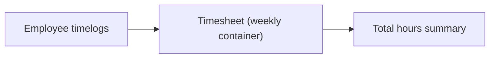

### Week Definition: Monday to Sunday

The timesheet’s week is defined as a Monday-through-Sunday timeframe.
The timesheet has a week start date that represents the Monday at the beginning of the timeframe.
The timesheet has a week end date that represents the Sunday at the end of the timeframe.
All included timelogs for a timesheet must fall within this Monday-to-Sunday timeframe.


### Timesheet Status Lifecycle (Draft, Submitted, Approved, Rejected)

A timesheet progresses through a set of business statuses: draft, submitted, approved, and rejected.
While a timesheet is in the draft status, it represents a work-in-progress state for that week’s time review.
When a timesheet is in the submitted status, it is ready for review by the organization’s approval roles.
When a timesheet is in the approved status, the organization has accepted the week’s time as final for review purposes.
When a timesheet is in the rejected status, the organization has not accepted the week’s submitted time and the employee must address the reason provided.
The current status of a timesheet communicates where the week stands in the review lifecycle.

```mermaid
flowchart LR
    A["draft"] -->"submitted" B["submitted"]
    B -->"approved" C["approved"]
    B -->"rejected" D["rejected"]
```

### Total Hours for the Week

Each timesheet provides total hours for its week.
The total hours value is calculated from the timelogs included in the timesheet.
Total hours represents a summarized view of the employee’s effort for that week.
The total hours is associated with the timesheet and changes only when the set of included timelogs is changed prior to approval.

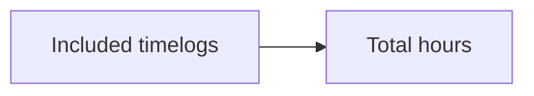

### Submission and Review Timestamps

A timesheet records when it was submitted.
The submission timestamp is captured when the timesheet enters the submitted status.
A timesheet also records reviewed timestamps that indicate when review occurred after approval or rejection.
The reviewed timestamp reflects the moment the decision was made for the timesheet.
For timesheets that have been approved or rejected, the timesheet includes the relevant reviewed moment to support auditability.

```mermaid
flowchart LR
    A["Draft"] -->"submit" B["Submitted (submission timestamp recorded)"]
    B -->"review" C["Reviewed (review timestamp recorded)"]
```

### Reviewed By: Approval or Rejection Decision Maker

A timesheet records who reviewed it after a decision.
For timesheets in the approved status, the timesheet indicates the identity of the reviewer who approved the week.
For timesheets in the rejected status, the timesheet indicates the identity of the reviewer who rejected the week.
The “reviewed by” information provides decision context for the employee and for organizational oversight.

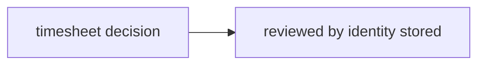

### Rejection Reason Requirement for Rejected Timesheets

When a timesheet is in the rejected status, the timesheet must contain a rejection reason.
The rejection reason explains why the timesheet was rejected so the employee understands what to change before resubmitting.
The rejection reason is part of the timesheet record and remains associated with that rejected decision.

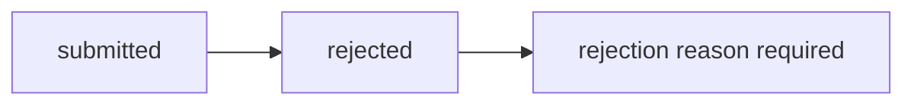

### Approval Locks Included Timelogs From Further Edits or Deletions

When a timesheet reaches the approved status, the timelogs included in that timesheet are locked from further edits or deletions.
This lock ensures that the organization can rely on approved timekeeping as unchangeable for the approved week.
Approved timesheets therefore represent final review outcomes for the included timelogs.

```mermaid
flowchart LR
    A["Approved timesheet"] -->B["Included timelogs locked"]
    B -->"No edits" C["timelogs cannot be edited"]
    B -->"No deletions" D["timelogs cannot be deleted"]
```

### Employee Visibility of Their Own Timesheets

Employees can view their own timesheets.
Employee visibility includes the current status of each timesheet so they know where their week stands.
Employees can see the submission and review information that corresponds to the timesheet lifecycle.
Employee access is limited to their own timesheets within the currently selected organization context.

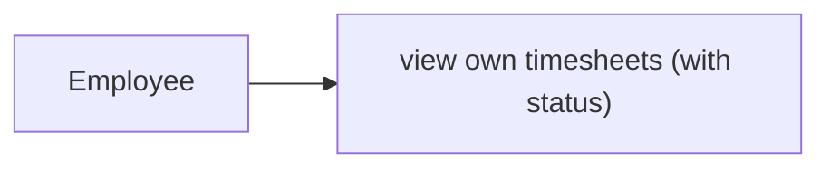

### Pagination and Filtering for Timesheet Lists

Timesheet listings support pagination.
Timesheet lists can be filtered by status.
Timesheet lists can be filtered by a date range.
When applying filters, the results reflect only timesheets within the relevant organization context.
The pagination and filtering behavior allows users to efficiently locate timesheets by status and by the timeframe of interest.

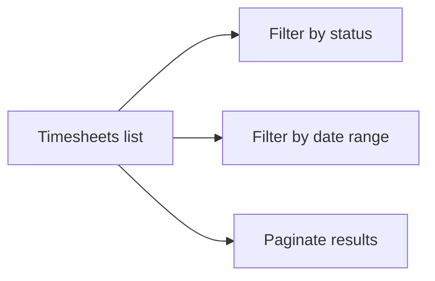

## TimerSession Concept

A timer session represents an employee’s live, real-time time tracking activity in the platform. It is associated with an employee and includes a start timestamp that marks when the live tracking began. A timer session also captures the work context by storing which project the employee is tracking time against, with an optional task for more granular attribution. The session includes a description that can describe what the employee is doing while the timer is running. The timer session can have a stop timestamp when tracking ends, and that stop marker is used to represent the finished live session in the domain. Importantly, the domain allows only one active timer session per employee at a time, which avoids conflicting live tracking records. If the employee discards a running timer session, no finalized timelog is created from that live session, meaning the session serves only as ephemeral tracking. If the employee forgets to stop the timer, the session remains active indefinitely, with no automatic expiration in the domain. During a running timer session, the employee can update the session’s description and adjust the selected project and task, keeping the work context aligned with what is happening. Overall, TimerSession is the domain model for real-time time capture, bridging live work context with later conversion into timelogs when tracking is stopped.

### Timer Session as Live Real-Time Time Tracking

A timer session represents an employee’s live, real-time time tracking activity in the platform.
A timer session is associated with a specific employee within an organization.
A timer session is the live bridge between what the employee is currently working on and the later creation of recorded time entries.
The timer session exists in a running form while live tracking is active, and it can end with a completed live session marker when tracking stops.
A timer session captures the work context that the employee is tracking at the time of live tracking (defined by the selected project and, optionally, a task).
If the employee discards a running timer session, no finalized timelog is created from that live session, and the session serves only as ephemeral live tracking context.
If the employee forgets to stop the timer, the timer session remains active indefinitely in the domain (no automatic expiration is implied by the domain).

### Core Timer Session Attributes: Start, Work Context, and Description

Each timer session has a start timestamp that marks when live tracking began.
Each running timer session selects a project to provide the context for what work the employee is tracking live.
The timer session can also optionally select a task to add more granular specificity within the selected project.
While the timer session is running, it includes a description that the employee can use to reflect what they are doing during the live tracking period.
During an active timer session, the work context remains anchored to the selected project and optional task, while the running description can be updated to match what the employee is doing.
The timer session therefore combines: a live start marker, a work context (project and optional task), and a live description that reflects ongoing work.

### Stop Timestamp, Single Active Session, and Editing During Active Tracking

A timer session records a stop timestamp when the employee ends tracking, and that stop marker represents the finished live session in the domain.
The domain allows only one active timer session per employee at a time, preventing multiple concurrent live tracking sessions for the same employee.
During a running timer session, the employee can edit the project and task selection to keep the tracked work context aligned with what is happening.
During a running timer session, the employee can also edit the description, keeping the live description consistent with the current work.
If a running timer session is discarded, it does not produce a finalized timelog, meaning the discard outcome results in no recorded time from that live tracking session.
If a running timer session is not stopped, the session remains active indefinitely until the employee stops it or discards it.

## TimesheetVersioningLock Concept

A timesheet versioning lock represents the domain rule that an already approved timesheet becomes protected from further modification. It is associated with an approved timesheet so that the included timelogs cannot be edited or deleted after approval. The lock concept includes a locked-at timestamp that records when the protection took effect, establishing an auditable moment for why timelogs became immutable. In business terms, this lock supports trust in the approval outcome by preventing accidental changes after a reviewer has approved the week’s time. The presence of the lock reflects that the timesheet is no longer in a modifiable state for its included timelogs, even if the employee still wants to adjust details later. When a timesheet is rejected, the domain does not consider it permanently locked, allowing the employee to work again on the draft. Therefore, the versioning lock is tied specifically to the approved outcome. Overall, TimesheetVersioningLock is a small but crucial domain concept that encodes the finality of approval for timekeeping records.

### Timesheet Versioning Lock Meaning and Scope

A timesheet versioning lock represents the business protection that applies when a timesheet reaches its approved outcome.

The lock’s purpose is to establish approval finality in timekeeping by making the included timelogs non-modifiable after approval.

When a timesheet is approved, the system considers the included timelogs protected from changes, so the timelogs are treated as immutable for the scope of that approved timesheet.

The lock is associated specifically with an approved timesheet outcome (not merely with submission or draft state), so the protection reflects that the approval decision took effect.

The lock includes a locked-at timestamp that records when the protection took effect, providing an auditable moment for why the timekeeping records became unchangeable.

Because the protection is tied to the approved outcome, the lock reflects approval finality rather than general record existence or ownership.

If a timesheet is rejected, the lock does not remain protective for that week’s work; the rejected timesheet returns to a modifiable state so the employee can adjust timekeeping details and resubmit.

Therefore, the versioning lock prevents edit and delete after approval for timelogs included in that approved timesheet, ensuring agreement between the reviewer’s decision and the timelog content.

### Approved Immutability and Rejection Re-Modifiability (Conceptual Flow)

The following business flow describes how the timesheet versioning lock concept affects whether included timelogs can be changed.

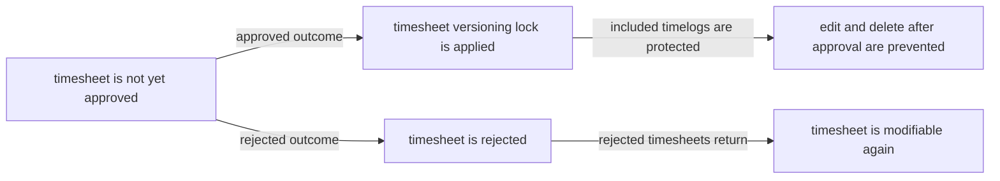

This concept ensures that approved outcomes have approval finality in timekeeping, while rejected timesheets return to a state where employee modifications and resubmission are allowed.

## ActivityLogEntry Concept

An activity log entry represents an auditable record of significant actions taken by users in the platform. Each entry captures a timestamp showing when the action happened, and it also records the user who performed the action. The entry includes an action type that identifies what kind of business event occurred, and it specifies a target entity describing what the action was about. In addition, each log entry includes details that provide context for the event, making the record understandable during review. The domain lists several categories of actions that must be logged, including inviting, deactivating, and reactivating employees, and creating or editing contracts. Project lifecycle actions such as creating projects, archiving, completing, and deleting projects are also captured as activity. Task status changes are included, reflecting changes in task progress with accountability. Timesheet decisions—submission, approval, and rejection—are also recorded, making it possible to trace time review outcomes over time. Role assignment changes are logged as well, covering how an employee’s authority within the organization changes. Users with org management authority can view the full activity log, which helps organizations audit operational changes. The activity log is paginated and can be filtered by action type, user, and date range, supporting targeted investigation. Overall, ActivityLogEntry provides a chronological domain trail of important governance and operational events within an organization.

### Activity Log Entry as Audit Trail

An activity log entry represents an auditable record of significant actions taken by users within a single organization.

Each activity log entry captures a timestamp indicating when the action happened, the user who performed the action, and an action type that classifies what kind of business event occurred.

Each activity log entry also identifies the target entity that was affected by the action, such as an employee record, contract record, project, task, timesheet, or role assignment.

The activity log entry includes details that provide sufficient business context to understand what changed or what decision was made, so the entry can be reviewed later for accountability and traceability.

Activity log entries provide an organization-level audit trail of operational and governance actions across key HRM, project, task, and timekeeping areas.

### Timestamped Significant Actions and Performer Attribution

Every activity log entry includes a timestamp showing when the significant action occurred.

Every activity log entry includes the user who performed the action.

These two fields together ensure that the organization can reconstruct a chronological sequence of actions and determine responsibility for each recorded event.

The activity log entry’s timestamp and performer attribution apply consistently regardless of the action category, including employee invitations and deactivations, contract creation and edits, project lifecycle actions, task status changes, timesheet submission and review decisions, and role assignment changes.

### Action Type Classification for Consistent Event Meaning

Each activity log entry includes an action type that classifies the business event being recorded.

The action type distinguishes between categories of events captured by the domain, including:
- employee invited, deactivated, and reactivated events
- contract created and edited events
- project created, archived, completed, and deleted events
- task status change events
- timesheet submitted, approved, and rejected events
- role assigned or changed events

Using action types ensures that users with viewing authority can interpret entries and filter them consistently based on the category of action that occurred.

### Target Entity and Event Details for Audit Context

Each activity log entry includes a target entity that indicates what the action was about.

The target entity and included details must together provide event context so that a reviewer can understand both the subject of the action and the business outcome.

Event details are required to include enough information to make the log entry self-explanatory for the listed action categories, such as:
- which employee was invited or deactivated/reactivated
- which contract was created or edited
- which project was created, archived, completed, or deleted
- which task had its status changed
- which timesheet was submitted, approved, or rejected (including the outcome and the reason context when applicable)
- which role assignment changed for an employee within the organization

This structure ensures that action type classification is complemented by specific details that describe the affected entity and the business meaning of the event.

### Employee Invitation and Deactivation/Reactivate Events

Activity log entries must be created for employee invite actions made into the organization.

Activity log entries must be created for employee deactivation actions.

Activity log entries must be created for employee reactivation actions.

For these employee lifecycle events, each activity log entry must record:
- the user who performed the action
- the timestamp of when the action occurred
- an action type that reflects whether the event was an invite, deactivation, or reactivation
- the target entity identifying the employee record affected
- details that provide the business context of the employee lifecycle change

These logged events support accountability for workforce changes within the organization.

### Contract Creation and Edit Events

Activity log entries must be created when contracts are created for an employee.

Activity log entries must be created when the current active contract is edited.

For contract-related events, each activity log entry must record:
- the user who performed the action
- the timestamp of when the action occurred
- an action type that reflects whether the event was contract creation or contract edit
- the target entity identifying the contract record affected
- details providing event context about the contract change

Contract creation and edit logging ensures that contract history and modifications can be audited over time.

### Project Lifecycle Events: Create, Archive, Complete, Delete

Activity log entries must be created for project creation actions.

Activity log entries must be created for project archive actions.

Activity log entries must be created for project completion actions.

Activity log entries must be created for project deletion actions.

For project lifecycle events, each activity log entry must record:
- the user who performed the action
- the timestamp of when the action occurred
- an action type that reflects which lifecycle event occurred (created, archived, completed, or deleted)
- the target entity identifying the project affected
- details providing context about the lifecycle action

This ensures the organization can trace project governance decisions and irreversible outcomes like deletion through the audit trail.

### Timesheet Review Events: Submitted, Approved, Rejected

Activity log entries must be created when an employee submits a timesheet for approval.

Activity log entries must be created when a submitted timesheet is approved.

Activity log entries must be created when a submitted timesheet is rejected.

For timesheet review events, each activity log entry must record:
- the user who performed the action (including the employee who submitted and the reviewer who approved or rejected)
- the timestamp of when the action occurred
- an action type that reflects submitted, approved, or rejected
- the target entity identifying the timesheet affected
- details providing the outcome context, including rejection reason context when a timesheet is rejected

These entries allow the organization to audit timekeeping decisions and review outcomes over time.

### Task Status Change Events

Activity log entries must be created whenever a task status changes.

For task status change events, each activity log entry must record:
- the user who made the change
- the timestamp of when the status change occurred
- an action type that classifies the event as a task status change
- the target entity identifying the task affected
- details that provide context for the transition, including the previous status and the new status

Task status change logging provides accountability for task progress updates and supports later review of why and when work moved between states.

### Role Assignment and Role Change Events

Activity log entries must be created when an employee’s role assignment is assigned or changed within an organization.

For role assignment and role change events, each activity log entry must record:
- the user who performed the change
- the timestamp of when the role assignment changed
- an action type that classifies the event as role assigned or role changed
- the target entity identifying the employee and the role assignment affected
- details providing context about what authority changed in the organization

This logging supports organizational governance by creating an auditable trail of authority updates.

### Filtered and Paginated Viewing of Logs

The activity log supports viewing as a paginated list so that a user can browse entries in manageable chunks.

The activity log can be filtered by:
- action type
- user
- date range

When a user views the activity log with the above filters, the results returned must reflect only entries that match the selected action types, selected user, and the requested date range.

The same pagination and filtering behavior applies across the full set of logged events, including employee invitations and lifecycle changes, contract changes, project lifecycle actions, task status changes, timesheet decisions, and role assignment changes.

## Report Concept

A report represents a structured view of organization time and HR-related metrics within the platform. Reports are built around a report type that determines the kind of insight being presented, such as time reporting, project budget comparison, or weekly summaries. Each report includes a date range that defines the period covered by the results, making it possible to analyze time activity over specific windows. Reports also include grouping rules via a group-by concept, allowing time data to be broken down by employee, project, or task depending on the report type. The report concept supports filters such as date range, employee, project, and billable status, aligning the view with how the organization wants to interpret its time records. For time reporting, the report breakdown includes total hours, billable hours, and non-billable hours, reflecting both cost-related and non-billable effort. For project budget reporting, the report compares each project’s budget hours versus actual hours logged and calculates how much of the budget is consumed. It also excludes projects without budget hours, keeping the focus on budgeted projects. For weekly summary reporting, the report shows week-by-week totals including total hours, number of timelogs, and number of employees who logged time, optionally filtered by project. Reports are accessible based on report viewing authority within the organization, meaning they are a controlled domain view rather than unrestricted data. Overall, the report concept captures what the organization wants to measure and how it should be grouped and filtered for decision-making.

### Report as Structured Insight View

A report represents a structured view of organization time and HR-related metrics within the platform.

A report aggregates information into a consistent, readable output that supports analysis over a defined period.

Each report is anchored to a report type that determines what metrics the report measures and how those metrics are presented.

Reports are scoped to the currently selected organization, so users only interpret organization data for that context.

Reports are accessible only through the organization’s report viewing authority (defined by permissions), meaning report visibility is controlled rather than open to everyone in the organization.

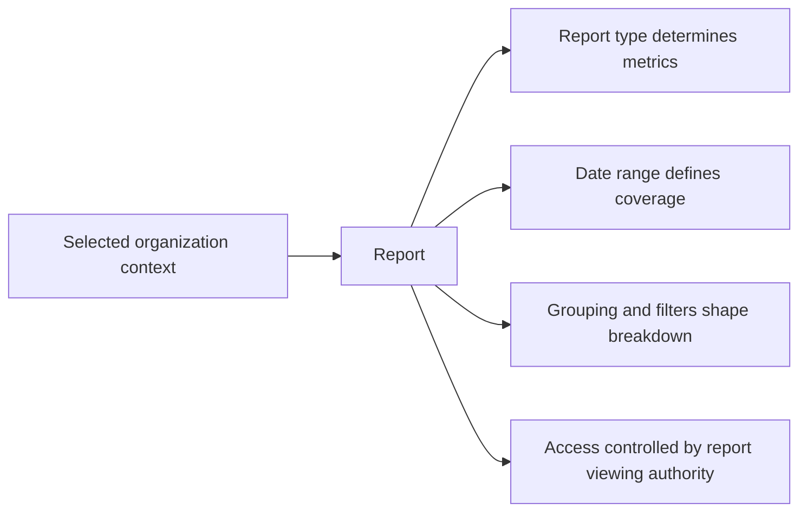

### Report Type Determines Metrics and Breakdown Meaning

A report’s report type defines the kind of insight the report provides, including what metrics are calculated.

The report type also determines how results are interpreted, including which breakdown dimensions are meaningful for the report.

For Time Report, the report measures total hours logged and splits time into billable and non-billable components.

For Project Budget Report, the report measures project budget hours versus actual hours logged, and derives budget consumption.

For Weekly Summary Report, the report produces week-by-week totals over the selected date range.

The business meaning of grouping (employee, project, task) is tied to the report type, so grouping options reflect what the report type is designed to show.

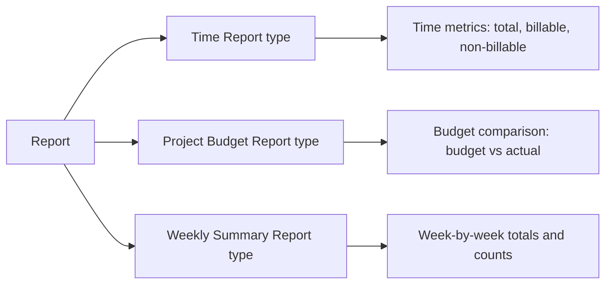

### Date Range Coverage for Analysis

A report includes a date range that defines the period covered by the results.

The date range controls which time activity is included when computing the report’s metrics.

For Time Report and Project Budget Report, the selected date range determines the set of timelogs that contribute to totals.

For Weekly Summary Report, the selected date range drives which calendar weeks are included, and each included week produces its own totals.

The system treats the date range as the primary boundary for analysis, so all grouping, filtering, and metrics are computed only from the activity that falls within the selected date range.

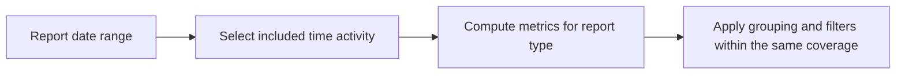

### Grouping by Employee, Project, and Task

A report supports a grouping concept that breaks results down by a selected dimension.

For reports that include time breakdowns, grouping can be done by employee.

For reports that include work breakdowns, grouping can be done by project.

For reports that include task-level breakdowns, grouping can be done by task.

In combination, the report’s group-by capability allows the report to present results grouped by employee, project, or task depending on the report type and the analysis the organization wants.

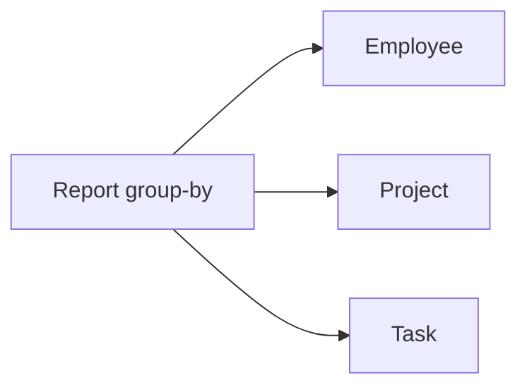

### Filters by Employee, Project, and Billable Status

A report supports filters that further narrow which time activity is used to compute results.

The report filters include at least: date range coverage (defined in the report), employee selection, project selection, and billable status selection.

When filtering by employee, the report includes only time activity associated with the chosen employee(s).

When filtering by project, the report includes only time activity associated with the chosen project(s).

When filtering by billable status, the report includes only time activity matching the selected billable or non-billable category.

Filters apply within the selected date range coverage so that the report reflects the organization’s desired slice of analysis.

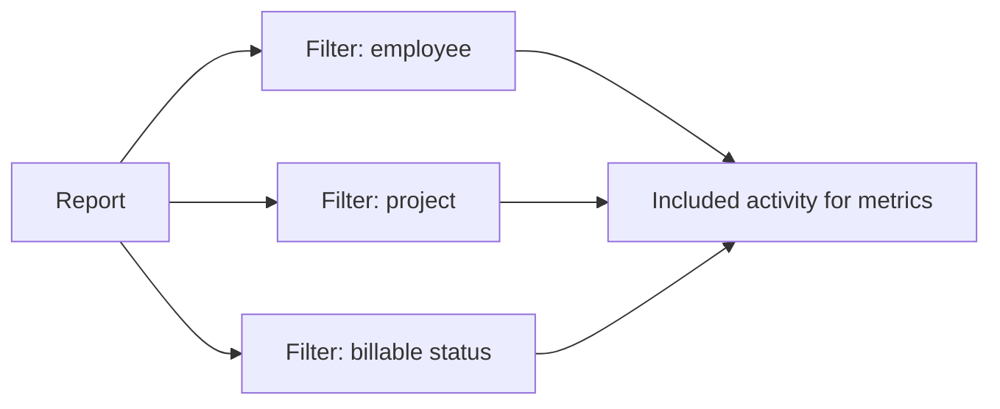

### Time Report Breakdown: Billable and Non-Billable Hours

For a Time Report, the report breakdown includes:
- total hours logged
- billable hours
- non-billable hours

Billable hours reflect only time activity marked as billable.

Non-billable hours reflect only time activity marked as non-billable.

The totals and sub-totals are computed from the time activity included by the report’s date range and filters.

Where grouping is selected, the report presents the billable and non-billable breakdown consistently within each grouped segment.

This breakdown supports organizational interpretation of time effort that may be billable versus internal/non-billable work.

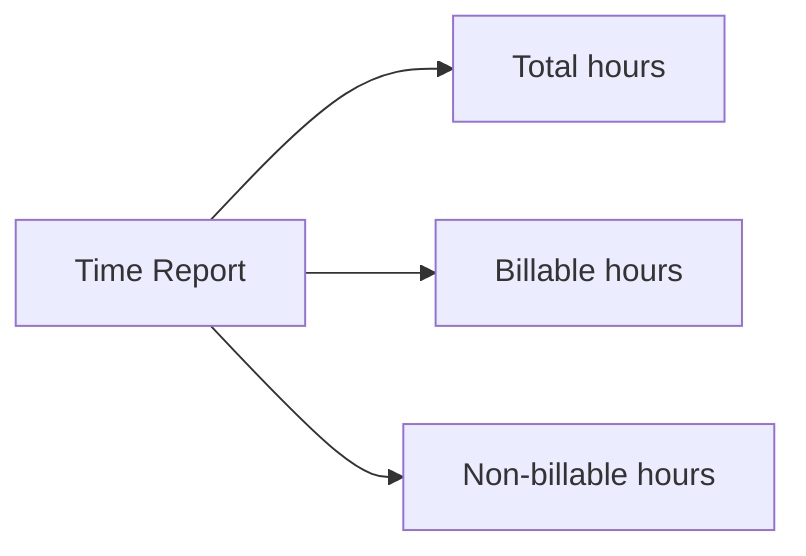

### Project Budget Report: Budget Versus Actual Hours

For a Project Budget Report, the report compares each project’s budget hours versus actual hours logged.

The report derives budget consumption as a measure of how much of the budget has been used relative to actual logged hours.

Projects without budget hours are excluded from the report output.

The budget comparison results are computed within the selected date range and affected by applicable filters that apply to the report’s interpretation of time.

Where grouping is applied (as allowed for the report type), the report presents budget comparison in a way that still reflects the budget versus actual relationship for each project segment.

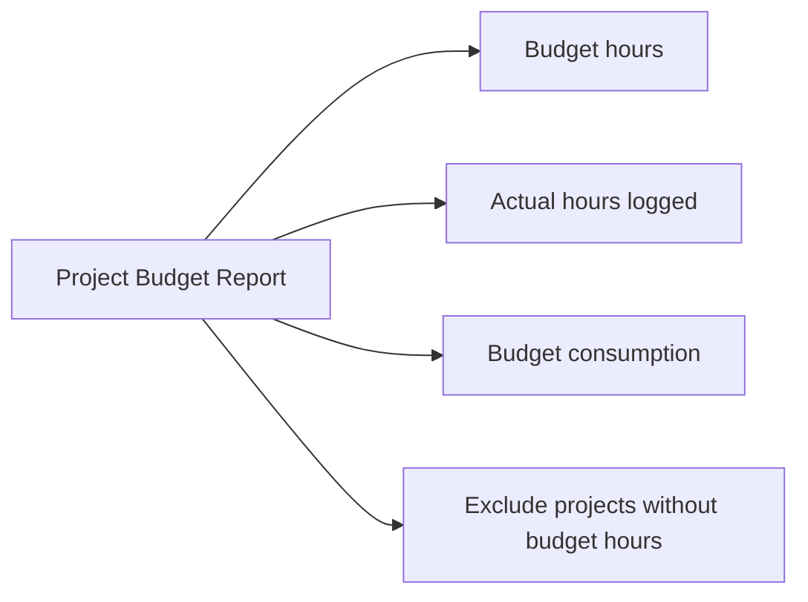

### Budget Utilization Percentage and Consumption Meaning

For a Project Budget Report, the report calculates a budget utilization percentage that represents budget consumption.

Budget utilization percentage indicates how much of the project’s budget hours has been consumed by actual hours logged.

The utilization percentage is computed using the report’s budget versus actual inputs, so it changes when the date range or filters change the set of included actual logged hours.

The computed utilization percentage is presented as part of the budget comparison output for each included project.

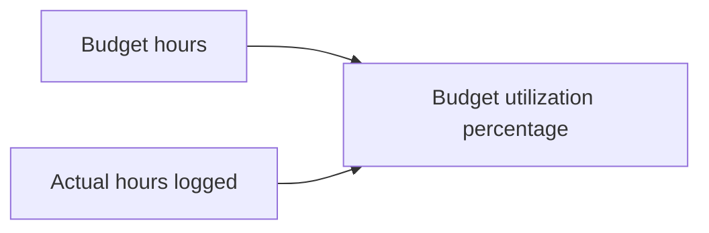

### Weekly Summary Report: Week-by-Week Totals

For a Weekly Summary Report, the report produces a week-by-week summary for the given date range.

Each included week includes:
- total hours
- number of timelogs
- number of employees who logged time

The report’s week-by-week output is computed by partitioning included time activity into the corresponding weeks covered by the selected date range.

The weekly summary supports filtering by project, so when a project filter is applied, weekly totals and counts reflect time activity for that project only.

The week-by-week totals allow trend analysis across the time window selected by the organization.

```mermaid
flowchart LR
    A["Weekly Summary Report"] --> B["Split by weeks in date range"]
    B --> C["For each week: total hours"]
    B --> D["For each week: number of timelogs"]
    B --> E["For each week: number of employees who logged time"]
    A --> F["Optional filter: project"]
```

### Permission-Controlled Access to Reports

Report visibility is permission-controlled by report viewing authority.

Only users with the report viewing permission can access organization reports.

Users without the report viewing permission must not be able to access the report results.

Access control applies within the selected organization context, so report viewing authority determines whether a user can view reports for that organization.

This permission-controlled access ensures reports remain a controlled domain view.

```mermaid
sequenceDiagram
    participant U as User
    participant S as System
    U->>S: Request access to an organization report
    alt "User has report viewing authority"
        S-->>U: Show report results for the selected organization
    else "User lacks authority"
        S-->>U: Deny access to report results
    end
```

# Domain Relationships

Describe how concepts relate to each other from a business perspective.

## Conceptual Relationships

Describe how concepts relate to each other in business terms.

### Organization Ownership and Data Isolation Boundaries

Each organization is an independent tenant where employees, projects, tasks, timelogs, and timesheets belong to that organization.

Ownership in the platform context is scoped to an organization: when a user performs an action, the resulting data is associated with the currently selected organization.

A user can belong to multiple organizations, but ownership and visibility of organization data must remain isolated per organization.

The organization-to-employee relationship exists such that each employee record belongs to exactly one organization.

The organization-to-project relationship exists such that each project belongs to exactly one organization.

The organization-to-timesheet relationship exists such that each timesheet belongs to exactly one organization.

The organization-to-timelog relationship exists such that each timelog belongs to exactly one organization.

The organization deletion policy implies ownership boundaries for relationships: when an organization is deleted, all organization-associated employee, project, task, timelog, and timesheet data is permanently removed, while the user account may remain but without any organization association.

```mermaid
flowchart LR
    O["Organization"] -->"has-many" E["Employee"]
    O -->"has-many" P["Project"]
    E -->"has-many" T["Timelog"]
    E -->"has-many" TS["Timesheet"]
    P -->"has-many" TK["Task"]
    TS -->"includes" T
```

(Ownership and belongs-to/association relationships in this section are the conceptual basis for later lifecycle and operations, without redefining the rules already described elsewhere.)

### User and Role Context Association (Organization-Scoped Authorization)

A user is a global identity that can be associated with multiple organizations through organization membership.

Each user-organization membership provides the user’s role context within that organization; role context is what determines how the user can act within that organization.

Ownership of access control is organization-scoped: role context and permissions apply within a specific organization, not globally.

The platform establishes the belongs-to relationships as follows:
- The role assigned in an organization belongs to that organization.
- The role context belongs to both the user and the organization.

The platform establishes association and has-many relationships as follows:
- One user can have many organization memberships.
- One organization can have many organization memberships.
- Each organization membership has exactly one role context (one assigned role for that organization).

Built-in roles and custom roles are treated as roles within an organization and are therefore associated to an organization; custom roles can be edited or removed only within that organization.

```mermaid
flowchart LR
    U["User"] -->"has-many" UM["User Organization membership"]
    UM -->"belongs-to" O["Organization"]
    UM -->"belongs-to" R["Role"]
    R -->"has-many" UM
```

This section defines the conceptual association between user identity and organization-scoped ownership of what the user is allowed to do.

### Employee Belongs-to Organization and Has-many Employment History (Contracts, Timelogs, Timesheets)

An employee is the organization’s workforce representation of a user account within a specific organization.

Each employee belongs to an organization and is associated to a user account.

Each employee has exactly one role within that organization, establishing a belongs-to relationship between the employee and the organization role.

Employee contracts represent employment history and form a has-many relationship between an employee and contracts.

Only one contract can be active at a time, meaning among the employee’s multiple contracts, exactly one is the current active contract (business state), while past contracts remain historical.

An employee has a has-many relationship with timelogs because employees create multiple timelog entries over time.

An employee has a has-many relationship with timesheets because employees submit timesheets over time.

Timelogs are associated to timesheets as an included set: a timesheet includes multiple timelogs, and timelogs are part of a specific timesheet week collection.

Deactivation establishes ownership-by-preservation: when an employee is deactivated, their historical timelogs and timesheets remain associated with the employee and organization, while the deactivated employee’s ability to create new timelogs and submit new timesheets is removed.

```mermaid
flowchart LR
    O["Organization"] -->"has-many" E["Employee"]
    E -->"associated-with" U["User"]
    E -->"belongs-to" R["Role"]
    E -->"has-many" C["Contract"]
    E -->"has-many" TL["Timelog"]
    E -->"has-many" TS["Timesheet"]
    TS -->"includes" TL
```

(Contracts, timelogs, and timesheets are presented here as distinct business associations that attach to the same employee within the organization.)

### Department Organizational Hierarchy and Employee Association

A department belongs to an organization.

Within an organization, departments can be nested with an optional parent department, with at most one level of nesting.

Employees are associated to a department, but the department association is optional; an employee can have no department.

When a department is removed, employees are not deleted; instead, their department association is set to none, preserving the employee record and maintaining ownership of employee history within the organization.

Employees can view the department list for their organization, establishing that department data belongs to the organization and is visible based on organization context.

```mermaid
flowchart LR
    O["Organization"] -->"has-many" D["Department"]
    D -->"optional parent" DP["Parent Department"]
    E["Employee"] -->"associated-with" D
```

This section clarifies relationship and association between employees and organizational units without redefining employee management rules.)

### Project, Tasks, and Membership Associations (Including Project Leads)

A project belongs to an organization.

A project has many tasks, establishing a has-many relationship from project to task.

A project has many members through project membership, establishing a has-many relationship between project and employees.

Project membership is an association that connects an employee to a project and carries a project role designation.

Each employee can be assigned to multiple projects, meaning an employee has-many project membership associations.

Project leads are participants in the project whose project role in the membership allows managing tasks within that project; this is a role-within-relationship concept tied to project membership.

Tasks belong to a project, and tasks are associated to an optional assigned employee only when the assigned employee is also part of the project membership.

Projects maintain a conceptual status lifecycle (active, archived, completed) that affects whether new timelogs can be associated to that project in the business workflow; this section defines the association paths so later modules can apply state constraints.

```mermaid
flowchart LR
    O["Organization"] -->"has-many" P["Project"]
    P -->"has-many" TK["Task"]
    P -->"has-many" PM["Project Membership"]
    PM -->"belongs-to" E["Employee"]
    PM -->"belongs-to" P
    TK -->"may-be assigned-to" E
    TK -->"optional parent" PT["Parent Task"]
```

(Parent task nesting is limited to one level conceptually; this is included only as a relationship constraint for task associations.)

### Timesheets and Timesheet-Lock Ownership Over Included Timelogs

A timesheet belongs to an employee and to an organization.

A timesheet includes timelogs, establishing a has-many relationship from timesheet to timelog via inclusion.

A timelog belongs to the organization through its employee and is associated to exactly one project; optionally it is associated to a task that belongs to that same project.

Approval creates an ownership-by-lock outcome: once a timesheet is approved, its included timelogs become protected from further modification or deletion as part of the approved finality.

The concept of a timesheet versioning lock expresses that approval finalizes the included timelogs as an immutable set for auditability.

Rejected timesheets return to a draft state, which conceptually reopens the ability to change the included timelogs.

```mermaid
flowchart LR
    E["Employee"] -->"has-many" TS["Timesheet"]
    TS -->"includes" TL["Timelog"]
    TS -->"may-have" L["Timesheet Versioning Lock"]
    L -->"locks" TL
```

This section focuses on belongs-to and has-many relationships between timesheets and timelogs and ownership of editability as a business outcome of approval.

### Timer Session Association to Project and Optional Task (Live Time Context Ownership)

A timer session belongs to an employee and to an organization.

A timer session is associated with a selected project, establishing the project context for live time tracking.

A timer session may optionally be associated with a selected task; if a task is selected, it is within the context of the selected project.

Ownership of live tracking is constrained so that each employee has at most one active timer session at a time.

When the timer session is stopped, it results in a timelog association for the employee, with the timelog then belonging to the organization and being associated to the selected project (and optionally the selected task).

When the timer session is discarded, no timelog is created, meaning the live timer session remains only as a transient association with the employee until it is stopped or discarded.

```mermaid
flowchart LR
    E["Employee"] -->"has-one-active" S["Timer Session"]
    S -->"associated-with" P["Project"]
    S -->"optional associated-with" TK["Task"]
    S -->"on stop creates" TL["Timelog"]
```

This section defines relationship and association between timer sessions and their project/task context, without describing time rounding or calculation details beyond what is necessary for association outcomes.

### Activity Log Entry Ownership as Audit Trail of Cross-Entity Actions

An activity log entry belongs to an organization.

An activity log entry records the user who performed the action, establishing a belongs-to relationship to the performing user within the organization context.

Each activity log entry targets a specific entity affected by the action; the targeted entity relationship connects the log entry to the affected concept without changing the underlying entity ownership.

The activity log provides a has-many relationship from user to activity log entries because a user performs multiple actions.

The activity log provides a has-many relationship from organization to activity log entries because many actions occur within an organization.

Key logged actions include employee invitation and status changes, contract creation or edits, project lifecycle events, task status changes, timesheet lifecycle events, and role assignment changes; these are categories that describe which cross-entity relationships are being audited.

```mermaid
flowchart LR
    O["Organization"] -->"has-many" AL["Activity Log Entry"]
    U["User"] -->"has-many" AL
    AL -->"targets" X["Target Entity"]
```

This section establishes ownership and association structure for the audit trail so that later sections can specify which actions appear and how users filter the log.

### Report and Grouping Relationships to Time Data and Project Structure

A report belongs to an organization.

Reports are produced from organization timekeeping and project data, implying associations to employees, projects, tasks, and timelogs through the time data model.

The Time Report concept creates relationships from timelogs to reporting dimensions: reports can be grouped by employee, project, or task, meaning the report output is associated to those entities.

The Weekly Summary Report creates relationship outputs by week, summarizing time data associated with employees and timelogs within the date range.

The Project Budget Report associates project budget hours to actual hours logged, producing an output relationship between projects and the timelog-derived actual hours.

Projects without budget hours are excluded from the Project Budget Report output, which defines an association filter at the conceptual level.

Reports can be filtered by date range, employee, project, and billable status (for the time-focused report), defining which underlying associations are included in the report output.

```mermaid
flowchart LR
    O["Organization"] -->"has-one-or-many" RPT["Report"]
    RPT -->"based-on" TL["Timelog"]
    RPT -->"based-on" P["Project"]
    RPT -->"based-on" TK["Task"]
    RPT -->"based-on" E["Employee"]
```

This section provides the conceptual relationships between reports and the entities they summarize, without duplicating report metric definitions already captured in the report concept.

## Lifecycle and Retention

Describe concept lifecycle states and transitions only. Detailed retention/recovery policies belong in 05-non-functional. Operation details belong in 03-functional-requirements.

### Organization Lifecycle, Archival, Deletion-Policy, and Recovery

### Organization lifecycle
An organization operates as an independent tenant. Its lifecycle determines whether the organization’s employees, projects, tasks, timelogs, and timesheets remain accessible within that organization.

### Organization archival
If an organization is deleted, the organization is treated as no longer active for business purposes. After deletion, there is no expectation that the organization can continue operating or receiving new time tracking or HR activity.

### Organization deletion-policy
When an organization owner deletes an organization, deletion is allowed only if all conditions are satisfied:
- All pending timesheets are resolved by approval or rejection.
- There are no active employee contracts.

### Organization deletion consequences
When an organization is deleted:
- All employees, projects, tasks, timelogs, and timesheets are permanently deleted.
- The owner’s account remains available, but it is no longer associated with any organization.

### Organization recovery
After an organization deletion is completed, the business expectation is that organization data has been permanently deleted, so recovery of previously deleted employees, projects, tasks, timelogs, and timesheets is not expected.

### User Account Lifecycle, Deactivation of Employee Records, and Recovery

### User lifecycle across multiple organizations
A user can belong to multiple organizations. The user’s account lifecycle is independent of any single organization’s lifecycle.

### User account deletion trigger
A user can delete their account under these conditions:
- If the user is the sole owner of an organization, they must transfer ownership or delete the organization first.

### Deletion-policy for user across organizations
After a user account is deleted:
- The user’s employee records in other organizations are marked as “deactivated.”
- Employee historical data for those deactivated employee records remains preserved.

### Recovery for user account deletion
If the user account has been deleted, the business expectation is that the account is no longer available. Any deactivated employee records remain in the organization with preserved history, but the deleted user account is not expected to automatically return to active employee status.

### Employee Status Lifecycle and Data Retention

### Employee lifecycle states
Within an organization, an employee can be in one of these states:
- active
- deactivated

### Employee deactivation lifecycle transition
A user with employee management capability can deactivate an employee.

### Employee deactivation effects
When an employee is deactivated:
- The employee cannot log time.
- The employee cannot submit timesheets.

### Employee deactivation data retention
When an employee is deactivated, the employee’s historical data (timelogs and timesheets) is preserved.

### Employee reactivation lifecycle transition
A deactivated employee can be reactivated.

### Employee reactivation effects on time tracking
When an employee is reactivated, the employee is again allowed to log time and to submit timesheets going forward.

### Employee recovery
Recovery is supported at the business level via reactivation of the employee status. Historical data continues to be available after deactivation and reactivation as part of the preserved history.

### Project Status Lifecycle, Archival, and Deletion-Policy

### Project lifecycle states
Within an organization, projects progress through these lifecycle statuses:
- active
- archived
- completed

### Project archival lifecycle meaning
When a project is archived (or completed):
- The project is treated as closed for new work tracking.

### Project archival effect on time tracking
Archived or completed projects cannot receive new timelogs.

### Project archival data retention
Existing timelogs on archived or completed projects are preserved.

### Project deletion-policy
A user with project deletion capability can delete a project only if:
- The project has no timelogs associated with it.

### Project recovery
After a project is archived or completed, it remains intact with preserved timelogs. Recovery in the business sense is limited to the preserved state; new timelog creation remains disallowed while the project is archived or completed. If a project is deleted (only possible when it has no timelogs), recovery of that project is not expected because deletion permanently removes it.

### Timesheet Lifecycle, Locking, Retention, and Recovery

### Timesheet lifecycle states
Within an organization, a timesheet can be in one of these statuses:
- draft
- submitted
- approved
- rejected

### Timesheet creation and draft lifecycle
Employees can create a draft timesheet for a specific week that begins on Monday and ends on Sunday. When creating a draft, the timesheet is populated with all timelogs for that employee in that week.

### Draft modification lifecycle
While a timesheet is in draft status:
- The employee can add or remove timelogs from the draft timesheet.

### Submitted lifecycle transition
An employee can submit a draft timesheet for approval.

### Submitted preconditions
A timesheet cannot be submitted if:
- it has no timelogs.
- another timesheet for the same week is already submitted or approved.

### Approval lifecycle transition and archival/locking meaning
When an authorized approver approves a submitted timesheet:
- The approved status applies.
- All timelogs included in the approved timesheet become locked against editing or deletion.

### Rejection lifecycle transition
When an authorized approver rejects a submitted timesheet:
- The timesheet returns to draft status.
- The employee can modify and resubmit the rejected timesheet.

### Timesheet retention
Across timesheet lifecycle changes, the timesheet’s included timelogs remain part of historical records. Approved timesheets preserve their included timelogs by preventing changes after approval.

### Timesheet recovery
Recovery from rejection is supported through returning the timesheet to draft status, allowing the employee to modify and resubmit. For approved timesheets, changes are not permitted because included timelogs are locked as part of approval finality.

### Timer Session Lifecycle and Timelog Retention Policy

### Timer session lifecycle states
A timer session represents live time tracking for an employee.

### Start of timer session
When an employee starts a timer, a live tracking session begins.

### Stopping a timer session (conversion to timelog)
When the employee stops the timer:
- A timelog is created using the calculated elapsed time.
- The timelog is rounded to the nearest minute.

### Discarding a timer session (no timelog retention)
When an employee discards the timer session:
- No timelog is created.

### Indefinite running lifecycle note
If an employee forgets to stop the timer, the timer continues running indefinitely. Business lifecycle expectation is that no automatic timelog creation occurs until the timer is stopped; the system does not imply an automatic stop.

### Editing a running timer session
While the timer is running, the employee can edit the description and the project/task context for that running session.

### Timelog retention following timer end
Timelogs created by stopping a timer are part of the employee’s historical timelog record. Timelogs are retained according to their later timesheet and approval outcomes as described in the timesheet lifecycle, including lock behavior for approved timesheets.

# Business Categories and State Flows

Business category classifications and state flow definitions.

## Business Category Definitions

Define all business category classifications with their allowed values and descriptions.

### Business Categories and Classifications

A business category is a named classification used to group domain concepts (such as organization resources and time tracking items) into predictable types.

Each business category must have:
- a business category name
- a classification purpose (what the category is used to distinguish)
- allowed values that define the set of types within the category
- a status-type that indicates whether the values represent an operational lifecycle state or a reference/type classification

The system shall treat every category value as mutually exclusive within that category (a single item has at most one value per business category).

The system shall display allowed values consistently anywhere the category is shown to users (including lists, filters, and report breakdowns where applicable).

The business category classification purpose must be understandable to users in the context where it is used (for example, describing what a status means or how an item type is categorized).

Any category value used for filtering or sorting must come only from the defined allowed values for that business category.

Business category allowed values must not be created ad hoc by users; they must come from the predefined set for the corresponding business category.

### Status-Type: Operational Lifecycle vs Type Classification

Status-type determines how a category’s allowed values behave from a business perspective.

For operational lifecycle categories (status-type):
- Each allowed value represents a step in an operational lifecycle.
- The system shall record and preserve historical changes when the item moves between allowed values.
- The system shall use the category’s allowed values to determine which actions are permitted (for example, whether new timelogs can be created on a project depending on project status).

For type classification categories (status-type):
- Each allowed value represents a category label rather than a lifecycle step.
- The system shall use the category’s allowed values to label items for viewing and filtering.
- The system shall not assume an approval workflow for type classification categories unless the category itself is defined as an operational lifecycle category.

The system shall apply status-type consistently for every business category that has allowed values.

If a business category is used both for lifecycle and for classification in user-facing behavior, the category must be defined as an operational lifecycle category to reflect the lifecycle nature of its values.

### Organization-Scoped Category: Employee Status

Employee status is a business category that describes whether an employee can actively participate in time tracking.

Employee status allowed values must be:
- active
- deactivated

Employee status classification purpose:
- distinguish whether the employee is eligible to log time and submit timesheets.

Employee status status-type:
- operational lifecycle category.

While an employee has status "deactivated", the system shall treat the employee as unable to log time or submit timesheets, while preserving the employee’s historical timelogs and timesheets.

When an employee is returned to status "active", the system shall allow time tracking activity again under the same organizational context.

### Organization-Scoped Category: Timesheet Status

Timesheet status is a business category that describes where a timesheet stands in the approval workflow.

Timesheet status allowed values must be:
- draft
- submitted
- approved
- rejected

Timesheet status classification purpose:
- distinguish which approval actions are available and whether included timelogs are locked against modification.

Timesheet status status-type:
- operational lifecycle category.

If a timesheet is in allowed value "approved", the system shall treat the included timelogs as locked and not editable or deletable.

If a timesheet is in allowed value "rejected", the system shall return the timesheet to draft behavior so the employee can modify and resubmit it.

If a timesheet is in allowed value "draft", the system shall allow the employee to prepare the submission by maintaining its included timelogs.

If a timesheet is in allowed value "submitted", the system shall treat it as awaiting review and disallow direct editing by the employee that would change timelogs included in the timesheet.

### Organization-Scoped Category: Project Status

Project status is a business category that describes the project’s work lifecycle.

Project status allowed values must be:
- active
- archived
- completed

Project status classification purpose:
- distinguish whether timelogs can be created against the project.

Project status status-type:
- operational lifecycle category.

While a project has status "archived" or "completed", the system shall prevent new timelogs from being created on that project.

While a project has status "active", the system shall allow timelogs to be created for that project.

Existing timelogs already recorded on projects that later become archived or completed must be preserved for historical reporting.

### Organization-Scoped Category: Task Status

Task status is a business category that describes the progress of a task inside a project.

Task status allowed values must be:
- open
- in-progress
- completed
- closed

Task status classification purpose:
- distinguish task progress for viewing, filtering, and assignment context.

Task status status-type:
- operational lifecycle category.

When a task’s status changes, the system shall record that status change in the task history.

Task status history must capture the old status, the new status, the time of change, and who made the change within the organization context.

Task status values shall be usable for filtering and for dashboard task visibility in relevant contexts.

### Organization-Scoped Category: Task Priority

Task priority is a business category that describes the importance level of a task.

Task priority allowed values must be:
- low
- medium
- high
- urgent

Task priority classification purpose:
- enable prioritization for task viewing, filtering, and sorting.

Task priority status-type:
- type classification category.

Task priority values shall be preserved as recorded and used to support task filtering and sorting.

Task priority values shall not be treated as an approval workflow lifecycle; changing priority is a categorization update rather than an approval step.

### Organization-Scoped Category: Employment Type

Employment type is a business category that describes the employment arrangement for an employee contract context.

Employment type allowed values must be:
- full-time
- part-time
- contractor
- intern

Employment type classification purpose:
- describe how the employee is categorized for employment arrangements within the organization.

Employment type status-type:
- type classification category.

The system shall use employment type values to support employee filtering by employment type.

Employment type values shall be editable only by users with the employee management authority described for editing employee records (as governed elsewhere in the specification).

When an employee is deactivated, employment type remains part of the employee record for historical viewing, even though time tracking activity is restricted by employee status.

## State Transitions

Define valid state transition paths for stateful concepts.

### State flows across key HR and time tracking concepts

The platform uses explicit status lifecycles for the following business concepts: employee status, timesheet status, project status, task status, and contract active-versus-past state.

Status-change meaning
- An entity’s status determines what actions are allowed for that entity within the organization context.
- When a status changes, the system treats the new status as immediately effective for subsequent operations and views.

State categories used in the platform
- Employee status includes the allowed values active and deactivated.
- Timesheet status includes the allowed values draft, submitted, approved, rejected.
- Project status includes the allowed values active, archived, completed.
- Task status includes the allowed values open, in-progress, completed, closed.

Workflow expectations
- Status-change events affect downstream behavior, such as whether timelogs can be added to timesheets, whether approved timesheets prevent further edits, and whether archived or completed projects can receive new timelogs.
- Historical records remain available after status changes (for example, rejected timesheets return to draft so they can be modified and resubmitted; past contracts remain immutable).

Mermaid state map (conceptual)
```mermaid
flowchart LR
    E["active employee"] -->|"deactivate"| D["deactivated employee"]
    P1["active project"] -->|"archive"| P2["archived project"]
    P1 -->|"complete"| P3["completed project"]
    T1["open task"] -->|"start"| T2["in-progress task"]
    T2 -->|"complete"| T3["completed task"]
    T1 -->|"close"| T4["closed task"]
    S1["draft timesheet"] -->|"submit"| S2["submitted timesheet"]
    S2 -->|"approve"| S3["approved timesheet"]
    S2 -->|"reject"| S4["rejected timesheet"]
    S4 -->|"resubmit"| S2
```


### Timesheet status transitions (workflow)

Timesheet statuses and transition intent
- Draft represents a timesheet being prepared.
- Submitted represents a draft that has been submitted for review.
- Approved represents a submitted timesheet that has been accepted.
- Rejected represents a submitted timesheet that has been sent back with a reason.

Valid transitions
- WHEN an employee submits a draft timesheet, THE timesheet transitions from draft to submitted.
- WHEN an approver approves a submitted timesheet, THE timesheet transitions from submitted to approved.
- WHEN an approver rejects a submitted timesheet with a rejection reason, THE timesheet transitions from submitted to rejected.
- WHEN an employee resubmits a rejected timesheet, THE timesheet transitions from rejected to submitted.

Rejection behavior (status-change impact)
- WHILE a timesheet is rejected, it returns to a modifiable preparation state so the employee can modify and resubmit it.

Workflow flow diagram
```mermaid
flowchart LR
    A["draft timesheet"] -->|"submit for approval"| B["submitted timesheet"]
    B -->|"approve"| C["approved timesheet"]
    B -->|"reject"| D["rejected timesheet"]
    D -->|"modify and resubmit"| B
```

Status-change side effects captured for review
- WHEN a timesheet transitions to approved or rejected, the system must capture who performed the review and when the review occurred.
- WHEN a timesheet is rejected, the system must require and store a rejection reason as part of that rejected state.


### Project status transitions (archive and completion workflow)

Project statuses and transition intent
- Active projects are open for operational work such as capturing time.
- Archived projects represent work that should no longer accept new time entries.
- Completed projects represent work that has ended and should no longer accept new time entries.

Valid transitions
- WHEN a user with project management authority archives a project, THE project transitions from active to archived.
- WHEN a user with project management authority marks a project as completed, THE project transitions from active to completed.

Blocked behavior after archive or completion (status-change impact)
- WHILE a project is archived or completed, it cannot receive new timelogs.
- Existing timelogs already associated with an archived or completed project remain preserved for reporting and history.

Project workflow diagram
```mermaid
flowchart LR
    A["active project"] -->|"archive"| B["archived project"]
    A -->|"complete"| C["completed project"]
```


### Task status transitions and history (status-change tracking)

Task status meanings
- Open represents a task ready to be worked on.
- In-progress represents work currently underway.
- Completed represents work finished but not necessarily finalized for closure.
- Closed represents the task being fully closed.

Valid status transitions (business workflow constraints)
- WHEN a project lead or a user with project management authority changes a task status within their permitted scope, THE task transitions to the chosen new status.
- WHEN a user with project management authority updates any task status, THE system records that status change as part of task history.

Status-change history requirement
- EVERY time a task status changes, the system records a history entry containing:
  - the time the change occurred,
  - the old status,
  - the new status,
  - the identity of who made the change.

Task status flow diagram
```mermaid
flowchart LR
    O["open"] -->|"set to in-progress"| I["in-progress"]
    I -->|"set to completed"| C["completed"]
    O -->|"set to closed"| X["closed"]
    I -->|"set to closed"| X
    C -->|"set to closed"| X
```

Reporting and user visibility alignment
- Task status history is available for viewing, enabling users to understand the progression of a task over time.