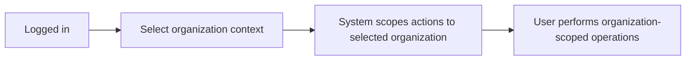
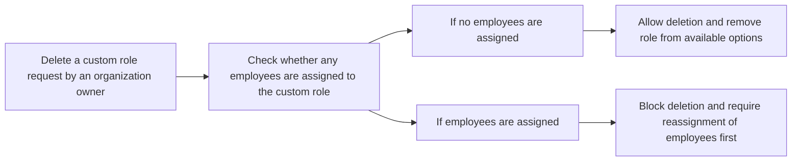
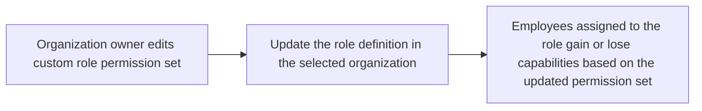
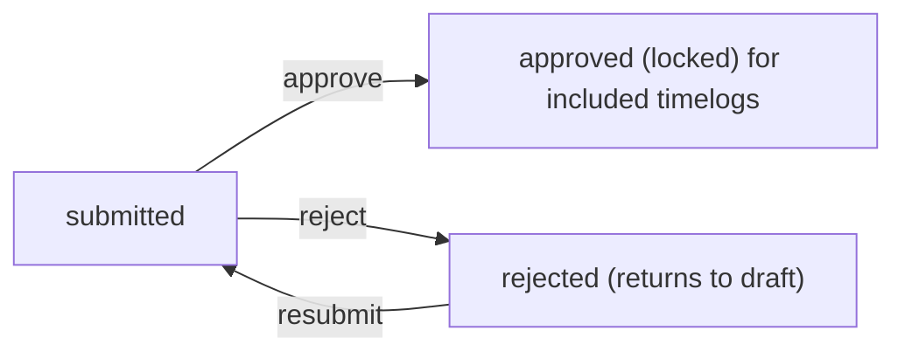
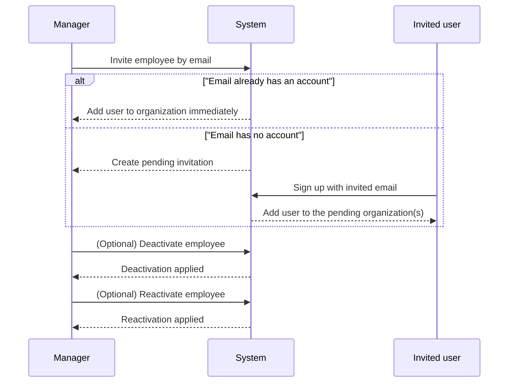
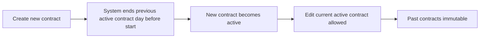
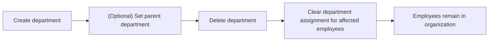

**erpHrmTimeTracking — What operations users can perform, use cases, business workflows**

What operations users can perform, use cases, business workflows

# Core Business Operations

What the system must do for each business concept.

## Organization Operations

Users create an organization during initial sign-up and provide the organization’s name, description, logo, currency, timezone, and fiscal start month so the workspace is configured for local reporting and planning. Within an organization, users perform read operations to access the organization’s basic identity details and understand the currently selected organization context. Organization owners can edit organization settings to keep branding and operational parameters up to date without affecting their ability to continue managing employees and projects. When users delete an organization, the action is allowed only when business prerequisites are satisfied: all pending timesheets must be resolved by being approved or rejected, and there must be no active employee contracts. The deletion decision permanently removes all employees, projects, tasks, timelogs, and timesheets from that organization, ensuring there is no remaining historical operational data inside the deleted tenant. The owner’s own account remains active, but the account is no longer associated with any organization. After deletion, users in other organizations continue unaffected because data is strictly isolated per organization. If a required prerequisite is not met—such as there are still pending timesheets or active employee contracts—the system prevents deletion to preserve operational integrity. Deletion also prevents ongoing users from accessing now-removed organization content because that tenant no longer exists.

### Organization Creation During Initial Sign-Up

#### Organization Creation During Initial Sign-Up
- When a user completes initial sign-up, the system shall allow the user to create a new organization as part of that sign-up.
- The system shall require an organization name as part of organization creation.
- The system shall collect organization description, logo image, currency, timezone, and fiscal start month during organization creation.
- The system shall associate the creating user with the newly created organization as the organization owner.
- The system shall set the organization as the active tenant context for the creating user immediately after successful organization creation.
- The system shall reject organization creation if required creation inputs are missing or invalid (including missing organization name).
- After organization creation succeeds, the user shall be able to manage and view organization identity details within the created organization context.

### Organization Identity Details Management

#### Organization Identity Details Management
- When a user is operating in an organization context, the system shall display that organization’s identity details (name, description, logo image, currency, timezone, and fiscal start month).
- The system shall ensure organization identity details are visible only for the currently selected organization context.
- The system shall support editing of identity details by users who are organization owners.
- When an owner edits identity details, the system shall apply the updated values to the organization so subsequent organization-scoped actions reflect the updated identity details.
- When a user who is not an organization owner attempts to edit identity details, the system shall deny the edit action.
- If an edit request includes invalid inputs (such as missing required organization name), the system shall reject the update and keep the existing organization identity details unchanged.

### Organization Settings Edit by Owners

#### Organization Settings Edit by Owners
- Only organization owners shall be allowed to edit organization settings.
- An organization owner shall be able to update organization description, logo image, currency, timezone, and fiscal start month.
- The system shall update organization settings within the specific organization being edited, without affecting any other organization the user belongs to.
- The system shall reject an owner’s organization settings edit if required inputs are missing or invalid.
- The system shall prevent edits to organization settings while an organization deletion is in progress (if applicable to the product workflow) to avoid inconsistent organization state.
- The system shall record the result of the settings edit so the owner can confirm the updated values in subsequent organization identity detail views.

### Organization Deletion Eligibility Based on Pending Timesheets

#### Organization Deletion Eligibility Based on Pending Timesheets
- Only organization owners shall be able to request deletion of their organization.
- The system shall allow organization deletion only if there are no pending timesheets remaining for the organization.
- If there are pending timesheets, the system shall block organization deletion.
- When organization deletion is blocked due to pending timesheets, the system shall explain that deletion requires pending timesheets to be resolved by being approved or rejected.
- When all pending timesheets in the organization are resolved (approved or rejected), the system shall allow the owner to proceed with the deletion request subject to other eligibility checks.
- The system shall ensure that pending-timesheet checks are performed for the target organization context so deletion eligibility is evaluated per organization.

### Organization Deletion Eligibility Based on Active Employee Contracts

#### Organization Deletion Eligibility Based on Active Employee Contracts
- The system shall allow organization deletion only if there are no active employee contracts for employees in the organization.
- If there is at least one active employee contract, the system shall block organization deletion.
- When organization deletion is blocked due to active employee contracts, the system shall explain that deletion requires there to be no active employee contracts.
- After there are no active employee contracts, the system shall allow the owner to proceed with deletion subject to the pending timesheets prerequisite being satisfied.
- The system shall evaluate active-contract eligibility within the target organization context only, not across other organizations the owner may belong to.

### Permanent Deletion of Tenant Operational Data

#### Permanent Deletion of Tenant Operational Data
- When an organization deletion request satisfies all eligibility prerequisites and is completed, the system shall permanently delete all operational data belonging to that organization.
- Permanent deletion shall remove employees, projects, tasks, timelogs, and timesheets from the deleted organization.
- The system shall ensure deleted organization operational data is not accessible after deletion.
- The system shall ensure that deletion of one organization does not remove operational data from any other organization the owner or any other user belongs to.
- If deletion prerequisites are not met, the system shall not perform permanent deletion of organization operational data.
- The system shall ensure the deletion outcome prevents the deleted organization from being used as an organization context for subsequent actions.

### Owner Account Remains After Organization Deletion

#### Owner Account Remains After Organization Deletion
- After an organization is deleted, the owner’s user account shall remain active.
- The system shall remove the owner’s association with the deleted organization while keeping the user account intact.
- If the owner belongs to additional organizations, the system shall keep the user’s memberships in those other organizations unaffected.
- If the owner was the sole associated organization for the user, the system shall leave the user account existing but with no associated organization context.
- The system shall prevent the deleted organization from being selected as the organization context after deletion.

### Strict Organization Data Isolation and Tenant Context Effects

#### Strict Organization Data Isolation and Tenant Context Effects
- The system shall strictly isolate all data per organization so employees in one organization cannot see data from another organization.
- When a user belongs to multiple organizations, the system shall scope all subsequent reads and writes to the currently selected organization context.
- The system shall allow the user to switch the selected organization context without logging out.
- After organization deletion, any previously available organization context for the deleted organization shall no longer exist for selection and use.
- The system shall apply organization context enforcement consistently across organization-scoped operations, including organization settings edits, organization deletion eligibility checks, and organization identity detail views.

### Organization Deletion Workflow and Blocking Conditions

#### Organization Deletion Workflow and Blocking Conditions
```mermaid
flowchart LR
    A["Owner requests organization deletion"] --> B{ "Any pending timesheets remain?" }
    B -->|"Yes"| C["Block deletion and require pending timesheets to be resolved (approved or rejected)"]
    B -->|"No"| D{ "Any active employee contracts remain?" }
    D -->|"Yes"| E["Block deletion and require no active employee contracts"]
    D -->|"No"| F["Permanently delete tenant operational data"]
    F --> G["Remove all organization associations; delete employees, projects, tasks, timelogs, and timesheets; keep owner account active"]
```
- When an organization owner requests deletion, the system shall evaluate eligibility prerequisites in a way that results in either a blocked deletion (with an appropriate reason tied to the first failing prerequisite) or a completed permanent deletion.
- The system shall ensure that blocked deletion due to prerequisites does not result in any permanent deletion of organization operational data.
- The system shall ensure that, on successful deletion, the owner account remains active while the deleted organization no longer exists as an organization context.

## User Operations

Users sign up with email and password to create their account and then create an organization as part of onboarding. Logging in uses email and password, after which the user chooses which organization context to work in; all subsequent actions are scoped to that selection. Users can change their password to keep their account access secure over time. Users can belong to multiple organizations, and the system supports switching between these organizations without logging out. From the user perspective, reading account-related information includes maintaining a global identity that remains consistent across organizations they belong to. Updating user profile details applies globally, so changes to display name, avatar, and phone number are reflected wherever the user is a member. When a user deletes their account, the system enforces ownership rules: if they are the sole owner of an organization, they must transfer ownership or delete the organization first. If the user is not the sole owner or has resolved ownership transfer or organization deletion, the user account is removed while their employee records in other organizations are marked as deactivated. Deactivated employee records preserve historical time data while preventing deactivated employees from logging time or submitting timesheets. If a user attempts account deletion while they are the sole owner of an organization and the ownership requirements have not been handled, the system blocks deletion and requires resolving that constraint first. Switching organization context also determines what the user can see and do at any moment, which prevents accidental access to other tenants’ data.

### Email and Password Sign-Up with Organization Creation

### Sign-up Requirements
Users can sign up using an email address and a password.
During sign-up, the user creates an organization.
The organization created during sign-up has organization identity details including name, description, logo image, currency, timezone, and fiscal start month.
If sign-up is completed successfully, the new user account becomes associated with the newly created organization for subsequent organization-scoped actions.
### Sign-up Failure Handling
If the provided sign-up credentials are invalid (e.g., email format is not acceptable or required credential information is missing), the sign-up is rejected and the user remains unable to proceed to organization-scoped actions.

### Email and Password Login

### Login Requirements
Users can log in using their email address and password.
After a successful login, the system requires the user to select an organization context before allowing organization-scoped actions.
### Login Failure Handling
If the email address or password is not valid for the user account, the login attempt is rejected and the user cannot proceed to select an organization context.

### Organization Context Selection After Login

### Context Selection Requirements
After login, users select which organization to work in.
While an organization context is selected, all subsequent actions are scoped to that organization.
Users can view organization-scoped information only for the currently selected organization.
### Tenant-Scoped Access Behavior
If a user attempts to perform an organization-scoped action without having the relevant organization selected, the system rejects the action.
### Context Selection Flow Diagram


### Switch Organizations Without Logging Out

### Switching Requirements
Users can switch between organizations they belong to without logging out.
When the user switches the organization context, the system updates what the user can view and do to match the newly selected organization.
Any organization-scoped actions performed after the switch apply to the newly selected organization only.
### Tenant-Scoped Access Behavior
Switching organizations does not grant access to data from other organizations; the user only sees and can act within the currently selected organization.

### Global Profile Shared Across Organizations

### Global Profile Requirements
Users have a global profile shared across all organizations they belong to.
A user profile includes display name, avatar image, and phone number.
Users can edit their profile information.
When a user updates their global profile, the changes are reflected for the user wherever organization-scoped views display their profile.
### Profile Visibility Requirements
Organization-scoped actions that display user identity must use the global profile values defined for that user, not organization-specific duplicates.

### Password Change Operation

### Password Change Requirements
Users can change their password.
The password change operation applies to the user’s global account and enables continued access using email and the updated password.
After a successful password change, the user can log in again using the updated password.
### Password Change Failure Handling
If the user does not provide valid credentials required to authorize a password change, the password change is rejected and the password remains unchanged.

### Multi-Organization Membership Behavior

### Membership Requirements
A user can belong to multiple organizations.
The user’s ability to perform organization-scoped actions depends on membership in the currently selected organization.
Employees and employee-related information are associated with an organization; therefore, organization-scoped views and actions reflect membership within the selected organization only.
### Cross-Organization Independence
While a user belongs to multiple organizations, operations in one organization do not alter membership or data in other organizations.

### Account Deletion Ownership Transfer Rule

### Deletion Authorization Requirements
Users can delete their account.
If the user is the sole owner of an organization, account deletion is blocked until the ownership requirement is resolved first.
Resolving the ownership requirement includes transferring ownership or deleting the organization before the user can delete their account.
If the user is not the sole owner of any organization, or the ownership requirement has been resolved, the system proceeds with account deletion.
### Prevent Account Deletion as Sole Organization Owner
If a user attempts account deletion while they are the sole owner of any organization and the ownership requirement is not resolved, the system rejects the deletion and requires the user to resolve ownership first.
### Account Deletion Failure Handling
If the system cannot complete deletion due to the ownership requirement, the account deletion request is rejected and no account removal occurs.

### Account Deletion Deactivates Employee Records in Other Organizations

### Deactivation Requirements
When a user deletes their account, the system removes the user’s account association.
If the user is a member of organizations other than the one(s) being handled via deletion or ownership resolution, the user’s employee records in those other organizations are marked as deactivated.
Deactivated employees preserve their historical time data, while being prevented from logging time or submitting timesheets.
### Deactivated Employee Access Constraints
After deactivation due to account deletion, the system must prevent the deactivated employee from creating new timelogs.
After deactivation due to account deletion, the system must prevent the deactivated employee from submitting timesheets for approval.
### Historical Time Data Preservation
Historical time data (timelogs and timesheets) associated with deactivated employees remains available for viewing according to existing access expectations for historical records.

## UserOrganization Operations

Users become associated with an organization either immediately after creation or via invitation flows, and the user-organization relationship determines their role context inside that tenant. When an invited email does not yet have an account, the system creates a pending organization association; once the person signs up with that email, they are automatically added to the pending organization membership. For invitations to existing accounts, the person is added directly to the organization without losing their other organization memberships. Reading user-organization relationships supports users in selecting the active organization context they want to work in. Updating the user-organization relationship is primarily expressed through role assignment changes governed by organization permissions. Users with employee management permissions can change role assignment for employees in an organization, which affects what the employee can do after the change. Organization owners can also manage role definitions, but the effective permissions for a user’s organization membership come from the role they are assigned. Deleting or removing a user from an organization is realized through account deletion or employee deactivation in the organization, where the employee record becomes deactivated rather than vanishing all historical behavior. If a role change would violate assignment rules—such as moving a user who is not allowed to be modified—role assignment operations are rejected to protect access boundaries. The system ensures that user-organization relationships remain strictly isolated so that actions in one organization do not alter memberships or visibility in another.

### Organization Context Selection and Scoped Access

When a user logs in, the user selects an active organization context to work in.

While a user is operating in a selected organization context, all views and actions are restricted to that organization’s data only.

Users can switch the selected organization context during an active session without logging out.

If a user attempts to view or modify data that belongs to a different organization than the currently selected organization context, the system denies the request.

If a user belongs to multiple organizations, the system allows the user to access each organization by selecting it as the active context.

If the user has no selected organization context for the action being attempted, the system requires the user to select an organization context before proceeding.

The system ensures strict isolation between organizations, so actions in one organization do not change memberships, roles, or visible data in another organization.

### Becoming an Organization Member via Invitation to a User

Users with employee management permission can invite a person to join an organization by email.

When an invitation is sent, it is associated with a specific organization and is only intended to add membership within that organization.

If the invited email already has a user account, the system adds that existing account directly to the organization.

If the invited email does not have an existing user account, the system creates a pending organization membership for that email within the organization.

The system records that a pending invitation exists so that membership can be completed when the person signs up.

The system allows invited existing accounts to maintain any other organization memberships they already have; the invitation adds an additional membership rather than replacing existing ones.

Role assignment for an invited person is governed by the organization’s role and permissions model after they are added to the organization.

### Pending Organization Membership Added After Sign-Up

When a person signs up using an email that has one or more pending organization memberships, the system automatically adds the signed-up user account to each of those pending organizations.

The automatic addition happens as part of sign-up, so the user does not need to re-accept invitations after creating the account.

If a signed-up user account has multiple pending organization memberships, the system links the account to all of them, preserving multi-organization membership.

After pending membership becomes active through sign-up, the user is able to select each newly joined organization as an active organization context.

If there are no pending organization memberships for the signing-up email, the user sign-up does not create additional organization memberships beyond the initial organization created during sign-up.

### Role Assignment Changes Within an Organization

Within an organization, each employee has exactly one role that defines the employee’s capabilities in that organization.

Users with employee management permission can change an employee’s role assignment within the organization.

When a role assignment is changed, the employee’s effective capabilities immediately reflect the permissions of the newly assigned role for that organization.

If a role assignment change includes choosing a custom role, the target custom role must be defined for that organization.

If an employee management permission user attempts a role assignment change that violates organization assignment rules (for example, attempting to change a role assignment in a way the organization does not allow), the system rejects the change.

When roles are changed, the system ensures the employee’s behavior is aligned with role-driven capabilities, including what they can view, create, edit, approve, or delete within the organization.

Role assignment changes are isolated to the organization where the role is assigned, so changing a role in one organization does not affect the employee’s role or capabilities in another organization.

### Role-Driven Behavior and Organization-Specific Permissions

The system determines what an employee can do in an organization based on the role assigned in that organization.

Built-in roles provide full access or specific management/view capabilities as defined for the organization.

Custom roles provide capabilities defined by the permissions set of the custom role within the same organization.

A user may belong to multiple organizations, but the permissions that apply are based on the user’s role in the currently selected organization context.

Role-driven behavior applies consistently across operations, such that permissions granted by the role determine whether each attempted operation is allowed or denied.

When a user loses permissions due to a role assignment change, the system prevents the user from performing operations that require the permissions they no longer have.

### Employee Management Permission Controls Role Changes

Only users with employee management permission can change employee role assignment within an organization.

If a user without employee management permission attempts to change another employee’s role assignment, the system denies the request.

If a user has employee management permission, the user can change role assignments only for employees within the same organization where the permission applies.

Employees are protected from unauthorized role changes by enforcing permission checks for each role assignment update request.

The system ensures that role assignment changes cannot be performed using organization context from a different organization than the one being managed.

### Prevent Unauthorized Role Assignment Changes

The system prevents role assignment changes that would result in unauthorized access.

If a user attempts to assign a role that is not part of the target organization, the system rejects the request.

If a role assignment change targets an employee who is not eligible for modification under the organization’s assignment rules, the system rejects the request.

If the current user is not allowed to manage employees in the selected organization context, the system rejects any role assignment change attempts.

The system ensures that role assignment updates do not leak effects across organizations, so an unauthorized attempt in one organization cannot alter membership or roles in another organization.

### Employee Deactivation When User Account Is Deleted

When a user deletes their account, if they are the sole owner of an organization, the system blocks the account deletion until the ownership transfer or organization deletion has been handled first.

When a user deletes their account, the user’s employee records in other organizations are marked as deactivated.

Deactivated employees cannot log time or submit timesheets in the organization where they are deactivated.

The deactivation triggered by account deletion preserves the historical data for those deactivated employee records (timelogs and timesheets remain available as historical records).

After the user account is deleted, the system no longer allows the deleted account to select any organization context to perform actions, and it ensures organization-scoped access is revoked via the account lifecycle.

If the user owned an organization that is deleted, the organization deletion removes the organization’s association context; the user account remains but is no longer associated with that organization.

## Role Operations

Within each organization, users can view roles to understand how access is structured for employees, managers, and owners. Owners have full control over built-in roles and can manage role behavior by creating and editing custom roles. Organization owners can create custom roles by choosing a role name and the set of permissions that role will represent. Owners can update custom role definitions to refine what employees assigned to that role can do within the organization. Deleting a role is limited to custom roles and is allowed only when no employees are currently assigned to that role, preventing accidental disruption of who can access time tracking, projects, reporting, and approvals. Built-in roles cannot be deleted, ensuring core operational access stays intact. When a custom role is deleted, it is removed from the organization’s available role options only if it is safe to do so based on current assignments. If an owner attempts to delete a custom role that still has assigned employees, the system blocks the deletion and requires reassigning those employees first. Reading roles also helps users confirm whether the organization is using default access patterns or custom permission sets for specific teams. Any change to a role definition affects subsequent user actions according to the permissions represented by that role within the selected organization. The system maintains clear per-organization role management so role changes in one tenant do not influence another tenant’s access.

### View Organization Roles List

Users within an organization can view the organization’s roles to understand the access structure used for employees.

While viewing roles, the system presents both the built-in roles and any custom roles configured for the selected organization.

Built-in roles are shown as non-removable options so users can rely on their continued existence.

Users can confirm whether a role is a built-in role or a custom role based on how the role is displayed.

Role visibility is scoped to the currently selected organization, and users only see roles from that organization.

If a user does not have any relevant role-management permission, the system still allows role viewing when permitted by the organization’s access structure described for viewing roles.

The system records that the user viewed the roles as a significant action in the activity log only if viewing is explicitly included as a logged “significant action” in the overall activity log scope; otherwise, no log entry is required for viewing roles.

The system must support pagination for any role list where the organization contains many custom roles, so users can browse roles without missing entries.

The system must support an organization-scoped “effective access confirmation” use case: after viewing roles, a user can determine which permission set they or others have within the selected organization before attempting role assignment changes.

### Custom Role Creation by Owners

When an organization owner creates a custom role, the system allows the owner to provide a custom role name.

When an organization owner creates a custom role, the system allows the owner to select a set of permissions that the custom role will represent (the permissions available for selection are the organization’s known permission options).

The system creates the custom role within the selected organization only.

The system rejects custom role creation if the user is not an organization owner.

The system rejects custom role creation if the provided permission set is missing or empty such that the role would grant no defined capabilities.

After successful creation, the new custom role becomes available in the organization’s role list for assigning employees.

Custom role creation does not modify built-in role definitions.

If role creation fails due to invalid inputs (such as an invalid permission selection), the system presents the failure clearly and does not create the custom role.

The system ensures that creating a custom role in one organization does not create corresponding roles in other organizations the user may belong to.

### Edit Custom Role Permissions

When an organization owner edits an existing custom role, the system allows the owner to update the custom role’s permission set.

The system rejects attempts to edit a custom role’s permissions unless the user is an organization owner.

The system rejects edits to the permission set if an unrecognized permission is selected.

The system rejects permission edits for built-in roles, ensuring built-in role permissions cannot be changed.

After the owner updates the permission set of a custom role, the updated role definition takes effect for the selected organization.

Role definition changes affect allowed actions for employees assigned to that custom role by updating which operations those employees can perform next.

The system must ensure role definition changes are scoped to the selected organization only and do not affect other organizations.

If a role permission edit fails validation, the system does not apply any partial updates and leaves the role’s previous permission set intact.

The system provides feedback indicating success or failure of the permission edit and ensures the resulting role list reflects the latest saved permission set.

### Built-in Roles Cannot Be Deleted

The system prevents deletion of built-in roles.

If a user attempts to delete a built-in role, the system blocks the operation and returns an error indicating that built-in roles cannot be deleted.

The system ensures built-in role availability remains stable over time so that core operational access patterns for Owner, Manager, and Employee remain intact.

Even when custom roles are deleted or edited, built-in roles remain present and deletable operations for built-in roles do not occur.

Built-in role deletion attempts do not change any employee role assignments.

Role deletion rules are scoped to the selected organization so a built-in role cannot be deleted in any organization where it exists.

### Delete Custom Role When No Employees Are Assigned

When an organization owner deletes a custom role, the system checks whether any employees in the selected organization are currently assigned to that custom role.

The system allows deletion of a custom role only when no employees are assigned to it.

If the custom role has zero employees assigned, the system deletes the custom role from the selected organization.

Once deleted, the custom role is removed from the organization’s available role options so it can no longer be selected for assigning employees.

The system ensures that deletion of a custom role does not affect employee assignments because deletion is only permitted when no employees are assigned.

The system scopes deletion to the selected organization so a custom role is removed only from that organization.

After deletion, the role list reflects that the role no longer exists in the selected organization.

The system records the custom role deletion action in the activity log as a significant action associated with the organization.

### Block Role Deletion When Employees Still Assigned

If an organization owner attempts to delete a custom role while one or more employees are assigned to that role, the system blocks the deletion.

When blocked, the system requires the owner to reassign all employees currently assigned to the custom role to different roles before deletion can proceed.

The system must not remove the role from the organization’s available role options when employees are still assigned.

The system must not change any employee role assignments as a side effect of the blocked deletion attempt.

This restriction applies only to custom roles; built-in roles remain protected from deletion as described in the built-in role deletion restriction.

Role deletion blocking is scoped to the selected organization so employees assigned in other organizations do not influence deletion eligibility in the current organization.

### Role Definition Changes Affect Allowed Actions

The system uses the permission set represented by each role to determine which business operations an employee can perform within the selected organization.

After a custom role permission set is edited by an organization owner, the changes must immediately be reflected in the employee’s ability to take actions governed by those permissions.

When a permission is removed from a custom role, employees assigned to that role are no longer allowed to perform operations that require that removed permission.

When a permission is added to a custom role, employees assigned to that role are allowed to perform operations that require that added permission.

Built-in roles retain their permission behavior and cannot be altered through custom role editing mechanisms.

The system must ensure that role-based access decisions are evaluated using the selected organization context, so employees’ capabilities are correct for the organization they are currently acting in.

The system must ensure role changes do not leak across organizations; employees see and act on permissions for the currently selected organization only.

The system ensures the “confirm access structure before assigning roles” workflow: before assigning employees to a custom role, users can review the role’s permissions via the role list so they can anticipate what actions the assigned employees will be able to perform.

### Organization-Scoped Role Management and Assignment Confirmation

Role management is organization-scoped: a role belongs to a specific organization and can only be created, edited, listed, or deleted within that organization.

Users who belong to multiple organizations see roles only for the organization currently selected as their context.

When users assign an employee to a role, the role assignment applies only within the selected organization and does not affect role assignment in other organizations.

Users can confirm the intended access structure before assigning roles by reviewing the role list and the represented permission set for each custom role.

The system rejects role assignment operations that the user is not permitted to perform based on their organizational permissions, ensuring that only authorized users can change employee role assignments.

Role definition changes and role management operations must be consistent: after a role’s permissions are updated, the employees assigned to that role within the same organization experience the updated permission behavior.

Role operations maintain tenant isolation: role operations in one organization do not alter roles, assignments, or permissions in another organization.

Flow for role deletion eligibility:



Flow for role permission edits impact:




## RolePermission Operations

Role-permission management lets organization owners define exactly what capabilities a custom role grants inside the organization. Owners can review the available permissions when constructing a new custom role and can ensure the role includes the required capability set for their intended users, such as editing organization settings or managing employee records. When updating a custom role, owners adjust its permission set to change how users in that role behave across features like approvals, project management, and reporting access. Reading role permissions helps owners validate that a role’s permissions match organizational policy before employees rely on them. Permission changes are effective within the tenant, meaning a user’s allowed actions are determined by the custom role they are assigned to in that organization. Deleting a permission from a role definition is part of editing the role, rather than deleting core permission categories, because the permission list is used to compose custom roles. If an owner tries to remove or alter permissions in a way that would undermine role assignment constraints—such as attempting to delete a role that still has employees—the system prevents the unsafe action at the role level. In normal operation, users in different organizations see different effective permissions because roles are defined per organization. This unit ensures that permission composition remains consistent, and that employees only gain access when their role includes the corresponding permission set.

### Custom Role Permission Configuration Scope

Organization owners can define custom roles for their organization, where each custom role is composed of a set of permissions.
The system must support creating a custom role permission set by selecting from the available permissions defined for the platform.
When building or editing a custom role, organization owners choose which of the available permissions belong to that custom role.
The effective permissions for a user are determined by the user’s assigned role within the currently selected organization context.
Permission evaluation must be scoped to the currently selected organization so users only gain capabilities granted by the role they have in that organization.
Built-in roles (Owner, Manager, Employee) must exist with their predefined permission sets and cannot be deleted.
Custom roles and their permission sets are organization-scoped; changing permissions in one organization must not alter permissions or access in any other organization.
If an organization owner attempts to modify permissions for a built-in role, the system must prevent that change and keep the built-in permission set unchanged.
WHEN a custom role permission set is created or updated, the system MUST apply the updated permission set to subsequent actions taken by users assigned to that custom role in the same organization context.
The system must display the permissions currently included in a custom role so the organization owner can verify what capabilities the role grants.

### Review Effective Capabilities Granted by a Role

Organization owners must be able to review which permissions are currently granted to a specific role within their organization.
When reviewing a custom role, the system must present the role’s permission set as the basis for determining what actions users with that role can perform.
Organization owners must be able to compare the permission set of different roles within the same organization to decide which role should be assigned.
Users must experience authorization outcomes consistently with their effective permissions based on their assigned role in the selected organization.
The system must ensure that users do not receive capabilities that are not included in their role’s permission set.
If a user’s role permission set does not include the permission required for an action, the system must block the action.
The system must ensure that permission reviews and enforcement reflect the selected organization context for the user, not any other organizations the user belongs to.
The system must show updated permissions after an organization owner updates a custom role, so that subsequent enforcement aligns with the new permission set.

flowchart LR
    A["Organization owner selects a role"] --> B["System shows role permission set"]
    B --> C["Owner verifies capabilities for role assignment"]

### Edit Custom Role Permission Set

Organization owners can edit the permission set of a custom role in their organization.
Editing a custom role must allow the organization owner to add permissions to the role’s permission set.
Editing a custom role must allow the organization owner to remove permissions from the role’s permission set.
When an organization owner edits a custom role, the system must validate that the resulting permission set uses only the platform’s available permissions.
If an organization owner provides an invalid or unrecognized permission in the role permission set update, the system must reject the update and keep the existing permission set unchanged.
The system must ensure that role edits affect only the targeted custom role and only within the organization where the role is defined.
WHEN a custom role permission set is updated successfully, the system MUST update authorization behavior for users assigned to that role in the same organization context for subsequent actions.
WHEN an update attempt fails validation, the system MUST not partially apply changes; the permission set must remain exactly as it was before the attempt.
The system must allow editing only for custom roles; built-in roles must not have their permission sets altered by owners.
The system must preserve role assignment integrity by ensuring that removing permissions from a custom role does not violate any separate constraints enforced at the role lifecycle level (such as role deletion safety handled elsewhere).

### Organization-Scoped Permission Behavior

The system must isolate permission behavior per organization so that a user’s capabilities are determined strictly by the selected organization context.
Users who belong to multiple organizations must see authorization behavior based on the permissions granted by their role assignment in the currently selected organization.
Switching the selected organization context for a user must immediately change what actions the user is allowed to take, according to that organization’s role definitions.
The system must prevent cross-organization capability leakage: permissions from one organization must not grant access to data or actions in another organization.
If a user attempts to perform an action that belongs to a different organization than the one currently selected, the system must block the action due to organization context mismatch.
Role permission definitions are effective only within the organization they were created for.
Built-in roles remain the same across an organization as defined by their platform role definitions, and they must still follow organization-scoped enforcement.

sequenceDiagram
    participant U as User
    participant S as System
    U->>S: Select organization context
    S-->>U: Apply that organization’s role permissions
    U->>S: Attempt an action
    S-->>U: Allow or block based on selected organization role permissions

### Permissions Control: Timesheet Approvals Access

Users can approve or reject submitted timesheets only if their role permission set includes the permission required for timesheet approvals.
WHEN a user attempts to approve a submitted timesheet, the system MUST check whether the user’s effective permissions in the selected organization include the timesheet approval permission.
WHEN a user attempts to reject a submitted timesheet, the system MUST check whether the user’s effective permissions in the selected organization include the timesheet approval permission.
Users who do not have the timesheet approval permission must not be able to approve or reject submitted timesheets in the selected organization.
Users with the timesheet view permission can view all submitted timesheets for employees within their organization (as governed by the view-all permission).
Users who lack the timesheet view-all permission must not be able to view other employees’ submitted timesheets; they can only view their own timesheets as permitted by their role context.
If the timesheet is not in the correct state for review/decision, the system must reject the approve/reject operation and leave the timesheet state unchanged.
Permission checks for approval and rejection must use the role permission set in the selected organization context, not any other organization the user belongs to.

### Permissions Control: Employee Management Access

Users can invite new employees to the organization only if their role permission set includes the permission required for employee management.
Users can edit employee records (such as department, position/title, and employment type) only if their role permission set includes the permission required for employee management.
Users can deactivate employees only if their role permission set includes the permission required for employee management.
Users can reactivate deactivated employees only if their role permission set includes the permission required for employee management.
Users can view the employee list only if their role permission set includes the permission required for employee viewing.
Users can view employee details according to employee view capability only when their role permission set includes the employee view permission.
If a user attempts to manage employees without the required permission, the system must block the action.
If a user attempts to view employee lists or details without the employee view permission, the system must block the action.
Employee management permission checks must be scoped to the currently selected organization context.
The system must ensure that deactivated employees retain historical data visibility rules consistent with the employee management and view permissions, while still not being allowed to log time or submit timesheets (enforced elsewhere), and that access remains governed by the viewer’s permissions in the selected organization.

### Permissions Control: Project and Task Management

Users can create and edit projects only if their role permission set includes the permission required for project management.
Users can archive or complete projects only if their role permission set includes the permission required for project management.
Users can delete projects only if their role permission set includes the permission required for project management.
Users can view the project list and project/task details only if their role permission set includes the permission required for project viewing.
Users can create tasks within a project only if they are allowed by their role permission set to manage projects or, where applicable, by being a project lead (project lead capability is governed by the role-based assignment rules for project membership, described elsewhere).
Users can edit tasks within their project if they are project leads (project lead behavior described elsewhere) or if their role permission set includes the permission required for project management.
Users who attempt to manage tasks without the required project management permission must have the action blocked.
Users who attempt to view tasks in projects without the project viewing permission must have the action blocked.
Project and task permission enforcement must be scoped to the selected organization context.
If the user has project viewing permission but not project management permission, the system must allow viewing while blocking editing actions.
If the user has project management permission, the system must allow project and task management actions that the permission authorizes within the selected organization.

### Permissions Control: Report Viewing

Users can access organization reports only if their role permission set includes the permission required for report viewing.
WHEN a user attempts to view a report, the system MUST check whether the user’s effective permissions in the selected organization include the report viewing permission.
Users without the report viewing permission must not be able to access any organization reports.
Report access decisions must be scoped to the currently selected organization context.
If report viewing is blocked due to missing permissions, the system must reject the request and not return report data.
The system must ensure that changes to a custom role permission set that remove the report viewing permission immediately prevent report access for subsequent attempts by users assigned to that role in the selected organization.
The system must ensure that users with report viewing permission can access reports consistent with organization context and not data from other organizations.

### Permission Updates Affect Allowed Actions

After an organization owner updates a custom role’s permission set, the system must enforce the new permission set for all subsequent actions taken by users assigned to that role.
If a permission is removed from a custom role, actions that require that permission must be blocked for users with that role for subsequent attempts in the same organization.
If a permission is added to a custom role, actions that require that permission must become allowed for subsequent attempts in the same organization.
Permission updates must not require users to re-authenticate or reselect context; the system must apply the effective permissions behavior based on the latest custom role definition when evaluating actions.
Permission enforcement must be consistent across all relevant features covered by the permissions (employee management, project and task management, timesheet approvals, and report viewing).
If a role permission update succeeds, the system must not keep stale authorization behavior that would allow actions according to the old permission set.

flowchart LR
    A["Custom role permissions updated"] --> B["System applies new permission set"]
    B --> C["Subsequent user actions are allowed or blocked based on updated permissions"]

### Role Deletion Safety Prevents Permission Disruption

Organization owners can delete custom roles only under the role deletion constraints defined for roles.
Before deleting a custom role, the system must prevent deletion when the role still has employees assigned to it in the organization.
WHEN deletion is attempted for a custom role that has employees assigned, the system MUST reject the deletion and keep the role and its permissions intact.
This deletion safety requirement exists to prevent permission disruption for users who depend on that role for authorization.
If deletion is successful, the system must remove the custom role from the organization so it can no longer be assigned to users.
Deleting a custom role must not retroactively change employees’ effective permissions while the role still has employees assigned; the system must block such deletion attempts.

flowchart LR
    A["Owner attempts to delete a custom role"] --> B{"Role has employees assigned?"}
    B -->|"Yes"| C["Reject deletion; keep role and permissions"]
    B -->|"No"| D["Allow deletion"]

### Prevent Edits When Role Deletion Constraints Apply

If a custom role is eligible for deletion only when no employees are assigned, the system must treat the existence of assigned employees as a constraint affecting role lifecycle safety.
The system must ensure that role permission changes do not circumvent role deletion constraints by allowing deletion while employees are still assigned.
WHEN an organization owner edits a custom role permission set, the system must still enforce any separate constraints that govern whether the role can be deleted (enforced at the role deletion operation level).
If deletion constraints are currently violated (role has assigned employees), the system must not allow role deletion, even if a recent permission update attempt occurred.
The system must maintain consistency between role permission configuration and role lifecycle constraints: a role with assigned employees remains undeletable, regardless of permission edits.
This ensures that permission disruptions cannot occur through deleting a role after altering permissions in a way that would affect employees’ authorization unexpectedly.

## Employee Operations

Users with employee management capability can invite new employees to an organization by email, and the invitation determines whether the person joins immediately or waits as a pending invitation. If the invitee already has an account, they are added to the organization right away; if not, the invitation is stored until the user signs up with that email, at which point they are automatically added to the pending organization. Within the organization, users can read the employee list with pagination and can search by name. Users can filter the list by department, employment type, and status to quickly find the right people for staffing and reporting needs. Users with the employee management capability can edit employee records to update optional details such as department, position/title, and employment type. Employee records are assigned exactly one role within the organization, and changing role assignment is governed by the permissions held by the user performing the update. Employees have a status that can be deactivated, and deactivated employees cannot log time or submit timesheets, even though their historical records remain preserved. Users with employee management capability can deactivate employees, and deactivated employees can later be reactivated so they regain the ability to log time and submit timesheets. Users with employee view access can view the employee list and details, but only within their selected organization context. If a user attempts an operation that requires employee management access without holding the required capability, the system blocks the change and keeps employee management protected. The overall behavior must respect organization isolation, so employee lists and edits in one organization never affect another organization.

### Employee Invitations by Email

THE <system> SHALL allow users who have the employee management capability to invite employees to an organization by entering an email address.
WHEN an employee invitation is created with an email address, THE <system> SHALL determine whether the email already has an existing user account.
IF the invited email already has a user account, THE <system> SHALL immediately add that user account to the organization as an employee.
IF the invited email does not have a user account, THE <system> SHALL create a pending employee invitation associated with the organization.
WHEN a user signs up with an email address that matches a pending invitation, THE <system> SHALL automatically add that user to the organization tied to the pending invitation.
THE <system> SHALL treat employee invitations and organization membership as strictly scoped to the selected organization context.
IF a user attempts to invite an employee without the employee management capability, THEN THE <system> SHALL block the invitation creation.

### Employee List Pagination and Viewing Scope

WHEN a user has employee view access within the selected organization context, THE <system> SHALL display an employee list for that organization.
THE <system> SHALL present the employee list in a paginated manner.
WHEN users navigate between pages of the employee list, THE <system> SHALL show the appropriate subset of employees for each page.
THE <system> SHALL ensure the employee list shown in one organization does not include employees from any other organization.
IF a user attempts to view the employee list for an organization they are not currently operating in, THEN THE <system> SHALL restrict the view to only the selected organization context.
WHEN an employee view-capable user requests the employee list, THE <system> SHALL allow viewing employee details necessary to support search and filtering (without requiring employee management access).

### Search Employees by Name

WHEN a user with employee view access performs an employee search, THE <system> SHALL search employees by name within the selected organization context.
THE <system> SHALL apply the name search only to employees in the selected organization.
WHEN the search criteria changes, THE <system> SHALL return matching employees within the current employee list view.
IF the user performs a name search while lacking employee view access, THEN THE <system> SHALL block the search.

### Filter Employees by Department, Employment Type, and Status

WHEN a user with employee view access applies employee filters, THE <system> SHALL filter the employee list within the selected organization context.
THE <system> SHALL support filtering by department.
THE <system> SHALL support filtering by employment type (full-time, part-time, contractor, intern).
THE <system> SHALL support filtering by employee status (active, deactivated).
WHEN multiple filters are provided together, THE <system> SHALL show employees matching all selected criteria.
THE <system> SHALL ensure filters cannot surface employees outside the selected organization context.
IF a user attempts to filter the employee list without employee view access, THEN THE <system> SHALL block the filtering.

### Employee Record Editing for Department, Position/Title, and Employment Type

WHEN a user with employee management capability edits an employee record, THE <system> SHALL allow updating optional department information.
WHEN a user with employee management capability edits an employee record, THE <system> SHALL allow updating optional position/title information.
WHEN a user with employee management capability edits an employee record, THE <system> SHALL allow updating the employment type.
THE <system> SHALL keep employee records scoped to the selected organization context, so edits do not affect employees in other organizations.
IF a user attempts to edit an employee record without employee management capability, THEN THE <system> SHALL block the update and preserve existing employee data.
WHEN an employee management action updates an employee’s department, THE <system> SHALL ensure the employee appears under the updated department for subsequent employee list views.
WHEN an employee management action updates an employee’s position/title, THE <system> SHALL ensure the updated position/title is reflected in employee details views for the selected organization.
WHEN an employee management action updates an employee’s employment type, THE <system> SHALL ensure subsequent filtering by employment type reflects the new value for the selected organization.

### Employee Invitation and Membership Role Assignment (Exactly One Role per Employee)

WHEN a user is added to an organization as an employee, THE <system> SHALL assign that employee exactly one role within that organization.
THE <system> SHALL ensure that role assignment for an employee is always defined for the organization context.
WHEN an organization owner or employee management-capable user changes role assignment for an employee, THE <system> SHALL update the employee’s role within that organization.
WHEN role assignment changes, THE <system> SHALL ensure the employee ends up with exactly one role after the change (not zero, not multiple).
IF a user attempts to change an employee’s role assignment without the employee management capability, THEN THE <system> SHALL block the role assignment update.
THE <system> SHALL enforce organization-scoped role assignment so changing role within one organization does not impact the employee’s role in other organizations.

### Deactivation Prevents Time Logging While Preserving History

WHEN a user with employee management capability deactivates an employee, THE <system> SHALL set the employee’s status to deactivated within the selected organization context.
WHILE an employee’s status is deactivated, THE <system> SHALL prevent that employee from logging new time entries (timelogs).
WHILE an employee’s status is deactivated, THE <system> SHALL prevent that employee from submitting timesheets.
WHEN a timesheet or timelog is associated with a deactivated employee, THE <system> SHALL preserve the employee’s historical data rather than removing it.
THE <system> SHALL keep preserved historical timelog and timesheet information available for reporting and review for the selected organization.
IF a user attempts to deactivate an employee without employee management capability, THEN THE <system> SHALL block the deactivation.
THE <system> SHALL apply deactivation effects only within the selected organization context.

### Reactivation of Deactivated Employees

WHEN a user with employee management capability reactivates a previously deactivated employee, THE <system> SHALL set the employee’s status back to active within the selected organization context.
WHILE the employee’s status is active, THE <system> SHALL allow the employee to log time entries (timelogs).
WHILE the employee’s status is active, THE <system> SHALL allow the employee to submit timesheets.
THE <system> SHALL preserve the employee’s historical timelog and timesheet data across deactivation and reactivation.
IF a user attempts to reactivate an employee without employee management capability, THEN THE <system> SHALL block the reactivation.
THE <system> SHALL apply reactivation only within the selected organization context.

### Access Control: Employee View vs Employee Management and Blocked Updates

WHEN a user without employee management capability attempts any employee management operation (invite, edit employee record details, deactivate/reactivate, or change role assignment), THEN THE <system> SHALL block the operation.
WHEN a user without employee view access attempts to view the employee list or employee details, THEN THE <system> SHALL block the view.
WHEN a user holds employee management capability, THE <system> SHALL still apply organization-scoped authorization checks so the user can only act within the selected organization context.
WHEN a user holds employee view access, THE <system> SHALL ensure they can view the employee list and details without granting employee management actions.
IF a blocked operation is attempted, THE <system> SHALL not apply any partial or partial-looking updates to employee data.
THE <system> SHALL ensure organization isolation by preventing employees and management actions from leaking across organizations.

### Organization-Scoped Employee Operations Flow (Invite, Add, and Access)

flowchart LR
    A["User selects an organization context"] --> B["User has employee view or employee management access"]
    B --> C["Employee list view: paginated, searchable, filterable"]
    B --> D["Employee invitation by email"]
    D --> E["If invited email has an existing account: add to organization immediately"]
    D --> F["If invited email has no account: create pending invitation"]
    F --> G["When the invited user signs up with that email: add to organization automatically"]
    C --> H["Employee record details update (manage actions only)"]
    H --> I["Role assignment updated with exactly one role per employee"]
    I --> J["Deactivation prevents logging time and submitting timesheets; history preserved"]
    J --> K["Reactivation allows time logging and timesheet submission again"]

## Department Operations

Within an organization, users can view departments to understand the organizational structure available for filtering and employee record organization. The department list supports read operations so employees can browse departments that may include a parent department one level up for basic hierarchy. Users with organization management capability can create new departments with a name and optional description, enabling the organization to match its internal structure. Organization managers can edit department details to keep naming and descriptions current as teams evolve. Deleting a department does not remove employees from the organization; instead, employees who belonged to that department have their department cleared to reflect that the department no longer exists. Employees can still view the employee directory afterward using current department availability, but those with cleared department assignments may appear under a “no department” state. Because department operations are organization-scoped, actions taken in one organization do not change departments in any other organization. If a user without organization management permission attempts to create, edit, or delete departments, those operations are rejected to protect organizational settings. When a department is deleted, the change is applied consistently so department-based filtering reflects the new state immediately for that organization. These behaviors ensure stable employment records while still allowing organizations to reorganize.

### View Departments List (Organization-Scoped, With One-Level Parent)

Employees and managers can view the department list for the currently selected organization.
While the user is operating within a selected organization context, the department list must include only departments belonging to that organization (department operations are organization-scoped).
Each department displayed in the department list must include its own name and description.
If a department has a parent department assigned, the list must present the parent department information using a one-level parent hierarchy (one level of parent department structure).
The parent relationship shown must not extend beyond one level in the displayed structure.
When a department is deleted, the department list must reflect the latest structure for that organization, so that the deleted department no longer appears in the organization’s department list.
Guests and users without the required access must not be able to modify department data (view is allowed, modification is controlled by permissions).

### Create Department (Name and Description)

WHEN a user with organization management capability initiates department creation within the currently selected organization, THE system SHALL create a new department with a required name and an optional description.
WHILE operating in an organization context, THE system SHALL ensure the new department is created only inside the currently selected organization.
IF the current user does not have the organization management capability, THEN the department creation request SHALL be rejected (protect department settings by permissions).
WHEN the department is successfully created, THE system SHALL make the new department available immediately in the organization’s department list so that subsequent department filtering reflects the updated structure.

### Edit Department Details

WHEN a user with organization management capability initiates an edit to an existing department within the currently selected organization, THE system SHALL update the department’s name and description.
WHILE operating in an organization context, THE system SHALL ensure edits apply only to departments that belong to the currently selected organization.
IF the current user does not have the organization management capability, THEN the system SHALL reject the edit attempt (block department modification without org manage).
IF an edit targets a department that does not belong to the currently selected organization, THEN the system SHALL reject the edit to prevent cross-organization modification.
WHEN the department details are successfully updated, THE system SHALL reflect the latest department details in the organization’s department list (department filtering reflects latest structure).

### Delete Department (Clear Employee Assignments; Employees Remain)

WHEN a user with organization management capability initiates department deletion within the currently selected organization, THE system SHALL delete the department from that organization.
WHILE operating in an organization context, THE system SHALL ensure the deletion applies only to departments that belong to the currently selected organization.
IF the current user does not have the organization management capability, THEN the system SHALL reject the deletion attempt (protect department settings by permissions).
IF an employee was assigned to the deleted department, THEN THE system SHALL clear the employee’s department assignment (delete department clears employee department assignment).
WHEN a department is deleted, THE system SHALL keep the employees in the organization (employees remain after department deletion).
WHEN a department is deleted and employee assignments are cleared, employees who were previously in that department must continue to appear in the employee directory based on their current assignment state, without removing their historical employment record.
WHEN the department is successfully deleted, THE system SHALL ensure the department list for the organization no longer shows the deleted department (department filtering reflects latest structure).
The system SHALL not remove employees from the organization as a side effect of department deletion.

### Organization-Scoped Enforcement for All Department Operations

WHILE operating in a selected organization context, THE system SHALL apply all department operations only to the data of that organization.
Users belonging to multiple organizations must see and manage departments only for the currently selected organization.
IF a user attempts to view or modify departments using a context that does not match the target department’s organization, THEN the system SHALL prevent cross-organization access for that action.
WHEN a user switches the organization context, THE system SHALL update the department list and any department-based browsing so that it immediately corresponds to the newly selected organization (department operations are organization-scoped).

### Department Hierarchy Constraints (One-Level Parent)

WHEN listing departments, THE system SHALL represent the parent department relationship with a maximum of one level of nesting (one level of parent department structure).
IF a department’s parent is defined, THEN the system SHALL display only that immediate parent relationship and must not expand further parent-of-parent relationships in the department display.
This one-level parent structure must be consistent across department listing and department browsing so that users can understand the organization structure without deeper hierarchy expansion.

## Contract Operations

Employees can view their own contracts to understand their employment terms over time, including start and end dates and compensation details. Users with employee view access can view contracts for any employee in the organization, supporting HR review and planning. Users with employee management capability can create new contracts for employees to record changes in employment terms, compensation, or pay schedule. A key business rule is that each employee can have only one active contract at a time, and creating a new contract automatically ends the previous active contract immediately before the new one begins. Users with employee management capability can edit only the current active contract, allowing corrections or updates without altering past history. Past contracts are treated as immutable historical records, so attempts to edit previous contracts are rejected to preserve accurate auditability of employment changes. Each contract includes a required start date and required pay rate and pay period, while the end date can be omitted to indicate ongoing employment. Employees and HR viewers should rely on the contract timeline to determine which terms apply now versus in the past. If an operation would conflict with the active-only rule—such as trying to create overlapping active terms—the system prevents the change by applying the business rule of ending the previous contract. When employees are deactivated, their contract history remains viewable as historical context, but the deactivation status controls whether they can log time going forward.

### View Own Contracts

Employees can view their own employment contracts within the selected organization context.
The contract view presents the full contract timeline for the employee, showing each contract’s start date and end date (where an end date exists).
The contract view allows employees to distinguish between an ongoing contract (one with no end date) and contracts that have ended.
If an employee has no contracts recorded, the system shows an empty contract timeline for that employee in the selected organization.
Employees can rely on the contract timeline to determine which pay terms are applicable over time.
If the selected organization does not include the employee record for the currently signed-in user, the system must not show contracts for that missing employee record.

### View Any Employee Contracts (Employee View Access)

Users with employee:view permission can view employment contracts for employees within the selected organization context.
The system allows these users to view the contract timeline for any employee they select, including start date and end date (where an end date exists).
The system must ensure contract visibility is limited to employees who belong to the selected organization.
When the selected employee has an ongoing contract, the system shows that the end date is not set and treats it as the current/ongoing contract.
If the selected employee has no contracts, the system shows an empty contract timeline for that employee in the selected organization.
If the user does not have employee:view permission for the selected organization, the system rejects any attempt to view another employee’s contracts.

### Create a Contract for an Employee

Users with employee:manage permission can create a new contract for employees within the selected organization context.
Creating a new contract requires a start date.
Creating a new contract requires a pay rate.
Creating a new contract requires a pay period.
Creating a new contract requires working hours per week.
Creating a new contract can optionally include notes.
The system enforces the active contract exclusivity rule: an employee can have only one active contract at a time within the organization.
When a user creates a new contract for an employee who already has an active contract, the system ends the previously active contract by setting its end date to the day immediately before the new contract’s start date.
When a user creates a contract intended to be ongoing, the system allows the end date to be omitted.
After a successful contract creation, the new contract becomes the active contract for the employee for the organization starting from the provided start date.
If a user attempts to create a contract without the required start date, the request is rejected.
If a user attempts to create a contract while they do not have employee:manage permission in the selected organization, the request is rejected.

### Edit Only the Current Active Contract

Users with employee:manage permission can edit the current active contract for an employee within the selected organization context.
The system must allow edits only to the active contract; past (historical) contracts are not eligible for edits.
When editing the current active contract, changes update the contract terms shown for the applicable time period starting from the active contract’s effective position in the timeline.
The system must preserve the historical record of ended contracts so that previously ended contracts remain unchanged.
If a user attempts to edit a non-active contract (a past contract), the system rejects the request.
If a user attempts to edit contracts while they do not have employee:manage permission in the selected organization, the system rejects the request.

### Active Contract Exclusivity and Ending Behavior

The system guarantees that, within a given organization, each employee has no more than one active contract at any point in time.
If an employee already has an active contract, creating a new contract automatically applies the ending behavior to ensure exclusivity by ending the previous active contract the day before the new contract begins.
The system must prevent scenarios that would result in overlapping active contract periods for the same employee within the selected organization.
If the new contract’s start date would violate the active-only logic, the system applies the exclusive-active rule via the previous contract ending behavior so that only the new contract remains active for its start date and onward.
This rule is applied consistently regardless of whether the employee currently has an ongoing contract (an end date omitted) or an active contract with an end date not yet reached.
The exclusivity enforcement occurs during contract creation and ensures the contract timeline remains chronologically consistent.

### Ongoing Contracts Without an End Date

The system supports ongoing contracts by allowing contracts to be recorded without an end date.
Ongoing contracts are treated as active until a subsequent contract is created and ends them per the ending behavior rule.
When a user views contracts (own or any employee), the system displays ongoing status by indicating that the contract has no end date.
If there is an ongoing contract for an employee, it is considered the employee’s current/active contract for editing purposes.
If a new contract is created for an employee with an ongoing contract, the system ends the ongoing contract the day before the new contract start date, thereby transitioning activity to the newly created contract.

### Immutability of Past Contracts (Prevent Edits to Past Contracts)

Past contracts are treated as immutable historical records within an organization.
The system must reject any attempt to edit a contract that is not the current active contract for the employee.
The system must preserve the historical contract timeline even when employment details change later through creation of new contracts.
If a user attempts to edit a contract that is already ended, the request is rejected and the existing historical contract remains unchanged.
This immutability applies to all users subject to employee:manage permission; only the current active contract may be edited.

### Organization-Scoped Contract Operations

Contract operations are strictly scoped to the selected organization context.
A user can only view and manage contracts that belong to employees within the selected organization.
All contract actions (viewing own contracts, viewing any employee contracts with employee:view access, creating contracts, and editing active contracts) apply only to data in the selected organization.
If a user belongs to multiple organizations, switching the organization context changes which employees’ and contracts are visible and manageable.
The system must not display contract timelines from other organizations even if the user is a member of them.

### Deactivation Preserves Contract and Time History Context

When an employee is deactivated, their contract history remains available for viewing within the organization.
Deactivated employees’ historical contracts are preserved and remain part of the contract timeline that users can view (either via employee:view access or as the employee viewing their own contracts).
Deactivated employees do not lose contract history, so users can still interpret past pay terms for historical employment changes.
Deactivation preserves time-history context: historical time records and timesheet records associated with the employee remain available as historical context when viewing through contracts and related workflows.
Users must not be able to use contract history alone to re-enable time tracking functionality for deactivated employees; deactivation controls whether the employee can log time or submit timesheets going forward.
If an employee is deactivated and later reactivated, the contract history remains intact and the employee can resume time tracking according to the employee’s current active status and contract timeline rules.

### Contract Timeline Transition (Business Flow)

flowchart LR
    A["Ongoing or active contract"] -->|"Create a new contract with a later start date"| B["Previous active contract ends (end date set to the day before)" ]
    B -->|"New contract becomes active"| C["New active contract"]
    C -->|"Later contract created"| D["Repeat ending behavior" ]

## Project Operations

Users with project management capability can create projects by providing a name, optional description, and a color code used to distinguish projects in the user interface. Project operations include reading project lists with pagination and filtering by project status, so managers and employees can focus on active work or archived/completed items. Users can also view project details when they have access within the selected organization context. Users with project management capability can edit project information, supporting updates to descriptions, scheduling dates, and budget-hour planning fields when applicable. Projects have lifecycle statuses, including active, archived, and completed, and the system treats these statuses as business rules for time tracking. When a project is archived or completed, it cannot receive new timelogs, but existing timelogs on that project remain preserved for historical reporting and budgeting. Users with project management capability can archive or mark projects completed as an explicit end-of-work step. Deleting a project is restricted to projects that have no timelogs associated with it, which prevents loss of time history. If a user attempts to delete a project that still has timelogs, the system blocks the operation and requires archiving or completing instead. For visibility, users with project view capability can view projects and project lists, while employees without that capability rely on their project assignments for task visibility. Overall, project operations must respect organization isolation so project data remains consistent within each tenant.

### Project Creation

Users with project management capability can create projects by providing a project name and a color code.
The project name is required for project creation.
The color code is required for project creation.
Project descriptions are optional during project creation.
After creation, the project is available within the selected organization context.
If project creation is attempted with a missing required project name, the system rejects the request.
If project creation is attempted with a missing required color code, the system rejects the request.

flowchart LR
    A["Project management capability user"] -->|"Creates project"| B["Enter required name and color code" ]
    B --> C["System validates required inputs"]
    C -->|"Valid"| D["Project created in selected organization"]
    C -->|"Missing required inputs"| E["Request rejected"]

### Project Listing: Pagination and Status Filtering

Users with project viewing capability can view the list of projects within the selected organization context.
Project list results are paginated.
Project lists can be filtered by project lifecycle status.
Project list filtering supports at least the statuses: active, archived, and completed.
Project list results reflect only projects belonging to the selected organization context.

flowchart LR
    A["User in selected organization"] --> B["Request project list"]
    B --> C["Apply pagination"]
    B --> D["Apply status filter (active/archived/completed)"]
    C --> E["Return paginated, filtered projects"]

### Project Detail Viewing

Users can view details of projects within the selected organization context based on their access capability.
Project details include the project name, description, color code for display, and lifecycle status.
Project details visibility is scoped to the selected organization so that users cannot see project details from other organizations they may belong to.

flowchart LR
    A["User selects a project"] --> B["System checks access within selected organization"]
    B --> C["Show project details (name, description, color code, status)"]

### Project Editing: Details Update

Users with project management capability can edit project details.
Editable project details include the project description, scheduling dates (start date and end date where provided), and budget-hour planning (budget hours where provided).
Users with project management capability can update a project’s lifecycle status through supported lifecycle actions (active, archived, completed).
Edits apply only within the selected organization context.
If a user attempts to edit a project outside the selected organization context, the system blocks the operation.

flowchart LR
    A["Project manager"] --> B["Select project to edit within selected organization"]
    B --> C["Update description/scheduling/budget hours and status via lifecycle action"]
    C --> D["System applies updates"]

### Project Lifecycle: Active, Archived, Completed

Projects have lifecycle statuses including active, archived, and completed.
Users with project management capability can archive a project.
Users with project management capability can mark a project as completed.
The lifecycle status of the project is used to determine whether the project can accept new timelogs.
Project lifecycle changes apply within the selected organization context.

flowchart LR
    A["active"] -->|"Archive"| B["archived"]
    A["active"] -->|"Complete"| C["completed"]
    B -->|"(status remains archived)"| B
    C -->|"(status remains completed)"| C

### Archived/Completed Projects Prevent New Timelogs

When a project is archived or marked completed, the system prevents that project from receiving new timelogs.
Existing timelogs associated with the project remain unchanged when the project is archived or completed.
This prevention applies within the selected organization context.

flowchart LR
    A["Employee attempts to create a new timelog"] --> B["System checks selected project lifecycle status"]
    B -->|"Archived or completed"| C["Block creation of new timelog for this project"]
    B -->|"Active"| D["Allow timelog creation"]

### Preserve Timelogs After Archive or Completion

When a project transitions to archived or completed, the system preserves all existing timelogs associated with the project.
Preserved timelogs remain available for historical reporting and budgeting purposes.
Preservation applies within the selected organization context.

flowchart LR
    A["Archive/complete project"] --> B["Existing timelogs are preserved"]
    B --> C["Timelogs remain available for reporting"]

### Project Deletion Eligibility and Blocking

Users with project management capability can delete a project only when the project has no timelogs associated with it.
If a user attempts to delete a project that has timelogs, the system blocks the deletion.
When deletion is blocked due to existing timelogs, the project must remain present so historical time data is not lost.
Deletion eligibility is evaluated within the selected organization context.

flowchart LR
    A["Project manager requests deletion"] --> B["System checks whether project has timelogs"]
    B -->|"No timelogs"| C["Delete project"]
    B -->|"Timelogs exist"| D["Block deletion and keep project" ]

### Project View Access vs Project Manage Access

Project viewing capability determines what users can see in project lists and project details.
Project management capability determines what users can create, edit, archive, complete, and delete for projects.
Users without project management capability can still view projects if they have project viewing capability.
If a user lacks project viewing capability, the system does not allow access to the project list or project details.
All access decisions are scoped to the selected organization context.

flowchart LR
    A["User requests project list or details"] --> B["System checks project viewing capability in selected organization"]
    B --> C["Allow view" ]
    A --> D["User requests project create/edit/archive/complete/delete"]
    D --> E["System checks project management capability in selected organization"]
    E --> F["Allow manage operation"]

## ProjectMembership Operations

Users with project management capability can assign employees to projects, which establishes who can participate in that project’s work. An employee can be assigned to multiple projects, and the membership status determines where the employee can see tasks and log time for. Project membership also includes a project role, with options such as member or project-lead, which affects the employee’s ability to manage tasks within the project. Users can read which projects they are assigned to so they know where they should be logging time and reviewing in-progress work. When project members are added, the system ensures the assigned employee must be a project member before being selectable as a task assignee. Users with project management capability can change membership by removing employees from projects, and after removal the employee no longer has the same project-based visibility or ability to contribute timelogs for that project. Project leads can manage tasks within their project, so membership role directly impacts day-to-day task workflow authority. If a user tries to assign a task to an employee who is not a member of that project, the system rejects the action based on the membership rule. These membership operations are strictly scoped to the currently selected organization context to prevent cross-tenant assignment errors. Any attempt to remove or assign employees without the required project management permission is blocked to keep project participation controlled.

### Project Membership Assignment (Add Employees to Projects)

Users with project management capability can assign employees to projects within the currently selected organization context.
An employee can belong to multiple projects at the same time.
When an employee is assigned to a project, their project participation is established through a membership record that includes a project role (member or project-lead).
Assigning an employee to a project determines where the employee can view project work and where the employee can contribute time tracking.
When a user assigns an employee to a project, the system validates that the employee belongs to the currently selected organization; if the employee does not belong to the organization, the assignment is rejected.
Users without project management capability cannot add employees to projects; attempts are blocked.
If the requested assignment would create a duplicate membership conflict for the same employee and project, the system rejects the request to prevent inconsistent participation.
If an employee is assigned to a project with a role of project-lead, the system treats them as responsible for managing tasks within that project as described in the project task workflow.
If an employee is assigned to a project with a role of member, the system treats them as eligible to participate in the project’s task and time-tracking experience according to their membership.
The system records the assignment as a significant action in the activity log so that organization owners can audit membership changes (defined in the activity log section).

### Project Role: Member vs Project-Lead

Each project membership includes exactly one project role selection.
If an employee’s project role is member, the employee participates in the project’s task and time tracking according to project membership.
If an employee’s project role is project-lead, the employee can manage tasks within that project (including task workflow actions permitted to project leads).
Project membership role determines the employee’s day-to-day authority for task management only within the project where the role is assigned.
Users with project management capability can change an employee’s project role during project membership assignment or update, within the currently selected organization context.
The system applies permission checks for role changes using the project management capability requirement (so that role changes cannot be performed by users who lack the required capability).
The system ensures that task management authority from project-lead membership applies immediately after a successful role assignment/update within the selected organization context.

### Task Assignee Membership Constraint

When creating or updating a task in a project, the assigned employee (if provided) must be a project member of that same project.
If the system receives a task assignment where the selected assignee is not a member of the project, the system rejects the task operation.
If the assignee is a project member, the system allows the assignment.
This constraint applies regardless of whether the assignee is a member or a project-lead; the requirement is that the assignee must be a member of the project.
The system ensures the constraint is enforced in the context of the currently selected organization, so users cannot select assignees from other organizations.

### Project Membership Affects Time Tracking and Task Visibility

Project membership determines what project work an employee can access and what time-tracking actions the employee can take.
Employees can view tasks within projects where they are assigned as project members.
Employees can log timelogs for projects where they are assigned as project members.
Archived or completed projects cannot receive new timelogs; where a project is in such a state, the employee’s ability to add new time contributions for that project is blocked even if they remain a member.
Employees cannot contribute new timelogs for projects after they are removed from the project.
When a task is associated to a project, task visibility for employees follows project membership so that only members of that project can view the tasks as defined in the task visibility workflow.
The system enforces that time tracking actions are scoped to the selected organization context so that project membership from another organization does not grant visibility or time-tracking access.

### Remove Employees from Projects

Users with project management capability can remove employees from projects within the currently selected organization context.
When an employee is removed from a project, their project membership ends, and the employee no longer has the same project-based visibility.
After removal, the employee can no longer log timelogs for that project going forward.
After removal, the employee can no longer view tasks within that project as part of the project-member visibility rules.
The system validates that the removal operation is performed for an employee who belongs to the currently selected organization; removal requests involving employees outside the selected organization are rejected.
The system prevents unauthorized removal attempts by users without project management capability.
If the user attempts to remove an employee who is not currently a member of the specified project, the system rejects the request to avoid no-op inconsistencies.
The system records the removal as a significant action in the activity log so that organization owners can audit membership changes (defined in the activity log section).

### View Assigned Projects List (Employee Perspective)

Employees can view the list of projects they are assigned to within the currently selected organization context.
For each project shown in the assigned projects list, the system includes information sufficient for the employee to identify the project and understand their participation.
The assigned projects list reflects current project membership, so projects that have been removed from membership no longer appear.
Project membership status (role member vs project-lead) influences how the employee’s task management permissions apply, and the assigned projects list supports that understanding for the employee.
The system enforces organization scoping for the assigned projects list, so employees only see projects belonging to the currently selected organization.

## Task Operations

Within a project, users can create tasks if they are a project lead for that project or they have project management capability. Creating a task requires a title, while description, estimated hours, due date, priority, status, and assignment details can be set according to the task’s needs. Tasks can optionally be assigned to a specific employee, but that employee must be a member of the project, ensuring assignments stay within the project team. Tasks support one level of nested subtasks via an optional parent task relationship, letting users organize work without deeper hierarchy complexity. Users can read tasks in the project and use filters for status, priority, and assigned employee, then sort by due date, priority, or creation date to find what matters quickly. Project leads can edit tasks in their project, while users with broader project management capability can edit any task in the organization’s projects they manage. When task status changes, the system records that change in task history so the project team can see what moved and who made the update. Employees can view tasks only in projects they are assigned to, keeping visibility aligned with their project memberships. If a user attempts to create or edit tasks without being allowed by either project lead status or project management capability, the operation is rejected. If a task is assigned to someone who is not a project member, the system rejects the assignment to preserve task accountability. These task operations must respect organization isolation, so task lists and edits never cross between organizations.

### Task Creation Within a Project

Users can create a task within a project if they have permission to manage projects (project management capability) or if they are a project lead for that project.
A task creation request requires a title; if the title is missing, the task creation is rejected.
During task creation, task details other than the title can be provided optionally, including description, estimated hours, due date, priority, status, and an optional assignment to an employee.
If a user tries to create a task in a project without permission to manage that project or without being the project lead, the task creation is rejected.
If a task is created with an assigned employee, the system requires that the assigned employee is a member of the task’s project; if the assigned employee is not a project member, the assignment is rejected.
If the user attempts to assign a task to someone who is not a member of the project, the task creation is rejected (so no task is created with an invalid assignment).
The system ensures task data is scoped to the currently selected organization, so tasks are created only within the selected organization context.
Task creation supports optional parent task linkage for subtasks, with the restriction that the parent task relationship supports one level of nesting only; deeper nesting is not permitted during creation.
When a parent task is selected during task creation, the system ensures that the parent task belongs to the same project as the new task.
Each successful task creation is recorded as a significant action in the task’s activity record (via the activity log requirement described elsewhere), including enough details to indicate that a task was created and by whom.

### Task Listing, Filtering, and Sorting in a Project

Users can view the task list within a project in which they have visibility according to the system’s project membership rules.
Employees can view tasks only in projects they are assigned to.
Users can filter the task list by status.
Users can filter the task list by priority.
Users can filter the task list by assigned employee.
Users can sort the task list by due date.
Users can sort the task list by priority.
Users can sort the task list by creation date.
If a filter value is used that does not match the task’s project scope (for example, an assigned employee value not in the project’s membership), the system applies the filter only within the project scope and does not return tasks outside the project.
The system ensures task browsing is scoped to the currently selected organization, so task lists never include tasks from other organizations.
The system displays tasks using their latest available status and priority values for each task.

### Task Editing Permissions for Project Leads vs Project Managers

Project leads can edit tasks within their project.
Users with project management capability can edit any task within the organization’s projects they manage.
If a user attempts to edit a task without being a project lead for that task’s project and without having project management capability, the edit is rejected.
Users can update task details during editing, including title, description, estimated hours, due date, priority, status, and optional assignment to an employee.
If a task is edited with an assigned employee, the system requires the assigned employee is a member of the task’s project; if the assigned employee is not a project member, the assignment change is rejected.
If the edit request attempts to assign a task to a non-member of the project, the system rejects the edit so that task assignment remains valid.
The system ensures that assignment changes cannot move a task outside its project (any assigned employee must be a member of that same project).
When a task is edited, any change to task status is handled according to the task status change history workflow (defined in the task status section below).
All task edits are scoped to the currently selected organization, so edits cannot affect tasks in other organizations.
After an edit, the task list and task details reflect the updated values for the edited fields.

### Task Status Change History Recording

When a task’s status changes, the system records that change in the task history.
Each task history entry includes the timestamp of the change.
Each task history entry includes the old status.
Each task history entry includes the new status.
Each task history entry includes who made the change.
The system records task status changes only when the status value actually changes as part of an edit.
Task history is preserved so that the project team can review the sequence of status changes.
Employees who can view tasks can also view the task’s history entries associated with those tasks.
The system ensures task history is scoped to the currently selected organization, preventing cross-organization viewing.
If a user cannot edit the task due to insufficient permissions, no status change history entry is created because the status change cannot occur.
The task history reflects the actor making the change as part of the recorded details.

### Parent Task and One-Level Subtasks Organization

Tasks support an optional parent task relationship to represent one level of nesting for subtasks.
When setting a parent task on a task, the parent task is optional and, if provided, must be within the same project as the task.
Only one level of nesting is allowed for subtasks, meaning a task can have a parent task, and the parent task can have its own subtasks, but deeper than one level is not permitted.
If a user attempts to create or edit a task to introduce more than one level of nesting (for example, by selecting a parent that would create deeper hierarchy), the operation is rejected.
Task browsing within a project supports representing these one-level subtasks so users can organize work without deeper hierarchy complexity.
The parent-child relationship remains consistent for the task throughout its lifecycle; changes that would violate the one-level nesting rule are blocked.
All parent task relationships are scoped to the currently selected organization and the task’s project, ensuring no cross-project or cross-organization linkage is possible.

## Timelog Operations

Employees can create timelogs to record how much time they spent, and each timelog is tied to the employee’s own work only. To log time, employees provide a required date and required duration in minutes, choose a required project they are assigned to, and may optionally select a task within that project. Employees can also add an optional description of what they did and set whether the time is billable. Timelogs are read through a paginated list and can be filtered by date range, project, task, and billable status, helping employees review their entries quickly. Employees can edit their own timelogs as long as the timelog is not part of an approved timesheet, meaning entries are editable during draft or unapproved states. Employees can delete their own timelogs only if the entry is not part of any submitted or approved timesheet, which protects submitted work from silent changes. Users with time management permission can edit or delete any employee’s timelogs, enabling admins to correct records when needed. Users with time view-all permission can view timelogs for all employees, supporting oversight and approvals. If an employee attempts to log time for a project they are not assigned to, the system rejects the action because the project must match their membership. If an employee attempts to edit or delete a timelog that is already locked by approval or submission rules, the system blocks the change to preserve integrity of timesheets. All timelog operations are scoped to the selected organization so employees never see or modify time outside their own tenant.

### Timelog creation by employees

Employees can log time entries for themselves.
When creating a timelog, employees must provide a required date.
When creating a timelog, employees must provide a required duration in minutes.
When creating a timelog, employees must select a project.
The selected project must be one that the employee is assigned to.
When creating a timelog, employees may optionally select a task.
If a task is selected, it must belong to the selected project.
Employees can set whether the timelog is billable.
Employees may optionally add a description of what they did.
The system must reject timelog creation if the employee attempts to log time for a project that they are not assigned to.
The system must reject timelog creation if a selected task does not belong to the selected project.
Timelogs created by employees are scoped to the currently selected organization, and employees must not create timelogs outside that organization context.

### Timelog billable flag behavior

Employees can mark each timelog as billable or non-billable.
The billable setting must be saved as part of the timelog record.
When listing timelogs, employees can filter results by billable status.
The billable filter applies only within the currently selected organization context.

### Timelog list, pagination, and filtering

Employees can view their own timelogs.
Users with time view-all can view timelogs for all employees.
The timelog list is paginated.
The system must support filtering timelogs by date range.
The system must support filtering timelogs by project.
The system must support filtering timelogs by task.
The system must support filtering timelogs by billable status.
When a user filters by project or task, the results must be limited to timelogs in the currently selected organization.
Timelog list access must be organization-scoped so users never see timelogs from other organizations.

### Timelog editing rules (own timelogs)

Employees can edit their own timelogs.
Editing an own timelog is allowed only when the timelog is not part of an approved timesheet.
While a timelog is part of an approved timesheet, the system must block edits to preserve the integrity of approved records.
If an employee attempts to edit a timelog that is protected by submission/approval rules, the system must reject the edit.
Edits to a timelog must remain within the currently selected organization context.

### Timelog deletion rules (own timelogs)

Employees can delete their own timelogs.
Deletion of an own timelog is allowed only when the timelog is not part of any submitted or approved timesheet.
While a timelog is part of a submitted or approved timesheet, the system must block deletion.
If an employee attempts to delete a timelog that is protected by submission/approval rules, the system must reject the deletion.
Deleted timelogs must be handled within the currently selected organization context.

### Time management role overrides (edit/delete any timelog)

Users with the time management permission can edit or delete any employee’s timelogs.
Time management edits must still respect the protection imposed by submission/approval rules.
If a timelog is protected because it belongs to an approved timesheet, the system must block edits even for time management users.
If a timelog is protected because it belongs to a submitted timesheet, the system must block deletion even for time management users.
For timelogs that are not protected by submission/approval rules, time management users can perform edits and deletions across employees within the currently selected organization.

### Time view-all role (view timelogs for all employees)

Users with the time view-all permission can view timelogs for all employees.
Time view-all access applies only within the currently selected organization context.
Time view-all permission grants viewing rights but does not grant editing or deletion rights unless the user also has time management permission.
When time view-all users list timelogs, the pagination and filters for timelog lists must apply.

### Organization-scoped access enforcement for timelogs

All timelog operations (create, view, edit, delete, and list) are scoped to the currently selected organization.
Employees must only see and manage timelogs that belong to the selected organization.
Users belonging to multiple organizations must see timelog data only for their currently selected organization.
The system must prevent any timelog operation that would access timelogs outside the selected organization context.

### Business flow: timelog lifecycle across submission/approval protection

flowchart LR
    A["Employee creates or updates a timelog"] --> B["Timelog included in a timesheet draft"]
    B --> C["Employee submits the timesheet"]
    C --> D["Timesheet rejected"]
    C --> E["Timesheet approved"]
    D --> F["Timelogs return to draft status context"]
    E --> G["Timelog becomes protected from editing"]
    F --> B
    E --> H["Timelog becomes protected from deletion"]

## Timesheet Operations

Employees use timesheets to bundle timelogs for a specific week running Monday through Sunday. An employee can create a draft timesheet for a week, and when it is created the system automatically includes all that employee’s timelogs for the week so nothing is missed. In the draft state, employees can add or remove timelogs, shaping the submission they want reviewers to approve. Employees can submit a draft timesheet for approval, but submission is blocked when the timesheet has no timelogs and blocked when another timesheet for the same week is already submitted or approved. Once submitted, the timesheet moves into a review workflow where users with time approve capability can approve or reject. Approving a timesheet locks all timelogs included in it so they cannot be edited or deleted, ensuring the submitted record remains stable for accounting and reporting. Rejection returns the timesheet to draft status and requires a rejection reason, after which the employee can modify the timesheet and resubmit. Employees can view their own timesheets, and users with approval permission can view all submitted timesheets for review. Timesheets are listed with pagination and can be filtered by status and date range so users can find the relevant week quickly. If an employee attempts to submit when there is already another submitted/approved timesheet for that week, the system rejects the action to prevent duplicates. All timesheet operations are isolated per organization, so employees and approvers only work within their selected organization context.

### Create Draft Timesheet for a Week (Monday to Sunday)

Employees can create a draft timesheet for a specific week.

Each timesheet week is defined as Monday through Sunday.

When an employee creates a draft timesheet for a week, the system automatically includes all of that employee’s timelogs that fall within that Monday-to-Sunday week.

If the employee has no timelogs for the selected week, the created draft timesheet still exists, but submission may be blocked by the submission rules (defined elsewhere in this unit).

Employees can create a draft timesheet within their currently selected organization context only; cross-organization timesheets are not accessible in that context.

The system must record that the created timesheet is in draft status.

If the employee attempts to create or submit a draft for a week already under a submitted/approved timesheet conflict, the behavior is governed by the duplicate submission rules (defined elsewhere in this unit).

### Edit Draft Timesheet by Adding or Removing Timelogs

While a timesheet is in draft status, employees can edit it.

Editing a draft timesheet includes adding timelogs to the draft and removing timelogs from the draft.

The draft editing scope is limited to the employee’s own timesheet within the currently selected organization context.

The system must ensure the draft timesheet reflects the current set of included timelogs after timelog additions and removals.

Edits are intended to let the employee shape which timelogs are submitted for approval.

If the employee tries to add or remove timelogs in a way that would conflict with approval-locked state, the action must be blocked according to the approval-lock behavior (defined elsewhere in this unit).

### Submit Draft Timesheet for Approval Workflow

Employees can submit a draft timesheet for approval.

The submission results in a timesheet status change from draft into the submitted state.

Submission is blocked if the timesheet contains no timelogs.

Submission is blocked if another timesheet for the same employee and the same Monday-to-Sunday week is already submitted or already approved.

When submission succeeds, the system must record that the submitted timesheet is ready for review by users with approval capability.

After submission, the included timelogs are protected from changes per the approval-lock behavior (defined elsewhere in this unit).

Employees submit within their currently selected organization context only; the workflow does not cross organizations.

If a submission attempt violates the no-timelogs rule or the duplicate submission rule, the system must reject the submission and keep the timesheet in draft status.

### Prevent Duplicate Submission for the Same Week

For a given employee and a given Monday-to-Sunday week, the system must prevent duplicate submissions.

If an employee attempts to submit a draft timesheet for a week where another timesheet is already in submitted status, the system must block the submission.

If an employee attempts to submit a draft timesheet for a week where another timesheet is already in approved status, the system must block the submission.

This duplicate prevention must operate within the currently selected organization context so that weeks in one organization do not conflict with weeks in another organization.

When blocked, the timesheet remains in draft status and cannot enter the submitted state as part of that attempt.

Duplicate prevention applies at submission time rather than at draft creation time, so the system must still allow draft creation even if a submitted/approved timesheet already exists, while ensuring submission is blocked.

### Approve or Reject Submitted Timesheets (Organization-Scoped)

Users with timesheet approval capability can view submitted timesheets and perform review actions.

Approval actions apply to timesheets within the currently selected organization context.

A submitted timesheet can be approved.

When approved, the system locks all timelogs included in that approved timesheet so they cannot be edited or deleted.

A submitted timesheet can be rejected.

When a timesheet is rejected, its status returns to draft.

A rejection requires a rejection reason.

When a timesheet is rejected and returns to draft, the employee can modify the draft by adding or removing timelogs and then resubmit.

The system must record who reviewed the timesheet and the review outcome.

Rejected timesheets must not remain in the submitted state after rejection; their status must return to draft.

### Rejected Timesheet Returns to Draft and Enables Resubmission

When a timesheet is rejected, the system must move it back to draft status.

A rejected timesheet must carry the rejection reason associated with that rejection.

After rejection, the employee can modify the timesheet by adding or removing timelogs in the draft.

After modifications, the employee can submit the rejected timesheet again for approval.

Resubmission after rejection must follow the same submission workflow rules, including duplicate submission prevention for the same employee and Monday-to-Sunday week.

If the rejection returned the timesheet to draft, the employee’s resubmission should be allowed provided the submission rules (no timelogs and no competing submitted/approved timesheet for the week) are satisfied.

### Timesheet Visibility: View Own and View-All for Approvers

Employees can view their own timesheets.

Users with timesheet approval capability can view all submitted timesheets for review within the currently selected organization context.

Employees view does not require approval capability; visibility is limited to their own employee record within the organization.

View-all for approvers includes submitted timesheets (for review), and it operates within the organization scope.

If a user is not in the selected organization context, the system must not expose timesheet data from other organizations.

### Timesheet Listing: Pagination and Filters by Status and Date Range

The system must provide a paginated list of timesheets.

Timesheet lists support filtering by status.

Timesheet lists support filtering by date range.

The date range filter applies to the week covered by the timesheet (the Monday-to-Sunday week window).

Employees can use listing filters to find relevant timesheets for their own records within the selected organization context.

Approvers can use listing filters to narrow submitted timesheets for review within the selected organization context.

Pagination must apply consistently to both employee views and approver views so that the list remains manageable as results grow.

If filters are applied, the system must return only timesheets that match the selected status and date range criteria.

### Timesheet State Transition Overview

flowchart LR
    A["draft"] -->|"submit for approval"| B["submitted"]
    B -->|"approve"| C["approved"]
    B -->|"reject with reason"| D["draft"]
    D -->|"resubmit"| B

## TimerSession Operations

Employees can run a live timer to track time in real time, choosing the project when they start the timer and optionally a task within that project. Each employee can have at most one active timer session at a time, so starting a new timer requires that no other timer is currently running for them. The system records the ongoing timer details so the employee can view the currently running session. While a timer is running, employees can edit the description and adjust the project and task selection to reflect what they are actually doing. When an employee stops the timer, the system creates a timelog using the calculated duration and rounds the duration to the nearest minute for consistency. Employees also have the option to discard the timer, which ends the session without creating any timelog, letting them correct mistakes in tracking. If an employee forgets to stop the timer, the session continues running indefinitely until the employee stops or discards it, so time continues to accumulate. Employees can stop their timer whenever they choose, and the resulting timelog is based on the start and stop timestamps. If a user attempts to start a timer without selecting a project, the system rejects it because a project is required for live time tracking. All timer actions are scoped to the selected organization context so project choices and time tracking never cross tenant boundaries.

### Live Timer Start with Selected Project (Task Optional)

Employees can start a live timer only when they have selected a project within their currently selected organization context.

Employees may optionally select a task when starting the timer, as long as the task is within the selected project.

If an employee attempts to start a live timer without selecting a project, the system rejects the request and does not create a running timer session.

The system records the employee’s chosen project for the running timer session.

The system records the optional task selection for the running timer session when provided.

Starting a timer is an organization-scoped action: the selected project (and optional task) must belong to the same organization context in which the employee is currently operating.

Starting a timer is blocked when the employee already has an active timer session in the same organization context; the system must prevent the creation of a second active timer session for that employee.

After a successful start, the employee’s running timer session reflects the selected project and optional task for that organization context.

### Single Active Timer per Employee Rule

While an employee has an active timer session, the system must treat that employee as having one and only one running timer session within the selected organization context.

If an employee tries to start another live timer while a timer session is already active, the system must block the second start and keep the existing running timer session unchanged.

Stopping or discarding the active timer session ends the “active” state for that employee, allowing the employee to start a new timer session afterward.

This one-active-timer-per-employee rule applies within the same organization context; it governs behavior for the employee currently operating in that organization.

### View Currently Running Timer Session

An employee can view the currently running timer session for their own time tracking within the selected organization context.

If there is an active timer session, the system displays the session’s project and optional task selections that were used when the timer was started.

If there is no active timer session, the system indicates that the employee currently has no running timer session in the selected organization context.

The system shows only the employee’s own currently running timer session (employees cannot view other employees’ running timers).

The view is organization-scoped: an employee cannot view a running timer session that belongs to a different organization than the one currently selected.

### Edit Running Timer Details (Description, Project, Task)

While a timer session is running, the employee can edit the timer description associated with the running session.

While a timer session is running, the employee can adjust the running session’s project selection.

While a timer session is running, the employee can adjust the running session’s task selection.

An employee can change the task only within the currently selected project; the task selection must align with the project selected for the running timer session.

The system must maintain consistency between the timer session and its currently selected project and task: after an edit, the running timer session reflects the updated project and task selections.

All edits to a running timer session are scoped to the employee’s currently selected organization context, so project and task choices used in edits must belong to that organization.

These edits apply only while the timer session is running; once the employee stops or discards the timer, the running-session editing behavior no longer applies.

### Stop Timer to Create Timelog (Rounded Duration)

An employee can stop their running timer at any time of their choosing.

When an employee stops the timer session, the system creates a timelog for the employee within the selected organization context.

The created timelog uses the calculated duration based on the timer session’s start timestamp and the stop action timing.

The system rounds the resulting timelog duration to the nearest minute.

The created timelog is associated with the same project that was selected for the timer session.

If a task was selected in the timer session, the created timelog is associated with that task.

The timelog includes the timer description captured for the running session at the time of stopping.

Stopping a timer ends the active timer session state for the employee in that organization context, so the employee can later start a new timer session.

All stop behavior is organization-scoped: the resulting timelog is created within the selected organization context corresponding to the running timer session.

### Discard Timer to End Without Timelog

An employee can discard a running timer session.

When an employee discards the timer session, the system ends the running session without creating a timelog.

Discarding a timer is an end state: after discard, the employee has no active timer session in the selected organization context.

The discard action applies only to the employee’s own running timer session; employees cannot discard another employee’s running timer.

Discard behavior is organization-scoped: the discarded session and the “no active timer” outcome apply within the currently selected organization context of the running timer session.

### Timer Continues Running Indefinitely if Not Stopped

A running timer session continues running indefinitely if the employee does not stop or discard it.

The system does not automatically stop the timer session after a fixed time period.

While the timer continues running, the employee can view the currently running timer session.

The live timer continuation behavior is scoped to the employee’s selected organization context, so the running session remains active only within that context.

## TimesheetVersioningLock Operations

Timesheet versioning locks represent the business rule that an approved timesheet becomes protected from further changes to the timelogs it contains. From a user perspective, the lock effect is observed when an approver approves a submitted timesheet: included timelogs become non-editable and non-deletable for the employee and other users without bypass permissions. There is also a distinct lifecycle behavior after rejection, where the timesheet returns to draft status and the lock does not apply, allowing the employee to modify the contents for resubmission. Users with time approval capability rely on this protection to maintain trust in the final approved record used by reporting and downstream processes. Reading lock state is primarily implicit through what actions are allowed: when locked, editing and deletion of included timelogs is blocked according to the approval rule. The lock behavior also supports consistent recalculation and prevents discrepancies that could arise if hours changed after approval. If a user attempts to edit or delete timelogs that are part of an approved timesheet, the system blocks the operation due to the versioning lock. The lock is scoped to the specific timesheet’s review outcome within the selected organization, so it does not affect other organizations’ timesheets. Overall, versioning locks ensure that the approved workflow results in stable, auditable time records.

### Approved Timesheet Protection Behavior

When a timesheet is approved, the system shall protect the record from further modification of the included timelogs.
When a timesheet is approved, the system shall prevent editing of any timelog that is included in that approved timesheet.
When a timesheet is approved, the system shall prevent deletion of any timelog that is included in that approved timesheet.
When a user attempts to edit a timelog that is included in an approved timesheet, the system shall block the edit and deny the change.
When a user attempts to delete a timelog that is included in an approved timesheet, the system shall block the deletion and deny the change.
The system shall make the approval protection effect observable through what actions are allowed on included timelogs.
The system shall tie the protection effect to the specific approved review outcome of the specific timesheet (not to other timesheets or other weeks).
The system shall scope this protection to the selected organization, so users can only experience protection for timesheets within that organization.
Users who approve timesheets shall rely on protected approved records remaining unchanged after approval.
The system shall preserve stable, auditable approved time records by ensuring that post-approval edits or deletions of included timelogs are not allowed.


### Rejection and Return to Draft Without Lock Effect

When a timesheet is rejected, the system shall return the timesheet to draft status.
When a timesheet is rejected, the system shall remove the approval protection effect for that timesheet’s included timelogs.
When a timesheet is rejected, the employee shall be able to modify the contents of the rejected timesheet.
When a timesheet is rejected, the employee shall be able to add or remove included timelogs during draft work.
When a rejected timesheet is resubmitted for approval, the system shall treat the resubmission as a new approval workflow.
When a timesheet is rejected, users shall not experience the blocked edit and blocked delete behavior that applies to approved timesheets.
The system shall scope the rejection-to-draft behavior to the selected organization so it does not affect timesheets in other organizations.


### Organization-Scoped Lock Behavior and Integrity

The system shall enforce that lock behavior (blocking edits and deletions after approval) applies only within the selected organization.
If a user belongs to multiple organizations, the system shall apply versioning protection only to the timesheet and included timelogs in the currently selected organization.
The system shall prevent cross-organization access patterns from exposing or altering protected approved records outside the selected organization.
The system shall keep approved time record integrity consistent for reporting by ensuring approved timelogs cannot be altered or removed after approval.
The system shall allow time record stability by ensuring that approved timesheets produce consistent, unchanging totals derived from their included timelogs.
The system shall ensure that rejection does not permanently protect records, so integrity remains consistent with the workflow outcome (protected when approved, editable again when returned to draft).


### User Flow: Approval Lock vs Rejection Unlock

The system shall follow the approved-to-protected versus rejected-to-draft workflow for timesheets.



When the timesheet is in approved state, included timelogs shall be treated as non-editable and non-deletable by blocked operations.
When the timesheet is returned to draft after rejection, included timelogs shall again be eligible for the employee’s draft modifications according to draft workflow rules.
The system shall ensure the state-dependent behavior is enforced at the moment of attempted edit or deletion, not only during timesheet review screens.

## ActivityLogEntry Operations

The activity log records significant actions taken within an organization so owners and managers can trace what happened and when. For organization owners, reading the activity log provides an auditable history of operational changes across employees, contracts, projects, tasks, roles, and time approvals. Each log entry includes the timestamp, the user who performed the action, the action type, and details describing the target entity affected. Logged actions include inviting, deactivating, and reactivating employees, as well as creating or editing contracts and changing project lifecycle states like created, archived, completed, or deleted. Task status changes are also recorded so teams can follow workflow transitions over time with accountability. Time workflow events such as timesheet submission, approval, and rejection are logged to provide transparency into review outcomes. Role assignment changes and custom role management events are captured as well, reflecting governance changes in access control. Users with organization management capability can view the full activity log, and it is paginated to support browsing through many events. The log can be filtered by action type, user, and date range to help owners find specific incidents or trends. If a user without organization management permission attempts to view the full activity log, access is denied, keeping sensitive operational detail restricted. The activity log is isolated per organization, ensuring users only see entries for actions performed in their selected tenant context.

### Activity Log Purpose and Scope

The system must record significant actions taken within an organization as activity log entries.
Each activity log entry must be associated with the organization where the action occurred.
An activity log entry must exist to support auditing and operational traceability of changes across employees, contracts, projects, tasks, roles, and time approvals.
Logged actions must include employee invited, employee deactivated, and employee reactivated events.
Logged actions must include contract created and contract edited events.
Logged actions must include project created, project archived, project completed, and project deleted events.
Logged actions must include task status changed events.
Logged actions must include timesheet submitted, timesheet approved, and timesheet rejected events.
Logged actions must include role assigned or role changed events.
Only actions that are completed as part of the business workflow must be recorded as activity log entries.
Actions that are not completed must not create misleading activity log entries.

### Activity Log Entry Content (Timestamp, Actor, Action Type, Details)

Each activity log entry must include a timestamp.
Each activity log entry must identify the user who performed the action (the actor).
Each activity log entry must include an action type that describes what kind of event occurred.
Each activity log entry must include details that describe the target entity affected and the meaningful outcome of the action.
Activity log details for employee invitation events must describe that an employee was invited to the organization.
Activity log details for employee deactivation events must describe that an employee was deactivated in the organization.
Activity log details for employee reactivation events must describe that a previously deactivated employee was reactivated.
Activity log details for contract events must describe that a contract was created or edited, and which employee the contract belongs to.
Activity log details for project lifecycle events must describe that a project was created, archived, completed, or deleted.
Activity log details for task events must describe that a task status changed.
Activity log details for timesheet events must describe that a timesheet was submitted, approved, or rejected.
Activity log details for role events must describe that a role was assigned or changed for a user within the organization.

### Owner Access: Viewing the Full Activity Log

Users with organization management capability (owner capability) can view the full activity log for their selected organization.
Users without organization management capability must not be able to view the full activity log.
If a user without organization management capability attempts to view the activity log, the system must restrict the access so that no activity log content for that organization is returned.
The system must treat access to the activity log as organization-scoped (i.e., the selected organization determines what the user may view).

### Organization-Scoped Activity Visibility (Multi-Tenancy Isolation)

Activity log entries must be isolated per organization.
Users who belong to multiple organizations must only see activity log entries for their currently selected organization.
Employees and managers must not be able to view activity log entries belonging to other organizations.
Organization context selection must determine which organization’s activity log entries are eligible for viewing.
If a user changes their selected organization, the activity log view must update to reflect only entries from the newly selected organization.

### Pagination for Activity Log Browsing

The system must present the activity log entries in a paginated list to support browsing through many events.
Pagination must allow users to browse activity log entries across multiple pages in a consistent order.
The system must ensure that pagination applies only to activity log entries visible under the user’s access permissions for the selected organization.
When pagination parameters are changed, the system must return the corresponding page of activity log entries for the same selected organization.

### Filtering Activity Log by Action Type, User, and Date Range

The system must allow activity log browsing to be filtered by action type.
The system must allow activity log browsing to be filtered by user who performed the action.
The system must allow activity log browsing to be filtered by date range.
Filtered results must include only entries that match all selected filter criteria.
Filters must be applied within the selected organization only.
If a filter selection yields no matching activity log entries, the system must return an empty result set rather than unrelated entries.

### Activity Log Audit Coverage for Specific Workflows

The system must create activity log entries for the employee invitation workflow when an employee invitation results in the employee being added to the organization.
The system must create activity log entries for the employee deactivation workflow when an employee is deactivated.
The system must create activity log entries for the employee reactivation workflow when a previously deactivated employee is reactivated.
The system must create activity log entries for contract creation workflows when a new contract is created for an employee.
The system must create activity log entries for contract edit workflows when the current active contract is edited.
The system must create activity log entries for project creation workflows when a project is created.
The system must create activity log entries for project lifecycle workflows when a project is archived.
The system must create activity log entries for project lifecycle workflows when a project is completed.
The system must create activity log entries for project deletion workflows when a project is deleted.
The system must create activity log entries for task status changes whenever a task’s status transitions to a new status.
The system must create activity log entries for timesheet workflow when a timesheet is submitted, approved, or rejected.
The system must create activity log entries for role assignment and role change workflows when a user’s role assignment within the organization is changed.
For every recorded event type above, the activity log entry must correctly reference the affected target entity and include the actor and timestamp.

### Access Denial and Non-Leakage on Activity Log Operations

When a user without organization management capability requests the activity log, the system must deny access.
Denial must prevent the user from learning that activity log entries exist for the organization they selected.
No activity log entries from other organizations must be included in any response.
When the selected organization is changed, previously visible activity log entries from the prior organization must not remain visible under the new selection.

## Report Operations

Users with report viewing capability can access organization reports to understand labor, budgeting, and weekly progress. Reporting operations are driven by selecting a report type and a date range, allowing users to focus analysis on a specific period. The Time Report shows total hours logged per employee for the chosen range and can be grouped by employee, project, or task to match how leadership wants to analyze effort. It also supports filtering by employee, project, and billable status, and provides a breakdown of total hours, billable hours, and non-billable hours. The Project Budget Report compares each project’s budget hours to actual hours logged over the selected period and calculates how much of the budget is consumed as a percentage. Projects without budget hours are excluded from this report, ensuring the budget view stays relevant and actionable. The Weekly Summary Report presents a week-by-week view across the date range, including total hours logged, number of timelogs, and number of employees who logged time each week. It can be filtered by project so users can narrow insights to specific initiatives. Report results are organization-scoped, meaning users only see data for their currently selected organization. If a user without report viewing permission tries to access reports, the system denies access. Report behavior supports both broad oversight and targeted investigations by combining grouping and filtering rules defined per report type.

### Report Access Control and Visibility

### Access Authorization
WHEN a user attempts to access organization reports, THE system SHALL check whether the user has the report viewing permission within the currently selected organization context.
IF the user does NOT have report viewing permission, THEN THE system SHALL deny access to organization reports.

### Organization-Scoped Report Data
WHILE a user is viewing reports, THE system SHALL display report results only for the organization currently selected in the organization context.
IF the requested report context does not match the currently selected organization, THEN THE system SHALL not expose data from any other organization.

### Guest and Member Viewing Scope
WHEN an unauthenticated guest attempts to access reports, THEN THE system SHALL deny access because the guest does not have report viewing permission.
WHEN an authenticated member with report viewing permission accesses reports, THEN THE system SHALL allow access to reports scoped to the selected organization.

### Choosing Report Type and Date Range

### Report Type Selection
WHEN a user initiates a report request, THE system SHALL allow the user to select one available report type.

### Date Range Selection
WHEN a user selects a report type, THE system SHALL allow the user to specify a date range to focus the report on that period.

### Applying Date Range to Results
WHEN the user submits a chosen report type with a specified date range, THE system SHALL generate report results based on that date range.

### Re-scoping on Organization Context Change
WHEN a user switches the currently selected organization context, THEN THE system SHALL require re-selection or regeneration of report results so that the date range analysis is computed for the newly selected organization only.

### Time Report: Total Hours Per Employee

### Time Report Definition
WHEN the user selects the Time Report type and provides a date range, THE system SHALL produce total hours logged per employee for that date range.

### Included Measures
WHEN generating the Time Report results, THE system SHALL include total hours, billable hours, and non-billable hours as part of the breakdown.

### Organization Scope for Time Report
WHEN generating the Time Report results, THE system SHALL compute totals using only timelogs belonging to employees in the currently selected organization.

### Time Report Grouping by Employee Project Task

### Grouping Options
WHEN the user selects the Time Report type, THE system SHALL allow the user to choose a grouping mode.

### Employee Grouping
WHEN the user selects grouping by employee, THE system SHALL aggregate Time Report results so each group corresponds to an employee.

### Project Grouping
WHEN the user selects grouping by project, THE system SHALL aggregate Time Report results so each group corresponds to a project.

### Task Grouping
WHEN the user selects grouping by task, THE system SHALL aggregate Time Report results so each group corresponds to a task.

### Safe Combination With Date Range
WHEN grouping is applied, THE system SHALL ensure grouped totals still reflect only the selected date range.

### Time Report Filtering by Employee, Project, and Billable Status

### Employee Filter
WHEN the user selects the Time Report type and specifies an employee filter, THE system SHALL include only time within that date range that belongs to the selected employee(s).

### Project Filter
WHEN the user selects the Time Report type and specifies a project filter, THE system SHALL include only time within that date range that belongs to the selected project(s).

### Billable Status Filter
WHEN the user selects the Time Report type and specifies a billable status filter, THE system SHALL include only timelogs matching the selected billable versus non-billable selection.

### Combined Filtering Behavior
WHEN multiple filters are selected for the Time Report, THE system SHALL apply all selected filters together so the resulting Time Report reflects the intersection of filter choices.

### Time Report Billable Versus Non-Billable Breakdown

### Billable Breakdown Presence
WHEN the user generates a Time Report for a chosen date range, THE system SHALL display a breakdown distinguishing billable hours and non-billable hours.

### Consistency With Billable Status Filter
WHILE a billable status filter is applied to the Time Report, THE system SHALL ensure the displayed billable versus non-billable breakdown corresponds to the filtered selection.

### Organization Scope for Breakdown
WHEN displaying the billable versus non-billable breakdown, THE system SHALL base the values only on timelogs within the currently selected organization.

### Project Budget Report: Budget vs Actual and Percentage Consumed

### Project Budget Report Definition
WHEN the user selects the Project Budget Report type and provides a date range, THE system SHALL compare each project’s budget hours against actual hours logged within that date range.

### Actual Hours Basis
WHEN generating the Project Budget Report, THE system SHALL treat actual hours as the total hours logged for each project during the selected date range.

### Percentage Budget Consumed
WHEN generating the Project Budget Report, THE system SHALL calculate a percentage showing how much of the budget hours is consumed based on actual hours.

### Organization Scope
WHEN generating the Project Budget Report, THE system SHALL compute budget and actual comparisons using only projects and time belonging to the currently selected organization.

### Project Budget Report Excluding Projects Without Budget Hours

### Exclusion Rule
WHEN the user generates a Project Budget Report, THE system SHALL exclude projects that do not have budget hours set.

### Exclusion Effect on Results
WHILE excluding projects without budget hours, THE system SHALL ensure no such excluded projects appear in the report output, including not contributing to any visible comparisons.

### Weekly Summary Report: Week-by-Week Totals, Timelog Count, and Active Employees

### Weekly Summary Definition
WHEN the user selects the Weekly Summary Report type and provides a date range, THE system SHALL present a week-by-week summary within that date range.

### Weekly Totals
WHEN generating each week’s entry in the Weekly Summary Report, THE system SHALL show total hours logged for that week.

### Timelog Count
WHEN generating each week’s entry in the Weekly Summary Report, THE system SHALL show the number of timelogs for that week.

### Active Employees Count
WHEN generating each week’s entry in the Weekly Summary Report, THE system SHALL show the number of employees who logged time during that week.

### Organization Scope
WHILE generating the Weekly Summary Report, THE system SHALL use only timelogs within the currently selected organization.

### Weekly Summary Report Filtering by Project

### Project Filter for Weekly Summary
WHEN the user selects the Weekly Summary Report type and specifies a project filter, THE system SHALL include only time associated with the selected project in the week-by-week summary.

### Effect on Weekly Metrics
WHILE the project filter is applied, THE system SHALL ensure that total hours, number of timelogs, and number of employees who logged time are all computed based on the filtered project association.

### Organization Scope
WHEN generating filtered Weekly Summary results, THE system SHALL compute metrics using only the currently selected organization.

### Report Viewing Flow and Decision Points

flowchart LR
    A["Member requests reports"] --> B["Check report viewing permission"]
    B -->|"No permission"| C["Deny access"]
    B -->|"Has permission"| D["Select report type"]
    D --> E["Choose date range"]
    E --> F["Apply report-specific filters and grouping"]
    F --> G["Generate results scoped to selected organization"]
    G --> H["Display report results"]

# Error Scenarios and Edge Cases

Business-level error scenarios, edge case coverage, and expected system behaviors for exceptional conditions.

## Organization Error Scenarios

Organization owners can edit basic organization settings within their organization context, but the system must block any update attempt when the current user is not the owner of the selected organization. When an owner attempts to delete an organization, the system must enforce the rule that all pending timesheets are resolved (approved or rejected) before deletion is allowed. The system must also prevent deletion when there are active employee contracts anywhere in the organization, since this would violate the contract immutability and active employment requirements. If an owner tries to delete an organization while either constraint is not satisfied, the deletion request must fail and the user should be told which prerequisite condition is preventing the action. After deletion, the system must ensure employees, projects, tasks, timelogs, and timesheets are permanently deleted for that organization, while the owner's user account remains and is no longer associated with the deleted organization. If a user who belongs to multiple organizations has one organization deleted, their remaining organizations should still be accessible after switching context. In case of partial data visibility during a deletion attempt, the system should avoid leaking information from the deleted organization and immediately reflect the organization as unavailable in the user’s context switcher. If a non-owner attempts organization deletion, the system should reject the action even if the organization meets the prerequisite business rules. Boundary-wise, the system should handle deletion attempts when there are no pending timesheets and no active contracts by allowing deletion, and when there are pending timesheets or active contracts by denying deletion consistently.

### Organization Delete Eligibility Checks

WHEN an organization owner requests organization deletion within the currently selected organization context, the system SHALL evaluate whether all pending timesheets are resolved (approved or rejected).

WHEN an organization owner requests organization deletion within the currently selected organization context, the system SHALL evaluate whether there are no active employee contracts anywhere in the organization.

IF either evaluation fails, THEN the system SHALL reject the deletion request.

IF both evaluations succeed, THEN the system SHALL allow the deletion request to proceed.

IF the deletion request is rejected due to pending timesheets not being resolved, THEN the system SHALL inform the user that the deletion is blocked by unresolved pending timesheets.

IF the deletion request is rejected due to active employee contracts existing, THEN the system SHALL inform the user that the deletion is blocked by active employee contracts.

IF the deletion request is approved, THEN the system SHALL ensure the organization is deleted using the permanent removal expectations defined for organization deletion.

### Owner-Only Permission Enforcement for Organization Deletion

WHEN a non-owner user attempts to delete an organization in the currently selected organization context, the system SHALL reject the deletion request.

WHEN a user attempts organization deletion while they are not the owner of the selected organization, THEN the system SHALL deny deletion even if the organization would otherwise satisfy the timesheet and contract prerequisites.

WHEN a user attempts organization deletion as an owner of the selected organization, THEN permission checks SHALL be satisfied and eligibility checks SHALL be applied (and may still block deletion based on prerequisites).

### Blocking Behavior When Prerequisites Are Not Met

WHEN an organization owner attempts to delete an organization and at least one prerequisite condition is not satisfied (unresolved pending timesheets or existence of active employee contracts), THEN the system SHALL fail the deletion request consistently.

IF prerequisite conditions are not satisfied, THEN the system SHALL NOT perform the permanent deletion effects for the operational data of that organization.

IF the prerequisite conditions later become satisfied, THEN subsequent deletion attempts by an organization owner SHALL be evaluated again and may be allowed based on the updated state.

### Permanent Removal of Organization Operational Data on Deletion

WHEN an organization deletion is successfully completed, THEN the system SHALL permanently remove the organization operational data including employees, projects, tasks, timelogs, and timesheets for that organization.

WHEN an organization deletion is successfully completed, THEN the system SHALL ensure that the removed operational data is no longer available for viewing or further interaction within the deleted organization.

IF an organization deletion attempt is rejected, THEN the system SHALL keep the organization operational data (employees, projects, tasks, timelogs, and timesheets) available as before the attempt.

### Owner Account Persists After Organization Deletion

WHEN an organization is deleted, THEN the system SHALL keep the owner's user account intact.

WHEN an organization is deleted, THEN the system SHALL ensure the owner’s account is no longer associated with the deleted organization.

WHEN the owner later selects an organization context, THEN the system SHALL ensure the deleted organization is not presented as selectable.

### Multi-Organization Context Switch After Deletion

WHEN a user belongs to multiple organizations and one organization is deleted, THEN the user SHALL be able to continue accessing their remaining organizations.

WHEN the user has an organization context selected that has been deleted, THEN the system SHALL prevent viewing or actions against the deleted organization.

WHEN an organization is deleted while a multi-organization user has that organization as their current context, THEN the system SHALL immediately reflect the organization as unavailable in the user’s organization switching mechanism and maintain access to the other available organizations.

### Non-Owner Deletion Denied Scenario

WHEN a user who is not the owner of the selected organization requests organization deletion, the system SHALL deny the request.

WHEN a non-owner deletion request is denied, THEN the system SHALL not perform prerequisite evaluations that would otherwise determine eligibility for the owner.

WHEN a non-owner deletion request is denied, THEN the system SHALL leave the organization operational data unchanged.

## User Error Scenarios

During sign-up, the system should reject attempts to create an account that conflicts with an existing email, since users sign up with email and password and email is the identity for login. When a user logs in, the system must validate the email and password combination and block access if they do not match. After login, if the user belongs to multiple organizations, the system must require a valid organization context selection to scope subsequent actions; actions should fail when no organization is selected. Users can change their password, but if the user is not authenticated in a valid session or selects the wrong organization context that would affect later operations, those operations should be denied appropriately. When a user tries to delete their account, the system must check whether they are the sole owner of any organization; if they are the sole owner, deletion must be blocked until ownership is transferred or the organization is deleted first. If the user deletes their account while they still have employee records in other organizations, those employee records must be marked as deactivated as the consequence of account removal. If a deactivated employee later tries to log time or submit timesheets, those actions must be blocked while still preserving historical timelogs and timesheets. If the user tries to switch organizations without re-authentication, the system should still allow switching while they remain associated with those organizations. Edge cases include deleting an account that belongs to multiple organizations with a mix of ownership and non-ownership roles, where the system must apply the appropriate rule: block deletion if sole owner exists, otherwise proceed and deactivate employee records in other organizations. Errors should be surfaced at the business-operation level, such as “cannot delete account because sole ownership remains,” rather than exposing technical details.

### Email-Based Sign-Up Conflict Handling

WHEN a new user attempts to sign up with an email address that already exists for an existing user account in the platform, THE system SHALL reject the sign-up attempt for that email address.

IF the platform rejects the sign-up attempt due to an email conflict, THEN THE system SHALL present the user-facing reason at the business operation level (for example, that the email is already registered) and SHALL not create a duplicate user account.

IF a user has an account and later attempts to sign up again using the same email address, THEN THE system SHALL treat it as an email conflict and reject the attempt.

IF the sign-up attempt succeeds with a new email address, THEN THE system SHALL allow subsequent login attempts using that same email address.

### Invalid Login Credential Handling

WHEN a user attempts to log in with an email address and password combination that does not match an existing account, THE system SHALL block access.

IF a user attempts to log in with a correct email but an incorrect password, THEN THE system SHALL block access.

IF a user attempts to log in with an email address that does not correspond to any user account, THEN THE system SHALL block access.

IF login is blocked, THEN THE system SHALL provide a business-level login failure message that does not change the user’s state in any organization.

WHEN login is successful, THEN THE system SHALL place the user in an authenticated state where organization context selection (if needed) governs subsequent actions.

### Organization Context Required for Scoped Actions

WHEN a logged-in user belongs to multiple organizations, THE system SHALL require the user to select an organization context before permitting organization-scoped actions.

WHEN the user has not selected an organization context (or the selected context is missing/invalid for the user’s memberships), THE system SHALL deny organization-scoped operations.

WHEN the user selects an organization context, THEN THE system SHALL scope all subsequent organization actions to the selected organization.

IF the user attempts an organization-scoped action without selecting an organization context, THEN THE system SHALL reject the action.

IF the user switches organization context, THEN THE system SHALL apply the new organization scope to subsequent actions without requiring the user to log out and back in.

### Password Change Access Control

WHEN a user requests to change their password, THE system SHALL require that the user is authenticated.

IF the user is not authenticated (for example, no valid login session is present), THEN THE system SHALL deny the password change request.

WHEN a user is authenticated, THEN THE system SHALL allow the password change request to proceed.

IF the password change request is rejected due to the user not being properly authenticated or due to an organization context mismatch affecting later operations, THEN THE system SHALL deny the operation without altering account credentials.

WHEN a user is successfully authenticated and changes their password, THEN THE system SHALL ensure the updated password is used for subsequent login attempts.

### Account Deletion Blocked When Sole Owner Exists

WHEN a user requests to delete their account, THE system SHALL evaluate whether the user is the sole owner of any organization.

IF the user is the sole owner of at least one organization, THEN THE system SHALL block the account deletion request.

IF account deletion is blocked due to sole ownership remaining, THEN THE system SHALL require that the user either transfers ownership or deletes the organization before the account can be deleted.

IF the user requests account deletion while being a sole owner in multiple organizations, THEN THE system SHALL block the request until the sole-owner condition is resolved for all affected organizations.

IF account deletion is blocked, THEN THE system SHALL provide a business-level reason indicating that account deletion cannot proceed while the user remains the sole owner.

### Ownership Transfer or Organization Deletion Prerequisite

WHEN a user is blocked from deleting their account because they are the sole owner of an organization, THE system SHALL allow the user to proceed only after one of the following prerequisites is satisfied for each sole-owned organization:
- the user transfers ownership away from being the sole owner, or
- the organization is deleted.

IF the user transfers ownership for the affected organization(s) so that they are no longer the sole owner, THEN THE system SHALL allow the user to retry account deletion.

IF the user deletes the affected organization(s), THEN THE system SHALL remove the organization association in a way that satisfies the account deletion eligibility check.

IF a prerequisite is not satisfied, THEN account deletion requests SHALL remain blocked.

### Deactivation of Employee Records in Other Organizations

WHEN a user successfully deletes their account, THE system SHALL ensure that any employee records associated with that user in organizations other than the organization(s) removed by deletion are marked as deactivated.

IF the user belongs to multiple organizations, THEN THE system SHALL deactivate employee records in the organizations where the user remains associated through employee records.

IF a user deletes their account and the user has mixed ownership (for example, sole owner of one organization and non-owner in another), THEN THE system SHALL apply the appropriate prerequisite check first; only after the account deletion proceeds should the system deactivate employee records in the other organizations per this rule.

Deactivated employee records SHALL remain available for historical reference while preventing new time tracking activity.

IF the user’s employee records are deactivated, THEN THE system SHALL remove the ability for those employee records to perform actions that require active employment status (such as logging time or submitting timesheets), while still preserving historical data.

### Blocked Time Logging for Deactivated Employees

WHEN an employee record is deactivated, THE system SHALL block that employee from logging time entries.

WHEN a deactivated employee attempts to create a timelog, THEN THE system SHALL reject the time logging request.

IF the deactivated employee record belongs to a specific organization, THEN THE system SHALL scope the rejection to the organization context while still preserving existing historical timelog entries.

WHEN the employee is reactivated, THEN TIME LOGGING SHALL become available again for that employee record within the organization.

### Preservation of Historical Time Data After Deactivation

WHEN an employee record is deactivated, THE system SHALL preserve historical timelogs and timesheets that already exist.

IF a deactivated employee cannot log new time entries, THEN previously created timelogs and previously created timesheets SHALL remain viewable according to their existing visibility rules.

IF historical timelogs and timesheets are preserved, THEN THE system SHALL ensure they are not removed due solely to employee deactivation.

WHEN an employee is reactivated, THEN previously preserved historical timelogs and timesheets SHALL remain available in addition to allowing new time tracking activities.

IF a user deletes their account and causes employee deactivation in other organizations, THEN all preserved historical time data for those deactivated employee records SHALL remain available within those organizations.

### Multi-Organization Switching Behavior

WHEN a user belongs to multiple organizations and is logged in, THE system SHALL allow the user to switch organizations without requiring the user to log out.

WHEN a user switches organization context, THEN THE system SHALL ensure subsequent operations apply to the newly selected organization.

IF the user switches to an organization where they have membership but their permissions do not allow the requested action, THEN THE system SHALL deny the requested operation in that organization context.

IF the user switches to an organization context after previously attempting an operation without proper context selection, THEN the system SHALL proceed only if the new context is valid for the user and the user has permission for that operation.

WHEN an organization is deleted, THEN the user’s ability to select or operate within that organization context SHALL no longer be available, while the user remains able to operate in other organizations where they still have membership.

## UserOrganization Error Scenarios

When a user is added to an organization via invitation, the system must handle the case where the invitee already has an account by immediately associating the user with the organization. If the invited email has no account yet, the system must create a pending invitation and must not allow actions in that organization until the invitation is resolved through sign-up. Once the user signs up with that email, the system should automatically add them to the pending organizations, and their organization context should become available for subsequent actions. If a user attempts to act in an organization context where they are not associated, the system must deny the action and require a valid association. When an organization is deleted, any user who was associated with it should have that organization removed from their context so they cannot continue operations in it. If the user switches organizations, the system must ensure data access is strictly isolated to the selected organization, and attempts to access another organization’s data from the wrong context must fail. Edge cases include multiple pending invitations for the same email across different organizations, where the system should activate all relevant associations after sign-up. If a user tries to switch to an organization that was deleted after the user authenticated, the system should prevent switching and indicate the organization is no longer available. For conflict resolution, if an invitation exists and the user already has an account but the invitation association was not established correctly, the system must reconcile by adding the user to the organization rather than creating duplicate associations. Finally, the system should handle deactivated employee consequences consistently after account or organization lifecycle changes, ensuring deactivated users cannot log time even if their association record exists.

### Pending invitation not yet accepted scenario

If a user is invited to an organization by email but has not signed up with that email yet, the system must keep the user’s organization association as pending for that organization. The system must deny any organization-scoped action for that pending association until the user completes sign-up with the invited email and the invitation is resolved. The system must clearly treat pending invitations as not granting access to organization data or operations. If a user attempts to act within an organization context while their association is pending, the system must deny the action and require completion of sign-up for the invited email. If the user is pending in multiple organizations, the system must still deny access for each pending organization until each corresponding invitation is resolved.

### Auto-add to pending organizations on sign-up

WHEN a user signs up using an email that matches one or more pending invitations, THE system SHALL automatically associate the user with each organization that has a pending invitation for that email. After the sign-up completes, the system SHALL make the newly associated organizations available as selectable organization contexts for subsequent actions. If multiple pending invitations exist for the same email, the system SHALL activate all relevant associations after sign-up. After auto-association, the system SHALL ensure that subsequent organization-scoped actions are based on the currently selected organization context.

### Associated organization required for actions

WHEN a user performs an organization-scoped action, THE system SHALL require that the user is associated with the selected organization. IF the user is not associated with the selected organization (including when the association is missing or not resolved), THEN the system SHALL deny the requested action. If a user tries to access organization data or operations without selecting an organization context, the system SHALL require a valid organization context before proceeding. If a user selects an organization context they are not associated with, the system SHALL block the action and prompt the user to select an organization they belong to.

### Access denied when not in selected organization

IF a user attempts to access data or perform an operation for an organization other than the currently selected organization context, THEN THE system SHALL deny the request. IF a user tries to use a previously opened view or action flow after switching to a different organization context, THEN THE system SHALL prevent cross-organization access and require a correct selection. IF a user’s organization association is removed (e.g., due to organization deletion or account deletion consequences), THEN any subsequent attempt to act in that organization context must be denied until a new association is established.

### Organization deletion removes context availability

WHEN an organization is deleted, THE system SHALL remove that organization from the set of organizations available to users for selection. After deletion, IF a user attempts to switch to the deleted organization context, THEN THE system SHALL prevent switching and deny access. If a user was associated with the organization at the time of deletion, THEN THE system SHALL ensure that the user cannot continue performing any organization-scoped actions for that deleted organization. If the user is authenticated and tries to use the deleted organization context immediately after deletion, THEN access must be denied and the organization must no longer be available for context selection. After deletion, users who are no longer associated with any organizations should no longer have any deleted organization context to select for organization-scoped actions.

### Strict data isolation across organizations

The system SHALL strictly isolate organization data so that employees, projects, tasks, timelogs, and timesheets from one organization are not accessible from another organization. WHEN a user belongs to multiple organizations, THE system SHALL ensure that all organization-scoped actions and views operate only within the currently selected organization context. IF a user attempts to access organization data in the wrong organization context, THEN THE system SHALL deny the action. The system SHALL prevent accidental leakage of reports, timelogs, timesheet statuses, activity log entries, and any other organization-scoped information across organizations. If organization context changes during a user workflow, the system SHALL re-scope subsequent operations to the newly selected organization context and deny access to entities from other organizations.

### Switch organization after deletion denied

WHEN a user attempts to switch their organization context to an organization that no longer exists (because it was deleted after the user authenticated), THE system SHALL deny the switch. After the denial, the system SHALL keep the user in a valid organization context if one is available. If no valid organization contexts remain after the attempted switch, THEN the system SHALL ensure the user cannot proceed with organization-scoped actions until they are associated with a valid organization. If the user interface indicates available organizations, the system SHALL not include deleted organizations as selectable contexts after deletion.

### Multiple pending invitations activation

IF multiple pending invitations exist for the same user email across different organizations, THEN after the user signs up with that email, THE system SHALL activate all corresponding organization associations. After activation, the system SHALL make each activated organization available for context selection. If the user signs up but one or more pending invitations correspond to organizations that were deleted before activation, THEN the system SHALL not activate associations for deleted organizations and must prevent switching to them. If the user signs up and some organizations are still pending due to invitation resolution rules, THEN only resolved invitations SHALL result in active associations. For all activated associations, the system SHALL ensure organization-scoped actions are correctly restricted to the selected organization context.

### Reconciliation of existing account with invitation

IF an invitation exists for a user email and the corresponding account already exists, THEN THE system SHALL immediately associate the existing user with the invited organization instead of creating a separate duplicate association. After reconciliation, the user SHALL be able to select the organization context and perform organization-scoped actions permitted by their role in that organization. IF an invitation association was not established correctly at the time the existing account was invited, THEN THE system SHALL reconcile by adding the user to the organization rather than creating duplicate associations. After reconciliation, the user must not experience multiple conflicting membership states for the same organization (for example, simultaneously pending and active for the same invitation and organization).

### Deactivated consequences in organization context

If a user is associated with an organization and their account is deactivated due to account deletion rules (sole-owner organization deletion prerequisite handling), THEN the system SHALL mark the user’s employee records in other organizations as deactivated. While the user’s employee status in an organization is deactivated, the system SHALL prevent them from logging time and submitting timesheets for that organization. If the user attempts to act in a deactivated state within an organization context, THEN the system SHALL deny time logging and timesheet submission actions. Deactivated historical data (timelogs and timesheets) SHALL remain viewable according to existing access permissions, but the deactivated user SHALL not be able to create new timelogs or submit timesheets while deactivated. If the user attempts to use an organization context after deactivation, THEN the system must enforce these consequences consistently for any time tracking creation or submission actions.

## Role Error Scenarios

Within an organization, organization owners can manage roles, including editing custom roles and defining permissions for those roles. The system must reject any attempt to delete a built-in role because those roles cannot be deleted. For custom roles, deletion must be blocked if any employees are assigned to that role, since each employee in an organization is assigned exactly one role and the assigned-role constraint must be preserved. If an owner tries to rename or edit a custom role, the system should apply changes only within the selected organization and should deny changes when the user is not an owner. When a non-owner attempts to create, edit, or delete roles, the system must return an access error at the business level. The system must handle edge cases where a role’s permissions are updated and ensure the next actions of employees assigned to that role reflect the updated access immediately. If an employee currently uses role-based capabilities in the organization and the role is edited, the system should ensure that prohibited actions fail under the new permissions. For conflict resolution, when role assignment changes are requested, the system must ensure each employee remains assigned to exactly one role; it should not allow leaving an employee without a role. When a custom role is deleted, the system must not proceed if employees are assigned; if deletion is blocked, the user should be told that reassignment is required before removal. The system should also handle pagination and viewing gracefully when users filter or browse role-related information, ensuring only roles in the current organization are visible. Overall, role operations must be consistent and organization-scoped, especially when switching organizations without logging out.

### Built-in roles: deletion blocked

### Built-in role cannot be deleted
WHEN an organization owner attempts to delete a built-in role,
THE system SHALL reject the deletion request and keep the built-in role available within the organization.

IF the deletion request is rejected,
THEN the system SHALL provide a business-level explanation that built-in roles cannot be deleted.

### Organization-scoped targeting for built-in roles
WHEN a user attempts to manage a built-in role,
THE system SHALL apply the operation only to roles that belong to the currently selected organization.
IF the role is not part of the currently selected organization,
THEN the system SHALL reject the request.

### Owner-only role management

### Access denied for non-owners
WHEN a user who is not an organization owner attempts to create, edit, or delete roles within the current organization,
THE system SHALL reject the operation.

### Owner-only view/write responsibilities
WHEN a user is an organization owner,
THE system SHALL be allowed to manage custom roles within the current organization.
WHEN a user is not an organization owner,
THE system SHALL be restricted from modifying custom roles.

### Custom role edit: organization scoping and application

### Custom role edit scenario (only within the selected organization)
WHEN an organization owner attempts to edit a custom role,
THE system SHALL apply the changes only within the currently selected organization.

IF the edit request targets a role that is not in the currently selected organization,
THEN the system SHALL reject the request.

### Role permissions update affects access immediately
WHEN an organization owner updates the permission set of a custom role,
THE system SHALL update the effective capabilities for employees assigned to that role.

### Access denied after role permission changes
WHEN a permission change removes a capability from a custom role,
THEN employees assigned to that role SHALL no longer be able to perform actions governed by the removed permission.

WHEN an employee attempts an action that requires a removed permission,
THEN the system SHALL reject the action.

### Prohibited actions fail under new permissions
WHILE an employee remains assigned to the same custom role,
THE system SHALL evaluate permissions using the role’s latest permission set.
IF the latest permission set no longer grants the required permission for a requested action,
THEN the system SHALL deny the action.

### Custom role deletion blocked when employees assigned

### Custom role deletion blocked when employees assigned
WHEN an organization owner attempts to delete a custom role,
IF there is at least one employee currently assigned to that custom role,
THEN the system SHALL reject the deletion.

### Reassignment required before custom role deletion
WHEN custom role deletion is blocked due to assigned employees,
THEN the system SHALL require that employees be reassigned to a different role before the deletion can succeed.

### Allowed deletion only when unassigned
WHEN an organization owner attempts to delete a custom role,
IF no employees are assigned to the custom role,
THEN the system SHALL allow the deletion.

### Organization-scoped targeting for custom role deletion
WHEN a user attempts to delete a custom role,
THE system SHALL ensure the deletion applies only to custom roles within the currently selected organization.
IF the custom role is not part of the currently selected organization,
THEN the system SHALL reject the request.

### Role assignment uniqueness rule and employee always has one role

### Role assignment uniqueness rule (no leaving an employee without a role)
WHEN an organization owner or a user with the permission to manage employees requests a role assignment change for an employee,
THE system SHALL ensure the employee remains assigned to exactly one role in the organization.
IF the requested change would result in the employee having no role,
THEN the system SHALL reject the role assignment change.

### Employee must always have one role
WHILE an employee is active in the organization,
THE system SHALL maintain exactly one role assignment for that employee within the organization.
IF an operation would break this rule,
THEN the system SHALL reject the operation.

### Access side effects based on role assignment
WHEN an employee’s role assignment changes to a new custom role,
THEN the employee’s effective capabilities SHALL reflect the permissions of the new role according to the updated permission set.
IF the employee’s new role does not grant a required permission for a requested action,
THEN the system SHALL deny the action.

### Organization-scoped role visibility and browsing behavior

### Organization-scoped role visibility
WHEN a user views role-related information,
THE system SHALL show only roles that belong to the currently selected organization.
IF a role belongs to a different organization,
THEN the system SHALL not display it in the current organization context.

### Pagination and filters behave within organization scope
WHEN a user browses the organization’s roles list with paging or browsing controls,
THE system SHALL return results that include only roles in the currently selected organization.

### Switching organizations without logging out
WHEN a user switches the currently selected organization,
THEN role visibility and role management eligibility for the newly selected organization context SHALL apply immediately.
IF the user is not an owner in the newly selected organization,
THEN attempts to manage roles there SHALL be rejected.

## RolePermission Error Scenarios

When organization owners manage custom roles’ permissions, the system must validate that each permission being configured is one of the available permissions defined for the organization’s role model. If an owner attempts to assign a permission that is not recognized in the allowed set, the system must reject the update and ask the user to correct it. The system must also ensure that owners can only edit permissions for custom roles, not for built-in roles whose access model is fixed. If an owner tries to modify role permissions while not being in the correct organization context, changes must be denied to prevent cross-organization interference. For conflict resolution, when permission sets are changed, the system should replace the role’s configured set in a predictable way so that employees under that role do not end up with mixed or partially applied permissions. If a role permission update results in an employee losing an ability while they are mid-workflow (for example, while approving or editing within their allowed tasks), subsequent actions that no longer match the permission set should fail. The system must handle error scenarios when the custom role itself cannot be changed because it is in a deletion-preventing state, such as when employees are assigned; in such cases, deletion should be blocked and permission edits should not implicitly bypass reassignment constraints. Edge cases include setting a role’s permissions to an empty set for a custom role; the system should allow it if the business rules permit, but employees assigned to that role should subsequently be blocked from restricted actions. The system should ensure that `org:manage`-scoped operations cannot be granted implicitly to non-owners; only role permission configuration should determine access according to the permission list. Finally, the system must present clear failure behavior when role permission changes are attempted on a role that is not eligible for editing, rather than applying silent no-ops.

### Allowed Permission Set Enforcement for Custom Role Permission Configuration

When an organization owner edits a custom role’s permission set, the system shall accept only permissions that belong to the organization’s available permissions.

If the owner attempts to include any permission that is not recognized as part of the available permissions for that organization, the system shall reject the permission update and require the owner to correct the permission selection.

The system shall not treat an unrecognized permission as “ignored”; it shall fail the update so the role’s permissions remain unchanged.

When the owner submits the updated permission set, the system shall validate the entire set before applying any changes.

If validation fails due to one or more unrecognized permissions, the system shall provide clear failure behavior indicating that the selection must be corrected (without applying partial changes).

### Reject Editing Built-in Roles’ Permissions

When an organization owner attempts to edit the permission set of a built-in role, the system shall deny the operation.

If the owner attempts to change built-in role permissions, the system shall reject the request and leave the built-in role’s permissions unchanged.

The system shall ensure that built-in role permissions are treated as fixed and not subject to owner-driven configuration changes.

If the owner’s attempted built-in role permission change occurs while in the correct organization context, the system shall still reject it based on role eligibility rather than silently allowing or partially applying changes.

### Organization Context Enforcement for Permission Changes

When an organization owner is configuring custom role permissions, the system shall require the permission change to be performed within the currently selected organization context.

If the owner attempts to update a custom role that does not belong to the selected organization, the system shall reject the operation.

If the owner attempts permission configuration while not in the correct organization context, the system shall prevent cross-organization interference by denying the change and leaving the target role unchanged.

The system shall not allow the owner to modify another organization’s custom role permissions even if the user account belongs to multiple organizations and the owner has rights in a different organization.

### Predictable Replacement of Permission Sets

When an organization owner edits a custom role’s permissions, the system shall apply the updated permission configuration as a replacement of the role’s configured permission set.

The system shall not merge the new permissions into the existing set in a way that could leave a mixed or partially applied permission state.

If the owner changes the permission set, the system shall treat the result as the single final permission set after the update completes successfully.

When the permission update is rejected (for example, due to unrecognized permissions or an ineligible role), the system shall keep the role’s previously configured permission set unchanged.

### Block Subsequent Actions After Permission Loss

After a successful permission set update for a custom role, the system shall ensure that any later user actions reflect the new effective permissions.

If the permission set update removes a capability that a user previously relied on to perform an action, then subsequent actions requiring the removed capability shall fail.

While an individual is in the middle of a workflow that requires role permissions (such as approving or editing within allowed tasks), the system shall prevent follow-on steps that no longer match the updated permission set.

The system shall enforce permission loss behavior consistently so users cannot continue actions that the updated role permissions no longer entitle them to perform.

### Role Deletion Prevented When Employees Are Assigned (Permission Update Eligibility Side-Effects)

When an organization owner attempts to delete a custom role that has employees assigned, the system shall block deletion.

In the role deletion blocked scenario (employees assigned), the system shall not implicitly bypass reassignment constraints by modifying permissions as a substitute for deletion.

If role deletion is blocked due to employees being assigned, and the owner attempts permission-related operations tied to that role, the system shall still follow the role’s eligibility constraints and shall not allow an outcome that undermines the reassignment prevention intent.

The system shall keep the role and its assignment relationships intact when deletion is blocked, and must not silently alter employee access in a way that bypasses the deletion eligibility decision.

### Empty Permission Set for Custom Roles and Its Effects

When an organization owner successfully updates a custom role’s permission set to be empty, the system shall allow the update to complete if the business rules permit it.

After the permission set becomes empty, employees assigned to that role shall be restricted according to the absence of permissions.

The system shall ensure that any action requiring removed capabilities fails for employees under that role after the update is applied.

If an empty permission set causes a user to lose access to a capability that was needed for a workflow, subsequent workflow steps that require that capability shall be blocked, consistent with permission loss behavior.

### Clear Failure When Role Is Not Eligible for Permission Editing

If the organization owner attempts to change permissions on a role that is not eligible for editing (for example, because it is a built-in role), the system shall fail clearly rather than applying a silent no-op.

If the organization owner attempts to edit permissions for a role that is otherwise not eligible for permission editing due to role state constraints, the system shall reject the operation and keep the existing permission set unchanged.

The system shall provide consistent failure behavior so the owner can understand that permission editing did not occur.

The system shall ensure that failure to edit role permissions does not partially apply any subset of the requested permission changes.

## Employee Error Scenarios

Users with the employee:manage permission can invite new employees by email, and the system must handle invalid invitation inputs such as an email that cannot be used for invitations. If the invited email already has an account, the system must add that existing user to the organization; if they do not have an account, it must create a pending invitation rather than adding an unknown user. When an invited user signs up later with that email, the system must automatically add them to the pending organizations, and it must not create duplicate employee records for the same organization. If a user without employee:manage permission attempts to invite, edit, deactivate, or reactivate employees, the system must deny the operation. When editing employee records, the system must allow only the fields the business rules mention—department, position/title, and employment type—and it should reject attempts that would violate the employee model, such as attempting to assign an invalid employment type. For deactivation, the system must ensure deactivated employees cannot log time or submit timesheets, while historical timelogs and timesheets remain preserved. If an employee is deactivated and later reactivated, the system must restore their ability to log time and submit timesheets without altering historical entries. The system must also enforce that each employee record is assigned exactly one role within the organization; if a role assignment change would leave ambiguity, the system must fail the update. For viewing, users with employee:view should be able to list employees, but the list must remain paginated and scoped to the organization, so requests cannot expose employees outside the selected organization. Edge cases include searching and filtering when no employees match the criteria; the system should return an empty list rather than an error. Finally, invitation and employee actions should respect organization context so that errors do not occur due to acting on the wrong organization.

### Employee Invitation by Email — Invalid Email Input Handling

### Invalid invitation email input rejected
When a user with the employee:manage permission requests an employee invitation by email, the system SHALL reject the request if the provided email input is not usable for invitations (for example, missing or otherwise invalid for invitation use).

### Organization context enforced for invitation actions
When a user with the employee:manage permission requests an employee invitation by email, the system SHALL create the invitation within the currently selected organization context only, and SHALL not allow the invitation to be created under any other organization context.

### Employee Invitation by Email — Account Exists vs No Account

### Existing account added to organization via invitation
When a user with the employee:manage permission invites an email address and the invited email already has an existing account, the system SHALL add that existing user to the selected organization.

### No-account email creates pending invitation
When a user with the employee:manage permission invites an email address and that email does not have an existing account, the system SHALL create a pending invitation instead of attempting to add an unknown user.

### Avoid duplicate employee records from invitations
When there is an existing pending invitation for an email within the selected organization, and the invited user later signs up with that email, the system SHALL automatically add them to the pending organizations and SHALL not create duplicate employee records for the same organization.

### Auto-Add to Pending Organizations on Sign-up

### Auto-add to pending organizations on sign-up
WHEN an invited user signs up later with an email that has a pending invitation, THE system SHALL automatically add the user to the organization(s) that are pending for that email.

### Pending invitation completion without duplication
WHILE the user is being added to a pending organization due to sign-up, THE system SHALL prevent creating more than one employee record for the same user within the same organization, even if multiple pending invitations exist for that email in the same organization.

### Permission Denial for Employee Operations

### Invite/edit/deactivate/reactivate denied without employee:manage
IF a user does not have the employee:manage permission for the currently selected organization, THEN the system SHALL deny employee invite, employee edit, employee deactivation, and employee reactivation operations.

### No data changes on denied operations
IF a user without employee:manage permission attempts an employee operation, THEN the system SHALL ensure no employee membership, role assignment, or employee status changes are made in the selected organization.

### Employee Edit Field Rules and Validation

### Edit allows only permitted employee fields
When a user with the employee:manage permission edits an employee record, the system SHALL allow updates only to the employee fields permitted by business rules: department, position/title, and employment type.

### Reject invalid employment type changes
When a user with the employee:manage permission edits an employee record to set an employment type, the system SHALL reject the update if the employment type input is not one of the allowed employment types.

### Organization-scoped edit enforcement
When editing an employee record, the system SHALL ensure the targeted employee belongs to the currently selected organization and SHALL reject attempts to edit employees outside the selected organization context.

### Deactivation — Prevent Time Logging and Timesheet Submission

### Deactivated employees cannot log time or submit
WHEN an employee is deactivated in an organization, THE system SHALL prevent that employee from creating new timelogs and from submitting timesheets.

### Deactivation does not remove historical data
WHEN an employee is deactivated, THE system SHALL preserve the employee’s historical timelogs and historical timesheets.

### Activity and operational gating for deactivated employees
IF a deactivated employee attempts to log time or submit a timesheet, THEN the system SHALL block the operation while still allowing access to the preserved historical data for viewing.

### Reactivation Restores Time Tracking

### Reactivation restores ability to log and submit
WHEN a deactivated employee is reactivated in the same organization, THE system SHALL restore the employee’s ability to log time and submit timesheets.

### Reactivation does not alter preserved history
WHILE restoring access after reactivation, THE system SHALL not modify or delete previously preserved historical timelogs and timesheets.

### Exactly One Role per Employee — Role Assignment Change Errors

### Enforce exactly one role assignment
WHEN an employee’s role assignment is changed within an organization, THE system SHALL ensure that each employee record remains assigned to exactly one role in that organization.

### Fail update when role assignment would be ambiguous
IF a role assignment change would result in an employee having no role or multiple roles within the organization, THEN THE system SHALL fail the update and keep the employee’s role assignment in a valid state.

### Permission required for role assignment change
IF a user attempts to change an employee’s role assignment without the employee:manage permission, THEN THE system SHALL deny the role assignment change attempt.

### Employee Listing — Pagination, Scoping, and Empty Results

### Employee list paginated and scoped
When a user with the employee:view permission requests the employee list, the system SHALL return the list as paginated results and SHALL scope the list to employees in the currently selected organization only.

### Listing returns empty list when no matches
When employees are listed with search and filters (department, employment type, and status) and there are no matching employees, the system SHALL return an empty list rather than an error.

### Search respects organization context
When a user with the employee:view permission searches employees by name, the system SHALL search only within the currently selected organization and SHALL not expose employees from other organizations.

### Filter and search combined with empty state
IF filter criteria and search terms are combined and yield no matching employees, THEN the system SHALL return an empty list for the employee results.

## Department Error Scenarios

Users with org:manage permission can create, edit, and delete departments, but the system must deny these operations when the user is not an organization owner (or lacks org:manage) for the currently selected organization. When deleting a department, the system must follow the stated behavior: it sets employees’ department to null rather than deleting employees, so employee records should remain accessible after deletion. If a department is deleted while employees currently reference it, the system must update those employees’ department association so the employee list and employee details reflect that the department is now removed. The system should handle the edge case of deleting a department that still has employees by ensuring the operation succeeds and correctly removes the department link, instead of failing due to existing employees. For editing, if a department’s name or description cannot meet basic business validation (such as being missing where required), the system must reject the change and prompt the user to correct the input. Deleting a department should not affect projects, tasks, timelogs, or timesheets, since the business rule specifically indicates only employee department references are cleared. Employees with access to view departments should see the updated list after deletion, and the system must prevent them from viewing deleted department details. If a user attempts to delete a department while switching organizations mid-flow, the system must ensure the action applies only to the selected organization and not to another one they belong to. The system should handle pagination or listing of departments with an empty state when an organization has no departments. Overall, department error handling must remain strictly organization-scoped and consistent with the “department deletion clears employee department reference” rule.

### Access Control for Department Management (org:manage)

When a user attempts to create, edit, or delete a department, the system must confirm the user has the required permission for department management in the currently selected organization.
If the user does not have the required permission in the currently selected organization, the system must deny the attempted create, edit, or delete action.
The system must ensure the permission check is based on the currently selected organization context, not on any other organizations the user belongs to.
A department view request must not require department-management permission; however, employees and other users without management permission must only receive read-only access to the allowed department information (as defined for viewing departments elsewhere).
If a non-manager (a user lacking the organization department-management permission) attempts a department edit or delete operation, the system must block the action and require the user to choose a context where they have access (if applicable).
The system must not partially apply department changes when permission is missing; the department state must remain unchanged.
Any department-management action the user initiates must be scoped to the currently selected organization to prevent cross-organization access.

### Blocked Department Operations for Non-Managers

If a user without department-management permission attempts to delete a department, the system must reject the deletion request.
If a user without department-management permission attempts to edit a department, the system must reject the edit request.
If a user without department-management permission attempts to create a department, the system must reject the creation request.
When a blocked action occurs, the system must return an informative outcome indicating the action cannot be performed because the user lacks the required permission for the selected organization.
The system must not create side effects such as updating employee department references or other organizational updates when the user is blocked.
The system must allow the user to retry after correcting the organization context or gaining the appropriate permission.

### Department Edit Input Validation

When an authorized user edits a department, the system must validate that the department input includes all required fields for a department to exist (at minimum, a department name).
If the department name is missing or not provided, the system must reject the edit and prompt the user to provide a valid department name.
If the department description is provided, the system must accept it as an optional field; if not provided, the system must keep the description behavior consistent with the allowed optionality.
If the department parent department selection is provided, the system must enforce the one-level nesting rule (a department can reference a parent department, but not more deeply nested levels) as part of validation.
If input fails validation, the system must keep the department unchanged and ensure no employee department reference changes occur as part of the rejected edit.
If the user submits the edit while the selected organization context is different from the department’s organization, the system must reject the edit as invalid for the selected organization context (organization-scoped validation).
The system must present the outcome of validation failure without exposing whether the department exists in other organizations the user may belong to.

### Delete Department: Clear Employee Department Reference (not employees)

When an authorized user deletes a department, the system must set the department reference for all employees currently assigned to that department to null.
Deleting a department must not delete employee records.
Deleting a department must not delete or remove projects, tasks, timelogs, or timesheets.
After the deletion completes, any employee list and employee detail views that show department information must reflect that the affected employees no longer belong to a department.
If an employee currently references the department being deleted, the system must still complete the department deletion successfully and correctly clear the employees’ department reference.
If a department is deleted, the system must not leave employees in a broken state where their department reference points to a non-existent department; the reference must be cleared.
Employee historical data (including timelogs and timesheets) must remain intact and accessible as allowed for their organization context.

### Deleted Department Not Viewable Scenario

After a department is deleted, the system must prevent users from viewing the deleted department’s details.
If a user attempts to open a deleted department (for example, from an old link or cached selection) within the selected organization, the system must reject the view request.
The system must not display deleted department details to employees or other users who have view access but should no longer see the deleted department.
If a user attempts to view department details in an organization context where the department does not exist, the system must reject the request rather than showing missing or stale content.
The system must ensure that department deletion results in consistent list-and-detail behavior: a deleted department should not appear in the departments list, and its details should not be retrievable.

### Organization-Scoped Department Updates (No Cross-Organization Impact)

All department create, edit, and delete operations must apply only to the currently selected organization.
If a user belongs to multiple organizations, the system must ensure that deleting or editing a department in one organization does not change department references, department lists, or department details in another organization.
If a department identifier is associated with a different organization than the selected organization, the system must reject the edit or delete action.
When employee department references are cleared due to a department deletion, the clearing must affect only employees within the deleted department’s organization.
The system must ensure that employee department nullification happens with strict organization scoping so that employees in other organizations remain unaffected.
The system must maintain consistent outcomes for department list pagination and department detail access across the selected organization.

### Switch Organization During Department Edit (Action Applies Only to Selected Organization)

If a user begins editing a department and then switches organization context before confirming the edit, the system must ensure the edit request applies only to the department within the organization context that is current at the time of confirmation.
If the department being edited belongs to a different organization than the selected organization at confirmation time, the system must reject the edit.
Switching organizations during a department edit must not accidentally update employee department references in another organization.
Similarly, if a user initiates a department delete and then switches organizations before confirming the deletion, the system must apply the deletion only to the department in the currently selected organization at the time of confirmation.
The system must prevent mixed-context behavior where part of a department operation would apply to one organization while other parts apply to another.

### No-Departments Empty List Behavior

When a user views the department list in a selected organization that has no departments, the system must return an empty list state rather than an error.
The empty state must be scoped to the selected organization; an organization with no departments must show no departments even if another organization has departments.
Pagination for the department list must behave consistently in an empty organization (the list should contain no department entries and should not invent placeholder departments).
Users should still be able to initiate department-management actions if they have the required permission for the selected organization, even when the list is empty.

### Deleting Department Does Not Remove Employees or Time Data (Integrity Preservation)

When a department is deleted, the system must preserve employee records in the organization and must not remove those employees from the organization.
When a department is deleted, the system must preserve all employee historical time data, including timelogs and timesheets.
After department deletion, employees must remain able to view their historical timelogs and timesheets according to existing access behavior (as controlled by their organization and permissions).
The system must ensure that projects and tasks continue to function normally and must not be affected by department deletion, since the deletion rule targets only the employee’s department association.
If the organization has multiple employees assigned to the deleted department, the system must clear the department reference for all of them and still preserve all their historical time data without loss.

### State Consistency for Employees Referencing a Deleted Department

After a department deletion, any subsequent employee list results must reflect that affected employees no longer have the deleted department assigned.
If a user requests an employee’s details for an employee previously assigned to the deleted department, the system must show the employee record with the department association cleared.
The system must ensure that there is no moment (within the business outcome) where employees appear associated with a department that has been deleted.
If concurrent operations occur (for example, one user deletes a department while another user views or edits an employee record), the system must ensure the employee’s department association remains consistent with the deleted department state.
Employee reactivation (if applicable elsewhere) must not reattach employees to the deleted department; the reference must remain cleared after deletion.

## Contract Error Scenarios

Users with employee:manage permission can create contracts for employees, and the system must deny contract creation and editing when the user lacks employee:manage for the selected organization. When creating a new contract, the system must enforce the business rule that the start date is required, and it must reject attempts to create a contract without a valid start date. If an employee already has an active contract, creating a new contract must automatically end the previous active contract so that only one contract is active at a time, and the system should confirm this behavior through the resulting contract list. Editing must be allowed only for the current active contract; if a user attempts to edit a past contract, the system must reject the action because historical records are immutable. The system must also handle the end date logic: when a new contract is created, the previous contract’s end date becomes the day before the new contract starts, and inconsistent date ordering should be rejected. Employees should be able to view their own contracts, and the system must deny contract viewing for employees who attempt to view contracts outside their own account when they do not have employee:view permission. Users with employee:view should be able to view any employee’s contracts within the organization, but the system must keep results strictly within the selected organization context. If a contract includes a pay rate or working hours per week that fails basic validation rules required by the business model (such as missing required values), the system must prevent saving the contract. Edge cases include employees with no contracts yet; employees should see an empty contracts view rather than an error. When a user tries to manage contracts for a deactivated employee, the system should still allow contract management as stated by permissions, but deactivation must continue to control time logging and timesheet submission separately.

### Contract Creation Authorization and Denial Without employee:manage

THE system SHALL allow contract creation for an employee only when the acting user has the employee:manage permission in the selected organization.
IF an acting user attempts to create a contract for an employee without the employee:manage permission in the selected organization, THEN the system SHALL reject the contract creation.
THE system SHALL keep contract creation strictly scoped to the selected organization, so an acting user can manage only employees within the currently selected organization context.
IF the selected employee belongs to a deactivated employee record in the selected organization, THEN the system SHALL still apply contract creation authorization using employee:manage, while keeping time logging and timesheet submission restrictions governed separately (handled elsewhere).

### Contract Start Date Required Validation

WHEN a user attempts to create a new contract, THE system SHALL require a start date.
IF the start date is missing when creating a contract, THEN the system SHALL reject saving the contract.
IF the start date is present, THEN the system SHALL allow the contract to proceed to the next validation and saving steps.
IF the start date value is inconsistent with other date ordering expectations during contract creation, THEN the system SHALL reject saving the contract (covered by the previous-contract end logic in a dedicated requirement section).

### Only One Active Contract at a Time (Exclusivity Enforcement)

WHEN an employee already has an active contract and an employee:manage user creates a new contract for that employee, THEN the system SHALL ensure the employee has only one active contract after creation.
WHEN the new contract is successfully created, THEN the system SHALL automatically end the previous active contract so that it is no longer active.
IF the system cannot enforce the one-active-contract constraint due to invalid input or invalid date ordering, THEN the system SHALL reject the new contract creation.
IF the one-active-contract constraint is enforced successfully, THEN the resulting contract list for the employee SHALL reflect the change in which exactly one contract is active.

### Previous Contract Must End Before New Contract Starts (End-Date Logic)

WHEN creating a new contract, THE system SHALL compute the prior active contract’s end date as the day before the new contract’s start date.
IF the new contract start date would cause the prior active contract’s end date to be on or after the new contract start date, THEN the system SHALL reject the contract creation.
WHEN the system rejects a contract creation due to date ordering, THEN the previously active contract SHALL remain unchanged.
IF the new contract start date and the existing contract history are consistent, THEN the prior contract’s end date SHALL be set to the day before the new contract start date as part of successful creation.

### Past Contracts Immutable Editing Denied

WHEN an employee:manage user attempts to edit a contract that is not the current active contract, THEN the system SHALL reject the edit.
WHEN a contract is a historical (past) record, THEN the system SHALL treat it as immutable for editing purposes.
IF a user attempts to modify details of a past contract (for example, pay rate, pay period, or working hours per week), THEN the system SHALL deny the action.
IF an edit is denied because the contract is historical, THEN the system SHALL not alter any past contract data.

### Active Contract Editable Scenario

WHEN an employee:manage user edits the current active contract for an employee in the selected organization, THEN the system SHALL allow the edit.
WHEN the edit is allowed, THEN the system SHALL apply only to the active contract; historical contracts must remain unchanged.
IF the requested edit input fails required-value validation for contract attributes, THEN the system SHALL reject saving the contract (covered by contract attribute validation requirements).

### Contract Viewing Restricted by employee:view

IF the acting user is an employee attempting to view contracts, THEN the system SHALL allow the employee to view their own contracts.
IF an acting user attempts to view contracts for an employee other than themselves and the acting user does not have the employee:view permission in the selected organization, THEN the system SHALL reject the viewing request.
IF the acting user has employee:view permission in the selected organization, THEN the system SHALL allow viewing contracts for any employee within that organization.
IF the acting user attempts to view contracts in the wrong organization context (selected organization does not match the target employee’s organization), THEN the system SHALL not expose contract data outside the selected organization context (organization-scoped visibility covered in a dedicated section).

### Organization-Scoped Contract Visibility

THE system SHALL ensure contract viewing results are strictly limited to the selected organization context.
IF a user belongs to multiple organizations and has employee:view permission in one organization, THEN contract viewing must show only contracts within the currently selected organization.
IF an employee:manage or employee:view user attempts to access contracts associated with a different organization than the selected one, THEN the system SHALL deny access to those contracts.
THE system SHALL treat contract visibility as an organization-scoped operation so there is no cross-organization data leakage.

### Pay Rate and Working Hours Validation

WHEN creating or editing a contract, THE system SHALL validate that pay rate is provided with a required value.
IF pay rate is missing or otherwise fails basic required-value validation, THEN the system SHALL reject saving the contract.
WHEN creating or editing a contract, THE system SHALL validate that working hours per week is provided with a required value.
IF working hours per week is missing or fails basic required-value validation, THEN the system SHALL reject saving the contract.
WHEN the pay rate and working hours per week validations pass, THEN the system SHALL allow the contract to be saved, subject to any additional date ordering validation.
IF validation fails during contract creation or editing, THEN the system SHALL return the contract as not saved and leave the existing contracts unchanged (no partial updates).

### Employees With No Contracts See Empty State

WHEN an employee has no contracts yet, THEN the system SHALL allow the employee (and permitted viewers) to view the contracts area.
IF the contracts list is requested for an employee who has no contracts, THEN the system SHALL display an empty contracts list rather than an error.
IF a permitted user searches or filters contracts for an employee with no contracts, THEN the result SHALL remain empty without failing the request.

### Deactivated Employee Contract Management Separation

WHEN an employee is deactivated, THEN the system SHALL still allow contract management actions only according to role permissions (for example, employee:manage for creation and editing rights), as stated for contract operations.
IF an employee is deactivated, THEN the system SHALL continue to prevent the deactivated employee from logging time and submitting timesheets (these behaviors are controlled separately from contract management).
IF a deactivated employee attempts to view their own contracts, THEN the system SHALL still allow contract viewing as permitted for employees viewing their own contracts.
IF a user with employee:view permission views contracts for a deactivated employee, THEN the system SHALL allow viewing within the selected organization context.

### Contract Creation Flow With Date and Editing Constraints

flowchart LR
"employee:manage user selects employee" --> "enter contract start date"
"enter contract start date" --> "{start date provided?}"
"{start date provided?}" -- "No" --> "reject contract creation"
"{start date provided?}" -- "Yes" --> "{date ordering valid with previous active contract?}"
"{date ordering valid with previous active contract?}" -- "No" --> "reject contract creation"
"{date ordering valid with previous active contract?}" -- "Yes" --> "end previous active contract the day before start date"
"end previous active contract the day before start date" --> "create new contract; exactly one active contract"

## Project Error Scenarios

Users with project:manage permission can create projects, but the system must deny project creation when the user lacks project:manage in the selected organization. When creating or editing a project, the system must require name and color code as required fields, and it must reject saves where those required values are missing. If a user tries to archive or complete a project, the system must ensure the project transitions correctly to the non-active state and that archived or completed projects cannot receive new timelogs afterward. If a user attempts to delete a project that still has timelogs associated with it, the system must block deletion to preserve time tracking integrity. If the project has no timelogs, deletion should be allowed and should remove the project from lists for that organization. The system must keep filtering and listing behavior consistent: project lists are paginated and can be filtered by status, and attempts to filter should not expose projects from other organizations. An edge case occurs when a user tries to complete or archive a project and later attempts to change details as if it were active; the system should follow the business rules by allowing edits only if permitted by the stated behavior and consistently preventing new timelogs. Another edge case is attempting to interact with a project that has been deleted; the system should fail the operation and show that the project is unavailable. For date-related inputs like optional start and end dates, the system should validate that provided ranges do not create impossible schedules and should reject nonsensical combinations as a business validation error. When a project is archived or completed, any existing timelogs must be preserved and remain associated for reporting, even though new entries are forbidden. Finally, system behavior should remain strictly organization-scoped, so any attempt to manage or view projects outside the selected organization must be denied.

### Project creation access denied without project:manage

When a user attempts to create a project in the selected organization, the system must allow the creation only if the user has the project:manage permission in that same selected organization.
If the user does not have project:manage permission for the selected organization, the system must reject the project creation request.
If the user’s selected organization context is changed, the system must re-evaluate project:manage permission for that selected organization before allowing creation.

### Project required inputs validation (name and color code)

When a user creates a project, the system must require a project name.
When a user creates a project, the system must require a color code.
If the project name is missing, the system must reject the project creation request.
If the color code is missing, the system must reject the project creation request.
When a user edits a project, and the edit involves saving or updating required project details, the system must continue to enforce that the project name and color code are present, and must reject saves where either required value is missing.

### Reject nonsensical start and end date combinations

If a user provides both a project start date and a project end date, the system must reject combinations that create an impossible schedule.
If a user provides a project start date that would conflict with the project end date, the system must reject the project save or update as a business validation error.
If the project start date is optional and a user provides it without an end date, the system must allow the save/update.
If the project end date is optional and a user provides it without a start date, the system must allow the save/update.

### Archive or complete transitions prevent new timelogs

When a user archives or completes a project, the system must transition the project into the non-active state.
After a project has been archived or completed, the system must prevent the project from receiving new timelogs.
If a user attempts to create a timelog for an archived or completed project, the system must reject that timelog operation.
Existing timelogs already associated with the project before it was archived or completed must remain preserved for reporting.

### Delete project blocked when timelogs exist

When a user attempts to delete a project, the system must check whether the project has any timelogs associated with it.
If the project has one or more associated timelogs, the system must block the deletion.
If deletion is blocked because timelogs exist, the system must communicate that deletion cannot proceed due to time tracking integrity.
The system must not remove the project from the organization lists when deletion is blocked by existing timelogs.

### Delete project allowed when no timelogs

When a user attempts to delete a project, the system must allow deletion if the project has no timelogs associated with it.
If a project with no timelogs is deleted, the system must remove the project from the project lists for that selected organization.
If the user subsequently tries to view or interact with that deleted project, the system must treat the project as unavailable for operations.

### Preserve existing timelogs on archive or complete

When a project is archived or completed, any existing timelogs already associated with the project must remain associated and preserved.
After archiving or completing a project, reporting that relies on existing timelogs must continue to include the preserved historical timelogs.
Archiving or completing a project must not erase historical timelogs or break their association for reporting purposes.

### Deleted project operations unavailable

If a user attempts to archive, complete, edit, delete, or otherwise operate on a project that has been deleted, the system must fail the operation because the project is unavailable.
The system must ensure the user receives a clear indication that the deleted project cannot be found or is no longer available for action.
Operations must remain consistent: once a project is deleted, it must not appear as available for future project actions in the selected organization.

### Project list pagination and organization-scoped access enforcement

The system must present the project list as paginated within the selected organization.
The system must ensure project list results are scoped to the selected organization only.
If a user attempts to filter the project list to show projects outside the selected organization, the system must not expose those projects and must show only projects from the selected organization.

### Filter projects by status within organization

When listing projects, the system must allow filtering by project status.
The status filter must apply only to projects within the selected organization.
If a user supplies a status filter value, the system must return the matching projects from the selected organization without including projects from other organizations.
If the user supplies a status filter that results in no matching projects within the selected organization, the system must show an empty result set rather than falling back to unfiltered results that might include out-of-scope projects.

### Organization-scoped project access enforcement for all operations

For any project operation (such as creation, viewing, editing, archiving, completing, or deletion), the system must enforce that the project being targeted belongs to the selected organization.
If a user attempts to access or manage a project that is not in the selected organization, the system must deny the operation.
The system must ensure that switching organization context changes the set of accessible projects accordingly, without requiring the user to log out.

## ProjectMembership Error Scenarios

Users with project:manage permission can assign employees to projects, but the system must deny membership changes when the user does not have the required permission in the selected organization. When assigning an employee, the system must ensure the employee is a valid employee record within the organization; attempting to add an employee from another organization should be rejected to maintain strict data isolation. The system must allow an employee to be assigned to multiple projects, so errors should not occur when adding the same employee to different projects. If the user tries to assign an employee to the same project in a conflicting way (such as attempting an assignment that already exists), the system should treat it as a conflict and prevent duplicate membership records. The system must also enforce the rule that assigned employees can only be those who belong to the project membership list when tasks require assignment. When assigning a project role like member versus project-lead, the system must validate that the chosen project role is within the allowed set implied by the business model; invalid role values should be rejected. Removing an employee from a project should be allowed by project managers, but the system must ensure the employee no longer appears as a project member for task views and time logging targeting that project. If an employee is removed from a project that has existing timelogs or tasks, those historical items should remain preserved, while future operations tied to project membership should follow the updated membership state. Edge cases include attempting to remove an employee who is not currently assigned to that project; the system should return a business-level error indicating no membership exists. Finally, employees should be able to view which projects they are assigned to; attempting to view project membership for another organization must fail due to context isolation.

### Permission Denial When Project Membership Changes Are Requested Without project:manage

When a user attempts to assign or remove an employee from a project, the system must require that the user has the project:manage permission in the currently selected organization (defined in the selected-organization context).

If the user does not have project:manage permission in the selected organization, the system must reject the requested project membership change.

If the user is rejected due to missing project:manage permission, the system must not change the employee’s membership for the target project.

When rejecting the operation due to missing project:manage permission, the system must ensure the employee remains eligible for viewing their existing project assignments only under the applicable view permissions already defined elsewhere.

### Employee Must Belong to the Selected Organization Before Assignment

When assigning an employee to a project, the system must verify that the employee belongs to the currently selected organization.

If the employee does not belong to the currently selected organization, the system must reject the assignment request.

If the system rejects the assignment request because the employee does not belong to the selected organization, the system must ensure no membership record is created for that employee in the project.

This validation must apply regardless of whether the employee is otherwise active or deactivated, as long as the employee record exists within the selected organization.

### No Cross-Organization Project Membership Assignment Scenario

When a user attempts to assign an employee to a project, the system must reject any scenario where the project and the employee belong to different organizations.

If the project belongs to the currently selected organization but the employee belongs to another organization, the system must treat the operation as invalid and must not create any membership for that employee on the project.

If the user has access to multiple organizations, the system must still enforce strict selected-organization isolation such that the chosen employee cannot be assigned across organization boundaries.

### Allow Multiple Project Assignments Per Employee Without False Conflicts

When assigning an employee to a new project within the same organization, the system must allow the employee to have multiple project memberships across different projects.

If the requested membership is for a different project than the employee’s existing memberships, the system must not reject the operation as a duplication conflict.

If the assignment would be valid under the employee-belongs-and-selected-organization rules, the system must complete the membership change even when the employee already belongs to other projects.

### Prevent Duplicate Membership Conflicts for the Same Employee and Project

When a user attempts to assign an employee to a project they are already assigned to, the system must treat the request as a conflict.

If the requested assignment would result in a duplicate membership for the same employee and the same project, the system must reject the request and prevent creation of a duplicate membership record.

If the user attempts to change only the project role while a membership already exists, the system must either update the existing membership role or treat it as an operation that does not create duplicates, while still maintaining exactly one active membership per employee per project (business-defined).

In all cases where a duplicate conflict is detected, the system must ensure membership consistency so that the employee’s membership list for that project does not show duplicated entries.

### Project Role Validation for Member vs Project-Lead

When assigning an employee to a project, the system must validate that the selected project role is one of the allowed roles implied by the project membership model: member or project-lead.

If the provided project role is not valid, the system must reject the assignment request.

If the assignment request is rejected due to an invalid project role, the system must not create or update any membership entry.

When the project role is valid, the system must proceed with the assignment so that the employee receives the expected capabilities associated with that project role (as defined by the broader project membership behavior).

### Removal Requires Existing Membership; Block Removing Non-Members

When a user attempts to remove an employee from a project, the system must first verify that the employee currently has a project membership for that project.

If the employee is not currently assigned to that project, the system must reject the removal request.

If the system rejects the removal due to no existing membership, the system must ensure the employee’s membership state remains unchanged.

If the user attempts to remove an employee who is assigned to the employee’s other projects, the system must still allow those other memberships to remain unaffected by the attempted removal from this specific project.

### Removal Updates Future Access to Project Operations

When an employee is removed from a project, the system must update the employee’s future access to operations that depend on project membership for that project.

After removal, the employee must no longer appear as a project member for purposes of viewing project member–restricted task views and time logging targeting that project (as defined by the broader project membership usage).

Removing an employee must not affect their historical records on that project; it must only change their eligibility for future actions that require membership.

If an employee attempts an operation that requires current project membership after removal, the system must deny access for that project based on the updated membership state.

### Historical Data Preserved After Project Membership Removal

When an employee is removed from a project, the system must preserve historical data that already exists for that employee and that project, including timelogs and tasks previously recorded.

Preservation means historical items remain viewable in the contexts where history is shown, rather than being deleted or altered by the removal action.

Removal must not retroactively invalidate the existing historical records. Any locking, status, or recorded changes within those historical items must remain intact.

Future actions that rely on membership must follow the updated membership state, while past items must remain preserved.

### Employee Can View Assigned Projects Only for Their Own Memberships

When an employee requests to view which projects they are assigned to, the system must show only the projects where the employee currently has a project membership.

The system must not reveal projects for which the employee has no membership.

If an employee attempts to view project memberships outside the currently selected organization, the system must reject the request or return no accessible results, maintaining strict selected-organization isolation.

If a user belongs to multiple organizations, project membership visibility must be restricted to the selected organization context for each request.

### Selected-Organization Isolation Enforcement for Membership Views and Changes

The system must enforce strict selected-organization isolation for all project membership change and view operations.

If a user attempts to assign, remove, or view project membership where the target project and/or employee do not belong to the currently selected organization, the system must reject the operation.

Even if the user belongs to multiple organizations, the system must prevent membership changes and membership visibility from leaking across organizations.

For operations that are rejected due to selected-organization isolation violations, the system must ensure no membership change occurs and that the employee’s accessible project membership list remains consistent with the selected-organization scope.

## Task Error Scenarios

Within a project, project leads or users with project:manage can create tasks, and the system must deny task creation if the current user is neither a lead nor a project manager for that project. When creating or editing a task, the system must require a title and must reject task saves without it. The system must enforce that if a task has an assigned employee, that employee must be a project member; assigning a non-member should fail with a clear business validation message. For subtasks, the system must enforce the one level of nesting rule, so attempts to create a deeper hierarchy should be rejected. When task status changes are made, the system must record the change in task history, and it should reject status transitions that violate the allowed task status model (open, in-progress, completed, closed). If a project lead edits a task, the system must ensure the lead is editing only tasks within their project; cross-project edits must be denied. Users with project:manage can edit any task in their organization, but the system must still scope it correctly to the project context to avoid changes outside the selected organization. Employees can view tasks only in projects they are assigned to, so viewing attempts for tasks outside their memberships must be denied. Edge cases include filtering and sorting task lists: if the user filters by due date, priority, status, or assigned employee, the system should return the correct subset or an empty list rather than an error. When a task is assigned to an employee, and later the employee is removed from the project, the system must ensure access rules take effect immediately, meaning the employee may no longer view the task even if it still exists. Finally, the system should preserve existing task details and history for completed and closed tasks, ensuring edits follow the stated permission rules and do not silently bypass assignment validation.

### Task Creation Authorization and Cross-Project Edit Denial

When creating a task within a project, the system shall allow the action only for users who are project leads for that project or users who have the project:manage permission in the same organization as the selected project.

When a user attempts to create a task for a project in a different organization than the currently selected organization context, the system shall reject the request.

When a user attempts to create or edit a task, the system shall scope the operation strictly to the selected project within the selected organization context.

When a user attempts to edit a task that belongs to a different project than the one they are operating in, the system shall deny the edit.

When a user attempts to edit a task that they are not permitted to edit (neither a project lead for the task’s project nor a project:manage permitted user for the organization), the system shall deny the edit.

When a user attempts to view or interact with task details for a project they are not assigned to as an employee, the system shall deny visibility to that task.

### Required Title Validation for Task Create and Save

When creating a task, the system shall require a task title.

If the task title is missing at task creation time, the system shall reject the task creation request.

When editing a task, the system shall require a non-empty task title value as part of saving changes.

If the task title is missing or blank during a task save, the system shall reject the save operation.

### Assigned Employee Must Be a Project Member

When setting an assigned employee on a task, the system shall require that the assigned employee is a project member of the selected project.

If a user attempts to assign an employee who is not a member of the selected project, the system shall reject the assignment.

If an employee is removed from a project, the system shall update task access rules immediately so that the removed employee can no longer view tasks in that project, even if the task record still exists.

### One-Level Subtask Nesting Rule Enforcement

When creating a task that specifies a parent task, the system shall enforce the allowed parent-child nesting constraint for subtasks.

If a user attempts to create a subtask under a parent that would violate the allowed nesting constraint, the system shall reject the request.

When editing an existing task, the system shall prevent changes that would violate the allowed nesting constraint for subtasks.

### Task Status Transition Model Enforcement

When a user changes a task’s status, the system shall enforce the allowed task status model: open, in-progress, completed, closed.

When a user attempts a status transition that is not allowed by the task status model, the system shall reject the status change.

### Task History Recorded for Status Changes

When a task status change is successfully recorded, the system shall create a task history entry.

Each task history entry shall record: the timestamp of the change, the old status, the new status, and who made the change.

If a status change is rejected due to permission or status model rules, the system shall not record a task history entry for the rejected change.

### Task Filtering Returns Empty Results for No Matches

When employees and permitted users use task filtering (by status, priority, and/or assigned employee), the system shall return the correct subset of tasks.

When no tasks match the provided filter criteria within the selected project context and selected organization context, the system shall return an empty list rather than an error.

When sorting by due date, priority, or creation date is requested together with filtering, the system shall still return an empty list when there are no matches, and shall not error.

When a user requests task results for tasks they do not have access to (for example, tasks in projects they are not assigned to as employees), the system shall not leak those tasks; the system shall return results only from tasks the user is allowed to view, producing an empty list if nothing is visible.

### Assignment Access Updates After Project Membership Removal

When a task is assigned to an employee (as an assigned employee on the task), and later that employee is removed from the project, the system shall ensure task visibility rules change immediately.

After removal from the project, the removed employee shall no longer be able to view the task, even if the task still exists and was created earlier.

When the removed employee attempts to view the task directly, the system shall deny access.

## Timelog Error Scenarios

Employees can log time entries for themselves, but the system must reject any attempt to create a timelog for another employee. When logging time, the system must require a date and a duration in minutes, and it should reject submissions missing those required values. The system must enforce that the selected project is one the employee is assigned to; if the project is not a current project membership, the timelog creation must be blocked. If a task is provided, the system must ensure it belongs to the selected project; otherwise, the timelog should fail validation. Employees may optionally add a description and billable flag, and the system must accept a valid billable setting and reject invalid values. For editing, an employee can edit their own timelog only if the timelog is not part of an approved timesheet; if it belongs to an approved timesheet, the system must deny the edit request. For deletion, an employee can delete their own timelog only if it is not part of any submitted or approved timesheet; if the timelog is in a submitted or approved timesheet, deletion must be denied. Users with time:manage permission can edit or delete any employee’s timelogs, so business validation must apply within the selected organization while still allowing privileged override according to that permission. If time:view_all is used, the system must allow viewing timelogs across employees only when the user has the permission and is within the selected organization context. Edge cases include timelog pagination and filtering by date range, project, task, and billable status; invalid filters should be handled as business validation errors or result in empty sets, not unintended data exposure. If a user is deactivated, the system must block them from logging time or submitting timesheets, so timelog creation should fail for deactivated employees. Finally, the system must prevent archived or completed projects from receiving new timelogs, while preserving existing timelogs for reporting.

### Timelog creation restricted to the current employee (self only)

WHEN an employee attempts to create a timelog for a different employee, THE system SHALL reject the request.

WHEN an employee attempts to create a timelog for themselves while operating within a selected organization, THE system SHALL allow the request to proceed to subsequent timelog validations.

IF the selected organization context does not match the employee being referenced by the request, THEN THE system SHALL reject the request.

### Required fields validation for timelog creation (date and duration)

WHEN creating a timelog, THE system SHALL require a date.

WHEN creating a timelog, THE system SHALL require a duration in minutes.

IF the date is missing, THEN THE system SHALL reject the timelog creation request.

IF the duration in minutes is missing, THEN THE system SHALL reject the timelog creation request.

IF a timelog creation request includes the required date and duration in minutes, THEN THE system SHALL not reject the request solely due to missing values and SHALL proceed to project, task, and billable validations.

### Project eligibility validation for timelog creation (must be assigned to employee)

WHEN creating a timelog, THE system SHALL ensure the selected project is one the employee is currently assigned to within the selected organization.

IF the selected project is not a current project assignment for the employee, THEN THE system SHALL reject the timelog creation request.

IF the selected project is eligible, THEN THE system SHALL proceed to task and billable validations (if provided).

### Task eligibility validation for timelog creation (task must belong to selected project)

WHEN creating a timelog with a task provided, THE system SHALL ensure the task belongs to the selected project within the selected organization.

IF a task is provided but it does not belong to the selected project, THEN THE system SHALL reject the timelog creation request.

WHEN creating a timelog without a task, THE system SHALL allow the timelog creation request to proceed as long as other validations pass.

### Billable flag validation for timelog creation

WHEN creating a timelog, THE system SHALL accept the billable setting when it is provided.

IF the billable setting is provided in an invalid form/value, THEN THE system SHALL reject the timelog creation request.

WHEN creating a timelog, IF the billable setting is not provided, THEN THE system SHALL treat the timelog as billable (according to the platform’s default behavior) and proceed with other validations.

### Archived or completed projects must not receive new timelogs

WHEN creating a timelog, THE system SHALL block timelog creation if the selected project is archived or completed.

IF the selected project is archived or completed, THEN THE system SHALL reject the timelog creation request.

IF the selected project is active, THEN THE system SHALL allow the timelog creation request to proceed to remaining validations.

### Timelog edit denial when the timelog belongs to an approved timesheet

WHEN an employee attempts to edit their own timelog, THE system SHALL determine whether the timelog is included in an approved timesheet.

IF the timelog is part of an approved timesheet, THEN THE system SHALL deny the edit request.

IF the timelog is not part of an approved timesheet, THEN THE system SHALL allow the edit request to proceed to edit-relevant validations.

WHEN a user with time:manage permission attempts to edit any employee’s timelog, THE system SHALL still apply the selected organization scope, but may allow the edit even when it would otherwise be denied due to approval lock (per the time:manage override capability).

### Timelog deletion denial when the timelog belongs to submitted or approved timesheets

WHEN an employee attempts to delete their own timelog, THE system SHALL determine whether the timelog is included in a submitted or approved timesheet.

IF the timelog is part of a submitted timesheet or part of an approved timesheet, THEN THE system SHALL deny the deletion request.

IF the timelog is not included in a submitted or approved timesheet, THEN THE system SHALL allow the deletion request to proceed.

WHEN a user with time:manage permission attempts to delete any employee’s timelog, THE system SHALL still apply the selected organization scope, but may allow the deletion even when it would otherwise be denied due to submitted/approved status (per the time:manage override capability).

### time:manage override behavior for edit and delete (organization scoped)

WHEN a user has time:manage permission and attempts to edit or delete a timelog for another employee, THE system SHALL allow the operation according to time:manage capability.

IF the targeted employee belongs to a different organization than the user’s selected organization context, THEN THE system SHALL reject the edit or delete request.

WHEN time:manage permission is not present, THE system SHALL apply the employee self-only ownership checks for edit/delete based on whether the timelog belongs to an approved or submitted timesheet.

### time:view_all viewing restrictions for timelogs

WHEN a user attempts to view timelogs across employees, THE system SHALL allow it only if the user has time:view_all permission.

IF the user does not have time:view_all permission, THEN THE system SHALL not allow cross-employee timelog viewing.

WHEN time:view_all is granted, THE system SHALL restrict visible timelogs to the selected organization context only.

IF the user’s selected organization context does not include the employee whose timelogs are requested, THEN THE system SHALL not expose those timelogs.

### Pagination and filtering error handling: safe empty results

WHEN listing timelogs, THE system SHALL support pagination.

WHEN a user applies filters for date range, project, task, or billable status, THE system SHALL return only timelogs within the selected organization context.

IF a filter combination results in no matching timelogs, THEN THE system SHALL return an empty set rather than returning unintended data.

IF the user provides invalid filter criteria for timelog listing, THEN THE system SHALL handle it as a business validation outcome (either rejecting the request or producing an empty result) without exposing timelogs outside the selected organization context.

### Deactivated employee protection: block timelog creation and timelog submission impact

WHEN a deactivated employee attempts to create a timelog, THEN THE system SHALL block the timelog creation request.

WHEN a deactivated employee attempts to submit a timesheet, THEN THE system SHALL block the submission action.

WHEN deactivated employees are prevented from acting, THE system SHALL not create or modify timelogs due to the blocked action, and existing historical timelogs and timesheets shall remain available for reporting as applicable.

### Timelog listing filtering/ordering safe handling within organization scope

WHEN a user lists timelogs using a date range filter, THE system SHALL restrict results to timelogs that fall within the selected date range.

IF the selected date range filter is set such that no timelogs match, THEN THE system SHALL return an empty set.

WHEN a user filters by project, THE system SHALL restrict results to timelogs for projects relevant to the selected organization context.

WHEN a user filters by task, THE system SHALL restrict results to timelogs for tasks relevant to the selected organization context.

WHEN a user filters by billable status, THE system SHALL restrict results to timelogs matching the selected billable status.

IF a requested filter references a project or task that is not valid within the selected organization context, THEN THE system SHALL not expose data from outside the organization and SHALL return an empty set (or reject the request) without leaking information.

### Editing and deleting non-editable timelogs within organization scope

WHEN an employee attempts to edit or delete a timelog that does not belong to them, THEN THE system SHALL reject the request.

WHEN an employee attempts to edit or delete a timelog that belongs to them but is included in a submitted or approved timesheet, THEN THE system SHALL deny the edit or delete operation as applicable.

IF the requested timelog does not exist within the selected organization context, THEN THE system SHALL reject the request.

IF the employee belongs to the selected organization context but lacks the relevant time:manage capability to operate on other employees’ timelogs, THEN THE system SHALL enforce self-only ownership checks and deny the request.

## Timesheet Error Scenarios

Employees can create a draft timesheet for a specific week, and the system must validate that the week boundaries follow Monday-to-Sunday rules for the selected organization context. When creating a draft, the system automatically includes all of the employee’s timelogs in that week, and the user should be able to add or remove timelogs; if removal would leave the draft with no timelogs, submission should later be blocked. When employees submit a draft for approval, the system must enforce that the timesheet cannot be submitted if it has no timelogs. The system must also enforce that for the same week, a timesheet cannot be submitted or approved if another timesheet for that week is already submitted or approved, preventing conflicting approvals. If a user attempts to submit while a conflicting timesheet exists, the system must reject the request and indicate that the week already has a submitted or approved timesheet. For approval workflow, users with time:approve can approve or reject submitted timesheets; approval must lock included timelogs so they cannot be edited or deleted afterward. For rejection, a rejection must require a reason as stated, so the system must reject rejection attempts without a reason. When a timesheet is rejected, it returns to draft status and the employee must be allowed to modify and resubmit, including re-adding or removing timelogs as appropriate. Employees should only view their own timesheets, and any attempt to view another employee’s timesheets must be blocked unless the viewer has time:approve permission. For filtering and pagination, invalid date ranges or filter values should result in safe empty results or business validation errors without exposing data from other organizations. Edge cases include weeks where the employee has no timelogs at all; creating a draft may be possible, but submitting must be blocked because submission requires at least one timelog. Finally, organization context must be enforced so that timesheet actions and listings never cross organizations.

### Organization-Scoped Access Enforcement for Timesheets

Employees can create, view, filter, and submit timesheets only within the currently selected organization context.
If a user attempts to view timesheets belonging to a different organization, the system rejects the request and shows no details from the other organization.
If a user attempts to submit, approve, or reject a timesheet in a different organization context than the one selected, the system rejects the request.
If a user attempts to list timesheets using filters or pagination while not in the correct organization context, the system returns only timesheets for the selected organization.
If any timesheet-related action (create draft, modify draft, submit, approve, reject, view) is requested while the timesheet is not part of the selected organization, the system rejects the request.

### Week Monday-to-Sunday Boundary Validation

A draft timesheet is created for a specific week that must run from Monday to Sunday.
When a user selects a week for creating a draft timesheet, the system validates that the week boundaries align to Monday as the week start and Sunday as the week end.
If the selected week does not align to Monday-to-Sunday boundaries, the system rejects the draft creation request.
When listing or filtering timesheets by a date range, the system treats week boundaries consistently according to Monday-to-Sunday rules within the selected organization.
If a user requests a date range that does not form valid week coverage for the selected filters, the system either returns a safe empty result or rejects with a business validation error, without exposing data from other organizations.

### Draft Timesheet Includes All Timelogs for That Week (and Edge Case When None Exist)

When an employee creates a draft timesheet for a week, the system automatically includes all of the employee’s timelogs that fall within that week.
If the employee has no timelogs in the selected week, the system still creates the draft timesheet so the employee can manage timelogs for that week.
In the case where the draft is created but the employee has no timelogs in the week, the system clearly prevents later submission (see separate submission-blocking requirement) while still allowing the draft to exist.
If the employee modifies the draft by removing timelogs such that the draft contains no timelogs, the system preserves the draft and allows further draft edits, but submission is blocked until at least one timelog is included.
If the employee attempts to add or remove timelogs from the draft when those timelogs do not belong to the selected organization context, the system rejects the change.

### Submission Blocked When Timesheet Has No Timelogs

A timesheet cannot be submitted for approval if it contains no timelogs.
If an employee attempts to submit a draft timesheet that has had all timelogs removed, the system rejects the submission request.
When rejecting submission due to the empty timelog set, the system provides a business-relevant message indicating that submission requires at least one timelog.
If the draft timesheet has timelogs, the system allows submission (subject to other constraints such as conflicting submitted/approved timesheets for the same week).

### No Duplicate Submitted or Approved Timesheet per Week (Within Organization)

For a given employee and week within an organization, the system allows only one timesheet to be in a submitted state at a time.
For a given employee and week within an organization, the system allows only one timesheet to be in an approved state at a time.
If an employee attempts to submit a draft for a week where another timesheet for the same employee and week is already submitted, the system rejects the submission.
If an employee attempts to submit a draft for a week where another timesheet for the same employee and week is already approved, the system rejects the submission.
If an approver attempts to approve a submitted timesheet for a week where an approved or submitted timesheet already exists for that employee and week, the system rejects the approval request.
If the conflict is detected, the system indicates that the week already has a submitted or approved timesheet, and the employee does not receive access to any other employee’s conflicting timesheet details.

### Conflict Handling Message for Submitted vs Approved Timesheets

When a submission attempt is rejected due to an existing submitted or approved timesheet for the same employee and week, the system clearly distinguishes that the conflict is based on the week already having a submitted or approved timesheet.
The rejection message must enable the employee to understand that they must resolve the conflict before submission (for example, by submitting a different week or updating the draft only within the allowed workflow).
If a user with time:approve permission attempts to approve a timesheet that conflicts with an already submitted or approved timesheet for the same employee and week, the system rejects the approval request using the same conflict basis.
If conflict occurs, the system must not change the status of the submitted or approved timesheet that caused the conflict.

### Approval Workflow Locking: Approved Timesheets Prevent Timelog Edit and Delete

When a timesheet is approved by a user with time:approve permission, all timelogs included in that timesheet become locked for editing.
After approval, if an employee attempts to edit or delete a timelog that is part of an approved timesheet, the system rejects the edit or delete request.
After approval, if a user with time:manage permission attempts to edit or delete a timelog that is part of an approved timesheet, the system rejects the edit or delete request.
The lock applies only due to the timesheet being approved; it does not apply to timelogs in draft or rejected timesheets.
If an approval action occurs while concurrent changes are being attempted to included timelogs, the system ensures that once approved, the lock is enforced and the modification is rejected.

### Rejection Requires a Reason

A rejected timesheet must include a rejection reason.
If a user with time:approve permission attempts to reject a submitted timesheet without providing a rejection reason, the system rejects the rejection request.
If the rejection reason is provided, the system transitions the timesheet back to draft status.
The rejection reason is associated with the rejection action and is available as part of the rejected timesheet’s review information for the employee who owns the timesheet.

### Rejected Timesheet Returns to Draft and Can Be Resubmitted

When a submitted timesheet is rejected, it returns to draft status.
After rejection, the employee is allowed to modify the timesheet as a draft.
After rejection, the employee is allowed to add or remove timelogs from the draft as needed for that week.
After rejection, the employee is allowed to resubmit the timesheet for approval.
If the employee attempts to submit the rejected timesheet again while it has no timelogs, the submission is blocked (submission blocked when timesheet has no timelogs).
If the employee attempts to resubmit for a week where a conflicting submitted or approved timesheet already exists for that employee and week, the system rejects the submission due to the no-duplicate submitted or approved rule.

### Timesheet Viewing Permissions and Safe Denial

Employees can view their own timesheets.
If an employee attempts to view another employee’s timesheets, the system rejects the request.
Users with time:approve permission can view all submitted timesheets.
If a user with time:approve permission attempts to view timesheets that are not submitted (for example, drafts belonging to other employees), the system enforces the viewing scope and rejects or restricts access according to the rule that time:approve can view all submitted timesheets.
When a view request is denied due to permissions, the system must not reveal whether the requested timesheet exists and must not expose any details from the other employee’s timesheet.

### Filtering and Pagination Safe Handling for Timesheet Lists

Timesheets listings are paginated.
When filtering timesheets by status, date range, or both, the system returns only timesheets matching the selected organization context.
If a user provides an invalid date range for filtering timesheets, the system returns a safe empty result or rejects with a business validation error, without exposing data from other organizations.
If a user provides invalid filter values for timesheet status, the system rejects the request or returns a safe empty result, without exposing data from other organizations.
If a user requests a page number or pagination parameters that are outside the available range, the system returns an empty result or adjusts pagination behavior in a safe way, without exposing cross-organization data.
When employees filter their own timesheets, only their own timesheets are returned, even if the filter would otherwise match other employees’ timesheets.

### End-to-End Exception Flow for Submit/Approve/Reject

flowchart LR
A["Employee creates draft timesheet"] --> B["System validates week Monday-to-Sunday"]
B --> C["Draft includes all employee timelogs for the week"]
C --> D{ "Draft contains at least one timelog" }
D -->|"No"| E["Submit rejected: no timelogs in the draft"]
D -->|"Yes"| F["Submit requested"]
F --> G{ "Week already has submitted or approved timesheet" }
G -->|"Yes"| H["Submit rejected: conflict for the week"]
G -->|"No"| I["Timesheet becomes submitted"]
I --> J["time:approve approves or rejects"]
J --> K["Approve -> lock included timelogs against edit/delete"]
J --> L["Reject requested with reason"]
L --> M["Reject -> timesheet returns to draft for resubmission"]

## TimerSession Error Scenarios

Employees can start a live timer to track time in real time, but the system must enforce that each employee can have at most one active timer at a time. If an employee already has a running timer and tries to start another one, the system should block the second start and prompt them to stop or discard the existing timer first. Starting a timer requires selecting a project, and the system must reject attempts to start the timer without a selected project. If the selected project is not allowed for the employee because they are not a project member, the system must prevent the timer from starting to avoid recording time against unauthorized projects. The timer task selection is optional, but if a task is selected it must align with the selected project; otherwise the system should block starting with an invalid combination. Employees can edit the description and the project/task of a running timer, so edits must be validated to still keep the project selection valid for that employee and the task belonging to the same project. When stopping the timer, the system creates a timelog with duration rounded to the nearest minute, and the stop action should be blocked or fail if there is no running timer to stop. Discarding the timer must cancel the live session and must not create a timelog; if discard is attempted when no timer is running, it should be rejected. Edge cases include the employee forgetting to stop the timer: the system should allow it to continue running indefinitely, but still enforce the one-active-timer rule. If the employee deactivates (or leaves the organization) while a timer is running, the system must prevent further time logging operations and ensure the session can no longer be used to create timelogs without proper eligibility. Finally, timer session viewing must reflect the current running timer only for the authenticated employee, and any attempt to view another employee’s running timer must be denied by context and permission rules.

### One Active Timer Per Employee Rule Enforcement

WHEN an Employee attempts to start a TimerSession while the Employee already has an active TimerSession in the selected organization, THE system SHALL block the start of the new TimerSession.

WHEN the system blocks the start of a second TimerSession, THE system SHALL communicate that the Employee already has a running timer and that the existing timer must be stopped or discarded first.

WHILE an Employee has an active TimerSession, THE system SHALL treat that TimerSession as the only active timer for the Employee, even if the Employee attempts to start another one through other timer-start actions.

### Starting a Second Timer is Blocked

IF an Employee tries to start a TimerSession (again) while another TimerSession is already running for the same Employee, THEN THE system SHALL reject the second start attempt.

IF the Employee attempts to start a second TimerSession by changing the selected project or optional task while an active timer already exists, THEN THE system SHALL still reject the new start attempt and require the Employee to stop or discard the current active timer first.

### Project Selection Required to Start Timer

WHEN an Employee attempts to start a TimerSession, THE system SHALL require a selected project.

IF an Employee attempts to start a TimerSession without selecting a project, THEN THE system SHALL reject the start attempt.

IF an Employee’s project selection is cleared or not provided during the start attempt, THEN THE system SHALL reject the start attempt rather than creating any running timer.

### Prevent Starting Timer for Non-Member Project

IF an Employee selects a project for the TimerSession start that the Employee is not assigned to as a project member, THEN THE system SHALL prevent the timer from starting.

IF an Employee is assigned to the selected project after a timer-start attempt that was blocked, THEN THE system SHALL allow a subsequent start attempt to proceed only after the Employee successfully selects an eligible project.

IF the selected project becomes ineligible for the Employee (e.g., the Employee is removed from the project) during an attempt to start, THEN THE system SHALL prevent the timer from starting.

### Task Selection Must Belong to Selected Project

WHEN an Employee starts a TimerSession and selects an optional task, THE system SHALL ensure the task belongs to the same selected project.

IF an Employee selects a task that does not belong to the selected project, THEN THE system SHALL reject the timer start attempt.

IF the Employee leaves the optional task unselected, THEN THE system SHALL allow the timer to start as long as a project is selected and is eligible for the Employee.

### Editing Running Timer Validates Project and Task

WHILE an Employee has a running TimerSession, THE system SHALL allow editing of the running timer’s description and project/task.

IF an Employee edits the running TimerSession to change the selected project to a project where the Employee is not a project member, THEN THE system SHALL reject the edit that would make the TimerSession ineligible.

IF an Employee edits the running TimerSession to select a task that does not belong to the selected project, THEN THE system SHALL reject the edit.

IF an Employee edits the running TimerSession’s project and also updates the optional task to a task within that project, THEN THE system SHALL accept the edit as valid.

IF an Employee edits the running TimerSession’s project while leaving a task selection that no longer matches the new selected project, THEN THE system SHALL reject the edit until a matching task is selected or the optional task selection is cleared.

### Stop Timer Creates Timelog with Rounded Duration

WHEN an Employee stops a running TimerSession, THE system SHALL create a timelog associated with the Employee for the time tracked by that TimerSession.

WHEN an Employee stops a running TimerSession, THE system SHALL calculate the timelog’s duration in minutes and THE system SHALL round the duration to the nearest minute.

WHEN the stop action succeeds, THE system SHALL end the running TimerSession so that the Employee no longer has an active timer session.

### Stop Denied When No Running Timer

IF an Employee attempts to stop a TimerSession while there is no active TimerSession running for the Employee, THEN THE system SHALL reject the stop attempt.

IF an Employee attempts to stop a TimerSession that is not currently the Employee’s active running timer, THEN THE system SHALL reject the stop attempt.

### Discard Timer Creates No Timelog

WHEN an Employee discards a running TimerSession, THE system SHALL cancel the live session.

WHEN an Employee discards a running TimerSession, THE system SHALL not create a timelog from that TimerSession.

WHEN the discard action succeeds, THE system SHALL ensure the Employee no longer has an active TimerSession running.

### Discard Denied When No Active Timer

IF an Employee attempts to discard a TimerSession while the Employee does not have an active running TimerSession, THEN THE system SHALL reject the discard attempt.

IF an Employee attempts to discard a TimerSession that is not currently running for the Employee, THEN THE system SHALL reject the discard attempt.

### Indefinite Timer Continues Until Stopped

IF an Employee does not stop the active TimerSession, THEN THE system SHALL allow the TimerSession to continue running without automatically stopping it.

WHILE the TimerSession remains running, THE system SHALL not prevent the timer from continuing based on elapsed time.

IF an Employee later stops the TimerSession, THEN THE system SHALL create a timelog using the total tracked time from when the timer started to when it was stopped (with duration rounded to the nearest minute).

### Running Timer View Limited to Self

WHEN an Employee requests to view the currently running TimerSession, THE system SHALL show only the running TimerSession belonging to the requesting Employee.

IF a request is made to view another Employee’s running TimerSession, THEN THE system SHALL deny access.

WHEN the requesting Employee has no active TimerSession, THE system SHALL reflect that there is no currently running timer for the requesting Employee.

### Deactivation or Loss of Eligibility Blocks Timer-Based Creation

IF an Employee is deactivated in the selected organization, THEN THE system SHALL block the Employee from starting or creating any new TimerSession.

IF an Employee is deactivated while a TimerSession is already running, THEN THE system SHALL prevent the TimerSession from being used to create timelogs through further timer actions.

IF a user loses project membership for a project that was selected for a running TimerSession, THEN THE system SHALL prevent further timer actions that would allow recording time against that now-ineligible project.

IF an Employee leaves or is no longer available in the selected organization while a TimerSession is running, THEN THE system SHALL ensure the session can no longer be used to create timelogs.

IF an Employee attempts to start a TimerSession after losing eligibility (deactivated or not eligible for the selected project), THEN THE system SHALL reject the attempt and prevent a new running timer from being created.

### State and Outcome Flow for TimerSession Exceptional Conditions

The system behavior for exceptional TimerSession conditions follows these outcomes.

- When there is no active TimerSession for the Employee:
  - If the Employee starts without a selected project, the start is rejected.
  - If the Employee starts with an ineligible project, the start is rejected.
  - If the Employee starts with an eligible project, an Active TimerSession exists.

- While an Active TimerSession exists:
  - If the Employee attempts to start a second timer, the new start is rejected.
  - If the Employee edits the running timer to make the project or task invalid, the edit is rejected.
  - If the Employee stops the timer, a timelog is created (with duration rounded to the nearest minute) and the timer ends.
  - If the Employee discards the timer, no timelog is created and the timer ends.

- If the Employee neither stops nor discards:
  - The timer continues running until the Employee stops or discards it.

- If the Employee is deactivated or loses eligibility during a running session:
  - Timer actions are blocked such that the session cannot be used to create timelogs.

## TimesheetVersioningLock Error Scenarios

Timesheet versioning locking applies when a timesheet is approved, and the system must enforce that all included timelogs become immutable with respect to edits and deletions after approval. If an employee attempts to edit or delete a timelog that is part of an approved timesheet, the system must deny the request even if the employee originally created the timelog. If a manager or approver with time:manage attempts to edit or delete a timelog that is locked due to approval, the business rule still requires the lock behavior to prevent changes, so the system should consistently deny edits and deletions. When a timesheet is rejected, the lock should not apply; therefore, timelogs included in a rejected timesheet should become editable again as the timesheet returns to draft status. The system must handle error scenarios where a user tries to submit a timesheet and the system processes it as approved: immediately after approval, subsequent attempts to modify included timelogs must fail. Boundary-wise, the system should ensure that only timelogs included in the approved timesheet are locked, while timelogs outside that timesheet remain editable according to their own submission state. If a user tries to edit a timesheet that is already approved (rather than a draft or rejected one), the system must reject the action because the timesheet is no longer in a modifiable state. Edge cases include attempts to change timelogs between submission and final approval steps; the system must ensure that only the final approved status results in lock enforcement. Finally, the system should preserve historical integrity by maintaining the lock behavior across pagination and filtering views, so locked content cannot “appear unlocked” due to list refreshes or context switching mistakes.

### Approval Lock Enforced Only After Approval

When a timesheet transitions to the approved status, the system SHALL enforce immutability for timelogs that are included in that approved timesheet.

While a timesheet is not in the approved status (draft or rejected), the system SHALL NOT enforce the approved-timesheet timelog immutability.

IF a user attempts to edit or delete a timelog that belongs to a rejected timesheet, the system SHALL allow the change to proceed because the lock does not apply.

IF a user attempts to edit or delete a timelog after the timesheet has been approved, the system SHALL deny the change because the lock is already enforced.

IF the same timelog is included in an approved timesheet and also appears in other contexts, the system SHALL treat the timelog as locked only with respect to the approved timesheet’s inclusion and shall not apply lock behavior to timelogs outside that approved timesheet.

### Edit Denied for Timelogs Included in an Approved Timesheet

WHEN a user attempts to edit a timelog that is included in an approved timesheet, the system SHALL deny the edit.

WHEN the same user originally created the timelog, the system SHALL still deny the edit if the timelog is part of the approved timesheet.

IF the user is viewing timelogs through any list, filter, or search view, the system SHALL consistently enforce the edit denial for timelogs that are included in the approved timesheet.

IF a user attempts to perform an edit action on a timelog that is included in an approved timesheet immediately after approval, the system SHALL deny the edit action, reflecting the submission-to-approval transition lock timing.

### Delete Denied for Timelogs Included in an Approved Timesheet

WHEN a user attempts to delete a timelog that is included in an approved timesheet, the system SHALL deny the deletion.

IF an approver or manager with time:manage permission attempts to delete a timelog that is included in an approved timesheet, the system SHALL still deny the deletion in order to respect the approval lock.

IF a user attempts to delete a timelog that is included in an approved timesheet while the timesheet remains approved, the system SHALL deny the deletion.

IF a user attempts to delete a timelog that is included in an approved timesheet via any navigation path (including switching organization context or refreshing the view), the system SHALL still deny the deletion.

### Approved Timesheet Immutable Edits Scenario (Consistency Across Role and Views)

WHEN an approved timesheet exists, the system SHALL treat all timelogs included in that approved timesheet as immutable with respect to edits.

IF a user has permissions to manage timelogs (time:manage), the system SHALL still deny edits for timelogs included in the approved timesheet.

IF a user attempts to modify only the referenced timelog portion through any supported edit path, the system SHALL deny the modification.

IF the user attempts to change the timelog state as part of a timesheet workflow after approval (for example, attempting to adjust included timelogs while the timesheet remains approved), the system SHALL prevent edits so that the approved record remains immutable.

### Time:Manage Must Respect Approval Lock

WHEN a user has time:manage permission and attempts to edit or delete a timelog, the system SHALL check whether the timelog is included in an approved timesheet.

IF the timelog is included in an approved timesheet, the system SHALL deny the edit or deletion even if the user has time:manage permission.

IF the timelog is not included in an approved timesheet, the system SHALL allow the edit or deletion according to the timelog management capabilities granted.

### Rejected Timesheet Unlocks for Draft Changes

WHEN a timesheet is rejected, the system SHALL remove the approved-timesheet lock effect for the timelogs that were included in that rejected timesheet.

WHILE the rejected timesheet is in the rejected status, the system SHALL treat those timelogs as editable as part of returning to draft changes.

IF the employee modifies and resubmits the rejected timesheet, the system SHALL allow edits until the timesheet is approved again.

IF a user attempts to edit or delete a timelog included in a rejected timesheet, the system SHALL allow the change rather than rejecting it due to lock.

### Lock Applies Only to Included Timelogs

WHEN a timesheet is approved, the system SHALL apply immutability only to the timelogs that are included in that approved timesheet.

IF a timelog exists for the same employee and time period but is not included in the approved timesheet, the system SHALL allow edits and deletions consistent with its own submission state.

IF a timelog is moved conceptually across timesheet contexts (for example, removed from a draft and later included in a different submitted or approved timesheet), the system SHALL apply lock based on whether the timelog is included in an approved timesheet, not on historical membership alone.

### Prevent Edits to Already Approved Timesheet (No Reversion Through Actions)

IF a user attempts to edit a timesheet that is already in the approved status, the system SHALL reject the action because the timesheet is no longer modifiable.

IF a user attempts to change included timelogs while the timesheet remains approved, the system SHALL prevent the modification.

IF the user attempts to transition away from an approved timesheet back to draft-like modification without a rejection workflow (i.e., without the timesheet being rejected), the system SHALL keep the approved immutability intact.

### No Unlocking Through Filtering or Refresh

IF a user filters, searches, paginates, or refreshes the view of timelogs and timesheets, the system SHALL not change the enforcement outcome for timelogs that are included in an approved timesheet.

IF a locked timelog is displayed in a view that is refreshed or reloaded, the system SHALL still deny any attempted edits or deletions on that locked timelog.

IF a user changes the context within the organization scope (such as navigating between sections of the system) and returns to a list of timelogs, the system SHALL continue enforcing immutability for timelogs included in approved timesheets.

### Submission-to-Approval Transition Lock Timing

WHEN the system processes an approval of a submitted timesheet, the system SHALL apply the lock behavior immediately upon the timesheet becoming approved.

IF a user attempts to edit or delete included timelogs in the time window immediately after the system updates the timesheet to approved, the system SHALL deny those changes.

IF a user attempts to edit timelogs between the submission step and the approval step, the system SHALL allow those edits until the approval is completed.

## ActivityLogEntry Error Scenarios

The system records significant actions as activity log entries to support auditing, and it must consistently create log entries for the defined action types such as employee invites, contract changes, project lifecycle actions, task status changes, timesheet submissions, approvals, and role assignment changes. If a user performs an action that is rejected due to business validation, the system must avoid writing misleading “successful” activity entries and should only log actions that actually completed. Users with org:manage permission can view the full activity log, so any attempt to view the activity log without org:manage should be denied. The activity log should be strictly organization-scoped, meaning users should never see activity from other organizations even if they belong to multiple organizations. Pagination must work reliably: when users request pages beyond what exists, the system should return an empty result set rather than erroring or showing other organizations’ data. Filtering by action type, user, and date range must be handled safely; invalid filter combinations should either return an empty list or a business validation error without exposing unrelated entries. When switching organization context, the system must immediately reflect the correct activity log scope so users don’t accidentally observe prior organization entries. Edge cases include logging actions where optional details exist (like rejection reason for timesheet rejection); the system should record the provided details where required and should not create placeholder details for actions that never completed. If an organization is deleted, the system behavior for activity log access should ensure the deleted organization’s log is no longer accessible, aligning with the permanent deletion expectation. Finally, the activity log view should remain consistent with permission rules: org owners should see all log entries for their organization, while other roles should not be able to view the full log.

### No Misleading Activity Log for Rejected Actions

When a user attempts an action that fails business validation (for example, an operation that is rejected rather than completed), the system must not record a misleading “successful” activity log entry for that action.

When a timesheet is rejected, the system must record the rejection reason in the corresponding activity log entry only if the rejection actually occurred.

If an action type allows optional details (such as a rejection reason) but the action outcome was not a rejection, the system must not create details that suggest a rejection occurred.

If an action attempt is partially successful but the overall operation is treated as rejected by the system, the system must record only actions that actually completed.

### Activity Log View Permission Enforcement (org:manage)

WHEN a user attempts to view the full activity log for an organization, THE system MUST allow the view only if the user has the organization management capability.

IF the user does not have the required permission to view the full activity log, THEN the system MUST deny access to the activity log.

THE system MUST ensure that users without the required permission cannot infer the existence of activity log entries through any “empty vs not found” behavior; the response must not reveal unrelated entries.

### Organization-Scoped Activity Visibility and Cross-Organization Leakage Prevention

THE system MUST restrict activity log visibility strictly to the currently selected organization context.

WHEN a user belongs to multiple organizations, THE system MUST ensure that activity log entries from other organizations are never displayed in the currently selected organization’s activity log.

IF the user attempts to access activity log entries that belong to a different organization than the currently selected organization, THEN the system MUST deny access and must not expose those entries.

WHEN a user switches organization context, THE system MUST immediately reflect the correct organization-scoped activity log in the activity log view.

### Pagination Beyond Available Range Returns Empty Results

WHEN a user requests a page of activity log entries that is beyond the available range for the selected organization, THE system MUST return an empty result set.

IF the user paginates using successive page requests, THE system MUST consistently apply pagination within the selected organization so that users never see entries from other organizations.

WHEN there are no activity log entries that match the active filter criteria, THE system MUST return an empty result set rather than an error or unrelated results.

### Safe Filtering by Action Type, User, and Date Range

WHEN users filter the activity log by action type, user, and date range, THE system MUST apply those filters only within the selected organization.

WHEN users provide a date range for filtering, THE system MUST return only activity log entries whose timestamps fall within the requested date range.

WHEN users filter by a specific action type and user, THE system MUST return only entries that match both the action type and the user within the selected organization.

IF a filtering request results in no matching entries, THE system MUST return an empty result set.

THE system MUST handle filter input that does not match any existing activity log entries without exposing entries from other organizations.

### Invalid Filter Combinations Must Not Expose Data

IF a user provides an invalid or unsupported combination of filter parameters for the activity log view, THEN THE system MUST either return an empty list or raise a business validation error.

UNDER NO CIRCUMSTANCES must the system return activity log entries that do not correspond to the selected organization and the user’s intended filter criteria.

IF the system treats a filter combination as invalid, THEN the response must not reveal whether unrelated activity log entries exist.

### Organization Context Switch Updates Activity Log Scope Immediately

WHEN a user switches their organization context, THE system MUST immediately update the activity log scope used by the activity log view.

AFTER switching organization context, the activity log view MUST show only entries belonging to the newly selected organization.

THE system MUST ensure that any previously viewed page state does not cause cross-organization entry display after context switching.

### Deleted Organization Log Access Blocked

IF an organization is deleted, THEN the system MUST ensure that activity log entries for that deleted organization are no longer accessible.

WHEN a user who previously had access attempts to view activity log entries for a deleted organization, THE system MUST deny access.

THE system MUST not display placeholders or stale activity log entries for deleted organizations in any browsing or pagination view.

### Permission-Based Activity Log Access Control Across Roles

WHEN users with organization management capability view the activity log, THE system MUST allow them to see the full set of activity log entries for the selected organization.

WHEN users do not have organization management capability, THE system MUST prevent viewing the activity log.

IF a user’s role or permissions change within an organization, THE system MUST apply the new permissions to the activity log view so that access is updated according to the current role.

## Report Error Scenarios

Users with report:view permission can access organization reports, and the system must deny report viewing when the user lacks that permission in the selected organization. For each report type, the system must validate the requested date range and filters so that the report can be generated for a meaningful period; invalid or nonsensical date selections should fail with a business validation message or produce an empty result set. Time Report generation must support grouping by employee, project, or task, and the system must ensure that grouping and filtering combinations that produce no matching data return an empty report rather than an error. The system must enforce billable status filtering rules for time-based reports so users do not receive results outside the selected billable criteria. For Project Budget Report, the system must exclude projects without budget hours as described, and the report should behave predictably when all projects lack budget hours by returning an empty dataset. Weekly Summary Report should summarize week-by-week within the given date range, and if the range contains no relevant weeks, the report should return no data rather than failing. If an archived or completed project has timelogs, reports must still include existing timelogs according to the report’s definition, while ensuring that new timelogs are not created elsewhere—reporting should not change time tracking rules. Edge cases include organizations with no employees or no timelogs in the requested range; reports should still load and show empty results safely. Because reports are organization-scoped, any attempt to request data while no organization context is selected must be blocked. Finally, report generation should remain consistent for pagination and filtering, and failures should not leak information about other organizations or users who are not visible under the selected organization.

### Report Access Control and Permission Denial

- WHEN a user attempts to view any organization report, THE system SHALL allow report viewing only if the user has the “report:view” permission within the currently selected organization.
- WHEN a user lacks the “report:view” permission for the selected organization, THE system SHALL block report viewing and SHALL not provide report results.
- WHEN a user selects a different organization context, THE system SHALL re-evaluate report access for that organization so that report visibility reflects the permissions of the currently selected organization.
- WHEN report access is blocked, THE system SHALL not reveal the existence of reports, report contents, or any user-specific or employee-specific information from within the organization beyond what is necessary to indicate access is not granted.

### Organization Context Requirement for Reports

- WHEN a user attempts to access any organization report operation without an active organization context selected, THE system SHALL block the report request.
- WHEN organization context is missing, THE system SHALL present a business validation message indicating that the user must select an organization context before accessing reports.
- WHEN an organization context is present, THE system SHALL scope all report generation inputs and outputs to that organization only.

### Time Report Date Range Validation and Safe Handling

- WHEN generating a Time Report, THE system SHALL validate the requested date range to ensure it represents a meaningful period for time aggregation.
- WHEN a user provides an invalid or nonsensical date range for the Time Report, THE system SHALL reject the report request with a business validation message OR return an empty report result set (as defined consistently for report generation in this system).
- WHEN the date range contains no timelogs that match the Time Report’s other applied filters, THE system SHALL return an empty report rather than failing.

### Time Report Grouping Combinations and Empty Result Safety

- WHEN generating a Time Report with grouping by employee, project, or task, THE system SHALL produce results according to the selected grouping choice.
- WHEN a user chooses grouping and filtering combinations that produce no matching data, THE system SHALL return an empty report rather than an error.
- WHEN grouping is selected by employee, THE system SHALL include employees only to the extent that matching timelogs exist within the requested date range and applied filters.
- WHEN grouping is selected by project or task, THE system SHALL include only those projects or tasks that have matching timelogs in the requested date range and applied filters.

### Billable Status Filtering for Time-Based Reports

- WHEN generating Time Reports with billable status filtering, THE system SHALL respect the selected billable criteria.
- WHEN the billable filter selection excludes all matching timelogs for the requested date range, THE system SHALL return an empty report rather than failing.
- WHEN a user applies billable status filtering, THE system SHALL not include timelogs outside the selected billable criteria in the report totals.

### Project Budget Report Excludes Projects Without Budget Hours

- WHEN generating a Project Budget Report, THE system SHALL exclude projects that do not have budget hours from the report output.
- WHEN all projects within the selected organization lack budget hours, THE system SHALL return an empty dataset rather than failing.
- WHEN a Project Budget Report is generated for a date range, THE system SHALL compare each included project’s budget hours against the actual hours logged as defined by the Project Budget Report.

### Weekly Summary Report Week-by-Week Output Within Range

- WHEN generating a Weekly Summary Report for a given date range, THE system SHALL summarize results week-by-week.
- WHEN the requested date range contains no relevant weeks (i.e., no weeks to summarize according to the Weekly Summary Report definition), THE system SHALL return no data rather than failing.
- WHEN a week-by-week summary is generated, THE system SHALL reflect the total hours, number of timelogs, and number of employees who logged time for each week according to the Weekly Summary Report definition.

### Archived or Completed Projects Included in Reporting

- WHEN generating reports that rely on existing timelogs (including the Time Report), THE system SHALL include timelogs that belong to archived or completed projects.
- WHEN a project is archived or completed, THE system SHALL still allow those existing timelogs to be included in report calculations according to the report definitions.
- WHEN reports are generated, THE system SHALL not change time tracking behavior; report viewing SHALL not create, modify, or prevent creation of timelogs.

### No Employees or No Timelogs Returns Empty Reports Safely

- WHEN generating any organization report that depends on employee and timelog data, and the selected organization has no employees, THE system SHALL return an empty report result set safely.
- WHEN generating any time-based report and there are no matching timelogs within the requested date range and filters, THE system SHALL return an empty report rather than failing.
- WHEN report output is empty, THE system SHALL still complete the report operation successfully (no crash or unhandled error), and present the empty result set to the user.

### Invalid Filter Inputs Safe Validation for Reports

- WHEN generating any report type, THE system SHALL validate requested filters and ensure they are meaningful for the report’s definition (e.g., date range inputs and filter selections).
- WHEN filter inputs are invalid, nonsensical, or cannot produce a meaningful report selection, THE system SHALL reject the report request with a business validation message OR produce an empty result set, consistently with the system’s report generation behavior.
- WHEN invalid filter inputs are provided, THE system SHALL not leak any information about data outside the selected organization.

### Prevent Cross-Organization Data Leakage in Reporting

- WHEN generating any organization report, THE system SHALL ensure all report data is restricted to the currently selected organization.
- WHEN a user belongs to multiple organizations, THE system SHALL not show data from non-selected organizations in any report output.
- WHEN a user attempts to manipulate report inputs (such as date range or filters) to access data from another organization, THE system SHALL continue enforcing organization scoping and prevent cross-organization data leakage.
- WHEN report access is denied due to missing permissions, THE system SHALL not leak whether other organizations or users have relevant data.

### Report Generation Flow and Empty Result Outcomes

Report generation flow (high level):
1) User requests a report.
2) Verify organization context is selected.
3) If context is missing, block the request with a business message.
4) If context is present, check report:view permission for the selected organization.
5) If no permission, block report viewing.
6) If permission exists, validate date range and filters.
7) If filter inputs are invalid, reject with a business message or return an empty result.
8) If filter inputs are valid, generate report data for the selected organization.
9) If there are no matching data, return an empty report result set.
10) If matches exist, return populated report results.

### Time Report Grouping and Filtering Decision Flow

Time report grouping and filtering decision flow (high level):
1) Choose Time Report.
2) Apply requested date range.
3) Apply billable status filter.
4) Apply grouping: employee or project or task.
5) Select matching timelogs within the selected organization.
6) Compute totals and breakdown per grouping.
7) If grouping/filter produces no matches, return an empty report without error.
8) If matches exist, return grouped results.

# End-to-End User Scenarios

Cross-domain user scenarios that span multiple concepts, describing complete user journeys.

## Cross-Domain User Scenarios

Define end-to-end user scenarios that span multiple concepts, describing complete user journeys from start to finish.

### End-to-End Organization Setup and Scoped Access

Users who sign up create a new organization during initial sign-up.
A user can belong to multiple organizations.
After login, a user selects which organization to work in as the active organization context.
All subsequent actions taken by the user apply only to the selected active organization.
Users can switch the active organization context without logging out, and the system must apply the new organization scope to their subsequent actions.
Organization owners can edit organization settings for their organization.
If an organization is deleted, all employees, projects, tasks, timelogs, and timesheets associated with that organization are permanently deleted.
After an organization is deleted, the owning user account remains, but the account is no longer associated with any organization.
Organization deletion is allowed only when the organization has no pending timesheets and no active employee contracts.
Organization deletion is allowed only by the organization owner.
If the organization deletion prerequisites are not met, organization deletion is blocked and the system must not remove the organization or its associated operational data.

```mermaid
flowchart LR
A["Sign up"] -->B["Create organization"]
B -->C["User logs in"]
C -->D["Select active organization context"]
D -->E["Perform actions scoped to selected organization"]
E -->F["Switch organization context (optional)"]
F -->G["Actions apply to new selected organization"]
G -->H["Organization owner edits settings"]
H -->I["Attempt organization deletion"]
I -->J{ "Pending timesheets resolved AND no active employee contracts?" }
J -->|"Yes"| K["Permanently delete organization data"]
J -->|"No"| L["Block deletion"]
```

### End-to-End Employee Invitation and Organization Membership Activation

A user with employee:manage permission can invite a new employee to an organization by entering an email address.
If the invited email already has a user account, the invited user is added to the organization immediately.
If the invited email has no user account, the system creates a pending invitation associated with the organization.
When a user signs up using the email address of a pending invitation, the system automatically adds that user to the pending organizations.
An invited user’s organizational access depends on whether the invitation exists and has been accepted via account sign-up.
Once added to an organization, the employee record exists in that organization and includes a role assignment for the organization.
If the invited user is deactivated later by an employee:manage user, the deactivated employee must not be able to log time or submit timesheets.
If a deactivated employee is reactivated, the employee can again log time and submit timesheets.



### End-to-End Role Assignment, Capability Change, and Approval Access Impact

Within an organization, each employee record is associated with exactly one role.
Organization owners can create custom roles with a name and a set of permissions.
Organization owners can edit custom roles’ permission sets.
Built-in roles cannot be deleted.
Organization owners can delete a custom role only if no employees are assigned to that role.
Users with employee:manage permission can change an employee’s role assignment within the organization.
When a role’s permission set is updated, the system must apply the updated permissions to employees assigned to that role.
Users with time:approve permission can approve or reject timesheets and can view submitted timesheets.
If a user’s role is changed so they no longer have time:approve permission, the user must no longer be able to approve or reject timesheets in that organization.

```mermaid
flowchart LR
A["Employee has role R"] -->B["Role permissions updated"]
B -->C["Role changes affect capabilities"]
C -->D{ "Time approval permission present?" }
D -->|"Yes"| E["User can approve/reject submitted timesheets"]
D -->|"No"| F["User cannot approve/reject timesheets"]
```

### End-to-End Contract Lifecycle and Pay-Rate Availability

Employees can view their own contracts.
Users with employee:view permission can view any employee’s contracts.
Within an organization, an employee can have multiple contracts recorded as a history.
Only one contract can be active at a time for an employee.
A contract has a required start date and a required pay rate.
A contract also includes a pay period choice and required working hours per week.
A contract may have an optional end date; when end date is not set, the contract is ongoing.
Users with employee:manage permission can create a new contract for an employee.
When a new contract is created, the previous active contract must be ended automatically so it is no longer active as of the day before the new contract start date.
Users with employee:manage permission can edit the current active contract.
Past contracts cannot be edited.
If an employee is deactivated, the employee’s historical contracts and contract history remain viewable according to the employee:view capability.



### End-to-End Department Setup and Employee Department Reassignment on Deletion

Users with org:manage permission can create, edit, and delete departments within an organization.
A department has a name and description.
Departments can have an optional parent department with one level of nesting.
When a department is deleted, employees assigned to that department must have their department assignment cleared.
Deleting a department does not delete employees.
Employees can view the list of departments.
A user who is not assigned the org:manage permission must not be able to create, edit, or delete departments.
If a deleted department had parent nesting, the hierarchy updates to reflect the deletion.



### End-to-End Project and Task Setup Affecting Time Logging and Visibility

Users with project:manage permission can create projects.
A project has a required name and a required color code.
A project can be active, archived, or completed.
Users with project:manage permission can edit projects.
Users with project:manage permission can archive or complete projects.
Archived or completed projects cannot receive new timelogs.
Existing timelogs on archived or completed projects are preserved.
Users with project:manage permission can delete projects only when the project has no timelogs.
Project listing supports pagination and can be filtered by project status.
Users with project:manage permission can assign employees to projects.
An employee can be assigned to multiple projects.
Project membership includes a role that can be member or project-lead.
Project leads can manage tasks within their project.
Users with project:manage permission can create tasks within a project.
A task has a required title.
A task can include optional description, status, priority, estimated hours, due date, and parent task for one level of nesting.
A task can be assigned to an employee only if that employee is a project member.
Employees can view tasks in projects they are assigned to.

```mermaid
flowchart LR
A["Project manager creates project"] -->B["Assign employees to project"]
B -->C["Project lead creates tasks"]
C -->D["Task assigned only to project members"]
D -->E["Employee views tasks in their assigned projects"]
E -->F{ "Project becomes archived/completed?" }
F -->|"Yes"| G["No new timelogs allowed; existing timelogs preserved"]
F -->|"No"| H["Timelogs can be logged"]
```

### End-to-End Live Timer to Timelog Creation (Rounded Duration)

Employees can start a live timer to track time in real-time.
Each employee can have at most one active timer at a time.
Starting a timer requires selecting a project; selecting a task is optional.
The timer records a start timestamp, selected project, optional task, and a description.
Employees can view their currently running timer.
Employees can edit the description and project/task selection while the timer is running.
Stopping the timer creates a timelog with the calculated duration.
The duration is rounded to the nearest minute when creating the timelog.
Employees can discard the timer so that no timelog is created.
If an employee forgets to stop the timer, it continues running indefinitely until the employee stops or discards it.
An employee can stop or discard only their own running timer.

```mermaid
flowchart LR
A["Employee starts timer"] -->B["Timer running (one active allowed)"]
B -->C["Employee edits description/project/task (optional)"]
C -->D{ "Employee stops?" }
D -->|"Stop"| E["Create timelog with rounded minutes"]
D -->|"Discard"| F["No timelog created"]
B -->G{ "Employee forgets to stop" }
G -->|"Yes"| H["Timer continues running indefinitely"]
```

### End-to-End Timelog Entry, Approval-Locked Behavior, and Administered Editing

Employees can log time entries (timelogs) for themselves.
Each timelog requires a date and a duration in minutes.
Each timelog requires selecting a project that the employee is assigned to.
A timelog may optionally include a task that belongs to the selected project.
A timelog may include a description of what was done.
A timelog includes a billable indicator.
Employees can edit their own timelogs only when the timelog is not part of an approved timesheet.
Employees can delete their own timelogs only when the timelog is not part of any submitted or approved timesheet.
Users with time:manage permission can edit or delete any employee’s timelogs.
Employees can view their own timelogs.
Time listings for timelogs support pagination.
Timelogs can be filtered by date range, project, task, and billable status.
Archived or completed projects preserve existing timelogs but prevent new timelog creation.

```mermaid
flowchart LR
A["Employee logs timelog"] -->B["Timelog stored for selected week/task context"]
B -->C["Employee submits timesheet"]
C -->D{ "Timesheet status" }
D -->|"Submitted"| E["Employee cannot delete timelog"]
D -->|"Approved"| F["Employee cannot edit timelog"]
D -->|"Draft"| G["Employee can add/remove timelogs via draft edits"]
```

### End-to-End Timesheet Drafting, Submission, Approval, Rejection, and Resubmission

A timesheet represents a collection of timelogs for a specific week from Monday to Sunday.
Employees can create a draft timesheet for a specific week.
Creating a draft timesheet automatically includes all of the employee’s timelogs for that week.
Employees can add or remove timelogs from a draft timesheet.
A timesheet has a status that can be draft, submitted, approved, or rejected.
Employees can submit a draft timesheet for approval.
A timesheet cannot be submitted if it has no timelogs.
A timesheet cannot be submitted if another timesheet for the same week is already submitted or approved.
Users with time:approve permission can view submitted timesheets.
When a submitted timesheet is approved, the system locks the included timelogs so they cannot be edited or deleted.
When a submitted timesheet is rejected, the system returns the timesheet to draft status.
When a timesheet is rejected, the employee can modify the rejected timesheet and resubmit it.
A rejected timesheet must include a rejection reason.
Employees can view their own timesheets.
Timesheet listings support pagination and can be filtered by status and date range.
If an employee is deactivated, the employee cannot submit timesheets.

```mermaid
flowchart LR
A["Create draft timesheet (Mon-Sun)"] -->B["Draft includes timelogs for the week"]
B -->C["Edit draft: add/remove timelogs"]
C -->D{ "Timelogs present?" }
D -->|"No"| E["Block submission"]
D -->|"Yes"| F["Submit for approval"]
F -->G{ "Approval outcome" }
G -->|"Approved"| H["Lock timelogs; no edits/deletions"]
G -->|"Rejected"| I["Return to draft with rejection reason"]
I -->J["Employee modifies and resubmits"]
```

### End-to-End Activity Logging Across Key HR and Time Events

The system records significant actions as activity log entries within an organization.
Each activity log entry includes a timestamp, the user who performed the action, an action type, a target entity, and additional details.
Activity log entries include employee invitation, deactivation, and reactivation events.
Activity log entries include contract creation or edited events.
Activity log entries include project creation, archiving, completion, and deletion events.
Activity log entries include task status changes.
Activity log entries include timesheet submission, approval, and rejection events.
Activity log entries include role assignment or role change events.
Users with org:manage permission can view the full activity log.
Activity log listing supports pagination.
Activity log can be filtered by action type, user, and date range.
If an organization context is selected, the activity log view must reflect only actions performed within that selected organization.
Users without org:manage permission cannot view the full activity log.

```mermaid
flowchart LR
A["User performs significant action"] -->B["System creates activity log entry"]
B -->C["Actor searches/filter activity log"]
C -->D{ "Has org:manage permission?" }
D -->|"Yes"| E["Show full activity log with filters"]
D -->|"No"| F["Block activity log access"]
```

### End-to-End Organization Reporting and Dashboard Consumption

Users with report:view permission can access organization reports.
The available reports include Time Report, Project Budget Report, and Weekly Summary Report.
For Time Report, users can choose a date range and can group results by employee, project, or task.
Time Report supports filtering by date range, employee, project, and billable status.
Time Report shows total hours, billable hours, and non-billable hours.
For Project Budget Report, the report shows each project’s budget hours versus actual hours logged.
Project Budget Report shows percentage of budget consumed.
Projects without budget hours are excluded from the Project Budget Report.
For Weekly Summary Report, users can choose a date range and the report shows week-by-week totals.
Each weekly summary includes total hours, number of timelogs, and number of employees who logged time.
Weekly Summary Report can be filtered by project.
Users with report:view permission also see an organization dashboard showing total employees (active), total hours logged this week, number of pending timesheets awaiting approval, projects with budget utilization over 80%, and top 5 employees by hours logged this week.
Each employee has a personal dashboard showing hours logged today, hours logged this week, active timer status when running, recent timelogs (last 5), pending timesheet status for the current week, and tasks assigned to them with status in-progress or open.
All report and dashboard data is scoped to the selected organization context.

```mermaid
flowchart LR
A["User selects active organization"] -->B["Open dashboards and reports"]
B -->C{ "report:view permission?" }
C -->|"Yes"| D["View organization dashboard and reports"]
C -->|"No"| E["View only personal dashboard"]
D -->F["Choose report type and filters/date range"]
F -->G["View report results"]
```