**erpHrmTimeTracking — Business rules, validation constraints, data browsing expectations, error scenarios**

Business rules, validation constraints, data browsing expectations, error scenarios

# Domain Business Rules

Per-concept business rules, validation logic, and domain constraints.

## Organization Rules

An organization must have a name and should store descriptive information that helps users recognize the space they are working in. The organization’s currency and timezone must be set so that time-related views and summaries align with the organization’s expectations. A fiscal start month is required to define how reporting periods are interpreted for that organization. The organization logo image is optional but, if provided, must be associated with the organization’s profile as displayed to users. Organization owners are the only users who can modify organization settings, so changes must always be tied to the selected owner authority within that organization. Deletion-related constraints for organizations must be validated at the domain level by ensuring the organization can only be deleted when there are no active employee contracts and when all pending timesheets have been resolved, otherwise the operation cannot proceed. When an organization is edited, the updated settings must apply consistently for future organization-scoped actions and reporting views. If users attempt to perform organization changes without the appropriate owner authority, the system must treat it as an invalid action for the organization context.

### Organization Identity Attributes

An organization must have a name.
An organization must store a description that helps users recognize the organization space.
An organization may have a logo image that is associated with the organization’s profile as displayed to users (logo image is optional).
When a user views organization-scoped information, the organization context must be used so that the user sees the name and description of the currently selected organization.
If an organization name is missing or empty, the system must reject the organization creation or update attempt for the organization.
If the description is provided in an update, the system must save the updated description for future organization-scoped actions and views.

### Organization Currency Requirement

Each organization must have a currency value.
The organization currency must be used consistently for organization-scoped reporting views that present currency-related values.
If a user attempts to set or change the organization currency to an empty or missing value, the system must reject the update.
If an organization currency is changed by an authorized owner, the updated currency must apply to future organization-scoped reporting views that depend on organization settings.

### Organization Timezone Alignment

Each organization must have a timezone value.
All time-related organization views and summaries that depend on organization time interpretation must align to the organization timezone.
If an organization timezone is missing or invalid, the system must reject organization creation or update.
If the organization timezone is changed by an authorized owner, the updated timezone must apply to future organization-scoped time summaries and interpretations, while preserving existing historical time entries as recorded.
All date-range filtering for organization-scoped time reporting must interpret the date range boundaries using the organization’s timezone.

### Fiscal Start Month Constraint

Each organization must define a fiscal start month.
The fiscal start month must be available for organization-scoped reporting period interpretation.
If the fiscal start month is missing, the system must reject organization creation or update.
If an organization owner changes the fiscal start month, the updated fiscal start month must apply to future organization-scoped reporting views that interpret reporting periods using fiscal months.
If a user attempts to submit organization updates that would omit the fiscal start month, the system must reject the update.

### Optional Logo Image Handling

A logo image for an organization is optional.
If a logo image is not provided during organization creation, the organization must still be valid and usable.
If a logo image is provided, it must be associated with the organization profile as displayed to users.
If an update includes a logo image, the system must replace the organization’s logo image for the organization profile used in future organization-scoped views.
If the logo image is provided in an invalid or unreadable form, the system must reject the update and keep the existing logo image unchanged.

### Owner-Only Organization Setting Edits

Only users with organization owner authority within the currently selected organization can edit organization settings.
When a user is not the organization owner for the currently selected organization, any attempt to edit organization settings must be rejected as an invalid action for that organization context.
For any organization settings update that is accepted, the changes must be saved and become effective for subsequent organization-scoped actions and reporting views.
Organization settings edits must not affect other organizations that the user may belong to; updates must apply only to the organization context in which the edit was performed.

### Organization Deletion Eligibility: Pending Timesheets and Active Contracts

An organization can be deleted only if all pending timesheets in that organization are resolved.
For deletion eligibility, a pending timesheet must be treated as unresolved if it has not been approved or rejected.
An organization can be deleted only if there are no active employee contracts in that organization.
If there is at least one active employee contract, the system must reject the organization deletion attempt.
If there is at least one pending timesheet that is unresolved, the system must reject the organization deletion attempt.
When an organization deletion attempt is rejected due to eligibility constraints, the system must not delete employees, projects, tasks, timelogs, or timesheets.
The system must evaluate deletion eligibility using the currently selected organization so that the check applies to the correct organization context.

### Organization Settings Consistency Across Future Views

Once organization settings are updated by an authorized owner, all future organization-scoped actions and reporting views must use the updated settings.
Organization settings used for time interpretation must remain consistent within a given organization context throughout a single organization-scoped view or report calculation.
If a user switches organizations after an update, the system must show settings consistent with the newly selected organization, not the previously selected organization.
If a user attempts to view organization-scoped data without a valid organization context, the system must prevent the action and treat it as an invalid organization-context request.
Any attempt to edit organization settings without owner authority must be rejected and must not produce partial updates; existing settings must remain unchanged.

## User Rules

Users sign up using an email address and a password, so those credentials must be provided to create a usable account. Once created, the same user account can belong to multiple organizations, and the user’s identity must remain consistent across all those organization contexts. A user must always have editable global profile attributes such as display name, avatar, and phone number, and updates to these attributes apply everywhere the user is a member. When a user logs in, the system requires selecting an organization context before performing organization-scoped actions, so requests tied to organization features must always be associated with an active organization selection. Password changes must validate that the user is changing their own password and that the new password is provided, otherwise the change is rejected. A user can delete their account, but the account deletion must respect domain constraints about ownership transfer and how employee records are deactivated in organizations where they are no longer active. If a user tries to change profile or password while not authenticated as themselves, the system must reject the operation as invalid. If a user belongs to multiple organizations, user-scoped profile changes remain global and should not be limited to only the currently selected organization.

### User Authentication Credentials Validity

- Users sign up using an email address and a password; the system must require both values to create an account.
- Users log in using the same email address and password; if the email address or password is missing or does not match the stored account, the login attempt must be rejected.
- Users who attempt to change their password must be authenticated as themselves; otherwise the password change must be rejected.
- If a user attempts a password change with the new password missing, the change must be rejected.
- A user must be able to change their password only for their own account identity; attempts to change another user’s password must be rejected.
- After a successful password change, subsequent login attempts must use the updated password for that user account.

### Global Profile Attributes Updates (Shared Across Organizations)

- Each user has a global profile containing a display name, an avatar image, and a phone number (defined for the user across all organizations the user belongs to).
- Users can edit their own global profile attributes.
- Profile edits must apply across all organizations the user belongs to, not only the currently selected organization.
- If a user attempts to edit profile attributes while not authenticated as themselves, the update must be rejected.
- If the system cannot process an attempted profile update (for example, due to invalid input), the update must be rejected and the user’s previously saved profile values must remain unchanged.
- When a user updates profile attributes, any organization-scoped views that display those attributes must reflect the updated global values.

### Multi-Organization Membership Rules

- A single user account can belong to multiple organizations.
- When a user belongs to multiple organizations, membership must not create multiple separate identities; the user’s global profile must remain the same across organizations.
- Invitations and membership based on email are resolved so that an existing account is added to the organization, while a non-existing account results in a pending invitation (handled by the employee/invitation rules defined elsewhere).
- When a user selects an organization context, all organization-scoped actions must be evaluated using that selected organization’s membership and permissions, rather than the user’s memberships in other organizations.
- A user leaving one organization must not alter the user’s account membership in other organizations.

### Organization Context Required for Scoped Actions

- When a user logs in, the system must require selecting an organization context before performing any organization-scoped action.
- If a user attempts an organization-scoped action without an active organization selection, the request must be rejected.
- Once an organization context is selected, all subsequent organization-scoped actions are evaluated within that selected organization only.
- Users can switch organization context without logging out, and the system must ensure that organization-scoped views and actions reflect the newly selected organization.
- Organization-scoped data access for the user must never include data from organizations other than the currently selected one.

### Password Change Validity Constraints

- When processing a password change, the system must ensure the user is changing the password for their own account identity.
- If the user is not authenticated, the system must reject the password change attempt.
- If the user supplies an empty or missing new password value, the system must reject the change.
- The system must not allow password changes to be performed through a request that targets another user.
- If the password change request is rejected, the user’s existing password remains valid and usable for future login attempts.

### Account Deletion Constraints and Effects

- A user can delete their own account only when the system can satisfy organization ownership constraints.
- If the user is the sole owner of an organization, the system must require that the user transfer ownership or delete the organization before the user account can be deleted.
- If the user is not the sole owner for any organization where they hold owner authority, account deletion must still complete while respecting organization ownership constraints.
- When a user account is deleted, the user’s employee records in organizations other than those that satisfy the ownership/deletion constraints must be marked as deactivated.
- A user account deletion must not allow organizations to retain active employee records for that user; after deletion, those records must be deactivated in the organizations where the user is no longer an associated active employee.
- The system must reject the account deletion request if it would violate the sole-owner transfer requirement described above.
- After successful account deletion, the deleted user must no longer be able to log in, and the user must no longer be associated with any organization as an active member.

### Sole Owner Transfer Requirement (Before Account Deletion)

- If the user attempting account deletion is a sole owner in any organization, the system must enforce that the organization’s ownership is resolved before allowing account deletion.
- Resolving sole ownership must mean either transferring ownership to another eligible user within that organization or deleting the organization first (as defined by organization deletion constraints).
- If the user attempts to delete their account while they are still the sole owner of an organization and no ownership resolution has occurred, the account deletion must be rejected.
- Ownership resolution must be verified in the context of each organization the user belongs to, and the account deletion must not proceed until all sole-owner constraints are satisfied.

### Deactivate Employee Records Outside Ownership

- When a user account is deleted, the system must deactivate the user’s employee records in organizations where the user is not permitted to remain an associated owner after deletion.
- Deactivation outside ownership must ensure the user cannot log time or submit timesheets in those organizations.
- Historical data associated with the deactivated employee must remain preserved (as defined by employee deactivation rules) rather than being removed as part of account deletion.
- If the user account deletion includes an organization deletion scenario (where organization deletion permanently deletes organization-related records), the system must ensure that this effect is limited to the deleted organization only.
- After deactivation, the user must no longer be treated as an active employee for organization-scoped actions.

### Self-Service Access Rules (User-Scoped Operations)

- Self-service actions must be restricted to the authenticated user’s own account identity, including password changes and global profile edits.
- If a user attempts to perform self-service actions that affect another user’s account (directly or indirectly), the system must reject the request.
- If a user attempts a self-service action without proper authentication, the system must reject the request as invalid.
- Organization switching does not grant access to other users’ data; organization context affects which organization-scoped data the user can act upon, but not access to other users’ accounts or profile editing.

## UserOrganization Rules

A user can be associated with an organization through a user-organization relationship that defines what role context applies to that user in that organization. Each user-organization association must reference exactly one role for that organization context, ensuring the user’s capabilities are unambiguous within the selected organization. Role assignment changes must be allowed only when the acting user has the appropriate employee management permission for that organization. If a user tries to belong to an organization with a role that violates role assignment constraints, the system must reject the update. When an organization owner edits membership roles, the change must take effect for the user’s subsequent organization-scoped actions in the same organization. Pending invitations create associations that must remain valid until the invited email completes sign-up, after which the user becomes a member of the pending organization context. Employees marked as deactivated in an organization must not be able to perform time tracking actions that require an active employee status, so the user-organization association must support checking the employee status. Reactivation must restore the user’s ability to track time and submit timesheets according to the employee record’s current status in that organization.

### Role Context Is Scoped to the Selected Organization

- Each user-organization association defines the role context for that user within exactly one organization.
- Organization-scoped actions (employee management, project and task management, time approval, report access, time log management) must be evaluated using the user’s role context in the currently selected organization.
- The system must reject attempts to perform an organization-scoped action when the acting user has no valid role context for the currently selected organization.
- Role context changes (such as switching a user’s role within the organization) must affect subsequent organization-scoped actions for that user after the change is made, in the same organization.

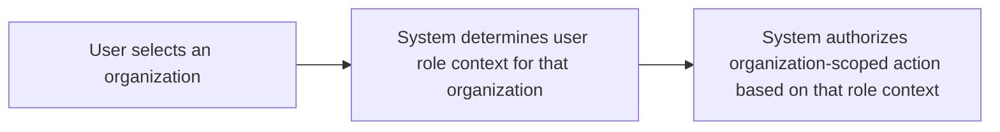

### Exactly One Role Assignment per User-Organization Association

- Each user-organization association must reference exactly one role for that organization context.
- The system must not allow creation or update of a user-organization association if it would result in zero roles or multiple roles being assigned to that same organization context.
- If a membership update request would violate the “exactly one role” constraint, the system must reject the update.
- When the user’s role context changes in an organization, the system must ensure the user’s organization-scoped capabilities reflect the new single role assignment only after the update completes.

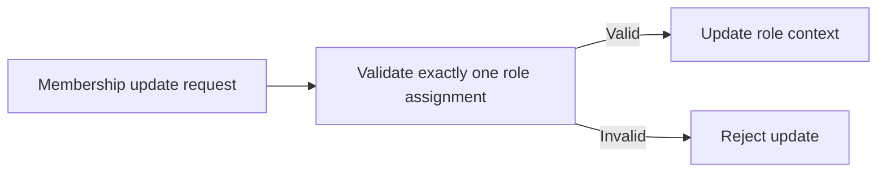

### Employee Management Permission Checks for Membership Role Updates

- Organization membership role changes (including assigning or changing a user’s role context) must be permitted only to users who have the employee management permission in the current organization.
- If the acting user does not have the required employee management permission for the current organization, the system must reject the membership role change.
- When a user performs a membership role update with employee management permission, the system must apply the change to that target user within the current organization.
- If the target user-organization association is missing, expired, or otherwise not valid for the current organization context, the system must reject the membership role update.

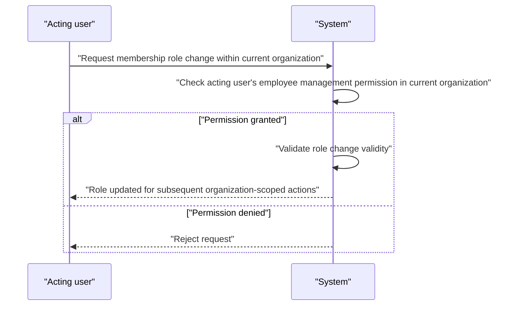

### Pending Invitation Membership Resolution

- When an invitation is pending for an email address, the system must maintain the membership association as pending for the invited email within the target organization.
- Pending invitations must remain valid until the invited user completes sign-up using the same email address.
- When the invited user signs up with the invited email, the system must automatically resolve the pending membership for that organization, making the user a member with the invited role context for that organization.
- If a user attempts to perform organization-scoped actions before the pending invitation resolves, the system must treat the user as not having a valid role context for the pending organization.
- If the sign-up email does not match any pending invitation email for the organization, the system must not resolve any pending membership.

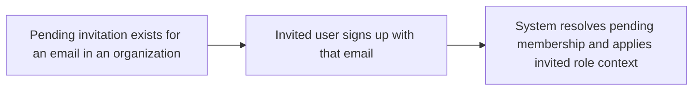

### Deactivated Employee Status Effect on Time Tracking Capabilities

- Employees marked as deactivated within an organization must not be able to perform time tracking actions that require an active employee status.
- The system must enforce deactivated employee status when a user attempts time tracking actions in the organization where they are deactivated.
- The system must allow deactivated employees to access historical data associated with their employment (so that past timelogs and timesheets remain viewable), while still preventing time tracking actions that require active status.
- If a deactivated employee attempts a time tracking action requiring active status, the system must reject the action.

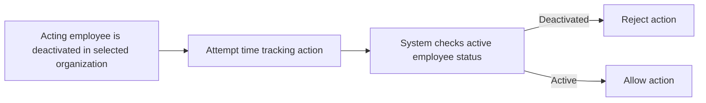

### Reactivation Restores Time Tracking and Timesheet Submission Ability

- When a deactivated employee is reactivated in an organization, the system must restore the employee’s ability to perform time tracking actions that require an active employee status.
- After reactivation, the employee must be allowed to create, edit (where permitted by the timesheet approval state), and delete applicable timelogs according to their role context and the referenced time tracking constraints.
- If the employee remains deactivated after a reactivation attempt (for example, because the reactivation did not take effect), the system must continue to reject time tracking actions requiring active status.

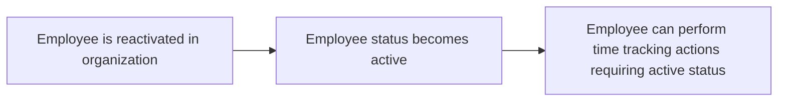

### Organization Membership Authority for Updates and Validity

- Organization membership role and membership status changes within an organization must be performed only by users who have the necessary authority in that organization (employee management permission for role updates).
- If an acting user tries to update membership information for an organization where they do not have the required authority, the system must reject the update.
- Updates must be applied within the currently selected organization context only; the system must not allow the acting user to modify membership associations in other organizations.
- When a membership update targets a user for the current organization, the system must ensure the target has a valid user-organization relationship context to be updated.

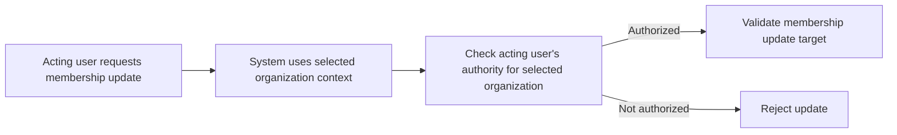

### Membership Role Change Validity Constraints

- The system must validate that a membership role change does not violate role assignment constraints for that organization.
- The system must ensure the target user-organization association remains consistent with the rule that exactly one role context exists for that organization membership.
- If the role change would create an invalid state for the target user in that organization (including violating the exactly-one-role constraint), the system must reject the change.
- If the membership update request is rejected, the system must not change the target user’s role context for subsequent organization-scoped actions.

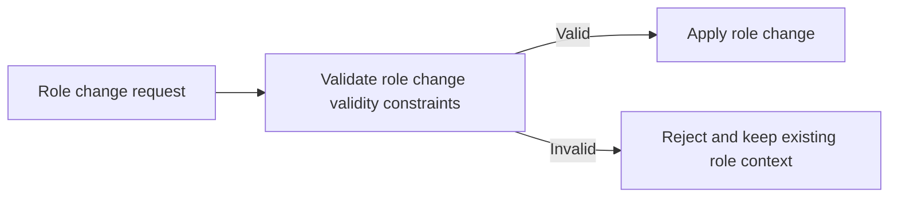

### Organization-Scoped Capability Enforcement Based on Membership Context

- The system must enforce that organization-scoped capabilities are determined by the user’s valid user-organization association in the currently selected organization.
- If a user belongs to multiple organizations, the system must ensure their capabilities are limited to the currently selected organization when they attempt actions.
- If a user attempts an organization-scoped action while no valid organization-scoped role context is available for the selected organization, the system must reject the action.
- If a membership role changes, the user’s organization-scoped capabilities must reflect the updated role context for subsequent actions in that same organization.

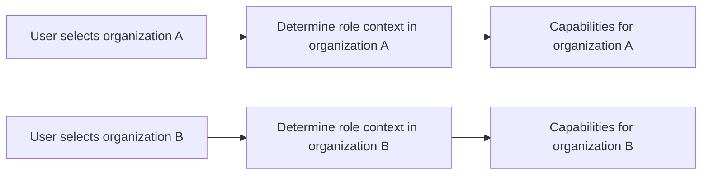

## Role Rules

Each organization defines its own set of roles, so roles must be created and managed within the boundaries of a single organization. The system includes three built-in roles that cannot be deleted, ensuring core permissions remain stable for that organization. Custom roles must have a name and a defined set of permissions, and those permissions determine what actions users can perform. Organization owners can create, edit, and delete custom roles, but deletion is restricted by assignment constraints: a custom role cannot be deleted if any employees are currently assigned to it. Built-in roles are exempt from deletion constraints and should never be treated as removable. When a custom role’s details are edited, it must immediately affect the allowed actions for users assigned to that role within that organization. If someone attempts to edit or delete a role without organization owner authority, the system must treat it as invalid. For any role assignment operation that references a role, the role must belong to the same organization context to be considered valid.

### Organization-Specific Role Scope

When a user manages roles, the system SHALL treat the role as belonging to exactly one selected organization context, and only roles from that same organization context SHALL be eligible for creation, editing, deletion, and assignment decisions.

If a user attempts to create, edit, delete, or assign a role while in an organization context that does not match the role’s organization, THEN the system SHALL reject the request as invalid.

While a user belongs to multiple organizations, the system SHALL ensure that any role selection or role-related changes apply only to the currently selected organization context.

The system SHALL store built-in and custom roles separately per organization, such that the same role name in different organizations does not imply shared permissions or shared role identity.

### Built-in Roles Are Non-Deletable

THE system SHALL include exactly three built-in roles per organization: Owner, Manager, and Employee.

WHILE a role is one of the built-in roles, THE system SHALL prevent the organization owner from deleting that role.

IF a user attempts to delete a built-in role, THEN the system SHALL reject the deletion request.

WHILE a built-in role exists in an organization, THE system SHALL allow it to be used for assigning employees and for determining what the assigned users can do within that organization.

### Custom Role Creation Requirements

WHEN an organization owner creates a custom role, THE system SHALL require a custom role name.

THE system SHALL reject the custom role creation request if the custom role name is missing.

WHEN an organization owner creates a custom role, THE system SHALL create the role within the currently selected organization context.

IF a non-owner attempts to create a custom role, THEN the system SHALL reject the request.

WHEN a custom role is created, THE system SHALL establish the custom role’s permission set according to the permissions selected by the organization owner, so that permissions-driven capabilities reflect the role immediately for subsequently assigned employees.

Custom roles created by an organization owner SHALL be available for role assignment within that same organization context.

### Owner-Only Management of Roles

WHEN role management actions are requested (create custom roles, edit custom roles, or delete custom roles), THE system SHALL allow the action only for organization owners.

IF the request is made by a user who is not the organization owner for the currently selected organization, THEN the system SHALL reject the request.

WHILE a user is an organization owner, THE system SHALL be able to manage only custom roles; built-in roles SHALL remain non-deletable.

IF the system cannot determine organization owner authority for the current organization context, THEN the system SHALL reject the role management request as invalid.

### Custom Role Deletion Blocked When Assigned

WHEN an organization owner requests deletion of a custom role, THE system SHALL check whether any employees in the same organization are currently assigned to that custom role.

IF at least one employee is currently assigned to the custom role, THEN the system SHALL reject the deletion request.

IF no employees are currently assigned to the custom role, THEN the system SHALL allow the deletion.

WHEN the system deletes a custom role, THE system SHALL ensure that the role no longer appears as an available option for assigning employees in that organization context.

Built-in roles SHALL not be subject to the deletion check; deletion requests for built-in roles SHALL be rejected regardless of assignment status.

### Role Edit Effects on Assigned Users

WHEN an organization owner edits the details of a custom role, THE system SHALL apply the updated role definition immediately to employees assigned to that role within the same organization.

WHILE the role edit is in effect, THE system SHALL ensure that permission-driven capabilities available to assigned users reflect the updated custom role permission set.

IF an edit request targets a role that is not a custom role (for example, a built-in role), THEN the system SHALL reject the request.

IF the role being edited is associated with a different organization than the currently selected organization context, THEN the system SHALL reject the request as invalid.

Employees assigned to a custom role SHALL continue to be assigned to that role after the edit, but the system SHALL update what those employees are allowed to do based on the edited role definition.

### Invalid Role Authority and Role Reference Scenarios

IF a user attempts to assign an employee to a role that belongs to a different organization than the currently selected organization context, THEN the system SHALL reject the assignment request.

IF a user attempts to change an employee’s role assignment without having role assignment authority (as determined by the organization’s permission model), THEN the system SHALL reject the request.

IF a user attempts to reference a role that does not exist within the currently selected organization context, THEN the system SHALL reject the request.

IF a user attempts to delete or edit a role without the required organization owner authority for the currently selected organization context, THEN the system SHALL reject the request as invalid.

If a deletion request is for a custom role that is still assigned to one or more employees, THEN the system SHALL reject the request even if the requester is an organization owner.

## RolePermission Rules

Each role permission entry must represent one of the supported permission keys that drive the user’s capabilities inside an organization. Role permissions exist to control access to organization settings, employee management, project management, time management, timesheet approval, time visibility, and report access as described by the permission set. For custom roles, the system must validate that permissions are chosen from the allowed permission keys and are attached to the correct role within the organization. A role’s permission set must be treated as authoritative for the actions a user can take when that role is assigned to an employee or member. Organization owners can edit custom roles’ permission sets, so any permission changes must be applied consistently for subsequent permission checks. When deleting a custom role, the system must ensure role deletability constraints are respected for employees assigned to the role, preventing orphaned permission states. If a user attempts to assign a permission value that is not part of the supported permission keys, the system must reject it as invalid configuration. If a role permission update is attempted by a user who is not an organization owner, it must be rejected to preserve the integrity of role capability definitions.

### Allowed Permission Keys Only

THE <system> SHALL accept and store role permissions only when every selected permission value is one of the supported permission keys:
- org:manage
- employee:manage
- employee:view
- project:manage
- project:view
- time:manage
- time:approve
- time:view_all
- report:view

IF a user attempts to create or edit a custom role permission set with any permission value that is not in the supported permission keys list, THEN THE <system> SHALL reject the change as an invalid configuration and SHALL NOT apply it.

WHEN a custom role permission set is being saved, THE <system> SHALL treat the unsupported permission values as invalid and shall require correction before the role can be updated.

### Permission-Driven Capability Control

A user’s capabilities inside an organization SHALL be determined by the permissions included in the role assigned to that user in the selected organization context.

WHEN a user attempts an action that is governed by a permission, THEN THE <system> SHALL check whether the user’s assigned role includes the corresponding permission before allowing the action.

IF the assigned role does not include the required permission for the attempted action, THEN THE <system> SHALL prevent the action.

THE <system> SHALL ensure permission checks are applied consistently across role-scoped actions so that a user’s allowed capabilities match the permission set of the role assigned to them in the organization.

### Custom Role Permission Set Validation

WHEN an organization owner edits a custom role’s permission set, THEN THE <system> SHALL validate that the permission set contains only supported permission keys (defined in [Allowed Permission Keys Only]).

WHEN the permission set is valid, THEN THE <system> SHALL apply the updated permission set to the custom role so that subsequent permission checks use the new permission set.

WHEN a custom role permission set update includes an invalid permission value, THEN THE <system> SHALL reject the entire update and SHALL keep the previous permission set unchanged.

THE <system> SHALL treat the permission set of each role as authoritative for capability control inside its organization context.

### Role Permission Edit Authority

WHEN a role permission set is updated for a role, THEN THE <system> SHALL allow the change only if the actor is an organization owner in the same organization.

IF a non-owner actor attempts to edit a custom role permission set, THEN THE <system> SHALL reject the request and SHALL NOT change the role’s permission set.

WHEN an organization owner updates a custom role permission set, THEN THE <system> SHALL ensure the update affects only roles in that organization and does not change permission sets in other organizations.

### Permission Checks Based on Assigned Role

WHEN a user performs an action that depends on role permissions, THEN THE <system> SHALL evaluate the user’s currently assigned role for the selected organization context.

IF the user’s assigned role changes (for example, the employee’s role assignment is updated), THEN THE <system> SHALL apply the updated role permissions to subsequent actions taken by that user in that organization.

THE <system> SHALL ensure that a user cannot perform role-permission-controlled actions that are not included in their currently assigned role’s permission set.

WHEN a user attempts to perform an action, THEN THE <system> SHALL apply permission checks even if the action concerns an entity owned by another user, as long as the operation is within the scope governed by the permission rules.

### Time Approval Access Permissions

WHEN a user attempts to approve or reject a submitted timesheet, THEN THE <system> SHALL allow the action only if the user’s assigned role includes the time:approve permission.

IF a user without the time:approve permission attempts to approve or reject a submitted timesheet, THEN THE <system> SHALL prevent the action.

WHEN a user attempts to view timesheets that are governed by time viewing capabilities, THEN THE <system> SHALL allow the viewing only if the user’s assigned role includes the appropriate time viewing permission.

For viewing all employees’ timesheets, THE <system> SHALL require that the assigned role includes the time:view_all permission.

### Report Viewing Permission Constraints

WHEN a user attempts to access organization reports, THEN THE <system> SHALL allow report viewing only if the user’s assigned role includes the report:view permission.

IF a user without the report:view permission attempts to access reports, THEN THE <system> SHALL prevent the access.

WHEN a report is requested, THE <system> SHALL ensure the report content displayed is restricted to the organization context selected by the user, in line with the role-based access decision.

### Prevent Orphaned Role Deletions

WHEN an organization owner attempts to delete a custom role, THEN THE <system> SHALL allow deletion only if no employees are currently assigned to that role.

IF at least one employee is assigned to the custom role, THEN THE <system> SHALL prevent deletion in order to avoid orphaned role assignments and inconsistent permission states.

WHEN deletion is not permitted, THEN THE <system> SHALL reject the request without changing the existing role and without altering employee role assignments.

THE <system> SHALL ensure that after a custom role is deleted, there is no employee that refers to a non-existent role within the organization.

### Invalid Permission Configuration Scenario

IF an organization owner attempts to save a custom role that contains at least one invalid permission value, THEN THE <system> SHALL reject the update as an invalid configuration.

IF the role permission update is rejected due to invalid permission values, THEN THE <system> SHALL keep the role’s existing permission set unchanged.

THE <system> SHALL provide a clear failure outcome to indicate that the role permission configuration is invalid, so the organization owner can correct the permission selection before retrying.

## Employee Rules

An employee record in an organization must be tied to an existing user account and must specify exactly one role within that organization. The employee’s role and status determine whether the user can perform time tracking and submission actions for that organization. Department is optional, but if set it must reference a department that belongs to the same organization. Position/title and employment type are optional fields except that employment type must be one of the allowed values when provided. The employee status must be either active or deactivated, and the system must enforce that deactivated employees cannot log time or submit timesheets even if they still exist historically. Deactivated employees’ historical data must remain viewable for authorized roles, while time entry creation must be blocked. Employees can be reactivated, and reactivation must restore permissioned ability to log time and participate in timesheet workflows. Users with employee management authority can update department, position/title, and employment type, but the updates must not violate the requirement that the employee always retains a single role assignment. If an action is attempted for an employee that is not in an active state, the system must respond with an invalid action for time tracking operations.

### Employee Must Reference an Existing User Account

- Each employee record in an organization must be tied to an existing user account.
- An employee record must not be created or updated to reference a user account that does not exist.
- If a user account is removed from the platform, the system must not break organization scoping: the platform must prevent leaving any employee record that references a non-existent user account.
- When employees are listed or viewed by authorized roles, the system must only show employees whose referenced user accounts are valid within the platform.
- If an employee action is attempted for an employee whose linked user account reference is invalid, the system must reject the action as an invalid employee reference.

### Exactly One Role Assignment Per Employee

- Each employee in an organization must have exactly one role assignment within that organization.
- The system must enforce that an employee cannot exist without a role assignment.
- The system must enforce that an employee cannot have more than one role assignment in the same organization.
- When a role assignment is changed for an employee, the employee must retain exactly one role assignment after the change completes.
- If a role assignment change would result in zero roles assigned to the employee, the system must reject the update.
- If a role assignment change would result in multiple roles assigned to the employee, the system must reject the update.

### Active vs Deactivated Enforcement

- Each employee status must be either active or deactivated.
- While an employee is active, the system must allow time-tracking actions that require a valid employee record in the organization.
- While an employee is deactivated, the system must block time-tracking actions that would create new time entries.
- While an employee is deactivated, the system must block submission of timesheets.
- Deactivated enforcement must apply even if the employee has historical timelogs or past timesheets in the organization.
- Users with the appropriate authority must be able to reactivate deactivated employees, after which time-tracking actions must be allowed again.

### Department Reference Is Optional but Must Belong to the Organization

- Department is optional on an employee record.
- If a department is provided on an employee record, it must reference a department that belongs to the same organization as the employee.
- If a user attempts to set a department reference to a department from a different organization, the system must reject the update.
- When a department is removed from an organization (department deletion), employee department references must become null (so employees remain valid without a department).
- When employees are viewed by authorized roles, the system must display the employee’s department only if it is currently set and belongs to the same organization (defined behavior: null indicates no department).

### Employment Type Validation

- Employment type is optional on an employee record.
- If employment type is provided, it must be one of the allowed values: full-time, part-time, contractor, intern.
- If an update attempts to set employment type to a value outside the allowed set, the system must reject the update.
- If an employee’s employment type is missing (not set), the system must keep the employee record valid and must not block time tracking based on employment type being absent.

### Updating Employee Details Constraint (No Role Integrity Breakage)

- For users with employee management authority (employee:manage), updates to employee details such as department, position/title, and employment type must not violate the requirement that the employee always retains exactly one role assignment.
- If an update request would change the employee in a way that results in an invalid role assignment state (zero roles or multiple roles within the organization), the system must reject the update.
- Updates to optional employee details must follow their own validation rules: department must be either empty or a department that belongs to the same organization; employment type must be either empty or one of the allowed values.
- If an update attempts to set department to an invalid department (wrong organization or non-existent), the system must reject the update.
- If an update attempts to set employment type to an invalid allowed value, the system must reject the update.
- If an update would attempt to modify employee details for an employee in a state that prevents the action (for example, deactivated time-tracking restrictions), the system must distinguish between allowed profile edits and blocked time-tracking actions: deactivation must block time tracking and timesheet submission, but must not be used as a blanket reason to reject all employee record edits when the user has employee management authority.

### Deactivated Employees Cannot Log Time

- If a deactivated employee attempts to create a new timelog (time entry creation), the system must reject the attempt.
- The rejection must occur regardless of whether the timelog targets projects or tasks in the organization.
- The system must not allow timelog creation for deactivated employees, even if the employee has historical timelogs or related projects/tasks.
- If a deactivated employee attempts to edit or delete a time entry in a way that would require creating new time (or modifying time entry availability), the system must reject actions that constitute time entry operations governed by time tracking access.
- If an action is attempted for a deactivated employee, the system must respond with an invalid action for time tracking operations (defined behavior for invalid time tracking on deactivated employees).

### Deactivated Employees Cannot Submit Timesheets

- If a deactivated employee attempts to submit a draft timesheet for approval, the system must reject the submission.
- The system must not allow status transition into submitted for a timesheet belonging to a deactivated employee.
- Rejected or draft timesheets behavior must remain consistent with deactivation: while deactivated, the employee cannot submit.
- If an employee is deactivated after a draft timesheet exists, submitting that draft must still be blocked until the employee is reactivated.

### Reactivation Restores Time Tracking Capability

- When a deactivated employee is reactivated, the system must restore the employee’s ability to log time (create timelogs).
- When a deactivated employee is reactivated, the system must restore the employee’s ability to submit timesheets for approval.
- Reactivation must not remove or invalidate historical timelogs or past timesheets; historical records must remain viewable according to authorization.
- After reactivation, time tracking operations should behave as they do for an active employee record, subject to the usual constraints for time tracking operations.

### Invalid Time Tracking for Deactivated Employees (Error Handling)

- If a time tracking operation is requested for a deactivated employee, the system must treat the request as invalid for time tracking operations.
- The system must ensure that organization context is respected: even if a user targets a resource in the selected organization, deactivation status must remain the decisive factor to block the time tracking operation.
- If the employee is deactivated between the time a user begins an action and the time the action is processed, the system must still enforce the deactivated restriction and reject the operation.
- For any rejected invalid time tracking operation due to deactivation, the system must provide an error response indicating the action is not allowed for the employee’s current status (active vs deactivated), without changing the state of any submitted or approved timesheets.

## Department Rules

Each department belongs to one organization and must have a name to be usable in that organization’s employee categorization. Departments may include descriptive text to help users understand what the department represents, but description is optional. Departments can optionally reference a parent department, with the structure limited to one level of nesting so a department cannot form deep hierarchies. When employees are assigned to a department, the department reference must be valid and belong to the same organization context. Deleting a department must be handled as a constraint that results in employee department values becoming unset rather than deleting employees, ensuring employee records remain intact. For users who can manage organization data, editing department information must keep the parent department rule valid, meaning the one-level nesting rule cannot be broken. If a user attempts to create or edit a department with an invalid parent department reference outside the allowed nesting structure, the system must reject the change. Employees can view the department list, so departments must be maintained in a way that always provides consistent department names for filtering and display.

### Department Identification and Required Name

Each department within an organization must have a department name, and the department name is required in order for the department to be usable in that organization.

If a user attempts to create a department without a department name, the system rejects the change and does not create the department.

If a user attempts to save edits to a department such that the department name would be missing, the system rejects the change and does not update the department.

### Department Description Optionality

A department may include an optional department description to help users understand what the department represents.

If a user provides a department description during creation or editing, the system stores and displays it for that department.

If a user omits the department description, the system accepts the department with no description, and employees can still view the department in the department list.

### One-Level Parent Department Nesting Constraint

A department may optionally reference a parent department to represent a one-level nesting structure.

The system must enforce that the parent relationship does not create deeper hierarchies than one level; in other words, a department can reference a parent department, but that parent must not itself be used to create multi-level nesting through additional parent references.

If a user attempts to create or edit a department with a parent reference that would violate the one-level nesting constraint, the system rejects the change.

If a user removes or changes the parent reference for a department, the system must re-check the one-level nesting constraint and reject the update if it would break the rule.

### Department Belongs to Organization (Context Isolation)

Every department belongs to exactly one organization.

When a user creates or edits a department, any parent department reference must belong to the same organization as the department being created or edited.

If a user attempts to create or edit a department using a parent department reference that belongs to a different organization, the system rejects the change.

If a user attempts to view departments, the system only shows departments that belong to the currently selected organization context.

### Employee Department Reference Validity

Employee department assignment is optional, but when an employee has a department assigned, that department reference must be valid within the employee’s organization.

If a user attempts to update an employee’s department assignment to a department that does not belong to the same organization as the employee, the system rejects the assignment.

If a department is not available in the employee’s organization (for example, because it was deleted), employees previously assigned to it must not retain an invalid reference; the system must clear the employee’s department assignment during the department deletion process.

### Deleting a Department Clears Employee Assignment

When a user deletes a department, the system must not delete employee records.

Instead, the system must clear the department assignment for any employees currently assigned to the deleted department, setting their department value to null/unassigned.

If a department deletion is attempted, the system must still complete the employee-assignment clearing so that no employee remains associated with a deleted department.

After deletion, employees with cleared department assignment remain able to view their employee record data, with the department shown as unset.

### Owner-Only Department Management Authority

Users who can manage organization data for the current organization context (i.e., organization owners) are the only users allowed to create, edit, and delete departments.

If a user who is not an organization owner attempts to create, edit, or delete a department, the system rejects the change.

If a user who is not an organization owner attempts to set or change department fields (including the parent department reference), the system rejects the change.

### Invalid Parent Department Structure Scenario Handling

The system must detect and reject invalid parent department structures during department creation and editing.

An invalid parent structure scenario includes any attempt to set a parent department reference that would result in more than one level of nesting when interpreted across the referenced departments.

If an invalid parent structure is detected, the system rejects the create or edit operation and leaves the department data unchanged.

If the invalid parent structure is caused by an existing relationship that would be extended by the proposed change, the system still rejects the proposed change rather than partially applying it.

### Consistent Department Names for Filtering and Display

Department names must be kept consistent for the purposes of filtering and display within the organization.

When employees filter their employee list by department, the system must use the current department name shown for that department.

If a department name is edited, the system applies the updated department name consistently for filtering and display so that employees can reliably interpret the department labels in list views.

If an employee filter is applied using department criteria and the department no longer exists (because it was deleted), the system must not show invalid department references; only employees with unset department assignment should appear under results where applicable.

## Contract Rules

A contract must include a required start date, because it defines when the employment terms begin for pay calculations and historical records. A contract may include an end date, and an end date left unset means the contract is ongoing. Pay rate is required for every contract, and the pay period must be one of the allowed period types so the contract’s pay structure is meaningful. Working hours per week is required, and contracts must store a numeric weekly expectation as part of the employment terms. Notes are optional and may be updated for the current active contract according to management rules. When a new contract is created for an employee, it must end the previous active contract by setting its end boundary to the day before the new contract’s start date, ensuring there is never an overlap of active contracts. Only one contract can be active at a time, so the system must prevent data states where multiple contracts are simultaneously ongoing. Users with employee management authority can create and edit the current active contract, while past contracts must be treated as immutable historical records. If a user attempts to edit a past contract, the system must reject the request as invalid. Employees can view their own contracts, so contract data shown to them must reflect the active vs past structure without allowing modifications.

### Contract Start Date Required

### Contract Start Date Required
A contract must include a start date. 
If a user attempts to create a contract without a start date, the system must reject the request as invalid.
A contract’s start date must be treated as the defining boundary for when the employment terms begin for historical record purposes.

### End Date Optional for Ongoing Contracts

### End Date Optional for Ongoing Contracts
A contract may include an end date.
If a contract’s end date is left unset, the contract must be treated as ongoing.
If a user attempts to set an end date without a start date being present, the system must reject the request as invalid.
The system must display ongoing vs ended contracts consistently to reflect whether the end date is set or unset.

### Pay Rate Requirement

### Pay Rate Requirement
A contract must include a pay rate.
If a user attempts to create or update a contract without a pay rate, the system must reject the request as invalid.
A contract’s pay rate must be stored as a numeric value so that pay-related reporting and calculations can interpret it consistently.

### Pay Period Allowed Values

### Pay Period Allowed Values
A contract must include a pay period.
The pay period must be one of the allowed period types: hourly, daily, weekly, or monthly.
If a user attempts to create or update a contract with a pay period outside the allowed set, the system must reject the request as invalid.
When displaying contract details, the system must show the pay period using one of the allowed period types.

### Working Hours Per Week Constraint

### Working Hours Per Week Constraint
A contract must include working hours per week.
If a user attempts to create or update a contract without working hours per week, the system must reject the request as invalid.
Working hours per week must be treated as a numeric weekly expectation for the contract’s employment terms.
When employees and managers view contract details, the system must present working hours per week for the contract being shown.

### Only One Active Contract at a Time

### Only One Active Contract at a Time
At any point in time within an organization, an employee must have at most one active contract.
The system must prevent situations where two contracts for the same employee would both be considered active at the same time.
WHEN an employee receives a new contract that should take effect, THE system must ensure the employee’s prior active contract is no longer active from the new contract’s effective boundary.

### New Contract Ends Previous Active Contract

### New Contract Ends Previous Active Contract
WHEN a user creates a new contract for an employee, THE system must end the employee’s current active contract by setting its end boundary to the day before the new contract’s start date.
If there is a current active contract at the time of creating the new contract, the system must apply this rule so there is no overlap between active contract periods.
If there is no current active contract, THE system must allow the new contract to be created without attempting to end a previous active contract that does not exist.

### Past Contract Immutability

### Past Contract Immutability
WHILE a contract is no longer the active contract for the employee (i.e., a past contract), the system must treat it as an immutable historical record.
If a user attempts to edit a past contract, the system must reject the request as invalid.
Any changes made to an employee’s contractual terms must be represented by creating a new contract rather than altering historical past contract details.

### Active Contract Edit Permissions (Consistency Check)

### Active Contract Edit Permissions (Consistency Check)
A user can edit the current active contract only when they have the authority to manage employees’ contracts.
WHEN editing the current active contract, THE system must apply updates in a way that preserves the contract’s role as the employee’s sole active contract for the relevant terms.
If the system detects that the contract being edited is not the employee’s current active contract, THEN the edit request must be rejected as invalid.

### Invalid Attempt to Edit Past Contract

### Invalid Attempt to Edit Past Contract
IF a user submits an edit request targeting a contract that is not the employee’s current active contract, THEN the system must reject the request as invalid.
The rejection must clearly indicate that historical contracts cannot be modified.
No partial updates must be applied when the system rejects an invalid edit attempt on a past contract.

### Employee View of Own Contracts

### Employee View of Own Contracts
Employees can view their own contracts.
WHEN an employee views their contracts, THE system must show the structure of active vs past contracts consistent with the contract end date rules.
Employees must not be able to modify any past contract from their view.
Employees must be able to view the current active contract details without being able to edit them unless they have the authority to manage contracts.

### Contract Update Consistency (Active-to-Past Transition)

### Contract Update Consistency (Active-to-Past Transition)
WHEN a new contract is created for an employee, THE system must establish the new contract’s start boundary and ensure the employee’s previously active contract is ended immediately before the new start boundary.
The system must keep the employee’s active contract assignment consistent so that at most one contract is treated as active.
WHEN a user edits what the system considers the current active contract, THEN the system must ensure that this edit does not create an overlap that would cause another contract to become active at the same time.
The system must ensure that any contract displayed as active is the one whose terms are current and non-overlapping based on the effective boundaries defined by start dates and end boundaries.

### Contract Effective Boundary Flow (New Contract Creation)

### Contract Effective Boundary Flow (New Contract Creation)
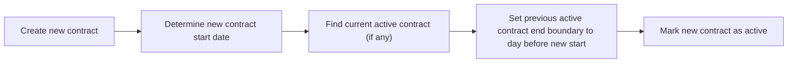
The system must follow the effective boundary flow so that active contract periods do not overlap and prior active contracts are properly ended when a new contract is introduced.

## Project Rules

A project must have a name and a color code because these are essential for identification and consistent UI presentation across project lists. A project can optionally include a description, budget hours, start date, and end date, and those optional values must be treated as part of the project’s defining attributes. A project’s status must be one of the allowed states: active, archived, or completed, and the status determines whether the project can receive new time entries. When a project is archived or completed, the system must enforce that timelog creation is blocked for that project, while existing timelogs remain preserved for reporting. Editing a project must maintain consistent business meaning of its attributes, and any project status changes must immediately affect whether new timelogs are allowed to associate with it. Deletion of a project is constrained by whether it has associated timelogs, so any attempt to delete a project that still has timelogs must be rejected. If a user with project management authority tries to delete such a project, the system must respond with an invalid deletion due to the timelog association constraint. Projects can be filtered by status, so the stored status value must always be valid and align with the allowed set. Projects with optional budgets must support budget-related reporting, while projects without budget hours are excluded from budget consumption calculations as defined in the reporting rules. When an end date exists, it should be consistent with the project’s time range intent, and if dates are inconsistent in the business sense, the system should reject the update to prevent misleading scheduling information.

### Project identification attributes (name and color code)

THE system SHALL require every project to have a project name.
THE system SHALL require every project to have a color code.
IF a project name is missing when a project is created or updated, THEN the system SHALL reject the operation.
IF a color code is missing when a project is created or updated, THEN the system SHALL reject the operation.
THE system SHALL treat the project name and color code as defining attributes that must be consistently present for the project to be usable in project lists.

### Project optional attributes (description, budget hours, start date, end date)

THE system SHALL allow a project description to be provided optionally.
THE system SHALL allow a project budget hours value to be provided optionally.
THE system SHALL allow a project start date to be provided optionally.
THE system SHALL allow a project end date to be provided optionally.
IF a project description is provided, THEN it SHALL be stored and associated with the project for use in project details and lists.
IF project budget hours is provided, THEN the system SHALL make it available for budget-related reporting rules (defined in reporting rules).
IF project start date is provided, THEN it SHALL be used as the project’s start date for any business-sense consistency checks involving the end date.
IF project end date is provided, THEN it SHALL be used as the project’s end date for any business-sense consistency checks involving the start date.

### Allowed project status values and validation

THE system SHALL store a project status using one of the allowed values: active, archived, or completed.
IF a project is created or updated with a status value that is not one of the allowed values, THEN the system SHALL reject the operation.
THE system SHALL consistently interpret the stored project status value according to the timelog acceptance constraints defined for each status.

### Timelog acceptance by project status

WHILE a project is active, THE system SHALL allow new timelogs to be associated with that project.
WHILE a project is archived, THE system SHALL block new timelogs from being associated with that project.
WHILE a project is completed, THE system SHALL block new timelogs from being associated with that project.
IF a user attempts to create or associate a timelog to an archived project, THEN the system SHALL reject the timelog operation due to the project status constraint.
IF a user attempts to create or associate a timelog to a completed project, THEN the system SHALL reject the timelog operation due to the project status constraint.

### Preservation of existing timelogs after archive or completion

IF a project’s status changes from active to archived, THEN any existing timelogs previously associated with the project SHALL be preserved for reporting.
IF a project’s status changes from active to completed, THEN any existing timelogs previously associated with the project SHALL be preserved for reporting.
THE system SHALL ensure that changing the project status to archived or completed does not cause existing timelogs to be removed or altered for reporting purposes.
THE system SHALL ensure that the ability to report on previously logged time remains available after a project is archived or completed.

### Editing projects while maintaining consistent business meaning

WHEN a project is edited, THE system SHALL maintain the business meaning of the project attributes so they remain consistent with the definition of the project for scheduling and time tracking.
IF an edit would create misleading scheduling information according to the date consistency rules, THEN the system SHALL reject the edit.
THE system SHALL ensure that any status change takes effect immediately for timelog association rules, without requiring additional user steps.

### Date consistency for project scheduling intent

IF a project end date is provided AND a project start date is provided, THEN the system SHALL ensure the project end date is not earlier than the project start date.
IF a project update would set an end date earlier than the start date (when both are present), THEN the system SHALL reject the update.
IF a project update changes either the start date or end date, THEN the system SHALL re-validate date consistency before accepting the change.
IF only one of start date or end date is provided, THEN the system SHALL accept the provided value as long as no inconsistency can be detected under the rule that compares both dates.

### Project deletion constraint based on timelog association

THE system SHALL allow a project to be deleted only if the project has no timelogs associated with it.
IF a user attempts to delete a project that has one or more associated timelogs, THEN the system SHALL reject the deletion request.
IF the deletion request is rejected due to timelog association, THEN the system SHALL present this rejection as an invalid deletion for the reason that the project is still referenced by timelogs.
THE system SHALL ensure that users cannot bypass the timelog association deletion constraint regardless of who they are or which project they attempt to delete, as long as the project still has associated timelogs.

### Project status filtering support in project lists

THE system SHALL support filtering the project list by project status.
IF a project list is requested with a status filter, THEN the system SHALL include only projects whose stored status matches one of the allowed status values used for that filter.
IF a filter references a status value outside the allowed set (active, archived, completed), THEN the system SHALL reject the filter usage or return no results according to the system’s standard validation behavior for invalid filter values.
THE system SHALL ensure that the stored status values used for filtering align with the allowed status values and timelog acceptance constraints.

### Budget hours optionality and reporting implications

IF project budget hours is not provided (budget hours is absent), THEN the project SHALL be treated as having no budget hours for budget consumption calculations.
IF project budget hours is not provided, THEN the project SHALL be excluded from budget consumption calculations as defined by the project budget reporting rules.
IF project budget hours is provided, THEN the system SHALL include the project in budget consumption calculations as defined by the project budget reporting rules.
IF the project budget hours value is later added or removed, THEN the project’s inclusion or exclusion in budget-related calculations SHALL reflect the updated presence or absence of budget hours according to the reporting rules.

## ProjectMembership Rules

A project membership assigns an employee to a specific project with a project role of either member or project-lead. Each project membership must reference an employee who is eligible to be assigned within the same organization context as the project. An employee can belong to multiple projects, so the same employee may have several memberships, each with its own assigned role per project. If a project membership is removed, the employee must no longer be considered a member of that project for time entry assignment constraints and task visibility constraints. When assigning an employee to a project, the assigned role must be one of the allowed role options so that permissions like task management for project leads are applied correctly. Tasks can only be assigned to an employee when that employee is a project member, so project membership rules must ensure task assignment remains valid. Users with project management authority can remove members, so any membership change must update the set of eligible employees for tasks and timelogs in that project context. If an attempt is made to add a membership that references a non-member employee state that cannot participate, the system must reject it as invalid. When a user changes project role within a membership, the capability differences between member and project-lead must apply immediately to that project’s task management behavior.

### Project Membership Eligibility and Link to Project

A project membership shall assign an employee to a specific project within the same organization context as the project.

WHEN assigning or creating a project membership, THE system shall ensure the referenced employee is eligible to participate in the same organization context as the selected project.

THE system shall treat each project membership as the authoritative basis for whether an employee is considered a member of that project.

IF a project membership is removed, THEN the employee shall no longer be considered a member of that project for the purpose of enforcing task assignment eligibility and project-related time entry assignment constraints.

IF an attempt is made to add or update a project membership that references an employee who is not eligible within the project’s organization context, THEN the system shall reject the membership change as invalid.

WHEN a project membership exists, THE system shall allow the assigned employee to be recognized as a valid candidate for project-scoped task assignment (subject to later task assignment rules).

WHEN a project membership is removed, THEN any project-scoped constraints that rely on membership status shall reflect the change immediately.

IF the same employee is assigned to the same project more than once, THEN the system shall prevent creating duplicate memberships for the same employee and project pair.

### Project Role Values and Allowed Role Options

A project membership shall have exactly one project role.

THE system shall only allow project role values that are one of: member or project-lead.

IF a membership assignment or role change attempts to set any role value other than member or project-lead, THEN the system shall reject the change as invalid.

WHEN a project membership role is set to member, THEN the project-role capabilities applied to that membership shall follow the member capability set.

WHEN a project membership role is set to project-lead, THEN the project-role capabilities applied to that membership shall follow the project-lead capability set.

THE system shall ensure that the employee’s project role for a given project is the sole basis for determining membership-based task management behavior within that project.

### Supporting Multiple Projects per Employee

An employee can be assigned to multiple projects via separate project memberships.

WHEN an employee is assigned to an additional project, THEN the system shall create or maintain a distinct project membership for that project.

IF an employee already has a project membership for one project, THEN adding memberships to other projects shall not be blocked by the existence of the first membership.

WHEN an employee has multiple memberships across projects, THE system shall treat each membership independently for determining membership-based eligibility within each respective project.

IF a membership is removed for one project, THEN the employee’s memberships for other projects shall remain unaffected.

### Task Assignment Requires Project Member

WHEN an assigned employee is specified for a task, THEN the system shall only allow that employee if the employee has an active project membership for the same project as the task.

IF an attempt is made to assign a task to an employee who does not have a project membership for the task’s project, THEN the system shall reject the task assignment as invalid.

IF a task’s assigned employee is removed from the project by removing the project membership, THEN the system shall treat the task assignment as no longer valid under membership-based eligibility constraints.

THE system shall ensure that membership removal updates the eligibility set used for task visibility and task assignment constraints within that project context.

WHEN determining whether a user can interact with tasks in a project based on task assignment eligibility, THE system shall rely on current project membership status (including role) for that project.

### Project-Lead Capabilities Depend on Membership Role

WHEN an employee has a project membership with project role set to project-lead, THEN the system shall grant that employee the project-lead capability to manage tasks within that project.

WHEN an employee has a project membership with project role set to member, THEN the system shall apply the member capability set for task interactions within that project.

IF a user attempts to perform a project-lead-specific task management action in a project where their membership role is member, THEN the system shall reject the action or treat it as unauthorized based on their membership role.

IF a user attempts to perform a project-lead-specific task management action after their project role changes away from project-lead, THEN the system shall immediately remove the project-lead capability for that project.

THE system shall ensure the project-lead capability is evaluated within the selected project’s membership context, not inferred across other projects where the employee may have different roles.

### Membership Change Validity and Invalid Assignment Scenario

WHEN a user with project management authority attempts to add an employee to a project or change a project membership, THEN the system shall validate the proposed membership against membership validity constraints.

IF the proposed membership references a non-participating employee (for example, an employee who is not eligible to participate in the organization context of the project), THEN the system shall reject the membership change as invalid.

IF a proposed assignment uses an invalid role value (not member or project-lead), THEN the system shall reject the membership change as invalid.

IF the proposed membership would violate the system’s uniqueness constraint for employee and project pairing (duplicate membership), THEN the system shall reject the request.

IF a membership removal is requested, THEN the system shall validate that the membership exists for the employee and project before applying the removal.

IF the membership being removed does not exist, THEN the system shall reject the request as invalid.

### Immediate Effect of Role Changes

WHEN a project membership role is changed within a project, THEN the capability differences between member and project-lead shall apply immediately for that same project.

IF the role changes from member to project-lead, THEN the system shall make project-lead task management capabilities available immediately within that project.

IF the role changes from project-lead to member, THEN the system shall immediately revoke project-lead task management capabilities within that project.

WHILE role change is being applied, THEN the system shall ensure that subsequent task management behavior within the project reflects the updated membership role.

flowchart LR
    A["Current project role: member"] -->|"Change role to project-lead"| B["Updated project role: project-lead"]
    B -->|"Project-lead task management capabilities apply immediately"| B
    B -->|"Change role to member"| C["Updated project role: member"]
    C -->|"Project-lead task management capabilities revoked immediately"| C

## Task Rules

A task must have a title, since titles are required for identifying work items in project task lists. A task can optionally include a description, estimated hours, and a due date, and these values must remain associated with the task for filtering and reporting use. Tasks must have a status selected from the allowed set: open, in-progress, completed, or closed, and the status determines how tasks appear for users who view in-progress or open items. Priority must be one of the allowed values from low through urgent so that task sorting and prioritization remain consistent. If a task includes an assigned employee, that employee must be a project member, otherwise the assignment is invalid. Tasks may optionally reference a parent task to form subtasks, but the rule allows only one level of nesting so the hierarchy cannot grow beyond that. Project leads or users with project management authority can edit tasks within their project, and edits must keep task constraints valid such as status and priority being from the allowed sets. Task status changes are allowed as long as the new status is valid, and any invalid status change must be rejected. Employees can view tasks only in projects they are assigned to, so tasks belonging to projects outside the employee’s membership should not be considered accessible. If a user attempts to create a task with an assigned employee who is not in the project, or with a subtask nesting beyond one level, the system must reject the request as invalid.

### Task field requirements and optional details

- Every task must have a title; if a task title is missing, the system must reject the task creation or update.
- A task may include an optional description; the description is not required for task creation.
- A task may include optional estimated hours; if estimated hours are provided, they remain associated with the task for later viewing, filtering, and reporting.
- A task may include an optional due date; if a due date is provided, it remains associated with the task for later viewing, filtering, and reporting.
- If a task is updated, the system must retain each provided optional value (description, estimated hours, and due date) as part of the task’s details unless the user explicitly changes it.

### Allowed task status values

- The system must restrict task status to exactly one allowed value from: open, in-progress, completed, closed.
- If a user attempts to create or update a task with a status outside the allowed set, the system must reject the change.
- When users view tasks, the task status determines whether tasks appear under views that focus on items in-progress or open.

Mermaid flowchart for status categorization:
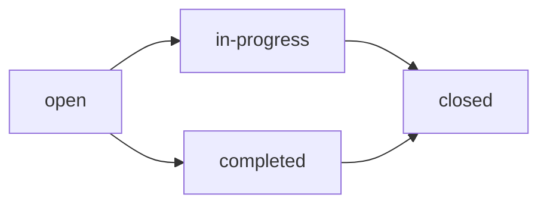

### Allowed task priority values and sorting readiness

- The system must restrict task priority to exactly one allowed value from: low, medium, high, urgent.
- If a user attempts to create or update a task with a priority outside the allowed set, the system must reject the change.
- When tasks are sorted or prioritized in task lists, the system must use the allowed priority values consistently so that sorting and prioritization behavior remains stable.
- If priority is not changed during an edit, the system must keep the existing priority value associated with the task.

### Assigned employee validity must be a project member

- If a task includes an assigned employee, that assigned employee must be a member of the task’s project.
- If a user attempts to assign an employee who is not a project member, the system must reject the task assignment change.
- If the assigned employee is removed from the task, the task remains valid without an assigned employee.
- The validity of an assignment is determined within the project context of the task.

### Task assignment edit authority by role and membership

- Users who can edit tasks within a project must only make assignment changes (including assigning or reassigning an employee) that keep the assigned employee rule valid: the assigned employee must remain a project member.
- Users with broader project management capability must still enforce the assigned employee validity rule when editing tasks.
- Employees can view tasks only for projects they are assigned to; tasks in projects outside their assigned membership should not be considered accessible for viewing.

### Subtask structure: only one level of nesting

- A task may optionally reference a parent task to represent subtasks.
- Subtask nesting must be limited to one level only.
- If a user attempts to create a subtask relationship that would require more than one level of nesting, the system must reject the request.

Mermaid flowchart for allowed nesting depth:
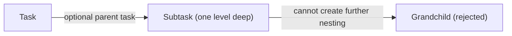

### Task status change validity and required outcomes

- Task status changes are permitted as long as the new status is one of the allowed values: open, in-progress, completed, closed.
- If a user attempts to change a task status to a value outside the allowed set, the system must reject the change.
- The system must record that a status change occurred when a valid new status is applied.
- When a valid status change is applied, the task’s new status must take effect for subsequent task views and filters.

Mermaid flowchart for status transitions as allowed values:
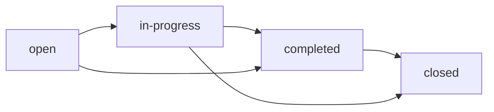

### Invalid subtask nesting scenario rejection

- If a user attempts to create a nesting where a task would become a child of a subtask (creating more than one level of nesting), the system must reject the request as invalid.
- The rejection must occur regardless of the user’s ability to edit tasks, so long as the subtask nesting would exceed one level.
- After rejection, the original parent-child relationships for existing tasks must remain unchanged.

### Project lead vs project management edit authority

- Users who are project leads can edit tasks within their project.
- Users with project management permission can edit any task, including tasks where they are not the project lead.
- The system must verify edit authority using the project context of the task.
- If a user lacks both project lead standing for the project and project management permission, the system must reject any attempt to create or modify tasks in that project.

Mermaid flowchart for edit authority:
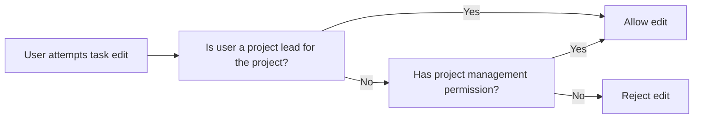

## Timelog Rules

A timelog must include a date and a duration in minutes, because these are the core values used to calculate weekly totals. A timelog must always reference a project, and that project must be one the employee is assigned to, otherwise the timelog is invalid. A timelog may optionally include a task, but if a task is provided it must belong to the selected project so the time entry remains consistent with project structure. A timelog’s description is optional and can be used to capture what was done. The billable flag controls whether the time is treated as billable or non-billable for later reporting and must be a valid boolean choice when set. Employees can create timelogs only for themselves, so attempts to create time entries for other employees are rejected. Employees may edit or delete only their own timelogs when the timelog is not part of an approved timesheet, which means the system must treat inclusion in an approved timesheet as read-only. Users with time management permission can edit or delete any employee’s timelogs, but those actions must still respect the overall rule that approved timelogs are locked against changes unless the role explicitly allows management. Timelogs can be filtered by date range, project, task, and billable status, so each of these references and attributes must always be valid and match the allowed project/task relationships. If the employee is deactivated in the organization, the system must block timelog creation. If a project is archived or completed, the system must block new timelogs for it to prevent time from being logged against inactive work.

### Timelog Required Values (Date and Duration)

A timelog must include a work date.

A timelog must include a duration in minutes.

If a timelog is submitted without a work date, the request is rejected.

If a timelog is submitted without a duration in minutes, the request is rejected.

If a timelog’s duration in minutes is not a valid numeric minute value, the request is rejected.

### Timelog Project Requirement and Valid Project Assignment

A timelog must always reference a project.

The referenced project for a timelog must be one that the employee is assigned to.

If an employee attempts to create a timelog referencing a project they are not assigned to, the request is rejected.

If an employee attempts to create a timelog without a referenced project, the request is rejected.

### Optional Task Consistency with Timelog Project

A timelog may optionally include a task.

If a task is provided on a timelog, the task must belong to the same project as the timelog’s referenced project.

If a task is provided but it does not belong to the referenced project, the request is rejected.

If a task is not provided, the timelog remains valid without a task.

### Billable Flag Governs Reporting Classification

A timelog includes a billable flag that determines whether the time is treated as billable or non-billable for reporting.

The system must store and preserve the billable flag value for each timelog so that later reports reflect the correct classification.

If the billable flag value is not a valid boolean choice when provided, the request is rejected.

### Employee-Only Time Creation

Employees can create timelogs only for themselves.

If a user attempts to create a timelog for another employee, the request is rejected.

When an employee creates a timelog, it is recorded under that employee as the owner for the purpose of viewing and subsequent editing/deleting rules.

### Edit and Delete Restrictions for Timelogs in Approved Timesheets

Employees may edit or delete their own timelogs only when the timelog is not part of an approved timesheet.

Once a timesheet is approved, timelogs included in that approved timesheet become read-only.

If an employee attempts to edit a timelog that is part of an approved timesheet, the request is rejected.

If an employee attempts to delete a timelog that is part of an approved timesheet, the request is rejected.

If a timelog is not part of an approved timesheet, the employee may edit it according to the timelog creation/edit rules for allowable fields (defined by the timelog itself), and may delete it subject to the timelog not being in an approved timesheet.

### Deactivated Employee Time Tracking Enforcement

If an employee is deactivated in the organization, the system must block creation of new timelogs for that employee.

If a deactivated employee attempts to create a timelog, the request is rejected.

Deactivated employees must remain able to view historical timelogs that were already recorded before deactivation.

### Archived or Completed Project Blocks New Timelogs

If a project is archived or completed, the system must block creation of new timelogs associated with that project.

If an employee attempts to create a timelog for an archived or completed project, the request is rejected.

Existing timelogs tied to a project that later becomes archived or completed remain preserved for reporting and historical viewing.

### Invalid Task-Project Mismatch Scenario Handling

If a timelog includes a task that does not match the timelog’s referenced project, the system must reject the request.

When rejecting due to a task-project mismatch, the system must treat the timelog as not created or not updated, so that no inconsistent timelog record is produced.

If a timelog does not include a task, no task-project mismatch can occur and the request should be evaluated based only on the project assignment and other required timelog values.

## Timesheet Rules

A timesheet represents a week-long container for an employee’s timelogs, and it is anchored to a specific week that runs from Monday to Sunday. The timesheet owner must be an employee in the organization, and the timesheet status must be one of draft, submitted, approved, or rejected. Total hours on a timesheet is derived from the timelogs it contains, so the system must ensure the set of included timelogs is the only basis for that calculation. A submitted timesheet must always include at least one timelog, so an empty timesheet is invalid for submission. The system must prevent duplicates by ensuring that for the same employee and week, there cannot be more than one timesheet that is already submitted or approved. When a timesheet is submitted, it enters a reviewable state where the timelogs it contains become locked once the timesheet is approved. If a timesheet is rejected, it returns to a modifiable draft state, and the employee should be able to change the timelogs and resubmit. A rejection must include a provided reason, making the reason a required business constraint for rejecting workflows. Employees can view their own timesheets and see their current statuses, while authorized approvers can view all submitted timesheets within the organization. If a user attempts to approve a timesheet that is not in a submitted state, or attempts to submit a timesheet that violates the “no empty and no duplicate submitted/approved” constraints, the system must reject the request as invalid.

### Timesheet as a Weekly Container

A timesheet represents a week-long container for an employee’s timelogs.
The timesheet week is anchored to a specific calendar week defined as Monday through Sunday.
The timesheet is owned by an employee within the selected organization.
The system must ensure that timelogs included in a timesheet belong to the timesheet’s owning employee.
The system must ensure that a timesheet’s total hours is derived only from the timelogs included in that timesheet.
If a user attempts to submit a timesheet, the system evaluates the timelogs currently included in that timesheet as the basis for total hours.
The system must treat the set of included timelogs as the only basis for the timesheet total hours, so that changes to included timelogs change the derived total hours while the timesheet is modifiable.

### Allowed Timesheet Status Values

The system must store and display timesheet status using only the allowed values: draft, submitted, approved, and rejected.
When a timesheet is created, its status is draft.
Only the allowed status transitions described in this unit are permitted for a timesheet.
The system must reject any request that attempts to set a timesheet to a status outside the allowed values.

### Submission Requires at Least One Timelog (No Empty Timesheets)

WHEN an employee submits a timesheet, THE system SHALL reject the submission if the timesheet has no timelogs included.
If an employee attempts to submit an empty timesheet, THE system SHALL reject the request as invalid.
WHILE a timesheet is in draft status, THE system SHALL allow the employee to add or remove timelogs from the timesheet.
WHEN the employee submits a non-empty draft timesheet, THE system SHALL accept the submission provided no duplicate constraint is violated.
The system SHALL ensure that the submission decision is based on the current contents of the timesheet.

### No Duplicate Submitted or Approved Timesheet Per Employee and Week

WHEN an employee submits a timesheet for a given employee and a given week, THE system SHALL reject the submission if another timesheet for the same employee and the same week already exists with status submitted or approved.
WHEN an employee attempts to submit a duplicate for the same week, THE system SHALL treat the request as invalid and reject it.
The system SHALL allow submission only if there is no existing timesheet for that employee and week in submitted or approved status.
The system SHALL continue to prevent duplication even if a previously rejected timesheet exists for the same employee and week, since rejected timesheets return to draft and are resubmittable.

### Approved Timesheet Locks Included Timelogs

WHEN a timesheet is approved, THE system SHALL lock all timelogs included in that approved timesheet so they can no longer be edited or deleted through normal modification actions.
WHILE a timesheet is approved, THE system SHALL prevent any edits or deletions to timelogs that are included in that approved timesheet.
WHEN a timesheet is approved, THE system SHALL record the review outcome as approved and make it visible as such.
The system SHALL treat the lock as tied to the approved timesheet such that only timelogs included in that approved timesheet are impacted.

### Rejection Returns to Draft and Requires a Reason

WHEN an approved review action rejects a submitted timesheet, THE system SHALL change the timesheet status to rejected.
WHEN a timesheet is rejected, THE system SHALL return the timesheet to a modifiable draft state so the employee can modify and resubmit.
WHEN a timesheet is rejected, THE system SHALL require a rejection reason.
IF a user attempts to reject a submitted timesheet without providing a rejection reason, THEN THE system SHALL reject the request as invalid.
The system SHALL ensure the rejection reason is associated with the rejected/reverted review outcome so it remains available after the timesheet returns to draft.

### Approve Only Submitted Timesheets

WHEN a user with approval capability attempts to approve a timesheet, THE system SHALL approve only if the timesheet status is submitted.
IF the timesheet is not in submitted status, THEN THE system SHALL reject the approval request as invalid.
WHILE a timesheet is in draft or rejected status, THE system SHALL not allow it to be approved directly.
WHEN a submitted timesheet is approved, THE system SHALL apply the approved-lock behavior to the included timelogs.

### Rejected Timesheet Resubmission Enables Employee Workflow

WHEN a timesheet is rejected and returned to draft status, THE system SHALL allow the employee to modify the timelogs included in the timesheet.
WHEN the employee resubmits a rejected timesheet, THE system SHALL re-apply the submission validity constraints for that week.
WHEN the employee resubmits, THE system SHALL ensure the timesheet is not empty and that the no-duplicate submitted/approved constraint is satisfied.
If the employee resubmits in a way that violates the empty-timelog constraint or the duplicate submitted/approved constraint, THEN the system SHALL reject the submission request as invalid.
The system SHALL allow the employee to view the current status of their timesheet so they know whether it is awaiting submission, under review, approved, or returned to draft.

## TimerSession Rules

A timer session is used for live time tracking and must belong to an employee so it can reflect the time the employee is currently recording. At most one timer session can be active for a given employee at a time, so starting a new session when one is already running is invalid. When starting a timer session, the employee must select a project, and the project assignment must be valid for that employee so time can only be tracked against an eligible project. Selecting a task is optional, but if a task is provided it must relate to the chosen project to avoid mismatched work tracking. The timer session includes a description that the employee may edit while it is running, and the edited description must remain associated with the running session. Stopping a timer session must create a timelog with duration rounded to the nearest minute, ensuring consistent time measurement behavior. Discarding a timer session must result in no timelog being created, so the session’s time is not counted toward weekly totals. Employees must be able to view the currently running timer session, and the system must clearly distinguish between “running” and “not running” for business meaning. If a timer would violate project eligibility (such as tracking time to a project that cannot receive timelogs), the session must be rejected. If the employee is deactivated, starting or continuing a timer must be blocked to prevent unauthorized time recording.

### One Active Timer Session Per Employee

Each employee may have at most one currently running timer session at a time.

When an employee attempts to start a new timer session while another timer session for the same employee is currently running, the system must reject the new start request.

The system must clearly distinguish between a running timer session and sessions that are not running so business meaning (such as “currently running timer”) is unambiguous for the employee.

The system must prevent the employee from being in a situation where both a previously started timer session and a newer timer session are simultaneously treated as running for the same employee.

### Timer Start Requires Project Selection

When an employee starts a timer session, the employee must select a project to associate with the running session.

If the employee does not select a project at timer start, the system must reject the start request.

After a timer session has started, the associated project is part of the running session context and must be used for validation of subsequent edits to the running session.

### Project Eligibility for Timer Tracking

A timer session must be associated only with a project that is eligible to receive timelogs within the selected organization.

If the chosen project is not eligible to receive timelogs (for example, because it is archived or completed), starting the timer session must be rejected.

If project eligibility changes after a timer session has been started, the system must apply the eligibility constraint so that an employee cannot successfully proceed in a way that would result in time being recorded against an ineligible project.

### Optional Task Must Match Selected Project

When an employee starts or edits a running timer session with a selected task, that task must belong to the same project selected for the timer session.

If the employee provides a task that does not belong to the selected project, the system must reject the timer session start or the attempted edit, as applicable.

If no task is provided, the running timer session may still be started and tracked using only the selected project.

### Editable Description During Running Session

While a timer session is currently running, the employee must be able to change the session description.

A description edit made while the timer session is running must remain associated with that running session such that the description used for the resulting timelog reflects the employee’s latest saved description at the time the timer is stopped.

Description edits are only allowed for a running timer session; once the timer session is stopped or discarded, further edits to the description for that session must not affect time recording outcomes.

### Stopping a Timer Creates a Timelog

When an employee stops a running timer session, the system must create a timelog that reflects the recorded time interval for that session.

The created timelog must be associated with the employee who owned the running timer session.

The created timelog must be associated with the project selected in the running session.

If a task was selected in the running session, the created timelog must be associated with that selected task; if no task was selected, the timelog must be created without a task association.

The system must ensure that stopping a timer session is the only business action that results in creation of a timelog from that running session.

### Duration Rounded to Nearest Minute

When a timer session is stopped and a timelog is created, the recorded duration used for the timelog must be rounded to the nearest minute.

The rounding behavior must be consistent across all timer stop actions so that employees can predict how the system converts elapsed time into minutes.

### Discarding a Timer Creates No Timelog

When an employee discards a running timer session, the system must not create any timelog from that session.

A discarded timer session must not add any hours to timesheet-related totals, since no timelog is created.

After a timer session is discarded, the session must no longer be treated as running, and the employee must be able to start a new timer session if needed.

### Viewing the Currently Running Timer

An employee must be able to view the currently running timer session, including the project selection and optional task selection, as well as the currently set description.

If the employee does not have a running timer session, the system must present a clear “not running” business state so the employee understands that there is no active timer session.

### Deactivated Employee Cannot Run Timer

If an employee is deactivated within the organization, the system must block the employee from starting a new timer session.

If an employee becomes deactivated while a timer session is running, the system must prevent the deactivated employee from successfully continuing time tracking behavior that would lead to a timelog being created.

A deactivated employee must not be able to produce a timelog from timer stop actions.

### Invalid Timer Due to Project Eligibility Scenario

If an employee attempts to start a timer session for a project that cannot receive timelogs, the system must reject the timer start.

If an invalid project selection is detected due to project eligibility rules, the system must not allow time to be recorded against that project, including by ensuring that no timelog is created as a result of that invalid timer session.

The system must provide behavior that aligns with project eligibility so that employees cannot bypass eligibility constraints by attempting to start and then stop a timer for an ineligible project.

### TimerSession Business Flow (Run, Stop, Discard)

flowchart LR
    A["No running timer"] -->|"Start timer with project (and optional task that matches)"| B["Running timer session"]
    B -->|"Edit description while running"| B
    B -->|"Stop timer"| C["Timelog created with rounded minutes"]
    B -->|"Discard timer"| D["No timelog created"]

flowchart LR
    A["Running timer exists"] -->|"Start another timer"| E["Reject: only one active timer per employee"]

flowchart LR
    B["Running timer session"] -->|"Stop"| F["Validate project eligibility" ]
    F -->|"Eligible"| C["Timelog created"]
    F -->|"Not eligible"| G["Reject/Prevent timelog creation"]

## TimesheetVersioningLock Rules

A timesheet versioning lock represents that a timesheet has reached an approved state and its included timelogs are treated as locked for editing and deletion purposes. The lock must be associated with the specific timesheet that was approved, so that only timelogs in that approved timesheet become protected. Once a lock exists, any attempt to modify or remove the timelogs included in the locked timesheet must be rejected as invalid, regardless of who is attempting the change. The lock is only created as a result of approval, so a lock cannot be present for a timesheet that is not approved. If a timesheet is rejected, the lock must no longer prevent edits because the timesheet returns to a draft state, allowing the employee to adjust and resubmit. Lock timestamps exist to record when approval produced the locked condition, and the system must consistently use that timestamp to reflect locked timing. Approvers and time managers may view locked timelogs, but they must not be able to alter them in ways that violate the locked constraint. If users attempt an edit that would effectively change a timelog belonging to a locked timesheet, the system must block it and keep the timelog values unchanged. This ensures that historical approval outcomes remain trustworthy for reporting and audit expectations.

### Approved timesheet timelog lock creation and scope

A timesheet versioning lock represents that a specific timesheet has reached the approved state.
The system shall create a versioning lock only as a result of approving a timesheet.
The lock shall be tied to the specific approved timesheet it protects, so that only timelogs included in that approved timesheet become protected.
While a timesheet versioning lock exists for an approved timesheet, timelogs that belong to that locked approved timesheet shall be treated as locked.
The system shall record a lock timestamp at the moment the approval produces the locked condition.
The lock timestamp shall be the reference point the system uses when indicating when the locked state was established.

### Lock prevents timelog edits and deletions

While a timesheet versioning lock exists for an approved timesheet, the system shall reject any attempt to edit a locked timelog that is included in that locked approved timesheet.
While a timesheet versioning lock exists for an approved timesheet, the system shall reject any attempt to delete a locked timelog that is included in that locked approved timesheet.
The system shall keep locked timelog values unchanged when an invalid edit or delete attempt is made.
If a user performs an edit or deletion action on a timelog that is part of a locked approved timesheet, the system shall block the action based on the lock constraint, regardless of the user who initiated the request.
Approvers and time managers may view locked timelogs, but they shall not be able to alter locked timelogs in a way that violates the locked constraint.

### Lock exists only for approved timesheet status

A timesheet versioning lock shall only exist for a timesheet whose status is approved.
If a timesheet is not approved, the system shall not allow a lock to be present that would protect its timelogs.
When the approved status is present and the lock exists, the system shall apply the locked constraint to timelogs included in that approved timesheet.
If the timesheet transitions away from the approved state due to rejection, the system shall remove the lock effect so that the timesheet is no longer protected as locked.

### Rejected timesheet unlocks edits via draft state

When an approved timesheet is rejected, the timesheet shall return to the draft state.
While the timesheet is in the draft state after rejection, locked constraints associated with the rejected approval outcome shall not prevent editing.
After rejection returns the timesheet to draft status, the employee shall be able to modify the timelogs in that timesheet and resubmit it for approval.
The system shall ensure that the previously locked approved timelogs no longer behave as locked timelogs once the timesheet is no longer approved and is back in draft status.

### Invalid attempt to change locked timelog and approval integrity constraint

If a user attempts an edit or deletion that would effectively change the values of a timelog included in a locked approved timesheet, the system shall treat the attempt as invalid and reject it.
The system shall preserve the locked timelog values so that the outcome of approval remains consistent and trustworthy for later review and reporting.
The system shall prevent actions that would undermine approval integrity by ensuring locked timelogs remain unchanged after approval.
If the user’s action targets a timelog that is not included in the locked approved timesheet, the system shall not apply the lock constraint to that timelog.

### Lock lifecycle flow (approved vs rejected)

flowchart LR
    A["draft"] -->|"submit for approval"| B["submitted"]
    B -->|"approve"| C["approved"]
    C -->|"create timesheet versioning lock"| D["lock exists; timelogs locked"]
    D -->|"reject"| E["rejected" ]
    E -->|"return to draft"| F["draft; edits unlocked"]

## ActivityLogEntry Rules

Each activity log entry must record who performed an action, which action type occurred, and what target entity was affected, along with a timestamp and additional details. The system should log significant actions only when they correspond to the defined HRM and time tracking events, so routine reads or unrelated operations should not be recorded as log entries. Supported logged actions include inviting employees, deactivating or reactivating employees, contract creation or edits, project creation, archiving, completing, and deletion, task status changes, timesheet submissions and approvals or rejections, and role assignment changes. Activity log entries must always include sufficient details to understand the context of the target entity for later review by authorized users. Only users with organization management permission can view the full activity log, so creation of these entries must be independent of who views them. The target entity referenced by the log entry must correspond to one of the domain concepts tracked by the platform, preventing logs from being created with unsupported targets. If an action happens that is supposed to be log-worthy but cannot be completed due to validation rules, the system must avoid logging it as a successful significant action. Activity log entries can be filtered by action type, user, and date range, so those recorded values must always be valid and consistent with the action performed. If required fields for log completeness are missing when creating an entry internally, the system must treat the log entry creation as invalid to preserve reporting quality.

### Activity log entry completeness requirements

Each activity log entry must include, at minimum, the following information so it can be reviewed later for accuracy and context:
- The timestamp of when the action occurred
- The user who performed the action
- The action type that identifies what kind of significant event happened
- The target entity that the action affected
- Additional details that help explain the context of the target entity affected by the action

The system must only treat an activity log entry as valid when all required completeness elements are present.

If the system cannot assemble complete information for an entry that is supposed to be log-worthy, then the system must treat creating the activity log entry as invalid and must not record it as a successful significant action.

### Record the user and timestamp for actions

When creating an activity log entry for a significant event, the system must record:
- The correct user who performed the action (who initiated the action within the organization)
- The correct timestamp representing when the action occurred

The recorded user and timestamp must correspond to the significant event being logged, not to unrelated reads, background operations, or other non-significant activities.

### Log only significant actions relevant to HRM and time tracking

The system must record activity log entries only for actions that correspond to defined, log-worthy HRM and time tracking events.

The set of log-worthy actions that the system must support includes:
- Employee invited
- Employee deactivated
- Employee reactivated
- Contract created
- Contract edited
- Project created
- Project archived
- Project completed
- Project deleted
- Task status changed
- Timesheet submitted
- Timesheet approved
- Timesheet rejected
- Role assigned or role changed

For actions that do not correspond to these significant event types, the system must not create activity log entries.

### Supported logged HRM and time events

For each log-worthy action type, the system must ensure the activity log entry uses the appropriate action type that matches the event that occurred.

When a supported HRM or time tracking event occurs in the organization, the system must create an activity log entry for that event, provided the entry can be completed with sufficient details.

If an action is attempted but cannot be completed as a valid significant event, the system must avoid recording it as a successful activity log entry.

### Target entity validity for activity log entries

The target entity referenced by an activity log entry must correspond to a domain concept that the platform tracks for HRM and time tracking.

The system must not create an activity log entry with an unsupported or unrelated target entity.

When an attempted significant action cannot identify a valid target entity, the system must avoid recording the activity log entry as successful.

### Role assignment change logging

When a user with the authority to assign or change roles updates role assignment for an employee in the organization, the system must create an activity log entry.

The activity log entry for a role assignment change must include enough details to understand:
- Which employee’s role was changed
- That a role was assigned or changed

If the role assignment change is rejected or cannot be completed as a valid change, the system must not record it as a successful significant activity.

### Timesheet submission, approval, and rejection logging

When an employee submits a timesheet for approval, the system must create an activity log entry for the submission.

When a user with timesheet approval authority approves a submitted timesheet, the system must create an activity log entry for the approval.

When a user with timesheet approval authority rejects a submitted timesheet, the system must create an activity log entry for the rejection.

For rejection, the activity log entry must include sufficient details to reflect the context of the rejected timesheet so that authorized reviewers can understand what happened.

If a submitted timesheet cannot be approved or rejected as a valid action, the system must avoid recording an activity log entry as successful.

### Task status change logging with recorded status transition context

When a task status change occurs within the organization, the system must create an activity log entry.

The activity log entry must include enough details to understand the transition, including:
- The previous task status
- The new task status
- Who made the status change
- The task that was affected

The activity log entry must be created only when the task status change is completed as a valid significant event.

If a task status change is attempted but cannot be completed, the system must not record it as a successful activity log entry.

### Employee invite, deactivation, and reactivation logging

When an employee invitation is created for adding a new employee to the organization, the system must create an activity log entry for the employee invited event.

When an employee is deactivated in the organization, the system must create an activity log entry for the employee deactivated event.

When a deactivated employee is later reactivated, the system must create an activity log entry for the employee reactivated event.

For each of these three events, the activity log entry must include enough details to understand the employee affected and the event type.

If an invite/deactivate/reactivate action does not complete successfully as a valid significant event, the system must avoid creating the corresponding activity log entry.

### Avoid logging failed actions and incomplete entries

If a user attempts any log-worthy action (such as inviting an employee, changing a role, submitting or reviewing a timesheet, or changing task status) but the action fails validation or is otherwise rejected such that the significant event does not complete, then the system must not create a corresponding activity log entry.

If internal validation prevents the system from assembling a complete activity log entry (missing any required completeness element), then the system must treat the activity log creation as invalid and must not record it as a successful significant action.

### Activity log filtering by action type, user, and date range

Organization users authorized to view the activity log must be able to filter the activity log entries by:
- Action type
- User who performed the action
- Date range

When filters are applied, only activity log entries that match the selected filter criteria must be returned.

The filtered values used for action type, user, and date range must be consistent with the activity log entry content that was recorded at the time of the significant event.

If filtering criteria are provided with values that do not correspond to valid recorded activity log fields, the system must return an appropriate empty result set (rather than returning unrelated entries).

### Invalid incomplete activity entry scenario

If an activity log entry is about to be created for a log-worthy event but one or more required completeness elements are missing (for example, the timestamp cannot be determined, or the action type does not match the completed event, or the target entity context is insufficient), then the system must:
- Reject the creation of the activity log entry as invalid
- Not record it as a successful activity log entry

The system must ensure that reporting on the activity log remains reliable by never including incomplete entries.

Flow overview:
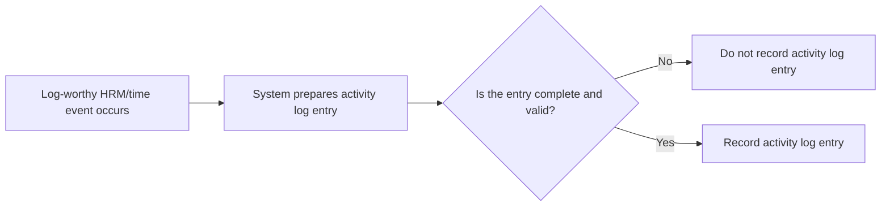

## Report Rules

A report request must specify a report type so the system knows which business summary to compute and display. Reports also require a date range, since time reports, summaries, and budgets are all scoped to the requested period. For time report outputs, the system must include total hours logged per employee within the date range and support optional grouping by employee, project, or task, based on what the user selects. The time report also requires filters for date range, employee, project, and billable status, and the results must reflect only timelogs that match those filter conditions. The report output must distinguish billable hours and non-billable hours, ensuring that the billable flag constraint is honored in calculations. The project budget report must compare each project’s budget hours versus actual hours logged in the date range and calculate budget consumed percentage accordingly. Projects without budget hours must be excluded from the project budget report results. The weekly summary report must produce a week-by-week view for the date range, including total hours, number of timelogs, and number of employees who logged time for each week, and it must support filtering by project. If the user requests grouping or filtering options that conflict with the report type capabilities, the system must reject the configuration as invalid. If the date range contains no timelogs, the system must still return an empty but valid report result rather than failing the request, so the user understands that there is no data to summarize.

### Report Type Selection

A user requesting reports within an organization must specify which report type they want to generate from the available report types: Time Report, Project Budget Report, and Weekly Summary Report.

If the requested report type is not one of the available report types, the system must reject the report request as invalid.

The system must compute the output using only the business summary logic associated with the selected report type (defined by the report type name), and it must not mix logic from multiple report types in a single result.

A single report request must be treated as one report type selection; if the user’s selection changes during the same request context, the system must reject the configuration as invalid.

### Date Range Requirement for All Reports

A user requesting any organization report must provide a date range.

The system must scope all report calculations and aggregations to timelogs that fall within the requested date range.

If the date range is missing or incomplete, the system must reject the report request as invalid.

When the date range contains no timelogs, the system must still return a valid report result (with empty rows or equivalent empty output), rather than failing the request.

### Time Report: Total Hours Per Employee

For the Time Report, the system must show total hours logged per employee within the requested date range.

Only timelogs that match the report filters (including billable status, if provided) and fall inside the requested date range must be included in the employee total calculations.

The system must ensure the time report output distinguishes billable hours and non-billable hours.

For billable vs non-billable calculation in the Time Report, the system must categorize each included timelog based on its billable flag and add its duration to the corresponding totals.

If the filters result in no matching timelogs within the date range, the system must return an empty but valid Time Report output.

### Time Report: Group By Employee, Project, or Task

For the Time Report, the system must support grouping by employee, project, or task based on what the user selects.

When the user selects grouping by employee, the report must aggregate totals per employee within the date range.

When the user selects grouping by project, the report must aggregate totals per project within the date range (using only timelogs included by the report filters).

When the user selects grouping by task, the report must aggregate totals per task within the date range (using only timelogs included by the report filters).

If the user requests a grouping selection that is not supported by the selected report type (Time Report), the system must reject the report request as invalid.

### Time Report Filters Including Billable Status

For the Time Report, the system must allow users to apply filters for date range, employee, project, and billable status.

If an employee filter is provided, the time report must include only timelogs belonging to the selected employee.

If a project filter is provided, the time report must include only timelogs associated with the selected project.

If a billable status filter is provided, the time report must include only timelogs that match the selected billable flag condition.

All time report filters must be honored together, so the resulting totals reflect timelogs that satisfy every provided filter condition.

If a filter combination would lead to an invalid configuration for the Time Report type (for example, a filter value is specified in a way that cannot be applied to the Time Report), the system must reject the report request as invalid.

### Project Budget Report: Budget vs Actual and Excluding No-Budget Projects

For the Project Budget Report, the system must compare each project’s budget hours versus actual hours logged within the requested date range.

The system must compute budget consumed percentage for each included project based on the project’s budget hours and the project’s actual hours logged during the requested date range.

Projects without budget hours must be excluded from the Project Budget Report results.

If the date range contains no timelogs matching the included budgeted projects, the system must still return a valid Project Budget Report result with an empty output or with projects that qualify based on budget presence, as applicable to the inclusion criteria.

The system must not include non-budgeted projects in the Project Budget Report results even if those projects have timelogs in the date range.

### Weekly Summary Report: Week-By-Week Aggregation

For the Weekly Summary Report, the system must produce a week-by-week summary for the requested date range.

Each week in the output must include: total hours, number of timelogs, and number of employees who logged time.

The weekly aggregation must be based on timelogs that fall within each week of the requested date range.

If the date range contains no timelogs for one or more weeks, the system must still include a valid weekly summary entry for those weeks according to the weekly aggregation expectation, showing zero totals rather than failing.

If the overall requested date range contains no timelogs, the system must still return a valid Weekly Summary Report output.

### Weekly Summary Report: Timelog and Employee Counts and Project Filtering

For the Weekly Summary Report, the system must count the number of timelogs included in each week’s summary.

For the Weekly Summary Report, the system must count the number of distinct employees who logged time in each week’s summary.

For the Weekly Summary Report, the system must support filtering by project.

If a project filter is provided for the Weekly Summary Report, weekly totals, timelog counts, and employee counts must reflect only timelogs associated with that project.

If the user requests a project filter that cannot be applied to the Weekly Summary Report type, the system must reject the report request as invalid.

### Invalid Grouping or Filtering Configurations by Report Type

If the user requests grouping or filtering options that conflict with the report type capabilities, the system must reject the report request as invalid.

The system must validate that the requested grouping (for Time Report) and the requested filters (for each report type) are supported by that same report type.

The system must not silently ignore unsupported or conflicting grouping/filtering selections; it must fail validation and return an invalid request outcome.

When rejecting a report request due to invalid grouping or filtering configuration, the system must clearly indicate that the selected configuration is not valid for the chosen report type.

### Empty Report Result Handling (All Report Types)

For any report type, if the date range contains no matching timelogs under the applied filters, the system must return an empty but valid report result rather than failing.

For the Time Report, the system must return an empty output where no employees (or grouped entities) have matching timelogs.

For the Project Budget Report, the system must return an empty output (or otherwise reflect no applicable results) when there are no qualifying included projects for the requested period.

For the Weekly Summary Report, the system must still return a valid week-by-week aggregation result for the requested date range, using zero totals where applicable.

# Data Browsing Expectations

Business expectations for how users browse, find, and navigate through lists of data.

## List Browsing Expectations

Define business expectations for how users find, filter, and browse lists.

### Filtering Expectations for Lists

Users can filter list views using the available filter options defined for that list. Filters apply within the currently selected organization context.

For employee lists, employees can filter by department, employment type, and status.

For employee lists, employees can search by name.

For projects lists, project lists can be filtered by project status.

For tasks lists, tasks can be filtered by status, priority, and assigned employee.

For timelogs lists, timelogs can be filtered by date range, project, task, and billable status.

For timesheets lists, timesheets can be filtered by status and date range.

For activity log lists, the activity log can be filtered by action type, user, and date range.

For reports screens, users can filter reports using only the filters listed for the chosen report type and within the selected organization context.

If a user applies filters that result in no matching results, the list view shows an empty result set (not an error).

If a user provides filter values that do not match any existing values in the selected organization (for example, a department name that no longer exists), the list view returns an empty result set (not an error).

If a user attempts to filter by an assigned employee, task, or project that the user cannot access under the user’s organization context and permissions, the system rejects the request or returns results only from the allowed scope (whichever is applicable for the list being accessed).

For all list filters, the system must ensure that filter outcomes do not expose data from other organizations the user belongs to.

### Sorting Expectations for Lists

Users can sort list views using the available sort options defined for that list.

Timelog lists can be filtered by date range and other criteria, and timelog browsing must support sorting according to the list’s defined sorting options (if sorting options are presented for that list).

Task lists support sorting by due date, priority, and creation date.

Project lists support browsing without introducing additional sorting behaviors beyond what is defined for the project list.

When users change sorting while maintaining the current filters, the list updates to reflect the same filter set with the new sort order.

If a user selects a sorting option that is not available for that list, the request is rejected.

If sorting is requested on an attribute that has missing values for some items (for example, tasks without a due date), those items are still included in the results and are placed in a consistent order relative to items with values.

### Pagination Expectations for Lists

List views that are paginated must present results in pages and allow users to navigate between pages.

Employee lists are paginated.

Project lists are paginated.

Timelog lists are paginated.

Timesheets lists are paginated.

Activity log lists are paginated.

When users apply or change filters or sorting, the system resets browsing to a valid starting page for the filtered and sorted results.

If a user requests a page number that is outside the valid range for the current filtered and sorted results, the system rejects the request or returns an empty result set, consistently with the list’s error-handling approach.

Pagination behavior must remain restricted to the currently selected organization context and must not allow cross-organization data access.

If list results change between page navigations (for example, due to new or removed records), the system must still return a coherent page of results without exposing records from other organizations.

### List Context and Access Error Handling

For any paginated or filtered list, the system must evaluate list access using the permissions associated with the user’s currently selected organization context.

If a user does not have permission to view a list (for example, employee list, timelog list, timesheet list, activity log, or organization reports), the system rejects the request.

If a user submits list browsing criteria that reference a specific entity type that the user cannot access within the selected organization, the system rejects the request or returns results limited to accessible scope (consistent with the corresponding permissions).

When a timesheet list, timelog list, or task list is requested, only items belonging to the selected organization are eligible to appear in results.

Errors returned for invalid list browsing inputs must be expressed in business terms (for example, “cannot view because you do not have access” or “invalid filter/sort selection”), without exposing internal identifiers.

The system must not leak whether a specific employee, project, task, or action type exists in another organization; list results should remain scoped to the selected organization.

# Error Conditions

Business error scenarios and how the system should respond.

## Error Scenarios

Describe error conditions and expected system responses in natural language.

### Cross-Org Isolation Error Handling (Rejection/Failure-Case)

- If a user attempts any action while no organization context has been selected, the system rejects the request and does not reveal any data from any organization.
- If a user belongs to multiple organizations and selects one organization context, the system performs the action only within that selected organization; if the target belongs to a different organization, the system rejects the request.
- If a user attempts to view or act on an employee, project, task, timelog, timesheet, timer session, department, contract, activity log entry, or report that is not part of the currently selected organization, the system rejects the request.
- If a user attempts any action that would require data from another organization, the system rejects the request instead of returning partial results.
- If an unauthorized user (relative to the selected organization) attempts an operation beyond their role capabilities, the system rejects the request.
- For rejected requests, the system returns a failure response indicating that the request could not be completed due to the organization access constraint, without exposing details that help identify data in other organizations.
- Exception handling: if the system cannot complete an operation due to an unexpected internal failure, it rejects the request and does not modify business data.

### Entity Existence and Access Errors (Error Scenario)

- If the requested target entity (such as an employee record, department, project, task, timelog, timesheet, timer session, contract, or timesheet-related timelog set) does not exist within the selected organization, the system rejects the request.
- If the requested target entity exists but the user does not have business access to it according to their role in the selected organization (including employee self-only restrictions), the system rejects the request.
- If an operation requires the user to be acting on their own employee/timelog/timesheet but the target does not correspond to the user, the system rejects the request.
- If a user attempts to remove a project membership that does not exist for the specified employee and project, the system rejects the request.
- If a user attempts to assign an employee to a task that is not within the specified project, the system rejects the request due to entity mismatch.
- For any rejection caused by existence or access errors, the system does not change the current state of the target entities and does not create or update any related records.

### Validation and Rejection for Timelog Creation and Editing (Failure-Cases)

- If an employee attempts to create a timelog without a required date, the system rejects the request.
- If an employee attempts to create a timelog without a required duration in minutes, the system rejects the request.
- If an employee attempts to create a timelog without selecting a project, the system rejects the request.
- If a timelog is created for a project that the employee is not assigned to, the system rejects the request.
- If a timelog references a task that does not belong to the selected project, the system rejects the request.
- If an employee attempts to edit a timelog that is part of an approved timesheet, the system rejects the request.
- If a user attempts to edit another employee’s timelog without having the time management permission for that operation, the system rejects the request.
- If an employee attempts to delete a timelog that is part of any submitted or approved timesheet, the system rejects the request.
- Exception handling: if a timelog creation or modification fails validation due to an invalid combination of values, the system rejects the request rather than partially saving the timelog.

### Timesheet Submission/Resubmission Rejection Scenarios (Exception + Failure-Case)

- If an employee attempts to submit a draft timesheet for approval that contains no timelogs, the system rejects the submission.
- If an employee attempts to submit a draft timesheet for a given week when another timesheet for the same week already exists in submitted or approved status, the system rejects the submission.
- If a user without the approval permission attempts to approve or reject a submitted timesheet, the system rejects the request.
- If a user attempts to approve or reject a timesheet that is not in submitted status, the system rejects the request.
- If a user attempts to reject a submitted timesheet without providing a rejection reason, the system rejects the request.
- If a timesheet is rejected, the system allows the employee to modify and resubmit it; if the employee attempts to treat a rejected timesheet as approved (e.g., by expecting it to be locked), the system rejects the operation.
- Exception handling: if approving or rejecting a submitted timesheet fails due to an unexpected internal failure, the system rejects the operation and leaves the timesheet status unchanged.

### Timelog Lock and Immutability Conflicts (Business Exceptions)

- If a timesheet is approved, the system rejects any attempt to edit or delete any timelog included in that approved timesheet.
- If a timesheet transitions back to draft via rejection, the system rejects attempts to apply approved-lock behavior and instead supports editing through the draft workflow; any operation that conflicts with the current status is rejected.
- If a user attempts to edit or delete timelogs while an approved lock condition applies, the system rejects the request even if the user otherwise has time management permissions.
- Exception handling: if the system cannot determine whether a timelog is part of an approved timesheet due to an unexpected inconsistency, the system rejects the request rather than allowing a forbidden change.

### Timer Session Error Scenarios (Failure-Cases + Exception)

- If an employee attempts to start a timer while they already have an active timer, the system rejects the start request.
- If an employee attempts to start a timer without selecting a project, the system rejects the request.
- If a running timer references a project that the employee is no longer eligible to track against under their assignment constraints, the system rejects the timer start or update operation.
- If an employee attempts to stop a timer when there is no running timer, the system rejects the stop request.
- If an employee attempts to discard a timer when there is no running timer, the system rejects the discard request.
- If an employee attempts to edit the description and project/task of a running timer such that the selected task does not match the selected project, the system rejects the update.
- Exception handling: if the system fails to calculate the duration to create a timelog upon stopping the timer due to an unexpected internal failure, the system rejects the stop request and does not create a timelog.

### Project and Task Constraints Error Scenarios (Exception + Rejection)

- If a user attempts to add a timelog to a project whose status is archived or completed, the system rejects the timelog creation request.
- If a user attempts to create tasks in a project when the project status does not permit it (archived or completed), the system rejects the task creation request.
- If a user attempts to change a task status to an invalid value outside the allowed set (open, in-progress, completed, closed), the system rejects the change.
- If a user attempts to change a task priority to an invalid value outside the allowed set (low, medium, high, urgent), the system rejects the change.
- If a user attempts to assign a task to an employee who is not a project member of that project, the system rejects the task assignment.
- If a user attempts to set a task as a subtask of another task when it would exceed the allowed nesting level (more than one level), the system rejects the request.
- For any rejection in project/task operations, the system records no task status change history entry.

### Organization Deletion Error Scenarios (Rejection + Failure-Case)

- If an organization owner attempts to delete their organization while there are pending timesheets, the system rejects the deletion.
- If an organization owner attempts to delete their organization while there are any active employee contracts, the system rejects the deletion.
- Exception handling: if deletion is requested but the system cannot verify the presence of pending timesheets or active contracts due to an unexpected internal failure, the system rejects the deletion.
- When deletion is permitted, the system proceeds to permanently delete organization-scoped data; if the deletion process fails midway due to an unexpected internal failure, the system rejects the overall deletion request outcome and does not leave the organization in a partially deleted state.
- After successful deletion, the owner account remains but is no longer associated with any organization; if the system cannot ensure that the owner account remains unassociated, the system rejects completing the deletion.

### Error Response Consistency (Rejection + Exception Handling)

- For any rejection or failure-case, the system provides a clear, human-readable explanation of what prevented completion (for example, missing required items, invalid combination of values, status constraints, or lack of access), without exposing sensitive organization data.
- If an operation affects multiple business items (for example, creating or modifying a timesheet and its included timelogs through the draft workflow), and a validation or status constraint fails, the system rejects the request and does not apply any partial updates.
- If an operation is rejected due to business constraints (rather than missing authentication or unexpected internal failures), the system uses the rejection outcome rather than masking it as an unexpected error.
- Exception handling: unexpected internal failures do not result in business state changes and do not create inconsistent activity log entries; any action that cannot be completed does not add a misleading activity log entry.
- The system ensures that activity log pagination and filtering behavior (defined elsewhere) is not used to mask or retrieve rejected-operation details; rejected operations remain rejected and do not become queryable via activity log filters.