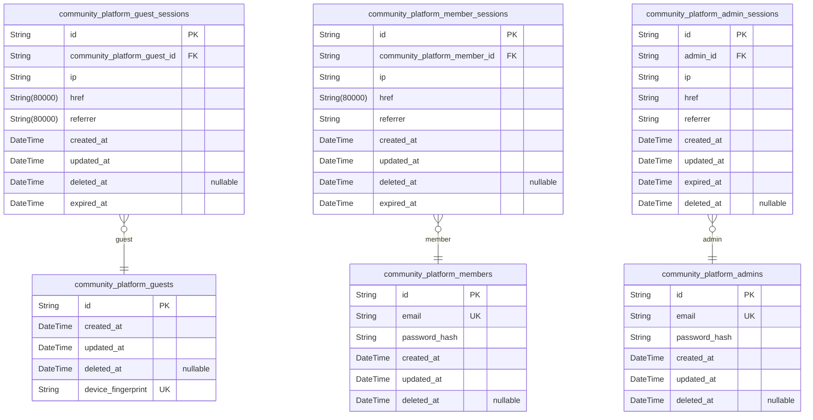
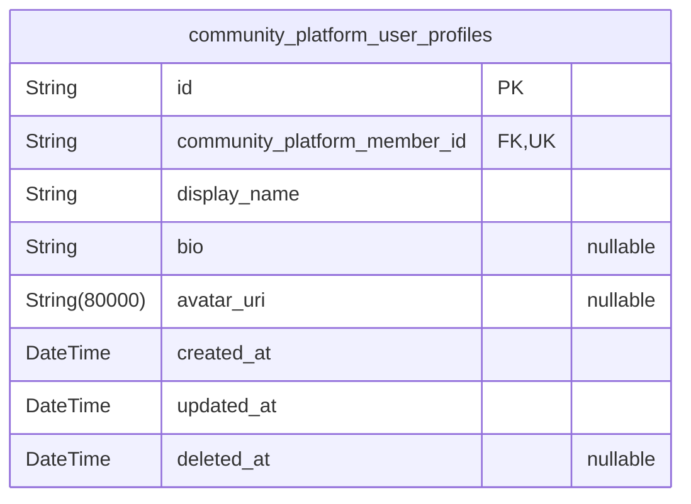
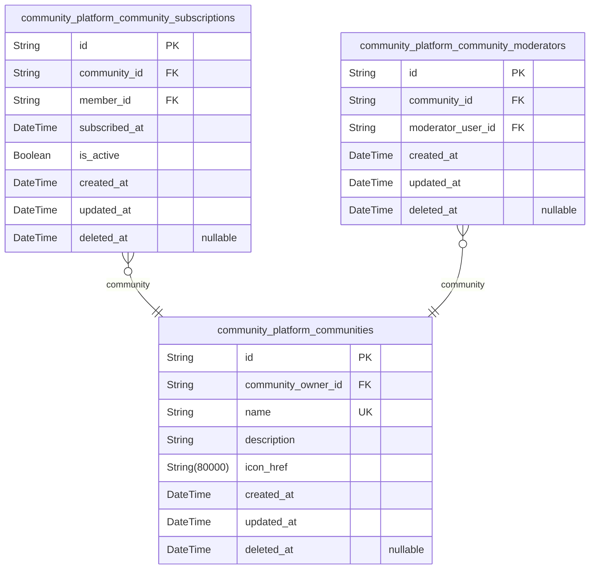
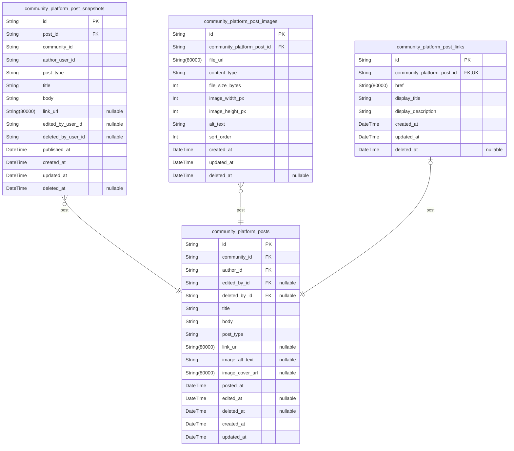
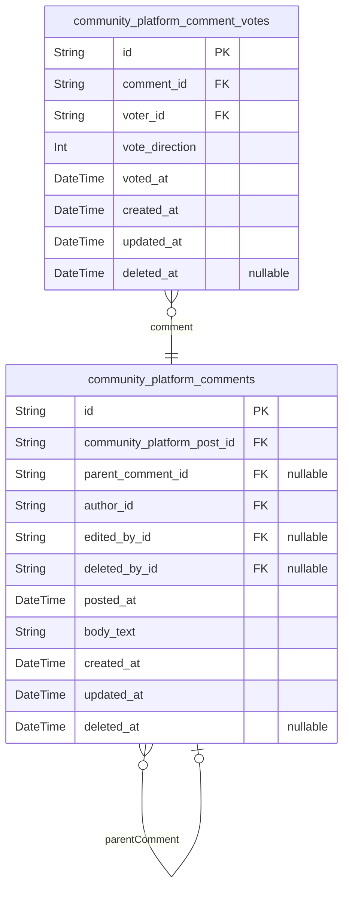
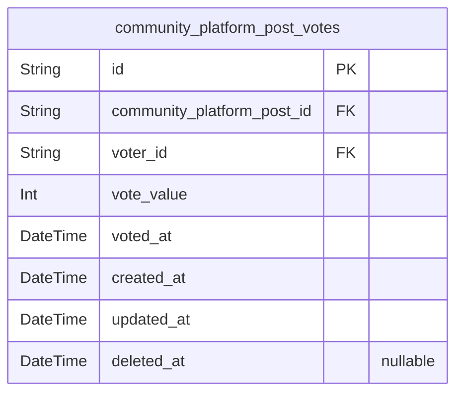
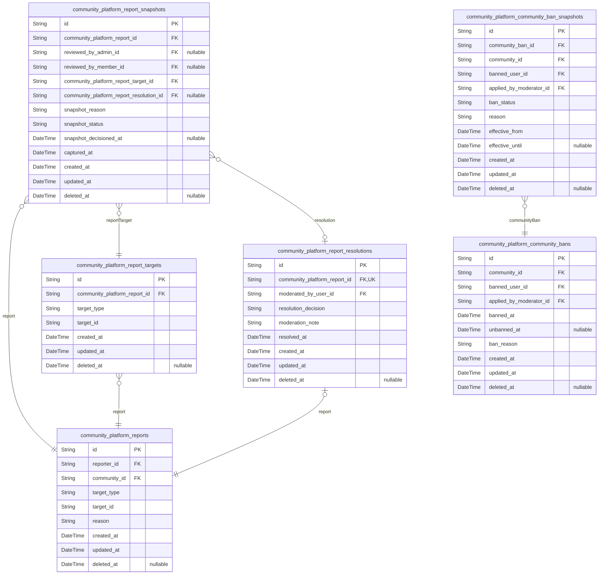

# Prisma Markdown

> Generated by [`prisma-markdown`](https://github.com/samchon/prisma-markdown)

- [Actors](#actors)
- [UserProfiles](#userprofiles)
- [Communities](#communities)
- [Posts](#posts)
- [Comments](#comments)
- [Votes](#votes)
- [Moderation](#moderation)

## Actors

### `community_platform_guests`

Stores guest identity records for unauthenticated visitors who access
public parts of the platform without password-based authentication.

Each row represents a guest identity tied to a stable device/client
fingerprint or similarly derived identifier. Guests can later be
associated with guest sessions in {@link
community_platform_guest_sessions} for connection tracking and logout
behavior.

Properties as follows:

- `id`: Primary Key.
- `created_at`: When the guest identity record was created.
- `updated_at`: When the guest identity record was last updated.
- `deleted_at`
  > Soft-delete timestamp for the guest identity record. Null means the
  > record is active.
- `device_fingerprint`
  > Stable, client-derived fingerprint used to identify a guest across
  > requests (e.g., a device/browser fingerprint hash).

### `community_platform_guest_sessions`

Stores login/session tokens for guest (unauthenticated) access.

This table enables stateless guest browsing flows by recording issued
session credentials along with connection context (IP address and request
metadata) and an explicit expiration time for security.

Each guest session belongs to exactly one {@link
community_platform_guests.id} record. Guest sessions are append-only
audit records in typical flows and can be soft-deleted for retention
policies.

Properties as follows:

- `id`: Primary Key.
- `community_platform_guest_id`: Belonged guest's [community_platform_guests.id](#community_platform_guests).
- `ip`: IP address from which the guest session was created.
- `href`: Request URI (href) associated with the guest session creation.
- `referrer`: HTTP referrer (referrer URL) associated with the guest session creation.
- `created_at`: Session creation timestamp.
- `updated_at`: Session record update timestamp.
- `deleted_at`: Soft deletion timestamp for the guest session record.
- `expired_at`: When the guest session credential expires and becomes invalid.

### `community_platform_members`

Stores authenticated member account identity used for registration and
sign-in.

This table is the canonical authenticated actor record for members. It
contains login credentials (email and password hash) and supports account
lifecycle auditing via created_at/updated_at and optional soft deletion
via deleted_at.

Member sessions are tracked in [community_platform_member_sessions](#community_platform_member_sessions)
as separate session records referencing this actor.

Properties as follows:

- `id`: Primary Key.
- `email`
  > Member email address used to identify the account during registration and
  > login.
- `password_hash`: Hashed password used to verify credentials during member authentication.
- `created_at`: When the member account was created.
- `updated_at`
  > When the member account credentials or profile-related fields were last
  > updated.
- `deleted_at`
  > When the member account was soft deleted. Null means the account is
  > active.

### `community_platform_member_sessions`

Stores authenticated session records for community members, including
token rotation context and connection metadata.

Each session belongs to exactly one [community_platform_members.id](#community_platform_members)
member. Sessions are used to authenticate member requests and track
session validity over time.

The table supports security/audit needs via connection metadata and
timestamps, and is designed for efficient lookup by member and creation
time.

Properties as follows:

- `id`: Primary Key.
- `community_platform_member_id`: Belonged member identity [community_platform_members.id](#community_platform_members).
- `ip`: IP address observed for this member session.
- `href`
  > Request URL or session establishment URL (referer-like target) for this
  > session.
- `referrer`
  > HTTP referrer (or equivalent) associated with the session establishment
  > request.
- `created_at`: When the session record was created.
- `updated_at`
  > When the session record was last updated (e.g., token rotation metadata
  > updates).
- `deleted_at`
  > Soft delete timestamp for revoking/removing the session record without
  > hard deletion.
- `expired_at`
  > When the session expires and should no longer be accepted for
  > authentication.

### `community_platform_admins`

Stores privileged administrator account records with credential fields
used for admin sign-in and governance capabilities. This table represents
the canonical authentication identity for the admin actor type, while
admin login session tracking is handled by {@link
community_platform_admin_sessions}.

Properties as follows:

- `id`: Primary Key.
- `email`
  > Admin login email address. Used to locate the admin account during
  > authentication.
- `password_hash`: Hashed password used for verifying admin credentials during sign-in.
- `created_at`: Record creation timestamp.
- `updated_at`: Record last update timestamp.
- `deleted_at`: Soft-delete timestamp. When set, the admin account is treated as removed.

### `community_platform_admin_sessions`

Stores authenticated session records for admin actors, enabling secure
tracking of admin login activity and connection metadata (IP and
navigation context).

Each row represents one active or historical session token for a single
[community_platform_admins.id](#community_platform_admins) admin. Sessions support auditing and
expiration-based access control.

Properties as follows:

- `id`: Primary Key.
- `admin_id`: Belonged admin's [community_platform_admins.id](#community_platform_admins) identity.
- `ip`: Client IP address captured at session creation.
- `href`
  > Request URL or location (href) captured at session creation for security
  > auditing.
- `referrer`: Referrer information captured at session creation for security auditing.
- `created_at`: Session creation timestamp.
- `updated_at`
  > Last update timestamp for this session record (e.g., token rotation
  > metadata updates).
- `expired_at`
  > When this session expires and should no longer be accepted for
  > authentication.
- `deleted_at`
  > Soft delete timestamp. When set, the session is treated as
  > revoked/invalid for authentication.

## UserProfiles

### `community_platform_user_profiles`

Stores public user persona information displayed on profile pages,
including display name, biography text, and an avatar image reference.
The profile is linked one-to-one to the authenticated member identity and
follows standard auditing and soft-delete lifecycle via created_at,
updated_at, and deleted_at.

Properties as follows:

- `id`: Primary Key.
- `community_platform_member_id`
  > Belonged member identity for this public profile ({@link
  > community_platform_members.id}).
- `display_name`: Public display name shown on the user's profile page.
- `bio`
  > Short biography text describing the user. Nullable when the user has not
  > provided a bio.
- `avatar_uri`
  > URI pointing to the user's avatar image representation. Nullable when no
  > avatar is set.
- `created_at`: Creation timestamp of the user profile record.
- `updated_at`: Last update timestamp of the user profile record.
- `deleted_at`
  > Soft delete timestamp indicating the profile is no longer publicly
  > visible due to account deletion or removal.

## Communities

### `community_platform_communities`

Communities are top-level topical spaces that organize posts and
discussions. A community has a unique name, descriptive text, and an icon
reference for UI rendering, and it establishes authority by linking to an
owner account and a set of moderator accounts.

Soft-deletion is supported via deleted_at to preserve historical
references while hiding communities from normal listings.

Properties as follows:

- `id`: Primary Key.
- `community_owner_id`
  > The community owner account ([community_platform_members.id](#community_platform_members)) with
  > the highest authority for community-level actions.
- `name`: Unique community display name used for community discovery and browsing.
- `description`: Text description that explains what the community is about.
- `icon_href`: Reference URL for the community icon image used in list and detail views.
- `created_at`: Timestamp when this community record was created.
- `updated_at`: Timestamp when this community record was last updated.
- `deleted_at`
  > Soft-delete timestamp. When set, the community is treated as removed
  > while preserving historical relationships.

### `community_platform_community_subscriptions`

Stores the relationship between a member and a community, including when
the member subscribed and whether the subscription is currently active
for participation.

This table enables per-member subscribed-community lists, participation
eligibility checks, and community subscriber counts. Duplicate
relationships for the same member and community are prevented via a
unique composite constraint.

Properties as follows:

- `id`: Primary Key.
- `community_id`: Belonged community [community_platform_communities.id](#community_platform_communities).
- `member_id`: Belonged member (user identity) [community_platform_members.id](#community_platform_members).
- `subscribed_at`: Timestamp meaning when the member subscribed to the community.
- `is_active`
  > Whether this subscription is currently active for participation in the
  > community and for inclusion in subscribed feed constraints.
- `created_at`: Creation timestamp for this subscription record.
- `updated_at`: Last update timestamp for this subscription record.
- `deleted_at`: Soft delete timestamp. When set, the subscription is treated as removed.

### `community_platform_community_moderators`

Maps which authenticated member accounts are moderators for a specific
community.

This table is a join record between {@link
community_platform_communities} and [community_platform_members](#community_platform_members),
enforcing that a given member cannot be assigned as a moderator for the
same community more than once. It also supports soft deletion and audit
timestamps for moderation assignment history.

Properties as follows:

- `id`: Primary Key.
- `community_id`
  > The community that the member moderates. References {@link
  > community_platform_communities.id}.
- `moderator_user_id`
  > The member account assigned as a moderator. References {@link
  > community_platform_members.id}.
- `created_at`: When this moderator assignment record was created.
- `updated_at`: When this moderator assignment record was last updated.
- `deleted_at`: Soft-delete timestamp for moderator assignments that are no longer active.

## Posts

### `community_platform_posts`

Stores community-authored posts. Each post belongs to exactly one
community and is authored by exactly one user, with a post type
classification (text, link, or image) used by list and detail views.

This table contains the post’s core lifecycle data (created/updated
timestamps, optional soft deletion), plus attribution for edits and
deletions via user IDs. Interaction data such as votes and comments are
handled by separate tables, and point-in-time history and media
attachments are handled by snapshot/media tables in other components.

Properties as follows:

- `id`: Primary Key.
- `community_id`: Belonged community’s [community_platform_communities.id](#community_platform_communities).
- `author_id`
  > Belonged author’s [community_platform_members.id](#community_platform_members). Author identity
  > is the user who created the post.
- `edited_by_id`
  > User who last edited the post’s core content {@link
  > community_platform_members.id}. Used when the post was edited.
- `deleted_by_id`
  > User who soft-deleted the post [community_platform_members.id](#community_platform_members). May
  > be the author or a moderator, depending on moderation rules.
- `title`: Human-readable post title shown in list and detail views.
- `body`
  > Main textual content for text posts, and plain text description fallback
  > for non-text posts where applicable.
- `post_type`
  > Post type classification. Valid values indicate which content fields are
  > meaningful for rendering and list previews (text, link, or image).
- `link_url`
  > Canonical URL for link-type posts. Stored as a scalar URI; relevant only
  > when post_type indicates a link post.
- `image_alt_text`
  > Optional alt text/description for image-type posts used for accessibility
  > and list previews. Relevant only when post_type indicates an image post.
- `image_cover_url`
  > Optional representative image URL for image-type posts. Full image
  > attachment history is handled by separate image tables.
- `posted_at`: Timestamp representing when the post was originally posted/visible.
- `edited_at`
  > Timestamp representing when the post was last edited. Present when
  > edited_by_id is set.
- `deleted_at`
  > Soft deletion timestamp for the post. When set, the post is considered
  > deleted but remains queryable in administrative/audit contexts.
- `created_at`: Record creation timestamp.
- `updated_at`: Record last update timestamp.

### `community_platform_post_snapshots`

Point-in-time historical snapshot of a post.

This table stores denormalized post data as it existed at a specific
moment, enabling recovery of prior states after edits and deletions. Each
snapshot belongs to exactly one original post and is intended to be
append-only from the application perspective.

Properties as follows:

- `id`: Primary Key.
- `post_id`: Belonged post's [community_platform_posts.id](#community_platform_posts).
- `community_id`: Community identifier where this snapshot's post is hosted.
- `author_user_id`: Author user identifier for this snapshot's post.
- `post_type`
  > Classification of the post content type at the time of snapshot (e.g.,
  > text/link/image).
- `title`: Post title as it existed when this snapshot was created.
- `body`
  > Text body content as it existed when this snapshot was created. For
  > non-text posts, this may store an appropriate representation used by the
  > UI at snapshot time.
- `link_url`
  > Canonical link URL for link-type posts as it existed when this snapshot
  > was created.
- `edited_by_user_id`
  > User identifier who performed the edit that produced this snapshot, if
  > applicable.
- `deleted_by_user_id`
  > User identifier who deleted the post that produced this snapshot, if
  > applicable.
- `published_at`
  > Timestamp representing when the snapshot content is considered
  > effective/published.
- `created_at`: Snapshot creation timestamp.
- `updated_at`: Snapshot last update timestamp (typically unchanged after creation).
- `deleted_at`: Soft delete timestamp for administrative retention/recovery workflows.

### `community_platform_post_images`

Image attachments associated with a single post.

This table stores one row per uploaded image file for {@link
community_platform_posts}. It enables multiple images per post and
provides the information needed to render the attachment in list/detail
views. Rows are soft-deletable via deleted_at for audit-friendly removal.

All relationships point from this dependent table to the parent post
([community_platform_posts](#community_platform_posts)).

Properties as follows:

- `id`: Primary Key.
- `community_platform_post_id`: Belonged post record's [community_platform_posts.id](#community_platform_posts).
- `file_url`: Canonical URL/URI of the stored image file for rendering.
- `content_type`: MIME content type of the image file (e.g., image/png).
- `file_size_bytes`: Image file size in bytes at the time of upload.
- `image_width_px`: Original image width in pixels.
- `image_height_px`: Original image height in pixels.
- `alt_text`: Alternative text/description for accessibility and fallback rendering.
- `sort_order`: Display order of this image within the owning post.
- `created_at`: Creation timestamp.
- `updated_at`: Last update timestamp.
- `deleted_at`: Soft delete timestamp; null means the attachment is active.

### `community_platform_post_links`

Stores canonical link metadata for link-type posts.

For posts whose content type is "link", this table keeps the canonical
URL (href) and optional display text (title/description) that can be
rendered in list views. Each row is owned by exactly one {@link
community_platform_posts.id} via a 1:1 relationship enforced by a unique
foreign key.

Soft deletion is supported with {@link
community_platform_post_links.deleted_at}; updates should refresh the
extracted display fields as needed.

Properties as follows:

- `id`: Primary Key.
- `community_platform_post_id`
  > Belonged post content record [community_platform_posts.id](#community_platform_posts). Each
  > link metadata row is for exactly one post.
- `href`
  > Canonical URL for the link post. This is the definitive external address
  > used for previews and outbound linking.
- `display_title`
  > Extracted or assigned display title for the link post as shown in list
  > views and previews.
- `display_description`
  > Extracted or assigned short description for the link post as shown in
  > list views and previews.
- `created_at`: Creation timestamp for this link metadata record.
- `updated_at`: Last update timestamp for this link metadata record.
- `deleted_at`
  > Soft delete timestamp. When set, the link metadata is considered removed
  > without hard deletion.

## Comments

### `community_platform_comments`

Stores threaded comments within a single post discussion.

Each comment belongs to exactly one post, supports optional
parent_comment_id to form reply threads, and includes content plus full
lifecycle timestamps for creation, last update, and soft deletion. The
author attribution records which member authored the comment;
parent/child relationships enable nested reply rendering.

Properties as follows:

- `id`: Primary Key.
- `community_platform_post_id`: Belonged post's [community_platform_posts.id](#community_platform_posts).
- `parent_comment_id`
  > Optional parent comment for nested replies within the same post
  > discussion. References [community_platform_comments.id](#community_platform_comments).
- `author_id`: Authoring member's [community_platform_members.id](#community_platform_members).
- `edited_by_id`
  > Member who last edited the comment, referencing {@link
  > community_platform_members.id}. Null when the comment has never been
  > edited or when attribution is not recorded.
- `deleted_by_id`
  > Member who soft-deleted the comment, referencing {@link
  > community_platform_members.id}. Null when the comment was deleted without
  > attribution or when attribution is not recorded.
- `posted_at`
  > When the comment was originally posted (timing metadata for ordering in
  > discussions).
- `body_text`: The comment content text.
- `created_at`: Record creation timestamp.
- `updated_at`: Record last update timestamp.
- `deleted_at`: Soft-delete timestamp. Null when the comment is not deleted.

### `community_platform_comment_votes`

Stores a single user's vote on a specific comment in a community
discussion. Each voter can have at most one active vote per comment,
enabling consistent vote direction, voted-at timing, and deterministic
score calculations via queries.

This table references the voting user account ({@link
community_platform_members.id}) and the voted comment ({@link
community_platform_comments.id}). Soft deletion ({@code deleted_at})
allows removing a vote while preserving historical record integrity.

Business note: vote_direction represents the intended voting action
(upvote, downvote, or neutral/reset).

Properties as follows:

- `id`: Primary Key.
- `comment_id`
  > The comment being voted on. References the target comment {@link
  > community_platform_comments.id}.
- `voter_id`
  > The user who cast the vote. References the voter account {@link
  > community_platform_members.id}.
- `vote_direction`
  > The vote direction value for this user's vote on the comment (e.g.,
  > upvote/downvote/neutral).
- `voted_at`
  > Timestamp representing when the vote was cast (or last updated to the
  > current direction).
- `created_at`: Creation timestamp for this vote record.
- `updated_at`: Last update timestamp for this vote record.
- `deleted_at`
  > Soft delete timestamp. When set, the vote is treated as removed while the
  > row remains for auditability.

## Votes

### `community_platform_post_votes`

Stores each member’s single current vote on a specific post. Enforces one
vote per member per post via a unique constraint, and records when the
vote was cast using voted_at.

Properties as follows:

- `id`: Primary Key.
- `community_platform_post_id`: Belonged post referenced from [community_platform_posts.id](#community_platform_posts).
- `voter_id`: Voting member referenced from [community_platform_members.id](#community_platform_members).
- `vote_value`
  > Vote direction/value for the post (e.g., upvote vs. downvote), stored as
  > an integer to keep calculations in queries.
- `voted_at`: Timestamp representing when the vote was cast.
- `created_at`: Creation timestamp.
- `updated_at`: Last update timestamp.
- `deleted_at`: Soft delete timestamp. Null means the vote is currently active.

## Moderation

### `community_platform_reports`

User-submitted moderation reports that capture why a piece of content is
considered problematic within a specific community.

A report records the reporter (member), the community context, and the
reported target using a target type plus an identifier pair. The
mandatory reason text is stored verbatim for moderators to review. This
table is soft-deletable for privacy and retention workflows, while
historical audit should be handled by separate snapshot tables.

Properties as follows:

- `id`: Primary Key.
- `reporter_id`: Belonged reporter member [community_platform_members.id](#community_platform_members).
- `community_id`: Belonged community [community_platform_communities.id](#community_platform_communities).
- `target_type`
  > The type of the reported content target within the community (e.g., post
  > or comment).
- `target_id`
  > The identifier of the reported content target (post or comment) within
  > the community, resolved by [target_type](#target_type).
- `reason`
  > Mandatory user-provided reason explaining why the target should be
  > reviewed by moderators.
- `created_at`: When the report was submitted.
- `updated_at`: When the report was last updated.
- `deleted_at`: Soft delete timestamp for the report record.

### `community_platform_report_snapshots`

Snapshot/audit record of a user-submitted report’s state at a specific
point in time.

This table preserves the report’s moderation-relevant fields (target
context, reason, and review/decision attribution) so the application can
render consistent moderation timelines and outcomes even after the
underlying report content or resolution changes.

Properties as follows:

- `id`: Primary Key.
- `community_platform_report_id`
  > Belonged report’s [community_platform_reports.id](#community_platform_reports). Snapshot records
  > must always reference the original report.
- `reviewed_by_admin_id`
  > Moderator/admin who reviewed the report snapshot. Nullable to allow
  > snapshots created before a review decision is made.
- `reviewed_by_member_id`
  > If the system allows non-admin moderators, this references the reviewing
  > member for this snapshot. Nullable because only one actor type should
  > apply for a given snapshot.
- `community_platform_report_target_id`
  > Target context record attached to this snapshot ({@link
  > community_platform_report_targets.id}). This avoids duplicating target
  > polymorphic fields while keeping snapshot determinism.
- `community_platform_report_resolution_id`
  > Resolved moderation decision associated with this snapshot ({@link
  > community_platform_report_resolutions.id}). Nullable for unresolved
  > states.
- `snapshot_reason`
  > Reason text provided by the reporter, captured at snapshot time for
  > deterministic rendering.
- `snapshot_status`
  > Moderation state of the report at snapshot time (e.g., pending, approved,
  > dismissed). Stored as a snapshot-scoped value to preserve history.
- `snapshot_decisioned_at`
  > When the moderation decision was made for this snapshot, if available.
  > Nullable for non-decision snapshots.
- `captured_at`: Exact timestamp when this snapshot was captured.
- `created_at`: Record creation timestamp for the snapshot row.
- `updated_at`: Record update timestamp for the snapshot row.
- `deleted_at`
  > Soft delete timestamp. Nullable; when set, the snapshot row is considered
  > deleted.

### `community_platform_report_targets`

Stores the concrete target context that a report is associated with for
moderator review. It captures what type of content was reported (post or
comment) and the single identifier of that target so moderators can
render report details without duplicating the core report record.

This table links a moderation report to the specific content instance
that the report refers to, supporting consistent moderator list rendering
and target-specific context display.

Properties as follows:

- `id`: Primary Key.
- `community_platform_report_id`: Belonged report's [community_platform_reports.id](#community_platform_reports).
- `target_type`: Discriminator of the reported target content type.
- `target_id`
  > Identifier of the concrete target content referenced by {@link
  > target_type}.
- `created_at`
  > When the report target context was created for auditing and deterministic
  > moderator rendering.
- `updated_at`: When the report target context was last updated.
- `deleted_at`
  > Soft delete timestamp for removing this target context while keeping
  > historical records.

### `community_platform_report_resolutions`

Moderator resolution for a user-submitted report within a community. Each
report is resolved at most once (1:1) to ensure moderation side effects
are applied consistently and to preserve an auditable decision history.
The resolution records who reviewed the report, what decision was made
(approve vs dismiss), and when the decision took effect.

Properties as follows:

- `id`: Primary Key.
- `community_platform_report_id`
  > Belonged report that this resolution resolves. {@link
  > community_platform_reports.id}.
- `moderated_by_user_id`
  > Moderator user who applied this resolution decision. {@link
  > community_platform_members.id}.
- `resolution_decision`
  > Resolution decision for the report. Common values are "approved" (the
  > report was accepted) or "dismissed" (the report was rejected/dismissed).
- `moderation_note`: Moderator note or rationale associated with the resolution decision.
- `resolved_at`: Timestamp when the resolution decision became effective.
- `created_at`: Record creation timestamp.
- `updated_at`: Record last update timestamp.
- `deleted_at`
  > Soft deletion timestamp for hiding an obsolete resolution while
  > preserving audit history.

### `community_platform_community_bans`

Community-level bans applied by moderators to restrict a specific member
within a specific community.

Each row represents one ban application event (with start and optional
end timestamps). The record is attributed to the moderator who applied
the ban for auditing and moderation history. Point-in-time timeline
correctness is preserved via the separate community ban snapshot table
(handled outside this model).

Properties as follows:

- `id`: Primary Key.
- `community_id`
  > The community in which the user is banned ({@link
  > community_platform_communities.id}).
- `banned_user_id`: The member who is banned ([community_platform_members.id](#community_platform_members)).
- `applied_by_moderator_id`
  > The moderator member who applied the ban ({@link
  > community_platform_members.id}).
- `banned_at`: Timestamp indicating when the ban became effective.
- `unbanned_at`
  > Timestamp indicating when the ban was lifted. Null means the ban is
  > currently active.
- `ban_reason`: Moderator-provided reason or note for the ban.
- `created_at`: Creation timestamp of this ban record.
- `updated_at`: Last update timestamp of this ban record.
- `deleted_at`
  > Soft delete timestamp for removing this ban record from active
  > consideration without losing audit history.

### `community_platform_community_ban_snapshots`

Snapshot/audit record capturing the point-in-time state of a community ban.

Each row stores the values of the community ban (such as banned user,
moderator attribution, ban status, and effective time window) as they
were at a specific moment, allowing deterministic rendering of moderation
history even after the live community ban record changes.

Properties as follows:

- `id`: Primary Key.
- `community_ban_id`
  > Belonged community ban record {@link
  > community_platform_community_bans.id}.
- `community_id`
  > Community in which the ban was applied {@link
  > community_platform_communities.id}.
- `banned_user_id`
  > The user who was banned within the community {@link
  > community_platform_members.id}.
- `applied_by_moderator_id`
  > Moderator member who applied the ban {@link
  > community_platform_members.id}.
- `ban_status`
  > Ban state at the snapshot moment (for example, active, lifted, or
  > rejected depending on the moderation workflow).
- `reason`: Moderator-provided reason for the ban at the snapshot moment.
- `effective_from`: When the ban became effective (as of this snapshot).
- `effective_until`
  > When the ban is scheduled to end (null if the ban has no scheduled end)
  > as of this snapshot.
- `created_at`: Record creation time for this snapshot.
- `updated_at`: Record update time for this snapshot (typically immutable after creation).
- `deleted_at`: Soft delete time for this snapshot record, if ever applied.
