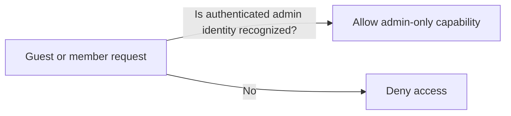
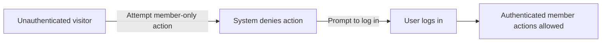
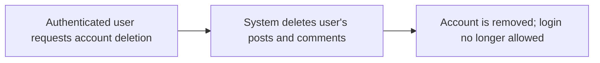

**communityPlatform — Actor definitions, permission matrix, authentication, session, account lifecycle**

Actor definitions, permission matrix, authentication, session, account lifecycle

# Actor Definitions

Define all user actor types with their identity, permissions, and access boundaries.

## guest Actor

A guest actor represents a non-logged-in visitor who can access only publicly available pages and read-only views. This actor has no authenticated identity in the system, so they cannot act on user-specific actions that require a logged-in account. Guests can browse public content that is explicitly available without signing in, such as feed views that are intended for everyone. Guests do not participate in actions that change platform state, because those actions are tied to an authenticated user identity. When a guest attempts to perform an action that requires authentication, the system should deny access and guide the user to log in instead of carrying out the requested change. Guests also cannot be recognized as owners or members of any community for permission decisions, since those roles require account identity. Any operation that is restricted to logged-in users must treat the guest as unauthorized. Overall, the guest actor’s boundary is: they may read what the platform exposes publicly, but cannot create, vote, comment, subscribe, moderate, or manage account details.

### Guest Identity and Lack of Authenticated User Context

A guest represents a non-logged-in visitor to the platform.
A guest has no authenticated user identity in the system.
Because a guest has no authenticated user identity, the system must not treat the visitor as an owner, moderator, member, or any other role that depends on an account identity.
When an action requires an authenticated user identity, the system must treat the request as unauthorized for a guest.
When a guest attempts an authenticated-only action, the system must deny access and guide the visitor to log in instead of carrying out the requested change.
A guest must not be eligible for any user-specific state changes such as creating, editing, deleting, voting, commenting, subscribing, moderating, or reporting.

### Public Read Access Boundary for Guests

While the visitor is not logged in, the system must allow viewing only content that is explicitly available to everyone.
The system must expose publicly available feed views to guests, including the Popular feed and Community feed.
The system must not expose the Home feed to guests.
In all guest-visible views, the system must display only the information that is intended for public viewing, such as post details shown in the platform’s standard post display.
If a requested page or feed is not intended for public viewing, the system must deny access when the requester is a guest.

### Unauthorized Access for Restricted State-Changing Actions

Guest requests that would change platform state must be denied.
State-changing actions include creating posts, editing posts, deleting posts, writing comments, editing comments, deleting comments, voting on posts, voting on comments, subscribing to communities, unsubscribing from communities, banning or unbanning users, approving or dismissing reports, and reporting content.
If a guest attempts any restricted state-changing action, the system must deny the action and require the visitor to log in.
If a guest attempts to access account-specific pages or actions (such as changing password or deleting an account), the system must deny access because the guest has no authenticated user identity.
The system must ensure that no side effects occur for denied guest requests (i.e., no vote is recorded, no subscription is created, no post or comment is created/edited/deleted, and no moderation decision is applied).

## member Actor

A member actor represents an authenticated user account that can interact with the platform as a normal participant. Members have an identity recognized by the system, which enables permission checks for actions that require a logged-in user. Their access boundary includes interacting with user-account features that are available to signed-in users, while still restricting administrative and moderation capabilities to higher authority roles. Members can access both community-related and platform-related experiences that are meant for logged-in users, within the limits of their role and any community-level authority. They are subject to voting, participation, and content-management rules only when the member is acting as the user tied to the content they modify. When a member tries to do something outside their allowed scope—such as performing actions reserved for moderators or owners—the system must block the request. If a member lacks required eligibility based on membership context, the system denies the action rather than treating them as fully authorized. In short, the member actor is authorized for participant-level actions, but not for owner-only or moderator-only authority, and all sensitive actions require a valid authenticated identity.

### Authenticated Member Identity

- A member actor represents an authenticated user account recognized by the system.
- When a user is not authenticated, they must not be treated as a member for member-restricted experiences; the system must rely on the guest actor boundary instead.
- The system must associate member actions with the specific member account performing the action, so that permission checks are based on the member’s identity.
- If an action requires a member identity and the user is not authenticated, the system must deny the action.

### Participant Permissions Boundary

- While acting as a member, the user is authorized only to perform participant-level interactions that align with normal community participation.
- The system must prevent members from using capabilities reserved for higher authority roles (owner or moderators) through any member action.
- The system must ensure that vote actions, posting participation, and commenting participation are treated as member-participant actions when the member identity is present.
- When a member attempts an operation that requires a higher authority role, the system must deny the request rather than partially performing it.

### Role-Based Access Limits Within Communities

- The creator of a community is treated as the owner (highest authority for that community).
- Owner authority is higher than member authority; members must not be granted owner powers.
- Moderators are a distinct authority level within a community.
- If the member is also a moderator for the relevant community, their authority is governed by the moderator role for that community; otherwise, they must operate only as a member.
- Moderators cannot remove the owner, and members must never be able to perform actions that would remove the owner.
- Members must never be able to add or remove moderators; those capabilities are reserved for the owner or moderators as specified by community moderation rules.

### Logged-In Eligibility Requirements

- Member-level access requires the user to be logged in as a recognized user account.
- For member-only experiences (such as the home feed), the system must require a logged-in identity; logged-out users must be denied access to that experience.
- If a user is logged in but the system cannot recognize the identity as a valid member, the system must deny member-level access.

### Restricted Higher-Authority Actions

- When a member attempts to perform owner-only or moderator-only community management actions, the system must deny the request.
- Specifically, members must be blocked from actions that include: adding moderators, removing moderators, removing the owner, banning users, unbanning users, and reviewing reports.
- Members may still view content they do not have authority to manage; restriction applies to action execution, not to general viewing of community content.
- If an attempted higher-authority action targets a different community than the one for which the member might have permission context, the system must deny the request.

### Action Tied to the Member’s Own Account

- Member actions that modify account-specific content must be tied to the member’s own account identity.
- If a member attempts to edit or delete posts or comments that were authored by a different user, the system must deny the request.
- If a member attempts to modify their own profile information, the system must allow the change only for the profile belonging to that member account.
- A member may view other users’ profiles, but member-specific modification actions must only apply to their own account-linked resources.

### Access Denied Scenarios and Outcome Consistency

- If a member lacks required eligibility (such as not being logged in), the system must deny the action.
- If a member attempts a permission-restricted operation (such as moderation or owner actions), the system must deny the action.
- If a member attempts to modify content that is not owned by that member account, the system must deny the action.
- Denied requests must not change the state of the targeted content (no edits, deletions, or authorization effects) when the request is blocked.

### Member Scope of Authority Across the Platform

- The member scope includes participating in platform activities that are available to logged-in users, including viewing member-available feeds and engaging via voting, commenting, and posting.
- The member scope includes viewing other users’ profiles and browsing communities as permitted for general platform experiences.
- The member scope must not include performing administrative or moderation authority operations that are reserved for owners or moderators.
- Within community contexts, member scope is determined by whether the member has been assigned moderator authority for that community; if not, they must be treated as a member only for that community’s permission checks.

## admin Actor

An admin actor represents a privileged system authority that exists separately from the normal participant roles of members and guests. The admin has the highest access boundary used for administrative governance and enforcement beyond community owner and moderator abilities. Admin actions are permitted only when the system recognizes the request as coming from an authenticated admin identity, because admin rights must never be granted to guests. Admin permissions are broader than member permissions and can override standard permission constraints that apply to typical users. However, admin access is still bounded to administrative purposes rather than being used to impersonate other roles without proper authorization. If a non-admin member or a guest attempts an admin-only capability, the system should deny access and require the correct privileges. Since admin authority is a distinct role, permission checks treat admin status as an explicit requirement for any admin-level behavior. Overall, the admin actor’s boundary is: powerful, top-level governance rights for privileged users only, with strict denial for all other actors.

### Privileged Admin Identity and Access Boundary

#### Privileged admin identity
The system recognizes an admin as a distinct privileged role that is separate from the normal participant roles of members and guests.

#### Highest authority access boundary
Admin privileges represent the highest authority access boundary in the platform, meaning admin capabilities may extend beyond the permissions available to members while still respecting the admin-only constraint.

#### Role separation for admin rights
The system must treat admin rights as belonging to the admin role only, and must not infer admin access from any other user role or from any community-specific role.

#### Guest admin restriction
Guests are not eligible to be recognized as an admin. If the requester is a guest identity, admin-only behaviors must be denied.

#### Authenticated admin recognition
Admin access is granted only when the system recognizes the request as coming from an authenticated admin identity. If the request is not recognized as authenticated admin, admin privileges must not be applied.

### Admin-Only Permission Requirement and Denial for Non-Admin Access

#### Admin-only permission requirement
For any capability intended to be limited to an admin, the system must require an authenticated admin identity before performing the action.

#### Denial for non-admin access
If a non-admin (including a member or a guest) attempts any admin-only capability, the system must deny the request.

#### Override vs standard member scope
When an admin performs an admin-only capability, the outcome may differ from what a standard member can do due to admin being the highest authority access boundary. This override applies only within the set of admin-only capabilities; it must not automatically grant member-level users admin capabilities.

### Admin Role Governance Within the Platform

#### Strict separation from community governance roles
Admin authority is distinct from community owner and moderator authorities. Admin actions must rely on admin recognition, not on community roles.

#### Denied escalation attempt handling
If a member attempts to elevate themselves into an admin-capable actor without being recognized as an authenticated admin identity, the system must deny the request and must not proceed using admin privileges.

#### Consistent enforcement across admin-only behaviors
The system must consistently apply the admin-only permission requirement for every admin-only capability, ensuring there are no exceptions based on who owns a community or who moderates it.

# Authentication Flows

Registration, login, logout, and session management from a user perspective.

## Registration and Login

Define user registration and login flows including validation and error handling.

### Registration (Sign-up)

Users can register for an account using an email address and a password.
Users can register for an account by choosing a unique username.
If the provided username is not unique, the system rejects the registration request.
If the provided email and password do not satisfy registration requirements, the system rejects the registration request.
Upon successful registration, the user is established as an account holder and can proceed to log in.
If registration fails, the system provides a clear message indicating that registration could not be completed.

### Login (Sign-in)

Users can log in using their email address and password.
If the email address does not correspond to a registered account, the system rejects the login request.
If the password does not match the registered password for the account, the system rejects the login request.
If the login request is rejected, the system informs the user that login was not successful.
After a successful login, the user can access features that are available only to logged-in users (as defined for the platform’s feed and posting behaviors in other sections).

### Authentication Boundaries

While a user is not logged in, the system allows access only to publicly available content and features.
While a user is logged in, the system treats the user as authenticated and enables actions that require an authenticated identity (such as viewing logged-in-only feeds and creating posts in subscribed communities).
The system must ensure that actions requiring an authenticated user are not allowed when the user is not logged in.
If an unauthenticated user attempts an action that requires an authenticated identity, the system denies the action and prompts the user to log in.
Authentication state changes (such as maintaining a session and logging out) are handled elsewhere; this section governs the business expectation that authentication is required to access member-only capabilities.

### Password Change Eligibility During Authentication

After the user is authenticated, the system allows the user to change their password.
If a request to change a password is made by a non-logged-in user, the system denies the request and requires the user to log in.
If the user attempts to change a password with missing or invalid inputs, the system rejects the request and provides a clear message indicating what must be corrected.

### Account Deletion Eligibility and Scope

After the user is authenticated, the system allows the user to delete their account.
If account deletion is requested by a non-logged-in user, the system denies the request and requires the user to log in.
When a user deletes their account, the system deletes all posts and comments created by that user.
After account deletion completes, the deleted account can no longer be used to log in.
If account deletion fails, the system leaves the account intact and informs the user that deletion could not be completed.

## Session and Logout

Define session behavior and logout from a user perspective.

### Session Identity and Access Boundaries

When a user is logged in, the system shall associate their session with the signed-in account so that logged-in features are available based on that identity.

While a user is logged out (guest state), the system shall treat them as a non-authenticated visitor, limiting access to only publicly available views (such as the Popular Feed and Community Feed).

For actions that require being logged in (such as viewing the Home Feed and creating posts or comments), the system shall prevent guests from performing the action and require the user to be logged in before proceeding.

The system shall provide a consistent concept of “logged-in status” across the platform so that all features that require authentication behave the same way throughout the browsing experience.

If a user’s session is no longer valid (for example, the session has expired or the user is no longer authenticated), the system shall treat the user as logged out and apply the same restrictions as the guest state.

### Logout Behavior

When a signed-in user chooses to log out, the system shall end the user’s logged-in session so the user no longer has access to features reserved for logged-in users.

After logout, the user shall be treated as a guest, meaning publicly available content can still be viewed while actions requiring authentication are blocked.

If a user attempts to perform an authenticated action after logout, the system shall require the user to log in again before allowing the action.

The system shall provide feedback to the user that logout succeeded, so the user understands that they are no longer authenticated.

A logged-out user shall not appear as the author or owner for new post or comment actions; any attempted action must be blocked until the user is logged back in.

### Account-Security With Account Deletion

When a user deletes their account, the system shall remove access for that account such that the user cannot continue using an active session to access logged-in-only features.

After account deletion, the system shall treat the former user identity as unavailable for new actions, including creating posts, writing comments, voting, subscribing, or moderating any community.

The system shall ensure that deleted-account users’ authorship and activity are no longer actionable by identity-based operations; post and comment access should reflect the stated account deletion behavior (all their posts and comments are also deleted).

If the deleted user attempts to continue using an existing session after deletion, the system shall prevent the action and require a new account to access logged-in features.

The system shall ensure the user understands that deleting their account removes their posts and comments as part of the account deletion outcome.

# Account Lifecycle

Account creation, deletion, and password management.

## Account Management

Define how users create accounts, delete accounts, and change passwords.

### Account Creation (Sign Up)

Users can create an account by providing an email address and a password.
Users can choose a unique username during sign up.
After account creation, the user is considered an active account holder and can log in with their email and password.
If the provided username is not unique, the account creation request is rejected.
If the provided email address is already associated with an existing account, the account creation request is rejected.
If the provided password is missing, the account creation request is rejected.
If the provided email address or username is missing, the account creation request is rejected.

mermaid
flowchart LR
    A["Sign up request"] -->"Validate email and password" B["Validate username uniqueness"]
    B -->"If invalid" C["Reject sign up"]
    B -->"If valid" D["Create account"]
    D --> E["Account is ready"]

### User Login (Authentication Boundary)

Users can log in using their email address and password.
Login is allowed only when the account exists and the credentials match the stored credentials for that account.
If the email address does not correspond to an account, the login request is rejected.
If the password does not match the account, the login request is rejected.
Successful login allows the user to perform actions that require a logged-in identity, including creating and moderating content according to their permissions.

mermaid
sequenceDiagram
    participant U as User
    participant S as System
    U->>S: Submit login with email and password
    S->>S: Verify account exists and credentials match
    alt "Valid credentials"
        S-->>U: Login success
    else "Invalid credentials"
        S-->>U: Login rejected
    end

### Password Change

Users can change their password for their own account.
A password change requires the user to prove they are the owner of the account by providing a valid current password.
If the current password provided does not match the user’s account, the password change request is rejected.
If the new password is missing, the password change request is rejected.
After a successful password change, subsequent logins for that account must use the new password.

mermaid
flowchart LR
    A["User requests password change"] --> B["Validate current password"]
    B -->"If invalid" C["Reject password change"]
    B -->"If valid" D["Update password"]
    D --> E["Password change successful"]

### Account Deletion (Self-Service Deletion)

Users can delete their own account.
When a user deletes their account, all posts and comments created by that user are deleted.
After account deletion completes, the deleted user can no longer log in.
If the deletion request is made by a non-owning identity, the deletion request is rejected.

mermaid
flowchart LR
    A["User requests account deletion"] --> B["Confirm deletion authorized for this user"]
    B -->"If not authorized" C["Reject account deletion"]
    B -->"If authorized" D["Delete account and remove user's posts and comments"]
    D --> E["Account no longer accessible"]

### Post-Deletion Effects on User Identity Pages

After a user account is deleted, any profile page that would otherwise show that user’s posts and comments must no longer show those posts and comments as active content.
Other users can still view communities and posts they have access to, but content authored by the deleted user is removed as part of the account deletion process.
A deleted user’s account is treated as non-existent for purposes of viewing and participation where an active user identity is required.

mermaid
flowchart LR
    A["User account deleted"] --> B["Remove user-authored posts"]
    A --> C["Remove user-authored comments"]
    B --> D["Content no longer appears in author lists"]
    C --> E["Comments no longer appear under posts"]