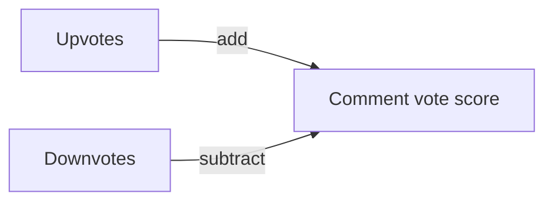
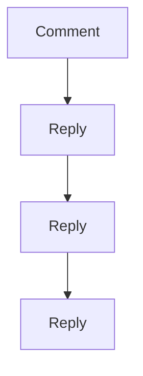
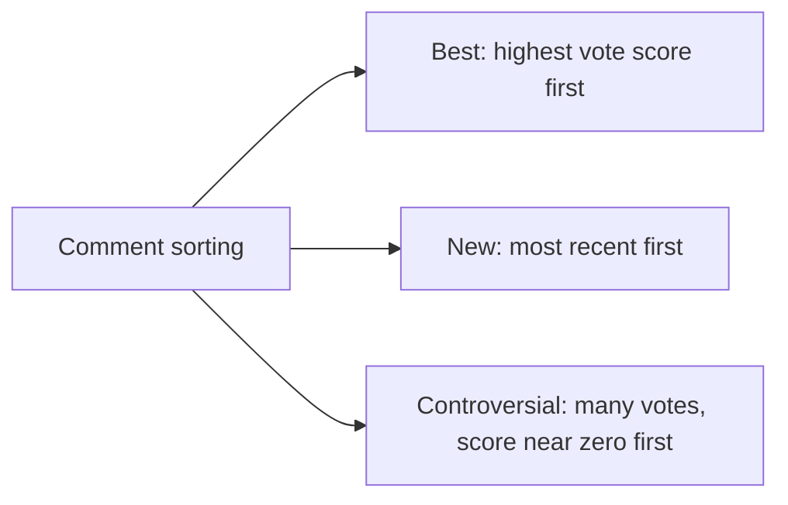
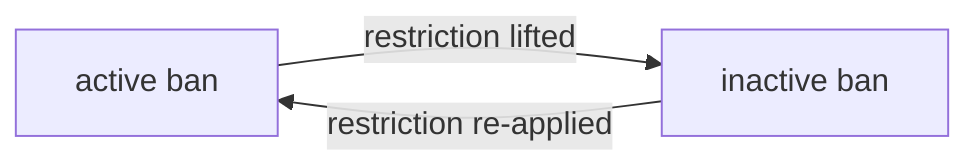
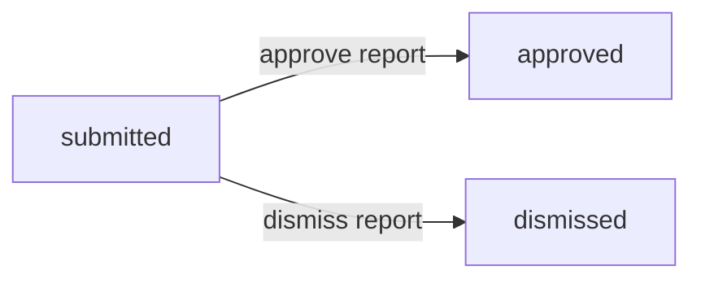
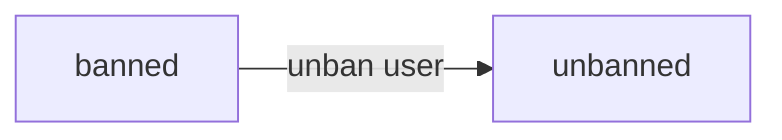
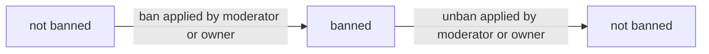
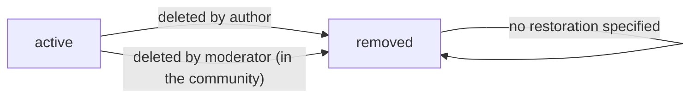
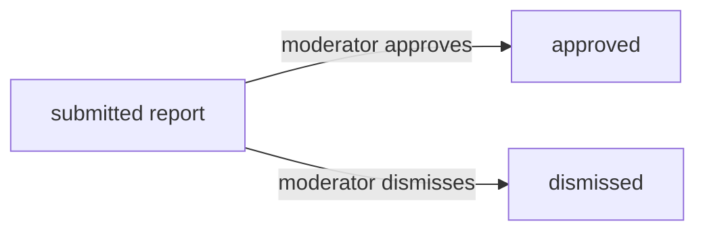
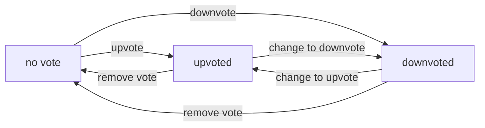

**communityPlatform — Business concepts, relationships, and states from user perspective**

Business concepts, relationships, and states from user perspective

# Domain Concepts

Describe what each concept means in the business domain and its key attributes.

## User Concept

A user represents a person who can participate across the platform. Each user has an email address used for identifying the account and a unique username used in community spaces. The user also has a record indicating when the password was last changed, which helps the system determine the most recent credential update timing. In the business domain, the user is the ownership anchor for content they create, such as posts and comments, and for the profile information they maintain. The same user identity is also the basis for voting, since upvotes and downvotes are attributed to individual users. Users can earn or lose karma based on the votes others cast on their posts and comments. Users can also be restricted from participating in specific communities through banning, which affects what actions they can take within that community while still allowing viewing content. Finally, a user can delete their account, which has a platform-wide impact on the visibility of their created content.

### User Identity in the Platform

A user represents a single person who can participate across the community platform.
A user account is identified by an email address that is used to recognize the account within the platform (defined in [User Identity in the Platform]).
A user also has a unique username that is used to represent the user in community spaces such as authored content and displayed authorship.
A user record includes a timestamp indicating when the user last changed their password, which helps the platform interpret credential-change timing for that account (defined in [User Identity in the Platform]).
A user is the ownership anchor for content the user creates, including posts and comments, meaning that those items are treated as created by that user (defined in [User Identity in the Platform]).
A user is the voting subject for both post votes and comment votes, meaning that any vote cast on content is attributed to exactly one user.
A user can be restricted in a specific community through banning (defined in [User Identity in the Platform]).
If a user deletes their account, the system must apply the account deletion impact to the visibility or existence of the user’s created posts and comments across the platform (defined in [User Identity in the Platform]).

### Unique Username Requirement

Each user must choose a username that is unique across the platform so that the same username is not used by multiple user accounts.
The platform displays the username as the author username in community contexts where a post or comment is shown (defined in [Unique Username Requirement]).

### Email-Linked Account Identification

The platform must treat the user’s email address as the basis for identifying the account tied to login.
Only one user account can be associated with a given email address so that the email-linked identity is unambiguous for the platform (defined in [Email-Linked Account Identification]).

### Meaning of Password Change Timestamp

For each user, the platform maintains a timestamp that indicates when the user last changed their password.
This password-changed timestamp reflects the most recent credential update timing for the account and represents the last time the password was changed (defined in [Meaning of Password Change Timestamp]).
The platform uses this timestamp as part of its domain model for determining which credential state is most recent for a user account (defined in [Meaning of Password Change Timestamp]).

### Vote Attribution to a Single User

Votes on posts and votes on comments are each attributed to exactly one user.
A given user’s vote on a specific post or comment is represented as that user’s single vote state for the target content.
When a user changes their vote (including switching directions or removing a vote), the system must reflect the user’s vote attribution consistently so karma and displayed vote score reflect the net effect of that one user’s current vote state for the target content (defined in [Vote Attribution to a Single User]).

### Karma Derived From User Votes

Each user has a single karma score that is a number.
A user’s karma increases when someone upvotes that user’s post or comment.
A user’s karma decreases when someone downvotes that user’s post or comment.
If a user’s vote is removed, or changed, the karma must adjust accordingly so that the karma reflects the net outcome of votes on the user’s posts and comments (defined in [Karma Derived From User Votes]).
Karma is affected only by votes cast on the user’s posts and comments and is not a separate metric unrelated to content voting within the platform (defined in [Karma Derived From User Votes]).

### Negative Karma Allowed

A user’s karma score can be negative.
The platform must display negative karma as a valid value rather than clamping it to zero (defined in [Negative Karma Allowed]).

### Account Deletion Impact on Created Content

A user can delete their account.
When a user deletes their account, the system must delete all posts and comments created by that user.
After deletion, the user’s deleted posts and comments must no longer be visible as the user’s created content within the platform’s browsing experiences (defined in [Account Deletion Impact on Created Content]).

## UserProfile Concept

A user profile represents the public-facing persona associated with a user account. It includes a display name that other people can see on the profile page and alongside authored content. The profile also includes a biography text field, which captures a short self-description for the user. In addition, the profile includes an avatar image that visually represents the user in the community experience. The profile is designed so that users can view any other user’s profile and see the same core profile attributes. Beyond the basic profile details, the profile page presents the user’s total karma score as a single aggregated number. It also lists the posts the user has created and the comments the user has written, tying profile visibility to a user’s authored activity. The profile concept therefore combines identity presentation (display name, bio, avatar) with summary reputation (karma) and content references (posts and comments).

### User Profile as Public Persona

A user profile represents the public-facing persona associated with a user account.
The profile includes a display name that other users can see on the profile page.
The profile includes bio text that describes the user.
The profile includes an avatar image that represents the user.
The profile is designed to be visible to anyone who views a user’s profile.
A user can view their own profile as the same public-facing persona described above.

### Display Name Visibility and Identity

The display name is shown to other users on a user’s profile page.
The display name is presented alongside the user’s authored content references shown on the profile page.
The platform must ensure that the display name shown on the profile page corresponds to the associated user profile.

### Bio Text Description on Profiles

The bio text is shown on the user’s profile page.
The bio text communicates a short self-description for the user.
The bio text displayed on a user’s profile page corresponds to the user’s profile bio text.

### Avatar Image Representation

The avatar image is shown on the user’s profile page.
The avatar image visually represents the user within the community experience.
The avatar image displayed on a user’s profile page corresponds to the user’s profile avatar image.

### Total Karma Score on Profile Page

Each user has a single total karma score.
The profile page shows the user’s total karma score as a single aggregated number.
The karma score displayed on a user’s profile page reflects the user’s current karma total.

### Lists of All Created Posts

A user’s profile page includes a list of all posts that the user has created.
The posts listed on the profile page are the same posts authored by the associated user.
The profile page must present these posts as references to the user’s contributions.

### Lists of All Written Comments

A user’s profile page includes a list of all comments that the user has written.
The comments listed on the profile page are the same comments authored by the associated user.
The profile page must present these comments as references to the user’s contributions.

### Viewing Any Other User Profile

Any user can view the profile page of any other user.
When viewing another user’s profile page, the viewer must see that target user’s display name, bio text, avatar image, total karma score, and the lists of all created posts and written comments.

## Community Concept

A community represents a topical space on the platform where users gather and publish content. Each community has a unique name and a description text that explains what the community is about. The community also includes an icon image that visually distinguishes it in browsing and discovery. Every community has a specific creator who becomes its owner, establishing the highest authority within that community. A community displays a subscriber count that communicates how many users are currently subscribed. Community identity is used throughout the product to organize posts and to determine which posts appear in community-specific views. People can browse communities in a list and can search for communities by name, reflecting that the name is a primary lookup attribute. In the business domain, a community acts as the container for posts and also the scope for moderation actions and user banning rules.

### Community as a Topical Space

A community represents a topical space on the platform where users gather and publish content.

Within a community, posts belong to that community and therefore appear in community-specific contexts (defined in this domain model as the community serving as the container/scope for its posts).

A community also represents the scope for moderation actions and for user banning rules that apply only within that community.

### Unique Community Name

Each community has a unique name.

The unique community name is a primary identifier used across the platform to organize and access community content, including display of the community name wherever community context is shown.

### Community Description Text

Each community has a description text that explains what the community is about.

The community description text is part of the information shown during community discovery so users can evaluate whether the community matches their interests.

### Community Icon Image

Each community has an icon image.

The community icon image is a visual identifier used when communities are shown during browsing and discovery.

### Community Owner as Highest Authority

When a user creates a community, that user becomes the community owner.

The community owner is the highest authority within the community for ownership-scoped permissions and actions (detailed in other sections), establishing the owner as a distinct role tied to the community.

### Subscriber Count Shown to Users

Each community has a subscriber count.

The subscriber count is displayed to users as part of community discovery, communicating how many users are currently subscribed to the community.

### Community Discovery by Browsing

The platform provides a way for users to discover communities through browsing.

When browsing, the displayed information for each community includes at least the community’s name and its subscriber count, along with the community’s icon and description as available in the community concept.

### Community Discovery by Name Search

The platform provides a way to discover communities by searching for their name.

The searchable attribute is the community’s unique name, so users can locate a specific community by matching the community name.

## CommunitySubscription Concept

A community subscription represents a user’s relationship to a particular community. It captures that the user is currently subscribed to the community and therefore has an active membership link to it. The subscription includes a subscribed-at timestamp that indicates when the relationship began. This concept serves as the business basis for determining which communities a user is subscribed to and for listing them in the user’s subscription view. Subscriptions also establish eligibility for creating posts inside a community, meaning the business meaning of being subscribed is more than just visibility. Although the subscription itself is a relationship, it directly affects the user’s experience across feeds that are constrained by subscribed communities, such as the home feed. At the conceptual level, a subscription is distinct per community per user and can be removed, which changes the user’s participation status for that community. Overall, community subscription is the connection that binds user identity to community membership timing and status.

### Community Subscription as a User–Community Relationship

A community subscription represents a user’s membership relationship to a particular community.
A community subscription establishes that the user is actively subscribed to that community.
Because subscription is specific to the pair of user and community, it functions as the business association that ties a user’s identity to a community membership status.
The subscription exists per user–community pairing, meaning the same user can be subscribed to multiple communities, and each subscription applies to only one community.
Subscription status is business-visible: it directly affects which communities the user can participate in (membership in a community).

### Subscribed-at Timestamp Meaning

Each community subscription has a subscribed-at timestamp that records when the user began that subscription.
The subscribed-at timestamp is meaningful as the start time of the user’s membership relationship to that community.
The subscribed-at timestamp supports showing the ordering and history of a user’s community subscriptions (for example, identifying when a community subscription relationship began).

### List of Communities a User Is Subscribed To

For a given user, the system maintains a list of all communities the user is subscribed to.
This list is derived from the set of community subscription relationships for that user.
The list reflects current subscription membership status, so only communities with an active community subscription relationship appear in the user’s subscribed communities view.

### Eligibility to Create Posts in a Community

Being subscribed to a community defines the user’s eligibility to create posts in that community.
If a user has an active community subscription relationship with a community, they are eligible to create posts within that community.
If a user does not have an active community subscription relationship with a community, the user is not eligible to create posts in that community (even if they can view content in the community).

### Home Feed Constrained by Subscriptions

The home feed is constrained by the user’s community subscriptions.
The home feed includes posts only from communities the user is subscribed to.
For logged-in users, the subscription-based constraint determines which communities’ posts can appear in the home feed.
Communities outside the user’s subscription set are excluded from the home feed, even if their posts are otherwise available in broader views.

### Subscription Removal and Participation Status Change

A community subscription removal changes the user’s participation status for that community.
When a user’s community subscription relationship is removed, the user no longer has active membership in that community.
As a result of the removal, the user’s eligibility to create posts in that community ends.
The change in subscription participation status also impacts subscription-constrained experiences, including the set of communities that feed eligibility is based on for the home feed.

### Per-Community Subscription Association

A user’s membership is represented through a per-community subscription association.
This means the user’s subscription decision is evaluated independently for each community.
The platform treats each community subscription as a distinct relationship so that subscription changes for one community do not automatically affect the user’s subscription status for another community.
Overall, the per-community association is the basis for determining membership timing (via subscribed-at), listed subscriptions, and subscription-constrained post visibility in the home feed.

## Post Concept

A post represents a piece of content published within a specific community. Each post has a required title that acts as the main headline when posts are displayed in lists and feeds. The post also has a posted-at timestamp that indicates when it was created. A post belongs to exactly one community and is authored by a specific user, tying it to both community context and creator identity. Posts can be one of three types: text, link, or image, and each type carries different content representation in the viewing experience. Text posts have text content, link posts are associated with a URL, and image posts are associated with an uploaded image. In the business domain, users see a vote score for a post and a comment count that reflects how many comments are associated with it. When viewing a single post, the business meaning includes that the full content is shown along with author and community information. Posts also participate in voting, where multiple users’ votes contribute to the overall score that determines display ordering in feed sorting options.

### Post as community content

A post represents user-created content published within a specific community.
Each post is associated with exactly one community, meaning it belongs to that community as the context where it is displayed and discussed.
Each post is authored by exactly one user, meaning the author identity is tied to the community content the post appears within.
A post participates in community discussion through a set of comments associated with the post.
A post participates in platform engagement through votes contributed by multiple users, resulting in an overall vote score that is shown when posts are viewed.
When posts are viewed in any post list or a single-post view, the post’s community context and author identity are shown to help users understand where the content belongs and who created it.

### Required post title and posted-at meaning

Every post includes a required title that is used as the main headline when posts are displayed in feeds and lists.
Every post includes a posted-at time that indicates when the post was created.
When viewing a post, the posted-at time is presented in a “time since posted” form so users can understand recency.
If a post is displayed as part of a feed, the time-since-posted representation must correspond to that post’s posted-at time.

### Authored within a community and single-author identity

Each post is authored within a specific community context, so the author shown for the post corresponds to the user who created the post in that community.
A post’s author information is shown wherever the post is displayed, including both in post lists (feeds) and in a single-post view.
A community-specific post list and a community-specific single-post view must show the same community context for the post that it belongs to, keeping the author and community relationship consistent.

### Post type classification: text, link, or image

Each post is classified as exactly one post type: text, link, or image.
Text post: the post’s content is presented as text content associated with the post.
Link post: the post is associated with a URL, and the business display meaning is based on the domain name of that URL.
Image post: the post is associated with an uploaded image that is represented in the feed display as an image thumbnail.
Users should be able to distinguish post types in list and single-post views based on how the content is represented for that type.
The post type influences what users see as the content representation in the post list display (for example, a thumbnail for image posts and a text preview for text posts).

### Content representation rules in list views

For text posts, the feed/list representation shows the first 200 characters of the text content so users can preview the beginning of the message.
For image posts, the feed/list representation shows a thumbnail of the image associated with the post.
For link posts, the feed/list representation shows the domain name of the URL associated with the post (for example, “youtube.com”) to communicate where the link points without requiring users to open it.
In a single-post view, users see the full content corresponding to the post type (full text for text posts, and the full link target information for link posts, and the full image for image posts), along with author and community information.

### Vote score and comment count shown

When viewing a post in any list or feed, the post shows a vote score and a comment count.
The vote score shown for a post reflects the net result of upvotes and downvotes from users on that post.
The comment count shown for a post reflects how many comments are associated with that post.
In a single-post view, the same vote score and the comment count are shown alongside the post’s title, full content, author, community, and posted-at time information.
The vote score and comment count displayed for a post must stay consistent with the post’s current voting and comment activity as reflected in the platform’s business domain.

## PostVote Concept

A post vote represents a user’s expressed sentiment toward a specific post. The business meaning of the vote is captured as a vote value that can increase or decrease the post’s vote score. Each vote is tied to a particular user and a particular post, ensuring that the platform can attribute score changes to the voter and the item being voted on. A post vote also includes a voted-at timestamp indicating when the vote was cast or last adjusted. The vote score shown for a post is derived from the net total of upvotes minus downvotes across all users. Because karma changes when others upvote or downvote a user’s post, post votes have an indirect effect on the author’s karma as well. The concept supports changing a vote from one direction to another and removing a vote, which adjusts the net score accordingly. Votes can therefore produce positive, zero, or negative outcomes at both the post score level and the author’s karma level.

### PostVote meaning and relationships

A PostVote represents a single user’s expressed sentiment toward a specific post.
Each PostVote is tied to exactly one user who casts the vote.
Each PostVote is tied to exactly one post being voted on.
The vote’s business effect is expressed as a vote value that can increase or decrease the post’s vote score.
The platform derives the displayed vote score for a post from the net total of upvotes minus downvotes across all users (including users who have removed their votes as described in the vote adjustment behavior).
Because post votes affect the post’s displayed vote score, post votes also have an indirect effect on the post author’s karma as described in the author karma impact behavior.
Post votes are distinguishable as separate records so the system can attribute score changes back to the specific voter and the specific post.

### Vote value and impact on post score

A PostVote uses a vote value that results in the post’s vote score moving upward for upvotes and downward for downvotes.
When multiple users vote on the same post, the post’s overall vote score reflects the net total of upvotes minus downvotes.
The net vote score shown for a post therefore represents the combined effect of all users’ current votes on that post.
The vote value is what the platform uses to calculate the net effect on the post score, rather than treating all votes as identical.

### One vote per user per post concept

For any given post, each user can have at most one active vote associated with that post.
If a user changes their vote direction on a post, it updates the existing vote for that user and that post rather than creating an additional concurrent vote.
If a user removes their vote entirely (rather than switching), the user no longer contributes that vote value to the post’s net vote score.
This “one vote per user per post” concept ensures the post score is based on the current set of users who have votes applied, preventing double-counting from multiple votes by the same user on the same post.

### Voted-at meaning for post votes

Each PostVote includes a voted-at timestamp indicating when the user cast the vote or last adjusted it.
The voted-at timestamp provides a business timeline for how and when the voter’s stance on the post was most recently updated.
When a user changes their vote direction, the voted-at timestamp reflects that adjustment time, distinguishing it from the original cast time.

### Vote score equals upvotes minus downvotes

The vote score shown for a post equals the total number of upvotes minus the total number of downvotes.
The vote score calculation uses only the current state of each user’s vote on that post, not historical votes that have been removed.
If a user removes their vote, the post vote score adjusts accordingly so it no longer includes that removed vote in the upvote or downvote totals.

### Post votes change author karma

When someone upvotes a user’s post, that user’s single karma score increases by 1.
When someone downvotes a user’s post, that user’s single karma score decreases by 1.
If the voter changes their vote direction, the resulting adjustment to the post’s vote score also produces the corresponding adjustment to the author’s karma through the same upvote-versus-downvote effect.
If a voter removes their vote entirely, the author’s karma adjusts accordingly so it reflects that the post is no longer upvoted or downvoted by that voter.
Karma can be negative, so the combination of many upvotes and downvotes across a user’s posts may result in a karma score below zero.

### Changing a vote direction and removing a vote (score adjustments)

A user can change their vote from upvote to downvote or from downvote to upvote on the same post.
Changing a vote direction adjusts the post’s vote score by removing the previous vote’s effect and applying the new vote’s effect.
Removing a vote adjusts the post’s vote score by eliminating the prior vote’s effect.
The score adjustments from changing direction or removing a vote must result in the vote score continuing to match the rule that vote score equals upvotes minus downvotes.
These adjustments must also be reflected in the indirect impact on the post author’s karma, so the author’s karma remains consistent with the net upvote/downvote contribution of that voter.

### PostVote business flow (direction change and removal)

flowchart LR
    A["Current user vote on a post"] -->|"Change from upvote to downvote"| B["Post vote score updated and author karma adjusted"]
    A -->|"Change from downvote to upvote"| B
    A -->|"Remove vote entirely"| C["Post vote score updated and author karma adjusted"]

## Comment Concept

A comment represents a response to a specific post within a community discussion thread. Each comment has content authored by a user and is associated with a particular post, which makes it part of the post’s conversation. Comments also include a posted-at timestamp so readers can understand when the discussion activity occurred. Like posts, comments have their own vote score that reflects the net effect of upvotes and downvotes from users. Each comment is visible with key metadata including the author, the content, its current vote score, and how long ago it was posted. Comments can be nested as replies, allowing replies to have further replies with no depth limit, forming a discussion tree. This nested structure means the business meaning of a comment includes its position in a post’s conversational flow. Comments also support edits and deletions by their authors, which affects what content readers see for that comment while preserving the overall discussion structure. In the same way that posts aggregate engagement metrics, comments participate in sorting options such as best, new, and controversial.

### Comment as a Post Response in a Community Discussion

A comment represents a user’s response within the discussion of a specific post that belongs to a community.
A comment is associated with exactly one post, meaning it appears in the context of that post’s conversation.
Each comment exists as part of the post’s overall discussion thread, so readers understand how the comment relates to the post being viewed.
When viewing a single post, the platform displays the comment count for that post to reflect the presence of comments in the discussion.

```mermaid
flowchart LR
    A["Post" ] -->"has comments" B["Comment"]
    B -->"is reply to" C["Comment"]
```

### Comment Content and Authorship by a User

Each comment has content authored by a user.
The comment content is the primary text readers see when reviewing the discussion.
A comment shows the author, so readers can identify who wrote the response.
The comment author attribution connects the comment to a specific user, distinct from the post’s author.

```mermaid
flowchart LR
    U["User"] -->"writes" C["Comment"]
    P["Post"] -->"has" C
```

### Comment Posted-at Timestamp for Timing Metadata

Every comment includes a posted-at time that indicates when the comment was created.
When presenting comments, the platform shows author and timing metadata so readers can understand when the activity occurred.
The posted-at information supports the “time since posted” display for each comment.

```mermaid
flowchart LR
    C["Comment"] -->"has posted-at" T["Posted-at time"]
    T -->"drives" D["Time since posted" ]
```

### Comment Vote Score as Net Effect of Upvotes and Downvotes

Each comment has a vote score that reflects the net effect of upvotes and downvotes.
The vote score can increase when the platform records upvotes on the comment.
The vote score can decrease when the platform records downvotes on the comment.
The vote score can be negative, reflecting that downvotes can outweigh upvotes.
When viewing a comment, the platform displays its current vote score so readers can gauge community sentiment.



### Nested Replies with No Depth Limit

A comment can have nested replies, allowing users to respond to other comments.
Replies are organized as a discussion tree, so readers can follow the sequence of back-and-forth responses.
There is no depth limit for replies, meaning replies can themselves have replies indefinitely (within the platform’s normal practical limits).
When viewing comments for a post, the platform presents replies in a nested structure under the comment they respond to.



### Comment Sorting Options: Best, New, and Controversial

When viewing comments on a post, the platform supports sorting options.
“Best” sorting orders comments so those with the highest vote score appear first.
“New” sorting orders comments so the most recently posted comments appear first.
“Controversial” sorting orders comments so comments with many votes but a score close to zero appear first.
The same sorting options are applied consistently to the set of comments shown for the post.



## CommentVote Concept

A comment vote represents a user’s vote on a specific comment within a post thread. The vote has a vote value that contributes positively or negatively to the comment’s vote score. Each comment vote is attributed to one user and one comment, ensuring that the platform can enforce a single active vote relationship per voter for that comment. A voted-at timestamp records when the vote occurred, supporting the business concept of vote recency when comments are sorted by “new” or when display needs consistent vote timing. The overall vote score for a comment is calculated as the total upvotes minus total downvotes from all users. Since karma changes based on votes for posts and comments, comment votes affect the karma of the comment author. Comment votes can be changed from upvote to downvote or vice versa, which updates the comment’s net score accordingly. Comment votes can also be removed entirely, bringing the comment’s score back by reversing that user’s contribution to the net score.

### Comment Vote on a Comment (Attribution and Purpose)

A comment vote represents a user’s vote on a specific comment within a post thread.

Each comment vote is attributed to exactly one user and exactly one comment.

A comment vote is used to represent whether the voting user is contributing a positive or negative evaluation of that comment.

A comment’s vote score and the author’s karma depend on the collection of comment votes cast on that comment.

A comment vote exists as a distinct business concept so that the platform can associate vote activity with a particular voter and the specific comment being voted on.

### Vote Value, Vote Score, and How Score Changes on a Comment

Each comment vote has a vote value that contributes positively or negatively to the comment’s vote score.

The comment’s vote score is defined as the total upvotes minus the total downvotes for that comment.

When a voting user changes their vote on the same comment, the comment’s vote score changes to reflect the updated balance of upvotes versus downvotes.

When a voting user removes their vote entirely, the comment’s vote score changes by reversing that user’s prior contribution to the upvote or downvote totals.

### Single Active Vote Per User Per Comment

For any given user and any given comment, there is at most one active comment vote relationship at a time.

This single-vote expectation ensures that the platform can interpret a user’s current stance on a comment as one net effect on the comment’s vote score.

If a user votes again on the same comment after previously voting, the outcome is a change of that existing vote’s direction rather than creating multiple concurrent votes from the same user for the same comment.

### Voted-At Meaning for Comment Votes

Each comment vote records when the vote occurred using a voted-at timestamp.

The voted-at timestamp captures the moment the user’s vote action was applied to the comment.

The voted-at timestamp supports consistent interpretation of recency when comment lists are displayed using sorting by “new,” such that newer vote actions can be reflected appropriately in the business display of comment voting-related ordering.

### Comment Votes and Their Impact on Author Karma

Karma is affected by votes on both posts and comments.

Comment votes specifically influence karma for the author of the comment being voted on.

When comment votes change the vote score of a comment (including changing from upvote to downvote or removing a vote), the platform updates the comment author’s karma accordingly to keep karma consistent with the net effect of voting.

Karma can be negative, so the combined effect of multiple comment votes may reduce an author’s karma as well as increase it.

### Changing from Upvote to Downvote (and Vice Versa)

When a user who has already voted changes their vote direction on the same comment, the platform updates the comment’s vote score so that it reflects the new direction.

Changing from upvote to downvote removes the user’s contribution from the upvotes total and adds that user’s contribution to the downvotes total, producing the net adjustment implied by the vote score definition.

Changing from downvote to upvote reverses the above adjustment so the comment’s vote score again reflects the updated balance of upvotes versus downvotes.

### Removing a Vote and Adjusting Net Comment Score

When a user removes their vote entirely from a comment, the platform updates the comment’s vote score to remove that user’s prior contribution.

Removing an upvote reverses the user’s effect on the upvotes total.

Removing a downvote reverses the user’s effect on the downvotes total.

After a vote is removed, the user has no active vote on that comment, preserving the single-vote-per-user-per-comment business concept and ensuring the comment score reflects only active votes.

## Report Concept

A report represents a user’s request to flag a specific post or comment for moderator review. A report includes a reason provided by the reporting user, capturing why the content should be reviewed. Each report is associated with the content being reported, linking the report directly to a specific post or comment. The report also records who submitted it, so moderators can see the reporting user identity along with the reason. Reports have a reported-at timestamp that indicates when the report was submitted. The report includes a report status that describes its current outcome in the moderation process, such as whether it remains active or has been approved or dismissed. From a business perspective, reports are visible to moderators for the community where the reported content belongs, making them part of community governance workflows. When the status changes to an approved outcome, the related content is treated as removed; when dismissed, the report is no longer shown in the report list. Overall, a report is the structured representation of concern about content with enough context for moderators to decide.

### Report Overview (What a Report Represents)

A report represents a user’s request to flag a specific post or comment for moderator review.
A report is directly associated with the content being reported, linking it to a single specific post or a single specific comment.
A report records the reason provided by the reporting user so moderators can understand why the user thinks the content should be reviewed.
A report records who submitted it so moderators can identify the reporting user.
A report is tied to the community where the reported content belongs, so the report appears in the moderation context for that community.
A report has a reported-at timestamp that indicates when the user submitted the report.
A report has a report status that captures the moderation outcome of the report.

### Report Required Reason Text

Each report includes a required reason text provided by the reporting user.
The reason text explains the user’s rationale for flagging the specific post or comment.
If a report is missing a reason text, it is not considered a valid report for moderator viewing.

### Reporting User Association

Each report is submitted by a specific user.
The reporting user identity is recorded as part of the report so moderators can see who submitted the report.
A report reflects that the user is the one making the request for moderator review, rather than representing the moderator’s own action.

### Link from Report to Specific Content

A report targets exactly one piece of content: either a specific post or a specific comment.
The report’s target content is the basis for what moderators can see as the subject of the report.
The report preserves the association between the reporting item and the report, so the moderation outcome is applied to the same targeted content.

### Reported-at Timestamp Meaning

A report includes a reported-at timestamp.
The reported-at timestamp indicates when the reporting user submitted the report.
The reported-at timestamp is used to understand the recency of the report from a moderation perspective.

### Moderators View Reports for Their Community

For community moderation, reports are visible to moderators in the community where the reported content belongs.
A moderator’s ability to see reports is scoped to reports associated with their community.
When a moderator views reports, the moderator can see the reported content, the reporting user, and the reason.

### Report Status as the Moderation Outcome

A report includes a report status that represents its current moderation outcome.
The report status indicates whether the report remains active or has been resolved.
When the report status reflects an approved outcome, it represents that the moderator approved the report.
When the report status reflects a dismissed outcome, it represents that the moderator dismissed the report.

### Approved Report Deletes the Content

When a report is approved by a moderator, the related targeted content is treated as removed.
When the targeted content is removed due to an approved report, it reflects the moderation decision captured by the report’s status.
When a report is dismissed, the targeted content is kept and the report is no longer shown in the report list.

## CommunityBan Concept

A community ban represents a moderation decision that restricts a specific user’s participation in a specific community. The ban is scoped to that community, meaning it affects what the banned user can do within that community rather than across the entire platform. The ban has a banned-at timestamp indicating when the restriction began. It can also have an unbanned-at moment when the restriction is lifted, capturing the timeline of the ban lifecycle. In the business meaning, a banned user cannot create posts or comments in that community, which directly limits their active contribution while leaving their ability to view content intact. This concept is also tied to the community moderation authority, since only moderation roles within the community can impose or lift bans. The community ban therefore functions as a visibility and participation control mechanism reflected through the community’s banned user list. Overall, community ban is the domain object that models whether a user is currently restricted and when that restriction starts and ends.

### Community Ban: Moderation Restriction

A community ban represents a moderation restriction applied to a specific user within a specific community.

The ban is a business construct that models moderation decisions that restrict the banned user’s participation in that community.

The banned state is expressed through the community ban’s timeline, including a start point and (when applicable) an end point.

A community ban is associated with community moderation authority, meaning it is the domain concept that underlies whether the user is currently restricted in that community.

For visibility and participation control, the system treats the banned state as affecting the banned user’s ability to contribute within the affected community while still permitting viewing of existing content.

### Community-Scoped Nature of a Ban

A community ban is scoped to a single community.

Because the ban is scoped, it affects only what the banned user can do in that community.

A ban does not represent a platform-wide restriction; its impact is limited to the community it is attached to.

As a result, the banned user remains able to interact with content and participate in other communities according to the rules of those other communities.

### Ban Lifecycle Timestamps (Banned-at and Unbanned-at)

The community ban includes a banned-at timestamp that indicates when the restriction began for the banned user in that community.

The community ban may also include an unbanned-at timestamp that indicates when the restriction was lifted for the banned user in that community.

While the unbanned-at timestamp is not present, the ban is treated as currently in effect.

When an unbanned-at timestamp is present, the ban is treated as no longer in effect, reflecting that the user’s participation restriction in that community has ended.

The timeline captured by these timestamps defines the ban’s lifecycle as it occurred over time, rather than only its current status.

### Participation Impact: Banned User Cannot Create Posts

When a user is currently banned in a specific community, that user cannot create posts in that community.

This restriction directly limits the banned user’s ability to add new community content while the ban is active.

The inability to create posts applies specifically to the banned community scope of the community ban.

### Participation Impact: Banned User Cannot Create Comments

When a user is currently banned in a specific community, that user cannot create comments in that community.

This restriction directly limits the banned user’s ability to add new discussion content while the ban is active.

The inability to create comments applies specifically to the banned community scope of the community ban.

### Viewing Impact: Banned Users Can Still View Content

When a user is currently banned in a specific community, the user can still view content from that community.

The ban limits participation (creating posts and comments) but does not prevent the banned user from accessing and reading content.

This reflects that the community ban is a participation restriction rather than a content visibility removal.

### Community Banned Users List Visibility

A community maintains a visible list of banned users.

That list reflects which users are currently affected by community bans for the community.

The visibility of the banned users list is part of how community moderation status is communicated for that community.

Only banned users within the community scope of the community ban appear in that community’s banned users list.

### Ban State Flow (Business View)

The community ban follows a lifecycle in which the user enters a banned state and may later return to an unbanned state.



The transition into the active ban state corresponds to the presence of the banned-at timestamp.

The transition into the inactive ban state corresponds to the presence of an unbanned-at timestamp.

If the unbanned-at timestamp is not present, the ban is considered active for the purpose of restricting participation in the community.

# Domain Relationships

Describe how concepts relate to each other from a business perspective.

## Conceptual Relationships

Describe how concepts relate to each other in business terms.

### User-Profile Association and Public Visibility

- Each User has a single User Profile.
- Each User Profile belongs to exactly one User.
- The User Profile is publicly viewable by any user.
- The display name, bio text, and avatar image are attributes presented on the user’s profile page (defined in the User Profile concept).
- The profile page lists the user’s total karma score (defined in the Karma concept).
- The profile page presents the user’s own created posts and the user’s own written comments as lists.
- A User is considered the source of profile ownership for editing actions and for the content lists shown on their profile page.

### Community Ownership, Moderator Relationships, and Subscription Associations

- Each Community has exactly one owner.
- The owner is the User who creates the Community and holds the highest authority within that Community (ownership relationship).
- Each Community has many moderators via a moderator relationship.
- Moderator membership is managed by the owner and allows moderators to act within the Community, but does not change the Community’s owner status.
- Each Community can have many subscriptions.
- Each Community Subscription belongs to one User and one Community (belongs-to associations on both sides).
- Each subscribed User is eligible to create posts in that Community.
- Each Community shows its subscriber count, derived from the number of subscriptions for that Community.

### Posts Belong to a Community and Are Authored by a User

- Each Post belongs to exactly one Community.
- Each Post is authored by exactly one User (the author relationship).
- A Community has many Posts.
- A User has many Posts, and the user’s profile page includes a list of all posts they created.
- Editing and deletion permissions apply to the Post’s author within their Community context (ownership and authorship association).
- When a post is deleted, it is considered removed from normal viewing as part of its post lifecycle (with the detailed lifecycle behavior covered elsewhere in the system).

### Post Voting Associations and Vote Score Derivation

- Each Post has many Post Votes.
- Each Post Vote belongs to exactly one Post.
- Each Post Vote belongs to exactly one User as the voter.
- A User can have at most one vote record for a given Post, establishing a one-to-one vote-per-user association within the Post context.
- The Post’s vote score is derived from all Post Votes associated with that Post, where upvotes and downvotes contribute net effect.
- Removing or changing a vote adjusts the vote score based on the vote association that remains for the user on that post (vote score derives from existing vote associations).

### Comments Belong to a Post and Support Nested Reply Relationships

- Each Comment belongs to exactly one Post.
- Each Comment is authored by exactly one User (the comment author relationship).
- A Post has many top-level Comments, and comments can also be replies.
- Each Comment may optionally belong to a parent Comment to represent a nested reply relationship.
- Replies can form a nested structure within a Post.
- A User has many Comments, and the user’s profile page includes a list of all comments they wrote.
- Comment voting and score behavior are based on the set of comment votes associated to the Comment (defined in the Comment Vote concept).

### Comment Voting Associations and Comment Score Derivation

- Each Comment has many Comment Votes.
- Each Comment Vote belongs to exactly one Comment.
- Each Comment Vote belongs to exactly one User as the voter.
- A User can have at most one vote for a given Comment, establishing a single-vote association per user within a comment.
- The Comment’s vote score is derived from all Comment Votes associated with that Comment, reflecting the net effect of upvotes and downvotes.
- Changing or removing a vote adjusts the comment’s vote score based on the vote association state for that user on that comment.

### Reporting Associations Between Users, Communities, and Target Content

- Each Report belongs to exactly one Community.
- Each Report targets either a Post or a Comment within that Community.
- Each Report is submitted by exactly one User as the reporter.
- A Community can have many reports.
- A User can submit many reports.
- A single report instance is associated with one reported content item (either one specific Post or one specific Comment).
- Each Report includes a reason provided by the reporter (defined in the Report concept).
- Reports are reviewed by Community moderators, meaning a moderator can be associated to the report via the review action (reviewing moderator relationship as captured in the Report concept).

### Community Bans as Community-Scoped User Restrictions

- Each Community Ban belongs to exactly one Community.
- Each Community Ban belongs to exactly one User as the banned user.
- A Community can have many Community Ban records over time.
- A User can be banned in multiple communities across time, with each ban scoped to a specific Community.
- A Community Ban is associated with the moderator who applied the ban (moderator-to-ban association).
- When a ban is lifted, the Community Ban record reflects an unbanned state through the unbanned time (with lifecycle specifics covered elsewhere).
- While banned within a community, the affected user is restricted from creating posts or comments in that community, but can still view the community’s content (restriction is community-scoped via the Community Ban association).

## Lifecycle and Retention

Describe concept lifecycle states and transitions only. Detailed retention/recovery policies belong in 05-non-functional. Operation details belong in 03-functional-requirements.

### User Account Lifecycle and Deletion Policy

Users have an account lifecycle that begins when they sign up and ends when they delete their account.

When a user deletes their account, the system must delete all posts and comments authored by that user.

The account deletion action must be treated as a permanent removal for the user’s content, so that the user no longer has any authored posts or comments in the platform’s visible content.

After account deletion, the user must no longer be able to act as an author for any future posts, comments, votes, or reports.

Retention behavior for deleted user content must align with the account deletion requirement: authored posts and comments must not remain available after the user’s account is deleted.

Recovery must not restore the deleted account or the deleted posts and comments through any user-requested “undo” after the account deletion event.

A user’s account lifecycle must not interfere with the continued existence of other users, communities, or community content that the deleted user did not create.

### Post Lifecycle, Archival, Deletion Policy, and Recovery

Posts exist within a community and have a lifecycle tied to their author and moderation context.

A post begins its lifecycle when it is created within a community.

A post enters an edited state when its author updates the post content.

A post enters a deleted state when the post author deletes it.

A post enters a deleted state when a moderator deletes it in the community where the post belongs.

When a post is in the deleted state, it must not appear as visible community content in any feed or community view.

The system must treat post deletion as applying to the post itself, including its associated user interactions that depend on the post being present for display.

Archival for posts must follow the business requirement of deletion-only lifecycle: posts do not move into an archived-but-still-visible state; instead, they are removed via deletion.

Retention behavior for deleted posts must align with the deletion policy: deleted posts must not remain available for ordinary viewing.

Recovery must not provide a way for the original author to restore a deleted post after deletion.

The post lifecycle must allow viewing of an existing, non-deleted post to continue reflecting its current author attribution, community association, and vote score and comment count until the post is deleted.

### Comment Lifecycle, Archival, Deletion Policy, and Recovery

Comments exist within the context of a single post.

A comment begins its lifecycle when a user writes it on a post.

A comment enters an edited state when its author edits the comment content.

A comment enters a deleted state when the comment author deletes it.

A comment enters a deleted state when a moderator deletes it in the community where the comment belongs.

When a comment is in the deleted state, it must not appear as visible content in the post’s comment threads or reply nesting.

Nested replies must follow the deletion policy of the specific comment being deleted: deleting one comment removes that comment from the thread, while other existing comments and replies remain governed by their own lifecycle.

Archival for comments must follow the business requirement of deletion-only lifecycle: comments do not move into an archived-but-still-visible state; instead, they are removed via deletion.

Retention behavior for deleted comments must align with the deletion policy: deleted comments must not remain available for ordinary viewing.

Recovery must not provide a way for the original author to restore a deleted comment after deletion.

The comment lifecycle must allow voting and sorting behavior to apply only while the comment is present (non-deleted), consistent with the platform’s ability to show comment vote score and nested replies.

### Community Lifecycle, Retention, and Deletion/Recovery Boundaries

Communities exist as topical spaces and begin their lifecycle when a user creates a community.

A community is permanently associated with its owner as the community creator.

Community retention must keep the community available for browsing and search, as communities are intended to be visible in the platform’s community list and community search.

The community’s subscription, posts, reports, and bans are behaviors that occur while the community exists and remain relevant for moderation and browsing during normal operation.

Archival is not defined as a community state in the requirements; therefore, the lifecycle expectation is that a community remains browseable rather than becoming archived.

Deletion-policy for communities is not specified by the requirements; therefore, the system must not imply community deletion behavior or community archival behavior as part of lifecycle management.

Recovery must not introduce any community restoration capability, because no community deletion or archival action is specified for communities in the provided requirements.

Community moderator actions affecting posts, comments, and bans must be treated as lifecycle changes to those affected items within the community, without requiring community archival or recovery.

### Ban Lifecycle, Retention, and Recovery

Community bans exist within a specific community and begin when a moderator bans a user from that community.

A banned user enters a restricted lifecycle state with respect to that community.

Banned users cannot create posts or comments in the community while the ban is active.

A ban may be lifted by an unban action, which ends the restricted state.

Retention behavior for banned users must reflect the ban lifecycle: the system must continue to treat the user as banned after the ban is applied until the ban is lifted.

Archival for bans must follow the deletion-only lifecycle boundary: bans are not described as archived; they are active or lifted.

Recovery for bans means that unbanning restores the user’s ability to create posts and comments in that community after the unban occurs.

If the ban is lifted, any ongoing restriction effect must cease so the previously banned user can participate in posting and commenting under the community’s normal eligibility rules (including the requirement to be subscribed to create posts).

Bans must not affect the user’s ability to view community content, since banned users can still view content.

### Report Lifecycle and Moderation Outcomes (Deletion vs Dismissal)

Reports represent a user’s submission of a reason for flagging a post or comment.

A report begins its lifecycle when a user reports a specific post or comment and provides a reason.

A report is associated with a particular community and targets content within that community.

A report outcome is determined by a moderator who views reports for the community.

When a moderator approves a report, the system deletes the targeted content (the referenced post or comment).

When a moderator dismisses a report, the system keeps the targeted content.

Deleted content resulting from approved reports must follow the respective deletion policy for posts or comments, including removal from ordinary viewing.

Dismissed reports must be removed from the report list.

Retention behavior for reports must reflect their lifecycle: reports that are dismissed are no longer present in the report list.

Recovery is not specified for report dismissal or report approval; therefore, the system must not provide a requirement that restores deleted content after a moderator approves a report.

Archival for reports is not specified; the lifecycle expectation is that reports either remain until reviewed, are dismissed and removed from the report list, or are approved and result in deletion of the targeted content.

# Business Categories and State Flows

Business category classifications and state flow definitions.

## Business Category Definitions

Define all business category classifications with their allowed values and descriptions.

### Business Categories: Status and Classification

Each business category within the community platform SHALL be treated as a classification used to describe a concept’s status or type in user-facing contexts.

Status-type definition (defined in this section)
- A “status-type” is a category classification that describes the current state of a business concept as it progresses through its lifecycle.
- A status-type SHALL be represented using the allowed values listed for that specific concept (defined in the allowed-values sections below).

Allowed-values for status-type (defined in this section)
- For user reports, the report status SHALL use exactly these allowed values: “submitted”, “approved”, “dismissed”.
- For community bans, the ban lifecycle SHALL use exactly these allowed values: “banned”, “unbanned”.

Meaning of each report status allowed value
- “submitted” means the report has been filed and is awaiting moderator review.
- “approved” means the moderator decided to delete the reported content.
- “dismissed” means the moderator decided to keep the reported content.

Meaning of each community ban allowed value
- “banned” means the user is currently restricted in that community from creating posts or comments.
- “unbanned” means the restriction has been lifted and the user is no longer blocked from creating posts or comments in that community.

Business-category classification rules
- The system SHALL use the report status status-type only for reports.
- The system SHALL use the ban lifecycle status-type only for community bans.
- A business concept SHALL NOT mix allowed-values from different status-types.

Status-change flow consistency
- When a moderator approves a report, the report status SHALL transition from “submitted” to “approved”.
- When a moderator dismisses a report, the report status SHALL transition from “submitted” to “dismissed”.
- When a moderator unbans a user, the ban lifecycle status SHALL transition from “banned” to “unbanned”.

State-flow diagram: report status-type


State-flow diagram: ban status-type


Verification expectations
- Users and moderators SHALL see the current status expressed using the allowed values defined above for the relevant concept.

## State Transitions

Define valid state transition paths for stateful concepts.

### Community Ban lifecycle and status-change workflow

A user can be banned from a specific community as a moderation restriction.

While a user is banned in a community, the user is prevented from creating posts or comments in that community.

While a user is banned in a community, the user can still view community content.

A ban in a community moves through a status-change workflow:
- Initially, when the community moderation action applies the ban, the ban becomes active.
- When the community moderation action removes the ban, the ban becomes inactive.

The workflow for ban status is:


The ban status is scoped to the community where the ban was applied; the same user may still act normally in other communities.

The platform must treat the most recent ban status in the community as the effective status for whether the user can create posts or comments there.

The platform must record the moment a ban is applied as the ban’s banned-at time meaning, and record the moment an unban is applied as the ban’s unbanned-at time meaning (when the ban is lifted).

### Post availability status-change workflow (deleted vs active)

A post’s lifecycle includes an active state and a removed state.

While a post is active, it is available for viewing in community and feed contexts.

When a post is deleted, the platform must treat the post as removed so that it is no longer available as active content.

Deletion can be applied by:
- the post author, for their own post, or
- a moderator, for a post in the moderator’s community.

A post moves through the following status-change workflow:


If a post is removed, the platform must ensure the post is no longer shown as active content in places that list posts.

If a post is removed, the platform must ensure the author can no longer have the post appear in the author’s list of posts as active content.

If a removed post has associated actions such as voting or commenting, the platform’s displayed content for the removed post must reflect that the post is no longer active (i.e., removed posts are not presented as part of feeds and lists).

### Comment availability status-change workflow (deleted vs active)

A comment’s lifecycle includes an active state and a removed state.

While a comment is active, it is available as part of discussions on its associated post.

When a comment is deleted, the platform must treat the comment as removed so it is no longer available as active discussion content.

Deletion can be applied by:
- the comment author, for their own comment, or
- a moderator, for a comment in the moderator’s community.

A comment moves through the following status-change workflow:


If a comment is removed, the platform must ensure it is no longer shown as active content in the post’s comment display.

If a removed comment had replies, the platform must ensure the nested reply structure shown to users reflects that the removed comment itself is not active content.

A removed comment must not be counted as active comment content when the platform presents the post’s comment count display.

### Report decision status-change workflow (approved vs dismissed)

A report is a moderation request created by a user for a specific post or comment in a specific community.

A report has a workflow that results in one of two status-change outcomes:
- approved: the reported content is deleted
- dismissed: the reported content is kept

Moderators can view all reports for their community and can choose to approve or dismiss each report.

The report decision workflow is:


When a report is approved, the platform must delete the reported post or comment as a moderation action.

When a report is dismissed, the platform must keep the reported post or comment available as active content.

Once a report is dismissed, the dismissed report is removed from the report list.

Each report must retain the reported-at timestamp meaning, and the platform must record the reviewing moderator for the report decision.

The platform must ensure the status-change outcome (approved or dismissed) determines the resulting visibility of the reported content, as described above.

### Vote status-change model for posts and comments (one vote per user)

Users can change their vote on a post or comment over time, and the vote system must enforce one vote per user per target.

For both posts and comments, the vote status-change model is the same:
- a user can upvote (vote value indicates an upvote)
- a user can downvote (vote value indicates a downvote)
- a user can remove their vote entirely
- a user can change vote direction from upvote to downvote or from downvote to upvote

A user’s vote for a specific target follows this transition workflow:


While a user has an active upvote for a target, that user’s vote must contribute +1 to the target’s vote score.

While a user has an active downvote for a target, that user’s vote must contribute −1 to the target’s vote score.

If a user changes their vote from upvote to downvote (or downvote to upvote), the target’s vote score must adjust accordingly.

If a user removes their vote, the target’s vote score must adjust accordingly.

The platform must treat vote score as the total upvotes minus total downvotes for the post or comment.

The platform must record the voted-at timestamp meaning for each user’s vote action so that the most recent vote action reflects the user’s current vote status.