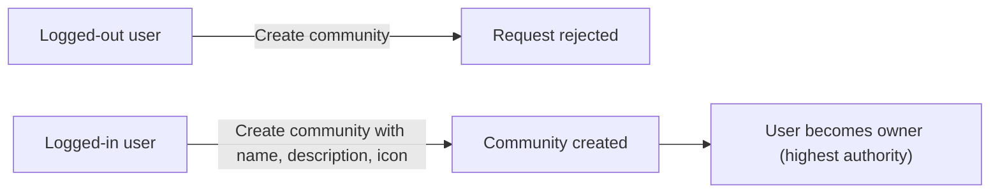
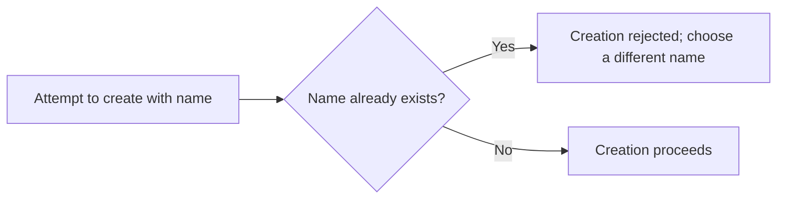
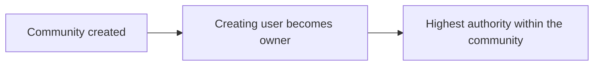
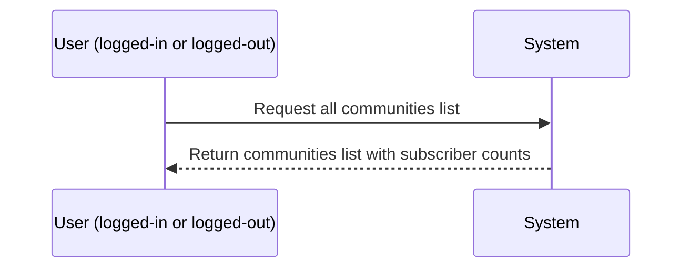
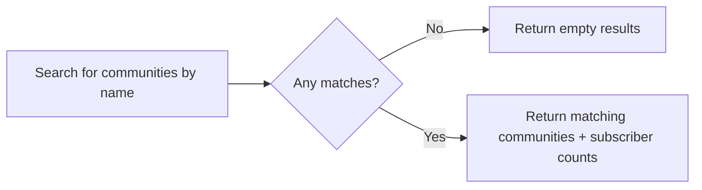
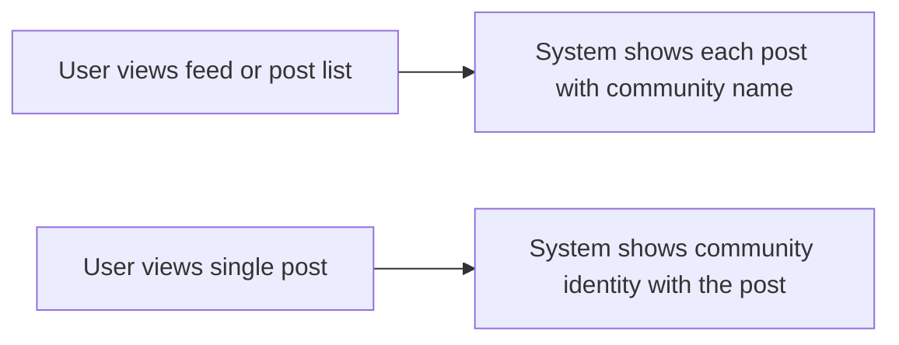
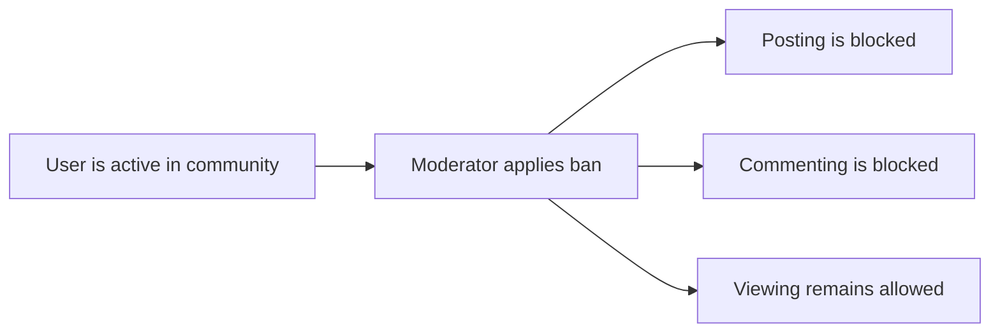
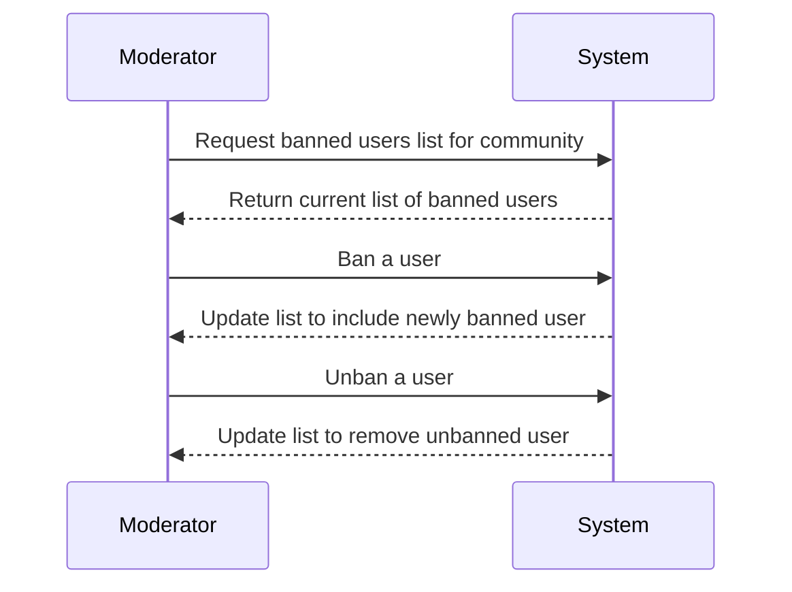

**communityPlatform — What operations users can perform, use cases, business workflows**

What operations users can perform, use cases, business workflows

# Core Business Operations

What the system must do for each business concept.

## User Operations

Users can create an account by providing an email, password, and a unique username; the system should treat the username as unique across the platform. After signup, users can log in using their email and password to access actions that require authentication. Users can change their password, which updates what credentials they use for future logins. Users can delete their account, which results in their authored posts and comments being deleted as well. When a user views their own account information, the system should present relevant profile-related context they can act on, while enforcing that users can manage only their own account. The system should support reading user presence in a way that other parts of the platform can display author usernames on posts and comments. Account deletion should fully remove the user’s ability to create new content and should ensure the user’s existing content is handled according to the deletion rule. If a username conflicts during signup, the user is unable to create the account with that username and must choose another. If a user attempts to log in with incorrect credentials, access is denied until they provide the correct email and password. If a user attempts to change a password or delete an account without being properly authenticated as themselves, the action is rejected. Deleting the account should not leave orphaned content that would misattribute authorship to a deleted user.

### Account Signup Flow

Users can create an account by providing an email, a password, and a unique username.

The system must require that the chosen username is unique across the platform.

After a successful signup, the system must allow the user to log in using their email and password.

If a signup attempt uses a username that conflicts with an existing username, the signup request must be rejected and the user must be required to choose a different unique username.

If a user attempts to sign up without completing the required signup inputs (email, password, username), the signup request must be rejected.

Signup must result in the user becoming eligible to perform authenticated user operations in other parts of the platform, including actions that require being logged in.

If signup is unsuccessful (e.g., due to a username conflict or missing required inputs), no usable account session must be created for the user.

### Login with Email and Password

Users can log in using their email and password.

When a user provides an email and password that do not match an existing account, the login attempt must be rejected.

When a login attempt is rejected due to incorrect email or password, the system must not grant access to any authenticated operations.

Successful login must establish the user identity for subsequent authenticated actions, including password changes and account deletion.

If a user attempts to log in with incorrect credentials, the system must continue to treat the user as unauthenticated for the rest of that action.

### Password Change Operation

Users can change their password.

The system must require the user to be authenticated as themselves to change their password.

When an authenticated user requests a password change, the system must update the password that the user must provide for future logins.

If a user attempts to change a password without being authenticated as themselves, the password change request must be rejected.

After a successful password change, the user must be able to log in with the updated password on subsequent attempts.

If a password change request is rejected, the system must not change the user’s ability to log in with their existing password.

### Account Deletion and Post/Comment Cascade Behavior

Users can delete their account.

The system must require the user to be authenticated as themselves to delete their account.

When an account deletion is requested and approved, the system must delete all posts authored by the user.

When an account deletion is requested and approved, the system must delete all comments authored by the user.

The deletion must ensure that the user no longer has the ability to create new posts or write new comments after the account is deleted.

The system must not leave authored posts or comments attributed as authored by a user account that has been deleted.

If a user attempts to delete an account without being properly authenticated as themselves, the account deletion request must be rejected.

After successful account deletion, the system must prevent any further authenticated actions associated with that deleted user account.

### Self-Service Access Control for Account Actions

The system must enforce that self-service account actions (password change and account deletion) can only be performed by the authenticated user acting on their own account.

If a user attempts to change the password or delete an account that is not their own, the system must reject the action.

If the user is unauthenticated, the system must reject password change and account deletion requests.

The system must ensure that users can only view or act on account-related data for their own account when those operations are intended to be self-service.

### Read User Identity for Author Display

When viewing content such as posts and comments, the system must display the author username for the content.

The system must ensure that the author identity shown for a post or comment corresponds to the user who authored it.

After account deletion, the system must ensure that content deletion behavior prevents misattribution of authorship to the deleted user account.

The system must provide consistent author identity display for lists and single-content views so that users can understand who created the post or comment they are reading.

## UserProfile Operations

Each user has a profile that includes a display name, a bio text, and an avatar image. Users can view their own profile and see the same profile information they can edit, plus profile-linked summaries such as karma and lists of authored content. Users can edit their own display name, bio, and avatar to keep their profile information up to date. Other users can view any user’s profile page to see that user’s display name, bio, and avatar. On a profile page, the system should show the user’s total karma score as a single number that reflects vote activity across their posts and comments. The profile page also includes lists of all posts and all comments that the user has written, so visitors can navigate their activity. Profile updates should apply only to the currently logged-in user’s own profile, not to other users’ profiles. When a user updates their profile, the updated values should be reflected in subsequent profile views and on any UI where their display name and avatar are shown. If a user tries to edit a profile they do not own, the system should deny the update. If the user deletes their account, their profile-related presence should no longer be available as a standalone identity for viewing, consistent with the account deletion rule. The system should handle listing or viewing profile information in a way that remains consistent with author attribution on posts and comments.

### View Any User Profile (Visitor and Logged-in Behavior)

Any user or guest can view the profile page of any user.
A viewed profile page shows the target user’s display name, bio text, and avatar image.
A viewed profile page shows the target user’s total karma score as a single number.
A viewed profile page shows a list of posts created by the target user.
A viewed profile page shows a list of comments written by the target user.
If the target user has not set or does not have a bio text, the system shows an appropriate empty/absent bio state rather than failing.
If the target user has not set or does not have an avatar image, the system shows an appropriate empty/absent avatar state rather than failing.
Profile viewing must remain available regardless of whether the viewer is logged in.
Profile viewing must remain consistent with author attribution shown on posts and comments listed on the profile page.
After a user updates their profile, subsequent profile views by any visitor must reflect the latest saved display name, bio text, and avatar.
If the target user’s account has been deleted, the profile-related standalone identity must no longer be available for viewing as a profile page.

### Edit Own Profile: Display Name Update Rules

Only the currently logged-in user can edit their own profile information.
A user can update their own display name on their profile.
The system must apply display name changes only to the logged-in user’s profile, not to any other user’s profile.
If a user attempts to edit a profile that they do not own, the system denies the update.
After a successful display name update, the new display name must appear in subsequent views of the user’s profile page.
After a successful display name update, the new display name must be reflected wherever the author display information is shown for the user’s posts and comments.

### Edit Own Profile: Bio Text Update Operation

Only the currently logged-in user can update bio text for their own profile.
A user can update the bio text shown on their profile.
The system must apply bio text changes only to the logged-in user’s profile, not to any other user’s profile.
If a user attempts to update bio text for a profile they do not own, the system denies the update.
After a successful bio text update, the updated bio text must be shown on subsequent profile page views.
After a successful bio text update, the updated bio text must be reflected anywhere the bio text is displayed as part of the user’s profile information.

### Edit Own Profile: Avatar Image Update Operation

Only the currently logged-in user can update the avatar image for their own profile.
A user can update the avatar image shown on their profile.
The system must apply avatar image changes only to the logged-in user’s profile, not to any other user’s profile.
If a user attempts to update an avatar image for a profile they do not own, the system denies the update.
After a successful avatar image update, the updated avatar image must be shown on subsequent profile page views.
After a successful avatar image update, the updated avatar image must be reflected wherever the user’s avatar is shown as part of author-related display information on posts and comments.

### Karma Score Display on Profile Page

A user’s profile page displays exactly one total karma score value representing the user’s karma across their posts and comments.
The karma score displayed on the profile page must reflect vote activity on the user’s posts and the user’s comments.
When votes on the user’s posts or comments change (including upvotes, downvotes, and vote removal), the karma score displayed on their profile must update accordingly for subsequent profile views.
The karma score may be negative, and if it is negative the profile must still display the negative value as a single number.

### Posts List on Profile Page (Author Attribution Consistency)

The profile page lists all posts created by the target user.
The posts list on a profile page must show the correct author attribution so that each listed post is clearly attributed to the profile owner.
After the profile owner updates their display name or avatar, the author display information shown alongside their listed posts on the profile page must reflect the latest profile values.
If the target user deletes their account, their profile page must no longer be available as a standalone identity, and the posts listed there must not be shown via the deleted profile page view.
Post list display on the profile page must remain consistent with how author attribution is presented on the post details experience.

### Comments List on Profile Page (Author Attribution Consistency)

The profile page lists all comments written by the target user.
The comments list on a profile page must show the correct author attribution so that each listed comment is clearly attributed to the profile owner.
After the profile owner updates their display name or avatar, the author display information shown alongside their listed comments on the profile page must reflect the latest profile values.
If the target user deletes their account, the profile page must no longer be available as a standalone identity, and the comments listed there must not be shown via the deleted profile page view.
Comments list display on the profile page must remain consistent with how author attribution is presented in the comment experience within posts.

### Account Deletion and Profile Visibility

When a user deletes their account, their profile-related standalone identity must no longer be available for viewing as a profile page.
After account deletion, visitors and logged-in users must not be able to view the deleted user’s profile page.
After account deletion, the profile page must not be shown as a navigable identity from the lists of posts and comments associated with that user.
Account deletion must be reflected in subsequent attempts to view the user profile, with the system denying access to the profile page after deletion.

## Community Operations

Users can create new communities by providing a unique name, a description text, and an icon image. When a user creates a community, they become its owner with the highest authority inside that community. Users can browse communities through a list view that shows the communities available on the platform, including each community’s subscriber count. Users can search for communities by name to quickly find communities they might want to join. When viewing a community, users should see the community’s name, description, and icon, along with the subscriber count as an at-a-glance measure of popularity. Users who are not logged in should still be able to view communities, while certain actions like subscribing or posting depend on being logged in and following subscription rules. The system should allow reading community identity information so posts can display which community they belong to. Updates to community details should be restricted according to the community’s authority rules, with owners able to manage the community while the exact set of editable fields is governed elsewhere in the requirements. If a user attempts to create a community with a name that violates uniqueness expectations, the creation should fail and the user must choose a different name. If a user searches for a community name that matches nothing, the user should receive an empty result rather than an error. Deleting or removing a community is not explicitly described, so the community operations should focus on creation and discovery without inventing additional lifecycle behaviors. Overall, community operations should ensure community identity and ownership are correct so downstream moderation and posting rules work as intended.

### Community Creation Flow

### Create Community
WHEN a logged-in member submits a request to create a community, THE system SHALL create the community using the provided unique name, description text, and icon image.
THE system SHALL assign the creating user as the community owner with the highest authority within that community (moderation authority foundation is handled via ownership).
IF a logged-out user attempts to create a community, THEN the request SHALL be rejected.
IF any required creation input is missing (name, description text, or icon image), THEN the request SHALL be rejected.

Mermaid diagram:


### Unique Community Name Requirement

### Enforce Unique Community Name
WHEN a logged-in user attempts to create a community, THE system SHALL ensure the community name is unique across the platform.
IF the submitted community name would conflict with an existing community name, THEN the system SHALL reject the creation request.
WHEN the creation request is rejected due to a duplicate name, THE system SHALL require the user to choose a different community name.

Mermaid diagram:


### Community Description Text

### Store Community Description
WHEN a community is created, THE system SHALL store the community’s description text as part of the community identity.
WHEN users view communities (including individual community viewing), THE system SHALL display the community’s description text.

Error handling:
IF the community description text is missing at creation time, THEN the system SHALL reject the creation request.

### Community Icon Upload

### Require and Display Community Icon
WHEN a community is created, THE system SHALL accept an icon image as part of the community identity.
IF the icon image is missing at creation time, THEN the system SHALL reject the creation request.
WHEN users browse or view a community, THE system SHALL display the community’s icon image.

### Community Owner Assignment as Authority Foundation

### Assign Owner Authority on Creation
WHEN a community is created, THE system SHALL set the creating user as the community owner.
WHILE a user is the community owner, THE system SHALL treat that user as having the highest authority within the community for moderator-related permissions (moderation authority foundation via ownership).
IF a user is not the community owner, THEN the system SHALL not treat that user as the owner (authority is not granted based on other roles).

Mermaid diagram:


### Browse All Communities List (Open Discovery)

### List Communities for Discovery
WHEN any user (logged-in or logged-out) requests the list of all communities, THE system SHALL show a list of communities available on the platform.
THE system SHALL include each community’s subscriber count in the list display.

Mermaid diagram:


### Search Communities by Name

### Search by Community Name
WHEN a user searches for communities by name, THE system SHALL return communities whose names match the provided search input.
IF the search input matches no communities, THEN THE system SHALL return an empty result set rather than an error.
WHEN a search returns matching communities, THE system SHALL display subscriber count alongside each matched community.

Mermaid diagram:


### Subscriber Count Display

### Show Subscriber Count Everywhere It Is Shown
WHEN the system displays communities in the all-communities list, THE system SHALL show each community’s subscriber count.
WHEN the system displays search results for communities, THE system SHALL show each matched community’s subscriber count.
WHEN the system displays an individual community’s identity page or community view, THE system SHALL show the community’s subscriber count.

Error handling:
IF subscriber count information is unavailable for a community, THEN the system SHALL still be able to display the community identity without failing the entire community view.

### Community Identity for Post Display

### Provide Community Identity for Posts
WHEN a user views a single post, THE system SHALL display the post’s community (name) so the user can identify which community the post belongs to.
WHEN a user views posts in any feed or post list, THE system SHALL display the community name for each post in the list.
WHEN a user views a post, THE system SHALL display the author and community together as part of the single-post view.

Mermaid diagram:


## CommunitySubscription Operations

Users can subscribe to a community so they become part of that community’s membership. Subscribing is an explicit action, and once subscribed, the user can create posts in that community. Users can unsubscribe from a community when they no longer want to participate, which removes their ability to create new posts there. The system should allow users to view a list of all communities they are subscribed to, so they can quickly manage their participation. Subscription actions should be tied to the currently logged-in user, ensuring users cannot subscribe or unsubscribe on behalf of someone else. When users subscribe or unsubscribe, the system should update what content creation options they have for that community based on the subscription requirement. If a user attempts to subscribe to a community they are already subscribed to, the system should not create duplicate membership and should instead keep the user in their current subscribed state. If a user attempts to unsubscribe from a community they are not subscribed to, the system should handle it gracefully without breaking other membership data. A user’s subscription status should also affect which posts appear in their home feed, since the home feed includes posts from communities they subscribe to. Unsubscribing should not remove historical content the user previously created, but it should prevent new post creation until they subscribe again. Overall, community subscription operations provide the business rule that “subscribed users can post,” while supporting viewing and managing subscriptions.

### Subscribe to a Community (Membership Creation)

### Subscribe to a community
WHEN a logged-in user chooses to subscribe to a specific community, THE system SHALL add that user as a subscriber of that community.

### Subscription tied to the logged-in user
WHEN subscribing, THE system SHALL associate the subscription with the currently logged-in user (defined as “the user who is performing the action”), not with another user.

### Subscribe action requires subscription prerequisite for posting (gating support)
WHEN the subscription is successfully created, THE system SHALL allow the user to create posts in that community in later operations.

### Prevent duplicate subscription behavior
IF the logged-in user is already subscribed to the selected community, THEN THE system SHALL NOT create a duplicate subscription record.

### Duplicate subscription keeps the current subscribed state
IF a duplicate subscribe request is made for a community the user is already subscribed to, THEN THE system SHALL keep the user’s subscription status unchanged (the user remains subscribed) and SHALL not cause unintended membership loss.

### Subscribe conflict and graceful outcomes
IF subscribing cannot be completed because the user is already subscribed, THEN THE system SHALL handle the request gracefully without breaking any other subscription data.

### Unsubscribe from a Community (Membership Removal)

### Unsubscribe from a community
WHEN a logged-in user chooses to unsubscribe from a specific community, THE system SHALL remove that user’s subscription to that community.

### Unsubscribe tied to the logged-in user
WHEN unsubscribing, THE system SHALL apply the change to the currently logged-in user only.

### Subscription status affects content creation eligibility
WHEN a user unsubscribes from a community, THE system SHALL prevent that user from creating new posts in that community.

### Unsubscribe does not remove historical content
WHEN a user unsubscribes, THE system SHALL NOT delete or remove historical posts or comments the user previously created; prior content remains viewable.

### Handle unsubscribe when not subscribed
IF the logged-in user attempts to unsubscribe from a community they are not currently subscribed to, THEN THE system SHALL handle the request gracefully without impacting other membership data.

### Unsubscribe consistency for rapid actions
WHEN subscription and unsubscription actions are performed by the same logged-in user, THEN THE system SHALL ensure the final subscription status correctly determines posting eligibility for subsequent post creation attempts.

### Subscribed Communities List (Participation Management)

### List subscribed communities
WHEN a user requests a list of all communities they are subscribed to, THE system SHALL display communities for which the user currently has an active subscription.

### List is based on the logged-in user
WHEN viewing the subscribed communities list, THE system SHALL show results for the currently logged-in user only.

### Community participation management overview
THE system SHALL enable community participation management by allowing users to quickly identify which communities they have joined, so they can decide where to subscribe or unsubscribe next.

### Subscription status reflects in lists
WHEN the user subscribes or unsubscribes, THEN the subscribed communities list SHALL reflect the updated membership status for subsequent list views.

### Empty subscribed list handling
IF the user has no community subscriptions, THEN THE system SHALL show an empty state for subscribed communities rather than failing or showing unrelated communities.

### Home Feed Community Filter (Membership-Based Visibility)

### Home feed available only to logged-in users (as it relates to subscriptions)
WHEN a logged-in user views the Home Feed, THE system SHALL show posts only from communities that the user is subscribed to.

### Home feed community filter uses current subscription status
WHILE the Home Feed is being generated, THE system SHALL apply the user’s current subscription status to determine which communities’ posts are eligible to appear.

### Subscribed status affects feed eligibility
WHEN a user unsubscribes from a community, THEN that community’s posts SHALL no longer be eligible to appear in the user’s Home Feed after the change.

### Subscribing expands home feed eligibility
WHEN a user subscribes to a community, THEN that community’s posts SHALL become eligible to appear in the user’s Home Feed.

### Membership-based posting eligibility alignment
WHEN evaluating access to post creation in a community, THEN the system SHALL use the same subscription status concept that governs whether that community’s posts appear in the Home Feed.

### Home feed pagination compatibility
WHEN rendering the Home Feed, THE system SHALL paginate the results after applying the subscription-based community filter so that the user can browse eligible posts page by page.

## Post Operations

Users can create posts in any community where they are subscribed, and the system should enforce that subscription rule. Every post requires a title, and the system should reject post creation attempts without a title. A post must be one of three types: text post with text content, link post with a URL, or image post with an uploaded image, and the system should capture the corresponding content for each type. When users view a single post, they should see the title, full content, the author, the community it belongs to, the vote score, the comment count, and when it was posted. Users can edit their own posts, allowing them to update the post’s content while keeping it attributed to the same author. Users can delete their own posts, which removes the post from feed and post views and should also ensure its vote and comment context no longer appears for that post. When viewing lists of posts through feeds, the system should show a summarized display for each post including title, author username, community name, vote score, comment count, time since posted, and either a content preview, thumbnail, or domain name depending on post type. Users should be able to browse feed lists with pagination so they can move through large sets of posts without missing items. The system should apply feed visibility rules when listing posts: home feed is only for logged-in users and only includes subscribed communities, while popular and community feeds are available to everyone. Sorting options like hot, new, top, and controversial should govern the order in which posts appear in each feed. If a user tries to create a post in a community they are not subscribed to, the system should block the action and explain it as not eligible. If a user tries to edit or delete a post they do not own, the system should deny the operation. When a post is deleted, any subsequent viewing attempts should not show the content or its author details as if it still exists.

### Post Creation in Subscribed Communities

Users can create a post only in communities they are subscribed to.

WHEN a user is not subscribed to a community, the system SHALL deny the post creation request for that community.

WHEN a user creates a post in a subscribed community, the post is associated with that community and is attributed to the creating user as the author.

WHEN a user is banned from a community, the system SHALL block the user from creating posts in that community.

WHEN a post creation request is submitted with a missing or empty title, the system SHALL reject the request.

WHEN a user submits a post creation request with an invalid post type-to-content pairing (text vs link vs image), the system SHALL reject the request.

The system SHALL support three post types for creation: text posts, link posts, and image posts.

For text posts, the system SHALL accept text content as the post’s full content.

For link posts, the system SHALL accept a URL as the post’s content.

For image posts, the system SHALL accept an uploaded image as the post’s content.

### Required Post Title Rule

Every post created in any community SHALL require a title.

WHEN a user attempts to create a post without providing a title, the system SHALL reject the creation request.

WHEN a user creates a post successfully, the system SHALL include the title in the post’s display for both single-post viewing and feed lists.

### Post Type Handling: Text, Link, and Image

Text posts SHALL display full text content when a user views a single post.

Link posts SHALL display the link URL when a user views a single post.

Image posts SHALL display the uploaded image when a user views a single post.

In feed list displays, the system SHALL summarize post content according to post type:
- For text posts, the system SHALL show a content preview.
- For link posts, the system SHALL show the domain name of the URL.
- For image posts, the system SHALL show a thumbnail of the image.

### View Single Post Details

Users can view the details of a single post.

WHEN viewing a single post, the system SHALL display the post title.

WHEN viewing a single post, the system SHALL display the full content appropriate to the post type (text content for text posts, the URL for link posts, and the image for image posts).

WHEN viewing a single post, the system SHALL display the author.

WHEN viewing a single post, the system SHALL display the community the post belongs to.

WHEN viewing a single post, the system SHALL display the vote score and the comment count.

WHEN viewing a single post, the system SHALL display when the post was posted using a time-since format (for example, “3 hours ago”).

IF a user attempts to view a post that has been deleted, the system SHALL not show the post’s content or author details as if it still exists.

### Edit Own Post Operation

Users can edit their own posts.

WHEN a user attempts to edit a post they do not own, the system SHALL deny the edit request.

WHEN a user edits a post successfully, the system SHALL update the post’s content shown in single-post viewing.

WHEN a user edits a post, the system SHALL keep the post attributed to the same author.

Post edits SHALL be reflected when the post is later viewed in feeds and in single-post details, according to the same post-type display rules.

### Delete Own Post Operation

Users can delete their own posts.

WHEN a user attempts to delete a post they do not own, the system SHALL deny the deletion request.

WHEN a user deletes a post, the system SHALL remove the post from feed lists and from single-post views.

WHEN a post is deleted, the system SHALL ensure that subsequent viewing attempts do not show the deleted post’s content or author details as if it still exists.

WHEN a post is deleted, the system SHALL ensure that the deleted post no longer contributes to comment counts and vote score displays for that post view (because the post is no longer available for viewing).

### Post List Display in Feeds

Users can browse posts through feeds.

WHEN viewing any feed list, each post item SHALL display the following summary fields:
- Title
- Author username
- Community name
- Vote score
- Comment count
- Time since posted (for example, “3 hours ago”)

WHEN viewing any feed list, the system SHALL display a type-specific summary of the post’s content:
- Text posts: content preview using the first 200 characters.
- Image posts: thumbnail of the image.
- Link posts: domain name of the URL (for example, “youtube.com”).

### Text Post Content Preview Rules

For text posts shown in feed lists, the system SHALL display only the first 200 characters of the text content as the preview.

WHEN a text post has fewer than 200 characters, the system SHALL display the available text without padding.

The preview behavior SHALL apply consistently across Home Feed, Popular Feed, and Community Feed listings.

### Thumbnail and Domain Display Rules for Non-Text Posts

For image posts shown in feed lists, the system SHALL display a thumbnail of the uploaded image.

For link posts shown in feed lists, the system SHALL display only the domain name of the URL (for example, “youtube.com”), not the full URL.

WHEN viewing a single post, the system SHALL display the full image or full URL content according to the post type (defined in the post type handling section), rather than the feed-list summary.

### Feed Pagination Behavior

All feeds SHALL be paginated.

WHEN a user browses a feed with pagination, the system SHALL present posts in pages so the user can move through large sets of posts without missing items.

WHEN additional pages are requested in a feed, the system SHALL return the next set of posts consistent with the selected feed sorting option.

Pagination behavior SHALL apply to Home Feed, Popular Feed, and Community Feed.

### Home Feed Logged-in Visibility

Home Feed is available only to logged-in users.

WHEN a logged-out user attempts to access the Home Feed, the system SHALL prevent access.

Home Feed SHALL show posts only from communities the logged-in user is subscribed to.

### Popular and Community Feed Public Visibility

Popular Feed is available to everyone, including logged-out users.

Community Feed is available to everyone, including logged-out users.

Popular Feed SHALL show posts from all communities across the platform.

Community Feed SHALL show posts from one specific community.

### Sorting Options Across All Feeds

All three feeds SHALL support the same sorting options.

Hot: feeds SHALL order posts so that recent posts with many upvotes appear first.

New: feeds SHALL order posts so that most recently created posts appear first.

Top: feeds SHALL order posts by the highest vote score first.

Top sorting SHALL also support time filters: today, this week, this month, this year, all time.

Controversial: feeds SHALL order posts so that posts with many votes but score close to zero appear first.

WHEN a user selects a sorting option for any feed, the system SHALL use that sorting to determine the order of posts within paginated results for that feed.

### Post Feed and Single-Post Access Flow (Business Perspective)

flowchart LR
    A["User requests feed"] --> B["System checks feed type"]
    B --> C["Home Feed"]
    B --> D["Popular Feed"]
    B --> E["Community Feed"]
    C --> F["System allows only logged-in users"]
    C --> G["System filters to subscribed communities"]
    D --> H["System allows logged-out users"]
    E --> I["System allows everyone"]
    F --> J["System returns paginated list"]
    G --> J
    H --> J
    I --> J
    J --> K["User selects a post"]
    K --> L["System shows single post details"]
    L --> M["System displays title, full content, author, community, vote score, comment count, time since posted"]
    L --> N["If post is deleted, system does not show it as existing"]

## PostVote Operations

Users can vote on posts by upvoting or downvoting, which directly changes the post’s vote score. The vote score is defined as total upvotes minus total downvotes, so each upvote adds 1 and each downvote subtracts 1. Each user can cast only one vote per post, so the system must track the user’s current vote state for that post to prevent multiple votes. If a user changes their vote from upvote to downvote (or vice versa), the post’s score should update accordingly based on the net change. Users can also remove their vote entirely, which adjusts the score back to reflect only the remaining users’ votes. Vote actions should be attributed to the acting user, and the system should ensure users cannot vote on behalf of others. Users should see the updated vote score reflected when viewing the post, including in the single-post view. These post votes also affect the author’s single karma score by increasing karma by 1 when someone upvotes their post and decreasing karma by 1 when someone downvotes their post. Removing a vote should adjust karma in the same direction so the author’s total karma always matches the current vote totals. The system must ensure that karma can become negative if downvotes outweigh upvotes. If a user attempts to vote multiple times on the same post without changing or removing their existing vote, the system should not apply extra effects beyond the one allowed vote. If a user switches vote direction, the system should correctly apply the difference rather than stacking changes.

### Post Upvote Operation

Users can upvote a post they want to react to, which increases that post’s vote score by 1.
The system must attribute the upvote to the acting user so that the post’s vote score reflects votes made by real users.
When a post is displayed in the single-post view, the vote score shown must reflect all upvotes currently applied to that post.
Upvoting a post must also adjust the author’s karma score by increasing it by 1.
If the user is not logged in when attempting to upvote, the system must reject the action.
If the user’s current vote state on the post already represents an upvote, the system must not apply an additional vote effect (the upvote must not duplicate).
The system must ensure users cannot upvote on behalf of other users; the vote is always tied to the acting user.

### Post Downvote Operation

Users can downvote a post they want to react to, which decreases that post’s vote score by 1.
The system must attribute the downvote to the acting user so that the post’s vote score reflects votes made by real users.
When a post is displayed in the single-post view, the vote score shown must reflect all downvotes currently applied to that post.
Downvoting a post must also adjust the author’s karma score by decreasing it by 1.
If the user is not logged in when attempting to downvote, the system must reject the action.
If the user’s current vote state on the post already represents a downvote, the system must not apply an additional vote effect (the downvote must not duplicate).
The system must ensure users cannot downvote on behalf of other users; the vote is always tied to the acting user.

### One Vote Per User Per Post Rule

For any given post, each user can have at most one active vote at a time.
The system must prevent repeated voting duplicates by ensuring that a user cannot create an additional vote record that would further change the post’s vote score without the user first changing or removing their existing vote.
Vote direction is determined by whether the user’s active vote is an upvote or a downvote.
The vote score for a post must always equal the total upvotes minus the total downvotes.
If a user attempts an action that would result in keeping the same vote direction while another active vote already exists for that user on the same post, the system must treat it as a no-op in terms of score and karma (no extra adjustment beyond the one allowed vote).
The rule applies regardless of the order in which a user performs actions such as upvoting and downvoting.

### Change Vote from Upvote to Downvote

When a logged-in user changes their vote on a post from upvote to downvote, the system must update the post’s vote score by applying the net change rather than stacking multiple effects.
Changing from upvote to downvote must result in a difference of -2 to the post’s vote score (because the user’s vote changes from +1 contribution to -1 contribution).
The system must update the author’s karma score consistently with the net change so that the author’s karma reflects the current vote totals.
After the vote direction change, the updated vote score must be reflected when the post is viewed in its single-post view.
If the user attempts to change to downvote while their current active vote is already downvote, the system must not apply any additional score or karma changes (prevents repeated voting duplicates).

### Change Vote from Downvote to Upvote

When a logged-in user changes their vote on a post from downvote to upvote, the system must update the post’s vote score by applying the net change rather than stacking multiple effects.
Changing from downvote to upvote must result in a difference of +2 to the post’s vote score (because the user’s vote changes from -1 contribution to +1 contribution).
The system must update the author’s karma score consistently with the net change so that the author’s karma reflects the current vote totals.
After the vote direction change, the updated vote score must be reflected when the post is viewed in its single-post view.
If the user attempts to change to upvote while their current active vote is already upvote, the system must not apply any additional score or karma changes (prevents repeated voting duplicates).

### Remove Vote Entirely

Users can remove their vote entirely from a post they previously voted on.
Removing an upvote must adjust the post’s vote score by -1 (so the post no longer receives that user’s +1 contribution).
Removing a downvote must adjust the post’s vote score by +1 (so the post no longer receives that user’s -1 contribution).
Removing a vote must also correct the author’s karma score in the same direction as the vote adjustment so that the author’s total karma always matches the current vote totals.
If a user attempts to remove a vote when they do not currently have an active vote on that post, the system must reject the action (so that karma and vote score are not adjusted incorrectly).
After a vote is removed, the updated vote score must be reflected in the single-post view.
Karma can become negative when downvotes outweigh upvotes, and vote removal must still correctly allow karma to reflect the remaining votes.

### Prevent Repeated Voting Duplicates and Ensure Consistency

The system must ensure that vote effects on a post are applied exactly once per user per post, according to the one-vote-per-post rule.
If a user repeats an action that would not change their vote state (for example, upvoting again while already upvoted), the system must ensure no additional change is applied to the post’s vote score or the author’s karma.
If a user switches vote direction, the system must compute and apply the correct net change based on the previous vote state and the new vote state.
After any vote action (upvote, downvote, direction change, or removal), the post’s displayed vote score in the single-post view must be consistent with the vote score definition: total upvotes minus total downvotes.
After any vote action, the author’s karma score must be consistent with the sum of vote effects from that author’s posts and must allow negative values when applicable.

## Comment Operations

Users can write a comment on any post, and they can reply to any comment, creating nested replies with no depth limit. Each comment belongs to a specific post context, and visitors should see the comment author, content, vote score, and when it was posted. When viewing a post, users should see the nested reply structure in the comment list so the conversation flow is preserved. Users can edit their own comments to adjust what they said, and the updated content should be shown to all viewers. Users can delete their own comments, which removes the comment from the comment thread for that post view. Comment sorting should support viewing comments by Best, New, or Controversial, where sorting depends on vote score, recency, or closeness of score to zero. The system should show the comment vote score and time-since-posted label in each comment entry so users can understand activity and ranking cues. Replies are treated as comments within the same sorting behavior rules, so the chosen sort should affect how replies are ordered in the thread display. If a user tries to edit or delete a comment they do not own, the system should deny the action. If a user attempts to submit a comment or reply without the necessary basic content, the system should reject it, since comments require content to be displayed meaningfully. After a comment is edited or deleted, the changes should be immediately visible when reloading the post’s comment list. Overall, comment operations enable users to participate in discussions under posts and maintain consistent display of authorship, vote score, and nested structure.

### Write Comment on a Post

Users can write a comment on any post.
A comment must include content that is suitable for display to other viewers.
If a user attempts to submit a comment with empty or missing content, the system rejects the submission.
A posted comment is associated with the specific post being viewed, so it appears in that post’s comment thread.
After a comment is submitted successfully, all viewers of the post see the comment author, comment content, vote score, and the time since the comment was posted.
The system must assign the comment to the logged-in user as the author of that comment.

### Reply to Any Comment (Nested Replies, No Depth Limit)

Users can reply to any comment on a post.
A reply is treated as a comment within the same post comment thread (defined in [Write Comment on a Post]).
Replies can themselves have replies, with no depth limit.
When a user views a post, the reply content appears within the nested reply structure so the conversation flow is preserved.
A submitted reply is associated with the specific parent comment, so it shows in the correct location within the thread under that parent.
After a reply is submitted successfully, all viewers of the post can see the reply author, reply content, vote score, and time since the reply was posted.

### Comment Display in Post View (Author, Content, Vote Score, Time Since Posted)

When viewing a post, the system displays a comment thread that includes all comments and nested replies belonging to that post.
Each comment entry in the post view shows the comment author.
Each comment entry in the post view shows the comment content.
Each comment entry in the post view shows the comment vote score.
Each comment entry in the post view shows the time since the comment was posted using a human-friendly relative label (for example, “3 hours ago”).
For nested replies, the same comment display elements (author, content, vote score, time since posted) apply to replies as they appear within the thread structure.
When a post is reloaded after comment changes (edit or delete), the displayed thread reflects those changes immediately.

### Edit Own Comment Operation

Users can edit their own comments.
A user must be the author of a comment to edit it.
If a user attempts to edit a comment they do not own, the system denies the action.
When a comment is edited successfully, the updated content is displayed to all viewers of the post.
After editing, the comment remains in the same post comment thread and nested reply position it previously occupied.
If the edit results in empty or missing comment content, the system rejects the edit so the updated comment content remains displayable.

### Delete Own Comment Operation

Users can delete their own comments.
A user must be the author of a comment to delete it.
If a user attempts to delete a comment they do not own, the system denies the action.
When a comment is deleted successfully, it is removed from the comment thread as shown in the post view.
Deleted comments no longer appear as selectable or visible comment entries within that post’s thread display.
If a user reloads the post’s comment list after deletion, the deleted comment does not reappear.

### Comment Voting Score Used for Ordering

Comment sorting must use comment vote score as an input for ordering.
When the chosen sorting option emphasizes “Best” or “Controversial,” the relative position of comments and replies depends on their vote score.
For “Best,” comments with higher vote scores appear before those with lower vote scores.
For “Controversial,” comments with many votes but scores close to zero appear first.
Vote score values shown in the comment entries (defined in [Comment Display in Post View (Author, Content, Vote Score, Time Since Posted)]) must be consistent with the ordering used for the selected sort.

### Comment Sorting: Best, New, Controversial

For a post’s comment thread, users can sort comments by one of the following options: Best, New, or Controversial.
Best sorting orders comments primarily by highest vote score first.
New sorting orders comments primarily by most recent posting time first.
Controversial sorting orders comments such that posts with many votes but scores close to zero appear first.
Replies are treated as comments within the same sorting behavior rules (defined in [Reply to Any Comment (Nested Replies, No Depth Limit)]), so the chosen sort option affects how replies are ordered in the thread view.
The selected sort option must apply consistently across the entire comment thread display for the post, including both top-level comments and nested replies.
After sorting is changed, the comment list displayed to the user updates to reflect the new ordering while keeping the nested reply structure appropriate to the thread.

## CommentVote Operations

Users can upvote or downvote any comment to influence that comment’s vote score. The voting rules mirror post voting: each upvote adds 1 and each downvote subtracts 1, and the vote score represents total upvotes minus total downvotes. Each user can only vote once per comment, so the system must ensure there is a single current vote state per user for a given comment. Users can change their vote from upvote to downvote or from downvote to upvote, and the comment’s score should update to reflect the new net effect. Users can remove their vote entirely, returning the comment’s vote score to the state based on remaining voters. These comment votes adjust the author’s single karma score by +1 for upvotes and -1 for downvotes on their comments. Removing a vote updates karma in the opposite direction so the karma total always corresponds to the current vote state. Because karma can be negative, the system must allow karma to decrease below zero for users whose content receives more downvotes than upvotes. When viewing a post’s comments, users should see the updated comment vote score after voting actions. If a user attempts to vote again without changing or removing their existing vote, the system should avoid applying additional score changes. If a user changes vote direction, the system should apply the difference rather than adding multiple changes.

### Comment Upvote Operation

Users who are logged in can upvote a specific comment.
When a user upvotes a comment for the first time, the comment’s vote score increases by 1 relative to its current state.
The system records the user’s current vote for that comment so that subsequent voting behavior is consistent.
The system displays the updated vote score for the comment when the user views the post’s comments after the upvote.

### Comment Downvote Operation

Users who are logged in can downvote a specific comment.
When a user downvotes a comment for the first time, the comment’s vote score decreases by 1 relative to its current state.
The system records the user’s current vote for that comment so that subsequent voting behavior is consistent.
The system displays the updated vote score for the comment when the user views the post’s comments after the downvote.

### Single Vote Per User Per Comment

For any given comment, each logged-in user has exactly one current vote state: upvoted, downvoted, or no vote.
The system must prevent applying additional score changes if a user attempts to upvote a comment when the user already has an upvote, without first changing direction or removing the vote.
The system must prevent applying additional score changes if a user attempts to downvote a comment when the user already has a downvote, without first changing direction or removing the vote.
The comment’s displayed vote score must remain consistent with the single current vote state for each user.

### Change Vote Direction for a Comment (Upvote ↔ Downvote)

If a logged-in user changes an existing vote direction on a comment from upvote to downvote, the system updates the comment’s vote score by the net difference rather than adding multiple separate effects.
If a logged-in user changes an existing vote direction on a comment from downvote to upvote, the system updates the comment’s vote score by the net difference rather than adding multiple separate effects.
After a direction switch, the system’s representation of the user’s current vote for that comment must match the new direction.
The system displays the updated vote score for the comment when the user views the post’s comments after the direction change.

### Remove Vote Entirely from a Comment

A logged-in, previously voting user can remove their vote from a comment, returning the user’s vote state to “no vote.”
When a user removes an upvote, the system corrects the comment’s vote score by reversing the upvote’s contribution.
When a user removes a downvote, the system corrects the comment’s vote score by reversing the downvote’s contribution.
If a user attempts to remove a vote when the user has no existing vote on that comment, the system must not apply score changes.
After vote removal, the system displays the updated vote score for the comment when the user views the post’s comments.

### Comment Vote Score Calculation (Upvotes Minus Downvotes)

The comment’s vote score is defined as the total number of upvotes minus the total number of downvotes.
When users upvote, downvote, change direction, or remove votes, the resulting comment vote score must reflect this upvotes-minus-downvotes definition.
The vote score shown to users must match the current aggregate after each voting action.

### Karma Adjustment from Comment Votes (Including Negative Karma)

When someone upvotes a comment, the author of that comment receives +1 karma.
When someone downvotes a comment, the author of that comment receives -1 karma.
When a user changes vote direction on a comment, karma for the comment author must be adjusted to reflect the net effect of the direction switch.
When a user removes their vote from a comment, karma for the comment author must be corrected to reflect the removed contribution.
Karma can become negative, and the system must allow the comment author’s karma to decrease below zero when downvotes outweigh upvotes.
The karma adjustments from comment voting must stay consistent with the comment vote score changes.

### Updated Vote Score Reflected in the Comment List

When viewing a post’s comments, the system must show the latest vote score for each comment.
After a user performs any comment voting action (upvote, downvote, direction change, or vote removal), the comment list reflects the updated vote score for the affected comment.
The system must ensure the displayed vote score does not show repeated or compounded changes for actions that do not alter the user’s vote state (for example, attempting the same vote direction when already in that state).

### Prevent Repeated Voting Without Change and Ensure Net Updates

If a logged-in user attempts to upvote a comment when their current vote is already an upvote, the system must avoid applying additional score changes.
If a logged-in user attempts to downvote a comment when their current vote is already a downvote, the system must avoid applying additional score changes.
If a logged-in user switches direction, the system must apply a net update to the comment vote score (so a switch produces the correct difference rather than double-counting).
If a logged-in user removes a vote, the system must apply the correct karma correction and vote score correction so that the totals reflect only the remaining voters.

## Report Operations

Users can report any post or comment when they believe it violates community expectations, and they must provide a reason as text as part of the report. Reports are associated with the content being reported and are visible to moderators for that community. When a report is created, it should capture who reported it and the provided reason so moderators can review the context. Moderators can view all reports for their community in a list that includes the reported content, the reporter, and the reason. Moderators can approve a report, which deletes the reported content from the community, and this change should be reflected when users view the post or its comments afterward. Moderators can also dismiss a report, which keeps the content and removes the dismissed report from the report list. Once a report is dismissed, it should no longer appear among active reports for moderators. Reporting should not automatically delete content; deletion happens only when a moderator approves the report. If moderation actions occur, the system should ensure the status of the report matches the outcome and that the content visibility aligns with whether it was deleted or kept. Users who report should be able to rely on the system to present the reason they submitted to moderators, without exposing it as a trigger for automatic removal. Overall, report operations support community safety by providing a structured moderation workflow for posts and comments.

### Create a Report for a Post or Comment

### Report a Post or Comment
WHEN a logged-in user believes a post or a comment violates community expectations, THE user shall be able to submit a report for that specific post or specific comment.

### Report Includes Reporter Identity
WHEN a user submits a report, THE system shall record which user submitted the report so that moderators can see who reported the content.

### No Automatic Deletion on Report Creation
WHEN a report is submitted, THE system shall NOT automatically delete or hide the reported post or comment as a result of the report being created.

### Report Workflow Supports Moderation Decision
WHEN a report is submitted, THE system shall make the report available for community moderators to review and decide whether to approve or dismiss it.

### Report Reason Text Requirement and Stored Context

### Report Reason Text Requirement
WHEN a user submits a report, THE system shall require the user to provide a reason as text.

### Reported Content Context for Moderators
WHEN moderators view the list of reports for their community, THE system shall show the reported content alongside the report details so moderators can understand what is being reported.

### Moderation Action Outcome Scenario
WHEN a moderator approves or dismisses a report, THE system shall ensure the moderation outcome is reflected consistently for the related reported content and for how that report appears in the moderators’ report list.

### Moderator View of Community Reports and Moderation Actions

### Moderator View of Community Reports
WHEN a moderator views reports for a community, THE system shall show a list of reports for that community.

### Moderators Can View All Reports for Their Community
WHEN the moderator is reviewing community reports, THE system shall display each report’s reported content, the reporter identity, and the provided reason.

### Approve Report Deletes Content
WHEN a moderator approves a report, THE system shall delete the reported post or comment from the community.

### Dismiss Report Keeps Content
WHEN a moderator dismisses a report, THE system shall keep the reported post or comment in the community.

### Content Visibility Reflects Moderation Outcome
WHEN the moderation outcome is approved or dismissed, THE system shall ensure that how users see the reported post or comment matches the outcome (deleted after approval; kept after dismissal).

### Dismissed Reports Removed from List
WHILE a report has been dismissed, THE system shall remove it from the moderator’s active report list so it no longer appears there for further action.

### Report Moderation State Flow

flowchart LR
    A["Report submitted"] --> B["Moderator reviews report"]
    B -->|"Approve"| C["Content deleted from community"]
    B -->|"Dismiss"| D["Content kept in community"]
    D --> E["Dismissed report removed from list"]
    C --> F["Report resolved and no longer in active list"]

## CommunityBan Operations

Moderators of a community can ban users from that community when moderation actions are needed. Banned users are prevented from creating posts or writing comments in that community, but they can still view content that already exists. Moderators can unban users, restoring their ability to create posts and comments in the community. Bans are managed with the understanding that the community owner has the highest authority, and moderation capabilities depend on the user’s role as owner or moderator. Moderators should be able to view the list of banned users for their community to understand who is currently restricted. When a user is banned, the system should enforce the restriction immediately so any attempt to create new content in that community is blocked. When a user is unbanned, the system should allow normal participation again, including creating new posts (subject to subscription rules) and adding new comments. The ban status should not affect reading existing posts and comments in the community; banned users remain able to browse content. If a moderator attempts to ban or unban under conditions that violate role constraints (such as trying to remove the owner or remove other moderators), the action should be denied. If a moderator tries to unban a user who is not currently banned, the system should handle it without changing state incorrectly. Overall, community ban operations provide enforceable participation control while preserving public browsing access for affected users.

### Moderation Authority to Ban Users

### Ban Authority Scope
Moderators can ban a user from their community when moderation actions are needed.
The community owner has the highest authority within a community.
WHEN a ban request is submitted by a user who is the community owner, THE system SHALL allow the ban.
WHEN a ban request is submitted by a user who is a moderator of the community, THE system SHALL allow the ban if the target user is not being removed from a protected role.
IF a moderator attempts to remove the owner through a ban/unban action, THEN THE system SHALL deny that action.
IF a moderator attempts to ban another moderator, THEN THE system SHALL allow the ban only if the action does not violate the constraint that moderators cannot remove each other.
IF a moderator attempts to ban a user in a way that implies removing the moderator or otherwise violates role constraints, THEN THE system SHALL deny the action.
WHEN the ban action is authorized, THE system SHALL record that the user is banned from the community.

```mermaid
flowchart LR
A["Request to ban a user"] --> B["Check role of requester in the community (owner or moderator)"]
B --> C{ "Requester is owner?" }
C -->|"Yes"| D["Ban is applied"]
C -->|"No"| E["Requester is moderator?"]
E --> F{ "Targets are allowed under moderator constraints?" }
F -->|"Allowed"| D
F -->|"Not allowed"| G["Action is denied"]
```

### Banned User Participation Restrictions

### Immediate Block of Creating Posts
WHEN a user becomes banned in a community, THE system SHALL immediately prevent that user from creating new posts in that community.
IF a banned user attempts to create a post in the community, THEN THE system SHALL reject the attempt.

### Immediate Block of Writing Comments
WHEN a user becomes banned in a community, THE system SHALL immediately prevent that user from writing new comments in that community.
IF a banned user attempts to write a comment in the community, THEN THE system SHALL reject the attempt.

### Banned Users Can Still View Existing Content
WHEN a user is banned in a community, THE system SHALL still allow that user to browse and view existing posts and comments in that community.
IF a banned user attempts to view existing posts or existing comments in the community, THEN THE system SHALL allow the viewing.



### Moderator Unban Operation and Restore Participation

### Unban Permission and Role Handling
WHEN a moderator submits an unban request for a user in a community, THE system SHALL allow the unban only if the requester is authorized under the community moderation authority.
IF a moderator attempts to unban in a way that would violate role constraints (such as removing the owner), THEN THE system SHALL deny the action.
IF a moderator attempts to unban another moderator in a way that violates the constraint that moderators cannot remove each other, THEN THE system SHALL deny the action.

### Unban Restores Participation
WHEN a user is unbanned from a community, THE system SHALL restore that user’s ability to create posts in the community.
WHEN a user is unbanned from a community, THE system SHALL restore that user’s ability to write comments in the community.

### Unban When Not Currently Banned
IF an unban request is submitted for a user who is not currently banned in the community, THEN THE system SHALL handle the request without changing state incorrectly.
In this scenario, THE system SHALL not transition the user into an unintended banned or unbanned state beyond the already-current status.

```mermaid
flowchart LR
A["User attempts unban"] --> B["Validate requester authority and role constraints"]
B --> C{ "Requester allowed?" }
C -->|"No"| D["Action denied"]
C -->|"Yes"| E{ "Target is currently banned?" }
E -->|"Yes"| F["Ban removed; participation restored"]
E -->|"No"| G["No incorrect state change; keep current status"]
```

### Banned User List Visibility for Moderators

### Viewing Banned Users List
WHEN a moderator views the banned users list for a community, THE system SHALL show the list of users currently banned from that community.
WHEN a community owner views the banned users list for the community, THE system SHALL show the same banned users list.
IF a non-moderator requests access to the banned users list, THEN THE system SHALL deny access to that list.

### Consistency of Ban List
WHEN a ban is applied to a user, THE system SHALL ensure that the banned users list reflects the user as banned.
WHEN a user is unbanned, THE system SHALL ensure that the banned users list no longer shows the user as banned.



# Error Scenarios and Edge Cases

Business-level error scenarios, edge case coverage, and expected system behaviors for exceptional conditions.

## User Error Scenarios

Users can sign up with an email and password and choose a unique username, so the system must reject signups that attempt to reuse an email or username. If a user tries to log in with an email and password that do not match, the login should fail without revealing which part was incorrect. When changing a password, the system should handle cases where the user is not currently logged in by requiring authentication before allowing the change. Account deletion should remove the user’s posts and comments as part of the overall account removal, so the deletion flow must ensure related content is treated as deleted. If a user attempts to delete an account while they have pending activities (such as creating or editing content), the system should complete the deletion consistently so no orphaned content remains visible. After an account is deleted, the user should no longer be able to log in or perform actions as that user. If a user edits their account details indirectly through other operations, such as attempting to vote or comment after deletion, the system must block those actions due to the account no longer being active. Edge cases include users deleting an account and immediately trying to log back in, or attempting actions using an identity that is no longer valid.

### Unique Username and Email Enforcement During Signup

### Signup duplicate handling
Users can sign up with an email address and a username.

If a sign-up attempt uses an email address that is already registered, the system rejects the signup.

If a sign-up attempt uses a username that is already registered, the system rejects the signup.

The system must ensure that a successful signup results in a username that is unique across all users and an email address that is unique across all users.

### Signup rejection outcomes
If a signup is rejected due to duplicate email or duplicate username, the system does not create the account and does not leave the user in a partially created state.

When signup is rejected, the system communicates that the signup cannot be completed without creating any new user profile or account.

### Login Failure Scenarios for Wrong Email and Password

### Login rejection for incorrect credentials
When a user attempts to log in with an email and password combination that does not match an existing account, the system rejects the login.

If the email is not associated with an account, or if the password does not match the account associated with the email, the system rejects the login.

### No credential-disclosure behavior
When login fails for wrong email and password, the system must not reveal whether the email or the password was incorrect.

### Post-failure behavior
After a failed login attempt, the user remains unauthenticated and cannot perform actions that require a logged-in user.

### Password Change Requires an Active Logged-in User

### Active user requirement
When a user requests to change their password, the system requires that the user is currently logged in as an active account.

If the user is not currently logged in, the system rejects the password change request.

If the user’s account is not active, the system rejects the password change request.

### Successful password change behavior
When a password change request is accepted, the system updates the user’s password so that subsequent logins use the new password.

### Password change rejection outcomes
If a password change request is rejected due to the user not being active, the system does not alter the existing password.

### Account Deletion Cascades to Posts and Comments

### Account deletion scope
When a user deletes their account, the system deletes all posts created by that user.

When a user deletes their account, the system deletes all comments written by that user.

### Consistent treatment of related activity
Account deletion must be handled consistently so that deleted users do not leave posts or comments in a state where they appear as active content with an active author.

The deletion process must ensure that content created by the deleting user is treated as deleted as part of the overall account removal.

### Deletion completion behavior
After account deletion completes, the system reflects that the account no longer exists as an active account for the purposes of further actions and viewing.

### Blocked Actions After Account Deletion

### Post-deletion action blocking
After a user deletes their account, the system blocks that user from logging in again.

After a user deletes their account, the system blocks any actions that would require an active account, including actions such as voting, commenting, and creating or editing posts.

### Prevent indirect actions
If the user attempts to perform operations after deletion through actions that normally operate on content (for example, voting or commenting), the system rejects those operations because the account is no longer active.

### No orphaned permissions
The system must ensure that an identity that has been deleted cannot be used to modify platform content or to affect vote or comment activity.

### Edge Case: Immediate Re-login After Deletion

### Immediate re-login handling
If a user deletes their account and immediately attempts to log back in, the system rejects the login.

The system must treat the deleted account as inactive for login purposes even if the re-login attempt occurs immediately after deletion.

### No availability window
The system must not allow a time window after account deletion where the deleted user remains able to authenticate or perform logged-in actions.

### Consistent user experience
In the immediate re-login edge case, the system provides a login failure outcome without allowing access to any logged-in functionality for that deleted account.

### Deletion Consistency When User Has Existing Activity

### Deletion completion with existing activity
When a user deletes their account while they have existing activity (such as created posts and written comments), the system completes the deletion so that no orphaned or inconsistent content remains visible as if created by an active user.

### Ensuring consistent outcomes
The system must ensure that all content authored by the user is handled as deleted as part of the same overall account removal outcome.

### Prevent partial visibility
If deletion occurs while the user still has posts or comments, the system must not result in some authored content remaining accessible as active content while other authored content is deleted.

### Post-deletion verification
After the deletion completes, the system ensures that any attempts to access or interact with content affected by the deletion do not succeed as if authored by an active user.

## UserProfile Error Scenarios

Users can edit their own profile’s display name, bio text, and avatar, so the system must ensure only the profile owner can make changes. If a user tries to edit another user’s profile, the system should deny the operation. Viewing any other user’s profile should be allowed without requiring ownership, so the system must handle profile viewing even when the viewer is logged out. If a user profile has missing or empty values (such as no bio or no avatar provided yet), the profile page should still load and show the available information gracefully. When users submit updated profile content, the system should validate that the request contains the required information for each editable part and reject invalid submissions. If a user attempts to update their profile while their account has been deleted, the system should prevent the update and treat the profile as no longer editable. Edge cases include updating a profile multiple times in quick succession and ensuring the latest changes are reflected on subsequent profile views. If profile information is partially provided (for example, only updating the avatar), the system should preserve the other existing profile values rather than clearing them unintentionally.

### Authorization: Edit own profile only

WHEN a member attempts to update their own profile (display name, bio, or avatar), THE system SHALL allow the edit.
WHEN a member attempts to update a different user’s profile, THE system SHALL deny the edit.
IF the profile update request is not associated with the user who owns the profile, THEN THE system SHALL reject the update and keep the existing profile information unchanged.
WHEN a user tries to edit a profile while not authenticated, THEN THE system SHALL deny the edit.

### Denied edits for other users

IF the target profile belongs to another user, THEN THE system SHALL not apply any of the submitted changes (defined in [Authorization: Edit own profile only]).
IF the user supplies any editable profile details for a non-owned profile, THEN THE system SHALL treat the entire update as rejected and preserve all existing profile values.
IF the user attempts to update another user’s profile multiple times, THEN each attempt SHALL remain denied.

### Profile viewing allowed for any user

WHEN any user (including a guest) views a user profile page, THE system SHALL display the profile’s available information.
WHEN a guest views a profile page, THE system SHALL still show the profile details, karma score, and the lists of posts and comments authored by that profile.
IF a viewing user is logged out, THEN THE system SHALL still allow profile viewing without requiring ownership.

### Graceful handling of missing bio or avatar

WHEN a user profile has no bio text or an empty bio, THEN THE system SHALL still load the profile page and display an appropriate empty/missing-bio state without failing.
WHEN a user profile has no avatar image or an empty avatar, THEN THE system SHALL still load the profile page and display an appropriate empty/missing-avatar state without failing.
IF a user has missing or empty profile values (bio and/or avatar), THEN THE system SHALL not block viewing of the profile page or the karma score.

### Validation of profile update inputs

WHEN a user submits a profile update, THE system SHALL validate each editable part included in the submission (display name, bio text, and avatar image).
IF the submission contains invalid display name or invalid bio text, THEN THE system SHALL reject the update rather than applying partial invalid values (defined in [Partial updates preserve existing profile information]).
IF the submission contains invalid avatar image, THEN THE system SHALL reject the update rather than applying the avatar change.
IF the profile update submission is missing required editable content for the parts the user intends to change, THEN THE system SHALL reject the update.

### Blocked profile edits after account deletion

IF the user’s account has been deleted, THEN THE system SHALL prevent that user from editing their profile.
IF a user attempts to update a deleted account’s profile (display name, bio text, or avatar), THEN THE system SHALL reject the operation.
IF a profile belongs to an account that has been deleted, THEN THE system SHALL treat it as no longer editable, while still allowing profile viewing behavior to follow [Profile viewing allowed for any user].

### Concurrent profile update edge cases

WHEN a user submits multiple profile updates in quick succession, THEN the system SHALL ensure that the latest submitted changes are reflected on subsequent profile views.
IF two updates are submitted close together, THEN THE system SHALL not result in an unpredictable mixture of values; the profile state shown after the last update SHALL match that last update.
WHEN a user views their profile immediately after submitting an edit, THEN THE system SHALL display the most recently accepted version of the updated values (defined in [Validation of profile update inputs]).

### Partial updates preserve existing profile information

WHEN a user submits a profile update that changes only one editable part (for example, only the avatar), THEN THE system SHALL preserve the existing values for the other editable parts.
IF the user submits an update that includes a single editable part, THEN THE system SHALL apply only that part while leaving the other parts unchanged.
IF an update submission omits one editable part, THEN THE system SHALL not clear that part; it SHALL remain as currently stored (defined in [Graceful handling of missing bio or avatar]).

## Community Error Scenarios

Users can create communities with a unique name, description text, and an icon image, so community creation should reject names that conflict with an existing community’s unique name requirement. If a user tries to create a community while not logged in, the creation should be blocked because community creation is a user operation. When viewing the list of communities, the system must handle empty states cleanly if no communities exist yet. Community search by name should return matching results and handle searches with unusual or incomplete input without failing the whole experience. If a community’s icon image is not available or cannot be provided during creation, the system should reject the creation so users do not end up with incomplete communities. Users should be able to view community details and see subscriber count, so the display logic must remain consistent even when subscriber numbers change rapidly. Edge cases include attempting to browse a community that no longer exists (for example, a deleted or removed community) and ensuring the user receives a clear failure state rather than an empty or broken page. For community pages, the system should ensure the community owner and moderation capabilities are reflected correctly for the logged-in user, but without allowing unauthorized moderator actions.

### Community Creation: Unique Name Conflict Handling

WHEN a logged-in user attempts to create a community with a name that already exists, THE system SHALL reject the creation and explain that the community name must be unique.

WHEN the attempted community name conflicts with an existing community’s unique name, THE system SHALL prevent the creation from resulting in a new community or overwriting the existing one.

WHEN a user retries creation after resolving the conflict (for example, by choosing a different name), THE system SHALL allow the new creation attempt to proceed if the new name does not conflict.


### Community Creation: Login Requirement

WHEN a guest attempts to create a community, THE system SHALL block the creation attempt.

WHEN a logged-in user attempts community creation, THE system SHALL allow the operation to proceed through validation of the community details (including name and icon requirements).

IF the user’s account session is not active for the creation attempt, THEN THE system SHALL treat the user as not permitted to create a community and block the creation request.


### Community Creation: Invalid or Missing Icon on Create

WHEN a user attempts to create a community and the icon image cannot be provided, THE system SHALL reject the creation.

WHEN a user attempts to create a community but supplies an invalid or unavailable icon image, THE system SHALL reject the creation so the user does not end up with an incomplete community.

WHEN the user provides a valid icon image, THE system SHALL allow the creation to proceed to other validations (including unique name checks).


### Community Search by Name: Edge Case Resilience

WHEN a user searches for communities by name, THE system SHALL return matching communities.

WHEN the search input is unusual or incomplete (for example, blank, only spaces, or partial text), THEN THE system SHALL handle the search gracefully without failing the experience.

IF no communities match the provided name search, THEN THE system SHALL return an empty result set rather than an error.

WHEN a user performs multiple searches in succession, THE system SHALL ensure results correspond to each search input and shall not mix results between searches.


### Community List: Empty State Handling

WHEN users browse the list of communities and there are no communities available yet, THE system SHALL display a clear empty state.

WHEN the community list is empty, THE system SHALL avoid showing broken or misleading entries and SHALL not claim a subscriber count or other community details that do not exist.

WHEN communities are added after an empty state was shown, THE system SHALL update the displayed list so users can browse newly available communities.


### Community Details: Subscriber Count Display Consistency

WHEN a community’s subscriber count changes due to user subscribe or unsubscribe actions, THE system SHALL ensure the displayed subscriber count on community pages and in community listings remains consistent with the community’s current state.

WHEN subscriber changes occur rapidly while a user is browsing, THE system SHALL prevent display inconsistencies that show contradictory subscriber counts for the same community within the same viewing context.

IF subscriber count data is temporarily unavailable, THEN THE system SHALL still show the community’s description and basic details rather than failing the entire page.


### Community Browsing: Non-Existent Community Scenarios

WHEN a user attempts to view a community that no longer exists (for example, a deleted or removed community), THEN THE system SHALL show a clear failure state indicating the community cannot be found.

WHEN the requested community page cannot be resolved because the community is missing, THE system SHALL not display broken content or incorrect community details.

WHEN a user navigates from a list or search result to a community detail page, and the community is removed between those actions, THE system SHALL handle the missing community scenario gracefully with the same clear failure state.


### Moderation Authorization Boundaries for Community Owner and Moderators

WHEN the logged-in user is not the community owner and not a moderator of the community, THE system SHALL restrict moderation actions.

WHEN the logged-in user is the community owner, THE system SHALL allow moderation actions that are permitted for the owner.

WHEN the logged-in user is a moderator of the community, THE system SHALL allow moderation actions that are permitted for moderators.

WHEN the logged-in user attempts a moderation action but the authorization boundary is not met, THEN THE system SHALL block the action.

WHEN a moderation action is blocked due to insufficient authority, THE system SHALL not reveal details that would enable unauthorized users to infer protected moderation capabilities.

WHEN the logged-in user attempts to perform moderation actions on a different community than the one they belong to (owner/moderator membership mismatch), THEN THE system SHALL reject the action based on community membership boundaries.


## CommunitySubscription Error Scenarios

Users can subscribe to and unsubscribe from communities, so subscribing should fail if the user is not logged in because subscription affects later permissions to create posts. If a user subscribes to a community they are already subscribed to, the system should avoid duplicating the subscription and either treat it as a no-op or return an appropriate conflict message. Unsubscribing should similarly handle the case where the user is not currently subscribed to that community by preventing invalid removal. When a user unsubscribes, the system should ensure that they can no longer create new posts in that community, while their existing content rules remain consistent with moderation and ownership expectations. Edge cases include rapid subscribe/unsubscribe clicks that could otherwise lead to inconsistent states; the system should ensure the final subscription status is coherent. Users should be able to view a list of communities they are subscribed to, so the system must handle situations where the list is empty for new users. If a community is no longer available, the system should prevent subscribe or unsubscribe operations and handle viewing the subscription list without breaking. Subscription operations must also respect bans: if a user is banned from a community, subscribing should be treated as invalid for participating actions related to that community’s posting.

### Subscribe Requires a Logged-in User

### Subscription requires authentication
WHEN a guest attempts to subscribe to a community, THE system SHALL reject the request because subscribing affects later posting eligibility.

### Subscription requires a valid user session
WHEN the system identifies that the requester is not logged in, THE system SHALL not create or record any subscription for that requester.

### Error handling for guest subscribe attempts
IF the requester is not logged in, THEN THE system SHALL provide a clear message indicating that login is required to subscribe.

### Subscribe to an Already-Subscribed Community (Conflict Handling)

### Prevent duplicate subscriptions
WHEN a logged-in user attempts to subscribe to a community they are already subscribed to, THE system SHALL avoid duplicating the subscription.

### Define the outcome for already-subscribed attempts
IF the user is already subscribed, THEN THE system SHALL either treat the action as a no-op or return an appropriate conflict message indicating the user is already subscribed.

### Consistency of subscriber count
WHEN a subscription attempt is rejected or treated as a no-op due to an existing subscription, THE system SHALL NOT incorrectly change the community subscriber count.

### Unsubscribe Not Currently Subscribed (Invalid Removal Handling)

### Unsubscribe requires existing subscription
WHEN a logged-in user attempts to unsubscribe from a community they are not currently subscribed to, THE system SHALL reject the removal because it would represent an invalid removal.

### Error handling for unsubscribing when absent
IF the user has no subscription for the target community, THEN THE system SHALL provide a clear message indicating they are not subscribed.

### Ensure no accidental subscription changes
WHEN an unsubscribe attempt fails because there is no existing subscription, THE system SHALL leave the user's subscription status unchanged.

### Unsubscribed Users Cannot Create Posts in That Community

### Posting eligibility depends on subscription
WHEN a user is unsubscribed from a community, THE system SHALL prevent that user from creating new posts in that community.

### Existing content remains governed consistently
WHEN a user unsubscribes, THE system SHALL ensure the user’s existing posting and commenting rules continue to behave consistently with moderation and ownership expectations for content that was already created.

### No hidden re-enablement
WHEN the user attempts to create a post while unsubscribed, THE system SHALL not allow the post creation to proceed and SHALL return an explanatory message that subscription is required to create posts in that community.

### Feed and viewing unaffected by unsubscribe
WHEN a user unsubscribes, THE system SHALL not prevent that user from viewing community content; it only affects their ability to create new posts in that community.

### Rapid Subscribe/Unsubscribe Consistency

### Coherent final subscription state
WHEN a user performs subscribe and unsubscribe actions in rapid succession for the same community, THE system SHALL ensure the final subscription status is coherent.

### Prevent inconsistent end states
IF the user’s last action is subscribe, THEN THE system SHALL end in the subscribed state.
IF the user’s last action is unsubscribe, THEN THE system SHALL end in the unsubscribed state.

### No double subscriptions due to race conditions
WHEN rapid actions occur, THE system SHALL ensure only one subscription record exists conceptually for the user-community pair at any point, resulting in the correct final state.

### User-visible correctness
AFTER the sequence of rapid actions completes, THE system SHALL report the subscription status consistently with the user’s final intended state, including in the user’s subscribed communities list.

### Empty Subscribed Community List Handling

### Empty list for new or fully unsubscribed users
WHEN a logged-in user has no community subscriptions, THE system SHALL display an empty subscribed communities list rather than an error.

### Empty state does not block other actions
WHEN the subscribed communities list is empty, THE system SHALL still allow the user to browse communities.

### Graceful presentation
WHEN the user views their subscribed communities list and it contains no items, THE system SHALL show a clear empty-state outcome indicating there are no subscribed communities.

### Subscription Actions Blocked When Community Is Unavailable

### Community availability required for subscription
WHEN a user attempts to subscribe or unsubscribe to a community that is no longer available, THE system SHALL prevent the subscription change.

### Clear feedback for blocked subscription
IF the target community is unavailable, THEN THE system SHALL provide a clear message explaining that the action cannot be completed.

### Viewing subscription list should not break
WHEN viewing the user's subscribed communities list and some communities are no longer available, THE system SHALL handle it gracefully without breaking the list experience.

### No creation of participation for unavailable communities
WHEN a subscribe action is blocked because the community is unavailable, THE system SHALL ensure the user does not gain participation eligibility for that community.

### Ban-Related Restrictions on Community Participation

### Subscription blocked by ban for participation
WHEN a user is banned from a community, THE system SHALL treat subscribing as invalid for the purpose of participating actions related to that community’s posting.

### Explicit ban effect on subscription outcomes
IF the banned user attempts to subscribe, THEN THE system SHALL reject or prevent the action in a way that results in the user not being able to create posts in that community.

### Consistency with posting restriction
WHEN the user is banned, THE system SHALL ensure the user cannot create new posts in that community even if they previously attempted subscription.

### Viewing allowed despite ban
WHEN a user is banned, THE system SHALL still allow the user to view the community’s content; the restriction applies to participating actions such as creating posts.

## Post Error Scenarios

Users can create posts only in communities they are subscribed to, so the system must block post creation when the user is not subscribed to the target community. Post creation must enforce that a title is provided, and should reject submissions missing the required title. Since posts can be text, link, or image types, the system should validate that the provided content matches the chosen post type and reject mismatched inputs. If a user is banned from a community, the system must prevent them from creating posts in that community while still allowing them to view existing content. Users can edit their own posts, so edits to someone else’s post should be denied. When editing, the system should validate that the title remains present (and that the updated content still matches the post type requirements) rather than allowing an invalid post to be saved. Deleting a post should be restricted to the post’s author, except where moderator actions apply later, so attempts by non-authors should fail. Edge cases include users deleting a post and then trying to vote or comment on it afterward, which should be rejected because the post is no longer available. The system should also handle invalid or unsupported content submissions for each post type without crashing the feed view.

### Create Post Blocked Without Community Subscription

WHEN a user attempts to create a post in a community, THE system SHALL allow the creation only if the user is subscribed to that community.
IF the user is not subscribed to the target community, THEN THE system SHALL reject the post creation attempt.
IF the user is banned from the community, THEN THE system SHALL reject the post creation attempt even if the user would otherwise be able to subscribe or view content.

### Post Title Required Validation

WHEN a user submits a request to create a post, THE system SHALL require a title.
IF the title is missing or not provided, THEN THE system SHALL reject the post creation request.
WHEN a user edits a post, THE system SHALL validate that the post still has a title after the edit.
IF an edit attempt would remove the title or result in an empty title, THEN THE system SHALL reject the edit and prevent the post from being saved with an invalid title.

### Reject Mismatched Text, Link, and Image Post Inputs

WHEN a user creates or edits a post, THE system SHALL validate that the content provided matches the selected post type.
IF the post type is Text post, THEN THE system SHALL accept only text content and SHALL reject submissions that do not include appropriate text content.
IF the post type is Link post, THEN THE system SHALL accept only a URL and SHALL reject submissions that do not include an appropriate URL.
IF the post type is Image post, THEN THE system SHALL accept only an uploaded image and SHALL reject submissions that do not include an image.
IF a user provides content that does not match the selected post type (including missing required content for that type), THEN THE system SHALL reject the create or edit request.

### Blocked Post Creation for Banned Users

WHILE a user is banned from a community, THE system SHALL prevent the user from creating posts in that community.
IF the banned user attempts to create a post in the banned community, THEN THE system SHALL reject the attempt.
IF the banned user attempts to create a post in a community where the user is not banned, THEN THE system SHALL treat the request according to the normal posting eligibility rules (including subscription requirement).

### Edit Authorization Limited to Post Author

WHEN a user attempts to edit a post, THE system SHALL allow the edit only if the user is the post author.
IF the user is not the post author, THEN THE system SHALL reject the edit request.
WHEN a user edits their own post, THE system SHALL apply post type validation to ensure the updated content remains consistent with the post type.

### Reject Edits That Remove or Invalidate Title

WHEN a user edits their post, THE system SHALL ensure the title remains present.
IF the edit request attempts to remove the title or submit an empty title, THEN THE system SHALL reject the edit.
IF the edit request includes changes that would make the post type content invalid for the selected post type, THEN THE system SHALL reject the edit so the post is not saved in an invalid state.

### Delete Post Permissions Limited to Post Author

WHEN a user attempts to delete a post, THE system SHALL allow deletion only if the user is the post author.
IF the user is not the post author, THEN THE system SHALL reject the delete request.
WHEN a delete operation is performed on a post, THE system SHALL treat the post as no longer available for subsequent user interactions that require an existing post.

### Voting or Commenting After Post Deletion Is Rejected

WHEN a user attempts to vote on, write a comment on, or reply to a comment within a post that has been deleted, THE system SHALL reject the action.
IF the post is no longer available due to deletion, THEN THE system SHALL reject follow-up actions tied to that post.
IF the user attempts these actions after deletion, THEN THE system SHALL not apply any changes for that post.

### Handle Invalid or Unsupported Post Content by Post Type

WHEN a user attempts to create or edit a post, THE system SHALL validate required content according to the chosen post type.
IF required content for the chosen post type is invalid or unsupported (for example, a link post without a proper URL input, or an image post without an uploaded image), THEN THE system SHALL reject the create or edit request.
WHEN a create or edit request is rejected due to invalid content, THE system SHALL ensure the post is not created or updated in a way that would break feed viewing for that post.

## PostVote Error Scenarios

Users can upvote or downvote posts, but the system must require a valid logged-in user to perform voting actions. Each user can only vote once per post, so voting again in the same direction should be treated as a conflict or a no-op rather than creating multiple votes. If a user changes their vote from upvote to downvote (or vice versa), the system should adjust the post’s vote score accordingly so the final state reflects only the user’s latest choice. Users can remove their vote entirely, so the system must handle unvoting when the user currently has no vote as an invalid operation. Karma should adjust whenever a vote is placed, changed, or removed, so errors in vote processing must not leave karma out of sync with the displayed vote score. Edge cases include a user attempting to vote on a post that no longer exists, has been deleted, or is otherwise unavailable, in which case voting should be rejected. The system must also handle concurrent vote changes gracefully so the vote score ends in a consistent final result. If a user tries to vote when their account is deleted, the system should deny the action because the user identity is no longer active. Finally, voting must be blocked for users who are banned from the community where the post is located, since banned users cannot create posts or comments and should not be able to participate in moderation-sensitive actions like voting in that community.

### Requiring a Logged-In User for Post Voting

### Logged-in requirement
WHEN a user attempts to upvote or downvote a post, THE system SHALL allow the action only if the user is logged in.
IF the user is not logged in, THEN the system SHALL reject the vote action and THE system SHALL NOT adjust the post vote score and SHALL NOT adjust karma.

### Natural-language authorization gate
If the user is logged in, the vote proceeds; if the user is not logged in, the system rejects the vote without changing the post vote score or karma.

### Single Vote per User per Post Rule (Conflict Handling)

### One vote per user per post
WHEN a logged-in user attempts to upvote or downvote a post, THE system SHALL ensure the user has at most one active vote on that specific post.

### Upvote again conflict
IF the user already has an active upvote on the same post and attempts to upvote again, THEN THE system SHALL treat the request as a conflict or a no-op rather than creating an additional vote, and THE system SHALL NOT change the post vote score or karma.

### Downvote again conflict
IF the user already has an active downvote on the same post and attempts to downvote again, THEN THE system SHALL treat the request as a conflict or a no-op rather than creating an additional vote, and THE system SHALL NOT change the post vote score or karma.

### Natural-language same-direction handling
If the user already has the same active vote (upvote or downvote) for the post, the system treats the new request as a conflict/no-op and makes no score/karma changes.

### Changing Vote Direction (Upvote to Downvote or Downvote to Upvote)

### Direction change recalculates final state
WHEN a logged-in user changes a vote direction on a post (from upvote to downvote, or from downvote to upvote), THE system SHALL update the user’s vote so that only the latest choice is reflected.

### Consistent score and karma after direction change
WHEN the user changes their vote direction, THE system SHALL adjust the post’s vote score so it reflects the final vote state for that user, and THE system SHALL adjust karma so it remains consistent with the displayed vote score (i.e., net effects reflect the final direction only).

### No intermediate mismatches
IF a direction change is attempted, THEN THE system SHALL process the update such that the final post vote score and final karma effect are consistent, without leaving the system in an out-of-sync state.

### Natural-language direction change illustration
When the user switches from an existing upvote to a downvote (or vice versa), the system updates the user’s vote and then updates the post vote score and karma to match the final direction.

### Removing a Vote Entirely (Unvote Behavior)

### Unvote only when a vote exists
WHEN a logged-in user attempts to remove their vote on a post, THE system SHALL allow the removal only if the user currently has an active vote on that post.

### Reject unvote when no vote exists
IF the user currently has no active vote on the post and attempts to remove their vote, THEN THE system SHALL reject the unvote request as invalid.

### Unvote updates score and karma consistently
WHEN an unvote request succeeds, THE system SHALL update the post vote score to remove the user’s prior contribution and THE system SHALL adjust karma so that it stays consistent with the displayed vote score.

### Natural-language unvote decision
If the user has an active vote, the system removes it and updates the post vote score and karma; if no active vote exists, the system rejects the unvote without changing score/karma.

### Voting on Missing or Deleted Posts

### Reject voting on a non-existent post
WHEN a logged-in user attempts to vote on a post that no longer exists, THEN THE system SHALL reject the vote action.

### Reject voting on a deleted/unavailable post
WHEN a logged-in user attempts to vote on a post that is deleted or otherwise unavailable, THEN THE system SHALL reject the vote action.

### No score/karma changes on rejection
IF voting is rejected because the post is missing or deleted/unavailable, THEN THE system SHALL NOT adjust the post vote score and SHALL NOT adjust karma.

### Natural-language missing/deleted handling
If the post does not exist or is unavailable, the system rejects the vote and makes no score/karma changes; otherwise it proceeds with vote processing.

### Account Deleted Voting is Blocked

### Deny voting for deleted accounts
IF the user’s account has been deleted, THEN THE system SHALL deny any attempt to upvote or downvote posts.

### No score/karma changes after denial
WHEN voting is denied due to the account being deleted, THE system SHALL NOT adjust the post vote score and SHALL NOT adjust karma.

### Natural-language account status denial
If the user’s account is deleted, the system denies voting; if not, voting can proceed according to the other vote rules.

### Banned Users Cannot Vote in the Community

### Voting blocked for community bans
IF a user is banned from the community where a post is located, THEN the system SHALL block the user from upvoting or downvoting that post.

### No score/karma changes for banned users
WHEN voting is blocked due to a community ban, THE system SHALL NOT adjust the post vote score and SHALL NOT adjust karma.

### Natural-language banned-user gate
If the user is banned from the post’s community, the system rejects the vote and makes no score/karma changes; otherwise it proceeds with vote processing.

## Comment Error Scenarios

Users can write comments on any post, and the system should validate that comment content is present before accepting a submission. Users can reply to any comment, and replies should be allowed to any depth without an artificial limit, so the system must handle deeply nested reply chains. Users can edit their own comments and delete their own comments, so attempts to edit or delete comments made by others should be denied. When a user deletes a comment, the system should ensure the comment is no longer visible to others and that nested replies are handled consistently according to the platform’s deletion behavior. If a user tries to comment in a community where they are banned, the system must block comment creation while still allowing the user to view content. For voting and ordering in later modules, the comment list should still render correctly after edits or deletions, so the system should avoid leaving the comment tree in a broken state. Edge cases include users attempting to edit or delete a comment that has already been deleted, or trying to reply to a comment that is no longer available. The system should present time-since-posted information and maintain correct author attribution after edits, without allowing users to impersonate other authors. Additionally, the system should handle empty or malformed reply submissions by rejecting them rather than creating placeholder comments.

### Comment Content Required Validation

- When a user submits a request to write a comment, the system must require the comment content to be present; if the comment content is missing or empty, the system must reject the submission.
- When a user submits a request to write a comment with malformed or invalid reply/comment input, the system must reject the submission and must not create a placeholder comment.
- When a user submits a reply (as a comment response) with empty or malformed content, the system must reject the submission and must not create a placeholder reply.

### Reply to Any Comment Allowed (Including Deep Reply Chains)

- When a user submits a reply to a comment on a post, the system must allow the reply to be attached to the selected comment.
- The system must allow replies to replies (multi-level nesting) with no artificial depth limit.
- When a user attempts to reply within an existing nested chain, the system must not fail due to nesting depth, and the reply must still be created and shown as part of the nested structure.
- When a very long nested reply chain is present, the system must still render the comment thread consistently after adding a new reply.

### Reply to Deleted or Missing Comments

- If a user attempts to reply to a comment that is no longer available to them (for example, because it has been deleted), the system must reject the reply submission.
- If a user attempts to reply using a reference to a comment that does not exist, the system must reject the reply submission.
- When a user attempts to reply to a deleted comment, the system must not create a new reply or attach it to another comment; the reply must be blocked.

### Edit Own Comment Only

- A user must be able to edit their own comments.
- If a user attempts to edit a comment authored by another user (or otherwise not their own), the system must deny the edit request.
- If a user attempts to edit a comment that has already been deleted, the system must reject the edit request.
- When editing a comment, the system must preserve the comment’s original author attribution; edits must not allow the editor to impersonate the original author.

### Delete Own Comment Only and Consistent Visibility

- A user must be able to delete their own comments.
- If a user attempts to delete a comment authored by another user, the system must deny the delete request.
- If a user attempts to delete a comment that has already been deleted, the system must reject the delete request.
- After a user deletes a comment, the system must ensure the deleted comment is no longer visible to other users.
- After deleting a comment, the system must handle nested replies consistently according to the platform’s deletion behavior (for example, ensuring the remaining thread does not break and replies are still displayed in a coherent nested structure).

### Author Attribution Preserved on Edit

- When a user edits their own comment, the system must keep the author identity shown for that comment as the original author.
- When a user edits their own comment, the system must update the displayed comment content to the edited content without changing who authored the comment.
- When the system denies an edit attempt (for example, editing someone else’s comment), the system must not alter author attribution or comment content.

### Editing Deleted Comments Rejection

- If a user attempts to edit a comment that has been deleted, the system must reject the edit request.
- If a user attempts to edit a comment that has become unavailable between viewing and editing, the system must reject the edit request.
- When an edit is rejected due to the comment being deleted/unavailable, the system must not modify the comment in any way.

### Block Comment Creation for Banned Users

- If a user is banned from a community, the system must block that user from creating new comments in that community.
- If a banned user attempts to submit a comment or reply in the banned community, the system must reject the submission.
- While the banned user is blocked from creating comments, the user must still be able to view content in the community (including existing posts and comments).

### Rendering Comment Lists Correctly After Edits or Deletions

- When a comment is edited, the system must ensure the comment list for the post remains correctly structured, with edited content displayed in the appropriate place.
- When a comment is deleted, the system must ensure the nested replies continue to be displayed in a consistent and non-broken comment tree.
- If a comment disappears due to deletion while a user is browsing, the system must not display it in the thread view and must not leave empty placeholders that break the thread structure.
- The system must continue to display each comment’s author and vote-related information in a way that remains consistent with the preserved author attribution after edits and with the absence of deleted comments after deletions.

## CommentVote Error Scenarios

Comment voting follows the same single-vote-per-user rule as post voting, so the system should ensure each user can vote once on a specific comment. Upvoting and downvoting must adjust the comment’s vote score immediately, and the system should enforce logged-in access before allowing any vote action. If a user votes in the same direction more than once, the system should treat it as a conflict or no-op rather than changing the score incorrectly. If a user changes from upvote to downvote (or vice versa), the system must recalculate the score so only the latest vote is reflected and the karma of the comment author is adjusted accordingly. Users can remove their vote entirely, so removing a vote when the user has no existing vote should be rejected. Voting on a comment that has been deleted or is otherwise unavailable should fail with an appropriate response rather than silently ignoring it. Edge cases include concurrent vote changes that could otherwise double-apply; the final stored state should remain consistent with the user’s last action. Karma must stay consistent with the vote score even when errors occur during vote processing, so the operation should be atomic from a business perspective. If a user is banned from the community of the comment, they should be prevented from voting on that comment as part of participation restrictions.

### Logged-in Access Required for Comment Voting

Comment voting requires login
WHEN a user attempts to upvote, downvote, change vote direction, or remove a vote on a comment, THE system SHALL allow the action only if the user is logged in.
IF the user is not logged in, THEN the system SHALL reject the comment vote action.

### One Vote Per User Per Comment Rule (Conflict Handling)

One vote per user per comment rule
WHEN a logged-in user votes on a specific comment, THE system SHALL ensure the user has at most one active vote on that comment at any time.
IF the user attempts an action that would result in the same vote direction they already have (e.g., upvote when already upvoted, or downvote when already downvoted), THEN the system SHALL treat the request as a conflict or no-op rather than changing the comment’s vote score.

### Changing Vote Direction Updates Comment Vote Score and Karma

Changing vote direction updates vote score and karma
WHEN a logged-in user changes their vote direction on a comment (from upvote to downvote or from downvote to upvote), THE system SHALL update the user’s active vote so the latest direction is the only one reflected.
WHEN the vote direction changes, THE system SHALL update the comment’s displayed vote score and adjust karma consistently with the resulting change for the comment author.

### Remove Vote Entirely Behavior

Remove vote entirely behavior
WHEN a logged-in user requests to remove their vote on a comment, THE system SHALL remove the user’s active vote for that comment.
WHEN the user’s vote is removed, THEN the system SHALL update the comment’s vote score so it reflects the removal.
WHEN the user removes their vote, THE system SHALL adjust karma consistently with the resulting vote score change for the comment author.

### Unvote With No Existing Vote Rejection

Unvote with no existing vote rejection
IF a logged-in user attempts to remove their vote on a comment where they do not currently have an active vote, THEN THE system SHALL reject the request.
IF the comment vote action is rejected due to no existing vote, THEN the system SHALL leave the comment’s vote score and the comment author’s karma unchanged.

### Voting on Deleted or Unavailable Comments

vote on deleted comment scenarios
IF a logged-in user attempts to vote on a comment that is deleted or otherwise unavailable for voting, THEN the system SHALL reject the vote action.
IF the vote action is rejected due to the comment being unavailable, THEN the system SHALL not change the comment’s vote score and SHALL not adjust karma for the comment author.

### Final State Consistency for Vote-Related Operations

Final state consistency for vote-related operations
WHEN a comment vote action is processed successfully, THE system SHALL ensure the final displayed comment vote score is consistent with the user’s final active vote state.
WHEN a vote operation succeeds, THE system SHALL ensure the comment author’s karma reflects the same net effect as the final comment vote score.
WHEN multiple vote-related operations occur close together for the same user and comment, THE system SHALL ensure the final vote state and the final karma adjustment reflect the user’s last effective action.

### Banned Users Blocked From Comment Voting

banned users blocked from comment voting
WHEN a user is banned from a community, THE system SHALL prevent that user from upvoting, downvoting, changing their vote direction, or removing their vote on any comment in that community.
IF a banned user attempts any comment voting action for a comment in the banned community, THEN THE system SHALL reject the action.
IF the action is rejected due to ban status, THEN THE system SHALL leave the comment’s vote score unchanged and SHALL not adjust karma for the comment author.

## Report Error Scenarios

Users can report any post or comment by providing a reason, so the system must validate that the reason text is present and meaningful before accepting the report. If a user submits a report while not logged in, the system should block the action because reporting is a user operation. A single report should be associated with the target content, and the system should handle repeated reporting of the same content by the same user in a consistent way (either allowing multiple distinct reports only when justified by different reasons, or treating duplicates as conflicts), depending on the defined business rules. Moderators can view all reports for their community, so the system must ensure only moderators from that community can access those reports. If a user attempts to approve or dismiss a report without moderator authority, the action should be denied. When a moderator approves a report, the system must delete the reported content so it no longer appears in the community; dismissing should remove the report from the list while keeping the content visible. Edge cases include approving a report for content that has already been deleted or previously moderated, where the system should handle the situation gracefully without leaving the report list inconsistent. Another edge case is concurrent moderation actions where two moderators act on the same report; the system must ensure only one final outcome is applied. Finally, the system should handle attempts to report content that does not exist, returning a failure state rather than creating a broken report record.

### Reporting Requires a Logged-In User

#### Reporting requires a logged-in user
If a guest attempts to report a post or comment, the system SHALL reject the report request.

#### Reporting is a user operation
When a member attempts to report a post or a comment, the system SHALL accept the report request (subject to other validation conditions in this unit).

#### Rejecting unauthorized reporting attempts
If the user is not logged in at the time of submission, the system SHALL not create a report and SHALL return a failure outcome to the requester.

#### No community data disclosure through failures
If reporting is rejected because the user is not logged in, the system SHALL not reveal additional moderation details beyond the fact that the report cannot be submitted.


### Report Reason Text Is Required

#### Reason text is required for every report
When a member submits a report for a post or a comment, the system SHALL require a reason (text) and SHALL not accept the report if the reason text is missing or empty.

#### Reason must be provided at submission time
When submitting a report, the system SHALL treat the reason text as part of the report submission and SHALL validate it before storing or processing the report.

#### Meaningful input expectation
If the provided reason text is only whitespace or otherwise effectively blank, the system SHALL reject the submission.

#### Failure outcome for missing reason
If the reason text is missing or blank, the system SHALL not create the report and SHALL return a failure outcome to the requester.


### Reporting a Non-Existent Target Content

#### Reject reporting of non-existent content
When a member submits a report targeting content that does not exist (a post that cannot be found or a comment that cannot be found), the system SHALL reject the report submission.

#### No broken report records
If the target content does not exist, the system SHALL not create an associated report record.

#### Consistent failure behavior
If the target content is missing or cannot be resolved to an actual post or comment, the system SHALL respond with a failure outcome rather than proceeding.

#### No unintended moderation side effects
When reporting is rejected due to non-existent target content, the system SHALL not change the visibility state of any existing post or comment and SHALL not affect any existing report list for the community.


### Duplicate Report Handling for the Same Content

#### Defining duplicate behavior for the same reporter and target
When a member submits more than one report for the same post or comment by the same reporter, the system SHALL handle duplicates consistently according to the defined business approach.

#### Consistent duplicate outcomes
For duplicate submissions, the system SHALL either:
- treat subsequent submissions as conflicts and reject them, OR
- allow multiple reports only when the new submission provides a genuinely different reason.

#### Duplicate submission does not create inconsistent lists
If the system rejects a duplicate report submission, the system SHALL ensure the report list remains unchanged.

#### Duplicate submission does not double-delete on moderation
Regardless of whether duplicates are accepted or rejected, when moderators later act on reports, the system SHALL avoid applying moderation side effects multiple times in a way that leaves the community in an inconsistent state.

#### Testable acceptance criteria for duplicates
The system SHALL use the reporter identity and the reported target content to determine whether a submission is a duplicate for this handling rule.


### Moderator-Only Access to Community Reports

#### Reports are visible to moderators of the relevant community
When a moderator requests to view reports, the system SHALL only allow access if the moderator belongs to the same community that the reported content is associated with.

#### Reject moderators from other communities
If a moderator attempts to view reports for a community other than the one they moderate, the system SHALL deny access.

#### Owner authority included
If the user is the owner of the community associated with the reports, the system SHALL be allowed to view all reports for that community.

#### Non-moderators cannot view reports
When a member who is not a moderator for the associated community attempts to view the community’s reports list, the system SHALL deny access.

#### Denied access does not expose report details
If the system denies access to reports, it SHALL not reveal the existence of specific reports, the reported content, or reporter identities beyond the refusal to access.


### Approving a Report Deletes the Reported Content

#### Approve deletes the reported content
When a moderator approves a report for a post or comment in their community, the system SHALL delete the reported content.

#### Deleted content no longer appears
After approval, the deleted post or comment SHALL no longer appear in the community’s public content lists.

#### Deletion applies to the specific approved target
When approving a report, the system SHALL apply deletion only to the content associated with that approved report.

#### Approving does not leave approved report visible
After a moderator approves a report, the system SHALL remove or update it so that the report does not remain in the active report list.


### Dismissing a Report Removes It From the Report List

#### Dismiss keeps the content visible
When a moderator dismisses a report for a post or comment in their community, the system SHALL keep the reported content visible.

#### Dismiss removes the report from the list
After dismissing, the report SHALL be removed from the moderator’s report list.

#### Dismiss does not affect unrelated content
When dismissing a report, the system SHALL not modify other posts or comments in the community that are not associated with the dismissed report.

#### Dismiss outcome is final for that report record
Once a report is dismissed, the system SHALL not treat it as pending for future moderation actions.


### Approve or Dismiss Without Authority

#### Authority is required to moderate reports
When a user who is not a moderator (and not the owner) attempts to approve or dismiss a report, the system SHALL deny the action.

#### Moderators cannot act outside their community
If a moderator attempts to approve or dismiss a report associated with a community they do not moderate, the system SHALL deny the action.

#### Denial does not change state
When approve/dismiss is denied due to lack of authority, the system SHALL not change the report list state and SHALL not delete or change the reported content.

#### Testable authorization rejection
The system SHALL provide a failure outcome to the requester indicating that the action is not permitted, without performing any moderation side effects.


### Concurrent Report Moderation Consistency

#### Handle concurrent moderation actions
When two moderators attempt to approve and/or dismiss the same report at nearly the same time, the system SHALL ensure only one final outcome is applied for that report.

#### No double application of side effects
If two actions are submitted concurrently, the system SHALL prevent duplicate side effects such as:
- deleting the same content more than once in a way that causes inconsistencies
- leaving both an “approved” and “dismissed” state visible for the same report

#### Final state consistency
After concurrent actions are processed, the moderator report list SHALL reflect a single resolved state for the report.

#### Graceful handling when content already changed
If moderators attempt to approve a report after the reported content has already been deleted due to a previous moderation action, the system SHALL complete the request gracefully and SHALL preserve list consistency.

#### Deterministic end result observable to users
Across repeated attempts and refreshes, the system SHALL present the same final moderation outcome for that report, rather than alternating between outcomes.


## CommunityBan Error Scenarios

Community moderators and owners can ban users, so the system must enforce role rules when banning or unbanning. The community owner is the highest authority and may add or remove moderators and unban users, while moderators can ban or unban users but cannot remove the owner. If a moderator attempts to remove another moderator, the system should block the action because moderators cannot remove each other. If a banned user attempts to create posts or comments in the community, the system must block those creation actions while still allowing the user to view community content. Unbanning should restore the user’s ability to participate in posting and commenting, so the system must treat unban as a state transition that takes effect immediately for subsequent actions. Edge cases include banning a user who is already banned, where the system should either treat it as a no-op or return a conflict to prevent inconsistent ban history. Another edge case is unbanning a user who is not currently banned, which should be rejected rather than creating an erroneous unban event. If the community is no longer available or the moderator loses authority (for example, due to role changes), the system should deny ban or unban operations accordingly. Finally, banned users should not be allowed to bypass restrictions by trying to subscribe again; subscription does not override the ban’s participation rules.

### Ban Authority Enforcement

### Ban requires moderator or owner authority
WHEN a moderator or the owner attempts to ban a user from a community, THE system SHALL allow the ban action only if the acting person is a moderator or the community owner for that community.

IF the acting person is not a moderator and not the community owner, THEN THE system SHALL reject the ban attempt.

### Moderator cannot remove owner
WHEN a moderator attempts to ban the community owner, THEN THE system SHALL reject the ban attempt.

### Moderators cannot remove each other
WHEN a moderator attempts to ban another moderator within the same community, THEN THE system SHALL reject the ban attempt.


### Banned-User Participation Restrictions

### Banned users cannot create posts or comments
WHEN a user is banned from a community, THEN THE system SHALL prevent that user from creating new posts in that community.

WHEN a user is banned from a community, THEN THE system SHALL prevent that user from writing new comments in that community.

### Subscription does not bypass ban
WHEN a banned user is subscribed to the community and attempts to create a post or comment, THEN THE system SHALL still block the creation action.

### Banned users can still view content
WHEN a user is banned from a community, THEN THE system SHALL still allow that user to view posts and comments from the community.


### Unban Permission and Eligibility Errors

### Unban restores posting ability
WHEN the community owner or a permitted moderator performs an unban operation for a previously banned user, THEN THE system SHALL restore that user’s ability to create posts and write comments in that community.

### Unban not banned user rejection
WHEN an unban operation is requested for a user who is not currently banned from the community, THEN THE system SHALL reject the unban request.


### Ban/Unban State Consistency Timing

### Ban and unban take effect immediately
WHEN a ban or an unban action is performed, THEN THE participation restrictions (for posting and commenting) SHALL take effect immediately for the next attempted action in the community.

### Ban already banned user conflict or no-op
WHEN a ban operation is requested for a user who is already banned in the community, THEN THE system SHALL handle the request in one of the following consistent ways:
- treat it as a no-op (no new effective ban state), OR
- reject it as a conflict.

The chosen behavior SHALL remain consistent for subsequent repeat ban requests.


### Authority Loss During Ban/Unban

### If authority or community context changes, deny ban or unban
WHEN a ban or unban request is submitted, and the acting person no longer has the required authority for that community at the time of the operation (for example, they are no longer a moderator, and they are not the owner), THEN THE system SHALL deny the ban or unban action.

### Banned user cannot bypass via re-joining
WHEN a banned user attempts to regain participation by performing a community subscription action, THEN THE system SHALL not remove or override the existing ban participation restriction.


# End-to-End User Scenarios

Cross-domain user scenarios that span multiple concepts, describing complete user journeys.

## Cross-Domain User Scenarios

Define end-to-end user scenarios that span multiple concepts, describing complete user journeys from start to finish.

### End-to-End Signup to Community Discovery and Subscription

WHEN a new user signs up with email and password and selects a username, THE system SHALL establish the user as logged-in for subsequent steps in the same user journey.

WHEN the user enters the community browsing area, THE system SHALL allow the user to browse a list of communities and view details shown for each community in that list, including community name and subscriber count.

WHEN the user searches for communities by name, THE system SHALL return matching communities.

WHEN the user selects a specific community to view, THE system SHALL present the community’s description and icon for context.

WHEN the user decides to subscribe to a community, THE system SHALL create a subscription that enables posting eligibility for that community.

WHEN the user unsubscribes from a community, THE system SHALL remove posting eligibility for that community.

WHEN the user has multiple subscriptions, THE system SHALL allow viewing the set of communities the user is subscribed to.

IF the user attempts to proceed to create a post in a community without being subscribed, THEN THE system SHALL prevent the post creation step in that user journey.

### End-to-End Post Creation Journey Across Post Types

WHEN a logged-in user is eligible to create a post in a community (because they are subscribed), THE system SHALL allow the user to initiate post creation within that community.

WHEN creating a post, THE system SHALL require a title as part of the post creation journey.

WHEN the user selects a post type as text, THE system SHALL collect text content as the body of the post.

WHEN the user selects a post type as link, THE system SHALL collect a URL as the body of the post.

WHEN the user selects a post type as image, THE system SHALL collect an uploaded image as the body of the post.

WHEN the user submits the post creation step, THE system SHALL publish the post to the selected community so it becomes visible in that community’s feed and in the platform’s relevant feeds.

WHEN the user views a single post after publishing, THE system SHALL display the post title, full content, the author, the community, the vote score, the comment count, and when the post was posted.

IF the user is banned from the community, THEN THE system SHALL block the post creation step in that user journey even if the user previously subscribed.

flowchart LR
    A["Start post creation in a subscribed community"] --> B["Select post type"]
    B --> C1["Text post: provide text content"]
    B --> C2["Link post: provide URL"]
    B --> C3["Image post: upload image"]
    C1 --> D["Submit post"]
    C2 --> D
    C3 --> D
    D --> E["Post becomes visible"]
    E --> F["User views single post details"]

### End-to-End Browsing Feeds to Engage with Sorting and Pagination

WHILE a user is browsing posts in the Home Feed, THE system SHALL show posts only from communities the user is subscribed to.

WHILE a visitor (not logged in) is browsing the Popular Feed, THE system SHALL show posts from all communities across the platform.

WHILE any user is browsing the Community Feed for a specific community, THE system SHALL show posts only from that selected community.

WHEN the user chooses a sorting option for a feed, THE system SHALL reorder the displayed posts according to the chosen sorting definition:
- Hot (recent posts with many upvotes appear first)
- New (most recently created posts appear first)
- Top (highest vote score first with a time filter: today, this week, this month, this year, all time)
- Controversial (posts with many votes but score close to zero appear first)

WHEN the user changes the time filter for Top sorting, THE system SHALL adjust the feed results accordingly.

WHEN the user requests additional results (pagination), THE system SHALL display the next page of posts for that same feed and sorting selection.

WHEN the user views a post in the feed list, THE system SHALL display the list fields appropriate to the post type, including title, author username, community name, vote score, comment count, time since posted, and either an excerpt, thumbnail, or URL domain.

flowchart LR
    A["Choose feed: Home/Popular/Community"] --> B["Choose sorting option"]
    B --> C["Optional: set Top time filter"]
    C --> D["View paginated post list"]
    D --> E["Open a post for full details"]

### End-to-End Post and Comment Engagement with Voting and Reply Trees

WHEN a user views a single post, THE system SHALL show the post’s full details and the comment count.

WHEN the user upvotes or downvotes a post, THE system SHALL apply the user’s vote to that post and update the post’s vote score accordingly.

WHEN the user changes a post vote direction (from upvote to downvote or vice versa), THE system SHALL update the vote score accordingly.

WHEN the user removes their vote entirely from a post, THE system SHALL adjust the vote score accordingly.

WHEN a user writes a comment on a post, THE system SHALL add the comment to the post and update the comment count.

WHEN a user replies to an existing comment, THE system SHALL nest the reply under the replied-to comment.

WHEN the user creates a reply to a reply, THE system SHALL continue nesting without any depth limit.

WHEN the user upvotes or downvotes a comment, THE system SHALL apply the user’s vote to that comment and update that comment’s vote score.

WHEN the user edits their own comment, THE system SHALL update the displayed comment content while preserving the comment’s position in the thread.

WHEN the user deletes their own comment, THE system SHALL remove the comment from the discussion view so that the remaining thread renders without that deleted comment.

WHEN viewing comments on a post, THE system SHALL support sorting comments by Best (highest vote score first), New (most recent first), or Controversial (many votes but score close to zero).

sequenceDiagram
    participant U as User
    participant S as System
    U->>S: Open a single post
    S-->>U: Show post details + comment list
    U->>S: Upvote post
    S-->>U: Update post vote score
    U->>S: Write comment
    S-->>U: Add comment + update comment count
    U->>S: Reply to comment
    S-->>U: Show nested reply in thread
    U->>S: Vote a comment
    S-->>U: Update comment vote score
    U->>S: Change comment sort (Best/New/Controversial)
    S-->>U: Reorder comments accordingly

### End-to-End Community Moderation and Enforcement Through Bans

WHEN the community owner or a moderator is viewing the community’s moderation capabilities, THE system SHALL allow moderation actions defined for that role.

WHEN an authorized moderator deletes any post in the community, THE system SHALL remove that post from community visibility and ensure the community’s related views no longer show the deleted post as active content.

WHEN an authorized moderator deletes any comment in the community, THE system SHALL remove that comment from the post’s comment view.

WHEN an authorized moderator bans a user from the community, THE system SHALL prevent the banned user from creating posts in that community.

WHEN a user is banned from the community, THE system SHALL prevent the banned user from writing comments in that community.

WHEN the banned user navigates to community content, THE system SHALL still allow the banned user to view content in the community.

WHEN an authorized moderator unbans a user, THE system SHALL restore the user’s ability to create posts and write comments in that community.

flowchart LR
    A["Moderator chooses community moderation action"] --> B["Delete a post or comment"]
    A --> C["Ban a user"] --> D["User can view but cannot create posts/comments"]
    D --> E["Moderator unbans user"] --> F["User can create posts/comments again"]

IF the community owner attempts to remove the moderators as an action that violates moderator management authority constraints, THEN THE system SHALL prevent the invalid moderation operation.

IF a moderator attempts to remove the owner or remove each other in a way that is not allowed, THEN THE system SHALL prevent the invalid moderation operation.

IF the moderator tries to remove a user that the moderator is not allowed to manage, THEN THE system SHALL prevent the invalid moderation operation.

### End-to-End Reporting Workflow from Submission to Moderator Decision

WHEN a logged-in user encounters a post or comment that they want to report, THE system SHALL allow the user to submit a report for that target content.

WHEN submitting a report, THE system SHALL require the reporter to provide a reason in text as part of the reporting journey.

WHEN a report is submitted for a post or comment, THE system SHALL associate the report with the community that the target content belongs to and record who reported it.

WHEN an authorized moderator views reports for their community, THE system SHALL present a list of all reports for that community.

WHEN the moderator approves a report, THE system SHALL delete the reported content as the outcome of the report decision.

WHEN the moderator dismisses a report, THE system SHALL keep the reported content and ensure the dismissed report no longer appears in the report list.

IF a user attempts to report content that does not exist, THEN THE system SHALL reject the reporting step in that user journey.

IF a user submits the same report target again in a way that creates a duplicate report, THEN THE system SHALL handle the duplicate report submission according to the platform’s duplicate handling behavior and ensure the report list does not contain redundant items.