**communityPlatform — Business rules, validation constraints, data browsing expectations, error scenarios**

Business rules, validation constraints, data browsing expectations, error scenarios

# Domain Business Rules

Per-concept business rules, validation logic, and domain constraints.

## User Rules

A user account must be uniquely identifiable by email and by the chosen username, so no two users can share the same username. A username must be selected at sign-up and is treated as the user’s public handle throughout the platform. Password-based authentication requires that a password be provided at sign-up and when logging in, and account password changes must update the user’s credential state so future logins use the new password. A user can delete their own account, and that deletion must ensure the user’s posts and comments are also deleted so content authored by the user no longer exists on the platform. Karma belongs to the user as a single number that can move up or down based on votes on their posts and comments. When a user is banned from a specific community, the user is still a valid platform user overall, but they must be prevented from creating new posts or comments in that particular community. Deletion of the user should not allow the user to continue acting as an author, meaning post and comment authorship should be consistent with ownership at creation time. Attempts to treat an email or username that conflicts with an existing account must be rejected as invalid for creating a new user.

### Unique Username and Email for Account Creation

WHEN a guest or member attempts to create a new user account, THE system SHALL require a unique username and an email address.

THE system SHALL reject account creation if the chosen username matches the username of any existing user.

THE system SHALL reject account creation if the provided email address matches the email of any existing user.

WHEN an account creation attempt is rejected due to a duplicate identifier, THE system SHALL treat the account as not created.

WHEN a user account is successfully created, THE system SHALL store the username and email as identifiers for that user so they cannot be reused by another account in future sign-ups.

### Password Update Takes Effect for Future Logins

WHEN a user changes their password, THE system SHALL ensure the new password is the one required for subsequent login attempts.

IF a user attempts to log in using the old password after a password change, THEN THE system SHALL reject the login attempt.

WHEN a user successfully logs in after a password change, THE system SHALL authenticate the user as the same user account associated with the updated password.

### Account Deletion Cascades to Authored Posts and Comments

WHEN a user requests deletion of their own account, THE system SHALL delete the user account.

WHEN the user account is deleted, THE system SHALL ensure that all posts authored by that user are deleted from the platform.

WHEN the user account is deleted, THE system SHALL ensure that all comments authored by that user are deleted from the platform.

IF the user deletion request fails, THEN THE system SHALL not complete the deletion in a way that leaves the user still able to operate as an author.

After account deletion, THE system SHALL prevent the deleted user from creating new posts or comments, consistent with authored content no longer existing on the platform.

### Single Karma Score and Vote Impact

WHEN vote activity occurs on a post or a comment, THE system SHALL update the author’s single karma score accordingly.

THE system SHALL maintain karma as a single number per user; karma is not tracked as separate scores for posts and comments.

WHEN someone upvotes a post or comment authored by a user, THEN THE system SHALL increase that user’s karma score by 1.

WHEN someone downvotes a post or comment authored by a user, THEN THE system SHALL decrease that user’s karma score by 1.

WHEN a user removes their vote from a post or comment, THEN THE system SHALL adjust the author’s karma score to reflect the removal, reversing the impact of the removed vote.

IF vote actions on posts or comments are modified such that a user’s net vote impact changes, THEN THE system SHALL ensure the user’s karma score reflects the resulting net effect.

THE system SHALL allow karma to become negative when downvotes exceed upvotes.

### Banned-From-Community Effects on Creating Content

WHEN a user is banned from a community, THE system SHALL restrict the banned user’s ability to create posts in that community.

WHEN a user is banned from a community, THE system SHALL restrict the banned user’s ability to create comments in that community.

IF a banned user attempts to create a post in that community, THEN THE system SHALL reject the creation request.

IF a banned user attempts to create a comment in that community, THEN THE system SHALL reject the creation request.

WHEN a user is banned from a community, THE system SHALL still allow that user to view content in that community.

WHEN the banned status is removed for a user in a community, THE system SHALL restore the user’s ability to create posts and comments in that community.

## UserProfile Rules

Each user has a profile containing a display name, a bio text, and an avatar image. A profile’s display name is what other users see on profile pages, so it must be present for a complete profile view. Users can edit only their own profile fields, meaning the platform must prevent changes to another user’s display name, bio, and avatar. The bio is editable free-form text, and the system must accept updates as profile content without changing the underlying identity of the account owner. The avatar is treated as the user’s current image, so profile page rendering must reflect the latest avatar associated with the account. Profile pages must show a user’s total karma score derived from voting activity on their posts and comments. Profile pages also include lists of the user’s posts and comments that are attributed to the account, so attribution must remain consistent with what was created. If a user’s account is deleted, the profile information should no longer be available as a normal user profile, aligning profile visibility with the deletion of the user’s content. Editing a profile should not alter a user’s username or email, preserving the account’s identity while allowing presentation changes.

### Public identity: display name visibility and required presence

THE platform shall require every user profile to have a display name so that a complete profile page can be shown to other users.
WHEN another user views a profile page, THE system shall display the profile’s display name as the public identity for that user.
IF a user attempts to save changes to profile information where the display name would be missing, THEN THE system shall reject the update and keep the previous display name unchanged.
THE system shall treat the display name as the identity shown on profile pages, independent of login credentials such as email and password.
WHEN a user profile is no longer available because the user account has been deleted, THEN THE system shall not show a normal user profile page with the deleted user’s display name.

### Bio text is user-editable and free-form content

THE platform shall allow a user to edit the bio text on their own profile.
WHEN a user saves a profile update to the bio text, THEN THE system shall replace the previously stored bio text with the newly provided bio text.
IF a user attempts to edit another user’s bio text, THEN THE system shall reject the request.
WHEN viewing a profile page, THE system shall show the bio text associated with that profile.
IF the bio text is provided as empty, THEN THE system shall allow the profile to have an empty bio text (rather than preventing updates) unless the platform explicitly rejects missing/invalid input defined elsewhere.
THE system shall ensure that bio updates change only the profile presentation and do not change the user account identity (such as username and email).

### Avatar image updates and profile page rendering

THE platform shall allow a user to edit the avatar image on their own profile.
WHEN a user saves an avatar image update, THEN THE system shall ensure the user’s profile page renders the latest avatar image associated with that user.
IF a user attempts to edit another user’s avatar image, THEN THE system shall reject the request.
WHEN viewing any user profile page, THE system shall show the avatar image for that profile.
IF a user updates the avatar image, THEN THE system shall preserve authorship attribution for that user’s previously created posts and comments as shown on the profile page.
WHEN the account is deleted, THEN THE system shall remove profile visibility so the avatar is not shown as part of a normal profile page.

### Self-service only: prevent editing other users’ profile

WHEN a user attempts to change profile information, THE system shall verify that the target profile belongs to the currently logged-in user.
IF the currently logged-in user is not the owner of the profile being updated, THEN THE system shall reject the update.
WHEN a user is not logged in, THEN THE system shall not allow profile edits.
THE platform shall ensure that editing a profile does not grant access to edit another user’s display name, bio text, or avatar image.
THE system shall treat the edit permission as scoped to the profile owner only.

### Profile karma: show the user’s total karma score

WHEN a user visits a profile page, THE system shall display that user’s total karma score as a single number.
THE total karma score shown on a profile page shall reflect the user’s voting activity across their posts and comments.
WHEN votes are upvoted, downvoted, changed, or removed in accordance with the platform’s voting rules, THEN THE system shall adjust the affected user’s total karma score accordingly so the profile page stays consistent.
THE platform shall allow the total karma score to be negative when voting results in net negative karma.
IF a profile page is requested for a deleted account, THEN THE system shall not display a karma score as part of normal profile visibility.

### Profile page authored posts listing

WHEN viewing a user’s profile page, THE system shall list all posts created by that user.
Each listed post on the profile page shall be attributed to the author as the user whose profile is being viewed.
WHEN a user creates a new post, THEN THE platform shall ensure the post appears in that user’s authored posts list on their profile page.
WHEN a user edits a post they authored, THEN THE platform shall ensure the authored posts list continues to show the post under the same author attribution.
IF an authored post is deleted by its author (or removed according to moderation rules defined elsewhere), THEN THE system shall remove it from the authored posts list on that author’s profile page.
WHEN the account is deleted, THEN THE system shall not show the deleted user’s profile page with their authored posts list.

### Profile page authored comments listing

WHEN viewing a user’s profile page, THE system shall list all comments written by that user.
Each listed comment on the profile page shall be attributed to the author as the user whose profile is being viewed.
WHEN a user writes a new comment, THEN THE platform shall ensure the comment appears in that user’s authored comments list on their profile page.
WHEN a user edits a comment they authored, THEN THE platform shall ensure the authored comments list continues to show the comment under the same author attribution.
IF an authored comment is deleted by its author (or removed according to moderation rules defined elsewhere), THEN THE system shall remove it from the authored comments list on that author’s profile page.
WHEN the account is deleted, THEN THE system shall not show the deleted user’s profile page with their authored comments list.

### Account deletion: remove profile visibility

WHEN a user deletes their account, THEN THE system shall ensure that the user’s profile information is no longer available as a normal user profile.
WHEN a user account deletion occurs, THEN THE system shall remove or hide the user’s profile page content so that other users cannot view the deleted user’s display name, bio text, avatar, karma score, authored posts list, or authored comments list.
THE platform shall align profile visibility with the deletion of the user’s account.
IF a profile page was previously visible to other users, THEN AFTER the deletion it shall no longer be accessible as a normal profile page.

## Community Rules

A community must have a unique name, ensuring that community discovery by name always points to a single community. When creating a community, the creator must provide a description text and an icon image so the community has the required identity information for browsing. The user who creates the community becomes the community owner, giving them the highest authority within that community for moderation decisions. Community membership is separate from community ownership, so the owner is not automatically the same as all subscribed members. Community browsing requires that the system can list communities, show their subscriber counts, and support searching communities by name. The subscriber count must reflect users who have subscribed to the community, so it should stay consistent as subscriptions change. A community’s identity fields (name, description, icon) must remain coherent enough that post listings and community feeds always display the correct community context for each post. The system must reject creating a community whose name conflicts with an existing community name. Moderation authority depends on the role rules tied to community ownership and moderators, so community identity must reliably associate moderator actions to the correct community.

### Unique Community Name Constraint

- THE system SHALL allow community creation only when the provided community name does not conflict with the name of any existing community.
- THE system SHALL treat community names as unique identifiers for discovery, so that community browsing by name always refers to exactly one community.
- IF a user attempts to create a community with a name that already exists, THEN the system SHALL reject the request and SHALL NOT create a new community.
- IF the system detects a conflict between the requested community name and an existing community name, THEN the rejection reason SHALL indicate that the community name is unavailable (without exposing internal details).
- THE system SHALL ensure that once a community name is created, the name remains associated with that same community for purposes of displaying the community context on posts and community listings (defined in [Community Identity Used in Post Context]).

### Required Community Description Text

- WHEN creating a community, the creator SHALL provide a description text.
- THE system SHALL reject community creation if the description text is missing or empty.
- THE system SHALL display the community description in community browsing contexts where community identity information is shown.
- THE system SHALL ensure that the displayed description corresponds to the same community referenced by the community name in the browsing context (defined in [Unique Community Name Constraint]).

### Required Community Icon Image

- WHEN creating a community, the creator SHALL provide an icon image.
- THE system SHALL reject community creation if the icon image is missing.
- THE system SHALL display the community icon image wherever the system shows community identity information for lists and search results.
- THE system SHALL ensure the icon shown for a community corresponds to the community whose posts appear with that community context (defined in [Community Identity Used in Post Context]).

### Creator Becomes Community Owner

- WHEN a user creates a community, THE system SHALL assign ownership of that community to the creating user.
- THE system SHALL use the assigned owner as the highest authority for community moderation authority (defined in [Community Moderation Authority Tied to Correct Community]).
- THE system SHALL ensure that ownership is stable for the community, so that moderation authority remains tied to the correct owner over time.
- IF a moderation action requires owner authority, THEN the system SHALL evaluate whether the acting user is the recorded owner of the same community being moderated.

### Subscriber Count Shown on Community Listing

- THE system SHALL show each community’s subscriber count on community listing views.
- THE subscriber count SHALL reflect the number of users who are currently subscribed to the community.
- THE system SHALL update subscriber count so that it stays consistent as users subscribe or unsubscribe.
- IF a user unsubscribes from a community, THEN the community’s subscriber count shown in listings SHALL decrease accordingly.
- IF a user subscribes to a community, THEN the community’s subscriber count shown in listings SHALL increase accordingly.
- THE system SHALL ensure the subscriber count shown corresponds to the correct community identified by name in the listing context (defined in [Unique Community Name Constraint]).

### Search Communities by Name

- THE system SHALL provide the ability to search for communities by name.
- WHEN a user searches by name, THE system SHALL return communities whose names match the search input according to the system’s matching behavior.
- THE system SHALL display search results using the community identity information so users can distinguish communities with different names (defined in [Required Community Description Text] and [Required Community Icon Image]).
- IF no communities match the search criteria, THEN the system SHALL present an empty result set (not an error).
- THE system SHALL ensure that communities returned in search results are uniquely identifiable by their name and correspond to exactly one community (defined in [Unique Community Name Constraint]).

### Community Identity Used in Post Context

- WHEN displaying posts, THE system SHALL show the community context associated with each post.
- THE community context shown on a post SHALL match the community discovered by that community’s name.
- IF a community’s identity information changes (description text and icon image), THEN posts and community feeds SHALL continue to display the correct community context associated with the post’s community.
- THE system SHALL ensure that moderation and reporting references resolve to the same community whose identity is shown with the relevant post or comment.
- THE system SHALL prevent mismatches where a post’s community context points to a different community than the one referenced in browsing by name (defined in [Unique Community Name Constraint]).

### Community Moderation Authority Tied to Correct Community

- THE system SHALL enforce moderation authority separately per community.
- THE community owner SHALL be able to add moderators and remove moderators for their community.
- THE system SHALL allow the owner to add and remove moderators only for the owner’s own community.
- Moderators SHALL be able to add other moderators within the community for which they are moderators.
- Moderators SHALL be forbidden from removing the owner of that community.
- Moderators SHALL be forbidden from removing each other; only the owner can remove moderators.
- Moderators SHALL be able to perform moderation actions only for posts and comments that belong to their community.
- IF a moderator attempts to moderate content from a different community than the one they moderate, THEN the system SHALL reject the action.
- IF a banned user applies to create new posts or comments in a community where they are banned, THEN the system SHALL reject creation within that community while still allowing viewing of content (bans are scoped per community; enforcement is consistent with [Community Moderation Authority Tied to Correct Community]).

## CommunitySubscription Rules

A subscription represents a user choosing to follow a community, and the platform must enforce that a user can subscribe to a community and later unsubscribe from it. Users can view the full list of communities they are subscribed to, so the system must treat subscription status as the basis for membership visibility. Subscribing is required for creating posts in that community, so the rules governing post creation must check subscription status rather than any other relationship. Unsubscribing removes the user’s ability to create new posts in that community while still allowing the user to view community content. Subscription is reversible, so a user who unsubscribes may subscribe again later, and the system must treat the renewed subscription as valid for subsequent post creation. Subscription changes must keep community subscriber counts accurate for community browsing and listing. Subscribing or unsubscribing should not be able to duplicate an existing subscription state for the same user and community; the platform should treat repeated subscription requests consistently. If a user becomes banned from a community, they must be prevented from creating posts or comments there even if they previously subscribed, meaning bans override posting permission within the community. These rules ensure that subscription drives posting eligibility but does not grant moderation rights.

### Subscribe to a Community

A logged-in user can subscribe to a community.

When a user subscribes, the platform must treat the user as subscribed to that specific community and enable community membership-dependent features, including the ability to create posts in that community (rules for post creation are governed by subscription eligibility; see [Subscription drives posting eligibility]).

If the user has an active subscription to the same community already, repeating the subscribe action must not create a second subscription record; the system must behave consistently with the existing subscribed state.

If the community referenced does not exist, the subscribe action is rejected.

If the user is banned from the community (defined under CommunityBan rules in [Bans override posting permission in community]), the subscribe action must not grant the ability to create posts or comments in that community.

### Unsubscribe from a Community

A logged-in user can unsubscribe from a community.

When a user unsubscribes, the platform must remove the user’s subscribed status for that specific community so the user no longer qualifies for subscription-based post creation eligibility (rules for post creation are governed by subscription eligibility; see [Subscription drives posting eligibility]).

If the user has no active subscription to the community, repeating the unsubscribe action must be handled consistently without creating a new subscription or causing unintended effects.

If the community referenced does not exist, the unsubscribe action is rejected.

Unsubscribing must not change the user’s ability to view community content; unsubscribed users can still view content (see [Unsubscribed users can still view content]).

### Subscription Required to Create Posts

While a user is subscribed to a community, the platform must allow that user to create posts in that community.

If a user is not subscribed to a community, the platform must prevent that user from creating posts in that community.

The requirement to be subscribed for post creation must be evaluated based on the user’s current subscription status for the target community, rather than any other relationship.

If a user is banned from a community, the platform must prevent the user from creating posts in that community even if the user is currently subscribed (see [Bans override posting permission in community]).

### Unsubscribed Users Can Still View Content

A user who is not subscribed to a community must still be able to view community content.

This includes viewing community posts through community browsing experiences (e.g., community-specific browsing) and viewing individual community posts that belong to that community.

If a user becomes unsubscribed, the platform must not hide existing community posts from that user; viewing access is not contingent on subscription status.

If a user is banned, the platform must still allow viewing of content in that community; banning affects creation permissions, not visibility (see [Bans override posting permission in community]).

### Reversible Subscription Behavior

Subscription changes must be reversible.

After a user unsubscribes from a community, the user must be able to subscribe again later.

When the user re-subscribes after having previously unsubscribed, the platform must treat the renewed subscription as valid for subsequent subscription-dependent actions (including the ability to create posts; see [Subscription drives posting eligibility]).

Repeated subscribe/unsubscribe actions must not lead to conflicting subscription states; the platform must ensure that the user has exactly one effective subscribed status at any point in time for the given community.

### Subscriber Count Stays Accurate

When a user subscribes to a community, the community’s subscriber count must increase to reflect the new active subscription.

When a user unsubscribes from a community, the community’s subscriber count must decrease to reflect the removal of the active subscription.

The subscriber count must reflect active subscription status only.

If a user attempts an operation that does not change the effective subscription state (e.g., subscribing when already subscribed, or unsubscribing when not subscribed), the subscriber count must remain unchanged.

If a user becomes banned, subscriber count behavior must remain consistent with subscription status rules; banning overrides posting eligibility, not subscription count calculation (see [Bans override posting permission in community]).

### Prevent Duplicate Subscription State

For any given user and community, the platform must prevent duplicate subscription state.

If a user is already subscribed to a community, the platform must treat a subsequent subscribe action as a request that does not change the effective subscription status.

If a user is not subscribed to a community, the platform must treat unsubscribe as a request that does not create or restore subscription status.

The platform must ensure that repeated user actions do not cause the system to alternate between multiple competing subscription states for the same user and community.

The platform must treat these operations consistently so that downstream eligibility checks (including whether subscription is required to create posts) remain reliable (see [Subscription drives posting eligibility]).

### Bans Override Posting Permission in Community

If a user is banned from a community, the platform must prevent the user from creating posts in that community, even if the user is currently subscribed.

If a user is banned from a community, the platform must also prevent the user from creating comments in that community, even if the user is currently subscribed; this prohibition applies within the same community ban scope.

Banned users can still view content in the community.

If the user is unbanned from the community, creation permissions must be restored only according to the user’s current subscription status (see [Subscription drives posting eligibility]).

Moderator actions that apply or remove bans must immediately affect the user’s ability to create posts/comments according to the rules above.

### Subscription Drives Posting Eligibility

A user’s ability to create posts in a community is driven by whether the user is currently subscribed to that community.

Even when a user is subscribed, bans override creation eligibility for that community.

After unsubscribing, the user’s post creation eligibility must be removed.

When a user subscribes again after unsubscribing, post creation eligibility must be re-enabled.

Eligibility determination must be based on the target community and the user’s effective subscription status and ban status for that same community, so that subscription eligibility does not apply to other communities.

## Post Rules

A post must belong to exactly one community and must be created by a user as the author. The post title is required, so creating or saving a post without a title must be rejected as invalid. Each post must be one of three types: text, link, or image, and the content requirements must match the selected type. Text posts must contain text content, link posts must contain a URL, and image posts must contain an uploaded image, with the system disallowing mismatched content for the chosen type. Users can edit or delete their own posts, so changes must be limited to the original author. Users can delete their posts in a way that removes the post from normal viewing contexts, ensuring comment and voting context is no longer presented as if the post still exists. When a user views a single post, the business display rules require the post’s title, full content, author, and community along with the vote score and comment count to be derived from the post’s related activity. A user must be subscribed to the community to create a post in it, so posting is not allowed solely because the user can view the community. If a user is banned from a community, they cannot create new posts there even if they are a subscriber. Post voting behavior depends on the post existing and being visible as a distinct target for votes, so votes must be validated against the underlying post identity.

### Post Title Requirement

THE system SHALL reject a post creation or post update request if the post title is missing.
THE system SHALL treat the post title as required for the existence of a post in normal viewing contexts.
WHEN a user attempts to save changes to a post, THE system SHALL preserve the requirement that a post always has a valid title.
IF the request is rejected due to a missing title, THEN the post content changes SHALL NOT be applied.

### Post Type Selection and Allowed Types

THE system SHALL require each post to be exactly one of the following post types: text post, link post, or image post.
IF a user selects a post type outside the allowed set, THEN the system SHALL reject the request.
WHEN a post is created or updated, THE system SHALL ensure the post’s selected type determines which content elements are expected.
WHEN a post type is changed during editing, THE system SHALL re-validate that the content requirements match the newly selected type.

### Text Post Content Requirement

WHEN a post is a text post, THE system SHALL require text content to be provided.
IF text content is missing for a text post, THEN the system SHALL reject the request.
THE system SHALL display the text post’s full content on the single post view.
IF a post is edited while remaining a text post, THEN text content is required to be present after the edit as well.

### Link Post URL Requirement

WHEN a post is a link post, THE system SHALL require a URL to be provided.
IF the URL is missing for a link post, THEN the system SHALL reject the request.
THE system SHALL derive the link domain name for the post list display from the post’s URL.
THE system SHALL display the link post’s full content on the single post view (as defined by the link post content stored for the post).
IF a post is edited while remaining a link post, THEN a URL is required to be present after the edit as well.

### Image Post Uploaded Image Requirement

WHEN a post is an image post, THE system SHALL require an uploaded image to be provided.
IF an uploaded image is missing for an image post, THEN the system SHALL reject the request.
THE system SHALL show an image thumbnail in the post list display for image posts.
THE system SHALL display the image post’s full content on the single post view.
IF a post is edited while remaining an image post, THEN an uploaded image is required to be present after the edit as well.

### Only the Post Author Can Edit

THE system SHALL allow editing of a post only by the post’s author.
IF a user who is not the author attempts to edit a post, THEN the system SHALL reject the request.
WHEN the author edits their own post, THE system SHALL apply only the changes requested for that post.
IF the edit request fails validation (for example, mismatched content requirements for the selected post type), THEN the system SHALL reject the edit and SHALL NOT partially apply changes.

### Only the Post Author Can Delete

THE system SHALL allow deletion of a post only by the post’s author.
IF a user who is not the author attempts to delete a post, THEN the system SHALL reject the request.
WHEN the author deletes a post, THE system SHALL remove the post from normal viewing contexts such as feeds and single post view.
WHEN a post is deleted, THE system SHALL ensure that voting and comment context is not presented as if the post still exists in normal viewing.

### Posting Requires Community Subscription

WHEN a user creates a post in a community, THE system SHALL verify the user is subscribed to that community.
IF the user is not subscribed to the target community, THEN the system SHALL reject the post creation request.
THE system SHALL apply this subscription requirement to all new posts created in a community.
UNSUBSCRIBING from a community SHALL NOT automatically invalidate existing posts already created by the user; however, it SHALL prevent creating new posts while not subscribed.

### Banned Users Cannot Create Posts

WHEN a user is banned from a community, THE system SHALL prevent the user from creating new posts in that community.
IF a banned user attempts to create a post in the banned community, THEN the system SHALL reject the request.
Banned users SHALL remain able to view content in the community.
WHEN a user is unbanned from a community, THE system SHALL restore the ability to create posts in that community.

### Single Post View Display Requirements

WHEN a user views a single post, THE system SHALL display the post title.
WHEN a user views a single post, THE system SHALL display full content according to the post type (text, link, or image).
WHEN a user views a single post, THE system SHALL display the author.
WHEN a user views a single post, THE system SHALL display the community the post belongs to.
WHEN a user views a single post, THE system SHALL display the vote score and the comment count.
WHEN a user views a single post, THE system SHALL display that it was posted using a human-readable time since the post was created.

### Vote Target Validity for Posts

WHEN a user votes on a post, THE system SHALL validate that the voted item is an existing post.
IF the requested post does not exist in normal viewing contexts (for example, it has been deleted), THEN the system SHALL reject the vote request.
WHEN a user changes their vote on a post, THE system SHALL ensure the vote is applied to that same existing post target.
WHEN a user removes their vote on a post, THE system SHALL ensure the post target remains valid for the vote operation (otherwise reject).

## PostVote Rules

Votes on posts determine the post’s vote score and also affect the author’s karma. Each user can have at most one active vote per post, so the system must prevent multiple simultaneous votes for the same user and post. A vote can be an upvote or a downvote, and changing the vote from upvote to downvote (or the reverse) must adjust both the post score and the author’s karma accordingly. Users can remove their vote entirely, and doing so must reverse the prior impact on the post score and on karma. The vote score displayed for a post is defined as the total upvotes minus total downvotes. Karma can increase or decrease by exactly 1 per vote action on the author’s post, reflecting upvote and downvote effects. If a user attempts to vote in a way that violates the one-vote-per-user-per-post rule, the system must treat it as either an update of the existing vote or a rejection depending on whether the user is changing vote value or trying to reapply the same vote. Voting should only be possible for existing posts, and the platform must reject attempts to vote on content that no longer exists. These rules keep vote scoring consistent across the platform and ensure that author karma stays aligned with post voting activity.

### One Active Vote Per User Per Post

- Each user can have at most one active vote on a given post at any time.
- WHEN a user submits an upvote or downvote for a post where they already have an active vote, the system MUST update the existing vote rather than create a second vote record.
- IF a user attempts to vote again in the same vote direction (upvote when already upvoted, or downvote when already downvoted), THEN the system MUST treat the request as either a no-op (keeping the existing vote) or a rejection; the displayed vote state must remain consistent with the user’s current active vote.
- A vote is considered “active” while the user’s current choice remains either upvote or downvote; removing the vote ends the user’s active vote for that post.
- IF the target post is not available for voting (for example, it no longer exists), THEN the system MUST reject the voting attempt.
- The system MUST ensure vote actions do not create multiple active vote effects for the same user and post, because doing so would make the post score and karma inconsistent.

Error handling expectations:
- IF the user is attempting to vote on a non-existing post, THEN the request is rejected.

### Upvote and Downvote Impact on Post Score

- WHEN a user places an upvote on a post, the post’s vote score MUST increase by 1.
- WHEN a user places a downvote on a post, the post’s vote score MUST decrease by 1.
- Vote score MUST equal the total upvotes minus the total downvotes for that post.
- IF the user changes their vote value (from upvote to downvote, or from downvote to upvote), THEN the post score MUST reflect the net change so that it remains consistent with “upvotes minus downvotes.”
- IF a user removes their vote entirely, THEN the post score MUST revert to the value as if that vote had never been applied.

Consistency constraints:
- The system MUST keep the post’s displayed vote score consistent with the set of votes currently active on the post.
- Karma and post score changes MUST remain aligned with the vote action performed (upvote, downvote, change, or removal).

### Changing a Vote Recalculates Scoring Correctly

- WHEN a user changes their vote from upvote to downvote on the same post, the system MUST adjust the post score to reflect the removal of the prior upvote effect and the addition of the downvote effect.
- WHEN a user changes their vote from downvote to upvote on the same post, the system MUST adjust the post score to reflect the removal of the prior downvote effect and the addition of the upvote effect.
- WHEN a user changes their vote, the system MUST ensure the one-vote-per-post constraint remains true throughout the transition.
- IF a user attempts to “change” their vote to the same value they already have (for example, attempting to upvote when already upvoted), THEN the system MUST not apply additional score changes that would inflate the post score.

State transition behavior (conceptual):
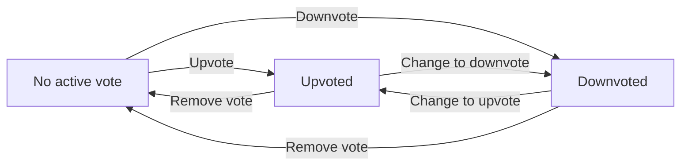

### Removing a Vote Reverts Scoring Impact

- WHEN a user removes their vote entirely from a post, the system MUST revert the post score to undo the original impact of that user’s prior active vote.
- IF a user removes a vote when no active vote exists for that user on the post, THEN the system MUST not change the post score.
- Removing a vote also ends the user’s active vote for the post; subsequent vote actions must be treated as applying a new active vote.

Impact alignment:
- The score change caused by vote removal MUST be the exact inverse of the score change caused by applying the prior vote direction for that post.

### Author Karma Adjustment from Post Votes

- WHEN someone upvotes your post, your karma MUST increase by exactly 1.
- WHEN someone downvotes your post, your karma MUST decrease by exactly 1.
- WHEN someone removes their vote from your post, your karma MUST revert the prior impact by reversing the scoring effect of that vote.
- WHEN a user changes their vote on a post (from upvote to downvote or from downvote to upvote), the author’s karma MUST update so that it reflects the net change between the two vote values.
- Each vote action by another user on your post MUST adjust your karma by exactly 1 in magnitude per net vote direction change.

Negative karma:
- Karma can move negative over time; the system MUST allow karma scores to decrease below zero due to downvotes or vote removals.

Non-interference:
- Karma changes for a post author MUST be attributable to that post’s vote changes, and MUST remain consistent with the displayed vote score for the post.

### Reject Voting on Non-Existing Posts

- IF a user attempts to upvote, downvote, change their vote, or remove their vote for a post that does not exist, THEN the system MUST reject the request.
- Rejected vote attempts MUST NOT change the author’s karma.
- Rejected vote attempts MUST NOT change the post’s vote score.

Edge expectations:
- IF the target post is no longer available to be voted on (e.g., it has been removed), THEN the system MUST treat it as non-existing for purposes of voting and reject the attempt.

## Comment Rules

A comment must be associated with a specific post and is written by a user as the comment author. Users can write a comment on any post they choose to view, and comments contribute to the post’s overall comment count. The system supports nested replies with no depth limit, so a comment reply can itself be replied to repeatedly without an artificial maximum. Authors can edit or delete their own comments, and those actions must update what others see while keeping the remaining comment structure coherent. The rules for comment voting depend on each comment existing as a distinct target, so deleted comments are no longer valid voting targets. A comment must have content to be meaningful and to display in comment lists and sorted views. If a user is banned from a community that contains the post being discussed, they are prevented from creating new comments in that community, so comment creation permission is constrained by the community ban rule. Replies are also subject to the same author identity and community ban constraint for creation. When viewing a post, comments show author, content, vote score, time since posted, and nested replies, meaning the comment relationships must preserve which replies belong under which parent comment. These rules ensure consistent display of nested discussions and consistent ownership for edits and deletions.

### Comment–Post Association

- Every comment created in the system must be associated with exactly one post (defined in the Unit context as “belongs to a post”).
- A user may write a comment only on posts they are viewing or otherwise targeting; each written comment is recorded under the selected post so it contributes to that post’s overall discussion.
- When displaying comments for a specific post, the system must only show comments that are associated with that post; no comments from other posts may appear in that post’s comment list.
- If the target post is not available for viewing (for example, because it does not exist), the comment creation request must be rejected and no comment may be created.

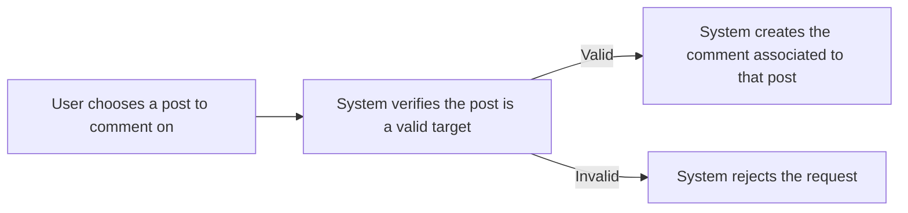

### Writing Comments on Any Post

- Logged-in users can write comments on any post they choose to view.
- Comment creation is allowed regardless of the community subscription status of the user, as long as the user is permitted to create comments in the post’s community (community ban rules apply; see that section).
- When a user submits a comment for a post, the system must associate that comment with the submitting user as the comment’s author.
- If the user’s account is not able to act in the system (for example, account is not logged in), the system must reject the comment creation request.

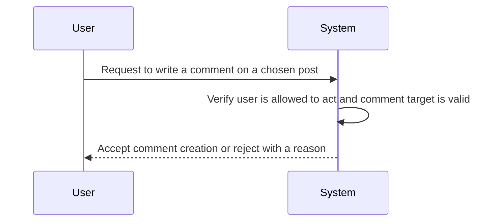

### Nested Replies Without Depth Limit

- Replies can be created under any existing comment, enabling threaded discussion.
- A reply can itself receive replies repeatedly, and the system must not impose any artificial depth limit on nested replies.
- When displaying comments for a post, the system must render the comment thread structure so each reply appears under its correct parent comment.
- If a user attempts to reply to a comment that is not part of the selected post’s discussion thread, the reply creation request must be rejected.

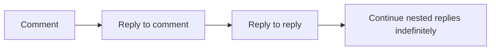

### Only the Comment Author Can Edit

- A comment can be edited only by the comment’s author.
- When a user edits a comment, the system must replace the displayed content for that comment with the updated content while keeping the comment in the same position in the thread.
- If a user who is not the comment’s author attempts to edit a comment, the edit request must be rejected.
- If the comment being edited no longer exists or cannot be referenced, the system must reject the edit request.

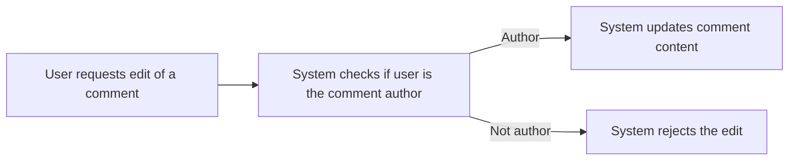

### Only the Comment Author Can Delete

- A comment can be deleted only by the comment’s author.
- When a comment is deleted, the system must ensure the deleted comment is no longer treated as an active comment that can be voted on.
- Deletion must not detach the remaining reply structure from the post discussion; the system must keep the thread display coherent for users viewing the post.
- If a user who is not the comment’s author attempts to delete a comment, the deletion request must be rejected.
- If the comment being deleted no longer exists or cannot be referenced, the system must reject the deletion request.

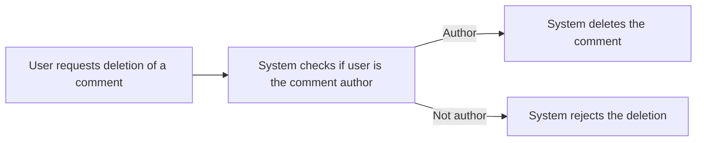

### Comment Content Is Required

- Every comment must include content; a comment without content must be rejected.
- If a user submits an empty or missing comment content, the system must reject the comment creation request.
- The system must display the comment content as part of comment lists and sorted comment views.

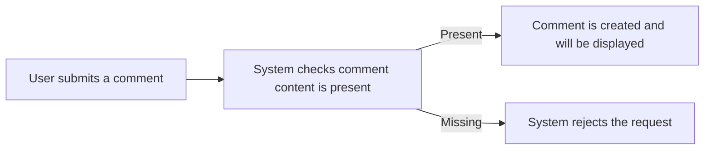

### Community Ban Blocks New Comment Creation

- If a user is banned from a community, the user is prevented from creating new comments in that community.
- Comment creation is therefore blocked when the target post belongs to a community where the user is currently banned.
- The system must enforce this ban for both top-level comments and replies (reply creation follows the same ban rules).
- A banned user can still view content in the community, but any attempt to create a comment must be rejected.

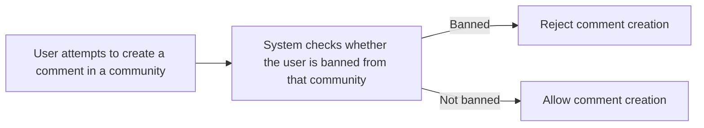

### Reply Creation Follows Same Ban Rules

- Replies are created within the same community as the post being discussed.
- If the author of the reply is banned from that community, the system must reject the reply creation request.
- The ban constraint must apply uniformly whether the reply is a direct reply to an existing comment or a deeper nested reply.

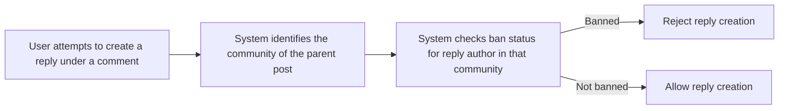

### Deleted Comments Are Not Valid Voting Targets

- Voting on a comment is allowed only while the comment exists as an active voting target.
- After a comment is deleted, it must no longer be eligible for voting.
- If a user attempts to vote on a deleted comment (including changing or removing a vote), the system must reject the request.
- The comment voting logic must therefore treat deleted comments as invalid targets so comment vote score and comment vote displays remain consistent.

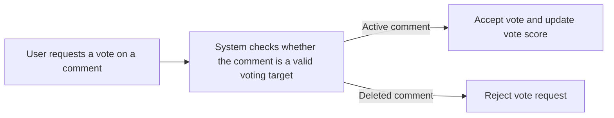

### Comment Display Includes Author, Content, Vote Score, Time, and Replies

- When viewing a post’s comments, each comment must display the author, the comment content, the comment vote score, and the time since the comment was posted.
- The display must include the nested replies under each comment, preserving the parent-child relationships for the thread.
- The system must ensure the displayed vote score corresponds to the current active vote state for that comment.
- Deleted comments must not be shown as normal active content for voting purposes; comment lists and nested replies must remain coherent after deletions.

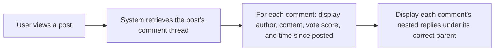

## CommentVote Rules

Comment votes work the same way as post votes, adjusting both the comment’s score and the author’s karma. Each user can have only one active vote per comment, so the system must prevent multiple votes for the same user on the same comment. Upvoting increases the comment’s score and increases the comment author’s karma by 1, while downvoting decreases the score and decreases karma by 1. Users can change their vote from upvote to downvote or vice versa, and this must be reflected as a reversal of the old impact and application of the new impact. Users can also remove their vote entirely, which restores the comment score and author karma as if that vote never existed. The comment vote score used for sorting and display must equal total upvotes minus total downvotes. Voting should only apply to existing comments; attempts to vote after a comment is deleted must not be accepted. If a user tries to submit the same vote state again, the system should treat it as no change rather than creating extra scoring effects. These rules keep karma consistent across both posts and comments and ensure that one-vote-per-target is always enforced.

### One Vote Per Comment Per User

For each comment, the system must maintain the rule that each user can have at most one active vote state at any time.

WHEN a user submits a comment vote for a specific comment, THE system SHALL treat that submission as belonging to exactly one vote state for that user and comment.

IF a user has already cast a vote on that comment and the user submits a new vote action for the same comment, THEN THE system SHALL update the existing vote state rather than creating an additional independent vote that would cause extra scoring.

IF the user submits a vote state that is identical to their current active vote state on that comment, THEN THE system SHALL make no scoring change (the submission is treated as no change rather than creating additional impact).

### Upvote and Karma Impact (+1)

WHEN a user upvotes a comment, THE system SHALL increase that comment’s vote score by 1.

WHEN a user upvotes a comment, THE system SHALL increase the upvoting user’s karma by 1.

WHEN multiple votes exist across many users on the same comment, THE comment’s displayed vote score SHALL reflect the net result of all users’ vote states applied according to the single active vote rule (defined in [One Vote Per Comment Per User]).

IF the user upvotes a comment that is rejected as not voteable (for example, because the comment is deleted), THEN the system SHALL NOT apply the +1 comment-score change and SHALL NOT apply the +1 karma change.

### Downvote and Karma Impact (-1)

WHEN a user downvotes a comment, THE system SHALL decrease that comment’s vote score by 1.

WHEN a user downvotes a comment, THE system SHALL decrease the downvoting user’s karma by 1.

IF the downvote is changed or removed, THEN the system SHALL reverse the prior impact exactly (reversal behavior defined in [Changing Vote Updates Scoring Impact] and [Removing Vote Reverses Scoring Impact]).

IF the user downvotes a comment that is rejected as not voteable (for example, because the comment is deleted), THEN the system SHALL NOT apply the −1 comment-score change and SHALL NOT apply the −1 karma change.

### Changing Vote Updates Scoring Impact

WHEN a user changes their active vote state on a comment from upvote to downvote, THE system SHALL:
- reverse the prior upvote impact (removing its +1 comment-score effect and its +1 karma effect), and then
- apply the downvote impact (adding its −1 comment-score effect and its −1 karma effect).

WHEN a user changes their active vote state on a comment from downvote to upvote, THE system SHALL:
- reverse the prior downvote impact (removing its −1 comment-score effect and its −1 karma effect), and then
- apply the upvote impact (adding its +1 comment-score effect and its +1 karma effect).

IF the user attempts to change their vote state after the comment is deleted, THEN the system SHALL reject the voting action and SHALL not apply any reversal or new impact.

### Removing Vote Reverses Scoring Impact

WHEN a user removes their vote on a comment, THE system SHALL restore the comment’s vote score and karma exactly to the state as if that user’s prior vote never existed.

IF a user’s current active vote state is upvote, THEN removing the vote SHALL reverse the upvote impact by:
- decreasing the comment vote score by 1, and
- decreasing the voter’s karma by 1.

IF a user’s current active vote state is downvote, THEN removing the vote SHALL reverse the downvote impact by:
- increasing the comment vote score by 1, and
- increasing the voter’s karma by 1.

IF the comment is deleted, THEN removing a vote must be rejected as not voteable and must not alter vote score or karma.

### Comment Vote Score Calculation (Upvotes Minus Downvotes)

THE system SHALL compute the comment vote score used for display and sorting as: total upvotes minus total downvotes.

IF a user changes vote state (defined in [Changing Vote Updates Scoring Impact]), THEN the resulting comment vote score SHALL equal the net effect of all users’ active vote states under the one-vote-per-user-per-comment constraint (defined in [One Vote Per Comment Per User]).

IF a user removes their vote (defined in [Removing Vote Reverses Scoring Impact]), THEN the resulting comment vote score SHALL be consistent with the calculation rule: upvotes minus downvotes.

### Karma Can Go Negative for Comment Authors

WHEN comment votes are cast, THE system SHALL apply karma adjustments by 1 per vote action as described in [Upvote and Karma Impact (+1)] and [Downvote and Karma Impact (-1)].

THE system SHALL allow karma to be negative for users whose karma decreases due to downvotes.

IF a user’s karma is already negative, THEN applying further downvote actions SHALL continue to decrease karma without limiting it to zero (negative karma is allowed).

### Reject Voting on Deleted Comments

WHEN a user attempts to vote on a comment that is deleted, THE system SHALL reject the voting action.

IF the system rejects a vote on a deleted comment, THEN the system SHALL NOT change the comment’s vote score and SHALL NOT adjust the voter’s karma.

Any attempt to vote on a deleted comment must be handled as a business rejection of the vote action, consistent with the requirement that voting should only be applied to existing, voteable comments (defined here as "not voteable when deleted").

## Report Rules

A report can be created for either a post or a comment, and it records a reason provided by the reporting user. The reporting reason must be present as text so that moderators have context for what the reporter observed. A report is associated with the community being moderated, meaning reports are viewed and handled by moderators for that community rather than globally. Users must be able to submit reports even if they are not subscribed to the community, as long as they can access the content being reported. Submitting a report should not change the reported content’s vote score, comment count, or display data until a moderator action is taken. Moderators can view all reports for their community, so the platform must ensure reports are retrievable by the correct community scope. Each report must remain dismissible or approvable by moderators, and once a report is dismissed it should be removed from the active report list for that community. If a report is approved, the corresponding post or comment is deleted as part of moderation processing, and the content should no longer appear in normal feeds. Reports must show who reported the content and the reason text, so reporter attribution must be tied to the report. A report without a clear reason should be rejected as invalid to avoid unusable moderation submissions.

### Report submission validation (reason and target)

- A member or guest who submits a report must specify a reason text.
- A report submission with missing or empty reason text must be rejected as invalid.
- A report must target exactly one item type: either a post or a comment.
- A report submission that does not clearly identify whether the target is a post or a comment must be rejected as invalid.
- A report submission must be rejected if the reporting user does not provide a reason text that explains the basis for the report (reason text requirement is used to prevent unusable moderation submissions).
- When a report is submitted successfully, the report is created in a state where it is eligible to be reviewed by moderators of the relevant community.
- The platform must keep the reported item’s basic voting and display counters unchanged at the moment of report submission (submission should not alter vote score, comment count, or the normal display data until a moderator action is taken).

### Community moderation scope for reports

- Every report must be associated with the community being moderated (report handling is within community moderation scope, not global).
- When a report is submitted, the platform must determine the associated community for the targeted post or comment so that the report appears in that community’s moderation view.
- If a targeted post or comment cannot be mapped to a community, the report submission must be rejected.
- Users must be able to submit reports even if they are not subscribed to the associated community, as long as they can access the content being reported.
- A user’s submission location or subscription status must not change the community association used for moderation review.

### Reporter attribution shown on each report

- Each report must display who reported the content.
- Each report must display the reporter’s identity alongside the reported content.
- A report submission that does not include a reporter identity tied to the submitting user must be rejected.

### Impact of report submission on vote score and counts

- Submitting a report must not change the reported post’s or comment’s vote score.
- Submitting a report must not change the reported post’s comment count.
- Submitting a report must not change the reported item’s normal list display details shown to users.
- The only user-visible outcomes of submitting a report prior to moderation are that the report becomes available to moderators for review; the reported content remains visible with its existing score and counts.

### Moderator review access and visibility (by community)

- Moderators must be able to view all reports associated with their community.
- A moderator must not be able to view reports that are associated with a different community.
- The platform must ensure report retrieval honors community scope so that the moderator’s community context is used when listing reports.
- The list of reports shown to moderators must include, for each report, the reported content, the reporter identity, and the reason text.

### Moderator approval behavior: delete reported content

- When a moderator approves a report, the corresponding reported post or comment must be deleted as part of moderation processing.
- After an approved report results in deletion, the deleted post or comment must no longer appear in the normal browsing experiences where it would otherwise be shown.
- An approved report must remain reviewable as historical evidence only in the context of moderation, but the deleted content must not return to normal feeds and lists due to report status alone.
- If the targeted content is already deleted before approval is performed, the moderator action must not recreate or re-display the content; the system must treat approval as having no additional effect on normal browsing beyond ensuring the deletion state is consistent.

### Moderator dismissal behavior: keep reported content and remove report from active list

- When a moderator dismisses a report, the corresponding post or comment must remain unchanged and continue to be displayed normally.
- Dismissed reports must be removed from the active report list for that community.
- After a report is dismissed, the dismissed report should no longer appear in the moderator’s current set of pending/active reports for that community.
- Dismissing a report must not delete or hide the reported content.

### Report status consistency with moderation actions

- Each report must be in one of the moderation outcomes implied by reviewer actions: approved (leading to deletion) or dismissed (leading to retention and removal from the active list).
- A report must not be allowed to be both approved and dismissed; once an outcome has been applied, subsequent conflicting outcomes must be prevented.
- After a report is dismissed, any attempt to dismiss it again must not change the reported content.
- After a report is approved, any attempt to approve it again must not change the normal browsing state beyond what the initial approval already produced.

## CommunityBan Rules

A community ban represents a moderator action that prevents a user from creating posts or comments within a specific community. The ban applies only to the banned community, so the user may continue normal activity in other communities where they are not banned. Bans must be created and removed only under the community’s moderation authority rules, where the owner has highest authority and moderators can manage bans subject to those limits. Moderators can unban users, and an unbanned user regains the ability to create posts and comments in that community (subject to subscription for posting). A banned user cannot create posts or comments in the community even if they are subscribed, but they can still view content from that community. The system must maintain a ban status so that moderation views can show the list of banned users for the community. If a user is banned and later unbanned, the ban status must reflect the change so creation permissions are updated accordingly. Community ban actions must not allow moderators to remove the owner, and ban management between moderators is constrained by the role rules, ensuring that only the owner can remove moderators from authority. These constraints keep the authority model consistent while enforcing the ban’s effects on content creation permissions.

### Ban scope is limited to a single community

- A community ban applies only to the specific community for which it was created (defined in [Community Ban])
- If a user is banned from one community, that ban must not affect the user’s ability to create posts or comments in other communities
- If a user is not banned from a given community, the ban must not block post or comment creation in that community
- When determining whether a user is blocked from creating posts or comments, the system must evaluate the ban status for the target community only
- If the system displays creation availability for a community, it must reflect whether the user is currently banned for that same community
- If a community ban is removed (unbanned), the user must be treated as not banned for that community immediately for subsequent creation actions

### Ban effects: cannot create posts in the banned community

- WHILE a user is currently banned from a community, the user SHALL NOT be able to create posts in that community
- WHILE a user is currently banned from a community, the system SHALL reject any attempt to create a post in that community
- If a banned user is subscribed to the community, subscription alone SHALL NOT override the ban restriction on creating posts
- If a user is unbanned from the community, the user SHALL regain the ability to create posts in that community, subject to the subscription requirement for posting
- If a banned user attempts to create a post in a community where they are banned, the system SHALL treat the action as disallowed due to the ban (defined in [Community Ban])
- If a user attempts to create a post in a community where they are not banned, the system SHALL evaluate post creation eligibility based on the subscription requirement rather than ban status

### Ban effects: cannot create comments in the banned community

- WHILE a user is currently banned from a community, the user SHALL NOT be able to write comments in that community’s posts
- WHILE a user is currently banned from a community, the system SHALL reject any attempt to write a comment associated with a post in that community
- If a banned user attempts to reply to a comment that belongs to a post in the banned community, the system SHALL reject the attempt
- If a banned user attempts to create any comment activity tied to that community, the ban restriction SHALL apply regardless of the user’s subscription status
- If a user is unbanned from the community, the user SHALL regain the ability to write comments in that community’s posts, subject to the subscription requirement for creating content in that community
- If a banned user attempts comment actions in other communities where they are not banned, the system SHALL NOT apply this community ban restriction

### Banned users can still view content from the community

- WHILE a user is currently banned from a community, the user SHALL still be able to view content (posts and comments) from that community
- The ban SHALL NOT prevent browsing community feeds or the ability to view a specific post or its associated comments in that community
- If a banned user navigates to a community page or community feed, the system SHALL still present community content normally
- If a banned user attempts viewing content that belongs to the banned community, the system SHALL allow access and SHALL NOT apply the ban as a viewing restriction
- If a banned user attempts content creation (posts or comments), the system SHALL apply the ban restriction even though viewing remains allowed

### Unbanning restores creation permissions and re-evaluates subscription requirement

- WHEN a moderator unbans a user from a community, the user SHALL be treated as not banned for that community
- After unbanning, the user SHALL be allowed to create posts and comments in that community only when the user satisfies the posting eligibility requirement (defined in [CommunitySubscription Rules])
- Subscription requirement still controls post creation after unban (defined in [CommunitySubscription Rules])
- If a user is unbanned but is not subscribed to the community, the system SHALL reject attempts to create posts in that community due to missing subscription eligibility
- If a user is unbanned and is subscribed to the community, the system SHALL allow attempts to create posts and comments in that community
- If a user becomes banned again after unbanning, the system SHALL again block post and comment creation in that community starting from the ban’s effective time

### Moderator visibility: banned users list is available to community moderators under authority

- Moderators SHALL be able to view the list of banned users for the communities they have moderation authority over (defined in [Community Moderation])
- WHILE a user is a moderator of a community, the system SHALL present the current set of users banned in that community
- The banned users list presented to moderators SHALL reflect the current ban status (including users who have been unbanned)
- If a user is not a moderator of a community, the system SHALL NOT expose the banned users list for that community
- The owner of a community SHALL be able to view the banned users list (defined in [Community Moderation])

### Moderation authority limits govern ban actions, with owner as highest authority

- WHEN the system processes a ban action (ban or unban), the system SHALL ensure the actor has moderation authority for that target community (defined in [Community Moderation])
- The community owner SHALL have the highest authority for moderation actions in the community (defined in [Community Moderation])
- Moderators SHALL be allowed to manage bans in the community subject to the role limits defined for moderation authority (defined in [Community Moderation])
- The system SHALL prevent ban management actions that would violate moderation authority limits (defined in [Community Moderation]), including cases where the actor does not have permission
- Moderators can unban users; therefore the system SHALL allow authorized moderators to remove a ban for a user in their community
- Moderators cannot remove the owner; therefore moderation authority checks for ban actions SHALL still respect that authority model when determining whether a moderation actor is allowed to perform the requested ban management operation
- If a ban action is attempted by an actor without the required moderation authority for the community, the system SHALL reject the action

# Data Browsing Expectations

Business expectations for how users browse, find, and navigate through lists of data.

## List Browsing Expectations

Define business expectations for how users find, filter, and browse lists.

### Post Feed Filtering Rules (Top Time Filters and Feed Availability)

Users can browse posts in three feed types: Home, Popular, and Community.

Home Feed availability:
- While the user is logged in, the system shows only posts from communities the user is subscribed to.
- While the user is logged out, the system does not provide the Home Feed.

Popular Feed availability:
- While the user is logged in or logged out, the system shows posts from all communities across the platform.

Community Feed availability:
- While the user is logged in or logged out, the system shows posts from one specific community.

All feeds support the same sorting options, and when the “Top” sorting option is used, the system requires a time filter selected from the following options:
- today
- this week
- this month
- this year
- all time

When “Top” sorting is selected, the feed contains only posts whose posting time falls within the selected time filter window.

If a user requests a feed with an unsupported time filter value, the system rejects the request and does not show results for that feed request.

### Post Feed Sorting Rules (Hot, New, Top, Controversial)

All three feeds (Home Feed, Popular Feed, and Community Feed) support the following sorting options, and the chosen sorting option determines the order of posts in the feed list.

Hot sorting:
- When “Hot” sorting is selected, the system orders posts such that more recent posts with many upvotes appear first.

New sorting:
- When “New” sorting is selected, the system orders posts so that the most recently created posts appear first.

Top sorting:
- When “Top” sorting is selected, the system orders posts by highest vote score first.
- The vote score used for ordering is based on the net effect of upvotes and downvotes.
- When “Top” sorting is selected, the ordering respects the chosen time filter (today, this week, this month, this year, all time), so only posts within that time filter are eligible to be displayed.

Controversial sorting:
- When “Controversial” sorting is selected, the system orders posts such that posts with many votes but a score close to zero appear first.

If a user requests sorting with a value other than Hot, New, Top, or Controversial, the system rejects the request and does not show results for that feed request.

If a user switches sorting options between feed requests, the system re-orders the results according to the newly selected sorting option.

### Pagination Rules for Feed Lists

All three feeds (Home Feed, Popular Feed, and Community Feed) are paginated.

- When browsing a feed, the system displays results in pages.
- The ordering of posts used for pagination is determined by the currently selected sorting option, and for “Top” also by the selected time filter.

When a user requests a specific page of a feed:
- The system returns a page of posts consistent with the selected feed type (Home/Popular/Community), the selected sorting option, and any selected “Top” time filter.

- If a requested page has no results because there are not enough posts under the selected feed type and filters, the system returns an empty results set for that page rather than mixing in posts from other sorting or filter selections.

- If a user requests a negative or otherwise invalid page selection, the system rejects the request.

### Community Search Filtering Rules

Users can search for communities by name.

- When a user performs a community search, the system returns communities whose names match the user’s search input.
- The search applies to community names only.

- If the user’s search input does not match any community names, the system returns an empty results set.

- The system supports browsing communities in a list, and search results are presented as part of that list browsing experience rather than replacing the community list entirely.

If a user performs a community search while the search input is missing or blank, the system rejects the request for community search.

### Comment Sorting Rules within a Post (Best, New, Controversial)

Comments on a post can be sorted by:
- Best: highest vote score first
- New: most recent first
- Controversial: many votes but score close to zero

When a user views a post and requests comments sorted by “Best”:
- The system orders comments so that comments with higher vote scores appear earlier.

When a user requests comments sorted by “New”:
- The system orders comments so that the most recently posted comments appear earlier.

When a user requests comments sorted by “Controversial”:
- The system orders comments so that comments with many votes but a score close to zero appear earlier.

If a user requests comment sorting with a value other than Best, New, or Controversial, the system rejects the request for comment sorting.

# Error Conditions

Business error scenarios and how the system should respond.

## Error Scenarios

Describe error conditions and expected system responses in natural language.

### Error Handling for Account Deletion and Vote Impact Recalculation

### Account Deletion: rejection and exception behavior

WHEN a user requests to delete their account, THE system SHALL reject the request if the user is not currently signed in.

IF the account deletion request cannot be completed for any reason, THEN the system SHALL return an error to the user and SHALL NOT partially delete the user’s authored posts or comments.

WHEN the account deletion request is approved, THE system SHALL delete the user’s posts and comments they authored.

### Vote Impact Recalculation: failure-case handling

IF a user removes their vote on a post, THEN the system SHALL adjust the post’s vote score so that it reflects the removed vote.

IF a user removes their vote on a comment, THEN the system SHALL adjust the comment’s vote score so that it reflects the removed vote.

IF vote removal is requested but the user has no existing vote for that target, THEN the system SHALL reject the request.

### Exception behavior for non-existent targets

IF a vote action (upvote, downvote, change, or remove) is requested for a post that no longer exists, THEN the system SHALL reject the request.

IF a vote action (upvote, downvote, change, or remove) is requested for a comment that no longer exists, THEN the system SHALL reject the request.

### Authorization failure-case

IF a user attempts to edit or delete a post they do not own, THEN the system SHALL reject the request.

IF a user attempts to edit or delete a comment they do not own, THEN the system SHALL reject the request.

### Error Handling for Community Creation, Subscription, and Post Creation Constraints

### Community Creation validation: rejection and failure-case

IF a user attempts to create a community while a community with the same name already exists, THEN the system SHALL reject the request.

IF a user attempts to create a community without providing a description text, THEN the system SHALL reject the request.

IF a user attempts to create a community without providing an icon image, THEN the system SHALL reject the request.

### Subscription constraints and reversible behavior

IF a user attempts to subscribe to a community that they are already subscribed to, THEN the system SHALL reject the request.

IF a user attempts to unsubscribe from a community they are not subscribed to, THEN the system SHALL reject the request.

WHEN a user unsubscribes from a community, THE system SHALL stop that user’s ability to create new posts in that community, while still allowing the user to view existing content.

### Post creation dependency on subscription

IF a user attempts to create a post in a community they are not subscribed to, THEN the system SHALL reject the request.

### Failure-case for missing referenced community

IF a user attempts to create a post in a community that does not exist, THEN the system SHALL reject the request.

### Error Handling for Post Types, Commenting, Replies, and Editing/Deletion Ownership

### Post creation: rejection by missing or mismatched content

IF a user creates a post with a missing title, THEN the system SHALL reject the request.

IF a user creates a text post without text content, THEN the system SHALL reject the request.

IF a user creates a link post without a URL, THEN the system SHALL reject the request.

IF a user creates an image post without an uploaded image, THEN the system SHALL reject the request.

### Post editing and deletion: rejection and authorization exception

IF a user attempts to edit a post they do not own, THEN the system SHALL reject the request.

IF a user attempts to delete a post they do not own, THEN the system SHALL reject the request.

### Comment creation: rejection by invalid target

IF a user attempts to write a comment on a post that does not exist, THEN the system SHALL reject the request.

### Reply nesting: exception handling for invalid parent comment

IF a user attempts to reply to a comment that does not exist, THEN the system SHALL reject the request.

### Comment editing and deletion: rejection and ownership

IF a user attempts to edit a comment they do not own, THEN the system SHALL reject the request.

IF a user attempts to delete a comment they do not own, THEN the system SHALL reject the request.

### Exception behavior for deleted content being acted upon

IF a user attempts to write a reply to a comment that has been deleted or removed from the thread, THEN the system SHALL reject the request.

### Error Handling for Voting Rules and One-Vote-Per-User Enforcement

### Post voting rejection rules

IF a signed-in user attempts to upvote a post they have already upvoted, THEN the system SHALL reject the request.

IF a signed-in user attempts to downvote a post they have already downvoted, THEN the system SHALL reject the request.

### Vote change behavior: failure-case handling

IF a signed-in user requests to change from an upvote to a downvote on a post, THEN the system SHALL update the vote so the score reflects the new single vote.

IF a signed-in user requests to change from a downvote to an upvote on a post, THEN the system SHALL update the vote so the score reflects the new single vote.

### Post vote removal rejection rules

IF a signed-in user requests to remove a vote from a post but the user has no vote on that post, THEN the system SHALL reject the request.

### Comment voting rejection rules

IF a signed-in user attempts to upvote a comment they have already upvoted, THEN the system SHALL reject the request.

IF a signed-in user attempts to downvote a comment they have already downvoted, THEN the system SHALL reject the request.

### Comment vote change and removal

IF a signed-in user requests to change their vote from upvote to downvote on a comment, THEN the system SHALL update the vote so the comment score reflects the new single vote.

IF a signed-in user requests to change their vote from downvote to upvote on a comment, THEN the system SHALL update the vote so the comment score reflects the new single vote.

IF a signed-in user requests to remove a vote from a comment but the user has no vote on that comment, THEN the system SHALL reject the request.

### Error Handling for Feed Browsing, Sorting, and Pagination Parameters

### Feed availability based on login state

IF a user who is not logged in attempts to view the Home Feed, THEN the system SHALL reject the request.

WHEN a user views the Popular Feed, THEN the system SHALL allow access to logged-out users.

WHEN a user views a Community Feed, THEN the system SHALL allow access to logged-out users.

### Sorting option rejection

IF a user requests a feed sorting option that is not one of: Hot, New, Top, or Controversial, THEN the system SHALL reject the request.

### Top time filter rejection

IF a user requests Top sorting without selecting one of the supported time filters (today, this week, this month, this year, all time), THEN the system SHALL reject the request.

### Controversial sorting behavior: failure-case

IF a feed is requested with Controversial sorting, THEN the system SHALL order posts according to the rule that posts with many votes but score close to zero appear first.

### Community Feed invalid community

IF a user requests a Community Feed for a community that does not exist, THEN the system SHALL reject the request.

### Pagination exception behavior

IF a user requests pagination in a way that results in an invalid paging request, THEN the system SHALL reject the request.

IF a user requests a page number beyond the available range for the requested feed, THEN the system SHALL return an empty list of posts rather than causing an error.

### Error Handling for Comment Sorting on a Post

### Sorting options rejection

IF a user requests comment sorting on a post using a sorting option that is not one of: Best, New, or Controversial, THEN the system SHALL reject the request.

### Comment sorting failure-case for invalid post

IF a user requests comment sorting for a post that does not exist, THEN the system SHALL reject the request.

### Controversial comment sorting behavior: exception handling

IF comments are displayed with Controversial sorting, THEN the system SHALL order comments so that those with many votes but score close to zero appear first.

### New comment sorting behavior

IF comments are displayed with New sorting, THEN the system SHALL order comments by most recently posted first.

### Best comment sorting behavior

IF comments are displayed with Best sorting, THEN the system SHALL order comments by highest vote score first.

### Error Handling for Community Moderation Actions and Ban State Enforcement

### Moderator role authorization failures: rejection

IF an actor who is not the community owner and not a community moderator attempts to perform moderator actions, THEN the system SHALL reject the request.

### Owner vs moderator constraints

IF a moderator attempts to remove the community owner, THEN the system SHALL reject the request.

IF a moderator attempts to remove another moderator, THEN the system SHALL reject the request.

### Ban action failure-cases

IF a moderator attempts to ban a user who is not a valid user, THEN the system SHALL reject the request.

IF a moderator attempts to ban a user who is already banned in that community, THEN the system SHALL reject the request.

IF a moderator attempts to unban a user who is not currently banned in that community, THEN the system SHALL reject the request.

### Ban enforcement on content creation

IF a banned user attempts to create a post in the community from which they are banned, THEN the system SHALL reject the request.

IF a banned user attempts to write a comment in the community from which they are banned, THEN the system SHALL reject the request.

### Ban scoping exception behavior

IF a user is banned in one community, THEN the system SHALL allow them to create posts and comments in other communities (unless banned there as well).

### Viewing banned users list authorization failure

IF an actor attempts to view the list of banned users without being an owner or a moderator of that community, THEN the system SHALL reject the request.

### Error Handling for Reporting and Report Review Outcomes

### Reporting target validation: rejection

IF a user attempts to report content that does not exist, THEN the system SHALL reject the request.

IF a user attempts to report a post or comment that is not within a community context the system can associate with the target, THEN the system SHALL reject the request.

### Report reason requirements: rejection

IF a user submits a report without providing a reason text, THEN the system SHALL reject the request.

### Report viewing authorization

IF an actor attempts to view reports for a community without being an owner or a moderator of that community, THEN the system SHALL reject the request.

### Report review: moderator approval vs dismissal

WHEN a moderator approves a report, THEN the system SHALL delete the reported content.

WHEN a moderator dismisses a report, THEN the system SHALL keep the reported content and remove the report from the report list.

### Failure-case for reviewing missing reports

IF a moderator attempts to review a report that no longer exists in the report list, THEN the system SHALL reject the request.

### Exception: report submission does not immediately alter vote score or comment/post counts

WHEN a user submits a report, THEN the system SHALL not change the vote score of the reported content and SHALL not change the reported content’s comment count (for posts) as an immediate effect of submission.