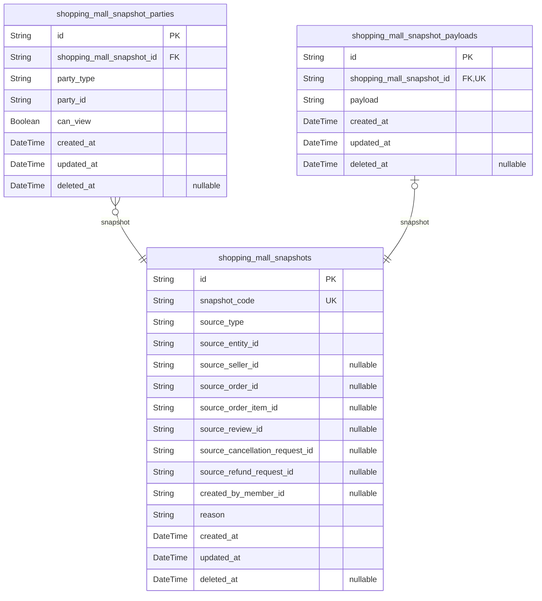
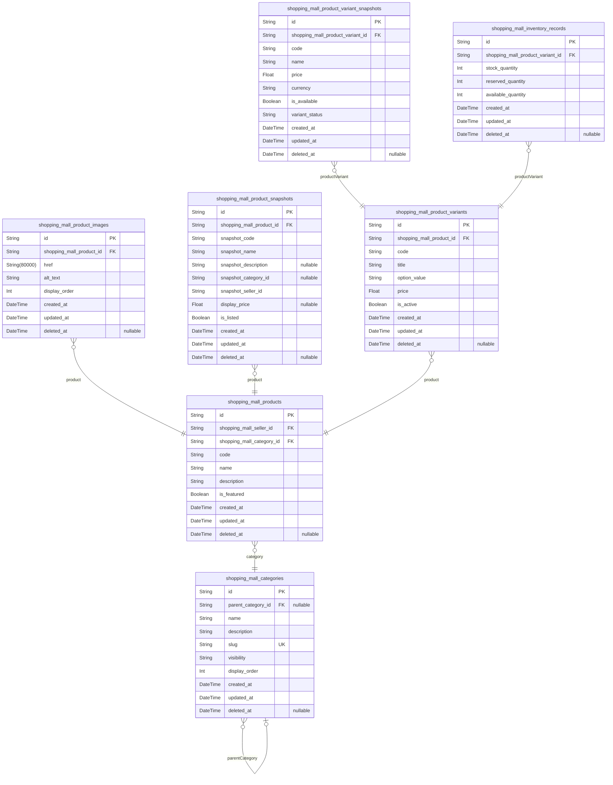
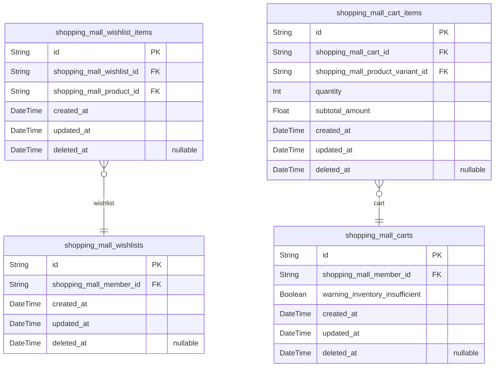
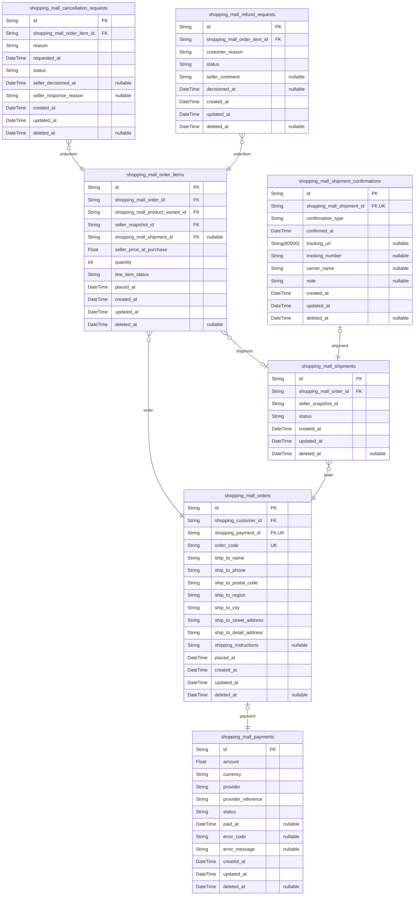
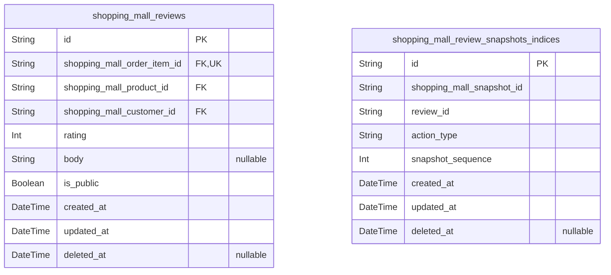
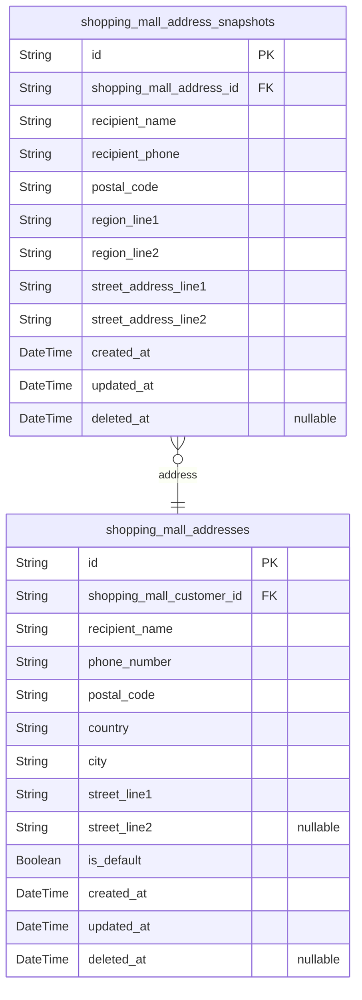

# Prisma Markdown

> Generated by [`prisma-markdown`](https://github.com/samchon/prisma-markdown)

- [Actors](#actors)
- [Systematic](#systematic)
- [Catalog](#catalog)
- [Shopping](#shopping)
- [Orders](#orders)
- [Reviews](#reviews)
- [Address](#address)

## Actors

```mermaid
erDiagram
"shopping_mall_guests" {
  String id PK
  String fingerprint UK
  DateTime created_at
  DateTime updated_at
  DateTime deleted_at "nullable"
}
"shopping_mall_guest_sessions" {
  String id PK
  String shopping_mall_guest_id FK
  String ip
  String(80000) href
  String(80000) referrer
  DateTime created_at
  DateTime updated_at
  DateTime deleted_at "nullable"
  DateTime expired_at
}
"shopping_mall_members" {
  String id PK
  String email UK
  String password_hash
  DateTime created_at
  DateTime updated_at
  DateTime deleted_at "nullable"
}
"shopping_mall_member_sessions" {
  String id PK
  String shopping_mall_member_id FK
  String ip
  String(80000) href
  String(80000) referrer
  DateTime created_at
  DateTime expired_at
}
"shopping_mall_member_password_resets" {
  String id PK
  String shopping_mall_member_id FK
  String token
  DateTime expires_at
  DateTime used_at "nullable"
  DateTime created_at
  DateTime updated_at
  DateTime deleted_at "nullable"
}
"shopping_mall_member_email_verifications" {
  String id PK
  String shopping_mall_member_id FK
  String token UK
  DateTime expires_at
  DateTime used_at "nullable"
  DateTime created_at
  DateTime updated_at
  DateTime deleted_at "nullable"
}
"shopping_mall_member_oauth_connections" {
  String id PK
  String shopping_mall_member_id FK
  String provider
  String provider_user_id
  String display_name "nullable"
  String email "nullable"
  String(80000) profile_url "nullable"
  DateTime created_at
  DateTime updated_at
  DateTime deleted_at "nullable"
}
"shopping_mall_admins" {
  String id PK
  String email UK
  String password_hash
  DateTime created_at
  DateTime updated_at
  DateTime deleted_at "nullable"
}
"shopping_mall_admin_sessions" {
  String id PK
  String shopping_mall_admin_id FK
  String ip
  String(80000) href
  String(80000) referrer
  DateTime created_at
  DateTime expired_at
  DateTime updated_at
  DateTime deleted_at "nullable"
}
"shopping_mall_admin_password_resets" {
  String id PK
  String shopping_mall_admins_id FK
  String token UK
  DateTime expires_at
  DateTime created_at
  DateTime updated_at
  DateTime deleted_at "nullable"
}
"shopping_mall_guest_sessions" }o--|| "shopping_mall_guests" : guest
"shopping_mall_member_sessions" }o--|| "shopping_mall_members" : member
"shopping_mall_member_password_resets" }o--|| "shopping_mall_members" : member
"shopping_mall_member_email_verifications" }o--|| "shopping_mall_members" : member
"shopping_mall_member_oauth_connections" }o--|| "shopping_mall_members" : member
"shopping_mall_admin_sessions" }o--|| "shopping_mall_admins" : admin
"shopping_mall_admin_password_resets" }o--|| "shopping_mall_admins" : admin
```

### `shopping_mall_guests`

Stores temporary anonymous guest accounts identified by a device
fingerprint for unauthenticated browsing and limited participation where
allowed. Each record represents a single guest identity used across
requests until it is soft-deleted.

Properties as follows:

- `id`: Primary Key.
- `fingerprint`
  > Stable device fingerprint used to identify the same anonymous guest
  > across requests.
- `created_at`: When the guest identity was created.
- `updated_at`: When the guest identity record was last updated.
- `deleted_at`: When the guest identity was soft-deleted.

### `shopping_mall_guest_sessions`

Temporary guest session tokens used to keep anonymous visitors
authenticated for guest-only browsing and guest access boundaries. Stores
connection metadata (IP and referrer context) and session expiration to
support secure session usage and auditability.

Properties as follows:

- `id`: Primary Key.
- `shopping_mall_guest_id`: Belonged guest [shopping_mall_guests.id](#shopping_mall_guests).
- `ip`: Client IP address captured at session establishment.
- `href`: Request URL or origin link captured when the session was established.
- `referrer`: HTTP referrer URL captured when the session was established.
- `created_at`: Session creation timestamp.
- `updated_at`: Session last update timestamp.
- `deleted_at`: Soft delete timestamp for session records.
- `expired_at`: When the session expires and should be considered invalid.

### `shopping_mall_members`

Registered member accounts for authenticated customer/seller access. This
table stores the canonical login identity (email) and password credential
hash for members; it is the parent for member sessions and account
recovery flows handled by separate tables in the Actors component.

Properties as follows:

- `id`: Primary Key.
- `email`: Unique email address used as the login identifier for member accounts.
- `password_hash`: Hashed password credential for authenticating the member account.
- `created_at`: When this member account record was created.
- `updated_at`: When this member account record was last updated.
- `deleted_at`
  > Soft delete timestamp. When set, the member is treated as
  > deleted/disabled while keeping historical records.

### `shopping_mall_member_sessions`

JWT session tokens for authenticated member access. Each record stores
connection metadata (IP and referring URLs) for auditing and security,
and defines when the session expires.

Properties as follows:

- `id`: Primary Key.
- `shopping_mall_member_id`: Belonged member's [shopping_mall_members.id](#shopping_mall_members).
- `ip`: IP address used when establishing the session.
- `href`
  > The URL (href) that the client attempted to access when creating the
  > session.
- `referrer`
  > The HTTP referrer URL (if any) associated with the session creation
  > request.
- `created_at`: Session creation timestamp.
- `expired_at`
  > Session expiration timestamp; after this time the session must be treated
  > as invalid.

### `shopping_mall_member_password_resets`

Stores password reset tokens issued to member accounts for account
recovery. Each record ties a reset token to exactly one member and
includes an expiration timestamp so the system can invalidate old tokens.
Soft deletion is supported via deleted_at, and the token is typically
one-time-use and becomes unusable after successful reset.

Properties as follows:

- `id`: Primary Key.
- `shopping_mall_member_id`: Belonged member's [shopping_mall_members.id](#shopping_mall_members).
- `token`
  > Opaque reset token presented by the member to verify the password reset
  > request.
- `expires_at`: When this reset token becomes invalid.
- `used_at`
  > Timestamp when the token was successfully used for resetting the
  > password. Null means unused.
- `created_at`: Record creation time.
- `updated_at`: Record last update time.
- `deleted_at`
  > Soft delete timestamp. If set, this reset token record is treated as
  > deleted/invalid.

### `shopping_mall_member_email_verifications`

Email verification tokens issued to members to confirm ownership of their
registration email address.

This table stores token values along with expiration timestamps and
belongs to [shopping_mall_members](#shopping_mall_members). Verification logic should treat
non-expired, non-deleted tokens as eligible; once used (by application
logic), the token record may be soft-deleted to prevent reuse.

Properties as follows:

- `id`: Primary Key.
- `shopping_mall_member_id`
  > Belonged member’s {@link
  > shopping_mall_member_email_verifications.shopping_mall_member_id} points
  > to [shopping_mall_members.id](#shopping_mall_members).
- `token`
  > Opaque email verification token value presented by the user to confirm
  > email ownership.
- `expires_at`: When this verification token becomes invalid.
- `used_at`
  > Timestamp when this token was successfully used for verification. Null
  > means the token has not been used yet.
- `created_at`: Record creation time.
- `updated_at`: Record last update time.
- `deleted_at`
  > Soft delete timestamp to disable tokens after use or cancellation per
  > retention policy.

### `shopping_mall_member_oauth_connections`

Stores optional OAuth/OpenID Connect provider connections for a
registered member account. Each connection links the member to a specific
external identity using the provider identifier and the provider-side
user id, enabling account linking during login.

Properties as follows:

- `id`: Primary Key.
- `shopping_mall_member_id`: Belonged member connection owner [shopping_mall_members.id](#shopping_mall_members).
- `provider`: OAuth/OpenID Connect provider identifier (e.g., 'google', 'github').
- `provider_user_id`
  > User id provided by the OAuth provider for this member connection
  > (provider-scoped).
- `display_name`
  > Display name retrieved from the OAuth provider at the time of linking
  > (may change over time).
- `email`
  > Email retrieved from the OAuth provider at the time of linking (may be
  > null depending on provider/consent).
- `profile_url`: Profile URL at the OAuth provider, if provided during linking.
- `created_at`: Record creation timestamp.
- `updated_at`: Record last update timestamp.
- `deleted_at`: Soft delete timestamp. Null means the connection is active.

### `shopping_mall_admins`

Administrator account records for platform governance and elevated access.

These accounts store the canonical administrator identity and
authentication credentials (email and password hash). Administrator
lifecycle operations (create, update profile/credentials, soft delete,
and account access restrictions) are managed through this table, while
login session tokens and password reset tokens are handled in dedicated
child tables: [shopping_mall_admin_sessions](#shopping_mall_admin_sessions) and {@link
shopping_mall_admin_password_resets}.

Properties as follows:

- `id`: Primary Key.
- `email`
  > Administrator login email address. Must be unique across all
  > administrator accounts.
- `password_hash`
  > BCrypt/argon2 (or equivalent) hash of the administrator password used for
  > authentication.
- `created_at`: Timestamp when the administrator account was created.
- `updated_at`: Timestamp when the administrator account was last updated.
- `deleted_at`
  > Soft delete timestamp. When set, the administrator account is considered
  > deleted/disabled.

### `shopping_mall_admin_sessions`

Stores JWT session tokens and connection context for administrator
authentication.

Each record represents an active or historical login session for an
[shopping_mall_admins.id](#shopping_mall_admins) administrator account. The table is used
to track session validity boundaries via expired_at and to retain
connection context (ip, href, referrer) for auditing and troubleshooting.

Properties as follows:

- `id`: Primary Key.
- `shopping_mall_admin_id`: Belonged administrator's [shopping_mall_admins.id](#shopping_mall_admins). (Session owner.)
- `ip`: IP address used when establishing the session.
- `href`: Requested URL (href) at the time the session was established.
- `referrer`: Referrer URL (referrer) associated with the session establishment request.
- `created_at`: Time when the session was created.
- `expired_at`
  > Expiration time of the session. Sessions after this time should be
  > treated as invalid.
- `updated_at`: Time when this record was last updated.
- `deleted_at`: Soft delete timestamp. Null means the session record is not soft-deleted.

### `shopping_mall_admin_password_resets`

Stores password reset tokens for administrator accounts, including the
token value and its expiration time. This table supports secure account
recovery by allowing administrators to request a reset and then redeem
the token before it expires. Records may be soft-deleted after use or
after cleanup without breaking referential integrity.

Properties as follows:

- `id`: Primary Key.
- `shopping_mall_admins_id`
  > Belonged administrator account referenced by {@link
  > shopping_mall_admins.id}.
- `token`: Opaque reset token used to authenticate the password reset attempt.
- `expires_at`
  > When this reset token becomes invalid. Token-based reset must be
  > completed before this time.
- `created_at`: Record creation timestamp.
- `updated_at`: Record last update timestamp.
- `deleted_at`
  > Soft delete timestamp. Set when the token is revoked or removed from
  > active use.

## Systematic

### `shopping_mall_snapshots`

Generic immutable snapshot records for capturing point-in-time states of
multiple editable domain concepts for audit and dispute resolution. Each
snapshot stores the source discriminator and the minimal linkage keys
back to the originating editable entity (e.g., product, product variant,
order item, review, cancellation request, refund request), while the
snapshot content is stored separately via other snapshot payload tables
in the Systematic component.

Properties as follows:

- `id`: Primary Key.
- `snapshot_code`
  > Human-readable identifier/code for the snapshot record for referencing in
  > logs, UIs, and dispute resolution workflows.
- `source_type`
  > Discriminator for which domain concept this snapshot represents (e.g.,
  > product, product_variant, order_item, review, cancellation_request,
  > refund_request).
- `source_entity_id`
  > The primary key of the source entity instance that this snapshot captures
  > at creation time.
- `source_seller_id`
  > Optional seller linkage for snapshots that are seller-contextual (e.g.,
  > order-item purchase context where the seller snapshot at purchase time is
  > relevant).
- `source_order_id`
  > Optional order linkage for snapshots related to order state (e.g., order
  > item or associated disputes).
- `source_order_item_id`
  > Optional order-item linkage for snapshots related to an individual
  > purchased line item.
- `source_review_id`: Optional review linkage for snapshots related to a review edit history.
- `source_cancellation_request_id`
  > Optional cancellation request linkage for snapshots related to
  > cancellation workflows.
- `source_refund_request_id`: Optional refund request linkage for snapshots related to refund workflows.
- `created_by_member_id`
  > Optional reference to the member that initiated the change captured by
  > this snapshot (when applicable for dispute context).
- `reason`
  > Business reason/category describing why this snapshot was created (e.g.,
  > edit, workflow transition, dispute creation).
- `created_at`
  > Snapshot creation timestamp. Used for historical ordering and dispute
  > timelines.
- `updated_at`
  > Last update timestamp for the snapshot record metadata (payload/content
  > tables are managed separately).
- `deleted_at`
  > Soft-delete timestamp for the snapshot record metadata, if the system
  > needs to hide invalidated snapshots while preserving referential
  > integrity.

### `shopping_mall_snapshot_parties`

Junction table that defines which parties are allowed to view a given
snapshot for dispute resolution. Each row represents one visibility
relationship between a snapshot and a single party reference (e.g., an
owner reference or an admin visibility entry).

Properties as follows:

- `id`: Primary Key.
- `shopping_mall_snapshot_id`
  > Snapshot that this party visibility entry belongs to {@link
  > shopping_mall_snapshots.id}.
- `party_type`
  > Discriminator for what kind of party the stored party_id refers to (e.g.,
  > 'owner' for snapshot owner reference, 'admin' for administrative
  > visibility).
- `party_id`
  > Identifier of the party that can view the snapshot. The meaning depends
  > on party_type.
- `can_view`: Whether the party is allowed to view the snapshot.
- `created_at`: Creation timestamp of this visibility relationship.
- `updated_at`: Last update timestamp of this visibility relationship.
- `deleted_at`
  > Soft delete timestamp; when set, the visibility relationship is treated
  > as removed.

### `shopping_mall_snapshot_payloads`

Stores the optional payload content for a single {@link
shopping_mall_snapshots.id} snapshot record. This table exists to keep
snapshot content separate from snapshot metadata and to support flexible
payload storage tied strictly 1:1 to a snapshot.

Properties as follows:

- `id`: Primary Key.
- `shopping_mall_snapshot_id`
  > Belonged snapshot [shopping_mall_snapshots.id](#shopping_mall_snapshots) that this payload
  > content is attached to.
- `payload`: Serialized snapshot payload content associated with the snapshot record.
- `created_at`: Creation timestamp for this payload record.
- `updated_at`: Last update timestamp for this payload record.
- `deleted_at`: Soft deletion timestamp for this payload record.

## Catalog

### `shopping_mall_categories`

Product category hierarchy and customer browsing visibility for the catalog.

Each category can optionally have a single parent category to enable
one-level nesting. The visibility state controls whether customers can
browse the category in listings and search. Products reference categories
for organization, so categories are used as primary lookup points for
filtering and storefront navigation.

This table supports soft deletion via deleted_at so categories can be
hidden without breaking historical references from products and
snapshots.

Properties as follows:

- `id`: Primary Key.
- `parent_category_id`
  > Optional parent category enabling one-level nesting. When set, this
  > category is a child of the parent category.
- `name`: Human-readable category name shown to customers.
- `description`: Short category description used to provide context in the storefront.
- `slug`: URL-safe identifier for the category, used for stable links and routing.
- `visibility`
  > Controls customer browsing visibility for this category (e.g., active vs
  > hidden).
- `display_order`: Ordering value used to sort categories within the same parent scope.
- `created_at`: Record creation timestamp.
- `updated_at`: Record last update timestamp.
- `deleted_at`
  > Soft delete timestamp. When set, the category is treated as
  > removed/hidden.

### `shopping_mall_product_images`

Stores image entries that belong to a specific product for storefront
display.

Each row represents one product image asset (e.g., a cover image or
gallery image) associated with exactly one product. Images can be
soft-deleted so the product can keep historical associations while hiding
images from active storefront listings.

This table is a dependent asset of [shopping_mall_products](#shopping_mall_products); its
lifecycle is managed in the context of product creation and editing, and
it typically does not require independent standalone CRUD operations
beyond product management flows.

Properties as follows:

- `id`: Primary Key.
- `shopping_mall_product_id`: Belonged product's [shopping_mall_products.id](#shopping_mall_products).
- `href`
  > Public URL/URI of the product image asset to be rendered on the
  > storefront.
- `alt_text`
  > Alternative text for the image for accessibility and improved storefront
  > rendering.
- `display_order`
  > Sort order among images of the same product; lower values are displayed
  > earlier.
- `created_at`: Creation timestamp.
- `updated_at`: Last update timestamp.
- `deleted_at`
  > Soft delete timestamp; when set, the image is hidden from active
  > storefront listings.

### `shopping_mall_products`

Seller-owned products that are organized under a category for storefront
listing and search. Sellers create and update product information; the
platform can soft-delete products to hide them from customer browsing
while preserving historical references for related entities like product
variants and snapshots.

This table stores only product-level attributes. Variant definitions,
images, and immutable history snapshots are stored in separate tables
handled by other components.

Properties as follows:

- `id`: Primary Key.
- `shopping_mall_seller_id`: Belonged seller's [shopping_mall_members.id](#shopping_mall_members).
- `shopping_mall_category_id`: Belonged category's [shopping_mall_categories.id](#shopping_mall_categories).
- `code`
  > Seller-scoped product code used for identification and internal/reference
  > lookup. Must be unique within the same seller.
- `name`: Public product name displayed to customers.
- `description`: Product description shown on the product detail page.
- `is_featured`
  > Whether this product is marked as featured for higher visibility in
  > listings.
- `created_at`: Record creation timestamp.
- `updated_at`: Record last update timestamp.
- `deleted_at`
  > Soft delete timestamp. When set, the product is hidden from customer
  > listings/search.

### `shopping_mall_product_snapshots`

Immutable snapshot of a product's point-in-time state for audit history
and dispute resolution. Each snapshot stores denormalized product
attributes as they were at the time the snapshot was created, and it
remains queryable even if the live product changes or is soft-deleted.

Properties as follows:

- `id`: Primary Key.
- `shopping_mall_product_id`
  > Belonged product whose state is captured in this snapshot {@link
  > shopping_mall_products.id}.
- `snapshot_code`
  > Stable code or identifier of the product at the snapshot moment
  > (denormalized for dispute resolution).
- `snapshot_name`: Product display name at the snapshot moment (denormalized).
- `snapshot_description`: Product description text at the snapshot moment (denormalized).
- `snapshot_category_id`
  > Category reference captured at the snapshot moment for historical
  > consistency; nullable when the product has no category at snapshot time.
- `snapshot_seller_id`
  > Seller reference captured at the snapshot moment for historical
  > consistency.
- `display_price`
  > Optional denormalized price shown for the product at the snapshot moment;
  > null when price is not applicable at snapshot time.
- `is_listed`: Whether the product was considered listed/visible at the snapshot moment.
- `created_at`: When this snapshot record was created.
- `updated_at`
  > When this snapshot record was last updated (typically only used for
  > soft-delete metadata).
- `deleted_at`: Soft delete timestamp for this snapshot record.

### `shopping_mall_product_variants`

Product variant definitions that belong to a specific product ({@link
shopping_mall_products}). Variants represent sellable unit-level choices
(e.g., size/color) whose real availability is governed by immutable
inventory history in [shopping_mall_inventory_records](#shopping_mall_inventory_records). The variant
can be soft-deleted (via {@link
shopping_mall_product_variants.deleted_at}) to make it unavailable for
listings and purchasing.

This table stores stable variant identity and basic sell-side fields
(such as display name and base price). It does not store derived
inventory counts or computed availability flags; those are determined
from inventory records and/or application queries.

Properties as follows:

- `id`: Primary Key.
- `shopping_mall_product_id`
  > Belonged product of this variant {@link
  > shopping_mall_product_variants.shopping_mall_product_id}.
- `code`
  > Human-/system-friendly unique code (SKU-like) identifying this variant
  > within its product or channel.
- `title`: Display title/name for the variant (e.g., "Red - Large").
- `option_value`
  > The variant option value that differentiates this variant (e.g., "Red",
  > "Large", or combined option representation).
- `price`
  > Base price of this variant used when adding to cart and ordering
  > (inventory-driven availability is handled separately).
- `is_active`
  > Whether this variant is enabled for purchasing at the business level.
  > When false, it should be treated as unavailable even if deleted_at is not
  > set.
- `created_at`: Creation timestamp.
- `updated_at`: Last update timestamp.
- `deleted_at`
  > Soft-delete timestamp. When set, the variant is hidden/unavailable for
  > listings and purchasing.

### `shopping_mall_product_variant_snapshots`

Immutable point-in-time snapshot of a product variant for audit, dispute
resolution, and historical review. Each record captures the variant’s
state at the moment the snapshot is created, including its linkage to the
current variant and all business-relevant attributes needed to reproduce
the variant’s meaning without depending on the latest mutable variant
row.

Properties as follows:

- `id`: Primary Key.
- `shopping_mall_product_variant_id`
  > Belonged product variant snapshot refers to {@link
  > shopping_mall_product_variants.id}.
- `code`: Variant code/SKU used for identification at the time of snapshot creation.
- `name`: Human-readable variant name/title at snapshot time.
- `price`: Unit price of the variant at snapshot time.
- `currency`: ISO currency code for [price](#price) at snapshot time (e.g., KRW, USD).
- `is_available`
  > Whether the variant was considered available/listable at snapshot time
  > based on inventory and deletion/unavailability state.
- `variant_status`: Business status of the variant at snapshot time for audit reconstruction.
- `created_at`: Snapshot creation timestamp.
- `updated_at`: Last update timestamp for this snapshot record metadata.
- `deleted_at`
  > Soft delete timestamp for the snapshot record, if removed from active
  > audit lookup.

### `shopping_mall_inventory_records`

Immutable inventory history entries for a {@link
shopping_mall_product_variants.id}.

Each record represents a point-in-time change or snapshot of variant
stock maintained by the seller/inventory subsystem. The system should
only append new records; historical rows are preserved for auditing and
for computing the current stock/availability when required.

Properties as follows:

- `id`: Primary Key.
- `shopping_mall_product_variant_id`
  > Belonged product variant [shopping_mall_product_variants.id](#shopping_mall_product_variants) that
  > this inventory record updates historically.
- `stock_quantity`
  > Total stock quantity for the product variant at the time this inventory
  > record was created.
- `reserved_quantity`
  > Quantity reserved/locked for pending orders at the time this inventory
  > record was created (so availability can be derived from stored values).
- `available_quantity`
  > Quantity available for purchase immediately at the time this inventory
  > record was created.
- `created_at`: Record creation timestamp.
- `updated_at`
  > Record update timestamp (should typically not change after append-only
  > insert).
- `deleted_at`
  > Soft-delete timestamp for administrative correction; historical integrity
  > should be preserved according to system policies.

## Shopping

### `shopping_mall_wishlists`

Stores a customer's wishlist container, used to save wished products for
later consideration.

Each wishlist belongs to exactly one member account and serves as the
parent for wishlist items ([shopping_mall_wishlist_items](#shopping_mall_wishlist_items)). The
wishlist itself is a container entity; product references live in the
wishlist item table.

Properties as follows:

- `id`: Primary Key.
- `shopping_mall_member_id`: Owner member account for this wishlist ([shopping_mall_members.id](#shopping_mall_members)).
- `created_at`: Record creation timestamp.
- `updated_at`: Record last update timestamp.
- `deleted_at`
  > Soft delete timestamp; when set, the wishlist is treated as
  > deleted/hidden.

### `shopping_mall_wishlist_items`

Stores individual entries inside a customer's wishlist. Each wishlist
item references exactly one [shopping_mall_wishlists.id](#shopping_mall_wishlists) (the
owning wishlist) and exactly one [shopping_mall_products.id](#shopping_mall_products) (the
wished product) to preserve normalization and prevent duplicated product
data.

A wishlist item can be soft-deleted to hide removed products while
keeping historical records if needed. Duplicate entries for the same
(wishlist, product) are prevented to maintain wishlist integrity.

Properties as follows:

- `id`: Primary Key.
- `shopping_mall_wishlist_id`: Belonged wishlist's [shopping_mall_wishlists.id](#shopping_mall_wishlists).
- `shopping_mall_product_id`: Belonged product's [shopping_mall_products.id](#shopping_mall_products).
- `created_at`: When this wishlist item record was created.
- `updated_at`: When this wishlist item record was last updated.
- `deleted_at`: Soft delete timestamp for hiding a wishlist item without removing the row.

### `shopping_mall_carts`

Customer-owned cart container used to assemble selected product variants
and their quantities before checkout. It references the owning customer
account and stores cart-level state such as whether the cart currently
has inventory insufficiency warnings. Cart items hold variant quantities
and line-level derived pricing, so the cart table itself does not store
item lists as embedded/JSON data.

Properties as follows:

- `id`: Primary Key.
- `shopping_mall_member_id`
  > Belonged customer's [shopping_mall_members.id](#shopping_mall_members). Store cart
  > ownership to ensure customers can only access their own cart.
- `warning_inventory_insufficient`
  > Whether this cart currently contains items whose requested quantities
  > exceed available inventory for one or more variants.
- `created_at`: Creation timestamp of the cart container.
- `updated_at`: Last update timestamp of the cart container.
- `deleted_at`
  > Soft delete timestamp. When set, the cart is treated as removed from
  > active use.

### `shopping_mall_cart_items`

Stores a single line item inside a customer's cart. Each row references
exactly one purchased product variant, with the chosen quantity for that
cart and the subtotal amount captured at the time the cart item was
stored. This table is the atomic cart-entry unit for later checkout and
inventory-warning computations.

Properties as follows:

- `id`: Primary Key.
- `shopping_mall_cart_id`: Belonged cart [shopping_mall_carts.id](#shopping_mall_carts).
- `shopping_mall_product_variant_id`
  > Referenced product variant [shopping_mall_product_variants.id](#shopping_mall_product_variants) for
  > this cart line.
- `quantity`: Quantity of the referenced product variant in this cart item.
- `subtotal_amount`
  > Subtotal amount for this cart item as captured when the item state was
  > stored (derived from variant price and quantity).
- `created_at`: Creation time of the cart item.
- `updated_at`: Last update time of the cart item.
- `deleted_at`
  > Soft-delete time of the cart item. When set, the item is treated as
  > removed from the cart.

## Orders

### `shopping_mall_orders`

Customer-owned order header created from a successful checkout/payment
attempt.

This record represents the outcome of placing an order, including a
locked shipping address snapshot captured at placement time. The order is
grouped into per-seller shipments, while individual line items are stored
in [shopping_mall_order_items](#shopping_mall_order_items) and fulfilled through {@link
shopping_mall_shipments}. Soft-deletion is supported to hide orders
without removing historical disputes.

Properties as follows:

- `id`: Primary Key.
- `shopping_customer_id`
  > Belonged customer who owns this order. {@link
  > shopping_mall_orders.shopping_customer_id} references {@link
  > shopping_mall_members.id}.
- `shopping_payment_id`
  > The payment attempt whose success led to the creation of this order.
  > [shopping_mall_orders.shopping_payment_id](#shopping_mall_orders) references {@link
  > shopping_mall_payments.id}.
- `order_code`
  > Human-readable unique code for the order, useful for support lookup and
  > customer reference.
- `ship_to_name`
  > Recipient name captured from the customer's address at order placement
  > time.
- `ship_to_phone`
  > Recipient phone captured from the customer's address at order placement
  > time.
- `ship_to_postal_code`
  > Destination postal code captured from the customer's address at order
  > placement time.
- `ship_to_region`
  > Destination region/province/state captured from the customer's address at
  > order placement time.
- `ship_to_city`
  > Destination city captured from the customer's address at order placement
  > time.
- `ship_to_street_address`
  > Street address (including building/house number) captured from the
  > customer's address at order placement time.
- `ship_to_detail_address`
  > Additional address detail (unit/apartment/etc.) captured from the
  > customer's address at order placement time.
- `shipping_instructions`: Optional delivery instructions captured at order placement time.
- `placed_at`
  > Timestamp when the order was placed successfully after payment
  > confirmation.
- `created_at`: Record creation time.
- `updated_at`: Record last update time.
- `deleted_at`
  > Soft delete timestamp. When set, the order is hidden from normal queries
  > while remaining available for audit/dispute history.

### `shopping_mall_order_items`

Represents a single purchased line item within a customer order.

This table stores the purchased product variant at the time of checkout,
captures the seller-facing snapshot context for dispute resolution, and
tracks the line-item workflow status derived from fulfillment and
post-purchase actions. Order items are the unit that can receive
cancellation/refund requests and that are included in shipments grouped
per seller.

Properties as follows:

- `id`: Primary Key.
- `shopping_mall_order_id`: Belonged order [shopping_mall_orders.id](#shopping_mall_orders).
- `shopping_mall_product_variant_id`: Purchased product variant [shopping_mall_product_variants.id](#shopping_mall_product_variants).
- `seller_snapshot_id`
  > Seller snapshot context captured for this purchase for dispute resolution
  > [shopping_mall_snapshots.id](#shopping_mall_snapshots).
- `shopping_mall_shipment_id`: Shipment that includes this order item [shopping_mall_shipments.id](#shopping_mall_shipments).
- `seller_price_at_purchase`
  > Unit price (per purchased quantity) as captured at purchase time, used
  > for fulfillment-related calculations and display consistency.
- `quantity`: Purchased quantity for this line item.
- `line_item_status`
  > Current workflow status for this order item line (e.g., created, shipped,
  > delivered, cancellation_requested, refund_requested, cancelled,
  > refunded). Stored as raw value to reflect business workflow progression.
- `placed_at`
  > Timestamp when this line item was locked/placed as part of the order
  > placement flow.
- `created_at`: Creation timestamp.
- `updated_at`: Last update timestamp.
- `deleted_at`
  > Soft delete timestamp. When set, the order item is treated as removed
  > from active views.

### `shopping_mall_payments`

Payment attempts associated with placing an order.

Each record represents one attempt to charge the customer for a specific
order placement flow. The payment's status indicates whether the attempt
succeeded or failed, which in turn determines whether the corresponding
order can be considered created/valid in the fulfillment workflow.

This table is designed for auditing and dispute investigation by tracking
provider and reference information for each attempt.

Properties as follows:

- `id`: Primary Key.
- `amount`: Payment amount attempted for this order placement attempt.
- `currency`: Currency code for the payment amount (e.g., KRW, USD).
- `provider`: Payment service provider identifier used to process the payment attempt.
- `provider_reference`: Provider-side reference/transaction identifier for the payment attempt.
- `status`: Current payment attempt status (e.g., pending, succeeded, failed).
- `paid_at`: Timestamp when the payment provider confirmed the payment as successful.
- `error_code`: Provider or application error code when payment fails.
- `error_message`: Provider or application error message when payment fails.
- `created_at`: When this payment attempt record was created.
- `updated_at`: When this payment attempt record was last updated.
- `deleted_at`: Soft delete timestamp. Null when the record is active.

### `shopping_mall_shipments`

Groups purchased order items for fulfillment within a single order on a
per-seller basis.

Each shipment record represents one seller-specific fulfillment batch
inside an order (i.e., all order items in the same order that share the
same seller purchase context are grouped together). Shipment lifecycle
progression (e.g., shipped/delivered) is updated through the related
shipment confirmation flow handled by {@link
shopping_mall_shipment_confirmations}.

This table stores the core shipment identity, its parent order linkage,
the seller purchase context used for grouping, and the shipment status
state visible to the customer and seller.

Properties as follows:

- `id`: Primary Key.
- `shopping_mall_order_id`
  > Belonged order's [shopping_mall_orders.id](#shopping_mall_orders). Shipment groups order
  > items within that order.
- `seller_snapshot_id`
  > Seller snapshot identifier that defines the seller-specific purchase
  > context used to group items inside the order.
- `status`
  > Current shipment status as driven by the shipment confirmation process
  > (e.g., pending, shipped, delivered, cancelled).
- `created_at`: Record creation timestamp.
- `updated_at`: Record last update timestamp.
- `deleted_at`
  > Soft delete timestamp. When set, the shipment is treated as removed from
  > active fulfillment views.

### `shopping_mall_shipment_confirmations`

Seller confirmation data for a shipment that is used to transition
included order items to shipped/delivered states. This table is a
dedicated, immutable-style record associated with exactly one shipment to
preserve seller-provided confirmation details for dispute resolution and
audit.

Properties as follows:

- `id`: Primary Key.
- `shopping_mall_shipment_id`
  > Belonged shipment that this seller confirmation is confirming for
  > fulfillment transitions, referencing [shopping_mall_shipments.id](#shopping_mall_shipments).
- `confirmation_type`
  > Type of confirmation the seller is submitting for the shipment (e.g.,
  > shipped vs delivered).
- `confirmed_at`
  > Timestamp when the seller confirmation is considered valid for status
  > transitions.
- `tracking_url`: Optional tracking page URL provided by the seller for the shipment.
- `tracking_number`: Optional carrier tracking number provided by the seller for the shipment.
- `carrier_name`: Optional carrier/service name used for this shipment.
- `note`
  > Optional seller note included with the confirmation (visible for dispute
  > resolution).
- `created_at`: Record creation time.
- `updated_at`: Record last update time.
- `deleted_at`
  > Soft delete timestamp. When set, this confirmation record is treated as
  > removed without hard deletion.

### `shopping_mall_cancellation_requests`

Customer-initiated cancellation requests for a specific order item. Each
request is attached to an OrderItem and enters a seller-approval
workflow; the seller's response (approved/rejected) determines the
subsequent status handling for the order item. This table also supports
historical dispute resolution because the request retains the customer
reason and the seller response outcome captured at the time of decision.

Properties as follows:

- `id`: Primary Key.
- `shopping_mall_order_item_id`
  > Belonged order item that this cancellation request is targeting: {@link
  > shopping_mall_order_items.id}.
- `reason`: Customer-provided reason for requesting cancellation of the order item.
- `requested_at`
  > When the cancellation request was created/placed by the customer
  > (business event time).
- `status`
  > Seller-approval workflow status of this cancellation request (e.g.,
  > pending seller approval, approved, rejected).
- `seller_decisioned_at`
  > When the seller made the approval/rejection decision for this request.
  > Null until the seller responds.
- `seller_response_reason`
  > Optional explanation provided by the seller when rejecting (or optionally
  > explaining) the cancellation request.
- `created_at`: Creation time of the cancellation request record.
- `updated_at`: Last update time of the cancellation request record.
- `deleted_at`
  > Soft delete timestamp. When set, the request is treated as deleted while
  > keeping historical traceability.

### `shopping_mall_refund_requests`

Represents a customer-initiated refund request for a specific purchased
order item that requires seller approval. The record stores the refund
request workflow state, customer-provided reason details, and seller
approval decision metadata used to drive OrderItem status transitions.

Properties as follows:

- `id`: Primary Key.
- `shopping_mall_order_item_id`
  > Belonged order item for which this refund request is raised. {@link
  > shopping_mall_order_items.id}
- `customer_reason`
  > Customer-provided reason/details for requesting a refund for the
  > referenced order item.
- `status`
  > Workflow status of the refund request (e.g., pending seller approval,
  > approved, rejected).
- `seller_comment`
  > Optional seller note provided when approving or rejecting the refund
  > request.
- `decisioned_at`
  > Timestamp when the seller made the refund decision; set when the status
  > transitions out of the pending state.
- `created_at`: Creation timestamp of the refund request record.
- `updated_at`: Last update timestamp of the refund request record.
- `deleted_at`
  > Soft delete timestamp for removing refund requests from active views
  > while retaining history.

## Reviews

### `shopping_mall_reviews`

Customer reviews tied to a specific purchase context (OrderItem) and a
reviewed product.

This table stores the current review content (rating and optional text)
created by a customer for an order item purchase context. It supports
soft deletion via [shopping_mall_reviews.deleted_at](#shopping_mall_reviews) while snapshot
linkage and historical indexing are handled by the snapshot-related
tables.

Relationships:
- Each review belongs to exactly one [shopping_mall_order_items](#shopping_mall_order_items)
record (1:1 enforced by a unique constraint on
shopping_mall_order_item_id).
- Each review belongs to one [shopping_mall_products](#shopping_mall_products) record.
- Each review is authored by one [shopping_mall_customers](#shopping_mall_customers) record
(a customer can write many reviews).

Properties as follows:

- `id`: Primary Key.
- `shopping_mall_order_item_id`: Belonged purchase context [shopping_mall_order_items.id](#shopping_mall_order_items).
- `shopping_mall_product_id`: Belonged reviewed product [shopping_mall_products.id](#shopping_mall_products).
- `shopping_mall_customer_id`: Authoring customer [shopping_mall_members.id](#shopping_mall_members).
- `rating`
  > Star rating given by the customer for the purchased product, within the
  > allowed rating range defined by the application.
- `body`: Optional textual content of the review provided by the customer.
- `is_public`
  > Whether this review is publicly visible to other customers (independent
  > of soft deletion).
- `created_at`: Record creation timestamp.
- `updated_at`: Record last update timestamp.
- `deleted_at`: Soft delete timestamp; when set, the review is treated as deleted/hidden.

### `shopping_mall_review_snapshots_indices`

Immutable snapshot index entries for customer reviews, used to link each
review state change (create/edit/delete) to the central snapshot
mechanism and to preserve ordering metadata for dispute resolution. Each
row represents one snapshot event for a specific review and stores the
ordering position so history can be reconstructed deterministically.

Properties as follows:

- `id`: Primary Key.
- `shopping_mall_snapshot_id`
  > Reference to the central [shopping_mall_snapshots.id](#shopping_mall_snapshots) record that
  > stores the snapshot metadata for this review state change.
- `review_id`
  > Reference to the associated current review business record that this
  > snapshot index entry belongs to.
- `action_type`
  > Indicates what happened to the review for this snapshot index entry
  > (e.g., created, updated, deleted).
- `snapshot_sequence`
  > Monotonically increasing sequence number for this review's snapshot
  > events, used to preserve ordering in history views.
- `created_at`: When this snapshot index entry was created.
- `updated_at`
  > When this snapshot index entry was last updated (typically set at
  > creation and not changed).
- `deleted_at`
  > Soft delete marker for this snapshot index entry; normally null for
  > immutable history.

## Address

### `shopping_mall_addresses`

Stores customer-owned shipping address book entries used at checkout.
Each address record captures the recipient details and full destination
fields and can be marked as the customer's default address. Addresses are
soft-deletable to keep historical references while still maintaining an
address book for active updates.

Properties as follows:

- `id`: Primary Key.
- `shopping_mall_customer_id`: Belonged customer's [shopping_mall_members.id](#shopping_mall_members).
- `recipient_name`: Recipient full name for the shipping address.
- `phone_number`: Recipient phone number for delivery contact.
- `postal_code`: Postal/ZIP code for the destination address.
- `country`: Destination country name or ISO-like country representation.
- `city`: Destination city/region.
- `street_line1`: Primary street address line (e.g., street, building name).
- `street_line2`: Secondary address line (e.g., apartment/suite), if any.
- `is_default`: Whether this address is the customer's default shipping address.
- `created_at`: Record creation timestamp.
- `updated_at`: Record last update timestamp.
- `deleted_at`
  > Soft delete timestamp. When set, the address is treated as removed from
  > the address book.

### `shopping_mall_address_snapshots`

Point-in-time immutable snapshots of a customer's address record for
dispute resolution and historical reference.

When a customer updates an address, or when address data must be locked
for an operation (e.g., capturing the exact recipient/destination at a
business moment), the system records the relevant address fields into
this snapshot table. This table preserves customer-provided values as
they were at snapshot creation time, without being affected by later
edits or soft deletion of the original address.

[shopping_mall_addresses](#shopping_mall_addresses) is the source address record; this
snapshot denormalizes its fields so disputes can be handled using the
original data.

Properties as follows:

- `id`: Primary Key.
- `shopping_mall_address_id`
  > Belonged address record that this snapshot captures {@link
  > shopping_mall_addresses.id}.
- `recipient_name`: Recipient name captured at snapshot creation time.
- `recipient_phone`: Recipient phone number captured at snapshot creation time.
- `postal_code`
  > Postal/ZIP code for the delivery destination captured at snapshot
  > creation time.
- `region_line1`
  > Top-level region (e.g., state/province/city district) captured at
  > snapshot creation time.
- `region_line2`
  > Secondary region/address line captured at snapshot creation time (e.g.,
  > neighborhood/area).
- `street_address_line1`: Primary street/building address line captured at snapshot creation time.
- `street_address_line2`
  > Detailed address line captured at snapshot creation time (e.g., building
  > name, unit/room details).
- `created_at`: Snapshot creation timestamp.
- `updated_at`
  > Last update timestamp for this snapshot record (typically unchanged after
  > creation).
- `deleted_at`
  > Soft delete timestamp for administrative cleanup; snapshot history should
  > remain available in normal operations.
