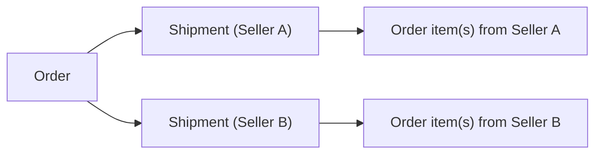
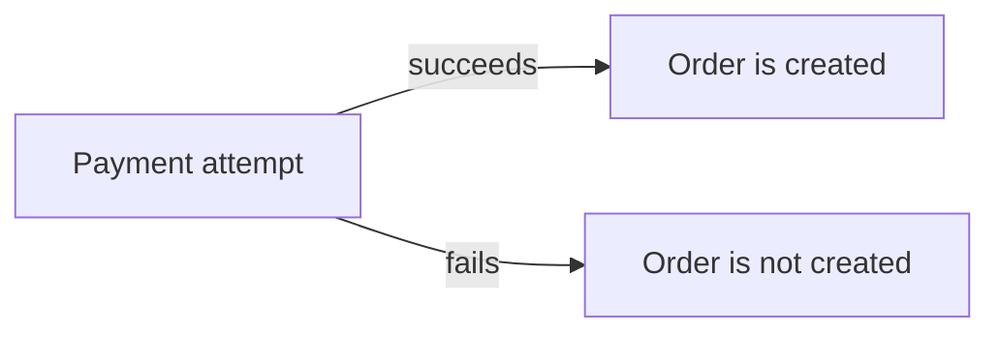
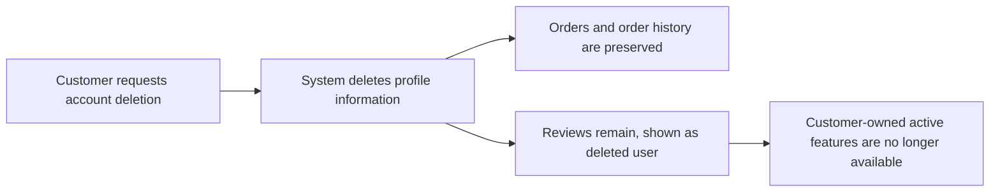
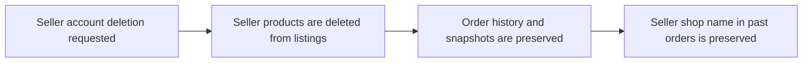
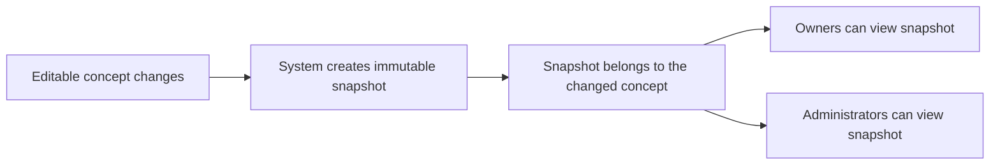

**shoppingMall — Business concepts, relationships, and states from user perspective**

Business concepts, relationships, and states from user perspective

# Domain Concepts

Describe what each concept means in the business domain and its key attributes.

## Customer Concept

Describe what Customer represents in the business domain and its key attributes. Do NOT describe operations or workflows — those belong in 03-functional-requirements.

### Customer Identity and Account Concept

A customer is a registered person who can use the platform’s commerce features.

A customer account requires registration to access any features (no guest browsing).

A customer uses email and password to sign up and to log in.

A customer can change their password.

A customer can delete their own account.

When a customer deletes their account, their profile information is deleted.

When a customer deletes their account, their orders and order history are preserved for seller records and legal purposes.

When a customer deletes their account, their reviews are preserved but shown as “deleted user”.

### Customer Profile Attributes

Each customer has a customer profile.

The customer profile includes a display name (editable).

The customer profile includes a phone number (editable).

A customer can edit their own display name.

A customer can edit their own phone number.

### Customer Address Book Purpose and Attributes

Each customer can maintain multiple shipping addresses.

Each shipping address includes a recipient name.

Each shipping address includes a phone number.

Each shipping address includes a street address.

Each shipping address includes a city.

Each shipping address includes a state or province.

Each shipping address includes a postal code.

Each shipping address includes a country.

A customer can add shipping addresses.

A customer can edit their shipping addresses.

A customer can delete shipping addresses.

A customer can set exactly one shipping address as the default shipping address.

### Customer Shopping Artifacts and Ownership

A customer owns a wishlist.

A customer owns a shopping cart.

A customer places orders.

A customer writes reviews.

### Customer Review Participation and Visibility Meaning

A customer can write reviews for products they have purchased.

A review authored by a customer can be edited by that same customer.

A review authored by a customer can be deleted by that same customer while preserving snapshots for audit/dispute resolution.

If a customer deletes their account, reviews authored by that customer remain visible to others but are shown as “deleted user”.

If a product is deleted by its seller, reviews remain part of the platform’s historical record, and the product-level review display follows the product availability behavior defined elsewhere.

## Seller Concept

Describe what Seller represents in the business domain and its key attributes. Do NOT describe operations or workflows — those belong in 03-functional-requirements.

### Seller Concept

- The seller represents a business account on the platform that can offer products for customers to purchase.
- A seller belongs to the platform domain as an account that participates in catalog management by owning products (defined in Seller Concept; relationships described in Conceptual Relationships module).
- A seller is identified by an email account identifier and uses password-based authentication to log in (details of authentication flows are defined in Actors and Auth unit).
- A seller has seller-profile information consisting of shop name, shop description, and a logo image.
- The seller’s shop profile is customer-visible (customers can view seller profiles).
- A seller has an approval status controlled by administrators, expressed as pending, approved, or rejected.
- If a seller is rejected, the seller can view the rejection reason.
- If a seller is rejected, the seller can later submit a new registration request (new registration requests are part of account lifecycle; operations are defined in functional requirements, while the meaning of rejection and resubmission is captured here).
- A seller is an entity that can be suspended by administrators, affecting what customers can do with the seller’s products while allowing the seller to continue handling existing orders (suspension impact is defined here at the domain-meaning level, with operational handling in functional requirements).
- A seller has a password that can be changed by the seller as part of account maintenance (account maintenance behaviors are reflected in the account lifecycle meaning).
- A seller can delete their account only under defined conditions, which relate to whether they still have pending orders and pending cancellation/refund requests.
- Deleting a seller account removes their products from listings but preserves order history and snapshots for dispute resolution.
- When a seller profile is edited, a snapshot is created to preserve the previous state for later reference by relevant parties.
- A seller has products that originate from the seller; products owned by the seller may be created, edited, and managed by that seller subject to approval and suspension status.
- A seller has inventory for product variants, managed through inventory history records (inventory concept and history are defined elsewhere; this section captures that the seller is the owner of the inventory-bearing variants through their products).
- A seller participates in order fulfillment: order items that require shipping correspond to the seller’s products, and shipment actions change item statuses (the shipping process itself is defined in functional requirements; this section defines the seller’s role in those business concepts).
- For customer-facing order history, the seller’s shop name and logo are preserved as part of the purchase context so the order record remains accurate over time.
- Seller visibility to customers depends on administrative approval and suspension state: approved sellers are eligible to sell, while suspended sellers’ products are hidden from search and category listings and cannot be purchased.

### Seller Domain Attributes

- A seller’s account includes an email account identifier and password-based authentication capability (defined as seller account attributes).
- A seller’s seller-profile includes a shop name.
- A seller’s seller-profile includes a shop description.
- A seller’s seller-profile includes a logo image.
- A seller’s approval status is a value in the set: pending, approved, rejected.
- A seller’s rejection reason is available for rejected sellers (seller-facing domain attribute; displayed when applicable).
- A seller has an account lifecycle that includes the ability to delete the account.
- A seller has operational eligibility governed by administrator approval and administrator suspension status.
- A seller has products, and those products have an ownership relationship to the seller (defined as belonging to the seller who created them).
- A seller has inventory history through their product variants (inventory is owned/maintained as part of the seller’s catalog operations, with inventory history records captured under the inventory record concept).
- A seller has order history involvement through the orders that include order items purchased from the seller.
- A seller has shop-profile snapshots that preserve edits to shop name, shop description, and logo image for later dispute resolution (snapshot structure is defined under Snapshot Concept; this section states seller-profile snapshots exist for the seller-profile edits).

## AdminUser Concept

Describe what AdminUser represents in the business domain and its key attributes. Do NOT describe operations or workflows — those belong in 03-functional-requirements.

### AdminUser Concept

### Concept
An AdminUser represents a platform administrator account responsible for making and managing administrative decisions that affect sellers, categories, products, orders, and user account standing.

### Domain
AdminUser belongs to the set of authenticated platform actors who can view administrative information and perform administrative oversight actions within the shopping mall domain. AdminUser operates at the platform-level across multiple sellers and customers.

### Business Meaning
AdminUser is the decision-maker role used to:
- Review and resolve requests related to gaining administrative privileges.
- Approve or reject seller registration requests, and manage seller approval outcomes.
- Manage seller account standing by suspending or unsuspending sellers.
- Manage product classification by creating, editing, and deleting categories.
- Provide oversight of products and product snapshots for dispute resolution and policy handling.
- Provide oversight of orders and order/item resolution for dispute resolution and policy handling.
- Manage customer account standing by banning or unbanning customers.
- Manage seller account standing by banning sellers.

### Attributes
Each AdminUser has the following business attributes:
- An email account identifier used as the basis for account identity.
- Password-based authentication access to sign in (as a business capability of the account).
- An administrator grade, which distinguishes between regular administrator and super administrator.
- The ability to submit an administrator-privilege request reason when making an administrator privilege request (as part of the account’s pathway to elevated privileges).

### Administrator Grade Rules (defined as meaning, not operations)
AdminUser’s administrator grade controls which elevated promotion and demotion capabilities the AdminUser may exercise, with super administrators able to promote regular administrators and demote other super administrators, except that super administrators cannot demote themselves.

### Relationship to Other Concepts
AdminUser is distinct from:
- Customer, who owns customer-facing assets such as profile, addresses, wishlist, cart, orders, and reviews.
- Seller, who owns products, variants, inventory history, and seller profile.

AdminUser is the oversight actor for the platform-level administrative objects and outcomes described above, including approvals and account standing changes affecting sellers and customers.

## Address Concept

Describe what Address represents in the business domain and its key attributes. Do NOT describe operations or workflows — those belong in 03-functional-requirements.

### Address Concept

An address represents a customer’s saved shipping destination used when ordering items.

In the domain, an address belongs to exactly one customer (defined in Customer Concept) and represents the information needed to deliver shipments to a named recipient at a physical location.

An address has business meaning as part of the customer’s fulfillment details: it identifies who should receive the shipment, how the shipment should be contacted, and where it should be delivered (street-level destination).

Attributes of an address are the following: recipient name, recipient phone number, street address, city, state/province, postal code, and country.

A customer may maintain multiple addresses to support shipping to different recipients or locations, and each of those addresses is distinct within the customer’s address collection.

An address may be designated as the default shipping address for the customer; at most one address is the default at a time.

Address ownership rules (business perspective): only the owning customer can have their addresses managed as part of their own account, while other customers cannot access or use another customer’s addresses.

### Address Domain Boundaries

An address is specific to shipping destination usage within the platform and is not a product listing attribute.

An address is part of the customer’s profile information context (defined in Customer Profile) and is intended to be used by the system when fulfilling a customer’s orders.

Address details are treated as customer-controlled data: the information on an address is stored as the customer’s provided shipping destination fields (recipient name, recipient phone number, street address, city, state/province, postal code, country).

An address’s default designation is a customer preference that affects which address is chosen as the default shipping option when the customer needs to select a shipping address.

## Category Concept

Describe what Category represents in the business domain and its key attributes. Do NOT describe operations or workflows — those belong in 03-functional-requirements.

### Category Concept

A category is a business classification used to organize products on the platform (concept).

Within the domain of the shopping mall platform, categories exist as named groupings that can optionally include one-level subcategories (domain).

The business meaning of categories is to let customers understand how products are organized and to browse products by category grouping (business-meaning).

A category has the following attributes (attributes):
- Name: a human-readable title for the category.
- Description: a human-readable explanation of what the category represents.
- Subcategory relationship: a category may have an optional subcategory, with nesting limited to one level only.

Category visibility and management are governed by administrators: categories are created and managed by administrators only, ensuring consistent classification across the platform.

Customers can browse the list of all categories, including the category/subcategory structure, to discover where products are grouped.

A category contains products: products can belong to a category (and optionally to a selected subcategory within the one-level nesting rule).

If a category is deleted by an administrator, products that were in that category become uncategorized, meaning they no longer appear under that category or subcategory listing while remaining available through the uncategorized state (deletion impact on category membership).

## Product Concept

Describe what Product represents in the business domain and its key attributes. Do NOT describe operations or workflows — those belong in 03-functional-requirements.

### Product Concept (business meaning and domain)

A product is a commercial offering created and owned by a seller on the shopping mall platform.

In the domain, a product belongs to exactly one seller and is organized under categories managed by administrators.

A product is the item customers can browse and search for, view in product detail, add to wishlists (as a product, not a specific variant), and purchase through its variants.

The platform treats products as monetized data, so changes to product-related editable information are recorded as immutable snapshots for dispute resolution.

Visibility depends on product status: when a product is available, it is shown in search and category listings; when a product is deleted, it no longer appears in search or category listings.

### Product Attributes

Each product has the following attributes:

- Name: a required text value that identifies the product.
- Description: a required text value that describes the product.
- Category: a required category assignment, where the category selection can include a subcategory (one level of nesting only).
- Base price: a required monetary value used as the product’s default price unless overridden by a variant.

Each product is associated with:

- Seller owner: the seller who created the product.

Each product also includes:

- Images: the product supports multiple images used for listings and product detail.
- Variants: the product contains one or more purchasable variants that define specific option combinations and pricing/stock behavior.

Product availability rules in the domain:

- A product must have at least one variant to be purchasable.
- If a product has no variants, it remains visible in search but is shown as unavailable.

### Product State, Listing Availability, and Search Behavior

Product listing visibility follows these business meanings:

- A product that is not deleted is eligible to appear in both search results and category listings.
- A deleted product is hidden: it no longer appears in search or category listings.

Purchasability is determined by the existence of variants:

- If the product has at least one variant, the product is purchasable.
- If the product has no variants, the product is visible in search but shown as unavailable.

Image and rating presentation in product listings and details (business-facing):

- In list views (such as search results and category pages), each product shows its main image (thumbnail), name, base price (or a price range when variants have different prices), the seller shop name, and an average rating when reviews exist.

- In product detail views, the product shows all images, name and description, category, seller shop name, variant availability and prices, and rating summary and reviews.

(Where applicable, these presentation elements reflect the current product and variant state governed by the snapshot principle for historical dispute resolution.)

### Snapshot Coverage for Products

To preserve a complete audit trail in a system where money is exchanged, the platform creates immutable snapshots whenever editable product data changes.

For product edits:

- Whenever a seller edits a product, a product snapshot is created.
- The product snapshot records the complete product state at the time of change, including all product fields such as name, description, category, base price, and images.

Variant snapshot inclusion for product edits:

- When a product snapshot is created due to a product edit, it also preserves the state of all product variants at that moment.
- This means the snapshot captures variant attributes such as option values and price overrides as they were at the time, along with the relationships needed to represent the product variant state in that snapshot.

Snapshot access for dispute resolution:

- Snapshots are immutable and cannot be deleted.
- Snapshots can be viewed by relevant parties, including owners and administrators, for dispute resolution.

### Integration of Product with Related Domain Concepts (high-level relationships)

A product participates in the platform’s core business relationships:

- Ownership: a product is owned by one seller.
- Classification: a product is assigned to a category (with possible subcategory nesting limited to one level).
- Customer discovery: customers search for and browse products across all sellers.
- Customer purchase: customers purchase variants of a product (not products alone).
- Wishlisting: customers can add products to a wishlist; the wishlist stores products and does not store specific variants.
- Deletion ripple: if a product is deleted by the seller, it is automatically removed from wishlists.

Product imaging integration:

- Sellers can upload multiple images for a product.
- Image ordering defines the main/thumbnail image used in listings.
- Image edits are included in product snapshots as part of preserving the product’s complete state at the time of change.

## ProductImage Concept

Describe what ProductImage represents in the business domain and its key attributes. Do NOT describe operations or workflows — those belong in 03-functional-requirements.

### ProductImage Concept

A product image represents one visual image that a seller uploads as part of a product’s image set.

The ProductImage concept lives within the product domain: it belongs to a specific product and contributes to how customers view that product’s gallery.

Business meaning: Product images are used to display the product visually on product listing and product detail pages. The seller can control the ordering so that one image appears first as the main/thumbnail image, and the rest appear as additional images.

Attributes of a product image include:
- Image order position within the product’s image set (defined so the first image acts as the main/thumbnail image).
- Image content reference (the actual image itself).

Relationship context:
- A product has a collection of product images.
- Each product image belongs to exactly one product.

Snapshot relevance:
- When editable product image data changes (including ordering and removal), a product snapshot captures the prior and updated image state as part of the product’s snapshot history. Snapshots preserve prior values and remain viewable for dispute resolution.

Visibility and consistency intent:
- Product images shown to customers reflect the current image set associated with the product, ordered by the product’s image order position, unless a snapshot view is being used for owners or administrators in dispute resolution.

## ProductVariant Concept

Describe what ProductVariant represents in the business domain and its key attributes. Do NOT describe operations or workflows — those belong in 03-functional-requirements.

### Product Variant Concept (definition and business meaning)

A product variant represents a purchasable, specific combination of option values for a product (for example, color combined with size).

A product variant is the unit that buyers select when adding items to their shopping cart.

A product variant has its own identity in the catalog and can be purchased independently of other variants under the same product.

A product variant has business availability meaning based on its current stock level:
- When stock is available, the variant is shown as “in stock”.
- When stock is zero, the variant is shown as “out of stock”.

Product variants are used to preserve purchase context: the variant selected at purchase time is what is reflected in the customer’s order item.

A product must have at least one variant to be purchasable; if a product has no variants, the product is visible in search but shown as “unavailable”.

### Product Variant Attributes (what a variant contains)

Each product variant has the following attributes.

SKU code (required):
- A unique identifier for the variant within the seller’s catalog.

Option values (required):
- The variant’s specific option selections (for example, “Red” and “Large”).
- Together, these option values represent the combination that distinguishes this variant from other variants of the same product.

Price override (optional):
- A variant-level price that can override the product’s base price.

Stock quantity (required, derived meaning):
- Each variant has a stock quantity.
- Current stock quantity is not treated as a snapshot value; instead, it is calculated by summing inventory history records.

Availability status (derived):
- The variant’s availability status reflects whether its current stock quantity is greater than zero.
- When current stock quantity is zero, the variant is treated as “out of stock”.

Variant deletion/unavailability meaning:
- A variant may be marked as deleted, and when that happens it becomes unavailable for selection in purchasing flows.
- Deleted variants are not available as purchasable options going forward, even if the parent product still exists.

### Inventory and Stock Quantity Semantics for Variants

Stock quantity for a product variant is determined by inventory history records, not by directly maintaining a single snapshot value.

Each inventory history record represents a quantity change for the variant and includes:
- Quantity change amount (positive for restocking and negative for orders or adjustments)
- Reason
- Timestamp

The current stock quantity is calculated by summing all inventory history records for the variant.

Inventory changes reflect business events:
- When a customer places an order that includes the variant, the system automatically creates a negative inventory record for that variant.
- When an order is cancelled or refunded for the variant, the system automatically creates a positive inventory record for that variant.

Out-of-stock semantics:
- When the calculated stock quantity reaches 0, the variant is shown as “out of stock”.
- When a variant’s stock is 0, it cannot be added to the cart.

### Variant Snapshots and Immutability Purpose

Whenever a product variant is edited, a variant snapshot is created to preserve the previous and updated state.

The purpose of the variant snapshot is to maintain traceability of what the variant looked like at the time of change.

Variant snapshots record the change context, including:
- When the change was made
- What was changed
- The values before the change and the values after the change

Variant snapshots are immutable and cannot be deleted.

Snapshots are viewable by relevant parties for dispute resolution:
- Owners can view snapshots of their own products (including their variants).
- Administrators can view snapshots of any product (including its variants).

### Product-Level Availability and Variant Presence Relationship

Variant presence affects whether a product can be purchased:
- If a product has at least one variant, the product is purchasable.
- If a product has no variants, the product is visible in search but shown as “unavailable”.

This relationship ensures that customers only attempt to purchase products that actually have selectable variant options.

## InventoryRecord Concept

Describe what InventoryRecord represents in the business domain and its key attributes. Do NOT describe operations or workflows — those belong in 03-functional-requirements.

### InventoryRecord Concept (What it represents)

An InventoryRecord represents a single recorded change to a product variant’s stock over time.

In the platform domain, a variant’s current stock is not treated as a single stored value; instead, it is derived by considering the sequence of inventory history records for that variant.

Inventory history records are used to preserve a complete audit trail of why stock moved up or down, enabling traceability of adjustments, restocking events, and movements caused by orders or order changes.

An InventoryRecord exists for a specific product variant and is part of that variant’s inventory history.

InventoryRecord modifications are treated as historical facts for dispute resolution and accounting; they are not snapshots of editable business content but instead represent stock movement entries.

WHEN an inventory movement occurs (for any reason covered by the platform), the platform SHALL record it as an inventory history entry so that the variant’s current stock can be recalculated from its inventory history.

### InventoryRecord Domain and Business Meaning

In this domain, InventoryRecord entries provide the authoritative history of stock quantity changes for each product variant.

The business meaning of an InventoryRecord is:
- It records the quantity change applied to the variant’s stock.
- It records the reason for that quantity change.
- It records when the change happened.
- It supports calculation of the variant’s current stock by summing all recorded quantity changes.

An InventoryRecord’s quantity change follows the convention that:
- Positive quantity changes represent restocking, replenishment, or other stock increases.
- Negative quantity changes represent orders or other stock decreases.

InventoryRecord reasons provide business context so that sellers and administrators can understand what drove the stock movement.

InventoryRecord timestamps provide ordering and auditability so that inventory history can be reviewed chronologically.

InventoryRecord data belongs to the inventory history for the relevant product variant, ensuring that historical stock changes remain associated with the variant they affected.

### InventoryRecord Attributes

Each InventoryRecord includes the following business attributes:

1) Quantity change
- The quantity change represents how much stock is added to or removed from the variant.
- Positive values indicate stock increases.
- Negative values indicate stock decreases.

2) Reason
- The reason explains why the quantity change occurred.
- Reasons cover restocking and other adjustments, as well as stock movements that happen automatically due to order placement and due to order cancellation or refund.

3) Timestamp
- The timestamp indicates when the inventory change was recorded.
- The timestamp supports chronological review of inventory history.

InventoryRecord entries SHALL be treated as immutable historical records, so that the inventory history remains stable for stock calculation and auditing.

The platform SHALL use all InventoryRecord entries for a given variant to determine the variant’s current stock by summing the quantity changes across its inventory history.

## Wishlist Concept

Describe what Wishlist represents in the business domain and its key attributes. Do NOT describe operations or workflows — those belong in 03-functional-requirements.

### Wishlist Concept Overview

A wishlist represents a customer’s saved interest in products they may want to buy later.

In the domain, a wishlist belongs to a single customer (defined in Customer Concept) and is used to group the customer’s wished products into one list.

A wishlist is distinct from a shopping cart: the wishlist is a saved list of products, while the cart is where customers assemble specific quantities for purchase.

The wishlist is meant for customers to quickly find products they have already selected for later consideration.

Wishlist contents are limited to products, not specific product variants, so the wishlist does not store variant-specific choices.

### Wishlist Attributes (Business Meaning)

A wishlist has pagination state (defined in the Wishlist Concept scope) that controls how the customer views the wishlist in multiple pages.

A wishlist contains wishlist items. Each wishlist item represents one wished product added by the customer.

A wishlist item is added at the time the customer adds that product to their wishlist.

The wishlist item references a product that the customer is interested in.

The wishlist item does not represent a particular variant selection; it always refers to the product as a whole (defined in Product Concept).

### Wishlist Availability After Product Deletion

If a product is deleted by the seller, that product is automatically removed from all wishlists where it appears.

This removal ensures that deleted products no longer remain visible in customers’ wishlists.

After a product is removed from a wishlist because the product was deleted, the wishlist no longer includes that product as a wished item.

## WishlistItem Concept

Describe what WishlistItem represents in the business domain and its key attributes. Do NOT describe operations or workflows — those belong in 03-functional-requirements.

### WishlistItem Concept

#### Concept
A wishlist item represents a single product that a customer has saved to their wishlist.

#### Domain
Wishlist items are part of a customer’s wishlist and are used to record which products the customer is interested in saving for later.

#### Business Meaning
The wishlist item is a persistent record of the customer’s interest in a product. The same product can appear only as a single wishlist item within a given wishlist, reflecting that the wishlist stores products (not specific variants).

#### Attributes
Each wishlist item has:
- A reference to the product it represents. The product identity is used so the wishlist can display saved products.
- An added timestamp indicating when the product was added to the wishlist.

#### Relationships
- A wishlist item belongs to exactly one wishlist (defined in the Wishlist Concept section).
- A wishlist item references exactly one product (a product concept defined in the Product Concept section).

#### Display and Deletion Implications
- Wishlist items are shown as products on the customer’s wishlist (not product variants).
- If the seller deletes a product, wishlist items for that product are automatically removed from wishlists, so deleted products no longer appear in wishlist views.

## Cart Concept

Describe what Cart represents in the business domain and its key attributes. Do NOT describe operations or workflows — those belong in 03-functional-requirements.

### Cart Concept Overview

A cart represents the customer’s temporary selection of products to buy before placing an order. The cart exists only for registered customers (no guest browsing).

In the shopping domain, a cart is a container for multiple cart items, where each cart item specifies a product variant and the quantity the customer intends to purchase. The cart’s total price reflects the current contents of the cart.

The cart is owned by exactly one customer, and the customer is the sole party responsible for viewing and modifying the cart contents during shopping.

Cart contents and pricing are used as input to the checkout and order placement process (defined elsewhere).

### Cart Attributes and Business Meaning

A cart has the following attributes and business meaning:

- Ownership: A cart belongs to one customer.
- Cart items collection: A cart contains one or more cart items (or can be empty when the customer has not selected anything).
- Quantity per cart item: Each cart item captures the quantity the customer intends to purchase for a specific product variant.
- Pricing basis: Each cart item subtotal reflects the price of the product variant together with the cart item quantity.
- Cart total price: The cart total price is derived from the subtotals of all cart items.
- Stock warning state: When the customer’s chosen quantity for a variant exceeds the variant’s available stock, the cart includes a warning state so the customer can understand that the cart may not match available inventory.
- Availability marking: If a variant is deleted or out of stock, the variant is treated as unavailable in the cart presentation.

The cart is intended to support a shopping flow where the customer can assemble intended purchases and then proceed to checkout with an order summary derived from the cart contents.

### Cart Item Linkages (Domain Relationships)

A cart is linked to the product catalog through its cart items:

- Each cart item references a specific product variant (defined elsewhere) rather than only a product.
- The variant selected in a cart item determines the pricing used for that cart item and the availability/stock warning behavior of the cart.
- Cart items are associated with the cart that the customer is using for shopping.

These linkages ensure that the cart reflects the exact purchasable variant the customer is considering, and that stock-related warnings and availability markings are based on the chosen variant’s current status.

## CartItem Concept

Describe what CartItem represents in the business domain and its key attributes. Do NOT describe operations or workflows — those belong in 03-functional-requirements.

### CartItem Concept

A cart item represents a single purchasable line in a customer’s shopping cart.

A cart item belongs to exactly one cart (defined in [Cart Concept]) and corresponds to exactly one product variant (defined in [ProductVariant Concept]).

Business meaning
- A cart item captures the customer’s selected quantity for a specific product variant.
- A cart item is used to compute the cart’s pricing totals by combining the selected variant’s price with the selected quantity.
- If the underlying variant becomes unavailable (for example, it is deleted or out of stock), the cart can still show the cart item but it becomes unavailable in the cart context (defined in [Cart Concept]).

Attributes
- Product variant (defined in [ProductVariant Concept])
  - The cart item references which product variant the customer intends to buy.
- Quantity
  - The cart item has a quantity indicating how many units of the referenced variant the customer wants to purchase.
  - The cart item’s quantity directly affects the cart item subtotal and the cart total price (defined in [Cart Concept]).
- Subtotal
  - The cart item has a subtotal that represents the cart-item price contribution for the customer’s selected quantity.
  - The subtotal is derived from the referenced variant’s price and the cart item’s quantity (defined in [Cart Concept]).

## Order Concept

Describe what Order represents in the business domain and its key attributes. Do NOT describe operations or workflows — those belong in 03-functional-requirements.

### Order Concept and Business Meaning

An order represents a completed purchase attempt that results in one or more purchased items for a customer.

An order contains multiple order items, where each order item represents a specific purchased product variant and its purchased quantity.

An order item belongs to exactly one seller, and that seller’s items are grouped into one or more shipments.

The overall order status is derived from the statuses of its order items, not set independently.

An order preserves the shipping address details that were selected at the time the order was placed, so the delivery address used for the order remains consistent over time.

An order preserves customer-visible purchase context for disputes and history by capturing snapshots of the purchased product and variant, and capturing a snapshot of the seller profile at the time of purchase.

If payment fails, an order is not created; therefore, only successfully placed orders exist with order items and preserved purchase snapshots.

Orders are owned by the customer who placed them and are part of the customer’s order history.

### Order Attributes and What They Represent

Each order has an order number that uniquely identifies it within the platform.

Each order has an overall order status derived from its order items.

Each order includes the shipping address used for that order (snapshotted/locked at placement), and the order always references that specific address for shipping.

Each order contains one or more order items.

Each order item has a quantity that reflects how many units of the purchased product variant were bought.

Each order item has an item status that indicates the purchase lifecycle stage for that item.

Each order item has a unit price at the time of purchase.

Each order item includes a snapshot of the purchased product and variant so that the product name, variant options, and price reflect what the customer saw when purchasing.

Each order item includes a snapshot of the seller profile at the time of purchase so that the seller shop name and logo shown for that item remain consistent.

Each order contains one or more shipments, grouped by seller, so that shipments share tracking information when they include items from the same seller.

Each shipment contains one or more order items and those items transition together for shipment-level delivery confirmation.

### Order and Order Item Status Model

Each order item can have one of the following statuses: paid, shipped, delivered, cancelled, refunded.

A paid order item represents a stage where payment is completed and the seller is waiting to ship.

A shipped order item represents a stage where the seller has shipped the item.

A delivered order item represents a stage where the customer confirmed delivery for the shipment containing the item, or where delivery confirmation is auto-completed after the specified delivery-confirmation waiting period.

A cancelled order item represents a stage where the item was cancelled after an approved cancellation process for that item.

A refunded order item represents a stage where the item was refunded after an approved refund process for that item.

The overall order status is derived using the following rules over its order items:
- If all items are paid, the order is paid.
- If any item is shipped and none are delivered yet, the order is shipped.
- If all items are delivered, the order is delivered.
- If all items are cancelled, the order is cancelled.
- If all items are refunded, the order is refunded.
- For mixed states (for example some delivered and some refunded), the order is partially completed.

Orders with multiple sellers may have different item statuses at the same time, because each seller ships separately via separate shipments.

### Order-to-Shipment Grouping Behavior (Conceptual State Scope)

A shipment is a package sent by a seller and can include one or more order items from that seller.

Different sellers always ship separately, so items belonging to different sellers do not share the same shipment.

A seller may ship items individually or bundle multiple items into one shipment; when bundled, the shipment-level tracking information applies to all included items.

Customers confirm delivery per shipment, meaning confirmation affects all items included in that shipment.

When a shipment is created, all items included in that shipment become shipped at the same time.

If the customer does not confirm delivery, the items in the shipment automatically complete delivery after the platform-defined delivery-confirmation waiting period.

## OrderItem Concept

Describe what OrderItem represents in the business domain and its key attributes. Do NOT describe operations or workflows — those belong in 03-functional-requirements.

### OrderItem Concept

An order item is a single purchased unit within an order that represents one product variant bought in a specific quantity.

In the business domain, an order item belongs to an order that was placed by a customer and represents the exact product-variant purchase details that were selected at checkout.

The business meaning of an order item is to track the lifecycle of that specific purchased variant independently from other purchased variants, including its purchase status and whether cancellation or refund decisions have been made for that item.

An order item includes the following attributes:
- **Item quantity**: the number of units purchased for the specific variant within the order item (for example, buying multiple units of the same variant results in one order item with an associated quantity).
- **Item status**: the current status of the order item, using the defined item status values: Paid, Shipped, Delivered, Cancelled, Refunded.
- **Unit price at time of purchase**: the price value used for calculating the order item’s cost at the moment the order was successfully created.
- **Purchased product snapshot**: an immutable snapshot that preserves the purchased product information at the time of purchase. This snapshot includes the product name and description, the product’s category at the time, and the product’s images (as part of the full product snapshot principle).
- **Purchased variant snapshot**: an immutable snapshot that preserves the purchased variant information at the time of purchase. This snapshot preserves the variant options and the variant’s price override (if any) as part of the variant snapshot principle.
- **Associated seller snapshot**: an immutable snapshot that preserves the seller’s shop name and logo image at the time of purchase, tied to this order item so that seller identity details remain accurate for dispute resolution.

An order item is connected to business context as follows:
- It is included within an order that contains one or more order items.
- It corresponds to exactly one purchased product variant within that order item.
- It can have one or more related cancellation requests and one or more related refund requests over time, each associated to this specific order item.

For interpretation of business meanings:
- The order item status represents the progress of the purchased item through the fulfillment process and the outcomes of cancellation or refund handling for that item specifically.

**State flow (item-level status transitions)**
```mermaid
flowchart LR
    A["Paid"] -->"Shipped" B["Shipped"]
    B -->"Delivered" C["Delivered"]
    A -->"Cancelled" D["Cancelled"]
    C -->"Refunded" E["Refunded"]
```

**Notes on scope of responsibility**
- An order item’s snapshot data preserves the purchased product, purchased variant, and seller profile details as they were at purchase time (defined by the snapshot principle), even if those underlying records are later changed or removed elsewhere on the platform.

## Shipment Concept

Describe what Shipment represents in the business domain and its key attributes. Do NOT describe operations or workflows — those belong in 03-functional-requirements.

### Shipment: Concept and Domain Boundaries

A shipment is a business package that represents how items purchased from the same seller are physically sent to the customer.

Within the platform domain, a shipment belongs to an order and groups together one or more order items that originate from the same seller.

A shipment exists as part of the platform’s shipping and tracking representation, and it is the unit for customer-facing tracking visibility.

Each shipment contains only order items from one seller, even when an order includes items from multiple sellers.

A customer may observe multiple shipments over the life of a single order when the order includes items from multiple sellers.

### Shipment: Business Meaning to Stakeholders

For customers, shipment is the practical reference for where their purchased items are during shipping and for confirming delivery per shipment.

For sellers, shipment is the unit that sellers use to associate which of their order items are being shipped together.

For order oversight and dispute resolution, shipment is the grouping mechanism that ties order items together under a single carrier and tracking reference.

A shipment reflects a real-world sending event from a seller, and therefore it provides a coherent tracking experience even when the order item statuses move forward at different times across shipments.

### Shipment Attributes and What They Represent

A shipment has the following attributes in the business domain:
- Carrier name: identifies the logistics carrier used for the shipment.
- Tracking number: the shipment’s tracking identifier.
- Included order items: the set of order items included in the shipment.

The carrier name and tracking number together represent the shipment’s tracking information shown to relevant parties.

All order items included in the same shipment share the same carrier name and tracking number as their shipping reference.

A shipment is identified within the context of an order as a grouping of order items from a single seller.

### Shipment Relationship to Orders and Order Items (Business View)

An order contains one or more order items.

Order items are grouped into shipments when they are shipped.

Shipments are seller-scoped within an order: items belonging to different sellers are always placed into different shipments.

Within one seller’s scope, multiple order items may be included in a single shipment when the seller chooses to bundle them.

The following diagram summarizes these relationships conceptually:



## Payment Concept

Describe what Payment represents in the business domain and its key attributes. Do NOT describe operations or workflows — those belong in 03-functional-requirements.

### Payment Concept Overview

Payment represents the business attempt to transfer money for a customer’s order during checkout.

In the platform’s domain, Payment is tied to an order and acts as the gate for whether the order becomes a created order for further processing.

The platform treats payment as a distinct business event from shipping and fulfillment: payment outcome determines whether the order can exist and proceed, rather than being part of shipment or delivery decisions.

### Payment Domain and Business Meaning

Payment is part of the order lifecycle from the customer’s perspective.

Business meaning:
- A payment can succeed or fail.
- Payment outcome governs whether an order is created.
- Payment does not itself perform fulfillment; it only enables the next business step when successful.

This ensures that customers can retry payment if it fails, and that the system will only create an order record when the customer’s payment succeeds.

### Payment Attributes

A Payment has the following business attributes:

- Payment status: indicates whether the payment succeeded or failed (status values are “succeeded” and “failed”).
- Amount: the total money amount associated with the customer’s confirmation of the order.
- Payment timestamp: the time at which the payment was attempted/recorded.

Payment is associated with:
- The order that the customer attempted to purchase (the payment belongs to the order context used at checkout).

### Payment Outcome and Its Relationship to Order Creation

When a customer confirms and places an order from the cart, the system processes a payment attempt as part of that checkout.

State-driven relationship (business flow):
- If the payment succeeds, the order is created and can proceed with order item creation and subsequent steps.
- If the payment fails, the order is not created, and the customer can retry payment.



## CancellationRequest Concept

Describe what CancellationRequest represents in the business domain and its key attributes. Do NOT describe operations or workflows — those belong in 03-functional-requirements.

### Cancellation Request Concept

A cancellation request represents a customer’s request to cancel a specific purchased order item.

The cancellation request belongs to a single order item (the request is not for an entire order at once).

A cancellation request has a reason provided by the customer; this reason is part of the business record for dispute resolution.

A cancellation request has a status that reflects its decision stage in the cancellation process.

A cancellation request status can be: pending, approved, or rejected.

When a seller reviews a cancellation request, the platform preserves a snapshot of the request state.

A snapshot of a cancellation request captures what changed in the cancellation request when the seller made the decision.

Cancellation request snapshots are immutable and cannot be deleted.

The cancellation request snapshot is viewable by relevant parties for dispute resolution.

The platform preserves cancellation request records even after the cancellation is approved or rejected, so that the decision trail remains available.

A cancellation request is associated with the seller responsible for the referenced order item.

The referenced order item determines the scope of the cancellation request, including that cancellation approval is applied to that order item only.

If the cancellation request is approved, the platform treats the referenced order item as cancelled and the cancellation outcome becomes part of the order item’s lifecycle history.

If the cancellation request is rejected, the platform keeps the referenced order item in its existing status and the rejection outcome remains recorded.

The cancellation request reason remains accessible as part of the cancellation request record and cancellation decision history.

Cancellation requests are distinct from refunds; a cancellation request concerns cancelling an order item prior to shipment, while refunds are handled separately through refund requests.

### Cancellation Request Domain and Business Meaning

Cancellation requests exist to let customers seek cancellation of an order item that has not yet progressed beyond the cancellation-eligible stage.

Cancellation requests provide a structured decision workflow between the customer and the seller of the order item.

The business meaning of a cancellation request is a formal, auditable communication record that includes the customer’s reason and the seller’s decision.

The platform uses the cancellation request status to indicate whether the customer’s cancellation is still awaiting a seller decision, has been accepted, or has been declined.

The platform relies on the existence of a cancellation request to ensure that cancellation is not applied silently; cancellation is only reflected as completed through a seller decision captured in the request status and snapshot.

Cancellation request snapshots exist to support dispute resolution by preserving the “before” and “after” values of the cancellation request at the moment the seller makes a decision.

A cancellation request is therefore both (1) a decision artifact (pending/approved/rejected) and (2) a dispute-resolution audit trail via snapshots.

The overall business intent is that each order item has its own cancellation decision path, without mixing decisions across different items or sellers.

## RefundRequest Concept

Describe what RefundRequest represents in the business domain and its key attributes. Do NOT describe operations or workflows — those belong in 03-functional-requirements.

### RefundRequest Concept Overview

A refund request represents a customer-initiated request to have an already delivered order item refunded.

The refund request belongs to exactly one order item and is created in the context of that specific purchase.

A refund request records the customer-provided reason for the refund request.

A refund request has a current status that reflects the seller’s decision process (pending, approved, or rejected).

A refund request preserves the request state for dispute resolution by creating an immutable snapshot of the request state when the seller responds.

A refund request is tied to the order item it affects, so it does not apply to other items in the same order unless the customer requested refunds for those items separately.

A refund request is visible to relevant parties for tracking and dispute resolution based on their relationship to the affected order item (the customer who placed the order and the seller responsible for the affected item), as determined by the platform’s general snapshot visibility rules (defined for snapshots in the Snapshot Concept).

If a refund request is approved, the platform treats the associated order item as refunded and ensures that the refunded outcome is reflected in the order item status logic (defined in the Order Concept and Order Item Status context).

### RefundRequest Attributes and State Meaning

A refund request has the following attributes:

- Reason: the text explanation provided by the customer when submitting the refund request.
- Status: the current decision state of the request.
- Seller decision snapshot: an immutable preserved record created when the seller responds, capturing the request state at that moment (what changed and the values before and after), per the Snapshot Principle.

Status meanings must be consistent:

- When status is pending, the refund request has been submitted by the customer and is awaiting the seller’s decision.
- When status is approved, the seller has approved the refund request for the associated order item.
- When status is rejected, the seller has rejected the refund request for the associated order item.

The refund request’s seller decision snapshot must be immutable and cannot be deleted, and it must remain viewable for dispute resolution by relevant parties (owners and administrators as described in the Snapshot Concept).

Refund request submission is specific to a single order item; one refund request cannot represent multiple order items.

Edited refund-request content is not represented as a mutable record for dispute resolution; instead, any change resulting from the seller response must be captured through the creation of the seller decision snapshot, following the Snapshot Principle.

The refund request concept is distinct from order-level refunds: an order-level refunded outcome is derived from the refunded states of its individual order items (as defined in the Order and Order Item status relationships).

## Review Concept

Describe what Review represents in the business domain and its key attributes. Do NOT describe operations or workflows — those belong in 03-functional-requirements.

### Review Concept: Meaning in the Business Domain

A review represents a customer’s written feedback about a product they purchased.

A review is part of the product’s public reputation information on the marketplace.

Reviews contribute to the product’s average rating calculation based on reviews that are considered not deleted (i.e., only active reviews are included).

A review is created in the context of a specific purchase outcome for a product variant, so the review is tied to the purchase and the product it refers to.

If a customer deletes their own review, the review is not removed from historical record; instead it is displayed as “deleted user” while preserving the review record for calculation purposes as defined by the business meaning of deletion (defined by the review display behavior and rating calculation rules described within this concept).

### Review Domain: Where It Belongs and How It Relates

A review belongs to a product and is associated with the customer who wrote it.

A review is written for a product that the customer has purchased (the purchase provides the eligibility context for the review to exist in the domain).

A review is also associated with the specific order item context that enabled the customer to write the review, meaning the review’s existence in the domain is grounded in that purchase context.

A review interacts with the snapshot principle: edits and deletions of a review create immutable snapshot records so the prior state is preserved for dispute resolution and oversight.

A review’s content (rating and text) is part of the product detail page experience, where customers see the product’s reviews sorted by newest first (ordering expectation is defined as part of the review domain behavior).

### Review Attributes: What a Review Contains

Each review has a rating.

Each review’s rating is a value from 1 to 5 and is required to be present for the review to exist.

Each review has optional text content.

Each review is authored by a customer and is therefore attributed to an identifiable customer identity in the marketplace.

A review includes a state that indicates whether it has been deleted by its author.

When a review is deleted, the review remains present for historical purposes, but the author display identity is shown as “deleted user” rather than the original customer.

A review is associated with timestamps that indicate when the review was created and when it was last updated.

Every edit to a review creates an immutable snapshot record that preserves the review’s previous state and the updated state.

### Review Ordering and Display Meaning

When customers view reviews on a product detail page, reviews are displayed in newest-first order.

The display includes the review author identity unless the review has been deleted.

If a review has been deleted by its author, the review is displayed with the author identity shown as “deleted user” while still showing the review content that remains part of the review record.

Deleted reviews are excluded from the product’s average rating calculation (only non-deleted reviews are used), preserving the business meaning that deletion affects reputation metrics while keeping an audit trail.

## Snapshot Concept

Describe what Snapshot represents in the business domain and its key attributes. Do NOT describe operations or workflows — those belong in 03-functional-requirements.

### Snapshot Concept Overview

A snapshot represents an immutable record of a change to business data made on the platform.
Snapshots exist to preserve the historical state of editable information at the moment of each modification.
Snapshots support dispute resolution by allowing relevant parties to review what changed and the before-and-after values.
Snapshots cannot be deleted, ensuring a complete historical trail of modifications.

### Snapshot Domain and Scope of Snapshotting

Snapshots are created for all editable domain concepts that can be modified on the platform.
Snapshotting applies to: products, product variants, seller profiles, order items (including purchased product and variant details), reviews, cancellation requests, and refund requests.
Snapshots are also used to preserve the complete context needed to understand a record at the time it was created or changed (for example, preserving product and variant state as part of an order item).

### Snapshot Business Meaning and What It Preserves

Each snapshot records that a modification occurred and preserves the values before the modification and the values after the modification.
A snapshot indicates when the change was made.
A snapshot records what was changed so the history of edits can be understood by people reviewing it.
Because snapshots are immutable, the stored historical values remain available for review even if the underlying original information is later deleted or modified.

### Snapshot Attributes (Common Across Snapshot Types)

Each snapshot has:
- A creation time showing when the modification occurred.
- A description of what was changed.
- The values before the change.
- The values after the change.
Snapshots are immutable and cannot be deleted.
Snapshots are viewable by the relevant parties for dispute resolution, including owners and administrators (as stated in the platform’s snapshot principle).

### Product Snapshot Coverage for Products and Variants

When a product is edited, a product snapshot is created.
A product snapshot preserves the complete product state at the time of the edit, including the product’s fields such as name, description, category, base price, and images.
A product snapshot also preserves the complete set of product variants at that moment.
This means a product snapshot includes the variants’ state at the time of the product edit, preserving how each variant was configured and priced (including option values and any price override) as part of the historical record.

### Seller Profile Snapshot Coverage

When a seller edits their shop name, shop description, or shop logo, a seller profile snapshot is created for each edit.
Each seller profile snapshot preserves the seller profile values at the time of the edit.
This ensures that dispute resolution and order record review can rely on what the seller’s profile looked like at the time it mattered.

### Order Item Snapshot Coverage for Purchased Content

When an order is placed successfully, snapshots are saved as part of each purchased order item.
An order-item snapshot preserves the purchased product and variant details as they existed at the time of purchase, including product name, description, variant option values, and the price used for that purchase.
An order-item snapshot also preserves the seller profile details as they existed at the time of purchase, including the seller’s shop name and logo.
These snapshots ensure historical accuracy for customers, sellers, and administrators reviewing past purchases.

### Cancellation Request and Refund Request Snapshot Coverage

When a seller responds to a cancellation request, a snapshot of the request state is created.
A cancellation request snapshot preserves the request reason and the seller’s response outcome.
When a seller responds to a refund request, a snapshot of the request state is created.
A refund request snapshot preserves the request reason and the seller’s response outcome.
Snapshots created for cancellation and refund requests support dispute resolution by keeping an immutable record of the request and its state transitions.

### Review Snapshot Coverage for Review Edits and Deletions

When a customer edits their review, a snapshot is created to preserve the review history.
When a customer deletes their own review, the review is no longer shown as a normal review; instead it is shown as “deleted user.”
Even after a review is deleted, the snapshot history remains preserved for dispute resolution.
Review snapshots support accurate calculation and display behavior while maintaining an immutable record of review content changes.

# Domain Relationships

Describe how concepts relate to each other from a business perspective.

## Conceptual Relationships

Describe how concepts relate to each other in business terms.

### Customer-Owned vs Platform-Provided Relationships

Customers are the owners of their own profile information and personal management features. Where the system relates customer-owned resources (such as wishlist, cart, and shipping addresses) to other concepts, the relationship is always “belongs to the customer” for those customer-owned resources.

A customer has a many-to-many relationship with products through wishlist items, where wishlist items “belong to the customer” and reference the product they wish for.

A customer has an ownership relationship with their cart, where the cart “belongs to the customer” and contains cart items that reference product variants.

A customer has an ownership relationship with their orders, where orders “belong to the customer” and contain order items that represent purchased product variants.

When a customer account is deleted, the system preserves order records and order history for legal and seller records purposes, but removes customer-owned profile information. Any concept that depends on the customer for access (such as wishlist and cart contents) is removed as part of customer profile deletion, while historical purchasing records remain accessible to the relevant parties.

Mermaid flowchart for deletion impact:


The system must consistently interpret “ownership” of customer-managed resources as belonging to the customer, and must prevent these resources from being treated as shared or owned by other customers.

### Seller Ownership, Product Association, and Visibility Boundaries

Sellers own the products they create. Each product is associated with exactly one seller through a belongs-to relationship: a product “belongs to the seller who created it.”

A seller has-many products. This “has-many” relationship is used for listing, product management, and seller-specific business workflows.

Products are organized into categories, but category membership is an association separate from seller ownership. A product belongs to a seller and belongs to a category, establishing two independent relationships: seller ownership and category classification.

A seller owns product variants as part of their product catalog. Variants are associated to a single product, establishing that a variant “belongs to the product,” while the variant remains indirectly associated with the seller through the product’s seller relationship.

A seller owns product images as part of their product’s content. Product images are associated to a single product, establishing that each image “belongs to the product” (and therefore is owned by the seller who owns the product).

A seller owns inventory history records through their variants, where inventory records “belong to the product variant.” Inventory history records represent changes in stock and are used to compute current availability.

Seller account deletion creates a boundary for visibility: seller deletion deletes products from listings, while preserving order history and snapshots for dispute resolution. This means seller ownership of current catalog resources ends, but purchasing and snapshot history remains available to relevant parties.

Mermaid flowchart for seller deletion impact:


The system must treat administrator decisions (approval, rejection, suspension) as affecting whether a seller’s products are visible and purchasable, while maintaining the underlying associations needed to process existing orders and respond to cancellation/refund requests.

### Admin-Managed Structures and Snapshot Relationships

Administrators manage categories and oversee platform-wide catalogs and disputes. Categories are created and managed by administrators only, establishing that category lifecycle operations are owned by administrator activity rather than by seller ownership.

A category has-many products. This “has-many” relationship is classification: products are associated to categories, and the category provides a navigational grouping for customers.

Subcategory nesting is limited to one level; this means category-to-subcategory relationships are direct and shallow.

The snapshot principle introduces ownership-like responsibility over historical truth. Snapshots are immutable and cannot be deleted, and they preserve the previous state when editable data changes.

Snapshots are associated with the editable concepts they capture. For each snapshot, the snapshot “belongs to” the concept that was changed (for example, snapshots for products, product variants, seller profiles, order item purchase details, reviews, cancellation requests, and refund requests).

Snapshot access is governed by “relevant parties”: owners of the affected resources and administrators for dispute resolution. The system must therefore interpret visibility as an association between snapshots and their relevant parties rather than as ownership of mutable content.

Mermaid diagram for snapshot association across concepts:


For order item purchasing, the order item includes snapshots of the purchased product and variant and snapshots of the seller profile at the time of purchase. This establishes belongs-to relationships: the order item belongs to an order, and the snapshot content belongs to the order item’s historical record, preserving the values even if the original product or seller later changes or is deleted.

## Lifecycle and Retention

Describe concept lifecycle states and transitions only. Detailed retention/recovery policies belong in 05-non-functional. Operation details belong in 03-functional-requirements.

### Platform-Wide Snapshot Retention (Immutability and View Scope)

Whenever editable data is modified, the system shall create an immutable snapshot that preserves the previous state.
Snapshots shall record: when the change was made, what was changed, and the values before and after.
Snapshots shall not be deletable.
Snapshots shall be viewable by the relevant parties for dispute resolution, specifically owners and administrators.
Snapshots shall remain available even after the related primary record is deleted when the requirements state that snapshots are preserved.
If a user edits a review, the system shall create a snapshot that preserves the previous review state.
If a seller edits product or product variant information, the system shall create snapshots reflecting those changes.
If a cancellation request or refund request changes state due to seller approval or rejection, the system shall create a snapshot capturing the request state transition.
If a customer deletes their account, the system shall delete profile information while preserving orders and order history for legal/seller records, and reviews shall be preserved but displayed as deleted user.

### Deletion Policy and Post-Deletion Visibility by Concept

When a seller deletes their account, the system shall delete their products from listings.
When a seller deletes their account, the system shall preserve order history and snapshots needed for past order records, including the seller shop name as shown in past orders.
When a product is deleted by its seller or by an administrator, the system shall stop showing the product in search and category listings.
When a product is deleted, the system shall preserve product and variant snapshots so owners and administrators can view the product state at relevant times.
When a product is deleted, the system shall remove the product from wishlists automatically.
When a seller edits their seller profile, the system shall preserve edit history through snapshots, and changes shall be available for view as snapshots.
When a customer deletes their account, the system shall delete their profile information but preserve orders and order history; reviews shall be preserved but shown as "deleted user".
When a seller is suspended by an administrator, the system shall hide their products from search and category listings.
When a seller is unsuspended, the system shall restore product visibility in listings.
When a customer deletes their own reviews, the system shall preserve the review snapshots while ensuring the review display shows as deleted user for the purpose of average rating calculation (reviews marked deleted are excluded from average rating).

### Product Lifecycle: Availability, Snapshot Preservation, and Archival Behavior

A product shall belong to a category and to the seller who created it.
A product shall be eligible to appear in listings, search, and category browsing unless it is deleted or hidden due to seller suspension.
A product with no variants shall be visible in search but shown as "unavailable".
When a product is edited by its seller, the system shall create a product snapshot capturing the full product state before and after the edit.
When a product variant is edited, the system shall create a variant snapshot capturing the variant state before and after the edit.
When a product is deleted, the system shall preserve the previously created snapshots and shall continue to make those snapshots viewable to owners and administrators.
When variants are deleted from a product, the system shall mark them as unavailable such that they cannot be purchased or added to cart, while preserving prior snapshots.
Archival behavior: deleted products and deleted variants shall act as archived for display purposes (they do not appear in listings), but their snapshots shall remain viewable for dispute resolution.
Recovery behavior: the system shall enable dispute resolution and historical inspection after deletion by relying on immutable snapshots rather than restoring the deleted primary record.

### Order and Item Lifecycle: Retention Through Payment, Shipping, and Cancellation/Refund Events

An order shall exist only when payment succeeds; if payment fails, the system shall not create an order.
Once an order is placed, the system shall lock the shipping address such that it cannot be changed.
Order item status shall progress through paid, shipped, delivered, cancelled, and refunded as appropriate to the workflow.
Cancellation requests shall be handled per order item, and the system shall require seller approval or rejection.
Refund requests shall be handled per order item, and the system shall require seller approval or rejection.
When a seller approves or rejects a cancellation request, the system shall create a snapshot of the request state.
When a seller approves or rejects a refund request, the system shall create a snapshot of the request state.
If a cancellation request is approved, the system shall change the item status to cancelled for that item.
If a refund request is approved, the system shall change the item status to refunded for that item.
When an order item is refunded or cancelled, the system shall restore stock quantities using inventory history records.
If a customer deletes their account, the system shall preserve the orders and order history for legal/seller records, ensuring the order lifecycle history remains available for customers to review as part of order history retention.
Archival behavior: after completion or terminal outcomes (cancelled, refunded, delivered), order and shipment history shall remain viewable as historical records, even though the operational item is no longer active.

### Review Lifecycle and Retention (Deletion Display vs Rating Impact)

A review can be written only after the corresponding order item is delivered.
A review shall be edited only by the authoring customer, and every edit shall create an immutable review snapshot.
A customer can delete their own review; after deletion, the system shall preserve the review record for historical integrity.
When a review is deleted, the system shall display it as "deleted user".
Deleted reviews shall be excluded from the product's average rating calculation.
Reviews shall remain sorted by newest first for display when they are present and not deleted; deleted reviews shall still be preserved and shown with "deleted user" display as specified.

### Seller Account Lifecycle and Administrative Suspension (Archival and Recovery Effects)

A seller account shall remain in one of these approval statuses: pending, approved, rejected.
After a seller registration request is rejected, the seller shall be able to submit a new registration request.
A rejected seller shall be able to view the rejection reason.
A seller can be suspended by an administrator.
When a seller is suspended, the system shall hide the seller’s products from search and category listings.
When a seller is suspended, the system shall prevent the seller’s products from being purchased.
When a seller is suspended, the system shall still allow processing of existing orders for that seller (including shipping and responding to cancellation/refund requests).
A suspended seller can be unsuspended by an administrator.
When a seller is unsuspended, the system shall restore product visibility so products become purchasable again.
Archival behavior: seller suspension shall archive product visibility and purchasing without removing historical order records.
Recovery behavior: administrative unsuspension shall restore visibility and purchasing without requiring restoration of deleted products, because deletion is separate from suspension.

### State Transition Workflows for Retention-Critical Processes

flowchart LR
    A["Paid order item"] -->"Shipped" B["Shipped order item"]
    B -->"Delivered" C["Delivered order item"]
    A -->"Cancelled (after approval)" D["Cancelled order item"]
    C -->"Refunded (after approval)" E["Refunded order item"]

flowchart LR
    A["Seller approval workflow" ] -->"Approve cancellation" B["Cancellation request approved"]
    A -->"Reject cancellation" C["Cancellation request rejected"]

flowchart LR
    A["Seller approval workflow" ] -->"Approve refund" B["Refund request approved"]
    A -->"Reject refund" C["Refund request rejected"]

For each cancellation or refund request state change, the system shall create an immutable snapshot that preserves what changed and the values before and after.

# Business Categories and State Flows

Business category classifications and state flow definitions.

## Business Category Definitions

Define all business category classifications with their allowed values and descriptions.

### Business Category Classification

A category is classified by its business category type (defined as the business-category). There are two allowed business category types:
- Primary: a top-level category that can directly contain products.
- Subcategory: a second-level category that can contain products and must be nested under exactly one primary category.

Categories may also be organized to support one level of nesting only, meaning a subcategory cannot itself contain another subcategory.

Business-category classification rules:
- When creating a category, the classifier must be set to either Primary or Subcategory.
- A Primary category may exist without a parent category.
- A Subcategory must be associated with exactly one Primary category.

When customers browse categories, the system must present the category list in a way that reflects this classification: primary categories at the top level, with their subcategories shown beneath them.

When admins delete a category:
- If a primary category is deleted, all its subcategories become uncategorized.
- If a subcategory is deleted, the products that belonged to that subcategory become uncategorized.

Uncategorized products:
- A deleted category results in products no longer being linked to that deleted category, so customers will no longer see the deleted category path for those products.

### Category Naming and Descriptive Classification

Each category includes a classification-relevant name and description.

The category name is what customers see when browsing categories. The system must use the stored category name consistently across category listings and product category pages.

The category description provides customer-facing context about what the category contains.

Editing a category must update the category name and description so that subsequent category browsing reflects the latest values.

The administrator-managed lifecycle for classification-related text:
- Only administrators can create categories (including setting whether it is Primary or Subcategory).
- Only administrators can edit the category name and description.

Any attempt by non-administrators to change category name, description, or classification must be rejected.

### Category Status-Type for Visibility and Customer Browsing

Categories and category paths must have a status-type that controls their visibility in customer browsing.

Allowed status-type values are:
- Active: visible in the category list for customers.
- Deleted: not visible in the category list for customers.

Visibility rules based on status-type:
- While a category is Active, it must appear in the list of all categories that customers can browse.
- While a category is Deleted, it must not appear in customer browsing.

Deletion impact rules:
- When a category becomes Deleted, products linked to that category must stop being shown under that deleted category path for customers.
- Products affected by deletion must still exist in the catalog, but their category association must be removed so they appear as uncategorized in category-based navigation.

Category status-type consistency:
- A category must not simultaneously be both Active and Deleted.

Snapshot and audit scope:
- Category deletion and edits do not require the snapshot principle described for other editable business objects, unless explicitly created by the platform’s snapshot handling rules for categories (no additional snapshot requirements are introduced here).

## State Transitions

Define valid state transition paths for stateful concepts.

### Order Item Status-Change Workflow

Customers and sellers experience item-level progress through an order using item statuses that change over time.

- Each order item uses exactly one of these statuses at a time: paid, shipped, delivered, cancelled, refunded.
- When an order is successfully placed, each purchased order item starts in status paid.
- When a seller creates a shipment that includes an order item, that order item’s status changes to shipped.
- When a customer confirms delivery for a shipment, every order item included in that shipment changes to delivered.
- If the customer does not confirm delivery, each order item in the shipment automatically changes to delivered after 14 days from shipping.
- A customer can request cancellation only for order items that are in status paid and not yet shipped.
- A seller can approve a cancellation request, and if approved the associated order item changes to cancelled and refund is processed for that item only.
- A seller can reject a cancellation request, and if rejected the associated order item remains not cancelled and continues its normal fulfillment path.
- A customer can request a refund only for order items that are in status delivered.
- A seller can approve a refund request, and if approved the associated order item changes to refunded.
- A seller can reject a refund request, and if rejected the associated order item remains delivered and continues its state as delivered.
- Cancellation and refund apply per order item; other order items in the same order continue processing independently.
- When an order item is cancelled, it is considered no longer eligible for shipment and delivery confirmation as part of the original shipment flow.
- When an order item is refunded, it is considered no longer eligible for additional cancellation/refund actions related to the same item after the approved decision.

Flow for fulfillment and delivery confirmation:
(removed diagram) 

Flow for cancellation and refund decisions:
(removed diagram) 

---


### Shipment Creation and Status Change to Shipped

Shipments define how item-level workflow is grouped for logistics and tracking.

- A shipment is created by a seller for items that need shipping from that seller.
- A shipment can include one or more order items, but only order items belonging to the same seller.
- Different sellers always ship separately, meaning items from different sellers do not appear in the same shipment.
- When a shipment is created and tracking information is entered, every order item included in that shipment changes status to shipped.
- A seller selects which specific order items are included in a shipment at the time the shipment is created.
- Order items in the same shipment share the same shipment tracking information.
- Tracking information for a shipment becomes available to customers so they can track progress by shipment.

State transition flow for shipment creation impact:
(removed diagram) 

---


### Delivery Confirmation and Automatic Completion

Delivery confirmation defines how delivered status is reached from shipped status when customers view shipment tracking.

- Customers can view shipment tracking information for each shipment.
- Delivery confirmation happens at the shipment level, not at the individual order-item level.
- When a customer confirms delivery for a shipment, all order items included in that shipment change to delivered.
- If the customer does not confirm delivery, all order items included in that shipment automatically change to delivered after 14 days from shipping.
- The automatic delivery completion changes statuses without requiring any seller action.

Delivery completion workflow:
(removed diagram) 

---


### Cancellation Request Status-Change Workflow

Cancellation requests provide an item-specific decision workflow between customer and seller.

- Cancellation requests are created by the customer for a specific order item.
- A cancellation request can only be created when the associated order item is in status paid.
- A cancellation request has a status that is one of: pending, approved, rejected.
- When a seller receives a cancellation request, the seller reviews it and then updates the request status.
- When a seller approves a cancellation request, the associated order item changes to cancelled.
- When a seller rejects a cancellation request, the associated order item remains in its current fulfillment path and does not become cancelled.
- When a cancellation request is answered by the seller, a snapshot of the request decision state is created.
- If a cancellation request is approved, a refund is processed for that item only, and the remaining items in the order continue processing normally.
- If all order items in an order are cancelled, the entire order status becomes cancelled.

Cancellation request status flow:
(removed diagram) 

---


### Refund Request Status-Change Workflow

Refund requests provide an item-specific decision workflow after delivery.

- Refund requests are created by the customer for a specific order item.
- A refund request can only be created when the associated order item is in status delivered.
- A refund request can be created within 7 days of that item being delivered.
- A refund request has a status that is one of: pending, approved, rejected.
- When a seller receives a refund request, the seller reviews it and then updates the request status.
- When a seller approves a refund request, the associated order item changes to refunded.
- When a seller rejects a refund request, the associated order item remains delivered and is not refunded.
- When a seller answers a refund request, a snapshot of the request decision state is created.
- If a refund request is approved, the refund applies to that item only, and the remaining items in the order are unaffected.
- If all order items in an order are refunded, the entire order status becomes refunded.

Refund request status flow:
(removed diagram) 

---


### Overall Order Status Derived from Item Statuses

An order has an overall status derived from the statuses of its constituent order items.

- The overall order status is derived from all order items in the order.
- If all order items are in status paid, the overall order status is paid.
- If any order item is shipped and none are delivered yet, the overall order status is shipped.
- If all order items are delivered, the overall order status is delivered.
- If all order items are cancelled, the overall order status is cancelled.
- If all order items are refunded, the overall order status is refunded.
- Mixed states are possible: if order items are in different states such as some delivered and some refunded, the overall order status is partially completed.

Overall status derivation flow (high-level):
(removed diagram) 

---


### Seller Approval, Rejection, and Suspension Status-Change Workflow

Seller status affects both listing visibility and what sellers are allowed to do, while allowing fulfillment of existing work.

- Seller accounts go through an administrator approval workflow with an approval status that is one of: pending, approved, rejected.
- Sellers can view their approval status.
- If a seller is rejected, the seller can view the rejection reason.
- Rejected sellers can submit a new registration request to restart the approval process.

- Administrators can suspend seller accounts.
- When a seller account is suspended, the seller’s products are hidden from search and category listings.
- When a seller account is suspended, the seller’s products cannot be purchased.
- When a seller account is suspended, the seller can still process existing orders (including shipping items and responding to cancellation and refund requests).
- When a seller account is suspended, the seller cannot create new products or edit existing products.
- Administrators can unsuspend seller accounts.
- When a seller account is unsuspended, the seller’s products become visible again.

Seller approval workflow:
(removed diagram) 

Seller suspension workflow:
(removed diagram) 

---