**shoppingMall — What operations users can perform, use cases, business workflows**

What operations users can perform, use cases, business workflows

# Core Business Operations

What the system must do for each business concept.

## Customer Operations

Customers must be able to register with an email and password so they can access the platform’s features, and they must be able to log in using the same credentials. Customers can change their password when they need to regain account access. Customers can manage their own profile information by editing their display name and phone number, ensuring the updated details are reflected in the customer’s visible profile. Customers can delete their account, and the system must preserve order history and orders for legal and seller record purposes even though the profile data is removed. Reviews written by the customer are preserved for product pages, but they must be displayed as written by a deleted user after account deletion. Customer-facing lists such as order history must show the customer’s orders in a paginated, newest-first view, and each order entry must present a summary status and total price. Customers must be able to view the full details of an order, including item-level statuses, the shipping address used at checkout, and shipment tracking grouped for the items. If a customer is performing an operation that requires authentication, the system must prevent the action when the customer is not logged in. If account deletion is attempted, the system should complete the deletion behavior consistently while keeping the preserved order data and snapshots intact for dispute resolution.

### Customer Registration and Login Flow

Customers can register using an email address and a password.
Customers can log in using their email address and password.
Customers must be able to access platform features only after successfully logging in.
If a customer attempts to register with an email address that is already in use, the registration request is rejected.
If a customer attempts to log in with an incorrect email address or password, the login request is rejected.
If a customer has not completed registration, they cannot use any customer operations that require authentication.
A customer must be able to start using their account immediately after successful login.
Customer login and registration outcomes must be communicated clearly (success or rejection) without revealing sensitive account details beyond what is necessary.

### Password Change for Customers

Authenticated customers can change their password.
To change a password, the customer must provide their current password and a new password.
If the current password provided does not match the customer’s account, the password change request is rejected.
If the customer is not logged in, the system prevents password change from being performed.
When a password change succeeds, the customer can continue using their account with the new password.
If the password change request fails, the customer’s existing password remains valid and usable.

### Customer Profile Edit Rules

Authenticated customers can view and edit their own customer profile.
A customer’s profile includes a display name and a phone number.
Customers can update their display name.
Customers can update their phone number.
Edited profile information must be reflected in the customer’s visible profile immediately after the change is accepted.
Only the profile owner can edit their own display name and phone number.
If a customer is not logged in, the system prevents profile editing from being performed.
Profile edits must apply consistently across customer-visible pages that show the customer’s display name and phone number.

### Account Deletion Behavior and Order Preservation

Authenticated customers can delete their own account.
When a customer deletes their account, their profile information (including display name and phone number) is deleted.
When a customer deletes their account, their orders and order history are preserved.
Preserved order history must remain available for seller records and legal purposes.
After account deletion, the customer’s deleted account must not be able to log in again.
A customer’s reviews must remain preserved after account deletion, but they must be displayed as written by a deleted user.
Snapshot-related data relevant to orders (including preserved order item records) must remain intact so dispute resolution can still reference prior states.
If the account deletion operation is attempted by an unauthenticated user, the system rejects the attempt.

### Reviews Displayed as “Deleted User” After Account Deletion

Customers can view product reviews on product pages.
Reviews written by a customer who has deleted their account must still appear on the product page.
After account deletion, the review author identity must be displayed as “deleted user” rather than the original display name.
The review rating and review text content (if the review includes text) must remain visible as originally submitted.
The system must not allow the deleted account to edit or delete its reviews after account deletion.
If a customer is not logged in, the system still allows viewing reviews on product pages (read access), while blocking review-writing operations that require an authenticated customer.

### Paginated Customer Order History (Newest First)

Authenticated customers can view a list of their orders.
The order history list is paginated.
The order history list is sorted by newest first.
Each order entry in the list includes the order number, the order date, the total price, and an overall order status.
Only orders belonging to the logged-in customer are shown in the customer’s order history.
If a customer is not logged in, the system prevents viewing the order history.
Pagination controls must allow customers to navigate through the full list of their orders without mixing items from other customers.

### Viewing Full Order Details with Item Statuses

Authenticated customers can select an order from their order history to view full order details.
The full order details include the list of items, including product name, variant details, quantity, price, and the item’s status.
Each order item has its own status.
Order item statuses include: paid, shipped, delivered, cancelled, and refunded.
The full order details include the shipping address used at checkout.
The full order details include shipments with tracking information.
Tracking information is grouped so that items included in the same shipment share the same tracking information.
A customer can view the shipment tracking for the shipments that belong to their order.
If the requested order does not belong to the logged-in customer, the system rejects the request.
If a customer is not logged in, the system prevents viewing full order details.
Overall order status displayed in order history must reflect the underlying item statuses in the order.

### Authentication Requirement and Not-Logged-In Error Handling for Customer Operations

Any customer operation that changes data or requires customer-specific context must be blocked when the customer is not logged in.
Operations covered by authentication enforcement include: password change, profile edits, account deletion, viewing order history, and viewing full order details.
If a not-logged-in user attempts one of the blocked customer operations, the system returns an appropriate rejection response.
For blocked operations, the system must not disclose whether a particular account or order exists.
The user-facing response for a not-logged-in attempt must indicate that login is required in order to proceed.
Read-only browsing that does not require customer-specific context must remain available to unauthenticated visitors per the platform’s registration requirement, while customer-specific operations must remain protected.

## Seller Operations

Sellers must be able to register with an email and password to create a seller account request. Sellers must be able to log in with their seller credentials once their account status allows access to selling activities. Sellers can change their password as needed. A seller’s ability to sell is controlled by administrator approval, and sellers must be able to view whether their request is pending, approved, or rejected. When a seller is rejected, the seller must be able to view the rejection reason and submit a new registration request to be reconsidered. Sellers can manage their products and product-related snapshots only when their seller account is in an allowed state, while pending or rejected sellers cannot proceed with selling operations. Sellers can delete their seller account only under strict conditions: they must have no pending orders in paid or shipped states and no pending cancellation or refund requests for any variant tied to those constraints. When a seller deletes their account, their products are removed from listings, while order history and snapshots are preserved, including what the shop name was at the time of purchase. Sellers can view a dashboard summary of their shop including product counts and pending cancellation and refund request counts, and they can view and filter order items by status. If a seller attempts to delete their account while there are pending orders or requests, the system must block the deletion and require the seller to resolve those pending matters first.

### Seller Registration and Seller Login (Access to Selling Activities)

- Sellers can register using an email and password.
- Sellers can log in using their email and password.
- A seller’s ability to sell is controlled by administrator approval status.
- After login, the system must determine whether the seller is allowed to perform selling operations based on their current approval status.
- When the seller is not in an allowed state, the system blocks selling operations while still allowing the seller to view their approval status.
- If a seller attempts to use selling operations while their account is not yet approved, the system rejects the action with an appropriate explanation that selling access depends on administrator approval.

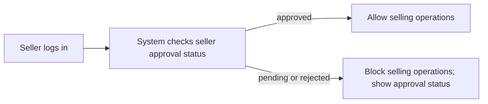

### Password Change for Sellers

- Sellers can change their password.
- Password change requires the seller’s current password to be provided as part of the change process.
- If the provided current password is incorrect, the system rejects the password change.
- If the password change is successful, the seller can continue using the updated password for subsequent logins.

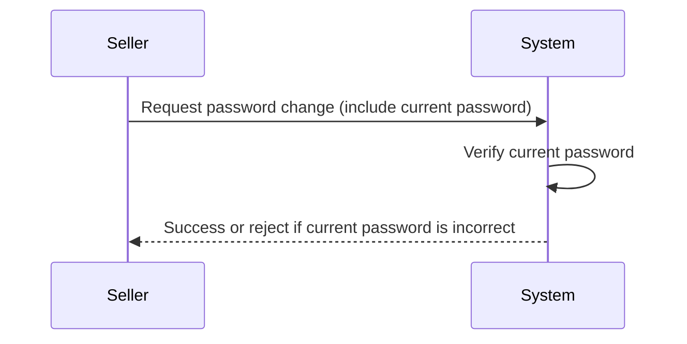

### Administrator Approval Status Visibility

- Sellers can view their administrator approval status.
- Approval status can be pending, approved, or rejected.
- The system must present the seller’s current approval status each time the seller checks their status.
- When the seller is approved, selling operations become available according to the approval gate.
- When the seller is pending or rejected, selling operations remain blocked.

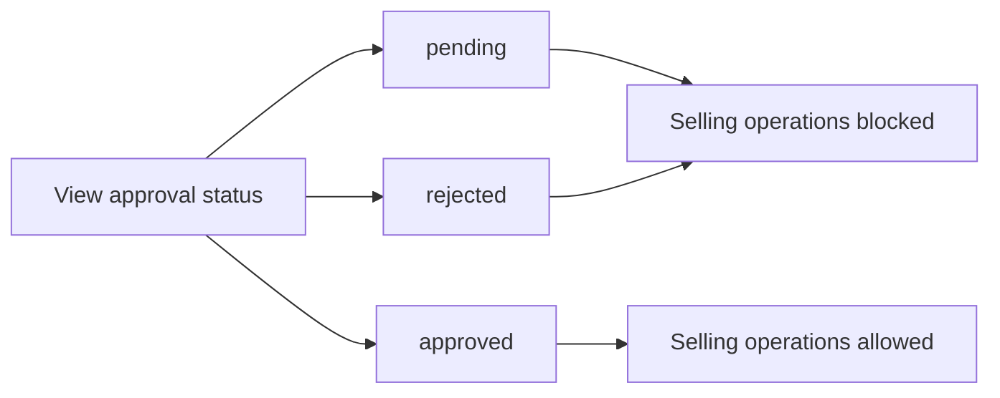

### Rejection Reason and Resubmission (If Rejected)

- If a seller registration is rejected, the seller can view the rejection reason.
- After seeing a rejection reason, sellers can submit a new registration request to be reconsidered.
- The system must treat a new registration request as a fresh submission that returns the seller to a pending approval state.
- Sellers can repeat resubmission after rejection.

```mermaid
sequenceDiagram
    participant S as Seller
    participant Sys as System
    S->>Sys: View rejection reason
    Sys-->>S: Show rejection reason
    S->>Sys: Submit new registration request
    Sys-->>S: New request submitted; status becomes pending
```

### Seller Account Deletion Eligibility Rules (Pending Orders and Pending Requests)

- Sellers can request to delete their seller account.
- The system must allow seller account deletion only if the seller has no pending orders in paid or shipped status.
- The system must also allow seller account deletion only if the seller has no pending cancellation or refund requests.
- The system must evaluate deletion eligibility across all relevant items the seller is responsible for.
- If the seller meets the eligibility conditions, the system proceeds with account deletion.
- If the seller does not meet the eligibility conditions, the system blocks the deletion request.

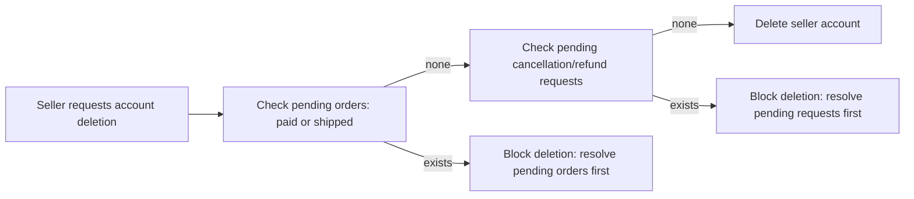

### Blocking Seller Account Deletion When There Are Pending Matters

- If a seller attempts to delete their account while they have pending orders in paid or shipped status, the system must block the deletion.
- If a seller attempts to delete their account while they have pending cancellation or refund requests, the system must block the deletion.
- When blocking deletion, the system must require the seller to resolve the pending orders and/or pending cancellation/refund requests before deletion can proceed.

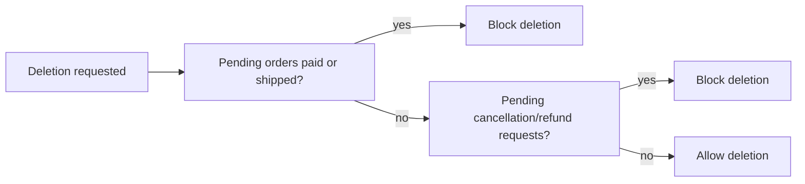

### Preserve Order History and Snapshots After Seller Deletion

- When a seller deletes their account, their products are removed from listings.
- After seller deletion, the system preserves order history for that seller’s past transactions.
- When seller account deletion occurs, order snapshots and item snapshots related to past purchases must remain available for relevant dispute resolution.
- The system must preserve the seller’s shop name in past orders.
- The system must preserve the seller’s shop logo in snapshots associated with order items.

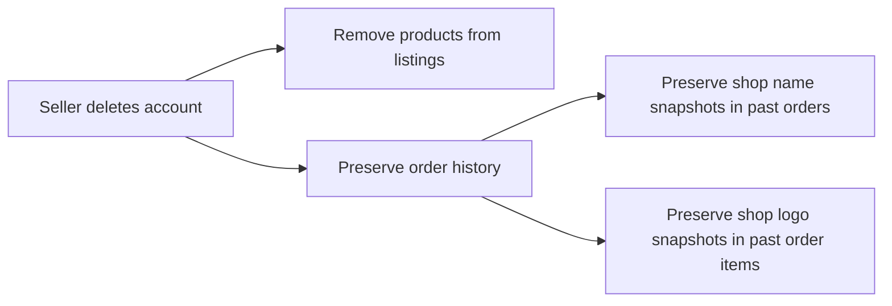

### Seller Dashboard Summary and Pending Requests

- Sellers can access a dashboard summary of their shop.
- The dashboard summary includes the total number of products.
- The dashboard summary includes the total number of order items for the seller’s products.
- The dashboard summary includes the number of pending cancellation requests.
- The dashboard summary includes the number of pending refund requests.
- Sellers can view a list of order items for their products.
- Sellers can filter the order item list by order item status.

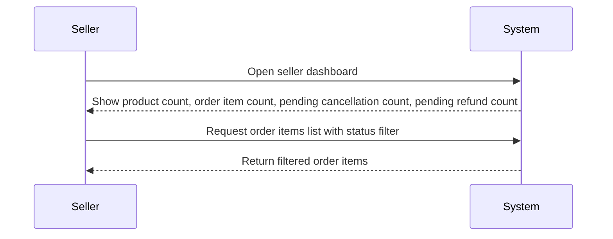

### Error Scenario: Seller Pending Approval Gatekeeping

- If a seller attempts to perform selling operations while their approval status is pending, the system must reject those actions.
- The error response must clearly indicate that selling operations are only available after administrator approval.
- The system must still allow the seller to view their approval status and, when applicable, any available rejection reason.

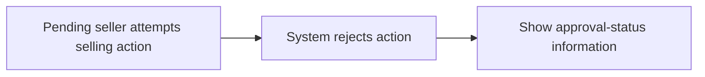

## AdminUser Operations

Any user must be able to submit a request to become an administrator, including a reason, so the system can evaluate and elevate appropriate users. Super administrators can review the list of pending administrator requests and approve or reject them based on the provided reason. When approved, the user becomes a regular administrator, expanding their ability to manage platform operations. Super administrators can also promote regular administrators to super administrator when needed, while super administrators can demote other super administrators back to regular administrator. Super administrators cannot demote themselves, and the system must enforce this rule. Administrators must be able to view seller approval requests and decide whether to approve or reject seller registrations, including requiring a rejection reason when rejecting. Administrators can suspend seller accounts, which must immediately hide the seller’s products from search and category listings and prevent purchases, while still allowing sellers to process existing orders and respond to cancellation or refund requests. Administrators must be able to unsuspend sellers to restore product visibility. Administrators can manage categories by creating, editing, and deleting categories and subcategories, with deleted categories causing affected products to become uncategorized. Administrators can oversee products and view snapshots for any product, and they can delete products for policy violations even after products are removed from normal listings. Administrators can oversee orders by viewing all orders and forcing cancellation or refund at the item level or the entire order level, ensuring customer refunds and stock restoration behavior are reflected. Administrators can manage end users by banning or unbanning customers and banning or unbanning sellers, with the system enforcing that banned users cannot log in while existing orders remain for banned sellers.

### Administrator request submission and review

1. WHEN any user submits a request to become an administrator, THE system SHALL record the user’s request reason.
2. WHEN a user submits a request to become an administrator, THE system SHALL make that request available for super administrators to review.
3. WHEN a super administrator views the list of pending administrator requests, THE system SHALL show each pending request’s submitting user and the provided reason.
4. WHEN a super administrator approves a pending administrator request, THE system SHALL update the submitting user’s administrator status to regular administrator.
5. WHEN a super administrator rejects a pending administrator request, THE system SHALL update the request as rejected.
6. WHEN a super administrator makes an approve or reject decision for a pending administrator request, THE system SHALL ensure the decision is final for that request.

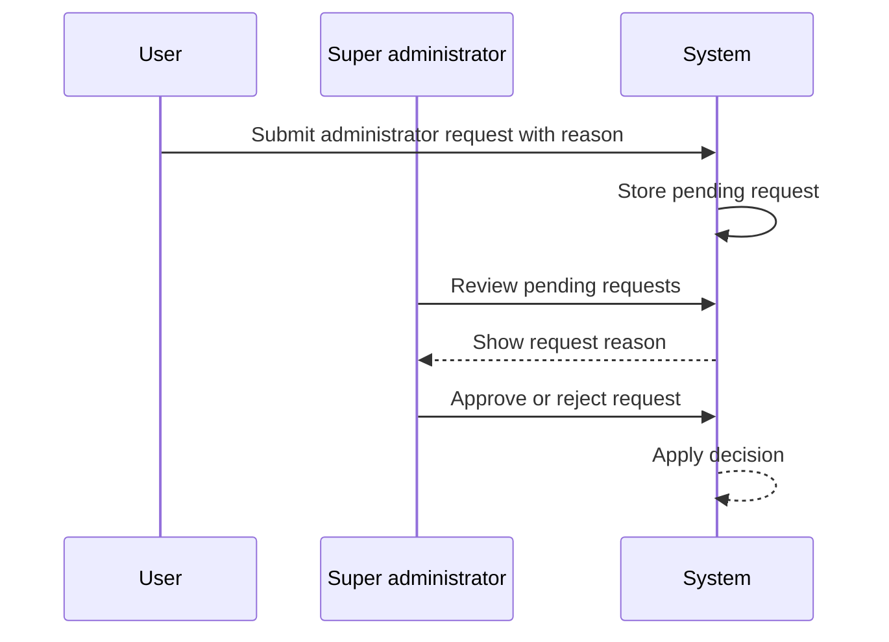


### Super administrator approve/reject rules for administrator requests

1. WHEN a super administrator selects a specific pending administrator request, THE system SHALL require that the super administrator chooses exactly one outcome: approve or reject.
2. WHEN the chosen outcome is approve, THE system SHALL grant the submitting user regular administrator capabilities.
3. WHEN the chosen outcome is reject, THE system SHALL keep the submitting user as a non-administrator (unless they already have administrator status through another path).
4. WHEN a super administrator attempts to make a second decision on a request that has already been decided, THE system SHALL prevent the second decision and maintain the first decision as the source of truth.

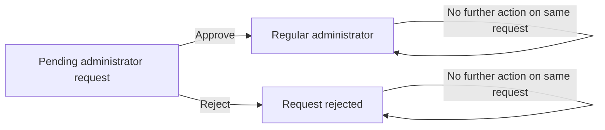


### Administrator promotion and demotion behavior (regular to super; super to regular)

1. WHEN a super administrator decides to promote a regular administrator, THE system SHALL change that target administrator’s grade to super administrator.
2. WHEN a super administrator decides to demote a regular administrator, THE system SHALL change that target administrator’s grade to regular administrator.
3. WHEN a super administrator performs promotion or demotion, THE system SHALL ensure the target administrator’s grade changes are reflected immediately in what that administrator can do.

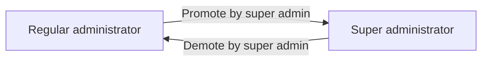


### Enforce rule: super administrator cannot demote themselves

1. WHEN a super administrator attempts to demote their own account, THE system SHALL block the operation.
2. WHEN the system blocks a self-demotion attempt, THE system SHALL leave the super administrator’s grade unchanged.

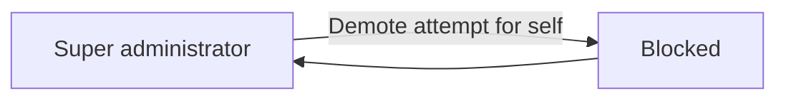


### Seller approval management with rejection reasons

1. THE system SHALL allow administrators to view the list of pending seller registrations requiring approval.
2. WHEN an administrator chooses to approve a pending seller registration, THE system SHALL change the seller approval status to approved.
3. WHEN an administrator chooses to reject a pending seller registration, THE system SHALL require the administrator to provide a rejection reason.
4. WHEN a seller registration is rejected, THE system SHALL store the rejection reason so the rejected seller can view it.
5. WHEN a seller is rejected, THE system SHALL allow the seller to submit a new registration request.
6. WHEN a seller submits a new registration request after rejection, THE system SHALL treat it as a new request that can be reviewed by administrators.
7. WHEN an administrator decides on a seller registration request, THE system SHALL ensure the seller can view their current approval status (pending, approved, rejected).

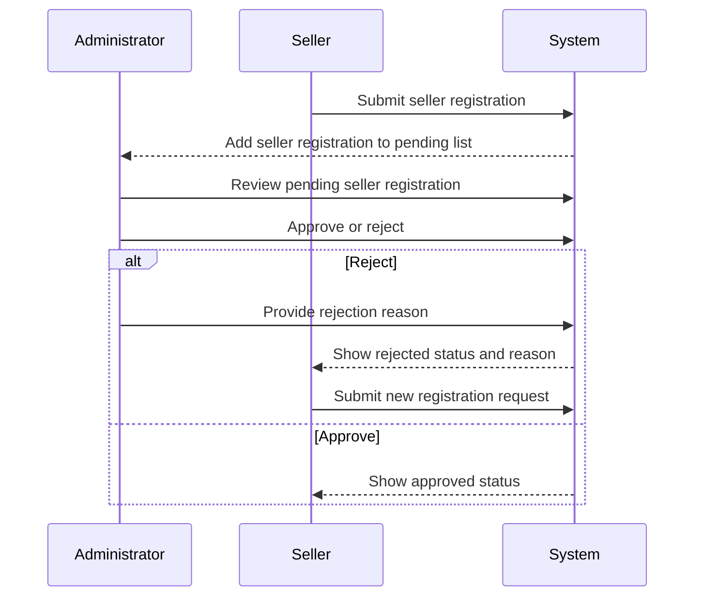


### Suspend and unsuspend seller account impact

1. WHEN an administrator suspends a seller account, THE system SHALL immediately hide that seller’s products from search and category listings.
2. WHEN an administrator suspends a seller account, THE system SHALL prevent the suspended seller’s products from being purchased.
3. WHEN a seller account is suspended, THE system SHALL still allow the seller to process existing orders as needed (including shipping items).
4. WHEN a seller account is suspended, THE system SHALL still allow the seller to respond to cancellation and refund requests for items already part of existing orders.
5. WHEN a seller account is suspended, THE system SHALL prevent the seller from creating new products.
6. WHEN a seller account is suspended, THE system SHALL prevent the seller from editing existing products.
7. WHEN an administrator unsuspends a seller account, THE system SHALL restore visibility of the seller’s products in search and category listings.

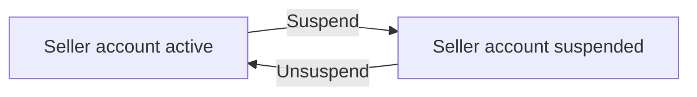


### Category management outcomes (create, edit, delete, subcategory nesting)

1. WHEN an administrator creates a category, THE system SHALL make that category available for customers to browse.
2. WHEN an administrator edits a category name or category description, THE system SHALL update the category information shown to customers.
3. WHEN an administrator edits a category that has a subcategory, THE system SHALL preserve the existing one-level subcategory structure as applicable.
4. WHEN an administrator deletes a category, THE system SHALL hide that category from customer browsing.
5. WHEN an administrator deletes a category, THE system SHALL move any products that were in the deleted categories to become uncategorized.
6. WHEN an administrator creates subcategories, THE system SHALL allow only one level of nesting for subcategories.

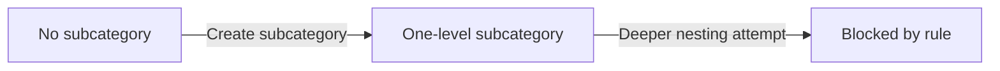


### Product oversight with snapshot viewing and product deletion policy

1. THE system SHALL allow administrators to view all products on the platform regardless of seller.
2. WHEN an administrator selects a product, THE system SHALL allow viewing of that product’s snapshots.
3. WHEN an administrator deletes a product due to policy violations, THE system SHALL remove the product from normal listings used for discovery.
4. WHEN an administrator deletes a product, THE system SHALL preserve snapshots so that they remain viewable for dispute resolution.

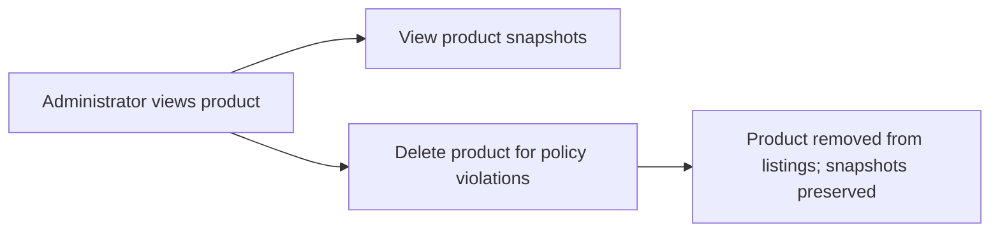


### Order oversight with forced cancellation and forced refund of items or orders

1. THE system SHALL allow administrators to view all orders on the platform.
2. WHEN an administrator force-cancels an individual order item, THE system SHALL set that item to the cancelled status.
3. WHEN an administrator force-cancels an individual order item, THE system SHALL refund the customer for that item.
4. WHEN an administrator force-cancels an individual order item, THE system SHALL restore stock quantities for the affected variant.
5. WHEN an administrator force-cancels an entire order, THE system SHALL apply cancellation to all items in the order.
6. WHEN an administrator force-refunds an individual order item, THE system SHALL set that item to the refunded status.
7. WHEN an administrator force-refunds an individual order item, THE system SHALL refund the customer for that item.
8. WHEN an administrator force-refunds an individual order item, THE system SHALL restore stock quantities for the affected variant.
9. WHEN an administrator force-refunds an entire order, THE system SHALL apply refund to all items in the order.

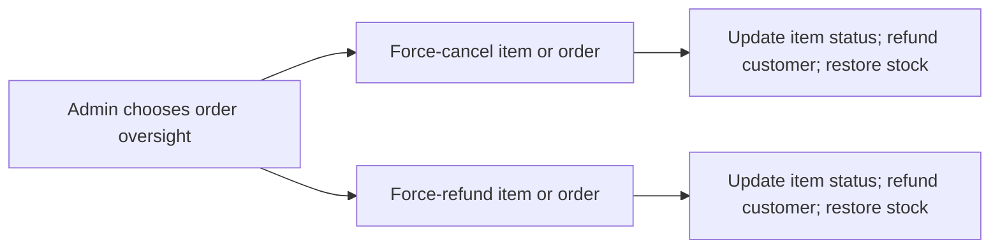


### User ban and unban effects on login (customers and sellers)

1. THE system SHALL allow administrators to ban customer accounts.
2. WHEN a customer account is banned, THE system SHALL prevent the customer from logging in.
3. WHEN an administrator unbans a customer account, THE system SHALL allow the customer to log in again.
4. THE system SHALL allow administrators to ban seller accounts.
5. WHEN a seller account is banned, THE system SHALL prevent the seller from logging in.
6. WHEN a seller account is banned, THE system SHALL keep existing orders functional such that existing orders remain for the seller to fulfill as originally created.
7. WHEN an administrator unbans a seller account, THE system SHALL allow the seller to log in again.


## Address Operations

Customers must be able to add multiple shipping addresses so they can choose where orders are delivered. When adding an address, customers must provide the recipient name, phone number, street address, city, state/province, postal code, and country. Customers must be able to edit existing addresses to keep their delivery information accurate. Customers must be able to delete addresses they no longer want to use, and the deleted address must no longer be available for checkout selection. Customers can set one address as the default shipping address, and when they proceed to checkout they should be able to use the default if they do not explicitly choose another address. In checkout flows, the selected shipping address must be shown in the order summary for customer confirmation. Once an order is placed successfully, the shipping address used for that order must remain fixed and visible when the customer views order details. If a customer attempts to check out with an unavailable or deleted address, the system must require selecting an available address or using the current default. If customers manage addresses frequently, the system must ensure that address updates only affect new checkouts and do not retroactively change already placed orders. This address management must be available only to customers who are registered and logged in, since guest browsing is not allowed.

### Address Management Access and Scope

Customers can manage shipping addresses only when they are registered and logged in.
The system shall not allow guests to view, create, edit, delete, or select shipping addresses for checkout.
Only the owning customer can manage (add, edit, delete, or set default) their own shipping addresses.
If a customer attempts to manage an address that does not belong to them, the system shall reject the operation.

### Adding Multiple Shipping Addresses with Required Information

Customers can add more than one shipping address.
When creating a new shipping address, the system shall require the customer to provide recipient name.
When creating a new shipping address, the system shall require the customer to provide the recipient phone number.
When creating a new shipping address, the system shall require the customer to provide the street address.
When creating a new shipping address, the system shall require the customer to provide the city.
When creating a new shipping address, the system shall require the customer to provide the state/province.
When creating a new shipping address, the system shall require the customer to provide the postal code.
When creating a new shipping address, the system shall require the customer to provide the country.
After successfully adding an address, the address shall become available for selection during checkout.
If any required address information is missing or incomplete, the system shall reject the address creation request and the address shall not be added.

### Editing Shipping Address Information

Customers can edit the shipping address details for addresses they own.
When editing an address, the system shall require the customer to keep all required shipping fields complete (recipient name, recipient phone number, street address, city, state/province, postal code, and country).
If a customer attempts to update an address with incomplete required information, the system shall reject the edit and the existing address data shall remain unchanged.
Edits to an existing address shall be reflected when the customer selects that address for future checkouts.
Address edits shall not retroactively change shipping address information already used on previously placed orders.

### Deleting a Shipping Address and Removing It from Checkout

Customers can delete addresses they own.
After a shipping address is deleted, the system shall remove it from the customer's available address list.
After deletion, the deleted address shall not be selectable during checkout.
If a customer attempts to delete an address that no longer exists (or has already been deleted), the system shall reject the deletion request.
If a customer attempts to set or keep a deleted address as the default shipping address, the system shall ensure that checkout cannot use the deleted address and shall require selecting an available address or using the current default.

### Default Shipping Address Selection

Customers can set exactly one of their shipping addresses as the default shipping address.
When a customer sets an address as the default, that address becomes the default shipping address for subsequent checkouts.
The system shall allow customers to change the default shipping address to a different address.
If the customer has not set any default shipping address, the system shall still allow the customer to select a shipping address during checkout.
If a customer deletes the current default shipping address, the system shall ensure checkout cannot use the deleted address and shall require the customer to select an available address or use the current default defined at checkout time.

### Checkout Address Selection and Order Summary Confirmation

During checkout, the system shall require the customer to select a shipping address.
Customers may use the default shipping address during checkout if they do not explicitly select another address.
The checkout order summary shall show the selected shipping address so the customer can review it before placing the order.
If the customer attempts to proceed to checkout with a deleted or otherwise unavailable shipping address, the system shall block the checkout attempt and require the customer to select an available shipping address (or the current default if applicable).
The chosen shipping address at checkout shall be used for the order placement.

### Shipping Address Becomes Fixed After Order Placement

Once an order is placed successfully, the shipping address used for that order shall become fixed.
After order placement, the system shall display the order's shipping address exactly as it was at the time the order was placed.
Subsequent edits or deletions of the customer's shipping addresses shall not change the shipping address shown on already placed orders.
Customers viewing order details shall see the fixed shipping address associated with each order.

### Checkout Flow for Address Selection and Fixation

flowchart LR
    A["Customer selects shipping address in checkout"] --> B["System validates selected address is available"]
    B --> C["Order summary shows chosen shipping address"]
    C --> D["Customer places order"]
    D --> E["Shipping address fixed for that order"]
    B --> F["If selected address is deleted/unavailable: block checkout and require selecting an available address"]

## Category Operations

Administrators must be able to create categories and subcategories to organize products across the platform. Category creation should allow one level of nesting, meaning subcategories can exist under a parent category but not deeper. Administrators must be able to edit category names and descriptions so the category information stays current. Administrators must be able to delete categories, and the system must ensure that products previously in a deleted category are shown as uncategorized afterward. Customers must be able to browse the list of all categories to discover products and filter what they want to view. Customers must be able to select a category to view the products within it, and those category pages must reflect the latest category structure. If a category is deleted while products are still active, customers should not see those products under the removed category anymore. Customers should still be able to find products in search even if categories change, reflecting that category visibility is based on current category mapping. Errors in category management should be handled so that invalid category structure changes do not disrupt browsing for customers. Overall, category operations must align with administrator control: customers can view categories but cannot create or modify them.

### Administrator Category Creation with One-Level Subcategories

### Administrator Category Creation
When an administrator creates a category, the system shall allow the administrator to provide a category name and a category description.
When an administrator creates a category that is intended to be a subcategory, the system shall allow the administrator to designate exactly one parent category.
WHILE a category hierarchy is being created, THE system shall enforce one level of nesting by allowing subcategories only directly under a top-level category.
IF the administrator attempts to create a subcategory under an existing subcategory (creating deeper than one level), THEN THE system shall reject the category creation request.
IF required category information is missing (such as the category name or description), THEN THE system shall reject the category creation request.

### Prevent Customers from Modifying Categories
IF a customer attempts to create a category or a subcategory, THEN THE system shall reject the request.
IF a customer attempts to set or change the parent relationship that defines a subcategory, THEN THE system shall reject the request.

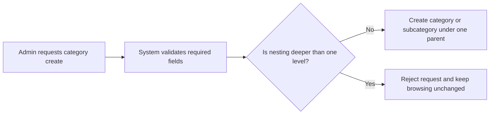


### Administrator Category Name and Description Editing

### Category Editing by Administrators
WHEN an administrator edits a category name, THE system shall apply the updated name to the category.
WHEN an administrator edits a category description, THE system shall apply the updated description to the category.
WHILE category details are being edited, THE system shall ensure that the update affects only the selected category’s name and description and does not change the category’s current placement rules (one-level subcategory nesting).

### Prevent Customers from Editing Categories
IF a customer attempts to edit a category name or category description, THEN THE system shall reject the request.
IF a customer attempts to edit a subcategory relationship as part of editing, THEN THE system shall reject the request.

### Category Changes Reflected in Customer Browsing
WHEN a category’s name or description is changed by an administrator, THEN THE system shall reflect the updated information when customers browse the categories list.
WHEN a category’s name or description is changed by an administrator, THEN THE system shall reflect the updated information when customers view products within that category.

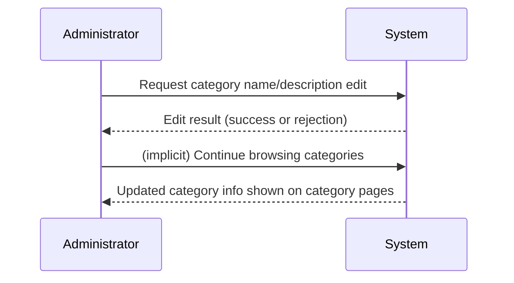


### Customer Browsing Categories List

### Viewing All Categories
WHEN a registered customer browses categories, THE system shall display a list of all categories.
WHEN a customer views the categories list, THE system shall display categories using the latest category name and description.

### Category List Reflects Current Structure
WHEN categories are created or edited by administrators, THEN THE system shall make the new or updated category information available to customers in the categories list.

### Prevent Unauthorized Category Modification
IF a customer attempts a category modification action (create, edit, or delete), THEN THE system shall reject the request.


### Customer Viewing Products Within a Category

### View Products for a Selected Category
WHEN a customer selects a category from the categories list, THEN THE system shall show the products within that category.
WHEN a customer views a category page, THE system shall present the latest category-to-product mapping for that category.

### Deleted Category Handling in Category Pages
WHEN an administrator deletes a category, THEN THE system shall ensure that products previously in the deleted category are shown as uncategorized instead of remaining visible under the deleted category page.
WHEN an already-existing customer navigation targets a deleted category page, THEN THE system shall prevent the customer from viewing the deleted category’s products under that removed category.

### Category Changes During Browsing
WHEN category structure changes (such as creation, editing, or deletion), THEN THE system shall ensure that customers’ category pages reflect the current category structure.


### Administrator Category Deletion and Products Become Uncategorized

### Category Deletion by Administrators
WHEN an administrator deletes a category, THEN THE system shall remove that category from customer browsing in the categories list.
WHEN an administrator deletes a category, THEN THE system shall update products that were assigned to that deleted category so they are no longer treated as belonging to that deleted category.
WHEN products are removed from a deleted category, THEN THE system shall make those products appear as uncategorized (instead of disappearing entirely).

### Prevent Customers from Deleting Categories
IF a customer attempts to delete a category, THEN THE system shall reject the request.

### Ensure Category Listings Do Not Break
WHEN a category is deleted while customers are browsing, THEN THE system shall keep category browsing functional and shall not cause customers to see stale products under the deleted category.


### Invalid Category Hierarchy Error Handling

### Reject Deeper Nesting Attempts
IF an administrator attempts to create or edit a category hierarchy that would result in nesting deeper than one level (subcategory under a subcategory), THEN THE system shall reject the change.
IF an invalid hierarchy is submitted for category creation (such as an attempt to assign a parent that would violate the one-level nesting rule), THEN THE system shall reject the request.

### Preserve Customer Browsing Reliability
IF an administrator submits an invalid category hierarchy change that fails validation, THEN THE system shall not alter the existing category structure available to customers.

```mermaid
flowchart LR
    A["Admin attempts invalid hierarchy change"] --> B["System validates hierarchy depth"]
    B --> C{"Validation pass?"}
    C -->|"No"| D["Reject request; keep current structure"]
    C -->|"Yes"| E["Apply change and update customer browsing"]
```


## Product Operations

Sellers must be able to create products by providing a required name, required description, a required category (optionally selecting a subcategory), and a required base price. After creation, each product belongs to the seller who created it and must be manageable only by that seller. Sellers can edit their own products, and every edit must create a product snapshot so the previous state is preserved for dispute resolution. Sellers can delete their own products, but only if there are no pending order items in paid or shipped status for any variant of the product and there are no pending cancellation or refund requests for any variant. When a product is deleted, the product must no longer appear in search or category listings, and its variants and associated inventory records are removed from normal availability. Even after deletion, snapshot information for the deleted product must remain viewable for the relevant parties. Sellers and administrators must be able to view product snapshots, with sellers restricted to their own products while administrators can view snapshots of any product. Customers must be able to browse products in search and category pages, and deleted products should never appear there. Customers viewing product details must see the current product information as well as the seller’s shop name. If a seller attempts to edit or delete a product in a way that violates the pending cancellation/refund or pending order item rules, the system must block the deletion and prompt the seller to resolve pending activity first. Additionally, products with no variants should still appear in search but be marked as unavailable, while products with variants remain purchasable when stock conditions allow.

### Seller Product Creation (Required Details and Association)

#### 1. Product Creation Inputs
Sellers can create a product by providing a required product name, a required product description, a required category selection, and a required base price.

#### 2. Category Selection Including Subcategory
When creating a product, a seller may select a subcategory that is within the chosen category (one level of nesting).

#### 3. Ownership Association
When a seller creates a product, the product is associated to the seller who created it, and only that seller can manage that product.

#### 4. Category Requirement
Product creation must not succeed unless the seller selects a category.

#### 5. Base Price Requirement
Product creation must not succeed unless the seller provides a base price.

#### 6. Name and Description Requirement
Product creation must not succeed unless the seller provides both a product name and a product description.

#### 7. Product Visibility After Creation
After a successful product creation, the product becomes eligible to appear in customer browsing experiences (search and category listings), subject to product availability rules described elsewhere.

#### 8. Error Conditions for Missing Required Inputs
If any required creation detail is missing (name, description, category, or base price), the system rejects the request and does not create the product.

### Product Editing and Immutable Snapshot on Successful Change

#### 1. Seller Editing Scope
Sellers can edit only their own products.

#### 2. Editable Data Covered by Snapshots
Whenever a seller makes an editable change to a product (including changes to the product’s images and other product fields), the system creates a product snapshot that preserves the previous state before the change and the new state after the change.

#### 3. Snapshot Immutability
Created snapshots are immutable and cannot be deleted.

#### 4. Snapshot Creation Only on Success
If an edit request fails validation or is blocked by an eligibility rule, the system must not create a misleading snapshot; snapshots are created only when the edit succeeds.

#### 5. Snapshot Captures Prior and After Values
Product snapshots must record when the change was made, what was changed, and the values before and after.

#### 6. Edit Includes Product Variants State Preservation
When a product is edited, the product snapshot also preserves the complete state of the product’s variants at that moment.

#### 7. Images Included in Snapshot
If product images are modified as part of the edit, the snapshot must reflect the resulting image set, including the main image selection behavior (first image becomes the main/thumbnail image).

#### 8. Admin Oversight Supports Disputes
Because snapshots support dispute resolution, the system must ensure snapshots remain viewable by the relevant parties after edits.

### Seller Product Deletion Eligibility (Pending Orders and Pending Requests)

#### 1. Deletion Eligibility Gated by Pending Order Items
A seller can delete their own product only if there are no pending order items for any variant of that product in paid or shipped status.

#### 2. Deletion Eligibility Gated by Pending Cancellation or Refund Requests
A seller can delete their own product only if there are no pending cancellation requests and no pending refund requests for any variant of that product.

#### 3. Blocking When Eligibility Is Not Met
If the seller attempts to delete a product that violates the eligibility conditions (due to pending paid/shipped order items or pending cancellation/refund requests), the system blocks the deletion.

#### 4. User Feedback for Blocked Deletion
When deletion is blocked, the system informs the seller that the product cannot be deleted because there are pending order items and/or pending cancellation/refund requests that must be resolved first.

#### 5. Successful Deletion Is Final for Listings
When deletion succeeds, the product must no longer appear in customer search or category listings.

#### 6. Eligibility Applies to Product-Level Deletion
The seller’s deletion action applies to the entire product; therefore, eligibility is evaluated across all variants of the product, not only selected variants.

```mermaid
flowchart LR
    A["Seller requests product deletion"] --> B["Check pending paid or shipped order items for any product variant"]
    B --> C["Check pending cancellation or refund requests for any product variant"]
    C --> D{ "Eligibility satisfied?" }
    D -->|"Yes"| E["Delete product" ]
    D -->|"No"| F["Block deletion and prompt seller to resolve pending activity"]
```

### Product Deletion Effects: Hide From Search and Category Listings

#### 1. Hiding From Search and Categories
When a seller deletes a product (with eligibility satisfied), the product must no longer appear in customer search results and must no longer appear in category listings.

#### 2. Variant Availability After Deletion
Deleted products (and their variants) must be treated as not available for purchase through browsing and shopping flows.

#### 3. Customer Browse Behavior
Customers must not be able to reach deleted product information through normal browsing entry points (search and category pages).

#### 4. Conflict Resolution Through Snapshots
Even though deleted products are hidden from browsing, snapshots of the deleted product remain viewable by the relevant parties for dispute resolution.

### Cascading Deletion: Variants and Normal Availability Removal

#### 1. Variants Removed From Normal Availability
When a seller deletes a product, all variants belonging to that product are deleted from normal availability.

#### 2. Inventory Records Removed From Normal Availability
Deletion of a product includes removal of its associated inventory records from normal availability calculations and purchasing outcomes.

#### 3. Purchased History Is Not Removed
Product deletion does not erase existing order history records; customers’ order item records remain available in order history.

#### 4. Product Snapshots Remain Even After Variant Deletion
While variants are removed from normal availability, product snapshot information needed to preserve historical state remains preserved as part of snapshot viewing rules.

### Snapshots Preserved After Product Deletion (Immutability and Viewability)

#### 1. Snapshot Preservation Across Deletion
Snapshots of a product must remain preserved even after the product is deleted.

#### 2. Snapshot Immutability Throughout Lifecycle
Snapshots are immutable and cannot be deleted, including after the underlying product or variants are deleted.

#### 3. Snapshot Content Integrity for Dispute Resolution
Snapshots must preserve the complete state necessary for dispute resolution, including product field values and the state of variants at the time of the snapshot.

#### 4. Who Can View After Deletion
Snapshot view permissions must still apply after deletion: sellers can view snapshots of their own products, and administrators can view snapshots of any product.

### Seller Access to Product Snapshots (Own Products Only)

#### 1. Seller Snapshot Viewing Restriction
Sellers can view snapshots for products they own (defined as products created by that seller).

#### 2. Snapshot Viewing Supports Dispute Resolution
Seller access to snapshots must be sufficient for dispute resolution by allowing them to view what changed and the before/after values captured in snapshots.

#### 3. Snapshots Remain Viewable After Deletion
Even if the product has been deleted, the seller must still be able to view the relevant snapshots for that product.

#### 4. No Unauthorized Cross-Seller Access
A seller must not be able to view snapshots for products they do not own.

### Administrator Access to Product Snapshots (Any Product)

#### 1. Administrator Snapshot Viewing Scope
Administrators can view snapshots of any product on the platform.

#### 2. Snapshot View Remains After Deletion
Administrators must still be able to view snapshots for products even after those products are deleted.

#### 3. Snapshot Support for Oversight and Disputes
Administrator snapshot access must include the before/after values and change timing so administrators can support dispute resolution and oversight.

#### 4. Admin Oversight Does Not Replace Eligibility Rules
Administrator ability to view snapshots must not change the seller eligibility rules for deletion of their own products.

### Customer Product Search and Listing Availability (No-Variant Unavailable Label)

#### 1. Search and Category Visibility for Product Candidates
Customers can search for products by name and can browse products within categories.

#### 2. Display of Main Image Thumbnail
In product listings (search and category pages), each product shows the main image thumbnail.

#### 3. Availability Display When Product Has No Variants
If a product has no variants, it must still appear in search results, but it must be shown as "unavailable".

#### 4. Eligibility for Purchase When Variants Exist
If a product has variants, it remains visible for purchasing flows subject to variant stock availability rules.

#### 5. Price Display When Variants Exist
Listings show the base price or a price range when variants have different prices.

#### 6. Unavailable Due to Deleted Product or Variants
If a product or its variants are deleted, they must not appear as purchasable items via search and category listings.

#### 7. Sorting, Filtering, and Pagination Behavior
Customer search results are paginated and can be filtered by category, price range, and in-stock only, and can be sorted by newest first, price low to high, or price high to low.

### Error Scenario: Deletion Blocked Due to Pending Cancellations or Refunds

#### 1. Specific Blocking for Pending Cancellation Requests
If a seller attempts to delete a product while there are pending cancellation requests for any variant of that product, the system rejects the deletion.

#### 2. Specific Blocking for Pending Refund Requests
If a seller attempts to delete a product while there are pending refund requests for any variant of that product, the system rejects the deletion.

#### 3. Combined Pending Conditions
If both pending cancellations/refunds and pending order items exist, deletion must still be rejected; the system must treat any violation as ineligible.

#### 4. No Partial Deletion
When deletion is rejected due to pending activity, the system does not delete the product and does not delete its variants or remove its normal availability.

#### 5. Resolution Path Encouragement
When rejection occurs, the system must clearly indicate that the seller needs to resolve the pending cancellation/refund activity before deletion can proceed.

## ProductImage Operations

Sellers must be able to upload multiple images for each product so customers can evaluate the item visually. Sellers must be able to reorder product images, with the first image acting as the main thumbnail that is shown prominently in listings. Sellers must be able to delete individual images from their product without removing the entire product. Any image change, including reordering or deletion, must be captured through the product snapshot behavior so the previous image state is preserved. Customers must see the main image in product listing contexts such as search results and category pages, ensuring a consistent thumbnail experience. On the product detail page, customers must be able to view all images associated with the product in their current order. If a seller deletes all images for a product, the system should still allow the product to exist, but the customer experience should reflect the missing images rather than showing obsolete thumbnails. If a customer is viewing product information while images are being changed by the seller, the displayed images should reflect the latest saved product state. Sellers should only be able to manage images for products they own, and attempts to modify images for other sellers’ products must be rejected. Errors related to image management must not affect the core product details, and the product should remain consistent for browsing and checkout.

### Upload Multiple Product Images

Sellers can upload multiple images for a product they own.
When a seller uploads new images, the images become part of that product’s current image set.
Product browsing and checkout must use the latest saved image set after the upload completes.
If an upload attempt fails, the product’s existing images remain unchanged so the product can still be viewed consistently.
Uploading product images does not remove or alter the product’s basic details (such as name, description, category, or price).

### Reorder Images with Main Thumbnail as First

Sellers can reorder a product’s images.
The first image in the seller-defined order acts as the main thumbnail image.
Reordering updates which image is treated as the main thumbnail for listing contexts.
When image order is changed, the updated order is reflected in subsequent customer browsing starting with the next view of the product listing.
If the seller attempts to reorder but the referenced image is missing (for example, it was deleted or never existed), the reorder operation is rejected and the existing order remains unchanged.

### Delete Product Images

Sellers can delete individual images from a product without deleting the product.
Deleting an image removes it from the product’s current image set immediately for subsequent customer views.
If a seller deletes the current main thumbnail image, the main thumbnail automatically becomes the next first image in the remaining order.
Sellers can delete images from products they own.
Deleting images is allowed even if the deletion results in zero remaining images; the product remains visible for browsing, and customers should not see obsolete thumbnails.

### Image Changes Included in Product Snapshots

Whenever editable image data for a product is modified (including uploading new images, reordering images, or deleting images), the system creates a product snapshot that records the change.
Each product snapshot preserves the previous image state and the new image state so an administrator or relevant owner can reconstruct what the product looked like at the time.
Snapshots created from image changes are immutable and cannot be deleted.
Snapshot creation occurs only when the image change is successfully applied; failed image modifications do not create misleading snapshots.
Sellers can view snapshots for their own products, including snapshots that reflect image changes.

### Customer Listing Shows Main Image Thumbnail

When customers view product lists (such as search results or category pages), each listed product shows the main thumbnail image.
The main thumbnail shown in lists matches the seller’s current first image order.
If a product has no images, the product listing must reflect the missing image state rather than showing an outdated thumbnail.
Listing pages must remain usable and consistent even while sellers are actively uploading, reordering, or deleting images.

### Product Detail Page Shows All Images in Order

When customers view a product detail page, the page shows all images associated with the product.
Images are displayed in the order defined by the seller, including the main thumbnail appearing first.
If the seller deletes images such that fewer images remain, the customer detail page shows only the remaining images.
If a customer is viewing the product detail while image changes are being made, the system ensures the displayed images reflect the latest saved product image state for that view.

### Seller Can Only Manage Own Product Images

A seller can upload, reorder, and delete images only for products that belong to that seller.
If a seller attempts to modify images for a product that belongs to another seller, the system rejects the attempt.
Rejected attempts do not change the product’s image set and do not create product snapshots.
When an operation is rejected due to ownership, the product remains viewable with its existing images by customers.

### Error Scenario: Modify Images for Another Seller

If a seller tries to reorder or delete images for a product they do not own, the system must block the operation.
In this case, the user must receive an error outcome indicating the modification is not allowed for that product.
The system must not partially apply the image modification; the product’s current images and their order remain exactly as before.
Any integrity-related effects (such as thumbnail selection and image display on listing/detail pages) must remain consistent with the prior saved state.

## ProductVariant Operations

Sellers must be able to add variants to their products so customers can choose specific combinations of options, such as different colors or sizes. Sellers must be able to edit variant details, including the SKU code, option values, and an optional price override when provided. Every variant edit must create a variant snapshot as part of the platform’s snapshot principle so historical states are preserved. Sellers must be able to delete their variants only when there are no pending order items in paid or shipped status for that variant and no pending cancellation or refund requests for that variant. A product must have at least one variant to be purchasable; if a product ends up with no variants, it should still be visible in search but be marked as unavailable. Customers viewing a product detail page must be able to see all available variants with their prices and stock status, helping them choose what to buy. When a variant is out of stock, customers must see it marked accordingly in the variant list. Variants that are deleted or are out of stock must not be allowed to be added to the cart, and the cart should mark such variants as unavailable if they were already present. If a seller tries to delete a variant that is involved in pending shipping, cancellation, or refund workflows, the system must block the deletion and require the seller to complete or clear the pending items first.

### Product Variants as Option Combinations

Sellers can add product variants to their products by defining a specific combination of option values (for example, color and size combinations), so customers can choose the exact option combination they want.

Each variant belongs to a single product and represents one purchasable option combination for that product.

Customers can view the full list of a product’s variants on the product detail page, including option values so they can choose the correct variant.

Sellers can create a variant only for their own products.

A product is purchasable only when it has at least one variant.

If a product has no variants, customers must still be able to discover the product in search and category listings, but the product must be shown as unavailable.

A variant has a stock availability that determines whether it is in stock or out of stock, and this availability must be shown on the product detail page for each variant.

Out-of-stock variants are visible in the product variant list, but must be presented as not available for purchase.

### Variant SKU and Option Values Management

Sellers can edit the identifier (SKU code) and option values for variants belonging to their own products.

A variant’s option values must remain consistent with how the variant is displayed to customers on the product detail page, so that the option combination a seller edits is reflected in what customers can select.

When a seller edits variant option values or the SKU code, customers must see the updated variant details on the product detail page.

Sellers can edit the option values of a variant even if the variant is currently out of stock, provided the variant is not blocked by pending workflows described in this unit.

If a seller edits a variant, the system must create a variant snapshot to preserve the previous and updated state (defined further under “Variant Snapshot on Every Editable Change”).

### Optional Variant Price Override

Sellers can optionally override the product’s base price at the variant level by providing a variant-specific price override.

When a variant has a price override, the price shown for that variant on the product detail page must use the variant’s price override.

When a variant does not have a price override, the price shown for that variant on the product detail page must follow the product’s base price.

Customers must see the correct per-variant price on the product detail page to make purchase decisions for a specific option combination.

If a seller edits a variant’s price override setting, the updated price must be reflected in the product detail page variant list.

Any successful edit to a variant’s price override must create a variant snapshot (defined further under “Variant Snapshot on Every Editable Change”).

### Variant Snapshot on Every Editable Change

Whenever a seller successfully edits a variant’s SKU code, option values, or variant price override, the system must create a variant snapshot.

The snapshot must record that the change occurred and must preserve the before-and-after values for the edited variant fields.

Variant snapshots must be immutable and cannot be deleted.

Sellers must be able to view snapshots of their own variants.

Administrators must be able to view snapshots of any variant.

Snapshot visibility must support dispute resolution by allowing relevant parties to review historical variant states.

Flow of snapshot creation on successful variant edit:

```mermaid
flowchart LR
    A["Seller updates variant details"] --> B["System validates edit"]
    B -->|"Valid"| C["Create variant snapshot with before/after values"]
    C --> D["Persist updated variant details"]
    B -->|"Invalid"| E["Reject edit; do not create snapshot"]
```

Note: If an attempted edit is rejected due to validation or business constraints, the system must not create a misleading snapshot.

### Variant Deletion Eligibility and Blocking for Pending Paid or Shipped Items

Sellers can delete variants that belong to their own products.

The system must allow variant deletion only when there are no pending order items associated with that variant in paid or shipped status.

If there exists at least one pending paid or shipped order item for the variant, the system must block the variant deletion attempt.

When deletion is blocked due to pending paid or shipped order items, the system must require the seller to complete or clear the pending workflows first before allowing the variant to be deleted.

Deleting a variant must remove it from the list of available variants so it cannot be purchased.

If deletion succeeds, any subsequent customer browsing of the deleted variant must not present it as selectable for purchase.

### Variant Deletion Eligibility and Blocking for Pending Cancellation or Refund Requests

Sellers can delete variants that belong to their own products.

The system must allow variant deletion only when there are no pending cancellation requests associated with that variant.

The system must also allow variant deletion only when there are no pending refund requests associated with that variant.

If there exists at least one pending cancellation request for the variant, the system must block the variant deletion attempt.

If there exists at least one pending refund request for the variant, the system must block the variant deletion attempt.

When deletion is blocked due to pending cancellation and/or refund requests, the system must require the seller to complete or clear those requests first before allowing the variant to be deleted.

If deletion is successful, the variant must be treated as unavailable for purchase and must not be addable to the cart (see “Cart Prevents Adding Deleted or Out-of-Stock Variants”).

### Cart Prevents Adding Deleted or Out of Stock Variants

Customers must be able to add a specific variant to their cart.

When adding an out-of-stock variant, the system must prevent the variant from being added to the cart.

When adding a deleted variant, the system must prevent the variant from being added to the cart.

If a variant becomes out of stock or deleted after it was already in a customer’s cart, the cart must mark that variant as unavailable.

Cart behavior must prevent unavailable variants from being checked out as part of an order.

Customers can still view the cart contents and see that previously added variants are now marked as unavailable when the variant is deleted or out of stock.

Flow of cart item availability handling:

```mermaid
flowchart LR
    A["Customer attempts to add variant to cart"] --> B["System checks variant availability"]
    B -->|"In stock and not deleted"| C["Add or update cart quantity for that variant"]
    B -->|"Out of stock"| D["Do not add; variant remains unavailable for cart"]
    B -->|"Deleted"| E["Do not add; variant remains unavailable for cart"]
```

For existing cart items, the system must update availability status when variants are deleted or stock reaches zero, and reflect this as unavailable in the cart.

### Error Scenario: Attempting Variant Deletion While Pending Requests Exist

If a seller attempts to delete a variant that has any pending paid or shipped order items, the system must reject the deletion request.

If a seller attempts to delete a variant that has any pending cancellation requests, the system must reject the deletion request.

If a seller attempts to delete a variant that has any pending refund requests, the system must reject the deletion request.

For any blocked deletion attempt, the system must communicate that deletion is not allowed while those pending items or requests exist.

For any blocked deletion attempt, the system must not delete the variant.

For sellers, this rejection must be enforced consistently so that deletion eligibility only becomes true after the seller clears the relevant pending order items and resolves pending cancellation/refund requests.

Flow of deletion blocking decision:

```mermaid
flowchart LR
    A["Seller requests variant deletion"] --> B["Check pending paid/shipped order items"]
    B -->|"Exists"| C["Reject deletion"]
    B -->|"None"| D["Check pending cancellation requests"]
    D -->|"Exists"| E["Reject deletion"]
    D -->|"None"| F["Check pending refund requests"]
    F -->|"Exists"| G["Reject deletion"]
    F -->|"None"| H["Allow deletion"]
```

This unit must ensure that the deletion outcome respects the deletion blocking conditions described in the earlier sections.

## InventoryRecord Operations

Inventory management must ensure that each product variant’s stock is reflected accurately based on inventory history, not just a single current value. Sellers must be able to add inventory to a variant for restocking, providing both a quantity change and a reason for the update. Sellers must also be able to subtract inventory for adjustments or loss, again capturing a quantity change and reason. Order placement must automatically reduce stock for the purchased variant quantities, keeping inventory consistent with customer purchases. When order items are cancelled or refunded, the system must automatically increase stock for the affected variant quantities, restoring availability. Sellers must be able to view the full inventory history for each variant to understand what caused stock changes. Customers must see the in-stock or out-of-stock status for variants on the product detail page. When a variant reaches zero stock, it must be shown as out of stock, and customers must not be able to add out-of-stock variants to the cart. If a cart contains a quantity that exceeds the currently available stock, the system must show a warning so the customer understands the mismatch before checkout. During checkout, unavailable items must not be checked out, ensuring the order cannot be placed with insufficient stock. Errors in inventory adjustments should not break visibility of stock status, and the business rule of stock reaching zero must always be enforced for cart and checkout behavior.

### Inventory History as the Source of Stock Availability

The system shall treat each variant’s available stock as the result of its inventory history records, rather than a single manually maintained stock value.

The system shall ensure that every inventory change is represented as an inventory history record tied to a specific product variant.

The system shall display the correct in-stock or out-of-stock status for each variant based on the calculated stock quantity from inventory history records.

The system shall show an out-of-stock status when the calculated stock quantity for a variant reaches zero.

The system shall keep inventory history records immutable in the sense that they are preserved for viewing as the basis for stock calculations.

The system shall ensure stock status displayed on product detail and listings reflects the latest inventory history calculation.

The system shall not require or rely on product snapshots to determine current inventory status; inventory history records drive stock availability.

### Seller Restock: Adding Quantity with a Reason

Sellers shall be able to add inventory for a product variant to restock it.

When a seller adds inventory, the system shall require a quantity change and a reason.

When a seller adds inventory, the system shall record the quantity change and the reason in the variant’s inventory history.

After a successful restock, the system shall update the calculated stock quantity for that variant based on the inventory history records.

After a successful restock, the system shall update the variant’s in-stock/out-of-stock visibility so customers see the updated availability status.

If a seller attempts to add inventory without providing both quantity change and reason, the system shall reject the inventory change request.

The system shall ensure restock operations do not create negative inventory history changes; restock specifically represents quantity increases as recorded in inventory history.

### Seller Stock Adjustment or Loss: Subtracting Quantity with a Reason

Sellers shall be able to subtract inventory for a product variant to represent adjustments or loss.

When a seller subtracts inventory, the system shall require a quantity change and a reason.

When a seller subtracts inventory, the system shall record the quantity change and the reason in the variant’s inventory history.

After a successful subtraction, the system shall update the calculated stock quantity for that variant based on the inventory history records.

After a successful subtraction, the system shall update the variant’s in-stock/out-of-stock visibility so customers see the updated availability status.

If a seller attempts to subtract inventory without providing both quantity change and reason, the system shall reject the inventory change request.

The system shall represent stock subtraction as quantity decreases in the inventory history records.

### Automatic Stock Decrease on Successful Order Placement

When an order is placed successfully, the system shall decrease stock quantities for each purchased product variant by the ordered quantity.

For each purchased variant, the system shall record an inventory history entry representing a negative quantity change that corresponds to the order placement.

The system shall associate the inventory decrease with the purchased variant quantities involved in the successful order.

After order placement stock decreases are recorded, the system shall update the calculated stock quantity and resulting in-stock/out-of-stock visibility for those variants.

The system shall not create inventory decreases for an order that is not created (for example, when payment fails).

### Automatic Stock Restoration on Approved Cancellation and Refund

When a customer cancellation is approved for an order item, the system shall restore stock quantities for the affected product variant(s) and quantity(ies).

When a refund is approved for an order item, the system shall restore stock quantities for the affected product variant(s) and quantity(ies).

For each restored variant, the system shall record an inventory history entry representing a positive quantity change that corresponds to the approved cancellation or refund.

The system shall ensure restored stock results in an updated calculated stock quantity based on the inventory history records.

After stock restoration, the system shall update in-stock/out-of-stock visibility so customers see the availability reflected.

The system shall restore stock only for approved cancellation and approved refund outcomes, not for rejected requests.

### Inventory History Viewing for Variant Transparency

Sellers shall be able to view the full inventory history for each of their product variants.

The inventory history view shall show each inventory record’s quantity change and the reason.

The inventory history view shall show when each inventory record was created.

The system shall ensure that inventory history provides transparency into what caused stock changes, including restocks, adjustments or loss, order placement decreases, and stock restorations from approved cancellations/refunds.

Administrators shall be able to view inventory history records as part of product oversight (as applicable to their platform oversight responsibilities).

If a seller requests inventory history for a variant they do not own, the system shall reject the request.

### Cart and Checkout Stock Enforcement using Stock Availability

When a customer views a product and considers adding variants to the cart, the system shall reflect in-stock or out-of-stock status based on inventory history-driven stock calculations.

The system shall prevent customers from adding out-of-stock variants to the cart.

When a customer changes cart quantities, the system shall detect when a cart item quantity exceeds currently available stock.

If a cart quantity exceeds the currently available stock, the system shall show a warning to the customer indicating the mismatch.

At checkout, the system shall block placing an order if any cart item is unavailable due to insufficient stock.

The system shall ensure this checkout availability check uses the current stock derived from inventory history records.

The system shall ensure that unavailable items cannot be included in an order placed from the cart.

### Error Handling: Inventory Mismatch During Cart and Quantity Changes

If inventory changes occur after a customer adds items to the cart (for example, due to restocking, adjustments, order placement, or approved cancellation/refund), the system shall re-evaluate cart item availability based on the latest stock derived from inventory history.

If a cart contains a variant whose stock status changes to out of stock, the system shall mark that variant as unavailable in the cart.

If a cart contains a variant whose available stock decreases such that the cart quantity becomes greater than available stock, the system shall update the warning state accordingly.

If a customer attempts to proceed to checkout while the cart contains unavailable items, the system shall block order placement.

The system shall ensure that an inventory mismatch during cart does not cause the system to incorrectly place an order for quantities that cannot be fulfilled.

The system shall ensure stock status visibility remains consistent with inventory history-derived calculations, even when inventory adjustments or restorations occur.

## Wishlist Operations

Customers must be able to add products to their wishlist so they can revisit items later. Customers must be able to view their wishlist in a paginated list, supporting a growing set of saved products. Wishlist entries must be product-based rather than variant-based, meaning a wishlist indicates the product itself rather than a specific variant choice. Customers must be able to remove products from their wishlist when they no longer want to save them. When customers add the same product again, the business behavior should keep the wishlist consistent rather than duplicating entries. If a seller deletes a product, the system must automatically remove that product from all wishlists so customers do not see unavailable items. Customers should be able to browse their wishlist without affecting product availability, while still reflecting product visibility rules in the platform. If a product becomes deleted or unavailable for other reasons, the wishlist behavior must ensure users do not attempt to purchase nonexistent products through the wishlist workflow. Overall, wishlist operations must work only for authenticated customers because guests cannot use platform features. Errors encountered during wishlist updates should prevent accidental changes while keeping the wishlist list readable and consistent for the customer.

### Add Product to Wishlist

#### Requirements
1. Customers can add a product to their wishlist.
2. The wishlist stores products (defined at the product level), not specific product variants.
3. When a customer adds a product that is already on their wishlist, the system keeps the wishlist consistent and does not create a duplicate wishlist entry.
4. The system associates the wishlist entry with the authenticated customer performing the action.
5. If the customer attempts to add a product that the seller has deleted (so the product is no longer available in listings), the system rejects the addition so the wishlist does not contain unavailable products.
6. If the customer attempts to add a product that is unavailable for other reasons reflected in product availability status (defined by the platform), the system rejects the addition.
7. If the wishlist update fails for any reason, the system does not change the customer’s existing wishlist contents and returns the wishlist view to a readable, consistent state.

### View Wishlist with Pagination

#### Requirements
1. Customers can view their wishlist.
2. The wishlist view is paginated so the customer can browse saved products as the list grows.
3. The wishlist shows products (not variants) on the wishlist.
4. Products shown in the wishlist reflect platform visibility and availability rules.
5. If a product becomes deleted after it was previously wishlisted, the system automatically removes that product from the customer’s wishlist so it no longer appears in the wishlist pages.
6. If a wishlist page is requested while the wishlist contents are changing (for example, due to automatic removals), the system still returns a readable wishlist list without exposing removed or unavailable products.

### Remove Product from Wishlist

#### Requirements
1. Customers can remove a product from their wishlist.
2. Removing a product deletes the wishlist entry for that product for the authenticated customer.
3. If the customer attempts to remove a product that is not currently on their wishlist, the system leaves the wishlist unchanged (no-op) and keeps the wishlist view consistent.
4. After removal, the product no longer appears in subsequent wishlist views and pages.
5. If the remove operation fails, the system does not partially update the wishlist; it keeps the wishlist contents consistent and still readable.

### Duplicate Prevention and Wishlist Consistency

#### Requirements
1. The system prevents duplicate wishlist entries for the same customer and the same product.
2. If a customer repeats the add action for a product they already have wishlisted, the system ensures there is exactly one wishlist entry representing that product.
3. Wishlist consistency is maintained even when product visibility changes occur (such as product deletion), by ensuring removed products do not remain as wishlisted items.

### Wishlist Requires Customer Login

#### Requirements
1. Wishlist operations are available only to authenticated customers; guests cannot browse or modify wishlists.
2. Any attempt to access wishlist functions without customer login is blocked.
3. When access is blocked due to missing authentication, the system does not create, modify, or reveal wishlist contents.

### Automatic Wishlist Updates When Product Is Deleted

#### Requirements
1. When a seller deletes a product, the system automatically removes that product from all customers’ wishlists.
2. After automatic removal, the deleted product no longer appears in any wishlist views (including paginated pages).
3. The automatic removal occurs such that customers do not attempt to purchase nonexistent products through the wishlist workflow.

### Wishlist Reflects Product Availability

#### Requirements
1. Wishlist behavior reflects product availability.
2. If a product becomes unavailable such that it cannot be purchased (availability reflected by the platform’s product visibility/availability state), the system must ensure the product is not shown in wishlist results for customers.
3. When a product is unavailable or deleted, the system prevents customers from using the wishlist as a path to purchase unavailable products.

### Error Scenario: Wishlist Update Fails Gracefully

#### Requirements
1. When adding to or removing from a wishlist fails, the system must not apply partial changes.
2. After a failed wishlist update, the system must present the wishlist list in a consistent and readable state for the customer.
3. Failed wishlist updates must not create duplicate wishlist entries.
4. Failed wishlist updates must not prevent users from continuing to view their wishlist (pagination still works) for the currently consistent wishlist state.
5. If product-deletion-driven auto-removal and a user-initiated wishlist update occur close together, the system still guarantees that deleted products are not visible in the wishlist result.

### Wishlist Business Flow (Add, View, Remove)

```mermaid
flowchart LR
    A["Customer login"]-->B["Add product to wishlist"]
    B--"If product is available and not already wishlisted"-->C["Wishlist updated"]
    B--"If product is deleted/unavailable"-->D["Addition rejected; wishlist unchanged"]
    C-->E["View wishlist (paginated)"]
    E-->F["If product deleted, it is auto-removed"]
    E-->G["Remove product from wishlist"]
    G--"Success"-->E
    G--"Failure"-->H["Wishlist remains consistent; show readable wishlist"]
```
#### Requirements
1. Customers can follow a workflow of adding products, viewing the wishlist (paginated), and removing products.
2. The system behavior in the add workflow includes rejection for deleted/unavailable products without changing existing wishlist contents.

## WishlistItem Operations

Wishlist item actions must represent adding or removing a single product from a customer’s wishlist. When a customer adds a product, the system must ensure that the wishlist item is associated with that product and becomes visible in the customer’s wishlist listing. Customers should not be able to edit wishlist items in ways that would change which product is saved; instead, changes are done by removing and re-adding products. Customers must be able to remove a wishlist item to stop that product from appearing in the wishlist. If the same product is already on the wishlist, attempting to add it again should not create multiple wishlist items for the same product. When a product is deleted by its seller, all related wishlist items must be removed automatically so customers do not see deleted products. Customers viewing their wishlist must see items consistently, including the correct product information shown on the wishlist list pages. If a wishlist item removal is attempted for a product that is already gone (for example, because it was deleted), the system should handle it gracefully and keep the wishlist clean. These operations must be limited to the wishlist of the currently authenticated customer. Any errors during wishlist item changes must avoid partial updates that could confuse the user about whether a product is saved.

### Wishlist Item Addition (Add Product to Wishlist)

Customers can add a product to their wishlist; the system creates a wishlist item that represents that product and makes it visible in the customer’s wishlist list.

Customers can only add products to the wishlist of the currently authenticated customer; the system must not add wishlist items under any other customer’s wishlist.

The system must ensure a wishlist item represents a single product (wishlist items are product-based, not variant-based).

If the product is already present on the customer’s wishlist, the system must not create a second wishlist item for the same product (duplicate prevention).

If the product is deleted by its seller, the product is no longer eligible to appear on wishlists; the system must auto-remove any related wishlist item so the deleted product does not remain visible in the customer’s wishlist.

The system must handle wishlist item add requests that would cause inconsistencies (for example, product state changes during the add flow) without leaving the customer in an unclear state about whether the product is saved on the wishlist.

If a wishlist item add attempt cannot be completed because the target product is missing or deleted, the system rejects the addition and keeps the wishlist clean (no newly created wishlist item should be left behind).

### Wishlist Item Removal (Remove Product from Wishlist)

Customers can remove a product from their wishlist; the system removes the corresponding wishlist item so the product no longer appears in the customer’s wishlist list.

Customers can only remove items from the wishlist of the currently authenticated customer; the system must not remove wishlist items from any other customer’s wishlist.

If a customer attempts to remove a wishlist item for a product that is already gone (for example, it was deleted by the seller and previously auto-removed), the system handles the action gracefully as a no-op and keeps the wishlist clean.

The system must ensure that removing a wishlist item stops the product from appearing in the wishlist views immediately and consistently.

The system must avoid partial updates during removal so the customer can clearly understand whether the product is still saved on the wishlist when the removal action completes.

### Wishlist View Consistency (Paginated Wishlist Listing)

When customers view their wishlist, the system must present wishlist items consistently with the current set of products that are eligible to appear on wishlists.

Wishlist pagination must not cause inconsistencies; items shown across paginated pages must reflect the same rules about product deletion and duplicate prevention (no deleted products should appear, and duplicate products should not appear).

For each wishlist item shown in the paginated view, the product information displayed must correspond to the product represented by that wishlist item (wishlist item represents a product).

If a product becomes deleted by its seller while the customer is browsing pages, the system must ensure the wishlist remains clean by auto-removing related wishlist items so that deleted products do not appear in subsequent views.

If a removal is attempted while the product is already removed or deleted, the paginated wishlist must remain consistent (the item does not reappear due to pagination state).

### Auto-Removal of Wishlist Items When Seller Deletes a Product

When a seller deletes a product, the system must automatically remove all wishlist items that represent that deleted product.

Auto-removal must apply across all customers’ wishlists that currently include the deleted product; customers should no longer see the deleted product in any wishlist listing.

Auto-removal must preserve a clean wishlist experience: after auto-removal, the product must not appear in paginated wishlist views.

The system must ensure that any subsequent customer attempts to remove the already auto-removed wishlist item are handled gracefully as a no-op rather than causing errors or confusing state.

Snapshot/history is not required for wishlist items; the focus is on keeping wishlist listings accurate and dispute-free.

### Business Flow: Add, Prevent Duplicates, and Keep Wishlist Clean

flowchart LR
    A["Customer requests to add a product to wishlist"] --> B["System identifies the authenticated customer"]
    B --> C["System checks whether the product is eligible to appear"]
    C --> D["System checks whether the product is already on the customer’s wishlist"]
    D -->|"Already present"| E["No duplicate wishlist item is created; wishlist remains unchanged"]
    D -->|"Not present"| F["Create a wishlist item that represents the product"]
    F --> G["Wishlist item becomes visible in the customer’s wishlist listing"]
    C -->|"Product missing or deleted"| H["Reject addition; wishlist remains clean"]
    G --> I["Customer views paginated wishlist consistently"]

## Cart Operations

Customers must be able to maintain a shopping cart to prepare purchases, with cart operations available only after they log in. Customers must be able to add variants to the cart, requiring the customer to select a specific variant rather than just a product. When adding a variant that already exists in the cart, the system must combine quantities into one cart line instead of creating duplicates. Customers must be able to view their cart, including each item’s product name, selected variant options, price, quantity, subtotal, and the cart’s total price. Customers must be able to change quantities of cart items and see updated subtotals reflected in the cart total. Customers must also be able to remove items from the cart entirely. The system must warn customers if a variant’s current stock is less than the cart quantity. If a variant becomes unavailable due to deletion or out-of-stock status, it must be marked as unavailable in the cart so the customer understands it cannot proceed to purchase. Customers must not be able to check out unavailable items, and checkout must allow selecting a shipping address or using the default address. The cart-to-checkout transition must include an order summary that lists items with prices, the shipping address, and the total, and the shipping address must be locked after the order is placed. Errors in cart updates, such as attempting to add unavailable variants, must prevent the cart from entering an inconsistent state.

### Cart Item Addition: Add Variant to Cart

Customers must be able to add a specific product variant to their cart by selecting the variant (not only the product).

When adding a variant to the cart, the system must record the cart line with that variant and the requested quantity.

If the same variant is already present in the customer’s cart, the system must combine the requested quantity with the existing cart quantity for that variant, instead of creating a separate cart line.

If the requested quantity is higher than the current available stock for that variant, the system must still allow the cart line to reflect the requested quantity but must show a stock warning indicating the variant’s available stock is less than the cart quantity.

If the variant is deleted or currently out of stock, the system must treat the variant as unavailable and must prevent it from being added to a cart as a purchasable item.

When a variant is marked unavailable because it becomes deleted or out of stock, the system must reflect this unavailable status in the cart so the customer understands it cannot be purchased.

Error scenario: If a customer attempts to add a deleted variant to the cart, the system must reject the add-to-cart request and the cart must remain consistent (no new purchasable cart line is created for that variant).

Error scenario: If a customer attempts to add an out-of-stock variant to the cart, the system must reject the add-to-cart request and the cart must remain consistent (no new purchasable cart line is created for that variant).

### Cart Item Details in Cart View

Customers must be able to view their cart.

For each cart line, the cart display must include:
- the product name
- the selected variant option values
- the price for that variant
- the cart quantity for that line
- the subtotal for that line

The cart must display a cart total price calculated from all cart lines.

If a variant in a cart becomes unavailable due to deletion or out-of-stock status, the cart must mark that cart line as unavailable rather than silently removing it.

For unavailable cart lines, customers must still see the cart line details, but the system must indicate that the item cannot proceed to checkout.

### Cart Quantity Updates and Recalculation

Customers must be able to change the quantity of items already in their cart.

After a quantity change, the system must update each affected cart line subtotal to reflect the new quantity.

After a quantity change, the system must update the cart total price to reflect the sum of all line subtotals in the cart.

If a quantity increase results in a cart quantity greater than the current available stock for that variant, the system must show a stock warning that the variant’s available stock is less than the cart quantity.

If a quantity update would involve an unavailable variant (because the variant is deleted or out of stock), the cart must not allow the customer to proceed as if the item were purchasable, and the line must be marked unavailable.

### Cart Item Removal

Customers must be able to remove items from their cart entirely.

When an item is removed, the system must recalculate the cart total price based on the remaining cart lines.

If a cart line is already marked unavailable due to deletion or out-of-stock status, removing that line from the cart must still be supported.

Removal must result in the cart no longer listing the removed item, so the cart total price reflects only remaining purchasable and/or unavailable lines that remain in the cart.

### Stock Warning and Availability Handling

The system must compare each cart line quantity with the current available stock for that variant.

If a cart line quantity is greater than the available stock, the system must display a stock warning for that cart line.

When a variant’s stock reaches 0 or the variant becomes deleted, the system must mark the corresponding cart line as unavailable.

While a cart line is marked unavailable, the system must prevent the customer from checking out that item.

If a customer has unavailable items in the cart, the system must still allow the customer to proceed through checkout only if the unavailable items are not included in the order placement (i.e., the checkout outcome must not contain unavailable items).

### Checkout Eligibility and Unavailable Items Block

Customers must be able to proceed to checkout from their cart.

Before an order can be placed, the system must ensure that there are no unavailable items included in the checkout selection.

Unavailable items (marked unavailable due to deletion or out of stock) must not be eligible for checkout.

If the cart contains unavailable items, the system must prevent order placement and must require the customer to resolve the cart so that unavailable items are not part of the order.

After checkout validation succeeds, the system must allow the customer to view an order summary that includes:
- the list of items with prices
- the selected shipping address (or default shipping address)
- the total price for the order summary.

### Shipping Address Selection and Lock After Placement

Customers must select a shipping address to use for the order when proceeding from checkout.

Customers must be able to either select one shipping address or use their default shipping address.

The order summary shown during checkout must include the shipping address that will be used.

After the order is placed successfully, the shipping address associated with that order must be locked and must not be changeable.

State transition: shipping address lock

```mermaid
flowchart LR
    A["Cart checkout address selection"] -->|"Order placed successfully"| B["Order shipping address locked"]
    B -->|"Customer attempts to change address"| C["No change; address remains locked"]
```

### Cart-to-Checkout Flow: Error Prevention and Consistency

Customers must review an order summary before placing an order.

The cart-to-checkout flow must ensure that the cart does not enter an inconsistent state due to cart update errors.

Error scenario: If a customer’s cart includes variants that become unavailable between cart review and order placement, the system must prevent order placement until unavailable items are excluded/removed.

Error scenario: If a customer attempts to proceed to checkout with unavailable items still present, the system must block order placement and require resolution.

The system must maintain cart total price accuracy at each step by recalculating totals after cart changes and ensuring the order summary total matches the eligible items that can be placed.

## CartItem Operations

Cart item operations must let customers manage a single variant line within their cart, including adding, updating quantity, and removing that line. When a customer adds a variant, the system must create or update the corresponding cart item so the selected variant options and unit price are reflected in the cart. If the same variant is added again, the quantity must be increased within the existing cart item rather than creating a separate line item. Customers must be able to change the quantity for a cart item, and the cart should update the item subtotal and overall cart total accordingly. Customers must be able to remove a cart item entirely from the cart. The system must show a warning when the cart item quantity exceeds the current stock for that variant, so the customer understands potential issues before checkout. If a cart item’s variant is deleted or becomes out of stock, the cart item must be marked as unavailable rather than removed silently. During checkout, unavailable cart items must be blocked from being purchased, ensuring only valid items are placed in an order. If a customer attempts to update or remove items in a way that conflicts with availability rules, the system must preserve a consistent cart view and guide the customer toward a purchasable state. All cart item operations must apply only to the cart of the authenticated customer.

### Cart Item Scope and Customer Login Requirement

Customers can manage cart items only after logging in.
The system must ensure that every cart item operation applies only to the cart that belongs to the authenticated customer.
If a customer is not logged in, the system must reject cart item add, quantity update, and removal requests.
The system must treat cart operations as acting on a specific cart line that represents a single product variant selected by the customer.

### Add Variant to Cart (Create or Update Line)

Customers can add a specific product variant to their cart.
When adding a variant, the system must create a cart item if that variant is not already present in the cart.
When adding a variant that is already present in the cart, the system must not create a separate line; instead, it must increase the quantity of the existing cart item.
When a variant is added, the cart must reflect the selected variant’s price and selected variant options in the cart item display.
If the selected variant is deleted or out of stock, the system must not allow it to be added as a purchasable cart item; the customer must be guided toward a purchasable state.
If the customer adds a variant and the resulting cart item quantity would exceed the current available stock for that variant, the system must show a warning for that cart item.

### Quantity Updates for Existing Cart Items

Customers can change the quantity of an existing cart item in their cart.
When quantity is updated, the cart must update the cart item subtotal based on the cart item quantity and the selected variant’s price.
When quantity is updated, the system must re-evaluate stock availability for that variant.
If the updated quantity exceeds the current available stock for that variant, the system must show a warning indicating that the quantity exceeds available stock.
If the variant is deleted or becomes out of stock after the cart item was created, the cart must move the cart item to an unavailable state (rather than silently removing it) so the customer can see it is not purchasable.
If the customer attempts to change quantity in a way that results in an unavailable cart item (variant deleted or out of stock), the system must preserve a consistent cart view and prevent the item from being purchased.

### Combine Quantities for the Same Variant Line

The cart must represent each selected product variant with at most one cart item line.
If a customer adds the same product variant again, the system must combine quantities into the existing cart item line rather than creating multiple cart items for the same variant.
The combined quantity must be reflected consistently across the cart item display, cart item subtotal, and overall cart total.
The system must ensure quantity combining does not bypass availability checks; if the combined quantity would exceed stock, the warning must be shown on the cart item.

### Cart Item Subtotals and Overall Cart Total Updates

For each cart item, the cart must display a subtotal calculated from the selected variant’s price and the cart item quantity.
The cart must display an overall total price calculated as the sum of all cart item subtotals.
The cart item subtotal and overall total must update whenever cart item quantity changes.
The cart item subtotal and overall total must update whenever the cart item becomes unavailable due to variant deletion or out of stock.
The system must keep the cart total consistent with the current set of cart items and their quantities as displayed to the customer.

### Remove Cart Item Entirely

Customers can remove a cart item entirely from their cart.
After a cart item is removed, it must no longer appear in the cart item list.
After removal, the system must recalculate the cart’s overall total price based on the remaining cart items.
If a cart item is already marked unavailable due to variant deletion or out of stock, removal must still be possible and must update the cart total accordingly.
If the customer requests removal for a cart item that is not currently present in the cart, the system must reject the request (or no-op in a way that preserves the customer’s current cart view), without altering other cart items.

### Warning When Cart Quantity Exceeds Stock

When a cart item’s quantity exceeds the current available stock for its variant, the system must show a warning for that cart item.
The warning must be visible while the cart is being viewed so the customer understands potential issues before checkout.
The system must update or clear the warning when the customer changes quantity or when the variant’s stock status changes due to stock reaching zero.
If the variant becomes out of stock or is deleted, the system must show the cart item as unavailable (which supersedes the warning as the primary purchasability indicator).

### Mark Cart Item Unavailable When Variant Deleted or Out of Stock

If a cart item’s variant is deleted by the seller or becomes out of stock, the system must mark the cart item as unavailable.
An unavailable cart item must not be removed silently from the cart; it must remain visible so the customer can understand why it cannot be purchased.
Unavailable cart items must be clearly reflected in the cart item state (e.g., marked as unavailable) rather than appearing as purchasable.
If the customer later adjusts the cart or the variant becomes available again, the system must reassess availability and update the cart item state accordingly.
Unavailable items must not contribute to the set of items that can be checked out.

### Checkout Blocking for Unavailable Cart Items

During checkout, the system must block purchase of any cart items marked unavailable.
If the cart contains unavailable items, the system must prevent the customer from placing an order that includes those items.
Before order placement, the system must ensure the order summary reflects only purchasable items.
If the customer attempts to proceed to checkout with unavailable items still present, the system must guide them toward a purchasable state and prevent order placement until the cart contains only available items.

### Cart Item State Flow (Availability vs Purchasability)

flowchart LR
    A["Available cart item"] -->|"Quantity updated to exceed stock"| B["Available but exceeds stock (warning)"]
    B -->|"Quantity reduced to within stock"| A
    A -->|"Variant becomes out of stock"| C["Unavailable cart item"]
    B -->|"Variant becomes out of stock"| C
    A -->|"Variant deleted"| C
    B -->|"Variant deleted"| C
    C -->|"Variant becomes available again"| A
    C -->|"Checkout attempt"| D["Blocked: unavailable items cannot be purchased"]

## Order Operations

Customers must be able to place an order only from items currently in their cart that are not marked unavailable. During checkout, customers must select a shipping address (or use the default address), review the order summary including items and prices, and then confirm placement. If payment fails, the order must not be created, and customers must be allowed to retry placing the order. If payment succeeds, the order is created and the cart items are removed, reflecting that the purchase is underway. Once an order is placed, the shipping address used for that order cannot be changed, and it must be visible when customers view order details later. Orders contain one or more order items, and each order item represents a purchased product variant and has its own status lifecycle. Order item statuses start at paid after successful creation, then move through shipped, delivered, cancelled, and refunded based on separate actions for each item. The overall order status is derived from the statuses of its items, producing overall views such as paid, shipped, delivered, cancelled, refunded, or partially completed. Customers must be able to view a paginated order history sorted by newest first, showing order number, date, total price, and overall status. Customers must also be able to view order details showing item-level information and the shipments that carry those items with tracking. For order placement, the system must decrease stock for each purchased variant, and it must remove the purchased items from the cart as part of successful order creation. If an order was placed and later items are cancelled or refunded, the order continues processing for remaining items while preserving cancellation/refund outcomes at the item level. Administrators must be able to view all orders, and they can force-cancel or force-refund at the item level or for the entire order, which must reflect in customer-visible order status and stock restoration behavior.

### Place Order from Cart Items

Customers can place an order only using items currently in their cart.

When a customer attempts to place an order, the system verifies that each cart item corresponds to a specific product variant and that the variant is available for purchase.

If any cart item’s variant is marked unavailable, that cart item is not allowed to be included in the order placement process.

If a cart contains unavailable items, the system prevents the order from being created until the cart does not include unavailable items.

Customers can place an order for carts containing multiple items.

If the order placement attempt fails due to payment failure, the cart items remain in the cart and the order is not created.

If the order placement attempt succeeds, purchased cart items are removed from the cart as part of order creation.

On successful order creation, each purchased product variant becomes an order item with its own item status lifecycle.

If a customer places an order containing the same product variant multiple times in the cart, those quantities are treated as a single order item with the total quantity for that variant.

If the selected cart includes items from different sellers, the resulting order contains multiple order items, with each order item associated to its seller.

### Checkout Review and Shipping Address Selection

Customers must be able to proceed to checkout from their cart.

Before an order is placed, the customer must select a shipping address for the order.

Customers can use their default shipping address if they do not choose a different shipping address.

The order summary shown before placement must include the list of items being purchased, including quantities and item-level pricing.

The order summary shown before placement must include the selected shipping address.

The order summary shown before placement must include the total price for the order.

Customers must be able to review the order summary prior to confirming placement.

Once customers confirm placement, the system proceeds to payment using the selected shipping address and the reviewed set of items.

### Payment Failure Prevents Order Creation

After customers review the order summary, the system processes payment to place the order.

If payment fails, the system must not create an order.

If payment fails, the cart items are preserved so the customer can retry placing the order.

If payment fails, the system allows the customer to attempt payment again later using the contents of the cart (subject to the cart containing only available items at the time of retry).

When payment fails, the system must not change shipment, delivery, or order item statuses because no order exists.

Payment failure handling must ensure that inventory is not decreased as a result of the failed payment.

### Payment Success Creates Order and Removes Cart Items

When payment succeeds, the system creates the order.

When payment succeeds, the system decreases stock quantity for each purchased product variant as part of order creation.

When payment succeeds, the system removes the purchased items from the customer’s cart.

When payment succeeds, each order item enters the paid state indicating payment completed and waiting for the seller to ship.

When payment succeeds, the order is created with the selected shipping address for that order.

If payment succeeds, the system must ensure the order reflects the items that were confirmed in the order summary review step.

### Shipping Address Becomes Immutable After Placement

After an order is placed successfully, the shipping address used for that order becomes immutable.

Customers must not be able to change the shipping address for an order after placement.

When customers view order details later, the order must display the shipping address that was used at the time the order was placed.

### Multiple Order Items from Different Sellers

An order can contain one or more order items.

Each order item represents a purchased product variant and includes its purchased quantity.

When a single checkout includes products from multiple sellers, the order contains multiple order items, one per purchased variant even when variants originate from different sellers.

Each order item has its own item status lifecycle and can progress independently.

The overall order status presented to the customer is derived from the statuses of the order items, even when order items come from different sellers.

Order items from different sellers must be treated as distinct items within the same order, even though the customer placed them together.

### Overall Order Status Derived from Item Statuses

The system calculates the overall order status by deriving it from the statuses of all order items in the order.

If all order items are in the paid state, the overall order status is paid.

If any order item is in the shipped state and none are in the delivered state, the overall order status is shipped.

If all order items are in the delivered state, the overall order status is delivered.

If all order items are in the cancelled state, the overall order status is cancelled.

If all order items are in the refunded state, the overall order status is refunded.

If the order contains a mixed combination of item statuses (for example, some delivered and some refunded), the overall order status must indicate a partially completed outcome.

### Customer Order History: Paginated, Newest First

Customers can view a list of their orders.

The order history list is paginated.

The order history list is sorted by newest first.

For each order in the order history list, the system displays the order number.

For each order in the order history list, the system displays the order date.

For each order in the order history list, the system displays the total price of the order.

For each order in the order history list, the system displays the overall order status.

### Order Details: Items, Shipments, and Tracking

Customers can view the full details of a specific order.

Order details must include the list of items in the order with, for each item, the product name, the variant, the quantity, the item price, and the item status.

Order details must include the shipping address used for that order.

Order details must include the list of shipments associated with that order.

Each shipment shown in order details must include tracking information.

The shipments shown in order details must indicate which order items are included in each shipment.

If an order contains multiple shipments (for example, due to different sellers), the order details must show each shipment separately with its own tracking information.

### Admin Force Cancel or Force Refund Impact

Administrators can force-cancel individual order items.

When an administrator force-cancels an individual order item, the customer-visible item status must reflect the cancelled outcome.

When an administrator force-cancels an individual order item, the system must restore stock quantities for the affected order item.

Administrators can force-cancel an entire order.

When an administrator force-cancels an entire order, all relevant order items in that order must reflect the cancelled outcome.

When an administrator force-cancels an entire order, the system must restore stock quantities for all affected order items.

Administrators can force-refund individual order items.

When an administrator force-refunds an individual order item, the customer-visible item status must reflect the refunded outcome.

When an administrator force-refunds an individual order item, the system must restore stock quantities for the affected order item.

Administrators can force-refund an entire order.

When an administrator force-refunds an entire order, all relevant order items in that order must reflect the refunded outcome.

When an administrator force-refunds an entire order, the system must restore stock quantities for all affected order items.

After an administrator force-cancel or force-refund action, the overall order status shown to the customer must be updated based on the derived rule from the updated item statuses.

Customers must see the resulting updated item statuses and the updated overall order status when viewing order details and order history.

### End-to-End Order Placement Error Flow (Payment Failure)

flowchart LR
    A["Customer selects items in cart"] --> B["Checkout review includes items, price, and shipping address"]
    B --> C["Customer confirms placement"]
    C --> D["System processes payment"]
    D -->|"Payment failed"| E["No order is created; cart remains"]
    D -->|"Payment succeeds"| F["Order created; stock decreased; cart items removed"]

When payment fails, no order record and no order item statuses are created.

When payment fails, the customer must be able to retry placing the order after the payment failure using the cart contents (subject to availability rules at retry time).

When payment fails, the shipping address and order summary that were used for the failed attempt must not be applied to a created order, since the order does not exist.

## OrderItem Operations

Order item operations focus on the lifecycle of a purchased variant quantity within an order. After a successful order placement, each purchased variant becomes an order item with an initial paid status, reflecting that payment is completed and the seller can ship. Sellers must be able to ship order items that belong to their products by selecting which items are included in a shipment, and when a shipment is created the corresponding order items become shipped. Delivery confirmation happens per shipment, and when a customer confirms delivery for a shipment, all items in that shipment move to delivered together. If a customer does not confirm, the items automatically become delivered after the stated time window from shipping. Customers can request cancellation for individual order items that are paid but not yet shipped, and they must provide a reason for the cancellation request. The seller of that item can approve or reject the cancellation request, and once responded the item becomes cancelled if approved, with stock restored accordingly. Customers can request refunds for individual items that are delivered, within the allowed time window since delivery, and they must provide a reason. The seller can approve or reject the refund request, and an approved refund changes the item to refunded and restores stock. For mixed outcomes, only the affected items change status while other items in the order continue normal processing. Sellers and administrators must be able to view order items with item statuses for oversight and customer support, including admin force cancellation or force refund at item or order level. Errors and blocked actions must follow the status rules, such as preventing cancellation after shipping or refund requests outside the allowed delivery window.

### Order Item Lifecycle: Paid, Shipped, Delivered, Cancelled, Refunded

#### Order Item Paid After Payment Success
When a customer places an order successfully and payment succeeds, the system shall set each purchased order item to the paid item status.

#### Seller Ships Order Items via Shipments
When a seller is responsible for order items from their products, the seller shall be able to ship those order items by creating a shipment that includes one or more of their items.

#### Shipment Creation Marks Items as Shipped
WHEN a seller creates a shipment and selects the order items to include, THE system shall update each included order item status to shipped.

#### Customer Confirms Delivery Per Shipment
When a customer reviews tracking information for a shipment, the customer shall be able to confirm delivery for that shipment, and when confirmed, the system shall update all items within that shipment to delivered together.

#### Automatic Delivery After Delay When Not Confirmed
If the customer does not confirm delivery for a shipment, the system shall automatically change all items in that shipment to delivered after the stated delay period following shipment shipping.

#### Item-Level Status Changes Do Not Affect Other Items
WHEN the status of an order item changes due to shipping, delivery confirmation, automatic delivery, cancellation, or refund, THE system shall apply that change only to the affected order item(s), and other order items that are not part of the same shipment or action shall continue with their own status.

#### Item Status Values Supported
The system shall support order item statuses as: paid, shipped, delivered, cancelled, and refunded.

```mermaid
flowchart LR
    A["paid"] -->|"seller ships (shipment created)"| B["shipped"]
    B -->|"customer confirms delivery (per shipment)"| C["delivered"]
    B -->|"customer does not confirm (after delay)"| C["delivered"]
    A -->|"approved cancellation"| D["cancelled"]
    C -->|"approved refund"| E["refunded"]
```


### Customer Cancellation Requests for Paid, Not Yet Shipped Items

#### Cancellation Request Eligibility by Item Status
When a customer requests cancellation for an order item, the system shall allow the request only if the order item is in the paid status and has not yet been shipped.

#### Cancellation Request Requires Reason
When a customer submits a cancellation request, the system shall require a cancellation request reason and shall reject the request if no reason is provided.

#### Cancellation Target Is a Single Order Item
When a customer requests cancellation, the system shall treat the request as applying to a single order item (not the entire order) and shall not change other items unless their own eligibility rules are satisfied.

#### Cancellation Is Seller-Approved or Seller-Rejected
WHEN a seller receives a cancellation request for an order item they own, THE seller shall be able to approve or reject the cancellation request.

#### Cancellation Snapshot Created on Seller Response
When the seller approves or rejects a cancellation request, the system shall create an immutable snapshot of the request state for dispute resolution.

#### Approved Cancellation Changes Item to Cancelled
IF a cancellation request is approved by the seller, THE system shall change the order item status to cancelled.

#### Approved Cancellation Restores Stock
When a cancellation request is approved, the system shall restore stock quantities for the associated purchased variant by creating the appropriate positive inventory record.

#### Cancellation Error: Not Allowed After Shipped
If a customer attempts to request cancellation for an order item that is already shipped (or later than shipped), the system shall reject the cancellation request.

#### Cancellation Does Not Affect Other Items in the Same Order
WHEN a cancellation is approved or rejected for one order item, THE system shall not alter the statuses of other order items in the order, unless separate actions are taken for those items.

```mermaid
sequenceDiagram
    participant U as Customer
    participant S as System
    participant SEL as Seller
    U->>S: Request cancellation for an order item (paid, not shipped) with a reason
    S->>S: Validate eligibility
    S-->>U: Cancellation request submitted
    S->>SEL: Present cancellation request for seller decision
    SEL->>S: Approve or reject cancellation
    S->>S: Create cancellation request state snapshot
    alt Approve
        S->>S: Set item to cancelled
        S->>S: Restore stock for the variant
    else Reject
        S->>S: Keep item status unchanged
    end
    S-->>U: Show seller decision
```


### Customer Refund Requests for Delivered Items Within the Allowed Time Window

#### Refund Request Eligibility by Item Status and Delivery Window
When a customer requests a refund for an order item, the system shall allow the request only if the order item is in the delivered status and the request is made within the allowed time window after that item’s delivery.

#### Refund Request Requires Reason
When a customer submits a refund request, the system shall require a refund request reason and shall reject the request if no reason is provided.

#### Refund Target Is a Single Order Item
When a customer requests a refund, the system shall treat the request as applying to a single order item (not the entire order) and shall not change other items unless separate eligibility and decisions apply.

#### Refund Is Seller-Approved or Seller-Rejected
WHEN a seller receives a refund request for an order item they own, THE seller shall be able to approve or reject the refund request.

#### Refund Snapshot Created on Seller Response
When the seller approves or rejects a refund request, the system shall create an immutable snapshot of the request state for dispute resolution.

#### Approved Refund Changes Item to Refunded
IF a refund request is approved by the seller, THE system shall change the order item status to refunded.

#### Approved Refund Restores Stock
When a refund request is approved, the system shall restore stock quantities for the associated purchased variant by creating the appropriate positive inventory record.

#### Refund Error: Outside Eligibility Window or Wrong Status
IF a customer attempts to request a refund for an order item that is not delivered OR the request is made outside the allowed time window, THEN THE system shall reject the refund request.

#### Refund Does Not Affect Other Items in the Same Order
WHEN a refund is approved or rejected for one order item, THE system shall not alter the statuses of other order items in the order, unless separate actions are taken for those items.


### Administrative Force Cancellation and Force Refund at Item Level

#### Admin Force-Cancel Individual Order Items
Administrators shall be able to force-cancel an individual order item, and when this happens the system shall update that specific order item status to cancelled.

#### Admin Force-Cancel Restores Stock
When an administrator force-cancels an individual order item, the system shall restore stock quantities for the purchased variant associated with that order item.

#### Admin Force-Refund Individual Order Items
Administrators shall be able to force-refund an individual order item, and when this happens the system shall update that specific order item status to refunded.

#### Admin Force-Refund Restores Stock
When an administrator force-refunds an individual order item, the system shall restore stock quantities for the purchased variant associated with that order item.

#### Admin Item-Level Actions Do Not Change Other Items Automatically
WHEN an administrator force-cancels or force-refunds a specific order item, THE system shall change only that order item status, and other order items shall not change unless separately acted upon.

```mermaid
flowchart LR
    A["paid or delivered item"] -->|"admin force-cancel"| B["cancelled"]
    A -->|"admin force-refund"| C["refunded"]
```


### Order Item Views and Item Status Oversight by Sellers and Administrators

#### Seller Dashboard Shows Order Items for Their Products
Sellers shall be able to view order items that belong to their products.

#### Seller Can Filter Order Items by Status
Sellers shall be able to filter their visible order items by item status.

#### Admin Can View All Orders and Order Items
Administrators shall be able to view orders across the platform and inspect the order items for each order.

#### Order Items Provide Item Status for Oversight
When sellers or administrators view order items, the system shall display each order item’s current item status so that shipment, cancellation, and refund decisions can be handled.

#### Order History Shows Item Status within Order Details
When a customer views the full details of an order, the system shall show each order item including its item status.


## Shipment Operations

Shipments represent how sellers send packages and group order items for tracking purposes. A shipment can include one or more order items from the same seller, and different sellers must ship separately, which results in separate shipments within the same order. Sellers choose which of their order items to include when creating a shipment, allowing them to ship individually or bundle multiple items together. When a seller creates a shipment, they provide the tracking information so the customer can follow delivery progress. At the moment a shipment is created, all included order items transition to shipped status. Customers can view tracking information per shipment to understand where their items are. Delivery confirmation is also per shipment, meaning when a customer confirms delivery for a shipment, every item inside that shipment becomes delivered. If the customer does not confirm delivery, the system automatically marks the shipment’s items as delivered after the configured delay from shipping. Administrators must be able to view shipment information through order details for oversight and dispute resolution. If a shipment is created with specific items, the tracking shown for that shipment must accurately correspond to those items and not others. Errors should not allow a shipment to include items that do not belong to that seller, and shipment creation must respect the current item statuses that are eligible for shipping. This ensures customers receive consistent shipment tracking and accurate status progression across their orders.

### Shipment Creation: Grouping by Seller and Eligible Items

Sellers can create a shipment for their own order items that are eligible for shipping.
A shipment groups together one or more order items that belong to the same seller (defined as “shipment items”).
Different sellers’ order items within the same order must be shipped separately, resulting in separate shipments per seller.
When creating a shipment, a seller selects which of their eligible order items to include in that shipment.
A shipment can be created to ship items individually or to bundle multiple eligible items into one shipment, as selected by the seller.
If an order item is not eligible to ship, it cannot be included in a new shipment.
If shipment creation is attempted with any item that does not belong to the seller creating the shipment, the system rejects the shipment creation.
If shipment creation is attempted but no eligible shipment items are selected, the system rejects the creation attempt.
The system ensures shipment inclusion respects the current shipping eligibility of each selected order item at the time of shipment creation.
If a shipment creation attempt fails due to eligibility or ownership issues, no shipment is created and the selected order items are not modified.

### Shipment Tracking Details Provided at Creation

When creating a shipment, the seller provides tracking information that the customer can use to follow the shipment.
The tracking information provided for a shipment applies to the shipment as a whole, not individual items inside it.
All shipment items included in the same shipment share the same tracking information.
The system displays the provided tracking information for the corresponding shipment when customers view the order’s shipment details.

### Shipment Creation Triggers Item Status Transition to Shipped

When a shipment is successfully created, every order item included in that shipment changes to the item status “shipped”.
A seller’s shipment creation affects only the included shipment items; it does not change the shipping status of other order items that were not included.
If a shipment creation attempt is rejected, no item status changes to “shipped”.
A shipment’s tracking information is associated with the shipment created and remains available for customer viewing for delivery progress.

### Customer Shipment Tracking View Per Shipment

Customers can view tracking information per shipment within an order (not per item).
For each shipment shown to the customer, the system presents the tracking information for that shipment.
Shipment details presented to the customer correspond exactly to the items included in that shipment.
If multiple shipments exist within the same order (because different sellers ship separately), the customer can view each shipment’s tracking separately.
Customers can access shipment information from the order details page.

### Delivery Confirmation Per Shipment with Automatic Completion

Customers confirm delivery per shipment.
When a customer confirms delivery for a shipment, every order item contained in that shipment changes to the item status “delivered”.
If the customer does not confirm delivery, the system automatically changes the items in that shipment to “delivered” after the configured delay from the shipment’s shipping time.
Automatic delivery completion applies to all items in the shipment together, so the customer sees consistent shipment-level delivery progress.
If a shipment contains multiple items, confirming delivery for that shipment results in all of those items being marked “delivered” at the same time as the confirmation outcome.

### Administrative Visibility of Shipments Through Order Oversight

Administrators can view shipment information via order details for oversight and dispute resolution.
When an administrator views an order, the system shows the shipments that exist for that order, including the tracking information per shipment.
For each administrator-visible shipment, the tracking information shown must correspond to the shipment items included in that shipment.
Administrators can use shipment visibility as part of order oversight without modifying shipment tracking through shipment views.

### Error Scenarios: Prevent Ineligible or Incorrect Items from Being Shipped

The system rejects shipment creation when any selected item is not eligible to ship.
The system rejects shipment creation when the shipment includes items that do not belong to the seller creating the shipment.
The system rejects shipment creation if the seller fails to provide tracking information required for the shipment.
The system prevents partial status changes during shipment creation: if creation fails, none of the selected shipment items are marked as “shipped”.
The system ensures that eligibility is evaluated at creation time so that items that become ineligible before shipment creation cannot be included.
The system prevents creating shipments that would mix items across different sellers, ensuring each shipment remains limited to items from a single seller.

### Shipment Status Flow (Business View)

flowchart LR
    A["Eligible for shipping"] -->|"Seller creates shipment"| B["shipped"]
    B -->|"Customer confirms delivery"| C["delivered"]
    B -->|"Customer does not confirm"| D["delivered after delay"]

## Payment Operations

Payments occur after customers review the order summary at checkout and confirm placement. The payment outcome can either succeed or fail, and the business behavior must follow that result. If payment fails, the order must not be created, and the customer should be able to retry payment and order placement. If payment succeeds, the order is created immediately, and the purchased items move from cart state into order item state with paid status. Customers should not see an order appear in their order history until payment succeeds, since failures must not generate an order record. Payment success also triggers inventory deduction and cart removal behavior as part of successful order creation. If payment fails after the customer has confirmed the checkout, the system should keep the cart items available so the customer can correct issues or retry without having to start over. Sellers and administrators must be able to observe the downstream effects of successful payment through order and order item statuses, even though the payment process itself is handled outside the platform’s core workflow. If payment processing experiences an issue, the system must keep behavior deterministic so customers understand whether an order was created or not. This ensures the money-exchange rules are respected: only successful payments lead to orders, stock reduction, and shipment readiness.

### Checkout Confirmation Triggers Payment

Customers proceed to checkout from their cart.
The system requires the customer to select a shipping address (or use the default shipping address) before the customer can review the order summary.
The system provides the customer an order summary to review, including the list of items with prices, the shipping address, and the total price.
The system places the payment process after the customer confirms placement during checkout review.
If the customer has not confirmed placement, no payment is initiated and no order is created.
Payments are attempted only for the set of cart items being checked out.
Payment outcomes must be handled deterministically so customers can clearly understand whether an order was created or not.

### Payment Success Creates the Order Immediately

When payment succeeds after the customer confirms checkout, the system creates an order.
The created order must reflect the items purchased from the customer’s cart at the time of successful payment.
When payment succeeds, each purchased item becomes an order item with a status of “paid”.
When payment succeeds, the system decreases stock quantities for each purchased variant.
When payment succeeds, the system removes the purchased items from the customer’s cart.
When payment succeeds, the system saves snapshots of the purchased product and variant details with each order item.
When payment succeeds, the system saves a snapshot of the seller profile with each order item.
The system determines the overall order status based on the statuses of the order items (e.g., all paid results in an overall status of “paid”).
The system ensures the order appears in the customer’s order history only after payment succeeds.

### Payment Failure Prevents Order Creation

When payment fails after the customer confirms checkout, the system does not create an order.
When payment fails, no purchased items transition into order items.
When payment fails, the system does not perform inventory decreases.
When payment fails, the system does not remove items from the customer’s cart.
If payment fails, the customer is able to retry payment and order placement without needing to recreate the cart items from scratch.
The customer’s order history must not show a new order resulting from a failed payment attempt.

### Retry Payment When Payment Fails

If payment fails, the customer can retry payment.
Retrying payment attempts the payment process again for the same cart items that remain available in the cart.
If the cart contains unavailable items at the time of retry, the system must prevent checkout and payment for those items.
The system preserves cart items and their quantities after payment failure so the customer can correct issues and retry.
Retrying payment should follow the same checkout confirmation flow: review order summary and confirm placement before payment is attempted again.

### Payment Outcome Reflected in Order and Order Item Statuses

If payment succeeds, order items are created with status “paid” and the overall order status becomes “paid” when all items are paid.
If payment fails, no order and no order items exist from that attempt, so there is no “paid” status generated.
Order history must update only after successful payment so that order statuses shown to the customer reflect only successful order creation.
Sellers and administrators must be able to observe downstream effects of successful payment through the resulting order and order item statuses.
The system must keep behavior consistent with the money-exchange rules: only successful payments lead to orders, inventory decreases, and readiness for shipping processes.

### Payment Flow (Success vs Failure)

flowchart LR
    A["Customer reviews order summary"] --> B["Customer confirms placement"]
    B --> C["System processes payment"]
    C --> D{"Payment succeeds?"}
    D -->|"Yes"| E["Create order and set order items to paid"]
    E --> F["Decrease inventory and remove items from cart"]
    D -->|"No"| G["Do not create order"]
    G --> H["Keep cart items available for retry"]

## CancellationRequest Operations

Cancellation requests must be handled at the order item level, allowing customers to request cancellation for individual items that are in paid status and not yet shipped. Customers must provide a reason when submitting a cancellation request, and they must be able to track the request outcome. The seller associated with the order item must review the cancellation request and approve or reject it. After the seller responds, the system must capture the request state so the change is preserved for dispute resolution. If the cancellation is approved, the order item status becomes cancelled and a refund process for that item is initiated, while inventory is restored so the variant becomes available again. If the cancellation is rejected, the order item remains on its normal processing path without being cancelled, and the customer should see that decision. Customers can submit cancellation requests only for items that meet the eligible status rules, meaning attempts to cancel items that are already shipped must be blocked. Administrators must be able to view all cancellation requests and, in oversight, force cancellation for items or entire orders, producing consistent status outcomes and stock restoration. If an item is cancelled and that was the last active item in the order, the overall order status must become cancelled; otherwise, the remaining items continue independently. Any error scenarios should maintain item-level correctness, ensuring that stock restoration and item status transitions happen only when cancellations are approved.

### Cancellation Request Eligibility for Customers

### Customer Cancellation Eligibility (paid items that are not yet shipped)
WHEN a customer attempts to create a cancellation request for an order item, THE system SHALL allow the request only if the order item status is “paid” and the order item has not been shipped.
IF the customer attempts to create a cancellation request for an order item that is already shipped, THEN THE system SHALL block the cancellation request.
IF the customer attempts to create a cancellation request for an order item that does not meet the eligibility condition (not paid, or paid but already shipped), THEN THE system SHALL reject the cancellation request.
WHEN a customer creates a cancellation request, THE system SHALL associate the request to the specific order item being cancelled.
WHEN an order item already has a cancellation decision in place, THE system SHALL prevent creating a new cancellation request for that same decision path.


### Cancellation Request Reason Requirement

### Cancellation Reason Capture
WHEN a customer submits a cancellation request, THE system SHALL require a cancellation reason.
IF the cancellation reason is missing or empty, THEN THE system SHALL reject the cancellation request.
WHEN the seller reviews the cancellation request, THE system SHALL make the submitted cancellation reason available to support the seller’s decision.


### Seller Decision Workflow for Cancellation Requests

### Seller Approves or Rejects Cancellation Requests
WHEN the seller associated with an order item receives a pending cancellation request, THE system SHALL allow the seller to either approve or reject that cancellation request.
IF the seller attempts to decide on a cancellation request that is not associated with the seller’s own order items, THEN THE system SHALL reject the decision.
WHEN the seller approves a pending cancellation request, THE system SHALL record that the cancellation is approved.
WHEN the seller rejects a pending cancellation request, THE system SHALL record that the cancellation is rejected.


### Immutable Snapshot of Cancellation Request State

### Snapshot Created After Seller Response
WHEN the seller responds to a cancellation request by approving or rejecting it, THE system SHALL create an immutable snapshot that preserves the cancellation request state.
THE system SHALL ensure cancellation-request snapshots are preserved even if the related order item continues processing.
THE system SHALL make the snapshot available to the relevant parties for dispute resolution, including the owner of the order item and administrators.
IF a request is rejected, THEN THE system SHALL still create a snapshot of the cancellation request state capturing the rejection outcome.


### Approved Cancellation Updates Order Item to Cancelled

### Item Status Change on Approval
WHEN a cancellation request is approved by the seller, THE system SHALL change the associated order item status to “cancelled”.
IF a cancellation request is not approved (rejected), THEN THE system SHALL keep the order item on its normal processing path and shall not mark it as “cancelled”.
WHEN an order item becomes “cancelled”, THE system SHALL ensure that the cancellation does not incorrectly change other order items within the same order.


### Approved Cancellation Triggers Item Refund

### Refund Initiation on Approval
WHEN a cancellation request is approved by the seller, THE system SHALL initiate the refund process for that specific order item only.
IF the cancellation request is rejected, THEN THE system SHALL not initiate a refund for that order item due to that cancellation decision.


### Approved Cancellation Restores Inventory Stock

### Stock Restoration on Approval
WHEN a cancellation request is approved by the seller, THE system SHALL restore the cancelled order item’s variant stock by creating inventory history that offsets the stock decrease caused by the purchase.
IF a cancellation request is rejected, THEN THE system SHALL not restore inventory stock due to that rejection.
WHEN inventory is restored, THE system SHALL reflect the updated availability so that the variant becomes available again according to the restored stock.


### Block Cancellation for Shipped Items

### Shipped Items Cannot Be Cancelled via Cancellation Requests
IF an order item status is “shipped” (or later than the eligible paid-but-not-shipped state), THEN THE system SHALL block the creation of a cancellation request for that item.
IF a customer attempts to cancel an already shipped item, THEN THE system SHALL return an error response and SHALL not create a cancellation request record.


### Order Overall Status When All Items Cancelled

### Overall Order Status Derivation for Cancellation
WHEN an order item is cancelled, THE system SHALL evaluate the statuses of all order items in the same order.
IF all order items in an order become “cancelled”, THEN THE system SHALL set the overall order status to “cancelled”.
IF only some order items in an order are cancelled and other items remain on their normal processing paths, THEN THE system SHALL set the overall order status according to the mixed completion state rule for the order.


### Administrator Force Cancellation and Consistent Stock Restoration

### Admin Oversight Force-Cancellation
WHEN an administrator forces cancellation of an individual order item, THE system SHALL cancel that item and ensure the same refund and inventory restoration outcomes occur as they would for an approved cancellation.
WHEN an administrator forces cancellation of an entire order, THE system SHALL cancel all eligible order items in that order and ensure refunds and inventory restoration occur for the cancelled items.
IF the administrator force-cancellation includes items that are not cancellable via customer cancellation eligibility, THEN THE system SHALL still apply the forced-cancellation outcome consistently to the affected items per administrator oversight.


## RefundRequest Operations

Refund requests must also be handled per order item, allowing customers to request a refund only for items that have been delivered. Customers must include a reason for the refund request, and they must be able to submit it within the allowed time window after delivery. The seller tied to that order item must be able to approve or reject the refund request. After the seller responds, the system must preserve the request state through the snapshot principle so the before-and-after details are available for disputes. If approved, the order item status becomes refunded and inventory is restored so the variant’s stock increases again. If rejected, the order item remains unaffected and continues to be considered delivered. Customers should be able to observe the outcome so they know whether the refund was granted for that specific item. Refund behavior must ensure that requesting a refund outside the eligible time window is blocked. Inventory restoration must happen only when a refund is approved, ensuring stock availability is correct. The remaining items in the order are unaffected by the refund decision for one item, and the overall order status becomes refunded only when all items are refunded. Administrators must be able to view all refund requests and can force-refund items or entire orders as part of oversight, producing consistent refund and stock restoration behavior. Errors should ensure that refund approvals do not incorrectly change unrelated items or misstate inventory availability.

### Submit a Refund Request for Delivered Order Items

Customers can submit a refund request for an order item only when that order item has status “delivered.”

WHEN a customer submits a refund request for a delivered order item, the request MUST include a refund reason.

WHEN a customer submits a refund request, the system MUST associate the refund request with the specific order item and its seller for decision-making.

WHEN a customer attempts to submit a refund request for an order item that is not delivered, THEN the system MUST reject the request.

WHEN a customer attempts to submit a refund request for a delivered order item outside the allowed time window, THEN the system MUST block the refund request.

Customers can view the outcome of their refund request at the order-item level, so they know whether the refund was granted for that specific item.

flowchart LR
    A["Order item status: delivered"] -->|"Customer submits refund request"| B["System validates eligibility"]
    B -->|"Eligible"| C["Seller can approve or reject"]
    B -->|"Not eligible (not delivered or outside window)"| D["Request is rejected" ]

### Seller Approval Decision for Refund Requests

For each refund request, the seller tied to the associated order item MUST be able to approve or reject the refund request.

WHEN the seller approves a refund request, THEN the system MUST mark the associated order item status as “refunded.”

WHEN the seller rejects a refund request, THEN the system MUST keep the associated order item status as “delivered.”

WHEN the seller makes a decision on a refund request, THEN the system MUST preserve the request decision details using the snapshot principle so the before-and-after details are available for disputes.

flowchart LR
    A["Seller views refund request"] --> B["Seller chooses approve or reject"]
    B --> C["System creates snapshot of refund request state"]
    C --> D["If approved: item becomes refunded"]
    C --> E["If rejected: item remains delivered"]

### Snapshot Preservation for Refund Request State

Whenever an editable change occurs to a refund request (including when the seller approves or rejects it), the system MUST create an immutable snapshot of the refund request state.

Snapshots for refund requests MUST record what was changed and the values before and after the decision.

Snapshots MUST be preserved even after the refund request is resolved, and snapshots MUST not be deletable.

Administrators and the relevant owners (as defined by the snapshot principle) MUST be able to view the refund request snapshots to support dispute resolution.

flowchart LR
    A["Refund request created"] --> B["Snapshot created at creation or decision point"]
    B --> C["Seller approves or rejects"]
    C --> D["New snapshot created for that decision state"]

### Approved Refund Effects: Item Refunded and Inventory Restored

IF a refund request is approved for an order item, THEN the system MUST change that order item status to “refunded.”

IF a refund request is approved, THEN the system MUST restore inventory stock for the refunded item’s variant by creating the required inventory restoration effect.

Approved inventory restoration MUST increase available stock for future purchases, ensuring stock reflects the approved refund decision.

IF a refund request is rejected, THEN the system MUST NOT restore inventory stock and MUST NOT change the order item status to “refunded.”

Inventory restoration MUST happen only for approved refunds, ensuring stock availability remains correct.

flowchart LR
    A["Refund request approved"] --> B["Order item status -> refunded"]
    B --> C["Inventory stock restored for the refunded variant"]
    A -->|"Rejected"| D["Order item remains delivered"]
    D --> E["Inventory not restored"]

### Item-Level Isolation and Overall Order Status Derivation

Refund requests are handled per order item, not per entire order.

WHEN a refund is approved or rejected for one order item, THEN it MUST affect only that order item’s status.

The overall order status MUST be derived from its items.

WHEN all items within an order are refunded, THEN the overall order status MUST become “refunded.”

Mixed states where some items are refunded and others are not must result in an overall order status that reflects partial completion as defined by the order status derivation rules.

flowchart LR
    A["Order has multiple items"] --> B["Refund decision for a single item"]
    B --> C["Only that item status changes"]
    C --> D["Overall order status recalculated from items"]
    D --> E["If all items refunded -> order is refunded"]

### Administrator Oversight: Force-Refund Items or Entire Orders

Administrators MUST be able to view all refund requests across the platform.

Administrators MUST be able to force-refund individual order items.

Administrators MUST be able to force-refund entire orders.

WHEN an administrator force-refunds an order item, THEN the system MUST apply the same business outcomes as an approved refund: the item becomes “refunded,” inventory stock is restored, and the customer is able to observe that the item was refunded.

WHEN an administrator force-refunds an entire order, THEN the system MUST apply the force-refund behavior consistently to all relevant order items in that order, resulting in overall order status becoming “refunded” when all items are refunded.

Admin force-refund behavior MUST remain consistent with inventory restoration and item-level isolation so that unrelated items not targeted by the action are not incorrectly changed.

flowchart LR
    A["Admin chooses force-refund"] --> B["Target: item or entire order"]
    B --> C["System updates item statuses to refunded where applicable"]
    C --> D["System restores inventory stock accordingly"]
    D --> E["Overall order status recalculated from items"]

### Error Handling: Reject Invalid or Ineligible Refund Attempts

If the customer attempts to submit a refund request when the order item is not delivered, THEN the system MUST reject the request.

If the customer attempts to submit a refund request for a delivered order item outside the allowed refund time window, THEN the system MUST block the request.

If the refund request is invalid for any reason that prevents eligibility (for example, missing required refund reason), THEN the system MUST reject the request.

WHEN a seller’s decision is being processed, THEN the system MUST reject or prevent decisions that would not correspond to a valid refund request state.

Error handling MUST ensure that rejected or blocked refund requests do not change order item statuses to “refunded,” and do not restore inventory.

flowchart LR
    A["Refund request submission"] --> B["Validate eligibility and required reason"]
    B -->|"Invalid"| C["Reject refund request; no status or inventory changes"]
    B -->|"Valid"| D["Create refund request for seller decision"]

## Review Operations

Customers must be able to write reviews for products they purchased, but only after the relevant order item is delivered. Each review must be tied to a product and must be written only once per product per order, preventing multiple reviews for the same purchase. Reviews require a rating from 1 to 5, while text content is optional. Customers must be able to view all reviews on the product detail page, which should show reviews sorted by newest first. Customers must be able to edit their own reviews when they want to revise their feedback, and every edit must create an immutable snapshot so the previous review state is preserved. Customers must be able to delete their own reviews, and when deleted the review should remain in records but be displayed as authored by a deleted user. Account deletion by a customer must also result in their reviews being shown as deleted user, while still preserving the review content history for display and dispute handling. Reviews should contribute to product average rating calculations, excluding deleted-user reviews so the average reflects only active reviews. If a customer tries to write a review before delivery, the system must block the operation according to the delivery requirement. If a customer tries to write a second review for the same product within the same order, the system must prevent duplication and keep the review rules consistent. Sellers and administrators must be able to view reviews through product pages and for oversight, while the edit/delete controls remain restricted to the original author. Any errors must ensure ratings and review visibility remain consistent on the product detail page.

### Write Review After Delivery (Creation)

Customers can write a review for a product they purchased only when the related order item for that purchase has status delivered.
If a customer attempts to write a review for a delivered order item, the system accepts the request as a new review for the purchased product tied to that order.
If a customer attempts to write a review before the related order item is delivered, the system blocks the review-creation operation.
Each review includes a rating that is required and must be a whole-number value from 1 to 5.
Each review may include optional text content.
A review is associated with the specific product purchase context so that it cannot be posted for a product/order combination that does not match the customer’s eligible delivered purchase.
If the customer provided rating and optional text, the system records the review so it will be displayed on the product detail page.
After successful review creation, the review becomes visible on the product detail page and is included in the product’s average rating calculation rules defined for excluding deleted-user reviews (defined elsewhere).

### Prevent Duplicate Review Per Product Per Order

When a customer already has an existing review for the same product within the same order, the system prevents creating a second review for that same product/order purchase.
If a customer attempts to submit another review for the same product in the same order where a review already exists, the system rejects the operation without creating an additional review.
If the customer purchased the same product across different orders, the system allows one review per product per order (so multiple orders can each yield a separate review where eligibility conditions are met).

### View Reviews on Product Detail Page (Sorting and Display)

Customers can view all reviews on the product detail page.
Seller profiles and ordering history do not replace the ability to view reviews; reviews are displayed as part of the product detail page experience.
The system displays reviews sorted by newest first.
Each displayed review includes the rating and, when provided, the optional text content.
If a review has been deleted by its author, the system still displays a review record but shows it as authored by a deleted user (defined in the delete section), rather than removing it entirely.
Administrators can view reviews through product pages for oversight, using the same product-detail review display behavior (including newest-first sorting and deleted-user display).

### Edit Own Review Creates an Immutable Snapshot

Customers can edit their own review when they choose to revise their feedback.
When a customer edits a review, the system creates an immutable snapshot that preserves the previous review state.
Edits update the current review content while keeping historical snapshot records for dispute resolution.
If a customer edits a review, the updated rating and optional text content become the latest version shown on the product detail page according to newest-first review ordering.
A customer cannot use the edit operation to create a new additional review; editing modifies the existing review record only.
If a customer attempts to edit a review they do not own, the system rejects the edit operation.
If a customer attempts to edit a review in a way that would violate the review’s business constraints (such as missing required rating), the system rejects the update and does not change what is displayed on the product detail page.

### Delete Own Review Shows Deleted User (Retention in Display)

Customers can delete their own reviews.
When a customer deletes a review, the system preserves the review record for display and dispute handling, but the system displays the review as authored by a deleted user.
Deleted-user reviews remain visible on the product detail page after deletion, following the same newest-first sorting.
If a product detail page is viewed after deletion, the deleted-user label is shown for that review rather than hiding the review.
If a customer attempts to delete a review they do not own, the system rejects the deletion operation.
If a customer deletes a review, the system ensures the review’s rating and optional text content continue to reflect the deleted review record for display purposes.

### Account Deletion Makes Reviews Deleted User

When a customer deletes their account, the system causes that customer’s existing reviews to be displayed as authored by a deleted user.
Account deletion does not remove historical review records from product detail pages; instead, the system maintains them with the deleted-user author display.
After account deletion, the system prevents the deleted customer from editing or deleting those reviews through review-edit/review-delete operations.
The product detail page behavior for sorting (newest first) and deleted-user display applies to reviews affected by account deletion.

### Unauthorized Review Edit or Delete Error Scenarios

If a guest is not allowed to browse without registration, and an unauthenticated actor attempts to create, edit, or delete a review, the system rejects the operation.
If a customer attempts to edit a review that belongs to another customer, the system rejects the operation.
If a customer attempts to delete a review that belongs to another customer, the system rejects the operation.
If a customer attempts to edit or delete a review after the customer’s account has been deleted (and thus the customer is no longer permitted to modify their reviews), the system rejects the operation.
For each rejected unauthorized operation, the system does not change the existing review data and does not alter what is displayed on the product detail page.

### Review Lifecycle Flow (Delivery Gate, Create/Edit/Delete)

flowchart LR
    A["Customer attempts to write a review"] --> B{ "Related order item status is delivered" }
    B -->|"No"| C["Block review creation" ]
    B -->|"Yes"| D{ "Existing review for same product in same order exists" }
    D -->|"Yes"| E["Reject duplicate review" ]
    D -->|"No"| F["Create review with required rating (1-5) and optional text" ]
    F --> G["Display on product detail page sorted newest first"]
    G --> H["Customer edits own review" ]
    H --> I["Create immutable snapshot and update displayed latest version" ]
    G --> J["Customer deletes own review" ]
    J --> K["Keep record and display as deleted user" ]
    G --> L["Customer deletes account" ]
    L --> M["All their reviews display as deleted user" ]

## Snapshot Operations

Snapshots are the platform’s mechanism to preserve the history of changes for money-exchange data, ensuring that disputes can be investigated using the previous and updated values. Whenever editable data is modified—such as products, product variants, seller profiles, order item-related request states, reviews, and cancellation or refund requests—the system must create a snapshot capturing when the change happened and what changed. Snapshots must be immutable and never deletable, so historical records remain available even after the underlying item is deleted. Snapshots must be viewable by relevant parties, including owners and administrators, depending on the type of data changed. Sellers can view snapshots of their own products, while administrators can view snapshots of any product regardless of ownership. When products are deleted, snapshots must still be preserved so administrators and sellers can inspect past states during disputes. For reviews, edits must create snapshots, and deletion keeps the snapshot history even though the review should later display as deleted user. For cancellation and refund workflows, seller responses must result in snapshot records that preserve the request state transitions for dispute resolution. Snapshots should cover the full state described for each snapshot category, including complete product and variant state for product snapshot requirements and relevant seller profile details when changes occur. Any attempt to delete snapshots must be rejected to maintain immutability. If a user lacks permission to view a snapshot, the system must block access based on whether the user is an owner or an administrator. Overall, snapshot visibility ensures accountability across product edits, account-affecting changes, and request approvals or rejections.

### Snapshot Creation on Every Editable Change

Whenever editable data is modified for a snapshot-supported concept, the system shall create a corresponding snapshot capturing the change event time and the values before and after the modification.

The system shall create snapshots when sellers edit:
- products (including product fields and images)
- product variants
- seller profile fields that are editable in the seller profile

The system shall create snapshots when customers edit:
- reviews for purchased products

The system shall create snapshots when cancellation requests and refund requests change due to seller approval or rejection decisions.

A snapshot shall record what was changed and provide both the previous values and the updated values.

Snapshots shall only be created for modifications that successfully complete according to the business workflow; if the requested edit is rejected due to business validation, the system shall not create a misleading snapshot.

The system shall not create a snapshot for read-only operations such as viewing product details, searching, listing categories, or viewing existing snapshots.

Mermaid flowchart LR for edit-to-snapshot creation:
```mermaid
flowchart LR
    A["User initiates an editable change"] --> B["System validates the requested change"]
    B -->|"Valid and saved"| C["System creates an immutable snapshot with before/after values"]
    B -->|"Rejected"| D["No snapshot is created"]
```


### Snapshot Immutability and Deletion Rejection

Snapshots shall be immutable: once created, the system shall not allow their content to be changed.

The system shall reject any attempt to delete a snapshot.

If a user attempts to delete a snapshot, the system shall return an error indicating deletion is not allowed and the snapshot remains available for dispute resolution.

Snapshots shall remain viewable even if the underlying entity has been deleted, as long as the snapshot exists.


### Snapshot Support for Dispute Resolution

Snapshots shall be viewable to the relevant parties for dispute resolution.

For dispute resolution, the system shall allow owners and administrators to view snapshots that show what changed and the before/after values.

The system shall preserve the chronological meaning of snapshots by recording when the change was made.

For cancellation requests and refund requests, the system shall ensure that the snapshot reflects the seller’s approval or rejection outcome.

For reviews, the system shall ensure that review edits create snapshots so historical review content can be inspected when needed.

Mermaid flowchart LR for dispute resolution access:
```mermaid
flowchart LR
    A["Dispute identified"] --> B["Relevant party selects snapshot to inspect"]
    B --> C["System displays snapshot with before/after values and change time"]
    C --> D["Party uses snapshot for dispute resolution"]
```


### Seller Snapshot Visibility for Own Products

A seller shall be able to view snapshots related to products that belong to the seller.

A seller shall be able to view snapshots that were created due to edits the seller made to their products, product variants, product images (as part of product changes), and the seller profile details that are editable.

A seller shall not be able to view snapshots for products that do not belong to the seller.

If the seller does not have rights to a snapshot, the system shall block access to viewing that snapshot.

Mermaid flowchart LR for ownership-based access:
```mermaid
flowchart LR
    A["Seller requests to view a snapshot"] --> B{ "Snapshot belongs to seller's products?" }
    B -->|"Yes"| C["System displays snapshot"]
    B -->|"No"| D["Access denied"]
```


### Administrator Snapshot Visibility for Any Product

An administrator shall be able to view snapshots for any product on the platform.

The administrator’s ability to view snapshots shall apply even when the product has been deleted.

If the administrator requests a snapshot that exists, the system shall display it with its recorded change time and before/after values.


### Snapshot Preservation After Product Deletion

When a product is deleted by its seller, snapshots related to that product shall still be preserved.

Snapshots shall remain viewable to sellers who owned the product and administrators who have oversight, even after deletion.

Deleted products shall not cause snapshot records to become unavailable.

If a seller attempts to view snapshots for a deleted product that they owned, the system shall allow the viewing.

If a user attempts to view a snapshot for a product they do not have permission to access, the system shall deny access.


### Review Edit Snapshot Preservation

Customers shall be able to edit their own reviews.

Every successful review edit shall create a snapshot that preserves the previous review content and the updated review content.

When a customer deletes their review, the review shall be shown as "deleted user" while preserving snapshot history for review edits.

Snapshots related to reviews shall remain available for relevant parties to inspect change history.

If a customer attempts to view or alter snapshots that are not related to their own review ownership context, the system shall enforce snapshot visibility restrictions and block access.


### Cancellation and Refund Response Snapshots

When a seller approves or rejects a cancellation request for an order item, the system shall create a snapshot that records the seller’s response state.

When a seller approves or rejects a refund request for an order item, the system shall create a snapshot that records the seller’s response state.

The cancellation response snapshot shall preserve the request context and the reason, including what the request looked like before and after the seller decision.

The refund response snapshot shall preserve the request reason and the change in status resulting from the seller decision.

The snapshots for cancellation and refund responses shall be viewable by the relevant parties for dispute resolution.

Mermaid flowchart LR for request decision snapshot:
```mermaid
flowchart LR
    A["Customer submits cancellation/refund request with a reason"] --> B["Seller reviews the request"]
    B --> C["Seller selects approve or reject"]
    C --> D["System creates snapshot capturing before/after request state"]
    D --> E["Request status updates according to the seller decision"]
```


### Snapshot Visibility Restricted by Ownership

Snapshot visibility shall depend on the user’s role relative to the snapshot.

The system shall allow sellers to view only snapshots that relate to products they own.

The system shall allow administrators to view snapshots for any product.

The system shall ensure that viewing permissions are enforced for each snapshot request.

The system shall not display snapshot data to unauthorized users.

Mermaid flowchart LR for role-based snapshot visibility:
```mermaid
flowchart LR
    A["Any user requests snapshot viewing"] --> B{ "User role and relationship" }
    B -->|"Administrator"| C["Display snapshot"]
    B -->|"Seller and owns the related product"| D["Display snapshot"]
    B -->|"Otherwise"| E["Access denied"]
```


### Snapshot Access Denied Error Scenarios

If a user attempts to view a snapshot without the required visibility rights, the system shall reject the request and deny access.

The system shall prevent unauthorized users from learning snapshot details through any response that would reveal snapshot content.

If the snapshot does not exist, the system shall treat the request as unsuccessful and shall not reveal whether the snapshot exists or not beyond what is necessary for safe operation.


### Snapshot Deletion Attempt Error Scenario

If a user attempts to delete a snapshot, the system shall reject the request.

The system shall return an error indicating that snapshots cannot be deleted because they are immutable.

After a snapshot deletion attempt is rejected, the snapshot shall remain available for viewing and dispute resolution.


# Error Scenarios and Edge Cases

Business-level error scenarios, edge case coverage, and expected system behaviors for exceptional conditions.

## Customer Error Scenarios

Customers must be able to register, log in, and then only use features available to authenticated accounts; actions performed without a valid customer session should be rejected with a clear prompt to log in. During registration, the system should handle cases where an email is already used by another customer, preventing duplicate accounts and asking the customer to sign in instead. When customers log in with an incorrect email or password combination, the attempt should fail without revealing which part was incorrect. For password changes, the system should reject requests that don’t match the customer’s current credentials, and it should confirm success once the update is applied. If a customer has deleted their account, they should no longer be able to access customer features, while the platform still preserves order and review history per policy. When customers manage profiles and addresses, the system should enforce ownership so a customer cannot edit or delete another customer’s profile or shipping addresses. Deleting a customer account should preserve orders, order history, and reviews for display as “deleted user,” so customers should not expect their review content to disappear immediately from historical context. Customers should receive meaningful guidance when cart checkout is blocked due to unavailable items, including when an item becomes out of stock or unavailable because the variant was removed or the seller was suspended. If payment fails during checkout, the order must not be created, and customers should be able to retry payment for the same cart state.

### Unauthenticated Access Denied for Customer Features

WHEN a customer attempts to use any customer feature (including profile management, address management, wishlist, cart, checkout, reviews, and order history) without a valid authenticated customer session, THE system SHALL reject the action and prompt the customer to log in.

WHEN a non-authenticated visitor attempts actions that require a customer account, THE system SHALL not allow the action to proceed.

IF the system cannot verify the customer session, THE system SHALL treat the attempt as unauthenticated and require login.

### Registration with Duplicate Email Edge Case

WHEN a user submits customer registration using an email that is already registered to another customer account, THE system SHALL reject creation of a duplicate customer account.

WHEN registration is rejected due to a duplicate email, THE system SHALL direct the user to sign in instead of allowing registration to proceed.

WHEN a duplicate-email registration attempt occurs, THE system SHALL not create a new customer profile and SHALL not change any existing account.

### Login with Incorrect Credentials Rejection

WHEN a customer attempts to log in with an incorrect email or incorrect password, THE system SHALL reject the login attempt.

WHEN login is rejected due to incorrect credentials, THE system SHALL not reveal whether the email or the password was incorrect.

WHEN login is rejected, THE system SHALL keep the customer in an unauthenticated state so customer features cannot be used.

### Password Change Requires Current Credentials

WHEN a customer requests a password change, THE system SHALL require the customer to provide their current password.

IF the provided current password does not match the customer’s existing credentials, THEN THE system SHALL reject the password change.

IF the current password is correct and the change is successfully applied, THE system SHALL confirm password update success to the customer.

### Account Deletion Access Blocked After Deletion

WHEN a customer deletes their account, THEN the customer profile is deleted but orders and order history are preserved, and reviews remain visible as “deleted user” per platform policy.

AFTER the account deletion is completed, WHEN the deleted customer attempts to log in, THE system SHALL reject the login attempt.

AFTER account deletion, WHEN the deleted customer attempts to use any customer feature, THE system SHALL reject the action and require registration/login for an active customer account.

### Profile and Address Ownership Enforcement

WHEN a customer requests to view, edit, or delete a profile attribute, THE system SHALL allow the operation only if the data belongs to the currently authenticated customer.

WHEN a customer requests to edit or delete a shipping address, THE system SHALL allow the operation only if the shipping address belongs to the currently authenticated customer.

IF a customer provides an address reference that is not owned by the customer, THEN THE system SHALL reject the edit or delete action.

IF a customer attempts to set or change the default shipping address using an address they do not own, THEN THE system SHALL reject the request.

### Address Default Selection Conflict Edge Case

WHEN a customer sets a shipping address as the default shipping address, THE system SHALL ensure there is exactly one default shipping address for that customer.

IF the customer currently has no shipping addresses, THEN the system SHALL prevent setting a default shipping address.

IF a customer attempts to set a default shipping address to an address that is being deleted or is not eligible for default selection, THEN THE system SHALL reject the default change.

### Checkout Blocked When Cart Contains Unavailable Items

WHEN a customer proceeds to checkout, THE system SHALL verify that every cart item corresponds to an available purchasable variant at the time of checkout.

IF any cart item is unavailable because the variant is out of stock, THEN the system SHALL block checkout.

IF any cart item is unavailable because the product was deleted or the seller was suspended, THEN the system SHALL block checkout.

WHEN checkout is blocked due to unavailable items, THE system SHALL show meaningful guidance to the customer about why checkout cannot proceed.

WHEN blocked, THE system SHALL allow the customer to return to the cart to resolve the unavailable items (without creating an order).

### Payment Failure Does Not Create an Order

WHEN a customer confirms payment for checkout, THE system SHALL attempt payment.

IF payment fails, THEN THE system SHALL not create an order.

IF payment fails, THEN the customer’s cart shall remain available for retry payment, so the customer can try again without losing the current cart contents.

WHEN payment fails, THE system SHALL present a clear message indicating that payment did not succeed and that the order was not created.

### Retry Payment Guidance After Failure

WHEN payment fails and no order is created, THE system SHALL allow the customer to retry payment.

WHEN the customer retries payment after a failure, THE system SHALL re-check that cart items are still available for purchase.

IF the cart state has changed since the previous attempt (for example, items became out of stock or were removed), THEN the system SHALL apply the same checkout blocking behavior for unavailable items.

### Cart Quantity Exceeding Available Stock Warning and Checkout Handling

WHEN a customer adds a variant to the cart or increases its quantity, THE system SHALL compare the requested cart quantity against the variant’s available stock.

IF the cart quantity exceeds available stock, THEN the system SHALL show a warning in the cart indicating insufficient stock.

IF the cart quantity exceeds available stock at checkout time, THEN the system SHALL block checkout due to unavailable items.

WHEN the customer reduces quantities to match available stock, THE system SHALL remove or update the insufficient-stock warning accordingly so checkout can proceed if all items become available.

### Unable to Change Shipping Address After Order Placement

WHEN a customer places an order successfully, THEN the shipping address used for that order is locked for the order.

AFTER an order is placed, WHEN the customer attempts to change the shipping address for that existing order, THEN THE system SHALL reject the change.

AFTER an order is placed, WHEN the customer initiates actions related to the already-placed order, THE system SHALL continue to use the originally selected shipping address for order fulfillment details.

### Reviews Shown as “Deleted User” After Customer Account Deletion

WHEN a customer deletes their account, THEN the customer’s profile information is deleted.

WHEN other customers view products that include reviews authored by the deleted customer, THE system SHALL display the review author identity as “deleted user.”

WHEN a deleted customer account exists, THEN order-related review history remains preserved for historical context per platform policy.

THE system SHALL not remove preserved reviews immediately due to account deletion; it SHALL only replace the author identity with “deleted user” for display.

### Wishlist Removal When Product Is Deleted

WHEN a seller deletes a product, THEN that product is removed from search and category listings.

WHEN a product is deleted, THE system SHALL automatically remove that product from all customer wishlists.

IF a customer views their wishlist after a product deletion, THEN the wishlist SHALL not include the deleted product.

WHEN the deleted product was present in multiple wishlists, THE system SHALL remove it from each affected wishlist.

## Seller Error Scenarios

Sellers must be prevented from selling until their registration is approved by administrators, and attempts to create or edit products should be blocked while their approval status is pending or rejected. If a seller account was rejected, the system should surface the rejection reason and allow resubmission of a new registration request rather than reusing the old state. Seller login failures due to incorrect credentials should be handled the same way as customer logins, without disclosing which credential is wrong. When a seller changes their password, the system should require the correct current credentials and reject mismatched password-change requests. Sellers can delete their seller account only if they have no pending orders and no pending cancellation or refund requests; otherwise, deletion should be refused and the seller should be told that outstanding items block the process. If a seller attempts to delete products that still have pending order items or pending cancellation/refund requests for a variant, the system should block deletion for those variants/products rather than partially deleting. Sellers uploading or changing product images should be able to reorder images, but the system should reject invalid reorder actions when the image is already removed or does not belong to the product. Inventory adjustments should validate that quantity and reason are provided, and operations that would cause inconsistent inventory movement should be rejected. If a seller is suspended, the system should block creation and editing of products, and the seller should still be able to ship existing orders and respond to cancellation/refund requests as permitted. When sellers edit products, the snapshot behavior must still occur even if the edit fails validation after partial input, ensuring no partial state is applied. Sellers attempting to delete variants should be blocked when that variant has pending order items or pending cancellation/refund requests, matching the variant-level constraints.

### Seller Approval Status Gatekeeping

- While a seller’s approval status is pending, the system must prevent the seller from creating new products.
- While a seller’s approval status is pending, the system must prevent the seller from editing existing products.
- While a seller’s approval status is rejected, the system must prevent the seller from creating new products.
- While a seller’s approval status is rejected, the system must prevent the seller from editing existing products.
- The system must allow sellers to view their current approval status.
- The system must allow sellers with rejected status to view the rejection reason.

```mermaid
flowchart LR
    A["Seller approval status is pending or rejected"] --> B["Prevent product creation"]
    A --> C["Prevent product editing"]
```


### Rejected Seller Resubmission Flow

- When a seller registration request is rejected, the system must allow the seller to submit a new registration request instead of reusing the old rejected state.
- When a rejected seller submits a new registration request, the system must treat the new request as a fresh registration attempt for approval processing.

```mermaid
sequenceDiagram
    participant S as Seller
    participant Sys as System
    S->>Sys: View rejection reason and submit new request
    Sys-->>S: Accept new registration request for approval
```


### Seller Login Incorrect Credentials Handling

- If a seller enters an incorrect email and password combination, the system must reject the login attempt.
- The system must handle seller incorrect-credential login failures the same way as customer incorrect-credential login failures.
- The system must not disclose which specific credential was incorrect during seller login failure.

```mermaid
flowchart LR
    A["Seller login attempt" ] --> B["Validate credentials"]
    B -->|"Incorrect"| C["Reject login attempt" ]
```


### Password Change Requires Current Credentials

- When a seller changes their password, the system must require the seller to provide the correct current password.
- If the seller provides a mismatched current password, the system must reject the password change request.

```mermaid
sequenceDiagram
    participant S as Seller
    participant Sys as System
    S->>Sys: Request password change with current credentials
    Sys-->>S: Reject if current password does not match
```


### Seller Account Deletion Blocked by Pending Orders and Requests

- When a seller attempts to delete their seller account, the system must check whether the seller has any pending orders.
- If the seller has pending orders (paid or shipped status), the system must refuse account deletion.
- When a seller attempts to delete their seller account, the system must also check whether the seller has any pending cancellation or refund requests.
- If the seller has pending cancellation or refund requests, the system must refuse account deletion.
- If account deletion is refused, the seller must be told that outstanding pending items block the process.

```mermaid
flowchart LR
    A["Seller requests account deletion"] --> B["Check pending orders and pending cancellation/refund requests"]
    B -->|"Any pending exists"| C["Refuse deletion and report outstanding blockers"]
    B -->|"No pending exists"| D["Allow deletion"]
```


### Product Deletion Blocked by Pending Variant Activity

- When a seller attempts to delete a product, the system must evaluate whether there is any pending order item activity for any variant of that product.
- If any variant of the product has pending order items (paid or shipped status), the system must block product deletion for that product.
- When a seller attempts to delete a product, the system must also evaluate whether there are any pending cancellation or refund requests for any variant of that product.
- If any variant of the product has pending cancellation or refund requests, the system must block product deletion for that product.
- The system must block deletion rather than partially deleting the product when variant-level pending activity prevents deletion.

```mermaid
flowchart LR
    A["Seller requests product deletion"] --> B["Check pending order items across all product variants"]
    B --> C["Check pending cancellation/refund requests across all product variants"]
    C -->|"Blocked by any pending"| D["Refuse product deletion (no partial deletion)"]
```


### Variant Deletion Blocked by Pending Order Items

- When a seller attempts to delete a product variant, the system must check whether that variant has any pending order items (paid or shipped status).
- If the variant has pending order items, the system must block the variant deletion.
- The system must also block variant deletion if the variant has any pending cancellation or refund requests.

```mermaid
flowchart LR
    A["Seller requests variant deletion"] --> B["Check pending order items"]
    A --> C["Check pending cancellation/refund requests"]
    B -->|"Pending exists"| D["Reject variant deletion"]
    C -->|"Pending exists"| D
```


### Image Reorder Invalid Operations

- Sellers can reorder product images, including keeping the first image as the main/thumbnail image.
- If a seller attempts to reorder an image that no longer exists (for example, it was deleted), the system must reject the reorder action.
- If a seller attempts to reorder an image that does not belong to the product being edited, the system must reject the reorder action.

```mermaid
flowchart LR
    A["Seller reorders images"] --> B["Validate moved image belongs to product and exists"]
    B -->|"Invalid (missing or not belonging)"| C["Reject reorder action"]
    B -->|"Valid"| D["Apply new image order"]
```


### Inventory Adjustment Requires Quantity and Reason

- When a seller adds inventory (restocks), the system must require a quantity and a reason.
- If the seller’s restock request does not include both quantity and reason, the system must reject the inventory addition.
- When a seller subtracts inventory (adjustment or loss), the system must require a quantity and a reason.
- If the seller’s subtract request does not include both quantity and reason, the system must reject the inventory subtraction.
- Inventory movements that would cause inconsistent inventory behavior must be rejected, ensuring that inventory history accurately reflects quantity changes tied to valid reasons.

```mermaid
flowchart LR
    A["Seller requests inventory change"] --> B["Validate quantity and reason present"]
    B -->|"Missing quantity or reason"| C["Reject change"]
    B -->|"Present"| D["Apply inventory history movement consistently"]
```


### Suspension Blocks Product Creation and Editing (Shipping and Requests Allowed)

- If a seller account is suspended, the system must block that seller from creating new products.
- If a seller account is suspended, the system must block that seller from editing existing products.
- Even when a seller is suspended, the system must allow the seller to process existing orders by shipping items that need shipping.
- Even when a seller is suspended, the system must allow the seller to respond to existing cancellation and refund requests.


### Inventory History Creation Consistency on Restock

- When a seller adds inventory (restocks) with a quantity and a reason, the system must record an inventory history entry that reflects a positive quantity change and the provided reason.
- The system must ensure inventory history entries are created consistently with the resulting stock calculation based on summing inventory history entries.
- If the seller restock action is rejected, the system must not create inventory history entries for that failed action.

```mermaid
flowchart LR
    A["Seller restocks with quantity and reason"] --> B["Create inventory history entry (positive change)"]
    B --> C["Stock calculation reflects updated inventory history"]
```


### Editing Product Requires Successful Validation to Apply

- When a seller edits a product, if the edit input fails validation, the system must reject the edit.
- When the edit fails validation, the system must not apply any partial changes to the product.
- Snapshot creation must not be misleading: if validation fails and no successful edit is applied, the system must not create a product snapshot that implies a successful change.

```mermaid
flowchart LR
    A["Seller submits product edit"] --> B["Validate edit"]
    B -->|"Invalid"| C["Reject edit; do not apply partial changes; no misleading snapshot"]
    B -->|"Valid"| D["Apply edit"]
```


### Snapshot Still Required on Successful Product Edits

- When a seller edits a product successfully, the system must create an immutable product snapshot.
- The snapshot must preserve the prior state and the updated values corresponding to the successful edit.
- Snapshots must support dispute resolution by being viewable by relevant parties (owners and administrators) as described in the snapshot principle.

```mermaid
flowchart LR
    A["Successful product edit"] --> B["Create immutable product snapshot"]
    B --> C["Snapshots viewable for dispute resolution"]
```


### Ownership Checks for Product and Variant Edits

- The system must allow a seller to edit only products that belong to that seller.
- If a seller attempts to edit a product that belongs to a different seller, the system must reject the edit.
- The system must allow a seller to edit only product variants that belong to that seller’s products.
- If a seller attempts to edit a variant that belongs to a different seller’s product, the system must reject the edit.

```mermaid
flowchart LR
    A["Seller requests product or variant edit"] --> B["Verify ownership"]
    B -->|"Owns"| C["Allow edit"]
    B -->|"Does not own"| D["Reject edit"]
```


## AdminUser Error Scenarios

Any user submitting an administrator promotion request should be able to include a reason, and the system should reject empty or missing reasons. Super administrators should be able to approve or reject pending administrator requests, and the system should prevent approving a request that has already been decided to avoid duplicate state transitions. When rejecting, the system should preserve that the request is rejected without granting administrative capability, and the requesting user should not be able to act as an administrator until approved. For grade management, super administrators can promote regular administrators and demote other super administrators, but the system should block an attempt to demote a super administrator themselves. Administrator login failures should be handled safely, rejecting incorrect credentials without revealing which fields are wrong. For seller management, administrators approving or rejecting seller registrations should enforce that rejected sellers receive a reason and can submit a new registration request. When suspending a seller, the system must ensure the seller’s products become hidden from search and category listings and cannot be purchased, while allowing shipping and cancellation/refund processing for existing orders; attempts to create or edit products during suspension should be blocked. Unsuspending should restore product visibility for listings, so administrators should receive confirmation that products can be purchased again. For category management, administrators should reject editing or deletion operations when the category identifier does not exist, and when deleting a category the system should move products to an uncategorized state rather than failing the deletion. For product oversight, administrators deleting a product must ensure it is no longer discoverable in search or category listings, while preserving snapshots for oversight and dispute resolution. For order oversight, if an administrator force-cancels or force-refunds items or entire orders, the system should restore inventory appropriately and reflect the correct order and item statuses. For user management, when banning customers or sellers, the system must block login while still preserving relevant existing orders, and unban actions should restore access.

### Administrator Request Rejection When Reason Is Missing

- WHEN a user submits an administrator-privilege request, the system SHALL require a non-empty reason for the request.
- IF the submission does not include a reason, or the provided reason is empty, THE system SHALL reject the administrator-privilege request.
- WHEN the request is rejected for missing reason, THE system SHALL ensure the user does not gain administrator capability as a result of that submission.
- WHEN an administrator-privilege request is rejected, THE system SHALL treat the request as permanently decided (i.e., it should not later be approved without a new request submission).

### Prevent Approving an Already-Decided Administrator Request

- WHEN a super administrator attempts to approve an administrator-privilege request, THE system SHALL verify that the request is still in an undecided state.
- IF the administrator-privilege request has already been decided (approved or rejected), THE system SHALL reject the attempt to approve it again.
- WHEN an already-decided request is targeted for approval, THE system SHALL avoid creating any additional state transition effects beyond the existing decision.
- WHEN a super administrator approval attempt is rejected due to an already-decided request, THE system SHALL preserve the previously recorded decision result exactly as it was.

### Super Administrator Cannot Demote Themselves

- WHEN a super administrator attempts to change administrator grade for themselves to a lower grade, THE system SHALL block that demotion action.
- IF the target of the demotion action is the same person performing the action, THEN THE system SHALL reject the demotion request.
- WHEN the system blocks an attempted self-demotion, THE system SHALL ensure the super administrator remains a super administrator.
- WHEN a demotion attempt is blocked, THE system SHALL not alter any other administrator grade statuses as a side effect of the blocked action.

### Admin Login Incorrect Credentials Handling

- WHEN an admin user attempts to log in, THE system SHALL authenticate the account using the provided email and password.
- IF the credentials do not match the stored credentials for that admin account, THE system SHALL reject the login attempt.
- IF the login attempt is rejected, THE system SHALL not reveal whether the problem was the email value or the password value; the response should be generic to avoid disclosing which input was incorrect.
- IF the login attempt is rejected due to incorrect credentials, THE system SHALL prevent access to administrator functions.

### Seller Registration Approval Decision Uniqueness

- WHEN an administrator reviews a seller registration request, THE system SHALL ensure the approval decision is applied exactly once.
- IF an administrator attempts to approve or reject a seller registration request that has already been decided, THE system SHALL reject the repeated decision attempt.
- WHEN a duplicate decision attempt is rejected, THE system SHALL preserve the original decision outcome without change.
- WHEN a seller registration request is decided for the first time, THE system SHALL make that decision the sole authority for whether the seller becomes approved or remains rejected.

### Displaying Seller Rejection Reason to the Seller

- WHEN an administrator rejects a seller registration request, THE system SHALL require a reason to be provided for the rejection.
- WHEN the seller views the result of a rejected registration, THE system SHALL display the rejection reason.
- IF an administrator tries to reject a seller registration request without providing a rejection reason, THE system SHALL reject the rejection action.
- WHEN the seller views the rejection reason, THE system SHALL show the reason associated with that specific rejected registration decision.

### Seller Resubmission After Rejection

- WHEN a seller registration request is rejected, THE system SHALL allow the seller to submit a new registration request.
- IF a seller that previously received a rejection attempts to resubmit, THE system SHALL accept the new submission as a distinct registration request.
- WHEN a new registration request is submitted after rejection, THE system SHALL not treat the old rejected decision as re-applied to the new submission.
- WHEN the new registration request is submitted, THE system SHALL return the approval status as pending until an administrator makes the next decision.

### Suspension Blocks Purchases and Product Edits

- WHEN an administrator suspends a seller account, THE system SHALL immediately prevent that seller’s products from being purchased.
- WHEN a seller is suspended, THE system SHALL hide the seller’s products from search and category listings.
- WHILE the seller is suspended, THE system SHALL prevent the seller from creating new products.
- WHILE the seller is suspended, THE system SHALL prevent the seller from editing existing products.
- WHEN a suspended seller attempts to create or edit products, THE system SHALL block the action.
- WHEN the seller is suspended, existing orders for that seller SHALL remain processable for shipping and for responding to cancellation/refund requests, consistent with ongoing fulfillment.

### Unsuspension Restores Listing Visibility

- WHEN an administrator unsuspends a previously suspended seller, THE system SHALL restore the seller’s products’ visibility in search and category listings.
- AFTER unsuspension, THE system SHALL allow customers to purchase the seller’s products again.
- WHEN an unsuspension occurs, THE system SHALL ensure that the seller’s products are discoverable in the same category and search contexts as before suspension.
- WHEN unsuspension completes successfully, THE system SHALL provide administrator-facing confirmation that products can be purchased again.

### Category Edit or Deletion When Category Does Not Exist

- WHEN an administrator requests editing a category, THE system SHALL verify that the specified category exists.
- IF the category identifier does not correspond to an existing category, THE system SHALL reject the category edit operation.
- WHEN an administrator requests deletion of a category, THE system SHALL verify that the specified category exists.
- IF the category identifier does not correspond to an existing category, THE system SHALL reject the category deletion operation.
- WHEN edit or deletion is rejected due to a non-existent category, THE system SHALL avoid making any category-related changes.

### Category Deletion Makes Products Uncategorised

- WHEN an administrator deletes a category, THE system SHALL not fail the deletion just because products are associated with that category.
- WHEN a category is deleted, all products previously in that category SHALL be moved to an uncategorized state.
- AFTER category deletion, those products SHALL remain available for listing and search under uncategorized (rather than being removed entirely).
- WHEN products are moved to uncategorized as part of category deletion, THE system SHALL maintain product availability according to product-level rules, while only changing the category association outcome.

### Administrator Deleting a Product Removes It From Discovery

- WHEN an administrator deletes a product, THE system SHALL ensure the deleted product is no longer discoverable in search results.
- WHEN an administrator deletes a product, THE system SHALL ensure the deleted product is no longer shown in category listings.
- WHEN a product is deleted by an administrator, THE system SHALL still preserve product snapshots for oversight and dispute resolution.
- WHEN a deleted product is requested through discovery mechanisms (search or category browsing), THE system SHALL not present it as a purchasable/visible product.

### Force-Cancel or Force-Refund Inventory Restoration

- WHEN an administrator force-cancels or force-refunds order items or entire orders, THE system SHALL restore inventory quantities appropriately for the affected purchased variants.
- IF the force action is applied to an order item, THEN the inventory restoration SHALL correspond to the variant(s) included in that order item.
- WHEN inventory restoration is performed due to the administrator’s force action, THE system SHALL ensure the variant is updated such that it can be available for future purchasing consistent with inventory rules.
- WHEN a force-cancel or force-refund occurs, THE system SHALL reflect correct item-level and order-level outcomes consistent with the resulting item statuses (as defined for order overall status derivation).

### Banning Prevents Login While Preserving Orders

- WHEN an administrator bans a customer, THE system SHALL prevent that customer from logging in.
- WHEN a customer is banned, THE system SHALL preserve the customer’s existing orders and order history for legal and seller-record purposes.
- WHEN an administrator bans a seller, THE system SHALL prevent that seller from logging in.
- WHEN a seller is banned, THE system SHALL preserve existing orders and allow existing order fulfillment to continue as specified for order processing.
- WHEN a ban is lifted (unban), THE system SHALL restore login access for the affected account.
- AFTER unban, THE system SHALL ensure the account can access platform features again according to its role, while not altering preserved historical orders.

### Force Actions Update Order Item Statuses

- WHEN an administrator force-cancels an individual order item, THE system SHALL update that order item status to cancelled.
- WHEN an administrator force-refunds an individual order item, THE system SHALL update that order item status to refunded.
- WHEN an administrator force-cancels an entire order, THE system SHALL apply cancellation outcomes to the order’s affected items so that order overall status becomes cancelled when all items are cancelled.
- WHEN an administrator force-refunds an entire order, THE system SHALL apply refund outcomes to the order’s affected items so that order overall status becomes refunded when all items are refunded.
- WHEN force actions are performed, THE system SHALL keep the order’s shipment and delivery processing logic consistent with the updated item statuses, preventing contradictory state presentation to customers.

## Address Error Scenarios

Customers can add, edit, delete, and select a default shipping address, but the system should ensure only the owning customer can perform these operations. If a customer tries to set a default shipping address when no addresses exist, the system should keep the default unset and prompt the customer to add an address first. When editing an address, the system should validate that required address details are present so that the customer can’t save an incomplete shipping destination. If the customer deletes the current default address, the system should remove the default status from that address and then either require the customer to choose another default or fall back to an unset default state. Deleting an address should not affect existing orders; orders already placed should retain their shipping address snapshot for order history. If a customer attempts to delete an address that is referenced by an in-progress checkout, the system should either prevent deletion or require the customer to select a different address before placing the order. Address changes should also be isolated from other customers’ data, so cross-account modification attempts must be rejected. When placing an order, if the customer has no default shipping address, the system should require the customer to choose a shipping address explicitly; otherwise checkout must be blocked. If the selected shipping address was deleted or made invalid after selection but before payment confirmation, the system should stop checkout and ask the customer to choose a valid address again.

### Address Ownership Protection

### Address cross-account modification rejected
WHEN a customer attempts to add, edit, delete, or set a default shipping address that does not belong to that customer,
THE system SHALL reject the action.

### Only the owning customer can manage addresses
WHEN a customer performs any shipping address modification,
THE system SHALL ensure the change applies only to that customer’s addresses.

### Unauthorized delete attempts are rejected
WHEN a customer attempts to delete an address that belongs to a different customer,
THE system SHALL reject the deletion.

### Set Default Address Edge Case (No Addresses Exist)

### Default remains unset when no addresses exist
WHEN a customer attempts to set a default shipping address and the customer currently has no saved shipping addresses,
THE system SHALL keep the default shipping address unset.

### Prompt customer to add an address first
WHEN the default shipping address cannot be set because no addresses exist,
THE system SHALL prompt the customer to add a shipping address before attempting to set a default.

### Required Shipping Fields Validation on Address Edit/Create

### Required shipping fields must be present
WHEN a customer adds or edits a shipping address,
THE system SHALL validate that all required shipping destination details are provided so the customer cannot save an incomplete shipping destination.

### Reject incomplete address details
IF the customer submits an address with missing required details,
THEN THE system SHALL reject the save and keep the previously saved address details (if any) unchanged.

### Edit Address with Incomplete Details Rejected

### Editing cannot partially overwrite with incomplete data
WHEN a customer edits an existing shipping address and provides incomplete required shipping destination details,
THE system SHALL reject the edit.

### Preserve existing address when edit is rejected
IF an address edit is rejected due to incomplete details,
THEN THE system SHALL not alter the existing saved address data.

### Deleting Default Address Behavior (Unset Default After Deletion)

### Deleting the current default removes default status
WHEN a customer deletes the shipping address that is currently selected as the default shipping address,
THE system SHALL remove the default status from that address (since it no longer exists) and treat the customer’s default shipping address as no longer set.

### Unset default after deletion
WHEN the deleted address was the default,
THE system SHALL result in an unset default shipping address state for future checkouts.

### Customer must choose replacement before next order
WHEN the customer proceeds to checkout after the default was deleted,
THE system SHALL require the customer to choose a shipping address explicitly rather than relying on an unset default shipping address.

### Order Shipping Address Snapshot Preserved

### Preserve shipping address used at time of order placement
WHEN an order has been placed using a specific shipping address,
THE system SHALL preserve that order’s shipping address details for order history.

### Deleted addresses do not affect existing orders
WHEN a customer deletes a shipping address that was previously used for an already-placed order,
THE system SHALL not modify the shipping address information shown for that existing order.

### Prevent Deletion Impacting In-Progress Checkout

### Block or require replacement when deletion conflicts with checkout
WHEN a customer attempts to delete a shipping address that is referenced by an in-progress checkout,
THE system SHALL either prevent deletion or require the customer to select a different shipping address before the checkout can proceed.

### Ensure order placement uses a valid selection
WHEN checkout is in progress and the selected shipping address is deleted,
THE system SHALL stop the flow at the point of checkout placement and require the customer to choose a different address.

### Require Shipping Address When No Default Exists

### Checkout requires explicit shipping address with no default
WHEN a customer attempts to place an order and the customer has no default shipping address,
THE system SHALL require the customer to select a shipping address explicitly.

### Checkout is blocked without an explicit selection
IF the customer tries to place an order without selecting a shipping address while the default is unset,
THEN THE system SHALL block checkout until a shipping address is chosen.

### Checkout Blocked When Selected Address Becomes Invalid

### Stop checkout if address becomes invalid after selection
WHEN a customer selects a shipping address for checkout and, after selection but before payment confirmation, that shipping address is deleted or otherwise made invalid,
THE system SHALL stop checkout.

### Customer must re-select a valid address
WHEN checkout is stopped due to an invalid selected shipping address,
THE system SHALL ask the customer to choose a valid shipping address again before payment confirmation can proceed.

### Choose Replacement Address Before Placing Order

### Replacement required after address removal during checkout
WHEN a customer’s selected shipping address is deleted or made invalid during an in-progress checkout,
THE system SHALL require the customer to choose a replacement shipping address before placing the order.

### No order placement with stale selection
IF the customer attempts to place the order while the shipping address selection is stale or invalid,
THEN THE system SHALL reject the order placement attempt.

### Deleted Address Not Used for New Orders & Selection Persistence

### Deleted addresses are not used for new orders
WHEN a customer attempts to place a new order,
THE system SHALL not allow a deleted shipping address to be used as the shipping address for that order.

### Checkout uses the currently selected address until order placement
WHEN a customer has selected a valid shipping address during an in-progress checkout,
THE system SHALL use that selected shipping address for the order summary and order placement unless it becomes invalid.

### Persist selection through order summary and confirmation
WHILE checkout is in progress and the selected shipping address remains valid,
THE system SHALL persist the shipping address selection so the customer’s order summary reflects the selected address until the order is placed or the customer changes it.

## Category Error Scenarios

Administrators can create categories and subcategories, but the system should reject creating categories with missing required information such as name or description where applicable. Category operations should enforce administrator-only control, so customers attempting to create or edit categories should receive an authorization failure rather than a generic error. For subcategory nesting, the system should enforce the rule that only one level of nesting is allowed; attempts to create deeper hierarchies should be rejected. When editing a category, administrators should not be allowed to modify it in ways that would break the nesting rule or leave it in an inconsistent state. If an administrator tries to delete a category that does not exist, the deletion should be rejected with a not-found style outcome. When deleting an existing category, the system should handle the edge case where products belong to that category by moving them to an uncategorized state rather than removing them from the platform. Customers browsing categories should handle empty category lists gracefully, showing that no categories are available instead of failing. If a category exists but contains no visible products due to seller suspension or product deletion, the customer experience should remain stable and show an empty results state. Search and category browsing should not show products that were deleted by sellers or hidden due to suspension, and customers should not be able to navigate to category listings that include unavailable products. If administrators update category descriptions or names, customer category browsing should reflect the changes, and any failure to apply edits should leave the existing category information unchanged.

### Missing Required Category Creation Information

WHEN an administrator creates a category with a missing required name or missing required description, THE shoppingMall system SHALL reject the category creation request and SHALL not create or modify that category.

### Administrator-Only Category Editing Authorization

WHEN a customer attempts to edit a category, THE shoppingMall system SHALL reject the edit request due to insufficient authorization. WHEN an unauthenticated guest attempts to edit a category, THE shoppingMall system SHALL reject the edit request due to insufficient authorization. WHEN a seller attempts to edit a category, THE shoppingMall system SHALL reject the edit request due to insufficient authorization.

### Enforce One-Level Subcategory Nesting on Creation

WHEN an administrator creates a subcategory that would require nesting deeper than one level under an existing category or subcategory, THE shoppingMall system SHALL reject the subcategory creation request.

### Reject Deeper Nesting Attempts

WHEN an administrator attempts any category structuring action that would result in more than one level of nesting (for example, creating or linking a category beyond the allowed depth), THE shoppingMall system SHALL reject that action so the nesting depth remains within one level.

### Prevent Category Edits That Break the Nesting Rule

WHEN an administrator edits a category in a way that would break the one-level nesting rule or would leave the category hierarchy inconsistent, THE shoppingMall system SHALL reject the edit request.

### Delete Non-Existent Category Handling

IF an administrator attempts to delete a category that does not exist, THEN THE shoppingMall system SHALL reject the deletion request and return an outcome equivalent to "category not found".

### Category Deletion Moves Products to Uncategorized

WHEN an administrator deletes an existing category, THE shoppingMall system SHALL move all products that belonged to that deleted category to an uncategorized state instead of removing the products from the platform.

### Customer Browse Empty Category Lists Gracefully

WHEN customers browse the list of all categories and there are no categories available, THE shoppingMall system SHALL show an empty categories result state and SHALL not fail or block browsing.

### Exclude Unavailable Products from Category Listings

WHEN customers view products within a category listing, THE shoppingMall system SHALL exclude products that are unavailable for browsing (including products that are deleted by sellers or hidden due to seller suspension) so the customer only sees available products in the category results.

### Seller Suspension Hides Products from Category Listings

WHEN a seller is suspended, THE shoppingMall system SHALL ensure that products owned by the suspended seller do not appear in customer category browsing results, including both category pages and product listings within categories.

### Product Deletion Removes from Category Browsing

WHEN a seller deletes a product, THE shoppingMall system SHALL ensure that the deleted product no longer appears in customer category browsing results or category-based product listings.

### Stable Empty Results When Category Contains Only Hidden Products

WHEN a category exists but all products within it are unavailable due to seller suspension or product deletion, THE shoppingMall system SHALL present an empty product results state for customers and SHALL keep browsing stable (no errors and no navigation failures caused by hidden products).

### Category Edit Failure Keeps Prior Values

WHEN an administrator attempts to edit a category and the edit fails validation (including validation related to nesting consistency), THE shoppingMall system SHALL keep the existing category information unchanged so prior category name and description remain as they were before the failed edit.

### Subcategory Edit Validation

WHEN an administrator edits a subcategory and that edit would violate the one-level nesting rule or nesting consistency, THE shoppingMall system SHALL reject the subcategory edit request.

## Product Error Scenarios

Sellers should only be able to create products for categories they are allowed to reference, and the system should reject product creation attempts missing required fields like name, description, category, or base price. When sellers edit their own products, the system must block edits to products owned by other sellers to prevent unauthorized changes. Product edits should create snapshots for recordkeeping, but if validation fails the system should not apply any partial updates. Deleting a product should be refused if any of its variants have pending order items with paid or shipped status, or if any variant has pending cancellation or refund requests; in such cases, the seller should be informed that the pending activity blocks deletion. If deletion is allowed, the product deletion should hide the product from search and category listings while preserving snapshots for oversight and dispute resolution. Sellers should also be prevented from deleting products that are already deleted or not currently visible, returning an appropriate not-found or already-deleted outcome. When a product has no variants, it should still be visible in search but marked as “unavailable,” so the system should not block search visibility solely due to missing variants. For category/subcategory selection, the system should enforce that only one level of nesting is used and should reject invalid category selections. Customers viewing product detail pages should handle cases where a product becomes unavailable between search and viewing by showing an “unavailable” state rather than failing. If a seller is suspended, product creation and editing should be blocked, and attempts to delete should follow existing deletion constraints but should not re-enable product visibility. Administrators deleting products should immediately remove them from discoverability while ensuring snapshots remain for dispute resolution.

### Reject product creation when required fields are missing

- When a seller attempts to create a product, the system SHALL require all required product details (name, description, category, and base price) to be provided.
- If any required product detail is missing during product creation, the system SHALL reject the creation request and SHALL NOT create a product.
- If the seller’s requested category selection is invalid (including invalid category/subcategory nesting), the system SHALL reject the creation request.
- When product creation is rejected, the system SHALL provide a clear reason to the seller indicating that required information or category selection is missing or invalid.
- The system SHALL not apply any partial product changes when product creation fails validation; the product is not created.

### Enforce seller product ownership to prevent unauthorized product edits

- When a seller attempts to edit a product, the system SHALL verify that the seller owns the product.
- If the seller does not own the product being edited, the system SHALL reject the edit request.
- The system SHALL ensure that sellers cannot modify products that belong to other sellers, including changes that would affect product visibility or purchasing availability.
- If an unauthorized edit is rejected, the system SHALL not create a product snapshot for that attempted edit.

### Prevent partial product updates when edit validation fails

- When a seller edits their own product, the system SHALL validate the updated product details as part of the edit operation.
- If validation fails during a product edit, the system SHALL reject the edit request.
- If validation fails, the system SHALL NOT apply any partial updates to the product (the product must remain in its previous state).
- If validation fails, the system SHALL NOT create a product snapshot based on the invalid attempted changes.
- If validation fails, the system SHALL provide a clear reason describing which edit input is invalid (such as missing required details or invalid category/subcategory selection).

### Create an immutable product snapshot on successful edits

- When a seller successfully edits their own product, the system SHALL create a product snapshot that records that a change was made.
- The product snapshot SHALL preserve the previous product state and the updated product state.
- The product snapshot SHALL be immutable and SHALL not be deletable.
- When a product snapshot exists, the seller SHALL be able to view snapshots of their own products.
- When a product snapshot exists, an administrator SHALL be able to view snapshots of any product.
- Snapshots created by successful edits SHALL support dispute resolution by showing what was changed and the before/after values.

### Block product deletion when any variant has pending paid or shipped order items

- When a seller attempts to delete a product, the system SHALL check whether any variant of that product has pending order items with paid or shipped status.
- If any variant has pending order items in paid or shipped status, the system SHALL block the product deletion.
- If deletion is blocked due to pending paid or shipped order items, the system SHALL inform the seller that these pending activities prevent deletion.
- If deletion is blocked, the system SHALL not hide the product from search and category listings.
- If deletion is blocked, the system SHALL not delete the product variants or inventory records.

### Block product deletion when any variant has pending cancellation or refund requests

- When a seller attempts to delete a product, the system SHALL check whether any variant of that product has pending cancellation or pending refund requests.
- If any variant has pending cancellation or pending refund requests, the system SHALL block the product deletion.
- If deletion is blocked due to pending cancellation/refund requests, the system SHALL inform the seller that these pending activities prevent deletion.
- If deletion is blocked, the system SHALL not hide the product from search and category listings.
- If deletion is blocked, the system SHALL not delete the product variants or inventory records.

### Hide deleted products from search and category listings while preserving snapshots

- When a seller successfully deletes a product (only when deletion eligibility checks pass), the system SHALL remove the product from discoverability by hiding it from search results.
- When a seller successfully deletes a product, the system SHALL also hide the product from category listings.
- Deleted products SHALL remain unavailable for normal customer discovery actions.
- The system SHALL preserve product snapshots for oversight and dispute resolution even after the product is deleted.
- Administrators SHALL be able to view snapshots of the deleted product for dispute resolution.

### Preserve snapshots after product deletion

- When a product is deleted (by a seller or by an administrator), the system SHALL ensure all previously created snapshots for that product remain viewable.
- Snapshot records SHALL remain immutable and SHALL not be deletable.
- The system SHALL preserve the ability for sellers (for products they owned) and administrators (for any product) to view snapshots after deletion.
- When products are deleted, the system SHALL not remove snapshot information relevant to dispute resolution.

### Show products with no variants as unavailable (do not block search visibility)

- If a product has no variants, the system SHALL still show the product in search results.
- When a product has no variants, the system SHALL mark it as “unavailable” to customers.
- “Unavailable” status for a no-variant product SHALL not prevent the product from appearing in customer search or browsing contexts.
- When a product is unavailable due to having no variants, customers SHALL not be able to purchase variants for that product.

### Enforce one-level category nesting on category/subcategory selection

- When selecting a category (including an optional subcategory) during product creation or product editing, the system SHALL enforce that category nesting uses at most one level of nesting.
- If the seller attempts to select a category structure that implies deeper nesting than allowed, the system SHALL reject the product creation or edit request.
- If invalid nesting is rejected, the system SHALL clearly communicate that the category/subcategory selection is invalid due to nesting depth.
- The system SHALL ensure consistent category/subcategory validation for both product creation and product editing.

### Validate category selection to prevent invalid nesting

- During product creation and product editing, the system SHALL validate that the selected subcategory is valid under the chosen category context.
- If the seller provides an invalid pairing (such as a subcategory that does not correspond to the selected parent category), the system SHALL reject the operation.
- If the operation is rejected due to invalid category selection, the system SHALL not create or modify the product.
- The system SHALL not create snapshots when the edit or creation is rejected due to invalid category selection.

### Handle the edge case where a product becomes unavailable between search and viewing

- When a customer views product detail information after opening it from search, the system SHALL handle cases where the product becomes unavailable between the time of search and the time of viewing.
- If the product is unavailable at the moment the customer loads the product detail page, the system SHALL show the product as “unavailable” instead of failing.
- The system SHALL allow the customer to remain on the product detail view in an unavailable state rather than producing an error.
- When showing “unavailable,” the system SHALL maintain the product detail page’s availability messaging without implying the product can be purchased.

### Seller suspension blocks product creation and editing, without re-enabling deleted visibility

- If a seller is suspended, the system SHALL block that seller from creating new products.
- If a seller is suspended, the system SHALL block that seller from editing their existing products.
- If a suspended seller attempts a blocked action, the system SHALL reject the request.
- The system SHALL ensure that blocked edit or creation attempts do not create product snapshots.
- If a product deletion was performed previously, suspending the seller SHALL not re-enable product visibility; the product remains hidden per its deletion outcome.

### Administrator deletes a product and hides it from platform discoverability

- When an administrator deletes any product, the system SHALL remove it from discoverability by hiding it from search results.
- When an administrator deletes any product, the system SHALL also hide it from category listings.
- After administrator deletion, the system SHALL ensure the deleted product no longer appears as purchasable content in normal browsing.
- The system SHALL preserve the existing product snapshots for dispute resolution.
- The system SHALL not allow customer discovery actions that rely on deleted product visibility.

### Avoid unauthorized product edits across sellers

- The system SHALL prevent any attempt by one seller to edit products owned by a different seller.
- If a seller submits an edit request for a product not owned by that seller, the system SHALL reject the request.
- When such an edit is rejected, the product state SHALL remain unchanged.
- The system SHALL not create a product snapshot for unauthorized edit attempts.
- Unauthorized edits SHALL not affect product visibility in search or category listings.

## ProductImage Error Scenarios

Sellers can upload multiple images for each product, and the system should reject attempts to add images when the seller is suspended or the product is not editable. When reordering images, the system should validate that the target image still belongs to the product and is not removed, otherwise the reorder request should be rejected and the existing ordering kept. If a seller tries to delete an image that does not exist or has already been deleted, the system should return a not-found style outcome without affecting the rest of the product images. The system should also handle the edge case where deleting images results in zero images; product pages should still function and remain viewable, but the seller should not be able to mark a non-existent image as the main thumbnail. Upload and deletion actions should be reflected as part of product snapshot records when the edit is successful, and failed image actions should not create a misleading snapshot state. If a seller edits a product at the same time another operation changes its images, the system should prevent inconsistent image ordering and apply updates in a way that keeps the final ordering understandable to the seller. When customers view product detail pages, they should gracefully handle situations where images were removed after the product page was cached, showing the remaining available images without breaking the page. Administrators viewing product snapshots should see image changes recorded, and they should still be able to view prior image states even after deletion of the product or images.

### Upload blocked when seller is suspended

#### Seller Suspended Image Upload Rejection
IF a seller is in a suspended state, THEN the system SHALL reject any attempt to upload new product images for that seller’s products.
IF the seller’s upload attempt is rejected due to suspension, THEN the system SHALL not change the product’s current image set.
IF the upload attempt is rejected due to suspension, THEN the system SHALL not create a product snapshot that suggests image changes occurred.

### Reorder rejected when target image is missing or deleted

#### Image Reorder Validation
WHEN a seller requests reordering images for a product, THE system SHALL validate that every image position being moved still refers to an image currently belonging to that product and not deleted.
IF the reorder request references an image that no longer exists for that product (missing or already deleted), THEN the system SHALL reject the reorder request.
IF the reorder request is rejected, THEN the system SHALL keep the existing image ordering unchanged and understandable to the seller.

### Delete non-existent product image handling

#### Deleting an Image That Does Not Exist
IF a seller requests deletion of a product image that does not exist for the product (including already deleted images), THEN the system SHALL return a not-found style outcome.
IF deletion is requested for a non-existent product image, THEN the system SHALL NOT affect the rest of the product images.
IF deletion is requested for a non-existent product image, THEN the system SHALL NOT create a misleading product snapshot that implies the deleted image was removed.

### Deletion allowed to result in zero images

#### Zero-Images Allowed After Deletion
WHEN a seller deletes images from a product, THE system SHALL allow the product to reach zero images.
IF the product has zero images after deletion, THEN customers SHALL still be able to view the product detail page without breaking.
WHEN a product has zero images, THEN the system SHALL prevent selecting a main/thumbnail image that does not exist.

### Main thumbnail selection edge case

#### Main Thumbnail Selection After Image Changes
WHEN a seller changes image order such that the first image is intended to be the main/thumbnail image, THE system SHALL treat the first remaining image as the main/thumbnail image.
IF the seller attempts an operation that would require a main/thumbnail image when there are no images available, THEN the system SHALL reject that operation.
IF a reorder or deletion results in the first position no longer existing (because all images were removed), THEN the system SHALL ensure no main/thumbnail image reference is presented.

### Failed image operations must not create incorrect snapshot

#### Snapshot Integrity on Failed Image Operations
IF an image upload, reorder, or deletion operation fails due to validation or authorization rules (such as seller suspension, missing image references, or non-existent image deletion), THEN the system SHALL not create a product snapshot reflecting image changes.
IF an image operation fails, THEN the system SHALL ensure the product snapshot history does not misrepresent the “before and after” image order or image set.

### Snapshot includes image order changes on successful edits

#### Image Order Included in Product Snapshots
WHEN a seller successfully uploads, reorders, or deletes product images, THEN the system SHALL create a new immutable product snapshot capturing the image changes.
WHEN images are reordered successfully, THEN the snapshot SHALL record the image order as changed, so the seller and relevant administrators can view what changed.
WHEN images are updated successfully, THEN the snapshot SHALL reflect the images and their ordering at the time of the successful edit.

### Concurrent image reorder conflicts

#### Prevent Inconsistent Final Image Ordering
WHEN two reorder operations for the same product images are submitted concurrently, THE system SHALL ensure the final image ordering remains understandable and consistent with the allowed reorder rules.
IF a reorder conflict would cause inconsistent ordering (for example, moving an image that is removed or changed by another operation), THEN the system SHALL reject one of the conflicting reorder attempts.
IF a conflicting reorder is rejected, THEN the system SHALL keep the resulting ordering produced by the other successful operation, rather than producing a mixed or ambiguous ordering.

### Customer product page handles image removal safely

#### Safe Customer Viewing After Image Removal
WHEN customers view a product detail page and the product’s images have been removed after the page was previously cached or prepared, THEN the system SHALL display the remaining available images.
IF some images referenced by a previously shown state no longer exist, THEN the system SHALL gracefully omit the removed images rather than breaking the product detail page.
IF a product ends up with zero images, THEN the product detail page SHALL still load and remain viewable for customers.

### Product snapshot image history preserved

#### Preserve Image History Through Snapshots
WHEN product image edits occur successfully (upload, reorder, or deletion), THEN the system SHALL preserve the image order history via immutable snapshots.
Snapshots SHALL remain viewable even after images are deleted, so that prior image states can be inspected for dispute resolution.
Snapshots created for image edits SHALL include the changes to image order and image set values before and after the successful edit.

### Administrator can view past image states

#### Admin Snapshot Visibility for Image Changes
WHEN administrators view snapshots of a product, THEN they SHALL be able to see image changes recorded in snapshots, including historical image ordering.
WHEN a product or images were deleted after a snapshot was created, THEN administrators SHALL still be able to view the prior image states from those snapshots.

### Avoid inconsistent final ordering across operations

#### Consistency Across Upload, Reorder, and Delete
WHEN a product undergoes multiple image edits in sequence (upload, reorder, and/or deletion), THE system SHALL ensure that only successful operations contribute to the final ordering.
IF any part of an edit sequence fails, THEN the system SHALL not partially apply the failed change in a way that leaves an unclear ordering for the seller.
IF image ordering is affected by deletion, THEN the system SHALL shift remaining images so the ordering is continuous and the main/thumbnail rule remains coherent.

### Image deletion does not break product detail

#### Deletion Safety for Product Pages
WHEN a seller deletes product images, THEN the product detail experience for customers SHALL remain stable.
IF an image is deleted from a product, THEN customers SHALL not receive broken references to that image on the product detail page.
IF deleting images causes the product to have fewer images or zero images, THEN the system SHALL still allow product detail viewing and variant selection information to work without interruption.

## ProductVariant Error Scenarios

Sellers can add variants to their products, but the system should reject variant creation attempts that are missing required information such as SKU code, option values, and a starting stock quantity. If a seller tries to use a SKU code that already exists in a way that violates uniqueness for their product variants, the system should prevent creation and ask the seller to choose a different code. When sellers edit variants, the system must enforce ownership so that they cannot change variants belonging to another seller’s product. Stock quantity starts at a defined value, and the system should reject updates that would conflict with business expectations, such as missing option values when those options are required for the variant. Sellers can edit variant price overrides, but if validation fails due to incomplete variant details, the edit should not apply. Every successful variant edit should create a snapshot, ensuring previous option and price states are preserved for disputes. Sellers should not be able to delete a variant if that variant has pending order items in paid or shipped status, or if there are pending cancellation or refund requests for that variant; deletion should be refused until those activities are cleared. If a seller deletes a variant that is part of an active cart, the cart should mark that variant as unavailable to prevent checkout. For products where all variants are removed, the product should become “unavailable” for purchase, even if it still appears in search. Customers viewing product detail pages should handle the edge case where a variant becomes unavailable due to deletion or inventory reaching zero, showing the current stock status and price. Administrators must be able to view snapshots of any product, including all variant snapshots, even after products are deleted by the seller.

### Variant creation validation and rejection of missing required details

- When a seller attempts to add a new variant to a product, the system shall validate that the seller provided all required variant details.
- If the variant creation request is missing the SKU code, the system shall reject the variant creation.
- If the variant creation request is missing the variant option values required to describe the variant, the system shall reject the variant creation.
- If the variant creation request is missing the starting stock quantity, the system shall reject the variant creation.
- When a seller creation attempt includes incomplete variant option values for the intended variant configuration, the system shall treat the request as invalid and reject the variant creation.
- If the seller submits a variant creation attempt while the variant would be incomplete or unusable for inventory tracking, the system shall reject the request and not create the variant.

### SKU code uniqueness conflict handling for variant creation

- When a seller attempts to create a new variant with a SKU code that already conflicts with an existing variant’s SKU code for the same product, the system shall prevent the creation.
- If the SKU code conflict occurs, the system shall prompt the seller to choose a different SKU code for the variant so the seller can resolve the uniqueness conflict.
- The system shall ensure that SKU code conflicts are handled at the point of variant creation, so the seller does not end up with an ambiguous set of variants for the product.

### Seller ownership enforced for variant edits across products

- When a seller attempts to edit a variant, the system shall verify that the variant belongs to a product owned by that same seller.
- If the seller tries to edit a variant that belongs to another seller’s product, the system shall reject the edit attempt.
- The system shall not apply any changes to a variant when ownership cannot be verified.
- When ownership validation fails, the seller shall receive an outcome indicating the requested edit cannot be performed because the variant is not under the seller’s control (without exposing other sellers’ private data beyond what is necessary to understand the rejection).

### Required validation for variant option values during edit

- When a seller edits a variant, the system shall validate that the updated variant option values are complete and represent a valid set of option values for that variant.
- If the seller submits an edit where the variant option values are incomplete or missing required option values, the system shall reject the edit.
- If the seller submits an edit that would cause the variant to be inconsistent in its option representation, the system shall reject the edit rather than partially applying changes.
- The system shall ensure that option value validation is performed for successful variant edits only, so that an invalid option set cannot become the active variant state.

### Stock quantity requirements at variant start and during edit

- When a seller adds a new variant, the system shall require a starting stock quantity.
- If the starting stock quantity is not provided during variant creation, the system shall reject the variant creation.
- When a seller edits a variant, the system shall validate that the edit does not result in an invalid or contradictory stock quantity expectation (for example, missing required details needed to interpret the intended stock quantity change).
- If the seller submits a variant edit that fails stock-related validation, the system shall reject the edit and leave the existing variant state unchanged.

### Variant edit validation prevents partial update on failure

- When a seller attempts to edit a variant, the system shall apply all validated changes as a single successful operation only if all edit inputs pass validation.
- If any part of the variant edit fails validation (such as missing required option values or invalid variant details), the system shall not apply any of the submitted changes.
- The system shall ensure that successful variant edits are not followed by a hidden partial update; the pre-edit values remain intact when the edit is rejected.
- The system shall avoid creating any misleading record of a change when the edit is not fully validated and accepted.

### Snapshot creation on successful variant change

- After a seller successfully edits a variant, the system shall create a variant snapshot that records the change.
- The snapshot shall preserve the variant’s previous values and the updated values for the successful edit.
- The snapshot shall be created only for successful edits and not for rejected edits.
- The system shall ensure snapshots remain immutable and cannot be deleted.

### Variant deletion blocked when pending paid or shipped order items exist

- When a seller attempts to delete a variant, the system shall check whether that variant has any pending order items in paid or shipped status.
- If any order item for that variant is in paid or shipped status and not yet cancelled/refunded through the appropriate workflow, the system shall block the variant deletion.
- If deletion is blocked due to pending paid or shipped order items, the system shall require the seller to clear those pending items through the platform’s order cancellation or refund workflows before deletion is allowed.

### Variant deletion blocked when pending cancellation or refund requests exist

- When a seller attempts to delete a variant, the system shall check whether that variant has any pending cancellation or pending refund requests.
- If there is any pending cancellation or refund request for that variant, the system shall refuse the variant deletion.
- If deletion is refused due to pending cancellation or refund requests, the system shall require the seller to resolve the relevant cancellation/refund decisions before deletion is allowed.
- If multiple pending requests exist, the system shall still block deletion until the variant has no pending cancellation or refund requests.

### Cart handling: mark deleted variants as unavailable

- If a seller deletes a variant, the system shall ensure that any customer cart containing that variant marks the variant as unavailable.
- A cart line for a deleted variant shall be treated as unavailable so that customers cannot proceed to checkout with those unavailable items.
- The system shall update the cart’s representation so customers can see that the deleted variant is no longer purchasable.
- If a cart contains multiple items, only the deleted variant should become unavailable; other cart items remain unaffected unless they are also deleted or become unavailable.

### Product becomes unavailable when all variants are removed

- If a seller deletes variants such that the product has no remaining variants, the system shall set the product to an unavailable-for-purchase state.
- Even if the product is still visible in search and category browsing, the system shall show the product as unavailable for purchase.
- The system shall prevent customers from adding or purchasing variants for products that have no remaining variants.

### Customer product detail view handles deleted or out-of-stock variants

- When a customer views a product’s detail page, the system shall display each variant’s current stock status.
- If a variant becomes out of stock, the system shall display it as out of stock.
- If a variant has been deleted by the seller, the system shall treat it as unavailable and handle it appropriately in the customer-facing view.
- If the customer’s view includes price and availability information, the system shall ensure the displayed availability reflects the current status (out of stock or deleted/unavailable) at the time of viewing.

### Administrator can view variant snapshots after product deletion

- Administrators shall be able to view snapshots related to a product’s variants.
- Even after a seller deletes a product, the system shall preserve variant snapshots so that administrators can still view them.
- If an administrator requests to view variant snapshots for a deleted product, the system shall return the snapshot history for dispute resolution.
- The system shall not remove or erase variant snapshot history due to seller product deletion.

## InventoryRecord Error Scenarios

Sellers can add inventory (restock) and subtract inventory (adjustments or loss) for each variant, but the system should validate that inventory changes include a quantity and a reason before recording the movement. If a seller attempts an inventory operation for a variant that they do not own, the system should reject it to prevent unauthorized stock changes. The system should also prevent restock or adjustment operations when the seller is suspended or the product is not currently editable, aligning inventory management with product edit permissions. When order placement succeeds, the system should automatically record stock reduction, and if payment fails and no order is created, there should be no inventory reduction from that attempted purchase. If an order item is cancelled or refunded, the system should record stock restoration; attempts to cancel/refund in states that do not qualify should be rejected and should not create a stock reversal record. Sellers can view full inventory history, and the system should handle the edge case where inventory history exists but the variant is now deleted by still showing historical records for dispute and transparency. The system should treat cumulative stock as the sum of all inventory movements, so the variant status “out of stock” must appear exactly when stock reaches zero. If a cart quantity exceeds available stock at the time of checkout, the system should warn and then block checkout for unavailable items, avoiding overselling. When stock reaches zero during normal operations, adding the out-of-stock variant to cart should be prevented and the cart should reflect it as unavailable. Inventory history records are not snapshots; they should remain immutable, and delete attempts should be rejected even by administrators to preserve auditability. When a variant is deleted, the inventory history must remain viewable by relevant parties, but it should no longer allow new cart additions or checkout.

### Inventory Change Requires Quantity and Reason

When a seller submits an inventory movement (restock or adjustment/loss) for a product variant, the request must include a quantity.

When a seller submits an inventory movement (restock or adjustment/loss) for a product variant, the request must include a reason.

If a seller attempts to submit an inventory movement without a quantity, the system rejects the request and does not record an inventory history entry.

If a seller attempts to submit an inventory movement without a reason, the system rejects the request and does not record an inventory history entry.

If the requested inventory movement details are otherwise invalid, the system rejects the request and does not record an inventory history entry.

When an inventory movement is successfully recorded, the variant’s cumulative stock is updated based on the sum of all inventory history movements (inventory history remains the source of truth for stock).

### Unauthorized Inventory Edits Are Rejected

When a seller attempts an inventory movement for a product variant that does not belong to the seller’s products, the system rejects the request.

If the seller attempts to record a restock or adjustment/loss for a variant they do not own, the system does not create an inventory history entry.

If an administrator attempts to cause a variant inventory movement that would be unauthorized relative to the seller ownership, the system still rejects it (auditability and ownership constraints are preserved through the same rejection behavior).

### Inventory Operations Blocked for Suspended Sellers

When a seller account is suspended, inventory operations for that seller’s variants are blocked.

If a suspended seller attempts to add inventory (restock) for any variant in their catalog, the system rejects the request and does not record an inventory history entry.

If a suspended seller attempts to subtract inventory (adjustment/loss) for any variant in their catalog, the system rejects the request and does not record an inventory history entry.

When a product or variant is not editable due to seller suspension, the system prevents inventory changes from being recorded (inventory history remains unchanged).

### No Inventory Reduction When Payment Fails

When a customer proceeds to checkout and payment is attempted, inventory reduction must occur only after payment succeeds and an order is created.

If payment fails and no order is created, the system does not create any stock-reduction inventory history entries for the cart items.

After a payment failure, the system leaves the variant’s cumulative stock unchanged relative to the state before the payment attempt.

After a payment failure, the system allows customers to retry payment through the usual retry flow, without having consumed stock from the failed attempt.

### Stock Restoration on Approved Cancellation or Refund

When a seller approves an item cancellation request, the order item’s status changes to cancelled and the system records stock restoration for the corresponding variant.

Stock restoration on an approved cancellation must restore the variant’s cumulative stock by creating a positive inventory history entry.

When a seller approves an item refund request, the order item’s status changes to refunded and the system records stock restoration for the corresponding variant.

Stock restoration on an approved refund must restore the variant’s cumulative stock by creating a positive inventory history entry.

The stock restoration must apply only to the specific order item (and its purchased variant) for which the cancellation/refund was approved.

If the seller rejects a cancellation or refund request, the system does not record stock restoration for that request.

If an order item is not in the appropriate state for cancellation or refund, stock restoration must not be triggered.

### Reject Cancellation/Refund Not in Eligible State

When a customer requests cancellation for an order item, the system accepts the request only if the item status is paid and not yet shipped.

If a cancellation request is submitted for an order item that is not in the eligible paid-but-not-shipped state, the system rejects it.

When a seller evaluates a cancellation request, approving it is allowed only when the request is in a state consistent with an eligible cancellation (the item must be eligible at the time of approval).

If a customer requests a refund for an order item, the system accepts the request only if the item status is delivered.

If a refund request is submitted for an order item that is not in the eligible delivered state, the system rejects it.

When a seller evaluates a refund request, approving it is allowed only when the request is in a state consistent with an eligible refund (the item must be eligible at the time of approval).

If a cancellation/refund is rejected, the system must not create stock reversal records for that item.

### Out-of-Stock Status When Stock Reaches Zero

When a seller records inventory movements such that a variant’s cumulative stock reaches exactly zero, the variant becomes out of stock immediately for subsequent business operations.

When the variant’s cumulative stock reaches zero due to an inventory subtraction (including order placement), the system shows the variant as out of stock.

The “out of stock” status must appear exactly when the cumulative stock reaches zero (not earlier and not delayed).

When a variant is out of stock, the system reflects this status for purchasing-related operations that depend on availability.

### Cart Checkout Blocks When Quantity Exceeds Stock

When a customer attempts to checkout, the system must validate the cart quantities against the current cumulative stock for each variant in the cart.

If the cart quantity for any variant exceeds the available cumulative stock at checkout time, the system blocks checkout for that unavailable item.

If the cart quantity exceeds stock, the system must also show a warning to the customer.

If the cart includes multiple variants and one or more variants are unavailable due to quantity exceeding stock, the system blocks checkout overall (checkout cannot proceed with unavailable items).

If a variant’s cumulative stock is sufficient for the cart quantity at checkout time, the system allows checkout for that item subject to other checkout requirements.

### Cannot Add Out-of-Stock Variant to Cart

When a customer tries to add a variant to the cart and that variant is currently out of stock, the system prevents the addition.

If the cart already contains items and a variant becomes out of stock, the system treats that variant as unavailable in the cart for subsequent operations.

A variant marked out of stock cannot be added to the cart, and it cannot be treated as available for checkout.

### Inventory History Is Immutable and Not Deletable

When inventory history records are created from seller inventory movements, order placement, cancellations, or refunds, those records are immutable.

If a deletion attempt is made for an inventory history record, the system rejects the deletion.

Even if an administrator attempts to delete an inventory history record, the system rejects the deletion attempt.

Inventory history must remain intact to preserve auditability and the ability to reconstruct stock over time.

### View Inventory History After Variant Deletion

When a seller deletes a product and its variants, the system keeps existing inventory history records viewable.

Inventory history records for deleted variants must remain accessible for relevant parties for dispute resolution and transparency.

After variant deletion, the system does not use inventory history as a basis for allowing new cart additions for the deleted variant.

If a customer or seller interface attempts to access the inventory history for a deleted variant, the system should still allow viewing of the historical records that already exist.

### Variant Deletion Prevents New Cart Additions

When a seller deletes a product variant (as part of deleting a product), that variant becomes unavailable.

After a variant is deleted, the system prevents adding the deleted variant to the cart.

If a cart operation tries to add a deleted variant, the system rejects or marks the item as unavailable such that it cannot be checked out.

Variant deletion must not create additional inventory movements; it only affects availability for future cart interactions.

### Auditability Preserved Despite Inventory Immutability

The system must preserve auditability by ensuring inventory history records remain available to relevant parties after they are created.

Because inventory history records are immutable, the system must not allow edits or deletions that would alter past stock calculations.

When disputes arise that depend on stock changes, relevant parties can review inventory history to understand why cumulative stock changed.

Stock calculations must remain consistent with the immutable inventory history, so the historical stock trajectory cannot be changed by later administrative actions.

### Avoid Overselling with Real-Time Stock Checks

When customers add variants to the cart, the system must ultimately prevent overselling by validating stock at checkout time.

At checkout time, stock checks must use the cumulative stock derived from the sum of all inventory history records.

If checkout validation finds that the requested quantities exceed available stock, the system blocks checkout to prevent overselling.

The system must ensure that payment success and order creation are the points at which stock reduction occurs, avoiding a scenario where stock is reduced despite blocked checkout.

## Wishlist Error Scenarios

Customers must be registered to use wishlist features, so attempting to view or modify a wishlist without an account should prompt login instead of showing empty results. When adding a product to a wishlist, the system should prevent duplicate wishlist entries for the same product so the wishlist remains consistent. If a customer tries to add a product that is no longer available to be purchased because it was deleted by the seller, the system should remove it automatically from all wishlists, and the customer should see it no longer listed. When viewing a paginated wishlist, the system should handle the edge case where the wishlist contents change between page loads, ensuring the requested page shows the most current items without failing. If a customer removes a product from their wishlist, the system should confirm removal even if the product later becomes unavailable; the operation should not error due to the product’s changed availability. If a customer tries to remove a product that is not currently on their wishlist, the system should treat it as a no-op or return a clear message rather than deleting something else. Wishlist removal on product deletion should work across all customers, and customers should not be able to interact with wishlist entries that have been automatically removed. Pagination should remain stable in the presence of product deletions, with customers receiving an empty state when there are no remaining wishlist items. Customers should be able to browse other products even if some wishlisted products were deleted, and the wishlist experience should not block product discovery. Throughout all wishlist operations, the system should enforce that customers can only manage their own wishlist and cannot access another customer’s wishlist.

### Authenticated Access for Wishlist Operations

Customers must be authenticated before the system allows viewing their wishlist.
If a customer attempts to view or modify a wishlist while not authenticated, the system must require login rather than showing an empty wishlist.
Only the wishlist owner can view or modify their own wishlist; the system must block access to any other customer’s wishlist.

### Duplicate Wishlist Addition Prevention

When a customer adds a product to their wishlist, the system must ensure there is only one wishlist entry for that specific product within that customer’s wishlist.
If the customer attempts to add a product that is already on their wishlist, the system must not create an additional wishlist entry and must keep the wishlist consistent.
If a product is already present on the customer’s wishlist, adding it again must not change the wishlist to contain duplicates (even if the product remains available or later becomes unavailable).

### Automatic Removal of Wishlist Entries When Product Is Deleted

If a product is deleted by the seller, the system must automatically remove that product from all customers’ wishlists.
After a product is deleted, the removed product must no longer be listed anywhere in customers’ wishlists.
If a customer attempts to interact with a wishlist item for a product that has been deleted, the system must treat the wishlist item as removed and prevent further wishlist interaction with that deleted product.
Wishlist removal due to product deletion must work across all customers, not only the customer who initiated the action.

### Remove from Wishlist No-Op When Not Present

If a customer requests removal of a product from their wishlist but the product is not currently present on their wishlist, the system must treat the operation as a no-op.
When removal is requested for a product that is not on the wishlist, the system must not modify any other wishlist entries.
The system must respond in a way that clearly indicates the product was not on the wishlist, rather than failing due to absence.

### Wishlist Removal After Product Becomes Unavailable

If a product becomes unavailable for purchase due to seller deletion and thus is automatically removed from wishlists, subsequent removal attempts for that product by the same customer must not error.
If a customer attempts to remove a product from their wishlist after the product has become unavailable and removed, the system must treat the request as removal of something that is already gone.
This wishlist removal behavior must preserve customer experience by avoiding errors caused by the product’s changed availability.

### Pagination Behavior When Wishlist Contents Change

When a customer views their wishlist using pagination, the system must handle cases where wishlist contents change between page loads (for example, items are removed due to product deletion).
If the requested page still has remaining wishlist items, the system must display the most current set of items for that page request.
If the requested page has no remaining wishlist items after changes, the system must show an empty state for that page without failing.
Pagination must remain stable in the presence of removals caused by product deletion, ensuring the wishlist browsing flow does not break.

### Empty Wishlist State Handling

If a customer has no wishlist items, the system must display an empty state when the customer views their wishlist.
The empty wishlist state must apply when the wishlist is empty from the start or becomes empty after product deletions remove wishlisted products.
The empty wishlist experience must not block the customer from browsing other products.

### Wishlist Independence from Product Availability

Wishlist browsing and wishlist operations must remain independent from product availability changes.
If some wishlisted products are unavailable or have been removed, the system must still allow the customer to browse and view the remaining wishlisted products that are still available in the wishlist.
Attempting wishlist operations must not fail for reasons related only to other wishlisted products becoming unavailable; the system must continue to support interaction with what remains valid.

### No Reactivation of Removed Wishlist Entries

After a wishlist entry is removed automatically because a product is deleted, the system must not allow the customer to reactivate that entry.
If the customer attempts to add the deleted product back to the wishlist, the system must prevent re-adding the product to the wishlist.
The system must ensure that automatic removal is permanent for deleted products and does not reappear later as a result of pagination refresh or repeated wishlist add attempts.

## WishlistItem Error Scenarios

A wishlist item represents a customer’s wish for a product, so the system must validate that the customer adding or removing a wishlist item is acting on their own wishlist. When adding a wishlist item, the system should reject attempts that would create duplicates, ensuring each product appears at most once per wishlist. If the product cannot be found or has been deleted, the system should not create a wishlist item and should guide the customer that the item is unavailable. When removing a wishlist item, the system should handle the case where the wishlist item no longer exists (for example, because the product was deleted automatically) by treating the removal as already completed. If the seller deletes a product, the system should automatically remove the corresponding wishlist item so the customer’s wishlist stays accurate without manual cleanup. Customers should not be able to modify wishlist item entries for products that are not part of their own wishlist, preventing cross-customer interference. If a customer’s wishlist item is removed while the customer is viewing pagination, the system should still render the page without crashing, potentially resulting in fewer items than expected. Any errors during add or remove actions should be surfaced as user-friendly messages so the customer knows whether the product is now on or off their wishlist. The system should preserve that wishlist items are per product only and not tied to specific variants, meaning variant-level unavailability should not affect whether the wishlist item exists. For customers using the wishlist for shopping, the system should not allow wishlist-to-cart confusion: if a wishlisted product becomes unavailable, adding it to cart should follow the cart rules and block if unavailable.

### Wishlist item ownership enforcement

### WishlistItem belongs to a single customer
- THE system SHALL allow a customer to create a wishlist item only on the customer’s own wishlist.
- THE system SHALL reject any attempt to add, view, or remove a wishlist item when the wishlist item does not belong to the currently acting customer.

### Cross-customer modification is blocked
- WHEN a customer attempts to modify a wishlist item that belongs to a different customer, THE system SHALL reject the action and SHALL NOT change the other customer’s wishlist.

### Variant-level changes do not affect wishlist item ownership
- THE system SHALL treat a wishlist item as belonging to a product only, not to a specific product variant, so variant changes do not impact which customer owns the wishlist item.

### Duplicate wishlist item prevention on add

### Prevent duplicate wishlist entries
- WHEN a customer requests to add a product to their wishlist, THE system SHALL ensure the product appears at most once on that customer’s wishlist.
- IF the requested product already exists on the customer’s wishlist, THEN THE system SHALL reject the creation of a duplicate wishlist item.

### Error feedback for duplicates
- IF the system rejects a wishlist item addition due to an existing wishlist item, THEN THE system SHALL show a user-friendly message indicating the product is already on the wishlist.

### Add rejects missing or deleted products

### Reject deleted or missing products on add
- WHEN a customer requests to add a product to their wishlist, THE system SHALL only create the wishlist item if the target product exists and is not deleted.
- IF the requested product cannot be found or has been deleted, THEN THE system SHALL reject the addition.

### User-friendly guidance for unavailable products
- IF the system rejects the addition because the product is deleted or missing, THEN THE system SHALL show a user-friendly message indicating the product is unavailable on the wishlist.

### Remove wishlist item is a no-op when already removed

### Removal of absent wishlist item is treated as already completed
- WHEN a customer requests to remove a product from their wishlist, IF the corresponding wishlist item is not present, THEN THE system SHALL treat the removal as already completed.

### No unintended errors for repeated removal
- THE system SHALL NOT surface an error to the customer when they remove a product that is already no longer on their wishlist.

### Accurate post-action wishlist view
- After a no-op removal request, THE system SHALL ensure the customer sees that the product is not present on their wishlist.

### Automatic wishlist item removal on product deletion

### Auto-remove when seller deletes a product
- WHEN a seller deletes a product, THE system SHALL automatically remove any wishlist items that reference that product from all customers’ wishlists.

### Customer sees accurate wishlist after deletions
- WHEN a customer views their wishlist after a product deletion, THE system SHALL ensure the deleted product is not shown on the wishlist.

### Variant unavailability does not delete wishlist item
- WHEN a product variant becomes unavailable (for example, when stock reaches zero or the variant is deleted/unavailable), THEN THE system SHALL NOT automatically delete the wishlist item.
- THE system SHALL keep the wishlist item present as long as the product itself exists, even if some variants of the product are no longer available.

### Pagination resilience during concurrent wishlist changes

### Pagination survives wishlist item removal
- WHEN a customer is viewing a paginated wishlist and a wishlist item is removed concurrently (including due to product deletion), THEN THE system SHALL still render the requested page without crashing or failing.
- THE system SHALL allow the resulting page to contain fewer items than originally shown.

### Handle concurrent wishlist add/remove gracefully
- WHEN multiple wishlist change actions occur close together (for example, one removes while another adds), THEN THE system SHALL keep the wishlist free of duplicates and ensure each product appears at most once.
- THE system SHALL ensure customers do not experience inconsistent states such as the same product appearing multiple times on the same wishlist page.

### Clear add/remove user feedback

### Success feedback for adding and removing
- IF a wishlist item addition succeeds, THEN THE system SHALL provide user-friendly feedback confirming the product was added to the wishlist.
- IF a wishlist item removal succeeds, THEN THE system SHALL provide user-friendly feedback confirming the product was removed from the wishlist.

### Consistent feedback when unavailable
- IF an add request fails because the product is deleted or missing, THEN THE system SHALL provide feedback consistent with the product being unavailable.
- IF a remove request is treated as a no-op because the wishlist item is already absent, THEN THE system SHALL provide feedback that aligns with the product no longer being on the wishlist.

### Wishlist is product-only; variant changes do not affect wishlist item existence

### Product-only nature of wishlist items
- THE system SHALL treat wishlist items as referencing products only, not specific product variants.
- WHEN the customer later views the wishlist, THEN THE system SHALL show the wishlisted product regardless of variant option/value changes.

### Variant unavailability does not delete wishlist item
- WHEN a variant becomes unavailable or is deleted, THEN THE system SHALL NOT remove the corresponding wishlist item as long as the product itself remains available.
- THE system SHALL keep the customer’s wishlist consistent with the product-level rule so customers do not lose wishlisted intent due to variant-level availability changes.

### Wishlist to cart unavailable item blocking

### Prevent adding unavailable items to cart from wishlist
- WHEN a customer uses their wishlist as the starting point to add an item to the shopping cart, THE system SHALL apply the cart rules for variant availability.
- IF a referenced variant (specific selection required for cart) is unavailable (such as deleted or out of stock), THEN THE system SHALL block adding it to the cart.

### Wishlist presence does not imply cart availability
- THE system SHALL allow a wishlist item to exist even when some or all variants are unavailable.
- THE system SHALL ensure the unavailable status affects cart addition attempts, not the existence of the wishlist item.

### Business flow for add/remove edge cases

```mermaid
flowchart LR
    A["Customer requests to add product to wishlist"] --> B{ "Product exists and is not deleted" }
    B -->|"No"| C["Reject add and show product unavailable message"]
    B -->|"Yes"| D{ "Product already on wishlist" }
    D -->|"Yes"| E["Reject duplicate add and show already-wishlisted message"]
    D -->|"No"| F["Add wishlist item and show success message"]

    G["Customer requests to remove product from wishlist"] --> H{ "Wishlist item present" }
    H -->|"No"| I["Treat as no-op and show removed/not-on-wishlist feedback"]
    H -->|"Yes"| J["Remove wishlist item and show success message"]
```

### Concurrent change during pagination
- WHEN the customer views a paginated wishlist page and wishlist items are removed during that time, THEN THE system SHALL keep page rendering operational and reflect the post-change state (fewer items if removals happened).

## Cart Error Scenarios

Customers can only use the cart after registering and logging in, so cart actions should be rejected with a login requirement when the customer session is missing. When adding items, the system should require a specific product variant selection and reject any attempt to add a product without choosing a variant. If the same variant is already in the cart, the system should combine quantities rather than creating a separate duplicate cart line, and it should reject quantity inputs that would violate stock constraints. If the customer changes quantities to a value higher than what the variant currently has available, the system should show a warning and prevent checkout until quantities are corrected or items become available again. Cart removal should be handled safely even if an item becomes unavailable between page views; the system should still allow removal and reflect unavailability statuses accurately. If a variant is deleted or becomes out of stock, the cart should mark it as unavailable and block checkout for those items. When a customer proceeds to checkout, any unavailable items in the cart should be excluded from purchase flow, and if the cart contains only unavailable items the system should block checkout entirely. If a cart’s contents change due to inventory updates, the cart should still compute totals consistently and show current warnings. If a customer attempts to edit cart quantities to a non-sensical value such as zero or negative, the system should reject the change and keep the cart item state consistent. During checkout review, the system should prevent selecting or confirming an order with an unavailable shipping address state by requiring a valid shipping address selection. The system should also enforce the rule that once an order is placed successfully, subsequent attempts to modify shipping address for that order are rejected, keeping shipping details locked at placement time.

### Cart Access Without Authentication

If the customer is not logged in, the system shall reject any cart operation (add item, change quantity, remove item, view cart, proceed to checkout) with a requirement to log in.

If the customer session is missing or invalid, the system shall not reveal cart contents and shall treat cart operations as unauthorized until the customer is authenticated.

WHEN the customer logs in successfully, THE system shall allow cart operations for that customer’s own cart only.

### Add to Cart Requires a Specific Variant Selection

WHEN a customer attempts to add an item to the cart, THE system shall require selection of a specific product variant (not only the product).

If a customer attempts to add a cart item without selecting a specific variant, THEN the system shall reject the add-to-cart action.

If the selected variant is deleted or unavailable at the time of adding, THEN the system shall block adding that item to the cart and mark the item as unavailable in the cart context where applicable.

### Prevent Duplicate Cart Lines for the Same Variant

WHEN a customer adds a variant that is already present in the cart, THE system shall combine quantities into the existing cart item rather than creating a duplicate cart line.

If the customer adds the same variant multiple times during separate attempts, THEN the system shall keep a single cart item per variant while updating its quantity accordingly.

If combining the quantities would violate stock constraints at the time of the update, THEN the system shall treat the quantity update as invalid for checkout eligibility (see warning and blocking rules) and shall guide the customer to correct the cart quantities.

### Quantity Exceeds Stock: Warning and Checkout Block

WHEN the customer sets a cart item quantity higher than the currently available stock for that variant, THE system shall show a warning that the requested quantity exceeds availability.

WHILE a cart contains any items where the cart quantity exceeds currently available stock, THE system shall prevent those specific items from being purchased during checkout.

IF the cart contains at least one purchasable item (items not blocked by unavailability or stock mismatch), THEN the system shall allow the customer to proceed through checkout using only the purchasable items.

IF the cart contains no purchasable items because all items exceed stock or are otherwise unavailable, THEN the system shall block checkout entirely and require the customer to correct cart contents.

### Removal Must Work for Unavailable Items

WHEN a customer removes an item from the cart, THE system shall allow the removal even if the item has become unavailable between the cart display and the removal action.

If a variant becomes deleted or out of stock after the cart is shown, THEN the system shall still allow the customer to remove the affected cart item.

After removal, THE system shall update cart totals consistently to reflect the removal, and any remaining warnings shall reflect the latest availability states.

### Deleted or Out-of-Stock Variants Marked Unavailable

WHEN a variant is deleted or becomes out of stock, THE system shall mark the corresponding cart item as unavailable.

WHILE a cart item is marked unavailable, THE system shall prevent that item from being included in the purchase flow at checkout.

IF a variant is restored to availability after previously being marked unavailable, THEN the system shall allow the item to become eligible again for checkout based on current availability.

### Checkout Blocked When Cart Contains Unavailable Items

WHEN the customer proceeds to checkout, THE system shall exclude unavailable cart items from the purchase flow.

IF the cart contains only unavailable items, THEN the system shall block checkout entirely.

WHEN computing the orderable set of cart items for checkout, THE system shall use the latest availability state so that items marked unavailable are not purchased.

### Cart Total Calculation Consistency During Changes

WHEN cart quantities change (including combination of quantities for the same variant), THE system shall recalculate cart total price consistently based on the current cart items.

WHEN cart item availability changes (due to inventory changes, deletions, or out-of-stock status), THE system shall ensure totals and cart warnings remain internally consistent with the updated set of orderable items.

IF an availability update causes a cart item to become unavailable or quantity to exceed stock, THEN the system shall keep the displayed cart totals and warnings aligned with what can actually be purchased.

### Invalid Quantity Values Are Rejected

WHEN the customer attempts to change a cart item quantity to a non-sensical value such as zero or a negative value, THE system shall reject the quantity change.

If the quantity change is rejected, THEN the system shall keep the cart item state consistent and shall not produce an orderable state based on the invalid value.

### Unavailable Items Excluded from Purchase Flow

WHEN the customer reviews checkout items, THE system shall exclude any unavailable cart items from the list of items that can be purchased.

IF the customer attempts to confirm checkout while unavailable items remain in the cart, THEN the system shall prevent those unavailable items from being included in the orderable set.

WHEN the customer changes nothing in the cart, THE system shall still apply exclusion based on current availability when building the purchase flow.

### Inventory Change Leads to Updated Warnings

WHEN inventory availability changes for a cart variant, THE system shall update warnings and eligibility indicators in the cart accordingly.

If the variant stock decreases so that the cart quantity exceeds current availability, THEN the system shall show the exceed-stock warning and prevent that item from being purchased.

If the variant stock increases so that the cart quantity no longer exceeds availability, THEN the system shall remove the exceed-stock warning for that item if no other unavailability conditions apply.

### Shipping Address Required for Checkout

WHEN the customer proceeds to checkout, THE system shall require a shipping address selection.

If no shipping address is selected for checkout, THEN the system shall block checkout before the order placement confirmation step.

IF the customer has a default shipping address, THEN the system shall allow the customer to proceed using that address, but must still reflect that a valid address is selected during checkout.

### Shipping Address Locked After Order Placement

AFTER an order is placed successfully, THE system shall reject any attempt to change the shipping address for that order.

WHEN viewing an existing order, THE system shall display the shipping address that was selected at the time of order placement, and that address shall remain unchanged for that order view.

### Prevent Checkout When Cart Has No Purchasable Items

WHEN the customer proceeds to checkout, IF the cart contains no purchasable items because all items are unavailable or exceed currently available stock constraints, THEN the system shall block checkout.

WHEN checkout is blocked due to no purchasable items, THE system shall indicate that checkout is not possible until the cart contains at least one eligible purchasable item.

After the customer corrects quantities or removes unavailable items, THE system shall allow checkout if at least one purchasable item is present.

## CartItem Error Scenarios

Each cart item corresponds to a specific product variant, so the system should ensure customers cannot create cart items that reference deleted or out-of-stock variants. When a customer increases quantity for an existing cart item, the system should recheck available stock and either update the quantity with a warning (if still valid) or block the change if it would exceed stock at checkout time. If the cart item is unavailable because the variant was deleted or stock reached zero, the system should mark it as unavailable and prevent the customer from proceeding through checkout with that item. If the customer attempts to set the quantity to an invalid value such as zero or a negative number, the system should reject the update and keep the previous cart item quantity intact. If two cart item edits happen in quick succession, the system should avoid leaving the cart in an inconsistent state, ensuring that the latest quantity still matches stock availability rules. When the cart item quantity is reduced, the cart should update totals immediately and remove the warning once quantity is within available stock. If the seller suspends their shop or deletes the underlying product, the cart item should become unavailable rather than disappearing silently, and checkout must treat it as not purchasable. Customers should be able to remove a cart item even after it becomes unavailable, with the cart totals updating accordingly. If a customer tries to edit or remove a cart item that they do not own, the system must deny access. For safety, cart item operations should never create an order; payment and order creation occur only after checkout confirmation succeeds.

### Purchasable Variant Reference Only

- WHEN a customer creates or updates a cart item, THE system SHALL ensure the cart item references a product variant that is eligible to be purchased.
- IF the referenced variant is marked as unavailable because it was deleted, THEN THE system SHALL treat the cart item as unavailable.
- IF the referenced variant is marked as unavailable because its stock is out, THEN THE system SHALL treat the cart item as unavailable.
- IF a cart item references a variant that is unavailable, THEN THE system SHALL display the cart item as unavailable rather than silently removing it.
- The system SHALL NOT allow an unavailable cart item to be treated as purchasable during checkout.

### Cannot Add Deleted Variant to Cart

- IF a customer attempts to add a variant that has been deleted by the seller, THEN THE system SHALL prevent the cart item from being created or updated for that variant.
- IF a cart item already exists for a variant and that variant becomes deleted afterward, THEN THE system SHALL mark the existing cart item as unavailable.
- IF a customer proceeds to checkout with a cart containing unavailable cart items due to deletion, THEN THE system SHALL block checkout for those unavailable items.

### Cannot Add Out-of-Stock Variant to Cart

- IF a customer attempts to add a variant whose stock quantity is zero (out of stock), THEN THE system SHALL prevent the cart item from being created or updated for that variant.
- IF a cart item already exists for a variant and that variant’s stock later reaches zero, THEN THE system SHALL mark the existing cart item as unavailable.
- Out-of-stock cart items SHALL be treated as not purchasable during checkout.
- IF a customer attempts to increase quantity for an out-of-stock or newly out-of-stock variant, THEN THE system SHALL block the quantity change and keep the cart item quantity consistent with stock availability rules.

### Increase Quantity Rechecks Stock

- WHEN a customer increases the quantity of an existing cart item, THEN THE system SHALL recheck the current stock availability for the referenced variant.
- IF the recheck indicates the requested quantity would exceed what is available for that variant, THEN THE system SHALL block the increase.
- IF the recheck indicates the requested quantity is within available stock, THEN THE system SHALL accept the quantity update and clear any prior stock-warning state if the updated quantity is now within available stock.

### Quantity Update Blocked When Exceeding Stock at Checkout

- WHEN a customer updates a cart item quantity, THEN THE system SHALL ensure the quantity does not exceed the maximum that can be purchased based on stock availability at the time checkout is confirmed.
- IF the customer’s requested quantity would exceed available stock at checkout confirmation time, THEN THE system SHALL prevent checkout for the affected cart item(s).
- IF the customer attempts checkout while any cart item quantity exceeds available stock, THEN THE system SHALL not allow order placement to proceed with those items.

### Unavailable Cart Item Blocked from Checkout

- IF a cart item is unavailable due to either deletion or stock reaching zero, THEN THE system SHALL prevent that cart item from being included in a placed order.
- IF the cart contains both available and unavailable items, THEN THE system SHALL require that unavailable items remain blocked and not become included by default.
- IF a customer attempts to checkout with at least one unavailable cart item, THEN THE system SHALL block placing the order until the cart does not include unavailable items (or until those items are removed, depending on the customer’s actions).

### Invalid Quantity Values Rejected

- IF a customer submits a cart item quantity that is invalid (such as zero or a negative number), THEN THE system SHALL reject the update.
- IF a quantity update is rejected due to invalid values, THEN THE system SHALL keep the cart item’s previous quantity unchanged.
- The system SHALL ensure cart totals and any warning indicators remain consistent with the last accepted quantity after an invalid update attempt.

### Concurrent Cart Edits Consistency

- WHEN multiple cart item edits occur in quick succession (for example, rapid quantity changes to the same cart item), THEN THE system SHALL avoid leaving the cart in an inconsistent state.
- After concurrent edits, THEN THE system SHALL ensure the cart item quantity reflects the latest accepted quantity.
- After applying the latest quantity, THEN THE system SHALL ensure the final cart state complies with stock availability rules so that totals and checkout behavior match the final accepted quantities.

### Reduce Quantity Updates Totals and Warnings

- WHEN a customer decreases the quantity of a cart item, THEN THE system SHALL update cart totals immediately.
- WHEN a customer decreases a quantity such that it becomes within available stock, THEN THE system SHALL remove any warning related to insufficient stock for that cart item.
- IF a cart item remains unavailable after a quantity reduction (for example, because the variant is deleted or stock is already zero), THEN THE system SHALL continue to mark it as unavailable even though totals may change.

### Suspended Shop Makes Cart Item Unavailable

- IF the seller who owns the referenced variant is suspended, THEN THE system SHALL mark the cart item(s) for that seller’s variants as unavailable.
- Suspended-shop cart items SHALL be blocked from being included in checkout.
- IF a seller becomes suspended after items are already in a cart, THEN THE system SHALL convert those existing cart items into unavailable entries rather than removing them silently.
- The system SHALL continue to show cart totals in a way that reflects blocked items as not purchasable during checkout.

### Deleted Product Marks Cart Item Unavailable

- IF the seller deletes a product that a cart item references, THEN THE system SHALL mark that cart item as unavailable.
- Deleted-product cart items SHALL be treated as not purchasable during checkout.
- IF a cart contains an unavailable item due to product deletion, THEN THE system SHALL prevent order placement from including that item.

### Remove Cart Item Works for Unavailable Entries

- WHEN a cart item is marked as unavailable (due to deletion or out-of-stock or suspended shop), THEN THE system SHALL still allow the customer to remove that cart item from the cart.
- WHEN a customer removes an unavailable cart item, THEN THE system SHALL update cart totals immediately to reflect the removal.
- IF the customer attempts to remove an already-removed cart item, THEN THE system SHALL ensure the cart remains consistent (no duplicated removal effects) and preserves the correct totals.

### Ownership Protection for Cart Item Access

- IF a customer attempts to edit, increase, decrease, or remove a cart item that they do not own, THEN THE system SHALL deny the request.
- IF access is denied due to ownership, THEN THE system SHALL not change the cart item quantity, warning state, unavailability state, or cart totals.
- The system SHALL ensure only the owning customer can cause changes to their cart item entries.

### Cart Items Do Not Create Orders

- WHEN a customer updates cart items (adding, increasing/decreasing quantity, marking an item unavailable, or removing an item), THEN THE system SHALL NOT create an order.
- ORDER creation and any payment-related processing SHALL occur only after checkout confirmation succeeds.
- IF payment is not successfully confirmed, THEN THE system SHALL ensure cart item operations do not result in an order record being created.

## Order Error Scenarios

Customers can only see and act on orders after they have placed them successfully through checkout, so attempts to access order history without an order should return an empty list rather than an error. When the system creates an order, it must treat each order as potentially containing multiple order items from different sellers, and order creation should fail as a whole if checkout cannot proceed due to unavailable items. If payment fails, the order must not be created at all, so the customer’s order history should remain unchanged and they should be able to retry checkout. If a customer places an order successfully, their cart items should be removed, and if subsequent steps fail after payment succeeds, the order should still be consistent so that inventory changes and order item statuses match the purchased items. The system should handle the edge case where shipping addresses were deleted after selection but before payment confirmation by requiring a valid address selection before placing the order. In order history, each order’s overall status is derived from item statuses, so mixed fulfillment should display as “partially completed” and not incorrectly show a single terminal state. If a customer views order details for an order item that has been cancelled or refunded, the system should show the correct item status and maintain visibility of the purchased snapshot details. When customers cancel or refund individual items, the system should prevent actions that are not allowed by the item’s current status (for example, cancelling items that are already shipped). If a seller’s shipment creation does not include an order item that the customer expects, the customer should still see shipment tracking only for the items grouped into that shipment. Administrators forcing order-level actions should update the affected item statuses and inventory restoration consistently; if an administrator force-cancels an entire order, the order should reflect “cancelled” even when individual items were in different states. If an entire order is force-refunded, the system should restore stock for all affected items and ensure the overall status becomes “refunded,” not “partially completed.” Customers should not be able to change shipping address after the order is placed, so attempts to do so should be rejected with an explanation that checkout locks shipping details.

### Order History Access Requires Successful Checkout

- When a customer attempts to view their order history, the system must show only orders that were successfully created after checkout completed successfully.
- If a customer has no successfully created orders, the order history view must be empty rather than showing an error.
- If a customer has previously placed orders but none are available for display due to successful checkout not occurring, the order history view must still be empty rather than showing an error.

### Order Creation Is Blocked When Any Cart Item Is Unavailable

- When a customer proceeds to place an order from the cart, the system must verify that the cart contains purchasable items at the time of checkout.
- If any item in the cart is unavailable (including cases where the item is marked unavailable due to deletion or being out of stock), the system must block order creation for that checkout attempt.
- If order creation is blocked due to item unavailability, the customer must be informed that the order cannot be placed and should be able to retry after making the cart available.
- If the customer retries checkout after resolving unavailability, the system must proceed using the updated cart contents.

### Payment Failure Results in No Order Created and Checkout Is Retryable

- When payment is attempted as part of checkout, and the payment fails, the system must not create an order.
- If payment fails, the customer’s existing order history must remain unchanged.
- After payment failure, the customer must be allowed to retry checkout.
- The system must ensure that a failed payment does not cause cart items to be cleared as if the order was created.

### Cart Cleared Only After Successful Order Placement

- After a customer successfully places an order (payment succeeds and the system creates the order), the system must remove the purchased items from the customer’s cart.
- If order placement does not succeed (including payment failure), the system must not clear the customer’s cart.
- If a customer’s cart contained multiple items and order placement fails, the system must preserve the cart items so the customer can correct issues and retry.

### Prevent Inconsistent Orders After Partial Failure During Order Creation

- When creating an order, the system must ensure consistency across purchased items, inventory changes, and order item statuses.
- If a failure occurs after payment has succeeded but before the system can complete the order creation process consistently, the system must prevent leaving the system in an inconsistent state where some purchased items appear processed while others do not.
- If the system cannot proceed due to unavailable items, it must fail the order creation as a whole rather than creating an order with only a subset of items.
- After an order is created successfully, inventory adjustments and order item statuses must correspond to the items purchased for that order.

### Shipping Address Deletion Before Confirmation Blocks Placement

- When a customer selects a shipping address for checkout and then that shipping address is deleted before payment confirmation, the system must block the order placement.
- If the system detects that the previously selected shipping address is no longer available at the time of placing the order, the customer must receive an explanation that a valid shipping address selection is required.
- The system must require a valid shipping address selection before it will proceed with placing the order.
- The system must not create an order if the selected shipping address is deleted before payment confirmation.

### Overall Order Status Derived Strictly from Item Statuses

- The overall order status shown to the customer must be derived from the statuses of that order’s individual order items.
- If all items in the order are paid, the overall status must be “paid.”
- If any item has status “shipped” and none are “delivered,” the overall status must be “shipped.”
- If all items are “delivered,” the overall status must be “delivered.”
- If all items are “cancelled,” the overall status must be “cancelled.”
- If all items are “refunded,” the overall status must be “refunded.”
- For mixed states that do not match any all-items terminal condition, the overall status must be “partially completed.”

### Mixed Fulfillment States Display as Partially Completed

- When an order contains a mixture of item states (for example, some delivered and others not), the system must display the overall order status as “partially completed.”
- The system must not incorrectly display a single terminal overall status when items are not uniformly in that terminal state.
- The “partially completed” status must accurately reflect mixed states that arise from different shipment, delivery confirmation, cancellation, or refund outcomes at the item level.

### Cancellation and Refund Actions Blocked by Current Item Status

- The system must prevent customers from requesting cancellation for order items that are not eligible by current item status.
- Specifically, cancellation requests must be allowed only for order items with status “paid” (paid but not yet shipped) and must be blocked for items that are already shipped or later.
- The system must require that a cancellation request includes a reason (text); if the reason is missing, the request must be rejected.
- The system must prevent customers from requesting a refund for order items that are not eligible by current item status.
- Specifically, refund requests must be allowed only for order items with status “delivered,” and must be blocked for items that are not delivered.
- The system must require a refund reason (text) when a refund request is submitted; if missing, the request must be rejected.

### Cancelled or Refunded Order Item Views Preserve Order Snapshots

- When a customer views order details for an order item that has been cancelled or refunded, the system must show the correct item status.
- The system must preserve and display the purchased snapshots associated with that order item in the cancelled/refunded view.
- Cancelled or refunded item views must still show the purchased product and variant details as recorded at the time of purchase, for dispute resolution and accurate history.

### Shipment Tracking Visible Only for Shipped Items Within Each Shipment Group

- When a seller creates a shipment, the system must ensure that the shipment tracking information is associated only with the order items included in that shipment.
- If a seller’s shipment creation does not include an order item that a customer expects, the customer must still see tracking information only for the items grouped into the created shipment.
- The system must not display tracking information for items that are not part of the shipment, even if they belong to the same overall order.

### Administrator Force Actions Update Affected Item Statuses

- When administrators force-cancel individual order items or entire orders, the system must update the affected order item statuses accordingly.
- When administrators force-refund individual order items or entire orders, the system must update the affected order item statuses accordingly.
- After an administrator force action, the overall order status must remain consistent with the derived status rules based on the updated item statuses.
- Administrator force actions must restore stock quantities for the affected items, consistent with the order cancellation/refund behavior, so inventory reflects the outcome.

### Force-Cancel All Items Makes the Order Cancelled

- When an administrator force-cancels an entire order such that all order items become cancelled, the overall order status must become “cancelled.”
- The system must not show “partially completed” or any other overall status when all items are cancelled due to an administrator force action.

### Force-Refund All Items Makes the Order Refunded

- When an administrator force-refunds an entire order such that all order items become refunded, the overall order status must become “refunded.”
- The system must not show “partially completed” or any other overall status when all items are refunded due to an administrator force action.

### Shipping Address Locked After Order Placement

- After an order is placed successfully, the system must lock the shipping address for that order.
- If a customer attempts to change the shipping address after order placement, the system must reject the request.
- The rejection must explain that checkout locks the shipping details after the order is placed.
- Locked shipping details must remain consistent in order history and order detail views.

## OrderItem Error Scenarios

Order item status transitions must follow the business rules, so the system should reject cancellation requests for items that are not in the “paid” state or refund requests for items not in the “delivered” state. If a customer submits a cancellation request with missing or empty reason text, the system should reject it and ask the customer to provide a reason. When sellers approve or reject cancellation and refund requests, the system should create an immutable snapshot of the request state, and it should prevent duplicate approvals for the same request after it has already been decided. If a customer attempts to submit multiple cancellation requests for the same order item while one is already pending, the system should prevent duplicates and keep the current pending request. For refunds within seven days of delivery, the system should enforce the time window and reject refund requests submitted after the allowed period. When an order item is cancelled or refunded, the inventory restoration must happen for that item only, and the system should reject any attempt that would restore inventory twice due to repeated actions. If an order item is marked as shipped when it should not be included in seller shipments, the system should ensure shipment creation only changes status for items the seller selected for that shipment. Delivery confirmation happens per shipment, so the system should block or ignore attempts to confirm delivery for only part of a shipment; the confirmation applies to all items in that shipment. If the customer does not confirm delivery, items should automatically transition to “delivered” after the waiting period, so the system should handle timing without requiring further action. When viewing order item details, the system should display the correct product and variant snapshots at purchase time, even if the product was later edited or deleted. Administrators force-cancelling or force-refunding should update item statuses appropriately and should not leave inventory in an inconsistent state.

### Order Item Cancellation Eligibility by Status (Customer Requests)

#### Cancellation Eligibility by Current Item Status
WHEN a customer submits a cancellation request for an order item, THE system SHALL allow the request only if the order item status is "paid".
IF the order item status is not "paid" (including "shipped", "delivered", "cancelled", or "refunded"), THEN THE system SHALL reject the cancellation request.
WHEN the system rejects a cancellation request due to ineligible status, THEN THE system SHALL communicate that cancellation is not available for the current item state.
#### Cancellation Status Transition Integrity
WHEN a cancellation request is approved, THEN THE system SHALL change the order item status to "cancelled".
IF a cancellation attempt would result in an order item status that conflicts with the current status and business rules, THEN THE system SHALL reject that action and keep the order item status unchanged.

### Order Item Refund Eligibility by Status (Customer Requests)

#### Refund Eligibility by Current Item Status
WHEN a customer submits a refund request for an order item, THE system SHALL allow the request only if the order item status is "delivered".
IF the order item status is not "delivered" (including "paid", "shipped", "cancelled", or "refunded"), THEN THE system SHALL reject the refund request.
WHEN the system rejects a refund request due to ineligible status, THEN THE system SHALL communicate that refunds are not available for the current item state.
#### Refund Status Transition Integrity
WHEN a refund request is approved, THEN THE system SHALL change the order item status to "refunded".
IF a refund attempt would result in an order item status that conflicts with the current status and business rules, THEN THE system SHALL reject that action and keep the order item status unchanged.

### Cancellation Request Reason Text Requirement

#### Cancellation Reason Text
WHEN a customer submits a cancellation request, THE system SHALL require the request to include a reason text.
IF the cancellation reason text is missing or empty, THEN THE system SHALL reject the cancellation request.
WHEN rejecting due to missing or empty cancellation reason, THEN THE system SHALL ask the customer to provide a reason text before resubmission.
#### Reason Text Stored for Decision Snapshot
WHEN a seller later approves or rejects a cancellation request, THEN THE system SHALL ensure the decision snapshot preserves the cancellation request reason text as part of the request state used for dispute resolution.

### Refund Request Reason Text Requirement

#### Refund Reason Text
WHEN a customer submits a refund request, THE system SHALL require the request to include a reason text.
IF the refund reason text is missing or empty, THEN THE system SHALL reject the refund request.
WHEN rejecting due to missing or empty refund reason, THEN THE system SHALL ask the customer to provide a reason text before resubmission.
#### Reason Text Stored for Decision Snapshot
WHEN a seller later approves or rejects a refund request, THEN THE system SHALL ensure the decision snapshot preserves the refund request reason text as part of the request state used for dispute resolution.

### Prevent Duplicate Pending Cancellation Requests

#### Duplicate Prevention for Pending Cancellation
WHEN a customer attempts to submit a cancellation request for an order item that already has a pending cancellation request, THEN THE system SHALL prevent creation of a second pending cancellation request.
WHEN a duplicate pending cancellation submission is prevented, THEN THE system SHALL keep and use the existing pending cancellation request as the current pending request for that order item.
IF the existing cancellation request has already been decided (approved or rejected), THEN THE system SHALL follow the appropriate cancellation decision eligibility rules rather than creating a new pending cancellation request.
#### Repeated Actions Safety
IF a user repeats the same cancellation submission action after a pending request already exists, THEN THE system SHALL respond by preventing duplication and maintaining the single pending request.

### Prevent Duplicate Refund Approvals

#### Duplicate Prevention for Already-Approved Refund Requests
WHEN a seller attempts to approve a refund request that has already been approved, THEN THE system SHALL prevent duplicate approval actions.
WHEN duplicate approval is attempted after the refund request has already been decided, THEN THE system SHALL reject the action and keep the refund request decision unchanged.
#### Duplicate Prevention for Other Decided States
WHEN a seller attempts to approve a refund request that has already been rejected, THEN THE system SHALL reject the action and keep the refund request decision unchanged.
WHEN a seller attempts to approve a refund request that is not in a state where approvals are allowed, THEN THE system SHALL reject the action consistent with cancellation/refund decision rules.

### Enforce Refund Window Within Seven Days of Delivery

#### Seven-Day Refund Window Enforcement
WHEN a customer submits a refund request for an order item, THE system SHALL enforce that the request is submitted within seven days of the item being delivered.
IF the refund request is submitted after the allowed seven-day window, THEN THE system SHALL reject the refund request.
WHEN rejecting due to expiry of the seven-day window, THEN THE system SHALL communicate that the refund request cannot be accepted because the delivery-based window has passed.
#### Timing Robustness Without Partial Acceptance
IF the refund request would be accepted only for part of the allowed period but is submitted outside the window, THEN THE system SHALL treat the request as ineligible and reject it, without creating a request record that would later require reversal.

### Inventory Restoration Only Once on Cancellation/Refund Approval

#### Single Restoration for Approved Cancellation
WHEN a seller approves a cancellation request for an order item, THEN THE system SHALL restore inventory quantity for that order item only.
IF an attempt is made to approve the same cancellation request again, THEN THE system SHALL prevent the inventory restoration from happening a second time.
#### Single Restoration for Approved Refund
WHEN a seller approves a refund request for an order item, THEN THE system SHALL restore inventory quantity for that order item only.
IF an attempt is made to approve the same refund request again, THEN THE system SHALL prevent the inventory restoration from happening a second time.
#### Order Item Scope of Restoration
WHEN inventory is restored due to a cancellation or refund decision, THEN THE system SHALL restore inventory for the affected order item only, without restoring inventory for other order items in the same order.
#### Consistency Under Repeated Actions
IF a user repeats the approval action or the system receives a duplicated approval attempt for an already-approved request, THEN THE system SHALL keep inventory consistent by ensuring restoration occurs only once.

### Shipment Changes Status Only for Selected Items

#### Shipment Item Selection Integrity
WHEN a seller creates a shipment for an order, THE system SHALL allow the shipment to include only order items that the seller explicitly selects for that shipment.
IF a seller attempts to mark an order item as shipped that was not included in the selected shipment items, THEN THE system SHALL prevent that order item status from changing as part of that shipment.
#### Status Change Scope
WHEN a shipment is created, THEN THE system SHALL change the status of only the included order items to "shipped".
WHEN other order items from the same order are not part of the shipment, THEN THE system SHALL NOT change their statuses.
#### Prevent Broken Transitions
IF a shipment action would produce item status transitions that violate the shipment selection scope rules, THEN THE system SHALL reject the shipment change or ignore the non-selected items.

### Delivery Confirmation Applies Per Shipment (Not Per Item)

#### Per-Shipment Confirmation Rule
WHEN a customer confirms delivery, THEN THE system SHALL apply the confirmation to the shipment that the customer confirms.
IF the customer attempts to confirm delivery for only part of a shipment, THEN THE system SHALL block or ignore that partial confirmation and apply confirmation at the shipment level.
#### Bulk Item Update Within Shipment
WHEN a customer confirms delivery for a shipment, THEN THE system SHALL change the status of all order items included in that shipment to "delivered".
IF some items are not actually part of the confirmed shipment, THEN THE system SHALL NOT change their statuses.
#### Consistency Against Timing Events
IF an automatic delivery transition is scheduled for the same shipment while a delivery confirmation is submitted, THEN THE system SHALL ensure the final statuses remain consistent with shipment-level confirmation and do not create conflicting transitions.

### Automatic Delivery Transition After Waiting Period

#### Automatic Transition When No Confirmation
WHEN a shipment has been shipped and the customer does not confirm delivery, THEN THE system SHALL automatically transition the order items in that shipment to "delivered" after the waiting period.
IF the customer confirms delivery before the waiting period elapses, THEN THE system SHALL treat confirmation as satisfied and ensure the items in the shipment become "delivered" without waiting for the automatic transition.
#### No Further Action Requirement
WHEN the waiting period elapses without confirmation, THEN THE system SHALL perform the delivery transition without requiring additional customer actions.
#### Timing Robustness
IF delivery confirmation or shipment updates occur around the waiting period boundary, THEN THE system SHALL still ensure that all items in the affected shipment end up in status "delivered" exactly once and do not regress to earlier statuses.

### Preserve Purchased Product and Variant Snapshots Despite Later Edits or Deletions

#### Snapshot Correctness at Time of Purchase
WHEN viewing order item details, THE system SHALL display the correct purchased product and variant snapshots as they were at the time of purchase.
IF the related product or product variant was later edited or deleted, THEN THE system SHALL still show the purchase-time snapshots for the order item.
#### Snapshot Immutability in Display
WHEN an administrator or relevant party reviews order item details, THEN THE system SHALL display purchase-time snapshots without allowing snapshot values to change due to later product, variant, or seller profile modifications.

### Administrator Forced Cancel Item Status Update

#### Forced Cancellation by Administrator
WHEN an administrator force-cancels an individual order item, THEN THE system SHALL update that order item status to "cancelled".
WHEN an administrator force-cancels an order item, THEN THE system SHALL ensure inventory restoration is handled for that item consistent with cancellation behavior and does not create inconsistent inventory.
#### Compatibility With Item-Level Rules
IF an administrator force-cancel operation would conflict with cancellation/refund eligibility or would cause a rule-breaking status transition, THEN THE system SHALL reject the operation or handle it in a way that keeps statuses consistent with the business rules for order items.
#### No Conflicting Transitions
IF the order item is already in a later terminal state due to prior actions, THEN THE system SHALL prevent contradictory status updates and reject the force-cancel that would break the ordering of statuses.

### Administrator Forced Refund Item Status Update

#### Forced Refund by Administrator
WHEN an administrator force-refunds an individual order item, THEN THE system SHALL update that order item status to "refunded".
WHEN an administrator force-refunds an order item, THEN THE system SHALL ensure inventory restoration is handled for that item consistent with refund behavior and does not create inconsistent inventory.
#### Compatibility With Item-Level Rules
IF an administrator force-refund operation would conflict with refund eligibility or would cause a rule-breaking status transition, THEN THE system SHALL reject the operation or handle it in a way that keeps statuses consistent with the business rules for order items.
#### No Conflicting Transitions
IF the order item is already in a later terminal state due to prior actions, THEN THE system SHALL prevent contradictory status updates and reject the force-refund that would break the ordering of statuses.

### Reject Status Transitions That Break Rules (Unified Guardrail)

#### Status Transition Rejection
IF any action (customer cancellation request, customer refund request, seller approval/rejection decision, shipment creation, delivery confirmation, or administrator forced cancel/refund) would cause an order item to transition in a way that violates the defined eligibility rules, THEN THE system SHALL reject the action.
#### Eligibility-Based Guards
WHEN cancellation is attempted, THEN THE system SHALL ensure the item was eligible (must be "paid") before allowing it to become "cancelled".
WHEN refund is attempted, THEN THE system SHALL ensure the item was eligible (must be "delivered" and within seven days from delivery for customer requests) before allowing it to become "refunded".
WHEN shipment is created, THEN THE system SHALL ensure only selected items change to "shipped".
WHEN delivery is confirmed or auto-transitioned, THEN THE system SHALL ensure delivery happens per shipment and transitions all items in that shipment to "delivered".
#### Consistent Outcomes Under Edge Cases
IF a request is duplicated, decided, expired, or ineligible due to status or timing, THEN THE system SHALL reject creation or decision attempts and preserve the existing correct state for the order item and related request.

## Shipment Error Scenarios

Sellers can create shipments for order items that are ready to ship, and the system should reject shipment creation attempts that include items not belonging to the seller or not in a shippable state. When a seller selects order items for a shipment, the system should ensure only items from the same seller are bundled into that shipment and prevent cross-seller bundling. If the seller submits tracking information that is missing carrier name or tracking number, the system should reject the shipment creation until tracking details are complete. When a shipment is created, all included items should change to “shipped,” and the system should prevent shipment creation that would incorrectly skip or partially update item statuses. Customers should view tracking information only for shipments that exist, and if a shipment has no tracking data due to creation failure, the system should keep the shipment from being visible as created. Delivery confirmation is per shipment, so customers attempting to confirm delivery for a single item within a shipment should be handled by confirming the entire shipment instead. If the customer does not confirm delivery, the system should automatically deliver all items in that shipment after the allowed waiting period, and the system should handle repeated confirmations gracefully by treating confirmed shipments as already completed. If a shipment’s contents become invalid due to cancellation or refund actions before shipping, shipment creation should reflect the current item status and avoid shipping cancelled items. Admins forcing cancellations or refunds should ensure that any shipment-linked item statuses reflect the new outcome without leaving incorrect tracking displays. If a seller tries to edit shipment tracking after delivery confirmation or after the automatic delivery transition, the system should either block the edit or treat it as a request that must not violate completed delivery state rules. Customers should still be able to open order details to see shipments and which items they contain, even if the underlying product was deleted later.

### Block Shipment Creation for Non-Owned Items

- WHEN a seller attempts to create a shipment, THE system SHALL allow only order items that belong to the seller’s products to be selected for shipment.
- WHEN a seller submits a shipment creation request that includes any order item not belonging to that seller, THEN THE system SHALL reject the shipment creation request.
- WHEN a seller attempts shipment creation while one or more selected items are not eligible based on their current order item state, THEN THE system SHALL reject the shipment creation request rather than creating a shipment that omits items.

```mermaid
flowchart LR
  A["Seller selects items for shipment"] --> B["System checks item ownership and eligibility"]
  B -->|"All selected items owned and eligible"| C["Shipment can be created"]
  B -->|"Any non-owned or not eligible item included"| D["Reject shipment creation"]
```

### Shipment Bundling Only Same-Seller Items

- WHEN a seller selects multiple order items to include in a shipment, THE system SHALL ensure all selected items are from the same seller.
- WHEN a seller selects order items from different sellers within a single shipment creation attempt, THEN THE system SHALL reject the shipment creation attempt.
- The system SHALL NOT automatically split the request into multiple shipments for cross-seller items; it must be handled as a single rejected attempt.

```mermaid
flowchart LR
  A["Seller selects order items"] --> B["Validate all items are from the same seller"]
  B -->|"Same seller"| C["Create shipment"]
  B -->|"Different sellers"| D["Reject shipment creation"]
```

### Require Complete Tracking Information

- WHEN a seller creates a shipment, THE system SHALL require both carrier name and tracking number to be provided as shipment tracking information.
- WHEN the shipment tracking information submitted by the seller is missing carrier name or missing tracking number, THEN THE system SHALL reject the shipment creation request.
- WHEN the seller corrects the tracking information and resubmits, THEN THE system SHALL allow shipment creation using the complete tracking information.

### Update Included Items to Shipped on Shipment Creation

- WHEN a shipment is successfully created, THE system SHALL update every order item included in that shipment to status "shipped".
- WHEN a shipment creation attempt is rejected, THE system SHALL NOT update any included order item statuses as shipped.
- WHEN a shipment creation attempt would result in an incorrect or incomplete status update (for example, only some selected items changed to shipped), THEN THE system SHALL reject the shipment creation instead of allowing partial status changes.

```mermaid
flowchart LR
  A["Shipment creation submitted"] --> B["System validates request"]
  B -->|"Valid"| C["Mark all included items as shipped"]
  B -->|"Invalid or would cause incorrect partial updates"| D["Reject; no item status changes"]
```

### Prevent Partial Shipment Status Changes

- WHEN a seller submits shipment creation for a set of items, THEN THE system SHALL treat the shipment creation as an all-or-nothing operation with respect to marking items as "shipped".
- WHEN any included item fails validation for shipment creation (e.g., not eligible or not owned by the seller), THEN THE system SHALL prevent shipment creation and prevent any shipment-linked status changes for any of the selected items (i.e., do not perform partial "shipped" updates).
- WHEN the system cannot complete shipment creation consistently, THEN THE system SHALL ensure the customer-visible result does not show a shipment as created.

```mermaid
flowchart LR
  A["Shipment creation submitted"] --> B["System validates as a whole"]
  B -->|"All items pass"| C["All included items moved to shipped"]
  B -->|"Any item fails"| D["Reject; no shipment created and no shipped updates"]
```

### Customer Can View Shipments Only if Shipments Exist With Tracking Context

- Customers SHALL be able to view shipment tracking information only for shipments that actually exist in the system.
- WHEN shipment creation fails, THEN THE system SHALL keep the shipment from being visible as created to customers.
- WHEN a shipment exists, THE system SHALL display the shipment’s tracking information that was provided when the shipment was created.

```mermaid
flowchart LR
  A["Customer opens order details"] --> B["System lists shipments for that order"]
  B -->|"Shipment exists"| C["Show tracking information"]
  B -->|"Shipment creation failed"| D["Do not show shipment as created"]
```

### Delivery Confirmation Applies to Shipment, Not Individual Items

- WHEN a customer confirms delivery, THE system SHALL apply the confirmation at the shipment level rather than item level.
- WHEN a customer attempts to confirm delivery for only one item inside a shipment, THEN THE system SHALL require the confirmation to apply to the entire shipment.
- WHEN a shipment is already marked as delivered (via confirmation or automatic delivery), THEN repeated delivery confirmation attempts SHALL be handled safely without changing completed outcomes.

```mermaid
flowchart LR
  A["Customer attempts delivery confirmation"] --> B["System interprets confirmation at shipment level"]
  B --> C["Mark all shipment items as delivered"]
```

### Auto-Delivery After Waiting Period

- WHEN a shipment has been shipped and the customer has not confirmed delivery within the allowed waiting period, THEN THE system SHALL automatically transition the shipment’s items to status "delivered" after that waiting period.
- WHEN the system performs automatic delivery, THEN THE system SHALL transition all items in that shipment together to "delivered".
- WHEN a shipment transitions to delivered automatically, THEN subsequent customer confirmation attempts SHALL not undo or alter that delivered state.

```mermaid
flowchart LR
  A["Shipment is shipped"] --> B["Waiting period elapses without confirmation"]
  B --> C["System auto-transitions shipment items to delivered"]
  C --> D["Further customer confirmation has no effect"]
```

### Repeated Confirmation Handled Gracefully

- WHEN a customer confirms delivery for a shipment that is already delivered, THEN THE system SHALL treat the operation as already completed and not produce conflicting status changes.
- WHEN a customer repeatedly confirms delivery across time, THEN THE system SHALL ensure the shipment and its items remain in the correct delivered state.
- WHEN a delivered shipment’s underlying completion has already been reached via either customer confirmation or automatic delivery, THEN THE system SHALL not attempt a second transition that could cause inconsistent item statuses.

```mermaid
flowchart LR
  A["Repeated delivery confirmation request"] --> B["Check shipment completion state"]
  B -->|"Already delivered"| C["No changes; keep delivered state"]
  B -->|"Not delivered yet"| D["Apply shipment-level delivered transition"]
```

### Avoid Shipping Cancelled Items

- WHEN cancellation or refund actions change the order item status before shipment creation, THEN THE system SHALL prevent shipping cancelled items.
- WHEN a seller attempts to create a shipment that includes items whose current state is no longer shippable due to cancellation or refund outcome, THEN THE system SHALL reject the shipment creation request.
- WHEN a seller creates a shipment successfully, THEN THE system SHALL ensure that only currently shippable items are included and marked as "shipped".

```mermaid
flowchart LR
  A["Seller shipment creation attempt"] --> B["Validate order items are currently shippable"]
  B -->|"All shippable"| C["Create shipment and mark included items shipped"]
  B -->|"Contains cancelled/unshippable items"| D["Reject shipment creation"]
```

### Admin Forced Cancel/Refund Updates Shipment-Linked Item Outcomes

- WHEN an administrator forces-cancels an order item or an entire order, THEN THE system SHALL ensure shipment-linked item outcomes reflect the new cancelled state and do not leave inconsistent tracking displays.
- WHEN an administrator forces-refunds an order item or an entire order, THEN THE system SHALL ensure shipment-linked item outcomes reflect the new refunded state and do not leave inconsistent tracking displays.
- WHEN an admin action changes an order item outcome after it has been associated with shipments, THEN THE system SHALL keep the customer’s shipment and tracking information consistent with the new outcome.

```mermaid
flowchart LR
  A["Admin forces cancel/refund"] --> B["System updates affected order item outcome"]
  B --> C["Reconcile any shipment-linked tracking displays and outcomes"]
```

### Block or Constrain Tracking Edits After Delivery Confirmation or Auto-Delivery

- WHEN a shipment has been delivered (either by customer confirmation or by automatic delivery), THEN THE system SHALL prevent editing the shipment tracking information in a way that would contradict the completed delivery state.
- WHEN a seller attempts to change tracking information after delivery confirmation or after the automatic delivered transition, THEN THE system SHALL either block the edit or treat it as a request that must not violate completed delivery state rules.
- WHEN tracking edits are blocked due to completed delivery state, THEN THE system SHALL ensure no customer-visible tracking inconsistency is introduced.

```mermaid
flowchart LR
  A["Seller attempts to edit tracking after delivery"] --> B["System checks shipment delivery state"]
  B -->|"Delivered"| C["Block edit or disallow contradictory changes"]
  B -->|"Not delivered"| D["Allow permitted tracking edits"]
```

### Order Details Still Show Shipment Items After Product Deletion

- WHEN a customer opens an order’s details, THEN THE system SHALL show shipments and the items contained in those shipments as part of the order details.
- WHEN the underlying product is deleted by its seller after the order was placed, THEN THE order details view for the customer SHALL still show the shipment’s item contents for that order.
- WHEN a product is deleted, THEN THE customer’s ability to view shipments for past orders SHALL still be available and consistent, even if the product would no longer appear in normal listings.

### Keep Shipment Contents Consistent for Customer Tracking

- WHEN a shipment is created and contains a defined set of order items, THEN THE system SHALL keep that shipment’s contents consistent for the purpose of customer tracking.
- WHEN order item outcomes change due to cancellation or refund actions, THEN THE system SHALL ensure the shipment tracking experience remains consistent with the shipment’s items and their updated outcomes.
- WHEN shipment creation is rejected or cannot be completed consistently, THEN THE system SHALL not leave a partially created shipment that could cause customers to see inconsistent tracking contents.

## Payment Error Scenarios

During checkout, customers should be able to choose to place an order and initiate payment, but the system should require a successful payment confirmation before any order is created. If payment fails, the system must not create the order record and must keep the customer’s cart in a state where they can retry payment. Payment failure should be communicated clearly so the customer understands they need to try again, without exposing sensitive payment gateway details. If the customer changes cart contents or address after initiating payment but before confirmation, the system should ensure the final order reflects the current checkout review; otherwise the payment attempt should fail or require re-review. For attempts to pay when items are unavailable, the system should block payment initiation and keep the customer in a review state that highlights the unavailable items. If the payment succeeds, the system should proceed to order creation and status should reflect paid order items, not a later state. Payment success should also trigger stock reduction and cart removal as part of consistent order placement, and the system should avoid mismatches where stock changes occur without a created order. If the system detects a payment timeout or intermediate inconsistency, it should treat the result as failure from the user perspective unless payment is confirmed successful, preventing accidental order creation. When payment fails, customers should still be able to retry checkout with the same cart, unless cart contents changed and new unavailability appears. Administrators reviewing orders should only see orders that were actually created after payment success, and failed attempts should not pollute order history. If a seller is suspended after payment initiation but before confirmation, the system should still adhere to checkout availability rules and prevent purchases of items that become unavailable.

### Order is created only after successful payment

- WHEN a customer confirms payment as part of checkout, the system SHALL place the order only if payment is confirmed successful.
- IF payment is confirmed successful, the system SHALL create the order record and mark purchased order items as paid.
- IF payment is not confirmed successful, the system SHALL NOT create an order record.
- WHEN an order is created after successful payment, the system SHALL proceed with the post-payment steps associated with order placement (including stock reduction and cart removal) as part of the same successful outcome.
- Order history views SHALL only include orders that were actually created after payment success.

```mermaid
flowchart LR
    A["Customer reviews checkout"] --> B["Customer confirms payment"]
    B --> C{"Payment confirmed successful?"}
    C -->|"Yes"| D["Create order; mark items paid"]
    C -->|"No"| E["Do not create order"]
```

### Payment failure never creates an order and keeps the cart

- IF payment fails, the system SHALL ensure no order record is created.
- IF payment fails, the system SHALL keep the customer’s cart available so the customer can retry payment.
- Payment failure SHALL not remove cart items.
- Payment failure SHALL not change order history; failed attempts SHALL not add entries to the customer’s order list.
- WHEN the customer chooses to retry after a payment failure, the system SHALL use the current cart contents and the current checkout review state.

```mermaid
flowchart LR
    A["Payment attempt"] --> B{"Payment succeeds?"}
    B -->|"No"| C["Return to retry checkout; keep cart"]
    B -->|"Yes"| D["Proceed to order creation"]
```

### Clear, user-understandable messaging for payment failures

- IF payment fails, the system SHALL communicate that the payment was unsuccessful in a clear, customer-facing way.
- The message SHALL indicate that the customer needs to try again (retry payment) rather than suggesting that an order was created.
- The system SHALL avoid exposing sensitive payment gateway details in the customer-facing communication.

```mermaid
flowchart LR
    A["Payment fails"] --> B["Show clear payment failure message"]
    B --> C["Customer retries payment"]
```

### Block payment initiation when the cart has unavailable items

- WHEN a customer is attempting to initiate payment from checkout, the system SHALL block payment initiation if the checkout review includes unavailable items.
- Unavailable items include items that have become unavailable due to being out of stock or deleted.
- IF unavailable items are present, the system SHALL keep the customer in a review state that highlights the unavailable items.
- IF payment initiation is blocked due to unavailable items, the system SHALL not attempt payment and SHALL not create an order.

```mermaid
flowchart LR
    A["Attempt to pay"] --> B{"Cart items available?"}
    B -->|"No"| C["Block payment; return to review with unavailable items highlighted"]
    B -->|"Yes"| D["Proceed with payment initiation"]
```

### Prevent payment initiation when items become unavailable after review

- WHEN the customer has reviewed checkout details but items become unavailable before the payment confirmation step, the system SHALL treat the situation as preventing payment initiation.
- IF items are unavailable at the time payment would be initiated, the system SHALL block the payment attempt.
- In this blocked scenario, the customer SHALL be kept in a state that requires re-review of checkout details that reflect the current availability.

```mermaid
flowchart LR
    A["Customer completes checkout review"] --> B["Payment confirmation step"]
    B --> C{"Items still available?"}
    C -->|"No"| D["Block payment; require updated review"]
    C -->|"Yes"| E["Proceed to payment"]
```

### Successful payment results in paid order items

- WHEN payment is confirmed successful, the system SHALL create order items and set their status to paid.
- The system SHALL ensure that paid status is tied to successful payment confirmation, not to a later state.
- IF payment is not confirmed successful, no order items SHALL be marked as paid because no order is created.

```mermaid
flowchart LR
    A["Payment confirmation: successful"] --> B["Create order items"]
    B --> C["Set each purchased item status to paid"]
```

### Stock reduction and cart removal occur only for payment success (avoid mismatches)

- WHEN payment is confirmed successful and an order is created, the system SHALL decrease stock quantities for each purchased variant.
- WHEN payment is confirmed successful and the order is created, the system SHALL remove purchased items from the customer’s cart.
- The system SHALL avoid stock changes and cart removal that are not associated with a created order.
- IF payment fails, the system SHALL not reduce stock quantities due to the failed attempt and SHALL not remove cart items.
- WHEN a mismatch would occur (e.g., stock change without an order created), the system SHALL treat the outcome as failure from the customer perspective until payment is confirmed successful.

```mermaid
flowchart LR
    A["Payment confirmed successful"] --> B["Create order"]
    B --> C["Reduce stock"]
    B --> D["Remove items from cart"]
    A2["Payment not confirmed successful"] --> E["No order; no stock reduction; keep cart"]
```

### Handle payment timeouts as failure until confirmed

- IF the system detects a payment timeout or an intermediate inconsistency during payment processing, it SHALL treat the payment outcome as failure from the user perspective unless payment is confirmed successful.
- In the timeout/inconsistency-as-failure scenario, the system SHALL not create the order.
- The system SHALL keep the customer’s cart in place so the customer can retry.
- The system SHALL only proceed to order creation when payment success is actually confirmed.

```mermaid
flowchart LR
    A["Payment initiated"] --> B{"Payment confirmed successful?"}
    B -->|"No (timeout/inconsistency)"| C["Treat as failure; keep cart; no order"]
    B -->|"Yes"| D["Create order; mark items paid"]
```

### Allow retry payment after failure using current checkout review

- AFTER a payment failure, the system SHALL allow the customer to retry payment.
- WHEN the customer retries, the system SHALL ensure that the final order reflects the current checkout review (current cart contents and the selected shipping address).
- IF the cart contents or checkout review details changed since the previous attempt, the system SHALL ensure the updated state is applied for the new payment attempt.
- IF changes introduce unavailable items, payment initiation SHALL be blocked and the customer SHALL be returned to review with unavailable items highlighted.

```mermaid
flowchart LR
    A["Payment failed"] --> B["Customer retries"]
    B --> C["Validate current checkout review incl. availability"]
    C --> D{"Available?"}
    D -->|"No"| E["Block payment; require updated review"]
    D -->|"Yes"| F["Proceed with payment"]
```

### Prevent mismatches when cart contents or shipping address change before confirmation

- WHEN payment is initiated but the customer changes cart contents or the shipping address before payment confirmation completes, the system SHALL ensure the final order matches the current checkout review.
- IF the system cannot guarantee that the order would reflect the current checkout review at the time payment is confirmed successful, the system SHALL treat the payment attempt as failure from the customer perspective.
- In that failure case, the system SHALL not create an order and SHALL require the customer to return to review and retry.

```mermaid
sequenceDiagram
    participant U as Customer
    participant S as System
    U->>S: Confirm payment
    S-->>U: Payment processing in progress
    U->>S: Changes cart or shipping address
    S->>S: Validate current checkout review for consistency
    S-->>U: If inconsistent, treat as failure and require re-review
```

### Failed payment attempts must not appear in order history

- IF a payment attempt fails and no order is created, the system SHALL NOT show that attempt as an order in the customer’s order history.
- WHEN administrators review orders, they SHALL only see orders that were actually created after payment success.
- The system SHALL not create any order entries for failed payment attempts.

```mermaid
flowchart LR
    A["Payment attempt fails"] --> B["No order created"]
    B --> C["Not shown in customer order history"]
    B --> D["Not shown in administrator order oversight"]
```

### Seller suspension during payment respects checkout availability rules

- WHEN a seller is suspended while a customer’s checkout/payment is in progress, the system SHALL continue to respect checkout availability rules for items.
- IF seller suspension makes items unavailable for purchase, the system SHALL prevent completion of the purchase (payment initiation or order creation must not occur).
- IF the system detects that items should no longer be purchasable due to suspension at the time payment would be confirmed, it SHALL treat the outcome as failure and require the customer to return to checkout review.

```mermaid
flowchart LR
    A["Customer attempts to pay"] --> B["Seller suspension status changes"]
    B --> C{"Items still purchasable?"}
    C -->|"No"| D["Prevent purchase; block payment or order creation"]
    C -->|"Yes"| E["Proceed with payment"]
```

## CancellationRequest Error Scenarios

Customers can request cancellation only for order items that are currently in the “paid” state, so the system should reject cancellation requests for items that have already shipped or reached later states. If a customer submits a cancellation request without a reason, or with an empty reason, the system should reject the request and ask for a reason because cancellation must include explanation. When a seller receives a cancellation request, the system should ensure the request is for an order item that actually belongs to that seller; otherwise it should deny the seller’s action. Sellers can approve or reject cancellation requests, but the system should prevent a second decision after the request has already been approved or rejected. If the customer attempts to submit another cancellation request for the same order item while one is pending, the system should block duplicates to avoid conflicting outcomes. When a cancellation request is approved, the order item should become “cancelled” and the associated inventory should be restored for that item only, and the system should make sure repeated approvals do not double restore stock. If a cancellation request is rejected, the order item should remain eligible to continue processing toward shipping, and the system should not revert stock. Snapshots of the request state should be created when the seller responds, and these snapshots should remain viewable for dispute resolution even after status changes. If an administrator force-cancels an order item, the system should update the item status consistently without requiring a customer cancellation request, and the inventory restoration should align with the forced outcome. Customers should see updated order and item statuses after the seller decision, and the system should treat cancellations as per-item operations so other items in the same order continue normally. If cancellation makes all items in an order cancelled, the overall order status should become “cancelled,” and the system should avoid showing partial fulfillment states after full cancellation.

### Rejection of Cancellation Requests on Ineligible Item Status

Customers can request cancellation only for an order item in the “paid” state.
If a customer attempts to submit a cancellation request for an order item that is already in “shipped” or any later item status, the system must reject the cancellation request.
If a customer attempts to submit a cancellation request for an order item that is not in the “paid” state, the system must reject the cancellation request.
If a cancellation request is rejected due to ineligibility, the order item must remain eligible to continue processing toward shipping (defined behavior in the rejection flow is covered in a separate section).

### Cancellation Request Reason Validation (Required Text)

When a customer submits a cancellation request, the request must include a cancellation reason as text.
If the customer submits a cancellation request without providing any reason text (empty or missing reason), the system must reject the request and require a cancellation reason.
If the customer submits a cancellation request with a non-provided or effectively empty reason, the system must reject the request and do not allow the seller decision to proceed.

### Seller Decision Ownership Constraint

When a seller receives a cancellation request, the system must ensure the decision applies to an order item that belongs to that seller’s products.
If a seller attempts to approve or reject a cancellation request for an order item that does not belong to that seller, the system must deny the seller’s action.
After denying an action due to ownership mismatch, the cancellation request must remain undecided and must continue to be eligible for the correct seller to respond.

### Prevent Duplicate Cancellation Decisions by Seller

For each cancellation request, once a seller decision has been made (approved or rejected), the system must prevent any subsequent decision attempt for the same cancellation request.
If the seller attempts to decide again after the request has already been approved, the system must block the second decision.
If the seller attempts to decide again after the request has already been rejected, the system must block the second decision.
Blocked duplicate decision attempts must not change the cancellation request outcome or the associated order item status.

### Block Duplicate Pending Cancellation Requests for the Same Order Item

For an order item, while a cancellation request is pending, the system must prevent the customer from submitting another cancellation request for the same order item.
If the customer attempts to submit a duplicate cancellation request while one is already pending, the system must block the new request.
The blocked duplicate request must not create a second pending cancellation request and must not lead to conflicting seller outcomes.

### Approved Cancellation Must Restore Inventory Exactly Once

When a cancellation request is approved, the associated order item must become “cancelled.”
When a cancellation request is approved, the system must restore inventory for that cancelled item only.
Inventory restoration must occur once per cancellation request approval so that repeated approvals do not cause double restoration.
After approval, if any additional repeated approval attempt occurs for the same cancellation request, the system must not restore inventory again and must not change the cancelled status away from “cancelled.”

### Rejected Cancellation Keeps Item Processing and Does Not Restore Stock

When a cancellation request is rejected, the associated order item must remain in a state that allows normal processing toward shipping.
After rejection, the system must not restore inventory for that cancelled item.
If a cancellation request is rejected, the order item must not become “cancelled” as a result of rejection.
The rejection outcome must not affect other order items in the same order (per-item cancellation behavior is specified in a separate section).

### Snapshot Creation on Seller Response (CancellationRequest State)

When a seller responds to a cancellation request (approve or reject), the system must create an immutable snapshot of the cancellation request state.
The snapshot must record the decision outcome and relevant “before and after” information for dispute resolution.
Snapshots created from seller responses must remain viewable by relevant parties (owners and administrators) even after the cancellation request status changes.
If seller response action is blocked due to ownership mismatch or duplicate decision prevention, the system must not create a new snapshot for an action that was not actually processed.

### Administrator Force-Cancel Must Update Item Status and Inventory Consistently

If an administrator force-cancels an order item, the system must update the item status consistently to reflect the forced cancellation outcome.
When an administrator force-cancels an order item, inventory restoration must align with the forced outcome.
Administrator force-cancellation must follow the per-item model, applying only to the selected order item.
Forced cancellation must not require a customer cancellation request for the same item in order to update the item status and restore inventory.

### Order Status Derivation to “cancelled” Only When All Items Are Cancelled

When handling per-item cancellations, the system must keep the overall order status derived from the item statuses.
If all items in an order are cancelled, the system must set the overall order status to “cancelled.”
After an approval or force-cancel causes an order to reach the point where all items are cancelled, the system must avoid showing a mixed fulfillment order state (such as partial progress) for that fully cancelled order.
If not all items are cancelled, the system must not set the overall order status to “cancelled.”

### Per-Item Cancellation Does Not Affect Other Order Items

Cancellation actions (customer cancellation requests approved/rejected, and administrator force-cancellation) apply per order item.
If one order item in an order is cancelled, other order items in the same order must continue processing normally according to their own statuses.
Cancellation of one item must not automatically cancel, refund, or otherwise change the status of other items in the same order.
After a cancellation action, the system must ensure customers and sellers see updated statuses only for the affected item(s) without incorrectly changing unrelated items.

### No Double Stock Restoration on Repeated Actions (Customer or Seller)

The system must ensure inventory restoration occurs exactly once for the eligible cancellation outcome.
If an approved cancellation request is processed and then a duplicate approval attempt occurs, inventory must not be restored again.
If the same cancellation request decision is attempted repeatedly (approve-to-approve or reject-to-reject), inventory restoration must not occur multiple times.
If a cancellation request is rejected, the system must ensure no subsequent duplicate decision attempt causes stock restoration.
This rule must prevent double stock restoration even when repeated actions are attempted after the original outcome has been established.

## RefundRequest Error Scenarios

Customers can request refunds only for order items in the “delivered” state, so refund requests should be rejected if the item has not been delivered yet or is already cancelled/refunded. Refund requests must include a reason; if the reason is missing or empty, the system should reject the request. The system should enforce the seven-day limit after delivery, so requests submitted after the allowed window should be blocked with guidance to check eligibility. Sellers should only be able to approve or reject refund requests for order items that belong to them, and actions on others’ items should be denied. If a refund request is already decided, the system should prevent additional approval or rejection to avoid conflicting outcomes. If a refund request is pending, the system should prevent the customer from creating another refund request for the same order item. When a refund is approved, the order item should move to “refunded,” and the system should restore stock quantities for that item only once, preventing repeated inventory increases. If a refund is rejected, the item should remain in its current state and continue to be considered not refunded. Snapshots of the request state must be created when the seller responds, and these should remain immutable and available for dispute resolution. If an administrator force-refunds an item or entire order, the system should update item statuses and restore stock accordingly, even if no seller response occurred. Customers should see the updated overall order status derived from item statuses, turning to “refunded” only when all items are refunded and remaining in partial completed states for mixed outcomes. If a refund approval occurs after the original product was deleted, the system must still preserve the purchased snapshot details and show the refund result accurately.

### Refund Eligibility: Delivered Item Only

- WHEN a customer submits a refund request for an order item, THE system MUST accept the request only if the order item status is “delivered”.
- IF the order item is not “delivered” (including statuses such as “paid”, “shipped”, “cancelled”, or “refunded”), THEN THE system MUST reject the refund request.
- IF the order item has status “cancelled” or “refunded”, THEN THE system MUST reject the refund request because a refund is not applicable.
- IF the order item does not exist for the customer’s order, THEN THE system MUST reject the refund request.

```mermaid
flowchart LR
A["Customer submits refund request"] -->B["Check order item status"]
B -->|"Delivered"| C["Accept refund request (pending seller decision)"]
B -->|"Not delivered"| D["Reject refund request"]
```

### Refund Reason Requirement

- WHEN a customer submits a refund request, THE system MUST require a refund reason.
- IF the refund reason is missing or empty, THEN THE system MUST reject the refund request.
- IF the refund request is rejected due to missing/empty reason, THEN THE system MUST provide the customer with guidance to include a refund reason.

### Enforce the Seven-Day Refund Window After Delivery

- WHEN a customer submits a refund request, THE system MUST verify that the request is submitted within seven days of the order item being marked “delivered”.
- IF the refund request is submitted after the allowed seven-day window, THEN THE system MUST reject the refund request.
- IF the refund request is rejected due to the seven-day window, THEN THE system MUST provide guidance for the customer to check refund eligibility.

### Seller Decision Scope Limited to Own Items

- WHEN a seller attempts to approve or reject a refund request, THE system MUST allow the seller to act only on refund requests for order items belonging to that seller.
- IF the refund request pertains to an order item that belongs to a different seller, THEN THE system MUST deny the seller’s approve/reject action.

### Prevent Duplicate Refund Decisions

- WHEN a seller responds to a refund request, THE system MUST create a snapshot of the request state.
- WHILE a refund request is already decided (approved or rejected), THEN THE system MUST prevent further approve or reject actions for that same refund request.
- IF a seller attempts to approve or reject a refund request that has already been decided, THEN THE system MUST reject the action to avoid conflicting outcomes.

```mermaid
flowchart LR
A["Refund request is pending"] -->B["Seller approves or rejects"]
B -->C["Snapshot of request state created (immutable)"]
C -->D["Further seller decisions blocked"]
```

### Block Duplicate Pending Refund Requests for the Same Item

- WHILE a refund request is pending for an order item, THE system MUST prevent the customer from creating another refund request for the same order item.
- IF the customer submits a refund request for an order item that already has a pending refund request, THEN THE system MUST reject the new request.
- IF the pending refund request has been decided (approved or rejected), THEN THE system MUST allow the system to treat the item as already processed according to the decided outcome, and it MUST not create a second conflicting decision.

### Approved Refund: Restore Stock Once and Transition to Refunded

- WHEN a seller approves a refund request, THEN THE system MUST update the associated order item status to “refunded”.
- WHEN a refund is approved, THE system MUST restore stock quantities for the order item exactly once.
- IF an approved refund attempt is repeated or processed again for the same order item, THEN THE system MUST NOT restore stock quantities again.
- After the refund approval completes, THE system MUST keep the refund request outcome consistent for dispute resolution.

### Rejected Refund: Item State Remains Unchanged

- WHEN a seller rejects a refund request, THEN THE system MUST leave the order item status unchanged.
- IF the order item status was “delivered” at the time of rejection, THEN THE system MUST remain in the delivered state rather than becoming “refunded”.
- IF the refund is rejected, THEN THE system MUST treat the order item as not refunded for the purpose of subsequent refund processing.

### Snapshot Creation on Seller Response and Dispute Availability

- WHEN the seller responds to a refund request (approve or reject), THEN THE system MUST create a snapshot of the refund request state.
- The snapshot MUST preserve what was changed and the values before and after the seller response.
- Snapshots created for refund request decisions MUST be immutable and MUST remain viewable by relevant parties (owners and administrators) for dispute resolution.
- IF a seller response is attempted but rejected due to eligibility or authorization (for example, not owning the item), THEN THE system MUST NOT create an approval/rejection snapshot for an outcome that did not occur.

### Administrator Force-Refund: Update Items and Restore Inventory

- WHEN an administrator force-refunds an individual order item, THEN THE system MUST update that item’s status to “refunded”.
- WHEN an administrator force-refunds an individual order item, THEN THE system MUST restore stock quantities for that item.
- WHEN an administrator force-refunds an entire order, THEN THE system MUST update all affected order items to “refunded” as applicable.
- Administrator force-refund MUST result in the same business outcome as a successful refund (status update and stock restoration), even if no seller response occurred.

### Overall Order Status: Refunded Only When All Items Are Refunded

- WHEN computing the overall order status, THE system MUST derive it from the statuses of its order items.
- IF all items in the order are “refunded”, THEN THE system MUST set the overall order status to “refunded”.
- IF not all items are “refunded” (for example, some items are delivered, cancelled, or refunded inconsistently), THEN THE system MUST show a mixed outcome (i.e., the overall order status must reflect partial completion rather than claiming the entire order is refunded).

### Refund Result Must Preserve Purchased Snapshots After Product Deletion

- IF the original product was deleted by the seller, THEN THE system MUST still preserve the purchased snapshot details included with the order item.
- WHEN a refund is approved or an administrator force-refund is applied for an order item whose product has been deleted, THEN THE system MUST show the refund result accurately while preserving the purchased snapshot details associated with that order item.
- The system MUST ensure that the customer and authorized parties can view refund-related outcomes together with the purchased snapshot information, even when the product is no longer listed.

## Review Error Scenarios

Customers can write or edit reviews only after the related order item is in the “delivered” state, so the system should reject review creation attempts for products that the customer has not received. If a customer tries to review a product more than once per order, the system should block the duplicate and explain that one review per product per order is allowed. Each review must include a rating, so review submission should be rejected if the rating is missing. When review text is optional, the system should accept empty or omitted text while still requiring a rating. Customers can edit their own reviews, so attempts to edit reviews that belong to another customer should be denied. If a customer attempts to edit or delete a review after the product has been deleted by the seller, the system should still allow the customer’s review operation rules to apply while ensuring the review remains in dispute/history with the correct visibility behavior. Deleting a review by the customer must not remove the snapshot history; the system should mark the review as “deleted user” for display rather than erasing it. Every review edit should create a snapshot, and failed edits due to validation issues should not create a new snapshot or change the existing review content. Reviews should be sorted newest first on product detail pages, and the system should still display correct ordering when edits or deletions occur. If a customer deletes their account, the system should show their reviews as “deleted user” in product pages and maintain average rating calculations based on non-deleted reviews. Administrators viewing product snapshots should be able to view review snapshot history even after review deletion by the customer.

### Review creation edge cases and validation failures

WHEN a customer submits a request to create a review for a product, THE system SHALL allow the review only if the customer has a delivered purchase context for that product within the platform.
IF the purchased item is not in the “delivered” state, THEN THE system SHALL reject the review creation attempt.

WHEN a customer submits a request to create a review, THE system SHALL ensure the requester is eligible to review that purchase context.
IF the requester is not eligible for that purchase context, THEN THE system SHALL reject the review creation attempt.

WHEN a customer submits a request to create a review, THE system SHALL require a rating.
IF the rating is missing, THEN THE system SHALL reject the review submission.

WHEN a customer submits a request to create a review, THE system SHALL accept missing review text content.
IF the review text is omitted or empty, THEN THE system SHALL still allow the submission as long as the required rating is provided.

WHEN a customer submits a request to create a review, THE system SHALL check whether the customer already has an existing review for the same product within the same order.
IF such a review already exists, THEN THE system SHALL reject the new review submission and explain that only one review per product per order is allowed.

WHEN the system rejects a review creation attempt due to eligibility or validation issues, THE system SHALL NOT create a new review record, and THE system SHALL NOT create a review snapshot.

### Review edit error scenarios (ownership, eligibility, and snapshot behavior)

WHEN a customer attempts to edit a review, THE system SHALL permit the operation only if the review belongs to that customer.
IF the review belongs to a different customer, THEN THE system SHALL deny the edit attempt.

WHEN a customer attempts to edit a review, THE system SHALL require the same delivery-based eligibility rules used for review creation.
IF the related purchased item is not in the “delivered” state at the time of the edit attempt, THEN THE system SHALL reject the edit.

WHEN editing a review, THE system SHALL require a rating.
IF a customer submits an edit without a rating, THEN THE system SHALL reject the edit and keep the current review content unchanged.

WHEN a customer edits their own review successfully, THE system SHALL create a new immutable snapshot capturing the change.

WHEN a review edit attempt fails due to validation issues or eligibility rules, THE system SHALL NOT change the existing review content.
THE system SHALL also NOT create an additional snapshot reflecting the failed change.

### Review deletion and post-deletion display behavior

WHEN a customer requests deletion of one of their reviews, THE system SHALL mark the review so it is displayed as “deleted user” on product pages.
THE system SHALL NOT remove the review in a way that hides it entirely from review/dispute history.

WHEN a customer deletes a review, THE system SHALL preserve all existing immutable review snapshot history for administrator dispute resolution.

WHEN a customer deletes their account, THE system SHALL convert that customer’s existing reviews to display as “deleted user” on product pages.

WHEN a customer attempts to edit or delete a review after the seller deletes the associated product, THEN THE system SHALL still apply the review ownership and delivery-based operation rules.
THE system SHALL ensure the review remains available for dispute/history viewing with the same “deleted user” behavior if the review is deleted by the customer.

### Product detail ordering and administrator access to review snapshots

WHEN a product detail page displays reviews, THE system SHALL present reviews in newest-first order.
WHEN reviews are edited or deleted, THEN THE system SHALL still display reviews in correct newest-first order based on the review update or deletion timing.

WHEN an administrator views product snapshot history relevant to dispute resolution, THE system SHALL be able to view the review snapshot history associated with reviews, even if the customer deleted the review.

Snapshots related to reviews SHALL be immutable and SHALL remain viewable by relevant parties (owners and administrators) for dispute resolution.

## Snapshot Error Scenarios

Snapshots are the platform’s immutable audit trail, so the system should treat all snapshot records as read-only and reject any attempt to delete or modify snapshot content. When editable business data changes (products, variants, seller profiles, order items snapshots, reviews, cancellation requests, and refund requests), the system must ensure that a snapshot is created only when the underlying business operation succeeds; if validation fails, no snapshot should be created that suggests a change happened. For snapshot viewing, the system should enforce access rules so only relevant parties (owners and administrators) can view snapshots of their respective entities for dispute resolution. If a user attempts to view snapshots for an entity they do not have rights to, the system should deny access and avoid leaking whether the entity exists. Snapshot viewing must remain available even after products or reviews are deleted, so deletion should not break access to previously captured history. For product deletion, snapshots for the product and all variants should remain viewable, and the system should ensure that snapshot collections are consistent even if the live product is gone. When a seller edits multiple fields in a single operation, the snapshot should capture the full before-and-after state as required; if part of the edit fails validation, the system should keep the prior state and avoid partial snapshots. For order item snapshots, the system should preserve purchased product and variant details at time of purchase even if the seller later changes the product, ensuring snapshot accuracy for disputes. Cancellation and refund snapshots should reflect the request state at the time the seller responds, and the system should prevent creating multiple snapshots for the same final decision. If an administrator deletes a product or force-cancels/refunds items, the snapshot trail for those actions should still be intact for dispute resolution and oversight. Snapshot immutability also means that retries or repeated approvals should not create conflicting snapshots for the same action; the system should ensure only one final decision snapshot per request state transition.

### Snapshot immutability and deletion attempts

#### Snapshot read-only immutability
Snapshots are immutable audit records and must be treated as read-only by the platform.

#### Reject snapshot deletion attempts
If a user attempts to delete a snapshot of any supported editable concept (products, product variants, seller profiles, order-item purchase snapshots, reviews, cancellation requests, or refund requests), the system must reject the request and must not remove or alter the snapshot record.

#### No snapshot content modifications
If a user attempts to modify snapshot content (including any previously captured “before” and “after” values), the system must reject the request and must not change snapshot values.


### Snapshot creation only on successful edits

#### Create snapshots only after successful edits
When editable business data is changed successfully, the system must create the corresponding snapshot capturing the full before-and-after state for that change.

#### No misleading snapshot on validation failure
If an attempted edit fails validation and the underlying business change is not applied, the system must not create a snapshot that implies a change occurred.

#### No partial snapshots on multi-field edits
When a seller or administrator performs an operation that edits multiple fields as part of one business operation, the snapshot must reflect the complete before-and-after state for the successfully applied operation.
If the operation fails validation and is not applied, the system must keep the prior state and must avoid creating any partial snapshot that suggests an incomplete change.

```mermaid
flowchart LR
    A["Edit request" ] --> B{ "Business operation succeeds?" }
    B -->|"Yes"| C["Create snapshot with full before-and-after" ]
    B -->|"No"| D["Do not create snapshot" ]
```


### Snapshot viewing access control

#### Access control for snapshot viewing
For dispute resolution, snapshot viewing must be restricted to relevant parties based on ownership and administrator oversight.

#### Deny snapshot access for unauthorized users
If a user does not have rights to view snapshots for a specific entity, the system must deny access.
The system must not reveal information that would allow a user to infer whether the underlying entity exists.

#### Snapshot access persists after deletions
Snapshot viewing must remain available even after a product or review is deleted.
Deleting live product or review data must not break access to previously captured snapshot history for authorized users.

```mermaid
sequenceDiagram
    participant U as User
    participant S as System
    U->>S: Request snapshot view
    S->>S: Check ownership or administrator permission
    alt Authorized
        S-->>U: Show snapshot
    else Unauthorized
        S-->>U: Deny access without confirming entity existence
    end
```


### Consistency of product and variant snapshots after product deletion

#### Product and variant snapshots remain consistent after deletion
For product deletion, the system must ensure that snapshots of the deleted product and snapshots of all its variants remain viewable and consistent.

#### Snapshot collection consistency after live product removal
Even if the live product is removed from listings, the system must keep the snapshot set for the product and each variant available as a coherent history.
The system must not orphan variant snapshots in a way that breaks their interpretability by authorized parties.

#### Snapshots are preserved for dispute resolution
After deletion, authorized owners and administrators must still be able to view snapshots of the product and variants that were captured prior to deletion.


### Order item snapshot accuracy at purchase time

#### Order item snapshots preserve purchase-time details
For each purchased order item, the system must preserve the purchased product and variant details exactly as they were at the time the order was placed.
This includes the product and variant information required for dispute resolution.

#### Seller profile snapshot accuracy at purchase time
For each purchased order item, the system must preserve the seller profile details exactly as they were at the time of purchase.

#### Snapshot accuracy even if live data changes later
If a seller later edits products, variants, or seller profile information after the order is placed, the order-item snapshots shown for that earlier purchase must remain accurate to the purchase-time state.

```mermaid
flowchart LR
    A["Order placed"] --> B["Capture order-item purchase snapshots (product, variant, seller profile)" ]
    B --> C["Later seller edits live product/variant/profile" ]
    C --> D["Snapshots used for dispute resolution remain purchase-accurate" ]
```


### Cancellation and refund snapshots per seller response

#### Cancellation snapshot per seller response
When a seller responds to a cancellation request for an order item, the system must create a snapshot that captures the request state at the time of the seller’s decision.

#### Refund snapshot per seller response
When a seller responds to a refund request for an order item, the system must create a snapshot that captures the request state at the time of the seller’s decision.

#### Prevent multiple snapshots for same final decision
If a seller repeats an action (including repeated approvals/rejections or retries) such that the request outcome would be the same final decision state, the system must not create conflicting or duplicate final-decision snapshots.
Only one final decision snapshot must represent the outcome for that seller response transition.

#### Snapshot accuracy across retries and repeated actions
If the seller’s decision action is retried due to a client retry or other retry flow, the system must ensure snapshot accuracy: the captured snapshot must correspond to the actual final decision that was applied.
The system must not create a second conflicting snapshot for the same final decision state.

```mermaid
flowchart LR
    A["Seller decides cancellation/refund" ] --> B{ "Final decision already recorded?" }
    B -->|"No"| C["Create decision snapshot" ]
    B -->|"Yes"| D["Do not create another final decision snapshot" ]
```


### No conflicting snapshot history across admin force actions

#### Admin force actions preserve snapshot trail integrity
When an administrator force-cancels or force-refunds order items or entire orders, any related snapshot trail required for dispute resolution must remain intact and must not be altered or removed.

#### Snapshot immutability maintained after oversight
If an administrator action affects order-item outcomes, the system must not retroactively modify existing snapshots.
New snapshots (if required to record a final decision transition) must follow the same immutability and single-final-decision principles used for normal cancellation/refund approvals and rejections.

#### Retry safety for oversight actions
If an administrator force-cancel/refund action is retried, the system must avoid creating multiple conflicting snapshots for the same final outcome state.


# End-to-End User Scenarios

Cross-domain user scenarios that span multiple concepts, describing complete user journeys.

## Cross-Domain User Scenarios

Define end-to-end user scenarios that span multiple concepts, describing complete user journeys from start to finish.

### End-to-End Customer Browse, Search, and Category Navigation

Customers can search products by product name across all sellers (end-to-end browsing across platform catalog).
When customers open the category listing for a selected category, the platform shows products within that category and its allowed subcategory level.
Customers can navigate categories and subcategories one level deep (categories may have subcategories; deeper nesting is not used).
When customers are viewing a product list (search results or category page), the list includes each product’s main image, name, base price (or an appropriate price representation when variants differ), seller shop name, and average rating when reviews exist.
When a customer selects a product from search or category listings, the platform shows the product detail page containing images, name, description, category, seller shop name, all available variants with prices and stock status, average rating and total review count, and all reviews.
The product detail page shows all reviews associated with the product, sorted by newest first.
Products with no variants are visible in listings but are shown as unavailable.
If a variant is out of stock, that variant is shown as out of stock on the product detail page.
If the seller of a product is suspended, that seller’s products are hidden from search and category listings, and cannot be purchased.
Customers can filter search results by category, price range (minimum and maximum), and in-stock only.
Customers can sort search results by newest first, price low to high, or price high to low.
Search results are paginated.
When a product is deleted by its seller, it no longer appears in search or category listings.

mermaid
flowchart LR
    A["Customer browsing categories or search"] --> B["View category list / search results"]
    B --> C["Select a product"]
    C --> D["View product detail page"]

### End-to-End Wishlist Management Across Product Deletion

A registered customer can add a product to their wishlist.
If the same product is already in the customer’s wishlist, adding it again does not create a duplicate wishlist entry.
A customer can view their wishlist, which is paginated.
Wishlist items represent products (not specific variants).
A customer can remove a product from their wishlist.
If a product is deleted by the seller, the platform automatically removes that deleted product from all customer wishlists.
Wishlist changes reflect immediately in subsequent wishlist views.
If a customer’s wishlist contains products that have been deleted since the last view, those entries are not displayed.

mermaid
sequenceDiagram
    participant U as Customer
    participant S as System
    U->>S: Add product to wishlist
    S-->>U: Confirm item is in wishlist
    U->>S: View wishlist
    S-->>U: Display paginated wishlist products
    U->>S: Remove product from wishlist
    S-->>U: Confirm removal
    Note over U,S: Later: seller deletes the product
    S-->>U: Wishlist auto-removes the deleted product

### End-to-End Shopping Cart to Checkout to Order Creation (Customer Journey)

A registered customer can add a specific variant to their cart (customers select variants, not just products).
When adding a variant to the cart, the customer specifies a quantity.
If the same variant is already present in the cart, the platform combines quantities into the existing cart item rather than creating a separate line.
The cart view shows each cart item with product name, variant options, price, quantity, and subtotal.
The cart view shows the total price of all items.
When a variant’s stock is less than the quantity in the cart, the platform shows a warning in the cart.
If a cart contains a variant that becomes deleted or out of stock, that item is marked as unavailable in the cart.
Customers can change the quantity of items in their cart.
Customers can remove items from their cart.
Customers can proceed to checkout from the cart.
Checkout is blocked if the cart contains unavailable items.
At checkout, customers must select a shipping address or use the default shipping address.
Customers can review the order summary before placing the order, including the list of items with prices, the selected shipping address, and the total price.
Once an order is placed successfully, the shipping address cannot be changed.
After the customer confirms, payment is processed through an external payment integration.
If payment fails, the order is not created and the customer can retry payment.
If payment succeeds, the order is created.
When an order is created successfully, stock quantities are decreased for each purchased variant, and the purchased items are removed from the customer’s cart.
When an order is created, the purchased variants become order items with status "paid".
When an order item is created, a snapshot of the purchased product and its variant at purchase time is saved with the order item.
When an order item is created, a snapshot of the seller profile at purchase time is saved with the order item.

mermaid
flowchart LR
    A["Cart: customer adds variant(s)"] --> B["Cart: review quantities and availability"]
    B --> C["Checkout: choose shipping address"]
    C --> D["Order summary review"]
    D --> E["Confirm and place order"]
    E --> F{ "Payment succeeds?" }
    F -->|"No"| G["No order created; retry payment possible"]
    F -->|"Yes"| H["Create order; decrement stock; remove from cart; set item status to paid"]

### End-to-End Order Tracking and Delivery Confirmation (Per-Shipment Delivery Journey)

After an order is placed, each order item has its own status.
A customer can view a list of all their orders, which is paginated and sorted by newest first.
Each order list entry shows order number, date, total price, and overall order status.
A customer can view order details, including items with product name, variant, quantity, price, and item status.
A customer can view shipments for the order, and each shipment shows which items it includes along with tracking information.
When a shipment is created by a seller, all items included in that shipment change to status "shipped".
Different sellers always ship separately, meaning items from different sellers belong to different shipments.
A seller may choose to bundle multiple items into one shipment, but only within the same seller’s items.
A customer confirms delivery per shipment (not per individual item).
When a customer confirms delivery for a shipment, all items included in that shipment change to status "delivered".
If the customer does not confirm delivery, items in that shipment automatically change to status "delivered" after the platform’s delivery confirmation window expires.

mermaid
flowchart LR
    A["Order paid items exist (status paid)"] --> B["Seller creates shipment with tracking info"]
    B --> C["Items in shipment become shipped"]
    C --> D["Customer views tracking for shipment"]
    D --> E{ "Customer confirms delivery?" }
    E -->|"Yes"| F["All items in shipment become delivered"]
    E -->|"No"| G["After delivery confirmation window, items become delivered"]

### End-to-End Item Cancellation Request and Approval (Per-Order-Item Cancellation Journey)

A registered customer can request cancellation for individual order items with status "paid" and not yet shipped.
A cancellation request includes a reason (text).
Cancellation requests are handled per order item, not for the entire order.
When a customer submits a cancellation request, the cancellation request is associated with that specific order item.
The seller of the order item can approve or reject the cancellation request.
When the seller responds to a cancellation request, the platform creates a snapshot of the request state.
If the seller approves the cancellation request, that order item becomes status "cancelled" and a refund is processed for that item only.
When an order item is cancelled, stock quantities are restored for that cancelled item via inventory history.
Items in the same order that are not cancelled continue processing normally.
If all items in an order are cancelled, the overall order status becomes "cancelled".

mermaid
sequenceDiagram
    participant U as Customer
    participant S as System
    participant Sel as Seller
    U->>S: Request cancellation for paid, not-yet-shipped order item (with reason)
    S-->>U: Cancellation request submitted
    Sel->>S: Approve or reject cancellation request
    S-->>Sel: Create snapshot of request state
    alt "Approved"
        S-->>U: Order item cancelled; refund processed for the item; stock restored
    else "Rejected"
        S-->>U: Order item not cancelled; continues normal flow
    end
    Note over S: If all items cancelled, overall order status becomes cancelled

### End-to-End Refund Request and Seller Decision (Per-Order-Item Refund Journey)

A registered customer can request a refund for individual order items with status "delivered".
A refund request includes a reason (text).
Refund requests are handled per order item, not for the entire order.
A refund request is allowed only within 7 days of that order item being delivered.
The seller of that order item can approve or reject the refund request.
When the seller responds to a refund request, the platform creates a snapshot of the request state.
If the seller approves the refund request, that order item becomes status "refunded".
When an order item is refunded, stock quantities are restored for that item via inventory history.
Remaining items in the order are unaffected by a refund decision on one item.
If all items in an order are refunded, the overall order status becomes "refunded".

mermaid
flowchart LR
    A["Item is delivered"] --> B["Customer submits refund request within 7 days (with reason)"]
    B --> C["Seller reviews request"]
    C --> D{ "Seller approves?" }
    D -->|"Yes"| E["Item status becomes refunded; refund processed; stock restored"]
    D -->|"No"| F["Item remains delivered; no refund for that item"]
    E --> G["If all items refunded, overall order status becomes refunded"]

### End-to-End Review Creation, Editing, and Snapshot Preservation

A registered customer can write a review only after the order item for that product has status "delivered".
Customers can write one review per product per order.
Each review includes a rating from 1 to 5; the rating is required.
Review text content is optional.
Reviews are displayed on the product detail page.
Reviews are sorted by newest first.
A customer can edit their own reviews.
Every review edit creates an immutable snapshot that preserves the previous and updated states.
A customer can delete their own reviews; when a review is deleted, the review is shown as "deleted user" rather than removed from historical context.
Deleted reviews do not contribute to the product’s average rating (average rating is calculated from all non-deleted reviews).

mermaid
sequenceDiagram
    participant U as Customer
    participant S as System
    Note over U,S: After item status becomes delivered
    U->>S: Create review for product (rating required, text optional)
    S-->>U: Review appears on product detail page
    U->>S: Edit review
    S-->>U: Snapshot created for the edit
    U->>S: Delete review
    S-->>U: Review displays as "deleted user"; snapshots preserved; rating calculation excludes deleted review

### End-to-End Seller Visibility and Ordering Impact from Approval Status and Suspension

A seller must be approved by administrators before the seller can sell products.
The platform provides sellers with visibility into their approval status, including pending, approved, and rejected.
If a seller is rejected, the seller can view the rejection reason.
A rejected seller can submit a new seller registration request.
A seller can delete their account only if they have no pending orders in paid or shipped status and no pending cancellation or refund requests.
If a seller is suspended by administrators, the seller’s products are hidden from search and category listings.
When a seller is suspended, their products cannot be purchased.
When a seller is suspended, the seller can still process existing orders, including shipping items and responding to cancellation and refund requests.
A suspended seller is blocked from creating new products and from editing existing products.
When a seller is unsuspended, the seller’s products become visible again in search and category listings.

mermaid
flowchart LR
    A["Seller registration submitted"] --> B["Admin approval decision"]
    B --> C["Seller approval status visible to seller"]
    C --> D{ "Seller approved?" }
    D -->|"Yes"| E["Products can be listed and purchased"]
    D -->|"No"| F["Seller cannot sell; may resubmit if rejected"]
    E --> G["Admin suspends seller"]
    G --> H["Products hidden; not purchasable"]
    G --> I["Seller can still ship existing orders and handle cancellation/refund requests"]
    H --> J["Admin unsuspends seller"]
    J --> E