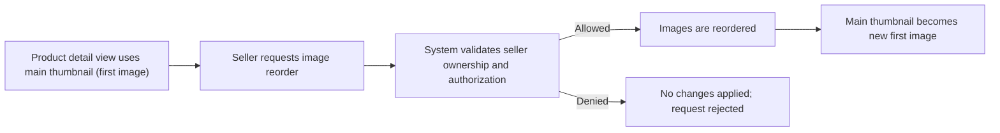
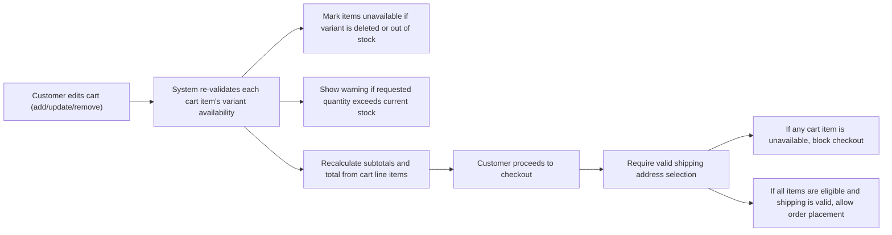
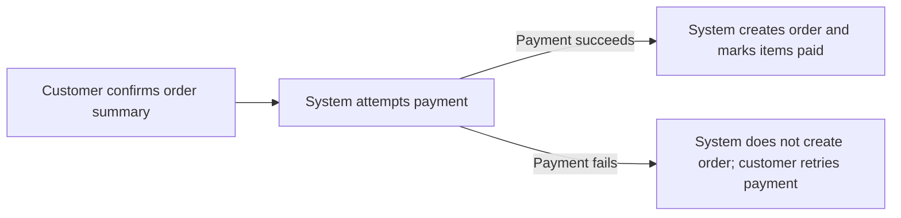
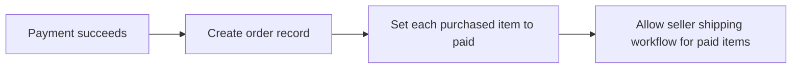
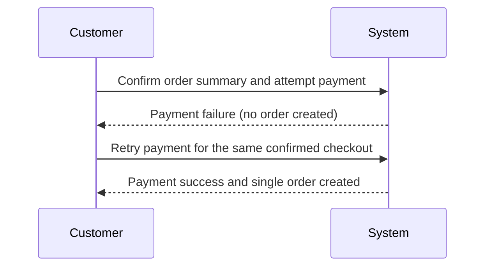
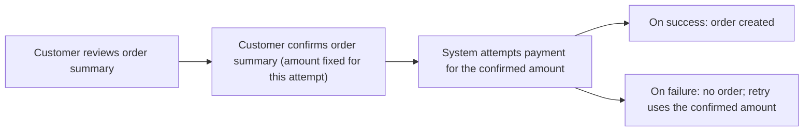
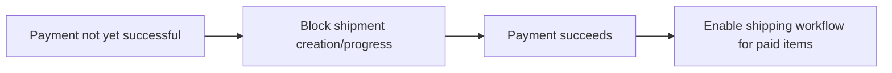
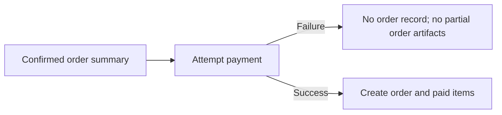
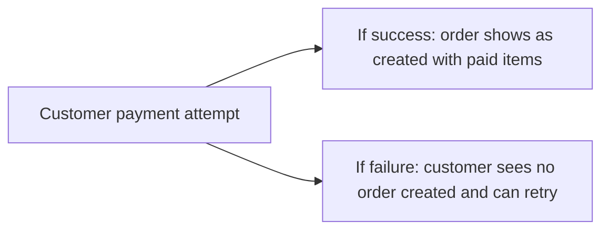

**shoppingMall — Business rules, validation constraints, data browsing expectations, error scenarios**

Business rules, validation constraints, data browsing expectations, error scenarios

# Domain Business Rules

Per-concept business rules, validation logic, and domain constraints.

## Customer Rules

Customers must register with an email and password before they can use account-bound features, and the system should treat email as the primary identifier for the customer account. Customer credentials must be valid to create or authenticate a customer session; invalid combinations are rejected. A customer profile includes a display name and a phone number, and edits to these fields must be accepted only for the currently logged-in customer. Display name updates must not be blank, since the profile requires a meaningful display identity. Phone number updates must follow the platform’s expected phone format rules; malformed numbers are rejected so the address book and contact flows remain consistent. Customers are allowed to delete their account, but the system must ensure the delete action triggers the required preservation behavior for historical records. After deletion, customers’ profile information is removed while their orders and order history remain preserved for seller records and legal purposes. Reviews authored by that customer remain visible but are shown as “deleted user,” maintaining the audit trail while respecting the user’s removal request. If a customer attempts to change profile information while not acting as the authenticated customer, the system must deny the change. If customer deletion is attempted, related business invariants must hold: historical purchase and review visibility rules must still apply even though the profile is deleted.

### Customer Registration Requirement

1. The system shall require customer registration before any customer can use account-bound features.
2. The system shall allow customers to register using an email and password.
3. If a registration attempt provides missing required registration details, the registration is rejected.
4. If a registration attempt is invalid (e.g., email is not acceptable or password does not satisfy the platform’s password rules defined for customer accounts), the registration is rejected.
5. The system shall treat the customer email as the primary identifier for the customer account.
6. If a customer attempts to register again using an email that is already associated with an existing customer account, the system shall reject the registration attempt.

### Customer Login Using Email and Password

1. The system shall allow a registered customer to log in using their email and password.
2. If the provided email does not correspond to a registered customer account, the login attempt is rejected.
3. If the provided password does not match the customer account’s password, the login attempt is rejected.
4. After a successful login, the system shall consider the customer authenticated for subsequent account-bound actions.
5. If a customer is not authenticated, the system shall not allow profile changes and other customer account features that require authentication.
6. If a customer attempts to log in with an invalid combination of credentials, the system shall reject the attempt without modifying any customer profile information.

### Display Name Edit Must Be Non-Empty

1. Customers shall be able to edit their display name as part of their customer profile.
2. When a customer requests a display name change, the new display name must not be empty.
3. If a customer submits a display name change where the new display name is empty, the system shall reject the update.
4. If the update is rejected, the customer’s existing display name shall remain unchanged.

### Phone Number Format Constraints

1. Customers shall be able to edit their phone number in their customer profile.
2. When a customer submits a phone number change, the phone number must follow the platform’s expected phone number format.
3. If the submitted phone number does not satisfy the expected phone format rules, the system shall reject the update.
4. If the update is rejected, the customer’s existing phone number shall remain unchanged.
5. The system shall ensure that accepted phone numbers remain consistent enough to support downstream address and contact usage (by rejecting malformed values).

### Only the Authenticated Customer Can Update Profile

1. The system shall allow profile updates only for the currently authenticated customer.
2. If an authenticated customer attempts to update a profile that does not belong to them, the system shall deny the update.
3. If an unauthenticated user attempts to update customer profile information, the system shall reject the update.
4. The system shall ensure that a successful profile update applies only to the authenticated customer’s own profile.

### Access Denied for Profile Edits on Wrong Account

1. If the request to edit display name or phone number is made by a customer who is not the owner of the profile being edited, the system shall deny the change.
2. If the system denies an update due to ownership mismatch, the system shall not apply any partial changes to the profile.
3. If a customer attempts profile edits while authenticated but referencing the wrong customer account, the system shall return an access-denied outcome for the update attempt.

### Account Deletion Triggers Profile Removal

1. Customers shall be able to delete their customer account.
2. When a customer deletes their account, the system shall remove the customer’s profile information.
3. After account deletion, the system shall not continue to expose the deleted customer’s profile information as part of platform customer profile data.
4. Customer deletion shall not prevent historical business records (orders and review history) from remaining available according to the preservation rules defined for those records.
5. If account deletion is attempted, the system shall ensure the deletion action triggers the required preservation behaviors and does not break historical references needed for seller records and legal purposes.

### Orders and Order History Preserved After Deletion

1. When a customer deletes their account, the system shall preserve that customer’s orders and order history.
2. Preserved order and order history shall remain available for the purposes described for seller records and legal purposes, even though the customer profile is removed.
3. The system shall continue to display order history to authorized parties according to their existing permissions, without requiring the customer profile to exist.
4. Order history preservation shall not prevent item-level purchase context from remaining consistent with the records created at purchase time.

### Reviews Preserved but Displayed as Deleted User

1. When a customer deletes their account, reviews authored by that customer shall be preserved.
2. Preserved reviews shall be displayed as written by a “deleted user” rather than showing the deleted customer’s profile identity.
3. The system shall ensure that review content remains available for dispute resolution while respecting the customer’s removal request.
4. If a customer’s account is deleted, the system shall not treat the reviews as removed; instead, only the author display context is changed to “deleted user.”

## Seller Rules

Seller accounts are created using an email and password, and the system treats the seller email as the unique identifier for seller login. Sellers can change their password, but password update requests must be validated to ensure they are made by the correct seller and meet the platform’s credential rules. A seller’s ability to sell depends on administrator approval, so seller visibility and purchase participation must align with the approval status. If a seller registration is rejected, the seller must be able to view the rejection reason, which should be stored and presented as part of the seller’s account status. Sellers can delete their account only under strict eligibility constraints related to commerce activity: they must have no pending orders in paid or shipped states across any of their products, and they must have no pending cancellation or refund requests across any variants. If a seller attempts deletion while any of these pending conditions exist, the system must reject the request and explain that outstanding activity blocks deletion. When a seller account is deleted, their products are removed from listings, but order history and snapshots remain preserved for dispute resolution and seller records. The seller shop name recorded in past orders must remain available as a historical snapshot even after the seller account is deleted. If a seller is suspended by administrators, their ability to create or edit products is disallowed and their products must be hidden from search and category listings, while existing orders can still be processed per item status. Attempts to act on disallowed operations while suspended should be denied to keep marketplace integrity consistent.

### Seller Registration Using Email and Password

WHEN a seller submits a registration request, THE system SHALL accept an email and password as the basis of the seller account.
THE system SHALL treat the seller email as the seller’s unique identifier for seller login.
IF the seller email already has an existing seller account, THEN the system SHALL reject the registration request.
IF required seller registration information is missing, THEN the system SHALL reject the registration request.
IF the provided password does not meet the platform’s credential rules, THEN the system SHALL reject the registration request.
IF the registration request is successfully created, THEN the system SHALL record the seller’s approval status as pending until an administrator decision is made.
THE system SHALL ensure that a newly registered seller cannot sell items until the approval status is approved (approval gate enforced by rules elsewhere).

### Seller Password Change Constraints

WHEN a seller requests a password change, THE system SHALL verify that the request is made by the correct seller.
IF the seller making the request is not authenticated as a seller account, THEN the system SHALL reject the password change request.
IF the seller provides an invalid or missing new password, THEN the system SHALL reject the password change request.
WHEN the password change request is accepted, THE system SHALL update the seller’s login credentials so that future seller logins use the new password.
THE system SHALL ensure that the seller’s profile data, approval status, and selling eligibility are unaffected by a password change.
IF the password change request is rejected, THEN the seller SHALL receive a clear explanation that the change did not go through due to invalid eligibility or invalid input.

### Administrator Approval Gate for Selling

WHILE a seller’s approval status is pending, THE system SHALL prevent the seller from selling by disallowing actions that create or edit sellable product listings.
WHILE a seller’s approval status is approved, THE system SHALL allow the seller to sell according to the platform’s normal product operations.
WHILE a seller’s approval status is rejected, THE system SHALL prevent the seller from selling.
WHEN an administrator approves a seller registration, THE system SHALL transition the seller’s eligibility to sell from blocked to allowed.
WHEN an administrator rejects a seller registration, THE system SHALL transition the seller’s eligibility to sell from allowed-to-blocked (if applicable) to blocked.
IF a seller attempts to perform selling-related operations while their approval status is not approved, THEN the system SHALL reject the attempt and indicate that administrator approval is required.

### Viewing Approval Status (Pending, Approved, Rejected)

THE system SHALL provide sellers a way to view their approval status.
THE system SHALL represent seller approval status using the values pending, approved, and rejected.
WHEN a seller views their approval status, THE system SHALL display the current value based on the administrator’s most recent decision.
IF the seller’s status is pending, THEN the system SHALL communicate that the seller is awaiting administrator review.
IF the seller’s status is rejected, THEN the system SHALL communicate that the seller is not currently approved to sell.
IF the seller’s status is approved, THEN the system SHALL communicate that the seller is approved to sell.

### Viewing Rejection Reason After Rejection

WHEN a seller’s approval status is rejected, THE system SHALL allow the seller to view the rejection reason.
IF the approval status is not rejected, THEN the system SHALL not require or present a rejection reason as a primary message.
IF an administrator rejects a seller registration, THEN the system SHALL store a rejection reason that can be displayed to the seller.
IF a seller attempts to view a rejection reason while the status is pending or approved, THEN the system SHALL handle the request gracefully (for example, by not showing a rejection reason and instead showing the current status).

### Seller Account Deletion Eligibility Rules

WHEN a seller requests to delete their seller account, THE system SHALL evaluate deletion eligibility using the seller’s commerce activity constraints.
IF the seller has any pending order items across any of their products in paid or shipped status, THEN the system SHALL reject the account deletion request.
IF the seller has any pending cancellation requests across any of their variants, THEN the system SHALL reject the account deletion request.
IF the seller has any pending refund requests across any of their variants, THEN the system SHALL reject the account deletion request.
IF none of the blocking conditions exist (no pending paid/shipped order items and no pending cancellation/refund requests), THEN the system SHALL allow the seller account deletion.
IF deletion is rejected, THEN the system SHALL explain that outstanding pending activity blocks deletion.
WHEN a seller account is deleted, THE system SHALL preserve order history for seller records and legal purposes.
WHEN a seller account is deleted, THE system SHALL ensure that the seller can no longer sell new products or modify existing product listings.

### Deleting Seller Hides Products but Preserves History

WHEN a seller account is deleted, THE system SHALL delete the seller’s products from product listings.
DELETED products SHALL no longer appear in search or category listings.
WHEN a seller account is deleted, THE system SHALL preserve order history snapshots needed for dispute resolution and seller records.
WHEN a seller account is deleted, THE system SHALL preserve the seller shop name as recorded in past orders.
WHEN a seller account is deleted, THE system SHALL preserve order item snapshots that include the seller profile at the time of purchase so historical orders remain accurate.
IF a customer or administrator views historical order details after seller deletion, THEN the system SHALL still show the preserved snapshots and seller historical shop name as recorded at purchase time.

### Suspended Sellers Cannot Create or Edit Products

WHILE a seller account is suspended by administrators, THE system SHALL deny the seller the ability to create new products.
WHILE a seller account is suspended by administrators, THE system SHALL deny the seller the ability to edit existing products.
WHILE a seller account is suspended by administrators, THE system SHALL hide the seller’s products from search and category listings.
WHILE a seller account is suspended by administrators, THE system SHALL prevent customers from purchasing those products.
WHEN an administrator unsuspends a seller account, THE system SHALL restore product visibility in search and category listings.
IF a suspended seller attempts a create or edit operation, THEN the system SHALL reject the request and indicate that the seller account is suspended.
IF a suspended seller has existing orders, THEN the system SHALL still allow sellers to process shipping-related actions and respond to cancellation or refund requests for those existing order items.

## AdminUser Rules

Administrator users authenticate with an email and password, and the system must validate credentials for any administrative action. Admin users have a grade that distinguishes regular administrators from super administrators, and business rules must enforce grade-based capabilities. Super administrators can promote a regular administrator to super administrator, so promotion requests must be accepted only when initiated by a super administrator. Super administrators can demote other super administrators to regular administrator, but the system must prevent a super administrator from demoting themselves. Regular administrators must not be able to perform super-only operations such as promoting or demoting administrators with super grade. Administrators can submit and review administrator-approval requests, but only super administrators can approve or reject those requests for becoming administrators. Seller management actions are constrained by administrator capabilities: administrators can approve or reject seller registrations, and rejection must include a reason that is made available to the seller. When an administrator suspends or unsuspends a seller, the system must ensure the marketplace visibility rules update accordingly: suspended sellers’ products are hidden and not purchasable, while unsuspended sellers’ products reappear. User management actions must enforce ban behavior: banned customers and banned sellers cannot log in, and bans must not remove existing orders, preserving marketplace continuity. If a banned seller attempts restricted actions, the system should reject them consistently with the ban and suspension rules.

### Administrator Authentication with Email and Password

- Admin users must authenticate using an email and a password in order to perform any administrative action.
- If an attempted administrative action is made without a successful authentication, the system must reject the action.
- If the provided email and password do not match a registered administrator account, the system must reject the action.
- Authenticated administrators must be identified as the requesting administrator for the purposes of enforcing grade-based capabilities.
- If the administrator account is banned, the system must prevent login and must not allow the administrator to perform administrative actions.
- Banning a customer is not permitted to grant administrative access; only administrator accounts can perform administrative actions.

### Administrator Grade Enforcement for Administrative Capabilities

- The system must distinguish between two administrator grades: regular administrator and super administrator.
- When an administrator attempts an operation that requires super administrator capability, the system must check the administrator’s grade.
- If the administrator’s grade is regular administrator and the operation is super-only, the system must deny the administrative action.
- Denied administrative actions must be rejected consistently based on insufficient grade rather than based on other unrelated factors.
- Regular administrators must not be able to perform any operation reserved for super administrators, including promotions and demotions of administrators with super grade.

### Super Administrator Promotion of Regular Administrators

- A super administrator must be able to initiate a promotion request to promote a regular administrator to super administrator.
- The system must validate that the promotion request is initiated by an authenticated super administrator.
- When a promotion request is initiated by a non-super administrator (including a regular administrator), the system must deny the action.
- Promotion approvals must only be accepted when the approver is a super administrator.
- If the system accepts a promotion, the targeted administrator’s grade must become super administrator.
- If the promotion request is rejected, the targeted administrator must remain a regular administrator.
- The system must record the reason for administrator-privilege requests (where applicable) so that the requesting administrator can view the basis for review outcomes.

### Super Administrator Demotion Rules (Including No Self-Demotion)

- A super administrator must be able to demote a super administrator to regular administrator.
- The system must validate that demotion requests are initiated and approved by an authenticated super administrator.
- The system must prevent a super administrator from demoting themselves.
- If a super administrator attempts to demote their own account, the system must deny the action.
- If the demotion is performed for another super administrator, the system must change that other administrator’s grade to regular administrator.
- A regular administrator must not be able to demote anyone; if attempted, the system must deny the administrative action due to grade insufficiency.

### Super-Only Approval of Administrator-Privilege Requests

- Any user (customer or seller) who requests administrator privileges must submit a reason for the request.
- Super administrators must review the pending administrator-privilege requests.
- Only super administrators may approve or reject administrator-privilege requests.
- If a regular administrator attempts to approve or reject an administrator-privilege request, the system must deny the action.
- If a super administrator approves a request, the requester must become a regular administrator (not automatically super unless promoted separately via promotion rules).
- If a super administrator rejects a request, the requester must remain a non-administrator (or remain at their current status) and the rejection outcome must be reflected to the requester.

### Seller Registration Approval and Rejection with Reason

- Administrators must be able to view the list of pending seller registration requests.
- Administrators must approve or reject seller registration requests.
- When rejecting a seller registration request, the administrator must provide a rejection reason.
- The system must make the rejection reason available to the seller after rejection.
- If a seller registration request is rejected, the seller must be able to submit a new seller registration request.
- Approving a seller registration must transition the seller’s approval status to an approved state so that the seller can proceed with selling.

### Suspension and Unsuspension Visibility Impact on Sellers

- Administrators can suspend seller accounts.
- When a seller account is suspended, the seller’s products must be hidden from marketplace browsing that would otherwise show products in listings.
- When a seller account is suspended, the seller’s products must not be purchasable.
- Even when suspended, sellers must remain able to process existing orders and order-related actions that are already in progress (such as shipping items and responding to cancellation or refund requests).
- Administrators can unsuspend seller accounts.
- When a seller account is unsuspended, the seller’s products must become visible again in listings and must be purchasable.
- If a suspended seller attempts to create or edit products, the system must deny the action as a seller suspension violation.

### Ban Rules for Customers and Sellers (Login Prevention Without Removing Orders)

- Administrators can ban customers.
- A banned customer must not be able to log in.
- Banning a customer must not remove the customer’s existing orders and order history; existing marketplace continuity for past purchases must be preserved.
- Administrators can ban sellers.
- A banned seller must not be able to log in.
- Banning a seller must not remove existing orders; existing order records must remain for order continuity.
- If a banned customer or banned seller attempts to log in, the system must deny login.
- If a banned seller attempts restricted seller actions that require authenticated access, the system must reject those actions consistently with ban behavior.

### Denied Administrative Actions When Grade Is Insufficient

- For any administrative action that is reserved for super administrators, the system must check the acting administrator’s grade before applying the action.
- If the administrator’s grade is regular administrator, the system must deny super-only administrative actions.
- When denial occurs due to insufficient grade, the system must not partially apply changes (the administrative action must have no effect).
- Denial must apply to, at minimum: approvals or rejections of administrator-privilege requests, promotion or demotion of administrator grade involving super-only operations.
- The system must allow regular administrators to continue performing operations that are permitted for their grade without denial.

## Address Rules

A customer can maintain multiple shipping addresses, and each address must include a recipient name, phone number, street address, city, state/province, postal code, and country. Address entries must be validated so required components are present and not blank; otherwise the system rejects the address update. Phone numbers on addresses must conform to the platform’s expected phone format so contact and delivery messaging can be reliable. Postal code and country must be provided to ensure shipping destinations are complete, and edits must retain a fully qualified destination. Customers may edit any of their own addresses, but the system must reject attempts to modify an address belonging to a different customer. Customers can delete an address, and deleted addresses must no longer appear as selectable shipping options. At any point, customers can set one address as the default shipping address, and the system must ensure only one default is active for that customer. If the customer deletes the current default address, the system must ensure the customer’s address set remains valid, typically by requiring a new default selection before checkout can proceed. Addresses are used for shipping selection during checkout, so incomplete or invalid address data must not be allowed to reach the checkout step. If a customer tries to set a default address that does not belong to them, the system must deny the change to preserve correctness of shipping information.

### Multiple Shipping Addresses Per Customer

Customers can maintain multiple shipping addresses.

Each address entry belongs to exactly one customer and is only used for that customer’s shipping selection.

The system must allow customers to add, edit, and delete their shipping addresses without affecting other customers’ addresses.

### Required Address Fields and Non-Blank Constraints

For any shipping address a customer adds or edits, the system must require the following components to be present and not blank:
- recipient name
- phone number
- street address
- city
- state/province
- postal code
- country

If any required component is missing or blank when the customer attempts to add or edit an address, the system rejects the update.

After a successful add or edit, the saved shipping address must remain complete, meaning it continues to include all required components.

### Recipient Name Non-Empty Constraint

The recipient name on a shipping address must be provided and must be non-empty.

If a customer attempts to add or edit an address with an empty recipient name, the system rejects the change and the address remains unchanged.

### Address Phone Number Format Rules

The phone number stored on a shipping address must conform to the platform’s expected phone format so that contact and delivery messaging can be reliable.

When a customer adds or edits an address, the system must validate the address phone number against the expected phone format.

If the phone number does not match the expected format, the system rejects the address update.

Valid phone numbers are accepted and used as the phone number for that shipping address.

### Complete Destination Requires Postal Code and Country

A shipping address must include a postal code and a country.

When a customer adds or edits an address, the system must verify that the postal code and country are present and not blank.

If the customer omits the postal code or country, or provides them as blank values, the system rejects the address update.

After successful save, the address represents a fully qualified destination suitable for shipping selection.

### Only the Owner Customer Can Edit an Address

Customers can edit only their own shipping addresses.

If a customer attempts to add, modify, or update an address that does not belong to them, the system denies the modification.

When the system denies an attempted edit due to ownership mismatch, no changes are applied to the target address.

### Deleting an Address Removes It From Selection

Customers can delete shipping addresses they own.

After a shipping address is deleted, it must no longer be available as a selectable shipping option for that customer.

If the customer deletes an address, the system must not allow later selection of that deleted address for checkout.

If a customer attempts an action that would rely on a deleted address as the shipping selection, the system rejects the action.

### Single Default Shipping Address Rule

At any point, each customer must have at most one default shipping address.

When a customer sets an address as the default, the system updates the customer’s default so that exactly that one address is the default.

If the customer sets a different address as the default, the previously default address is automatically no longer the default.

### Default Address Replacement Behavior When Deleting Default

If a customer deletes their current default shipping address, the system must ensure the customer’s address set remains valid for shipping selection.

After deletion of the default address, the system must require a new default selection behavior before the customer can proceed to a shipping-dependent step.

The system must prevent leaving the customer with no valid default state when checkout requires a selected shipping address, ensuring the customer must choose a remaining address as the default (or an equivalent required replacement behavior).

If the customer deletes the default and has no remaining addresses, the system must prevent shipping-dependent actions that require a selectable default address.

### Default Address Ownership Enforcement

A customer can set only an address they own as the default shipping address.

If a customer attempts to set as default an address that belongs to a different customer, the system denies the change.

When the system denies a default-setting attempt due to ownership mismatch, the existing default address remains unchanged.

## Category Rules

Categories are created and managed only by administrators, so customer-driven category creation or edits must be disallowed. Each category must have a name and a description, and both must be provided when creating or updating a category to keep the browsing experience meaningful. Category descriptions must be validated to ensure they are not blank so category pages remain informative. Categories can have subcategories with only one level of nesting, meaning a subcategory cannot itself contain another nested subcategory; attempts to create deeper nesting must be rejected. When an administrator deletes a category, products in deleted categories become uncategorized, so the system must treat deletion as removing the category association without breaking product visibility rules. Customers browsing categories should receive only categories and subcategories that remain active and valid, reflecting administrator decisions. Category management actions must require administrator authorization, and any non-admin attempt to create, edit, or delete categories must be rejected. If an administrator edits a category name or description, those updated values must immediately reflect in customer browsing to ensure consistency. If a category is created with a duplicate name within the same scope that violates business expectations, the system should reject the creation or require the administrator to adjust; the platform must keep category labels clear and non-ambiguous. The category hierarchy constraint ensures that customers can always understand navigation without multi-level complexity beyond what is allowed.

### Administrator-Only Category Management

THE system SHALL allow category creation, editing, and deletion ONLY by administrators.

WHEN a non-administrator attempts to create a category, THE system SHALL reject the request.

WHEN a non-administrator attempts to edit a category, THE system SHALL reject the request.

WHEN a non-administrator attempts to delete a category, THE system SHALL reject the request.

THE system SHALL require administrators to be authorized to perform category management actions.

THE system SHALL ensure that administrator decisions about categories affect what customers can browse immediately after the change is made.

### Required Category Name and Description

WHEN an administrator creates or updates a category, THE system SHALL require a category name.

WHEN an administrator creates or updates a category, THE system SHALL require a category description.

IF the category name or category description is missing or blank for a category create or update request, THEN THE system SHALL reject the request.

THE system SHALL treat the provided category name and category description as the source of truth for customer browsing of that category.

### One-Level Subcategory Nesting Constraint

THE system SHALL enforce a category hierarchy that supports subcategories but only allows one level of nesting.

WHEN an administrator attempts to create or assign a subcategory such that it would require nested subcategories beyond one level, THEN THE system SHALL reject the deeper nesting attempt.

THE system SHALL ensure that, for category browsing navigation, subcategories do not themselves contain further nested subcategories beyond the allowed one-level depth.

### Category Deletion Uncategorizes Products

WHEN an administrator deletes a category, THEN the system SHALL remove the deleted category association from all products that were in that category.

AFTER category deletion, those products SHALL remain visible under the platform’s product visibility rules, but they SHALL no longer appear as belonging to the deleted category.

IF a customer is browsing categories or category pages, THEN the system SHALL ensure that deleted categories do not appear in the customer-facing category list.

flowchart LR
    A["Category exists"] -->|"Admin deletes category"| B["Category removed from browsing"]
    A -->|"Products uncategorized"| C["Products no longer assigned to deleted category"]
    B --> D["Customers browse remaining categories"]
    C --> D["Customers see products without the deleted category"]

## Product Rules

Products can be created and edited by the seller who owns them, so the system must validate that only the product’s seller can update product details. Each product requires a name and description, and those fields must be non-empty for the product to be considered valid. A product must belong to a category, and sellers must select an allowed category or subcategory (respecting the category nesting rules). A base price is required for each product, and it must be valid so the product can participate in pricing displays and search filters. When a seller edits a product, the system must enforce the snapshot principle by recording the previous state and the after state for that product so disputes can be resolved later. Sellers can delete their own products only when deletion eligibility is satisfied: there must be no pending order items in paid or shipped status for any variant of the product, and no pending cancellation or refund requests for any variant. If either pending condition exists, the system must reject product deletion to prevent loss of purchase records while resolution is ongoing. Deleting a product removes it from search and category listings, but existing order history and snapshots related to the product must remain accessible for relevant parties. If a seller attempts to delete or edit a product that is not owned by them, the system must deny the action. Products with no variants must still remain visible in search but should be marked as “unavailable,” ensuring customers can discover the item while respecting the purchasability rule. Sellers should be prevented from deleting or editing products when their account is suspended, since suspended sellers’ products are hidden and cannot be modified.

### Product ownership and editing eligibility

Sellers can create and edit only products that belong to them.
If a seller attempts to edit a product that does not belong to them, the system rejects the edit.
The system must ensure that product edits are attributable to the owning seller, so disputes can be resolved using recorded snapshots.
Sellers must be able to edit their own product details only while their seller account is not suspended.
If a seller attempts to edit a product while the seller account is suspended, the system rejects the edit.
Editing eligibility applies to product-level fields (such as name, description, category selection, base price, and product images) as part of a product edit operation.
If a product does not exist or is not accessible to the seller for edit, the system rejects the edit request.

### Required product fields: name and description

A product must have a name in order to be considered valid for normal product presentation.
A product name cannot be empty when a seller creates or edits a product.
A product must have a description in order to be considered valid for normal product presentation.
A product description cannot be empty when a seller creates or edits a product.
If a seller submits an edit or creation where the product name or description is missing or empty, the system rejects the request.
If only one of the required fields (name or description) is missing or empty, the system rejects the request rather than saving partial changes.

### Category selection requirement and nesting constraint

A product must belong to a category in order to be considered valid.
When a seller creates or edits a product, the seller must select a category.
If a seller submits a product creation or edit without selecting a category, the system rejects the request.
If a seller selects a subcategory for the product, the selected subcategory must be directly under a top-level category (one level of nesting only).
If a seller attempts to select a category depth beyond one level of subcategories, the system rejects the request.
If a category or subcategory selection becomes invalid due to later administrative changes, the system must prevent saving edits that rely on an invalid category selection.

### Base price requirement and pricing validity

A product must have a base price in order to be considered valid.
A seller must provide a base price when creating a product.
A seller must provide a base price when editing a product if the base price is part of the edit.
The system must reject a product creation or edit if the base price is missing.
The system must also reject a product creation or edit if the base price is not a valid value for pricing display and search filtering.
If a seller attempts to save a product with an invalid base price, the system rejects the request and does not change the product state.

### Product edit snapshots capture before-and-after values

Whenever a seller makes an edit to a product, the system creates a product snapshot.
The product snapshot must record when the change was made.
The product snapshot must record what was changed.
The product snapshot must preserve the product field values before the edit.
The product snapshot must preserve the product field values after the edit.
When a seller edits product details that include product images, the snapshot must reflect the image-related changes as part of the product snapshot.
Snapshots created from product edits are immutable and cannot be deleted by any party.
If the system cannot create a required snapshot for an edit, the edit is rejected so that the snapshot principle is preserved.

### Product deletion eligibility: pending paid or shipped order items

A seller can delete a product only when deletion eligibility is satisfied.
If there are any pending order items for any variant of the product in paid or shipped status, the system must block deletion of the product.
When deletion is blocked due to pending paid or shipped order items, the system must reject the deletion request.
The seller must not be able to delete any product that would remove purchase-related items that are still pending shipment or already shipped.
Deletion eligibility evaluation must consider any variant of the product, not only a specific variant.

### Product deletion eligibility: pending cancellation or refund requests

A seller can delete a product only when deletion eligibility is satisfied.
If there are any pending cancellation requests for any variant of the product, the system must block deletion of the product.
If there are any pending refund requests for any variant of the product, the system must block deletion of the product.
When deletion is blocked due to pending cancellation or pending refund requests, the system must reject the deletion request.
Deletion eligibility evaluation must consider any variant of the product, not only a specific variant.
If both blocking conditions exist (pending paid/shipped items and pending cancellation/refund requests), the system must still reject deletion without allowing the product to be deleted.

### Deletion effect on search and category listings (deleted products are hidden)

When a seller successfully deletes their product, the product must no longer appear in search results.
When a seller successfully deletes their product, the product must no longer appear in category listings.
If a seller attempts to delete a product, and deletion is rejected due to eligibility rules, the product must remain visible in search and category listings.
Even after product deletion, snapshots related to that product must remain accessible to relevant parties for dispute resolution.
The system must ensure that historical records that refer to the deleted product are not broken for dispute resolution scenarios enabled by snapshots.

### No-variant products: visible in search but unavailable for purchase

A seller may create or edit products such that the product has no variants.
If a product has no variants, the product must still be discoverable in search results.
If a product has no variants, the product must be shown as unavailable for purchase in product listings and related views.
The system must prevent users from adding or checking out an unavailable product due to the lack of purchasable variants.
If a product transitions between having variants and having none, the system must update its availability presentation accordingly so customers do not attempt to purchase a non-purchasable product.

### Blocked modifications for suspended sellers

If a seller account is suspended, the seller must not be able to create new products.
If a seller account is suspended, the seller must not be able to edit existing products.
If a seller account is suspended, the seller must not be able to delete products through the normal deletion process.
If a suspended seller attempts any of the above actions, the system rejects the request.
Suspension restrictions apply to products owned by the suspended seller and ensure suspended products remain hidden from category listings and search results in customer-facing contexts.
Even if a seller is suspended, existing order processing that depends on already-existing products is not treated as an edit or deletion action and therefore is not blocked by these restrictions (to preserve ongoing transactions).

## ProductImage Rules

Sellers can manage multiple images for each product, and the platform must validate that only images uploaded or associated for that seller’s product are manipulated. When sellers reorder images, the first image is treated as the main thumbnail, so the ordering selection must be reflected consistently for all viewers. Image changes are part of the product’s editable state, so any modification to the image set must trigger the platform’s snapshot principle for the product. Sellers can delete images from their products, and the resulting image set must remain coherent so the product can still show at least one image where applicable. If a seller attempts to delete or reorder an image that does not belong to their product, the system must reject the request. The system must ensure image deletions do not violate the snapshot immutability rule; prior product image states must remain viewable through snapshots. Sellers must not be able to change product images if their seller account is suspended, keeping hidden products consistent and preventing unauthorized modifications. If a seller tries to reorder images while not authorized, the system should return an access denied response rather than applying changes. These rules ensure that customer-facing product images remain stable for browsing and that historical image states can be reviewed for disputes. In case the seller removes images, the platform should still allow customers to view product details with whatever images remain in the valid set.

### Seller Access Control for Product Images

#### Product Image Ownership Enforcement
WHEN a seller requests to reorder or delete a product image, THE system SHALL verify that the image is currently associated with one of that seller’s own products.
IF the seller does not own the associated product image, THEN THE system SHALL reject the reorder or delete request.

#### Access Denied for Suspended Sellers
WHILE a seller account is suspended, THE system SHALL prevent that seller from reordering product images.
WHILE a seller account is suspended, THE system SHALL prevent that seller from deleting product images.
IF a suspended seller attempts to reorder or delete product images, THEN THE system SHALL deny the request rather than applying changes.

#### Consistent Denial Behavior for Unauthorized Operations
IF a reorder or delete request targets an image not belonging to the requesting seller’s products, THEN THE system SHALL respond as an access denied outcome (not a successful no-op).

### Main Thumbnail Determination (First Image)

#### Main Thumbnail Definition
THE system SHALL treat the first image in a product’s image ordering as the product’s main thumbnail.

#### Thumbnail Selection Consistency Across Viewers
WHEN any viewer (including customers and administrators) views a product’s image list, THE system SHALL display the same first-image item as the main thumbnail.

### Image Reordering Updates Thumbnail Selection

#### Reorder Effect on Thumbnail
WHEN a seller successfully reorders product images, THE system SHALL update the product’s image ordering.
WHEN the seller changes the first position during reordering, THEN THE system SHALL update which image is treated as the main thumbnail.

#### No Thumbnail Drift During Reordering
WHILE the product’s image set is being reordered, THE system SHALL ensure the first-image selection reflects the resulting ordering after the reorder is applied.

### Snapshot Requirement for Image Changes

#### Snapshot Creation on Image Set Changes
Whenever a seller modifies a product’s image set by reordering images or deleting an image, THE system SHALL create a product snapshot that records the image-related changes.

#### Snapshot Records Before and After Values
THE system SHALL ensure each image-change snapshot records what was changed and the values before and after the modification.

#### Immutability of Snapshots for Dispute Resolution
Snapshots created for image changes SHALL be immutable and SHALL not be deleted.

#### Viewing Snapshots for Image Changes
THE system SHALL allow relevant parties (product owners and administrators) to view snapshots that include image state prior to and after the seller’s image modification.

### Image Deletion Removes from Product Display

#### Deletion Removes Image from Browsing
WHEN a seller successfully deletes a product image, THE system SHALL remove that image from the product’s image set used for customer-facing product detail browsing.

#### Snapshot Preservation After Deletion
IF a seller deletes an image, THEN THE system SHALL preserve the prior image set states through snapshots so historical states remain viewable.

#### Coherent Image Set After Deletion
WHEN the seller deletes one or more images, THE system SHALL keep the product’s remaining image set coherent for product detail browsing.
Customers shall still be able to view the product detail page using whatever images remain in the valid set.

### Consistent Product Detail Image Set After Changes

#### Customer-Facing Consistency
WHEN customers browse product listings or product detail pages, THE system SHALL ensure they see a consistent image set that matches the latest successfully applied image modifications.

#### Deleted or Unauthorized Image Exclusion
IF an image deletion succeeds, THEN THE system SHALL exclude the deleted image from subsequent customer views of the product.
IF a reorder or delete request is denied due to unauthorized image ownership or a suspended seller account, THEN THE system SHALL keep the previously stored ordering and display set unchanged.

#### Admin Visibility for Verification
WHEN administrators review product data, THE system SHALL reflect the current image set and SHALL be able to verify changes using the corresponding immutable snapshots.

## ProductVariant Rules

A product can have multiple variants, and each variant is defined by a unique SKU code and a set of option values, such as color and size combinations. The system must validate that SKU code is present for every variant and that SKU codes are unique within the context of the product’s variants so customers and sellers can reference the correct purchasable item. Variant price is optional as an override; when provided, it must be a valid value so pricing on listing and product detail pages remains consistent. Variant stock quantity starts at a defined initial value and must be tracked per variant so out-of-stock and in-stock statuses are accurate. Sellers can add variants to their products, edit variant details, and delete variants, but deletion is constrained by pending commerce activity. A variant can be deleted only if there are no pending order items in paid or shipped status for that variant and no pending cancellation or refund requests for that variant. If any pending order item or request exists, deletion must be rejected to avoid breaking purchase processing and dispute handling. Every variant edit must trigger the snapshot principle, preserving the before and after state of the variant so historical order item pricing and options remain defensible. Products must have at least one variant to be purchasable; if a product has no variants, it is visible in search but marked as “unavailable.” If a seller is suspended, variant creation and edits must be disallowed in line with the seller suspension rules. If a seller attempts to manage variants for a product they do not own, the system must deny the operation.

### Variant SKU code requirement

### Variant SKU code required
THE system SHALL require a SKU code for every product variant.

### Variant ownership validation
WHEN a seller attempts to create, edit, or delete a product variant, THE system SHALL allow the operation only if the product belongs to that seller.

### SKU code presence validation on edit
WHEN a seller edits an existing product variant, THE system SHALL reject the edit if the edited variant does not include a SKU code.

### SKU uniqueness within a product

### SKU uniqueness within product variants
THE system SHALL enforce that SKU codes are unique across all variants of the same product.

### Reject duplicate SKU within the same product
WHEN a seller attempts to add or edit a variant SKU code to a value that already exists on another variant of the same product, THEN THE system SHALL reject the operation.

### Option values define variant combinations

### Option values define the variant combination
THE system SHALL treat the variant’s option values as the specific combination that distinguishes that variant within its product.

### Option values required set for a variant
WHEN a seller creates or edits a product variant, THE system SHALL require option values to be provided for the variant so that the variant can be identified as a defined option combination.

### Optional variant price override

### Variant price override is optional
THE system SHALL allow a product variant to have an optional variant price override.

### Variant price override consistency
WHEN a variant price override is provided, THE system SHALL use that override value for pricing shown for that variant.

### Variant price override validation on edit
WHEN a seller edits a product variant that includes a variant price override, THEN THE system SHALL reject the edit if the provided override price is not a valid price value.

### Stock quantity tracked per variant

### Variant stock quantity tracked per variant
THE system SHALL maintain stock quantity at the product-variant level.

### In-stock vs out-of-stock representation
WHILE the current stock quantity for a variant is greater than zero, THEN THE system SHALL represent the variant as "in stock".
WHEN the current stock quantity for a variant is zero, THEN THE system SHALL represent the variant as "out of stock".

### Stock quantity affects availability actions
WHEN a seller views or manages a variant’s availability, THE system SHALL reflect the variant’s current in-stock or out-of-stock state based on the tracked stock quantity.

### Initial stock quantity baseline
THE system SHALL start each new variant’s stock quantity at the defined initial value.

### Variant edit creates an immutable variant snapshot

### Snapshot on variant edit
WHEN a seller edits a product variant, THE system SHALL create a variant snapshot capturing what was changed and the values before and after the edit.

### Snapshot immutability
THE system SHALL ensure that variant snapshots are immutable and cannot be deleted.

### Snapshot completeness for dispute resolution
THE system SHALL record the snapshot timing and the before/after values so that historical variant state can be viewed for dispute resolution by relevant parties.

### Variant deletion blocked by pending paid or shipped items

### Block deletion with pending paid or shipped order items
WHEN a seller attempts to delete a product variant, IF there exists any pending order item for that variant in paid status or shipped status, THEN THE system SHALL reject the deletion.

### Prevent breaking purchase processing
IF the deletion would cause inconsistencies for variants tied to order items already in paid or shipped status, THEN THE system SHALL reject the deletion.

### Variant deletion blocked by pending cancellation or refund requests

### Block deletion with pending cancellation requests
WHEN a seller attempts to delete a product variant, IF there exists any cancellation request for an order item of that variant in a pending status, THEN THE system SHALL reject the deletion.

### Block deletion with pending refund requests
WHEN a seller attempts to delete a product variant, IF there exists any refund request for an order item of that variant in a pending status, THEN THE system SHALL reject the deletion.

### Prevent breaking dispute resolution workflow
IF the deletion would interfere with required seller approval/rejection handling for pending cancellation or refund requests, THEN THE system SHALL reject the deletion.

### Product purchasable eligibility requires at least one variant

### At least one variant required to be purchasable
THE system SHALL ensure that a product is purchasable only when it has at least one existing product variant.

### No variants means product unavailable
WHEN a product has no variants, THEN THE system SHALL mark the product as "unavailable" for purchase.

### Search visibility without variants
WHEN a product has no variants, THEN THE system SHALL still allow the product to appear in customer search results while keeping it marked as "unavailable".

### Suspended seller cannot create or edit variants

### Disallow variant creation for suspended seller
WHEN a seller is suspended, THE system SHALL disallow that seller from creating new product variants.

### Disallow variant edits for suspended seller
WHEN a seller is suspended, THE system SHALL disallow that seller from editing existing product variants.

### Consistent enforcement across variant management actions
WHEN a suspended seller attempts to manage variants for their products, THEN THE system SHALL deny the attempted variant creation or variant edit in accordance with seller suspension rules.

## InventoryRecord Rules

Inventory changes are recorded as inventory history entries so the platform can reconstruct how a variant’s current stock was reached over time. Sellers can add inventory for restocking and subtract inventory for adjustments or loss, and each change must include a reason so the history is explainable. Quantity changes must be validated to ensure they reflect a coherent inventory movement and that the resulting current stock cannot become negative in normal operations. When a negative inventory entry is created due to purchasing, the system must ensure the variant being purchased had sufficient available stock at the time of the transaction. During cancellations or refunds that reverse fulfillment, the system must create positive inventory entries that restore stock in a way that matches the item being returned. Sellers can view the full inventory history for each variant, and the displayed history must reflect both restocks and decreases from orders or adjustments. The current stock used to show “out of stock” status must be derived consistently from the sum of all history entries, ensuring customers see accurate availability. When stock reaches zero, the platform must mark that variant as “out of stock,” and such variants cannot be added to cart. Attempts to add out-of-stock variants should be rejected even if a seller has made no recent changes, because availability is determined by current stock. If stock is modified in a way that would cause an inventory inconsistency, the operation must fail so that future cart and ordering decisions remain reliable. These rules guarantee that inventory-driven availability and order outcomes stay consistent and auditable.

### Inventory history records all stock movements

Inventory history records must exist for each inventory change affecting a product variant.

Every time stock changes for a variant, the system must record an inventory history entry that explains the movement, so the platform can reconstruct how current stock was reached over time.

The inventory history displayed to sellers must include both increases and decreases so the full movement trail is explainable.

The current stock used for availability decisions must be derived consistently from the sum of all inventory history entries for that variant.

### Restock inventory with quantity and reason

When a seller adds inventory to a variant (restocking), the request must include:
- The quantity to add
- A reason that explains why the quantity is being added

The system must create an inventory history entry reflecting the restock so that the variant’s current stock increases accordingly.

If a seller attempts a restock with an invalid quantity that would not represent a coherent inventory movement in normal operations, the system must reject the change rather than recording it.

If the seller provides no reason, the system must reject the restock so every inventory history entry remains explainable.

### Subtract inventory for adjustment or loss

When a seller reduces inventory for a variant (adjustment or loss), the request must include:
- The quantity to subtract
- A reason that explains why the reduction is needed

The system must create an inventory history entry reflecting the subtraction so the variant’s current stock decreases accordingly.

The system must validate the subtraction quantity such that the resulting stock is not internally inconsistent for subsequent availability and ordering decisions.

If the seller provides no reason for the subtraction, the system must reject the change so inventory history remains explainable.

If the subtraction would create an invalid inventory outcome in normal operations, the system must reject the operation.

### Reason required for inventory changes

Every inventory history entry must include a reason describing what caused the inventory change.

If an inventory change is attempted without a reason, the system must reject the operation and must not create an inventory history entry.

The reason stored in inventory history must be the same reason provided at the time of the inventory change, so the history can be used for dispute resolution and audit.

### Quantity change validation prevents invalid stock states

For any inventory change request (restock or subtract), the system must validate the quantity change to prevent invalid stock states.

In particular, the system must ensure that the inventory movement is coherent such that the resulting current stock cannot become negative in normal operations.

If a request would lead to an inconsistent inventory state, the system must fail that request and must not record an inventory history entry.

The validation must also ensure that future cart and ordering decisions remain reliable by keeping the current stock derived from inventory history aligned with what was actually recorded.

### Order placement decreases stock via inventory history

When a customer successfully places an order, the system must decrease stock for each purchased variant.

Stock decrease caused by order placement must be recorded as inventory history entries (negative quantity changes) for the purchased variants.

At the time of order placement, the system must ensure the variant being purchased had sufficient available stock to support the requested quantity.

If available stock is insufficient at the time of order placement, the system must reject the order placement so it does not create an invalid inventory state.

When order placement succeeds, the system must ensure the resulting current stock derived from inventory history reflects the purchased quantities.

### Cancellation or refund restores stock via inventory history

When a cancellation is approved or when a refund is approved for an order item, the system must restore stock for the affected variant.

Stock restoration caused by cancellation or refund must be recorded as inventory history entries (positive quantity changes) tied to the returned item quantity.

The stock restored must match the item being returned so that the inventory trail stays consistent with what is reversed.

The system must ensure that applying these restoration entries does not violate inventory consistency, so the resulting current stock derived from inventory history remains coherent.

If the system cannot apply the restoration coherently (for example, due to inconsistent inventory state), the operation must fail rather than recording a misleading inventory history entry.

### Current stock calculated from inventory history sum

The platform must calculate a variant’s current stock by summing the quantity changes from all its inventory history entries.

Current stock must be consistent across all business areas that depend on availability, including cart warnings, purchase eligibility, and “out of stock” display.

If inventory history entries are updated through restocks, adjustments/losses, order placement, cancellations, or refunds, the displayed current stock must reflect the updated sum.

If the system detects an inventory inconsistency during any inventory history change, it must fail the operation so that availability decisions remain reliable.

### Out of stock when quantity reaches zero

A product variant must be shown as “out of stock” when its current stock reaches zero.

The system must treat “out of stock” as derived from current stock, not from any manual flag.

When a variant becomes out of stock due to an inventory change, the system must ensure subsequent availability-driven behaviors treat it as unavailable.

If a seller’s inventory update causes current stock to reach zero, the variant must immediately be considered out of stock for future cart and purchasing eligibility.

### Out of stock variants cannot be added to cart

Customers must not be able to add an out-of-stock variant to their cart.

If a customer attempts to add a variant that is currently out of stock, the system must reject the cart addition.

This rejection must be based on current stock derived from inventory history, so it stays accurate even if the seller has not made recent changes.

If a variant is out of stock at the time of the attempt, the system must not allow it in the cart regardless of any earlier stock state.

### Reject cart addition when insufficient stock

When a customer adds a variant to the cart, the requested quantity must be validated against current stock.

If the variant’s current stock is less than the quantity the customer is trying to add, the system must reject the cart addition (not merely warn).

This validation must be performed using current stock derived from inventory history, ensuring that cart behavior reflects real availability.

If a variant is deleted or out of stock, cart addition must not succeed; availability checks must be consistent with the rules for out-of-stock variants.

### Seller can view full inventory history per variant

A seller must be able to view the full inventory history for each of their product variants.

The displayed inventory history must include every stock movement that affected the variant, including restocks, adjustments or loss, order-driven decreases, and cancellation/refund-driven restorations.

Each inventory history entry shown to the seller must clearly present:
- The quantity change direction and amount
- A reason explaining the cause
- The time the change was recorded

The system must ensure the seller’s inventory history view reflects the exact set of inventory history entries used to compute current stock.

## Wishlist Rules

A wishlist stores the products a customer wants to monitor, and customers can only add products that exist and are visible to them through the catalog browsing rules. The wishlist is paginated, so the system must present items in a stable paginated view appropriate for browsing rather than exposing all entries at once. Wishlist items are for products only and do not track specific variants, which means variant-level changes should not alter wishlist membership. When a seller deletes a product, that product must be automatically removed from all wishlists so customers never see non-existent items. Customers can remove products from their wishlist, and removal should reflect immediately in subsequent wishlist views. The system must validate that wishlist actions are performed by the authenticated customer who owns the wishlist contents. If a customer attempts to remove a product that is not currently in their wishlist, the system should treat it as a no-op or return a clear state response rather than altering unrelated items. When products are hidden from search due to seller suspension, wishlist visibility should follow the catalog rules, ensuring customers do not inadvertently purchase items that are not currently purchasable. Pagination state should not be corrupted by product deletions; removed items should disappear without breaking the user’s ability to continue browsing other pages. These rules ensure wishlist content remains relevant, accurate, and consistent with product availability lifecycle events.

### Wishlist stores selected products only (no variants)

A customer’s wishlist stores selected products only, not specific product variants.

When a customer adds a product to a wishlist, the wishlist membership does not depend on which variants exist for that product.

If a product’s variants change (for example, variant options or variant prices), the wishlist membership of that product remains unchanged.

When a customer views the wishlist, each wishlist entry represents a product; variant-level details are not presented as separate wishlist items.

If the catalog shows a product as purchasable or not purchasable due to variant availability, that should affect whether the customer can purchase, but it must not change which products are present in the wishlist.

### Wishlist is paginated for browsing

The wishlist must be presented as a paginated list to support browsing rather than exposing all wishlist entries at once.

The system must maintain consistent pagination behavior across a customer’s wishlist browsing sessions, so that subsequent pages can be navigated without duplicating or skipping other wishlist products.

When wishlist entries are removed, the system must ensure that pagination still works for the remaining entries, without causing the customer to get an invalid page view.

When the customer requests a specific page of their wishlist, the system must return only wishlist products that belong to that customer and fall within the requested page view.

### Add to wishlist: eligible product selection and duplicates

A customer can add a product to their wishlist.

The system must validate that the added product exists in the catalog and is visible to the customer according to catalog visibility rules.

If a customer attempts to add a product that is already on their wishlist, the system must not create a duplicate wishlist entry.

If the requested product is not eligible to be visible to the customer through catalog browsing rules, the system must reject the add action or leave the wishlist unchanged, and the outcome must be clearly communicated.

Adding a product to the wishlist must make it appear in subsequent wishlist views based on the pagination rules for that customer.

### Remove from wishlist: safe handling and accurate outcomes

A customer can remove a product from their wishlist.

The system must remove the selected product from the customer’s wishlist so that it no longer appears in subsequent wishlist views.

If the customer attempts to remove a product that is not currently on their wishlist, the system must handle the request safely by not altering other wishlist items; the system must either treat it as a no-op or return a clear state response that does not change wishlist contents.

Removal should reflect immediately in subsequent wishlist views, including the appropriate page view after removal.

The system must validate that the product being removed is within the customer’s own wishlist scope (defined by ownership rules), and must not remove items from any other customer’s wishlist.

### Wishlist visibility affected by catalog usefulness

When products become hidden from catalog browsing (for example, due to seller suspension), those products must not become newly added to a wishlist through browse-visible catalog selection.

If a product that is already on a customer’s wishlist becomes hidden from catalog browsing rules, the system must apply catalog visibility expectations so the wishlist remains useful; specifically, the system must follow the same catalog visibility rules used for product browsing when deciding what the customer can see and interact with.

The wishlist must not allow purchasing actions for products that are not currently purchasable due to catalog visibility rules.

If the customer views their wishlist, the system must reflect the catalog-driven visibility of wishlist products according to the platform’s catalog browsing expectations.

### Automatic removal when a seller deletes a product

When a seller deletes a product, that deleted product must be automatically removed from all customers’ wishlists.

After automatic removal, the deleted product must no longer appear in any customer’s wishlist views.

Automatic removal must not affect the integrity of the customer’s wishlist pagination; remaining products must still be browsable across pages without breaking navigation.

The system must ensure that any wishlist views requested after deletion do not expose non-existent products.

### Ownership: only the authenticated customer can manage wishlist

Wishlist management actions (adding and removing products) must be performed only by the authenticated customer who owns the wishlist contents.

If a user is not authenticated, the system must not allow wishlist management actions.

If an authenticated customer attempts to manage a wishlist product that belongs to a different customer, the system must reject the action and must not change any wishlist contents.

Ownership validation must apply consistently for both add and remove actions so customers cannot infer or access other customers’ wishlist contents through error behavior.

### Variant changes do not affect wishlist membership

Changes to product variants must not change whether the product is included in a customer’s wishlist.

When variant-level attributes change (such as variant options or variant price), existing wishlist entries for the product must remain intact.

When variant availability changes (such as stock becoming out of stock or in stock), the wishlist entry remains the same; the system’s response should only affect purchase eligibility and cart behavior as defined by catalog and purchasing rules.

If all variants for a product are deleted or the product becomes unavailable, the wishlist should still treat the product as the same wishlisted product until the product itself is deleted by the seller, at which point it must be removed from wishlists.

### Error scenarios and consistent outcomes for wishlist operations

If a customer tries to add or remove a product that is not eligible due to catalog visibility rules, the system must not alter wishlist contents and must provide a clear outcome indicating the action could not be completed.

If the customer requests a wishlist page that becomes invalid due to concurrent removal of wishlist items, the system must still return a valid wishlist view for the remaining items and must not expose an error that prevents continued browsing.

If the system cannot process a wishlist management action for any reason, it must avoid partially updating wishlist contents so that the wishlist remains consistent (for example, no duplicate entries and no missing entries for other products).

The system must ensure that wishlist pagination remains deterministic for a customer within a single browsing session, even when wishlist entries are removed.

### Wishlist state change flow (add/remove)

flowchart LR
    A["Customer requests add to wishlist"] --> B["System verifies customer ownership and product visibility"]
    B --> C{ "Product is already wishlisted?" }
    C -->|"Yes"| D["No duplicate created; wishlist unchanged"]
    C -->|"No"| E["Product added; appears in subsequent wishlist pages"]
    A2["Customer requests remove from wishlist"] --> F["System verifies customer ownership and current wishlist membership"]
    F --> G{ "Product is on wishlist?" }
    G -->|"Yes"| H["Product removed; disappears from subsequent wishlist pages"]
    G -->|"No"| I["No-op or clear state response; other items unchanged"]

## WishlistItem Rules

A wishlist item represents a single product added by a customer and must be validated so it references an existing product that the platform can display. Duplicate wishlist items for the same customer and product should not be allowed, ensuring a product appears only once in the customer’s wishlist. Wishlist items must be removable by the owning customer, and the system must validate ownership before deleting the item. When a product is deleted by the seller, the system must ensure the wishlist item is automatically removed so users do not retain references to deleted products. If a customer adds a product already present in their wishlist, the system should combine or ignore the duplicate rather than creating multiple entries. Wishlist items do not include variant selection, so wishlist item rules must ensure that variant-level selection cannot be stored here. If a customer attempts to add a product that is unavailable due to the seller being suspended or product being unavailable rules, the system must follow the platform’s visibility and browse expectations, either blocking the addition or reflecting the latest catalog availability. The system should maintain stable wishlist item behavior under pagination, so deletions do not cause unrelated items to disappear from the customer’s view. These constraints keep wishlist data consistent with product lifecycle events and preserve a clean, user-friendly list.

### Wishlist Item Product Reference and Display Eligibility

A wishlist item must reference an existing product that the platform can display under its catalog rules.

WHEN a customer views their wishlist, the system MUST display only products that are eligible for wishlist display according to the platform’s product visibility and availability expectations (including seller suspension and product availability state).

IF a product referenced by a wishlist item is no longer eligible to be displayed due to catalog visibility or availability rules, THEN the system MUST ensure the wishlist item does not remain as an active reference for that product.

IF the platform determines a referenced product is eligible, THEN the wishlist item MUST allow normal wishlist presentation using the product-level information shown in listings and product detail views.

IF a customer attempts to add a product that is not eligible for wishlist display, THEN the system MUST follow the platform’s wishlist behavior for that product being unavailable (either by blocking the addition or by reflecting current availability status in the wishlist according to the governing catalog expectations).

### No Duplicate Wishlist Entry Per Customer and Product

A customer MUST not have more than one wishlist item for the same product.

WHEN a customer attempts to add a product that is already present in their wishlist, the system MUST ignore the duplicate add attempt or combine it by keeping a single wishlist entry.

IF the customer’s request to add a duplicate product is ignored or combined, THEN the system MUST not create additional wishlist items and MUST not change the existence of the already-present wishlist entry in a way that would make the product appear multiple times.

WHEN the system evaluates duplicates, it MUST treat the product as the unique basis for wishlist membership, not specific variants.

IF a customer deletes a wishlist item and later re-adds the same product, THEN the system MUST allow a new wishlist item to be created for that product (since the earlier entry is no longer present).

### Wishlist Item Ownership Required for Removal

Only the owning customer (the customer who created the wishlist item) can remove that wishlist item.

WHEN a customer requests deletion of a wishlist item, THEN the system MUST validate that the requester owns the wishlist item.

IF the requesting customer does not own the wishlist item, THEN the system MUST reject the removal request.

IF the wishlist item exists and ownership validation succeeds, THEN the system MUST remove the wishlist item so the product no longer appears in the customer’s wishlist results.

IF the wishlist item does not exist (for example, it was already removed automatically or by the customer), THEN the system MUST handle the request consistently with the platform’s error handling for missing wishlist entries (rejecting or treating it as already removed, as appropriate for the overall error scenario conventions).

### Automatic Removal When a Product Is Deleted

WHEN a seller deletes a product, the system MUST automatically remove any wishlist items that reference that deleted product.

After automatic removal, the deleted product MUST no longer appear in any customer’s wishlist views.

IF the product deletion occurs, THEN the system MUST preserve wishlist stability for customers by ensuring that only affected wishlist items disappear and unrelated items remain visible under the same pagination expectations.

WHEN a customer is browsing a paginated wishlist and a referenced product is deleted, THEN the system MUST prevent unrelated wishlist items from disappearing due solely to deletion; deletions should only remove the entries that correspond to deleted products.

IF a customer has multiple wishlist items and one referenced product is deleted, THEN only that product’s wishlist entry is removed and the rest of the customer’s wishlist remains available.

### Wishlist Items Are Product-Level Only (No Variant Selection)

A wishlist item represents a product-level interest only; it must not store or imply a specific variant selection.

WHEN a customer adds a product to a wishlist, THEN the system MUST record the product itself rather than any particular variant options.

IF a customer’s action originates from a product context that might suggest variants (for example, a product detail page listing variants), THEN the wishlist item created (or maintained) MUST still be product-level only and must not create multiple wishlist entries for different variants of the same product.

WHEN rendering wishlist contents, THEN the system MUST treat wishlist membership as per-product, not per-variant.

IF a customer attempts to add the “same product” in a way that targets a particular variant, THEN the system MUST still map the request to product-level wishlist membership and should apply duplicate handling accordingly (preventing multiple entries for the same product).

### Stable Pagination Behavior After Wishlist Item Deletions

Wishlist views are paginated, and the system MUST maintain stable wishlist browsing behavior under deletion.

WHEN wishlist items are removed (by the owning customer or automatically due to product deletion), THEN the system MUST ensure pagination results update without causing unrelated wishlist products to disappear.

WHEN a customer navigates between pages of their wishlist after deletions, THEN the system MUST ensure each product that remains in the customer’s wishlist remains accessible in some page of the paginated results.

IF a page becomes empty because one or more wishlist items were removed, THEN the system MUST present the remaining wishlist items consistent with pagination rules rather than introducing new products or duplicating products across pages.

IF the same deletion causes multiple items to be removed, THEN the system MUST still ensure that the only missing items are those that were deleted and that the customer’s remaining wishlist items continue to appear according to pagination ordering expectations established for wishlist views.

### Respect Product Visibility and Availability Rules

Wishlist item behavior must respect the platform’s product visibility and availability expectations.

WHEN a seller suspension makes their products hidden from search and category listings, THEN products from that seller MUST not remain as active, addable, or displayable entries in customer wishlists.

WHEN a product is marked unavailable due to having no variants (but is still visible in search), THEN wishlist behavior MUST follow the platform’s product visibility and availability expectations so that customers do not end up with wishlist entries that violate those expectations.

IF a product becomes unavailable after a customer has already added it to their wishlist (for example, due to seller actions that change visibility/availability), THEN the system MUST keep wishlist data consistent by removing or updating the wishlist item so the wishlist does not retain an invalid reference.

IF a customer attempts to add an unavailable product to their wishlist, THEN the system MUST prevent creating an invalid wishlist item and MUST respond according to the platform’s established wishlist behavior for unavailable products.

After any visibility or availability change affecting a referenced product, THEN the system MUST ensure that customer wishlist displays align with current catalog expectations so that wishlist content remains trustworthy.

### Consistency Under Product Lifecycle Changes

Wishlist items must remain consistent with the product lifecycle across updates and deletions.

WHEN editable product lifecycle events occur that alter what the platform considers the product’s current display eligibility, THEN the system MUST ensure wishlist items continue to reflect those eligibility outcomes.

IF a referenced product is removed from listings due to deletion, THEN automatic removal from wishlists MUST occur as defined in the automatic removal rules.

IF a referenced product remains valid, THEN the wishlist item MUST continue to reference that product without creating orphaned or stale references.

The system MUST ensure that wishlist item consistency is maintained under concurrent events (for example, when a seller deletes a product while a customer is viewing or modifying a wishlist) by applying the same ownership validation, duplicate handling, and automatic removal expectations.

The system MUST ensure that the “keep wishlist consistent with product lifecycle” principle holds: wishlist views should never show deleted or ineligible products as active items, and duplicates must never appear for the same product.

## Cart Rules

A cart exists for a registered customer and is used to hold intended purchases, but it must be validated so that only customers who are logged in can create and modify their cart. Cart contents are defined by variant selection rather than product selection, so the system must require a specific variant when adding items. Customers choose quantities, and the cart must validate quantities so they are coherent and suitable for calculating totals. If the same variant is already in the cart, the system must combine quantities rather than creating separate cart lines for the same variant. The cart must prevent adding items that are not purchasable: if a variant is deleted or currently out of stock, the cart must mark it as unavailable and treat it as not eligible for checkout. When cart quantities exceed available stock, the system must show a warning to alert the customer that the quantity may be limited by inventory. Cart totals must be computed consistently from item prices and quantities so the displayed total matches the sum of cart line subtotals. Customers can remove items or adjust quantities, and any change must re-validate availability so warnings and unavailable states remain accurate. During checkout, customers must provide a shipping address selected from their addresses or rely on the default; the cart must not allow checkout to proceed if the required shipping selection is not valid. If unavailable items exist in the cart, the system must block checkout from those items, ensuring only eligible items can be placed in an order.

### Cart authentication requirement

### Cart authentication requirement
- WHEN a customer is not logged in, the system must not allow them to create, add items to, edit items in, or remove items from a cart.
- WHEN a customer is logged in, the system must allow them to create and modify a cart for their own shopping session.
- IF a customer attempts to access a cart that does not belong to them, the system must reject the request.
- The system must ensure that a cart is always associated with the authenticated customer who created it.

### Cart contents are variant-based

### Cart contents are variant-based
- A cart must hold selected product variants (defined by a specific option combination), not just product-level selections.
- WHEN a customer adds an item to the cart, the system must require a specific variant selection.
- Each cart item must represent one variant selection plus a quantity for that variant within the cart.
- The cart must display items using the product name and the selected variant options for each cart item.

### Quantity validity for cart items

### Quantity validity for cart items
- WHEN a customer adds a variant to the cart, the system must require a quantity value.
- The system must validate cart item quantities so that they are coherent and suitable for price calculation.
- IF a customer submits a quantity that would not be valid for cart items, the system must reject the change and keep the existing cart state.
- WHEN the customer changes the quantity of an existing cart item, the system must validate the new quantity before accepting it.

### Combine quantities for the same variant

### Combine quantities for the same variant
- WHEN a customer adds a variant that is already present in the cart, the system must combine the quantities into the existing cart item.
- The system must not create a separate cart line for the same variant when it already exists in the cart.
- After combining, the cart must reflect the updated quantity for that single cart item and recalculate the cart totals consistently.

### Unavailable marking when variant is deleted or out of stock

### Unavailable marking when variant is deleted or out of stock
- IF a cart contains a variant that has been deleted, the system must mark the corresponding cart item as unavailable.
- IF a cart contains a variant that is currently out of stock, the system must mark the corresponding cart item as unavailable.
- The system must treat unavailable cart items as not eligible for checkout.
- WHEN a cart is viewed, the system must display unavailable status for any cart items whose variants are deleted or out of stock.

### Stock warning when stock is less than requested quantity

### Stock warning when stock is less than requested quantity
- WHEN a customer has a cart item whose requested quantity exceeds the current available stock for that variant, the system must show a warning indicating that the quantity may be limited by inventory.
- IF the customer later adjusts the cart quantity to be within available stock, the system must remove or update the warning accordingly.
- The system must continue to keep availability validation accurate after any cart change.

### Cart totals equal sum of item subtotals

### Cart totals equal sum of item subtotals
- The cart must display a total price equal to the sum of all cart line subtotals.
- A cart line subtotal must be consistent with the cart item’s selected variant price and the item quantity.
- IF the cart contents or quantities change, the system must recompute subtotals and the cart total so the displayed total always matches the sum of subtotals.

### Changing quantity re-validates availability

### Changing quantity re-validates availability
- WHEN a customer changes the quantity of a cart item, the system must re-validate that item’s availability against the current variant status.
- After a quantity change, the system must update the cart item’s unavailable status (if applicable) and update the warning state (if applicable).
- The system must ensure that the cart remains consistent: there must be no stale availability information after quantity edits.

### Checkout requires valid shipping address selection

### Checkout requires valid shipping address selection
- During checkout, the customer must select a shipping address from their saved addresses or use the default shipping address.
- IF no shipping address selection is provided (and no default shipping address exists), the system must block checkout from proceeding.
- IF the selected shipping address is not valid for the customer at checkout time, the system must block checkout.
- Once checkout proceeds, the shipping address associated with the order must be based on the selected address at that time.

### Unavailable items cannot be checked out

### Unavailable items cannot be checked out
- IF the cart contains any unavailable item, the system must prevent the customer from placing the order.
- The system must ensure that only eligible items (those whose variants are not deleted and not out of stock) can be included in an order.
- WHEN the customer returns to checkout after item status changes, the system must re-check whether unavailable items exist and continue to block checkout until they are resolved.

### Cart validation flow (business logic)

### Cart validation flow (business logic)

## CartItem Rules

A cart item ties a customer’s cart line to a specific product variant and therefore must be validated as variant-specific rather than product-level. Each cart item has a quantity selected by the customer, and the system must validate that the quantity is acceptable so totals can be calculated and fulfillment can be matched to stock. When a cart item is created or updated, the system must check the variant’s current availability so it can either remain available or become marked as unavailable if the variant is deleted or out of stock. If the variant’s stock is lower than the cart item quantity, the system must ensure the cart item triggers a warning to inform the customer of the discrepancy. Cart items should reflect the correct pricing associated with that variant at display time, so the customer can review accurate subtotals before checkout. If a cart item becomes unavailable due to stock reaching zero or the variant being deleted after it was added, the cart item status must update so checkout restrictions are respected. Customers can remove a cart item entirely, and removed items must disappear from subtotal and total calculations. If a customer updates a cart item quantity to a value that makes it unavailable (or resolves unavailability), the system must update warnings and availability markers accordingly. Ownership rules must prevent a customer from modifying cart items that do not belong to their own cart. These constraints keep cart line behavior predictable and ensure checkout eligibility matches current inventory and catalog status.

### Cart Item is Variant-Specific

A cart item must represent a specific product variant selected by the customer (defined in Cart Rules as a variant, not just a product).
When a customer adds an item to the cart, the item in the cart must be tied to the exact variant that was selected.
The system must treat cart items as variant-specific for availability, stock warnings, and checkout eligibility.
If a customer tries to add a variant that is not selectable because it is unavailable (deleted or out of stock), the system must not create a cart item in an available-for-checkout state.
A cart item must display the variant’s price and option information in a way that matches the selected variant.
A cart item must be owned by exactly one customer’s cart, and only that customer can interact with the item.

### Cart Item Quantity Must Be Valid

When creating or updating a cart item, the system must ensure the customer-selected quantity is valid for the cart item.
The system must reject requests to set a cart item quantity to an invalid value so the cart cannot contain quantity values that would prevent meaningful total calculations.
If a cart item quantity update would make the item exceed the variant’s current stock, the cart item must remain in the cart but must trigger an availability warning (defined in Warning when cart quantity exceeds current stock).
When a cart item quantity is changed to a value that is within the variant’s current stock, the warning must be cleared if the variant is available.
The system must keep cart totals consistent with the current cart item quantities after any quantity change.
Removed cart items must not retain quantity effects in any totals (defined in Removed cart item removed from totals).

### Mark Cart Item Unavailable When Variant Is Deleted

If the cart’s variant becomes deleted by the seller after it was added to the cart, the system must mark the corresponding cart item as unavailable.
A cart item marked as unavailable due to variant deletion must not be eligible for checkout.
If the customer views the cart after the variant is deleted, the cart must show the item as unavailable.
If the customer updates the cart in a way that resolves unavailability (for example, if the variant becomes available again), the cart item availability marker and eligibility must update accordingly.
If a cart item is unavailable because its variant is deleted, the cart must still display accurate variant-related information for the item so the customer can understand why it cannot be checked out.

### Mark Cart Item Unavailable When Out of Stock

If the variant’s stock reaches zero after the variant was added to the cart, the system must mark the corresponding cart item as unavailable.
A cart item marked as unavailable due to out-of-stock must not be eligible for checkout.
When a customer views the cart, the availability state shown for each cart item must reflect whether the variant is out of stock.
If the customer changes the quantity on an unavailable cart item, the system must refresh availability and warning status according to the variant’s current stock (defined in Update quantity refreshes availability and warnings).
If a variant is later restocked above zero, the system must update the cart item availability back to available, and update warnings based on the current quantity.
The system must ensure cart item availability changes with inventory so checkout restrictions remain respected (defined in Cart item availability changes with inventory).

### Warning When Cart Quantity Exceeds Current Stock

If a cart item’s quantity is greater than the variant’s current stock, the system must show a warning for that cart item.
The warning must be shown when the cart item quantity is set or updated so the customer can see the discrepancy before checkout.
If the cart item quantity is later reduced to a value that is less than or equal to the current stock, the warning must be removed.
If the variant becomes deleted or out of stock while the cart item quantity exceeds available stock, the cart item must remain unavailable and the cart must reflect both the unavailability and the quantity warning context.
Warnings must be based on the variant’s current stock at the time the cart is displayed or the cart item is updated (defined in Cart item availability changes with inventory).

### Cart Item Pricing Used for Subtotal Calculations

Cart item subtotals used in totals must use the price associated with the cart item’s selected variant at display time.
When the cart is shown, the subtotal for each cart item must equal (variant price) multiplied by (cart item quantity).
When the cart item quantity changes, the system must recalculate the cart item subtotal using the same variant price basis shown to the customer.
If the cart item becomes unavailable due to variant deletion or out of stock, subtotal calculations must still reflect the cart item’s displayed price and quantity so totals remain consistent.
If a cart item is removed, its subtotal must be removed from cart subtotal and total calculations (defined in Removed cart item removed from totals).
The system must ensure totals shown to the customer are consistent with the displayed cart line items and quantities.

### Update Quantity Refreshes Availability and Warnings

When a customer updates a cart item quantity, the system must refresh the cart item’s availability state based on the variant’s current status.
After quantity update, the system must also refresh the warning state if the quantity exceeds the variant’s current stock.
If the update results in the quantity becoming valid relative to stock, the system must clear any “exceeds stock” warning.
If the update results in the quantity exceeding stock, the system must show the warning immediately.
If the variant is deleted or out of stock at the time of quantity update, the cart item must be marked unavailable regardless of the requested quantity.
The updated cart totals must reflect the new quantity and the cart item’s current displayed pricing (defined in Cart item pricing used for subtotal calculations).

### Removed Cart Item Removed from Totals

When a customer removes a cart item from their cart, that cart line must disappear from the cart view.
A removed cart item must not contribute to cart subtotal and total price calculations.
After removal, the system must recalculate the cart total to reflect only the remaining cart items.
If the removed item was previously unavailable or had a stock warning, those warning indicators must also disappear because the item is no longer present.
Cart total changes must occur immediately after successful removal so the customer’s checkout summary remains accurate.

### Cart Item Availability Changes with Inventory

Cart item availability must change in response to inventory changes for the corresponding variant.
When inventory movement causes a variant to reach zero stock, any cart items for that variant must become unavailable (defined in Mark cart item unavailable when out of stock).
When inventory increases and restores stock above zero, cart items for that variant must become available again, and warning status must be updated relative to the cart item’s current quantity (defined in Warning when cart quantity exceeds current stock).
Inventory-triggered availability updates must ensure checkout eligibility is respected: unavailable cart items must not be eligible for checkout.
The cart must keep the customer-facing availability markers and warning indicators consistent with the variant’s current stock state at the time of viewing or after cart item updates.

### Prevent Customers from Modifying Others’ Cart Items

Only the authenticated customer who owns a cart may modify the cart items in that cart.
If a customer attempts to update or remove a cart item that does not belong to their own cart, the system must reject the action.
The system must ensure cart item updates cannot be applied across different customers’ carts.
When an unauthorized cart-item modification attempt occurs, the cart state for the other customer must remain unchanged.
The cart must continue to show correct cart item ownership so the customer only sees items belonging to their cart.

## Order Rules

An order belongs to a customer and consists of one or more order items, with the overall order status derived from the status of its items. The system must validate that the order contains only items that were eligible to purchase at the time of ordering, meaning unavailable items cannot be part of the final order. Overall order status has defined business derivation rules: it is “paid” only when all items are paid, it becomes “shipped” when any item is shipped and none delivered yet, and it becomes “delivered” when all items are delivered. If all items are cancelled, the overall order becomes “cancelled,” and if all items are refunded, it becomes “refunded.” Mixed states must map to “partially completed,” ensuring customers see an accurate summary of progress across multiple items. Orders can include items from different sellers, so the system must support multiple order items within one order while still deriving one overall status. Order numbers and creation timestamps must be meaningful for customer history browsing, and the order list should be sorted newest first with pagination. The shipping address used for the order must be a chosen customer address at checkout time, and once the order exists, shipping address immutability must be enforced for that order. When a customer’s last relevant item is cancelled or refunded, the overall status rules must ensure the correct terminal status is reflected. These rules keep order presentation consistent, protect the integrity of order history, and ensure customers understand where each order stands even when multiple items ship separately.

### Overall Order Status Derivation from Order Items

The system shall derive an order’s overall status solely from the statuses of its order items.

The system shall set an order overall status to “paid” if and only if all order items in the order are in the “paid” status.

The system shall set an order overall status to “shipped” when at least one order item is in the “shipped” status and no order item is in the “delivered” status.

The system shall set an order overall status to “delivered” when all order items in the order are in the “delivered” status.

The system shall set an order overall status to “cancelled” when all order items in the order are in the “cancelled” status.

The system shall set an order overall status to “refunded” when all order items in the order are in the “refunded” status.

When an order contains a mix of item statuses that do not match any of the “paid”, “shipped”, “delivered”, “cancelled”, or “refunded” conditions, the system shall present the order overall status as “partially completed.”

The system shall ensure that customers see a consistent overall status that reflects progress across multiple items, even when different items change status independently.

### Order Item Eligibility at Purchase Time

The system shall validate that an order contains only items that were eligible to purchase at the time the order was placed.

If a requested item is not eligible at the time of ordering (for example, because it is unavailable), the system shall prevent that item from being included in the final order.

The system shall ensure that any items included in an order are consistent with eligibility checks performed when the order is being created, so that customers do not end up with items that were not purchasable when checkout was confirmed.

The system shall apply eligibility validation across all items the customer attempts to purchase, so the resulting order contains only eligible purchasable items.

### Orders May Contain Items from Multiple Sellers

The system shall allow an order to contain one or more order items that belong to different sellers.

The system shall ensure that each order item is tied to the specific seller of the purchased product at the time of ordering, so customers can receive correct seller-specific fulfillment.

The system shall ensure that the presence of items from multiple sellers does not prevent the order from being created or displayed, and that order overall status remains derived from the statuses of all order items within the order.

The system shall ensure that customers can understand that multiple sellers may be involved in a single order, based on the items contained in that order.

### Shipping Address Locking After Order Placement

The system shall require a customer to select a shipping address during checkout.

The system shall lock the chosen shipping address for an order once the order is placed.

After an order exists, the system shall not allow the customer to change the shipping address associated with that order.

If a customer edits their saved shipping addresses after placing an order, the system shall not alter the shipping address shown for that already-placed order.

The system shall ensure that the shipping address shown on order history and order details remains consistent with the address selected at checkout time.

### Order History Browsing: Sorting and Pagination

The system shall allow customers to browse their order history as a list of orders.

The system shall sort the order history list by newest orders first.

The system shall paginate the order history list so that customers can view orders page by page.

For each order shown in the paginated order history list, the system shall display the order number, order date, total price, and the order overall status.

The system shall ensure that the sorting and pagination apply consistently across order history browsing, so that customers can reliably locate specific orders as new orders are placed.

## OrderItem Rules

An order item represents a purchased product variant along with the purchased quantity and its unit price at the time of purchase. Order items can have independent statuses, and the system must enforce valid status progression among the defined states: paid, shipped, delivered, cancelled, and refunded. A paid item means payment completed and the item is waiting for the seller to ship, so it must not be treated as shipped or delivered. A shipped item indicates the seller has shipped it, and delivered indicates the customer confirmed delivery for that shipment or it was auto-confirmed after the defined time window. Cancelled and refunded are terminal outcomes for that item, and once an item is cancelled or refunded, it should no longer be treated as requiring shipment delivery. Cancellation eligibility is restricted to customer requests for items that are paid and not yet shipped, so the system must ensure cancellation cannot be requested for items that have already shipped. Refund eligibility is restricted to delivered items and only within the allowed time window after delivery, so the system must validate refund requests accordingly. Each order item must support cancellation or refund decision by the seller of that item, ensuring seller ownership rules apply at the item level. When a seller approves or rejects a cancellation/refund request, the item’s resulting state must reflect the decision, and the request snapshot must preserve the state for audit purposes. If an item is refunded, inventory must be restored through the inventory history mechanism, but the order item status must remain consistent with refunded state. These constraints ensure customers can track each item accurately and sellers and admins can resolve disputes using preserved request and purchase snapshots.

### Order Item: purchased variant, quantity, and unit price

#### Order Item Definition
An order item represents a single purchased product variant along with the purchased quantity and the unit price applied to that item at the time the order is placed.

#### Quantity Meaning
The purchased quantity recorded for an order item must reflect how many units of the same product variant were bought together.

#### Unit Price Meaning
The unit price recorded for an order item must reflect the price that was applied for the purchased variant when the customer placed the order.

#### Item-Level Independence
An order item must be treated independently from other order items, even when multiple items are part of the same order, so that status decisions and eligibility rules apply per item rather than to the entire order by default.

### Valid Order Item Statuses and what each status implies

#### Allowed Status Values
An order item must use only the following statuses: Paid, Shipped, Delivered, Cancelled, Refunded.

#### Paid Status Meaning
While an order item is in Paid status, the item must be considered payment-completed and waiting for the seller to ship it; it must not be treated as shipped or delivered.

#### Shipped Status Meaning
While an order item is in Shipped status, it must be considered that the seller has shipped the item; it must have already progressed beyond Paid.

#### Delivered Status Meaning
While an order item is in Delivered status, it must be considered delivered, set either by the customer’s delivery confirmation for the shipment that contains the item or by time-based auto-delivery after the defined delivery window from shipping.

#### Cancelled Status Meaning
While an order item is in Cancelled status, it must be considered cancelled and no longer requires delivery.

#### Refunded Status Meaning
While an order item is in Refunded status, it must be considered refunded and no longer requires delivery.

#### Terminal Outcomes
Cancelled and Refunded must be treated as terminal outcomes for the order item for business processing purposes, meaning the item should not later be treated as requiring shipping or delivery.

### Transition constraints for Paid, Shipped, Delivered

#### Paid-to-Shipped progression
An order item may transition from Paid to Shipped only when the seller has shipped the item.

#### Shipped-to-Delivered progression
An order item may transition from Shipped to Delivered only when the customer confirms delivery for the shipment that contains the item or when the system auto-confirms delivery after the allowed time window following shipping.

#### Prevent invalid delivery progression
If an order item is not in Shipped status, the system must not allow it to be set to Delivered.

#### Prevent delivery skipping
If an order item is not in Paid status, the system must not allow it to be set directly to Shipped.

#### Consistency with seller shipping
If a seller has not shipped the item, the order item must not be marked as Shipped.

### Cancellation eligibility and seller decision rules (per item)

#### Cancellation request eligibility
Customers may request cancellation only for order items that are in Paid status and have not yet reached Shipped status.

#### Disallow cancellation after shipping
If an order item has already been shipped (i.e., it is in Shipped status or beyond), the system must reject any cancellation request for that order item.

#### Cancellation requested for a single item
Cancellation requests must apply to a specific order item, not to other order items in the same order.

#### Seller ownership of cancellation decisions
Only the seller of the specific order item may approve or reject that order item’s cancellation request.

#### Cancellation decision updates item state
When the seller approves the cancellation request, the order item must transition to Cancelled.

#### Cancellation decision snapshot requirement
When the seller responds to a cancellation request, the system must create an immutable snapshot capturing the request state so it can be used for dispute resolution.

#### Cancellation restores stock via inventory mechanism
When an order item is cancelled, the system must restore stock for the affected purchased variant using the inventory history mechanism.

#### Cancelled no longer requires delivery
After an order item is cancelled, it must no longer be treated as requiring delivery and must not be eligible for delivery progression.

### Refund request eligibility and seller decision rules (per item)

#### Refund request eligibility window
Customers may request a refund only for order items that are in Delivered status, and only within 7 days of that item being delivered.

#### Disallow refunds outside delivery window
If an order item is not in Delivered status, the system must reject any refund request for that item.

#### Disallow refund after the allowed time window
If a refund request is submitted after 7 days from the delivered moment, the system must reject the refund request.

#### Refund requested for a single item
Refund requests must apply to a specific order item, not to other order items in the same order.

#### Seller ownership of refund decisions
Only the seller of the specific order item may approve or reject that order item’s refund request.

#### Refund approval updates item state
When the seller approves the refund request, the order item must transition to Refunded.

#### Refund decision snapshot requirement
When the seller responds to a refund request, the system must create an immutable snapshot capturing the request state so it can be used for dispute resolution.

#### Refunded restores stock while status remains refunded
When an order item is refunded, the system must restore stock for the affected purchased variant using the inventory history mechanism, while the order item status must remain Refunded.

### Item-level status drives overall order status

#### Overall status derivation rule
The overall order status must be derived from the statuses of its order items.

#### Overall status when all items are Paid
If all order items in the order are in Paid status, the overall order status must be Paid.

#### Overall status when any item is Shipped but none delivered
If at least one order item is in Shipped status and none of the order items are in Delivered status, the overall order status must be Shipped.

#### Overall status when all items are Delivered
If all order items in the order are in Delivered status, the overall order status must be Delivered.

#### Overall status when all items are Cancelled
If all order items in the order are in Cancelled status, the overall order status must be Cancelled.

#### Overall status when all items are Refunded
If all order items in the order are in Refunded status, the overall order status must be Refunded.

#### Overall status for mixed states
If the order has mixed outcomes (for example, some items are delivered while other items are cancelled or refunded, or items differ across the shipped-delivered boundaries), the overall order status must be Partially completed.

#### Item status cannot be ignored
If an individual item reaches a terminal state (Cancelled or Refunded), the overall order status must reflect that terminal state in accordance with the derivation rules above.

### Error scenarios and rejection expectations for invalid status actions

#### Cancellation rejection when not eligible
If a cancellation request is submitted for an order item that is not in Paid status (including when it is already shipped), the system must reject the request.

#### Refund rejection when not eligible
If a refund request is submitted for an order item that is not in Delivered status, the system must reject the request.

#### Refund rejection when outside the allowed window
If a refund request is submitted more than 7 days after delivery, the system must reject the request.

#### Seller decision authority enforcement
If a seller attempts to approve or reject a cancellation or refund request for an order item they do not own, the system must reject the decision.

#### Prevent contradictory item states
If the system receives an attempt to apply an invalid combination (for example, treating an order item as delivered while it is not delivered-eligible based on its progression), the system must reject the attempted state change and keep the order item in its current valid status.

#### Cancellation and delivery incompatibility
If an order item has been cancelled, the system must not allow it to be progressed to shipped or delivered.

#### Refund and delivery incompatibility
If an order item has been refunded, the system must not allow it to be progressed to shipped or delivered.

## Shipment Rules

A shipment represents packages created by sellers and is associated with one or more order items from the same seller. The system must validate that items included in a single shipment come from the same seller, since different sellers always ship separately. Sellers may choose to ship items individually or bundle multiple items into one shipment, so shipment creation must support grouping within seller boundaries. When a shipment is created, all items included in it must share the same shipment tracking information, ensuring customers can follow one package for those items. A shipment has carrier and tracking information that customers can view, and the tracking data should remain associated with the shipment as customers check progress. Delivery confirmation is handled per shipment rather than per item, so when a customer confirms delivery for a shipment, every item inside that shipment must be marked delivered together. If the customer does not confirm, items in that shipment must automatically transition to delivered after the defined time period from shipping. A shipment’s item set should be consistent after creation so that the tracking and delivery confirmation apply correctly to the items included at ship time. These rules ensure tracking behavior is predictable and that delivery confirmations reflect the physical shipment reality. Any attempts to treat items from different sellers as a single shipment must be rejected to maintain the marketplace’s shipping separation policy.

### Shipment Seller Grouping Requirement

WHEN a seller creates a shipment, THE system SHALL ensure that every order item included in that shipment belongs to the same seller.
IF a seller attempts to include an order item whose seller is different from the other selected order items, THEN the system SHALL reject the shipment creation.
WHEN a shipment contains multiple order items, THE system SHALL treat those items as belonging to one seller shipment for shipping-related updates.

### Separate Shipments for Different Sellers

WHEN an order includes items from multiple sellers, THE system SHALL ensure that items from different sellers are shipped in separate shipments.
IF a shipment would require including items from different sellers, THEN the system SHALL prevent creation and require the seller to create shipments that keep seller items separated.

### Seller Bundling Multiple Items into One Shipment

WHEN a seller is preparing shipping, THE system SHALL allow the seller to select one or more of their eligible order items to include in a single shipment.
WHEN multiple eligible order items are selected for inclusion, THE system SHALL create one shipment that contains all selected items, rather than forcing separate shipments per item.
WHEN a seller chooses not to bundle items, THE system SHALL still allow shipping items individually by creating separate shipments per chosen grouping.

### Shared Tracking Information for Included Items

WHEN a shipment is created, THE system SHALL associate the shipment with the carrier name and tracking number entered for that shipment.
WHEN a shipment contains multiple order items, THE system SHALL ensure that all items in that shipment share the same shipment tracking information.
IF tracking information is missing or not provided at the time a shipment is created, THEN the system SHALL prevent the shipment from being created.

### Tracking Visibility to Customers

CUSTOMERS SHALL be able to view tracking information for each shipment belonging to their orders.
WHEN a customer views shipment details, THE system SHALL show the carrier name and tracking number associated with that shipment.
WHEN a shipment contains multiple order items, THE system SHALL present the shipment’s shared tracking information as the tracking reference for all items included in that shipment.

### Customer Confirms Delivery Per Shipment

WHEN a customer confirms delivery for a shipment, THE system SHALL mark all order items within that shipment as delivered together.
WHEN a customer does not confirm delivery, THE system SHALL ensure that delivery status is handled automatically based on the shipment’s shipping date.
WHEN customer delivery confirmation is provided for a shipment, THEN the system SHALL not require per-item delivery confirmation for items in that shipment.

### Items Delivered Together on Customer Confirmation or Auto-Delivery

WHILE a shipment’s delivery is not confirmed by the customer, THE system SHALL keep all items in the shipment eligible to be delivered together.
WHEN the customer confirms delivery for a shipment, THEN all order items in that shipment SHALL change to delivered.
WHEN the system performs automatic delivery after the defined time period for a shipment without customer confirmation, THEN all order items in that shipment SHALL change to delivered together.
WHEN only some items in a shipment are delivered, THEN this state SHALL not be represented; delivery status changes must apply to every item in the shipment as a group.

### Automatic Delivery After 14 Days Without Confirmation

WHEN a shipment is created and the customer has not confirmed delivery, THE system SHALL automatically mark shipment items as delivered after 14 days from shipping.
IF a customer confirms delivery before the 14-day period ends, THEN automatic delivery based on the 14-day rule SHALL not be applied afterward for that shipment.

### Shipment Item Set Consistency After Creation

AFTER a shipment is created, THE system SHALL keep the set of order items included in that shipment consistent.
IF a seller attempts to change the items included in an already created shipment, THEN the system SHALL reject that attempt or require creation of a new shipment following seller grouping rules.
WHEN a shipment’s item set is fixed after creation, THE system SHALL apply tracking association and delivery confirmation behavior consistently to exactly the items included at shipment creation time.

### Reject Mixing Items from Different Sellers in One Shipment

IF the seller selects order items belonging to multiple different sellers for a single shipment, THEN the system SHALL reject the shipment creation request.
WHEN the seller corrects the selection to include items from only one seller, THEN the system SHALL allow shipment creation under the seller grouping and seller separation rules.
WHEN rejection occurs due to seller mixing, THE system SHALL ensure the user understands that shipments must contain items from a single seller (no mixed-seller shipment).

## Payment Rules

Payments are used to complete an order after the customer reviews the order summary, and the system must validate that an order can only proceed when payment is accepted as successful. Payment outcomes can succeed or fail, and the system must enforce the business rule that an order is not created when payment fails. If payment succeeds, the system must allow the order to be created and treated as paid for its order items. The system must ensure customers can retry payment when a payment attempt fails without accidentally creating duplicate orders. Payment must be associated with the amount being charged and be recorded with a clear payment status so customer-facing history and order status remain consistent. If a payment attempt is made but the order is not yet created, the system must prevent any shipment or item progress from being triggered. For successful payment, order creation must occur exactly once so that inventory deduction and cart clearing correspond to a single paid order outcome. If payment fails after the customer has confirmed details, the system must keep the customer at the retryable state rather than creating partial order artifacts. These constraints keep money exchange integrity clear and ensure inventory and order item states match payment truth.

### Payment Failure Prevents Order Creation

- WHEN a customer attempts payment after reviewing the order summary, THE system shall create an order record only if the payment result is successful.
- WHEN the payment result is failure, THE system shall not create any order record.
- WHEN the payment result is failure, THE system shall not advance any order-related progress that depends on an order existing (including shipments or item shipping progress).
- WHEN payment fails, THE system shall keep the customer able to retry payment for the same order attempt rather than requiring the customer to restart the entire shopping and checkout decision process.
- IF the payment attempt fails after the customer confirmed the order summary, THEN THE system shall ensure no partial order artifacts exist that would make the customer’s history appear as if an order was created.
- IF payment fails, THEN the system shall present a customer-understanding outcome that reflects that the order was not created due to payment failure, so the customer can retry.

### Payment Success Creates Order as Paid (Exactly Once)

- WHEN payment succeeds for a customer’s confirmed order summary, THE system shall create the order record.
- WHEN payment succeeds and the order is created, THE system shall set purchased items to the paid state so that downstream behavior treats those items as paid.
- WHEN payment succeeds, THE system shall ensure the order creation outcome occurs exactly once for that successful payment event, so inventory deduction and cart clearing correspond to a single paid order.
- WHEN payment succeeds, THE system shall treat the customer’s checkout as completed with a single definitive paid outcome, ensuring consistent customer-facing order history.
- WHEN payment succeeds, THE system shall allow the order to proceed through order-item lifecycles that start after items become paid.

### Retry Payment After Failure Without Duplicate Orders

- WHEN a customer’s payment attempt fails, THE system shall allow the customer to retry payment.
- WHEN a customer retries payment after a previous payment failure, THE system shall not create duplicate orders for the same checkout attempt.
- WHEN a retry payment succeeds, THE system shall create the order exactly once for that successful retry outcome and maintain consistent paid item status.
- WHEN a retry payment is attempted after an earlier failure, THE system shall ensure the system does not treat the earlier failure as an already-created order.
- WHEN a customer retries after failure, THE system shall maintain payment-to-order linkage so the final successful outcome matches the amount and items the customer confirmed at checkout.

### Payment Amount Tied to Order Confirmation

- WHEN the customer confirms the order summary, THE system shall determine the amount to be charged from that confirmed order summary.
- WHEN the system attempts payment, THE system shall tie the payment amount to the customer’s last confirmed order summary so that the charged amount matches the amount the customer reviewed.
- WHEN the payment result is processed, THE system shall ensure the resulting customer-facing order record (on success) reflects the same charged amount used during that payment attempt.
- WHEN payment fails, THE system shall ensure that retry attempts continue to correspond to the confirmed order summary amount rather than a different amount.

### Prevent Shipment Progress Before Successful Payment

- WHILE payment has not succeeded for a customer’s confirmed order summary, THE system shall not allow shipment creation or any shipment progress to occur.
- IF the system receives a payment result of failure, THEN THE system shall ensure no shipment state is created or shown as progressing.
- WHEN payment is successful and the order is created with items marked as paid, THE system shall then enable the subsequent seller shipping workflow that depends on items being paid.

### Avoid Partial Order Artifacts on Payment Failure

- IF payment fails, THEN THE system shall not create an order record.
- IF payment fails, THEN THE system shall not leave behind any order items that appear in order history as if an order existed.
- IF payment fails after the customer has confirmed order summary details, THEN THE system shall keep the customer in a state where they can retry payment without seeing confusing incomplete order artifacts.
- WHEN the customer retries after failure, THE system shall ensure that the final system outcome is either a single successful order creation (on success) or continued retry capability (on further failure), with no partial artifacts.

### Payment Status Consistency for Customer Understanding

- WHEN payment succeeds, THE system shall record a payment-success outcome tied to the created order so that the customer-facing order status remains consistent with paid item behavior.
- WHEN payment fails, THE system shall record a payment-failure outcome tied to the payment attempt so the customer understands why an order was not created.
- WHEN a customer views their order history, THE system shall reflect paid items as paid only for orders created after successful payment.
- WHEN a customer retries after failure, THE system shall ensure the customer-facing state reflects the latest payment attempt outcome rather than an earlier failed attempt being mistaken for an order.

## CancellationRequest Rules

A cancellation request is created per order item and includes a reason provided by the customer, and the request must reference an order item that is eligible for cancellation. Customers can request cancellation only for items with status “paid” that are not yet shipped, so cancellation eligibility must be validated at request time. The system must reject cancellation requests for items that have already moved past the paid-but-not-shipped stage. The cancellation request reason must be provided so the seller receives context to make an informed decision. The seller associated with that order item must be able to approve or reject the cancellation, and the system must enforce that only the correct seller can make that decision for the item. When the seller responds, the request state is preserved via the snapshot principle so approvals and rejections can be reviewed later. If the seller approves the cancellation, the order item becomes cancelled and the item’s stock must be restored through inventory history so availability is consistent for future purchases. If the seller rejects, the order item continues its normal processing toward shipping and delivery. If all items in an order are cancelled as a result of approvals, the overall order status must become “cancelled.” The system must also ensure cancellation cannot be requested multiple times in a way that creates contradictory outcomes for the same order item. These rules protect both customer expectations and seller processing responsibilities while maintaining consistent inventory and order state transitions.

### Cancellation Request Scope: One Request per Order Item

- A cancellation request must be created specifically for a single order item, rather than for an entire order.
- Each cancellation request must be associated to exactly one order item for which the customer is requesting cancellation.
- The system must treat the cancellation request as belonging to the order item’s cancellation process, so decisions apply only to that order item.
- The system must reject attempts to create or apply cancellation outcomes in a way that would affect multiple order items through a single cancellation request.

### Cancellation Eligibility: Only Paid, Not Yet Shipped Items

- Customers can submit a cancellation request only for order items whose status is “paid”.
- Customers can submit a cancellation request only while the order item has not yet moved to the “shipped” status.
- The system must validate cancellation eligibility at the time the cancellation request is created.
- If an order item is already shipped (or otherwise no longer in the paid-but-not-shipped stage), the system must reject the cancellation request.

### Rejection Rule: Do Not Allow Cancellation for Already Shipped Items

- If an order item has already moved to “shipped”, the system must not allow that item to be the subject of a new cancellation request.
- If a customer attempts to request cancellation after shipping has occurred, the request must be rejected and must not change item processing.
- The rejection must occur even if the request would otherwise appear related to a paid order item, because shipping status takes precedence for eligibility.

### Cancellation Reason Requirement

- A cancellation request must include a cancellation reason provided by the customer.
- The system must reject a cancellation request if the cancellation reason is not provided.
- The cancellation reason must be preserved as part of the cancellation request context so the seller can review it when deciding.

### Seller Decision Ownership: Only the Item’s Seller Can Decide

- The seller associated with the order item must be the only party allowed to approve or reject that order item’s cancellation request.
- The system must ensure that approval and rejection actions for a cancellation request can only be made by the correct seller for that specific order item.
- If a seller other than the order item’s seller attempts to respond to the cancellation request, the system must reject the action.
- If the correct seller responds, the system must accept only that seller’s decision for the cancellation request.

### Preserved Snapshot State for Seller Decisions

- When a seller approves or rejects a cancellation request, the system must preserve the decision state according to the snapshot principle.
- The preserved snapshot state must capture the cancellation request’s decision outcome so it can be reviewed later for dispute resolution.
- The preserved snapshot state must reflect what changed as a result of the seller response, including the before and after decision context.
- Snapshots for cancellation request decisions must be immutable and cannot be deleted.

### Approved Cancellation Outcome: Item Becomes Cancelled

- If the seller approves a cancellation request, the associated order item must change to status “cancelled”.
- The system must apply the cancellation approval outcome only to the specific order item tied to the cancellation request.
- After approval, the cancelled status must reflect in downstream order status derivation so the overall order can become “cancelled” when appropriate.
- The system must reject scenarios where an approved cancellation would contradict the order item status progression that has already occurred (for example, approval cannot be applied to an item that is past eligibility for cancellation at request time).

### Stock Consistency: Cancelled Items Restore Inventory via History

- When a cancellation request is approved and the order item becomes “cancelled”, the system must restore stock quantities for the affected purchased variant.
- Stock restoration must be performed through inventory history records, so that inventory can be recalculated consistently from history.
- The stock restoration must include an inventory history entry that reflects the quantity increase caused by the cancellation approval.
- The inventory restoration must ensure future availability is consistent with the cancellation outcome.

### Rejected Cancellation Outcome: Item Continues Normal Processing

- If the seller rejects a cancellation request, the associated order item must continue normal processing toward shipping and delivery.
- A rejection must not change the order item status to “cancelled”.
- A rejection must not restore stock quantities, because no cancellation outcome has been applied.
- The system must preserve the fact of rejection via the snapshot principle so the decision can be reviewed later.

### Overall Order Status: Becomes Cancelled When All Items Are Cancelled

- The overall order status must be updated based on the statuses of its order items.
- If all order items within an order become “cancelled” as a result of cancellation approvals, the overall order status must become “cancelled”.
- If at least one order item in the order is not cancelled, the overall order status must not become “cancelled” solely due to some items being cancelled.
- The system must ensure that the transition to overall “cancelled” is consistent with the order-item cancellation outcomes.

### Prevent Conflicting Repeated Cancellation Outcomes

- The system must prevent cancellation from being requested or resolved in a way that would create contradictory outcomes for the same order item.
- The system must prevent multiple seller decisions from resulting in conflicting final outcomes for one order item (for example, both approving and rejecting leading to inconsistent cancellation results).
- If a customer attempts to create repeated cancellation requests for the same order item, the system must ensure only one coherent cancellation resolution is reflected for that order item.
- The system must ensure that once an order item is no longer eligible (because it has moved beyond the paid-but-not-shipped stage), no further cancellation requests can be accepted that would conflict with the item’s progressed state.

## RefundRequest Rules

A refund request is handled per order item and includes a customer-provided reason, and it must reference an item that is eligible for refunds. Customers can request a refund only for items with status “delivered,” and only within seven days of that delivery; requests outside this window must be rejected. The system must validate eligibility based on the current status of the order item so refunds are not allowed for items that are cancelled or not yet delivered. The refund request reason must be supplied so the seller receives context for the decision. The seller of that order item must be the party who can approve or reject the refund request, and the system must enforce that only the correct seller can take that action. When the seller responds, the request’s state must be preserved through an immutable snapshot so the outcome can be inspected later for disputes. If approved, the order item becomes refunded and stock is restored through inventory history to reflect the returned item availability. If rejected, the order item remains in its current state and does not revert delivery. If every order item in an order becomes refunded, the overall order status must switch to “refunded.” The system must also prevent multiple refund outcomes for the same item that would conflict with a prior decision, ensuring a consistent terminal result. These constraints maintain fairness for customers and sellers while keeping inventory and order status aligned with refund approvals.

### Refund request is per order item

WHEN a customer creates a refund request, THE system SHALL create it for exactly one specific order item (not the entire order).
WHEN a customer views refund requests, THE system SHALL show refund requests grouped by the order item they belong to.
IF a customer attempts to request a refund that targets more than one order item at the same time, THEN THE system SHALL reject the request.

### Refund reason is required

WHEN a customer submits a refund request, THE system SHALL require a customer-provided reason.
IF the refund reason is not provided or is empty, THEN THE system SHALL reject the refund request.
WHEN a seller reviews a refund request, THE system SHALL provide the seller with the refund reason so the seller can make a decision.

### Refund eligibility is limited to delivered items

WHEN a customer submits a refund request, THE system SHALL verify that the targeted order item’s status is “delivered”.
IF the targeted order item’s status is not “delivered” (including statuses such as “paid”, “shipped”, or “cancelled”), THEN THE system SHALL reject the refund request.
WHEN an order item is “refunded”, THE system SHALL not treat it as eligible for new refund requests that would duplicate an outcome.

### Refund window is within 7 days of delivery

WHEN a customer submits a refund request, THE system SHALL verify that the request is made within seven days of the order item being delivered.
IF the request is submitted after seven days from the order item delivery time, THEN THE system SHALL reject the refund request.
IF the delivery confirmation timing affects the effective delivery moment, THEN THE system SHALL base eligibility on the order item’s recorded delivery moment as used for the delivery status.

### Reject refund requests outside allowed eligibility

IF the targeted order item does not exist, THEN THE system SHALL reject the refund request.
IF the targeted order item is not eligible because it is not delivered, THEN THE system SHALL reject the refund request.
IF the targeted order item is not eligible because the request is outside the seven-day window, THEN THE system SHALL reject the refund request.
IF the customer attempts to submit a refund request for an order item that is already in a terminal refund outcome (such as already refunded), THEN THE system SHALL reject the request to prevent inconsistent outcomes.

### Only the item’s seller can approve or reject

WHEN a seller attempts to approve or reject a refund request, THE system SHALL verify that the seller is the seller associated with the specific order item that the refund request applies to.
IF the seller is not the order item’s seller, THEN THE system SHALL reject the seller’s decision attempt.
WHEN the correct seller approves or rejects the refund request, THE system SHALL accept the decision as the authoritative outcome for that refund request.

### Seller decision creates a preserved snapshot state

WHEN the seller approves or rejects a refund request, THE system SHALL create an immutable preserved snapshot capturing the state of the refund request at the time of the decision.
THE system SHALL ensure the snapshot records the outcome (approved or rejected) and the relevant contextual values needed to understand the decision.
THE system SHALL allow relevant parties (owners and administrators) to view the preserved snapshot later for dispute resolution.
IF a seller attempts to modify a refund request decision after a snapshot has been created, THEN THE system SHALL prevent changing the recorded decision outcome.

### Approved refund marks the order item as refunded

WHEN a seller approves a refund request, THE system SHALL change the targeted order item’s status to “refunded”.
WHEN an order item becomes “refunded”, THE system SHALL ensure it reflects the approved refund outcome and is no longer treated as eligible for additional refund decisions.
IF the order item is already “refunded” due to a prior approved decision, THEN THE system SHALL not apply another approval that would create conflicting outcomes.

### Rejected refund keeps the item delivered

WHEN a seller rejects a refund request, THE system SHALL keep the targeted order item’s status as “delivered”.
WHEN a refund request is rejected, THE system SHALL ensure the item does not revert to any earlier status (it remains delivered rather than becoming cancelled or anything else).
IF the seller attempts to reject a refund request after a conflicting terminal outcome has already been recorded, THEN THE system SHALL reject the action to prevent inconsistent state.

### Refunded items restore inventory via inventory history

WHEN a seller approves a refund request, THE system SHALL restore stock availability for the refunded order item’s purchased variant by creating an inventory history record representing the returned item availability.
THE system SHALL base restored stock on the refunded order item quantity.
WHEN a refund request is rejected, THEN THE system SHALL not restore inventory or create inventory history records that would conflict with a rejected outcome.
IF inventory restoration would conflict with a prior inventory-restoring refund outcome for the same order item, THEN THE system SHALL prevent the duplicate restoration to keep inventory consistent.

### Overall order becomes refunded when all items are refunded

WHEN determining the overall status of an order, THE system SHALL set the overall order status to “refunded” if and only if every order item in the order is “refunded”.
WHEN only some order items are refunded, THEN THE system SHALL not set the overall order status to “refunded”.
IF an order contains items with different refund outcomes, THEN THE system SHALL maintain an overall status consistent with the resulting combination of order item statuses, without incorrectly setting “refunded” prematurely.

### Prevent conflicting repeated refund outcomes

IF a refund request for a specific order item has already reached a terminal outcome (approved or rejected), THEN THE system SHALL prevent additional refund outcomes for that same order item that would conflict with the prior decision.
WHEN a new refund request is submitted for an order item with an existing terminal refund decision, THE system SHALL reject it.
THE system SHALL ensure there is only one consistent terminal refund outcome per order item, so that inventory restoration and item status changes cannot be applied more than once for the same decision scenario.

### Refund request lifecycle flow

flowchart LR
    A["Customer requests refund for an order item"] --> B{ "Target item status is delivered?" }
    B -- "No" --> X["Reject refund request"]
    B -- "Yes" --> C{ "Within 7 days of delivery?" }
    C -- "No" --> X
    C -- "Yes" --> D["Refund request is submitted for seller review"]
    D --> E["Seller reviews refund request"]
    E --> F{ "Seller decision" }
    F -- "Approved" --> G["Create preserved snapshot state; set item to refunded; restore inventory via history"]
    F -- "Rejected" --> H["Create preserved snapshot state; keep item delivered"]
    G --> I["If all items in the order are refunded, set overall order to refunded"]
    H --> J["Overall order remains consistent with item statuses"]

## Review Rules

A review represents a customer’s rating and optional written feedback for a product they purchased. Reviews can be created only after the relevant order item has been delivered, so the system must validate delivered eligibility before allowing a review submission. Each customer can write one review per product per order, so the system must prevent multiple reviews that would violate this limit. The review requires a rating of 1 to 5 stars, and rating is mandatory for the review to be considered valid. Text content is optional, but if provided it must be accepted as user-authored feedback without being replaced or altered. Reviews are displayed on the product detail page and must support ordering by newest first, ensuring customers see the latest feedback first. Customers can edit their own reviews, and edits must preserve the business snapshot principle so earlier versions remain viewable for dispute resolution. Customers can delete their own reviews, and deletion does not remove the underlying record from history; instead, the review should be displayed as “deleted user.” The product’s average rating is calculated from all non-deleted reviews, so deleted reviews must be excluded from the average. If a customer attempts to review a product without a delivered purchase item, the system must reject the action. If a customer tries to edit or delete a review they do not own, the system must deny the operation to protect attribution integrity.

### Delivered Purchase Eligibility for Review

WHEN a customer attempts to create a review for a product, THE system SHALL verify that the customer has an order item for that product with a delivered status.
IF the customer does not have a delivered order item for that product, THEN THE system SHALL reject the review creation request.
WHEN a customer attempts to view or submit a review for a product, THE system SHALL treat the reviewable condition as being based on the delivered purchase associated with that customer’s order item.
IF a reviewable condition cannot be determined for the customer’s purchase context, THEN THE system SHALL reject the review creation request.

### One Review per Product per Order

WHEN a customer attempts to create a review, THE system SHALL check whether the customer already has an existing review for the same product within the same order.
IF an existing review for the same product within the same order is found, THEN THE system SHALL reject the additional review creation.
WHERE a customer has a delivered purchase for the product but already wrote a review for that product in that order, THE system SHALL allow only that existing review to be edited or deleted by the same customer, not a new review to be created.
IF a customer attempts to create a second review that would violate the one-review-per-product-per-order limit, THEN THE system SHALL reject the request.

### Rating Requirement and Value Range

WHEN creating or editing a review, THE system SHALL require a rating value.
IF the review rating is missing, THEN THE system SHALL reject the review creation or edit request.
WHEN a rating is provided, THE system SHALL validate that the rating is within the allowed range of 1 to 5 stars.
IF the provided rating is outside the allowed 1 to 5 stars range, THEN THE system SHALL reject the review creation or edit request.
WHEN a review is accepted, THE system SHALL treat the rating as the value used for calculating the product’s average rating contribution rules.

### Optional Review Text Content

WHEN a customer creates a review, THE system SHALL accept review text content as optional.
IF the customer does not provide review text content, THEN THE system SHALL still accept the review as long as the required rating is valid.
IF review text content is provided, THEN THE system SHALL accept it as the customer-authored content without replacing, transforming, or substituting it.
WHEN a customer edits a review, THE system SHALL allow the customer to update the review text content (if provided) while still requiring a valid rating.

### Newest-First Review Ordering on Product Detail

WHEN displaying reviews on the product detail page, THE system SHALL order reviews by newest first.
WHERE multiple reviews exist for the product, THE system SHALL present the most recently created or most recently updated review content first, consistent with newest-first ordering expectations.
IF the customer views the product detail page, THEN THE system SHALL apply newest-first ordering consistently across all displayed reviews.
IF some reviews are marked as deleted for display as “deleted user,” THE system SHALL still include them in the ordered list according to newest-first ordering.

### Edit Own Review Eligibility

WHEN a customer attempts to edit a review, THE system SHALL verify that the customer owns that review.
IF the customer is not the owner of the review, THEN THE system SHALL deny the edit operation.
WHEN a customer owns the review and attempts to edit it, THE system SHALL allow the customer to update the review data.
IF the edit request includes an invalid rating value, THEN THE system SHALL reject the edit operation.
WHEN a review is edited by its owner, THE system SHALL preserve the review snapshot principle for edits so prior versions remain available for dispute resolution.

### Edit Triggers Immutable Review Snapshot Preservation

WHEN a customer edits an existing review, THE system SHALL create a new immutable snapshot capturing what changed, including the review’s values before and after the edit.
IF a customer edits a review, THEN THE system SHALL preserve earlier review versions for dispute resolution rather than overwriting them.
WHEN the system stores an edit snapshot, THE system SHALL record when the change was made.
IF an edit attempt occurs, THEN THE system SHALL ensure snapshot preservation is performed as part of accepting the edit operation.
IF snapshot preservation for an edit cannot be performed, THEN THE system SHALL reject the edit operation.

### Delete Own Review and Display as "Deleted User"

WHEN a customer attempts to delete a review, THE system SHALL verify that the customer owns that review.
IF the customer does not own the review, THEN THE system SHALL deny the delete operation.
IF the customer owns the review and requests deletion, THEN THE system SHALL delete the review from the customer’s authored presence while preserving historical integrity.
WHEN a review is deleted by its owner, THE system SHALL display the review author as “deleted user” in the product detail page.
WHEN a review is deleted, THE system SHALL preserve the underlying review history so earlier versions remain viewable via snapshots and dispute resolution.

### Deleted Reviews Excluded From Average Rating

WHEN calculating the product’s average rating, THE system SHALL exclude reviews that are marked deleted for display as “deleted user.”
IF a review is deleted, THEN THE system SHALL ensure it no longer contributes to the computed average rating.
WHEN determining the set of reviews used for average rating, THE system SHALL include only non-deleted reviews.
IF all reviews for the product are deleted, THEN THE system SHALL compute the average rating based on the remaining non-deleted reviews set (which may be empty) in a manner consistent with excluding deleted reviews from the calculation.

### Reject Review Before Delivery

WHEN a customer attempts to create a review for a product without a delivered purchase item, THEN THE system SHALL reject the review creation request.
WHEN a customer attempts to edit or otherwise submit a review in a context where the underlying purchase is not delivered, THEN THE system SHALL deny the operation.
IF the delivered status requirement is not satisfied for the relevant purchase context, THEN THE system SHALL not allow the review to be created.
IF the system cannot confirm delivered eligibility for the customer’s purchase context, THEN THE system SHALL treat the review attempt as not eligible and reject it.

### Deny Review Edits or Deletes for Non-Owners

WHEN a customer attempts to edit or delete a review, THE system SHALL verify ownership.
IF the customer is not the owner of the review, THEN THE system SHALL deny both edit and delete operations.
IF a non-owner attempts to modify a review, THEN THE system SHALL not apply any changes to rating or review text content.
IF a non-owner attempts deletion, THEN THE system SHALL not mark the review as deleted.
WHERE multiple customers might access the same product detail page, THE system SHALL enforce that only the review owner can edit or delete their review.

## Snapshot Rules

Snapshots provide an immutable record of changes whenever editable business data is modified across key entities such as products, product variants, seller profiles, order items, reviews, and cancellation or refund requests. Each snapshot records when the change was made and what changed, including the values before and after the modification, so the platform can reconstruct the state at any point in time. Snapshot entries must be created for the appropriate change types: product edits, product image changes included within product edits, product variant edits, seller profile edits, review edits, and request state changes for cancellations and refunds. Snapshots are immutable and cannot be deleted, ensuring that dispute resolution always has access to the historical truth. Snapshots must be viewable by relevant parties, including owners and administrators, depending on what entity the snapshot relates to. When an order is placed successfully, snapshots of purchased product and product variant state as well as the seller profile state must be saved with the order item so that order details remain historically accurate even if products or profiles change later. For product snapshot completeness, variant snapshots at that moment must be included as part of the product snapshot so the full purchasable configuration is preserved. If a product or variant is deleted later, the snapshots associated with prior orders must still remain available for viewing and audit. Review deletion uses the “deleted user” display rule while snapshots preserve content changes for review lifecycle transparency. Cancellation and refund snapshots preserve request state transitions so both approval outcomes and reasons can be reviewed later. Any attempt to modify or remove snapshots must be rejected to keep the immutability guarantee intact and to preserve the platform’s money-exchange audit trail.

### Snapshot creation on every editable change

THE shoppingMall system SHALL create an immutable snapshot record whenever editable business data is modified for any snapshot-applicable concept, including Products, Product variants, Seller profiles, Order items’ purchased state, Reviews, Cancellation requests, and Refund requests.
WHEN a change is made through an allowed edit operation for one of those concepts, THE shoppingMall system SHALL capture the snapshot details needed to reconstruct the previous and new values.
WHEN a modification affects product images that are part of the product’s current display state, THE shoppingMall system SHALL include the image-related changes as part of the relevant product snapshot.
IF the change would result in no meaningful difference compared to the existing state, THEN THE shoppingMall system SHALL still apply the snapshot principle for the attempted modification as part of the platform’s money-exchange audit trail (creating a record of the modification attempt and its before/after values).

### Snapshot record fields: change time and before/after values

THE shoppingMall system SHALL ensure each snapshot record records (1) the time the change was made, (2) what was changed, and (3) the values before and after the change.
WHEN a snapshot is created due to an editable change, THE shoppingMall system SHALL store the “before” values that represent the state immediately prior to the modification.
WHEN a snapshot is created due to an editable change, THE shoppingMall system SHALL store the “after” values that represent the state immediately after the modification.
IF the “before” and “after” values for a snapshot cannot be determined, THEN THE shoppingMall system SHALL reject the snapshot creation rather than producing an incomplete audit record.

### Immutability: snapshot records cannot be deleted or altered

THE shoppingMall system SHALL treat all snapshot records as immutable.
IF a user or administrator attempts to delete a snapshot record, THEN THE shoppingMall system SHALL reject the operation.
IF a user or administrator attempts to modify the contents of an existing snapshot record, THEN THE shoppingMall system SHALL reject the operation.
THE shoppingMall system SHALL ensure that dispute resolution always has access to historical truth by preserving snapshots even after the underlying editable entity has been deleted.

### Product edits and product image changes are snapshotted together

WHEN a seller edits a Product, THE shoppingMall system SHALL create a product snapshot capturing all product fields as they existed before the edit and all product fields as they exist after the edit.
WHEN seller edits include modifications to the set of product images (adding, removing, or reordering), THE shoppingMall system SHALL incorporate those image-related changes into the product snapshot so the snapshot preserves the full product presentation at the moment of change.
IF a product is later deleted, THEN previously created product snapshots for that product SHALL remain viewable for dispute resolution.
THE shoppingMall system SHALL preserve product snapshot completeness by ensuring the product snapshot includes the relevant state of product images at that moment.

### Product variant edits create variant snapshots

WHEN a seller edits a Product variant, THE shoppingMall system SHALL create a product-variant snapshot capturing the variant’s values before the edit and after the edit.
WHEN a variant edit includes changes to SKU code, option values, or price override, THE shoppingMall system SHALL include those updated values in the snapshot.
IF a product variant is later deleted, THEN snapshots associated with prior changes SHALL remain viewable for dispute resolution.
THE shoppingMall system SHALL ensure variant snapshots exist for every variant edit so that the platform can reconstruct the purchasable configuration at any point in time.

### Seller profile edits create snapshots

WHEN a seller edits Seller profile information (shop name, shop description, or logo), THE shoppingMall system SHALL create a seller profile snapshot.
THE shoppingMall system SHALL store the seller profile “before” values and “after” values corresponding to the specific edit that occurred.
IF a seller profile is edited multiple times, THEN each edit SHALL result in a separate snapshot record so historical changes can be reviewed in order.
WHEN an order is placed, THE shoppingMall system SHALL ensure the seller profile snapshot associated with the seller’s state at purchase time is preserved within the order item’s stored purchaser context.

### Order placement saves product and seller snapshots for purchased items

WHEN a customer places an order successfully, THE shoppingMall system SHALL create an order record only after payment succeeds, and THEN THE shoppingMall system SHALL save snapshot records for:
- each purchased product’s full state at purchase time,
- each purchased product variant’s configuration at purchase time,
- each seller profile state at purchase time for sellers represented in the order.
THE shoppingMall system SHALL ensure that the snapshots saved with order items preserve the values needed for the order’s historical accuracy even if products, variants, or seller profiles change later.
IF a purchased product or variant has been edited or deleted after the order is placed, THEN THE shoppingMall system SHALL still allow relevant parties to view the previously saved snapshots as part of the order’s history.

### Order item snapshots preserve the exact variant configuration at purchase time

WHEN an order is placed successfully, THE shoppingMall system SHALL create, for each order item, a snapshot that preserves the purchased product variant configuration at the time of purchase.
THE shoppingMall system SHALL ensure order item snapshots preserve the values required to identify the purchased variant, including the option values and the price used for that purchase.
IF a variant later changes its option values or price, THEN THE shoppingMall system SHALL not retroactively change existing order item snapshot records.
IF a variant later becomes unavailable or is deleted, THEN THE shoppingMall system SHALL still provide access to the existing order item snapshot record for the historical order.

### Review snapshots preserve edits and deletion display rule

WHEN a customer edits a review, THE shoppingMall system SHALL create an immutable review snapshot capturing the review’s values before and after the edit.
WHEN a customer deletes a review, THE shoppingMall system SHALL preserve the review snapshot record and apply the platform’s display rule that deleted reviews appear as “deleted user” while the historical snapshot remains available for transparency.
IF a review has been deleted, THEN THE shoppingMall system SHALL ensure the review remains excluded from the standard active display calculations of average rating according to the platform’s review deletion behavior.
WHEN viewing snapshots associated with reviews, THE shoppingMall system SHALL show the historical content changes so dispute resolution can reference what was previously submitted.

### Cancellation request snapshots for request state changes

WHEN a cancellation request is created for an order item, THE shoppingMall system SHALL create a snapshot record that preserves the request’s state and the reason provided.
WHEN a seller approves or rejects a cancellation request, THE shoppingMall system SHALL create a new immutable snapshot capturing the before and after state transition.
IF a seller responds to a cancellation request, THEN THE shoppingMall system SHALL ensure the resulting snapshot preserves the decision outcome and the relevant request reason for later review.
IF a cancellation request is not successfully processed, THEN THE shoppingMall system SHALL not create a completed-state snapshot that misrepresents the outcome.

### Refund request snapshots for request state changes

WHEN a refund request is created for an order item, THE shoppingMall system SHALL create a snapshot record that preserves the request’s state and the reason provided.
WHEN a seller approves or rejects a refund request, THE shoppingMall system SHALL create a new immutable snapshot capturing the before and after state transition.
IF a seller responds to a refund request, THEN THE shoppingMall system SHALL ensure the resulting snapshot preserves the decision outcome and the relevant request reason for later review.
IF a refund request is outside the allowed eligibility window and is rejected, THEN THE shoppingMall system SHALL still record a snapshot of the request state transition as applicable so the outcome can be reviewed.

### Snapshot viewing permissions for owners and administrators

THE shoppingMall system SHALL allow snapshot records to be viewed by relevant parties for dispute resolution.
IF a requester is the owner of the underlying concept to which a snapshot applies (for example, the owning seller for product or variant snapshots, or the customer for their review snapshots), THEN THE shoppingMall system SHALL allow viewing of those snapshots.
IF a requester is an administrator, THEN THE shoppingMall system SHALL allow viewing of snapshots for any product and other snapshot-applicable concepts the administrator is authorized to oversee.
IF a requester is neither the owner nor an administrator for the underlying snapshot, THEN THE shoppingMall system SHALL reject access to the snapshot.
THE shoppingMall system SHALL ensure that snapshot visibility remains available even after the underlying product or seller account has been deleted, consistent with the preservation requirement.

### Snapshot immutability flow for attempted deletion or modification

flowchart LR
    A["Snapshot exists"] --> B["User attempts deletion or modification"]
    B --> C["System checks immutability"]
    C --> D["Reject the operation"]
    D --> E["Snapshot remains unchanged"]

# Data Browsing Expectations

Business expectations for how users browse, find, and navigate through lists of data.

## List Browsing Expectations

Define business expectations for how users find, filter, and browse lists.

### Global Eligibility for Browsed Lists

Users can browse lists only after they have an account (guests cannot browse). When lists are shown, the system must ensure products that are not eligible to be shown are not included.

For product-related browsing (search results, category lists, wishlist, and product listings), the system must exclude products that are deleted and must reflect availability rules (for example, variants shown as out of stock when stock is zero).

When a seller is suspended by administrators, the system must hide the seller’s products from customer product listings and from category listings, and those products must not be purchasable.

If a product is deleted by a seller, the system must automatically remove that product from all customer wishlists, so deleted products do not appear in wishlist browsing.

If a customer or seller attempts to view a list that includes items they no longer have access to (for example, a product becomes unavailable due to deletion), the system must not show those items as normal available items, and must mark them as unavailable where the customer’s context still includes them (such as items already in a cart).

### Filtering Rules for Product Search and Category Browsing

Customers can filter product search results by:
- Category
- Price range (minimum and maximum)
- In-stock only

When a customer applies a category filter during product search, the search results must include only products that belong to the selected category (and its allowed subcategory level rules as defined for categories).

When a customer applies a price range filter, only products whose applicable displayed price falls within the selected minimum and maximum must be returned.

When a customer applies the “in-stock only” filter, only products that have at least one variant that is in stock must be returned.

If a customer applies multiple filters at the same time, the system must treat them as combined constraints (only products that satisfy all selected filters are returned).

If a filter selection results in no matching products, the system must show an empty list state for the relevant list (no error for valid browsing requests).

For categories, customers can view products within a category; category browsing must not display products from categories that are deleted by administrators as categorized items. Products from deleted categories must be shown as uncategorized for customer browsing.

### Sorting Rules for Product Search and Other Lists

Customers can sort product search results by:
- Newest first
- Price (low to high)
- Price (high to low)

The system must apply the selected sorting option consistently across all pages of the same search results set.

For wishlist browsing, the system must present the wishlist in a paginated list format (ordering is determined by the wishlist pagination state) and must not reorder items in a way that contradicts the current pagination state.

For order history browsing, customers must sort orders by newest first.

For product detail review display, reviews must be sorted by newest first; this affects the product detail page list of reviews rather than general browsing lists.

### Pagination Rules for Search Results, Wishlist, and Order History

Customers can browse product search results using pagination.

Customers can filter and sort within a single paginated search results view; the pagination must remain consistent with the current filter and sorting selections (items must not appear that violate the active filters, and the ordering must remain consistent across pages).

Wishlist browsing must be paginated, and the system must return the correct subset of wishlist products for the requested pagination state.

Order history browsing must be paginated and sorted by newest first. The paginated order history must preserve the newest-first order across pages.

If the customer changes filters or sorting while browsing a paginated list, the system must treat the result as a new browsing context and update pagination accordingly.

If the requested pagination state refers to a page with no items (for example, the last page becomes empty because items were removed), the system must display an empty list state for that page without creating an error for a valid browsing request.

### Product Availability Reflections in Browsing Lists

Product browsing lists must show the correct availability indicators based on stock.

In product listings (such as search results and category pages), the system must show a main image (thumbnail), product name, base price (or price range if variants have different prices), seller shop name, and average rating if reviews exist.

For variants within product listings and browsing contexts, the system must reflect whether a variant is in stock or out of stock. When a product has no variants, it must be shown in search results but marked as “unavailable.”

Cart-related browsing expectations (cart item display) must be consistent with inventory: if a variant is deleted or out of stock, it must be marked as unavailable in the cart so the customer cannot proceed to checkout using those items.

When a product is unavailable due to out-of-stock status, the system must not remove the product from the list entirely; instead, it must reflect availability so customers understand it cannot be added to cart.

### Error Handling Expectations for List Browsing Requests

When browsing lists with valid inputs (such as a valid filter combination, sort option, or pagination request), the system must not fail the entire browsing experience due to the absence of results.

If customers have an authenticated session that becomes invalid while browsing, the system must treat subsequent list access as not authenticated and prevent further browsing actions until the customer logs in.

If a product becomes deleted or a seller becomes suspended while a customer is browsing lists, the system must ensure the next list view reflects the updated visibility rules: deleted products must not appear in normal listings, and suspended sellers’ products must not be purchasable.

If a customer requests browsing for wishlist products that were automatically removed due to product deletion, the system must omit those removed products from the result set and present the remaining products normally.

# Error Conditions

Business error scenarios and how the system should respond.

## Error Scenarios

Describe error conditions and expected system responses in natural language.

### Authentication and Account Access Error Scenarios

### Authentication failure-case
When a guest or unauthenticated visitor attempts to use any customer, seller, or administrator-only features, the system SHALL reject the request and return an authorization failure response.

### Banned customer rejection
WHEN an administrator has banned a customer account, THE system SHALL reject login attempts for that customer.

### Banned seller rejection
WHEN an administrator has banned a seller account, THE system SHALL reject login attempts for that seller.

### Seller suspension exception for existing orders
WHEN a seller account is suspended, THE system SHALL allow the seller to continue processing existing orders (including shipping items and responding to cancellation or refund requests).

### Seller suspension rejection for new product work
WHEN a seller account is suspended, THE system SHALL reject attempts by that seller to create new products or edit existing products.

### Admin access restriction
WHEN an administrative operation is requested by a user without administrator privileges, THE system SHALL reject the request.

### Administrator self-demotion prevention exception
WHEN a super administrator attempts to demote themself, THE system SHALL reject the request.

### Registration, Approval, and Rejection Error Scenarios (Sellers and Administrators)

### Seller registration rejection
WHEN a seller registration request is rejected by an administrator, THE system SHALL mark the seller approval status as rejected.

### Seller rejection reason visibility
WHEN a seller registration request has been rejected, THE system SHALL make the rejection reason visible to the rejected seller.

### Re-registration after seller rejection
WHEN a seller registration request has been rejected, THE system SHALL allow the rejected seller to submit a new registration request.

### Seller approval gate failure-case
WHEN a seller attempts to start selling without an administrator-approved status, THE system SHALL reject selling actions and treat the seller as not approved.

### Administrator privilege request rejection
WHEN an administrator-privilege request is rejected by super administrators, THE system SHALL keep the request in a rejected state.

### Administrator privilege request handling
WHEN a user submits a request to become an administrator with a reason, THE system SHALL create a pending request that super administrators can approve or reject.

### Administrator approval transitions
WHEN a super administrator approves an administrator-privilege request, THE system SHALL promote the user to a regular administrator.

### Snapshot and Immutable History Error Scenarios

### Snapshot creation failure-case
WHEN an editable business object is modified (including products, product variants, product images, seller profile data, cancellation requests, refund requests, and reviews), THE system SHALL create an immutable snapshot that records the values before and after the change.

### Snapshot irreversibility exception
WHEN a user or administrator attempts to delete a snapshot, THE system SHALL reject the deletion attempt.

### Snapshot availability for dispute resolution
WHEN an owner or administrator requests to view snapshots for an eligible business object, THE system SHALL display the snapshot history needed for dispute resolution.

### Snapshot consistency on review edit
WHEN a customer edits their review, THE system SHALL preserve history by creating a new immutable snapshot that records the before-and-after values of the review.

### Cart and Checkout Failure-Case Error Scenarios (Availability and Eligibility)

### Unavailable item cart exception
WHEN a product is deleted by its seller or a variant becomes out of stock, THE system SHALL mark the affected cart item as unavailable.

### Out-of-stock add-to-cart failure-case
WHEN a customer attempts to add an out-of-stock variant to the cart, THE system SHALL reject the add-to-cart action.

### Quantity exceeds stock warning failure-case
WHEN the quantity in the cart for a given variant exceeds current stock, THE system SHALL show a warning that the quantity exceeds available stock.

### Checkout eligibility rejection
WHEN the cart contains any unavailable items, THE system SHALL reject checkout for those unavailable items.

### Shipping address selection exception
WHEN a customer proceeds to checkout and no shipping address is selected, THE system SHALL use the customer’s default shipping address (if one is set); otherwise, THE system SHALL reject checkout until a shipping address is selected.

### Shipping address immutability exception
WHEN an order has been placed successfully, THE system SHALL reject any attempt to change the shipping address associated with that order.

### Payment and Order Creation Error Scenarios

### Payment failure-case
WHEN payment is unsuccessful for an order attempt, THE system SHALL not create the order record.

### Payment retry without duplicate order exception
WHEN a payment attempt fails and the customer retries payment, THE system SHALL ensure the retry does not create duplicate orders.

### Payment success order creation failure-case
WHEN payment succeeds, THE system SHALL create the order and mark the purchased order items as in the paid state.

### Payment determines order creation exception
WHEN the customer attempts to proceed without confirming payment, THE system SHALL not create the order.

### Order Cancellation and Refund Request Error Scenarios

### Cancellation eligibility rejection
WHEN a customer requests cancellation for an order item that is not in the paid state (for example, already shipped), THE system SHALL reject the cancellation request.

### Cancellation requires seller decision rejection
WHEN a seller approves or rejects a cancellation request, THE system SHALL reflect the outcome on the cancellation request state.

### Cancellation snapshot exception
WHEN a seller responds to a cancellation request, THE system SHALL create an immutable snapshot recording the state change of that cancellation request.

### Cancellation restores stock exception
WHEN a cancellation request is approved, THE system SHALL restore stock quantities for the cancelled order item.

### Refund eligibility rejection
WHEN a customer requests a refund for an order item that is not in the delivered state, THE system SHALL reject the refund request.

### Refund window rejection
WHEN a refund request is submitted after the allowed window has ended (within 7 days of delivery), THE system SHALL reject the refund request.

### Refund snapshot exception
WHEN a seller responds to a refund request, THE system SHALL create an immutable snapshot recording the state change of that refund request.

### Refund restores stock exception
WHEN a refund request is approved, THE system SHALL restore stock quantities for the refunded order item.

### Force-cancel refund oversight failure-case
WHEN an administrator force-cancels an item or order, THE system SHALL process refunds and restore stock as part of the forced-cancel action.

### Seller and Admin Oversight Error Scenarios (Forcing Cancellations and Refunds, Bans, Suspensions)

### Seller suspension visibility restriction
WHEN a seller is suspended, THE system SHALL hide the seller’s products from search and category listings.

### Suspended seller purchase prevention
WHEN a customer attempts to purchase a product from a suspended seller, THE system SHALL prevent the purchase.

### Administrator ban login rejection
WHEN a user account (customer or seller) is banned, THE system SHALL reject that user’s login attempts.

### Administrator unban exception
WHEN an administrator unsuspends a seller account, THE system SHALL make the seller’s products visible again in search and category listings.

### Force-refund oversight failure-case
WHEN an administrator force-refunds an item or entire order, THE system SHALL refund the affected items and restore stock accordingly.

### Administrator policy enforcement exception
WHEN an administrator deletes any product due to policy violations, THE system SHALL ensure the product no longer appears in search and category listings, and any stored wishlist inclusion is automatically removed.

### Review and Rating Error Scenarios

### Review creation rejection
WHEN a customer attempts to write a review for a product unless the corresponding order item is in the delivered state, THE system SHALL reject the review creation.

### One review per product per order rejection
WHEN a customer attempts to write more than one review for the same product within the same order context, THE system SHALL reject the additional review attempt.

### Review edit snapshot exception
WHEN a customer edits their own review, THE system SHALL create a new immutable snapshot for the review edit.

### Category and Product Listing Error Scenarios

### Category deletion impact exception
WHEN an administrator deletes a category, THE system SHALL make products that were in that category become uncategorized.

### Product deletion search and listing rejection
WHEN a seller deletes a product, THE system SHALL ensure the deleted product no longer appears in search or category listings.

### Variant deletion availability exception
WHEN a product variant is deleted or becomes out of stock, THE system SHALL mark the variant as unavailable wherever it appears for purchase contexts (such as cart).

### Wishlist auto-removal exception
WHEN a product is deleted by its seller, THE system SHALL automatically remove that product from all wishlists.

### Global Unhandled Exception Handling

### Unexpected exception failure-case
WHEN an unexpected exception occurs while processing any user request, THE system SHALL reject the request and return a general failure response without exposing internal details.

### Rejection and failure-case consistency
WHEN the system rejects a request due to business eligibility, permissions, or data validity, THE system SHALL present the rejection result so that the user can correct the issue and retry where applicable.

### Error scenario traceability exception
WHEN a user action changes the state of a cancellable/refundable/reviewable object, THE system SHALL ensure the resulting immutable snapshot is available to relevant parties for dispute resolution.