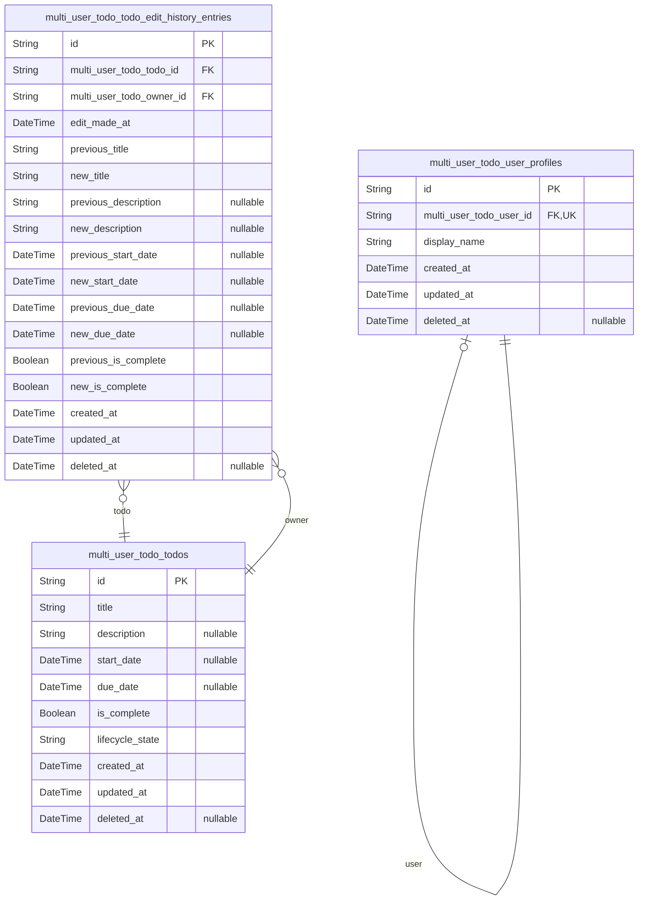

# Prisma Markdown

> Generated by [`prisma-markdown`](https://github.com/samchon/prisma-markdown)

- [multi_user_todo](#multi_user_todo)

## multi_user_todo

### `multi_user_todo_user_profiles`

Stores a user's private profile personalization details. The profile is
owned by exactly one user account, and other users must not be able to
view it.

Properties as follows:

- `id`: Primary key for the user profile record.
- `multi_user_todo_user_id`
  > Reference to the owning [multi_user_todo_user_profiles.id](#multi_user_todo_user_profiles) account.
  > Enforces that each user has at most one profile.
- `display_name`
  > User-facing display name presented in the app. This is a key profile
  > attribute used for personalization.
- `created_at`: Record creation timestamp.
- `updated_at`: Record last update timestamp.
- `deleted_at`
  > Soft delete timestamp. When set, the profile is treated as deleted and is
  > no longer visible to the owning user.

### `multi_user_todo_todos`

Private task item owned by exactly one user and visible only to that user
across normal, completed, and trash states. Stores the todo's current
editable attributes plus timestamps for filtering, ordering, and soft
deletion visibility.

Properties as follows:

- `id`: Primary key of the todo item.
- `title`: Required human-readable title of the todo.
- `description`: Optional longer description for the todo; can be empty or null.
- `start_date`: Optional datetime indicating when the todo begins.
- `due_date`: Optional datetime deadline for the todo.
- `is_complete`: Completion status of the todo; starts as false (incomplete).
- `lifecycle_state`
  > Lifecycle state controlling deletion flow and list visibility (e.g.,
  > normal vs trash).
- `created_at`: Creation timestamp of the todo record.
- `updated_at`: Last update timestamp of the todo record.
- `deleted_at`
  > Soft-delete timestamp. When non-null, the todo is considered deleted
  > (typically moved to trash) and excluded from normal lists.

### `multi_user_todo_todo_edit_history_entries`

Immutable edit history entry for a specific todo.

Each row represents a single change event and stores both the previous
and new values for tracked todo attributes. This enables audit-style
inspection of how a user's todo changed over time, ordered most-recent to
oldest via edit_made_at and the created_at timestamps.

Entries are soft-deletable, and are permanently removed when the owning
todo is permanently removed per system retention rules.

Properties as follows:

- `id`: Primary key for the todo edit history entry.
- `multi_user_todo_todo_id`: Reference to [multi_user_todos.id](#multi_user_todos) for the todo that was edited.
- `multi_user_todo_owner_id`
  > Reference to the owning user of the edited todo, copied for efficient
  > ownership-scoped filtering.
- `edit_made_at`: Business time when the edit was made.
- `previous_title`: Previous todo title value before this edit.
- `new_title`: New todo title value after this edit.
- `previous_description`: Previous todo description value before this edit; null means it was empty.
- `new_description`: New todo description value after this edit; null means it is empty.
- `previous_start_date`: Previous todo start date before this edit; null means it was unset.
- `new_start_date`: New todo start date after this edit; null means it is unset.
- `previous_due_date`: Previous todo due date before this edit; null means it was unset.
- `new_due_date`: New todo due date after this edit; null means it is unset.
- `previous_is_complete`: Previous completion status before this edit.
- `new_is_complete`: New completion status after this edit.
- `created_at`: Record creation timestamp.
- `updated_at`: Record last update timestamp.
- `deleted_at`: Soft delete timestamp for this history entry.
