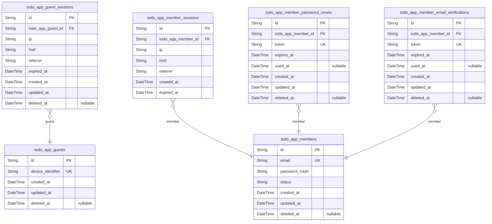
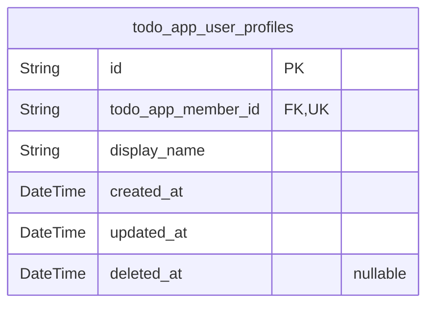
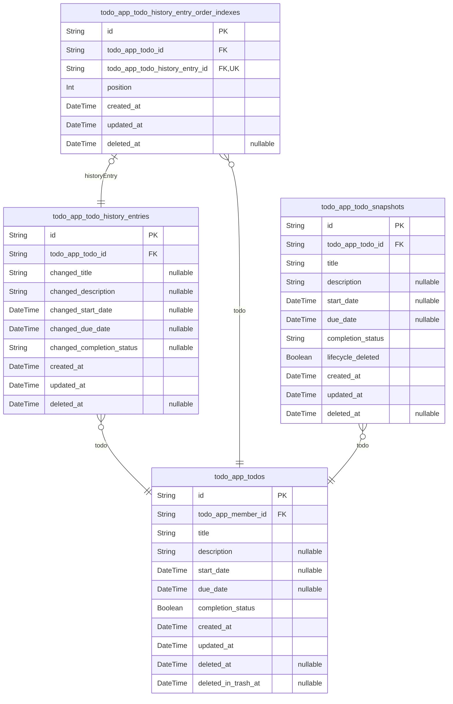

# Prisma Markdown

> Generated by [`prisma-markdown`](https://github.com/samchon/prisma-markdown)

- [Actors](#actors)
- [User](#user)
- [Todo](#todo)

## Actors

### `todo_app_guests`

Temporary guest identity records for unauthenticated access. This table
stores device-related identifiers used to distinguish guest sessions
without requiring email/password credentials, and it supports soft
deletion for privacy and lifecycle management. Sessions for guests
reference this identity from the guest session table {@link
todo_app_guest_sessions}.

Properties as follows:

- `id`: Primary Key.
- `device_identifier`
  > Stable identifier of the device or client used to associate multiple
  > guest sessions with the same guest identity.
- `created_at`: When this guest identity was created.
- `updated_at`: When this guest identity was last updated.
- `deleted_at`
  > Soft delete timestamp. When set, this guest identity is treated as
  > deleted and should no longer be used for new sessions.

### `todo_app_guest_sessions`

Stores login/session connection records for unauthenticated guest access
in order to audit activity and manage guest session expiration.

Each row represents a single guest session context and is linked to
exactly one guest identity ([todo_app_guests.id](#todo_app_guests)). This table
captures connection metadata (IP address and navigation context) and the
session expiration timestamp. Soft deletion is supported via deleted_at.

Properties as follows:

- `id`: Primary Key.
- `todo_app_guest_id`: Belonged guest identity [todo_app_guests.id](#todo_app_guests).
- `ip`: IP address observed for this guest session.
- `href`
  > Request URL (or landing href) associated with the guest session
  > initiation.
- `referrer`
  > Referrer value observed for the request that created/used this guest
  > session.
- `expired_at`: When this guest session expires and should no longer be accepted.
- `created_at`: Creation timestamp of the guest session record.
- `updated_at`: Last update timestamp of the guest session record.
- `deleted_at`
  > Soft delete timestamp for this session record. Null means the session is
  > not deleted.

### `todo_app_members`

Registered authenticated member accounts for the todo app.

This table stores the member's login credentials (email and password
hash) and lifecycle/account status used by authentication and
authorization logic. Soft deletion is supported via deleted_at.

Relationships:
- One member can have many login sessions in {@link
todo_app_member_sessions}.
- One member can have many password reset attempts in {@link
todo_app_member_password_resets}.
- One member can have many email verification tokens in {@link
todo_app_member_email_verifications}.

Properties as follows:

- `id`: Primary Key.
- `email`: Unique email address used for member login and identity lookups.
- `password_hash`
  > Hashed password credential for the member account (never store plaintext
  > passwords).
- `status`
  > Account lifecycle status used to control whether the member can
  > authenticate and access resources. Stored as a string category value
  > defined by the domain rules.
- `created_at`: Record creation timestamp for the member account.
- `updated_at`: Record last update timestamp for the member account.
- `deleted_at`
  > Soft delete timestamp. When set, the member is considered deleted and
  > should not authenticate.

### `todo_app_member_sessions`

JWT-based login session records for authenticated members. Each record
ties a member's active session to connection context (IP and referrer)
and stores session expiration time for security auditing and access
control. This table is created and managed by the authentication/session
lifecycle flow, not by domain operations.

Properties as follows:

- `id`: Primary Key.
- `todo_app_member_id`: Belonged member account [todo_app_members.id](#todo_app_members).
- `ip`: Client IP address captured at session creation time.
- `href`: Request URL (or origin) associated with the session creation event.
- `referrer`: HTTP referrer header captured at session creation time.
- `created_at`: Session creation timestamp.
- `expired_at`
  > Session expiration timestamp. Used to invalidate the session after its
  > lifetime.

### `todo_app_member_password_resets`

Stores password reset tokens for member accounts. Each record represents
a token issued for account recovery, including when it expires and
whether it has been used so the token can be treated as single-use.
Tokens belong to exactly one member account via {@link
todo_app_members.id}.

Properties as follows:

- `id`: Primary Key.
- `todo_app_member_id`
  > Belonged member account for which this password reset token was issued.
  > [todo_app_members.id](#todo_app_members).
- `token`
  > Opaque password reset token value used by the client to authorize a
  > password change. Treat as a secret credential.
- `expires_at`: Expiration timestamp after which the token must be rejected.
- `used_at`
  > When the token was successfully used. Null means the token is still
  > unused.
- `created_at`: Creation timestamp of the password reset token record.
- `updated_at`: Last update timestamp of the password reset token record.
- `deleted_at`: Soft-delete timestamp for administrative or cleanup purposes.

### `todo_app_member_email_verifications`

Email verification token records for member accounts. These tokens are
issued during registration and other email-ownership workflows, allowing
the system to confirm that the email address belongs to the authenticated
member. Each record links to exactly one member and is evaluated by token
value and expiration status.

Properties as follows:

- `id`: Primary Key.
- `todo_app_member_id`: Belonged member account [todo_app_members.id](#todo_app_members).
- `token`: Verification token value used to confirm email ownership.
- `expired_at`: Expiration timestamp after which this token is invalid.
- `used_at`: Timestamp when the token was successfully used; null if unused.
- `created_at`: Record creation timestamp.
- `updated_at`: Record last update timestamp.
- `deleted_at`: Soft delete timestamp. Null means the record is active.

## User

### `todo_app_user_profiles`

Private, non-shareable user profile data associated with exactly one
owning user account.

This table stores the current profile personalization attribute (display
name) that a member user can view and edit for their own experience. The
profile is owned by the member account and is removed as part of the
account deletion lifecycle.

All access is scoped to the owning member to prevent cross-user visibility.

Properties as follows:

- `id`: Primary Key.
- `todo_app_member_id`: Belonged member's [todo_app_members.id](#todo_app_members).
- `display_name`: Current display name personalization for the owning member user.
- `created_at`: Creation timestamp of this profile record.
- `updated_at`: Last update timestamp of this profile record.
- `deleted_at`
  > Soft delete timestamp. When set, the profile is considered deleted for
  > business purposes.

## Todo

### `todo_app_todo_history_entries`

Append-only audit records of each change made by a member to a specific
todo. Each row represents one edit event and stores the updated values
for the fields that were changed during that operation, along with the
event timestamp for newest-to-oldest history retrieval.

This table is intended to be immutable from the business perspective
(updates should be avoided); however it supports soft deletion via
deleted_at for administrative or retention purposes.

Properties as follows:

- `id`: Primary Key.
- `todo_app_todo_id`
  > Belonged todo that this history entry records changes for ({@link
  > todo_app_todos.id}).
- `changed_title`
  > New title value for this change event when the title was modified; null
  > when the title was not part of the edit.
- `changed_description`
  > New description value for this change event when the description was
  > modified; null when the description was not part of the edit.
- `changed_start_date`
  > New start date value for this change event when the start date was
  > modified; null when the start date was not part of the edit.
- `changed_due_date`
  > New due date value for this change event when the due date was modified;
  > null when the due date was not part of the edit.
- `changed_completion_status`
  > New completion status value for this change event when completion was
  > modified; null when completion was not part of the edit.
- `created_at`
  > Timestamp when this edit event occurred (used to order history from
  > newest to oldest).
- `updated_at`
  > Timestamp when this record was last updated (should generally remain
  > unchanged after creation).
- `deleted_at`: Soft deletion timestamp for the history entry.

### `todo_app_todo_history_entry_order_indexes`

Supporting index records that enable efficient retrieval of a single
todo's edit history ordered from newest to oldest.

Each row ties one [todo_app_todos.id](#todo_app_todos) to one {@link
todo_app_todo_history_entries.id} history entry and provides ordering
keys used by list and pagination queries. This table does not store
business text; it only supports fast lookup and ordering.

Properties as follows:

- `id`: Primary Key.
- `todo_app_todo_id`
  > Belonged todo for which this history-entry index row is used ({@link
  > todo_app_todos.id}).
- `todo_app_todo_history_entry_id`
  > Referenced todo history entry that is indexed for ordered retrieval
  > ([todo_app_todo_history_entries.id](#todo_app_todo_history_entries)).
- `position`
  > Integer position used to represent the ordered sequence of history
  > entries for the referenced todo (newest-first ordering).
- `created_at`: Record creation timestamp for this index row.
- `updated_at`: Record update timestamp for this index row.
- `deleted_at`
  > Soft delete timestamp for this index row when the corresponding history
  > ordering should no longer be considered.

### `todo_app_todos`

Main todo items owned by exactly one member account in a private todo app.

A todo is created with a required title and starts as incomplete by
default. It can optionally carry a description plus optional
planning/tracking dates (start_date and due_date). The owning user can
browse todos in two business contexts: Active (part of the normal todo
list) and Deleted (in the trash list). Edit history remains associated
while the todo is either Active or Deleted(in trash), and is permanently
removed only when the todo is permanently deleted.

This table supports privacy boundaries by scoping every todo to its
owning member account via a foreign key. The title is required for both
creation and editing; clearing the title is rejected at the service
layer.

Properties as follows:

- `id`: Primary Key.
- `todo_app_member_id`
  > Owning member account for this todo. All todo viewing and management is
  > scoped to this member to preserve privacy boundaries.
- `title`
  > Todo title. Required; a todo cannot exist without a title and edits
  > cannot clear the title.
- `description`
  > Optional description text for the todo. May be empty/absent while the
  > todo still exists.
- `start_date`
  > Optional planning attribute representing the time the owning user
  > indicates the task should start. Unset means no start date was provided.
- `due_date`
  > Optional tracking attribute representing the time the owning user
  > indicates the task is due. Unset means no due date was provided.
- `completion_status`
  > Binary completion state of the todo: true means complete, false means
  > incomplete. New todos start as incomplete.
- `created_at`
  > Creation timestamp of the todo used for ordering the user’s todo list.
  > Remains the original creation time across lifecycle changes.
- `updated_at`: Last update timestamp for this todo record.
- `deleted_at`
  > Soft-delete timestamp. When set, the record is treated as removed from
  > the accessible set in persistence-level semantics (used for permanent
  > deletion flows if needed).
- `deleted_in_trash_at`
  > Lifecycle timestamp indicating the todo has been moved to Deleted (in
  > trash). When null, the todo is treated as Active in the normal todo list;
  > when set, it is shown in the trash list until restored or permanently
  > deleted.

### `todo_app_todo_snapshots`

Point-in-time snapshots of a todo's state for audit history and recovery.

Each time a todo is changed, this table stores the denormalized fields
needed to reconstruct what the todo looked like at that moment. The
snapshot is linked to the owning todo record via {@link
todo_app_todos.id}. Snapshots are intended to be append-only from the
application perspective and support viewing edit history and restoring a
todo after recovery flows.

Properties as follows:

- `id`: Primary Key.
- `todo_app_todo_id`
  > Belonged todo for which this snapshot captures the point-in-time state
  > [todo_app_todos.id](#todo_app_todos).
- `title`: Todo title as it was at the time this snapshot was created.
- `description`: Optional todo description as it was at the time this snapshot was created.
- `start_date`: Optional planned start date of the todo captured in this snapshot.
- `due_date`: Optional due date of the todo captured in this snapshot.
- `completion_status`
  > Todo completion status captured in this snapshot (represents whether the
  > todo was completed or not at that time).
- `lifecycle_deleted`
  > Whether the todo was in the deleted/trash lifecycle state at the time
  > this snapshot was taken.
- `created_at`: Snapshot creation timestamp.
- `updated_at`: Snapshot last update timestamp (typically unchanged after creation).
- `deleted_at`
  > Soft delete timestamp for the snapshot record when it is removed from
  > active history.
