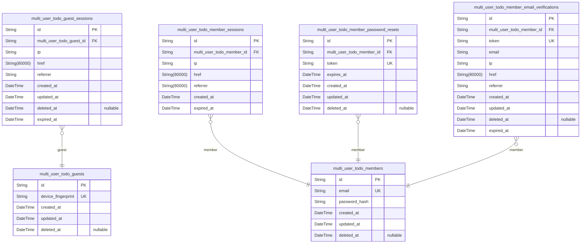
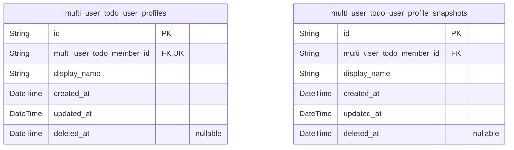
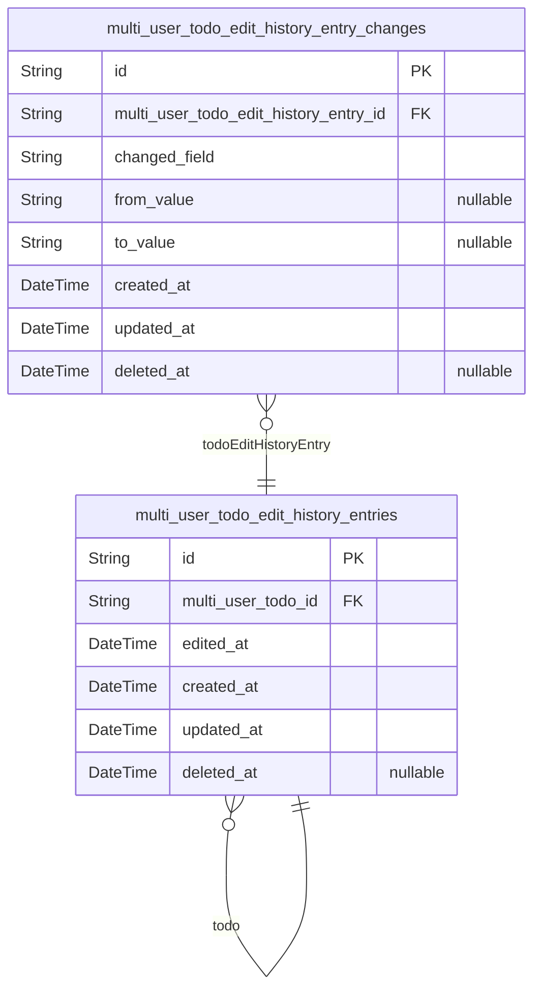

# Prisma Markdown

> Generated by [`prisma-markdown`](https://github.com/samchon/prisma-markdown)

- [Systematic](#systematic)
- [UserProfiles](#userprofiles)
- [TodoEditHistoryEntries](#todoedithistoryentries)

## Systematic

### `multi_user_todo_guests`

Stores guest actor records for anonymous access.

A guest is correlated to a device-level identity (e.g., a fingerprint
generated on the client) and has no password credentials. The guest
record is used to associate guest browsing sessions and todo interactions
(within the guest access boundaries defined by the system). Soft deletion
is supported via deleted_at; sessions and related records are handled by
dedicated session tables.

Properties as follows:

- `id`: Primary Key.
- `device_fingerprint`
  > Client-generated device fingerprint used to correlate a guest identity
  > across requests while the user remains unauthenticated.
- `created_at`: When the guest actor record was created.
- `updated_at`: When the guest actor record was last updated.
- `deleted_at`
  > When the guest actor record was soft-deleted. Null means the guest is
  > active.

### `multi_user_todo_guest_sessions`

Guest session tokens for temporary guest access. This table stores issued
session credentials and connection metadata for unauthenticated (guest)
usage, and expires sessions for security auditing.

Each record belongs to exactly one guest account ({@link
multi_user_todo_guests.id}).

Properties as follows:

- `id`: Primary Key.
- `multi_user_todo_guest_id`: Belonged guest's [multi_user_todo_guests.id](#multi_user_todo_guests).
- `ip`: IP address where the session was created.
- `href`: The URL (href) the client visited when creating the session.
- `referrer`: Referrer information sent by the client when creating the session.
- `created_at`: Creation timestamp of the guest session.
- `updated_at`: Last update timestamp for the guest session record.
- `deleted_at`: Soft delete timestamp for the guest session record.
- `expired_at`
  > Expiration timestamp of the guest session. Sessions become invalid after
  > this time.

### `multi_user_todo_members`

Member actor identity for registered users who can authenticate to the
multi_user_todo system.

This table stores the canonical account credentials (email-based identity
and password hash) used by the authentication flow. Private profile data
and todo ownership are modeled in other domain tables and referenced from
this actor identity.

Properties as follows:

- `id`: Primary Key.
- `email`
  > Unique email address used to identify the member account during
  > registration and login.
- `password_hash`
  > Hashed password credential for secure authentication. Store only the
  > hash, never the plaintext password.
- `created_at`: Record creation timestamp.
- `updated_at`: Record last update timestamp.
- `deleted_at`
  > Soft-delete timestamp. Null when the account is active; set when the
  > account is deleted.

### `multi_user_todo_member_sessions`

Authenticated member login sessions that store token-related connection
metadata.

Each record represents one active/issued session for a specific
authenticated member and is referenced by session-protected todo and
profile operations.

This table supports the session persistence requirements by keeping
connection context (IP, href, referrer) and an expiration timestamp for
security enforcement.

Properties as follows:

- `id`: Primary Key.
- `multi_user_todo_member_id`: Belonged member’s session owner [multi_user_todo_members.id](#multi_user_todo_members).
- `ip`: Client IP address captured when the session was created.
- `href`: The request URL (href) captured when the session was created.
- `referrer`: The HTTP referrer URL captured when the session was created.
- `created_at`: When the session record was created.
- `expired_at`: When the session becomes invalid for authentication.

### `multi_user_todo_member_password_resets`

Stores password reset tokens for member accounts.

When a member requests password recovery, a token is issued and can be
validated until its expiration timestamp. The token is associated with
exactly one owning member ([multi_user_todo_members.id](#multi_user_todo_members)).

This table is append-focused: use created_at/updated_at for audit, and
deleted_at for soft deletion when a token is invalidated or no longer
needed.

Properties as follows:

- `id`: Primary Key.
- `multi_user_todo_member_id`
  > Belonged member that this password reset token targets ({@link
  > multi_user_todo_members.id}).
- `token`
  > Opaque password reset token used by the client to prove the request.
  > Stored as a generated token value.
- `expires_at`: Timestamp after which this reset token is no longer valid.
- `created_at`: Record creation timestamp.
- `updated_at`: Record update timestamp.
- `deleted_at`: Soft delete timestamp for invalidated or purged reset tokens.

### `multi_user_todo_member_email_verifications`

Email verification tokens for member accounts to confirm ownership of an
email address after registration or when the email changes. Each record
belongs to exactly one [multi_user_todo_members.id](#multi_user_todo_members) (the target
member) and expires at a specified time.

Properties as follows:

- `id`: Primary Key.
- `multi_user_todo_member_id`
  > Belonged member account [multi_user_todo_members.id](#multi_user_todo_members). This token is
  > issued for a specific member.
- `token`
  > Opaque verification token value presented by the client and redeemed by
  > the backend to verify the member email ownership.
- `email`
  > The email address that this token is intended to verify for the member at
  > the time of issuance.
- `ip`
  > Client IP address captured at token issuance time for basic auditing and
  > troubleshooting.
- `href`
  > Link or URL reference associated with this verification token (e.g., the
  > verification endpoint URL embedded into the email).
- `referrer`
  > Referrer information captured at token issuance time for auditing the
  > request origin.
- `created_at`: When this verification token record was created.
- `updated_at`: When this verification token record was last updated.
- `deleted_at`
  > Soft delete timestamp. When set, the token is considered revoked/invalid
  > for verification purposes.
- `expired_at`
  > Expiration time for this token. After this timestamp, the token must be
  > treated as invalid.

## UserProfiles

### `multi_user_todo_user_profiles`

Stores the private user profile identity for the owning member. Contains
the editable display name used for personal customization while
preserving a strict privacy boundary so other users cannot access this
profile’s private data.

Properties as follows:

- `id`: Primary Key.
- `multi_user_todo_member_id`: Belonged member’s [multi_user_todo_members.id](#multi_user_todo_members) record.
- `display_name`
  > User-customized display name for personalization and human-friendly
  > labeling within the user’s private scope.
- `created_at`: Record creation timestamp.
- `updated_at`: Record last update timestamp.
- `deleted_at`
  > Soft delete timestamp. When set, the profile is considered unavailable
  > until restored (if the application supports restore).

### `multi_user_todo_user_profile_snapshots`

Point-in-time audit records for a member’s private user profile.

Each snapshot captures the display name (and any other current profile
attributes required to reconstruct the past state) at the moment the
profile was changed. Snapshots support recovery/retention behavior by
preserving historical profile values even after subsequent edits and
after soft-deletion of the owning profile data is initiated.

Properties as follows:

- `id`: Primary Key.
- `multi_user_todo_member_id`: Belonged member (owner of the profile) [multi_user_todo_members.id](#multi_user_todo_members).
- `display_name`: The member’s display name captured at the time of this profile snapshot.
- `created_at`: Creation timestamp of this profile snapshot record.
- `updated_at`
  > Last update timestamp for this snapshot record (typically unchanged after
  > creation).
- `deleted_at`: Soft delete timestamp for this snapshot record (nullable).

## TodoEditHistoryEntries

### `multi_user_todo_edit_history_entries`

Audit entries created for each edit action on a todo. Each entry belongs
to exactly one todo and records when the edit occurred; the per-field
changes are stored in [multi_user_todo_edit_history_entry_changes](#multi_user_todo_edit_history_entry_changes)
to keep this table normalized and atomic.

Properties as follows:

- `id`: Primary Key.
- `multi_user_todo_id`
  > Belonged todo for which this edit history entry was created, {@link
  > multi_user_todo_edit_history_entries.id}.
- `edited_at`
  > Business timestamp of when the todo was edited (required for ordering
  > edit history entries newest to oldest).
- `created_at`: Record creation timestamp for this edit history entry.
- `updated_at`: Record last update timestamp for this edit history entry.
- `deleted_at`
  > Soft deletion timestamp. When the todo is permanently deleted from trash,
  > this entry is also removed from permanently deleted content.

### `multi_user_todo_edit_history_entry_changes`

Stores per-field change markers for a specific {@link
multi_user_todo_edit_history_entries} record.

Each row captures one todo attribute that was actually changed by an edit
action, along with the prior value (from_value) and the updated value
(to_value) for that field. This table exists to represent edit history in
a normalized, field-granular way without relying on nullable columns for
optional entities.

Properties as follows:

- `id`: Primary Key.
- `multi_user_todo_edit_history_entry_id`
  > Belonged todo edit history entry {@link
  > multi_user_todo_edit_history_entries.id}.
- `changed_field`
  > The name of the todo field that changed (e.g., title, description,
  > start_date, due_date).
- `from_value`
  > The previous value of the changed field before the edit. Null represents
  > that the value was absent before the edit.
- `to_value`
  > The new value of the changed field after the edit. Null represents that
  > the value became absent after the edit.
- `created_at`: When this field-level edit change record was created.
- `updated_at`: When this field-level edit change record was last updated.
- `deleted_at`
  > Soft-delete timestamp. When set, the record is considered deleted but
  > still kept for audit recovery.
