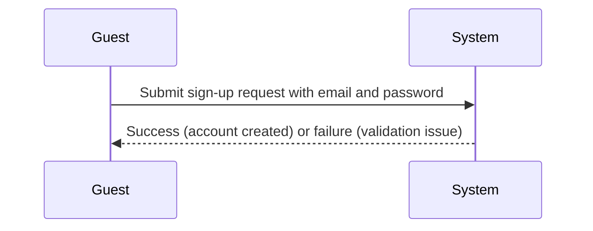
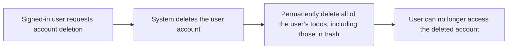

**multiUserTodo — Actor definitions, permission matrix, authentication, session, account lifecycle**

Actor definitions, permission matrix, authentication, session, account lifecycle

# Actor Definitions

Define all user actor types with their identity, permissions, and access boundaries.

## guest Actor

A guest actor represents a person who is not signed in to an account. This role has no authenticated identity, so they are not associated with any user profile. Because the guest is not signed in, they cannot access or manage any personal todo information. Any action that depends on the user being recognized as an authenticated member must be rejected for guests. Guests can only take part in entry-point authentication experiences that lead to creating or accessing an account. If a guest tries to access anything that would require a logged-in identity, the system must respond with an authorization failure rather than partially processing the request. Throughout the guest session, the access boundary remains the same until the guest successfully signs in. This ensures guests cannot read, change, or delete any user-owned resources.

### Guest Actor Role Definition

A guest actor represents a person who is not signed in to an account.
The guest has no authenticated identity and is not associated with any user profile.
While the person remains unauthenticated, the system must treat all their requests as originating from the guest actor.
Once the guest successfully signs in, the person must no longer be treated as a guest, and the system must apply the signed-in access boundary for that person.

### Unauthenticated Identity and Request Treatment

While a person is in the unauthenticated state, the system must enforce that the person cannot be recognized as belonging to any user profile.
If an unauthenticated request would require a known user profile, the system must reject the request.
The system must not reveal any information that would indicate the existence or details of a user’s personal todos when the requester is unauthenticated.

### Sign-In Required Access for Account-Scoped Actions

The system must require a signed-in identity for any action that depends on accessing or managing personal user todo information.
If a guest attempts an account-scoped action, the system must reject the request.
For rejected guest actions, the system must not partially perform the requested change or creation.

### Account Entry-Point Capability for Guests

While the person is a guest, the system must allow only the account entry-point authentication experiences.
Account entry-point authentication experiences are the only guest-available paths that can lead to creating or accessing an account.
The system must ensure guests cannot reach any personal todo browsing, editing, deletion, or history viewing features through the normal application navigation while unauthenticated.

### No Permission for User-Owned Todos

Guests must have no permission to view, access, change, complete, restore, or delete any user-owned todo information.
Guests must not be able to list their own todos (including any deleted todos in trash), view a single todo’s full details, or view any todo edit history.
If a guest requests any user-owned todo content or a todo state change, the system must reject the request due to the guest lacking a user profile context.

### Authorization Failure for Guest Attempts at Signed-In Actions

If a guest attempts an action intended for signed-in users, the system must respond with an authorization failure.
Authorization failure must occur before any personal todo data or user profile data is returned.
The authorization failure must apply consistently even if the requested action type would otherwise be valid for signed-in users.

### Access Boundary During Guest Session

Throughout the guest session, the system must enforce a consistent access boundary that matches the unauthenticated state.
The access boundary must remain in effect until the guest successfully signs in.
After a successful sign-in, the system must apply the signed-in access boundary for that person for subsequent actions.

### Limited Capabilities for Unauthenticated Users

While unauthenticated, the guest’s capabilities must be limited to the account entry-point authentication experiences.
All other capabilities must be unavailable to the guest, including any ability to read or modify personal todo lists, todo details, todo edit history, or deleted todo information.
The system must apply these limitations consistently for every attempted action during the guest session.

## member Actor

A member actor represents a signed-in user with an authenticated identity tied to a single account. The member’s permissions apply only within the context of the account they are currently signed into. Members can manage their own account-related settings, including changing their password and deleting their account. Members also control their own profile information, such as editing the display name. A core access boundary is self-only access: members must never view, edit, or otherwise interact with another user’s profile or todo content. If a member attempts an action where the target ownership does not match their authenticated session, the system must deny the request. When an account is deleted, the member should no longer be treated as a valid active actor for subsequent actions tied to that identity. This role therefore defines a strict, account-scoped permission model for all member interactions.

### Member Actor Role (Signed-In, Account-Scoped)

- A member actor represents a user who is currently signed in and operating under an authenticated session.
- The system must base member permissions and access checks on the signed-in user’s authenticated identity, not on any identity information provided in the request.
- A member actor’s permissions are account-scoped: they apply only to the single account the member is currently signed into.
- The system must deny any member action that attempts to target another user’s data.
- The system must consistently treat this account-scoped boundary as the core rule for all member interactions covered by this role.

### Signed-In Identity Used for Authorization

- When a signed-in user performs a member-scoped action, the system must associate the action with that user’s authenticated identity from the active signed-in session.
- The system must not allow a member to act on behalf of a different user by supplying a different user identity in the request.
- If the user is not signed in, the system must not grant member-scoped permissions.
- If the system cannot determine the signed-in authenticated identity for an action, the system must deny the member-scoped action.

### Account-Scoped Permissions for Member Actions

- Members can manage their own account-related settings, including changing their password and deleting their account.
- Members can manage their own profile information, including editing their display name.
- For any member action that involves account-owned content, the system must verify that the target content belongs to the member’s own account before allowing the action.
- If a member attempts an account-owned action on content that belongs to another account, the system must deny the request rather than partially performing it.

### Self-Only Profile Access

- Members can view their own profile information.
- Members must not view any other user’s profile information.
- Members can update only their own profile information.
- If a member attempts to view or update a profile that does not belong to them, the system must deny the request.
- This self-only boundary must apply to all profile-related actions available to the member actor.

### Edit Own Display Name

- Members must be able to edit their own display name as part of managing their profile.
- The system must apply display name changes only to the signed-in member’s own profile.
- If a member attempts to change the display name for another user’s profile, the system must deny the request.
- After a successful edit, the member’s profile display name must reflect the newly provided value when the profile is viewed by the same member.

### Change Password Capability

- Members must be able to change the password for their own account.
- The system must apply a password change only to the signed-in member’s own account.
- If a member attempts to change the password for another account, the system must deny the request.
- The system must ensure that password changes apply to subsequent login attempts for the affected account.

### Account Deletion Boundary (Including Todos in Trash)

- Members must be able to delete their own account.
- When an account is deleted, all todos owned by that account must be permanently deleted, including todos that are currently in trash.
- After deletion, the deleted user must no longer be able to view, restore, edit, or otherwise interact with any todos that belonged to that account.
- After deletion, the system must not treat the deleted account’s user as a valid active member identity for subsequent member-scoped actions tied to that identity.
- The account deletion behavior must ensure there is no way for a deleted user to continue operating under the prior identity.

### Deny Cross-Account Access Attempts

- The system must deny any member action that would access, modify, restore, or interact with content not owned by the member’s own account.
- This denial must apply even when the request includes identifying information that could otherwise appear to refer to another user.
- The system must not allow cross-account behavior as an exception for profile-related actions.
- When ownership boundaries are violated, the system must deny the request rather than allowing a partial outcome.

# Authentication Flows

Registration, login, logout, and session management from a user perspective.

## Registration and Login

Define user registration and login flows including validation and error handling.

### User Registration with Email and Password

When a guest starts an account registration, the system collects an email address and a password.
THE system SHALL reject a registration attempt if the email address is missing.
THE system SHALL reject a registration attempt if the password is missing.
THE system SHALL reject a registration attempt if the email address is already associated with an existing account.
WHEN a registration attempt succeeds, the system creates the new user account.
WHEN a registration attempt succeeds, the user becomes signed in so they can access account-scoped actions.
WHEN a registration attempt succeeds, the user starts with an empty todo list.
If a registration attempt fails, the system does not create a new account.
If a registration attempt fails, the system returns an outcome that enables the user to correct the registration attempt.

### User Login with Email and Password

WHEN a guest attempts to sign in, the system collects an email address and a password.
THE system SHALL reject a login attempt if the email address is missing.
THE system SHALL reject a login attempt if the password is missing.
THE system SHALL reject the login attempt if the email address does not correspond to an existing account.
THE system SHALL reject the login attempt if the provided password does not match the account associated with the provided email address.
WHEN a login attempt succeeds, the user becomes signed in so they can access account-scoped actions.
IF a login attempt fails, the system does not provide a way for the user to determine whether the email address exists in the system.
After a failed login attempt, the user’s existing account data is unchanged.

### Authentication State and Access to Account-Scoped Features

WHILE the user is not signed in, the system does not allow access to account-scoped actions.
WHEN a user is signed in, the system allows access to account-scoped actions for that signed-in user.
If a user attempts to perform an account-scoped action while not signed in, the system denies the action and instructs the user to sign in or register.
All account-scoped actions apply only to the signed-in user’s own todos and profile.
IF the signed-in state is no longer valid, the system requires the user to sign in again before account-scoped actions are allowed.

## Session and Logout

Define session behavior and logout from a user perspective.

### Session State for Signed-In Users

WHEN a user is signed in successfully, the system SHALL treat the user as signed in for subsequent member-only actions that operate on the user’s own account.
WHILE the user remains signed in, the user SHALL be able to perform member actions that require a user account.
IF the user is not signed in, THEN the system SHALL deny member-only actions.
WHEN a signed-in member is performing actions that affect todos, the system SHALL ensure those actions apply only to that member’s own todos.
IF a signed-in user attempts to access or manage another user’s account data or todos, THEN the system SHALL deny access.
IF the signed-in state is lost (for example, through session end), THEN the user SHALL no longer be treated as signed in for member actions until they sign in again.
The system SHALL not allow a guest to view or manage member-owned todos or any user profile details other than what is explicitly allowed for guests in other sections (guest permissions defined elsewhere).

### Logout and Session Termination

WHEN a signed-in user chooses to log out, the system SHALL end the user’s signed-in state.
AFTER logout, the system SHALL treat the user as signed out.
AFTER logout, the system SHALL deny member-only actions until the user signs in again.
LOGOUT SHALL NOT create or modify any todo content as a side effect of logging out.
The system SHALL ensure that once logout is completed, the user cannot continue to use any existing signed-in session to access or manage account-scoped todos.
IF a user attempts to perform an action that requires being signed in after logout, THEN the request SHALL be rejected as a signed-out user.

### Account Security: Password Change and Account Deletion

Users SHALL be able to change their password.
A password change SHALL be allowed only for signed-in users.
IF a password change is attempted while the user is not signed in, THEN the system SHALL reject the request.
IF the user does not correctly provide the current password for their account, THEN the system SHALL reject the password change.
After a successful password change, the user SHALL be able to sign in using the new password.
Users SHALL be able to delete their account.
Account deletion SHALL permanently delete all todos owned by the deleting user, including todos in trash.
After account deletion, the user SHALL no longer be considered signed in.
Account deletion SHALL be available only to the signed-in owner of the account.
IF a guest attempts to delete an account, THEN the system SHALL reject the request.
IF account deletion is performed, THEN the user’s account data and associated todos SHALL no longer be available for normal todo viewing or trash viewing by that user.

# Account Lifecycle

Account creation, deletion, and password management.

## Account Management

Define how users create accounts, delete accounts, and change passwords.

### Account Creation

### Email and password sign-up
WHEN a guest attempts to create a new account, THE system shall allow account creation using an email address and a password provided by the user.
IF the user does not provide an email address, THEN THE system shall reject the sign-up attempt.
IF the user does not provide a password, THEN THE system shall reject the sign-up attempt.

### Unique email per account
IF the user submits an email address that is already associated with an existing account, THEN THE system shall reject the sign-up attempt.

### Account availability after sign-up
WHEN account creation succeeds, THE system shall make the newly created account available so it can later be used to log in.

### Account Deletion

### Signed-in requirement for deletion
IF the user requests account deletion while not signed in, THEN THE system shall reject the deletion request.

### Deletion applies only to the requesting user
WHEN a signed-in user requests deletion of their own account, THEN THE system shall delete only the requesting user’s account.

### Permanent removal of all user todos
Upon deletion of a user account, THE system shall permanently delete all todos owned by that user.
This permanent deletion shall include todos that are currently in the trash.

### Account access after deletion
After the deletion completes, THE system shall ensure the deleted user can no longer access the system as that account.

### Password Change

### Signed-in requirement for password change
IF the user attempts to change their password while not signed in, THEN THE system shall reject the password-change request.

### New password is required
WHEN a signed-in user requests a password change, THE system shall require the new password value to be provided.
IF the new password value is missing, THEN THE system shall reject the password-change request.

### Password change enables future logins
AFTER a successful password change, THE system shall ensure the updated password can be used for subsequent login attempts.

### No unintended password change on failure
IF the password-change request is rejected, THEN THE system shall keep the user’s existing password unchanged.