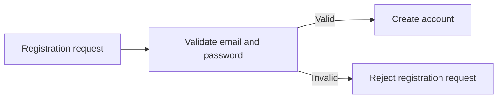
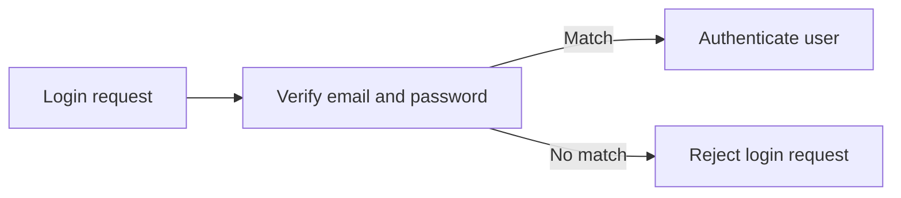
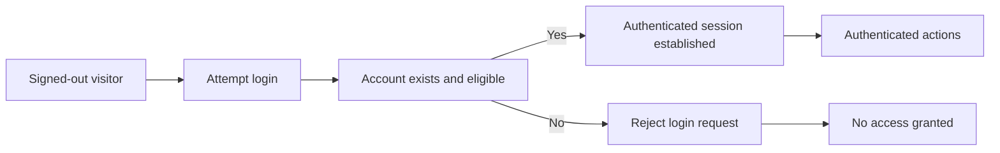
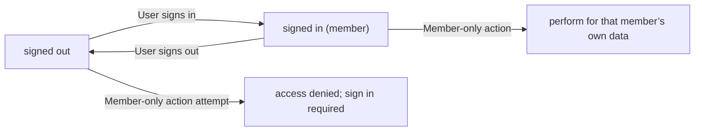
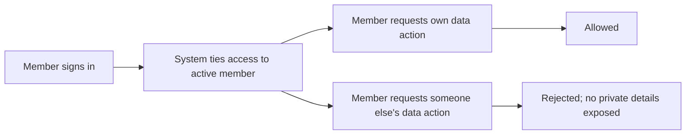

**todoApp — Actor definitions, permission matrix, authentication, session, account lifecycle**

Actor definitions, permission matrix, authentication, session, account lifecycle

# Actor Definitions

Define all user actor types with their identity, permissions, and access boundaries.

## guest Actor

A guest actor represents a person who is not currently signed in to the todo application. The guest has no authenticated user identity and therefore cannot be treated as an owner of any private content. The guest can access only entry points that allow starting an account relationship, such as beginning registration or providing credentials to sign in. The guest’s permissions are limited to actions that do not require an established account context. Because the guest is not tied to a user, the system should not grant access to any user-specific views or actions. If the guest attempts to do something that requires an authenticated identity, the system should prevent the action and ask the person to sign in or complete the required account step. Any attempt to access restricted areas should result in an access-denied experience rather than exposing any private information.

### Unauthenticated Visitor Identity

A guest actor represents a person who is not currently signed in to the todo application.

While a visitor is not signed in, the system shall treat that visitor as having no authenticated user identity.

If the visitor attempts to access features that require an authenticated identity, the system shall deny access rather than treating the visitor as an owner of private content.

The guest actor shall not be considered an owner of any private todo data.

### Guest Role With No Account Ownership

The guest actor shall not be associated with any user account for the purposes of viewing, creating, editing, or deleting todos.

While the guest has no established account relationship, the system shall not grant access to any action that would operate on a specific user’s todos.

If an action requires ownership of a todo, the system shall ensure the guest has no eligible ownership context and therefore cannot perform the action.

### Limited Guest Permissions for Starting Account Relationship

The guest actor shall be allowed to begin the account relationship by using the application entry points that start registration or sign-in.

The system shall limit guest access to only those account-starting steps.

The guest actor shall not have permission to access any user-specific views that display personal todos or personal profile information.

### Access Boundaries for Signed-Out Users

While a person is signed out, the system shall ensure that all user-specific access is blocked.

User-specific content includes the normal todo list, the trash list, and any single-todo details, because these depend on the currently signed-in user.

If the requested page or action would require signed-in context, the system shall provide an access-denied experience rather than exposing any private information.

### Access Denied When Not Signed In

If the guest tries to perform an operation that requires an authenticated account (such as creating, viewing, editing, completing, deleting, restoring, or permanently deleting a todo), the system shall reject the operation.

When access is denied for a signed-out visitor, the system shall clearly communicate that signing in (or completing the required account step) is needed to proceed.

Access denial shall not leak information about other users’ existence or their content.

### Registration or Sign-In Entry Point Behavior

When the guest initiates registration, the system shall guide the person through the process of creating an account.

When the guest initiates sign-in, the system shall guide the person through providing credentials to sign in.

After the guest successfully establishes an account relationship by signing in, the system shall treat subsequent actions as belonging to the signed-in user rather than continuing to enforce guest restrictions.

If the guest account-starting attempt fails, the system shall keep the person in the signed-out state and continue to enforce guest access boundaries.

### No Permission to User-Specific Content

The guest actor shall have no permission to view other users’ profiles.

The guest actor shall have no permission to view any user’s todos.

The guest actor shall have no permission to view edit history for any todo.

If the guest attempts to access any user-specific todo area, the system shall deny access.

## member Actor

A member actor represents a signed-in user who has an established account identity in the todo application. The member is considered the owner of their own account context and is therefore eligible to access features that require authentication. The member’s permissions begin only after a successful sign-in, and they remain valid while the session is active. The member can manage their own account-related actions and interact with application functionality under their identity. The member has access boundaries that prevent them from acting on behalf of other users, since the application treats each member as separate. If a member tries to perform an action without an authenticated identity (for example, after the session is no longer valid), the system should require them to sign in again. If the member’s credentials are not accepted during sign-in, they should remain a guest and not receive any member-level access.

### Signed-in user identity for Member

A member actor represents a single signed-in user identity in the todo application.

While a user is signed in, the system treats actions performed by that user as being performed under that member actor identity.

If a user tries to use member-level access without a current signed-in identity, the system must treat the user as not having the member identity required for protected actions.

### Member role with authenticated access eligibility

A member is eligible to access member-level functionality only when the user has successfully signed in.

If the user’s sign-in is successful, the system grants member-level access to the user for the duration of the active member session.

If the user’s credentials are not accepted during sign-in, the system must not grant member-level access; the user must be treated with guest-level access instead.

### Permissions granted after successful sign-in

Once a user is signed in and the session is active, the system must grant the member the permissions needed to manage and interact with the application under that member’s own account.

These member permissions must not be granted for unauthenticated access. If the session is not active, the member permissions are not available.

### Member session access boundaries

The member’s permissions apply only while the member session is active.

If a session is no longer valid (for example, it has ended or is no longer recognized as active), the system must deny member-level access and require the user to sign in again before performing member-level actions.

### Account-scoped access eligibility (member owns their data context)

A member can only access data that belongs to the member’s own account context.

When the member requests to view, edit, complete, delete, restore, or permanently delete a todo, the system must ensure that the todo is eligible for access only if it belongs to the member.

The member must not be able to access todos that do not belong to the member’s own account context.

### No cross-user impersonation access

The system must prevent any mechanism that would allow a member to act on behalf of another user.

If a member attempts an action targeting another user’s resources, the system must deny access.

A member must not be able to view other users’ profile information.

# Authentication Flows

Registration, login, logout, and session management from a user perspective.

## Registration and Login

Define user registration and login flows including validation and error handling.

### Registration (Sign-up)

Users can register for an account using an email address and a password.

A user registration request is accepted only when the provided email and password meet the system’s registration requirements (as defined in the business rules for this specification).

WHEN a user submits registration details, THE system SHALL create the new user account.

The created user account becomes eligible for login.

If the registration request includes an email that is already associated with an existing account, THEN the registration request is rejected.

If the registration request includes missing required information (email or password), THEN the registration request is rejected.

If the registration request fails validation (for example, the password or email does not meet the stated registration requirements), THEN the system rejects the registration request.

The system SHALL not allow an unregistered person to act as an authenticated member; access remains restricted to signed-out capabilities until login succeeds.

Flowchart of registration outcome:


### Login

Users can log in using their email address and password.

WHEN a user submits login details, THE system SHALL authenticate the login by verifying that the email/password combination corresponds to a registered account.

If the login details correspond to a registered account, THEN the user is authenticated and can access member capabilities.

If the email does not correspond to any registered account, THEN the login request is rejected.

If the password does not match the account’s password, THEN the login request is rejected.

If the login request is missing required information (email or password), THEN the login request is rejected.

If authentication fails, THEN the system SHALL return the user to a signed-out state for that attempt (the user does not gain authenticated access).

Flowchart of login outcome:


### Authentication and Account Lifecycle Boundaries

The system supports authentication for registered users and restricts access for unsigned visitors.

WHILE a user is not authenticated, THE system SHALL prevent access to member-scoped actions.

WHEN a login succeeds, THE system SHALL establish an authenticated session for the user so the user can access their private data.

WHEN an account is deleted, THE system SHALL ensure that the deleted account can no longer be used to authenticate.

IF a user attempts to log in using credentials for an account that has been deleted, THEN the login request is rejected.

Authentication availability depends on account status: if the account is eligible, authentication can succeed; if the account has been removed, authentication must fail.

Flowchart connecting authentication boundaries to account deletion:


## Session and Logout

Define session behavior and logout from a user perspective.

### Session Lifetime and Member Access Boundaries

While a user is signed in, the system SHALL treat that user as the active member for todo-related actions.

WHEN a user is not signed in, the system SHALL not allow access to member-only operations.

WHEN a signed-in user performs member-only actions, the system SHALL ensure the actions are limited to that user’s own data.

IF a user’s session is no longer valid, the system SHALL require the user to sign in again before member-only operations can be performed.

IF a user tries to access member-only functionality while signed out, the system SHALL deny access and guide the user to sign in.

A member’s session state SHALL remain consistent across multiple actions during the signed-in period, so that the user’s identity remains the same for subsequent operations.



### Logout Behavior and Post-Logout Access

WHEN a signed-in user chooses to log out, the system SHALL end the member’s signed-in state for subsequent actions.

AFTER logout, the system SHALL treat the user as signed out and SHALL prevent access to member-only operations.

AFTER logout, the system SHALL not allow the user to continue accessing their previously available data using the prior signed-in session.

IF the user attempts to log out when no active signed-in session exists, the system SHALL keep the user in the signed-out state and SHALL not affect other users.

```mermaid
sequenceDiagram
  participant U as User
  participant S as System
  U->>S: Request logout
  S-->>U: Logout successful
  U->>S: Request member-only action
  S-->>U: Access denied; sign in required
```

### Account-Security: Authorization Boundaries for Session Users

The system SHALL ensure that a user can access only their own account data and associated user data.

WHEN a member performs an account-scoped action, the system SHALL ensure the action is associated with the currently signed-in user.

IF a user attempts to act on data that does not belong to them, the system SHALL reject the action and SHALL not reveal private details about the other user’s data.

The system SHALL ensure users cannot access other users’ profile information, and that this restriction is enforced regardless of the member’s session status.

IF a user submits an operation request while their session has become invalid, the system SHALL deny the operation and require re-sign-in.

IF a user account is deleted, the system SHALL ensure that the deleted account’s signed-in state is no longer usable for future account or data operations.



# Account Lifecycle

Account creation, deletion, and password management.

## Account Management

Define how users create accounts, delete accounts, and change passwords.

### Account Creation (Sign Up)

Users can create an account by providing an email address and a password.

If the email address is already associated with an existing account, the system rejects the account creation attempt.

If the email address is missing or not provided, the system rejects the account creation attempt.

If the password is missing or not provided, the system rejects the account creation attempt.

After a successful account creation, the system makes the new account available for sign-in and subsequent actions.

If account creation fails for any reason, the system does not create a partially usable account and informs the user that the sign-up was not completed.

### Account Deletion (Permanently Delete Account)

Users can delete their own account.

When a user deletes their account, the system permanently deletes the user’s account data, including all of the user’s todos that are currently in normal view and todos that are currently in trash.

After an account deletion is completed, the user can no longer sign in or perform any actions using the deleted account.

If a user attempts to delete an account that does not exist (or is not accessible), the system rejects the request.

If account deletion fails, the system must not leave the account in a partially deleted state; the user should either still be able to sign in and manage data, or receive a clear indication that the deletion did not complete.

### Password Change

Users can change the password on their own account.

To change a password, the user provides the current password and the new password.

If the current password does not match the user’s account, the system rejects the password change request.

If the current password is missing or not provided, the system rejects the password change request.

If the new password is missing or not provided, the system rejects the password change request.

After a successful password change, the user can authenticate using the new password.

After a failed password change, the password remains unchanged.

Account-scoped access: password changes only affect the user performing the change; other users are unaffected.