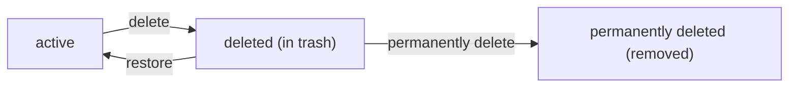
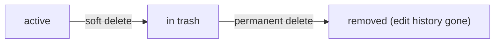
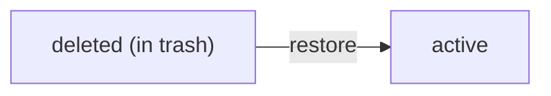
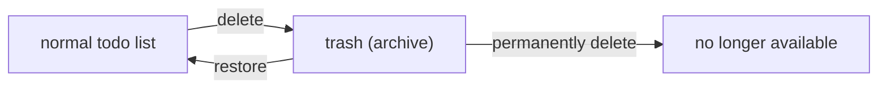
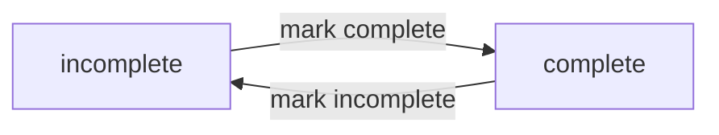
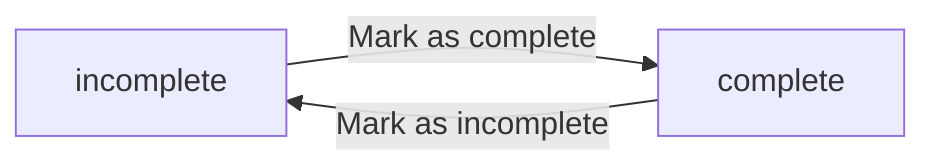

**multiUserTodo — Business concepts, relationships, and states from user perspective**

Business concepts, relationships, and states from user perspective

# Domain Concepts

Describe what each concept means in the business domain and its key attributes.

## User Concept

In this domain, a User represents an individual account holder who uses the multi-user todo application. The User is the owner of all todos that belong to that account, and those todos are private to the account holder. A User is characterized by an email identity used to distinguish one account from another. A User also has a password, which is used to protect access to the account. Additionally, each User has a display name that can be shown in the context of the user’s own account. The display name is part of the User’s public profile information within the app, while the profile itself must remain private from other users. A User’s data is treated as belonging exclusively to that account, so actions performed relate only to the user’s own todos and profile settings. Overall, the User concept defines the boundary for privacy and ownership across the rest of the domain model.

### User Account Identity

In the multi-user todo application, a user represents a single account holder who signs in to access that account’s private data.

A user is distinguished by an email identity, and that email is the basis for separating one account from another.

A user is protected from unauthorized access by requiring a password for sign-in.

A user can update their password to keep access control aligned with the account holder’s credentials.

A user’s account lifecycle includes an option for the account holder to delete their own account.

When a user deletes their account, all todos owned by that user are deleted as part of the account deletion outcome, including todos that are in the trash.

### Email-Based Account Distinction

Two different users must be treated as separate accounts when they use different email identities.

Within the application, a user’s email identity determines which account is being referenced for viewing and managing private todos and profile information.

The application must never allow a user to access another account’s todos or profile content by substituting or swapping email identities; access is always tied to the signed-in account.

### Password-Protected Access

A user’s account requires a password for login.

The system must authenticate a user using the provided email identity and password combination before allowing access to that user’s private data.

If the email identity or password does not match a valid account, the user must not gain access to any private todos or profile information for that account.

A user can change their password while keeping the same underlying account and email identity.

### Display Name as User Profile Attribute

A user has a profile attribute called a display name.

The display name is used for presenting the account holder within the user’s own context in the application.

A user can edit their display name so that it reflects how they want to be shown for their own account.

The display name is part of the user’s profile data within the app, and its privacy setting is governed by the private profile visibility rules defined in the next section.

### Multi-User Privacy Boundary and Private Profile Visibility

The application is a private todo app: each user’s todos are completely private.

A user can only view, manage, and access their own todos; there is no capability to view, access, or share another user’s todos.

User profile information, including the display name, must be treated as private to the account holder.

A user cannot view other users’ profiles, so any attempt to access other users’ profile data must not reveal the information.

As a result, the privacy boundary is enforced at the domain level: todos belong to a specific user account, and profile visibility is restricted to that same account holder.

### Ownership of Personal Todos

A user owns all todos that belong to that user’s account.

Owned todos are private to that user and are only visible within the context of the owning account.

Ownership defines the scope for viewing a list of todos, viewing a single todo’s details, updating a todo, and deleting a todo.

When a todo is deleted from the owning user’s perspective, it remains within the same user’s account domain until permanently removed through the trash’s permanent deletion action, consistent with the application’s deletion and trash lifecycle defined elsewhere.

## Todo Concept

A Todo represents a single task item that a User can own and track over time. Each Todo has a title, which is the primary label used to identify the task when viewing lists and details. A Todo can also include an optional description, allowing the User to add more context or notes for the task. To help with planning, a Todo may optionally have a start date, representing when the task is intended to begin. Likewise, a Todo may optionally have a due date, representing when the task is expected to be finished. A Todo also carries a completion status that indicates whether the task is complete or still incomplete. Newly created todos are considered incomplete by default, making completion a meaningful state of the Todo concept. A Todo further has a creation date, which helps the User understand when the task was first added. While a Todo is owned by exactly one User, it remains completely hidden from other users, reinforcing the private nature of the application.

### Todo Task Item (Overview)

A todo is a single task item that a user owns and can track over time.

Each todo is identified to the user primarily by its title, which is shown when viewing lists and used to label the todo when viewing details.

A todo also has additional descriptive and planning attributes that a user may optionally set, allowing the task to be documented and scheduled.

A todo maintains a completion status so the user can distinguish tasks that are still incomplete from tasks that are complete.

Every todo belongs to exactly one user, and it is completely private to that owning user; other users cannot view or access it.

### Required Todo Title

Each todo has a title that is required.

The title is the primary label used to identify the todo when displaying the user’s todo list and when viewing a specific todo’s details.

If a todo title is not provided, the todo cannot be created; the concept of a todo therefore includes the assumption that the title exists once the todo exists.

### Optional Todo Description

A todo may include a description.

The description is optional, and it can be left empty.

When present, the description is available to the user in the todo’s detail view as part of the complete information for that todo.

### Start Date Planning Attribute

A todo may include a start date planning attribute.

The start date is optional, and a todo can exist without a start date.

When a start date is set, it represents when the task is intended to begin and is visible to the user in the todo list and the todo detail view.

### Due Date Scheduling Attribute

A todo may include a due date scheduling attribute.

The due date is optional, and a todo can exist without a due date.

When a due date is set, it represents when the task is expected to be finished and is visible to the user in the todo list and the todo detail view.

### Completion Status of a Todo

A todo has a completion status that indicates whether the task is complete or still incomplete.

Completion status is a meaningful part of the todo concept: newly created todos are considered incomplete by default.

The completion status is represented as a simple toggle between two states (complete and incomplete), allowing the user to move the todo between those two states over time.

Completion status is visible to the user in the todo list and is included in the full details when viewing a single todo.

### Creation Date for Ordering

A todo has a creation date that represents when the todo was first added.

The creation date is used by the application to support ordering views (for example, sorting by creation date), and it is displayed to the user in the todo list.

The creation date is also part of the complete information shown when viewing a single todo’s details.

### Private Ownership to the Current User

A todo is owned by exactly one user.

Todo privacy is absolute within the application: users can only view their own todos.

There is no ability for a user to view, access, or share another user’s todos, so every viewing of a todo concept is scoped to the currently authenticated owning user.

### Todo State Presence in Normal List vs Trash (Conceptual Visibility)

A todo can be in either of two visibility contexts from the user’s perspective: normal todo list (active) or trash (deleted).

When a todo is in the normal todo list, it appears in the user’s paginated todo list.

When a todo is moved to trash, it no longer appears in the normal todo list, but it does appear in the user’s trash list.

A todo can return from trash back to the normal todo list, after which it appears again in the normal todo list.

Permanent deletion removes the todo entirely from the user’s perspective, including removing its associated edit history entries.

## TodoEditHistoryEntry Concept

A TodoEditHistoryEntry represents one recorded change event for a particular Todo. It captures the moment an edit was made, allowing the User to understand when updates occurred. Each history entry records what the title was changed from and what it was changed to, but only when the title was part of the edit. Similarly, it records description changes by storing the prior description and the updated description when the description was edited. It can also record start date changes, capturing the previous start date and the new start date when that attribute was modified. In the same way, it records due date changes by capturing the prior due date and the updated due date when the due date was edited. A history entry is therefore an audit-style representation of before-and-after values for the specific properties that were changed in that edit event. These entries are relevant to the specific Todo’s history and are only visible within the user’s own scope. The history entries are ordered so that the most recent changes appear first, making it easier for a User to review the latest updates.

### Todo Edit History Entry (audit record) definition

A TodoEditHistoryEntry represents one recorded edit event for a specific Todo (defined in [Todo Concept]). It exists to help the User understand what changed during each edit, acting as an audit-style record tied to that Todo.

Each TodoEditHistoryEntry captures the moment the edit was made by recording a single “when the edit was made” value.

Each TodoEditHistoryEntry records before-and-after values for the attributes that were changed as part of the edit. For attributes that were not part of the edit, the entry does not capture before-and-after changes for that attribute.

A TodoEditHistoryEntry is visible only within the user’s own scope for that Todo (it is tied to a specific Todo, and Users cannot access other Users’ private todos or histories).

### Title before/after values in a history entry

When a User edits the Todo’s title, the resulting TodoEditHistoryEntry records the title before the edit and the title after the edit.

The title before value is the title currently shown on the Todo immediately prior to that edit.

The title after value is the title resulting on the Todo immediately after that edit.

### Description before/after values in a history entry

When a User edits the Todo’s description, the resulting TodoEditHistoryEntry records the description before the edit and the description after the edit.

The description before value is the description currently shown on the Todo immediately prior to that edit.

The description after value is the description resulting on the Todo immediately after that edit.

### Start date before/after values in a history entry

When a User edits the Todo’s start date, the resulting TodoEditHistoryEntry records the start date before the edit and the start date after the edit.

The start date before value is the start date currently shown on the Todo immediately prior to that edit (if a start date was set at that time).

The start date after value is the start date resulting on the Todo immediately after that edit (if a start date is set after the edit).

### Due date before/after values in a history entry

When a User edits the Todo’s due date, the resulting TodoEditHistoryEntry records the due date before the edit and the due date after the edit.

The due date before value is the due date currently shown on the Todo immediately prior to that edit (if a due date was set at that time).

The due date after value is the due date resulting on the Todo immediately after that edit (if a due date is set after the edit).

### Edit history ordering and per-todo scope

For any given Todo, its edit history entries are ordered from most recent to oldest so that the latest edits appear first.

Every history entry belongs to a single specific Todo (defined in [Todo Concept]) and is therefore shown in the context of that Todo’s history, rather than as a standalone global log.

## UserProfile Concept

A UserProfile represents the profile information associated with a User in the application. The primary business attribute of a UserProfile is the display name, which is shown as the User’s chosen name within the app context. The display name belongs to the owning User and reflects the current profile identity for that account. UserProfile is private by design: other users cannot view another user’s profile information. In this domain, the UserProfile concept exists to express that a User has human-friendly identity details beyond email. While the app relies on the User for account ownership, the UserProfile provides the user-facing display identity associated with that account. As a result, UserProfile supports personal customization while maintaining strict privacy boundaries between different users’ accounts.

### User Profile Identity

A UserProfile represents the profile information associated with a User account in the application.

The UserProfile provides a user identity that is meaningful within the app context, separate from account email-based login identity.

A UserProfile belongs to exactly one User account, and it represents the current profile identity for that account.

The application must treat UserProfile as private information: other users cannot view the profile information of someone else.

When viewing or interacting within the app, the User should see their own profile identity as defined by their UserProfile.

### Display Name Attribute

Each UserProfile includes a display name attribute.

The display name is the user-facing name that represents the User within the application context.

The display name is associated with the owning UserProfile (defined in [User Profile Identity]) and reflects what the owning User has chosen for their profile.

The display name is used only within the context of the owning User’s experience, and it must not be shown to other users viewing the application.

### Human-Friendly User Labeling and Personal Customization

The UserProfile enables personal profile customization through the display name, allowing a User to choose how they want to be labeled in the app.

The User’s chosen display name functions as a human-friendly label for that User (defined in [Display Name Attribute]) whenever the app presents that identity in the owning user’s context.

The system must keep the profile customization strictly scoped to the owning User’s account, so that changes affect only that account’s own displayed identity.

### Profile Privacy Boundary and No Access to Other Profiles

The profile privacy boundary is that Users cannot access or view other users’ profiles.

The application must not present any other user’s profile information to a different user under any browsing context.

If a user attempts to view profile information that is not theirs, the system must prevent access and ensure that only the requesting User’s own profile is available in their app context.

This privacy boundary ensures that the app remains a private todo application: users can only see their own profile information and cannot retrieve other users’ identity details.

# Domain Relationships

Describe how concepts relate to each other from a business perspective.

## Conceptual Relationships

Describe how concepts relate to each other in business terms.

### Ownership boundaries and privacy across users

Each user owns their own todo list and no other user can view, access, or share another user’s todos.
The relationship between a user and a todo is an ownership relationship: a todo belongs to exactly one user.
Because users cannot view other users’ profiles, the association between a user and their profile is private to that user and is used only for display purposes within the user’s own context.
A user’s ownership boundary includes todos that are currently in the trash as well as todos that are not deleted.
When a user deletes their account, all todos they own are permanently deleted, including todos that would otherwise be in trash.
No operation on a todo (including viewing, editing, deleting, restoring, or permanently deleting) can be performed for a todo that is owned by a different user.
If a user attempts to interact with a todo outside their ownership boundary, the system rejects the request.

### User profile association with the owning user

A user profile is associated with exactly one user.
The user profile provides a display name that the owning user can edit.
Only the owning user can view the profile information; other users cannot view other users’ profiles.
The user profile association exists to support personalization of the owning user within their own account context.
If the owning user updates their display name, the updated display name is reflected wherever the owning user’s profile is shown within the application.

### Todo ownership and its associations to completion and scheduling

A todo belongs to exactly one user (defined in [Ownership boundaries and privacy across users]).
A user can view their own todos through a list relationship that includes both normal todos and deleted todos as appropriate for the current view (normal list versus trash).
A todo has an ownership association to its owning user that determines visibility, editing rights, and delete behavior.
A todo has scheduling attributes that affect sorting and filtering: start date (optional) and due date (optional).
A todo has a completion status that can be toggled between incomplete and complete.
A todo shows creation date information when presented in the user’s own todo list.
Todos are presented with conditional inclusion rules in list views: when a start date is not set, it is not shown; when a due date is not set, it is not shown.

### Todo has-many edit history entries

A todo has many edit history entries.
Each edit history entry belongs to exactly one todo.
Whenever a user edits a todo, the system creates a new history entry for that todo (see [Edit history] behavior in later functional and rules files).
The edit history entry records the time the edit was made and captures the before-and-after values for only the fields that changed.
Users can view the edit history entries for their own todos, and cannot view edit history entries for todos owned by other users.
When a todo is permanently deleted from the trash, its edit history entries are also permanently deleted as part of the same deletion event.

### Trash membership as an association state of a todo

A todo may be in normal state or in trash state.
A todo in trash remains owned by the same user (defined in [Ownership boundaries and privacy across users]).
Trash membership is an association between the todo and the user’s trash view: only the owning user’s deleted todos appear in that user’s trash list.
Restoring a deleted todo moves it out of the trash association and back into the normal todo list for the owning user.
When filtering the user’s todo list by completion status, the choice of whether the list shows normal todos or trash contents is governed by the current view (normal list versus trash list), not by completion status alone.
A permanently deleted todo is removed from both normal and trash associations for the owning user.

## Lifecycle and Retention

Describe concept lifecycle states and transitions only. Detailed retention/recovery policies belong in 05-non-functional. Operation details belong in 03-functional-requirements.

### Todo Lifecycle States

Todos move through business lifecycle states based on whether they are active in the normal todo list and whether they are in the user’s trash.

1. Active (not in trash)
- A todo that has not been deleted is considered active and appears in the user’s normal todo list.

2. Deleted (in trash)
- After a user deletes a todo, it becomes deleted and appears in the user’s trash list instead of the normal todo list.

3. Permanently deleted (removed)
- A todo that a user permanently deletes from the trash is removed from the application in a way that it no longer appears in either the normal todo list or the trash.

State relationship summary
- A todo starts as active.
- Deletion moves a todo from active to deleted.
- Permanent deletion moves a todo from deleted to permanently deleted.
- Restoration moves a todo from deleted back to active.

### Deletion Policy: Soft Delete vs Permanent Delete

The application distinguishes between deletion actions that are reversible and deletion actions that are final.

1. Soft delete (deletion to trash)
- When a user deletes one of their todos, the todo is not permanently removed.
- After soft deletion, the todo must no longer appear in the user’s normal todo list.
- The deleted todo must appear in the user’s trash list.

2. Permanent delete (final removal from trash)
- When a user permanently deletes a todo while it is in the trash, the todo is permanently removed.
- After permanent deletion, the todo must no longer appear in the user’s trash list or the normal todo list.

3. Edit history deletion behavior
- When a todo is permanently deleted from the trash, its edit history must also be permanently removed.

### Recovery: Restoring Deleted Todos

Recovery is available only for todos that are currently in the user’s trash.

1. Restore availability
- When a todo is in the deleted state (shown in the trash list), the user must be able to restore it.

2. Restore outcome
- Restoring a deleted todo returns it to the normal todo list.
- After restoration, the todo must no longer be listed in the trash.

### Retention and Archival Boundaries

This system uses trash as the archival boundary for deleted-but-recoverable todos.

1. Retention boundary for deleted items
- Todos that have been deleted (and are in the trash) are retained in the application so they can be restored.

2. Archival meaning of the trash
- The trash list acts as the user-visible archive of deleted todos.
- Todos in the trash are treated as deleted and are excluded from the normal todo list.

3. End of retention
- Permanently deleted todos are not retained for further user access.

# Business Categories and State Flows

Business category classifications and state flow definitions.

## Business Category Definitions

Define all business category classifications with their allowed values and descriptions.

### Business Categories: Todo Status Type

A todo has a status type with exactly two allowed values:
- "incomplete"
- "complete"

While a todo exists, its status type represents whether the todo is currently incomplete or complete.

A user can change a todo’s status type between the two allowed values.

The system should display the todo’s status type in todo views so users can understand whether the todo is complete or incomplete.

A todo’s status type is the basis for filtering the user’s todo list by completion status.

When a user requests filtering by completion status, only todos whose status type matches the selected category are shown (or all todos when the filter is set to include all todos).

If a todo is edited in other ways (title, description, start date, or due date), its status type does not change as part of those edits.

### Business Categories: Todo List Classification Options

The system supports a set of allowed classifications used to control what subset of a user’s todos is shown.

The allowed classification values are:
- "all"
- "only complete"
- "only incomplete"

While viewing the user’s todo list, the selected classification controls which todos are included.

When the classification is "all", todos with either status type ("incomplete" or "complete") are included.

When the classification is "only complete", only todos whose status type is "complete" are included.

When the classification is "only incomplete", only todos whose status type is "incomplete" are included.

The selected classification applies to the normal todo list (the list of todos that are not deleted), as distinct from the trash list.

The selected classification affects which todos appear in the paginated list; it does not change the underlying todos or their status type.

## State Transitions

Define valid state transition paths for stateful concepts.

### Todo Completion Status-Change Transitions

#### Completion status transitions
- A todo starts in the incomplete state when it is newly created.
- Users can change a todo from incomplete to complete.
- Users can change a todo from complete to incomplete.
- The completion change is represented as a simple toggle between two states: incomplete and complete.

#### Workflow and business intent
- While a todo is incomplete, it is treated as not yet finished for purposes of completion-based filtering.
- While a todo is complete, it is treated as finished for purposes of completion-based filtering.

#### Edit-history relationship
- When the user marks a todo complete or incomplete, the todo is still subject to edit history recording for that todo’s edits (defined in the edit-history concept), and the resulting status change is part of the user’s record of what happened to the todo over time.

### Trash Workflow: Soft Deletion, Restore, and Permanent Deletion

#### Lifecycle transitions between normal and trash
- Users can delete a todo they own, which moves the todo into a recoverable location.
- A deleted todo remains recoverable until it is removed from the system.
- Users can restore a todo from the recoverable location, returning it to the normal list.

#### Permanent deletion transitions
- Users can remove a todo from the recoverable location.
- Once removed, the todo is no longer available and cannot be restored.

#### Status-change visibility rules across lists
- A todo in the recoverable location does not appear in the normal todo list.
- A restored todo returns to the normal todo list and becomes visible there again.

#### Error handling boundary (conceptual)
- Only the owning user can perform actions on their own todos; other users cannot access these todos, consistent with the application’s privacy boundary.

### Combined State Flow: Completion Status within Each Lifecycle Location

#### Independent dimensions of state
- A todo’s lifecycle location (normal vs in a recoverable location) changes via delete/restore/removal actions.
- A todo’s completion status (incomplete vs complete) changes via completion toggling.

#### Workflow expectations when states combine
- Completion toggling applies to a todo regardless of whether it is currently in the normal list or in the recoverable location.
- Deleting a todo changes its lifecycle location to the recoverable location without removing it from the user’s ownership.
- Restoring a todo changes its lifecycle location back to normal, without changing the fact that it has a completion status.

#### Business rationale
- This separation ensures users can keep working with their tasks’ completion status even as they manage which tasks are active (normal list) versus recoverable (recoverable location).