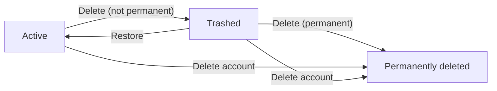
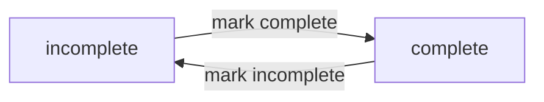
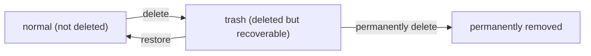

**multiUserTodo — Business concepts, relationships, and states from user perspective**

Business concepts, relationships, and states from user perspective

# Domain Concepts

Describe what each concept means in the business domain and its key attributes.

## User Concept

A User represents an individual who has an account in the multi-user todo application. The business meaning of a User is that personal todo data is owned by a specific account, so users can only manage and see their own information. In this domain, the User is identified by an email identity used for accessing the account. Access is protected by a password, which makes the account act as the secure boundary between different people using the app. A User can also change their password over time, reflecting an account-level attribute that stays under the user’s control. The User concept includes the account lifecycle, especially the ability to delete the account. When a user deletes their account, all of their todos are permanently removed, including any items currently in trash, making deletion an irreversible ownership end state. Because the app is private, a User’s identity ensures strong privacy: other users cannot view, access, or share that user’s todos.

### User Account as Business Identity

A User is a business identity representing a person who has an account in the multi-user todo application.

A User defines the ownership boundary for todo data: each todo belongs to exactly one specific User.

When a person uses the application, the system treats that person as acting on behalf of their own User account.

A User’s ability to access todo information is determined by which User account the person is using, not by any other person’s identity.

### Email Identity Used to Access the Account

A User has an email identity that is used to access the corresponding account.

The email identity is the link between a person and the account they intend to use.

The system must associate all account-specific actions and accessible todo data with the account corresponding to the email identity provided by the person.

Because the application is private, using one User’s email identity must never allow access to another User’s account data.

### Password-Protected Account Access and Password Change as User Attribute

A User’s account access requires a password.

To access the account, the person must provide the correct password for that User’s account.

A User can change their password.

After a password change, the account continues to be owned by the same User, and the updated password becomes the password required for future access.

Password changes affect access to the account but do not transfer ownership of any todos that belong to the User.

If the password provided for a User account is not correct, the system must not grant access to that account’s todo data or other account-specific information.

### Todo Ownership Tied to a Specific User

A Todo is owned by a specific User.

A User can only view and manage the todos that are owned by their own account.

A todo’s ownership is the basis for deciding which User it belongs to within the application.

Because ownership is exclusive, a todo cannot be jointly owned by multiple Users.

As a result, users must not be able to access a todo’s full details unless they are the owner of that todo.

### Private Todo Data Boundary Between Users

The todo data of each User is completely private.

No other User can view or access another User’s todos, including viewing full todo details.

The privacy boundary applies to both the user’s normal todo items and the user’s deleted todo items (trash).

A user’s available todo data set is determined solely by the todos owned by that user.

There is no way for one user to make another user’s todo data visible within the application.

### Account Deletion Permanently Removes User Todos Including Trash

A User can delete their account.

When a User deletes their account, all todos owned by that User are permanently removed from the system.

Permanent removal includes todos that are currently located in the user’s trash.

Permanently deleted todos are no longer available to that deleted account in any todo list.

Permanently deleting a User’s account also removes the edit history associated with those permanently removed todos.

After account deletion, the deleted User’s todo data is not accessible again through that account.

### User Identity Prevents Other Users from Viewing Todos

A User identity prevents other Users from viewing that User’s todos.

A User can view their own todos in the normal todo list.

A User can view their own deleted todos in the trash list.

When another person uses a different User identity, the system must not reveal any todo information that belongs to the first User.

A todo’s visibility depends on whether the viewing person’s User identity matches the todo owner, not on any other relationship.

## UserProfile Concept

A UserProfile represents the user-facing identity details associated with a User account. The core business meaning is personalization through a display name that the user can set for how they appear within the application. The UserProfile belongs to exactly one User, so the profile’s information is owned by the same account that owns the user’s todos. The key attribute captured by this concept is the display name, which is separate from the account’s access identity (email) and from the content of any specific todo. In a private todo app, the UserProfile is not something other users can view, reinforcing that the profile is restricted to the profile owner’s privacy boundary. This means the profile primarily serves as the owner’s presentation detail inside their own user experience. Overall, the UserProfile concept defines how a user’s identity is represented via display name while keeping the rest of the domain strictly personal and not shareable across users.

### Userprofile as Personalized Identity Details

A UserProfile represents the user-facing identity details associated with a single User account.

The primary business purpose of a UserProfile is personalization: it captures how the owning user wants to be represented within their own experience of the application.

A UserProfile belongs to exactly one User account, so the profile details are owned by that same account.

A UserProfile does not function as a shared directory or a social identity; it exists to support the owning user’s personalization needs inside their private todo space.

Within this private todo application, the UserProfile is treated as a personal-domain concept, meaning its details are restricted to the owning user’s visibility.

### Display Name as the Key Profile Attribute

The display name is the key attribute of a UserProfile.

The owning user can edit their display name to change how they are presented within their own experience.

The display name is intended for presentation and personalization rather than for account access.

The display name is not a mechanism for other users to identify, find, or access the owning user’s profile details.

### Userprofile Owned by a Single User

Each UserProfile is owned by exactly one User account.

Ownership ensures the profile’s details belong to one user only and cannot be reassigned to another account.

A user cannot claim another user’s profile details as their own.

The system maintains ownership consistency so that personalization remains associated with the correct owning user account.

### Privacy Boundary for Profile Visibility

A privacy boundary governs visibility of UserProfile details.

Only the owning user can view UserProfile details for their own profile.

No other user is allowed to view, access, or retrieve another user’s UserProfile details.

This boundary applies regardless of any other relationship between users; UserProfiles remain private by design.

### Private App Prevents Other Users From Viewing Profiles

Because this is a private todo app, other users must not have any way to view another user’s UserProfile details.

If a user attempts to access profile information that belongs to someone else, the application must treat it as unavailable due to the private nature of the app.

This rule prevents the UserProfile from being used to discover or identify other users within the system.

### Profile Presentation Identity Separate from Login Identity

A user has two different identities in the business domain: an access identity used to log into the account, and a presentation identity used for how the user is presented within the application.

The profile presentation identity is represented by the UserProfile’s display name.

Changing the display name changes how the owning user is presented in their experience, without changing the basis for account access.

The login identity (email-based access) and the profile presentation identity (display name) are therefore treated as separate business concepts.

### Keeping Todo Ownership and Profile Ownership Aligned

The application keeps UserProfile ownership aligned with todo ownership.

Because a UserProfile belongs to exactly one User account, profile personalization is associated with the same account that owns that user’s todos.

This alignment ensures that the personalized identity details are applied within the same private todo space as the owning user’s todo content.

### Profile as a User-Facing Personalization Element

The UserProfile acts as a user-facing personalization element.

The owning user uses the profile display name to shape their representation within their own experience.

The personalization intent is limited to presentation within the owning user’s private context.

By combining the private visibility rule with the display name attribute, the system supports personalization without enabling cross-user discovery or sharing of profile details.

## Todo Concept

A Todo represents an individual task item that a specific User creates and manages. The business meaning is the unit of work the user wants to remember, track, and update within their personal todo list. Each Todo is owned by exactly one User, which keeps the todo data completely private from other users. A Todo has a required title, which acts as the primary human-readable label shown in the user’s todo lists. A Todo can also include an optional description, allowing additional context to be stored when needed, while still permitting an empty description. Timing support is modeled with optional start date and optional due date, enabling the user to express when the task begins and when it is due. Every newly created todo starts in an incomplete state by default, and it can later exist in either incomplete or complete status. For visibility and understanding, the todo includes a creation date that appears in the todo list views. Finally, a Todo is associated with an edit history so changes to key details are explainable over time rather than silently overwritten.

### Todo as a User-Owned Task Item

A Todo is an individual task item that a specific User creates and manages.
Each Todo is owned by exactly one User.
A User can only view and manage their own Todos; Todos are private and not accessible to other Users.
A Todo represents the business item a User uses to remember and track tasks, regardless of whether the task is currently incomplete or complete.

### Required Todo Title as Main Label

Each Todo has a required title.
The title is the primary human-readable label for the Todo in the User’s Todo list views.
A Todo without a title is not considered a valid Todo.

### Optional Todo Description That Can Be Empty

Each Todo may include an optional description.
The description is allowed to be empty or not provided.
When the description is provided, it is available for the User to view in the single Todo details view.

### Optional Start Date for When a Task Begins

Each Todo may include an optional start date.
If a start date is not set for a Todo, the start date is not shown to the User.
If a start date is set, it is shown to the User in both Todo list views and the single Todo details view.

### Optional Due Date for Deadlines

Each Todo may include an optional due date.
If a due date is not set for a Todo, the due date is not shown to the User.
If a due date is set, it is shown to the User in both Todo list views and the single Todo details view.

### Completion Status Starts Incomplete by Default

Each Todo has a completion status.
When a Todo is first created, its completion status starts as incomplete.
A Todo’s completion status can be either incomplete or complete, enabling the User to distinguish the two states in Todo list views.

### Creation Date Shown in Todo Lists

Each Todo has a creation date.
The creation date is displayed in Todo list views.
The creation date supports the User in understanding when a Todo was added to their list.

### Todo Links to Edit History for Change Traceability

Each Todo has an associated edit history.
Every time the User edits the Todo, an edit history entry is created to record that edit.
The edit history for a Todo is available to the User for viewing.
Edit history entries are ordered from most recent to oldest so the User can trace how the Todo changed over time.

## TodoEditHistoryEntry Concept

A TodoEditHistoryEntry represents a single record capturing what changed for a particular Todo at a specific point in time. The business meaning of this concept is traceability: users can review how a todo’s information evolved rather than only seeing the latest version. Each history entry is tied to one Todo, linking it directly to the task it describes. The entry records when the edit was made so users can place the change in a timeline. It also records previous values for specific attributes that were changed during that edit, such as the prior title, the prior description, the prior start date, and the prior due date. If an attribute was not changed in a given edit, the history entry does not include a previous value for it, keeping the record focused on actual modifications. Users can view the edit history for any of their todos, with entries shown from most recent to oldest for quicker comprehension. The edit history is part of the todo’s lifecycle: when a todo is permanently deleted, its edit history is also permanently removed, so traceability no longer remains after final removal.

### Todo Edit History Entry Record Definition

A Todo edit history entry is a business record that captures a single recorded change event for one specific todo.
The entry exists to support traceability of changes, so users can understand how the todo’s information evolved rather than only seeing the latest version.
Each edit history entry is associated with exactly one todo, making it clear which todo the recorded change belongs to.
Each edit history entry records the time when the edit was made so the change can be placed on a timeline.
For each edit history entry, only the fields that were actually changed are recorded as “previous values”; unchanged fields are not recorded as having a previous value in that entry.
When the title was changed in an edit, the history entry records the previous title value.
When the description was changed in an edit, the history entry records the previous description value.
When the start date was changed in an edit, the history entry records the previous start date value.
When the due date was changed in an edit, the history entry records the previous due date value.

### Traceability of Todo Changes Over Time

Traceability means that the history associated with a todo lets users review what changed and when.
Users can use the edit history to follow how a todo’s details evolved across multiple edits, not just identify the final state.
The edit history is intended to preserve a faithful record of user-applied changes, by capturing what changed for each edit as previous values (when a field changed).
Traceability is limited to the todo’s own lifecycle; it reflects the todo’s change history while the todo is still available to the user.

### Edit Made Time Captured in History

Every edit history entry records when the corresponding edit was made.
This “edit made time” is the basis for determining the chronological presentation of history entries.
When multiple edits exist for the same todo, the edit made time allows users to understand the relative order of those edits over time.

### Previous Title Value When Title Changes

If a user edits a todo’s title and the title value actually changes, the resulting edit history entry records the previous title value.
If the title is edited but the title value does not change, the edit history entry does not record a previous title value for that edit.
The previous title value shown in the history reflects what the title was before that specific edit occurred.

### Previous Description Value When Description Changes

If a user edits a todo’s description and the description value actually changes, the resulting edit history entry records the previous description value.
If the description is edited but the description value does not change, the edit history entry does not record a previous description value for that edit.
The previous description value shown in the history reflects what the description was before that specific edit occurred.

### Previous Start Date Value When Start Date Changes

If a user edits a todo’s start date and the start date value actually changes, the resulting edit history entry records the previous start date value.
If the start date is edited but the start date value does not change, the edit history entry does not record a previous start date value for that edit.
The previous start date value shown in the history reflects what the start date was before that specific edit occurred.

### Previous Due Date Value When Due Date Changes

If a user edits a todo’s due date and the due date value actually changes, the resulting edit history entry records the previous due date value.
If the due date is edited but the due date value does not change, the edit history entry does not record a previous due date value for that edit.
The previous due date value shown in the history reflects what the due date was before that specific edit occurred.

### History Ordering From Most Recent to Oldest

When a user views a todo’s edit history, the history entries are presented from most recent to oldest.
The ordering is based on the edit made time captured in each history entry.
This ordering allows users to start with the latest change they made and then move backward through earlier changes.

### Edit History Deleted With Permanent Todo Removal

A todo’s edit history is part of the todo’s lifecycle.
When a user permanently deletes a todo from trash, the edit history for that todo is permanently removed as well.
After a todo is permanently removed, users can no longer view that todo’s edit history.
This ensures that traceability does not continue after final deletion of the todo itself.

# Domain Relationships

Describe how concepts relate to each other from a business perspective.

## Conceptual Relationships

Describe how concepts relate to each other in business terms.

### User Ownership Boundary (ownership)

A user owns only the todos they create in the system.
Each todo belongs-to exactly one user.
Because ownership ties each todo to a single owning user, the system must keep the owning user’s todos completely private from other users.
Users can only view and manage todos that are owned by their own account.
If a user attempts to access a todo that is owned by a different user, the system rejects the request and the todo remains unchanged for the owning user.

### Todo belongs-to User (belongs-to)

Each todo is associated with exactly one user via belongs-to ownership.
The belongs-to relationship determines which user's todo list the todo appears in.
A todo remains assigned to the same owning user throughout its lifecycle, including while it is in the normal todo list and while it is in the trash list.
Because of this belongs-to relationship, a user never sees another user’s todo even if the todo is deleted and later appears in trash for some other user.

### Todo has-many Edit History Entries (has-many)

Each todo has-many todo edit history entries.
Each edit history entry belongs-to exactly one todo.
Whenever a user edits a todo, the system creates a new edit history entry for that same todo.
An edit history entry records the time the edit was made.
An edit history entry stores the previous values only for the fields that were changed during that edit.
Users can view the full edit history for any todo they own, and the history shown must correspond to the selected todo.

### Lifecycle Collection Membership as an Ownership-Derived Association

A user’s normal todo list is a collection of that user’s owned todos that are not deleted.
A user’s trash list is a collection of that user’s owned todos that have been deleted but not permanently removed.
A deleted todo transitions from the normal todo list to the trash list for the same owning user.
A restored todo transitions from the trash list back to the normal todo list for the same owning user.
A permanently deleted todo is removed from both the normal todo list and the trash list for its owning user.
Because these collections are derived from ownership, other users can never observe the membership of a todo in any collection.

### Relationship Between Filtering/Sorting Context and Ownership Association

Filtering by completion status applies only to the set of todos owned by the current user.
Sorting options apply only within the selected list context that contains only the current user’s owned todos.
The system must not introduce todos from other users when applying filtering or sorting.
When sorting by start date or due date, todos that do not have a start date or due date are placed at the end within the current user’s selected list context.
The completion status shown in lists reflects each todo’s current state for the owning user within that user’s todo collection.

## Lifecycle and Retention

Describe concept lifecycle states and transitions only. Detailed retention/recovery policies belong in 05-non-functional. Operation details belong in 03-functional-requirements.

### Todo Lifecycle States and State Transitions

A todo has a single lifecycle state at any time.

WHEN a user creates a new todo, THE system SHALL place it in the Active state.

WHILE a todo is in the Active state, THE system SHALL treat it as part of the user’s normal todo list.

WHEN a user deletes one of their own Active todos using the non-permanent delete action, THE system SHALL move that todo to the Trashed state.

WHILE a todo is in the Trashed state, THE system SHALL treat it as part of the user’s trash list.

WHEN a user permanently deletes one of their own trashed todos, THE system SHALL move that todo to the Permanently deleted state.

WHILE a todo is in the Permanently deleted state, THE system SHALL treat it as no longer available in either the normal todo list or the trash list.

IF a user attempts to restore a todo that is not in the Trashed state, THEN THE system SHALL reject the restore action.

IF a user attempts to permanently delete a todo that is not in the Trashed state, THEN THE system SHALL reject the permanent deletion action.

IF a user attempts to change the state of a todo they do not own, THEN THE system SHALL reject the action.

State transition flow:

### Archival Visibility: Normal List, Trash List, and Permanently Deleted Handling

Archival refers to how the system surfaces todos based on lifecycle state.

WHILE a todo is Active, THE system SHALL show it in the user’s normal todo list.

WHILE a todo is Trashed, THE system SHALL show it only in the user’s trash list and not in the user’s normal todo list.

WHILE a todo is Permanently deleted, THE system SHALL not show it in either the user’s normal todo list or trash list.

IF a user attempts to view a todo that they do not own, THEN THE system SHALL not reveal whether that todo exists.

IF a user attempts to view a Permanently deleted todo that they own, THEN THE system SHALL reject the request because the todo is no longer available.

### Deletion Policy: What Gets Permanently Removed

Deletion-policy defines what the system permanently removes and what it preserves until permanent removal.

Deleting a todo using the non-permanent delete action SHALL move the todo out of the normal todo list and into the trash list.

Non-permanent delete SHALL not permanently remove the todo.

WHEN a user permanently deletes a todo while it is in the Trashed state, THE system SHALL permanently remove both the todo itself and its edit history.

WHEN a user permanently deletes a todo after it has been permanently deleted as part of account deletion, THE system SHALL ensure the permanently deleted status is not reversible.

WHEN a todo is moved from Active to Trashed through a non-permanent delete action, THE system SHALL preserve the todo’s edit history so it remains viewable while the todo is still available through the trash list.

Deletion policy coverage statement:

- Edit history is preserved through Active and Trashed states.
- Edit history is removed only when the todo is permanently deleted.

### Recovery Behavior: Restoring from Trash

Recovery refers to returning a trashed todo back into an active state.

WHEN a user restores one of their own trashed todos, THE system SHALL move that todo from the Trashed state to the Active state.

AFTER restoration, THE system SHALL make the restored todo appear in the user’s normal todo list.

AFTER restoration, THE system SHALL make the restored todo no longer appear in the user’s trash list.

WHEN a todo is restored, THE system SHALL keep the todo’s existing content and the existing edit history.

IF a user attempts to restore a todo that does not exist, THEN THE system SHALL reject the restore action.

IF a user attempts to restore a todo that is already in the Active state, THEN THE system SHALL reject the restore action.

### Account Deletion Retention Impact for Todos and Edit History

Retention-impact for account deletion defines how the system handles todos and edit history when a user deletes their account.

WHEN a user deletes their account, THE system SHALL permanently delete all todos owned by that user.

WHEN a user deletes their account, THE system SHALL permanently delete edit history associated with each of those owned todos.

Account deletion affects todos regardless of lifecycle state.

WHEN a user deletes their account, THE system SHALL ensure that none of the user’s permanently deleted todos (including those that were previously in the trash) remain available in either the user’s normal todo list or trash list.

IF a user attempts to restore a todo after it has been permanently deleted due to account deletion, THEN THE system SHALL reject the restore action.

# Business Categories and State Flows

Business category classifications and state flow definitions.

## Business Category Definitions

Define all business category classifications with their allowed values and descriptions.

### Business Category (Classification) Concept

The system shall support an item-level “business-category” classification for todos.

The system shall treat the “business-category” as the category label assigned to a specific todo.

The system shall allow a todo to be either categorized or uncategorized.

When a todo is categorized, the system shall assign exactly one business-category classification value to that todo.

When a todo is uncategorized, the system shall treat it as having no business-category classification value.

The system shall keep the todo’s business-category classification independent from the todo’s completion status, while still enabling completion-status-based filtering through the relationship defined in the next section.

The system shall display a categorized todo’s business-category classification to the user when the todo is shown.

### Allowed Values for Business Category

The system shall define the allowed-values set for business-category classification.

The allowed-values set shall contain exactly these values: “All”, “Only complete”, and “Only incomplete”.

The system shall use the business-category value “All” to represent a category that includes todos regardless of completion status.

The system shall use the business-category value “Only complete” to represent a category that includes only todos whose completion status indicates complete.

The system shall use the business-category value “Only incomplete” to represent a category that includes only todos whose completion status indicates incomplete.

If the system is asked to apply a business-category classification value that is not in the allowed-values set, the system shall not treat it as a valid allowed value and shall instead treat the todo as uncategorized.

The system shall not broaden or extend the allowed-values set beyond the values listed above.

### Status-Type (Completion State) Concept

The system shall represent each todo’s completion state using a “status-type” concept.

The status-type values shall be exactly: “complete” and “incomplete”.

The system shall default newly created todos to status-type “incomplete”.

The system shall allow the user to change a todo between the two status-type values.

The system shall display each todo’s current status-type to the user when the todo is shown in lists and in the todo detail view.

The system shall use a todo’s status-type as the basis for determining whether it belongs to the “Only complete” or “Only incomplete” business-category values when filtering is applied.

### Relationship Between Business-Category Classification and Status-Type

The system shall apply business-category filtering logic based on the todo’s status-type.

When the active business-category classification is “All”, the system shall include todos of any status-type.

When the active business-category classification is “Only complete”, the system shall include only todos whose status-type is “complete”.

When the active business-category classification is “Only incomplete”, the system shall include only todos whose status-type is “incomplete”.

When a todo is uncategorized (no business-category classification assigned to the todo), the system shall still allow the todo to appear in the user’s normal viewing experience without requiring it to match one of the allowed business-category values.

When filtering is applied using one of the allowed-values business-category options, the system shall determine inclusion based on the status-type mapping above, rather than on any missing per-todo classification value.

## State Transitions

Define valid state transition paths for stateful concepts.

### Completion status change workflow: incomplete ⇄ complete

### THE multiUserTodo SHALL represent completion status as exactly one of two values: incomplete or complete

### WHEN the owner marks a todo as complete, THE todo SHALL transition from incomplete to complete

### WHEN the owner marks a todo as incomplete, THE todo SHALL transition from complete to incomplete

### THE multiUserTodo SHALL treat completion status changes as a toggle between the two states
WHEN a user triggers a completion status change, THEN the system SHALL switch the todo to the opposite completion state (incomplete ↔ complete)

### THE multiUserTodo SHALL restrict completion status transitions to the todo’s owner
IF a user who is not the owner attempts a completion status transition, THEN the transition SHALL be rejected

### THE multiUserTodo SHALL apply a completion status transition without changing other todo details
WHEN a user changes only completion status, THEN the system SHALL not change the todo’s title, description, start date, due date, or creation date

### Deletion lifecycle workflow: normal → trash → permanently removed

### THE multiUserTodo SHALL represent deletion as part of a todo lifecycle visible to the owner
A todo exists in one of these lifecycle states from the owner’s perspective: normal (not deleted), trash (deleted but recoverable), or permanently removed (deleted forever)

### WHEN the owner deletes a todo from the normal todo list, THE todo SHALL transition from normal to trash

### WHEN the owner restores a todo from the trash, THE todo SHALL transition from trash to normal

### WHEN the owner permanently deletes a todo from the trash, THE todo SHALL transition from trash to permanently removed

### THE multiUserTodo SHALL ensure normal list visibility excludes deleted todos
WHEN a todo is in the trash or permanently removed lifecycle state, THEN it SHALL not appear in the owner’s normal todo list

### THE multiUserTodo SHALL ensure trash list visibility includes recoverable deletions
WHEN a todo is in the trash lifecycle state, THEN it SHALL appear in the owner’s trash list

### THE multiUserTodo SHALL ensure permanently removed todos are no longer visible in either list
WHEN a todo is permanently removed, THEN it SHALL not appear in the owner’s normal todo list and it SHALL not appear in the owner’s trash list

### THE multiUserTodo SHALL restrict deletion, restore, and permanent-delete actions to the todo’s owner
IF a user who is not the owner attempts to delete, restore, or permanently delete a todo, THEN the transition SHALL be rejected

### State transition effects on edit history visibility

### THE multiUserTodo SHALL preserve a todo’s edit history across completion status transitions
WHEN a todo transitions between incomplete and complete, THEN its edit history SHALL remain available to the owner when viewing that todo

### THE multiUserTodo SHALL preserve edit history while a todo is in trash
WHEN a todo is in the trash lifecycle state, THEN the owner SHALL still be able to view the todo’s full edit history

### THE multiUserTodo SHALL remove edit history when a todo is permanently removed
WHEN a todo transitions to permanently removed, THEN all edit history entries for that todo SHALL be permanently deleted

### THE multiUserTodo SHALL scope edit history viewing to the todo’s owner
IF a user who is not the owner attempts to view a todo’s edit history, THEN the request SHALL be rejected

### THE multiUserTodo SHALL display edit history entries from most recent to oldest
WHEN the owner views a todo’s edit history, THEN history entries SHALL be ordered from most recent to oldest