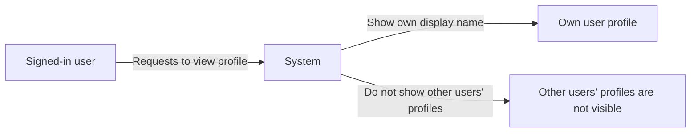
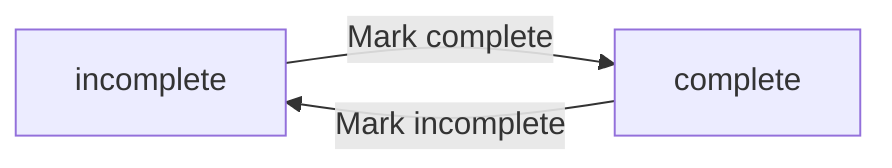
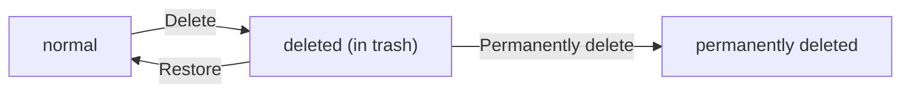
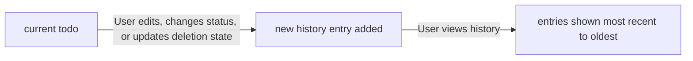

**todoApp — Business concepts, relationships, and states from user perspective**

Business concepts, relationships, and states from user perspective

# Domain Concepts

Describe what each concept means in the business domain and its key attributes.

## User Concept

A user represents a person who uses the todo application for managing their own tasks. In the business domain, a user is defined by an email address and a password used to establish their account identity. The user account also has an account status that determines whether the account is considered active for using the application. Once a user exists, their account is the starting point for everything else they do in the app. A key business meaning of the user concept is ownership: todos and related activity belong to a specific user, and that ownership drives privacy. The email is how the business uniquely identifies the user’s account in a way that other users cannot impersonate. The password is part of the user’s account data that supports secure access to their private space. When a user deletes their account, all of their associated todos and their associated activity are treated as permanently removed from the system, including items that were previously soft-deleted.

### User Account Identity

A user represents a person who uses the todo application for managing their own todos.

A user is identified in the business domain by their email address.

A user’s password is used to establish access to the user’s account; the password is treated as secure account credentials tied to that user’s identity.

Account ownership is a first-class business concept: the user owns their todos and the associated todo edit history.

A user’s identity defines the belonging boundary for all data the user can view and manage: when the system shows todos or edit history, it is always within the scope of the currently identified user.

If a user’s account is deleted, the permanent removal applies to the user’s associated todos and associated activity, including items that were previously in the trash.

### Email and Password Based Access

Access to the application is based on an email and password.

When a person attempts to access using their email and password, the application treats the account as belonging to that identified user.

The email and password combination serves as the business-facing mechanism for logging in.

The password is a secure credential used for authentication to the user’s account and is not a shared or transferable credential between users.

A user can change their password to update their secure account credentials while keeping the same user identity.

### Account Status Meaning

Each user has an account status.

The account status determines whether the account is considered active for using the application.

While an account is not considered active, the application does not treat the account as valid for normal use of the user’s private todo space.

The business meaning of account status is limited to deciding whether the user’s account is active for using the application.

### Private App User Boundary

This is a private todo app.

Users can only see their own profiles and their own todos.

There is no way for a user to view, access, or share another user’s todos.

A user’s profile (defined elsewhere) is private to that user, and the user boundary also applies to any related data such as edit history.

All todo-related viewing and management must be constrained to the scope of the currently identified user, so that other users’ data remains inaccessible.

## UserProfile Concept

A user profile represents the public-facing personal details a user maintains within the application. The profile’s primary attribute is a display name, which other parts of the business domain can associate with the user. In terms of business meaning, the profile helps express the user’s chosen identity without exposing the underlying login credentials. The user profile is tied to exactly one user, reinforcing that the profile belongs to a specific account. Importantly for the domain, user profiles are private: users cannot view other users’ profiles at all. This means the user profile concept exists for internal consistency and personalization within the user’s own experience, rather than for sharing. The display name is therefore an attribute that can be changed by the account owner, but it does not change what the user “is” as a business entity. From an attribution perspective, edits to the display name affect only what the owning user sees as their profile information.

### User Profile Display Name

A user profile includes a display name that represents how the owning user wants to be identified within their own experience.

The display name is an attribute of the user profile (defined as part of the user profile concept) and is the only profile-facing identity detail explicitly associated with the profile.

The display name can be customized by the profile owner, and changes to the display name affect the profile information shown within the owner’s own app experience.

If the display name is changed, the updated value becomes the current display name for the user profile (rather than creating a separate profile for each historical name).

The system must ensure that the user profile shown to the user reflects the most recently saved display name for that user account.

### Profile Tied to One User Account

Each user profile is tied to exactly one user account (one-to-one).

A user account has at most one associated user profile within the application.

The profile belongs to the user account, meaning profile details are retrieved and shown based on the currently signed-in user.

Because the profile is tied to one user account, operations that affect the profile’s personalization apply to that single owning account only.

### Private Profile Rule and Non-Shareable Identity Boundaries

User profiles are private.

Users cannot view other users’ profiles under any circumstance.

Because user profiles are private, there is no capability in the application to browse, access, or share another user’s profile information.

The user’s profile identity is non-shareable: the display name is used to personalize the owning user’s experience and is not intended to be used as a discoverable identifier by other users.

The system must treat profile visibility as bounded to the owning user only, ensuring that profile details from one user are never shown to any other user.

### User Profile Personalization and Profile Attribute for Experience

The user profile exists to support user experience personalization.

The display name serves as the profile attribute for personalization, allowing the user’s own application experience to reflect the identity they choose for themselves.

Changes to the display name are intended to update what the owning user sees for their own profile information, reinforcing that the profile is a personalization layer rather than a shared community identity.

The system must ensure that the personalized profile information is consistent with the owning user account context throughout the user’s interactions with their own todos.

### Conceptual Visibility Boundary (Business Flow)

## Todo Concept

A todo represents a single task item that a user can create, maintain, and track over time. In the business domain, every todo is owned by one user and is completely private to that owner, with no ability for other users to access it. The todo’s core attributes include a required title and an optional description that can be left empty. A todo can also have optional start date and due date values to support planning, with the understanding that dates may be unset. The completion status is a key attribute of a todo and indicates whether the task is currently complete or incomplete. Additionally, a todo has a creation date that reflects when it was first made by the user. The todo also includes full detail access for the owning user, meaning all its attributes—title, description, completion status, start date, due date, and creation date—are part of its domain meaning. A deleted todo is still a todo in the domain but is treated as removed from the normal browsing list and later may be restored or permanently deleted, depending on how it is handled.

### Todo Task Item Definition

A todo represents a single task item that a user can create, maintain, and track over time.

A todo is privately owned by exactly one user, and it is completely private to that user. No other user can view, access, or browse that todo.

A todo has an ownership boundary: it belongs to the creating user and remains within that user’s private set for its entire life, including when it is deleted (defined elsewhere as deleted versus active behavior).

A todo is treated as a distinct business concept regardless of whether it is currently appearing in the normal browsing list or in the trash list.

### Title and Optional Description

A todo has a title.

The title is required, meaning a todo cannot exist without a title value.

A todo may also have a description.

The description is optional, meaning it may be left empty for a todo while the todo still exists as a valid task item.

When present, the description belongs to the todo and is part of the complete details the owning user can view.

### Start Date Planning Attribute

A todo may have a start date as a planning attribute.

The start date is optional, meaning it may be unset for a todo.

When the start date is set, it represents the time the owning user indicates the task should start.

When the start date is unset, the absence of a start date is still meaningful and is treated as “no start date provided” for that todo.

### Due Date Tracking Attribute

A todo may have a due date as a tracking attribute.

The due date is optional, meaning it may be unset for a todo.

When the due date is set, it represents the time the owning user indicates the task is due.

When the due date is unset, the absence of a due date is still meaningful and is treated as “no due date provided” for that todo.

### Completion Status State Meaning

A todo has a completion status that indicates whether the task item is currently complete or incomplete.

Completion status is a business state of the todo and is visible to the owning user as part of the todo’s core attributes.

A todo’s completion status starts as incomplete when newly created, meaning it is not considered complete by default.

The completion status is binary in meaning for the domain: a todo is either complete or incomplete at any point in time.

### Creation Date for Ordering

A todo has a creation date that reflects when the owning user first created the todo.

The creation date is a core attribute used for ordering the user’s list of todos.

The creation date remains the original creation time for the todo for the duration of its life, including if the todo is later deleted and potentially restored or permanently deleted.

### Deleted Todo Versus Active Todo

The domain distinguishes between active todos and deleted todos.

An active todo is a todo that is currently part of the owning user’s normal todo browsing list.

A deleted todo is a todo that the owning user has removed from the normal browsing list. A deleted todo is not permanently removed at the time of deletion.

Deleted versus active is a business distinction that affects where the owning user can find the todo (normal list versus trash list) while the todo still exists within the user’s private domain.

Once a todo is permanently deleted, the todo no longer exists for the owning user, and its associated edit history is also removed from the domain (defined in the todo edit history concept unit).

## TodoHistoryEntry Concept

A todo history entry represents a single recorded change made to a todo over time. It is part of a todo’s edit history and exists to preserve what changed during each edit. The business meaning of a history entry is that it captures the time of the edit, making the history traceable from most recent back to older changes. Each history entry also records which values were changed, focusing specifically on the title, description, start date, and due date. For each of those attributes, the entry stores what the value changed to when a change occurred; if a particular attribute was not changed during that edit, there is no “changed to” value recorded for it. This makes history entries selective and directly relevant to the user’s actions on the todo. In the domain, the history entries are always associated with a specific todo, reinforcing that the audit trail belongs to the item the user is working on. When a todo is permanently deleted, its edit history is also permanently removed, indicating that history entries do not outlive the todo they describe.

### Todo Edit History Entry Definition

A todo edit history entry represents a single recorded change made to a specific todo over time.

The business meaning of a todo edit history entry is to preserve what changed during each edit so that the user can trace edits from the most recent change back to older changes.

A todo edit history entry is always part of a particular todo’s edit history and belongs to that todo, ensuring the audit trail is tied to the item it describes.

A todo edit history entry stores the time the edit was made as the change timestamp, representing when the user’s edit action occurred.

When a todo is permanently deleted, its edit history is also permanently removed, meaning history entries do not outlive the todo they record.

### Change Timestamp Meaning

The change timestamp in a todo edit history entry indicates when the edit was made.

For the user’s understanding of edit history, the change timestamp provides the chronological ordering basis for the sequence of history entries.

The history entry uses its change timestamp to support presenting the history from newest edits to older edits.

### Selective Recording of Changed Fields

A todo edit history entry records what the edit changed, focusing on only the values for title, description, start date, and due date.

If a particular attribute was not changed during an edit, the history entry does not record a “changed to” value for that attribute.

This selectivity ensures the history entry reflects the user’s actual edit action rather than repeating unchanged values.

The selectivity applies independently for each of the tracked attributes: title, description, start date, and due date.

### Records What Title Changed To

A todo edit history entry records what the title was changed to when the title was changed during that edit.

If the title was not changed during the edit, the history entry does not record a “title changed to” value.

This allows the user to see how the title evolved across multiple edits.

### Records What Description Changed To

A todo edit history entry records what the description was changed to when the description was changed during that edit.

If the description was not changed during the edit, the history entry does not record a “description changed to” value.

This allows the user to see how the description evolved across multiple edits.

### Records What Start Date Changed To

A todo edit history entry records what the start date was changed to when the start date was changed during that edit.

If the start date was not changed during the edit, the history entry does not record a “start date changed to” value.

This allows the user to see how the start date evolved across multiple edits.

### Records What Due Date Changed To

A todo edit history entry records what the due date was changed to when the due date was changed during that edit.

If the due date was not changed during the edit, the history entry does not record a “due date changed to” value.

This allows the user to see how the due date evolved across multiple edits.

### History Sorted From Newest to Oldest

The edit history for a todo is ordered by the change timestamp.

When a user views the edit history, it is presented from the most recent history entry to the oldest history entry.

This ordering ensures the user’s first view is the latest changes, while older changes appear later.

### History Removal When Todo Is Permanently Deleted

When a user permanently deletes a todo, the system permanently removes that todo’s edit history.

After permanent deletion, history entries associated with the deleted todo are no longer available to the user.

This means history entries do not persist independently of the todo they record.

# Domain Relationships

Describe how concepts relate to each other from a business perspective.

## Conceptual Relationships

Describe how concepts relate to each other in business terms.

### User Ownership Boundary for Private Todos

Each user owns their own todos and no other user can view or access them.

A todo belongs to exactly one user.

When a user views their todo list or an individual todo, the system only shows items that belong to that user.

When a user attempts to delete, restore, edit, or view the edit history of a todo, the system treats the todo as available only if it belongs to that same user.

User privacy is enforced at the boundary of access: other users’ todos are not visible in normal todo lists, in trash, or in edit history views.

A user’s ownership includes todos that are in trash, meaning the same private-owner boundary applies to deleted-but-restorable todos.

The application is explicitly a private todo app: there is no way to view, access, or share another user’s todos.

Ownership ensures consistent behavior across the todo lifecycle: create, update, complete/incomplete toggling, soft deletion, restoration, and permanent deletion all apply to todos owned by the acting user.

### User Profile Belongs to One User (Non-Shareable Personalization)

Each user has a user profile.

A user profile belongs to exactly one user.

A user’s profile display name is personal to that user and can be edited by that user.

Users cannot view other users’ profiles, meaning profile information is not available across users.

Because the profile belongs to a single user, profile display name changes apply only to the owning user’s experience.

Any association between a todo and a user is based on todo ownership (the todo belongs to the user), while the user profile remains non-shareable and private to the owning user.

The relationship between user and user profile is one-to-one from a business perspective: one user profile per user, and one owning user for each profile.

### Todo Ownership Association and Has-Many Edit History Entries

A todo is owned by a single user (the todo belongs to that user).

A user has many todos; the user can have zero or more todos.

Each todo has many edit history entries.

Each edit history entry belongs to exactly one todo.

When a user edits a todo, the system records the change by creating a new edit history entry associated with that todo.

Edit history availability follows the same privacy and ownership boundary as the todo: a user can view the edit history only for todos that belong to them.

When a todo is permanently deleted from trash, all edit history entries that belong to that todo are also permanently removed.

Edit history entries are ordered by recency (most recent to oldest) when displayed to the owning user.

The ownership association is therefore also a linkage rule for browsing: edit history is navigable from the todo, and the todo’s belonging to the user determines whether its history is visible.

## Lifecycle and Retention

Describe concept lifecycle states and transitions only. Detailed retention/recovery policies belong in 05-non-functional. Operation details belong in 03-functional-requirements.

### Todo Lifecycle States and Transitions

Todos move through lifecycle states that determine whether they appear in the normal todo list, and whether their edit history remains accessible.

A todo has the following business states:
- Active: the todo is included in the normal todo list.
- Deleted (in trash): the todo is removed from the normal todo list but is available to view in the trash.

State transitions:
- When a user deletes one of their todos, that todo transitions from Active to Deleted (in trash).
- When a user restores a deleted todo from the trash, that todo transitions from Deleted (in trash) back to Active.
- When a user permanently deletes a todo from the trash, that todo is permanently removed from the application’s accessible set.

Archival (as lifecycle behavior):
- A todo is not described as having an independent “archived” lifecycle state separate from Deleted (in trash) and Active. If a todo is no longer in the normal list, it is because it has been moved to Deleted (in trash), and it can be restored from there.

Edit history availability across lifecycle states:
- While a todo is Active or Deleted (in trash), its edit history remains associated with the todo and is accessible to the owning user.
- When a todo is permanently deleted from the trash, its edit history is also permanently removed and no longer accessible.

### User Account Data Retention Scope for Todos

Retention scope defines what business data remains available after lifecycle changes.

The system retains:
- Edit history entries for a todo while the todo is either Active or Deleted (in trash).
- Deleted todos (and their associated edit history) while they remain in the trash.

The system does not retain:
- Deleted history entries after permanent deletion of the owning todo from the trash.

Account-level deletion retention scope:
- When a user deletes their account, all todos belonging to that user—including todos currently in the trash—are permanently deleted.

Recovery implications:
- A restored todo returns to the normal todo list and continues to retain its previously recorded edit history (defined under “Todo Lifecycle States and Transitions”).
- After a permanent deletion (including permanent deletion triggered by account deletion), recovery is not available because the todo and its edit history are no longer accessible.

### Archival vs Deletion Policy (Business Meaning)

This section clarifies the lifecycle vocabulary used by the application.

Archival meaning:
- The application treats “archival” as the behavior of moving a todo out of the normal todo list.
- The business mechanism that removes a todo from the normal list is moving it to Deleted (in trash). There is no separate archival-only lifecycle state distinct from trash.

Deletion policy meaning:
- Deletion from the normal todo list is non-permanent: the todo is moved to Deleted (in trash).
- Permanent deletion is only performed from the trash.

Recovery meaning:
- Recovery is supported only for todos that are in Deleted (in trash). Restoring moves the todo back to Active.
- Recovery is not supported after permanent deletion from the trash.

Edge expectations:
- Since deleted todos remain private to their owner, all lifecycle transitions (delete, restore, permanent delete) apply only to the owning user’s todos and affect visibility for that owner.

### Recovery Boundaries and Resulting Visibility

Recovery boundaries define when a user can undo prior lifecycle actions and what that undo changes.

Recovery is allowed for:
- Todos currently in Deleted (in trash) that belong to the user.

When recovery occurs:
- Restoring a deleted todo makes it visible again in the normal todo list (Active).
- The todo’s details and edit history remain the same as they were prior to deletion, and the edit history order remains most-recent to oldest (defined for history entries as a business concept in the overall domain model).

Recovery is not allowed for:
- Todos that have been permanently deleted from the trash.
- Todos that were permanently deleted as part of a user account deletion.

Visibility after recovery boundary events:
- If a user attempts to restore something that is not in Deleted (in trash) (because it is already Active or has been permanently deleted), the system does not provide recovery and the todo’s visibility remains consistent with its current state (Active stays in normal list; permanently deleted items are not accessible).

# Business Categories and State Flows

Business category classifications and state flow definitions.

## Business Category Definitions

Define all business category classifications with their allowed values and descriptions.

### Business Categories for Todo Status Type

A Todo has a status type that can take exactly one of the following allowed values: "incomplete" or "complete".

The status type represents the current completion state of the todo.

While a todo is "incomplete", the user can mark it as "complete".

While a todo is "complete", the user can mark it as "incomplete".

The system must treat the status type as a simple toggle between exactly the two allowed values.

The system must ensure that when a user views their todo list or views an individual todo, the displayed completion status corresponds to the todo’s current status type.

flowchart LR
    A["incomplete"]-->|"mark complete"|B["complete"]
    B-->|"mark incomplete"|A

### Business Categories for Todo Date Scheduling Classification

A Todo may have an optional start date and an optional due date.

For sorting by start date, todos are classified into two groups based on whether a start date is set: "has start date" and "no start date".

For sorting by due date, todos are classified into two groups based on whether a due date is set: "has due date" and "no due date".

When sorting by start date, todos in the "no start date" group must appear after todos in the "has start date" group.

When sorting by due date, todos in the "no due date" group must appear after todos in the "has due date" group.

When filtering and listing, this scheduling classification affects only the ordering behavior for the selected sort, and does not change the underlying presence or absence of a start date or due date.

### Business Categories for Todo Completion Filter Classification

The system supports filtering the user’s todo list by completion status using a single classification selector with the following allowed values: "all", "only complete", "only incomplete".

"all" means the list includes todos regardless of their status type.

"only complete" means the list includes only todos whose status type is "complete".

"only incomplete" means the list includes only todos whose status type is "incomplete".

The system must apply the selected completion-status classification whenever a user requests their paginated todo list, so that the returned list matches the selected allowed value.

### Business Categories for Sorting Selection Classification

The system supports sorting the user’s todo list using a sorting selection classification with the following allowed values: "creation date newest first", "creation date oldest first", "start date earliest first", "start date latest first", "due date earliest first", "due date latest first".

When the sorting selection classification is "creation date newest first", the todo list is ordered so that newer creation dates appear before older creation dates.

When the sorting selection classification is "creation date oldest first", the todo list is ordered so that older creation dates appear before newer creation dates.

When the sorting selection classification is "start date earliest first", the list is ordered by start date from earliest to latest.

When the sorting selection classification is "start date latest first", the list is ordered by start date from latest to earliest.

When the sorting selection classification is "due date earliest first", the list is ordered by due date from earliest to latest.

When the sorting selection classification is "due date latest first", the list is ordered by due date from latest to earliest.

Todos without a start date must appear at the end when sorting by start date (regardless of whether the selection is earliest-first or latest-first).

Todos without a due date must appear at the end when sorting by due date (regardless of whether the selection is earliest-first or latest-first).

## State Transitions

Define valid state transition paths for stateful concepts.

### Todo Completion Status Transitions

A todo has a completion status that can be either "incomplete" or "complete".

When a user marks their todo as complete, the completion status of that todo transitions from "incomplete" to "complete".

When a user marks their todo as incomplete, the completion status of that todo transitions from "complete" to "incomplete".

Each status change is recorded in the todo’s edit history as an entry describing what changed, so the user can later view the sequence of changes from most recent to oldest.

A user can only change completion status for their own todo.

The completion status of a newly created todo starts as "incomplete" by default.

A todo in the trash still has a completion status; viewing or updating that status follows the same two-state model ("incomplete" and "complete").

Flow of completion status (status-change):

### Todo Deletion Workflow (Normal List to Trash)

A todo lifecycle includes a normal (active) state and a deleted (in trash) state.

When a user deletes one of their todos from the normal todo list, that todo transitions to the deleted state and is no longer shown in the normal todo list. The deleted todo remains available in the user’s trash list.

When a user restores a deleted todo from the trash, that todo transitions back to the normal state and becomes visible again in the normal todo list.

A user can delete and restore only their own todos.

If a todo is permanently deleted from the trash, it transitions to a non-recoverable state and can no longer be restored or viewed in either the normal list or the trash. In that case, the permanently deleted todo’s edit history is no longer available to view.

Flow of deletion and recovery (workflow):

### Edit History as a State-Change Audit Trail

A todo has an edit history that records history entries over time.

Every time a user edits a todo’s content (including title, description, start date, or due date), the todo records a new history entry describing what changed.

Every time a user changes completion status ("incomplete" ↔ "complete"), the change results in a new history entry being created.

Every time a user performs a deletion, restoration, or permanent deletion action that changes whether the todo is in the normal list, the trash, or becomes non-recoverable, the change results in a new history entry being created as part of the todo’s history trail.

The edit history entries are sorted from most recent to oldest when the user views them.

If a user permanently deletes a todo from the trash, the permanently deleted todo’s edit history is no longer available to view.

History sequencing workflow:
