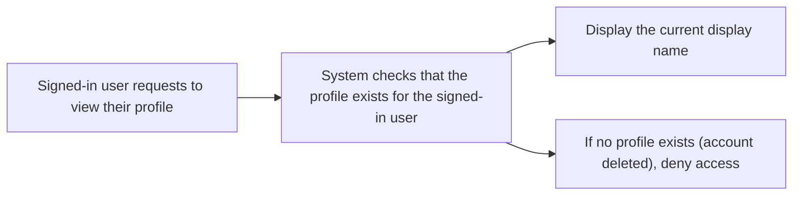
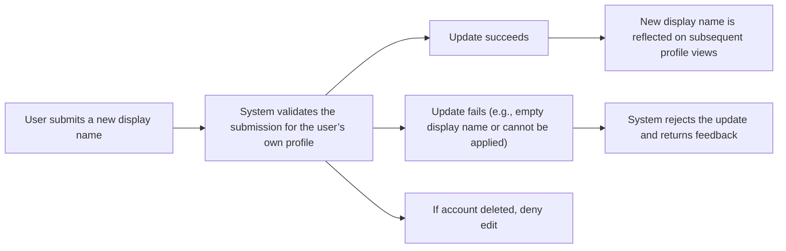
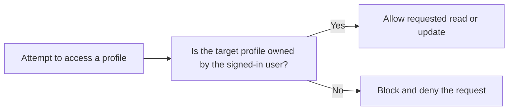
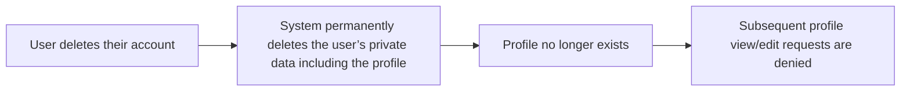

**todoApp — What operations users can perform, use cases, business workflows**

What operations users can perform, use cases, business workflows

# Core Business Operations

What the system must do for each business concept.

## User Operations

Users can create an account by signing up with an email address and password. After signup, users can log in using the same email and password to access their private to-do app. Users can change their password to regain access if they need to update credentials. Users can delete their account when they no longer want to use the service, and this permanently removes their account data along with all of their todos, including those that would otherwise be in trash. Listing and reading user data is limited to what the signed-in user is allowed to see; other users cannot be viewed or accessed. If a user attempts to sign up with an email that cannot be accepted, the system should reject the operation and explain that the account could not be created. If login fails due to incorrect credentials, the user should be informed that they could not be authenticated. Password changes should be rejected when the user cannot provide the required current credentials, or when the change cannot be applied. When a user deletes their account, the system should ensure the user is fully removed and that their todos are not left accessible for any later browsing. Any attempt to perform account or login-related actions after deletion should fail and prompt the user to create a new account instead.

### Account Signup and Creation Flow

Users can create an account by signing up with an email address and a password.

When a user submits a signup request, the system determines whether the provided email address is available for account creation.

If the email address cannot be accepted because it is invalid or unavailable, the system rejects the signup request and informs the user that the account could not be created.

A successful signup results in a usable account for the person who signed up.

After a successful signup, the user can proceed to log in using the same email address and password.

If a user attempts to sign up again using an email address that cannot be accepted, the signup request is rejected (per the rejection conditions for invalid or unavailable email).

### Login with Email and Password

Users can log in using their email address and password.

When a user submits a login request, the system attempts to authenticate the user based on the provided email address and password.

If login fails due to incorrect credentials, the system rejects the login attempt and informs the user that they could not be authenticated.

A successful login provides authenticated session access so the user can use the personal todo app.

If the user is not authenticated, the user does not receive access to personal todo functionality covered by this application’s user operations.

### Password Change Operation

Users can change their password.

A password change requires the user to provide the required current credentials to verify that the requester is the account owner.

If the user cannot provide the required current credentials, the system rejects the password change request.

If the password change cannot be applied for any reason that prevents updating the password, the system rejects the request.

When a password change is successful, the user can continue using the account and later log in using the updated credentials.

After a password change, the system does not allow the previous password to be used for future authentication attempts for that account.

### Account Deletion Permanently Removes Todos

Users can delete their account.

When a user deletes their account, all todos owned by that user are permanently deleted, including todos that would otherwise be in trash.

After account deletion completes, the user’s account data is fully removed and is not left accessible.

After account deletion, any previously existing todos owned by that user are permanently removed and cannot be accessed through normal browsing features or trash viewing.

If a user attempts to perform any account or login-related actions after deletion, the system denies the action and prompts the user to create a new account instead.

### Private User Data Access Rules and Authenticated Session Access

The application is private: each user’s todos are completely private.

Users can only see their own data in todo browsing features covered by this application.

There is no way for a user to view, access, or share another user’s todos through user operations.

Any action that depends on being authenticated is restricted to the signed-in user’s own account.

If a user tries to access personal todo functionality without an authenticated session, the system denies access.

Authenticated session access is required for personal app use, including reading and browsing the signed-in user’s private todos.

### Business Flow: Signup, Login, Password Change, and Deletion (User Operations)

flowchart LR
    A["Signup with email and password"] --> B["System validates email availability"]
    B -->|"Rejected: invalid or unavailable email"| C["Reject signup and explain account cannot be created"]
    B -->|"Accepted"| D["Account created"]
    D --> E["Login with email and password"]
    E --> F["Authenticate credentials"]
    F -->|"Rejected: incorrect credentials"| G["Reject login and explain authentication failed"]
    F -->|"Accepted"| H["Authenticated session for personal app use"]
    H --> I["Change password"]
    I --> J["Verify required current credentials"]
    J -->|"Rejected"| K["Reject password change request"]
    J -->|"Success"| L["Password updated"]
    H --> M["Delete account"]
    M --> N["Permanently delete all owned todos (including trash)"]
    N --> O["Deny further account/login actions and prompt re-signup"]

## UserProfile Operations

Each user has a profile that includes a display name. On first use, the application treats the profile as belonging to the signed-in user and expects profile data to be managed within that user’s private space. Users can read their own profile information to confirm the current display name. Users can update their display name, and the change should be reflected when they view their profile afterward. Users cannot view other users’ profiles, so any attempt to access another person’s profile should be blocked. Profile updates should be rejected when the display name change cannot be applied, and the user should receive feedback that the update did not succeed. Deleting an account must also remove the user’s profile together with all related private data, since all of the user’s todos are permanently deleted as part of account deletion. There is no requirement for users to list profiles beyond their own; profile listing for other users is not available. If a user tries to read or modify a profile after account deletion, the system should deny the action because the profile no longer exists for that user. Overall, profile operations reinforce the privacy promise that this is a private todo app with no cross-user visibility.

### Viewing Own Profile Information

Users can view their own profile information to confirm their current display name.

When a user requests to view their own profile, the system shows the user’s display name.

If the user’s account has been deleted and therefore the profile no longer exists for that user, the system denies the request to view the profile.

The system must not provide any way for a user to view another user’s profile information; any such attempt is denied.




### Editing Display Name

Users can edit their display name.

When a user submits a display name change for their own profile, the system attempts to apply the update.

If the submitted display name can be successfully applied, the system reflects the new display name when the user views their profile afterward.

If the display name update cannot be applied, the system rejects the update and provides feedback that the update did not succeed.

Profile updates are only allowed for the authenticated owner of the profile; attempts to edit another user’s profile are denied.

If a user tries to edit their display name after the account has been deleted, the system denies the request because the profile no longer exists for that user.

The system must not allow a display name change that results in an empty display name; submissions with an empty display name are rejected.




### Private Profile Access Rules and Cross-User Blocking

Profile information is private to each user; users cannot view or access other users’ profiles.

Any attempt to view another user’s profile information is blocked and denied.

Any attempt to modify another user’s profile information is blocked and denied.

Only the signed-in user is authorized to read or update the display name of their own profile.

The system must ensure that profile access rules remain consistent after any account lifecycle change: if the user’s account is deleted, access to that user’s profile is denied because the profile no longer exists.




### Account Deletion Removes the Profile With User Data

When a user deletes their account, all their associated private data is permanently removed, including the user’s profile.

After account deletion, the user’s profile must no longer be retrievable.

If a user attempts to view or edit their profile after account deletion, the system denies the action because the profile no longer exists for that user.

Deleted accounts must not leave behind a profile that another user could access.




## Todo Operations

Users can create a new todo by providing a required title and optional fields such as description, start date, and due date. When a todo is created, it starts in an incomplete state by default. Users can view their own todo list, which shows each todo’s title, completion status, start date if set, due date if set, and creation date. The list is paginated so users can browse through their items in chunks rather than seeing everything at once. Users can open a single todo to see the full details, including the complete description. Users can edit an existing todo’s title, description, start date, and due date, and the updates should be reflected immediately in the viewing experience. Users can mark a todo as complete or mark it back as incomplete, functioning as a simple toggle between the two states. Users can delete a todo, which performs a soft delete so the todo no longer appears in the normal todo list. Deleted todos move into trash, where they can later be restored back to the normal list. If a user tries to view, edit, complete, or delete a todo that is not their own, the system must block the action to preserve privacy. If a user attempts to create a todo without a title, the system should reject the request and ask them to provide the required title. If pagination, sorting, or filtering is used, the results should reflect the selected completion status filter, the chosen sort order, and the set of todos belonging to that user only.

### Todo Creation

Users can create a new todo by providing a title.

- The title is required for todo creation.
- Users may optionally provide a description.
- Users may optionally provide a start date.
- Users may optionally provide a due date.
- Newly created todos start in an incomplete state by default.

When a user attempts to create a todo without providing a title, the system rejects the request and explains that a title is required.

When a user creates a todo successfully, the created todo is associated with that user, and it becomes available in that user’s paginated todo list.

If the user attempts to create a todo while not signed in, the system rejects the request.

### Todo List Viewing (Paginated)

Users can view their own todo list.

- The todo list is paginated.
- The list shows each todo’s title.
- The list shows each todo’s completion status.
- The list shows each todo’s start date only if a start date was set.
- The list shows each todo’s due date only if a due date was set.
- The list shows each todo’s creation date.

The todo list displays only todos that belong to the signed-in user.

If the user is not signed in, the system does not provide access to any todo list.

### Viewing a Single Todo (Full Details)

Users can open and view a single todo they own.

- The single-todo view includes the todo’s title.
- The single-todo view includes the todo’s completion status.
- The single-todo view includes the start date if one was set.
- The single-todo view includes the due date if one was set.
- The single-todo view includes the full description (which may be empty if the user left it empty during creation).
- The single-todo view includes the creation date.

If a user attempts to view a todo that does not belong to them, the system blocks the action to preserve privacy.

If the requested todo does not exist, the system rejects the request.

### Edit Todo Details and Record Changes

Users can edit an existing todo they own.

- A user can update the todo’s title.
- A user can update the todo’s description.
- A user can update the todo’s start date.
- A user can update the todo’s due date.
- When an edit is made successfully, the updates are reflected in the todo’s viewing experience.
- Every successful edit results in a new history entry being added to the todo’s edit history.

If a user attempts to edit a todo that does not belong to them, the system blocks the action to preserve privacy.

If the user attempts to save an edit without providing a title, the system rejects the change and asks the user to provide the required title.

If the requested todo does not exist, the system rejects the request.

### Completion Toggle (Complete / Incomplete)

Users can change a todo’s completion status they own.

- A user can mark an incomplete todo as complete.
- A user can mark a complete todo as incomplete.
- The completion behavior is a simple toggle between the two states.

After a completion change, the todo’s completion status is updated wherever the todo appears for that user.

If a user attempts to change completion for a todo that does not belong to them, the system blocks the action to preserve privacy.

If the requested todo does not exist, the system rejects the request.

### Soft Delete and Removal from Normal List

Users can delete a todo they own.

- Deleting a todo performs a soft delete.
- Soft-deleted todos no longer appear in the user’s normal todo list.
- The deleted todo becomes available in the user’s trash (deleted todos list).

If a user attempts to delete a todo that does not belong to them, the system blocks the action to preserve privacy.

If the requested todo does not exist, the system rejects the request.

### Trash List Viewing (Paginated)

Users can view their trash list.

- The trash list is paginated.
- The trash list shows that these todos are deleted (so the user can distinguish them from normal todos).
- The trash list is limited to todos that belong to the signed-in user.

If the user is not signed in, the system does not provide access to any trash list.

If a user attempts to view trash contents for another user, the system blocks access to preserve privacy.

### Restore Deleted Todo from Trash

Users can restore a deleted todo from their trash.

- Restoring returns the todo to the normal todo list.
- The restored todo is again visible in the user’s paginated normal todo list.

If a user attempts to restore a todo that does not belong to them, the system blocks the action to preserve privacy.

If the requested todo is not available in the user’s trash (for example, it is not deleted or cannot be found for that user), the system rejects the request.

### Permanently Delete from Trash (Including History)

Users can permanently delete a todo from their trash.

- Permanent deletion removes the todo from the trash.
- Permanent deletion also deletes the todo’s edit history.

After permanent deletion, the todo can no longer be restored.

If a user attempts to permanently delete a todo that does not belong to them, the system blocks the action to preserve privacy.

If the requested todo is not available in the user’s trash, the system rejects the request.

If a user attempts to view or access a permanently deleted todo or its edit history afterward, the system denies access.

### Own-Todo Privacy Enforcement for All Todo Actions

The system enforces that users can only access todos they own.

- Users can view their own todo list.
- Users can view a single todo only if it belongs to them.
- Users can edit a todo only if it belongs to them.
- Users can mark a todo as complete or incomplete only if it belongs to them.
- Users can delete a todo only if it belongs to them.
- Users can view trash contents only for their own deleted todos.
- Users can restore from trash only for their own deleted todos.
- Users can permanently delete from trash only for their own deleted todos.

When a user attempts any of the above operations on a todo that belongs to another user, the system blocks the action to preserve privacy.

### Filtering and Sorting the Todo List

Users can filter their todo list by completion status.

- Filter options are: all todos, only complete todos, only incomplete todos.
- The filtered list reflects only the user’s own todos.

Users can sort their todo list by date-based criteria.

- Users can sort by creation date, with newest first or oldest first.
- Users can sort by start date, with earliest first or latest first.
- Users can sort by due date, with earliest first or latest first.

- When sorting by start date, todos without a start date appear at the end.
- When sorting by due date, todos without a due date appear at the end.

The sorted and filtered results apply to the user’s own todo list only.

After a filter or sort choice is applied, the list ordering and displayed items reflect the selected completion status filter and chosen sort order.

### Pagination Across Todos, Including Trash

Users can browse their todos using pagination.

- The normal todo list is paginated.
- The trash list is paginated.

For each paginated view, the user receives only items that belong to them.

When filtering by completion status, sorting, or both, pagination applies to the resulting set shown to the user.

When the user navigates between pages, the system must consistently preserve the selected filtering and sorting choices for that view.

### Completion and Deletion Business Flows

flowchart LR
    A["Normal todo"] -->|"Mark complete"| B["Complete todo"]
    A["Normal todo"] -->|"Mark incomplete"| A
    B["Complete todo"] -->|"Mark incomplete"| A
    A["Normal todo"] -->|"Delete"| C["Deleted (in trash)"]
    B["Complete todo"] -->|"Delete"| C
    C["Deleted (in trash)"] -->|"Restore"| A
    C["Deleted (in trash)"] -->|"Permanently delete"| D["Permanently removed"]

## TodoHistoryEntry Operations

Todo history captures changes made to a todo over time so users can understand what was edited and when. Every time a user edits a todo, the system records a new history entry that includes when the edit was made and which parts changed, such as the title, description, start date, and due date. Users can view the full edit history for any of their todos, with entries ordered from most recent to oldest. History viewing should only be allowed for todos the user owns, keeping other users’ data fully private. If a history entry is requested for a todo that belongs to a different user, the system should block the request. The history should reflect only the fields that actually changed during each edit, so unchanged values do not need to appear as changes. When a todo is deleted permanently from trash, its edit history must also be permanently removed along with the todo. When a todo is only soft-deleted, its history remains available when the todo is restored or viewed through the appropriate flow. Updates to a todo trigger history creation automatically, so users experience a continuous timeline of modifications without having to manage history entries themselves. If a user edits multiple fields in one action, the corresponding history entry should clearly represent which of those fields were altered. Overall, history operations provide transparency while maintaining strict ownership boundaries.

### Todo History Entry Creation on Edits

When a user successfully edits one of their own todos, the system creates a new history entry for that todo.
The history entry is created as part of the same edit operation the user performs.
The history entry includes when the edit was made.
If the user edits multiple fields in a single edit action, the single history entry reflects all of the fields that were changed by that action.
The history entry includes only the parts that were changed: title, description, start date, and/or due date.
Unchanged fields are not listed as changes in the history entry.
If the edit does not change any of the todo’s editable fields, no history entry is created for that edit attempt.
After an edit action, the todo’s history timeline includes the newly created history entry in addition to any previously existing entries.


### What Changed and How It Is Recorded

Each history entry records the specific values that were changed to for the title, description, start date, and due date.
A history entry records the title change only if the todo’s title was changed in that edit.
A history entry records the description change only if the todo’s description was changed in that edit.
A history entry records the start date change only if the todo’s start date was changed in that edit.
A history entry records the due date change only if the todo’s due date was changed in that edit.
A history entry does not list any field that remained unchanged during the edit action.
Each history entry is associated with the specific todo that was edited.
Users can rely on the history entry content to understand what exactly changed as a result of each edit action.


### Viewing Full Edit History for a User’s Todo

Users can view the full edit history of any of their own todos.
The history view includes all history entries for the selected todo.
For a given todo, history entries are shown in order from most recent to oldest.
The history entries displayed are the complete timeline of edits that have been recorded for that todo.
Users can view the full edit history through the todo’s dedicated history viewing flow.
If a user requests history for a todo that they do not own, the system blocks access to that todo’s edit history.
If a user requests history for a todo that no longer exists because it has been permanently deleted from trash, the system denies the request.


### History Timeline Behavior Through Soft Delete and Restore

When a user soft-deletes a todo (moves it to trash), the todo’s history entries remain available.
If the user restores a todo from trash back to the normal todo list, the restored todo retains its previously recorded history entries.
The history timeline shown after restore remains the same set of entries that existed before the todo was soft-deleted.
While a todo is in trash, users may still view its edit history through the appropriate history viewing flow.
When viewing history for a soft-deleted todo, the system continues to enforce that users can access only their own todo history.


### Permanent Deletion from Trash Removes Todo History

Users can permanently delete a todo from trash.
When a todo is permanently deleted from trash, its edit history entries are permanently removed as well.
After permanent deletion from trash, users can no longer view the edit history for that todo.
If a user attempts to access history for a permanently deleted todo, the system denies the request.


### Edit History Timeline Ordering

For every todo, the edit history entries shown to the user are sorted from most recent to oldest.
When new history entries are created due to edits, the newest entry appears first in the history view.
The ordering in the history view remains consistent with the edit timestamps stored in the history entries.


### Single Edit Capturing Multiple Field Changes

In a single edit action, if the user changes more than one field on a todo, the system records one history entry for that edit action.
That single history entry includes change details for each field that was changed as part of the same action.
The history entry’s recorded timestamp represents when that edit action was made.
This behavior ensures that the user sees a coherent edit-by-edit timeline rather than multiple separate history entries for one action.


# Error Scenarios and Edge Cases

Business-level error scenarios, edge case coverage, and expected system behaviors for exceptional conditions.

## User Error Scenarios

When a user signs up, the system must reject requests that violate the basic onboarding rules, such as an email that cannot be used to create a new account. If a user tries to log in with incorrect email and password, the system should deny access and not reveal which part was wrong. If a user requests a password change with the wrong current password, the system should refuse the change and keep the account secure. Account deletion should only be allowed for the authenticated account owner, and the system must not allow deleting another user’s account. If an account is deleted, all of that user’s todos—including those currently in trash—should be treated as permanently removed as part of the deletion outcome. For viewing and other actions that depend on being logged in, the system should handle expired or invalid sessions by denying the action and prompting the user to log in again. As an edge case, if a user signs up using an email that already belongs to an existing account, the system should prevent duplicate accounts. If the user input for required login or sign-up information is missing or empty, the system should reject the operation with a clear validation outcome. If a user attempts to change their password after the account has been deleted, the system should deny the request since the account no longer exists.

### Signup with Existing Email

If a guest attempts to sign up using an email that already belongs to an existing account, the system rejects the sign-up request.
If the sign-up request is rejected due to the existing email, the system does not create a duplicate account.
The system provides a clear validation outcome indicating that the email is already in use, without requiring the user to guess account existence details.

### Login with Incorrect Credentials

When a member attempts to log in with an email and password combination that does not match an existing account, the system denies login.
The system does not reveal whether the email exists or whether only the password is incorrect.
If login is denied, the system leaves any existing authenticated session unchanged (no unintended login occurs).

### Password Change with Wrong Current Password

When a user requests a password change, the request is rejected if the provided current password is incorrect.
If the password change request is rejected due to a wrong current password, the system does not update the user’s password.
The system provides a clear validation outcome that the current password is incorrect, without disclosing any other account details.

### Account Owner Only Actions

The system allows account deletion only when the user performing the action is the authenticated owner of that account.
If a user attempts to delete an account that is not their own, the system rejects the request.
If the system rejects an account owner only action, the system does not reveal any information about whether the target account exists beyond what is necessary to convey the rejection.

### Deleting Account Permanently Removes All Todos

When a user deletes their account, the outcome treats all of that user’s todos as permanently removed, including todos that are currently in trash.
After account deletion, the user can no longer access any of their todos, whether in the normal todo list or in the trash.
If account deletion is successful, the system does not allow restoration of deleted todos through any todo restore workflow.

### Login Required Access Denial

For any operation that requires being logged in to view or manage private user data, the system denies access when the user is not logged in.
When access is denied due to lack of authentication, the user is prompted to log in again.
If an invalid or expired session is detected for a logged-in dependent action, the system denies the action and prompts the user to log in again.

This rule aligns with the canonical privacy enforcement that a user may only view or manage their own todos.

### Missing or Empty Required Account Inputs

If a guest attempts to sign up while required sign-up information is missing or empty, the system rejects the request.
If a member attempts to log in while required login information is missing or empty, the system rejects the request.
If the system rejects a request due to missing or empty required inputs, it returns a clear validation outcome indicating that required information is missing, rather than proceeding with account creation or login.

### Password Change After Account Deletion

If a user attempts to change their password after their account has been deleted, the system denies the request.
When denying password changes after account deletion, the system treats the user as no longer having an active account and does not apply any password update.
The system provides a clear validation outcome indicating the action cannot be completed because the account no longer exists.

## UserProfile Error Scenarios

When a user edits their profile display name, the system should validate that the new display name is provided and not empty, since the profile requires a display name value. If a user attempts to view or access another user’s profile, the system should deny it to maintain privacy. If a user submits the same display name they already have, the system should still behave safely, either treating it as a no-op or confirming the update without unintended side effects. Profile updates should be allowed only for the authenticated owner, so attempts to update a profile that does not belong to the current user must be rejected. If the user’s account is deleted, any attempt to access or update the profile should fail because the account is no longer available. As an edge case, a user may try to edit their display name while logged out or with an invalid session; the system should block the operation. The system should also guard against malformed or blank profile changes, returning a validation outcome rather than accepting invalid values. If multiple update attempts are made in quick succession, the latest valid edit should be the one that takes effect for that user’s profile display name.

### Display Name Validation Errors [NEEDS FIX]

### Reject empty display name submissions
When a logged-in user submits an update to their profile display name, the system SHALL reject the update if the submitted display name is empty.

### Display name is required for a valid update
When a logged-in user submits an update to their profile display name, the system SHALL accept the update only if a non-empty display name value is provided.

### Handling repeated valid display name updates
When a logged-in user submits multiple display name updates in succession, the system SHALL apply the latest submitted valid display name for that user.

### Safety for repeated updates to the same value
When a logged-in user submits a display name update where the new display name is the same as the user’s current display name, the system SHALL allow the request to complete safely without causing unintended side effects (such as creating an invalid profile state).

### Authentication and Privacy Boundary Enforcement

### Update requires authenticated owner
WHEN a user attempts to update a profile display name, THE system SHALL apply the update only if the user is the authenticated owner of that profile.

### Reject viewing other users' profiles
WHEN a user attempts to view another user’s profile, THE system SHALL deny access.

### Privacy boundary enforcement for profile access
WHILE a user is browsing profile information, THE system SHALL ensure that profile data is only accessible for the authenticated user and not accessible for any other user.

### Access denial when logged out
WHEN a user who is not logged in attempts to access a profile view or profile display name update, THE system SHALL deny the operation.

### Profile Update After Account Deletion

### Block profile access after account deletion
WHEN an account is deleted, THE system SHALL treat the deleted user’s profile as no longer available for viewing.

### Block profile display name updates after account deletion
WHEN an account is deleted, THE system SHALL reject any subsequent attempts to update that user’s profile display name.

### Logged-out behavior after account deletion
WHEN an account has been deleted and a user attempts profile access or profile display name updates, THE system SHALL deny the operation whether the user is logged in or logged out.

## Todo Error Scenarios

When creating a todo, the system must require a title, so submissions without a title should be rejected with a validation outcome. Description, start date, and due date are optional, so users can leave them empty, and the system should still create the todo as incomplete by default. A todo belongs to a specific user, so any attempt to view, edit, delete, or restore a todo that does not belong to the authenticated user should be denied. If a user tries to complete or mark a todo incomplete while the todo is missing, already permanently deleted, or unavailable, the system should refuse the action and not change any state. Editing a todo should validate that the title remains present; if the user attempts to clear the title, the system should reject the edit. Date fields are optional and may be left empty, so edits that remove a start date or due date should be handled safely without forcing values. When deleting a todo, it should be moved to trash (soft delete), meaning it should no longer appear in the normal todo list; attempts to delete a todo already in trash should still result in a consistent behavior. Restoring a deleted todo should return it to the normal list as incomplete or in its prior completion state, depending on what the user had before deletion. When permanently deleting from trash, the system should remove the todo so it can no longer be edited, restored, completed, or viewed. As edge cases, filtering and sorting should not break when some todos lack start date or due date; those items should still appear in the list according to the specified “appear at the end” rules.

### Todo Creation Validation Errors

- When a user creates a todo, the title is required; if the title is missing or empty, the system rejects the creation request and does not create a todo.
- The user can provide description, start date, and due date as optional values; if any of these optional inputs are left empty, the system still creates the todo.
- When creating a todo, the system sets the new todo’s completion status to incomplete by default.
- If a user submission attempts to create a todo without a valid title, the system does not record any edit history for that todo because the todo is not created.

```mermaid
flowchart LR
A["User submits todo creation"] --> B{ "Title provided?" }
B -->|"No"| C["Reject request; no todo created"]
B -->|"Yes"| D["Create todo; completion status set to incomplete"]
```


### Optional Dates and Description Input Handling

- When creating or editing a todo, the description may be empty and the system still accepts the request.
- When creating or editing a todo, the start date may be empty and the system still accepts the request.
- When creating or editing a todo, the due date may be empty and the system still accepts the request.
- If a user edits a todo and removes a previously set start date, the system accepts the edit and the todo no longer has a start date set.
- If a user edits a todo and removes a previously set due date, the system accepts the edit and the todo no longer has a due date set.
- Date-absence behavior must not break list browsing: todos without a start date or due date are still included in the user’s lists and remain sortable according to the rules in the sorting requirement sections.


### Private Access Enforcement for Todo Operations

- Users can only view, edit, complete/incomplete toggle, delete, restore, or permanently delete todos that belong to them.
- If a user attempts to view a single todo that does not belong to them, the system denies the request.
- If a user attempts to edit a todo that does not belong to them, the system denies the request.
- If a user attempts to toggle completion status for a todo that does not belong to them, the system denies the request and does not change completion status.
- If a user attempts to delete a todo that does not belong to them, the system denies the request.
- If a user attempts to restore a todo from trash that does not belong to them, the system denies the request.
- If a user attempts to permanently delete a todo from trash that does not belong to them, the system denies the request.

```mermaid
flowchart LR
A["User requests todo action"] --> B{ "Todo belongs to user?" }
B -->|"No"| C["Deny request; no changes"]
B -->|"Yes"| D["Proceed with requested action"]
```


### Edit Validation: Title Cannot Be Cleared

- When a user edits a todo, the system rejects the edit if the user attempts to clear the title so it becomes missing.
- If the edit is rejected due to a missing title, the system does not update the todo’s title or other editable fields as part of that same rejected operation.
- If an edit is rejected due to a missing title, no new edit history entry is created.
- If the user edits other fields (description, start date, due date) without clearing the title, the system accepts the edit and allows optional fields to remain empty or be set/removed.


### Completion Toggle Error Scenarios

- When a user marks a todo as complete, the system accepts the action only if the todo exists and is available to the user.
- When a user marks a todo as incomplete, the system accepts the action only if the todo exists and is available to the user.
- If the requested todo is not available because it has been permanently deleted, the system refuses the completion toggle and does not change completion status.
- If the requested todo is missing or unavailable for any reason, the system refuses the completion toggle and does not change completion status.
- If a user attempts to toggle completion status for a todo that does not belong to them, the system denies the request.

```mermaid
flowchart LR
A["User toggles completion status"] --> B{ "Todo available and belongs to user?" }
B -->|"No"| C["Refuse; no change"]
B -->|"Yes"| D["Toggle between complete and incomplete"]
```


### Soft Delete to Trash Error Scenarios

- When a user deletes a todo, the system performs a soft delete so the todo no longer appears in the normal todo list and instead appears in the trash.
- If a user attempts to delete a todo that has already been soft-deleted and is currently in the trash, the system behaves consistently with a deletion request for that todo and ensures the todo remains in trash (it must not reappear in the normal list).
- If a user attempts to delete a todo that does not belong to them, the system denies the request.
- If a user attempts to delete a todo that is permanently deleted (no longer available), the system refuses the request.

```mermaid
flowchart LR
A["Delete request for a todo"] --> B{ "Todo available and belongs to user?" }
B -->|"No"| C["Refuse; no changes"]
B -->|"Yes"| D["Move to trash (soft delete); remove from normal list"]
```


### Restore From Trash Error Scenarios

- Users can restore a deleted todo from the trash back to the normal todo list.
- If a user attempts to restore a todo that does not belong to them, the system denies the request.
- If a user attempts to restore a todo that is permanently deleted (no longer available), the system refuses the request.
- Restoring must not permanently lose edit history: the restored todo retains its edit history.
- The restore outcome must return the todo to the normal list with the appropriate completion status as it was prior to deletion (prior completion state is preserved by restore).

```mermaid
flowchart LR
A["Restore request from trash"] --> B{ "Todo available in trash and belongs to user?" }
B -->|"No"| C["Refuse; no changes"]
B -->|"Yes"| D["Return to normal list; preserve prior completion state"]
```


### Permanent Delete From Trash Error Scenarios

- When a user permanently deletes a todo from the trash, the system makes that todo permanently unavailable.
- After a permanent delete, the todo no longer appears in the trash list and can no longer be viewed.
- After a permanent delete, the todo can no longer be edited, restored, or have its completion status toggled.
- Permanently deleting a todo from trash also removes its edit history from user view.
- If a user attempts to permanently delete a todo that does not belong to them, the system denies the request.
- If a user attempts to permanently delete a todo that is not available (for example, already permanently deleted), the system refuses the request.


### Filtering Error Scenarios (Complete/Incomplete)

- When filtering the user’s todo list, the system supports the three filter choices: all todos, only complete todos, and only incomplete todos.
- If a filter is set to only complete todos, todos that are incomplete must not appear in the filtered results.
- If a filter is set to only incomplete todos, todos that are complete must not appear in the filtered results.
- Filtering must not break list browsing when some todos lack a start date or due date; such todos still appear according to their completion status.
- If the user tries to view todos for a todo set they do not have access to, the system denies access consistent with private access enforcement.


### Sorting With Missing Start or Due Dates

- When sorting by start date, todos without a start date must appear at the end of the list.
- When sorting by due date, todos without a due date must appear at the end of the list.
- When sorting by creation date, the system must still show todos consistently even if their start date and due date are missing.
- Sorting must not break list browsing when start date or due date is empty for some todos; those todos remain in the results and follow the “appear at the end” rules.

```mermaid
flowchart LR
A["Sort by start date (earliest/latest) or due date (earliest/latest)"] --> B{ "Todo has date?" }
B -->|"No start date"| C["Place at end"]
B -->|"No due date"| D["Place at end"]
B -->|"Has date"| E["Place by requested order"]
```


## TodoHistoryEntry Error Scenarios

When a user edits a todo, the system must create an edit history entry capturing what changed, and it should allow edits even when only one attribute changed. If an edit does not actually change certain values, the history entry should reflect that those specific fields were not changed rather than recording misleading updates. Users should be able to view the full edit history only for their own todos; attempts to view history for another user’s todo must be denied. If a user tries to view history for a todo that has been permanently deleted, the system should refuse access since the history no longer exists. History entries should be presented from most recent to oldest, so users see changes in the expected chronological order. As an edge case, if multiple edits occur rapidly, each successful edit should generate a separate history entry in the correct order. When editing includes optional fields such as description, start date, or due date, the history entry should accurately record the change even when a value is cleared back to empty. If the user attempts to edit a todo in a way that is rejected by validation rules (for example, removing a required title), no new history entry should be created because the edit was not applied. If a user permanently deletes a todo from trash, the system must also permanently remove its edit history, so later history viewing attempts should fail.

### Successful Edit History Creation and No-Entry on Rejected Edits [NEEDS FIX]

WHEN an edit is successfully applied, THE system SHALL create a new edit history entry for that todo.

WHEN an edit is successfully applied, THE system SHALL record the time the edit was made in the new edit history entry.

IF an edit is rejected and the todo is not changed, THEN THE system SHALL NOT create a new edit history entry.

WHEN multiple edits occur in rapid succession and each edit is successfully applied, THE system SHALL create a separate history entry for each successfully applied edit.

WHEN more than one history entry exists for a todo, THE system SHALL ensure the entries are ordered consistently according to the edit times so that users can read the sequence of changes from newest to oldest.


### History Entry Reflects Only What Changed

WHEN an edit is successfully applied, THE system SHALL record only the fields that actually changed as part of that edit.

IF the user edits a todo but leaves a specific field unchanged compared to its previous value, THEN THE system SHALL reflect that no change occurred for that specific field in the new history entry.

IF the user changes the todo title as part of the edit, THEN THE system SHALL record the new title value in the new history entry; IF the title was not changed, THEN THE system SHALL not record a misleading title change in that entry.

IF the user changes the todo description as part of the edit, THEN THE system SHALL record the new description value in the new history entry; IF the description was not changed, THEN THE system SHALL not record a misleading description change in that entry.

IF the user changes the todo start date as part of the edit, THEN THE system SHALL record the new start date value in the new history entry; IF the start date was not changed, THEN THE system SHALL not record a misleading start date change in that entry.

IF the user changes the todo due date as part of the edit, THEN THE system SHALL record the new due date value in the new history entry; IF the due date was not changed, THEN THE system SHALL not record a misleading due date change in that entry.

### Clearing Optional Fields Is Recorded in History

WHEN an edit successfully applies and the user clears the todo description back to empty, THE system SHALL record the cleared description in the new history entry.

WHEN an edit successfully applies and the user clears the todo start date back to empty (removing the start date), THE system SHALL record that the start date was cleared in the new history entry.

WHEN an edit successfully applies and the user clears the todo due date back to empty (removing the due date), THE system SHALL record that the due date was cleared in the new history entry.

WHEN an optional field is cleared in an edit, THE system SHALL treat the clearing as a change and reflect it in the corresponding history entry rather than omitting the field from the entry.

### History Visibility Limited to the Owner

WHEN a user requests to view the edit history of a todo, THE system SHALL allow the request only if the todo belongs to that user.

IF a user attempts to view edit history for another user’s todo, THEN THE system SHALL deny access to the history.

WHEN access is denied due to ownership, THE system SHALL not reveal edit details for the requested todo.

### Deny History View for Permanently Deleted Todos

IF a user attempts to view the edit history for a todo that has been permanently deleted, THEN THE system SHALL refuse access.

WHEN a todo is permanently deleted from trash, THE system SHALL also permanently remove its edit history so that later history viewing attempts for that todo fail.

### Edit History Order from Most Recent to Oldest

WHEN a user views a todo’s edit history, THE system SHALL present history entries sorted from most recent to oldest.

WHEN multiple history entries exist for a todo, THE system SHALL preserve the correct chronological order so that the newest edit appears first and the oldest edit appears last.

WHEN edits occur in rapid succession, THE system SHALL still order history entries so users can follow the expected chronological sequence from most recent to oldest.

# End-to-End User Scenarios

Cross-domain user scenarios that span multiple concepts, describing complete user journeys.

## Cross-Domain User Scenarios

Define end-to-end user scenarios that span multiple concepts, describing complete user journeys from start to finish.

### User Journey: Sign up, create todos, and manage completion through the normal list (end-to-end, multi-step)

Users can complete an end-to-end journey that starts with creating an account and ends with interacting with their own todos.

WHEN a guest signs up with an email and password, the system SHALL create a user account for that email so the user can later log in.

WHEN a member logs in with their email and password, the system SHALL allow the member to access todo features only for their own todos.

WHEN the member creates a todo, the system SHALL require a title; if the title is missing, the creation request is rejected.

WHEN the member creates a todo, the system SHALL allow an optional description, optional start date, and optional due date.

WHEN the member creates a todo that is missing completion status at creation time, the system SHALL set the newly created todo to incomplete by default.

WHEN the member views their todo list, the system SHALL show only their own todos and present them as a paginated list.

WHEN the member views the todo list, each todo entry shown in the list SHALL include the title, completion status, start date (only if set), due date (only if set), and the creation date.

WHEN the member marks an incomplete todo as complete, the system SHALL change the todo’s completion status to complete.

WHEN the member marks a completed todo as incomplete, the system SHALL change the todo’s completion status to incomplete.

WHEN the member views their todo list after making completion changes, the system SHALL reflect the updated completion status in the list.

WHEN the member applies a completion-status filter (All todos, Only complete todos, or Only incomplete todos), the system SHALL display only todos matching the selected completion-status filter.

WHEN the member sorts the todo list by creation date, start date, or due date, the system SHALL order the todos accordingly.

WHEN sorting by start date or due date, if a todo does not have a start date or due date set, the system SHALL place those todos at the end of the list for that sort.

WHEN the member selects a single todo from the list, the system SHALL show the todo’s details including the full description.

flowchart LR
    A["Guest signs up"] --> B["Member logs in"]
    B --> C["Member creates a todo (title required)"]
    C --> D["Todo is created as incomplete by default"]
    D --> E["Member views normal todo list (paginated)"]
    E --> F["Member marks todo complete/incomplete (toggle)"]
    F --> E
    E --> G["Member filters/sorts list"]
    G --> E
    E --> H["Member opens a single todo (full details)"]

### User Journey: Edit a todo and review edit history in most-recent-to-oldest order (end-to-end, multi-step)

Users can complete an end-to-end journey where they edit a todo and then review its recorded edit history.

WHEN the member views a single todo to start an editing journey, the system SHALL display all its details including the full description.

WHEN the member edits a todo’s title, the system SHALL update the todo’s title.

WHEN the member edits a todo’s description, the system SHALL update the todo’s description.

WHEN the member edits a todo’s start date, the system SHALL update the todo’s start date.

WHEN the member edits a todo’s due date, the system SHALL update the todo’s due date.

WHEN a todo is successfully edited, the system SHALL record an edit history entry for that todo.

WHEN an edit history entry is recorded, the system SHALL include the time the edit was made.

WHEN a successful edit changes the title, the corresponding edit history entry SHALL record what the title was changed to; if the title was not changed, the edit history entry SHALL not record a title change.

WHEN a successful edit changes the description, the corresponding edit history entry SHALL record what the description was changed to; if the description was not changed, the edit history entry SHALL not record a description change.

WHEN a successful edit changes the start date, the corresponding edit history entry SHALL record what the start date was changed to; if the start date was not changed, the edit history entry SHALL not record a start-date change.

WHEN a successful edit changes the due date, the corresponding edit history entry SHALL record what the due date was changed to; if the due date was not changed, the edit history entry SHALL not record a due-date change.

WHEN the member views the edit history of a todo, the system SHALL show the full edit history entries for that todo.

WHEN the member views the edit history, the system SHALL present history entries sorted from most recent to oldest.

WHEN the member repeats editing on the same todo multiple times, the system SHALL append new history entries so that the history remains ordered from most recent to oldest.

flowchart LR
    A["Member opens a single todo"] --> B["Member edits title/description/start date/due date"]
    B --> C["System records an edit history entry"]
    C --> D["Member views todo edit history"]
    D --> D1["History shown most recent to oldest"]
    D1 --> B

### User Journey: Delete a todo, review it in trash, restore it, and continue using the normal list (end-to-end, multi-step)

Users can complete an end-to-end journey to delete a todo, manage it in trash, restore it back to the normal list, and then continue normal list usage.

WHEN the member deletes one of their own todos, the system SHALL mark it as deleted in a way that prevents it from appearing in the normal todo list.

WHEN the member views the trash list, the system SHALL show only their deleted todos and present them as a paginated list.

WHEN the member restores a deleted todo from trash, the system SHALL return it to the normal todo list.

WHEN the member views the normal todo list after restoring, the restored todo SHALL appear in the normal list again.

WHEN the member deletes a todo from trash permanently, the system SHALL permanently remove that todo.

WHEN a todo is permanently deleted, the system SHALL also permanently delete its edit history.

flowchart LR
    A["Member views normal todo list"] --> B["Member deletes a todo (soft delete)"]
    B --> C["Todo no longer appears in normal list"]
    C --> D["Member opens trash (paginated)"]
    D --> E["Member restores a todo from trash"]
    E --> F["Todo returns to normal list"]
    F --> A
    D --> G["Member permanently deletes from trash"]
    G --> H["Todo and edit history permanently removed"]

### User Journey: View privacy boundaries—attempts to access another user’s profile or todos are prevented (end-to-end, multi-step)

Users experience strict privacy boundaries where they can only access their own data.

WHEN an unauthenticated person attempts to access user-specific todo content, the system SHALL not allow access to private todo data.

WHEN a member attempts to view a profile that does not belong to them, the system SHALL prevent viewing that other user’s profile.

WHEN a member attempts to view a todo that does not belong to them, the system SHALL deny access.

WHEN a member attempts to view edit history for a todo that does not belong to them, the system SHALL deny access to that todo’s edit history.

flowchart LR
    A["Guest/member attempts cross-user access"] --> B["Attempt to view another user's profile/todo/history"]
    B --> C["System denies access"]
    C --> D["Member remains limited to their own data"]