**multiUserTodo — What operations users can perform, use cases, business workflows**

What operations users can perform, use cases, business workflows

# Core Business Operations

What the system must do for each business concept.

## User Operations

Users can sign up with an email and password to establish their account for accessing private todo data. Users can log in using their email and password to enter their own account context. Once authenticated, users can change their password to keep their credentials up to date; this action affects only their own account. Users can delete their account, and the deletion permanently removes all of their todos, including those currently in trash. The system must ensure privacy by preventing any user from accessing or viewing another user’s account context or data. For read operations tied to the account, users can only see information within their own account context and must not be able to read other users’ details. For update and delete operations, the system must require that the requesting user is authorized; if authorization fails, it must not modify account information or affect other users. If a user enters invalid login credentials, the login must be rejected and the user must not gain access to any account context.

### Email-and-Password User Sign Up

Users can create a new account using an email address and a password.

When a user submits a sign-up request, the system creates an account associated with the submitted email and password.

If the sign-up request is missing any required input (email and password), the sign-up is rejected.

Successful sign-up establishes the user’s ability to later log in using the same email and password they provided.

The system must not allow one user’s sign-up to reveal information about any other user’s account.

### Email-and-Password Login With Invalid-Credentials Rejection

Users can log in using their email address and password.

WHEN a user submits login credentials, the system validates them against the corresponding account.

IF the provided credentials do not match the account (wrong email and/or wrong password), THEN the login is rejected.

IF login is rejected, the user must not gain access to any private account context or any of their private todo data.

The system must also prevent access to any account-specific operations while the user is not successfully logged in.

### Authenticated Account Context Required for Account Operations

Only an authenticated user can perform account operations that depend on the user’s own account context.

IF a user attempts an account operation that requires authentication while not authenticated, THEN the request is rejected.

When an account operation requires account context, the system applies any change only to the authenticated user’s own account.

Account context enforcement must be consistent across all account operations included in this unit.

### Password Change Operation (Requires Current Password)

Users can change the password for their own account while authenticated.

To change a password, the user provides their current password as confirmation.

IF the provided current password is incorrect, THEN the password change is rejected.

IF the password change succeeds, the user’s account remains active.

IF the password change succeeds, the user’s private todo data remains associated with the same user account (the todo collection is not lost or reassigned).

A password change must not affect any other user’s account.

### Delete Account Permanently Deletes Todos Including Trash

Users can delete their own account while authenticated.

Deleting an account permanently deletes all of the user’s todos.

This permanent deletion includes todos that are currently in the user’s trash.

After the account deletion completes, the user must no longer be able to access any account context or any todos that belonged to the deleted account.

If any account-related action is attempted after account deletion, the request is rejected.

### Strict Account Privacy Rules (No Other Users’ Data)

Each user’s account context and private todo data are completely private.

Users can only view and affect their own account context and their own todos.

There is no way for a user to view, access, or share another user’s account context or private todos.

Privacy protections must be enforced consistently across all account operations in this unit.

IF a user attempts to access another user’s account context or act on another user’s account, THEN the request is rejected.

### Blocked Unauthorized Account Updates and Deletions

If a request to update account details or delete an account is made for an account that the requester is not authorized to affect, the system rejects the request.

Unauthorized requests must not modify any account information.

Unauthorized requests must not affect any other users’ accounts or their todos.

When authorization fails for an account update or deletion attempt, the system must not reveal whether the target account exists.

## UserProfile Operations

Each user has a profile that includes a display name, which represents part of the user’s personal information. Users can create and maintain their profile as part of establishing their identity in the private todo app. Users can read their own profile information while authenticated. Users can edit their display name, and the updated value must be shown when they view their profile afterward. The system must enforce strong privacy so users cannot view, access, or browse other users’ profiles. If a user attempts to view another user’s profile, the system must deny the request. If a user attempts to update a display name without proper authorization, the profile must remain unchanged. Profile operations must keep profile information isolated per user so that one user’s actions never reveal another user’s profile data.

### User Profile With Display Name

Each user has a user profile that includes a display name (user profile with display name).
The display name is part of the user’s personal information within this private todo app.
The system must keep profile information isolated per user so one user’s profile information cannot be revealed through any profile-related operation (user-scoped profile data isolation).
The system must not allow any operation to view, access, or browse another user’s profile information (no viewing other users' profiles privacy rule).
If a request attempts to view a profile that does not belong to the requesting user, the system must deny the request (deny access when trying to view another profile).
A user’s profile data is treated as belonging only to that user; no other user can retrieve that profile data through any workflow in this app.
Profile operations must not depend on todo ownership, so changing or interacting with todos does not change who is allowed to view profile information.

Flow of ownership isolation for profile information:
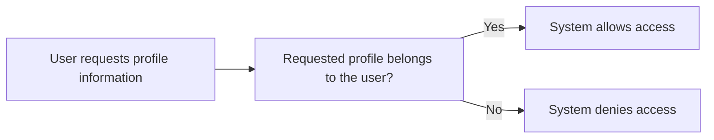

### Create User Profile During Account Setup

When a user account is created during account setup, the system must create the corresponding user profile (create user profile during account setup).
The system must associate the created user profile with the newly created user.
After successful account setup, the user’s profile must exist and be readable by that user when authenticated (read own profile information when authenticated).
Account setup must not leave a signed-up user without a profile; the system must ensure the profile is present for the signed-in user.
If account setup fails, the system must not create a profile that would appear to belong to the failed signup attempt.
Creating the user profile must still follow the privacy isolation expectations: it must not expose profile data to other users (user-scoped profile data isolation).

Flow of creating profile during signup:
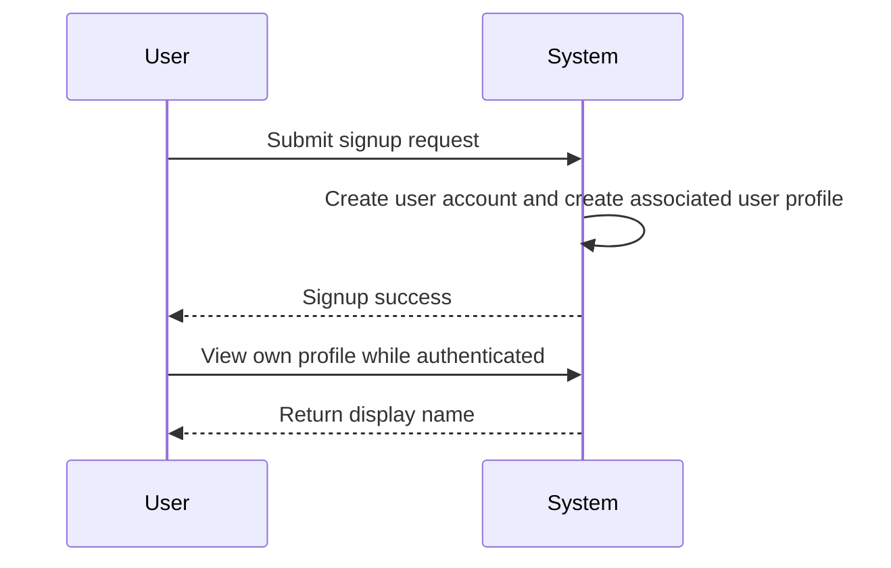

### Read Own Profile Information When Authenticated

When a user is authenticated, the system must allow the user to read their own profile information (read own profile information when authenticated).
The returned profile information must include the user’s display name.
If the user is not authenticated, the system must not provide access to any user profile information.
If an authenticated user attempts to read a profile that does not belong to them, the system must deny the request (deny access when trying to view another profile).
Reading a profile must not reveal information about any other user.
Reading profile information must not change any profile data or any todo-related visibility.

Flow for reading profile:
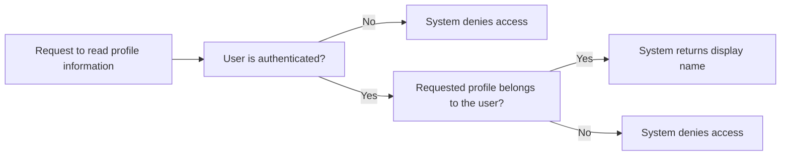

### Edit Display Name Operation

Users can edit their display name (edit display name operation).
Only the authenticated owner of a profile can update that profile’s display name.
If a user attempts to update another user’s display name, the system must block the unauthorized update and keep the target profile unchanged (blocked unauthorized display name updates).
If an unauthenticated user attempts to update a display name, the system must reject the update and keep the profile unchanged (blocked unauthorized display name updates).
If a user submits an edit request that results in an empty display name, the system must reject the update and keep the existing display name unchanged.
The system must apply display name changes only to the authenticated user’s profile and must not affect other users’ profile information (user-scoped profile data isolation).
Editing the display name must not change which todos are visible to the user or how other users see or do not see their own profiles.

Flow for updating display name:
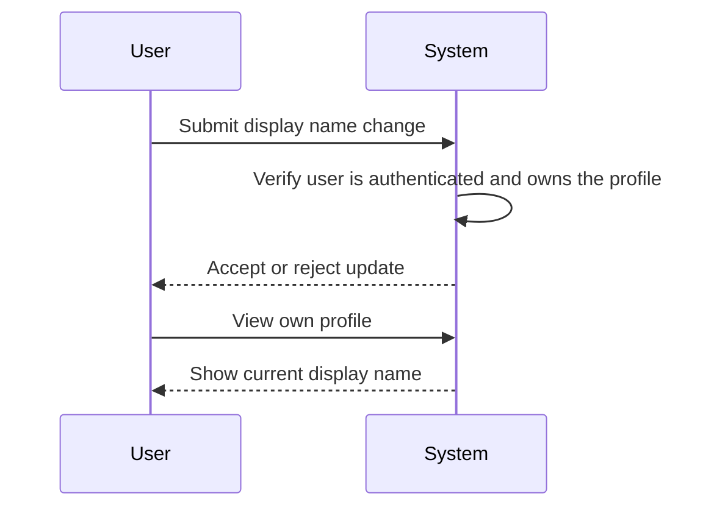

### Updated Display Name Is Reflected After Save

When the system accepts a display name edit request, the system must save the new display name.
After the save, the updated display name must be reflected the next time the user views their profile (updated display name is reflected after save).
The system must ensure subsequent reads return the latest saved display name for that user, not an earlier value.
If the system rejects an edit request, the existing display name must remain unchanged and must continue to be shown when the user reads their profile.
Updated display name visibility is limited to the profile owner; the change must not enable other users to view other users’ profiles (no viewing other users' profiles privacy rule).

Flow for reflection after update:
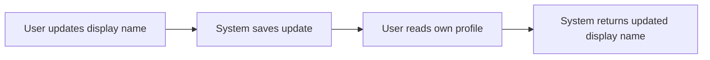

## Todo Operations

Users can create todos with a required title plus optional description, optional start date, and optional due date. When a new todo is created, it is incomplete by default. Users can view a paginated list of their own todos, and each item shown in the list includes the title, completion status, start date if set, due date if set, and the creation date. Users can open a single todo to see all its details, including the full description even if the description is empty. Users can change completion status between complete and incomplete, functioning as a simple toggle. Users can edit a todo’s title, description, start date, and due date, and those updates apply only to their own todo. Users can delete a todo using soft delete behavior so it disappears from the normal todo list. Users can restore deleted todos from trash back into the normal todo list. If a user tries to view, edit, complete/incomplete, delete, or restore a todo that does not belong to them, the system must deny the action to preserve privacy. If a user attempts to create a todo without the required title, the system must reject the request and not create the todo.

### Todo Creation with Required Title (and Rejection When Missing)

WHEN an authenticated member creates a todo, THE system SHALL require a title.
IF the member’s create todo request omits the required title, THEN THE system SHALL reject the request and SHALL not create a new todo.
WHEN the system creates a new todo, THE system SHALL mark it as incomplete by default.
WHEN the system creates a new todo, THE system SHALL associate the todo with the creating member so it is managed only by that member.
WHEN a todo is created successfully, THE member SHALL be able to immediately view it as part of their own todo lists.

### Optional Description Can Be Left Empty (and Display Behavior)

WHEN creating or editing a todo, THE system SHALL allow the description to be optional.
IF the member leaves the description empty, THEN THE system SHALL still create the todo (or save the edit) successfully.
WHEN the member opens a single todo’s details, THE system SHALL display the description content in full if description content exists.
WHEN the member opens a single todo’s details and the description was left empty, THEN THE system SHALL still show the todo details while reflecting that there is no description content to display.

### Optional Start Date on a Todo (Create, Edit, and List/Detail Display)

WHEN creating or editing a todo, THE system SHALL allow an optional start date that can be left empty.
IF the member leaves the start date empty, THEN THE system SHALL allow the todo to be created (or the edit to be saved) successfully.
In the paginated todo list, THE system SHALL display the start date only when a start date is set.
In the single-todo detail view, THE system SHALL display the start date only when a start date is set.
WHEN the member edits the start date (including clearing it), THEN THE system SHALL reflect the updated start date when the member views the todo in both the list and the details views.

### Optional Due Date on a Todo (Create, Edit, and List/Detail Display)

WHEN creating or editing a todo, THE system SHALL allow an optional due date that can be left empty.
IF the member leaves the due date empty, THEN THE system SHALL allow the todo to be created (or the edit to be saved) successfully.
In the paginated todo list, THE system SHALL display the due date only when a due date is set.
In the single-todo detail view, THE system SHALL display the due date only when a due date is set.
WHEN the member edits the due date (including clearing it), THEN THE system SHALL reflect the updated due date when the member views the todo in both the list and the details views.

### Paginated Todo List Shows Title Completion and Dates (Own Todos Only)

WHEN an authenticated member requests to view their todo list, THE system SHALL show a paginated list.
For each todo shown in the paginated list, THE system SHALL display the todo title.
For each todo shown in the paginated list, THE system SHALL display the completion status.
For each todo shown in the paginated list, THE system SHALL display the start date only if a start date is set.
For each todo shown in the paginated list, THE system SHALL display the due date only if a due date is set.
For each todo shown in the paginated list, THE system SHALL display the creation date.
THE system SHALL ensure the todo list contains only todos that belong to the authenticated member.

### Open a Single Todo for Full Details Including Description (and Dates)

WHEN an authenticated member opens a single todo, THE system SHALL display the todo’s full details.
In the single-todo detail view, THE system SHALL display the todo title.
In the single-todo detail view, THE system SHALL display the completion status.
In the single-todo detail view, THE system SHALL display the description in full when description content exists.
In the single-todo detail view, THE system SHALL still show the todo details even when the description is empty.
In the single-todo detail view, THE system SHALL display the start date only if a start date is set.
In the single-todo detail view, THE system SHALL display the due date only if a due date is set.
In the single-todo detail view, THE system SHALL display the creation date.

### Completion Toggle Between Complete and Incomplete

WHEN a member marks a todo as complete, THE system SHALL set the todo’s completion status to complete.
WHEN a member marks a todo as incomplete, THE system SHALL set the todo’s completion status to incomplete.
THE system SHALL treat completion status as a simple toggle between the two states: complete and incomplete.
Completion status toggle actions are allowed only for todos owned by the authenticated member.
When the member views the todo in the paginated list or the single-todo detail view, THE system SHALL reflect the updated completion status.

### Edit Todo Title Description Start Date and Due Date (Owner Scope)

WHEN a member edits a todo they own, THE system SHALL allow updates to the todo title.
WHEN a member edits a todo they own, THE system SHALL allow updates to the todo description.
WHEN a member edits a todo they own, THE system SHALL allow updates to the todo start date.
WHEN a member edits a todo they own, THE system SHALL allow updates to the todo due date.
WHEN the member saves edits, THE system SHALL reflect the updated title, description, start date, and due date in the single-todo detail view.
WHEN the member saves edits, THE system SHALL reflect the updated start date and due date in the paginated todo list when those dates are set or left empty.
The system SHALL ensure edit actions apply only to the authenticated member’s own todos.

### Soft Delete Hides Todo from the Normal List

WHEN a member deletes a todo they own, THE system SHALL perform a soft delete.
After a soft delete, THE system SHALL hide the deleted todo from the normal todo list.
After a soft delete, THE system SHALL make the deleted todo available in the member’s trash list.
IF a member attempts to delete a todo that they do not own, THEN THE system SHALL deny the action.

### Restore Todo from Trash to Normal List

WHEN a member views their trash list, THE system SHALL show a paginated list of deleted todos belonging to that member.
WHEN a member restores a deleted todo from the trash, THE system SHALL return the todo to the normal todo list.
After restoring, THE system SHALL treat the restored todo as an active todo that appears in the normal todo list.
IF a member attempts to restore a todo that they do not own, THEN THE system SHALL deny the action.

### Blocked Non-Owner Todo Operations (Privacy Isolation)

THE system SHALL ensure complete privacy isolation between members’ todo data.
A member can only view and manage their own todos.
There is no way for a member to view, access, or share another member’s todos.
IF a member attempts any todo operation (view single, view list, edit, mark complete/incomplete, delete, restore) on a todo that does not belong to them, THEN THE system SHALL deny the action.

## TodoEditHistoryEntry Operations

The app records an edit history for each todo so users can understand what changed over time. Every time a user edits a todo, the system creates a history entry that includes when the edit was made. The history entry must reflect only the fields that were actually changed during that edit, including the title, description, start date, and due date when they were updated. Users can view the full edit history for any todo they own. Edit history should be presented from the most recent entry to the oldest so the latest changes are easy to find. Users can access edit history for todos that are currently in trash, since deleted items remain eligible for history viewing. If a user permanently deletes a todo from trash, the permanent deletion must also remove that todo’s edit history so no history remains accessible. If a user attempts to view edit history for a todo that belongs to another user, the system must deny access. When an edit is submitted that does not change any of the tracked values, the history should not suggest that changes occurred.

### Record Todo Edits in Edit History

WHEN a user submits an edit to one of their todos, THE system SHALL create a todo edit history entry for that todo.
WHEN the user submits an edit, THE system SHALL evaluate which of the tracked fields were changed as part of that edit.
THE system SHALL include change details only for fields where the value was actually changed.
THE system SHALL track title changes when the title is updated.
THE system SHALL track description changes when the description is updated.
THE system SHALL track start date changes when the start date is updated.
THE system SHALL track due date changes when the due date is updated.
IF a user submits an edit that results in no changes to the tracked fields, THEN THE system SHALL still create the todo edit history entry for the edit event.
IF a user submits an edit that results in no changes to the tracked fields, THEN THE system SHALL not present any field-level change details for title, description, start date, or due date in that history entry.

Mermaid flowchart:
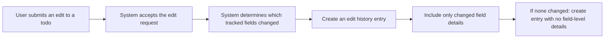


### History Entry Includes When the Edit Was Made

WHEN a todo edit history entry is created, THE system SHALL record the time when the edit was made.
WHEN users view a todo’s edit history entries, THE system SHALL display the time for each history entry.

Mermaid flowchart:
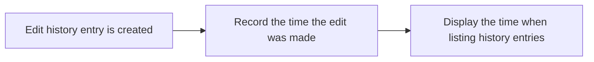


### History Includes Only Changed Fields

WHEN a todo edit history entry is presented to a user, THE system SHALL show field-level change details only for the tracked fields that were actually changed in that edit.
IF the title was not changed during the edit, THEN THE system SHALL not indicate a title change in the history entry.
IF the description was not changed during the edit, THEN THE system SHALL not indicate a description change in the history entry.
IF the start date was not changed during the edit, THEN THE system SHALL not indicate a start date change in the history entry.
IF the due date was not changed during the edit, THEN THE system SHALL not indicate a due date change in the history entry.

Mermaid flowchart:
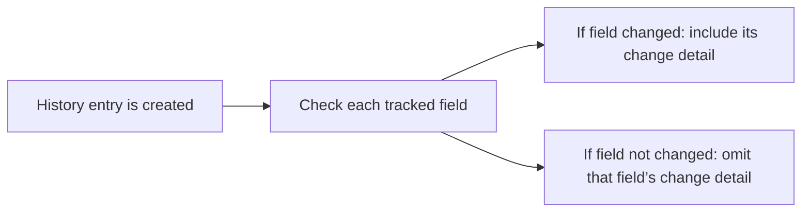


### History Records Changed Title When Updated

WHEN a user edits a todo and changes its title, THE system SHALL record the new title value in the todo edit history entry.
IF the title value did not change during the edit, THEN THE system SHALL not include title change details in the history entry.

Mermaid flowchart:
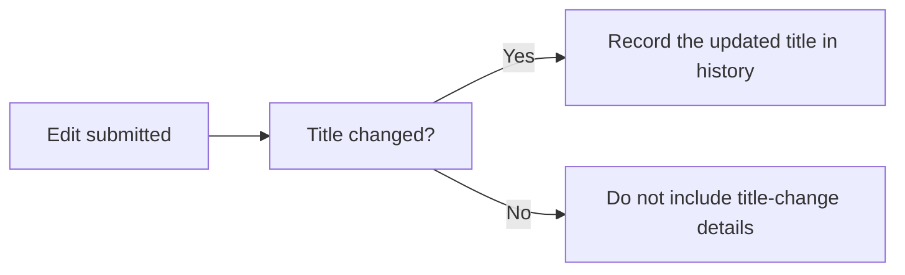


### History Records Changed Description When Updated

WHEN a user edits a todo and changes its description, THE system SHALL record the new description value in the todo edit history entry.
IF the description value did not change during the edit, THEN THE system SHALL not include description change details in the history entry.

Mermaid flowchart:
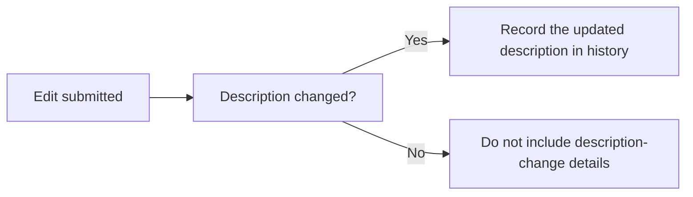


### History Records Changed Start Date and Due Date When Updated

WHEN a user edits a todo and changes its start date, THE system SHALL record the updated start date value in the todo edit history entry.
IF the start date value did not change during the edit, THEN THE system SHALL not include start date change details in the history entry.
WHEN a user edits a todo and changes its due date, THE system SHALL record the updated due date value in the todo edit history entry.
IF the due date value did not change during the edit, THEN THE system SHALL not include due date change details in the history entry.

Mermaid flowchart:
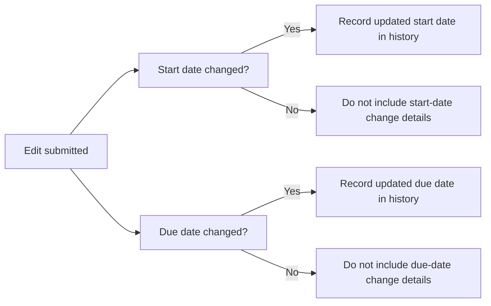


### View Full Edit History for Own Todo

WHEN an authenticated user requests to view the full edit history for a todo, THE system SHALL verify that the todo belongs to that user.
IF the todo does not belong to the requesting user, THEN THE system SHALL deny access to the todo’s edit history.
WHEN the todo belongs to the requesting user, THE system SHALL present the full set of edit history entries for that todo.

Mermaid flowchart:
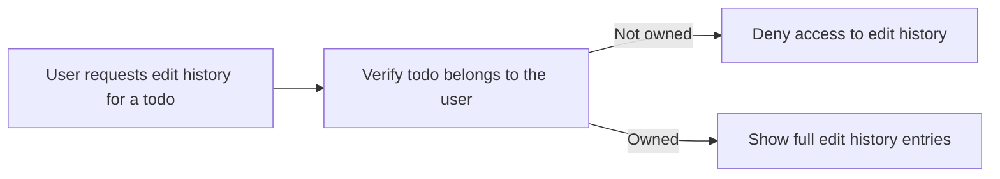


### Edit History Ordered from Most Recent to Oldest

WHEN a user views edit history entries for a todo, THE system SHALL order the history entries from most recent to oldest.
WHEN multiple history entries exist for a todo, THE system SHALL determine the order based on when each edit was made.

Mermaid flowchart:
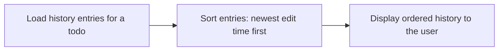


### Edit History Remains Available for Trashed Todos

WHEN a user views the edit history for a todo that is currently in trash, THE system SHALL still present the full edit history entries for that todo.

Mermaid flowchart:
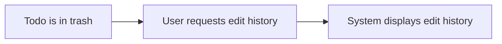


### Permanent Delete from Trash Removes Todo History

WHEN a user permanently deletes a todo from trash, THE system SHALL permanently remove that todo’s edit history.
IF the user later attempts to view edit history for that permanently deleted todo, THEN THE system SHALL prevent access because no edit history remains accessible.

Mermaid flowchart:
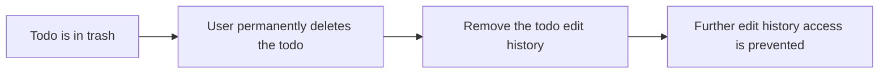


### Deny Edit History Access for Other Users' Todos

IF an authenticated user attempts to view edit history for a todo that belongs to another user, THEN THE system SHALL deny access to that edit history.

Mermaid flowchart:
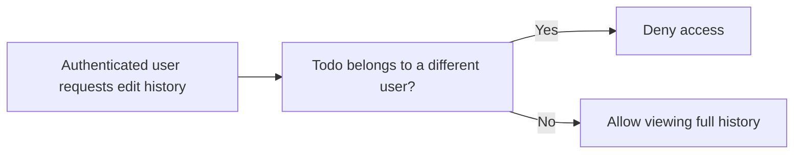


### No Misleading History When Nothing Changed

WHEN an edit is accepted for a todo and the edit results in no changes to the tracked fields (title, description, start date, due date), THEN the corresponding edit history entry SHALL not show any field-level change details.
WHEN users review an edit history entry created for an edit with no tracked changes, THE system SHALL not imply that any tracked field values were changed.

Mermaid flowchart:
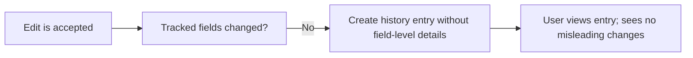


# Error Scenarios and Edge Cases

Business-level error scenarios, edge case coverage, and expected system behaviors for exceptional conditions.

## User Error Scenarios

When a user signs up, the system must only create an account when the required signup inputs are present and satisfy the application’s acceptance rules; otherwise the signup must fail and the user must not become authenticated. During login, if the email or password does not match an existing account, the system must reject the login attempt and prevent access to any todo lists. If a user attempts to change their password using an incorrect current password, the system must reject the change and keep the existing authentication state working as before. If a user deletes their account, all of their todos must be permanently removed, including any todos that were previously moved to trash. After account deletion, any attempt to access todo lists, trash, or profile content must be denied because the account no longer exists. Repeated signup attempts should not result in duplicate user identities that would create conflicting ownership of todos. If a user initiates account deletion while also interacting with todo pages, the deletion must take precedence so no todo content can be retrieved after deletion completes. If a permanently deleted todo set includes items in trash, those trashed items must also be fully removed from the user’s scope with no leftovers in normal lists or trash lists. Error handling must avoid partial outcomes where some todos disappear while others remain visible after account deletion.

### Signup Rejection When Required Inputs Are Missing

WHEN a guest or member attempts to sign up, THE system shall reject the signup attempt if one or more required signup inputs are missing.
THE system shall not sign in the user as a result of a rejected signup attempt.
THE system shall ensure that a rejected signup attempt does not create an account that can be used to access the user’s todo lists.
IF the user retries signup after previously providing missing required inputs, THE system shall evaluate the new attempt using the same acceptance rules and either accept it or reject it.
IF the user repeats signup attempts while still missing required signup inputs, THEN every attempt shall be rejected and no authenticated access shall be established.

### Login Failure for Wrong Email or Password

WHEN a user attempts to log in with an email address that does not match an existing account, THE system shall reject the login attempt.
WHEN a user attempts to log in with a password that does not match the account associated with the provided email, THE system shall reject the login attempt.
WHEN login is rejected, THE system shall prevent access to any todo lists.
IF a user repeats a failed login attempt, THEN the system shall continue to reject the attempt and shall not grant access to todo lists.

### Password Change Rejected on Incorrect Current Password

WHEN an authenticated user attempts to change their password and provides an incorrect current password, THE system shall reject the password change.
IF the password change is rejected, THEN the user’s existing ability to sign in using their current credentials shall remain working as before.
THE system shall not partially apply a new password as part of a rejected password change.
IF the same user retries the password change again with an incorrect current password, THEN each attempt shall be rejected.

### Account Deletion Prevents Any Further Todo Access

WHEN a user deletes their account, THE system shall permanently delete all their todos, including todos that were previously moved to trash.
AFTER account deletion is completed, THE system shall deny access to the normal todo list.
AFTER account deletion is completed, THE system shall deny access to the trash list.
AFTER account deletion is completed, THE system shall deny access to the user profile content.
IF a user attempts any todo- or profile-related action after the account no longer exists, THEN the system shall deny the action.
IF account deletion is initiated while the user is interacting with todo pages, THEN deletion shall take precedence so no todo content can be retrieved after deletion completes.

### Permanent Account Deletion Removes Todos Including Trash

WHEN an account deletion is completed, THE system shall permanently delete all todos owned by that user.
THE system shall permanently remove todos that were previously moved to trash as part of account deletion.
AFTER deletion completes, none of those permanently deleted todos shall appear in either the normal todo list or the trash list.
IF the user has both normal and deleted (trashed) todos at the moment deletion begins, THEN none of those todos shall remain visible after deletion completes.
THE system shall avoid partial outcomes for account deletion so that no subset of the user’s todos remains accessible after completion.

### Deny Access After Deleted Account

WHEN a user’s account has been deleted, THE system shall treat the user as having no active account.
AFTER deletion completes, if the user attempts to view or interact with the normal todo list, THE system shall deny access.
AFTER deletion completes, if the user attempts to view or interact with the trash list, THE system shall deny access.
AFTER deletion completes, if the user attempts to view profile information, THE system shall deny access.
IF a request requires an existing account context related to todos or profile content, THEN the system shall deny the request when the account no longer exists.

### Avoid Duplicate Accounts from Repeated Signup

WHEN the same person repeats signup attempts, THE system shall not create duplicate user identities that would create conflicting ownership of todos.
IF repeated signup attempts are made for the same email address, THEN the system shall ensure that only one account identity is used for todo ownership.
WHEN a signup attempt is repeated after a prior successful signup, THE system shall handle the repetition without creating an additional account that could create ownership conflicts.
IF repeated signup attempts include attempts that are missing required signup inputs, THEN the system shall still prevent duplicate identities and ensure stable todo ownership for any accepted account.

### Deletion Precedence Over Concurrent Todo Viewing

WHEN a user initiates account deletion while browsing todo content, THE system shall ensure deletion takes precedence.
IF the user is viewing their normal todo list or viewing a single todo when deletion is initiated, THEN after deletion completes no todo content shall be retrievable.
IF the account deletion completes while a todo page is being accessed, THEN the system shall prevent the user from receiving any todo content after completion.
IF multiple user actions are attempted during the deletion process, THEN deletion precedence shall still prevent todo access after completion.

### No Partial Deletion Outcomes

WHEN a user deletes their account, THE system shall perform deletion in a way that avoids partial outcomes.
AFTER account deletion completes, THE system shall ensure the user does not see any of their todos in either the normal todo list or the trash list.
IF account deletion is initiated while the user has visible todos, THEN after deletion completes none of those previously visible todos shall remain visible.
THE system shall ensure account deletion does not result in some todos being removed while others remain accessible.
IF account deletion completes successfully, THEN all of the user’s todos, including those in trash, shall be included in the permanent deletion and no leftovers shall remain visible in any list.

## UserProfile Error Scenarios

When a user edits their display name, the system must only accept the update if it is valid and not empty; otherwise it must reject the change and keep the current display name. A user must not be able to view or update another user’s profile; any attempt to access a different user’s profile must be denied even when the requester is authenticated. If the user is not authenticated and tries to change their display name, the update must not be applied. Display name updates must not affect the user’s todo ownership or the set of todos they can view; only the visible name shown on their own profile should change. If a user submits multiple display name edits in quick succession, invalid attempts must not overwrite the most recent valid display name. After the user deletes their account, their profile must no longer be accessible, consistent with permanent removal of their account scope. If two profile update attempts occur at the same time, the system must ensure the profile ends in a consistent state rather than a partially applied name. The system must ensure error outcomes do not leave the profile showing a blank or invalid display name.

### Display Name Update Validation

WHEN a member submits an update to their display name, THE system SHALL validate the proposed display name according to the valid display name rules defined for user profile display names (defined in [User Profile Display Name Rules]).

### Reject Empty Display Name Edits

IF a member submits an update where the proposed display name is empty, THEN THE system SHALL reject the update and keep the current display name unchanged.

### Reject Invalid Display Name Edits

IF a member submits an update where the proposed display name does not meet the valid display name rules (defined in [User Profile Display Name Rules]), THEN THE system SHALL reject the update and keep the current display name unchanged.

### Unauthenticated Profile Update Prevented

IF a guest or unauthenticated user attempts to change a display name, THEN THE system SHALL not apply the update and SHALL keep the current display name unchanged.

### Deny Viewing Other Users Profiles

IF an authenticated member attempts to view a different user’s profile, THEN THE system SHALL deny access.

### Display Name Changes Do Not Impact Todo Visibility

WHEN a member successfully changes their display name, THEN THE system SHALL not change which todos the member can view.
WHEN a member successfully changes their display name, THEN THE system SHALL continue to show only that member’s own todos in their todo lists.

### Rapid Profile Edit Conflict Handling

WHEN a member submits multiple display name updates in quick succession, THEN THE system SHALL ensure that invalid update attempts do not overwrite a more recent valid display name.

### Profile Becomes Inaccessible After Account Deletion

AFTER a member deletes their account, THEN the member’s profile SHALL no longer be accessible.
IF any user (whether authenticated or not) attempts to view a deleted member’s profile after deletion, THEN THE system SHALL deny access.

### Consistent Profile State After Simultaneous Updates

IF two display name update attempts for the same member occur at the same time, THEN THE system SHALL ensure the member’s profile ends in a consistent state rather than partially applying an update.
IF one of the simultaneous update attempts is invalid and the other is valid, THEN THE system SHALL apply the valid update and reject the invalid one.

### Avoid Blank or Inconsistent Display Name After Conflicts

WHILE processing any display name update (including conflicting updates), THE system SHALL ensure the member’s display name is not blank.
IF a conflicting update would result in a blank or inconsistent display name, THEN THE system SHALL preserve the most recent valid display name and reject the invalid outcome.

## Todo Error Scenarios

When creating a todo, the system must require a title; if the title is missing or invalid, the todo must not be created and the user’s todo list should remain unchanged. Description, start date, and due date are optional, so users can leave them empty and still create a valid todo. When editing, completing, deleting, or restoring a todo, the system must deny the action if the todo does not belong to the requesting user. Only the todo owner can mark a todo complete or incomplete, and the completion toggle must reflect the intended next state rather than partially applying changes. Newly created todos must start as incomplete by default, and the system must reject any attempt that would result in an initial state contradicting that rule. Date-related inputs for start date and due date must be validated so invalid values are rejected rather than producing malformed schedules in the user experience. When viewing a paginated todo list, requests that target an out-of-range page must not expose other users’ todos; the user should see a safe result consistent with their own scope. If a user deletes a todo while also trying to edit or view it, the deletion behavior must prevail so the todo no longer appears in the normal list after it is deleted. Restoring a todo from trash must return it to the normal list for the same owner, and it must not create duplicate todo entries. If a user attempts to restore a todo that is not available in their trash, the system should fail without changing other todos. Throughout all operations, permission checks must ensure users can only view and act on their own todos.

### Todo Creation Fails Without Required Title [NEEDS FIX]

### Reject Todo Creation When Title Is Missing
IF a member attempts to create a todo without providing a title, THEN the system SHALL reject the creation request.

WHEN the request is rejected, the todo SHALL NOT be added to the member’s normal todo list.

### Rejected Creation Does Not Change Existing Todos
IF a member’s todo creation request is rejected due to a missing title, THEN the system SHALL leave all existing todos in the member’s normal todo list unchanged.

### Optional Description and Dates Allowed to Be Empty [NEEDS FIX]

### Allow Empty Description
WHERE a member creates a todo, the system SHALL allow the description to be left empty.

WHEN the description is left empty, the todo SHALL still be created (assuming the title requirement is satisfied).

### Allow Empty Start Date
WHERE a member creates a todo, the system SHALL allow the start date to be left empty.

WHEN the start date is left empty, the system SHALL treat the start date as not set for that todo.

### Allow Empty Due Date
WHERE a member creates a todo, the system SHALL allow the due date to be left empty.

WHEN the due date is left empty, the system SHALL treat the due date as not set for that todo.

### Permission Denied When Editing Someone Else’s Todo [NEEDS FIX]

### Deny Editing Todos Owned by Another Member
IF a member attempts to edit a todo that is not owned by them, THEN the system SHALL deny the edit.

WHEN the edit is denied, the todo’s title, description, start date, and due date SHALL remain unchanged.

### Completion Toggle Only for Owner [NEEDS FIX]

### Deny Completion Toggle for Todos Owned by Another Member
IF a member attempts to mark a todo complete or incomplete for a todo that is not owned by them, THEN the system SHALL deny the completion action.

WHEN the action is denied, the todo’s completion status SHALL remain unchanged.

### New Todos Start Incomplete by Default [NEEDS FIX]

### New Todos Are Incomplete by Default
WHEN a member successfully creates a todo, THEN the system SHALL set the todo’s completion status to incomplete.

### Creation Must Not Contradict Incomplete Default
IF a member’s creation request would cause the new todo to start in a completed state rather than incomplete, THEN the system SHALL reject the creation request.

WHEN the creation is rejected, the todo SHALL NOT be added to the member’s normal todo list.

### Reject Invalid Start and Due Date Inputs

### Reject Invalid Start Date Inputs
IF a member submits a todo creation request with a start date value that is invalid, THEN the system SHALL reject the request.

WHEN the request is rejected, the todo SHALL NOT be created.

### Reject Invalid Due Date Inputs
IF a member submits a todo creation request with a due date value that is invalid, THEN the system SHALL reject the request.

WHEN the request is rejected, the todo SHALL NOT be created.

### Reject Due Dates That Violate Scheduling Compared to Start Date
IF a member submits a todo creation request where the due date would conflict with the start date scheduling rule for that todo, THEN the system SHALL reject the request.

WHEN the request is rejected, the todo SHALL NOT be created.

### Pagination Out-of-Range Safe Behavior

### Out-of-Range Paginated Requests Must Not Expose Other Users’ Todos
IF a member requests a paginated todo list page that is out of range, THEN the system SHALL not expose any other member’s todos.

The result SHALL remain consistent with the member’s own private todo scope.

### Out-of-Range Pagination Must Not Modify Todos
IF a member requests an out-of-range paginated todo list page, THEN the system SHALL not modify any todos as a side effect of browsing.

### Delete Prevails Over Concurrent Edit or View

### Delete Takes Precedence Over Concurrent Viewing
IF a member deletes a todo while they are also attempting to view that todo’s details, THEN the delete behavior SHALL prevail.

After deletion, the deleted todo SHALL no longer appear in the member’s normal todo list.

### Delete Takes Precedence Over Concurrent Editing
IF a member deletes a todo while they are also attempting to edit that todo, THEN the delete behavior SHALL prevail.

After deletion, the deleted todo SHALL no longer appear in the member’s normal todo list.

### Restore From Trash to Normal List

### Restoring From Trash Returns to Normal Todo List
WHEN a member restores a deleted todo from their trash, THEN the system SHALL return the todo so it appears in the member’s normal todo list.

### Restored Todo Appears Under the Same Owner Scope
WHEN a todo is restored, THEN it SHALL be visible only within the restoring member’s private todo scope.

### Restore Fails When Item Not in Trash

### Restore Must Fail for Todos Not Available in Trash
IF a member attempts to restore a todo that is not available in their trash, THEN the system SHALL fail the restore attempt.

WHEN restore fails, the system SHALL not change any other todos.

### No Duplicate Todos on Restore

### Restore Must Not Create Duplicate Normal Todos
IF a member restores a todo from their trash, THEN the system SHALL ensure it results in exactly one todo entry appearing in the member’s normal todo list.

The restore operation SHALL not create additional duplicate todo entries in the normal list.

### Restore Does Not Duplicate Edit History Visibility
WHEN a todo is restored, THEN the member’s view of the todo and its edit history SHALL correspond to that single restored todo entry, not multiple duplicates.

## TodoEditHistoryEntry Error Scenarios

Users can view edit history only for todos they own; if a user tries to access another user’s history, the system must deny the request. If a todo’s history is no longer accessible due to the todo being permanently removed from trash, the system must not show stale history and should fail safely for the requester. For a todo that has never been edited, the history view should be empty rather than treated as an error. When multiple edits happen close together, history entries must still appear in the correct order from most recent to oldest. Each history entry must correspond to an actual edit, meaning the system should not record a change as history if the submitted updates do not alter any of the tracked values. If the system encounters a failure while attempting to record a valid edit’s history, it must avoid presenting misleading history that does not match what the user currently sees on the todo details. If a user restores a todo from trash, the existing edit history should remain available and continue to be ordered correctly. When a todo is permanently deleted from trash, its edit history must also be permanently removed from the user’s accessible scope. If a user tries to view edit history at the same time the todo is being permanently deleted, the history view should become inaccessible rather than showing partial entries.

### Deny Edit History Access for Todos Owned by Other Users

WHEN a member attempts to view the edit history of a todo, THE system SHALL allow the request only if the todo belongs to that member.
IF the todo does not belong to the requesting member, THEN THE system SHALL deny access.
IF access is denied, THEN THE system SHALL not reveal whether the targeted todo exists.
IF a member attempts to access another member’s edit history through any navigation or history view method, THEN THE system SHALL still deny access and SHALL not expose any edit history details from the other member’s todo.
WHEN access is denied, THEN THE system SHALL present an access-denied outcome consistent with other protected todo views in the application, without exposing other users’ information.

### History Becomes Inaccessible After Permanent Deletion from Trash

WHEN a member permanently deletes a todo from trash, THEN THE system SHALL permanently remove that todo’s edit history from the member’s accessible scope.
IF the member later requests to view the edit history for that permanently deleted todo, THEN THE system SHALL treat the edit history as unavailable.
IF the member attempts to open edit history details that were previously visible before permanent deletion, THEN THE system SHALL not show the removed edit history entries.
IF permanent deletion and navigation to history occur such that the request targets a permanently deleted todo, THEN THE system SHALL fail safely for the requester rather than showing partial or stale history.

### Empty History for Todos That Were Never Edited

WHEN a member opens the edit history for a todo that has never been edited since it was created, THEN THE system SHALL display an empty edit history.
IF there are no edit history entries to show for the requested todo, THEN THE system SHALL not treat that absence as an error condition.
WHEN the member requests edit history repeatedly for a never-edited todo, THEN THE system SHALL consistently show the same empty result.

### Most-Recent-to-Oldest History Ordering

WHEN the system displays edit history entries for a todo, THEN THE entries SHALL be ordered from most recent to oldest.
IF multiple edits have occurred for the same todo, THEN the history view SHALL show the latest edit first.
IF additional edits are made after a member previously opened the history view, THEN reopening or refreshing the history view SHALL continue to present all entries in most-recent-to-oldest order.
IF edits occur close together, THEN the system SHALL not mix ordering such that an older edit appears after a newer edit.

### Record Only Actual Changes in Todo Edit History

WHEN a member edits a todo, THEN THE system SHALL create a history entry only for the values that actually change as a result of that edit.
IF the member submits an update where the todo’s title remains unchanged, THEN THE history entry SHALL not indicate a title change.
IF the member submits an update where the todo’s description remains unchanged, THEN THE history entry SHALL not indicate a description change.
IF the member submits an update where the todo’s start date remains unchanged, THEN THE history entry SHALL not indicate a start date change.
IF the member submits an update where the todo’s due date remains unchanged, THEN THE history entry SHALL not indicate a due date change.
IF the submitted update does not change any of the tracked todo values (title, description, start date, or due date), THEN THE system SHALL not record an edit history entry that implies any change.

### Avoid Misleading History After Failure to Record a Valid Edit

IF the system encounters a failure while attempting to record edit history for a valid todo edit, THEN THE system SHALL avoid presenting edit history that conflicts with what the member currently sees on the todo details.
WHEN the todo details reflect the member’s submitted updates but edit history cannot be recorded reliably, THEN THE system SHALL ensure the edit history view does not include incorrect or mismatched entries.
IF the system cannot trust the edit-history record after a recording failure, THEN THE system SHALL fail safely for the history view rather than showing misleading history content.
WHEN the system chooses not to present history due to an edit-history recording failure, THEN THE member shall not receive a history view that contradicts the current state of the todo details.

### Restore Keeps Existing Edit History Available

WHEN a member restores a deleted todo from trash, THEN THE system SHALL keep the todo’s existing edit history available.
WHEN the member views the restored todo’s edit history, THEN THE system SHALL display the previously recorded history entries.
IF the restored todo had edit history entries before deletion, THEN THE system SHALL not discard, reset, or reorder those existing history entries.
WHEN displaying restored history, THEN THE system SHALL continue to apply most-recent-to-oldest ordering to the restored history entries.

### Permanent Trash Deletion Removes Edit History

WHEN a member permanently deletes a todo from trash, THEN THE system SHALL ensure that the todo’s edit history is permanently removed from view for that member.
IF the member later attempts to view edit history for that permanently deleted todo, THEN THE system SHALL not show the removed edit history entries.
IF a history view request targets a permanently deleted todo, THEN THE system SHALL treat the edit history as unavailable rather than showing old entries.

### Inaccessible History During Concurrent Permanent Deletion

IF a member requests to view a todo’s edit history at the same time the todo is being permanently deleted from trash, THEN THE system SHALL make the history view inaccessible.
WHEN permanent deletion and edit history viewing occur concurrently, THEN THE system SHALL avoid returning partial or incomplete history entries.
IF the system is in the process of removing edit history content due to permanent deletion, THEN THE system SHALL not present a mixture of visible and missing history entries.
WHEN the request overlaps with permanent deletion, THEN the system SHALL prioritize consistency (no partial edit history exposure) over partial rendering.

# End-to-End User Scenarios

Cross-domain user scenarios that span multiple concepts, describing complete user journeys.

## Cross-Domain User Scenarios

Define end-to-end user scenarios that span multiple concepts, describing complete user journeys from start to finish.

### End-to-End User Scenario: Sign up, authenticate, create, complete, edit, and view edit history

#### User journey (end-to-end, multi-step)
1. WHEN a guest signs up with an email and password, THEN the system creates an account for that guest.
2. WHEN the account is created, THEN the user can sign in using the same email and password.
3. WHEN the user creates a todo, THEN the todo is saved with a required title, and with description, start date, and due date set only if the user provided them.
4. WHEN the user creates a todo, THEN the todo is incomplete by default.
5. WHEN the user marks the todo as complete, THEN the todo’s completion status becomes complete.
6. WHEN the user marks the same todo as incomplete again, THEN the todo’s completion status returns to incomplete.
7. WHEN the user edits the todo’s title, THEN the updated title is reflected when viewing the todo.
8. WHEN the user edits the todo’s description, start date, or due date, THEN the updated values are reflected when viewing the todo.
9. WHEN the user edits the todo, THEN the system records an edit history entry for that todo.
10. WHEN an edit history entry is recorded, THEN the entry includes the time the edit was made.
11. WHEN an edit history entry is recorded, THEN the entry includes only the fields that actually changed (title, description, start date, and/or due date), and excludes fields that were unchanged.
12. WHEN the user views the edit history for the todo, THEN the history entries are shown from most recent to oldest.

#### Success criteria
13. The system keeps the todo’s details (including completion status and the latest field values) and the edit history consistent with each multi-step action taken by the user: create → toggle completion → edit → view todo → view history.

### End-to-End User Scenario: List todos with filtering and sorting by dates

#### User journey (end-to-end, multi-step)
1. WHEN an authenticated user has multiple todos with different combinations of completion status, start date presence, and due date presence, THEN the system can display the user’s todo list.
2. WHEN the user views the todo list, THEN the list is paginated.
3. WHEN the user views the todo list, THEN each todo item shown includes title, completion status, start date (only if set), due date (only if set), and creation date.
4. WHEN the user selects the “All todos” completion-status filter, THEN the list shows all of the user’s todos.
5. WHEN the user selects the “Only complete todos” filter, THEN the list shows only todos whose completion status is complete.
6. WHEN the user selects the “Only incomplete todos” filter, THEN the list shows only todos whose completion status is incomplete.
7. WHEN the user sorts by creation date, THEN the list order follows the user’s selection of newest first or oldest first.
8. WHEN the user sorts by start date, THEN todos with a start date appear in the correct order for the user’s selection of earliest first or latest first.
9. WHEN the user sorts by start date and some todos have no start date, THEN the todos without a start date appear at the end of the list.
10. WHEN the user sorts by due date, THEN todos with a due date appear in the correct order for the user’s selection of earliest first or latest first.
11. WHEN the user sorts by due date and some todos have no due date, THEN the todos without a due date appear at the end of the list.
12. WHEN the user changes filtering and sorting, THEN the displayed list reflects both the selected completion-status filter and the selected sort order.

#### Flow
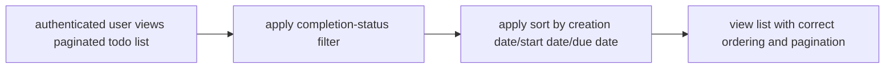

#### Success criteria
13. The user’s selected completion filter and sort choice are reflected together in the paginated list, including correct placement of todos missing start or due dates.

### End-to-End User Scenario: Soft delete, restore from trash, and permanent delete with edit history removal

#### User journey (end-to-end, multi-step)
1. WHEN an authenticated user deletes one of their own todos, THEN the todo is removed from the normal todo list.
2. WHEN a todo is deleted, THEN the system keeps it available in the user’s trash instead of permanently removing it.
3. WHEN the user views the trash list, THEN the list is paginated and shows only that user’s deleted todos.
4. WHEN the user restores a deleted todo from the trash, THEN the todo reappears in the normal todo list.
5. WHEN the user permanently deletes a todo from the trash, THEN the todo is permanently removed.
6. WHEN a todo is permanently deleted, THEN its edit history is also permanently removed.
7. WHEN the user attempts to view edit history for a permanently deleted todo, THEN the system does not provide that edit history.

#### Flow
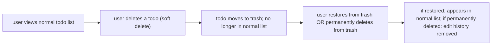

#### Success criteria
8. The todo transitions correctly across normal list → trash → (restore to normal list) or (permanent delete with edit history removal), and the edit history availability matches the final state.

### End-to-End User Scenario: Privacy boundaries across multiple users during viewing and profile changes

#### User journey (end-to-end, multi-step)
1. WHEN User A is authenticated, THEN User A can view only User A’s own todos in the normal todo list.
2. WHEN User A is authenticated, THEN User A can view only User A’s own todos in the trash list.
3. WHEN User A views a single todo, THEN the system shows the full details only if the todo belongs to User A.
4. WHEN User A attempts to view another user’s profile, THEN the system prevents access to that other user’s profile.
5. WHEN User A edits their display name, THEN the updated display name is shown for User A after the change is saved.
6. WHEN User A edits their display name, THEN the set of todos User A can view remains unchanged, and User A still sees only User A’s own todos.

#### Flow
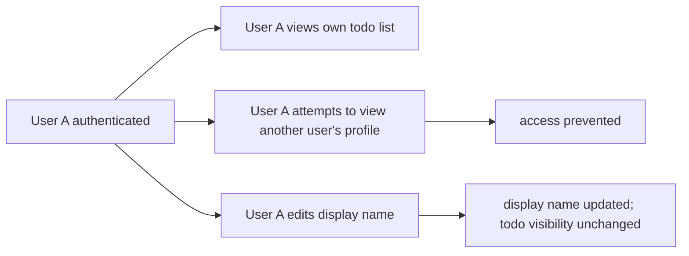

#### Success criteria
7. Throughout the scenario, User A’s actions cannot reveal or expose User B’s todos or User B’s profile, and display name changes do not alter todo privacy boundaries.

### End-to-End User Scenario: Account deletion permanently removes all owned todos including trash and edit history

#### User journey (end-to-end, multi-step)
1. WHEN an authenticated user requests account deletion, THEN the system permanently deletes all todos owned by that user.
2. WHEN account deletion occurs, THEN todos currently in the user’s trash are also permanently deleted.
3. WHEN account deletion completes, THEN permanently deleted todos are no longer available in either the normal todo list or the trash list.
4. WHEN account deletion permanently removes a todo, THEN the system also permanently removes that todo’s edit history.
5. WHEN the user tries to access todo lists or edit history after the account is deleted, THEN no access is available under that deleted account context.

#### Flow
```mermaid
flowchart LR
    A["authenticated user requests account deletion"] --> B["permanent removal of all owned todos"]
    B --> C["permanent removal of owned edit history"]
    C --> D["normal list and trash no longer show deleted data"]
```

#### Success criteria
6. Account deletion results in permanent removal of all user-owned todos (including trashed ones) and permanent removal of their edit histories, with no remaining access to those resources through that account.