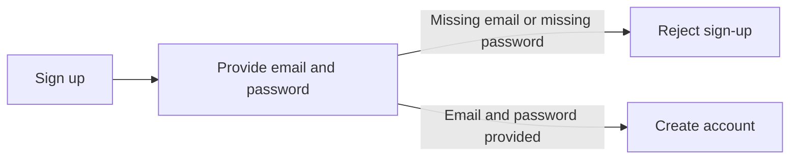
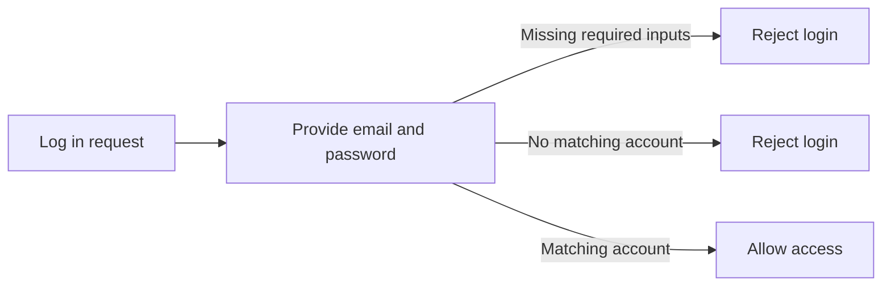
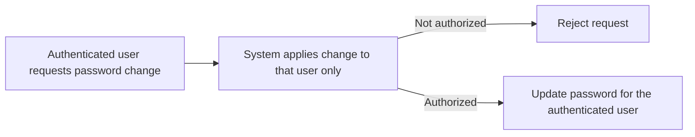
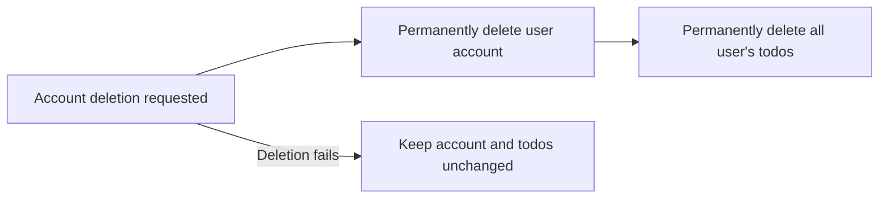
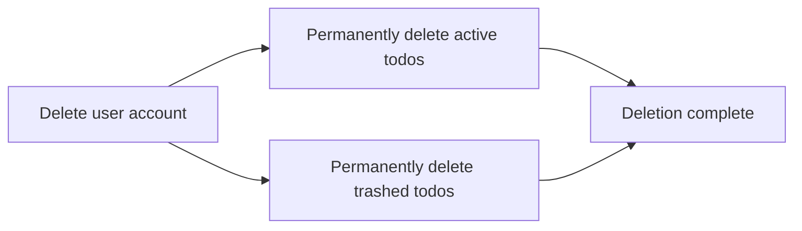
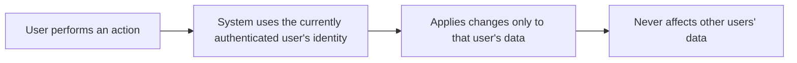
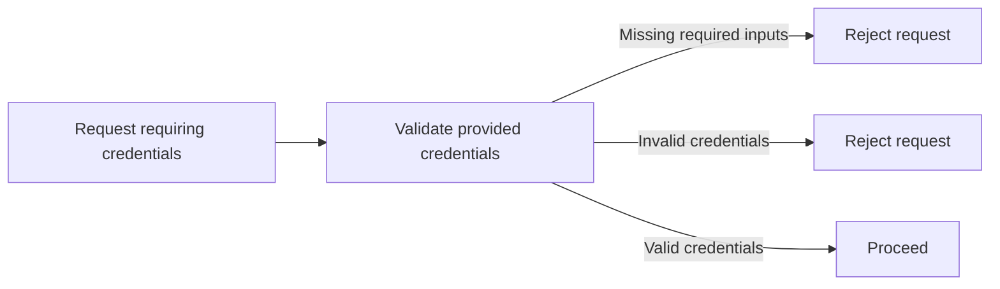
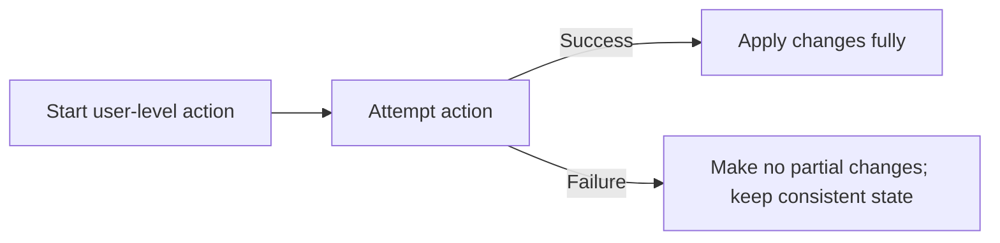

**multiUserTodo — Business rules, validation constraints, data browsing expectations, error scenarios**

Business rules, validation constraints, data browsing expectations, error scenarios

# Domain Business Rules

Per-concept business rules, validation logic, and domain constraints.

## User Rules

Users must sign up with an email address and a password, and both inputs are required for account creation. When a user attempts to log in, the system validates the credentials by using the provided email and password together to determine whether access is allowed. Users can change their password, and the change must apply only to the currently authenticated user. Deleting a user account is treated as a permanent action for that user, and it must permanently remove all of that user’s todos, including todos that are currently in trash. Because this is a private multi-user todo app, user-level actions must never affect another user’s data. If a user provides missing or invalid credentials for user-level actions such as login or password change, the system rejects the request and the user can correct the input and try again. If an account deletion request fails, the account and its todos must not end up in a partially deleted or ambiguous state. Overall, user identity is the basis for what can be changed or permanently removed, and the rules are designed to prevent accidental cross-user impact.

### Email and Password Are Required for Sign-Up

WHEN a user signs up, THE system shall require both an email address and a password to be provided.
IF the sign-up attempt does not include an email address, THEN THE system shall reject the sign-up request.
IF the sign-up attempt does not include a password, THEN THE system shall reject the sign-up request.

Flowchart of sign-up required inputs

### Login Validates Email and Password Together

WHEN a user attempts to log in, THE system shall validate access by using the provided email address together with the provided password.
IF the provided email address and provided password do not match an existing user account, THEN THE system shall reject the login request.
IF a login attempt is missing required inputs needed for email-and-password validation, THEN THE system shall reject the login request.

Flowchart of login validation

### Password Change Applies Only to the Authenticated User

WHEN an authenticated user requests a password change, THE system shall apply the password change only to that currently authenticated user.
IF a password change request is not authorized for the currently authenticated user, THEN THE system shall reject the password change request.

Flowchart of password change scope

### Account Deletion Permanently Removes the User’s Todos

WHEN a user requests account deletion, THE system shall permanently remove that user’s account.
WHEN a user’s account is deleted, THE system shall permanently delete all todos owned by that user.
IF the account deletion request fails, THEN THE system shall not leave the user account deleted while leaving that user’s todos undeleted.

Flowchart of permanent deletion expectation

### Account Deletion Includes Todos in Trash

WHEN a user’s account is deleted, THE system shall permanently remove all todos owned by that user, including todos that are currently in trash.
IF a todo is currently in trash for the user, THEN it shall be permanently removed as part of account deletion.

Flowchart of trash-inclusive permanent removal

### Private App User Identity Isolation

THE system shall ensure private app identity isolation such that user-level actions apply only to the data of the currently authenticated user.
IF a user attempts any user-level action that would affect another user’s todos or other user-specific data, THEN THE system shall prevent that action from affecting other users’ data.

Flowchart of identity isolation principle

### Reject Missing or Invalid Credentials for User-Level Actions

IF a user attempts a user-level action that relies on email-and-password credentials (including logging in and changing a password) and the required credential inputs are missing, THEN THE system shall reject the request.
IF a user attempts such an action with credentials that do not validate, THEN THE system shall reject the request.

Flowchart of credential-based rejection

### No Partial Changes After Failed User Actions

IF a user-level action such as password change or account deletion fails, THEN THE system shall not leave the user in a partially changed or ambiguous state.
Specifically for account deletion: IF account deletion fails, THEN THE system shall keep the user account and all of the user’s todos.
Specifically for account deletion: IF account deletion fails, THEN THE system shall not permanently remove the user’s todos while leaving the account still present.

Flowchart of preventing partial changes

## UserProfile Rules

Each user has a profile that includes a display name. Users can edit their own display name, and the system must accept an update only when the new display name is provided in a valid way for profile display. A display name change must apply only to the currently authenticated user’s profile and must not affect any other user’s profile. Users must not be able to view other users’ profiles in this private todo app, so any attempt to access another person’s profile information must be denied. If a user attempts to set an invalid or missing display name, the system rejects the update so the existing display name remains unchanged. After a successful update, the new display name should be consistently shown wherever the profile name is presented to the user. If the profile update fails, the user should not see an unexpected mix of old and new profile name values.

### Profile Display Name Rule

Each user has a profile with a display name.

The system must always have a display name value available to show the user’s name within the private todo app.

The system must treat the display name as user-specific: a display name belonging to one user must not be used as the display name for any other user.

If the user’s profile display name is shown anywhere in the app, it must reflect the current saved display name for that same user (defined more specifically in later rules).

### Edit Display Name for the Current User

When a user edits their profile display name, the change must be applied to the currently authenticated user’s own profile display name.

If the user submits an edit that would target another person’s profile (whether by mistake or intent), the system must deny the edit.

If the edit is denied, the user must not cause any change to their own profile display name as a side effect of attempting to edit another person’s profile.

### Reject Missing or Invalid Display Name

If a user attempts to set a profile display name that is missing, the system must reject the update.

If a user attempts to set a profile display name that is invalid for the profile display name (for example, disallowed formatting or content), the system must reject the update.

When the system rejects the update, the previously saved profile display name must remain unchanged.

### Profile Update Applies to Authenticated User Only

A profile display name update request must apply only for the authenticated user making the request.

The system must not allow any user to update the display name of another user.

If an unauthenticated user attempts to perform a display name update, the system must deny the update (no display name changes occur).

### Display Name Does Not Affect Other Users

A user’s display name update must not change how any other user’s display name is shown.

After one user updates their display name, any display name presentation for other users must continue to show their own saved display names.

If two users share the same display name text at different times, the system must still keep each user’s display name presentation tied to that specific user.

### No Viewing Other Users Profiles

Users must not be able to view other users’ profiles in this private todo app.

If a user attempts to access another person’s profile information, the system must deny the request.

When access is denied, the system must not reveal other users’ profile details through visible data.

### Keep Existing Display Name If Update Fails

If a user attempts to update their profile display name and the update does not succeed, the user must continue to see their previously saved display name.

After a failed update, the system must not show a mix of old and new display name values.

Only a successfully completed profile display name update is allowed to change what the user sees as their display name.

### Consistent Display Name Presentation

After a successful profile display name update, the system must present the new display name consistently anywhere the profile name is shown for that user.

Once the update succeeds, the system must not continue to show the previous display name in later views.

All subsequent profile name presentations for the user must match the most recently successful profile display name update.

## Todo Rules

A todo must always have a title, and the title is required both when creating a todo and when updating a todo. The description is optional, and leaving it empty is allowed and treated as having no description rather than an error. Start date is optional as well, and if a user leaves it empty the todo is considered as having no start date. Due date is optional, and an empty due date means the todo has no due date. Newly created todos start in the incomplete state, and the completion status is a toggle between complete and incomplete. When a user edits a todo, any required updates must still respect the rule that the title cannot be missing, while optional fields may be intentionally left empty. For sorting behavior, todos without a start date must appear at the end when sorting by start date, and todos without a due date must appear at the end when sorting by due date. When a todo is deleted, it follows the soft-delete behavior: it no longer appears in the normal todo list, but it can still be accessed through trash for potential restoration or permanent deletion.

### Required Todo Title on Create

- THE system SHALL require a todo title when a user creates a todo; if the title is missing, the todo creation is rejected.
- WHERE a user submits a todo creation request without a title, THEN the system SHALL reject the create action.
- IF a user submits a creation request missing only the title while other provided fields (description, start date, due date) are present or empty, THEN the system SHALL still reject the request because the title is required.
- THE system SHALL not create a todo record in the incomplete state when the request is rejected due to a missing title.

### Required Todo Title on Update

- THE system SHALL require a todo title when a user updates a todo; if the updated title is missing, the todo update is rejected.
- WHERE a user edits an existing todo and the update omits the title or provides an empty/missing title, THEN the system SHALL reject the update action.
- IF a user updates other fields (description, start date, due date) while omitting the title, THEN the system SHALL reject the update because the title is required.
- THE system SHALL ensure the todo always retains a title after any successful update.

### Optional Description Can Be Empty

- THE system SHALL allow a todo description to be empty when creating a todo.
- THE system SHALL allow a todo description to be intentionally set to empty when updating a todo.
- WHEN a todo description is empty, THEN the system SHALL treat it as “no description” rather than as an invalid value.
- IF a user leaves the description empty during creation or update, THEN the system SHALL accept the request as valid as long as the required title rule is satisfied.

### Optional Start Date Can Be Empty

- THE system SHALL allow a todo start date to be empty when creating a todo.
- THE system SHALL allow a todo start date to be intentionally set to empty when updating a todo.
- WHEN a todo start date is empty, THEN the system SHALL treat the todo as having no start date.
- IF a user leaves the start date empty during creation or update, THEN the system SHALL accept the request as valid as long as the required title rule is satisfied.
- WHEN a user sorts their todo list by start date, THEN todos without a start date SHALL appear after todos with a start date (for either earliest-first or latest-first sorting).

### Optional Due Date Can Be Empty

- THE system SHALL allow a todo due date to be empty when creating a todo.
- THE system SHALL allow a todo due date to be intentionally set to empty when updating a todo.
- WHEN a todo due date is empty, THEN the system SHALL treat the todo as having no due date.
- IF a user leaves the due date empty during creation or update, THEN the system SHALL accept the request as valid as long as the required title rule is satisfied.
- WHEN a user sorts their todo list by due date, THEN todos without a due date SHALL appear after todos with a due date (for either earliest-first or latest-first sorting).

### New Todos Start as Incomplete

- THE system SHALL set newly created todos to an incomplete completion status by default.
- WHEN a user successfully creates a todo, THEN the system SHALL store the todo with an incomplete completion status immediately after creation.
- IF a todo creation request is rejected, THEN the system SHALL not create a new todo and SHALL not apply the incomplete default.

### Completion Toggle Between Complete and Incomplete

- THE system SHALL represent todo completion status using exactly two values: complete and incomplete.
- WHEN a user marks a todo as complete, THEN the system SHALL change the completion status from incomplete to complete.
- WHEN a user marks a todo as incomplete, THEN the system SHALL change the completion status from complete to incomplete.
- IF a user attempts to apply a completion change that does not change the status (for example, marking a todo complete when it is already complete), THEN the system SHALL keep the todo in the correct requested state (complete) without introducing any third completion state.
- WHILE a todo is visible in any list or details view, THEN the displayed completion status SHALL reflect the last valid completion change made by the user.

### Soft Delete Hides From Normal List and Moves to Trash

- THE system SHALL treat deleting a todo as a soft delete.
- WHEN a user soft-deletes a todo, THEN the todo SHALL no longer appear in the user’s normal todo list.
- WHEN a user soft-deletes a todo, THEN the todo SHALL become visible in the user’s trash list.
- WHEN a user restores a soft-deleted todo from the trash, THEN the todo SHALL return to the user’s normal todo list and no longer appear in the trash list.
- IF a user permanently deletes a todo from the trash, THEN the todo SHALL be removed such that it no longer appears in either the normal todo list or the trash list.
- IF a user attempts to access a permanently deleted todo through any available navigation in the application, THEN the system SHALL treat it as no longer available.

## TodoEditHistoryEntry Rules

Each todo maintains an edit history, and the system must create a history entry every time that todo is edited. A history entry must record when the edit was made so users can understand the timeline of changes. The entry should only state which attributes were changed during that edit: for example, it should show the title change only when the title was actually updated, and similarly for description, start date, and due date. If a user edits a todo without changing a particular attribute, the history entry must not claim that attribute changed. Users must be able to view the full edit history for their todos, and entries must be ordered from the most recent edit to the oldest. When a todo is permanently deleted from trash, its edit history must be deleted as well, since the history is tied to the life of that todo. If an edit attempt does not result in an actual update to the todo, the system must not create a misleading history entry suggesting that changes occurred.

### History Entry Created on Every Effective Todo Edit

#### History Entry Created on Every Effective Todo Edit
When a user edits a todo, the system SHALL create a new todo edit history entry for that todo only if the edit results in an actual change to the todo’s persisted content.
If the user submits an edit where none of the editable fields results in any actual change, THEN the system SHALL NOT create a new todo edit history entry.
Each created edit history entry SHALL be associated with the specific todo that was edited.
If multiple editable fields change as part of a single user edit, THEN a single edit history entry for that user edit SHALL reflect all changed fields together rather than creating separate entries per field.

### Record the Time of Each Edit

#### Record the Time of Each Edit
For every todo edit history entry that is created, the system SHALL record when the edit was made.
The recorded “when the edit was made” value SHALL correspond to the moment the system accepted and applied the user’s edit that triggered the entry.

### History Reflects Only Changed Attributes

#### History Reflects Only Changed Attributes
For each todo edit history entry, the system SHALL report changes only for attributes that actually changed during that edit.
If the todo’s title was not changed by the edit, THEN the history entry SHALL NOT indicate any title change.
If the todo’s description was not changed by the edit, THEN the history entry SHALL NOT indicate any description change.
If the todo’s start date was not changed by the edit, THEN the history entry SHALL NOT indicate any start date change.
If the todo’s due date was not changed by the edit, THEN the history entry SHALL NOT indicate any due date change.
If multiple attributes change in a single edit, THEN the history entry SHALL indicate each changed attribute and omit any attributes that did not change.

### Title, Description, Start Date, and Due Date Change Recording

#### Title, Description, Start Date, and Due Date Change Recording
When the title is changed as part of an edit that results in an actual update, the system SHALL record what the title was changed to in the edit history entry.
When the description is changed as part of an edit that results in an actual update, the system SHALL record what the description was changed to in the edit history entry.
When the start date is changed as part of an edit that results in an actual update, the system SHALL record what the start date was changed to in the edit history entry.
When the due date is changed as part of an edit that results in an actual update, the system SHALL record what the due date was changed to in the edit history entry.
If the edit does not result in an actual update for a particular attribute, THEN that attribute SHALL not be recorded as changed in the history entry.

### History Sorted From Most Recent to Oldest

#### History Sorted From Most Recent to Oldest
When users view a todo’s full edit history, the system SHALL display history entries sorted from the most recent edit to the oldest edit.
The sort order SHALL follow the recorded “when the edit was made” value for each history entry.
If multiple history entries exist, the displayed order SHALL be consistent with the time each entry was recorded.

### Permanent Deletion Removes Todo Edit History

#### Permanent Deletion Removes Todo Edit History
When a user permanently deletes a todo from trash, the system SHALL also permanently delete that todo’s edit history.
After permanent deletion, users SHALL NOT be able to view any edit history entries for that permanently deleted todo.
If the permanently deleted todo is no longer accessible, THEN its edit history SHALL be removed together with the todo so that no edit history remains without its corresponding todo.

### Avoid History for Edits That Did Not Apply

#### Avoid History for Edits That Did Not Apply
If a user attempts to edit a todo but the attempted changes do not produce any actual change to the todo’s persisted content, THEN the system SHALL treat the edit as having no effect for history purposes.
In such cases, the system SHALL not create an edit history entry.
This rule SHALL prevent misleading history events that would imply the title, description, start date, or due date changed when no actual change occurred.

# Data Browsing Expectations

Business expectations for how users browse, find, and navigate through lists of data.

## List Browsing Expectations

Define business expectations for how users find, filter, and browse lists.

### Filtering Scope and Valid Options

- Users can filter their todo lists by completion status using exactly one of the following options: all todos, only complete todos, or only incomplete todos.
- The selected completion-status filter affects only the normal todo list (the list of todos that are not deleted).
- The selected completion-status filter does not change which items appear in the trash list.
- Filtering always applies within the authenticated user’s own data; it never returns other users’ todos.
- If the user requests a filter value outside the allowed options, the system rejects the request to load the list and does not return any todo data.

### Sorting Options and Handling Missing Dates

- Users can sort their normal todo list using exactly one sort criterion: creation date, start date, or due date.
- For sorting by creation date, users can choose newest first or oldest first.
- For sorting by start date, users can choose earliest first or latest first.
- For sorting by due date, users can choose earliest first or latest first.
- When sorting by start date, todos that have no start date appear at the end of the list.
- When sorting by due date, todos that have no due date appear at the end of the list.
- Sorting applies only to the authenticated user’s own normal todo list; it never includes other users’ todos.
- If the user requests an unrecognized sort criterion, the system rejects the request to load the list and does not return any todo data.
- If the user requests an unrecognized sort direction while using a valid sort criterion, the system rejects the request to load the list and does not return any todo data.

### Pagination Expectations for Normal List and Trash

- Users can browse both the normal todo list and the trash list using pagination.
- Pagination applies to the normal todo list based on the currently selected completion-status filter.
- Pagination applies to the trash list independently of the normal list’s completion-status filter.
- Each page returns only a subset of the relevant todos rather than the entire set.
- Pagination order stays consistent across pages according to the currently selected sorting choice for the normal todo list.
- Pagination order for the normal todo list respects the missing-date placement rules for start date and due date (todos without the selected date field are placed at the end).
- Pagination never returns other users’ todos.
- If the user requests a page that cannot be fulfilled for the current filter and sort context, the system rejects the request to load that page and does not return any todo data.

### Separation Between Normal List and Trash Browsing

- The normal todo list includes only todos that are not deleted.
- The trash list includes only todos that are deleted but not permanently deleted.
- A deleted todo no longer appears in the normal todo list.
- A non-deleted todo never appears in the trash list.
- Users cannot browse a combined view that mixes normal and trashed todos.
- If the user requests list browsing content that mixes normal and trashed todos, the system rejects the request to load the list and does not return any todo data.

# Error Conditions

Business error scenarios and how the system should respond.

## Error Scenarios

Describe error conditions and expected system responses in natural language.

### Rejection of Unauthorized Todo Access

WHEN a user requests to view details, edit, toggle completion status, delete, restore, permanently delete, or view edit history for a todo, THEN the system SHALL reject the request if the todo is not owned by that user.

WHEN a user requests to view the edit history for a todo that is not owned by that user, THEN the system SHALL reject the request.

WHEN a user requests any operation on a permanently deleted todo, THEN the system SHALL reject the request.

IF the request references a todo that is not accessible to the authenticated user, THEN THE system SHALL reject the request.

### Failure-Case Validation for Todo Creation and Update Dates

WHEN a user attempts to create a todo, THEN the system SHALL reject the request if the required title value is missing.

WHEN a user attempts to create or update a todo, THEN the system SHALL reject the request if the due date is earlier than the start date (when both dates are provided).

WHEN a user attempts to update a todo’s title, THEN the system SHALL reject the update if the new title value is missing or empty.

WHEN a user attempts to update a todo’s start date and due date such that the due date becomes earlier than the start date, THEN the system SHALL reject the update.

WHEN a user provides an optional description as empty, THEN the system SHALL allow creation or update without a description.

WHEN a user provides an optional start date as empty, THEN the system SHALL allow creation or update without a start date.

WHEN a user provides an optional due date as empty, THEN the system SHALL allow creation or update without a due date.

### Exception Handling for Invalid Delete, Restore, and Permanent Delete State

WHEN a user deletes a todo, THEN the system SHALL move it into the trash so it no longer appears in the normal todo list.

WHEN a user restores a todo from the trash, THEN the system SHALL return it to the normal todo list.

WHEN a user permanently deletes a todo from the trash, THEN the system SHALL permanently remove that todo.

WHEN a todo is permanently deleted, THEN the system SHALL also permanently remove its edit history.

IF a user attempts to restore a todo that is not currently in the trash, THEN the system SHALL reject the restore request.

IF a user attempts to permanently delete a todo that is not currently in the trash, THEN the system SHALL reject the permanent deletion request.

IF a user attempts to delete, restore, or permanently delete a todo that is not owned by that user, THEN the system SHALL reject the request.

IF a user attempts to permanently delete a todo that is already permanently deleted, THEN the system SHALL reject the request.

### Failure-Case Handling for Completion Status Toggle

WHEN a user marks a todo as complete, THEN the system SHALL set the todo’s completion status to complete.

WHEN a user marks a todo as incomplete, THEN the system SHALL set the todo’s completion status to incomplete.

IF a user attempts to toggle completion status for a todo that is permanently deleted, THEN the system SHALL reject the request.

IF a user attempts to toggle completion status for a todo that is not owned by that user, THEN the system SHALL reject the request.

IF the request references a todo that the user cannot access, THEN the system SHALL reject the request.

### Exception Handling for Edit History Recording and Display

WHEN a user edits a todo they own, THEN the system SHALL record an edit history entry for that todo.

WHEN the system records an edit history entry, THEN it SHALL include the time when the edit was made.

WHEN a user edits a todo and changes title, description, start date, and/or due date, THEN the system SHALL record only the attributes that were changed in the edit history entry.

WHEN a user edits a todo and a specific attribute among title, description, start date, and due date is not changed, THEN the system SHALL not display a “changed to” value for that attribute in the corresponding history entry.

WHEN a user views the edit history of a todo they own, THEN the system SHALL display the entries from most recent to oldest.

IF a user attempts to view edit history for a todo that is not owned by them, THEN the system SHALL reject the request.

IF a user attempts to view edit history for a todo that is permanently deleted, THEN the system SHALL reject the request.

### Rejection and Failure-Cases for Filtered and Sorted Todo List Browsing

WHEN a user requests to view their normal todo list, THEN the system SHALL include only todos owned by that user.

WHEN a user requests to view their trash list, THEN the system SHALL include only todos owned by that user.

WHEN a user filters the todo list by completion status, THEN the system SHALL return only todos matching the selected completion status for that user.

WHEN a user requests sorting by creation date, THEN the system SHALL apply newest-first or oldest-first ordering as selected.

WHEN a user requests sorting by start date, THEN the system SHALL place todos without a start date at the end of the ordered results.

WHEN a user requests sorting by due date, THEN the system SHALL place todos without a due date at the end of the ordered results.

IF a user requests to access a single todo that is not owned by them, THEN the system SHALL reject the request.

IF a user requests to access a single todo that is permanently deleted, THEN the system SHALL reject the request.