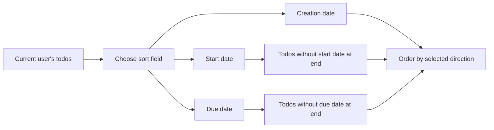

**todoApp — Business rules, validation constraints, data browsing expectations, error scenarios**

Business rules, validation constraints, data browsing expectations, error scenarios

# Domain Business Rules

Per-concept business rules, validation logic, and domain constraints.

## User Rules

Users create an account using an email address and a password, so these values are required to start an account. The email must be valid in the sense that it can reliably identify the user account, and the system should reject submissions that do not meet basic email validity. The password must meet the app’s password requirements so that the account can be created and later used to log in, and weak or empty passwords should be rejected. Each user is uniquely identified by their email, so attempting to create another account with the same email should not be allowed. When a user changes their password, both the current credentials context and the new password must be acceptable, otherwise the change should be denied. Users are also allowed to delete their account, which is treated as a domain action tied to the user rather than a separate kind of content. Deleting an account requires that the request comes from the account owner; attempts by other users should be rejected. After an account is deleted, the user’s ability to use their previous credentials must no longer be available, and any account-linked resources should be treated as removed from the user’s perspective.

### Account Creation Validation

Users can create an account using an email address and a password.

When a user submits an account creation request, the system must validate that the email address can reliably identify the user account.

If the email submission is not valid for reliable identification, the system must reject the account creation request.

When a user submits an account creation request, the system must validate that the submitted password meets the app’s password requirements.

If the password submission is empty, the system must reject the account creation request.

If the password submission does not meet the app’s password requirements, the system must reject the account creation request.

If the email and password are acceptable and the email is not already in use, the system must create the account and allow the user to later use the same credentials for login.

If account creation is rejected, the system must not create or activate the account.

### Email Uniqueness Constraint

Email addresses are unique identifiers for user accounts.

When a user attempts to create a new account using an email address that is already associated with an existing account, the system must reject the request.

When the system rejects an account creation attempt due to email duplication, it must leave the existing account unchanged.

### Password Requirements for Account Access

Passwords used for account access must satisfy the app’s password requirements.

When a user changes their password, both the current credentials context and the new password must be acceptable.

If the current credentials context is not acceptable (meaning it does not correspond to an active account credential state), the system must deny the password change.

If the new password does not meet the app’s password requirements, the system must deny the password change.

When a password change is accepted, the system must ensure that future login using the updated password succeeds for that user, and future login using the previous password fails.

### Password Change Acceptance Rules

When a user requests a password change, the system must accept the request only if the request originates from the account owner and the current credentials context is acceptable.

When the system accepts a password change, the user’s ability to log in with the updated password must be enabled immediately after the change is completed.

When the system denies a password change due to an unacceptable current credentials context, the user’s existing login ability must remain intact (the password must not be altered).

When the system denies a password change due to an unacceptable new password, the user’s existing login ability must remain intact (the password must not be altered).

### Account Deletion Ownership Constraint

Users are allowed to delete their account.

Deleting an account is a domain action tied to the user, and it must require that the request comes from the account owner.

If a non-owner user attempts to delete a different user’s account, the system must reject the request.

When the account owner successfully deletes their account, the system must remove the user’s access to the deleted account, so that the user’s previous credentials can no longer be used to log in.

When the account owner successfully deletes their account, all todos owned by the account owner must be treated as removed from the user’s perspective, including todos in trash.

### Actions Denied for Non-Owners

If a request attempts to perform an account-linked action (such as deleting an account) for an account that does not belong to the requester, the system must deny the action.

For every denied non-owner account-linked action, the system must not expose any details that would reveal whether the target account exists beyond what is necessary to handle the request safely.

For denied non-owner actions, the system must not alter the state of the target account.

## UserProfile Rules

Each user has a private profile that includes a display name. A display name is required for profile completeness, but the system should ensure it is not blank so users don’t end up with an unusable profile. Users can edit their display name, and the updated name must be acceptable under the same basic validation rules as the original value. Because this is a private todo app, profile data must not be exposed across users, meaning the profile belongs to its user and cannot be retrieved or inspected by others. Attempts to access another user’s profile should be refused as a domain constraint, not merely as an interface choice. When a user edits their display name, the system should treat the result as replacing the previous display name, keeping the profile consistent after the change. If a display name update fails validation (for example, it is empty), the system must keep the existing display name unchanged. Overall, the profile rules ensure that every user has a usable display name and that profile visibility remains restricted to the account owner.

### Display Name Validity and Non-Empty Constraint

- Users must have a display name to be considered profile-complete.
- The system must reject any display name value that is empty or blank.
- The system must not allow a user’s profile to end up with an empty display name after an attempted update.
- If a user attempts to update their display name to an empty or blank value, the system must reject the update and keep the existing display name unchanged.

### Display Name Edit Outcome and Replacement Behavior

- When a user updates their display name successfully, the new display name must replace the previous display name.
- After a successful update, viewing the user’s own profile must show the updated display name (defined in [Display Name Validity and Non-Empty Constraint]).
- If the display name update fails validation, the system must keep the existing display name unchanged (defined in [Display Name Validity and Non-Empty Constraint]).

### Ownership-Bound Profile Privacy

- Each user’s profile data is private to that user.
- Users must not be able to view or retrieve another user’s profile display name.
- The system must refuse any attempt to access another user’s profile as a domain constraint (not merely by hiding it in the interface).
- The system must ensure that any profile data shown to a user is always the profile data belonging to that user (ownership-bound profile data).

### Profile Completeness Requirement for Usability

- Because this is a private todo app, the system must ensure every user has a usable, non-empty display name so the user’s profile is complete.
- While a user’s profile display name can be edited, the system must prevent any state where the user’s profile is missing a non-empty display name.

## Todo Rules

Users can create todos that always have a title, and the title is required. When creating a todo, the description is optional and may be left empty, and the system should accept missing descriptions without failing the request. Start date and due date are optional as well; if a user leaves them empty, the todo is still valid and simply has no date value for that attribute. Newly created todos begin in an incomplete state by default, and the completion status must be trackable as part of the todo’s domain state. Users can edit existing todos by updating the title, description, start date, and due date, and any validation that applies to creation rules should also apply to updates. Specifically, the title must remain present after edits, while description and dates may be cleared back to empty. The domain must allow toggling completion status between complete and incomplete, reflecting that the todo can move in both directions over time. When a user views a specific todo, the full description and date information must reflect the current state as validated by these rules. These constraints ensure todos are always meaningful (required title) while still supporting optional context (optional description and dates) and state transitions for completion.

### Required Todo Title

- When creating a todo, the user must provide a title; a missing or empty title is rejected.
- The system must treat the title as required for every todo, so a saved todo always has a non-empty title.
- When editing an existing todo, the user must not be able to remove the title; if an edit would result in a missing or empty title, the request is rejected.
- When viewing a todo’s details, the displayed title must reflect the latest saved title and must always be present (it can never be empty or missing).

### Optional Description Handling

- When creating a todo, the description is optional and may be left empty; a missing description or an empty description must be accepted.
- When editing a todo, the description may be updated to an empty value to clear it; clearing the description is allowed.
- When viewing a todo’s details, if the description was cleared or left empty, the system must show the description as empty (no previous description should be shown).
- When editing a todo, if only the title is changed and the description is not changed, the existing description value must remain as-is.
- If an edit attempt includes a new description value that violates the description’s allowed business constraints (if any are later defined), the system must reject the request and keep the existing description unchanged.

### Optional Start Date Handling

- When creating a todo, the start date is optional and may be left empty; an empty start date is accepted.
- When editing a todo, the start date may be updated and may also be cleared back to empty; clearing the start date is allowed.
- When viewing a todo’s details, if the start date is empty, the system must display start date as not set.
- When editing a todo, if the start date is not changed in the request, the existing start date value must remain as-is.
- If a user attempts to create or edit a todo such that the start date becomes invalid according to the date-validation rules defined for this system (e.g., not a real date), the system must reject the request and keep the existing start date unchanged.

### Optional Due Date Handling

- When creating a todo, the due date is optional and may be left empty; an empty due date is accepted.
- When editing a todo, the due date may be updated and may also be cleared back to empty; clearing the due date is allowed.
- When viewing a todo’s details, if the due date is empty, the system must display due date as not set.
- When editing a todo, if the due date is not changed in the request, the existing due date value must remain as-is.
- If a user attempts to create or edit a todo such that the due date becomes invalid according to the date-validation rules defined for this system (e.g., not a real date), the system must reject the request and keep the existing due date unchanged.

### Incomplete by Default and Completion-State Consistency

- When a todo is created, its completion status must begin as incomplete by default.
- The system must allow a todo to be in either completion state over time: incomplete or complete.
- When viewing a todo in a list or in single-todo details, the completion status shown must match the todo’s current saved completion state.
- When a user marks a todo complete and later marks it incomplete, the system must reflect the change consistently across both the normal list view and the single-todo details view.

### Completion Status Toggle Allowed

- The system must allow the user to change completion status in both directions (incomplete → complete and complete → incomplete).
- Marking a todo as complete must result in that todo being treated as complete for filtering and list display purposes.
- Marking a todo as incomplete must result in that todo being treated as incomplete for filtering and list display purposes.
- If a user attempts to change completion status for a todo that does not belong to them, the request must be rejected (the todo must not change state).
- After a completion status change is accepted, subsequent viewing of that todo must show the updated completion status and must not show stale values.

### Clearable Optional Fields During Editing

- During todo editing, the user must be able to clear the description back to empty; clearing description must be persisted and reflected in subsequent views.
- During todo editing, the user must be able to clear the start date back to empty; clearing start date must be persisted and reflected in subsequent views.
- During todo editing, the user must be able to clear the due date back to empty; clearing due date must be persisted and reflected in subsequent views.
- When a user clears any of these optional fields, the corresponding date/description display must show an empty/not-set value rather than retaining the previous value.
- If an edit request attempts to clear optional fields and simultaneously introduces an invalid mandatory field change (e.g., an invalid/missing title), the system must reject the entire edit and none of the cleared values should be applied.

## TodoHistoryEntry Rules

A todo’s edit history is composed of history entries that capture when edits were made and which properties changed as part of those edits. Each time a user edits a todo, the system records a history entry with the edit timestamp so entries can be ordered from most recent to oldest. For the recorded details, the history entry includes the changed title value only if the title was actually changed during that edit. Likewise, it includes the changed description, start date, and due date values only if those specific parts were modified; if an attribute was not changed, the history entry should not pretend that it changed. This means a history entry must be consistent with the user’s actual edit action, capturing only the deltas rather than duplicating unchanged data. Users can view the full edit history for their todos, and entries must be shown in most recent to oldest order as a domain rule. When a todo is permanently deleted from trash, its edit history is also removed from the user’s view to keep the history consistent with what still exists. If a user makes an edit that results in no meaningful change to the todo’s editable attributes, the system should avoid creating misleading history entries that suggest changes occurred. Overall, history entry rules ensure traceability of what changed, when it changed, and that the history remains accurate and relevant to the current existence of the todo.

### Edit History Entry Creation and Delta Consistency

When a user edits a todo, the system shall create a new edit history entry for that todo.

The edit history entry shall represent only the changes made by that edit, not a copy of the entire todo state.

If the edited action does not change the todo’s title, the history entry shall not record a changed title value.

If the edited action does not change the todo’s description, the history entry shall not record a changed description value.

If the edited action does not change the todo’s start date, the history entry shall not record a changed start date value.

If the edited action does not change the todo’s due date, the history entry shall not record a changed due date value.

If an edit results in no meaningful change to any of the editable todo attributes (title, description, start date, due date), the system shall avoid creating a misleading history entry that suggests changes occurred.

### History Entry Edit Time Recording

Each edit history entry shall include the time when the edit was made.

The recorded edit time shall correspond to the moment the user’s edit is applied, so that ordering and auditability reflect the actual sequence of edits.

### Ordering of Edit History from Most Recent to Oldest

When a user views the edit history of a todo, the system shall display the history entries sorted from most recent to oldest.

The ordering shall be based on the recorded edit time for each history entry, so that later edits appear before earlier edits.

### Recording Changed Title Only When Title Changes

If, and only if, the user changes the todo’s title during the edit, the history entry shall record what the title was changed to.

If the title value after the edit is the same as before the edit, the history entry shall not record a changed title value.

### Recording Changed Description Only When Description Changes

If, and only if, the user changes the todo’s description during the edit, the history entry shall record what the description was changed to.

If the description value after the edit is the same as before the edit, the history entry shall not record a changed description value.

### Recording Changed Start Date and Due Date Only When They Change

If, and only if, the user changes the todo’s start date during the edit, the history entry shall record what the start date was changed to.

If the start date value after the edit is the same as before the edit, the history entry shall not record a changed start date value.

If, and only if, the user changes the todo’s due date during the edit, the history entry shall record what the due date was changed to.

If the due date value after the edit is the same as before the edit, the history entry shall not record a changed due date value.

### Avoiding Misleading Unchanged History Entries

If a user makes an edit attempt where none of the editable attributes (title, description, start date, due date) end up changing, the system shall not create history entries that indicate title, description, start date, or due date changes.

In such a case, the system shall ensure the edit history remains consistent with what actually changed on the todo.

### Permanent Deletion Removes Todo Edit History

When a user permanently deletes a todo from trash, the system shall also permanently remove that todo’s edit history so it no longer appears when viewing the user’s edit history for that todo.

After permanent deletion, the system shall not show the removed history entries anywhere in the user’s views.

# Data Browsing Expectations

Business expectations for how users browse, find, and navigate through lists of data.

## List Browsing Expectations

Define business expectations for how users find, filter, and browse lists.

### Filtering Todos List

Users can filter their todo list by completion status.

Filter options must include exactly these choices: All todos, Only complete todos, Only incomplete todos.

When a user selects “Only complete todos,” the todo list must include only todos marked as complete and owned by that user.

When a user selects “Only incomplete todos,” the todo list must include only todos marked as incomplete and owned by that user.

When a user selects “All todos,” the todo list must include both complete and incomplete todos owned by that user.

If the user changes the completion-status filter, the list results must update to reflect the selected filter.

Filtering must not expose any todos that belong to other users; the results must remain limited to the signed-in user’s own todos.

If the current selected filter cannot be applied because the list context is missing or invalid, the system must reject the request rather than returning an unfiltered or cross-user list.

### Sorting Todos List

Users can sort their todo list by exactly one sort field at a time.

Sorting field options must include exactly these choices: Creation date, Start date, Due date.

For each sorting field, users can choose a sort order among exactly two directions: newest first or oldest first for Creation date, earliest first or latest first for Start date, earliest first or latest first for Due date.

When sorting by Creation date, the system must order todos owned by the signed-in user by their creation date in the selected direction.

When sorting by Start date, todos that do not have a start date must appear at the end of the list regardless of whether the order is earliest first or latest first.

When sorting by Due date, todos that do not have a due date must appear at the end of the list regardless of whether the order is earliest first or latest first.

If two or more todos have the same relevant date value for the selected sort field, the system must still produce a deterministic order for the list so that repeated browsing with the same settings does not reshuffle results unexpectedly.

If the user selects a sorting option that is not recognized, the system must reject the request rather than applying a different default sorting.

Sorting must not expose any todos that belong to other users; the results must remain limited to the signed-in user’s own todos.

Mermaid flowchart summarizing list ordering logic:

### Pagination for Todo Lists

Users can browse their todo lists in pages.

Both the normal todo list and the trash list must be paginated.

For any list view that supports pagination, the system must return only the subset of todos belonging to the signed-in user for that page, based on the current filtering and sorting selections.

When a user changes filtering or sorting, the system must apply the new filter and order before determining which items appear on the requested page.

If the user requests a page number that does not contain any todos for the current filtering and sorting settings, the system must return an empty list for that page rather than returning items from an unrelated page.

If the user requests a page using invalid pagination inputs (such as a non-numeric or otherwise invalid page selection), the system must reject the request.

The pagination must not expose any todos that belong to other users; results must remain limited to the signed-in user’s own todos.

Pagination for list browsing must be stable for the user during a single browsing flow: if the user does not change filtering/sorting and does not perform list-affecting actions, revisiting the same page should show the same set of todos.

# Error Conditions

Business error scenarios and how the system should respond.

## Error Scenarios

Describe error conditions and expected system responses in natural language.

### General Error Handling and Request Rejection

If a user request cannot be completed due to invalid or unacceptable input or due to the requested item not being accessible to the user, the system SHALL reject the request.
If a user request cannot be completed due to an unexpected failure (an exception), the system SHALL reject the request and SHALL not claim success.
When a request is rejected, the system SHALL ensure that no unintended changes are applied to the user’s todos or user profile.
When a request is rejected, the system SHALL keep the existing completion status, title, description, start date, due date, deletion state, and edit history unchanged.
WHEN a user attempts an operation that affects a todo they do not own, the system SHALL reject the request.
WHEN a user attempts an operation on a todo that does not exist, the system SHALL reject the request.

### Todo Creation Failure Cases and Rejection Conditions

WHEN creating a todo, if the title is missing or empty, THE system SHALL reject the request.
WHEN creating a todo, if the due date is provided and the start date is provided, and the due date is earlier than the start date, THE system SHALL reject the request.
WHEN creating a todo with only a due date (start date left empty), THE system SHALL allow creation and treat the start date as not set.
WHEN creating a todo with only a start date (due date left empty), THE system SHALL allow creation and treat the due date as not set.
WHEN creating a todo, the completion status SHALL be set to incomplete by default; if the request is otherwise valid and complete creation succeeds, THE system SHALL persist the todo as incomplete.
If an error occurs while recording creation or initializing the todo’s edit history, THE system SHALL treat the overall creation as a failure-case and SHALL reject the request (exception handling), leaving no partial todo visible in the user’s normal todo list.

### Todo Editing Failure Cases and History Recording Exceptions

WHEN editing a todo, if the user attempts to modify a field other than title, description, start date, or due date, THE system SHALL reject the request.
WHEN editing a todo, if the provided title is missing or empty, THE system SHALL reject the request.
WHEN editing a todo, if the due date is provided and the start date is provided, and the due date is earlier than the start date, THE system SHALL reject the request.
WHEN editing a todo, if the request is valid and the edit succeeds, THE system SHALL record an edit history entry.
WHEN editing a todo and a specific field is not changed, THE system SHALL not record that field as changed in the new history entry.
WHEN editing a todo and a field is changed, THE system SHALL record the updated value for that field in the new history entry.
If an exception occurs while creating the edit history entry for a valid edit, THE system SHALL reject the edit operation and SHALL not apply the edit in a way that would leave the todo content out of sync with its history.

### Todo Completion Toggle Failure Cases

WHEN marking a todo as complete, THE system SHALL change the todo’s completion status from incomplete to complete.
WHEN marking a todo as incomplete, THE system SHALL change the todo’s completion status from complete to incomplete.
WHEN toggling completion status, if the requested todo is deleted (in trash) and the system operation is invoked for the normal todo list context, THE system SHALL reject the request.
If an exception occurs while saving the completion status change, THE system SHALL reject the operation and SHALL leave the completion status unchanged.

### Todo Deletion, Restore, and Permanent Deletion Failure Cases

WHEN deleting a todo, THE system SHALL move the todo into trash (soft delete) so that it no longer appears in the normal todo list.
WHEN restoring a todo from trash, THE system SHALL move the todo back to the normal todo list.
WHEN permanently deleting a todo from trash, THE system SHALL permanently remove the todo so that it no longer appears in either the normal todo list or trash.
WHEN permanently deleting a todo from trash, THE system SHALL permanently delete the todo’s edit history as part of the permanent deletion.
WHEN restoring or permanently deleting a todo, if the todo is not currently in trash, THE system SHALL reject the request.
WHEN deleting a todo that is already in trash, THE system SHALL reject the request.
If an exception occurs during restore, THE system SHALL reject the restore operation and SHALL leave the todo in its previous state (either remaining in trash or remaining in the normal list, depending on where it started).

### Trash and Normal List Browsing Error Scenarios

WHEN requesting the normal todo list, THE system SHALL return only todos owned by the requesting user.
WHEN requesting the trash list, THE system SHALL return only todos that are currently in trash and owned by the requesting user.
WHEN a user applies a filter for completion status, THE system SHALL apply the filter only to that user’s todos and SHALL not include todos from other users.
If a requested filter or sorting option is not recognized, THE system SHALL reject the request.
If pagination parameters are invalid or internally inconsistent, THE system SHALL reject the request.
If an exception occurs while retrieving the list (normal or trash), THE system SHALL reject the list browsing request and SHALL not return a misleading partial dataset labeled as complete.

### Sorting and Date-Based Ordering Exceptions

WHEN sorting by start date, todos without a start date SHALL appear at the end of the result list.
WHEN sorting by due date, todos without a due date SHALL appear at the end of the result list.
If a user requests sorting by start date or due date with invalid sort direction or invalid sort criteria, THE system SHALL reject the request.
If an exception occurs while computing the sorted order (for example, due to inconsistent date values), THE system SHALL reject the sort operation and SHALL not reorder in a way that violates the specified placement rules (unspecified dates at the end).

### Single Todo Viewing and Edit History Viewing Errors

WHEN viewing a single todo, THE system SHALL show the full details of the todo only if it belongs to the requesting user.
WHEN viewing a single todo, if the todo belongs to another user, THE system SHALL reject the request.
WHEN viewing a single todo, if the todo does not exist, THE system SHALL reject the request.
WHEN viewing the edit history of a todo, THE system SHALL show the full edit history only if the todo belongs to the requesting user.
If an exception occurs while retrieving edit history, THE system SHALL reject the history viewing request and SHALL not display an incomplete or incorrectly ordered history.
WHEN displaying edit history entries, THE system SHALL order entries from most recent to oldest.