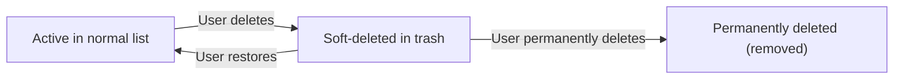

**multiUserTodo — Data ownership, privacy, retention, and recovery policies**

Data ownership, privacy, retention, and recovery policies

# Data Policies

Data ownership, privacy, retention, and recovery policies from a business perspective.

## Data Ownership and Privacy

Define who owns what data, who can access it, and privacy boundaries between users.

### Data Isolation Between Users

Users can only access their own todos; they cannot view, access, or share another user’s todos.

Users’ todo data is completely private from other users, including when todos are deleted and appear in the trash.

Users can only view their own todo list and the contents of a single todo; attempting to access a todo that does not belong to the user results in the system refusing the request.

Users can only view their own trash list and restore or permanently delete todos that they previously deleted.

A user’s profile information is private: users cannot view other users’ profiles.

When listing todos (normal list or trash), the system returns only todos owned by the currently signed-in user.

When viewing a single todo or a todo’s edit history, the system returns only data for a todo owned by the currently signed-in user.

All privacy boundaries apply consistently across normal viewing, filtering, sorting, and pagination for todos.

All privacy boundaries apply consistently across incomplete and complete todos, so other users’ completion states are not visible.

### Ownership of Todo Data

Every todo is owned by the user who created it.

A user can only edit title, description, start date, and due date for todos they own.

A user can only mark a todo as complete or incomplete for todos they own.

A user can only delete todos they own.

If a user deletes their account, all todos owned by that user are permanently deleted as part of the account deletion.

Ownership applies to edit history as well: edit history entries belong to the todo, and a user can only view the edit history for todos they own.

When a deleted todo is restored from the trash, it returns to the normal todo list while remaining owned by the same user who restored it.

### Access Control and Allowed Actions

Only signed-in users can create todos.

Only signed-in users can view their own todos (including filtering, sorting, and paginated lists).

Only signed-in users can view a single todo’s full details, including the full description.

Only signed-in users can mark their own todos complete or incomplete.

Only signed-in users can edit the title, description, start date, and due date of their own todos.

Only signed-in users can view edit history entries for their own todos.

Only signed-in users can delete their own todos.

Only signed-in users can view their own trash list.

Only signed-in users can restore deleted todos that are in their own trash.

Only signed-in users can permanently delete todos from their own trash.

Only signed-in users can permanently delete a todo from the trash, and permanently deleting a todo also permanently deletes its edit history.

### Privacy of User Profile Data

Each user has a display name stored as part of their profile.

Users can view and edit only their own display name.

Users cannot view other users’ profiles, so attempts to access another user’s display name are not allowed.

Changes to a user’s display name apply only to that user’s profile and do not affect other users’ ability to view their own profile data.

Account deletion removes the user account and results in permanent deletion of that user’s todos; other users’ profile data remains unaffected.

## Data Retention and Recovery

Define what happens to deleted data, how long it is retained, and how users can recover it.

### Soft-delete behavior and visibility

### Soft-delete behavior
When a user deletes one of their todos, the todo must be moved out of the user’s normal todo list so it no longer appears in the normal list.

### Trash list inclusion
While a todo is soft-deleted, it must appear in the user’s trash list.

### Ownership persistence
A soft-deleted todo must remain owned by the same user who deleted it, and must remain private to that user.

### Edit-history impact on soft-delete
Soft-deleting a todo must not prevent the user from accessing the todo’s details and edit history when viewing the todo in its current (soft-deleted) context.

### Permanent deletion availability after soft-delete
A soft-deleted todo must remain eligible for permanent deletion from the trash until it has been permanently deleted.

### Retention policy for deleted (soft-deleted) todos

### Retention duration definition
The system must retain soft-deleted todos and their edit history long enough to allow the user to restore them from trash.

### No automatic loss implied
Unless the user permanently deletes the todo, the system must not permanently remove the todo’s edit history solely due to it being in trash.

### Scope of retention
Retention obligations must apply to all soft-deleted todos in the user’s trash, across paginated views.

### Recovery (restore) from trash

### Restore action
When a user restores a todo from the trash, the todo must be returned to the user’s normal todo list and must no longer appear in the trash list.

### Recovery preserves edit history
Restoring a todo must preserve its previously recorded edit history.

### Restore ownership enforcement
A user must only be able to restore todos that are in their own trash; if a todo is not owned by the user, the restore must be rejected.

### Restore consistency with list rules
After restoration, the restored todo must be subject to the user’s normal viewing behaviors (such as pagination and filtering) for normal todos.

### Permanent deletion and edit-history deletion

### Permanent deletion from trash
When a user permanently deletes a todo from the trash, the system must permanently remove that todo so it no longer appears in either the normal todo list or the trash list.

### Permanent deletion deletes edit history
Permanently deleting a todo must also permanently delete its edit history.

### Irrecoverable deletion
After a todo has been permanently deleted, the system must not allow the user to restore it from trash.

### Ownership enforcement for permanent deletion
A user must only be able to permanently delete todos that are in their own trash; if a todo is not owned by the user, the permanent deletion must be rejected.

### Deletion idempotency expectation
If a user attempts to permanently delete a todo that is no longer available in their trash, the system must reject the request because the targeted todo is not found in the user’s trash.

