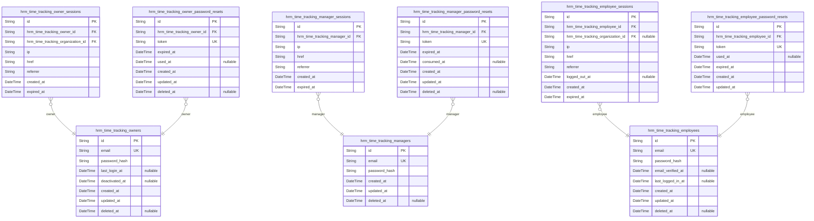
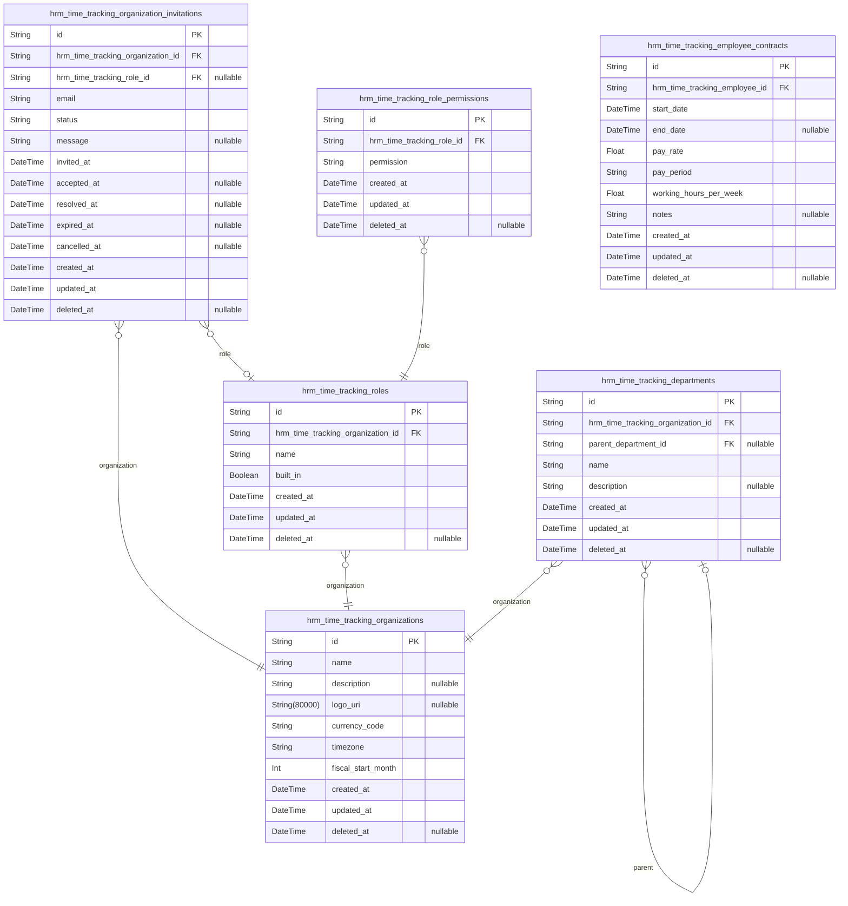
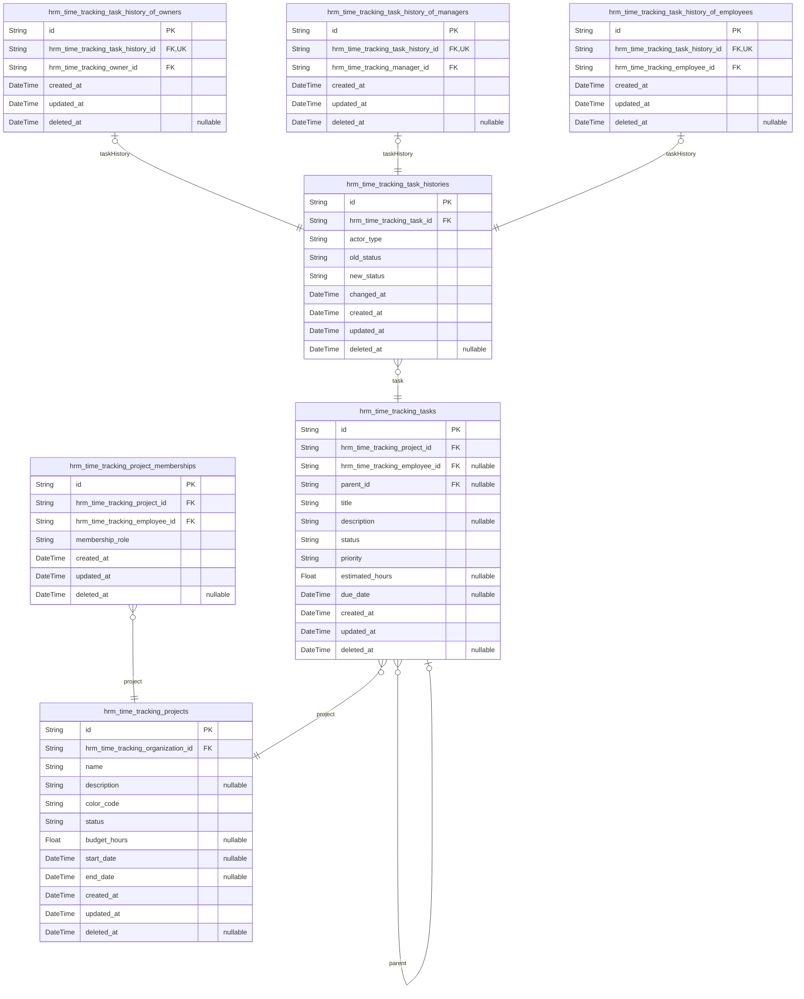
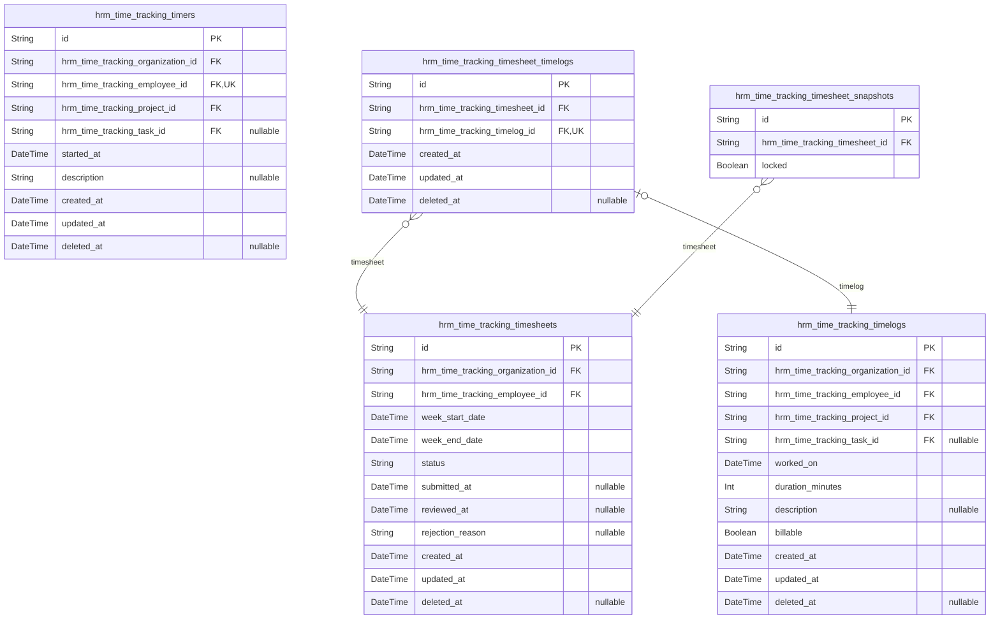

# Prisma Markdown

> Generated by [`prisma-markdown`](https://github.com/samchon/prisma-markdown)

- [Actors](#actors)
- [HumanResources](#humanresources)
- [Projects](#projects)
- [TimeTracking](#timetracking)
- [Insights](#insights)

## Actors

### `hrm_time_tracking_owners`

Organization owner account identities with email/password credentials and
account lifecycle metadata.

This table stores the global authenticated identity for owner actors in
the HRM time tracking platform. It is intentionally limited to credential
and account-state information and does not duplicate organization
membership, workspace selection, or profile presentation data.

Owner-specific login sessions are stored in {@link
hrm_time_tracking_owner_sessions}, and password recovery records are
stored in [hrm_time_tracking_owner_password_resets](#hrm_time_tracking_owner_password_resets).
Organization-scoped workforce and tenant relationships are modeled in
other components rather than this actor table.

Properties as follows:

- `id`: Primary Key.
- `email`: Unique email address used as the owner account login identifier.
- `password_hash`: Hashed password for authenticating the owner account.
- `last_login_at`: Timestamp of the most recent successful login for the owner account.
- `deactivated_at`
  > Timestamp when the owner account was deactivated from active use while
  > preserving historical references.
- `created_at`: Timestamp when the owner account was created.
- `updated_at`: Timestamp when the owner account was last updated.
- `deleted_at`: Timestamp for soft deletion of the owner account.

### `hrm_time_tracking_owner_sessions`

Authentication sessions for organization owner accounts.

This table stores each owner login session together with connection
metadata, expiry time, and the currently selected organization context
used to scope requests in the multi-tenant ERP platform. It belongs to
[hrm_time_tracking_owners](#hrm_time_tracking_owners) and references the active organization
workspace through [hrm_time_tracking_organizations](#hrm_time_tracking_organizations), allowing
owners to work within a selected tenant context during a session.

Properties as follows:

- `id`: Primary Key.
- `hrm_time_tracking_owner_id`: Owner account that owns this session. [hrm_time_tracking_owners.id](#hrm_time_tracking_owners).
- `hrm_time_tracking_organization_id`
  > Currently selected organization context for this session. {@link
  > hrm_time_tracking_organizations.id}.
- `ip`: IP address from which the owner session was established.
- `href`: Application URL associated with the session creation context.
- `referrer`: Referrer URL captured when the session was created.
- `created_at`: Timestamp when the session was created.
- `expired_at`: Timestamp when the session expires and is no longer valid.

### `hrm_time_tracking_owner_password_resets`

One-time password reset requests for organization owner accounts.

This table stores reset tokens issued to [hrm_time_tracking_owners](#hrm_time_tracking_owners)
together with expiration and consumption tracking so password recovery
can be securely validated and audited. Multiple reset requests may exist
for the same owner over time, but each token is unique and may be
consumed only once.

Properties as follows:

- `id`: Primary Key.
- `hrm_time_tracking_owner_id`
  > Owner account that requested the password reset. {@link
  > hrm_time_tracking_owners.id}.
- `token`
  > Unique password reset token issued to validate a password recovery
  > request.
- `expired_at`: Timestamp after which the password reset token is no longer valid.
- `used_at`
  > Timestamp when the password reset token was consumed. Null means the
  > token has not been used yet.
- `created_at`: Timestamp when the password reset request was created.
- `updated_at`: Timestamp when this password reset record was last updated.
- `deleted_at`: Soft deletion timestamp for this password reset record.

### `hrm_time_tracking_managers`

Authenticated manager account records for the HRM time tracking platform.

This actor table stores the login identity and credential state for
manager users who can access organization-scoped management features
through separate session records. It intentionally contains only core
authentication and lifecycle fields, while organization membership,
employee business records, role assignment, profile data, active
organization context, password reset flows, and sessions are handled by
other dedicated tables such as session, human resources, and
profile-related models.

Properties as follows:

- `id`: Primary Key.
- `email`: Unique email address used as the manager account sign-in identifier.
- `password_hash`: Hashed password for authenticating the manager account.
- `created_at`: Timestamp when the manager account was created.
- `updated_at`: Timestamp when the manager account was last updated.
- `deleted_at`
  > Soft deletion timestamp set when the manager account is deleted or
  > deactivated from authentication use.

### `hrm_time_tracking_manager_sessions`

Login session records for authenticated manager accounts.

This table stores connection context and session lifetime information for
[hrm_time_tracking_managers](#hrm_time_tracking_managers) authentication events. Each record
belongs to exactly one manager account and supports auditability and
session expiration handling within the HRM time-tracking platform.

Properties as follows:

- `id`: Primary Key.
- `hrm_time_tracking_manager_id`: Authenticated manager account's [hrm_time_tracking_managers.id](#hrm_time_tracking_managers).
- `ip`: IP address from which the manager session was created.
- `href`: Application URL associated with the session creation request.
- `referrer`: Referrer URL recorded when the manager session was created.
- `created_at`: Timestamp when the manager session was created.
- `expired_at`: Timestamp when the manager session expires and is no longer valid.

### `hrm_time_tracking_manager_password_resets`

One-time password reset requests issued for {@link
hrm_time_tracking_managers} accounts.

This table stores reset token values, expiration timing, and consumption
state for manager password recovery flows. Each record belongs to exactly
one manager account and preserves auditability for issued and consumed
reset requests without duplicating manager identity data.

The model supports secure password reset processing by enforcing unique
token values, tracking expiry deadlines, and recording when a token has
been used. Multiple reset requests may exist for the same manager over
time.

Properties as follows:

- `id`: Primary Key.
- `hrm_time_tracking_manager_id`
  > Manager account that owns this password reset request. {@link
  > hrm_time_tracking_managers.id}.
- `token`
  > Unique password reset token value issued to prove control of the reset
  > flow.
- `expired_at`: Timestamp after which the password reset token is no longer valid.
- `consumed_at`
  > Timestamp when the password reset token was used successfully. Null means
  > the token has not been used yet.
- `created_at`: Timestamp when this password reset request was issued.
- `updated_at`: Timestamp when this password reset record was last updated.
- `deleted_at`: Timestamp for soft deletion of this password reset record.

### `hrm_time_tracking_employees`

Authenticated employee account identities for the HRM time tracking
platform.

This actor table stores the login credentials and global authentication
state used when an employee signs in with email and password. It is the
parent identity record for employee authentication flows and is
referenced by employee session and password reset records.

This table intentionally excludes organization-scoped workforce
attributes such as department, role assignment, employment type, and
employee status because those belong to the human-resources domain model
rather than the authentication boundary. It also excludes active
organization context because that state belongs to session records, not
the root actor identity.

Properties as follows:

- `id`: Primary Key.
- `email`: Unique email address used by the employee to sign in.
- `password_hash`: Hashed password for employee authentication.
- `email_verified_at`: Timestamp when the employee email address was verified.
- `last_logged_in_at`: Timestamp of the employee's most recent successful sign-in.
- `created_at`: Timestamp when this employee account was created.
- `updated_at`: Timestamp when this employee account was last updated.
- `deleted_at`: Soft-delete timestamp for this employee account.

### `hrm_time_tracking_employee_sessions`

Login sessions for authenticated employee accounts.

This table records each employee sign-in event together with connection
metadata, the currently selected organization workspace, session
expiration, and logout state. It belongs to {@link
hrm_time_tracking_employees} and may reference the active organization
context in [hrm_time_tracking_organizations](#hrm_time_tracking_organizations) so multi-organization
users can work within one selected tenant during a session.

The model is used by authentication and authorization flows rather than
standalone business management. Session rows preserve auditability for
login history and support explicit logout control without denormalizing
employee or organization attributes into the session record.

Properties as follows:

- `id`: Primary Key.
- `hrm_time_tracking_employee_id`: Authenticated employee account's [hrm_time_tracking_employees.id](#hrm_time_tracking_employees).
- `hrm_time_tracking_organization_id`
  > Currently selected organization workspace's {@link
  > hrm_time_tracking_organizations.id}.
- `ip`: IP address observed when the employee session was created.
- `href`
  > Application URL from which the employee initiated the authenticated
  > session.
- `referrer`: HTTP referrer captured at login time for audit and security review.
- `logged_out_at`
  > Timestamp when the session was explicitly logged out. Null means the
  > session has not been explicitly terminated yet.
- `created_at`: Timestamp when the employee session was created.
- `expired_at`
  > Timestamp when the employee session becomes invalid and must no longer be
  > accepted.

### `hrm_time_tracking_employee_password_resets`

One-time password reset requests for [hrm_time_tracking_employees](#hrm_time_tracking_employees)
accounts.

This table stores issued reset tokens, their expiration deadlines, and
whether the token has already been consumed. It supports employee account
recovery flows while preserving a historical record of reset issuance and
usage for security review and operational auditing.

Properties as follows:

- `id`: Primary Key.
- `hrm_time_tracking_employee_id`
  > Employee account that owns this reset request. {@link
  > hrm_time_tracking_employees.id}.
- `token`: Unique password reset token issued to prove reset authorization.
- `used_at`
  > Timestamp when the reset token was consumed. Null means the token has not
  > been used yet.
- `expired_at`: Timestamp after which the reset token is no longer valid.
- `created_at`: Timestamp when the password reset request was created.
- `updated_at`: Timestamp when this password reset record was last updated.

## HumanResources

### `hrm_time_tracking_organizations`

Organization tenant records for the multi-tenant HRM and time-tracking
platform.

This table stores the core organization identity and settings used as the
parent scope for workforce administration, projects, time tracking,
reporting, and other organization-isolated business data. Each record
represents one independently operated tenant with its own operational
preferences such as display information, currency, timezone, and fiscal
calendar configuration.

Other organization-scoped tables reference this model as their parent
context, including [hrm_time_tracking_organization_invitations](#hrm_time_tracking_organization_invitations),
[hrm_time_tracking_roles](#hrm_time_tracking_roles), [hrm_time_tracking_departments](#hrm_time_tracking_departments),
[hrm_time_tracking_employees](#hrm_time_tracking_employees), [hrm_time_tracking_projects](#hrm_time_tracking_projects),
[hrm_time_tracking_timelogs](#hrm_time_tracking_timelogs), and {@link
hrm_time_tracking_timesheets}. The table intentionally stores only atomic
tenant settings and avoids denormalized workflow or aggregate data.

Properties as follows:

- `id`: Primary Key.
- `name`
  > Organization name shown throughout the workspace and used to identify the
  > tenant to its members.
- `description`
  > Optional summary describing the organization's purpose, business context,
  > or internal notes for presentation.
- `logo_uri`
  > Optional URI of the organization's logo image used in workspace branding
  > and visual identification.
- `currency_code`
  > Default currency code used by the organization for financial values and
  > compensation display, such as USD, EUR, or KRW.
- `timezone`
  > IANA timezone identifier that defines the organization's local operating
  > time context, such as Asia/Seoul.
- `fiscal_start_month`
  > Month number from 1 to 12 indicating when the organization's fiscal year
  > starts.
- `created_at`: When the organization record was created.
- `updated_at`: When the organization record was last updated.
- `deleted_at`
  > When the organization was soft deleted. Null means the organization is
  > active.

### `hrm_time_tracking_organization_invitations`

Organization-scoped invitation records used to add an existing or future
user to an organization membership flow.

Each record represents one invitation sent to an email address for a
specific organization and optionally preselects the role that should be
assigned when the invitation is accepted. The table preserves invitation
lifecycle state such as pending, accepted, expired, or cancelled without
denormalizing organization or role data.

This model belongs to [hrm_time_tracking_organizations](#hrm_time_tracking_organizations) and may
reference [hrm_time_tracking_roles](#hrm_time_tracking_roles) for the intended
organization-scoped role. It supports administrative invitation lists,
onboarding reconciliation by email, and audit-friendly lifecycle
timestamps.

Properties as follows:

- `id`: Primary Key.
- `hrm_time_tracking_organization_id`: Target organization's [hrm_time_tracking_organizations.id](#hrm_time_tracking_organizations).
- `hrm_time_tracking_role_id`
  > Intended organization role's [hrm_time_tracking_roles.id](#hrm_time_tracking_roles) to assign
  > when the invitation is accepted.
- `email`
  > Invitee email address used to match an existing account or a future
  > signup.
- `status`
  > Invitation lifecycle status such as pending, accepted, expired, or
  > cancelled.
- `message`: Optional invitation message or note shown to the invited person.
- `invited_at`: Timestamp when the invitation was issued to the email address.
- `accepted_at`: Timestamp when the invited user accepted the invitation.
- `resolved_at`
  > Timestamp when the invitation was resolved into a completed organization
  > membership outcome.
- `expired_at`: Timestamp when the invitation expires or was marked expired.
- `cancelled_at`: Timestamp when the invitation was cancelled by an administrator.
- `created_at`: Timestamp when this record was created.
- `updated_at`: Timestamp when this record was last updated.
- `deleted_at`: Timestamp for soft deletion of this invitation record.

### `hrm_time_tracking_roles`

Organization-scoped role definitions used to classify employee authority
within a single tenant organization.

This table stores both built-in roles and custom roles for {@link
hrm_time_tracking_organizations}. It provides the canonical role identity
assigned to workforce records in [hrm_time_tracking_employees](#hrm_time_tracking_employees),
while the normalized permission set for each role is stored separately in
the existing [hrm_time_tracking_role_permissions](#hrm_time_tracking_role_permissions) table. Built-in
roles distinguish platform-defined roles such as Owner, Manager, and
Employee from organization-defined custom roles.

Properties as follows:

- `id`: Primary Key.
- `hrm_time_tracking_organization_id`: Belonged organization's [hrm_time_tracking_organizations.id](#hrm_time_tracking_organizations).
- `name`
  > Display name of the role within the organization, such as Owner, Manager,
  > Employee, or a custom role name.
- `built_in`
  > Whether the role is a platform-provided built-in role rather than an
  > organization-defined custom role.
- `created_at`: When the role record was created.
- `updated_at`: When the role record was last updated.
- `deleted_at`: When the role record was soft deleted, if applicable.

### `hrm_time_tracking_role_permissions`

Normalized permission assignments for organization-scoped roles.

Each record grants one allowed permission code to one {@link
hrm_time_tracking_roles} record, ensuring the role permission set is
stored in First Normal Form rather than as an array or JSON payload.

These rows are managed as supporting configuration data for role
administration within an organization. Organization scope is inherited
through the related role, so this table does not duplicate tenant
identifiers or role metadata.

Properties as follows:

- `id`: Primary Key.
- `hrm_time_tracking_role_id`: Related role's [hrm_time_tracking_roles.id](#hrm_time_tracking_roles).
- `permission`
  > Granted permission code for the related role, such as org:manage,
  > employee:manage, project:view, time:approve, or report:view.
- `created_at`: Timestamp when this permission assignment was created.
- `updated_at`: Timestamp when this permission assignment was last updated.
- `deleted_at`: Timestamp when this permission assignment was soft deleted.

### `hrm_time_tracking_departments`

Organization-scoped departments used to structure employees within a tenant.

Each department belongs to one [hrm_time_tracking_organizations](#hrm_time_tracking_organizations)
record and may optionally reference one parent department to support a
single level of hierarchy. Departments are referenced by employee
workforce records but do not own employee data directly, allowing
employee references to be cleared if a department is removed.

This table stores only raw department attributes and hierarchy linkage,
keeping organization and employee details normalized in their own tables.

Properties as follows:

- `id`: Primary Key.
- `hrm_time_tracking_organization_id`
  > Organization that owns this department. {@link
  > hrm_time_tracking_organizations.id}.
- `parent_department_id`
  > Parent department for one-level hierarchy. {@link
  > hrm_time_tracking_departments.id}.
- `name`: Department name displayed within the organization.
- `description`: Optional explanation of the department's purpose or scope.
- `created_at`: When the department record was created.
- `updated_at`: When the department record was last updated.
- `deleted_at`: When the department was soft deleted, if applicable.

### `hrm_time_tracking_employee_contracts`

Historical employment contract records for workforce members within an
organization.

Each record stores the terms of employment for one employee, including
its effective date range, compensation basis, and expected weekly working
hours. Contracts belong to [hrm_time_tracking_employees](#hrm_time_tracking_employees) and
preserve historical employment terms without duplicating organization or
user identity data.

This table supports current and past contract tracking, including ongoing
contracts with no end date, while leaving overlap and active-contract
exclusivity validation to service logic.

Properties as follows:

- `id`: Primary Key.
- `hrm_time_tracking_employee_id`: Belonged employee's [hrm_time_tracking_employees.id](#hrm_time_tracking_employees).
- `start_date`: Contract effective start date and time boundary.
- `end_date`
  > Contract effective end date and time boundary. Null means the contract is
  > ongoing.
- `pay_rate`: Numeric compensation rate defined by the contract.
- `pay_period`
  > Compensation basis classification such as hourly, daily, weekly, or
  > monthly.
- `working_hours_per_week`: Expected working hours per week defined by the contract.
- `notes`: Optional administrative notes about the contract terms.
- `created_at`: When this contract record was created.
- `updated_at`: When this contract record was last updated.
- `deleted_at`
  > Soft deletion timestamp. Null means the contract record is active in
  > storage.

## Projects

### `hrm_time_tracking_projects`

Projects within an organization, storing the core identity, display
settings, lifecycle state, and optional planning fields used for work
execution.

Each project belongs to exactly one organization through {@link
hrm_time_tracking_organizations.id} and serves as the parent record for
project memberships, tasks, and time-tracking records managed in other
tables. This table stores only normalized source attributes for the
project itself and intentionally excludes derived reporting values such
as actual logged hours or budget utilization percentages.

Properties as follows:

- `id`: Primary Key.
- `hrm_time_tracking_organization_id`
  > Organization that owns this project. {@link
  > hrm_time_tracking_organizations.id}.
- `name`
  > Project name used by organization members to identify and browse the
  > project.
- `description`
  > Optional longer explanation of the project's scope, goals, or internal
  > notes.
- `color_code`
  > Required UI display color code used to visually distinguish the project
  > in the interface.
- `status`
  > Lifecycle status of the project. Allowed business values are active,
  > archived, and completed.
- `budget_hours`: Optional estimated total budgeted hours planned for the project.
- `start_date`: Optional planned or actual project start date.
- `end_date`: Optional planned or actual project end date.
- `created_at`: Timestamp when the project record was created.
- `updated_at`: Timestamp when the project record was last updated.
- `deleted_at`
  > Timestamp for soft deletion when the project is logically removed from
  > active use.

### `hrm_time_tracking_project_memberships`

Project assignment records connecting employees to projects.

This table stores the organization-scoped membership of one employee in
one project through references to [hrm_time_tracking_projects](#hrm_time_tracking_projects) and
[hrm_time_tracking_employees](#hrm_time_tracking_employees). It captures the project-specific
responsibility classification used by the business domain, such as
standard member or project-lead, without duplicating project, employee,
or organization attributes.

Each row represents one unique employee-to-project assignment. Duplicate
assignments for the same employee within the same project are prevented
by a composite unique constraint. Soft deletion allows assignments to be
removed from active use while preserving historical references and
auditability.

Properties as follows:

- `id`: Primary Key.
- `hrm_time_tracking_project_id`: Assigned project's [hrm_time_tracking_projects.id](#hrm_time_tracking_projects).
- `hrm_time_tracking_employee_id`: Assigned employee's [hrm_time_tracking_employees.id](#hrm_time_tracking_employees).
- `membership_role`
  > Project-specific responsibility classification for the assignment, such
  > as member or project-lead.
- `created_at`: When this project membership was created.
- `updated_at`: When this project membership was last updated.
- `deleted_at`: When this project membership was soft deleted, if it is no longer active.

### `hrm_time_tracking_tasks`

Tasks defined within a project and managed as the core unit of work
execution.

Each task belongs to one [hrm_time_tracking_projects](#hrm_time_tracking_projects) record, may
be assigned to one [hrm_time_tracking_employees](#hrm_time_tracking_employees) workforce record,
and may optionally reference one parent task for a single level of
subtask nesting. The table stores the mutable operational state used for
task boards, filtering, sorting, and assignment workflows.

Historical status transitions are preserved separately in {@link
hrm_time_tracking_task_histories}, so this table keeps only the current
task state and raw business attributes without duplicating audit records
or denormalized project or employee data.

Properties as follows:

- `id`: Primary Key.
- `hrm_time_tracking_project_id`: Project containing this task. [hrm_time_tracking_projects.id](#hrm_time_tracking_projects).
- `hrm_time_tracking_employee_id`
  > Employee assigned to perform this task when an assignee has been
  > selected. [hrm_time_tracking_employees.id](#hrm_time_tracking_employees).
- `parent_id`
  > Parent task for one-level subtask nesting. {@link
  > hrm_time_tracking_tasks.id}.
- `title`: Short task title displayed in task lists and project boards.
- `description`: Optional detailed explanation of the work to be completed.
- `status`
  > Current workflow status of the task. Allowed business values are open,
  > in-progress, completed, and closed.
- `priority`
  > Priority classification used for sorting and planning. Allowed business
  > values are low, medium, high, and urgent.
- `estimated_hours`: Optional estimated effort for the task measured in hours.
- `due_date`: Optional deadline for completing the task.
- `created_at`: Timestamp when the task was created.
- `updated_at`: Timestamp when the task was last updated.
- `deleted_at`: Timestamp for soft deletion when the task is removed from active use.

### `hrm_time_tracking_task_histories`

Historical audit records for task status transitions within a project
task lifecycle.

Each row captures one status change event for a single {@link
hrm_time_tracking_tasks} record, including the previous status, the new
status, the actor category that performed the change, and the business
timestamp when the transition occurred. This table is append-oriented and
preserves workflow history without duplicating task, project, or user
profile data.

Concrete actor ownership is intentionally normalized through dedicated
subtype tables rather than multiple nullable foreign keys on this table,
so the status-change actor can be linked to the correct existing actor
model while remaining compliant with the required polymorphic ownership
pattern.

Properties as follows:

- `id`: Primary Key.
- `hrm_time_tracking_task_id`: Task whose status changed. [hrm_time_tracking_tasks.id](#hrm_time_tracking_tasks).
- `actor_type`
  > Category of actor who performed the status change. Expected business
  > values are owner, manager, or employee.
- `old_status`: Task status value before the transition was applied.
- `new_status`: Task status value after the transition was applied.
- `changed_at`: Business timestamp when the task status transition was made.
- `created_at`: Timestamp when this audit record was created.
- `updated_at`: Timestamp when this audit record was last updated.
- `deleted_at`
  > Soft deletion timestamp for this audit record when it is logically
  > removed.

### `hrm_time_tracking_task_history_of_owners`

Subtype record that links a task status history entry to the owner
account that performed the change.

This table normalizes actor ownership for {@link
hrm_time_tracking_task_histories} when the status transition was made by
an owner, avoiding invalid polymorphic nullable foreign keys on the
parent history table. Each row belongs to exactly one task history record
and one existing [hrm_time_tracking_owners](#hrm_time_tracking_owners) account.

The relationship to the task history table is one-to-one so a history
entry can resolve to at most one owner subtype record. The relationship
to the owner table is many-to-one because an owner may author many task
status changes across organizations and projects.

Properties as follows:

- `id`: Primary Key.
- `hrm_time_tracking_task_history_id`
  > Linked task status history record. {@link
  > hrm_time_tracking_task_histories.id}.
- `hrm_time_tracking_owner_id`
  > Owner account that performed the task status change. {@link
  > hrm_time_tracking_owners.id}.
- `created_at`: When this owner subtype link was created.
- `updated_at`: When this owner subtype link was last updated.
- `deleted_at`: When this owner subtype link was soft deleted, if applicable.

### `hrm_time_tracking_task_history_of_managers`

Subtype record that links a task status history entry to the manager
actor who performed the status change.

This table exists to normalize polymorphic actor ownership for {@link
hrm_time_tracking_task_histories} without placing multiple nullable actor
foreign keys on the parent history table. Each row identifies the manager
responsible for a specific task history entry, while manager identity
data remains in [hrm_time_tracking_managers](#hrm_time_tracking_managers) and history event data
remains in [hrm_time_tracking_task_histories](#hrm_time_tracking_task_histories).

A task history entry can have at most one manager subtype row in this
table, making the relationship effectively one-to-one from the history
record to this subtype. A manager can be associated with many task
history subtype rows over time for audit and activity tracing.

Properties as follows:

- `id`: Primary Key.
- `hrm_time_tracking_task_history_id`
  > Referenced task history record's {@link
  > hrm_time_tracking_task_histories.id}.
- `hrm_time_tracking_manager_id`
  > Manager actor who performed the status change. {@link
  > hrm_time_tracking_managers.id}.
- `created_at`: Timestamp when this subtype link was created.
- `updated_at`: Timestamp when this subtype link was last updated.
- `deleted_at`: Timestamp for soft deletion when this subtype link is no longer active.

### `hrm_time_tracking_task_history_of_employees`

Employee subtype ownership record for a task history entry.

This table implements the normalized polymorphic actor pattern for {@link
hrm_time_tracking_task_histories} when the status change was performed by
an [hrm_time_tracking_employees](#hrm_time_tracking_employees) actor. Each record belongs to
exactly one task history entry and exactly one employee account, allowing
the parent history table to avoid multiple nullable actor foreign keys
while preserving clear audit ownership.

Properties as follows:

- `id`: Primary Key.
- `hrm_time_tracking_task_history_id`: Parent task history record. [hrm_time_tracking_task_histories.id](#hrm_time_tracking_task_histories).
- `hrm_time_tracking_employee_id`
  > Employee actor who performed the task status change. {@link
  > hrm_time_tracking_employees.id}.
- `created_at`: Timestamp when this employee task-history subtype record was created.
- `updated_at`: Timestamp when this employee task-history subtype record was last updated.
- `deleted_at`: Soft deletion timestamp for this employee task-history subtype record.

## TimeTracking

### `hrm_time_tracking_timers`

Live running timers for employees before they are converted into
finalized timelog entries.

Each record represents the employee's current active timer within one
organization context, linked to the selected project and optionally to a
task in that project. The timer stores mutable working notes while it is
running and persists until the employee stops it to create a timelog or
discards it without conversion.

This table keeps only operational live-timer state and avoids storing
calculated duration or denormalized project, task, or employee details.
It references [hrm_time_tracking_organizations.id](#hrm_time_tracking_organizations), {@link
hrm_time_tracking_employees.id}, [hrm_time_tracking_projects.id](#hrm_time_tracking_projects),
and optionally [hrm_time_tracking_tasks.id](#hrm_time_tracking_tasks).

Properties as follows:

- `id`: Primary Key.
- `hrm_time_tracking_organization_id`
  > Organization that owns this running timer. {@link
  > hrm_time_tracking_organizations.id}.
- `hrm_time_tracking_employee_id`
  > Employee who currently owns and runs this timer. {@link
  > hrm_time_tracking_employees.id}.
- `hrm_time_tracking_project_id`
  > Project selected for the running timer. {@link
  > hrm_time_tracking_projects.id}.
- `hrm_time_tracking_task_id`
  > Optional task selected for the running timer. {@link
  > hrm_time_tracking_tasks.id}.
- `started_at`: Timestamp when the timer started running.
- `description`
  > Optional mutable work note describing what the employee is currently
  > doing.
- `created_at`: Timestamp when this timer record was created.
- `updated_at`: Timestamp when this timer record was last updated.
- `deleted_at`: Soft deletion timestamp for discarded or otherwise removed timer records.

### `hrm_time_tracking_timelogs`

Historical time entries recorded by employees within an organization.

This table stores raw time tracking records for work performed on a
specific date, including the employee who logged the time, the
organization context, the related project, and an optional task. It
preserves transactional work history used by weekly timesheets,
reporting, dashboards, and audit-oriented lifecycle rules.

Timelogs remain as historical records even when an employee is
deactivated or a project later changes lifecycle state. Inclusion in a
timesheet is managed through a separate normalized association table
rather than a direct nullable foreign key on this model. Related entities
include [hrm_time_tracking_organizations.id](#hrm_time_tracking_organizations), {@link
hrm_time_tracking_employees.id}, [hrm_time_tracking_projects.id](#hrm_time_tracking_projects),
and [hrm_time_tracking_tasks.id](#hrm_time_tracking_tasks).

Properties as follows:

- `id`: Primary Key.
- `hrm_time_tracking_organization_id`
  > Organization context that owns this timelog. {@link
  > hrm_time_tracking_organizations.id}.
- `hrm_time_tracking_employee_id`
  > Employee who logged this time entry. {@link
  > hrm_time_tracking_employees.id}.
- `hrm_time_tracking_project_id`
  > Project to which the logged work belongs. {@link
  > hrm_time_tracking_projects.id}.
- `hrm_time_tracking_task_id`
  > Optional task within the selected project that this work entry relates
  > to. [hrm_time_tracking_tasks.id](#hrm_time_tracking_tasks).
- `worked_on`: Calendar date for which the time was logged.
- `duration_minutes`: Recorded work duration in whole minutes for this timelog entry.
- `description`: Optional employee-entered note describing what work was performed.
- `billable`
  > Whether the logged time is billable. Default behavior is true at the
  > application layer.
- `created_at`: When this timelog record was created.
- `updated_at`: When this timelog record was last updated.
- `deleted_at`: Soft deletion timestamp for this timelog record.

### `hrm_time_tracking_timesheets`

Weekly timesheet records owned by an organization employee for a
Monday-to-Sunday reporting period.

This table stores the workflow state of a timesheet, including draft,
submission, approval, rejection, and review timestamps, while the
included timelogs are normalized through {@link
hrm_time_tracking_timesheet_timelogs}. It belongs to one organization and
one workforce employee record so all access remains organization-scoped.

Calculated totals such as total hours are intentionally not stored in
this regular table and should be derived from linked timelog records.
Historical approval and rejection trail preservation is handled by {@link
hrm_time_tracking_timesheet_snapshots}.

Properties as follows:

- `id`: Primary Key.
- `hrm_time_tracking_organization_id`
  > Organization context of this timesheet. {@link
  > hrm_time_tracking_organizations.id}.
- `hrm_time_tracking_employee_id`: Employee who owns this timesheet. [hrm_time_tracking_employees.id](#hrm_time_tracking_employees).
- `week_start_date`
  > Start datetime of the reporting week for this timesheet, representing the
  > Monday boundary of the covered week.
- `week_end_date`
  > End datetime of the reporting week for this timesheet, representing the
  > Sunday boundary of the covered week.
- `status`
  > Workflow status of the timesheet. Allowed business values are draft,
  > submitted, approved, and rejected.
- `submitted_at`: Timestamp when the employee submitted the timesheet for approval.
- `reviewed_at`: Timestamp when the submitted timesheet was approved or rejected.
- `rejection_reason`
  > Reason provided when a submitted timesheet is rejected. It must be
  > present only for rejected workflow outcomes.
- `created_at`: Timestamp when this timesheet record was created.
- `updated_at`: Timestamp when this timesheet record was last updated.
- `deleted_at`
  > Soft deletion timestamp. Null means the timesheet remains active in the
  > system.

### `hrm_time_tracking_timesheet_timelogs`

Explicit inclusion records that attach individual timelogs to a weekly
timesheet.

This subsidiary table normalizes the timesheet composition workflow by
storing one row for each timelog included in a specific {@link
hrm_time_tracking_timesheets}. It supports draft timesheet add and remove
operations without storing arrays or denormalized aggregates on the
parent timesheet.

Each included [hrm_time_tracking_timelogs](#hrm_time_tracking_timelogs) can belong to at most
one timesheet at a time, which preserves the business rule that a timelog
is included in one weekly submission context. Historical locking and
approval audit behavior is handled by the parent timesheet and snapshot
workflow rather than duplicating status data here.

Properties as follows:

- `id`: Primary Key.
- `hrm_time_tracking_timesheet_id`: Included timesheet's [hrm_time_tracking_timesheets.id](#hrm_time_tracking_timesheets).
- `hrm_time_tracking_timelog_id`: Included timelog's [hrm_time_tracking_timelogs.id](#hrm_time_tracking_timelogs).
- `created_at`: When this timelog was added to the timesheet composition.
- `updated_at`: When this inclusion record was last updated.
- `deleted_at`
  > When this inclusion record was soft deleted after being removed from a
  > draft timesheet.

### `hrm_time_tracking_timesheet_snapshots`

Point-in-time child snapshot records for timesheets.

This table stores snapshot-specific state that belongs to a historical
capture event for one source timesheet in {@link
hrm_time_tracking_timesheets}. It is intentionally normalized to avoid
duplicating fields that already exist on the parent timesheet row and
should be accessed through the parent relationship.

Each snapshot record preserves whether the timesheet was locked at the
time of capture, supporting workflow audit interpretation without
introducing redundant copies of parent timesheet attributes.

Properties as follows:

- `id`: Primary Key.
- `hrm_time_tracking_timesheet_id`: Source timesheet's [hrm_time_tracking_timesheets.id](#hrm_time_tracking_timesheets).
- `locked`
  > Whether the source timesheet was locked against modification at the
  > moment this snapshot record was captured.

## Insights

```mermaid
erDiagram
"hrm_time_tracking_activity_logs" {
  String id PK
  String hrm_time_tracking_organization_id FK
  String actor_type
  String action_type
  String target_entity
  String target_entity_id "nullable"
  String details "nullable"
  DateTime created_at
  DateTime updated_at
  DateTime deleted_at "nullable"
}
"hrm_time_tracking_reports" {
  String id PK
  String hrm_time_tracking_organization_id FK
  String name
  String report_type
  DateTime range_start_date "nullable"
  DateTime range_end_date "nullable"
  String group_by "nullable"
  Boolean billable_only "nullable"
  Boolean include_non_billable "nullable"
  DateTime created_at
  DateTime updated_at
  DateTime deleted_at "nullable"
}
"hrm_time_tracking_report_snapshots" {
  String id PK
  String hrm_time_tracking_report_id FK
  String(80000) output_uri
  String output_format
  DateTime period_start
  DateTime period_end
  Int row_count "nullable"
  DateTime generated_at
  DateTime created_at
  DateTime updated_at
  DateTime deleted_at "nullable"
}
"hrm_time_tracking_organization_weekly_summaries" {
  String id PK
  String hrm_time_tracking_organization_id FK
  DateTime week_start_date
  DateTime week_end_date
  Float total_logged_hours
  Int pending_timesheet_count
  Int active_employee_count
  Int budget_alert_count
  DateTime created_at
  DateTime updated_at
  DateTime deleted_at "nullable"
}
"hrm_time_tracking_employee_weekly_summaries" {
  String id PK
  String hrm_time_tracking_employee_id FK
  DateTime week_start_date
  DateTime week_end_date
  Int total_minutes_logged
  String current_timesheet_status "nullable"
  Boolean active_timer_running
  Int assigned_open_task_count
  Int assigned_in_progress_task_count
  DateTime created_at
  DateTime updated_at
  DateTime deleted_at "nullable"
}
"hrm_time_tracking_project_budget_alerts" {
  String id PK
  String hrm_time_tracking_organization_id FK
  String hrm_time_tracking_project_id FK
  DateTime week_start_date
  DateTime week_end_date
  Float actual_hours
  Float utilization_rate
  Float threshold_rate
  Boolean is_alert
  DateTime created_at
  DateTime updated_at
  DateTime deleted_at "nullable"
}
"hrm_time_tracking_activity_log_of_owners" {
  String id PK
  String hrm_time_tracking_activity_log_id FK,UK
  String hrm_time_tracking_owner_id FK
  DateTime created_at
  DateTime updated_at
  DateTime deleted_at "nullable"
}
"hrm_time_tracking_activity_log_of_managers" {
  String id PK
  String hrm_time_tracking_activity_log_id FK,UK
  String hrm_time_tracking_manager_id FK
  DateTime created_at
  DateTime updated_at
  DateTime deleted_at "nullable"
}
"hrm_time_tracking_activity_log_of_employees" {
  String id PK
  String hrm_time_tracking_activity_log_id FK,UK
  String hrm_time_tracking_employee_id FK
  DateTime created_at
  DateTime updated_at
  DateTime deleted_at "nullable"
}
"hrm_time_tracking_report_employee_filters" {
  String id PK
  String hrm_time_tracking_report_id FK
  String hrm_time_tracking_employee_id FK
}
"hrm_time_tracking_report_project_filters" {
  String id PK
  String hrm_time_tracking_report_id FK
  String hrm_time_tracking_project_id FK
  DateTime created_at
  DateTime updated_at
  DateTime deleted_at "nullable"
}
"hrm_time_tracking_report_task_filters" {
  String id PK
  String hrm_time_tracking_report_id FK
  String hrm_time_tracking_task_id FK
  DateTime created_at
  DateTime updated_at
  DateTime deleted_at "nullable"
}
"hrm_time_tracking_report_snapshots" }o--|| "hrm_time_tracking_reports" : report
"hrm_time_tracking_activity_log_of_owners" |o--|| "hrm_time_tracking_activity_logs" : activityLog
"hrm_time_tracking_activity_log_of_managers" |o--|| "hrm_time_tracking_activity_logs" : activityLog
"hrm_time_tracking_activity_log_of_employees" |o--|| "hrm_time_tracking_activity_logs" : activityLog
"hrm_time_tracking_report_employee_filters" }o--|| "hrm_time_tracking_reports" : report
"hrm_time_tracking_report_project_filters" }o--|| "hrm_time_tracking_reports" : report
"hrm_time_tracking_report_task_filters" }o--|| "hrm_time_tracking_reports" : report
```

### `hrm_time_tracking_activity_logs`

Organization-scoped audit trail entries for significant business actions.

This table records append-oriented activity events such as employee
invitations, contract changes, project lifecycle changes, task status
changes, timesheet review actions, and role assignment changes within one
organization. Each entry stores the common event payload, identifies the
actor category that performed the action, and preserves generic target
entity references so the audit trail can cover multiple business domains
without denormalizing source records.

The table belongs to one organization through {@link
hrm_time_tracking_organizations.id}. Actor-specific ownership is
intentionally normalized through dedicated subtype tables rather than
multiple nullable foreign keys on this model, enabling strict polymorphic
linkage for owner, manager, and employee actors while keeping this main
audit record reusable across all action categories.

Properties as follows:

- `id`: Primary Key.
- `hrm_time_tracking_organization_id`
  > Organization that owns this audit entry. {@link
  > hrm_time_tracking_organizations.id}.
- `actor_type`
  > Category of authenticated actor who performed the action, such as owner,
  > manager, or employee.
- `action_type`
  > Business action classification recorded by the audit trail, such as
  > employee_invited, timesheet_approved, or project_archived.
- `target_entity`
  > Business entity type affected by the action, such as employee, contract,
  > project, task, timesheet, or role.
- `target_entity_id`
  > Identifier of the affected target record when the audited action points
  > to a specific persisted entity.
- `details`
  > Human-readable structured detail text describing the action context,
  > notable field changes, or review rationale.
- `created_at`: Timestamp when the audited action occurred and the log entry was recorded.
- `updated_at`
  > Timestamp when this audit log record was last updated by internal
  > maintenance processes.
- `deleted_at`
  > Soft deletion timestamp for the audit log entry when hidden from active
  > browsing without physical removal.

### `hrm_time_tracking_reports`

Saved organization-scoped report definitions for reusable analytical views.

This table stores the stable configuration of a report, such as its
report family, optional date scope, grouping mode, and single-value
filter toggles. It belongs to one organization through {@link
hrm_time_tracking_organizations.id} and acts as the parent definition for
generated historical outputs in {@link
hrm_time_tracking_report_snapshots}.

The model intentionally stores only atomic configuration fields.
Repeating filter selections such as multiple employees, projects, or
tasks are normalized into child tables so report definitions remain in
Third Normal Form and can be reused consistently over time.

Properties as follows:

- `id`: Primary Key.
- `hrm_time_tracking_organization_id`: Owning organization's [hrm_time_tracking_organizations.id](#hrm_time_tracking_organizations).
- `name`: Human-readable name of the saved report definition.
- `report_type`
  > Type of saved report definition, such as time_report,
  > project_budget_report, or weekly_summary_report.
- `range_start_date`
  > Inclusive start of the saved reporting period when the report is
  > constrained by a date range.
- `range_end_date`
  > Inclusive end of the saved reporting period when the report is
  > constrained by a date range.
- `group_by`
  > Grouping dimension used by grouped reports, such as employee, project,
  > task, or week.
- `billable_only`: Whether the saved report filters results to billable records only.
- `include_non_billable`
  > Whether non-billable records are included when the report supports
  > billable breakdowns.
- `created_at`: When this saved report definition was created.
- `updated_at`: When this saved report definition was last updated.
- `deleted_at`: When this saved report definition was soft deleted.

### `hrm_time_tracking_report_snapshots`

Point-in-time persisted outputs of generated reports.

Each record captures an immutable generated artifact for one saved report
definition in [hrm_time_tracking_reports](#hrm_time_tracking_reports), allowing historical
report results to remain reproducible even after underlying operational
data changes. The table stores output metadata, covered reporting period
boundaries, and generation timing rather than duplicating source business
data.

This model is designed as an append-oriented historical store for
analytical artifacts. Multiple snapshots may exist for the same report
over time, supporting report history, auditability, and later retrieval
of previously generated outputs.

Properties as follows:

- `id`: Primary Key.
- `hrm_time_tracking_report_id`: Saved report definition's [hrm_time_tracking_reports.id](#hrm_time_tracking_reports).
- `output_uri`: Stored location of the generated report artifact for later retrieval.
- `output_format`
  > Serialization or export format of the generated report artifact, such as
  > csv, xlsx, or pdf.
- `period_start`
  > Inclusive start timestamp of the reporting period covered by this
  > generated snapshot.
- `period_end`
  > Inclusive end timestamp of the reporting period covered by this generated
  > snapshot.
- `row_count`
  > Number of result rows contained in the generated report output when the
  > format exposes tabular rows.
- `generated_at`: Timestamp when the report output was generated and persisted.
- `created_at`: Timestamp when this snapshot record was created.
- `updated_at`: Timestamp when this snapshot metadata was last updated.
- `deleted_at`
  > Soft deletion timestamp for the snapshot record when it is removed from
  > active visibility.

### `hrm_time_tracking_organization_weekly_summaries`

Derived weekly organization summary records for dashboard and reporting use.

Each record stores precomputed organization-scoped metrics for a single
Monday-to-Sunday week, such as total logged hours, pending timesheet
count, active employee count, and project budget alert count. The table
belongs to [hrm_time_tracking_organizations](#hrm_time_tracking_organizations) and supports efficient
retrieval of weekly insight data without denormalizing detailed
transactional rows from timelogs, timesheets, employees, or projects.

This table is a system-managed analytical support structure rather than a
user-managed operational entity. It preserves historical weekly
aggregates even as underlying operational data evolves, which helps keep
dashboard and report outputs reproducible for prior weeks.

Properties as follows:

- `id`: Primary Key.
- `hrm_time_tracking_organization_id`
  > Organization owning this weekly summary record. {@link
  > hrm_time_tracking_organizations.id}.
- `week_start_date`
  > Inclusive start timestamp of the summarized week, aligned to Monday in
  > the organization's reporting context.
- `week_end_date`
  > Inclusive end timestamp of the summarized week, aligned to Sunday in the
  > organization's reporting context.
- `total_logged_hours`: Total hours logged across the organization during the summarized week.
- `pending_timesheet_count`
  > Number of submitted timesheets in the organization that are still
  > awaiting approval for the summarized week.
- `active_employee_count`: Number of active employees in the organization during the summarized week.
- `budget_alert_count`
  > Number of projects whose budget utilization exceeded the dashboard alert
  > threshold during the summarized week.
- `created_at`: When this weekly summary record was first generated.
- `updated_at`: When this weekly summary record was last refreshed.
- `deleted_at`: Soft deletion timestamp for this weekly summary record.

### `hrm_time_tracking_employee_weekly_summaries`

Derived weekly summary record for one employee.

This table persists dashboard-oriented weekly aggregates and status
snapshots for a Monday-to-Sunday period, such as total time logged,
current timesheet state, active timer presence, and assigned task counts.
It references the owning employee and avoids duplicating parent employee
attributes that can be resolved through {@link
hrm_time_tracking_employees}.

The record is intended for efficient employee dashboard retrieval and
weekly insight queries in the Insights component. Values are recalculated
from operational tables and should be treated as derived summary data
rather than authoritative workflow state.

Properties as follows:

- `id`: Primary Key.
- `hrm_time_tracking_employee_id`
  > Employee whose weekly dashboard summary is represented. {@link
  > hrm_time_tracking_employees.id}.
- `week_start_date`
  > Inclusive start timestamp of the summary week, aligned to Monday in the
  > employee's organization business calendar.
- `week_end_date`
  > Inclusive end timestamp of the summary week, aligned to Sunday in the
  > employee's organization business calendar.
- `total_minutes_logged`
  > Total minutes logged by the employee during the summarized week across
  > included timelogs.
- `current_timesheet_status`
  > Current timesheet status for the summarized week when a weekly timesheet
  > exists, such as draft, submitted, approved, or rejected.
- `active_timer_running`
  > Whether the employee has an active running timer at the moment this
  > summary row was last refreshed.
- `assigned_open_task_count`
  > Number of open tasks assigned to the employee that are relevant to the
  > dashboard during the summarized week.
- `assigned_in_progress_task_count`
  > Number of in-progress tasks assigned to the employee that are relevant to
  > the dashboard during the summarized week.
- `created_at`: Timestamp when this derived summary record was first created.
- `updated_at`
  > Timestamp when this derived summary record was last refreshed from source
  > operational data.
- `deleted_at`
  > Soft deletion timestamp for lifecycle control when a derived summary
  > record is retired.

### `hrm_time_tracking_project_budget_alerts`

Derived budget alert records for organization dashboard insight.

Each record captures a project's budget-consumption state for a specific
weekly summary window so dashboard queries can quickly identify projects
whose logged hours have crossed an alert threshold such as 80 percent.
The table references the owning organization and project without
duplicating project master data, preserving normalization while
supporting reproducible historical dashboard views.

Properties as follows:

- `id`: Primary Key.
- `hrm_time_tracking_organization_id`: Owning organization's [hrm_time_tracking_organizations.id](#hrm_time_tracking_organizations).
- `hrm_time_tracking_project_id`: Alerted project's [hrm_time_tracking_projects.id](#hrm_time_tracking_projects).
- `week_start_date`
  > Start date and time of the summarized week window represented by this
  > alert record.
- `week_end_date`
  > End date and time of the summarized week window represented by this alert
  > record.
- `actual_hours`
  > Actual accumulated logged hours considered in the budget-consumption
  > calculation for this alert record.
- `utilization_rate`
  > Computed ratio of actual hours to the project's configured budget hours
  > for this alert record.
- `threshold_rate`
  > Alert threshold ratio applied when determining whether the project should
  > appear in the dashboard alert set.
- `is_alert`
  > Whether the project met or exceeded the configured alert threshold for
  > this summary window.
- `created_at`: When this derived alert record was created.
- `updated_at`: When this derived alert record was last refreshed.
- `deleted_at`
  > When this derived alert record was soft deleted, if it has been removed
  > from active summaries.

### `hrm_time_tracking_activity_log_of_owners`

Normalized owner-actor subtype for activity log entries.

This table links one [hrm_time_tracking_activity_logs](#hrm_time_tracking_activity_logs) record to
the [hrm_time_tracking_owners](#hrm_time_tracking_owners) account that performed the logged
action when the actor type is owner. It implements the required
polymorphic actor ownership pattern in normalized form, avoiding multiple
nullable actor foreign keys on the parent activity log.

Each row represents exactly one owner-backed attribution for one activity
log entry and is managed as a dependent record of the parent audit event.

Properties as follows:

- `id`: Primary Key.
- `hrm_time_tracking_activity_log_id`: Referenced activity log entry. [hrm_time_tracking_activity_logs.id](#hrm_time_tracking_activity_logs).
- `hrm_time_tracking_owner_id`
  > Owner account that performed the logged action. {@link
  > hrm_time_tracking_owners.id}.
- `created_at`: Timestamp when this owner attribution record was created.
- `updated_at`: Timestamp when this owner attribution record was last updated.
- `deleted_at`: Soft deletion timestamp for this owner attribution record.

### `hrm_time_tracking_activity_log_of_managers`

Normalized manager-actor subtype for an activity log entry.

This table links one [hrm_time_tracking_activity_logs](#hrm_time_tracking_activity_logs) record to
the manager account in [hrm_time_tracking_managers](#hrm_time_tracking_managers) that performed
the logged action. It exists to preserve normalized polymorphic actor
ownership for activity logs without placing multiple nullable actor
foreign keys on the parent audit table.

Each row belongs to exactly one activity log entry and exactly one
manager account. The activity log reference is unique so an activity log
can have at most one manager subtype row in this ownership branch.

Properties as follows:

- `id`: Primary Key.
- `hrm_time_tracking_activity_log_id`: Referenced activity log entry. [hrm_time_tracking_activity_logs.id](#hrm_time_tracking_activity_logs).
- `hrm_time_tracking_manager_id`
  > Manager account that performed the logged action. {@link
  > hrm_time_tracking_managers.id}.
- `created_at`: Timestamp when this manager activity-log ownership link was created.
- `updated_at`: Timestamp when this manager activity-log ownership link was last updated.
- `deleted_at`: Soft deletion timestamp for this manager activity-log ownership link.

### `hrm_time_tracking_activity_log_of_employees`

Subtype table linking an activity log entry to the employee actor account
that performed the recorded action.

This table implements the normalized polymorphic actor pattern for {@link
hrm_time_tracking_activity_logs} by storing the employee-specific
ownership branch in a separate dependent record instead of using multiple
nullable actor foreign keys on the parent activity log.

Each row belongs to exactly one activity log entry and one employee actor
account from [hrm_time_tracking_employees](#hrm_time_tracking_employees). The unique link to the
activity log enforces that a given log entry can have at most one
employee-actor subtype record.

Properties as follows:

- `id`: Primary Key.
- `hrm_time_tracking_activity_log_id`: Referenced activity log entry. [hrm_time_tracking_activity_logs.id](#hrm_time_tracking_activity_logs).
- `hrm_time_tracking_employee_id`
  > Employee actor account that performed the logged action. {@link
  > hrm_time_tracking_employees.id}.
- `created_at`: Timestamp when this employee-actor subtype link was created.
- `updated_at`: Timestamp when this employee-actor subtype link was last updated.
- `deleted_at`: Soft deletion timestamp for the subtype link when it is logically removed.

### `hrm_time_tracking_report_employee_filters`

Normalized employee filter selections attached to a saved report definition.

Each row records exactly one employee included in the filter criteria of
a specific [hrm_time_tracking_reports](#hrm_time_tracking_reports) record, allowing report
definitions to target selected employees without storing arrays or
serialized filter payloads.

This table references the organization-scoped workforce entity {@link
hrm_time_tracking_employees} and is managed through its parent report
rather than as an independently administered business object.

Properties as follows:

- `id`: Primary Key.
- `hrm_time_tracking_report_id`: Saved report definition's [hrm_time_tracking_reports.id](#hrm_time_tracking_reports).
- `hrm_time_tracking_employee_id`: Selected employee filter's [hrm_time_tracking_employees.id](#hrm_time_tracking_employees).

### `hrm_time_tracking_report_project_filters`

Normalized project filter selections for a saved report definition.

Each row links one saved report in [hrm_time_tracking_reports](#hrm_time_tracking_reports) to
one selected project in [hrm_time_tracking_projects](#hrm_time_tracking_projects), allowing
reports to persist multi-project filtering without storing arrays or
serialized values. This table is organization-scoped indirectly through
its parent report and preserves normalized analytical filter
configuration for reproducible reporting.

Properties as follows:

- `id`: Primary Key.
- `hrm_time_tracking_report_id`: Saved report definition's [hrm_time_tracking_reports.id](#hrm_time_tracking_reports).
- `hrm_time_tracking_project_id`: Selected project's [hrm_time_tracking_projects.id](#hrm_time_tracking_projects).
- `created_at`: When this project filter selection was created.
- `updated_at`: When this project filter selection was last updated.
- `deleted_at`
  > When this project filter selection was soft deleted, if removed from the
  > saved report.

### `hrm_time_tracking_report_task_filters`

Normalized task filter selections attached to a saved report definition.

Each row stores one selected task used to constrain a report's analytical
scope, allowing report filters to remain fully normalized instead of
storing task identifiers in arrays or serialized text.

This table belongs to [hrm_time_tracking_reports](#hrm_time_tracking_reports) and references
one task from [hrm_time_tracking_tasks](#hrm_time_tracking_tasks). Duplicate task selections
within the same report are prevented by a composite unique constraint.

Properties as follows:

- `id`: Primary Key.
- `hrm_time_tracking_report_id`: Owning saved report's [hrm_time_tracking_reports.id](#hrm_time_tracking_reports).
- `hrm_time_tracking_task_id`: Selected task's [hrm_time_tracking_tasks.id](#hrm_time_tracking_tasks).
- `created_at`: Timestamp when this task filter selection was created.
- `updated_at`: Timestamp when this task filter selection was last updated.
- `deleted_at`: Timestamp when this task filter selection was soft deleted.
