**hrmTimeTracking — Actor definitions, permission matrix, authentication, session, account lifecycle**

Actor definitions, permission matrix, authentication, session, account lifecycle

# Actor Definitions

Define all user actor types with their identity, permissions, and access boundaries.

## owner Actor

The owner is the highest-authority actor within an organization. This role is built in for every organization and cannot be deleted. An owner has full access to all platform features available inside that organization. The owner is the actor with authority over role management and member management for that organization. The owner can define custom roles and control how permissions are assigned across employees. The owner’s authority applies only within the organization where the role is held, not across every organization the user may belong to. A user may be an owner in one organization and hold a different role in another organization. Ownership also creates special account boundary rules, because a user who is the sole owner cannot remove their account until ownership is transferred or the organization is deleted. Within the built-in role hierarchy, the owner stands above manager and employee.

### Built-in Role and Hierarchy Position

The owner is a built-in role in every organization.

This role cannot be deleted from the organization’s role set.

Within the built-in role hierarchy, the owner is the highest-authority role in that organization.

The owner stands above the manager role and the employee role for organization permissions and access decisions.

A user who holds the owner role is recognized by the system as having the top level of authority available within that organization.

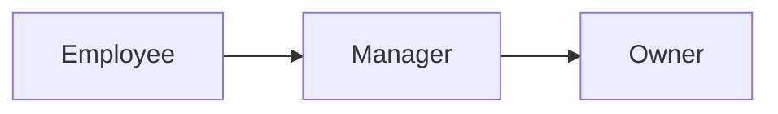

### Organization-Scoped Authority

Owner authority applies only inside the organization where the user holds the owner role.

A user may be an owner in one organization and hold a different role in another organization.

When a user selects an organization to work in, the permissions available to that user must match the role assigned in that selected organization.

Owner access in one organization must not be treated as owner access in another organization unless the user is also assigned the owner role there.

The system must evaluate the owner role in the context of the current organization, not as a global platform-wide status.

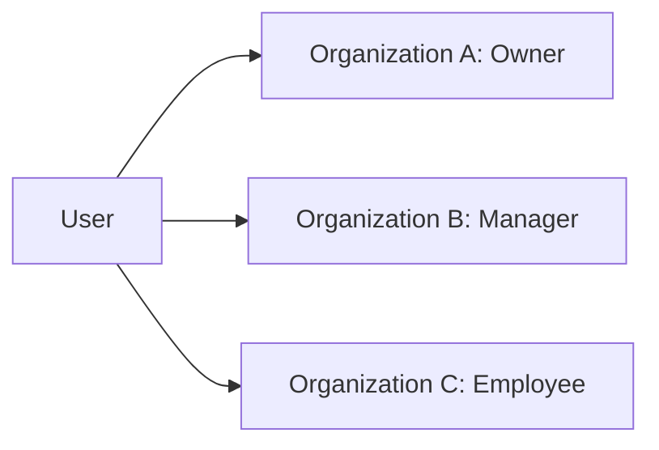

### Access Boundaries and Administrative Control

The owner has full access to all features available inside the organization.

The owner can manage organization roles and organization members.

The owner can create custom roles for the organization.

The owner can edit custom roles in the organization.

The owner controls how permissions are assigned across employees in that organization.

The owner can assign roles to employees and change existing role assignments for employees in that organization.

Because the owner has full organizational authority, the owner can access capabilities available to manager and employee roles within the same organization.

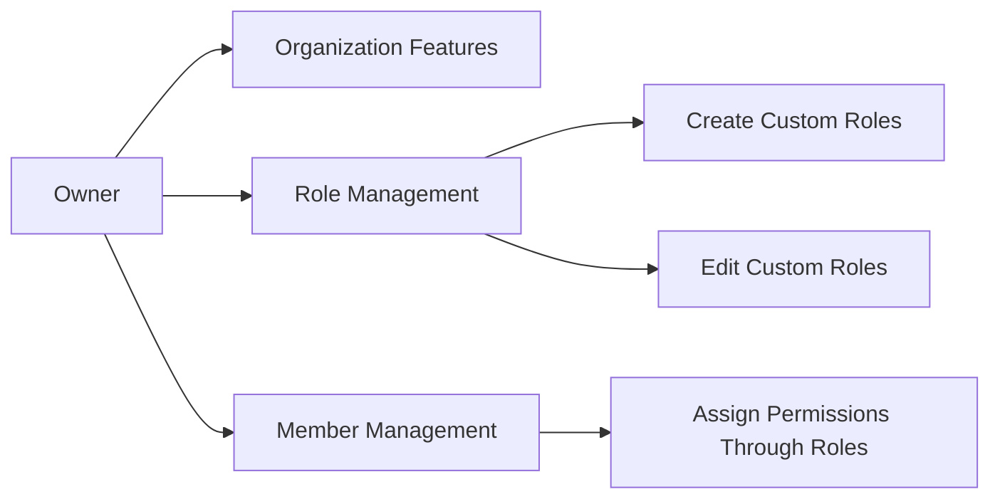

### Account Boundary Restriction for Sole Owners

A user who is the sole owner of an organization cannot delete their account while that organization still depends on their ownership.

Before deleting their account, a sole owner must transfer ownership to another user or delete the organization.

If a user is not the sole owner, ownership in another organization does not by itself prevent account deletion unless that user is also the sole owner there.

This restriction exists because ownership is required to preserve organizational administration until responsibility is transferred or the organization is removed.

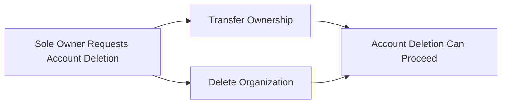

## manager Actor

The manager is a built-in organization role intended for supervisory staff. This role cannot be deleted from the organization’s role set. A manager has broad operational access, but does not hold the full authority reserved for the owner. The built-in manager scope includes employee management, project management, timesheet approval, and report viewing. Managers can be given visibility into employee and time information when that access is part of their assigned permission set. The manager role is defined at the organization level, so its authority applies only inside the selected organization. A user may be a manager in one organization while acting as an employee or owner elsewhere. Managers do not inherently control role definitions or member governance unless separate authority is granted through the organization’s role structure. In the built-in hierarchy, managers sit between owners and employees in access level.

### Manager Role Definition

The manager is a built-in organization role intended for supervisory staff within an organization.

This built-in role must always remain available in the organization role set and cannot be deleted.

The manager role represents a middle access tier in the default organization hierarchy.

In that hierarchy, the manager stands below the owner and above the employee in default access level.

The manager role provides broad operational access across organization work, but it does not include the full authority reserved for the owner.

Manager authority is defined at the organization level. A person acting as a manager has this authority only within the organization where that role is assigned.

A user may hold the manager role in one organization while holding a different role in another organization.

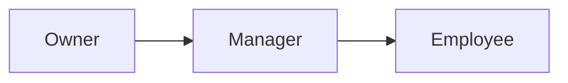

### Manager Permission Scope

The built-in manager scope includes authority to manage employees, manage projects, approve timesheets, and view reports for the selected organization.

Manager access supports supervisory work over day-to-day organization operations.

Manager authority may include visibility into employee information and time information when that visibility is included in the assigned permission set.

The manager role does not inherently include control over role definitions or member governance.

Those governance capabilities remain outside the default manager scope unless separate authority is granted through the organization's role structure.

The manager role therefore provides broad operational control without granting the complete organization-wide authority reserved for the owner.

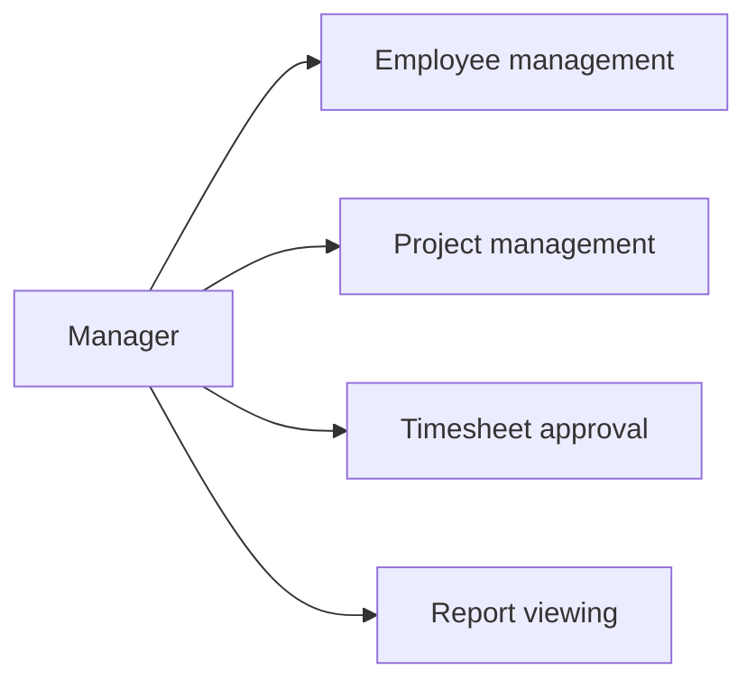

### Manager Access Boundaries

A manager acts only within the currently selected organization context.

Manager authority does not extend automatically across all organizations a user may belong to.

When a user switches to another organization, the user's authority in that organization is determined by the role assigned there, not by the manager role held elsewhere.

Because the manager is not the top authority level, manager access remains subject to the limits of the built-in hierarchy and any organization-specific permission assignment.

Managers supervise operational work, but they do not receive the owner's full power by default.

This access model ensures that the manager remains a supervisory organization role with broad responsibility while still remaining clearly below the owner and above the employee.

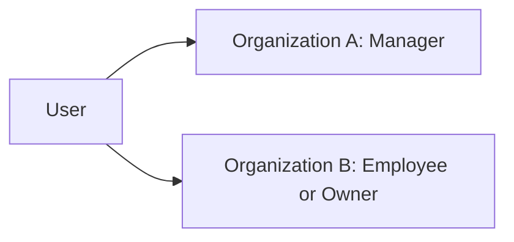

## employee Actor

The employee is the standard built-in role for regular organization members. This built-in role cannot be deleted. An employee has the most limited default access among the three built-in roles. The role is centered on personal work records rather than organization-wide oversight. Employees are allowed to work within the organization through time tracking and timesheet participation, and they are limited to viewing their own data unless broader visibility is granted by another role design. Each employee in an organization must have exactly one assigned role, so the employee role functions as a clear baseline for access. A user can be an employee in one organization and hold a different role in another. If an employee record is deactivated, the user remains part of the broader platform account system but loses active participation as an employee in that organization. In the built-in hierarchy, the employee role sits below manager and owner.

### Built-in Employee Role

The employee is a built-in role provided in every organization as the standard role for regular organization members. This built-in role cannot be deleted. It represents the default working role for people who participate in day-to-day work without organization-wide administrative authority. Within the built-in role hierarchy, the employee role is positioned below the manager and owner roles.

This role serves as the baseline access role in an organization. It establishes the minimum default participation level for a member who needs to work with personal records such as time tracking and timesheet activity, without broader oversight responsibilities.

### Default Access Scope

The employee role has the lowest default access level among the three built-in roles. Its access is centered on personal work participation rather than organization administration or supervision.

By default, an employee is allowed to track time and participate in the timesheet process. By default, an employee is limited to viewing their own data rather than organization-wide employee, project, time, or reporting data, unless broader visibility is granted through a different role design within the organization.

This default access boundary distinguishes the employee role from the manager and owner roles, which have broader authority over other members and organization records.

### Role Assignment and Organization-Specific Identity

Each employee record in an organization must have exactly one assigned role. This single-role assignment ensures that the employee role functions as a clear baseline for access and responsibility within that organization.

A user may belong to multiple organizations, and the user’s role is determined separately within each organization. The same user can therefore be an employee in one organization and hold a different role in another organization. The employee actor definition applies only within the organization where that employee role is assigned and does not determine the user’s standing in any other organization.

### Deactivated Employee Boundary

If an employee record is deactivated, the user remains part of the broader platform account system but is no longer allowed to participate actively as an employee in that organization. A deactivated employee loses the active working access associated with the employee role for that organization.

This boundary means the user continues to exist as an account holder on the platform, but the employee role no longer provides active participation rights within the deactivated organization membership. The deactivated state does not redefine the user’s role or access in any other organization where the user may still hold a separate active membership.

# Authentication Flows

Registration, login, logout, and session management from a user perspective.

## Registration and Login

Define user registration and login flows including validation and error handling.

### Registration

Users can register with an email address and password.

During initial sign-up, the registering user creates an organization and becomes the first owner of that organization.

The new organization created during registration includes its name, description, logo image, currency, timezone, and fiscal start month.

A user account is personal to the user and may later be associated with multiple organizations.

If a pending organization invitation exists for the same email address, the user is automatically added to those pending organizations after completing sign-up.

Registration establishes a user account that can be used to access the platform with the same email address and password in future login attempts.

If registration cannot be completed, the user is not treated as signed in and does not receive access to any organization context until registration succeeds.

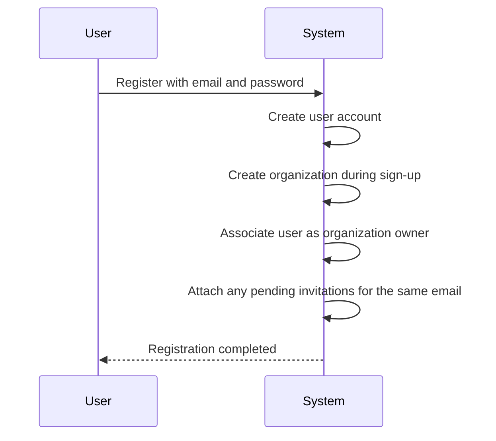

### Login

Users can log in with their email address and password.

Login applies to a previously registered user account.

After successful login, a user who belongs to more than one organization selects which organization to work in.

When a user belongs to only one organization, access is established in that organization context after login.

All actions performed after login are scoped to the currently selected organization.

Users can change their working organization without logging out, and subsequent actions are then scoped to the newly selected organization.

A user who no longer belongs to any organization can still retain the user account, but organization-scoped work requires selection of an organization the user belongs to.

If login is not successful, the user does not gain access to any organization context.

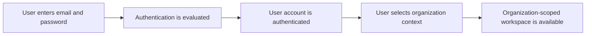

### Authentication Context

Authentication is based on the user's email address and password.

Authentication confirms access to a user account before any organization-scoped work can begin.

Organization membership does not replace account authentication; a user must first authenticate and then work within a selected organization context.

A user may belong to multiple organizations, but only the currently selected organization is active for the user's work at any given time.

Data visible to an authenticated user is limited to the currently selected organization.

Employees in one organization cannot see data from another organization through authentication in the current organization context.

The shared user profile is associated with the authenticated user account and is used across all organizations the user belongs to.

Authentication state for account access is separate from role-based permissions within an organization. The user's available actions inside the selected organization depend on the role assigned to that employee record in that organization.

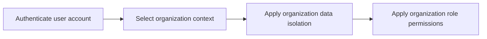

## Session and Logout

Define session behavior and logout from a user perspective.

### Session Context

After logging in, a user must work within a selected organization context.

A user who belongs to multiple organizations must be able to select which organization to work in for the current session.

All actions performed during the session must be scoped to the selected organization.

A user must be able to switch from one organization context to another without logging out.

When the organization context is switched, the system must update the active workspace so that the user sees only data for the newly selected organization.

A user must not be able to view or act on data from an organization other than the one currently selected.

If a user belongs to only one organization, the session may proceed directly in that organization context.

The shared user profile remains the same across all organization contexts, while organization-specific access depends on the selected organization.

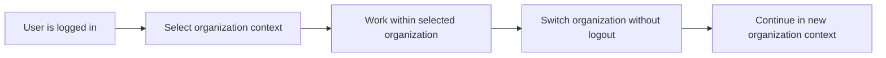

### Logout

A logged-in user must be able to end the current session by logging out.

When a user logs out, the current organization context must no longer remain active for continued work.

After logout, the user must not be able to continue performing authenticated actions until logging in again.

Logging out must end access to organization-scoped data from the ended session.

If a user switches organizations during a session and then logs out, logout must end the entire current session rather than only the last selected organization context.

Logout does not delete the user account, the shared profile, or organization memberships.

Logout does not change employee status, role assignment, project membership, or any business records.

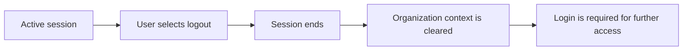

### Account Security

Users must authenticate with their email and password to access the platform.

A user must be able to change their password while keeping the same account and shared profile.

Authentication applies to the user account, while access within a session depends on the selected organization context and the user's role in that organization.

A user who belongs to multiple organizations must use the same account credentials across those organizations.

When a user account is deleted, the user must no longer be able to use that account to start a new authenticated session.

If a user deletes their account, any employee records linked to that user in other organizations must be marked as deactivated, which prevents those employee records from logging time or submitting timesheets.

If a user is the sole owner of an organization, account deletion cannot proceed until ownership is transferred or the organization is deleted.

Account security rules for sign-up, login, password change, and account deletion are defined in the related authentication and account management sections; this section defines how authenticated access relates to session use and protected account access.

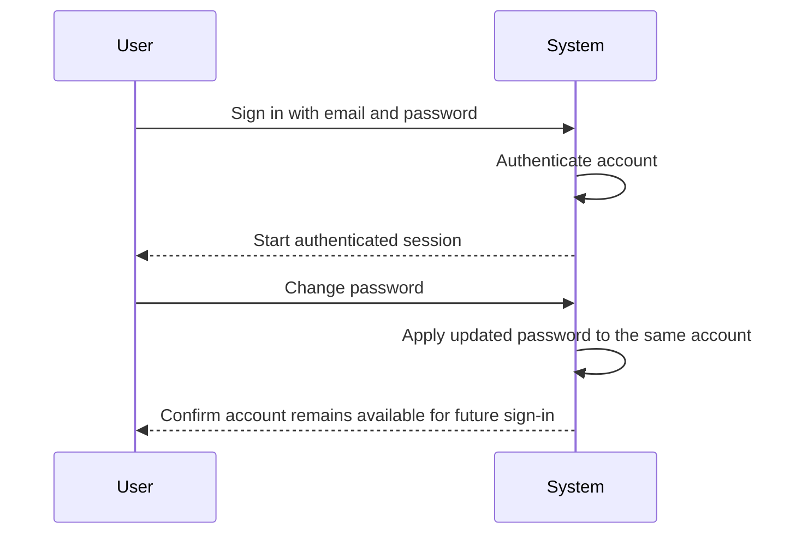

# Account Lifecycle

Account creation, deletion, and password management.

## Account Management

Define how users create accounts, delete accounts, and change passwords.

### Account Creation

Users can create a user account by providing an email address and password.

During initial sign-up, the user creates an organization as part of the account creation flow. The organization created at sign-up becomes the user's first organization context.

If a pending organization invitation exists for the same email address, the user is automatically added to the pending organizations after sign-up.

A user account is separate from employee membership. After account creation, the user may belong to one or more organizations, and each organization membership is managed within that organization's employee records and role assignments.

The same user profile is shared across all organizations the user belongs to.

Account creation establishes the basis for later organization selection, where the user chooses which organization to work in for subsequent actions.

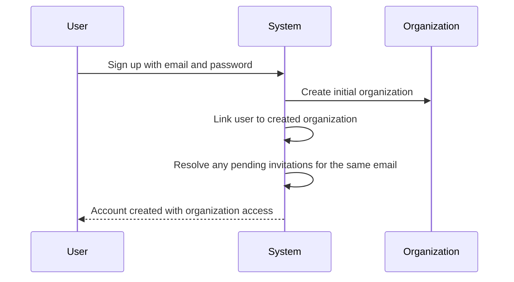

### Account Deletion

Users can delete their own account.

A user cannot delete their account while they are the sole owner of an organization. In that case, they must first transfer ownership or delete the organization.

When a user deletes their account, their employee records in other organizations are marked as deactivated.

Account deletion does not require deletion of organizations that still have another owner.

When a user's account is deleted, organization membership through employee records ends through deactivation in the remaining organizations.

Organization-specific historical records are preserved through the deactivated employee records rather than being removed as part of account deletion.

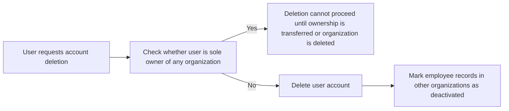

### Password Change

Authenticated users can change their password.

Password change applies to the user account itself rather than to any specific organization, because one user account can belong to multiple organizations.

After a password change, the updated password is used for future sign-ins to the user account across all organizations the user belongs to.

Password change does not alter the user's shared profile, organization memberships, employee records, or role assignments.

Password change does not change the currently selected organization context by itself.

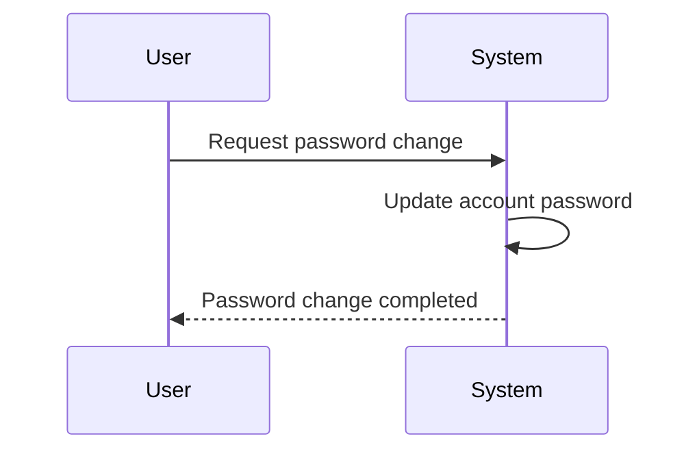