**hrmTimeTracking — Business concepts, relationships, and states from user perspective**

Business concepts, relationships, and states from user perspective

# Domain Concepts

Describe what each concept means in the business domain and its key attributes.

## UserAccount Concept

UserAccount represents the identity a person uses to access the platform. It is the business record for sign-in credentials based on email and password. This concept is separate from organization membership, because one person can belong to multiple organizations while still using one account. A UserAccount also carries the idea of current organization context, which determines the workspace the person is currently acting within. That context matters because all visible data and actions are scoped to the selected organization. The account remains a global concept across the platform rather than being owned by a single organization. When an organization relationship ends, the UserAccount can still continue to exist independently. In business terms, this concept answers who the person is at the platform level and which organization they are currently working in.

### Platform Sign-In Identity

UserAccount is the platform-level identity a person uses to access the service. It represents the individual as a single sign-in identity rather than as a record owned by one organization. This concept is centered on access to the platform through email and password credentials.

A UserAccount is global across the platform. The same account may be connected to more than one organization without creating separate sign-in identities for each organization. This makes the account the primary business concept for identifying the person at the platform level, while organization participation is handled through separate membership-related concepts defined elsewhere.

Because UserAccount is the platform sign-in identity, it answers who the person is before considering which organization they are currently working in.

### Credentials and Global Identity Scope

A UserAccount is defined by email and password credentials used for platform access. These credentials belong to the person’s global account identity, not to any one organization.

The account exists independently from organization-specific records. A person can keep the same UserAccount even as their relationships with organizations change. This means the account remains the enduring identity for the person across the platform, while organization participation can be added, changed, or removed separately.

The UserAccount concept therefore separates global identity from organization membership. It identifies the same person consistently wherever they participate in the platform.

### Multi-Organization Account Relationship

One UserAccount can be associated with multiple organizations. This does not create multiple platform identities; instead, one account can participate in many independent organization workspaces.

This relationship means that the business concept of UserAccount is broader than any single organization. The account is shared across all organizations the person belongs to, while each organization remains an independent business tenant with its own employees, projects, and data, as defined in the Organization concept.

UserAccount is therefore the cross-organization identity layer for a person, allowing one account to be reused across multiple organizations without merging the organizations themselves.

### Organization Context as Current Workspace Identity

A UserAccount carries the idea of a selected organization context. This selected context represents the current workspace identity for the person at a given time.

When a person belongs to multiple organizations, the same UserAccount can operate in different organization contexts. The currently selected organization determines which workspace the person is acting within. In business terms, the account remains the same global identity, but its active workspace identity changes according to the organization context currently in use.

This distinction is important because the platform must interpret the same person’s actions according to the organization they have currently selected, rather than treating all organization participation as one combined workspace.

### Organization-Scoped Access Context

The selected organization context gives the UserAccount an organization-scoped access context for current activity. All visible data and actions are understood within that selected organization context.

This means the account does not provide unrestricted cross-organization visibility by itself. Instead, the same global account is applied within one organization-scoped workspace at a time. The organization context defines which organization’s data the person is currently viewing and acting on.

From a domain perspective, UserAccount therefore combines two ideas: a persistent global identity for the person and a current organization-scoped access context that determines the business boundary of present activity.

### Independence from Organization Membership

UserAccount is independent from organization membership. The account can continue to exist even when a relationship with an organization ends.

This independence means that organization participation is not the same thing as account existence. A person may stop being associated with one organization while still keeping the same platform identity. The account remains a valid global concept across the service rather than being deleted simply because one organization relationship changes.

In business terms, UserAccount answers the enduring identity of the person, while organization membership answers where that person currently participates. The two concepts are related but not interchangeable.

## UserProfile Concept

UserProfile represents the personal information attached to a user across the entire platform. It contains the display-facing details that other people may recognize, rather than login credentials. Its key attributes are display name, avatar image, and phone number. This profile is global, so the same personal identity details are shared wherever the user belongs. The concept helps distinguish a person's presentation and contact details from their access account. It is not tied to one organization's employee record, because the same person may appear in multiple organizations. In business terms, UserProfile describes how a user is identified and presented to others throughout the platform.

### Global Personal Profile

UserProfile is the global personal profile attached to a user account across the platform. It represents the person's platform-wide identity details that are used for recognition and contact rather than access control. This concept contains the user's display name, avatar image, and phone number as the core personal details presented throughout the workspace. Because it is global, it is not created separately for each organization. This distinguishes the person's personal profile from organization-specific records such as employee information.

### Shared Profile Across Organizations

The same UserProfile is shared across every organization that the user belongs to. In business terms, this means one person keeps a consistent personal identity and presentation wherever they appear in the platform. Changes to the shared profile affect how that user is represented across all organization contexts, rather than in only one organization. The profile therefore supports continuity of identity when a user participates in multiple organizations.

### Presentation Attributes

UserProfile stores the user presentation details that other people use to identify the person in the platform. The display name is the primary human-readable name shown to others. The avatar image is the visual representation associated with the person. The phone number is the contact number stored as part of the person's profile. Together, these attributes define how the user is recognized and presented, while keeping those details separate from sign-in information.

### Profile Separate From Login Credentials

UserProfile is distinct from login credentials. Its purpose is to describe who the person is from a business and presentation perspective, not how the person signs in. Email and password belong to the user account concept, while display-facing identity details belong to UserProfile. This separation allows the platform to treat personal presentation details independently from authentication details, while still linking both concepts to the same user.

## Organization Concept

Organization represents an independent business tenant within the platform. It is the top-level business space where employees, projects, tasks, timelogs, timesheets, roles, and other records belong. Each organization operates with its own isolated data and does not share operational records with other organizations. Its key identifying and operational attributes include name, description, logo image, currency, timezone, and fiscal start month. The organization is the boundary for membership, permissions, reporting, and dashboards. It gives business meaning to the idea of a company or operating unit managing its own workforce and time tracking data. Even when the same user belongs to multiple organizations, each organization remains a distinct business environment.

### Organization as an Independent Business Tenant

An organization represents a distinct business tenant within the platform. It is the primary business space in which a company or operating unit manages its workforce and time tracking activities.

Each organization exists independently from every other organization. Its members, roles, departments, projects, tasks, timelogs, timesheets, reports, dashboards, and activity history belong to that organization alone.

The organization gives business meaning to ownership, membership, permissions, reporting, and operational records. Business activity is understood within the context of a single organization rather than across the platform as a whole.

Even when the same user participates in multiple organizations, each organization remains a separate business environment with its own records and internal structure.

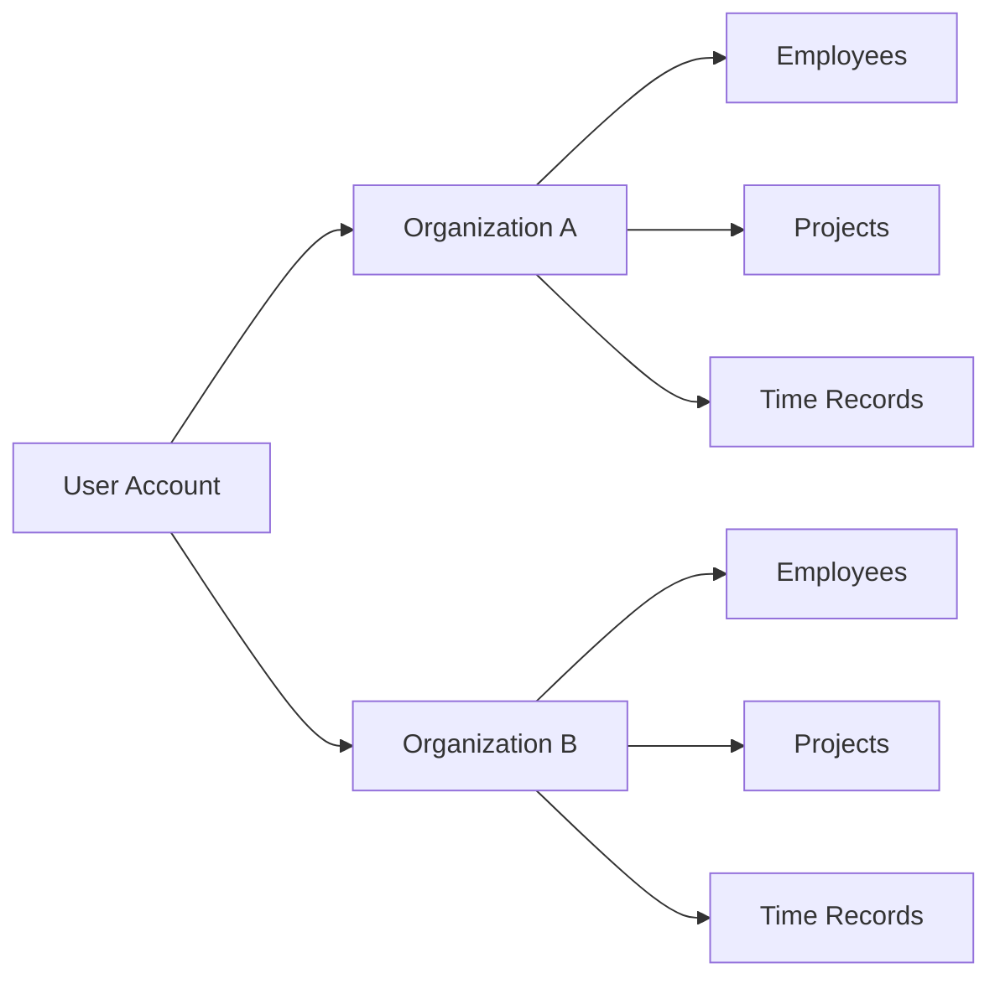

### Multi-Organization Workspace Context

The platform supports a multi-organization workspace in which one user account may be associated with more than one organization.

In business terms, this means the same person can participate in multiple independent organizations without merging their records. The user works within one selected organization context at a time, and that current context defines which business environment is active.

The selected organization determines which membership, role assignment, workforce records, projects, tasks, timelogs, timesheets, dashboards, and reports are in scope for the user at that moment.

Changing from one organization to another changes the active business context, but it does not change the identity of the user account itself. The account remains shared, while the operational workspace changes by organization.

This concept allows a single user account to move between organizations while preserving the independence of each organization as a separate tenant.

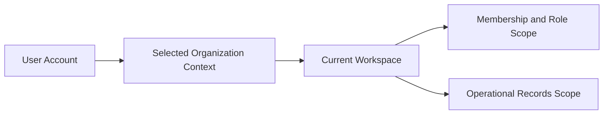

### Isolated Organization Data

Organization data is strictly isolated. Records from one organization are not part of another organization's business space and are not visible as shared operational data across organizations.

This isolation applies to workforce records, organizational structure, work initiatives, time tracking records, approval records, reporting outputs, dashboard summaries, and activity history.

A user who belongs to multiple organizations sees only the records that belong to the currently selected organization. The presence of the same user in more than one organization does not create a shared pool of employees, projects, tasks, timelogs, or timesheets.

From a business perspective, the organization is therefore the data ownership boundary for operational information. Cross-organization membership is possible at the user level, but cross-organization mixing of operational records is not.

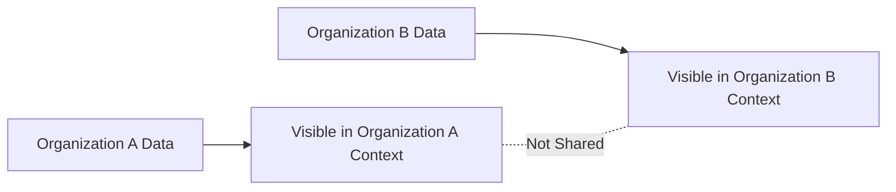

### Organization Identity and Operational Attributes

Each organization is identified and described by a defined set of business attributes.

The organization name is the primary business label used to identify the organization within the platform.

The organization description provides optional business context about the organization.

The organization logo image represents the visual identity of the organization.

The organization currency defines the monetary context used by that organization.

The organization timezone defines the local time context in which organization activity is interpreted.

The fiscal start month defines the month from which the organization's fiscal year begins.

Together, these attributes describe both who the organization is and the business context in which it operates.

| Attribute | Business meaning |
|---|---|
| Name | Primary identifier of the organization |
| Description | Summary of the organization |
| Logo image | Visual representation of the organization |
| Currency | Monetary context for the organization |
| Timezone | Local time context for organization activity |
| Fiscal start month | Starting month of the fiscal year |

### Organization Boundary for Workforce, Work, and Time Records

The organization is the top-level boundary for employees, projects, and time records.

Employees exist within an organization as part of that organization's workforce structure. Projects exist within an organization as work initiatives managed by that organization. Timelogs and timesheets exist within an organization as records of work effort and weekly submission activity.

Because the organization is the enclosing business space, these records are interpreted in relation to that organization rather than as platform-wide records.

This boundary also gives context to related concepts such as departments, roles, tasks, reports, dashboards, and activity log entries. Those concepts derive their business meaning from belonging to a specific organization.

The organization therefore acts as the anchor that groups people, work, and time into one coherent operating unit.

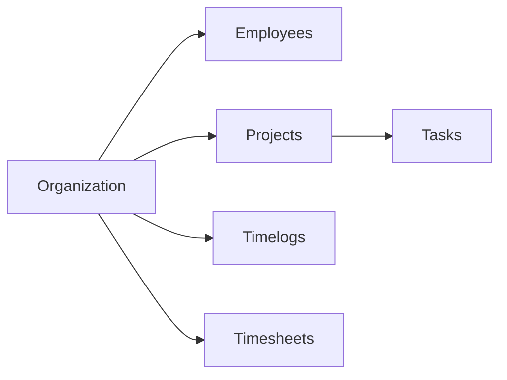

## OrganizationInvitation Concept

OrganizationInvitation represents a pending or accepted membership invitation for joining an organization. It captures the business intent to add a person to an organization's workforce using an email address. The concept is especially important when the invited person does not yet have a platform account, because the invitation can exist before full membership is established. Its core identifying attributes are invite email and invitation state. In business terms, it bridges the gap between external contact information and future organization membership. The invitation belongs to a specific organization context and reflects whether the membership is still pending or has been accepted. This concept helps the organization track intended additions to its employee base.

### Organization-Specific Invitation Identity

An organization invitation is the business record an organization uses to express its intent to add a specific person to that organization’s workforce. It is always tied to one organization and cannot represent membership across multiple organizations at once.

The invitation is identified in business terms by the invited email address and the invitation state. The email address is the external contact reference for the intended person, and the state shows whether the invitation is still waiting to be fulfilled or has already resulted in membership.

This concept exists before employee membership is fully established. It allows an organization to recognize a future member using email-based identity even when the person is not yet participating as an employee in that organization.

Because the invitation belongs to one organization context, the same person may be associated with separate invitation records in different organizations without merging those business intentions into a single shared invitation.

### Invitation States

The invitation state describes the business status of the organization invitation.

A pending invitation state means the organization has recorded its intent to add the person, but the intended membership has not yet been completed. In this state, the invitation represents an unresolved relationship between the organization and the invited email address.

An accepted invitation state means the invitation has been fulfilled and the intended membership has been established for that organization. Once accepted, the invitation no longer represents only future intent; it represents a completed transition from invitation to actual organization membership.

These states are business-facing lifecycle markers for the invitation record itself. They distinguish an invitation that is still awaiting resolution from one that has already resulted in the invited person joining the organization.

### Pre-Account Membership Intent and Onboarding Link

An organization invitation serves as a bridge between an email contact and future employee onboarding within a specific organization. Its business purpose is to preserve the organization’s membership intent even when the invited person does not yet have a platform account.

This makes the invitation a pre-account membership concept: the organization can identify who it intends to add by email first, while full employee membership is completed later when that person is recognized as a user within the platform.

In business terms, the invitation links three ideas: the organization that wants to add someone, the email address used to identify that person, and the future employee presence that will exist after the invitation is accepted. This link is important because it allows the organization to track intended additions to its workforce without requiring immediate account presence at the time the invitation record is created.

The invitation therefore represents more than contact information alone. It captures a forward-looking onboarding relationship for one organization, using the invited email address as the business reference until the membership becomes established.

## Role Concept

Role represents a named permission bundle within a specific organization. It defines the level of access and responsibility an employee has in that organization. The concept includes built-in roles and custom roles, making it both a standardized and configurable business classification. Its key attributes are role name, role type such as built-in or custom, and a set of permissions. The built-in business roles are Owner, Manager, and Employee. Permissions express what areas of the organization a role can manage or view, such as organization settings, employees, projects, time records, approvals, reports, and broader visibility. Because roles are organization-specific, the same person may hold different access positions in different organizations. In business terms, Role is the formal definition of authority within one tenant.

### Organization-Specific Access Role

Role is the organization-specific access role assigned to an employee within one organization. It represents the formal classification of authority for that employee in that organization and determines what business areas the employee is allowed to manage or view.

A role belongs to one organization only. The same user may therefore be linked to different roles in different organizations, because role meaning does not carry across organization boundaries. This makes Role a tenant-level business concept rather than a global user property.

The core business attributes of a role are its role name, its role type, and its permission set. Together, these describe how the organization classifies responsibility and access scope for employees.

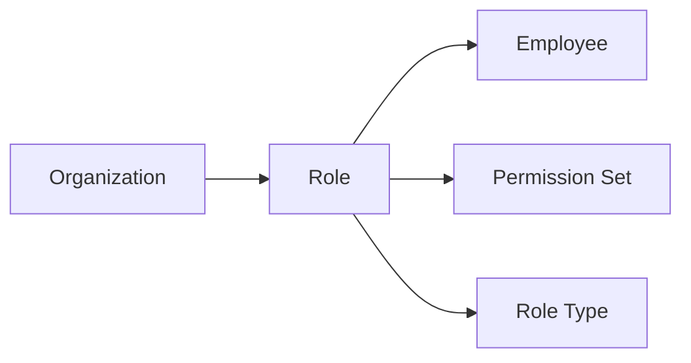

### Built-In Role Type

Each organization includes built-in role types that provide the platform's standard access scope classification. These built-in roles are Owner, Manager, and Employee.

The Owner role represents full authority within one organization.

## Employee Concept

Employee represents a user's workforce identity inside a particular organization. It is the organization-level business record that connects a person to their role and employment details in that tenant. This concept is distinct from the global user account because the same user can have separate employee records in different organizations. Its key attributes include linked user account, assigned role, optional department, optional position or title, employment type, and status. Employment type classifies the working arrangement as full-time, part-time, contractor, or intern. Status distinguishes whether the employee is active or deactivated. In business terms, Employee is the core participation record for a person's presence within an organization's human resource structure.

### Employee as the Organization Workforce Record

Employee is the organization-level workforce record that represents a person's participation inside one organization. It connects a global user identity to that specific organization's human resource structure without redefining the user account itself. A person who belongs to multiple organizations has a separate employee record in each organization, so the employee concept is always tied to one organization rather than shared across organizations.

This concept exists to express the person's business presence in that organization. It is the record through which the organization recognizes the person as part of its workforce, assigns internal responsibility, and classifies employment details that are specific to that organization.

Key business characteristics of the employee concept are summarized below:

| Aspect | Meaning |
|---|---|
| Organization scope | The employee record belongs to one organization only |
| Linked person | The employee record references one user account as the person behind the workforce record |
| Organization identity | The same user can appear as different employee records in different organizations |
| Workforce purpose | The record captures the person's role and employment details within that organization |

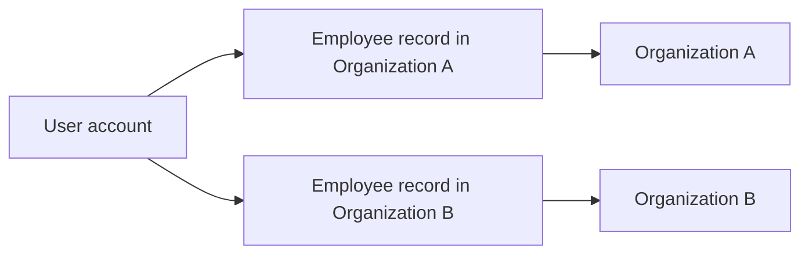

### Employee Business Attributes

Each employee record identifies the person behind the record through a linked user account and also carries organization-specific business attributes.

The employee has exactly one assigned organization role. This role expresses the person's access position within the organization and is defined by the separate role concept.

The employee may also have an optional department. Department is used to place the employee within the organization's internal structure when such grouping is needed.

The employee may have an optional position or title. This captures the person's job designation in business terms, such as their role label within the workforce structure.

These attributes are organization-specific. They describe how the person is recognized inside the current organization and do not replace the person's global profile.

| Attribute | Business meaning |
|---|---|
| Linked user account | Identifies which user the employee record represents |
| Assigned organization role | Defines the employee's organization-level role assignment |
| Optional department | Places the employee within an organizational grouping when applicable |
| Optional position or title | Describes the employee's job designation within the organization |
| Employment type | Classifies the working arrangement for this employee record |
| Status | Indicates whether the employee is currently active or deactivated |
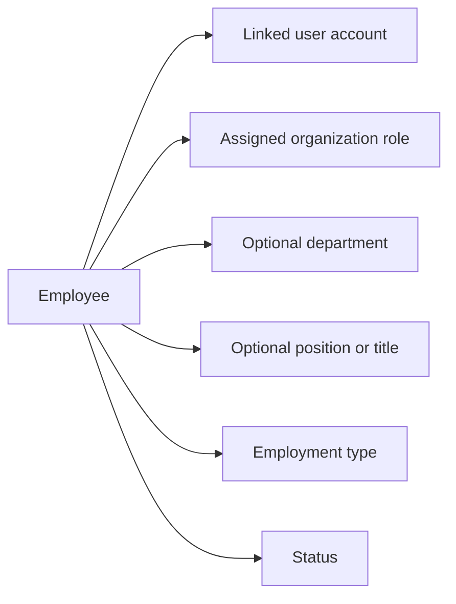

### Employment Type and Status Classification

Employment type classifies the working arrangement represented by the employee record. The allowed business values are full-time, part-time, contractor, and intern. This classification helps distinguish how the employee participates in the organization from a human resource perspective.

Status identifies whether the employee is currently active or deactivated. An active employee is part of the organization's current workforce. A deactivated employee remains part of the organization's historical workforce record, but the status shows that the person is no longer active in that organization.

Together, employment type and status describe two different business dimensions:

- Employment type describes the kind of working arrangement.
- Status describes whether the employee is currently active in the organization.

| Classification | Allowed values | Business meaning |
|---|---|---|
| Employment type | full-time, part-time, contractor, intern | Describes the employee's working arrangement |
| Status | active, deactivated | Describes whether the employee is currently active in the organization |

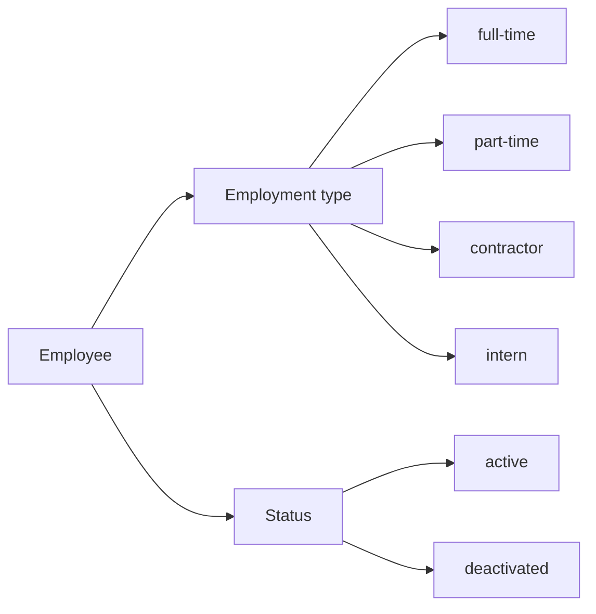

## EmployeeContract Concept

EmployeeContract represents the employment terms that apply to an employee during a particular period. It serves as the historical business record for compensation and expected working arrangement over time. An employee may have multiple contracts as their terms change, but each contract still stands as a separate period-based agreement. Its key attributes are start date, optional end date, pay rate, pay period, working hours per week, and optional notes. The pay period expresses the business basis for compensation as hourly, daily, weekly, or monthly. The optional end date allows a contract to represent either a closed period or an ongoing arrangement. In business terms, EmployeeContract captures the formal employment terms associated with one span of an employee's service.

### EmployeeContract as an Employment Terms Record

EmployeeContract represents the employment terms record for one employee during a defined span of service within an organization. It captures the formal business agreement that applies to that employee for a particular period rather than describing the employee as a person.

This concept exists to preserve the terms that govern compensation and expected working arrangement at a given point in time. Each contract stands as its own business record, so changes in employment terms are represented by separate contracts instead of overwriting earlier ones.

In business terms, an EmployeeContract includes the start date, optional end date, pay rate, pay period, working hours per week, and optional notes. Together, these attributes describe a time-bounded employment agreement that can represent either a closed historical period or an ongoing arrangement.

EmployeeContract belongs to one employee, and one employee may have multiple EmployeeContract records over time.

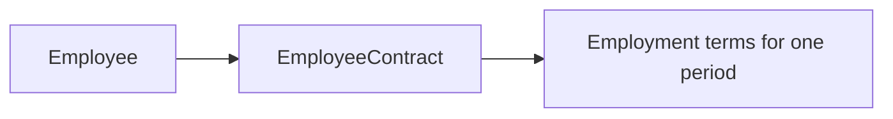

### Historical Contract Record and Time-Bounded Agreement

EmployeeContract is a historical contract record. Its purpose is to preserve employment terms as they existed for a specific period, allowing an employee's compensation and working arrangement to be understood across time.

An employee may have multiple contracts because employment terms can change. Each contract remains a separate record for its own period and is not merely a revision label or temporary note.

This makes EmployeeContract a time-bounded employment agreement. The contract is defined by the period to which it applies, so the meaning of the record depends on when its terms were in effect.

A contract with both a start date and an end date represents a closed period in the employee's history. A contract with a start date and no end date represents the current ongoing period, unless superseded by a later contract.

The historical nature of EmployeeContract supports clear business interpretation of past and current employment terms without mixing different periods into one record.

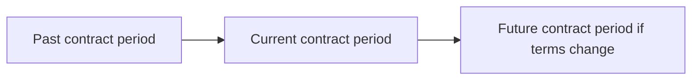

### Contract Period Boundaries

The contract start date marks the beginning of the period in which the employment terms apply. It is the anchor point that identifies when the contract becomes effective in business terms.

The contract end date marks the end of that period when the arrangement is no longer in effect. The end date is optional, which allows the contract concept to represent both fixed periods and open-ended arrangements.

When an EmployeeContract has no end date, it represents an ongoing contract period. In that case, the employment terms continue to apply from the start date forward until a later business event establishes an ending point.

The combination of start date and optional end date defines the contract period itself. This period is central to understanding which pay terms and working expectations were applicable at a particular time.

Because EmployeeContract is period-based, the dates are part of the business identity of the record, not just supporting details.

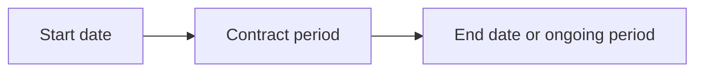

### Compensation Basis and Working Arrangement

EmployeeContract records the compensation basis that applies during its contract period. The pay rate expresses the monetary amount associated with the contract, while the pay period explains the business basis on which that rate is understood.

The pay period can be hourly, daily, weekly, or monthly. These values describe how the pay rate should be interpreted in business terms. For example, the same numeric pay rate has a different meaning depending on whether it is tied to an hour, a day, a week, or a month.

EmployeeContract also records working hours per week. This attribute expresses the expected weekly working arrangement associated with the contract and helps define the employment terms beyond compensation alone.

The compensation basis and weekly working expectation belong together because they jointly describe the formal terms under which the employee is engaged for that period.

Optional contract notes provide additional business context that does not change the core meaning of the contract period, pay rate, pay period, or working hours per week. Notes may capture clarifying remarks relevant to that contract's terms.

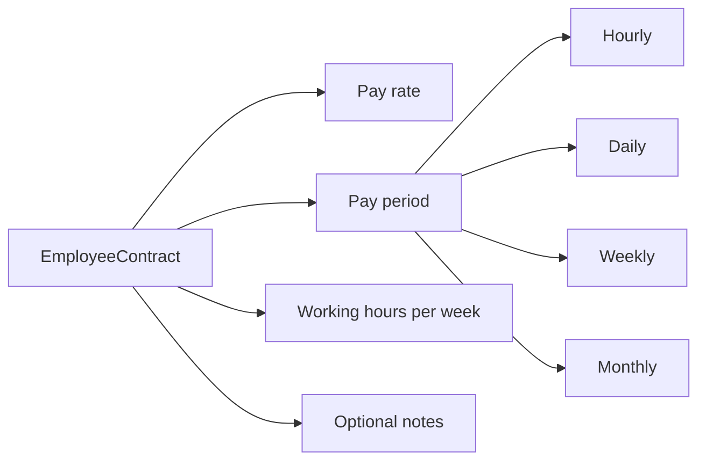

## Department Concept

Department represents an organizational grouping used to structure employees within an organization. It provides a business category for workforce segmentation such as teams, functions, or divisions. Its key attributes are name, description, and an optional parent department. The optional parent allows one level of nesting, which supports a simple hierarchy without deep organizational trees. A department is not the same as a role, because it describes where an employee belongs structurally rather than what access they have. It also does not define employment terms, projects, or permissions. In business terms, Department is the concept that expresses internal organizational structure for employees.

### Department Definition and Purpose

A department represents an organizational grouping within one organization. It is used as an employee structural category that shows where an employee belongs in the organization from a business perspective.

A department expresses internal structure such as a team, function, or division. It helps distinguish workforce grouping by business area rather than by access rights, employment terms, or project assignment.

A department is separate from a role. A role defines access and responsibilities in the organization, while a department defines structural placement within the organization.

A department is also separate from projects and contracts. It identifies organizational belonging, not temporary work assignment or employment terms.

Employees may be associated with a department to show their place in the organization structure.

### Department Attributes

Each department is identified by a department name. The name is the primary business label used to recognize the department within the organization.

A department may also include a department description. The description provides additional business meaning for the department, such as its purpose, scope, or the function it represents.

The combination of department name and department description gives the organization a clear structural category for grouping employees.

The department concept does not carry permission definitions, payroll terms, or project ownership details. Its business meaning is limited to organizational structure and employee grouping.

### Parent Department and Hierarchy

A department may optionally reference a parent department. This optional parent department allows the organization to express a simple hierarchy between a broader department and a more specific subordinate department.

The department hierarchy supports one-level department nesting only. This means a department may sit under one parent department, but the structure does not continue into deeper multi-level organizational trees.

This one-level department nesting supports straightforward business hierarchy without turning the department model into a complex hierarchy system.

Through the optional parent department, the organization can represent relationships such as a function and its sub-function, or a larger team and a directly related sub-team.

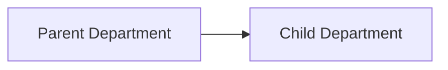

In business terms, the parent relationship communicates organizational hierarchy concept, not reporting lines, permissions, or project control.

## Project Concept

Project represents a unit of planned and trackable work within an organization. It is the business container used to organize time tracking and task execution around a shared objective. Its key attributes include name, optional description, color code, status, optional budget hours, optional start date, and optional end date. Status expresses whether the project is active, archived, or completed. Budget hours provide an estimated total effort where budgeting is used. The date attributes describe the intended time span of the work. In business terms, Project identifies a work initiative that employees can be assigned to and against which time can be recorded.

### Project as a Work Initiative Record

A project is the business record used to represent a work initiative within one organization. It identifies a defined body of work that employees contribute to over time and gives that work a single business reference point.

From a business perspective, the project exists to group related effort under a shared objective. It is the concept used to distinguish one initiative from another inside the same organization.

A project belongs to one organization context and is understood as an organization-specific record rather than a cross-organization concept. Within that context, it can be associated with assigned employees, related tasks, and recorded work time.

The project is the parent business concept for work planning and work tracking. Tasks exist within the scope of a project, and time is recorded against a project so that effort can be understood in relation to that initiative.

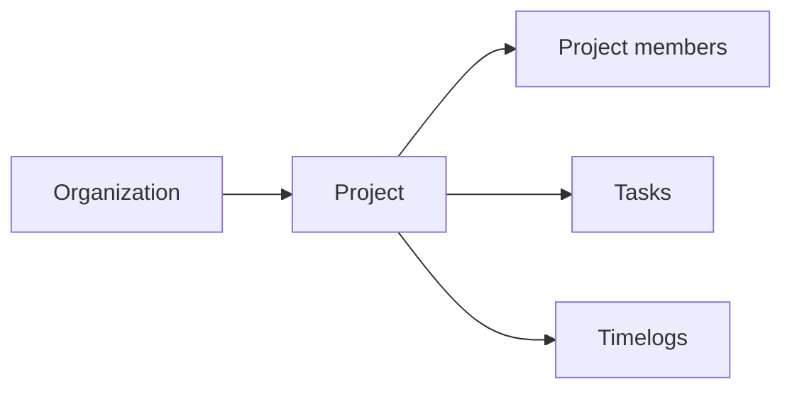

### Project Identity and Descriptive Attributes

Each project is identified in business use by its project name. The project name is the primary human-readable label used to recognize the work initiative in lists, reports, assignments, and time records.

A project may also include a project description. The description provides additional business context about the purpose or scope of the initiative when the name alone is not sufficient.

Each project includes a color code for display. This attribute serves as a visual identifier that helps distinguish one project from another in business views where multiple projects are shown together.

These attributes together define how the project is recognized and understood by users:

- The project name provides the main identity of the initiative.
- The project description provides optional explanatory context.
- The color code for display provides visual differentiation.

This concept defines what those attributes mean in the business domain. Rules for creating, editing, or validating them are defined elsewhere.

### Project Status and Planning Attributes

Each project has a status that expresses its current business state. The allowed status values are active, archived, and completed.

An active project represents work that is currently in progress or available for ongoing participation.

An archived project represents a project that remains part of the organization record but is no longer treated as current working activity.

A completed project represents a project whose intended work has been finished as a business initiative.

A project may include budget hours. Budget hours express the planned or estimated total effort for the initiative when the organization chooses to track project effort against an expected amount.

A project may include a project start date and a project end date. These dates describe the intended time span of the initiative in business terms. The start date indicates when the project is expected to begin, and the end date indicates when the project is expected to conclude.

Together, status, budget hours, project start date, and project end date describe the business planning position of the initiative: whether it is current or no longer current, whether expected effort has been identified, and what time period the work is intended to cover.

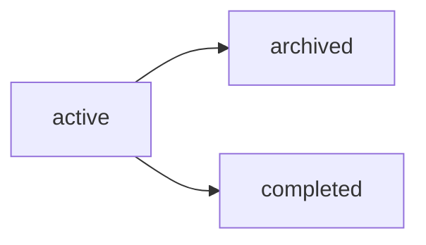

### Project as the Container for Tasks and Time Tracking

A project acts as the business container for tasks and time tracking related to a shared objective. It provides the common context in which planned work items and recorded work effort are organized together.

Tasks belong within a project so that individual pieces of work can be understood as part of a larger initiative. This lets the organization treat the project as the umbrella concept for task execution.

Time tracking also belongs within a project so that logged effort can be attributed to a specific initiative. This gives business meaning to recorded work time by linking it to the project under which the work was performed.

Because the project is the common container for both tasks and time tracking, it supports a unified business view of planned work and actual effort. In this model, the project is not merely a label; it is the organizing concept that connects assignments, execution, and recorded time within one initiative.

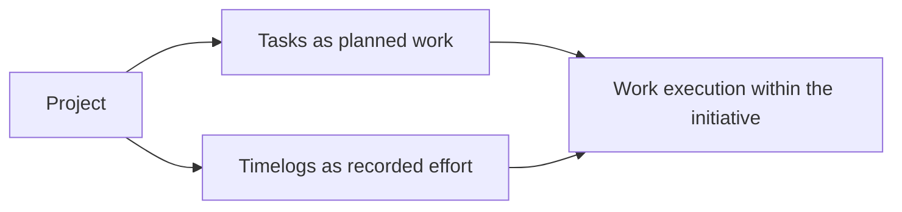

## ProjectMembership Concept

ProjectMembership represents an employee's assignment to a specific project. It is the business record that connects workforce participation to project work. Its key attributes are employee, project, and assigned role within the project. The assigned project role is either member or project-lead. This concept is separate from organization role because a person may have one level of authority in the organization and a different responsibility inside a project. It also reflects that employees can belong to multiple projects at the same time. In business terms, ProjectMembership defines who is part of a project and what project-level responsibility they hold there.

### Project Participation Record

ProjectMembership is the business record that represents an employee being assigned to a specific project. It is the link between the employee concept and the project concept within one organization. Each ProjectMembership identifies one employee, one project, and the employee's assigned role within that project. From a business perspective, this record answers two questions: who is participating in the project, and what level of responsibility that person holds inside the project. A ProjectMembership exists only in the context of a single employee-to-project relationship. If the same employee participates in another project, that participation is represented by a separate ProjectMembership record.

### Project-Specific Responsibility Classification

The assigned role within ProjectMembership is a project-specific responsibility classification. The allowed values are member and project-lead. This classification is distinct from the employee's organization role, because a person's responsibility within a project may differ from their broader responsibility in the organization. The member value indicates ordinary participation in project work. The project-lead value indicates project-level leadership responsibility for that specific project. Because the classification belongs to ProjectMembership rather than to the employee generally, the same employee may be a member in one project and a project-lead in another project at the same time.

### Multiple Project Assignments

ProjectMembership supports the business reality that employees can be assigned to multiple projects at the same time. Each assignment is represented separately so that project participation and project-level responsibility are tracked per project rather than per employee overall. This means an employee can have several ProjectMembership records within the same organization, one for each project they belong to. In business terms, ProjectMembership is the concept that organizes workforce participation across projects while preserving the specific responsibility held in each individual project.

## Task Concept

Task represents a defined piece of work within a project. It gives business structure to the smaller deliverables or action items that contribute to project progress. Its key attributes include title, optional description, status, priority, optional estimated hours, optional due date, optional assigned employee, and optional parent task. Status classifies the work as open, in-progress, completed, or closed. Priority indicates urgency using low, medium, high, or urgent. The assigned employee attribute identifies who is responsible when the task has an owner. The optional parent task allows one level of subtask structure. In business terms, Task is the core work item used to organize project execution and personal responsibility.

### Task as a Project Work Item

A task represents a project work item used to organize a defined piece of work within a project. It gives business structure to the smaller deliverables, action items, or responsibilities that contribute to overall project progress.

A task is identified by a task title, which names the work item in a way that distinguishes it from other work in the same project.

A task may also include a task description to provide additional business context, expected outcome, or supporting detail about the work.

A task may include estimated hours to express the expected effort for the work item.

A task may include a due date to indicate when the work is expected to be completed.

A task may be assigned to an assigned employee when responsibility for the work item is owned by a specific person.

A task always belongs to a single project and is understood within that project context rather than as a standalone business record.

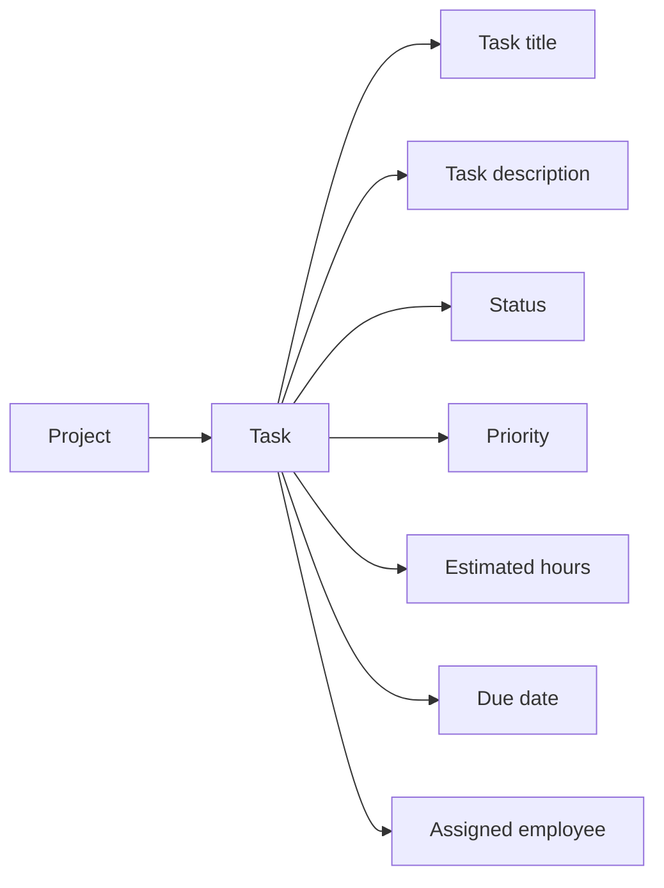


### Task Status and Priority Classification

Each task has a status that expresses the current business state of the work item.

The allowed status values are open, in-progress, completed, and closed.

Open indicates that the work item exists and is available to be started.

In-progress indicates that work on the task is actively underway.

Completed indicates that the work itself has been finished.

Closed indicates that the task has reached a final end state and is no longer being treated as active work.

Each task also has a priority that expresses the business urgency of the work item.

The allowed priority values are low, medium, high, and urgent.

Low indicates relatively low urgency compared with other work.

Medium indicates normal business urgency.

High indicates elevated urgency and greater business importance.

Urgent indicates the highest level of urgency among task priorities.

These classifications help the organization understand both the current state of a task and the relative urgency of the work it represents.


### Assignment, Scheduling, and Subtask Structure

The assigned employee identifies the person responsible for a task when ownership is designated. This assignment is optional, so a task may exist without an assigned employee.

The due date identifies the expected completion date for the task when scheduling information is needed. This value is optional, so a task may exist without a due date.

Estimated hours express the expected amount of effort for the task when planning information is needed. This value is optional, so a task may exist without estimated hours.

A task may reference an optional parent task to show that it is a subtask of another task in the same project.

The parent task relationship supports a one-level subtask structure only.

Under this model, a top-level task may have direct subtasks.

A subtask cannot itself have another child task, because the hierarchy is limited to one level below the parent task.

This structure allows tasks to be broken into smaller work items while keeping the project work breakdown simple and easy to understand.

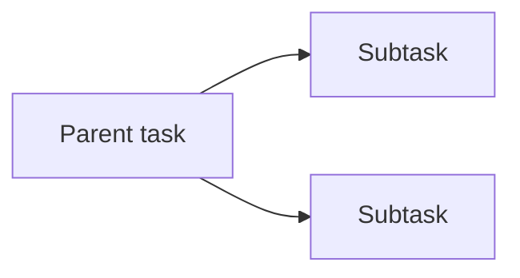


## TaskHistory Concept

TaskHistory represents the recorded status change trail for a task. It provides the business-visible record of how a task's status has changed over time. Its key attributes are timestamp, old status, new status, and the person who made the change. This concept focuses specifically on status movement rather than general task editing. It gives accountability and historical context to project progress. By preserving both previous and new values, it allows the business to understand transitions rather than only the current state. In business terms, TaskHistory is the audit-style record for task status changes.

### Task Status Change Record

TaskHistory is the business record that captures each change in a task's status. It exists to preserve the visible history of task movement rather than only the task's current status. Each entry belongs to one task and represents one status change event for that task. The concept is limited to status movement and does not represent general edits to task title, description, assignment, or priority. From a business perspective, TaskHistory gives teams a reliable record of how work progressed over time.

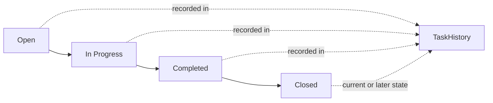

### Recorded Change Details

Each TaskHistory entry is defined by the specific details of one status transition. The change timestamp identifies when the status change was recorded. The old status value shows the task status before the change. The new status value shows the task status after the change. The person who changed the status identifies who made that transition. Together, these values describe not just that a task changed, but exactly when it changed, how it changed, and who was responsible for the change.

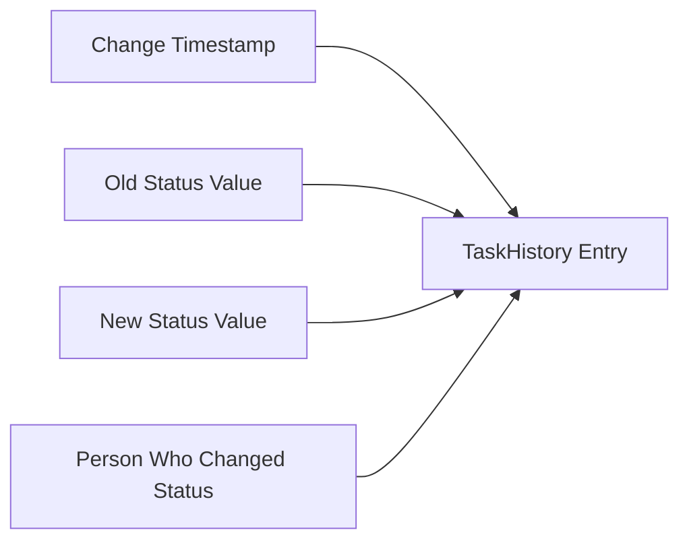

### Status Transition Trail

Across the life of a task, TaskHistory forms a status transition trail made up of multiple entries arranged over time. This trail provides the task progress history for the business by showing the sequence of status changes from one recorded state to the next. Because each entry preserves both the previous and new status values, the business can understand the direction of movement, not only the final result. This makes it possible to review how a task advanced through its work states and to interpret progress in chronological context.

```mermaid
flowchart LR
    A["Entry 1"] --> B["Entry 2"]
    B --> C["Entry 3"]
    C --> D["Task Progress History"]
```

### Audit View of Task Status

TaskHistory provides an audit view of task status for project oversight and accountability. It allows the business to examine the history of status movement in a way that is specific to one task and attributable to the person who made each change. This concept supports review of progress questions such as when a task moved, which status it moved from, which status it moved to, and who performed that change. In this way, TaskHistory serves as the business-visible evidence of status progression for a task without replacing the task's current status.

```mermaid
flowchart LR
    A["Task"] --> B["Current Status"]
    A --> C["TaskHistory"]
    C --> D["When It Changed"]
    C --> E["From Which Status"]
    C --> F["To Which Status"]
    C --> G["Who Changed It"]
```

## Timelog Concept

Timelog represents a single recorded entry of time spent on work. It is the core business record for capturing effort at the employee level. Its key attributes are date, duration in minutes, project, optional task, optional description, and billable flag. The project identifies the work initiative the time belongs to, while the optional task provides more specific work context within that project. The description captures what was done in business language when details are needed. The billable flag distinguishes whether the recorded time counts as billable or non-billable work. In business terms, Timelog is the atomic time-tracking record used to reflect actual work performed.

### Timelog as a Single Work Effort Record

A timelog represents one single recorded entry of work effort for an employee within the currently selected organization. It is the atomic business record used to capture actual time spent on work, rather than a weekly summary or a live tracking session.

A timelog stands on its own as one entry for one work occurrence. In business terms, it answers the question of what work time was recorded, when it was recorded for, and what work it belonged to.

A timelog belongs to one employee record and one organization context. It contributes to broader time-tracking views such as weekly timesheets, reports, and dashboard summaries, but it remains the most granular record of work effort in the platform.

Because it is a single entry, a timelog is understood as a discrete unit of recorded effort rather than a collection of entries.

```mermaid
flowchart LR
    A["Work effort performed"] --> B["Single timelog"]
    B --> C["Employee time history"]
    B --> D["Timesheet inclusion"]
    B --> E["Reporting totals"]
```

### Timelog Date and Duration

Each timelog carries the date of the work being recorded and the duration in minutes for that work.

The timelog date identifies the business day to which the recorded effort belongs. This allows recorded work to be understood in the context of a specific day and supports day-based, week-based, and date-range interpretation elsewhere in the system.

The duration in minutes expresses how much time was spent on the recorded work. Using minutes makes the timelog precise enough to represent short or long work periods as a single measurable amount of effort.

Together, the date and duration define the temporal meaning of the timelog: the date says when the work belongs, and the duration says how much effort was recorded for that day.

### Project and Optional Task Context

A timelog is a project-linked time record. Every timelog is associated with one project so that recorded effort is tied to a specific work initiative in the organization.

This project association gives business context to the recorded time by showing which project received the effort. It also makes the timelog meaningful for project-level review, project reporting, and project budget comparison.

A timelog may also include an optional task reference. When present, the task provides more specific context within the selected project by identifying the particular work item the effort relates to.

The optional task reference does not replace the project connection. Instead, it narrows the business meaning of the entry from project-level work to task-level work inside that same project.

If no task is referenced, the timelog still remains complete as a project-based record of work effort.

### Work Description

A timelog may include a work description. The work description captures what was done in business language when additional context is needed beyond the project and optional task.

This description helps distinguish the nature of the recorded effort, especially when multiple timelogs relate to the same project or task. It provides human-readable context for managers, employees, and report consumers who need to understand the work represented by the entry.

The work description is supplementary context rather than the primary identity of the timelog. The timelog remains defined first by its date, duration, and work association, with the description adding explanatory detail when appropriate.

### Billable and Non-Billable Classification

Each timelog includes a billable time flag that classifies the recorded work as billable or non-billable.

The billable time flag indicates whether the recorded effort counts as billable work. This classification gives the timelog financial and reporting meaning beyond simple time capture.

When a timelog is marked as billable, the entry represents work that is intended to count toward billable time totals. When a timelog is marked as non-billable, the entry represents work effort that is still part of the employee's recorded activity but is classified separately from billable work.

Non-billable work classification is therefore not a different kind of record. It is the same timelog concept with a different business classification applied through the billable time flag.

This distinction allows the same core time record to support both total effort tracking and separate analysis of billable versus non-billable work.

## Timesheet Concept

Timesheet represents a weekly collection of timelogs owned by one employee. It is the business document used to summarize work time for a specific Monday-to-Sunday period. Its key attributes include employee, week start date, week end date, status, total hours, submitted at, reviewed at, reviewed by, and rejection reason. Status classifies the timesheet as draft, submitted, approved, or rejected. Total hours expresses the aggregate work recorded in the included timelogs. The review-related attributes capture whether the weekly record has been examined and by whom. The rejection reason adds business context when the weekly record is not accepted. In business terms, Timesheet is the formal weekly time summary associated with approval status.

### Weekly Record and Ownership

Timesheet is the formal weekly time record for one employee within the current organization context. It represents that employee's work time summary for a single business week and is owned by that employee.

A timesheet belongs to exactly one employee record. From a business perspective, this makes the employee the owner of the weekly record, even when another user later reviews it. The ownership identifies whose work time is being summarized and whose weekly record the approval outcome applies to.

A timesheet is separate from the employee account itself. The employee account identifies the person across organizations, while the timesheet is the organization-scoped weekly work record for that person in one organization.

```mermaid
flowchart LR
    E["Employee"] --> T["Timesheet"]
    T --> W["Weekly Time Record"]
```

### Included Timelogs and Total Hours

A timesheet is a collection of timelogs gathered into one weekly business document. The included timelogs are the detailed work entries that support the weekly summary.

Each included timelog contributes work time to the same timesheet. In business terms, the timesheet is the summarized weekly record, while the timelogs are the underlying daily evidence of work performed.

The total hours value is the aggregate summary of all included timelogs. This value expresses the total amount of work recorded in the weekly document rather than a separate manually maintained figure.

Because the timesheet is a summary concept, its total hours should be understood as derived from the included timelog collection. The meaning of the weekly record depends on that relationship between detailed entries and summarized time.

```mermaid
flowchart LR
    TL["Timelogs"] --> TS["Timesheet"]
    TS --> TH["Total Hours Summary"]
```

### Weekly Period Boundaries

Each timesheet covers one fixed Monday to Sunday period. The week start date identifies the Monday that begins the business week, and the week end date identifies the Sunday that closes it.

These two dates define the exact weekly boundaries of the timesheet. They distinguish one weekly record from another and make clear which span of work time the document summarizes.

From a business viewpoint, the timesheet is not an open-ended time summary. It is always tied to one complete weekly period with a defined start and end within the Monday-to-Sunday structure.

```mermaid
flowchart LR
    M["Week Start Date (Monday)"] --> TS["Timesheet Week"] --> S["Week End Date (Sunday)"]
```

### Status and Review Information

A timesheet has a status that classifies its business state as draft, submitted, approved, or rejected. These values indicate whether the weekly record is still being prepared, has been presented for review, has been accepted, or has not been accepted.

The submitted at value records when the weekly record was formally submitted. This timestamp gives business context for when the employee moved the timesheet from preparation into review.

The reviewed at value records when the timesheet was examined and a review outcome was recorded. This timestamp is part of the business history of the weekly record.

The reviewed by value identifies the user who performed the review decision. In business terms, this connects the review outcome to the person who examined the weekly record.

The rejection reason provides explanatory business context when a timesheet is not accepted. It captures why the weekly record was rejected so that the outcome is understandable as part of the timesheet's review history.

```mermaid
flowchart LR
    D["Draft"] --> S["Submitted"]
    S --> A["Approved"]
    S --> R["Rejected"]
    R --> X["Rejection Reason"]
    S --> SA["Submitted At"]
    A --> RA["Reviewed At"]
    R --> RA
    A --> RB["Reviewed By"]
    R --> RB
```

## Timer Concept

Timer represents a live, running time-tracking session for an employee. It is the business concept used when work time is being captured in real time rather than entered afterward. Its key attributes are start timestamp, project, optional task, description, and running state until it is stopped or discarded. The project is required because the live effort must be tied to a work initiative from the start. The optional task adds more precise work context when needed. The description records what the employee is working on during the live session. In business terms, Timer is the temporary active tracking record that exists while time is still being measured.

### Timer as a Live Time Tracking Session

Timer represents a live time tracking session for an employee within the currently selected organization. It is the business concept used when work time is being captured in real time instead of being entered later as a completed time entry.

A Timer exists as a temporary running timer record while work is in progress. In business terms, it holds the context of the current work session until that session is ended or discarded. This makes Timer distinct from a timelog, which represents work that has already been recorded as a completed time entry.

Timer belongs to one employee and reflects only that employee's current work session. It is organization-scoped, so the timer is understood within one organization context and does not span across organizations.

```mermaid
flowchart LR
    A["Employee begins work"] --> B["Live time tracking session"]
    B --> C["Running timer record"]
    C --> D["Completed time entry or discarded session"]
```


### Core Timer Attributes

The Timer is defined by a start timestamp, a selected project, an optional task, and a running work description.

The start timestamp marks the moment the live session begins. It is the reference point from which the elapsed work time is understood while the timer remains active.

The project selected for the timer identifies the work initiative to which the live effort belongs. This project association is a core part of the timer concept because the work session must be tied to a project from the outset.

The optional task on the timer provides more precise work context inside the selected project when that level of detail is needed. When present, the task is part of the same work context as the selected project.

The running work description records what the employee is working on during the live session. It gives business meaning to the tracked time by describing the activity being performed rather than only identifying where the time belongs.

```mermaid
flowchart LR
    A["Timer"] --> B["Start timestamp"]
    A --> C["Selected project"]
    A --> D["Optional task"]
    A --> E["Running work description"]
```


### Active Tracking State

A Timer has an active tracking state while time is still being measured. This active state is what makes the timer a live concept rather than a historical record.

While the timer is active, it represents ongoing work that has not yet been finalized into a completed time record. The running state continues to express that the employee is currently tracking time against the selected project and optional task, using the start timestamp and description defined in Core Timer Attributes.

The active tracking state is temporary by nature. It exists only for the duration of the real-time work capture session and ends when the live session is no longer being tracked. Once that active state ends, the timer no longer serves as the employee's current running work record.

```mermaid
flowchart LR
    A["Timer created"] --> B["Active tracking state"]
    B --> C["No longer active"]
```


## Report Concept

Report represents a business view that summarizes organization data for analysis and oversight. It is not a raw transaction record but a structured presentation of time and project information. The platform includes three report types: Time Report, Project Budget Report, and Weekly Summary Report. Report meaning is shaped by attributes such as date range, grouping option, filter scope, totals, and comparative measures. Depending on the report type, it may show hours by employee, project, or task, budget hours versus actual hours, percentage of budget consumed, or weekly summary figures. This concept exists to support managerial visibility into effort, project consumption, and overall time patterns. In business terms, Report is the analytical summary layer built from organization activity data.

### Report as an Analytical Summary View

Report represents the analytical summary view of organization activity within the currently selected organization context. It is a business-facing summary layer rather than an individual operational record.

A report is derived from organization data such as employees, projects, tasks, timelogs, and timesheets, and presents that data in a form intended for analysis and oversight. Its purpose is to help users understand patterns in logged work, project consumption, and weekly activity without reviewing each underlying entry one by one.

The concept of Report is defined by a selected reporting period, the scope of data included in the summary, and the measures shown in the output. Depending on the report type, a report may emphasize time totals, project budget comparison, or week-by-week summaries.

A report always belongs to one organization context. Its meaning does not cross organization boundaries, and the same user may see different report outputs when working in different organizations.

```mermaid
flowchart LR
    A["Organization activity data"] --> B["Analytical summary view"]
    B --> C["Time Report"]
    B --> D["Project Budget Report"]
    B --> E["Weekly Summary Report"]
```

### Report Types

The platform includes three report types: Time Report, Project Budget Report, and Weekly Summary Report. Each type represents a different business question and uses a different summary structure.

The Time Report summarizes hours logged during a selected period. Its business meaning is to show how work effort is distributed across employees, projects, or tasks, depending on the selected grouping dimension.

The Project Budget Report summarizes project consumption against planned effort. Its business meaning is to compare budget hours with actual hours logged and to express how much of the planned budget has already been used.

The Weekly Summary Report summarizes activity week by week across a selected date range. Its business meaning is to show recurring patterns in work volume and participation over time rather than focusing on individual entries.

Although all three are reports, they are not interchangeable. Each report type is defined by its own measures and presentation focus, while sharing the common purpose of turning organization activity into managerial insight.

### Reporting Period, Grouping, and Filter Scope

A report is shaped by a reporting period and by summary dimensions that determine how information is organized. The reporting period is expressed as a date range and defines which underlying activity is included in the report view.

For the Time Report, the summary may be grouped by employee, project, or task. Grouping changes the business perspective of the same underlying hours. Grouping by employee emphasizes contribution by person, grouping by project emphasizes effort by initiative, and grouping by task emphasizes effort by work item.

A report may also be narrowed by filter scope. In the Time Report, filter scope may include employee, project, and billable status. These filters refine which logged work is considered part of the analytical result without changing the underlying meaning of the report concept.

The reporting period, grouping option, and filter scope together define the business boundaries of a report instance. They determine what is being summarized and from which viewpoint, while the report remains an analytical summary rather than a source transaction.

### Budget Comparison and Weekly Summary Measures

Some report types are defined by comparative and aggregate measures rather than by grouping alone.

The Project Budget Report is centered on budget versus actual hours. In this concept, budget hours represent planned effort for a project, while actual hours represent the time already logged against that project. The report compares these two measures to show current consumption of planned work.

The same report also includes percentage of budget consumed. This measure expresses project usage as a proportion of budget hours and gives the budget comparison a clearer business meaning for oversight and review.

The Weekly Summary Report is centered on weekly totals and counts. For each week within the selected reporting period, it summarizes total hours, number of timelogs, and number of employees who logged time. These measures describe both the amount of work performed and the breadth of participation in that week.

Together, comparative measures in the Project Budget Report and weekly totals and counts in the Weekly Summary Report define how reports support visibility into project consumption and overall time patterns across the organization.

## ActivityLog Concept

ActivityLog represents the chronological record of significant actions that occur within an organization. It serves as the business-visible audit trail for notable changes and decisions. Its key attributes are timestamp, user who performed the action, action type, target entity, and details. The concept covers meaningful events such as employee invitation changes, contract updates, project lifecycle actions, task status changes, timesheet review actions, and role assignment changes. It is focused on important business actions rather than every minor interaction. The details attribute provides added context about what happened. In business terms, ActivityLog is the organization's history of significant operational events.

### Activity Log as the Organization History

Activity log is the organization’s business-visible history of significant actions. It captures notable operational events so the organization can understand what happened over time without relying on separate records.

The concept is limited to significant actions rather than every minor interaction. It exists to represent meaningful changes, decisions, and status updates that affect employees, projects, timesheets, and role assignments.

Each activity log entry belongs to one organization context. The history shown in one organization represents only that organization’s events and is not mixed with activity from another organization.

The activity log is chronological by nature. Entries are understood as a time-ordered audit trail that allows the organization to review important actions in the order they occurred.

In business terms, activity log answers these questions for significant events: what happened, when it happened, who performed it, what business record was affected, and what contextual details explain the action.

```mermaid
flowchart LR
    A["Significant action occurs"] --> B["Activity log entry is created"]
    B --> C["Event is placed in organization history"]
    C --> D["Chronological audit trail is available"]
```

### Activity Log Entry Attributes

An activity log entry is defined by a consistent set of business attributes that describe a significant event.

The action timestamp identifies the exact business moment when the significant action occurred. It allows the event to be placed correctly within the chronological audit trail.

The actor who performed the action identifies the user account responsible for the event. This shows who carried out the recorded business action.

The action type classifies the kind of significant event that was recorded. It allows the organization to distinguish one kind of business action from another, such as an invitation-related event, a project lifecycle event, a timesheet review event, or a role change event.

The target entity identifies the business record affected by the action. Depending on the event, the target entity may be an employee-related record, a project, a timesheet, or a role assignment context.

The activity details provide added context about what happened. This detail is used to clarify the recorded event beyond its basic classification, so the organization can understand the business meaning of the action.

Together, these attributes make each entry understandable as a standalone business record within the organization’s significant action history.

### Employee Invitation and Membership Change Events

The activity log includes significant employee invitation and membership-related events when those events are part of the organization’s important operational history.

This includes employee invitation events, which represent notable actions connected to inviting a person into the organization. In the activity log, these events appear as business history rather than as pending workflow instructions.

The activity log also includes employee deactivation and reactivation as significant changes in workforce status. These events are part of the organization’s operational record because they affect whether an employee is currently active in the organization.

When an invitation-related or membership-related event is recorded, the target entity identifies the affected employee or invitation context, and the activity details explain the specific change that occurred.

These events help the organization understand how workforce participation changed over time and who performed those significant actions.

### Project Lifecycle Events

The activity log includes project lifecycle events as part of the organization’s significant action history.

These events cover meaningful changes in the life of a project, specifically when a project is created, archived, completed, or deleted. The activity log records these as major business events because they reflect important changes to the organization’s work initiatives.

For project lifecycle events, the target entity is the affected project. The action timestamp places the event within the project’s history, the actor identifies who performed the action, and the activity details provide business context about the change.

By recording project lifecycle events, the activity log serves as the organization’s historical view of how projects entered, changed within, and exited active operational use.

### Timesheet Review Events

The activity log includes timesheet review events because timesheet decisions are significant business actions.

These events cover timesheet submitted, approved, and rejected actions. They are recorded as part of the organization’s operational history because they represent formal review and decision points in weekly time records.

For these events, the target entity is the affected timesheet. The action type distinguishes whether the event was a submission, an approval, or a rejection. The actor identifies the user who performed the action, and the activity details provide the business context of that review event.

When viewed as part of the chronological audit trail, timesheet review events show how a weekly time record progressed through its important business milestones.

### Role Assignment and Change Events

The activity log includes role assignment and role change events because changes in role responsibility are significant organizational actions.

These events represent the assignment of a role to an employee and later changes from one role to another. They are recorded in the activity log as notable business events that affect organizational responsibility and access within the organization.

For role-related events, the target entity identifies the affected employee role assignment context. The action timestamp shows when the assignment or change took place, the actor identifies who performed it, and the activity details explain the nature of the role change.

By capturing role assignment and role change events, the activity log preserves a historical record of how organizational responsibilities were established and updated over time.

## Dashboard Concept

Dashboard represents a summary view of the most relevant current information for a user or organization. It is a business-facing snapshot rather than a detailed transactional record. The platform includes a personal dashboard for each employee and an organization dashboard for users who can view reports. Personal dashboard content includes hours logged today, hours logged this week, active timer status, recent timelogs, pending timesheet status for the current week, and assigned tasks in open or in-progress status. Organization dashboard content includes total active employees, total hours logged this week, number of pending timesheets awaiting approval, projects with budget utilization over 80 percent, and the top 5 employees by hours logged this week. The key attributes of this concept are therefore its summary widgets and audience-specific scope. In business terms, Dashboard is the role-relevant overview of current work, time, and organizational indicators.

### Summary Widget View

Dashboard is a summary widget view that presents current, role-relevant information for the selected organization context. It is not a transactional record and does not replace the underlying business records such as timelogs, timesheets, tasks, projects, or employees. Its purpose is to surface the most relevant current indicators in a compact form so users can understand work, time, and organizational status at a glance.

A dashboard widget represents a focused business summary derived from existing records. Each widget shows a specific indicator rather than full historical detail. The dashboard therefore depends on organization-scoped source data and reflects the current organization the user is working in.

The concept has two audience-specific forms:
- Personal dashboard, which summarizes the current employee’s own work and time information.
- Organization dashboard, which summarizes organization-level indicators for users who can view reports.

The dashboard concept is defined by its summary widgets and by the scope of the audience viewing them. Personal widgets summarize one employee’s current work state. Organization widgets summarize current organization-wide activity and performance signals.

### Personal Dashboard

The personal dashboard is the employee-facing summary for the current organization context. It combines the employee’s own time, timer, timesheet, and task indicators into a single overview.

Its business content includes these widgets:
- Hours logged today, showing the employee’s total logged time for the current day.
- Hours logged this week, showing the employee’s total logged time for the current week.
- Active timer status, showing whether the employee currently has a running timer.
- Recent timelogs, showing the employee’s last 5 timelog records.
- Current week pending timesheet status, showing the status of the employee’s timesheet for the current week when approval is still pending.
- Assigned open or in-progress tasks, showing tasks assigned to the employee whose status is open or in-progress.

This dashboard is a personal snapshot rather than a management view. Its scope is limited to the employee’s own records within the selected organization. The content emphasizes what the employee is currently working on, what time has already been recorded, whether a timer is running, and whether the current week’s timesheet still requires attention.

### Organization Dashboard

The organization dashboard is the organization-level summary for the current organization context. It presents high-level indicators about workforce activity, approval workload, project budget usage, and recent effort concentration.

Its business content includes these widgets:
- Total active employees, showing the count of employees whose status is active.
- Total hours logged this week, showing all hours logged in the organization during the current week.
- Pending timesheets awaiting approval, showing how many submitted timesheets are still awaiting review.
- Projects over 80 percent budget utilization, showing projects whose actual logged hours have exceeded 80 percent of their budget hours.
- Top 5 employees by hours logged this week, showing the five employees with the highest logged hours during the current week.

This dashboard is a business summary of current organizational conditions rather than a detailed report. It highlights staffing activity, time capture volume, approval backlog, project budget pressure, and the employees contributing the most logged hours in the current week. Its meaning depends on aggregation across employee, timesheet, project, and timelog records within the selected organization.

# Domain Relationships

Describe how concepts relate to each other from a business perspective.

## Conceptual Relationships

Describe how concepts relate to each other in business terms.

### Organization-Centered Relationships

The organization is the business boundary for all operational records in the platform. Every employee record, role, department, project, timelog, timesheet, activity log entry, and report belongs to one organization and is understood only within that organization's workspace.

A user account can belong to multiple organizations, but the same user participates separately in each organization through a distinct employee record. This means a person's participation, role assignment, department placement, project assignments, contracts, timelogs, timesheets, timer, and dashboard context are all interpreted within the selected organization.

An organization has many employees, roles, departments, projects, timelogs, timesheets, activity log entries, invitations, and reports. These relationships define the organization as the top-level business container for work, people, and recorded time.

An invitation belongs to one organization and represents a pending or completed association between that organization and an email address. When accepted or resolved through sign-up, the invitation becomes an employee membership relationship inside that organization.

Reports and dashboards are organization-context views. They do not create separate business ownership of data; instead, they summarize data that already belongs to the selected organization.

```mermaid
flowchart LR
    O["Organization"] --> E["Employees"]
    O --> R["Roles"]
    O --> D["Departments"]
    O --> P["Projects"]
    O --> TL["Timelogs"]
    O --> TS["Timesheets"]
    O --> AL["Activity Log"]
    O --> I["Invitations"]
    O --> RP["Reports and Dashboards"]
```

### User, Profile, and Employee Associations

A user account is the personal sign-in identity for a person across the platform. A user account has one shared user profile, and that profile is reused across all organizations the user belongs to.

The user profile belongs to one user account and is not duplicated per organization. Changes to display name, avatar image, or phone number are therefore reflected wherever that user appears across organizations.

A user account may be associated with many employee records because the same person can participate in many organizations. Each employee record belongs to one organization and references one user account, creating the business link between the global person identity and the organization-specific workforce record.

An employee record has exactly one role within its organization. This role relationship expresses the employee's organization-level access identity without changing the user account itself.

An employee record may belong to one department and may have many contracts, project memberships, timelogs, and timesheets. Through these associations, the employee becomes the central business concept connecting people, organization structure, project participation, time capture, and weekly submission records.

A user account may review timesheets and may create activity log entries, but those actions are always associated with the organization in which the action occurred.

Ownership is a special relationship between a user account and an organization. A user may own organizations through organization membership and role assignment, and ownership represents business control of that organization rather than a separate account type.

```mermaid
flowchart LR
    U["User Account"] --> UP["User Profile"]
    U --> EM["Employee Record in Organization A"]
    U --> EM2["Employee Record in Organization B"]
    EM --> RO["Role"]
    EM --> DP["Department"]
    EM --> CT["Contracts"]
    EM --> PM["Project Memberships"]
    EM --> TL["Timelogs"]
    EM --> TS["Timesheets"]
```

### Work Structure Relationships

Departments, projects, project memberships, tasks, and task history together describe how organizational work is structured.

A department belongs to one organization and may have one parent department. This creates a one-level business hierarchy in which a department can group employees directly and may also sit under one broader department.

A project belongs to one organization and has many project memberships, tasks, and timelogs. This makes the project the business container for planned work and recorded work effort.

A project membership belongs to one project and one employee. It is the association that connects a person to a project and states that the employee participates in that project as either a member or a project lead.

Because an employee can have many project memberships and a project can have many project memberships, employees and projects are related through a many-to-many business association expressed by project membership.

A task belongs to one project and may be assigned to one employee. A task may also belong to one parent task, and a parent task may have many child tasks, limited to one level of nesting. This creates a simple work-breakdown relationship inside a project.

Task history belongs to one task and records status changes made by a user account. The task keeps the current business state of work, while task history preserves the sequence of status associations over time.

```mermaid
flowchart LR
    O["Organization"] --> D["Department"]
    D --> SD["Subdepartment"]
    O --> P["Project"]
    P --> PM["Project Membership"]
    PM --> E["Employee"]
    P --> T["Task"]
    T --> ST["Subtask"]
    T --> TH["Task History"]
    TL["Timelog"] --> P
    TL --> T
```

### Time Ownership and Weekly Time Aggregation

Timelogs, timesheets, and timers describe related but different business concepts in time tracking.

A timer belongs to one employee and one project, and it may also be associated with one task. It represents live work in progress before that work becomes part of the employee's recorded time history.

A timelog belongs to one organization, one employee, and one project, and it may also belong to one task. This association means every recorded time entry is tied both to the person who performed the work and to the business work item on which the time was spent.

A timesheet belongs to one organization and one employee and includes many timelogs for a specific week from Monday to Sunday. The timesheet is therefore a weekly aggregation of the employee's time records rather than a separate source of work data.

A timelog may be included in one timesheet. When included, the timelog keeps its original relationship to employee, project, and optional task, while also becoming part of the employee's weekly submission record.

The employee is the business owner of the timesheet. The timesheet represents that employee's weekly declaration of recorded work for review within the organization.

A user account may review a timesheet, creating an association between the timesheet and the reviewing user. This review relationship is distinct from employee ownership of the timesheet itself.

The personal dashboard summarizes the employee's own timelogs, current timer state, current-week timesheet status, and assigned tasks. The organization dashboard summarizes organization-wide employees, timesheets, projects, and logged hours. In both cases, the dashboard is a business view over existing relationships rather than a standalone record of work.

```mermaid
flowchart LR
    E["Employee"] --> TR["Timer"]
    TR --> P["Project"]
    TR --> T["Task"]
    E --> TL["Timelog"]
    TL --> P
    TL --> T
    E --> TS["Timesheet"]
    TS --> TL
    U["Reviewing User"] --> TS
    DB["Dashboard"] --> E
    DB --> TL
    DB --> TS
    DB --> P
```

### Ownership and Historical Record Associations

Ownership and history relationships identify who controls a business record and how past business facts are preserved.

An organization may have a sole owner. Ownership is expressed through the built-in Owner role assigned through the employee relationship within that organization, not as a separate ownership record.

Ownership gives a user control over the organization as a whole, while ordinary employee relationships describe participation in that organization. A person may hold the Owner role in one organization and a different role in another organization because ownership belongs to the organization relationship, not to the person globally.

An employee has many contracts over time. Each contract belongs to one employee, creating a historical chain of employment terms for that person within the organization.

Past contracts remain part of the employee's business history, while the active contract represents the employee's current terms. This relationship allows the platform to preserve historical employment records without changing the identity of the employee.

An activity log entry belongs to one organization and records one user account as the actor. It may describe actions affecting employees, contracts, projects, tasks, timesheets, or roles. The activity log therefore forms an organizational history of significant actions across many business concepts.

Task history and activity log serve different historical purposes. Task history belongs directly to a task and focuses only on task status changes. The activity log belongs to the organization and captures significant actions across multiple concept types.

A user account can belong to multiple organizations, and organization ownership is tied to role assignment within an organization. User account deletion state and ownership constraints belong to the user account lifecycle rather than creating a separate ownership relationship.

```yaml
spec:
  ownership:
    organization_scope: true
    expressed_by_role: "Owner"
    allows_sole_owner: true
  history:
    employee_contracts_belong_to_employee: true
    activity_log_scope: "organization"
    task_history_scope: "task"
```

```mermaid
flowchart LR
    U["User Account"] --> OW["Owner Role in Organization"]
    OW --> O["Organization"]
    E["Employee"] --> C1["Current Contract"]
    E --> C2["Past Contracts"]
    O --> AL["Activity Log"]
    AL --> UA["Acting User"]
    AL --> X["Affected Business Record"]
    T["Task"] --> TH["Task History"]
```

## Lifecycle and Retention

Describe concept lifecycle states and transitions only. Detailed retention/recovery policies belong in 05-non-functional. Operation details belong in 03-functional-requirements.

### Lifecycle States Across Workforce and Time Records

An employee record moves between two business states: active and deactivated. Active employees participate in organization work records. Deactivated employees remain part of the organization history but cannot log time or submit timesheets.

An employee contract is a historical record with a time-bounded lifecycle. A contract begins on its start date and remains current until it ends. Only one contract is current for an employee at a time. When a new contract begins, the previously current contract becomes a past contract by ending on the day before the new contract starts.

A project moves through the business states active, archived, and completed. Active projects accept ongoing work tracking. Archived and completed projects remain part of organization history but no longer accept new timelogs.

A task moves through the business states open, in-progress, completed, and closed. Status changes form part of the task's business history through task history entries.

A timesheet moves through the states draft, submitted, approved, and rejected. Draft represents an editable weekly record. Submitted represents a weekly record awaiting review. Approved represents a finalized weekly record whose included timelogs are locked. Rejected returns the weekly record to draft so the employee can revise it and submit it again.

A timer has a live lifecycle with three meaningful outcomes: running, stopped, and discarded. A running timer continues until the employee stops or discards it. Stopping the timer converts the tracked session into a timelog. Discarding the timer ends the live session without creating a timelog.

```mermaid
flowchart LR
    A["Employee active"] -->|"Deactivate"| B["Employee deactivated"]
    B -->|"Reactivate"| A
    C["Timesheet draft"] -->|"Submit"| D["Timesheet submitted"]
    D -->|"Approve"| E["Timesheet approved"]
    D -->|"Reject"| F["Timesheet rejected"]
    F -->|"Return to draft"| C
    G["Project active"] -->|"Archive"| H["Project archived"]
    G -->|"Complete"| I["Project completed"]
```

### Historical Retention of Contracts, Time, and Activity

Several business concepts are retained specifically as historical records rather than temporary working data.

Employee contracts are retained as a historical sequence for each employee. Past contracts remain part of the employee's employment history and are not changed after they become past records.

Timelogs are preserved as the underlying record of work already performed. When employees are deactivated, their historical timelogs remain available as part of organization history.

Timesheets retain the weekly review history of employee work. Each timesheet preserves its ownership, covered week, status progression, total hours, submission moment, and review outcome details when reviewed.

Task history is retained as the chronological record of task status changes. Each history entry preserves when the change happened, the prior status, the new status, and who made the change.

Activity log entries are retained as the record of significant organizational actions. The activity log preserves business events such as employee invitation and status changes, contract changes, project state changes, task status changes, timesheet review actions, and role assignment changes.

Archived and completed projects remain retained as business records together with their existing tasks and timelogs. Their retained state supports historical reporting and review even though they no longer accept new timelogs.

This document defines which concepts remain as historical records. Detailed retention duration, long-term storage, and recovery policies are defined in 05-non-functional.

```mermaid
flowchart LR
    A["Active contract"] -->|"Superseded by new contract"| B["Past contract retained"]
    C["Task status changed"] --> D["Task history retained"]
    E["Significant action"] --> F["Activity log retained"]
    G["Employee deactivated"] --> H["Historical timelogs retained"]
    G --> I["Historical timesheets retained"]
```

### Archival and Deletion Outcomes for Organization Records

Archival and deletion are distinct business outcomes in the platform.

Archival is used for projects. When a project is archived, the project remains part of the organization record but is no longer available for new timelogs. Existing timelogs linked to the project remain preserved.

Completion is a separate terminal business state for projects with the same time-tracking effect as archival. A completed project remains part of the organization record but does not accept new timelogs.

Deletion permanently removes certain business records when their stated preconditions are satisfied. A project may be deleted only when it has no timelogs associated with it. If deleted, the project no longer exists in the organization record.

Department deletion does not remove employees. Instead, employees that referenced the deleted department remain in the organization with no department assigned.

Custom role deletion removes the role definition only when no employees are assigned to that role. Built-in roles remain permanent role concepts within the organization and are not deleted.

Organization deletion is the broadest deletion outcome in the domain. It permanently removes the organization together with its employees, projects, tasks, timelogs, and timesheets. After organization deletion, the owner's user account remains as a platform account but no longer has an association with that deleted organization.

These deletion outcomes define whether a concept remains historically visible, becomes detached from related records, or is permanently removed from the business domain.

```mermaid
flowchart LR
    A["Project active"] -->|"Archive"| B["Project archived and retained"]
    A -->|"Complete"| C["Project completed and retained"]
    D["Project without timelogs"] -->|"Delete"| E["Project permanently removed"]
    F["Department"] -->|"Delete"| G["Employees remain with no department"]
    H["Organization eligible for deletion"] -->|"Delete"| I["Organization data permanently removed"]
```

### Deletion Preconditions and Recovery Paths

Some business concepts can be removed only after their lifecycle reaches an eligible condition.

```yaml
spec:
  subject: "Organization deletion eligibility"
  preconditions:
    - "The organization has no pending invitations."
    - "The organization has no employees assigned to the Owner role."
  outcome: "The organization becomes eligible for deletion."
```

An organization reaches deletion eligibility only when it has no pending invitations and no employees assigned to the Owner role. This ties organization ownership directly to the Owner role and allows the organization to have one or more owners while that role remains assigned.

```yaml
spec:
  subject: "User account deletion eligibility"
  preconditions:
    - "The user account is not the only user assigned to the Owner role in any organization."
  outcome: "The user account becomes eligible for deletion."
```

A user account reaches deletion eligibility only when it is not the only user assigned to the Owner role in an organization.

A custom role reaches deletion eligibility only when no employees are assigned to it. This preserves the rule that every employee continues to have exactly one role.

A project reaches deletion eligibility only when it has no associated timelogs. This prevents removal of a project that already forms part of recorded work history.

Recovery is only defined where the source requirements explicitly provide a return path. Deactivated employees can return to active status through reactivation. Rejected timesheets recover by returning to draft status so they can be corrected and submitted again. No recovery path is defined for permanently deleted organizations or permanently deleted projects.

This section defines lifecycle eligibility and recovery outcomes only. Detailed operational validations and error handling are defined in 04-business-rules.

```mermaid
flowchart LR
    A["Organization with pending invitations or Owner role assignments"] -->|"Resolve invitations and remove Owner role assignments"| B["Organization eligible for deletion"]
    C["User is only Owner role holder"] -->|"Assign another Owner role holder or delete organization"| D["User eligible for account deletion"]
    E["Employee deactivated"] -->|"Reactivate"| F["Employee active"]
    G["Timesheet rejected"] -->|"Return to draft"| H["Timesheet draft"]
    I["Organization deleted"] --> J["No recovery path defined"]
    K["Project deleted"] --> L["No recovery path defined"]
```


# Business Categories and State Flows

Business category classifications and state flow definitions.

## Business Category Definitions

Define all business category classifications with their allowed values and descriptions.

### Business Category Families

The platform uses a fixed set of business categories to classify records consistently within an organization context.

The main category families are:
- role type, used to distinguish built-in roles from custom roles within an organization
- employment type, used to classify the nature of an employee's engagement
- employee status, used to show whether an employee can actively participate in organization work
- contract pay period, used to classify how an employee's pay rate is interpreted
- project status, used to show whether a project is currently open for active work or no longer available for new time entry
- project membership role, used to classify an employee's responsibility level within a project
- task status, used to represent the current progress stage of a task
- task priority, used to classify urgency or importance of task work
- timesheet status, used to represent the review stage of a weekly timesheet

These category families are organization-scoped in use, meaning they are applied only within the user's currently selected organization context.

```mermaid
flowchart LR
    A["Business categories"] --> B["Role type"]
    A --> C["Employment type"]
    A --> D["Employee status"]
    A --> E["Contract pay period"]
    A --> F["Project status"]
    A --> G["Project membership role"]
    A --> H["Task status"]
    A --> I["Task priority"]
    A --> J["Timesheet status"]
```

### Role and Membership Classifications

Role classification distinguishes whether an organization role is built-in or custom.

Allowed role type values are:
- built-in, for the predefined Owner, Manager, and Employee roles provided in each organization
- custom, for additional roles created by the organization owner

Project membership classification identifies an employee's responsibility inside a project.

Allowed project membership role values are:
- member, for a standard project participant
- project-lead, for a project participant who can manage tasks within that project

These classifications describe the kind of role or membership being used. The detailed permissions attached to organization roles are defined in the actors and authentication specification.

```mermaid
flowchart LR
    A["Role classification"] --> B["Built-in"]
    A --> C["Custom"]
    D["Project membership classification"] --> E["Member"]
    D --> F["Project-lead"]
```

### Employee and Contract Classifications

Employee records and employee contracts use business categories to describe workforce participation and employment terms.

Allowed employment type values are:
- full-time
- part-time
- contractor
- intern

Allowed employee status values are:
- active, meaning the employee participates normally in organization work
- deactivated, meaning the employee record remains in the organization but the employee is no longer active for ongoing work

Allowed contract pay period values are:
- hourly
- daily
- weekly
- monthly

These categories are independent of one another. An employee's employment type describes the nature of the engagement, the employee status shows whether the employee is currently active, and the contract pay period defines the time basis used with the pay rate.

```mermaid
flowchart LR
    A["Employee classification"] --> B["Employment type"]
    A --> C["Employee status"]
    D["Employment type"] --> D1["Full-time"]
    D --> D2["Part-time"]
    D --> D3["Contractor"]
    D --> D4["Intern"]
    C --> C1["Active"]
    C --> C2["Deactivated"]
    E["Contract pay period"] --> E1["Hourly"]
    E --> E2["Daily"]
    E --> E3["Weekly"]
    E --> E4["Monthly"]
```

### Project and Task Status Types

Projects and tasks each use their own status-type classification because they represent different business lifecycles.

Allowed project status values are:
- active
- archived
- completed

Project status indicates whether a project is still open for ongoing work or has reached a closed business state.

Allowed task status values are:
- open
- in-progress
- completed
- closed

Task status indicates the current stage of a work item within a project.

Allowed task priority values are:
- low
- medium
- high
- urgent

Task priority is a separate classification from task status. Priority expresses relative urgency, while status expresses progress.

```mermaid
flowchart LR
    A["Project status"] --> B["Active"]
    A --> C["Archived"]
    A --> D["Completed"]
    E["Task status"] --> F["Open"]
    E --> G["In-progress"]
    E --> H["Completed"]
    E --> I["Closed"]
    J["Task priority"] --> K["Low"]
    J --> L["Medium"]
    J --> M["High"]
    J --> N["Urgent"]
```

### Timesheet Status Type

Timesheets use a status-type classification to represent their weekly review state.

Allowed timesheet status values are:
- draft
- submitted
- approved
- rejected

The status value shows where the timesheet is in its review lifecycle:
- draft means the weekly record is still being prepared by the employee
- submitted means the weekly record has been sent for review
- approved means the weekly record has been accepted as reviewed
- rejected means the weekly record was reviewed but not accepted

This status classification applies to a weekly timesheet that covers a Monday-to-Sunday period for one employee.

```mermaid
flowchart LR
    A["Draft"] --> B["Submitted"]
    B --> C["Approved"]
    B --> D["Rejected"]
    D --> A
```

## State Transitions

Define valid state transition paths for stateful concepts.

### Organization and Invitation State Flow

An organization begins when a user creates it during sign-up and becomes its first owner within that organization context. From that point, the organization exists as an independent workspace with its own employees, projects, and records.

An invitation moves through a simple membership workflow. It starts as pending when an employee is invited by email. If the invited email already belongs to an existing account, the invitation resolves into organization membership. If the invited email does not yet belong to an account, the pending invitation remains until that user signs up with the same email, after which the membership is created automatically.

An organization may remain active until it is deleted. Deletion is a terminal state for the organization and all organization-owned records. When deletion occurs, employees, projects, tasks, timelogs, and timesheets within that organization are permanently removed, while the former owner's user account remains outside that deleted organization.

```mermaid
flowchart LR
    A["Organization created"] --> B["Organization active"]
    B --> C["Organization deleted"]
    D["Invitation pending"] --> E["Membership accepted into organization"]
```

### Employee and Contract State Flow

An employee record represents a person's membership within one organization. Its lifecycle begins when a user is added to the organization, either directly through an existing account or by accepting a pending invitation after sign-up.

Within the organization, the employee record moves between active and deactivated states. An active employee can participate in normal workforce activities in that organization. A deactivated employee remains part of the organization's history, and related timelogs and timesheets remain preserved. A deactivated employee may later return to the active state through reactivation.

Employee contracts form a historical sequence rather than a replaceable single record. A contract starts on its start date and remains active until it reaches its end date or until a newer contract is created. When a new contract begins, the previously active contract transitions to a past contract by ending on the day before the new contract starts. This creates a continuous contract history in which only one contract is active at any time.

```mermaid
flowchart LR
    A["Employee added"] --> B["Employee active"]
    B --> C["Employee deactivated"]
    C --> B
    D["Contract active"] --> E["Contract past"]
    D --> F["New contract becomes active"]
    F --> E
```

### Project, Membership, and Task State Flow

A project begins in an active working state where employees may be assigned and work may be logged against it. From the active state, the project may move to archived or completed. Both archived and completed represent closed operating states for new time logging, while preserving existing timelogs already associated with the project.

Project membership begins when an employee is assigned to a project. Membership remains in effect until the employee is removed from that project. While assigned, the employee participates in that project's work context. A membership marked as project-lead also represents responsibility for task management within that project.

A task begins as open, may progress to in-progress, may move to completed, and may finally move to closed. These states represent the task's business progress within the project. Each task status change produces a task history entry that records the previous status, the new status, when the change happened, and who made the change. A task may also exist as a subtask under one parent task, but only one level of nesting is part of this concept.

```mermaid
flowchart LR
    A["Project active"] --> B["Project archived"]
    A --> C["Project completed"]
    D["Employee not assigned"] --> E["Project member"]
    E --> F["Project membership removed"]
    G["Task open"] --> H["Task in-progress"]
    H --> I["Task completed"]
    I --> J["Task closed"]
```

### Timelog, Timesheet, and Timer State Flow

A timer represents live time capture for one employee. It starts in a running state after the employee selects a project and optionally a task. While running, it remains the employee's current active timer and may continue indefinitely until the employee acts on it. The timer ends in one of two ways: it is stopped, which creates a timelog with the calculated duration rounded to the nearest minute, or it is discarded, which ends the timer without creating a timelog.

A timelog begins as an individual work record for one employee, linked to one project and optionally one task. It may remain independent or become part of a weekly timesheet. Once included in a timesheet, its business state is influenced by that timesheet's status. When the containing timesheet is approved, the included timelog becomes locked as part of an approved weekly record.

A timesheet follows a weekly approval workflow. It begins as draft for a specific Monday-to-Sunday week and automatically includes that employee's timelogs for the week when first created. While in draft, the employee may adjust which timelogs are included. The timesheet then moves to submitted for review. From submitted, it moves either to approved or to rejected. Approval finalizes the weekly record and locks all included timelogs. Rejection does not end the record; instead, the timesheet returns to draft so the employee can modify it and submit it again.

```mermaid
flowchart LR
    A["Timer running"] --> B["Timelog created"]
    A --> C["Timer discarded"]
    D["Timelog individual record"] --> E["Timelog included in timesheet"]
    E --> F["Timelog locked by approved timesheet"]
    G["Timesheet draft"] --> H["Timesheet submitted"]
    H --> I["Timesheet approved"]
    H --> J["Timesheet rejected"]
    J --> G
```

### Role and Account Lifecycle State Flow

Within an organization, a role exists either as one of the built-in roles or as a custom role created for that organization. Built-in roles are permanent role types within the organization. Custom roles follow a simpler lifecycle: they are created, may be updated as organization needs change, and may later be removed if no employees are assigned to them. Role assignment on the employee record also changes over time, reflecting a transition from one role to another within the same organization.

A user account begins at sign-up and can then belong to one or more organizations at the same time. The account remains global, while the employee relationship is organization-specific. When a user works in the platform, the account enters an organization context by selecting which organization to work in, and that context may be switched without ending the account session.

Account deletion is a user lifecycle transition separate from organization deletion. Before the account can move to deleted, the user must satisfy any ownership constraints that still apply to organizations linked to that account. After account deletion, employee records connected to that user in other organizations move to a deactivated state, preserving the organization history while ending the user's own account lifecycle.

```mermaid
flowchart LR
    A["Custom role created"] --> B["Custom role active"]
    B --> C["Custom role updated"]
    B --> D["Custom role deleted"]
    E["User account created"] --> F["User belongs to organizations"]
    F --> G["Organization context selected"]
    G --> H["Organization context switched"]
    F --> I["User account deleted"]
```