**hrmTimeTracking — What operations users can perform, use cases, business workflows**

What operations users can perform, use cases, business workflows

# Core Business Operations

What the system must do for each business concept.

## UserAccount Operations

Users can sign up with an email and password to create a new account and establish access to the platform. During initial sign-up, a user also creates an organization, which becomes the first organization associated with that account. Existing users can log in with the same credentials and must select which organization they want to work in when they belong to more than one. Once an organization context is selected, all visible data and actions are limited to that organization. Users can switch from one organization to another without logging out so they can work across different organizations they belong to. Users can change their password while keeping the same account and organization memberships. Users can view which organizations they belong to and choose the active workspace from that list. Users can delete their account, but deletion is blocked when they are the sole owner of an organization until they transfer ownership or delete that organization first. When account deletion succeeds, any employee records linked to that user in other organizations are marked as deactivated.

### Account Registration and Initial Workspace Establishment

- WHEN a person signs up, THE hrmTimeTracking system SHALL create a UserAccount using the provided email and password.
- WHEN a new UserAccount is created through initial sign-up, THE hrmTimeTracking system SHALL require creation of one Organization as part of the same business flow.
- WHEN initial sign-up is completed, THE hrmTimeTracking system SHALL associate the new UserAccount with the newly created Organization.
- WHEN the initial Organization is created during sign-up, THE hrmTimeTracking system SHALL make that Organization the first available workspace for the new UserAccount.
- WHEN a sign-up email matches one or more pending organization invitations, THE hrmTimeTracking system SHALL add the new UserAccount to those pending organizations after account creation.
- WHEN pending organization memberships are activated after sign-up, THE hrmTimeTracking system SHALL keep the Organization created during sign-up available alongside the invited organizations.
- THE hrmTimeTracking system SHALL allow a UserAccount to belong to multiple Organizations.
- WHEN a UserAccount belongs to multiple Organizations after sign-up or later membership changes, THE hrmTimeTracking system SHALL present those Organizations as available workspaces for future selection.

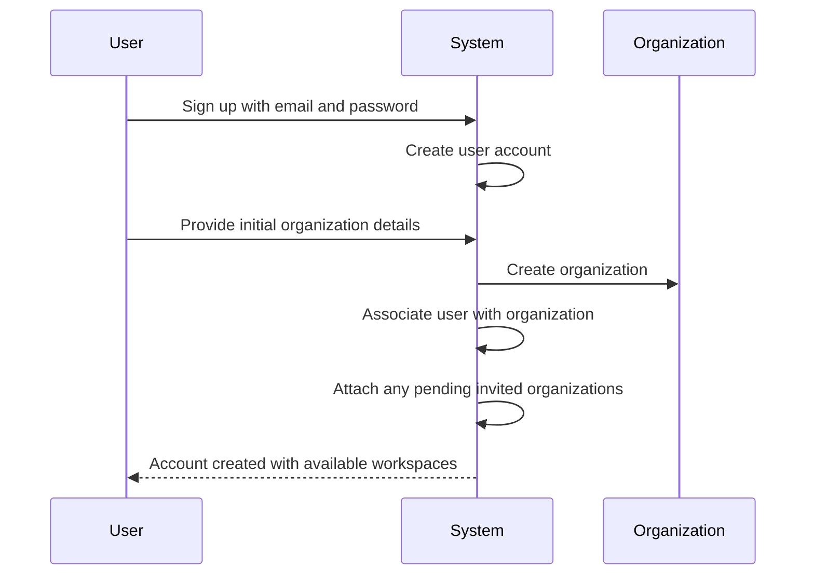

### Login and Organization Context Activation

- WHEN a user logs in with email and password, THE hrmTimeTracking system SHALL authenticate the UserAccount and begin organization context selection.
- WHEN the authenticated UserAccount belongs to more than one Organization, THE hrmTimeTracking system SHALL require the user to select which Organization to work in before organization-scoped work begins.
- WHEN the authenticated UserAccount belongs to exactly one Organization, THE hrmTimeTracking system SHALL activate that Organization as the current workspace.
- WHEN an Organization is selected after login, THE hrmTimeTracking system SHALL establish that Organization as the active context for the session.
- WHEN organization context is active, THE hrmTimeTracking system SHALL limit subsequent visible data and available actions to that selected Organization.
- THE hrmTimeTracking system SHALL allow a user to view the list of Organizations they belong to for workspace selection.
- WHEN a user changes the active workspace, THE hrmTimeTracking system SHALL switch the organization context without requiring the user to log out.
- WHEN organization context is switched, THE hrmTimeTracking system SHALL refresh the workspace so that only the newly selected Organization's data and actions are available.
- WHILE a user is working in one Organization context, THE hrmTimeTracking system SHALL prevent actions from being carried out against another Organization through that same active workspace state.

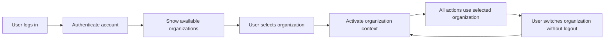

### Workspace Membership and Organization-Scoped Work

- THE hrmTimeTracking system SHALL maintain organization membership at the UserAccount level so that one UserAccount can work across multiple Organizations.
- WHEN a user belongs to multiple Organizations, THE hrmTimeTracking system SHALL let the user move between those Organizations by selecting a different active workspace.
- WHEN the active workspace changes, THE hrmTimeTracking system SHALL apply the newly selected Organization context to all subsequent business operations.
- WHILE a user is operating within a selected Organization, THE hrmTimeTracking system SHALL show only records that belong to that Organization.
- WHILE a user is operating within a selected Organization, THE hrmTimeTracking system SHALL create new business records only within that Organization.
- WHILE a user is operating within a selected Organization, THE hrmTimeTracking system SHALL update and remove business records only within that Organization.
- WHEN a user returns to the organization list, THE hrmTimeTracking system SHALL preserve the ability to choose any Organization that the UserAccount currently belongs to.
- WHEN organization membership changes because the user is added to another Organization, THE hrmTimeTracking system SHALL make the new Organization available as a selectable workspace.

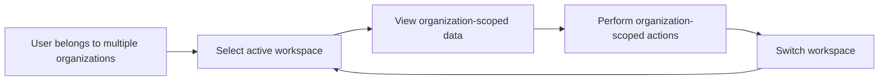

### Password Maintenance

- THE hrmTimeTracking system SHALL allow a user to change the password of an existing UserAccount.
- WHEN a user changes the password, THE hrmTimeTracking system SHALL keep the same UserAccount identity.
- WHEN a user changes the password, THE hrmTimeTracking system SHALL preserve the user's existing Organization memberships.
- WHEN a user changes the password, THE hrmTimeTracking system SHALL preserve access to organization context selection for the Organizations already linked to the UserAccount.

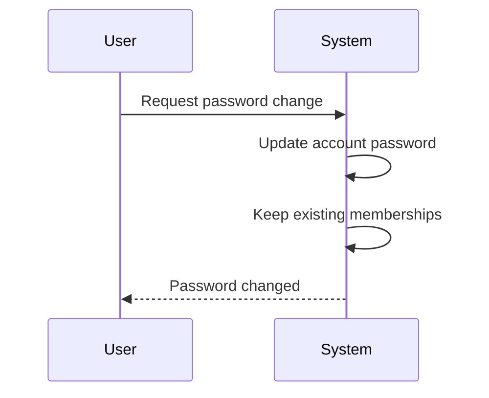

### Account Deletion and Ownership Dependency Resolution

- THE hrmTimeTracking system SHALL allow a user to request deletion of their UserAccount.
- IF the user is the sole owner of an Organization, THEN THE hrmTimeTracking system SHALL block UserAccount deletion until ownership is transferred or that Organization is deleted.
- WHEN a sole owner wants to delete the UserAccount, THE hrmTimeTracking system SHALL require completion of one of two dependency resolution paths before deletion proceeds: ownership transfer or organization deletion.
- WHEN ownership is transferred to another eligible member, THE hrmTimeTracking system SHALL allow the former sole owner to proceed with UserAccount deletion if no other sole-owner restriction remains.
- WHEN an Organization previously blocking account deletion is deleted, THE hrmTimeTracking system SHALL allow the former sole owner to proceed with UserAccount deletion if no other sole-owner restriction remains.
- WHEN UserAccount deletion succeeds, THE hrmTimeTracking system SHALL remove the UserAccount from its organization memberships.
- WHEN UserAccount deletion succeeds, THE hrmTimeTracking system SHALL mark the user's Employee records in other Organizations as deactivated.
- WHEN Employee records are deactivated because of UserAccount deletion, THE hrmTimeTracking system SHALL preserve those Employee records as organization history rather than removing them through this account deletion flow.

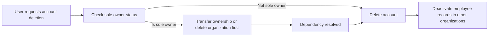

## UserProfile Operations

Each user has a single global profile that stores personal presentation details used across the platform. Users can view their profile information, including display name, avatar image, and phone number. Users can update these profile details whenever they need to keep their information current. The same profile is shared across every organization the user belongs to, so changes appear consistently in all organization contexts. Profile management is personal to the account holder rather than organization-specific administration. Other platform features that show a user's identity should reflect the latest saved profile information. The profile does not create separate versions per organization, which avoids conflicting identity details across workspaces. If a user belongs to multiple organizations, they still maintain only one shared profile.

### Global Profile View

THE hrmTimeTracking system SHALL provide each signed-in user with access to their global profile.
THE hrmTimeTracking system SHALL show the user's display name, avatar image, and phone number in the global profile view.
THE hrmTimeTracking system SHALL present the global profile as personal account information rather than organization-specific data.
THE hrmTimeTracking system SHALL show the same global profile information regardless of which organization context the user is currently working in.
THE hrmTimeTracking system SHALL allow the user to review their current profile details before making changes.
THE hrmTimeTracking system SHALL make the global profile available to users who belong to one organization or multiple organizations.

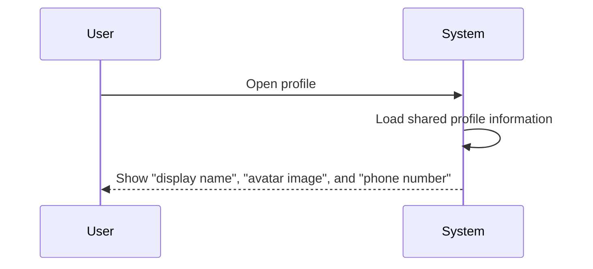

### Personal Profile Maintenance

THE hrmTimeTracking system SHALL allow users to maintain their own profile information directly.
THE hrmTimeTracking system SHALL treat profile maintenance as a personal account operation performed by the profile owner.
THE hrmTimeTracking system SHALL allow the user to update profile details whenever they need to keep their information current.
THE hrmTimeTracking system SHALL save profile changes to the user's single shared profile.
THE hrmTimeTracking system SHALL use the latest saved profile information in other platform features that display the user's identity.
THE hrmTimeTracking system SHALL preserve one ongoing profile record for the user instead of creating separate profile versions for different organizations.

### Display Name Update

WHEN a user edits their display name, THE hrmTimeTracking system SHALL update the display name in the user's global profile.
WHEN the display name update is saved, THE hrmTimeTracking system SHALL use the updated display name across all organization contexts the user belongs to.
WHEN the display name update is completed, THE hrmTimeTracking system SHALL show the new display name in profile-related views that use the user's identity.
THE hrmTimeTracking system SHALL allow the user to review their current display name and replace it with a new one as part of profile maintenance.

### Avatar Image Update

WHEN a user updates their avatar image, THE hrmTimeTracking system SHALL replace the previous avatar image in the user's global profile.
WHEN the avatar image update is saved, THE hrmTimeTracking system SHALL use the updated avatar image across all organization contexts the user belongs to.
WHEN the avatar image update is completed, THE hrmTimeTracking system SHALL show the new avatar image in profile-related views that use the user's identity.
THE hrmTimeTracking system SHALL allow the user to change their avatar image independently of other profile details.

### Phone Number Update

WHEN a user updates their phone number, THE hrmTimeTracking system SHALL store the new phone number in the user's global profile.
WHEN the phone number update is saved, THE hrmTimeTracking system SHALL make the updated phone number available from the same shared profile used across organizations.
THE hrmTimeTracking system SHALL allow the user to change their phone number independently of other profile details.
THE hrmTimeTracking system SHALL show the latest saved phone number when the user views their profile.

### Shared Profile Across Organizations

WHILE a user belongs to multiple organizations, THE hrmTimeTracking system SHALL keep one shared profile for that user across all organizations.
THE hrmTimeTracking system SHALL apply profile updates made in one organization context to the same user profile seen in every other organization context.
THE hrmTimeTracking system SHALL prevent the creation of separate organization-specific profile variations for the same user.
THE hrmTimeTracking system SHALL ensure that the profile shown in each workspace comes from the same shared profile source.

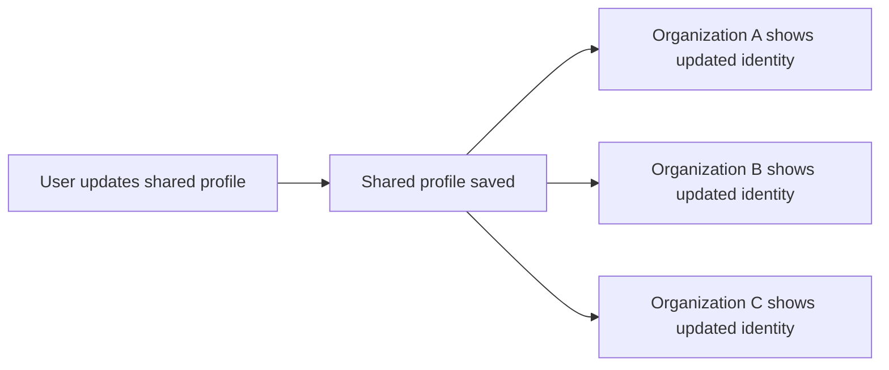

### Consistent Identity Across Workspaces

THE hrmTimeTracking system SHALL present a consistent user identity across all workspaces by using the user's single shared profile.
WHEN profile information changes, THE hrmTimeTracking system SHALL reflect the latest saved identity details wherever the platform shows that user's identity.
THE hrmTimeTracking system SHALL avoid conflicting identity details between workspaces for the same user.
WHILE a user switches between organizations without logging out, THE hrmTimeTracking system SHALL continue to use the same shared profile information for that user.

## Organization Operations

A user creates an organization during initial sign-up to establish a separate workspace for employees, projects, and time data. Each organization operates independently, and its data must remain isolated from all other organizations on the platform. Organization owners can view and edit organization settings such as name, description, logo image, currency, timezone, and fiscal start month. Users who belong to multiple organizations can access only the organization currently selected as their active workspace. Organization owners can review organization information to manage business identity and operational preferences. An organization can be deleted only when all pending timesheets have been resolved and there are no active employee contracts. If those conditions are not met, the delete operation must be refused. When an organization is deleted, all employees, projects, tasks, timelogs, and timesheets for that organization are permanently removed. The owner's account remains active after deletion, but it is no longer associated with that organization.

### Organization Creation During Sign-Up

THE hrmTimeTracking system SHALL allow a user to create an organization during initial sign-up.
THE hrmTimeTracking system SHALL create the new organization as the user's initial workspace.
THE hrmTimeTracking system SHALL capture the organization's name during creation.
THE hrmTimeTracking system SHALL allow the organization creator to provide the organization's description during creation.
THE hrmTimeTracking system SHALL allow the organization creator to provide a logo image during creation.
THE hrmTimeTracking system SHALL allow the organization creator to select the organization's currency during creation.
THE hrmTimeTracking system SHALL allow the organization creator to select the organization's timezone during creation.
THE hrmTimeTracking system SHALL allow the organization creator to set the organization's fiscal start month during creation.
WHEN organization creation is completed during sign-up, THE hrmTimeTracking system SHALL associate the new organization with the creating user.
WHEN organization creation is completed during sign-up, THE hrmTimeTracking system SHALL make the new organization available as the user's active workspace.

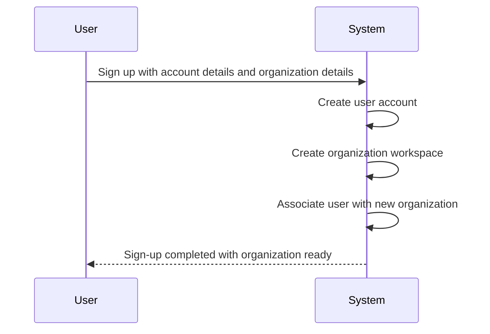

### Independent Organization Workspace and Active Context

THE hrmTimeTracking system SHALL treat each organization as an independent workspace for its own employees, projects, and business data.
THE hrmTimeTracking system SHALL scope organization operations to the organization currently selected by the user.
WHEN a user belongs to multiple organizations, THE hrmTimeTracking system SHALL allow the user to work in one selected organization context at a time.
WHEN a user selects an organization context, THE hrmTimeTracking system SHALL apply that organization context to all subsequent actions until the user switches organizations.
WHEN a user switches to another organization, THE hrmTimeTracking system SHALL update the active workspace without requiring the user to log out.
THE hrmTimeTracking system SHALL present organization information and operations according to the currently active workspace.
THE hrmTimeTracking system SHALL keep organization workspaces independent so that work performed in one organization does not operate on another organization.
THE hrmTimeTracking system SHALL enforce organization data isolation for all organization operations.

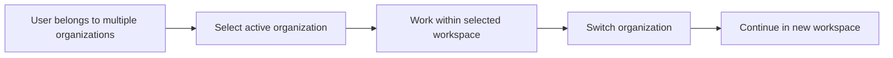

### Organization Settings Management

THE hrmTimeTracking system SHALL allow organization owners to view organization settings for the active workspace.
THE hrmTimeTracking system SHALL allow organization owners to edit organization settings for the active workspace.
THE hrmTimeTracking system SHALL support management of the organization's business identity and operational preferences through organization settings.
WHEN an organization owner updates organization settings, THE hrmTimeTracking system SHALL save the revised settings for that organization.
WHEN organization settings are updated, THE hrmTimeTracking system SHALL reflect the updated settings in the active workspace.
THE hrmTimeTracking system SHALL include the organization name as an editable setting.
THE hrmTimeTracking system SHALL include the organization description as an editable setting.
THE hrmTimeTracking system SHALL include the organization logo image as an editable setting.
THE hrmTimeTracking system SHALL include the organization currency as an editable setting.
THE hrmTimeTracking system SHALL include the organization timezone as an editable setting.
THE hrmTimeTracking system SHALL include the fiscal start month as an editable setting.

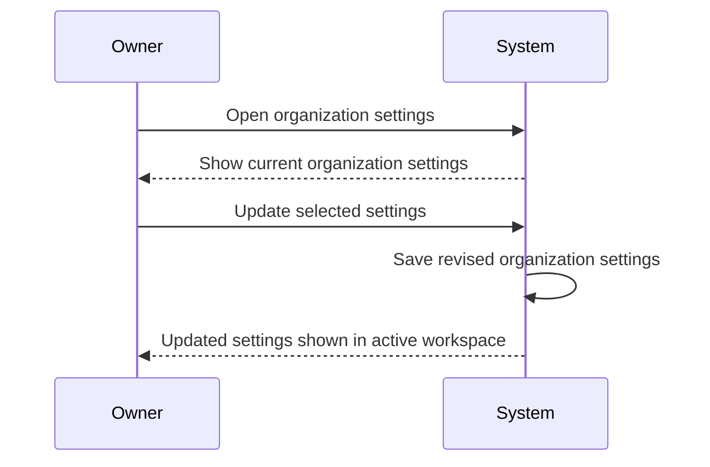

### Organization Identity and Operational Preference Updates

WHEN an organization owner edits the organization name, THE hrmTimeTracking system SHALL update the organization's displayed name for that organization.
WHEN an organization owner edits the organization description, THE hrmTimeTracking system SHALL update the organization's description for that organization.
WHEN an organization owner updates the organization logo image, THE hrmTimeTracking system SHALL replace the previous logo image for that organization.
WHEN an organization owner selects a different organization currency, THE hrmTimeTracking system SHALL apply the new currency setting to that organization.
WHEN an organization owner selects a different organization timezone, THE hrmTimeTracking system SHALL apply the new timezone setting to that organization.
WHEN an organization owner changes the fiscal start month, THE hrmTimeTracking system SHALL store the new fiscal start month for that organization.
THE hrmTimeTracking system SHALL keep these updates limited to the organization in which the changes were made.
WHEN these settings are changed, THE hrmTimeTracking system SHALL make the updated values available in subsequent use of that organization's workspace.

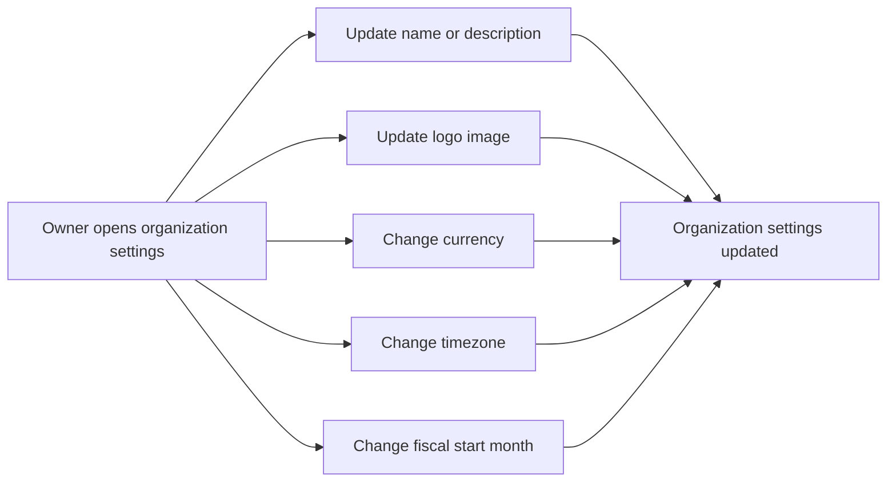

### Organization Deletion Workflow

THE hrmTimeTracking system SHALL allow organization owners to initiate deletion of their organization.
WHEN an organization owner requests organization deletion, THE hrmTimeTracking system SHALL evaluate whether all pending timesheets have been resolved.
WHEN an organization owner requests organization deletion, THE hrmTimeTracking system SHALL evaluate whether any active employee contracts remain in the organization.
WHEN all pending timesheets are resolved and no active employee contracts remain, THE hrmTimeTracking system SHALL delete the organization.
WHEN organization deletion is completed, THE hrmTimeTracking system SHALL permanently delete all employees in that organization.
WHEN organization deletion is completed, THE hrmTimeTracking system SHALL permanently delete all projects in that organization.
WHEN organization deletion is completed, THE hrmTimeTracking system SHALL permanently delete all tasks in that organization.
WHEN organization deletion is completed, THE hrmTimeTracking system SHALL permanently delete all timelogs in that organization.
WHEN organization deletion is completed, THE hrmTimeTracking system SHALL permanently delete all timesheets in that organization.
WHEN organization deletion is completed, THE hrmTimeTracking system SHALL retain the owner's user account.
WHEN organization deletion is completed, THE hrmTimeTracking system SHALL remove the deleted organization from the retained owner's organization associations.

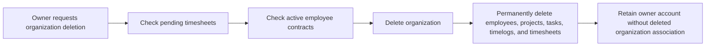

## OrganizationInvitation Operations

Users with employee management permission can invite people to join an organization by email. If the invited email already belongs to an existing account, the user is added directly to the organization instead of waiting for a separate sign-up flow. If the invited email does not yet have an account, the platform creates a pending invitation for that organization. Pending invitations remain tied to the invited email until that person signs up. When a new user signs up with the same email, they are automatically added to the organizations where invitations were pending. Authorized users need to be able to review invitations as part of managing organization membership. Invitation handling must respect organization boundaries so invitations affect only the intended organization. The invitation process supports onboarding without requiring managers to know whether the employee has already registered.

### Employee Invitation by Email

WHEN a user starts organization membership onboarding for a person, THE hrmTimeTracking SHALL provide an invitation flow based on the invited email address.

WHEN a user with employee management permission submits an invitation email for the current organization, THE hrmTimeTracking SHALL initiate organization invitation processing for that email.

THE hrmTimeTracking SHALL associate each organization invitation with the current organization and the invited email address.

THE hrmTimeTracking SHALL support invitation handling without requiring the inviter to know whether the invited person already has a user account.

WHEN an invitation is created or resolved, THE hrmTimeTracking SHALL make the result available to organization membership management for follow-up.

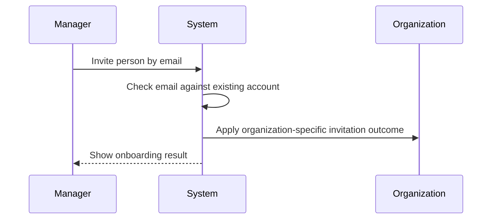

### Direct Organization Addition for Existing Accounts

WHEN the invited email address already belongs to an existing user account, THE hrmTimeTracking SHALL add that user to the current organization instead of creating a waiting sign-up step.

WHEN an existing account is added through an invitation, THE hrmTimeTracking SHALL treat the invitation outcome as organization membership onboarding for that organization.

THE hrmTimeTracking SHALL ensure that direct addition of an existing account affects only the organization from which the invitation was initiated.

WHEN the existing account is added to the organization, THE hrmTimeTracking SHALL make that membership available in the user's organization selection context.

WHEN an existing account joins through invitation processing, THE hrmTimeTracking SHALL record the invitation outcome as part of the organization invitation business flow.

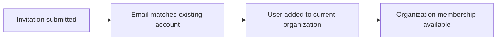

### Pending Invitation Creation for Unregistered Email

WHEN the invited email address does not belong to an existing user account, THE hrmTimeTracking SHALL create a pending organization invitation for that email.

THE hrmTimeTracking SHALL keep the pending invitation associated with the organization that issued it.

THE hrmTimeTracking SHALL keep the pending invitation associated with the invited email address until it is resolved through sign-up with the same email.

WHEN a pending invitation exists, THE hrmTimeTracking SHALL preserve it as part of the organization membership onboarding flow for that invited email.

WHEN authorized users review organization membership onboarding, THE hrmTimeTracking SHALL present pending invitations as unresolved invitation items.

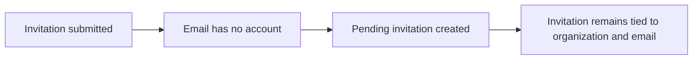

### Automatic Organization Join After Matching Sign-Up

WHEN a new user account is created with an email address that matches one or more pending invitations, THE hrmTimeTracking SHALL automatically add that user to the invited organizations.

WHEN automatic organization joining occurs after sign-up, THE hrmTimeTracking SHALL resolve only the pending invitations tied to the same email address.

THE hrmTimeTracking SHALL apply automatic organization joining as a continuation of the pending invitation onboarding flow.

WHEN pending invitations are resolved through matching sign-up, THE hrmTimeTracking SHALL make the resulting organization memberships available in the user's organization selection context.

WHEN a user completes sign-up from a previously invited email address, THE hrmTimeTracking SHALL complete organization onboarding without requiring a separate invitation acceptance step.

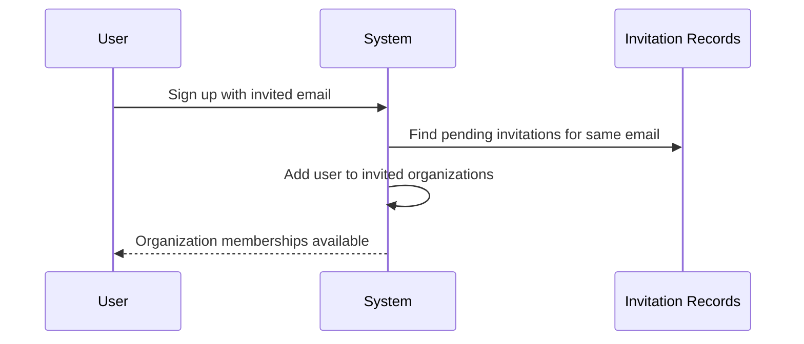

### Invitation Matching by Email Address

THE hrmTimeTracking SHALL use the invited email address as the matching basis for organization invitation resolution.

WHEN the platform evaluates whether an invitation should be resolved at sign-up, THE hrmTimeTracking SHALL compare the sign-up email address to the invited email address.

THE hrmTimeTracking SHALL keep pending invitation resolution tied to the invited email address rather than to an unrelated user account.

WHEN invitation processing produces organization membership, THE hrmTimeTracking SHALL do so only for the email address associated with that invitation.

THE hrmTimeTracking SHALL maintain invitation identity consistently across pending invitation creation, sign-up matching, and organization onboarding completion.

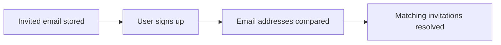

### Review of Organization Invitations

WHEN authorized users manage organization membership onboarding, THE hrmTimeTracking SHALL provide a review view for organization invitations.

THE hrmTimeTracking SHALL present invitation review within the context of the current organization.

WHEN invitation review is displayed, THE hrmTimeTracking SHALL distinguish unresolved pending invitations from invitations already resolved into organization membership.

THE hrmTimeTracking SHALL support invitation review as part of monitoring which invited people are still waiting to join the organization.

WHEN authorized users review invitations, THE hrmTimeTracking SHALL allow them to understand the current onboarding state for each invited email address.

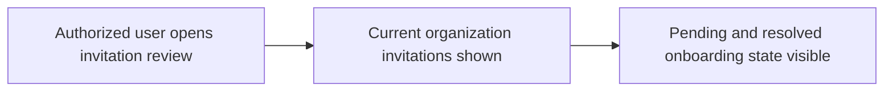

### Organization-Scoped Invitation Handling

THE hrmTimeTracking SHALL process every organization invitation within the currently selected organization context.

WHEN an invitation is created, resolved, or reviewed, THE hrmTimeTracking SHALL apply that action only to the intended organization.

THE hrmTimeTracking SHALL prevent invitation handling in one organization from changing membership in another organization.

WHEN a user belongs to multiple organizations, THE hrmTimeTracking SHALL keep invitation outcomes separated by the organization in which the invitation was issued.

THE hrmTimeTracking SHALL ensure that invitation records and resulting memberships respect strict organization data isolation throughout the onboarding flow.

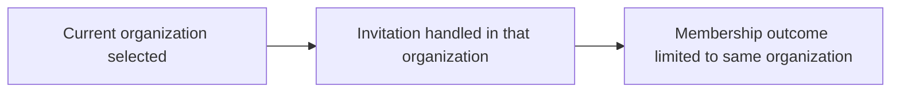

### Membership Onboarding Flow

THE hrmTimeTracking SHALL support a single onboarding workflow that begins with invitation by email and ends with organization membership.

WHEN the invited email already belongs to an existing account, THE hrmTimeTracking SHALL complete onboarding by adding that account directly to the organization.

WHEN the invited email does not yet belong to an existing account, THE hrmTimeTracking SHALL continue onboarding through a pending invitation until matching sign-up occurs.

WHEN matching sign-up occurs for a pending invitation, THE hrmTimeTracking SHALL complete onboarding by adding the new user to the invited organization.

THE hrmTimeTracking SHALL provide a consistent onboarding outcome regardless of whether organization membership is completed immediately or after later sign-up.

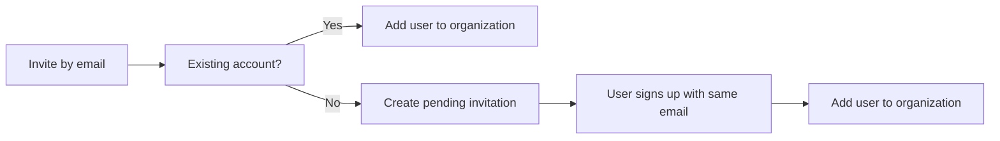

## Role Operations

Each organization maintains its own set of roles to control what employees can do inside that organization. The platform provides three built-in roles: Owner, Manager, and Employee, and these roles cannot be deleted. Organization owners can view all roles and their permissions to understand access within the organization. Organization owners can create custom roles by defining a name and selecting from the available permission set. Organization owners can edit custom roles when responsibilities change. Custom roles can be deleted only when no employees are currently assigned to them. Every employee in an organization must be assigned exactly one role, and that role determines the actions they may perform. Users with employee management permission can change a person's assigned role as part of employee administration. Role definitions and assignments apply only within the current organization and do not carry over to other organizations.

### Organization-Specific Role Catalog

THE hrmTimeTracking system SHALL maintain a separate role catalog for each organization.

THE hrmTimeTracking system SHALL show organization owners the roles defined for the currently selected organization.

THE hrmTimeTracking system SHALL associate each role with that organization only.

WHEN a user works in one organization, THE hrmTimeTracking system SHALL apply only the roles defined for that organization.

WHEN a user switches to another organization, THE hrmTimeTracking system SHALL present the role catalog of the newly selected organization.

THE hrmTimeTracking system SHALL keep role definitions and role usage independent between organizations.

```mermaid
flowchart LR
    A["User selects organization"] --> B["System loads organization role catalog"]
    B --> C["System applies roles only within selected organization"]
    C --> D["User may switch organization"]
    D --> E["System loads different organization role catalog"]
```

### Built-In Roles

THE hrmTimeTracking system SHALL provide the built-in roles Owner, Manager, and Employee in every organization.

THE hrmTimeTracking system SHALL identify Owner as the built-in role with full access to all features in the organization.

THE hrmTimeTracking system SHALL identify Owner as the built-in role that can manage roles and members in the organization.

THE hrmTimeTracking system SHALL identify Manager as the built-in role that can manage employees, manage projects, approve timesheets, and view reports.

THE hrmTimeTracking system SHALL identify Employee as the built-in role that can track time, submit timesheets, and view that employee's own data.

THE hrmTimeTracking system SHALL present the built-in roles as available role choices within each organization.

THE hrmTimeTracking system SHALL distinguish built-in roles from custom roles in role management.

```mermaid
flowchart LR
    A["Built-in roles"] --> B["Owner"]
    A --> C["Manager"]
    A --> D["Employee"]
    B --> E["Full access and role or member management"]
    C --> F["Employee management, project management, timesheet approval, report viewing"]
    D --> G["Time tracking, timesheet submission, own data viewing"]
```

### Built-In Role Protection

THE hrmTimeTracking system SHALL preserve the built-in roles Owner, Manager, and Employee in every organization.

THE hrmTimeTracking system SHALL prevent built-in roles from being removed from the organization role catalog.

WHEN organization owners manage roles, THE hrmTimeTracking system SHALL treat built-in roles as permanent roles.

WHEN role maintenance actions are performed, THE hrmTimeTracking system SHALL keep the built-in role definitions available for assignment within the organization.

```mermaid
flowchart LR
    A["Organization role catalog"] --> B["Owner"]
    A --> C["Manager"]
    A --> D["Employee"]
    B --> E["Permanent built-in role"]
    C --> F["Permanent built-in role"]
    D --> G["Permanent built-in role"]
```

### Custom Role Creation and Permission Selection

WHEN an organization owner creates a custom role, THE hrmTimeTracking system SHALL allow entry of a role name for that organization.

WHEN an organization owner creates a custom role, THE hrmTimeTracking system SHALL allow selection from the available permission set for that role.

THE hrmTimeTracking system SHALL store the selected permissions as the effective permission set of the custom role.

THE hrmTimeTracking system SHALL create custom roles as organization-specific roles.

WHEN a custom role is created, THE hrmTimeTracking system SHALL make the role available for employee assignment in that organization.

THE hrmTimeTracking system SHALL support custom role permission selection from the available permissions defined for role management in the organization.

```mermaid
sequenceDiagram
    participant O as Organization Owner
    participant S as System
    O->>S: Create custom role
    O->>S: Enter role name
    O->>S: Select permissions
    S->>S: Save role for current organization
    S-->>O: Custom role available for assignment
```

### Custom Role Editing

WHEN an organization owner edits a custom role, THE hrmTimeTracking system SHALL allow the role name to be updated.

WHEN an organization owner edits a custom role, THE hrmTimeTracking system SHALL allow the selected permissions to be updated.

THE hrmTimeTracking system SHALL apply custom role changes only within the current organization.

WHEN a custom role is updated, THE hrmTimeTracking system SHALL use the updated role definition for future organization access decisions.

THE hrmTimeTracking system SHALL preserve the distinction between edited custom roles and built-in roles.

```mermaid
sequenceDiagram
    participant O as Organization Owner
    participant S as System
    O->>S: Open custom role
    O->>S: Change role name or permissions
    S->>S: Update role in current organization
    S-->>O: Updated custom role shown
```

### Custom Role Deletion

WHEN an organization owner deletes a custom role that has no employees assigned, THE hrmTimeTracking system SHALL remove that custom role from the current organization's role catalog.

THE hrmTimeTracking system SHALL limit custom role deletion to roles created within the current organization.

WHEN a custom role is deleted, THE hrmTimeTracking system SHALL stop offering that role for new employee assignments in that organization.

THE hrmTimeTracking system SHALL keep built-in roles outside the custom role deletion flow.

```mermaid
flowchart LR
    A["Owner selects custom role"] --> B["System checks whether employees are assigned"]
    B --> C["No assigned employees"]
    C --> D["Custom role deleted from organization"]
```

### Single Role Assignment Per Employee

THE hrmTimeTracking system SHALL assign exactly one role to each employee within an organization.

THE hrmTimeTracking system SHALL use that assigned role as the employee's effective access definition for that organization.

WHEN an employee belongs to more than one organization, THE hrmTimeTracking system SHALL allow that employee to have a different single role in each organization.

THE hrmTimeTracking system SHALL keep role assignment as part of the employee's organization membership.

WHEN employee details are viewed in an organization, THE hrmTimeTracking system SHALL show the one role currently assigned to that employee in that organization.

```mermaid
flowchart LR
    A["Employee in organization"] --> B["One assigned role"]
    B --> C["Effective access for that organization"]
    A --> D["Different organization"]
    D --> E["Different one assigned role allowed"]
```

### Role Reassignment in Employee Administration

WHEN a user with employee management permission changes an employee's role, THE hrmTimeTracking system SHALL replace the employee's current role assignment with the newly selected role.

THE hrmTimeTracking system SHALL support role reassignment as part of employee administration within the current organization.

WHEN role reassignment is completed, THE hrmTimeTracking system SHALL use the new role as the employee's effective access definition for subsequent actions in that organization.

WHEN role reassignment is completed, THE hrmTimeTracking system SHALL record the role assignment change as a significant action in the activity log.

```mermaid
sequenceDiagram
    participant M as Employee Manager
    participant S as System
    M->>S: Select employee in current organization
    M->>S: Choose new role
    S->>S: Replace existing role assignment
    S->>S: Refresh effective access
    S->>S: Record role assignment change
    S-->>M: Updated employee role shown
```

### Organization-Scoped Permission Application

THE hrmTimeTracking system SHALL apply role permissions according to the employee's assigned role in the currently selected organization.

WHEN a user belongs to multiple organizations, THE hrmTimeTracking system SHALL evaluate permissions separately for each organization.

WHEN a user changes organization context, THE hrmTimeTracking system SHALL refresh the user's effective permissions for the newly selected organization.

THE hrmTimeTracking system SHALL ensure that a role granted in one organization does not grant access in another organization.

THE hrmTimeTracking system SHALL use organization-scoped role permissions for all subsequent actions after organization selection.

```mermaid
flowchart LR
    A["User selects current organization"] --> B["System identifies employee role in that organization"]
    B --> C["System applies that role's permissions"]
    C --> D["Subsequent actions use organization-scoped access"]
    A --> E["User switches organization"]
    E --> F["System refreshes effective permissions"]
```

## Employee Operations

Users with employee management permission can add people to the organization through the invitation flow and maintain their employee records after they join. Each employee record links a person to one organization and captures their assigned role, department, position or title, employment type, and status. Authorized users can update department, position or title, and employment type when a person's work arrangement changes. Users with employee management permission can deactivate employees instead of removing their history from the organization. Deactivated employees cannot log time or submit timesheets, but their existing timelogs and timesheets remain available as historical records. Deactivated employees can later be reactivated to restore normal participation. Users with employee view permission can browse the employee list, and the list must support pagination for large organizations. Employees can search by name and filter the list by department, employment type, and status. Employee visibility and management must remain limited to the selected organization.

### Employee Membership and Record Creation

THE hrmTimeTracking SHALL create an employee record in the currently selected organization when a person joins that organization through the invitation flow defined in OrganizationInvitation Operations.
THE hrmTimeTracking SHALL associate each employee record with one user account and one organization.
THE hrmTimeTracking SHALL maintain organization employee membership through the employee record for that organization only.
THE hrmTimeTracking SHALL assign exactly one organization role to each employee record.
WHEN an authorized user maintains an employee record, THE hrmTimeTracking SHALL allow the assigned organization role to be set or changed.
WHERE department information is provided, THE hrmTimeTracking SHALL associate the employee record with that department.
WHERE no department is provided, THE hrmTimeTracking SHALL keep the employee record without a department assignment.
WHERE position or title information is provided, THE hrmTimeTracking SHALL store that position or title on the employee record.
WHEN employment type is maintained for an employee, THE hrmTimeTracking SHALL record one of the supported employment types for that employee record.
THE hrmTimeTracking SHALL keep employee record management scoped to the currently selected organization.

```mermaid
flowchart LR
    A["Invitation accepted or existing account added"] --> B["Employee record created"]
    B --> C["Organization role assigned"]
    C --> D["Optional department linked"]
    D --> E["Optional position or title stored"]
    E --> F["Employment type stored"]
```


### Employee Record Maintenance

WHEN an authorized user updates an employee record, THE hrmTimeTracking SHALL allow changes to the employee's department assignment.
WHEN an authorized user updates an employee record, THE hrmTimeTracking SHALL allow the employee's department assignment to be cleared.
WHEN an authorized user updates an employee record, THE hrmTimeTracking SHALL allow changes to the employee's position or title.
WHEN an authorized user updates an employee record, THE hrmTimeTracking SHALL allow changes to the employee's employment type.
WHEN an authorized user updates an employee record, THE hrmTimeTracking SHALL keep the employee's organization membership unchanged unless membership is changed through the invitation or account lifecycle flows defined elsewhere.
WHEN an authorized user changes the employee's assigned organization role, THE hrmTimeTracking SHALL apply the new role to that employee record.
THE hrmTimeTracking SHALL retain the current employee status as part of employee record management.
WHEN employee record details are updated, THE hrmTimeTracking SHALL reflect the updated department, position or title, employment type, and assigned organization role in that organization's employee views.

```mermaid
sequenceDiagram
    participant M as Maintainer
    participant S as System
    M->>S: Update employee record
    S->>S: Apply record changes in selected organization
    S-->>M: Updated employee record
```


### Employee Status Deactivation and Reactivation

THE hrmTimeTracking SHALL support active and deactivated employee status within each organization.
WHEN an authorized user deactivates an employee, THE hrmTimeTracking SHALL change that employee's status from active to deactivated in the selected organization.
WHILE an employee is deactivated, THE hrmTimeTracking SHALL prevent that employee from logging time.
WHILE an employee is deactivated, THE hrmTimeTracking SHALL prevent that employee from submitting timesheets.
WHEN an employee is deactivated, THE hrmTimeTracking SHALL preserve the employee's existing timelogs as historical records.
WHEN an employee is deactivated, THE hrmTimeTracking SHALL preserve the employee's existing timesheets as historical records.
WHEN an authorized user reactivates an employee, THE hrmTimeTracking SHALL change that employee's status from deactivated to active.
WHEN an employee is reactivated, THE hrmTimeTracking SHALL restore the employee's ability to participate in time tracking and timesheet submission according to the employee's assigned role.
THE hrmTimeTracking SHALL keep deactivation and reactivation scoped to the employee record in the currently selected organization.

```mermaid
flowchart LR
    A["Active employee"] --> B["Deactivate employee"]
    B --> C["Deactivated employee"]
    C --> D["Time logging blocked"]
    C --> E["Timesheet submission blocked"]
    C --> F["Historical timelogs preserved"]
    C --> G["Historical timesheets preserved"]
    C --> H["Reactivate employee"]
    H --> I["Active employee"]
```


### Employee Directory Browsing

THE hrmTimeTracking SHALL provide a paginated employee list for the currently selected organization.
THE hrmTimeTracking SHALL present employee records in the list using the organization-specific employee data defined in Employee Membership and Record Creation.
WHEN a user browses the employee list, THE hrmTimeTracking SHALL support filtering employees by department.
WHEN a user browses the employee list, THE hrmTimeTracking SHALL support filtering employees by employment type.
WHEN a user browses the employee list, THE hrmTimeTracking SHALL support filtering employees by status.
WHEN a user browses the employee list, THE hrmTimeTracking SHALL support searching employees by name.
WHEN search text is provided, THE hrmTimeTracking SHALL limit the list to employee records whose names match the search input.
WHEN one or more employee filters are applied, THE hrmTimeTracking SHALL return the paginated results for the currently selected filter combination.
WHEN a user changes pages in the employee list, THE hrmTimeTracking SHALL return the corresponding page of employee records within the current organization context.
THE hrmTimeTracking SHALL keep employee directory browsing isolated to the currently selected organization.

```mermaid
flowchart LR
    A["Open employee list"] --> B["Apply department filter"]
    A --> C["Apply employment type filter"]
    A --> D["Apply status filter"]
    A --> E["Search by name"]
    B --> F["Paginated employee results"]
    C --> F
    D --> F
    E --> F
    F --> G["Move to another page"]
```

## EmployeeContract Operations

Users with employee management permission can create contracts for employees to maintain their employment terms over time. An employee may have multiple contracts as a historical record, but only one contract can be active at any moment. When a new contract is created, the current active contract is automatically ended on the day before the new contract starts. This ensures there is no overlap between active contract periods. Users with employee management permission can edit the current active contract if employment terms need to be corrected or updated. Past contracts are immutable and cannot be edited because they serve as a historical record. Employees can view their own contracts to understand their current and previous terms. Users with employee view permission can view contracts for any employee in the organization. Contract history must stay available even when newer contracts replace older active ones.

### Employee Contract Creation and Lifecycle

WHEN a user with employee management permission creates a contract for an employee, THE hrmTimeTracking system SHALL create the contract as part of that employee's contract history.

THE hrmTimeTracking system SHALL allow an employee to have multiple contracts over time as historical records.

THE hrmTimeTracking system SHALL record each contract with a start date, an optional end date, a pay rate, a pay period, working hours per week, and optional notes.

WHEN a new contract is created for an employee who already has an active contract, THE hrmTimeTracking system SHALL automatically set the previous active contract end date to the day before the new contract start date.

THE hrmTimeTracking system SHALL ensure that only one contract is active for an employee at any time.

THE hrmTimeTracking system SHALL preserve earlier contracts after a newer contract is created.

WHEN a new contract replaces an active contract, THE hrmTimeTracking system SHALL keep both contracts available in the employee's contract history.

THE hrmTimeTracking system SHALL support ongoing contracts by allowing a contract to have no end date.

THE hrmTimeTracking system SHALL track the contract pay period as hourly, daily, weekly, or monthly.

THE hrmTimeTracking system SHALL track working hours per week for each contract.

```mermaid
flowchart LR
    A["Active contract"] --> B["New contract created"]
    B --> C["Previous contract ends day before new start"]
    C --> D["New contract becomes active"]
    D --> E["Contract history preserved"]
```

### Active Contract Maintenance and Historical Record Protection

WHEN a user with employee management permission updates an employee contract, THE hrmTimeTracking system SHALL allow edits only to the current active contract.

THE hrmTimeTracking system SHALL treat past contracts as immutable historical records.

WHEN a contract is no longer the current active contract, THE hrmTimeTracking system SHALL keep that contract unchanged as part of the employee's history.

THE hrmTimeTracking system SHALL maintain non-overlapping contract periods across all contracts for the same employee.

WHEN the active contract is edited, THE hrmTimeTracking system SHALL retain the employee's earlier contracts unchanged.

THE hrmTimeTracking system SHALL keep contract history available after corrections or updates to the current active contract.

WHEN contract terms are viewed in sequence, THE hrmTimeTracking system SHALL present them as a continuous employment history without replacing prior records.

THE hrmTimeTracking system SHALL preserve pay period tracking for historical contracts.

THE hrmTimeTracking system SHALL preserve working hours per week tracking for historical contracts.

```mermaid
flowchart LR
    A["Current active contract"] --> B["Edit active contract"]
    B --> C["Updated active contract"]
    A --> D["Earlier contracts"]
    D --> E["Historical records remain unchanged"]
```

### Contract Viewing

WHEN an employee views contracts, THE hrmTimeTracking system SHALL show that employee only their own current and past contracts.

WHEN a user with employee view permission views an employee contract record, THE hrmTimeTracking system SHALL show the selected employee's current and past contracts.

THE hrmTimeTracking system SHALL present contract history so that current terms and previous terms can be reviewed together.

THE hrmTimeTracking system SHALL show the pay period for each contract in the employee's history.

THE hrmTimeTracking system SHALL show working hours per week for each contract in the employee's history.

WHERE an employee has multiple historical contracts, THE hrmTimeTracking system SHALL allow viewers to review the full sequence of those contracts.

THE hrmTimeTracking system SHALL keep contract history available even after newer contracts replace older active contracts.

```mermaid
flowchart LR
    A["Employee or authorized viewer"] --> B["Open employee contracts"]
    B --> C["View active contract"]
    B --> D["View historical contracts"]
    C --> E["Review current terms"]
    D --> F["Review prior terms"]
```

## Department Operations

Each organization can maintain a list of departments to represent its internal structure. Users with organization management permission can create departments with a name, description, and an optional parent department. Department hierarchy is limited to one level of nesting, so a department can have a parent but not a deeper chain of ancestors. Authorized users can edit department details when teams are renamed or reorganized. Employees can view the list of departments within their organization. When a department is deleted, employees previously assigned to it are not removed from the organization. Instead, their department assignment is cleared so their records remain intact. Department operations must therefore support organizational restructuring without losing employee history. Departments belong only to the current organization and are not shared across organizations.

### Department Creation and Description Management

WHEN a user creates a department within the current organization, THE hrmTimeTracking system SHALL create the department with a name, a description, and an optional parent department.

WHEN a department is created without a parent department, THE hrmTimeTracking system SHALL treat the department as a top-level department in the current organization.

WHERE a description is provided during department creation, THE hrmTimeTracking system SHALL store and display that description as part of the department record.

WHEN a department is created, THE hrmTimeTracking system SHALL associate that department only with the organization that is currently selected by the user.

THE hrmTimeTracking system SHALL make the newly created department available for employee department assignment within the same organization.

```mermaid
flowchart LR
    A["Department details entered"] --> B["Department created in current organization"]
    B --> C["Department available in department list"]
    C --> D["Department available for employee assignment"]
```

### Parent Department Assignment and One-Level Nesting

WHEN a user assigns a parent department during department creation or department editing, THE hrmTimeTracking system SHALL link the department to one existing department in the same organization.

WHERE a department has a parent department, THE hrmTimeTracking system SHALL represent the relationship as a single parent-child level.

THE hrmTimeTracking system SHALL support department structures with top-level departments and one nested level beneath them.

IF a department already has a parent department, THEN THE hrmTimeTracking system SHALL not allow that department to be used as the parent of another department.

WHEN a parent department is changed, THE hrmTimeTracking system SHALL update the department's position within the one-level department structure of the current organization.

```mermaid
flowchart LR
    A["Top-level department"] --> B["Child department"]
```

### Department Detail Updates

WHEN a user edits a department, THE hrmTimeTracking system SHALL allow updates to the department name, description, and parent department.

WHEN department details are updated, THE hrmTimeTracking system SHALL preserve the department as the same department within the organization rather than creating a new department.

WHEN a department name is changed, THE hrmTimeTracking system SHALL show the updated name wherever that department is referenced within the current organization.

WHEN a department description is changed, THE hrmTimeTracking system SHALL show the updated description as the current department description.

WHEN a parent department is removed during editing, THE hrmTimeTracking system SHALL treat the department as a top-level department.

```mermaid
sequenceDiagram
    participant U as User
    participant S as System
    U->>S: Edit department details
    S->>S: Update department record in current organization
    S-->>U: Show updated department information
```

### Department List Viewing

WHEN an employee views departments in the current organization, THE hrmTimeTracking system SHALL show the department list for that organization.

THE hrmTimeTracking system SHALL present each department with its current name and, where available, its description.

WHERE a department has a parent department, THE hrmTimeTracking system SHALL show that department within the one-level organizational structure.

THE hrmTimeTracking system SHALL limit the visible department list to departments that belong to the currently selected organization.

WHEN department details are created or updated, THE hrmTimeTracking system SHALL reflect the current department information in the department list.

```mermaid
flowchart LR
    A["Employee opens department list"] --> B["System loads current organization departments"]
    B --> C["List shows top-level and child departments"]
```

### Department Deletion and Employee Retention

WHEN a user deletes a department, THE hrmTimeTracking system SHALL remove the department from the current organization's department structure.

WHEN a department is deleted, THE hrmTimeTracking system SHALL keep all employees who were assigned to that department in the organization.

WHEN a department is deleted, THE hrmTimeTracking system SHALL clear the department assignment of each employee who was assigned to that department.

WHEN employee department assignments are cleared because of department deletion, THE hrmTimeTracking system SHALL preserve the employees' other records in the organization.

WHEN a department is deleted, THE hrmTimeTracking system SHALL remove that department from the department list of the current organization.

```mermaid
flowchart LR
    A["Department selected for deletion"] --> B["Department removed"]
    B --> C["Assigned employees remain in organization"]
    C --> D["Employee department assignment cleared"]
```

### Organization-Specific Department Structure

THE hrmTimeTracking system SHALL maintain departments as organization-specific records.

WHEN a user works in one organization, THE hrmTimeTracking system SHALL use only that organization's department structure for department creation, editing, viewing, and deletion.

THE hrmTimeTracking system SHALL not share a department between organizations.

WHEN a user switches organization context, THE hrmTimeTracking system SHALL show the department structure of the newly selected organization.

WHERE a user belongs to multiple organizations, THE hrmTimeTracking system SHALL keep department operations scoped to the currently selected organization.

```mermaid
flowchart LR
    A["User in organization context"] --> B["Department operations use selected organization"]
    B --> C["Departments shown only for that organization"]
```

## Project Operations

Users with project management permission can create projects to organize work and time tracking within an organization. Each project can include a name, optional description, required color code, status, optional budget hours, and optional start and end dates. Authorized users can edit project details as plans, schedules, or presentation needs change. Projects can move into active, archived, or completed status based on their lifecycle. Archived and completed projects remain visible for reference, but they cannot receive new timelogs. Existing timelogs linked to archived or completed projects must be preserved. Users with project management permission can delete a project only when no timelogs are associated with it. Users with project view permission can browse the project list, and the list must support pagination and filtering by status. Project visibility and management are limited to the current organization.

### Project Creation and Detail Management

THE hrmTimeTracking SHALL allow users with project management permission to create a project within the currently selected organization.

THE hrmTimeTracking SHALL require a project to include a name and a color code when it is created.

THE hrmTimeTracking SHALL allow a project to include an optional description when it is created.

THE hrmTimeTracking SHALL allow a project to include optional budget hours when it is created.

THE hrmTimeTracking SHALL allow a project to include an optional start date and an optional end date when it is created.

THE hrmTimeTracking SHALL create a new project in the active state unless the creating user chooses another supported project state during creation.

THE hrmTimeTracking SHALL allow users with project management permission to edit project details after creation, including the name, description, color code, budget hours, start date, end date, and status.

WHEN a user updates a project's description, THE hrmTimeTracking SHALL store the revised project description for that project in the current organization.

WHEN a user updates a project's color code, THE hrmTimeTracking SHALL use the revised color code as the project's display color in the current organization.

WHEN a user updates a project's budget hours, THE hrmTimeTracking SHALL use the revised budget hours as the project's current planned hour total.

WHEN a user updates a project's schedule dates, THE hrmTimeTracking SHALL use the revised start date and end date as the project's current schedule dates.

WHEN a project is created, THE hrmTimeTracking SHALL make that project available for subsequent project membership, task, and time tracking operations within the same organization.

```mermaid
flowchart LR
    A["Create project"] --> B["Enter required name and color code"]
    B --> C["Add optional description, budget hours, and schedule dates"]
    C --> D["Save project in current organization"]
    D --> E["Project available for work tracking"]
```

### Project Status Lifecycle Operations

THE hrmTimeTracking SHALL support the project states active, archived, and completed.

WHEN a project is in the active state, THE hrmTimeTracking SHALL allow that project to remain available for ongoing work and time tracking.

WHEN a user with project management permission archives a project, THE hrmTimeTracking SHALL change the project status to archived.

WHEN a user with project management permission completes a project, THE hrmTimeTracking SHALL change the project status to completed.

WHEN a project status changes to archived, THE hrmTimeTracking SHALL keep the project visible for reference within the current organization.

WHEN a project status changes to completed, THE hrmTimeTracking SHALL keep the project visible for reference within the current organization.

WHILE a project is archived, THE hrmTimeTracking SHALL block creation of new timelogs for that project.

WHILE a project is completed, THE hrmTimeTracking SHALL block creation of new timelogs for that project.

WHEN a project becomes archived, THE hrmTimeTracking SHALL preserve all existing timelogs already associated with that project.

WHEN a project becomes completed, THE hrmTimeTracking SHALL preserve all existing timelogs already associated with that project.

WHEN a project is returned to the active state by a user with project management permission, THE hrmTimeTracking SHALL allow new timelogs to be recorded for that project again.

```mermaid
flowchart LR
    A["active"] --> B["archived"]
    A --> C["completed"]
    B --> A
    C --> A
```

### Project Deletion

WHEN a user with project management permission requests project deletion, THE hrmTimeTracking SHALL permanently remove the project only if no timelogs are associated with that project.

WHEN a project is deleted, THE hrmTimeTracking SHALL remove that project from the current organization's project records.

WHEN a project has no associated timelogs and is deleted, THE hrmTimeTracking SHALL make that project unavailable for further project membership, task, and time tracking use.

IF a project has one or more associated timelogs, THEN THE hrmTimeTracking SHALL not perform project deletion.

```mermaid
flowchart LR
    A["Delete project requested"] --> B["Check for associated timelogs"]
    B --> C["No timelogs"]
    B --> D["Timelogs exist"]
    C --> E["Delete project"]
    D --> F["Deletion not performed"]
```

### Project List Viewing

THE hrmTimeTracking SHALL allow users with project view permission to view the project list for the currently selected organization.

THE hrmTimeTracking SHALL present the project list as a paginated list.

THE hrmTimeTracking SHALL allow users viewing the project list to filter projects by status.

WHEN a status filter is applied, THE hrmTimeTracking SHALL limit the displayed project list to projects matching the selected status within the current organization.

WHEN no status filter is applied, THE hrmTimeTracking SHALL display projects from all supported project states within the current organization.

WHEN a project is created, edited, archived, completed, reactivated, or deleted, THE hrmTimeTracking SHALL reflect the resulting project information in the project list for the current organization.

```mermaid
flowchart LR
    A["Open project list"] --> B["Show paginated projects"]
    B --> C["Apply optional status filter"]
    C --> D["Display matching projects in current organization"]
```

## ProjectMembership Operations

Users with project management permission can assign employees to projects so they can participate in project work and time tracking. An employee can be assigned to multiple projects at the same time. Each project membership records the employee, the project, and whether the person is a member or project-lead. Project leads gain authority to manage tasks within their own project. Users with project management permission can change project participation by removing employees from projects when assignments end. Employees can view the projects they are assigned to so they know where they can log time and collaborate. Project membership determines whether an employee is eligible to log time against a project. Membership is organization-specific and must not grant access outside the current organization.

### Assign Employee to Project

WHEN a user with project management permission assigns an employee to a project, THE hrmTimeTracking system SHALL create a project membership linking that employee to that project in the current organization.
WHEN a project membership is created, THE hrmTimeTracking system SHALL require the membership role to be either member or project-lead.
WHEN a project membership is created, THE hrmTimeTracking system SHALL make the assigned project available to that employee as a project they participate in.
WHEN a project membership is created, THE hrmTimeTracking system SHALL use that membership to determine whether the employee may participate in project work and time tracking for that project.
WHEN an employee is assigned to a project, THE hrmTimeTracking system SHALL keep the assignment separate from memberships in any other organization.

```mermaid
flowchart LR
    A["User with project management permission"] --> B["Select employee"]
    B --> C["Select project in current organization"]
    C --> D["Choose membership role"]
    D --> E["Create project membership"]
    E --> F["Employee can participate in project"]
```

### Multiple Project Assignments per Employee

WHEN an employee is already assigned to one project, THE hrmTimeTracking system SHALL allow that employee to be assigned to additional projects in the same organization.
THE hrmTimeTracking system SHALL treat each employee-to-project assignment as a separate project membership.
WHEN an employee belongs to multiple projects, THE hrmTimeTracking system SHALL preserve the membership role defined for each project independently.
WHEN an employee is assigned to multiple projects, THE hrmTimeTracking system SHALL allow the employee to participate in each assigned project according to the membership role recorded for that project.
WHEN project memberships are reviewed, THE hrmTimeTracking system SHALL present an employee's project participation as a collection of project-specific assignments rather than a single shared assignment.

```mermaid
flowchart LR
    A["Employee"] --> B["Project A membership"]
    A --> C["Project B membership"]
    A --> D["Project C membership"]
```

### Project Membership Roles

THE hrmTimeTracking system SHALL support two project membership roles: member and project-lead.
WHEN an employee is assigned with the member role, THE hrmTimeTracking system SHALL record that the employee participates in the project without project-lead task authority.
WHEN an employee is assigned with the project-lead role, THE hrmTimeTracking system SHALL record that the employee participates in the project as a lead for that specific project.
WHEN project membership details are viewed, THE hrmTimeTracking system SHALL show the assigned project role for each employee-project relationship.
WHEN a project membership role is changed, THE hrmTimeTracking system SHALL update the employee's effective participation in that project according to the new role.

```mermaid
flowchart LR
    A["Project membership"] --> B["Member"]
    A --> C["Project-lead"]
```

### Project Lead Task Management Authority

WHEN an employee holds the project-lead role for a project, THE hrmTimeTracking system SHALL allow that employee to manage tasks within that same project.
WHEN a project lead manages tasks, THE hrmTimeTracking system SHALL limit that authority to the project where the employee holds the project-lead role.
WHEN an employee holds the member role instead of the project-lead role, THE hrmTimeTracking system SHALL NOT grant project-lead task management authority through project membership.
WHEN a project membership role changes from project-lead to member, THE hrmTimeTracking system SHALL remove project-lead task management authority for that project.
WHEN a project membership role changes from member to project-lead, THE hrmTimeTracking system SHALL grant project-lead task management authority for that project.

```mermaid
flowchart LR
    A["Project-lead membership"] --> B["Task management in same project"]
    C["Member membership"] --> D["No project-lead task management authority"]
```

### Remove Employee from Project

WHEN a user with project management permission removes an employee from a project, THE hrmTimeTracking system SHALL delete the project membership between that employee and that project in the current organization.
WHEN a project membership is removed, THE hrmTimeTracking system SHALL remove that project from the employee's assigned project list.
WHEN a project membership with the project-lead role is removed, THE hrmTimeTracking system SHALL remove the employee's project-lead task management authority for that project.
WHEN an employee is removed from a project, THE hrmTimeTracking system SHALL end the employee's participation in that project without affecting the employee's memberships in other projects.
WHEN an employee is removed from a project, THE hrmTimeTracking system SHALL keep the change limited to the current organization.

```mermaid
flowchart LR
    A["User with project management permission"] --> B["Select project membership"]
    B --> C["Remove employee from project"]
    C --> D["Assigned project list updated"]
    C --> E["Project participation ended"]
```

### View Assigned Projects

WHEN an employee views assigned projects, THE hrmTimeTracking system SHALL show the projects to which that employee is currently assigned in the selected organization.
WHEN assigned projects are displayed, THE hrmTimeTracking system SHALL present each project as a current project membership held by the employee.
WHEN an employee belongs to multiple organizations, THE hrmTimeTracking system SHALL show assigned projects only for the currently selected organization context.
WHEN a project membership is added or removed, THE hrmTimeTracking system SHALL reflect the updated set of assigned projects for the employee.
WHEN an employee views assigned projects, THE hrmTimeTracking system SHALL allow the employee to understand where the employee can collaborate and log time.

```mermaid
flowchart LR
    A["Employee selects organization context"] --> B["View assigned projects"]
    B --> C["Show current organization memberships only"]
```

### Project Membership as Time Logging Eligibility

WHEN an employee creates a timelog or starts a timer for a project, THE hrmTimeTracking system SHALL use project membership to determine whether that employee is eligible to log time for that project.
WHILE an employee has an active project membership, THE hrmTimeTracking system SHALL treat the assigned project as eligible for that employee's time logging.
WHEN an employee is not assigned to a project, THE hrmTimeTracking system SHALL NOT treat that project as eligible for that employee's time logging.
WHEN a project membership is removed, THE hrmTimeTracking system SHALL stop treating that project as eligible for new time logging by that employee.
WHEN an employee is assigned to multiple projects, THE hrmTimeTracking system SHALL evaluate time logging eligibility separately for each assigned project.

```mermaid
flowchart LR
    A["Employee selects project for time logging"] --> B["Check project membership"]
    B --> C["Membership exists"]
    B --> D["No membership"]
    C --> E["Project eligible for time logging"]
    D --> F["Project not eligible for time logging"]
```

### Organization-Scoped Project Membership

WHEN project membership is created, viewed, changed, or removed, THE hrmTimeTracking system SHALL perform the action within the currently selected organization only.
THE hrmTimeTracking system SHALL keep project memberships strictly isolated between organizations.
WHEN a user belongs to multiple organizations, THE hrmTimeTracking system SHALL apply project memberships only to the organization context the user has selected.
WHEN an employee is assigned to a project, THE hrmTimeTracking system SHALL ensure that the employee and project belong to the same organization context.
WHEN project membership is used to grant project participation or project-lead task authority, THE hrmTimeTracking system SHALL NOT extend that authority outside the current organization.

```mermaid
flowchart LR
    A["Selected organization context"] --> B["Project membership action"]
    B --> C["Membership stored in same organization"]
    C --> D["No cross-organization effect"]
```

## Task Operations

Project leads and users with project management permission can create tasks within a project to organize deliverables and day-to-day work. Each task can include a title, optional description, status, priority, optional estimated hours, optional due date, optional assigned employee, and an optional parent task. A task may be assigned only to an employee who is already a member of the same project. Subtasks are supported through a single level of nesting and cannot continue into deeper hierarchies. Project leads can edit tasks in their own project, while users with project management permission can edit any task. Employees can view tasks in projects they are assigned to. Task lists must support filtering by status, priority, and assigned employee, and sorting by due date, priority, and creation date. Task management must stay tied to project membership and organization context.

### Task Creation Within a Project

WHEN a project lead creates a task within a project they lead, THE hrmTimeTracking system SHALL create the task in that project.

WHEN a user with project management permission creates a task within any project in the current organization, THE hrmTimeTracking system SHALL create the task in that project.

THE hrmTimeTracking system SHALL require each new task to have a title.

THE hrmTimeTracking system SHALL allow a new task to include an optional description.

THE hrmTimeTracking system SHALL allow a new task to be created with a status of open, in-progress, completed, or closed.

THE hrmTimeTracking system SHALL allow a new task to be created with a priority of low, medium, high, or urgent.

THE hrmTimeTracking system SHALL allow a new task to include optional estimated hours for planning.

THE hrmTimeTracking system SHALL allow a new task to include an optional due date for delivery tracking.

THE hrmTimeTracking system SHALL keep each created task scoped to the currently selected organization and the selected project.

```mermaid
flowchart LR
    A["Project Lead or Project Manager"] --> B["Select Project"]
    B --> C["Enter Task Details"]
    C --> D["Task Created in Project"]
```

### Task Assignment to a Project Member

WHEN a task is created or updated with an assigned employee, THE hrmTimeTracking system SHALL assign the task only to an employee who is already a member of the same project.

WHERE no assigned employee is selected, THE hrmTimeTracking system SHALL allow the task to remain unassigned.

WHEN an assigned employee is set on a task, THE hrmTimeTracking system SHALL store that employee as the current assignee for the task.

WHEN the assignee is changed, THE hrmTimeTracking system SHALL replace the previous assigned employee with the newly selected project member.

THE hrmTimeTracking system SHALL keep task assignment within the current organization context.

THE hrmTimeTracking system SHALL support task assignment as part of both task creation and task editing workflows.

### Task Hierarchy and Subtask Nesting

WHERE a parent task is selected, THE hrmTimeTracking system SHALL create the new task as a subtask of that parent task.

WHERE no parent task is selected, THE hrmTimeTracking system SHALL create the task as a top-level task.

THE hrmTimeTracking system SHALL support optional parent task selection for one level of subtask nesting only.

WHEN a task is created as a subtask, THE hrmTimeTracking system SHALL link it directly to a single parent task within the same project.

THE hrmTimeTracking system SHALL distinguish top-level tasks from subtasks in task records and task views.

```mermaid
flowchart LR
    A["Top-Level Task"] --> B["Subtask"]
```

### Task Status and Priority Updates

WHEN an authorized user updates a task, THE hrmTimeTracking system SHALL allow the task status to be changed to open, in-progress, completed, or closed.

WHEN an authorized user updates a task, THE hrmTimeTracking system SHALL allow the task priority to be changed to low, medium, high, or urgent.

WHEN an authorized user updates a task, THE hrmTimeTracking system SHALL allow the task title and description to be changed.

WHEN an authorized user updates a task, THE hrmTimeTracking system SHALL allow the estimated hours to be added, changed, or cleared.

WHEN an authorized user updates a task, THE hrmTimeTracking system SHALL allow the due date to be added, changed, or cleared.

WHEN a task status is changed, THE hrmTimeTracking system SHALL update the task to reflect the newly selected status.

WHEN a task priority is changed, THE hrmTimeTracking system SHALL update the task to reflect the newly selected priority.

```mermaid
flowchart LR
    A["Open"] --> B["In-Progress"]
    B --> C["Completed"]
    C --> D["Closed"]
```

### Task Editing Authority

WHEN a project lead edits a task in a project they lead, THE hrmTimeTracking system SHALL allow the project lead to update that task.

WHEN a user with project management permission edits a task in the current organization, THE hrmTimeTracking system SHALL allow that user to update any task.

THE hrmTimeTracking system SHALL support task editing as an ongoing workflow after task creation.

THE hrmTimeTracking system SHALL apply task editing authority according to the task's project and the current organization context.

### Employee Task Visibility in Assigned Projects

WHEN an employee views tasks, THE hrmTimeTracking system SHALL show tasks from projects to which that employee is assigned.

THE hrmTimeTracking system SHALL allow employees to see task title, description, status, priority, estimated hours, due date, assignee, and parent task information for tasks in their assigned projects.

THE hrmTimeTracking system SHALL present task visibility within the currently selected organization only.

WHEN an employee belongs to multiple assigned projects, THE hrmTimeTracking system SHALL allow the employee to view tasks across all of those assigned projects within the current organization.

### Task List Filtering and Sorting

WHEN a user views a task list, THE hrmTimeTracking system SHALL support filtering tasks by status.

WHEN a user views a task list, THE hrmTimeTracking system SHALL support filtering tasks by priority.

WHEN a user views a task list, THE hrmTimeTracking system SHALL support filtering tasks by assigned employee.

WHEN a user views a task list, THE hrmTimeTracking system SHALL support sorting tasks by due date.

WHEN a user views a task list, THE hrmTimeTracking system SHALL support sorting tasks by priority.

WHEN a user views a task list, THE hrmTimeTracking system SHALL support sorting tasks by creation date.

THE hrmTimeTracking system SHALL allow filtering and sorting to be used together during task browsing.

THE hrmTimeTracking system SHALL apply task list filtering and sorting within the current organization context and the visible project scope.

```mermaid
flowchart LR
    A["View Task List"] --> B["Apply Filters"]
    B --> C["Apply Sorting"]
    C --> D["Review Matching Tasks"]
```

## TaskHistory Operations

The system records task history whenever a task status changes so teams can review how work progressed over time. Each history entry captures when the change happened, which status the task moved from, which status it moved to, and who made the change. Users who can view tasks need to be able to review these history entries as part of understanding task progress and accountability. Task history supports an audit trail for project execution without requiring users to rely on memory or external notes. History entries are created as a consequence of status changes rather than through separate manual entry by employees. Because task history represents a factual record of past changes, it should be treated as read-only from a business perspective. Task history remains tied to the task and project where the change occurred. Visibility of task history must follow the same organization and project access boundaries as task visibility.

### Automatic Task Status History Recording

WHEN a task status changes, THE hrmTimeTracking SHALL create a task history entry for that change.

WHEN a task status changes, THE hrmTimeTracking SHALL record the task history entry as part of the same business action that updates the task status.

WHEN a task status changes, THE hrmTimeTracking SHALL store the timestamp of the status change in the task history entry.

WHEN a task status changes, THE hrmTimeTracking SHALL store the previous task status in the task history entry.

WHEN a task status changes, THE hrmTimeTracking SHALL store the new task status in the task history entry.

WHEN a task status changes, THE hrmTimeTracking SHALL store the user account that made the status change in the task history entry.

WHEN a task history entry is created, THE hrmTimeTracking SHALL keep that entry tied to the same task in which the status change occurred.

WHEN a task history entry is created, THE hrmTimeTracking SHALL keep that entry within the same project as the related task.

```mermaid
sequenceDiagram
    participant U as User
    participant S as System
    participant T as Task
    participant H as Task History
    U->>S: Change task status
    S->>T: Update status
    S->>H: Create history entry
    H-->>S: Store "timestamp", "old status", "new status", "changed by"
    S-->>U: Show updated task
```

### Task Progress History Review

WHEN a user views a task they are allowed to access, THE hrmTimeTracking SHALL present the task's status change history as part of reviewing task progress.

WHEN task history is shown, THE hrmTimeTracking SHALL display the history as a sequence of status changes over time.

WHEN task history is shown, THE hrmTimeTracking SHALL display the timestamp for each recorded status change.

WHEN task history is shown, THE hrmTimeTracking SHALL display the old status and the new status for each recorded change.

WHEN task history is shown, THE hrmTimeTracking SHALL display who changed the task status for each recorded entry.

WHEN users review task history, THE hrmTimeTracking SHALL enable them to understand how the task progressed from one status to another.

WHEN users review task history, THE hrmTimeTracking SHALL provide an accountability trail showing which user made each status transition.

```mermaid
flowchart LR
    A["Task viewed"] --> B["Load task history"]
    B --> C["Show timestamp"]
    B --> D["Show old and new status"]
    B --> E["Show changed by"]
    C --> F["Progress and accountability trail"]
    D --> F
    E --> F
```

### Read-Only Historical Record

THE hrmTimeTracking SHALL treat task history as a factual record of past task status changes.

THE hrmTimeTracking SHALL create task history entries only as a consequence of task status updates.

THE hrmTimeTracking SHALL NOT require employees to create task history entries manually.

THE hrmTimeTracking SHALL keep task history entries read-only after they are created.

THE hrmTimeTracking SHALL preserve the recorded timestamp, previous status, new status, and changed-by user as the historical record for each entry.

WHEN task history is displayed, THE hrmTimeTracking SHALL present it as past activity for reference rather than as editable task content.

```mermaid
flowchart LR
    A["Task status updated"] --> B["History entry created automatically"]
    B --> C["History stored as read-only"]
    C --> D["Viewed as historical record"]
```

### Project-Scoped History Visibility

WHEN a user can view a task, THE hrmTimeTracking SHALL make the related task history available within that task's project context.

WHEN a user cannot access a task because it is outside the current organization context, THE hrmTimeTracking SHALL NOT expose the related task history.

WHEN a user cannot access a task because it is outside the projects available to that user, THE hrmTimeTracking SHALL NOT expose the related task history.

WHEN a user belongs to multiple organizations, THE hrmTimeTracking SHALL show task history only for the currently selected organization.

WHEN task history is shown, THE hrmTimeTracking SHALL keep its visibility aligned with the same organization and project access boundaries that apply to the related task.

```mermaid
flowchart LR
    A["User opens task"] --> B["Check current organization context"]
    B --> C["Check task visibility"]
    C --> D["Show related task history"]
```

## Timelog Operations

Employees can create timelogs to record time they spent on project work. A timelog must be created for the employee themself, and the selected project must be one they are assigned to. A task may be included only when it belongs to the selected project. Employees can add a date, duration in minutes, optional description, and billable status when recording work. Employees can view their own timelogs, while users with time viewing permission can view timelogs across employees. Timelog lists must support pagination and filtering by date range, project, task, and billable status. Employees can edit their own timelogs only when the timelog is not part of an approved timesheet. Employees can delete their own timelogs only when the timelog is not part of any submitted or approved timesheet. Users with time management permission can edit or delete any employee's timelogs within the organization. Timelogs on archived or completed projects remain preserved, but new timelogs cannot be added to those projects.

### Self-Service Timelog Entry

THE hrmTimeTracking SHALL allow an employee to create a timelog for themself.
THE hrmTimeTracking SHALL require each new timelog to include a work date, a duration in minutes, and a selected project.
WHERE the employee provides a description, THE hrmTimeTracking SHALL store the description as the work performed for that timelog.
THE hrmTimeTracking SHALL allow the employee to mark a timelog as billable or non-billable.
THE hrmTimeTracking SHALL treat a new timelog as billable when the employee does not change the billable setting.
WHEN a timelog is created successfully, THE hrmTimeTracking SHALL associate it with the current organization context and the employee who created it.

```mermaid
sequenceDiagram
    participant E as Employee
    participant S as System
    E->>S: Create timelog for worked time
    S->>S: Validate required timelog details
    S->>S: Associate timelog with employee and organization
    S-->>E: Timelog created
```

### Project and Task Selection for Timelogs

WHEN an employee creates a timelog, THE hrmTimeTracking SHALL require the selected project to be a project the employee is assigned to.
WHERE the employee selects a task for the timelog, THE hrmTimeTracking SHALL require that task to belong to the selected project.
WHERE the employee does not select a task, THE hrmTimeTracking SHALL allow the timelog to be created with project-level time only.
WHEN a project is archived, THE hrmTimeTracking SHALL preserve all existing timelogs already linked to that project.
WHEN a project is completed, THE hrmTimeTracking SHALL preserve all existing timelogs already linked to that project.
WHILE a project is archived, THE hrmTimeTracking SHALL not allow new timelogs to be added to that project.
WHILE a project is completed, THE hrmTimeTracking SHALL not allow new timelogs to be added to that project.

```mermaid
flowchart LR
    A["Employee selects project"] --> B["Project is assigned to employee"]
    B --> C["Employee may select task"]
    C --> D["Task belongs to selected project"]
    D --> E["Timelog can be created"]
```

### Timelog Viewing and Listing

THE hrmTimeTracking SHALL allow an employee to view their own timelogs in the current organization.
THE hrmTimeTracking SHALL allow a user with permission to view all employee timelogs in the current organization.
THE hrmTimeTracking SHALL present timelog results as a paginated list.
THE hrmTimeTracking SHALL allow the timelog list to be filtered by date range.
THE hrmTimeTracking SHALL allow the timelog list to be filtered by project.
THE hrmTimeTracking SHALL allow the timelog list to be filtered by task.
THE hrmTimeTracking SHALL allow the timelog list to be filtered by billable status.
WHEN list criteria are changed, THE hrmTimeTracking SHALL refresh the timelog list using the selected pagination and filters.

```mermaid
sequenceDiagram
    participant U as User
    participant S as System
    U->>S: Open timelog list
    S-->>U: Return paginated timelogs
    U->>S: Apply filters
    S-->>U: Return filtered paginated timelogs
```

### Employee Timelog Updates and Deletion

THE hrmTimeTracking SHALL allow an employee to edit their own timelog while that timelog is not part of an approved timesheet.
WHEN an employee edits their own timelog, THE hrmTimeTracking SHALL allow changes to the work date, duration in minutes, selected project, selected task, description, and billable setting.
THE hrmTimeTracking SHALL allow an employee to delete their own timelog while that timelog is not part of a submitted timesheet and not part of an approved timesheet.
WHEN an employee deletes their own timelog, THE hrmTimeTracking SHALL remove that timelog from the employee's timelog records in the current organization.
WHEN an employee updates or deletes their own timelog successfully, THE hrmTimeTracking SHALL refresh their timelog list to reflect the latest state.

```mermaid
flowchart LR
    A["Employee selects own timelog"] --> B["Check timesheet state"]
    B --> C["Not approved"]
    C --> D["Edit allowed"]
    B --> E["Not submitted and not approved"]
    E --> F["Delete allowed"]
```

### Authorized Management of Employee Timelogs

THE hrmTimeTracking SHALL allow a user with time management permission to edit any employee timelog in the current organization.
THE hrmTimeTracking SHALL allow a user with time management permission to delete any employee timelog in the current organization.
WHEN a user with time management permission edits an employee timelog, THE hrmTimeTracking SHALL allow changes to the work date, duration in minutes, selected project, selected task, description, and billable setting.
WHEN a user with time management permission updates or deletes an employee timelog, THE hrmTimeTracking SHALL make the updated timelog state available in organization timelog views.
THE hrmTimeTracking SHALL keep employee timelog management scoped to the currently selected organization.

```mermaid
sequenceDiagram
    participant M as Manager
    participant S as System
    participant T as Timelog
    M->>S: Open employee timelog
    S->>T: Load timelog in current organization
    M->>S: Edit or delete timelog
    S->>T: Apply authorized change
    S-->>M: Updated result shown
```

## Timesheet Operations

Employees can create a draft timesheet for a specific week running from Monday to Sunday. When the draft is created, it automatically includes that employee's timelogs for the selected week. Employees can review the draft and add or remove timelogs before submission. A timesheet cannot be submitted if it contains no timelogs. A timesheet also cannot be submitted when another timesheet for the same week is already submitted or approved. Employees submit draft timesheets for approval, and users with time approval permission can view submitted timesheets across the organization. Approvers can approve submitted timesheets, which locks all included timelogs from further editing or deletion. Approvers can also reject submitted timesheets, but a rejection reason is required. When a timesheet is rejected, it returns to draft status so the employee can modify it and resubmit. Employees can view their own timesheets, and timesheet lists must support pagination and filtering by status and date range.

### Weekly Timesheet Draft Creation

WHEN an employee creates a timesheet for a specific week, THE hrmTimeTracking system SHALL create the timesheet as a draft for that employee.

WHEN a draft timesheet is created, THE hrmTimeTracking system SHALL define the timesheet week as Monday through Sunday.

WHEN a draft timesheet is created, THE hrmTimeTracking system SHALL associate the draft with the selected week start date and week end date.

WHEN a draft timesheet is created, THE hrmTimeTracking system SHALL associate the draft with the employee who created it.

WHEN a draft timesheet is created, THE hrmTimeTracking system SHALL automatically include that employee's timelogs dated within the selected Monday-to-Sunday week.

WHEN a draft timesheet includes weekly timelogs, THE hrmTimeTracking system SHALL calculate the total hours from the timelogs currently included in the draft.

```mermaid
flowchart LR
    A["Employee selects week"] --> B["System creates draft timesheet"]
    B --> C["System identifies Monday to Sunday range"]
    C --> D["System includes employee weekly timelogs"]
    D --> E["System calculates total hours"]
```

### Draft Timesheet Composition Management

WHILE a timesheet is in draft status, THE hrmTimeTracking system SHALL allow the employee who owns the timesheet to review the timelogs included in the draft.

WHILE a timesheet is in draft status, THE hrmTimeTracking system SHALL allow the employee who owns the timesheet to add timelogs to the draft.

WHILE a timesheet is in draft status, THE hrmTimeTracking system SHALL allow the employee who owns the timesheet to remove timelogs from the draft.

WHEN timelogs are added to a draft timesheet, THE hrmTimeTracking system SHALL recalculate the timesheet total hours based on all included timelogs.

WHEN timelogs are removed from a draft timesheet, THE hrmTimeTracking system SHALL recalculate the timesheet total hours based on the remaining included timelogs.

WHILE a timesheet is in draft status, THE hrmTimeTracking system SHALL preserve the draft so the employee can continue modifying it before submission.

```mermaid
flowchart LR
    A["Draft timesheet"] --> B["Review included timelogs"]
    B --> C["Add timelog"]
    B --> D["Remove timelog"]
    C --> E["Recalculate total hours"]
    D --> E
```

### Timesheet Submission for Approval

WHILE a timesheet is in draft status, THE hrmTimeTracking system SHALL allow the employee who owns the timesheet to submit it for approval.

WHEN an employee submits a draft timesheet, THE hrmTimeTracking system SHALL change the timesheet status from draft to submitted.

WHEN an employee submits a draft timesheet, THE hrmTimeTracking system SHALL record the submission time on the timesheet.

IF a draft timesheet contains no timelogs, THEN THE hrmTimeTracking system SHALL prevent submission of that timesheet.

IF another timesheet for the same employee and the same week is already in submitted status, THEN THE hrmTimeTracking system SHALL prevent submission of the draft timesheet.

IF another timesheet for the same employee and the same week is already in approved status, THEN THE hrmTimeTracking system SHALL prevent submission of the draft timesheet.

```mermaid
flowchart LR
    A["Draft timesheet"] --> B["Employee submits timesheet"]
    B --> C["System checks included timelogs"]
    C --> D["System checks same-week submitted or approved timesheet"]
    D --> E["Timesheet becomes submitted"]
```

### Submitted Timesheet Review and Approval

WHEN a timesheet is in submitted status, THE hrmTimeTracking system SHALL make the timesheet available for review by users who can approve timesheets.

WHEN a submitted timesheet is reviewed for approval, THE hrmTimeTracking system SHALL present the employee, week, included timelogs, and calculated total hours.

WHEN an approver approves a submitted timesheet, THE hrmTimeTracking system SHALL change the timesheet status from submitted to approved.

WHEN an approver approves a submitted timesheet, THE hrmTimeTracking system SHALL record the review time on the timesheet.

WHEN an approver approves a submitted timesheet, THE hrmTimeTracking system SHALL record the user who approved the timesheet.

WHEN a timesheet is approved, THE hrmTimeTracking system SHALL lock all timelogs included in that timesheet from further editing.

WHEN a timesheet is approved, THE hrmTimeTracking system SHALL lock all timelogs included in that timesheet from deletion.

```mermaid
sequenceDiagram
    participant E as Employee
    participant A as Approver
    participant S as System
    E->>S: Submit weekly timesheet
    S-->>A: Show submitted timesheet for review
    A->>S: Approve timesheet
    S->>S: Record reviewer and review time
    S->>S: Lock included timelogs
    S-->>A: Approval completed
```

### Timesheet Rejection and Resubmission Flow

WHEN an approver rejects a submitted timesheet, THE hrmTimeTracking system SHALL require a rejection reason.

WHEN an approver rejects a submitted timesheet with a reason, THE hrmTimeTracking system SHALL change the timesheet status from submitted to draft.

WHEN an approver rejects a submitted timesheet with a reason, THE hrmTimeTracking system SHALL record the review time on the timesheet.

WHEN an approver rejects a submitted timesheet with a reason, THE hrmTimeTracking system SHALL record the user who rejected the timesheet.

WHEN a submitted timesheet is rejected, THE hrmTimeTracking system SHALL retain the rejection reason with the timesheet.

WHEN a rejected timesheet returns to draft status, THE hrmTimeTracking system SHALL allow the employee who owns the timesheet to modify the included timelogs and resubmit the timesheet.

WHEN an employee resubmits a rejected timesheet, THE hrmTimeTracking system SHALL process the resubmission as a new submission of the draft for approval.

```mermaid
flowchart LR
    A["Submitted timesheet"] --> B["Approver rejects with reason"]
    B --> C["Timesheet returns to draft"]
    C --> D["Employee modifies timelogs"]
    D --> E["Employee resubmits for approval"]
```

### Timesheet Viewing and Listing

THE hrmTimeTracking system SHALL allow an employee to view the timesheets they own.

THE hrmTimeTracking system SHALL allow users who can approve timesheets to view submitted timesheets that require approval within the current organization context.

THE hrmTimeTracking system SHALL provide a timesheet list for employee self-view and approval worklists.

THE hrmTimeTracking system SHALL support paginated timesheet lists.

THE hrmTimeTracking system SHALL support filtering timesheet lists by status.

THE hrmTimeTracking system SHALL support filtering timesheet lists by date range.

WHEN a timesheet list is displayed, THE hrmTimeTracking system SHALL show each timesheet as part of the current organization context.

```mermaid
flowchart LR
    A["User opens timesheet list"] --> B["System loads current organization timesheets"]
    B --> C["Apply status filter"]
    B --> D["Apply date range filter"]
    C --> E["Show paginated results"]
    D --> E
```

## Timer Operations

Employees can start a live timer to track time as they work instead of entering it later manually. Each employee can have only one active timer at a time. Starting a timer requires choosing a project, and selecting a task is optional. While the timer is running, the employee can view its current state and update the description or change the selected project or task. Employees can stop the timer when work ends, and stopping it creates a timelog based on the recorded time. The resulting duration is rounded to the nearest minute. Employees can also discard a running timer when they do not want any timelog created. If an employee forgets to stop the timer, it continues running until the employee stops or discards it because there is no automatic stop. Timer use must still respect project and task relationships within the selected organization.

### Start and Maintain a Running Timer

Employees can start a live timer to track work in real time.

A timer can be started only within the employee's currently selected organization.

When starting a timer, the employee must choose a project.

When starting a timer, the employee may also choose a task.

If a task is chosen when the timer starts, the task must belong to the selected project.

When the timer starts, the system records the start timestamp and creates a running timer for that employee.

The running timer may include a description of the work being performed.

While the timer is running, the employee can update the description.

While the timer is running, the employee can change the selected project.

While the timer is running, the employee can change the selected task.

If the employee changes the task while the timer is running, the selected task must belong to the currently selected project.

The employee can view the current active timer at any time, including its start time, selected project, selected task if any, and current description.

If the employee forgets to stop the timer, the timer continues running until the employee stops it or discards it.

The system does not stop a running timer automatically.

```mermaid
flowchart LR
    A["Employee chooses project"] --> B["Employee optionally chooses task"]
    B --> C["Employee starts timer"]
    C --> D["Timer is running"]
    D --> E["Update description"]
    D --> F["Change project"]
    D --> G["Change task"]
    D --> H["View active timer"]
```

### Single Active Timer Enforcement

Each employee can have at most one active timer at a time.

When an employee already has a running timer, the system does not allow that employee to start another timer.

The single active timer rule applies per employee within the selected organization context.

A running timer remains the employee's only active timer until it is stopped or discarded.

After a timer is stopped, the employee may start a new timer.

After a timer is discarded, the employee may start a new timer.

The employee can view the existing running timer instead of creating a second one.

```mermaid
flowchart LR
    A["No active timer"] --> B["Start timer"]
    B --> C["One active timer"]
    C --> D["Stop timer"]
    C --> E["Discard timer"]
    D --> A
    E --> A
    C --> F["Second start attempt blocked"]
```

### Stop Timer and Create Timelog

Employees can stop their running timer when work ends.

When a running timer is stopped, the system creates a timelog for the same employee in the same organization.

The created timelog uses the timer's recorded project.

If the running timer includes a task, the created timelog includes that task.

If the running timer includes a description, the created timelog includes that description.

The timelog duration is calculated from the timer's start timestamp to the time the employee stops the timer.

The calculated duration is rounded to the nearest minute before the timelog is created.

Once the timelog is created, the running timer no longer remains active.

After stopping the timer, the employee can view the resulting timelog through normal timelog access.

```mermaid
sequenceDiagram
    participant E as Employee
    participant S as System
    E->>S: Stop running timer
    S->>S: Calculate elapsed time
    S->>S: Round duration to nearest minute
    S->>S: Create timelog from timer data
    S-->>E: Show timer stopped and timelog created
```

### Discard Running Timer

Employees can discard a running timer when they do not want to keep the tracked time.

When a running timer is discarded, the timer is removed and no timelog is created.

Discarding a timer ends the employee's active timer state immediately.

After discarding a timer, the employee may start a new timer.

Discarding a timer does not create a partial timelog or any other time entry.

```mermaid
flowchart LR
    A["Timer is running"] --> B["Employee discards timer"]
    B --> C["Running timer removed"]
    C --> D["No timelog created"]
    C --> E["Employee may start a new timer"]
```

## Report Operations

Users with report viewing permission can access organization reports that summarize time and project performance. The Time Report shows total hours logged for a chosen date range and can be grouped by employee, project, or task. The Time Report can also be filtered by date range, employee, project, and billable status, and it must show total hours, billable hours, and non-billable hours. The Project Budget Report compares each project's budget hours against actual logged hours and shows the percentage of budget consumed. Projects that do not have budget hours are excluded from the Project Budget Report. The Weekly Summary Report presents a week-by-week view for a selected date range. Each week in that report shows total hours, number of timelogs, and number of employees who logged time. The Weekly Summary Report can be filtered by project. Report access is limited to authorized users within the currently selected organization.

### Report Access and Organization Scope

Users with report viewing permission can open the reporting area for the organization they are currently working in.

The system shall present reports only for the currently selected organization context.

When a user switches to a different organization, the reporting area shall refresh to show only report data for that newly selected organization.

The system shall provide access to the Time Report, Project Budget Report, and Weekly Summary Report as organization-level reporting functions.

Report results shall be limited to data that belongs to the current organization, including its employees, projects, tasks, timelogs, and timesheets.

This section defines report access and organization scope only. Permission rules are defined in 01-actors-and-auth, and access denial conditions are defined in 04-business-rules.

```mermaid
flowchart LR
    A["User selects organization"] --> B["Open reporting area"]
    B --> C["Load reports for current organization only"]
    C --> D["Show Time Report"]
    C --> E["Show Project Budget Report"]
    C --> F["Show Weekly Summary Report"]
```

### Time Report Generation and Analysis

Users with report viewing permission can generate a Time Report for a selected date range within the current organization.

The Time Report shall summarize hours logged during the chosen date range.

The system shall allow the Time Report to be grouped by employee.

When grouped by employee, the report shall show logged time totals for each employee represented in the report result.

The system shall allow the Time Report to be grouped by project.

When grouped by project, the report shall show logged time totals for each project represented in the report result.

The system shall allow the Time Report to be grouped by task.

When grouped by task, the report shall show logged time totals for each task represented in the report result.

The system shall allow the Time Report to be filtered by employee.

When an employee filter is applied, the report shall include only logged time for the selected employee.

The system shall allow the Time Report to be filtered by project.

When a project filter is applied, the report shall include only logged time for the selected project.

The system shall allow the Time Report to be filtered by billable status.

When the billable filter is set to billable, the report shall include only billable timelogs.

When the billable filter is set to non-billable, the report shall include only non-billable timelogs.

The Time Report shall show a breakdown of total hours, billable hours, and non-billable hours for the selected reporting result.

The breakdown shall reflect the selected date range and any applied grouping or filtering options.

```mermaid
flowchart LR
    A["Choose date range"] --> B["Apply optional filters"]
    B --> C["Select grouping"]
    C --> D["Generate Time Report"]
    D --> E["Show total hours"]
    D --> F["Show billable hours"]
    D --> G["Show non-billable hours"]
```

```mermaid
sequenceDiagram
    participant U as User
    participant S as System
    U->>S: Select date range for Time Report
    U->>S: Optionally filter by employee, project, or billable status
    U->>S: Choose grouping by employee, project, or task
    S->>S: Summarize matching timelogs in current organization
    S-->>U: Return grouped totals and billable breakdown
```

### Project Budget Report

Users with report viewing permission can generate a Project Budget Report for the current organization.

The Project Budget Report shall compare each included project's budget hours with the actual hours logged to that project.

For each included project, the report shall show budget hours.

For each included project, the report shall show actual hours logged.

For each included project, the report shall show the percentage of budget consumed.

The percentage of budget consumed shall be based on the relationship between budget hours and actual hours logged for that project.

Projects that do not have budget hours shall be excluded from the Project Budget Report.

The report shall include only projects that belong to the current organization.

The report shall preserve project-level comparison so users can review budget use across included projects.

```mermaid
flowchart LR
    A["Open Project Budget Report"] --> B["Collect organization projects"]
    B --> C["Exclude projects without budget hours"]
    C --> D["Compare budget hours with actual hours logged"]
    D --> E["Show budget consumption percentage"]
```

### Weekly Summary Report

Users with report viewing permission can generate a Weekly Summary Report for a selected date range within the current organization.

The Weekly Summary Report shall present results week by week across the selected date range.

For each week in the report, the system shall show total hours logged.

For each week in the report, the system shall show the number of timelogs recorded.

For each week in the report, the system shall show the number of employees who logged time.

The system shall allow the Weekly Summary Report to be filtered by project.

When a project filter is applied, the weekly summary shall include only logged time associated with the selected project.

The weekly totals, timelog counts, and employee counts shall reflect the selected date range and any applied project filter.

The report shall present each week as a separate summary row or summary block so users can compare weekly changes over time.

```mermaid
flowchart LR
    A["Choose date range"] --> B["Optionally select project filter"]
    B --> C["Generate week-by-week summary"]
    C --> D["Show weekly total hours"]
    C --> E["Show weekly timelog count"]
    C --> F["Show weekly employee count"]
```

```mermaid
sequenceDiagram
    participant U as User
    participant S as System
    U->>S: Select date range for Weekly Summary Report
    U->>S: Optionally choose project filter
    S->>S: Organize matching timelogs by week in current organization
    S-->>U: Return weekly totals, timelog counts, and employee counts
```

## ActivityLog Operations

The system records significant actions in an activity log so organization administrators can review important operational events. Each entry shows the time of the action, the user who performed it, the action type, the affected target, and supporting details. Logged actions include employee invitations, employee deactivation and reactivation, contract creation and editing, project creation and lifecycle changes, project deletion, task status changes, timesheet submission and review outcomes, and role assignment changes. Users with organization management permission can view the full activity log for their organization. The activity log must support pagination to handle large volumes of entries. Users can filter entries by action type, user, and date range to focus on relevant activity. Activity visibility must remain organization-specific so actions from one organization are not exposed in another. Because the log is a record of completed actions, it is treated as a read-only audit view from a business perspective.

### Activity Log Recording of Significant Actions

THE hrmTimeTracking system SHALL record an activity log entry when a significant completed action occurs within an organization.
THE hrmTimeTracking system SHALL create each activity log entry within the organization context in which the action was performed.
THE hrmTimeTracking system SHALL make the activity log a read-only operational record from a business perspective.
WHEN an activity log entry is created, THE hrmTimeTracking system SHALL capture the action as part of the organization’s audit view.
WHEN users with organization management permission view the activity log, THE hrmTimeTracking system SHALL present entries for the currently selected organization only.
WHERE a user belongs to multiple organizations, THE hrmTimeTracking system SHALL keep activity log visibility scoped to the user’s selected organization context.

```mermaid
flowchart LR
    A["Significant action completed"] --> B["Create activity log entry"]
    B --> C["Store under current organization"]
    C --> D["Show in read-only activity log"]
```

### Activity Log Entry Details

WHEN the hrmTimeTracking system records an activity log entry, THE hrmTimeTracking system SHALL include the timestamp of the action.
WHEN the hrmTimeTracking system records an activity log entry, THE hrmTimeTracking system SHALL include the user who performed the action.
WHEN the hrmTimeTracking system records an activity log entry, THE hrmTimeTracking system SHALL include the action type.
WHEN the hrmTimeTracking system records an activity log entry, THE hrmTimeTracking system SHALL include the affected target entity.
WHEN the hrmTimeTracking system records an activity log entry, THE hrmTimeTracking system SHALL include supporting details describing the completed action.
THE hrmTimeTracking system SHALL present activity log entries as business-readable records for review by authorized users.
THE hrmTimeTracking system SHALL preserve the relationship between the recorded action and its target so authorized users can understand what was affected.

### Employee and Contract Activity Recording

WHEN an employee is invited to an organization, THE hrmTimeTracking system SHALL record an employee invited activity.
WHEN an employee is deactivated in an organization, THE hrmTimeTracking system SHALL record an employee deactivated activity.
WHEN a deactivated employee is reactivated in an organization, THE hrmTimeTracking system SHALL record an employee reactivated activity.
WHEN a contract is created for an employee, THE hrmTimeTracking system SHALL record a contract created activity.
WHEN the current active contract is edited, THE hrmTimeTracking system SHALL record a contract edited activity.
THE hrmTimeTracking system SHALL record these activities in the activity log of the organization where the employee belongs.
WHEN authorized users review employee and contract activities, THE hrmTimeTracking system SHALL show the entry details defined in Activity Log Entry Details.

```mermaid
sequenceDiagram
    participant M as Manager or Owner
    participant S as System
    participant L as Activity Log
    M->>S: Invite, deactivate, reactivate employee, or manage contract
    S->>S: Complete employee or contract action
    S->>L: Append matching activity entry
    L-->>M: Updated activity log available
```

### Project and Task Activity Recording

WHEN a project is created, THE hrmTimeTracking system SHALL record a project created activity.
WHEN a project is archived, THE hrmTimeTracking system SHALL record a project archived activity.
WHEN a project is marked completed, THE hrmTimeTracking system SHALL record a project completed activity.
WHEN a project is deleted, THE hrmTimeTracking system SHALL record a project deleted activity.
WHEN a task status changes, THE hrmTimeTracking system SHALL record a task status changed activity.
THE hrmTimeTracking system SHALL record project and task activities in the activity log of the organization that owns the project.
WHEN authorized users review project and task activities, THE hrmTimeTracking system SHALL show the entry details defined in Activity Log Entry Details.

```mermaid
flowchart LR
    A["Project or task action completed"] --> B["Project created archived completed or deleted"]
    A --> C["Task status changed"]
    B --> D["Activity log entry recorded"]
    C --> D
```

### Timesheet and Role Change Activity Recording

WHEN an employee submits a timesheet, THE hrmTimeTracking system SHALL record a timesheet submitted activity.
WHEN an authorized reviewer approves a submitted timesheet, THE hrmTimeTracking system SHALL record a timesheet approved activity.
WHEN an authorized reviewer rejects a submitted timesheet, THE hrmTimeTracking system SHALL record a timesheet rejected activity.
WHEN an employee is assigned a role, THE hrmTimeTracking system SHALL record a role assigned activity.
WHEN an employee’s role is changed, THE hrmTimeTracking system SHALL record a role changed activity.
THE hrmTimeTracking system SHALL record timesheet and role change activities in the activity log of the organization where the action occurred.
WHEN authorized users review timesheet and role change activities, THE hrmTimeTracking system SHALL show the entry details defined in Activity Log Entry Details.

```mermaid
sequenceDiagram
    participant U as User
    participant S as System
    participant L as Activity Log
    U->>S: Submit timesheet, review timesheet, or change role
    S->>S: Complete requested action
    S->>L: Append corresponding activity entry
    L-->>U: Activity becomes available for authorized review
```

### Activity Log Review

Users with organization management permission can open the activity log for their current organization.
WHEN authorized users access the activity log, THE hrmTimeTracking system SHALL provide a paginated view of activity entries.
WHEN authorized users review the activity log, THE hrmTimeTracking system SHALL allow them to move through pages of entries to inspect older and newer records.
WHEN authorized users need to focus on specific events, THE hrmTimeTracking system SHALL allow filtering the activity log by action type.
WHEN authorized users need to focus on actions by a specific person, THE hrmTimeTracking system SHALL allow filtering the activity log by user.
WHEN authorized users need to focus on a period of time, THE hrmTimeTracking system SHALL allow filtering the activity log by date range.
WHEN filters are applied, THE hrmTimeTracking system SHALL show the activity log entries that match the selected action type, user, and date range within the current organization.
THE hrmTimeTracking system SHALL keep the activity log available as a read-only review workflow rather than an editable record.

## Dashboard Operations

Each employee can view a personal dashboard that highlights the information most relevant to their current work. The personal dashboard shows hours logged today, hours logged this week, active timer status when a timer is running, recent timelogs limited to the last five entries, pending timesheet status for the current week, and tasks assigned to the employee that are open or in-progress. Users with report viewing permission can also access an organization dashboard for management oversight. The organization dashboard shows the total number of active employees, total hours logged this week across all employees, the number of pending timesheets awaiting approval, projects with budget utilization over 80 percent, and the top five employees by hours logged this week. Dashboard content is read-only and summarizes data from other business areas rather than creating separate records. What a user sees depends on their role and permissions in the currently selected organization. Personal and organization summaries must both respect organization boundaries for users who belong to multiple organizations. Dashboard information should reflect the current state of work, time tracking, and approval activity for the selected organization context.

### Personal Dashboard View

THE hrmTimeTracking system SHALL provide each employee with a read-only personal dashboard for the currently selected organization.
THE hrmTimeTracking system SHALL present personal dashboard information as a summary of the employee's current work, time tracking, and timesheet activity in that organization.
WHEN an employee opens the personal dashboard, THE hrmTimeTracking system SHALL show only the employee's own dashboard data for the selected organization context.
WHEN a user switches to a different organization, THE hrmTimeTracking system SHALL refresh the personal dashboard to show the employee's information for the newly selected organization only.
WHERE a user belongs to multiple organizations, THE hrmTimeTracking system SHALL prevent the personal dashboard from combining information across organizations.
THE hrmTimeTracking system SHALL keep the personal dashboard read-only and SHALL not create separate records from dashboard viewing.

```mermaid
flowchart LR
    A["Employee opens dashboard"] --> B["Organization context applied"]
    B --> C["Personal summary generated"]
    C --> D["Read-only dashboard shown"]
```

### Personal Time Summary Widgets

WHEN an employee views the personal dashboard, THE hrmTimeTracking system SHALL show an hours logged today widget based on the employee's timelogs dated today in the selected organization.
WHEN an employee views the personal dashboard, THE hrmTimeTracking system SHALL show an hours logged this week widget based on the employee's timelogs for the current week in the selected organization.
THE hrmTimeTracking system SHALL calculate the hours logged today widget from the employee's recorded timelog durations.
THE hrmTimeTracking system SHALL calculate the hours logged this week widget from the employee's recorded timelog durations within the current week.
WHEN the employee has no timelogs for today, THE hrmTimeTracking system SHALL show the hours logged today widget with a zero total.
WHEN the employee has no timelogs in the current week, THE hrmTimeTracking system SHALL show the hours logged this week widget with a zero total.
WHEN the employee creates, updates, or deletes a timelog in the selected organization, THE hrmTimeTracking system SHALL reflect the updated totals in the personal time summary widgets.

```mermaid
flowchart LR
    A["Timelogs in selected organization"] --> B["Calculate today total"]
    A --> C["Calculate current week total"]
    B --> D["Hours logged today widget"]
    C --> E["Hours logged this week widget"]
```

### Active Timer Status Widget

WHEN an employee has a running timer in the selected organization, THE hrmTimeTracking system SHALL show the active timer status on the personal dashboard.
WHEN the active timer status is shown, THE hrmTimeTracking system SHALL identify the running timer as the employee's current live time tracking activity.
WHEN an employee has no running timer in the selected organization, THE hrmTimeTracking system SHALL show that no active timer is running.
WHEN an employee starts a timer, THE hrmTimeTracking system SHALL update the personal dashboard to reflect that an active timer is running.
WHEN an employee stops a timer, THE hrmTimeTracking system SHALL remove the active timer status from the personal dashboard and SHALL reflect the resulting timelog in dashboard summaries.
WHEN an employee discards a timer, THE hrmTimeTracking system SHALL remove the active timer status from the personal dashboard without creating a timelog.
WHEN an employee edits the project, task, or description of a running timer, THE hrmTimeTracking system SHALL reflect the current running timer details in the active timer status widget.

```mermaid
flowchart LR
    A["No active timer"] --> B["Timer started"]
    B --> C["Active timer status shown"]
    C --> D["Timer edited"]
    D --> C
    C --> E["Timer stopped"]
    C --> F["Timer discarded"]
    E --> A
    F --> A
```

### Recent Timelogs and Current Week Timesheet Status

WHEN an employee views the personal dashboard, THE hrmTimeTracking system SHALL show the employee's recent timelogs limited to the last five entries in the selected organization.
THE hrmTimeTracking system SHALL order the recent timelogs summary so that the most recent entries are shown first.
WHEN the employee has fewer than five timelogs in the selected organization, THE hrmTimeTracking system SHALL show only the timelogs that exist.
WHEN the employee has no timelogs in the selected organization, THE hrmTimeTracking system SHALL show an empty recent timelogs summary.
WHEN an employee views the personal dashboard, THE hrmTimeTracking system SHALL show the pending timesheet status for the current week.
WHEN the current week's timesheet is in draft status, THE hrmTimeTracking system SHALL show the current week pending timesheet status as draft.
WHEN the current week's timesheet is in submitted status, THE hrmTimeTracking system SHALL show the current week pending timesheet status as submitted.
WHEN the current week's timesheet is in approved status, THE hrmTimeTracking system SHALL show the current week pending timesheet status as approved.
WHEN the current week's timesheet is in rejected status, THE hrmTimeTracking system SHALL show the current week pending timesheet status as rejected.
WHEN no timesheet exists for the current week, THE hrmTimeTracking system SHALL show that no current week timesheet is present.
WHEN the employee submits, resubmits, approves, or receives rejection on the current week's timesheet, THE hrmTimeTracking system SHALL refresh the displayed timesheet status on the personal dashboard.

```mermaid
flowchart LR
    A["Employee opens personal dashboard"] --> B["Retrieve latest five timelogs"]
    A --> C["Retrieve current week timesheet"]
    B --> D["Recent timelogs shown"]
    C --> E["Current week timesheet status shown"]
```

### Assigned Tasks Summary

WHEN an employee views the personal dashboard, THE hrmTimeTracking system SHALL show tasks assigned to that employee in the selected organization when the task status is open.
WHEN an employee views the personal dashboard, THE hrmTimeTracking system SHALL show tasks assigned to that employee in the selected organization when the task status is in-progress.
THE hrmTimeTracking system SHALL exclude assigned tasks whose status is completed or closed from the personal dashboard task summary.
WHEN a task is newly assigned to the employee and its status is open or in-progress, THE hrmTimeTracking system SHALL include that task in the personal dashboard task summary.
WHEN the status of an assigned task changes from open or in-progress to completed or closed, THE hrmTimeTracking system SHALL remove that task from the personal dashboard task summary.
WHEN the status of an assigned task changes to open or in-progress, THE hrmTimeTracking system SHALL include that task in the personal dashboard task summary.
WHEN an employee has no assigned tasks with open or in-progress status, THE hrmTimeTracking system SHALL show an empty assigned task summary.

```mermaid
flowchart LR
    A["Assigned tasks"] --> B["Status is open"]
    A --> C["Status is in-progress"]
    B --> D["Show on dashboard"]
    C --> D
```

### Organization Dashboard View

WHERE a user has dashboard visibility for organization reporting, THE hrmTimeTracking system SHALL provide a read-only organization dashboard for the currently selected organization.
WHEN an authorized user opens the organization dashboard, THE hrmTimeTracking system SHALL show management summary information for the selected organization only.
THE hrmTimeTracking system SHALL keep the organization dashboard read-only and SHALL not create separate records from dashboard viewing.
WHEN a user switches organization context, THE hrmTimeTracking system SHALL refresh the organization dashboard to show summary information for the newly selected organization only.
WHERE a user belongs to multiple organizations, THE hrmTimeTracking system SHALL prevent the organization dashboard from combining information across organizations.

```mermaid
flowchart LR
    A["Authorized user opens organization dashboard"] --> B["Organization context applied"]
    B --> C["Organization summary generated"]
    C --> D["Read-only organization dashboard shown"]
```

### Organization Summary Metrics

WHEN an authorized user views the organization dashboard, THE hrmTimeTracking system SHALL show the total number of active employees in the selected organization.
WHEN an authorized user views the organization dashboard, THE hrmTimeTracking system SHALL show the total hours logged this week across all employees in the selected organization.
WHEN an authorized user views the organization dashboard, THE hrmTimeTracking system SHALL show the number of pending timesheets awaiting approval in the selected organization.
WHEN an authorized user views the organization dashboard, THE hrmTimeTracking system SHALL show projects whose budget utilization is over 80 percent in the selected organization.
WHEN an authorized user views the organization dashboard, THE hrmTimeTracking system SHALL show the top five employees by hours logged this week in the selected organization.
THE hrmTimeTracking system SHALL calculate the total active employees metric from employee records whose status is active in the selected organization.
THE hrmTimeTracking system SHALL calculate the total hours logged this week metric from timelogs recorded during the current week in the selected organization.
THE hrmTimeTracking system SHALL calculate the pending timesheets awaiting approval metric from timesheets in submitted status in the selected organization.
THE hrmTimeTracking system SHALL calculate project budget utilization by comparing each project's budget hours with actual hours logged for that project.
WHEN a project's budget utilization exceeds 80 percent, THE hrmTimeTracking system SHALL include that project in the organization dashboard budget attention summary.
WHEN a project has no budget hours, THE hrmTimeTracking system SHALL exclude that project from the projects over 80 percent budget utilization summary.
THE hrmTimeTracking system SHALL determine the top five employees by weekly hours using hours logged during the current week in the selected organization.
WHEN fewer than five employees have logged time during the current week, THE hrmTimeTracking system SHALL show only the employees who have logged time.
WHEN employee, timelog, timesheet, or project data changes in the selected organization, THE hrmTimeTracking system SHALL refresh the affected organization dashboard metrics.

```mermaid
flowchart LR
    A["Selected organization data"] --> B["Count active employees"]
    A --> C["Sum weekly hours"]
    A --> D["Count submitted timesheets"]
    A --> E["Evaluate project budget utilization"]
    A --> F["Rank employees by weekly hours"]
    B --> G["Organization dashboard"]
    C --> G
    D --> G
    E --> G
    F --> G
```

### Permission-Based Visibility and Organization-Scoped Summaries

WHEN a user opens dashboard features, THE hrmTimeTracking system SHALL determine dashboard visibility based on the user's role and permissions in the currently selected organization.
THE hrmTimeTracking system SHALL allow each employee to view the personal dashboard for the currently selected organization.
WHERE a user has report viewing permission, THE hrmTimeTracking system SHALL allow that user to view the organization dashboard for the currently selected organization.
IF a user does not have report viewing permission in the selected organization, THEN THE hrmTimeTracking system SHALL not show the organization dashboard to that user.
THE hrmTimeTracking system SHALL scope both personal and organization dashboard summaries to the currently selected organization.
WHEN a user belongs to multiple organizations, THE hrmTimeTracking system SHALL show dashboard content only for the organization that the user has currently selected.
THE hrmTimeTracking system SHALL prevent employees in one organization from seeing dashboard summaries derived from another organization.
WHEN a user's role or permissions change in the selected organization, THE hrmTimeTracking system SHALL apply the updated dashboard visibility rules in that organization context.

```mermaid
flowchart LR
    A["User opens dashboard"] --> B["Check selected organization"]
    B --> C["Show personal dashboard"]
    B --> D["Check report viewing permission"]
    D --> E["Show organization dashboard"]
    D --> F["Hide organization dashboard"]
```

# Error Scenarios and Edge Cases

Business-level error scenarios, edge case coverage, and expected system behaviors for exceptional conditions.

## UserAccount Error Scenarios

The system must reject sign-up or log-in attempts when the email and password combination does not match an existing UserAccount. A user who belongs to multiple organizations must not proceed into the workspace until an organization context is selected. All actions after sign-in must remain limited to the currently selected organization, and the system must prevent access to data from any other organization until the user switches context. When a user tries to switch to an organization they do not belong to, the request must be denied. Password change must fail when the user cannot prove their current identity through the normal account security flow. Account deletion must be blocked if the user is the sole Owner of any Organization and has not first transferred ownership or deleted that Organization. When account deletion succeeds, the UserAccount is removed, but related Employee records in other organizations must be marked as deactivated rather than erased. If a deleted user had memberships in several organizations, the system must preserve those organizations and only apply the required deactivation behavior to their employee presence there.

### Invalid Sign-In Handling

WHEN a person attempts to sign in with an email and password combination that does not match an existing user account, THE hrmTimeTracking SHALL reject the sign-in attempt.

WHEN a sign-in attempt is rejected because the email and password combination does not match an existing user account, THE hrmTimeTracking SHALL prevent access to any organization workspace.

WHEN a sign-in attempt is rejected, THE hrmTimeTracking SHALL keep the person outside the authenticated workspace until valid credentials are provided.

```mermaid
sequenceDiagram
    participant U as User
    participant S as System
    U->>S: Sign in with email and password
    S->>S: Check user account match
    S-->>U: Reject unmatched sign-in
```

### Organization Context Selection and Scoped Access

WHEN a user successfully signs in and belongs to multiple organizations, THE hrmTimeTracking SHALL require the user to select an organization context before entering a workspace.

WHILE no organization context has been selected after sign-in, THE hrmTimeTracking SHALL block workspace actions.

WHEN a user selects an organization context, THE hrmTimeTracking SHALL limit all subsequent actions to that selected organization.

WHEN a user attempts to access data from a different organization without switching context, THE hrmTimeTracking SHALL deny the request.

WHEN a user attempts to switch to an organization they do not belong to, THE hrmTimeTracking SHALL deny the switch request.

WHEN a user switches from one valid organization context to another valid organization context, THE hrmTimeTracking SHALL end the previous workspace context and continue all new actions in the newly selected organization only.

WHILE a new organization context is being established, THE hrmTimeTracking SHALL prevent actions from being carried out against the previously selected organization and the newly selected organization at the same time.

```mermaid
flowchart LR
    A["Signed in"] --> B["Organization selection required"]
    B -->|"Select valid organization"| C["Organization-scoped workspace"]
    B -->|"Select unrelated organization"| D["Switch denied"]
    C -->|"Switch organization"| B
    C -->|"Attempt cross-organization action"| E["Access denied"]
```

### Password Change Identity Verification Failure

WHEN a user requests a password change, THE hrmTimeTracking SHALL require the user to complete the normal account security flow that proves the user's current identity.

IF the user cannot prove their current identity through the normal account security flow, THEN THE hrmTimeTracking SHALL reject the password change.

WHEN a password change is rejected because identity verification failed, THE hrmTimeTracking SHALL leave the existing password unchanged.

```mermaid
sequenceDiagram
    participant U as User
    participant S as System
    U->>S: Request password change
    S->>S: Run normal account security flow
    alt Identity verified
        S-->>U: Allow password change
    else Identity not verified
        S-->>U: Reject password change
    end
```

### Account Deletion Ownership Dependencies

WHEN a user requests account deletion, THE hrmTimeTracking SHALL check whether the user is the sole owner of any organization.

IF the user is the sole owner of an organization, THEN THE hrmTimeTracking SHALL block account deletion until ownership is transferred or the organization is deleted.

IF the user is the sole owner of an organization, THEN THE hrmTimeTracking SHALL require the user to transfer ownership before account deletion can proceed unless the user deletes that organization first.

IF the user is the sole owner of an organization, THEN THE hrmTimeTracking SHALL allow account deletion only after the user has either transferred ownership or deleted that organization.

WHEN account deletion is allowed to proceed, THE hrmTimeTracking SHALL remove the user account.

WHEN account deletion succeeds for a user who has employee presence in other organizations, THE hrmTimeTracking SHALL mark those employee records as deactivated instead of erasing them.

WHEN account deletion succeeds for a user who belonged to multiple organizations, THE hrmTimeTracking SHALL preserve those organizations and apply only the required deactivation behavior to the user's employee presence in them.

```mermaid
flowchart LR
    A["Account deletion requested"] --> B["Check sole owner status"]
    B -->|"Sole owner exists"| C["Deletion blocked"]
    C --> D["Transfer ownership"]
    C --> E["Delete organization first"]
    D --> F["Deletion allowed"]
    E --> F
    B -->|"No sole owner dependency"| F
    F --> G["User account removed"]
    G --> H["Employee records in other organizations deactivated"]
```

## UserProfile Error Scenarios

Profile updates must apply to the shared global profile and not create separate values per Organization. If a user expects a different display name, avatar image, or phone number in one organization, the system must keep a single shared profile and show the same information across all memberships. A user who is not authenticated must not be allowed to edit the profile. If profile changes are submitted while the user is switching organizations, the update must still affect the one shared UserProfile rather than the selected workspace only. When profile information is missing, the system may still allow use of the platform because the requirements do not make any profile field mandatory for membership or time tracking. If account deletion is completed, the user can no longer access or edit the profile. Other users in organizations may continue to see the last available shared profile details as part of normal membership views only while that account relationship still exists.

### Shared Global Profile Behavior

THE time tracking system SHALL maintain one shared user profile for each user account across all organizations the user belongs to.
THE time tracking system SHALL apply profile updates to the shared user profile rather than to the currently selected organization only.
WHEN a user views profile information after updating it, THE time tracking system SHALL show the same display name, avatar image, and phone number in every organization membership for that user.
WHEN another organization view references the same user after a profile update, THE time tracking system SHALL present the updated shared profile information there as well.
IF a user attempts to maintain different profile values for different organizations, THEN THE time tracking system SHALL keep a single shared set of profile values for that user.
WHERE a user belongs to multiple organizations, THE time tracking system SHALL treat profile editing as a global account action rather than an organization-specific action.

```mermaid
flowchart LR
    A["User updates shared profile"] --> B["Shared user profile is saved"]
    B --> C["Organization A shows updated profile"]
    B --> D["Organization B shows updated profile"]
    B --> E["Organization C shows updated profile"]
```

### Profile Update Access and Reflection

WHEN an authenticated user updates the display name, THE time tracking system SHALL reflect the updated display name everywhere the shared profile is shown for that user.
WHEN an authenticated user updates the avatar image, THE time tracking system SHALL reflect the updated avatar image everywhere the shared profile is shown for that user.
WHEN an authenticated user updates the phone number, THE time tracking system SHALL reflect the updated phone number everywhere the shared profile is shown for that user.
IF a profile edit request is made by a person who is not authenticated, THEN THE time tracking system SHALL deny the profile edit.
WHEN a profile update is completed successfully, THE time tracking system SHALL make the updated shared profile available across all organization memberships linked to that user account.
WHEN profile details are shown in normal membership views after an allowed update, THE time tracking system SHALL use the latest shared profile values for that user.

```mermaid
flowchart LR
    A["User submits profile update"] --> B["Shared user profile is saved"]
    B --> C["Organization A view shows updated profile"]
    B --> D["Organization B view shows updated profile"]
```

### Profile Updates During Organization Switching

WHEN a user submits a profile change while switching from one organization to another, THE time tracking system SHALL apply the change to the one shared user profile.
WHEN a profile change is processed during organization switching, THE time tracking system SHALL NOT create a separate profile value for the organization being left.
WHEN a profile change is processed during organization switching, THE time tracking system SHALL NOT create a separate profile value for the organization being entered.
IF profile editing overlaps with an organization context change, THEN THE time tracking system SHALL preserve the shared profile model and show one resulting set of profile values across memberships.
WHEN the organization switch is completed after a profile change, THE time tracking system SHALL show the updated shared profile in the newly selected organization as well.

```mermaid
flowchart LR
    A["User starts organization switch"] --> B["User submits profile change"]
    B --> C["System updates shared user profile"]
    C --> D["Switch completes"]
    D --> E["New organization shows updated shared profile"]
```

### Optional Profile Information and Post-Deletion Access

WHEN display name, avatar image, or phone number information is missing, THE time tracking system SHALL still allow the user to use the platform.
WHEN profile information is incomplete, THE time tracking system SHALL NOT require missing optional profile details as a condition for organization membership.
WHEN profile information is incomplete, THE time tracking system SHALL NOT require missing optional profile details as a condition for time tracking activities.
WHEN account deletion is completed, THE time tracking system SHALL remove the user's ability to access the profile.
WHEN account deletion is completed, THE time tracking system SHALL remove the user's ability to edit the profile.
WHEN other users continue to view normal membership information tied to an existing organization relationship, THE time tracking system SHALL show the last available shared profile details only within those normal membership views.
IF account deletion has been completed, THEN THE time tracking system SHALL NOT allow any new profile changes for that user account.

```mermaid
flowchart LR
    A["Profile details missing"] --> B["Platform access continues"]
    C["Account deletion completed"] --> D["Profile access removed"]
    D --> E["Profile editing no longer allowed"]
```

## Organization Error Scenarios

Only Organization owners may edit organization settings, and all other users must be denied even if they belong to the same Organization. Deletion of an Organization must be blocked while any Timesheet remains pending review, meaning unresolved timesheets must first become approved or rejected. Deletion must also be blocked while any EmployeeContract is still active. If both blocking conditions are cleared, deletion must permanently remove the Organization together with its employees, projects, tasks, timelogs, and timesheets. The owner's UserAccount must remain after deletion, but it must no longer be associated with that deleted Organization. Users from one Organization must never be able to view or act on another Organization's data even if they have similar roles there. When a user belongs to multiple organizations, the system must ensure that edits apply only to the currently selected Organization and must not leak settings or records into another tenant.

### Organization Settings Edit Authorization

WHEN a user requests to change organization settings, THE time tracking system SHALL allow the change only if the user is an owner of the currently selected organization.

IF a user belongs to the organization but is not an owner, THEN THE time tracking system SHALL reject the organization settings change.

WHEN an owner updates organization settings, THE time tracking system SHALL apply the change only to the currently selected organization.

WHEN organization settings are updated successfully, THE time tracking system SHALL keep all other organizations unchanged, including organizations that the same user also belongs to.

```mermaid
flowchart LR
    A["User requests organization settings change"] --> B["Check current organization context"]
    B --> C["Check whether user is owner in that organization"]
    C --> D["Apply settings change to selected organization"]
    C --> E["Reject settings change"]
```

### Organization Deletion Eligibility Review

WHEN an owner requests organization deletion, THE time tracking system SHALL review whether any timesheet in that organization remains pending review.

WHEN an owner requests organization deletion, THE time tracking system SHALL review whether any employee contract in that organization is still active.

IF any timesheet remains pending review, THEN THE time tracking system SHALL block organization deletion.

IF any employee contract is still active, THEN THE time tracking system SHALL block organization deletion.

WHEN all timesheets in the organization are resolved as approved or rejected, THE time tracking system SHALL treat the timesheet review condition for deletion as satisfied.

WHEN no employee contract in the organization is active, THE time tracking system SHALL treat the contract condition for deletion as satisfied.

WHEN both deletion conditions are satisfied, THE time tracking system SHALL allow the organization deletion request to proceed.

```mermaid
flowchart LR
    A["Owner requests organization deletion"] --> B["Check for pending timesheets"]
    B --> C["Check for active employee contracts"]
    C --> D["Both conditions satisfied?"]
    D --> E["Proceed with organization deletion"]
    D --> F["Block organization deletion"]
```

### Organization Deletion Outcome

WHEN organization deletion is allowed and confirmed, THE time tracking system SHALL permanently remove the organization.

WHEN an organization is permanently removed, THE time tracking system SHALL permanently remove all employees that belong to that organization.

WHEN an organization is permanently removed, THE time tracking system SHALL permanently remove all projects that belong to that organization.

WHEN an organization is permanently removed, THE time tracking system SHALL permanently remove all tasks that belong to that organization.

WHEN an organization is permanently removed, THE time tracking system SHALL permanently remove all timelogs that belong to that organization.

WHEN an organization is permanently removed, THE time tracking system SHALL permanently remove all timesheets that belong to that organization.

WHEN an organization is permanently removed, THE time tracking system SHALL keep the owner's user account.

WHEN an organization is permanently removed, THE time tracking system SHALL remove the association between the owner's user account and the deleted organization.

```mermaid
flowchart LR
    A["Deletion conditions satisfied"] --> B["Delete organization"]
    B --> C["Permanently remove employees, projects, tasks, timelogs, and timesheets"]
    C --> D["Keep owner user account"]
    D --> E["Detach owner from deleted organization"]
```

### Organization Data Isolation and Context Enforcement

WHEN a user works in a selected organization, THE time tracking system SHALL scope all organization actions to that currently selected organization.

WHEN a user belongs to multiple organizations, THE time tracking system SHALL ensure that viewing or updating data in one organization does not expose or alter data in another organization.

IF a user attempts to view organization data from a different organization than the currently selected organization, THEN THE time tracking system SHALL deny access.

IF a user attempts to perform an action on records belonging to a different organization than the currently selected organization, THEN THE time tracking system SHALL reject the action.

WHEN two organizations contain similar records or roles, THE time tracking system SHALL continue to treat those organizations as fully separate workspaces.

WHEN a user switches to another organization, THE time tracking system SHALL enforce the new organization context for subsequent actions.

```mermaid
flowchart LR
    A["User selects current organization"] --> B["Apply organization context"]
    B --> C["User requests data or action"]
    C --> D["Verify record belongs to selected organization"]
    D --> E["Allow scoped result"]
    D --> F["Deny access or reject action"]
```

## OrganizationInvitation Error Scenarios

Only users with employee management rights may invite people into the Organization, and invitation attempts by others must be denied. If the invited email already belongs to an existing UserAccount, the system must add that user to the Organization instead of leaving the invitation pending. If the email does not yet have an account, a pending invitation must be created and kept until that person signs up with the same email. A sign-up with a different email must not consume a pending invitation created for another address. When the invited person later registers with the matching email, the system must automatically attach them to the pending organizations. Invitation handling must stay inside the selected Organization so that users do not accidentally add someone to the wrong tenant. If the same person is invited to multiple organizations, each invitation must remain separate and must only grant access to the corresponding Organization.

### Invitation Authorization and Organization Context

WHEN a user sends an organization invitation, THE hrmTimeTracking SHALL allow the invitation only within the user's currently selected organization context.

IF the user does not have employee management rights in the selected organization, THEN THE hrmTimeTracking SHALL deny the invitation attempt.

WHEN an authorized user prepares an invitation, THE hrmTimeTracking SHALL associate the invitation with the selected organization only.

WHEN an authorized user invites a person by email, THE hrmTimeTracking SHALL process the invitation for the selected organization without affecting any other organization membership.

IF the user switches to a different organization before sending an invitation, THEN THE hrmTimeTracking SHALL apply the invitation to the organization that is selected at the time of submission.

```mermaid
sequenceDiagram
    participant U as User
    participant S as System
    participant O as Organization
    U->>S: Send invitation in selected organization
    S->>S: Check employee management rights
    S->>O: Apply invitation to selected organization only
    S-->>U: Invitation accepted or denied
```

### Invite Existing Account or Create Pending Invitation

WHEN an authorized user invites an email address that already belongs to a user account, THE hrmTimeTracking SHALL add that user to the selected organization.

WHEN an authorized user invites an email address that already belongs to a user account, THE hrmTimeTracking SHALL not keep that invitation in a pending state.

WHEN an authorized user invites an email address that does not belong to any user account, THE hrmTimeTracking SHALL create a pending invitation for that email address in the selected organization.

WHILE an invitation is pending for an email address without an account, THE hrmTimeTracking SHALL keep that invitation available for future sign-up with the same email address.

WHEN the system creates a pending invitation, THE hrmTimeTracking SHALL keep the invitation tied to the invited email address and the selected organization.

```mermaid
flowchart LR
    A["Invitation by email"] --> B["Account exists for email"]
    B -->|"Yes"| C["Add user to selected organization"]
    B -->|"No"| D["Create pending invitation"]
```

### Pending Invitation Resolution on Matching Sign-Up

WHEN a person signs up with the same email address as a pending invitation, THE hrmTimeTracking SHALL match that sign-up to the pending invitation.

WHEN a pending invitation is matched during sign-up, THE hrmTimeTracking SHALL automatically add the new user account to the pending organization.

WHEN a person signs up with the same email address for multiple pending organization invitations, THE hrmTimeTracking SHALL automatically add the new user account to each pending organization tied to that same email address.

WHEN automatic joining to pending organizations occurs after sign-up, THE hrmTimeTracking SHALL resolve each matching pending invitation without requiring a separate manual invitation step.

IF a person signs up with a different email address from the invited email address, THEN THE hrmTimeTracking SHALL not match that sign-up to the pending invitation.

IF a person signs up with a different email address from the invited email address, THEN THE hrmTimeTracking SHALL leave the pending invitation available for the originally invited email address.

```mermaid
sequenceDiagram
    participant P as Person
    participant S as System
    participant I as Invitation
    participant O as Organization
    P->>S: Sign up with email
    S->>I: Find pending invitations with same email
    I-->>S: Matching invitations
    S->>O: Add user to each matching organization
    S-->>P: Memberships become available
```

### Multiple Organization Invitations Remain Separate

WHEN the same email address is invited to multiple organizations, THE hrmTimeTracking SHALL keep each invitation as a separate organization-specific invitation.

WHEN a pending invitation is accepted through matching sign-up, THE hrmTimeTracking SHALL grant access only to the organization linked to that invitation.

WHEN one organization invitation is resolved, THE hrmTimeTracking SHALL not treat that resolution as acceptance of invitations from other organizations unless they also match the same sign-up email.

WHEN an invited person becomes a member of one organization, THE hrmTimeTracking SHALL preserve the independent state of invitations belonging to other organizations.

IF an invitation exists in one organization, THEN THE hrmTimeTracking SHALL not allow that invitation to grant access to a different organization.

```mermaid
flowchart LR
    A["Same email invited"] --> B["Organization A invitation"]
    A --> C["Organization B invitation"]
    B --> D["Access to Organization A only"]
    C --> E["Access to Organization B only"]
```

## Role Error Scenarios

Each Employee must always have exactly one Role in an Organization, so role changes must replace the current assignment rather than create multiple concurrent roles. The three built-in roles must never be deleted. Only Organization owners may create, edit, or delete custom roles, and attempts by Managers or Employees without ownership must be rejected. Deleting a custom role must be blocked while any Employee is still assigned to it. Users with employee management permission may change an employee's assigned role, but they must choose from roles defined inside the same Organization only. Permission grants must be interpreted per organization, so a role from one tenant must not affect access in another. If a user lacks the permission required for an operation, the system must deny the action even when that user can perform the same action in a different Organization.

### Role Assignment Integrity

THE time tracking system SHALL ensure that each employee has exactly one role in an organization at any given time.

WHEN a user with employee management permission reassigns an employee's role, THE time tracking system SHALL replace the employee's current role assignment with the newly selected role.

THE time tracking system SHALL prevent an employee from holding multiple concurrent roles within the same organization.

WHEN a role reassignment is completed, THE time tracking system SHALL treat the newly selected role as the employee's only effective role in that organization.

IF a role change request would leave the employee without any role in the organization, THEN THE time tracking system SHALL reject the role change.

IF a role change request attempts to add a second role instead of replacing the current role, THEN THE time tracking system SHALL reject the request.

```mermaid
flowchart LR
    A["Employee with current role"] --> B["Role reassignment requested"]
    B --> C["Current role replaced"]
    C --> D["Employee has exactly one role"]
```

### Built-in and Custom Role Administration Restrictions

THE time tracking system SHALL allow only organization owners to create custom roles.

THE time tracking system SHALL allow only organization owners to edit custom roles.

THE time tracking system SHALL preserve the built-in owner role, manager role, and employee role as non-deletable roles in every organization.

IF a user who is not an organization owner attempts to create a custom role, THEN THE time tracking system SHALL reject the request.

IF a user who is not an organization owner attempts to edit a custom role, THEN THE time tracking system SHALL reject the request.

IF any user attempts to delete the built-in owner role, THEN THE time tracking system SHALL reject the request.

IF any user attempts to delete the built-in manager role, THEN THE time tracking system SHALL reject the request.

IF any user attempts to delete the built-in employee role, THEN THE time tracking system SHALL reject the request.

IF a custom role is assigned to one or more employees, THEN THE time tracking system SHALL reject any request to delete that custom role.

WHEN a custom role is no longer assigned to any employee, THE time tracking system SHALL allow an organization owner to delete that custom role.

```mermaid
flowchart LR
    A["Role administration request"] --> B["Check role type"]
    B --> C["Built-in role"]
    B --> D["Custom role"]
    C --> E["Deletion denied"]
    D --> F["Check requester is owner"]
    F --> G["Owner"]
    F --> H["Not owner"]
    H --> I["Create or edit denied"]
    G --> J["Check assigned employees before deletion"]
    J --> K["Assigned employees exist"]
    J --> L["No assigned employees"]
    K --> M["Deletion denied"]
    L --> N["Deletion allowed"]
```

### Organization-Scoped Role Selection and Access Evaluation

THE time tracking system SHALL maintain a separate role catalog for each organization.

WHEN a user with employee management permission changes an employee's role, THE time tracking system SHALL require the new role to be selected from the current organization's role catalog.

IF a role reassignment request references a role defined in another organization, THEN THE time tracking system SHALL reject the request.

THE time tracking system SHALL evaluate role-based access separately for each organization context.

WHEN a user performs an operation in one organization, THE time tracking system SHALL apply only the permissions granted by that user's role in the currently selected organization.

IF a user lacks the permission required for an operation in the current organization, THEN THE time tracking system SHALL deny the operation even if the user has that permission in another organization.

IF a user attempts a role reassignment without employee management permission in the current organization, THEN THE time tracking system SHALL reject the request.

THE time tracking system SHALL prevent a role from one organization from granting access to data or operations in another organization.

```mermaid
flowchart LR
    A["User in selected organization"] --> B["Operation requested"]
    B --> C["Check current organization role and permissions"]
    C --> D["Permission granted in current organization"]
    C --> E["Permission missing in current organization"]
    D --> F["Operation allowed"]
    E --> G["Operation denied"]
    H["Role from another organization"] --> I["No effect on current operation"]
```

## Employee Error Scenarios

Only users with employee management permission may invite, edit, deactivate, or reactivate employees, and unauthorized attempts must be denied. Deactivated employees must be prevented from logging time or submitting timesheets, but their historical timelogs and timesheets must remain available. Reactivation must restore their ability to work within the Organization without recreating past records. Employee edits are limited to the allowed business details such as department, position, and employment type. Users with employee view permission may view the employee list and details, while users without that permission must not access them. Employee search and filters must operate only within the selected Organization and must not expose people from another tenant. If an employee is deactivated because their UserAccount was deleted, the Organization must keep the employee history rather than remove it.

### Employee Management Authorization and Edit Denial

WHEN a user attempts to invite a new employee to the current organization, THE hrmTimeTracking system SHALL allow the action only for a user who has employee management permission in that organization.

WHEN a user attempts to update an employee record in the current organization, THE hrmTimeTracking system SHALL allow changes only to the employee's department, position or title, employment type, and role assignment according to the permissions defined in [01-actors-and-auth.md](./01-actors-and-auth.md).

WHEN a user without employee management permission attempts to invite, edit, deactivate, or reactivate an employee in the current organization, THEN THE hrmTimeTracking system SHALL deny the action.

WHEN an employee record is edited successfully, THE hrmTimeTracking system SHALL keep the employee's organization membership and historical work records unchanged.

WHEN role assignment is changed as part of employee management, THE hrmTimeTracking system SHALL apply the new role to that employee within the current organization only.

```mermaid
flowchart LR
    A["User requests employee change"] --> B["Check employee management permission"]
    B -->|"Granted"| C["Apply allowed employee change"]
    B -->|"Denied"| D["Reject employee change"]
```

### Employee Deactivation and Work Submission Blocking

WHEN a user with employee management permission deactivates an employee, THE hrmTimeTracking system SHALL change that employee's status to deactivated in the current organization.

WHILE an employee is deactivated, THE hrmTimeTracking system SHALL prevent that employee from creating new timelogs in the current organization.

WHILE an employee is deactivated, THE hrmTimeTracking system SHALL prevent that employee from submitting timesheets in the current organization.

WHILE an employee is deactivated, THE hrmTimeTracking system SHALL preserve the employee's existing timelogs and timesheets in the current organization.

WHEN a deactivated employee views previously recorded work data that they are still permitted to access, THE hrmTimeTracking system SHALL show the historical records without allowing new work submission actions.

WHEN a user with employee management permission reactivates an employee, THE hrmTimeTracking system SHALL restore that employee's ability to work in the current organization without recreating prior records.

WHEN an employee is reactivated, THE hrmTimeTracking system SHALL make the existing employee record active again rather than creating a new employee record.

```mermaid
flowchart LR
    A["Active employee"] -->|"Deactivate"| B["Deactivated employee"]
    B --> C["Time logging blocked"]
    B --> D["Timesheet submission blocked"]
    B --> E["Historical records preserved"]
    B -->|"Reactivate"| F["Active employee restored"]
```

### Employee Directory Access Within Organization Context

WHEN a user opens the employee list for the current organization, THE hrmTimeTracking system SHALL allow access only for a user who has employee view permission in that organization.

WHEN a user without employee view permission attempts to access the employee list or employee details, THEN THE hrmTimeTracking system SHALL deny access.

WHEN a user with employee view permission searches employees by name, THE hrmTimeTracking system SHALL return results only from the currently selected organization.

WHEN a user with employee view permission filters employees by department, employment type, or status, THE hrmTimeTracking system SHALL apply those filters only to employee records in the currently selected organization.

WHEN a user belongs to multiple organizations, THE hrmTimeTracking system SHALL show only employee records for the organization context currently selected by that user.

WHEN an employee search or filter operation is performed, THE hrmTimeTracking system SHALL not expose employees from any other organization.

```mermaid
flowchart LR
    A["Open employee directory"] --> B["Check employee view permission"]
    B -->|"Granted"| C["Apply current organization context"]
    C --> D["Search or filter organization employees only"]
    B -->|"Denied"| E["Reject directory access"]
```

### Account Deletion Effect on Employee Status

WHEN a user deletes their user account and that user has employee records in other organizations, THE hrmTimeTracking system SHALL mark those employee records as deactivated.

WHEN employee records are deactivated because the related user account was deleted, THE hrmTimeTracking system SHALL preserve historical timelogs and timesheets for those employee records.

WHEN employee records remain after the related user account is deleted, THE hrmTimeTracking system SHALL keep the employee history in the organization rather than removing the employee's past work records.

WHEN an organization user views historical records belonging to an employee deactivated through account deletion, THE hrmTimeTracking system SHALL present those records as part of the organization's retained history.

```mermaid
sequenceDiagram
    participant U as User
    participant S as System
    U->>S: Delete user account
    S->>S: Find employee records in other organizations
    S->>S: Mark employee records as deactivated
    S->>S: Preserve historical timelogs and timesheets
    S-->>U: Account deletion completed
```

## EmployeeContract Error Scenarios

Only users with employee management permission may create or edit contracts, and employees without that authority may only view their own contracts. A contract cannot be created without a start date, pay rate, pay period, and working hours per week. Only one contract may be active at a time for an employee. When a new contract starts, the system must automatically end the previous active contract on the day before the new contract begins. Past contracts are an immutable historical record, so any attempt to edit them must be rejected. Users with employee view permission may inspect any employee's contracts, but users without that permission must not access them. Organization deletion must be blocked if any active contract still exists. Contract operations must stay within the employee's Organization and must never affect records in another tenant.

### Contract Creation and Active Contract Editing Authorization

WHEN a user attempts to create an employee contract, THE hrmTimeTracking SHALL allow the action only for a user who has employee management permission in the current organization.

WHEN a user attempts to edit an employee's current active contract, THE hrmTimeTracking SHALL allow the action only for a user who has employee management permission in the current organization.

IF a user without employee management permission attempts to create an employee contract, THEN THE hrmTimeTracking SHALL reject the action.

IF a user without employee management permission attempts to edit an employee's current active contract, THEN THE hrmTimeTracking SHALL reject the action.

WHEN an employee opens contract information for their own employee record, THE hrmTimeTracking SHALL allow the employee to view only their own contracts.

IF an employee attempts to view contracts that belong to another employee and does not have employee view permission, THEN THE hrmTimeTracking SHALL reject the access request.

WHEN a user with employee view permission requests contract information for any employee in the current organization, THE hrmTimeTracking SHALL allow access to that employee's contracts.

```mermaid
flowchart LR
    A["User requests contract action"] --> B{"Has employee management permission?"}
    B -->|"Yes"| C["Create contract or edit active contract allowed"]
    B -->|"No"| D{"Is viewing own contracts?"}
    D -->|"Yes"| E["Own contract view allowed"]
    D -->|"No"| F{"Has employee view permission?"}
    F -->|"Yes"| G["Any employee contract view allowed"]
    F -->|"No"| H["Request rejected"]
```

### Required Contract Information at Creation

WHEN a user creates an employee contract, THE hrmTimeTracking SHALL require a start date.

WHEN a user creates an employee contract, THE hrmTimeTracking SHALL require a pay rate.

WHEN a user creates an employee contract, THE hrmTimeTracking SHALL require a pay period.

WHEN a user creates an employee contract, THE hrmTimeTracking SHALL require working hours per week.

IF the start date is missing during contract creation, THEN THE hrmTimeTracking SHALL reject the contract creation request.

IF the pay rate is missing during contract creation, THEN THE hrmTimeTracking SHALL reject the contract creation request.

IF the pay period is missing during contract creation, THEN THE hrmTimeTracking SHALL reject the contract creation request.

IF working hours per week is missing during contract creation, THEN THE hrmTimeTracking SHALL reject the contract creation request.

WHEN contract creation is rejected because required contract information is missing, THE hrmTimeTracking SHALL preserve the employee's existing contract history unchanged.

```mermaid
flowchart LR
    A["Create contract request"] --> B{"Start date present?"}
    B -->|"No"| X["Reject request"]
    B -->|"Yes"| C{"Pay rate present?"}
    C -->|"No"| X
    C -->|"Yes"| D{"Pay period present?"}
    D -->|"No"| X
    D -->|"Yes"| E{"Working hours per week present?"}
    E -->|"No"| X
    E -->|"Yes"| F["Continue contract creation"]
```

### Single Active Contract Enforcement and Automatic Previous Contract End

WHEN a new employee contract is created, THE hrmTimeTracking SHALL enforce that the employee has only one active contract at a time.

WHEN a new employee contract starts for an employee who already has an active contract, THE hrmTimeTracking SHALL automatically end the previous active contract on the day before the new contract start date.

WHEN the previous active contract is ended because a new contract starts, THE hrmTimeTracking SHALL preserve both contracts as separate historical records.

IF a contract change would result in more than one active contract for the same employee, THEN THE hrmTimeTracking SHALL reject the change.

WHEN a new employee contract is successfully created, THE hrmTimeTracking SHALL make the new contract the only active contract for that employee.

WHEN a user reviews the employee's contract history after a new contract is created, THE hrmTimeTracking SHALL show that the earlier active contract ended on the day before the new contract start date.

```mermaid
flowchart LR
    A["New contract starts"] --> B{"Existing active contract?"}
    B -->|"No"| C["New contract becomes active"]
    B -->|"Yes"| D["Set previous contract end date to day before new start date"]
    D --> E["Store previous contract as historical record"]
    E --> F["New contract becomes only active contract"]
```

### Historical Contract Protection and Organization Deletion Dependency

WHILE an employee contract is a past contract, THE hrmTimeTracking SHALL treat that contract as an immutable historical record.

IF a user attempts to edit a past contract, THEN THE hrmTimeTracking SHALL reject the edit request.

WHEN a user edits an employee contract, THE hrmTimeTracking SHALL permit edits only to the current active contract.

IF an organization deletion request is made while any employee in that organization has an active contract, THEN THE hrmTimeTracking SHALL block organization deletion.

WHEN an organization deletion request is evaluated, THE hrmTimeTracking SHALL check for active employee contracts in that same organization before allowing deletion to continue.

WHEN all employee contracts in the organization are no longer active, THE hrmTimeTracking SHALL allow organization deletion to proceed, subject to the other organization deletion conditions defined elsewhere.

```mermaid
flowchart LR
    A["Organization deletion requested"] --> B{"Any active contract in organization?"}
    B -->|"Yes"| C["Block organization deletion"]
    B -->|"No"| D["Continue organization deletion evaluation"]
```

### Organization-Scoped Contract Access

WHEN a user creates, edits, or views employee contracts, THE hrmTimeTracking SHALL apply the currently selected organization context to the request.

WHEN a contract is requested, THE hrmTimeTracking SHALL return only contracts that belong to the employee and organization in the current context.

IF a user attempts to access an employee contract that belongs to a different organization, THEN THE hrmTimeTracking SHALL reject the request.

IF a user belongs to multiple organizations, THEN THE hrmTimeTracking SHALL separate contract access by the organization currently selected for work.

WHEN a user switches organization context, THE hrmTimeTracking SHALL show only the employee contracts that belong to the newly selected organization.

WHEN contract operations are performed in one organization, THE hrmTimeTracking SHALL ensure that no employee contract in another organization is created, edited, viewed, or affected by that action.

```mermaid
sequenceDiagram
    participant U as User
    participant S as System
    U->>S: Select organization context
    U->>S: Request contract create, edit, or view
    S->>S: Apply current organization scope
    S->>S: Check contract belongs to selected organization
    alt Contract is in selected organization
        S-->>U: Allow permitted action
    else Contract is in another organization
        S-->>U: Reject request
    end
```

## Department Error Scenarios

Only users with organization management permission may create, edit, or delete departments, and all others must be denied. The department structure supports only one level of nesting, so the system must reject attempts to create deeper hierarchies. Employees may view the department list, but they must not gain management rights from that visibility alone. When a department is deleted, employees assigned to it must remain in the Organization and simply lose that department assignment. Department operations must affect only the current Organization and must not reuse or expose departments from another tenant. If a user attempts to assign a parent department that would exceed the allowed nesting depth, the change must fail. Existing employees without any department must still remain valid members of the Organization because department is optional.

### Department Change Authorization

WHEN a user creates, updates, or deletes a department, THE hrmTimeTracking system SHALL allow the operation only within the user's currently selected organization and only when the user has organization management permission.

IF a user attempts to create, update, or delete a department without organization management permission, THEN THE hrmTimeTracking system SHALL deny the requested department change.

WHEN a user without organization management permission views the department list, THE hrmTimeTracking system SHALL provide read-only department visibility and SHALL NOT grant department creation, editing, or deletion rights from that visibility.

WHEN a permitted user manages departments, THE hrmTimeTracking system SHALL apply the change only to department records belonging to the current organization.

```mermaid
flowchart LR
    A["User requests department change"] --> B["Check current organization context"]
    B --> C["Check organization management permission"]
    C -->|"Authorized"| D["Apply department change in current organization"]
    C -->|"Not authorized"| E["Deny department change"]
```

### Department Hierarchy Limits

WHEN a user creates or updates a department with a parent department, THE hrmTimeTracking system SHALL allow only a single level of department nesting.

IF a requested parent department assignment would create a hierarchy deeper than one level, THEN THE hrmTimeTracking system SHALL reject the change.

WHEN a department already has a parent department, THE hrmTimeTracking system SHALL NOT allow that department to be used as the parent of another child department.

WHEN a permitted user changes a department's parent, THE hrmTimeTracking system SHALL preserve the one-level nesting rule for the resulting department structure within the current organization.

```mermaid
flowchart LR
    A["Department without parent"] --> B["Assign one parent department"]
    B --> C["One-level hierarchy valid"]
    C --> D["Attempt to add another child level"]
    D --> E["Reject deeper hierarchy"]
```

### Department Visibility and Organization Scope

WHEN an employee opens the department list, THE hrmTimeTracking system SHALL show departments for the currently selected organization.

WHEN a user belongs to multiple organizations, THE hrmTimeTracking system SHALL show only the departments of the organization currently selected for work.

IF a user attempts to access or reuse a department from another organization during a department operation, THEN THE hrmTimeTracking system SHALL reject that operation.

WHEN employees view departments, THE hrmTimeTracking system SHALL keep that viewing capability separate from department management authority.

```mermaid
flowchart LR
    A["User selects organization"] --> B["User opens department list"]
    B --> C["Show departments for selected organization only"]
    C --> D["Hide departments from other organizations"]
```

### Department Deletion Impact on Employees

WHEN a permitted user deletes a department, THE hrmTimeTracking system SHALL keep all employees of the current organization in place and SHALL remove only the deleted department assignment from employees who were assigned to that department.

WHEN a department is deleted, THE hrmTimeTracking system SHALL preserve the affected employees as valid organization members.

WHEN a deleted department had assigned employees, THE hrmTimeTracking system SHALL leave those employees without a department assignment after the deletion.

WHERE an employee record has no department assignment, THE hrmTimeTracking system SHALL continue to treat that employee record as valid within the organization.

WHEN a department deletion is completed, THE hrmTimeTracking system SHALL apply the change only to employees and department records within the current organization.

```mermaid
flowchart LR
    A["Delete department"] --> B["Find employees assigned to department"]
    B --> C["Clear department assignment"]
    C --> D["Keep employees in organization"]
    D --> E["Department removed"]
```

## Project Error Scenarios

Only users with project management permission may create, edit, archive, complete, or delete projects. A project cannot be created without a name and color code. Archived and completed projects must stop accepting new timelogs, but any existing timelogs linked to them must remain preserved. Deletion of a project must be blocked as soon as any timelog is associated with it. Users with project view permission may browse the project list, while users without that permission must not access project details. Project filters by status must work only within the selected Organization. Project updates in one Organization must never affect similarly named projects in another tenant. If a project is archived or completed while employees still view it, they may continue to see historical information but must not create new time entries against it.

### Project management permission enforcement

WHEN a user attempts to create, edit, archive, complete, or delete a project, THE hrmTimeTracking system SHALL allow the operation only for a user who has project management permission in the currently selected organization.

IF a user does not have project management permission in the currently selected organization, THEN THE hrmTimeTracking system SHALL reject project creation.

IF a user does not have project management permission in the currently selected organization, THEN THE hrmTimeTracking system SHALL reject project updates.

IF a user does not have project management permission in the currently selected organization, THEN THE hrmTimeTracking system SHALL reject changing a project to archived status.

IF a user does not have project management permission in the currently selected organization, THEN THE hrmTimeTracking system SHALL reject changing a project to completed status.

IF a user does not have project management permission in the currently selected organization, THEN THE hrmTimeTracking system SHALL reject project deletion.

WHEN project details are changed, THE hrmTimeTracking system SHALL apply the change only to the project that belongs to the user's currently selected organization.

```mermaid
flowchart LR
    A["User requests project operation"] --> B["Check current organization context"]
    B --> C["Check project management permission"]
    C -->|"Permitted"| D["Project operation proceeds"]
    C -->|"Not permitted"| E["Operation rejected"]
```

### Project creation required details

WHEN a user creates a project, THE hrmTimeTracking system SHALL require a project name.

WHEN a user creates a project, THE hrmTimeTracking system SHALL require a color code.

IF the project name is missing during project creation, THEN THE hrmTimeTracking system SHALL reject the creation request.

IF the color code is missing during project creation, THEN THE hrmTimeTracking system SHALL reject the creation request.

WHEN both the required project name and required color code are provided, THE hrmTimeTracking system SHALL allow project creation to continue.

IF both the project name and the color code are missing during project creation, THEN THE hrmTimeTracking system SHALL reject the creation request until both required details are provided.

```mermaid
flowchart LR
    A["Start project creation"] --> B["Project name provided?"]
    B -->|"No"| E["Creation rejected"]
    B -->|"Yes"| C["Color code provided?"]
    C -->|"No"| E
    C -->|"Yes"| D["Project creation proceeds"]
```

### Inactive project time logging restrictions

WHEN a project is archived, THE hrmTimeTracking system SHALL stop accepting new timelogs for that project.

WHEN a project is completed, THE hrmTimeTracking system SHALL stop accepting new timelogs for that project.

IF an employee attempts to create a new timelog for an archived project, THEN THE hrmTimeTracking system SHALL reject the timelog creation.

IF an employee attempts to create a new timelog for a completed project, THEN THE hrmTimeTracking system SHALL reject the timelog creation.

WHEN a project changes from active to archived, THE hrmTimeTracking system SHALL preserve the project's historical information for viewing.

WHEN a project changes from active to completed, THE hrmTimeTracking system SHALL preserve the project's historical information for viewing.

WHEN employees are already viewing a project that becomes archived, THE hrmTimeTracking system SHALL continue to show the project's historical information in the current organization.

WHEN employees are already viewing a project that becomes completed, THE hrmTimeTracking system SHALL continue to show the project's historical information in the current organization.

```mermaid
flowchart LR
    A["Project is active"] -->|"Archive"| B["Project is archived"]
    A -->|"Complete"| C["Project is completed"]
    B --> D["Historical information remains viewable"]
    C --> E["Historical information remains viewable"]
    B --> F["New timelogs rejected"]
    C --> G["New timelogs rejected"]
```

### Preservation of existing timelogs on inactive projects

WHEN a project is archived, THE hrmTimeTracking system SHALL preserve all existing timelogs already associated with that project.

WHEN a project is completed, THE hrmTimeTracking system SHALL preserve all existing timelogs already associated with that project.

THE hrmTimeTracking system SHALL keep previously recorded timelogs available as historical records after a project becomes archived.

THE hrmTimeTracking system SHALL keep previously recorded timelogs available as historical records after a project becomes completed.

WHEN users view an archived project, THE hrmTimeTracking system SHALL show its existing timelog history within the current organization.

WHEN users view a completed project, THE hrmTimeTracking system SHALL show its existing timelog history within the current organization.

IF a project has existing timelogs and its status changes to archived or completed, THEN THE hrmTimeTracking system SHALL not remove those timelogs as part of the status change.

### Project deletion with timelog dependency

WHEN a user attempts to delete a project, THE hrmTimeTracking system SHALL check whether any timelog is associated with that project in the current organization.

IF any timelog is associated with the project, THEN THE hrmTimeTracking system SHALL reject project deletion.

WHEN no timelog is associated with the project, THE hrmTimeTracking system SHALL allow project deletion to proceed.

THE hrmTimeTracking system SHALL evaluate the project's own associated timelogs before completing deletion.

IF a project has historical timelogs preserved from earlier use, THEN THE hrmTimeTracking system SHALL continue to block deletion.

```mermaid
flowchart LR
    A["Delete project requested"] --> B["Check for associated timelogs"]
    B -->|"Timelogs exist"| C["Deletion rejected"]
    B -->|"No timelogs"| D["Deletion proceeds"]
```

### Project viewing within organization context

WHEN a user attempts to open the project list or project details, THE hrmTimeTracking system SHALL allow access only for a user who has project view permission in the currently selected organization.

IF a user does not have project view permission in the currently selected organization, THEN THE hrmTimeTracking system SHALL reject access to the project list.

IF a user does not have project view permission in the currently selected organization, THEN THE hrmTimeTracking system SHALL reject access to project details.

WHEN a user views the project list, THE hrmTimeTracking system SHALL show only projects that belong to the user's currently selected organization.

WHEN a user works in one organization, THE hrmTimeTracking system SHALL not include projects from any other organization in the project list.

WHEN a user belongs to multiple organizations, THE hrmTimeTracking system SHALL refresh visible project data according to the organization currently selected by the user.

WHEN a user switches organization context, THE hrmTimeTracking system SHALL ensure that project access and project visibility are re-evaluated for the newly selected organization.

```mermaid
flowchart LR
    A["User requests project view"] --> B["Check current organization context"]
    B --> C["Check project view permission"]
    C -->|"Permitted"| D["Show projects from current organization only"]
    C -->|"Not permitted"| E["Access rejected"]
```

### Project status filtering in the current organization

WHEN a user filters the project list by status, THE hrmTimeTracking system SHALL apply the status filter only to projects in the currently selected organization.

WHEN a user filters the project list by status, THE hrmTimeTracking system SHALL return only projects whose status matches the selected status within the current organization.

THE hrmTimeTracking system SHALL not include projects from another organization in status-filtered results.

WHEN similarly named projects exist in different organizations, THE hrmTimeTracking system SHALL keep the filter result limited to the user's currently selected organization.

WHEN a project status changes in one organization, THE hrmTimeTracking system SHALL update filtered results only for that organization's project list.

IF a user changes organization context while a status filter is active, THEN THE hrmTimeTracking system SHALL apply that status filter to the newly selected organization's project list.

```mermaid
flowchart LR
    A["User selects project status filter"] --> B["Use current organization context"]
    B --> C["Match projects by selected status"]
    C --> D["Show only matching projects in current organization"]
```

## ProjectMembership Error Scenarios

Only users with project management permission may assign or remove employees from projects. An employee may belong to multiple projects, but each membership must stay tied to the same Organization as the project and the employee. If a user tries to assign an employee from another Organization, the request must be denied. Project leads gain task management rights only within the project where they are marked as project-lead and not across all projects. Removing an employee from a project must stop new task assignments and new timelogs that require membership, while preserving historical project records. Employees may view their own assigned projects, but they must not see memberships outside their authorized scope. Membership changes must not alter organization-level roles or employee records unrelated to that project.

### Membership Change Authority and Organization Scope

WHEN a user assigns an employee to a project, THE hrmTimeTracking SHALL allow the membership change only within the user's current organization context.
WHEN a user removes an employee from a project, THE hrmTimeTracking SHALL allow the membership change only within the user's current organization context.
WHEN a membership change is requested, THE hrmTimeTracking SHALL treat the selected project and the selected employee as belonging to the same organization.
IF the selected employee belongs to a different organization than the selected project, THEN THE hrmTimeTracking SHALL deny the project membership assignment.
IF the selected project is outside the user's current organization context, THEN THE hrmTimeTracking SHALL deny the membership change request.
IF the selected employee is outside the user's current organization context, THEN THE hrmTimeTracking SHALL deny the membership change request.
THE hrmTimeTracking SHALL allow the same employee to be assigned to multiple projects within the same organization.
WHEN an employee is assigned to an additional project, THE hrmTimeTracking SHALL preserve the employee's existing memberships in other projects of the same organization.

```mermaid
flowchart LR
    A["Membership change requested"] --> B["Check current organization context"]
    B --> C["Validate employee and project belong to same organization"]
    C -->|"Valid"| D["Apply membership change"]
    C -->|"Invalid"| E["Deny membership change"]
```

### Project-Lead Scope Limited to the Assigned Project

WHEN an employee is marked as project-lead for a project, THE hrmTimeTracking SHALL grant task management rights only within that same project.
WHEN an employee is marked as project-lead for one project, THE hrmTimeTracking SHALL NOT grant task management rights in other projects unless the employee is also marked as project-lead there or otherwise authorized there.
WHEN a project-lead opens task management for a project where the employee is not the designated project-lead, THE hrmTimeTracking SHALL deny project-lead task management actions for that project.
WHEN a project membership is changed from project-lead to member, THE hrmTimeTracking SHALL remove project-lead task management rights for that project.
WHEN a project membership is removed entirely, THE hrmTimeTracking SHALL remove project-lead task management rights that depended on that membership.
THE hrmTimeTracking SHALL keep project-lead authority separate from organization-level role assignment.

```mermaid
flowchart LR
    A["Employee marked as project-lead"] --> B["Project-specific task management rights enabled"]
    B --> C["Other projects remain unchanged"]
    D["Membership changed or removed"] --> E["Project-specific lead rights removed"]
```

### Removal from Project Membership and Operational Effects

WHEN a user removes an employee from a project, THE hrmTimeTracking SHALL end the employee's membership in that project.
WHEN an employee has been removed from a project, THE hrmTimeTracking SHALL prevent new task assignments to that employee within that project.
WHEN an employee has been removed from a project, THE hrmTimeTracking SHALL prevent the employee from creating new timelogs for that project.
WHEN an employee has been removed from a project, THE hrmTimeTracking SHALL preserve historical project records that were created before the membership removal.
WHEN an employee has been removed from a project, THE hrmTimeTracking SHALL preserve existing project memberships in other projects.
WHEN an employee is removed from a project where the employee was a project-lead, THE hrmTimeTracking SHALL end the project-lead designation for that project as part of the membership removal.
WHEN membership removal is completed, THE hrmTimeTracking SHALL make the employee's assigned project list reflect that the removed project is no longer assigned.

```mermaid
flowchart LR
    A["Employee removed from project"] --> B["Stop new task assignments in project"]
    A --> C["Stop new timelogs in project"]
    A --> D["Preserve historical records"]
    A --> E["Refresh assigned project list"]
```

### Employee View of Assigned Projects and Membership Isolation

WHEN an employee views assigned projects, THE hrmTimeTracking SHALL show only the projects to which that employee is currently assigned in the current organization context.
WHEN an employee belongs to multiple projects, THE hrmTimeTracking SHALL present all of that employee's assigned projects in the current organization context.
WHEN an employee is removed from a project, THE hrmTimeTracking SHALL stop showing that project in the employee's current assigned project list.
WHEN an employee attempts to view project memberships outside the employee's authorized scope, THE hrmTimeTracking SHALL restrict access to those memberships.
WHEN a user belongs to multiple organizations, THE hrmTimeTracking SHALL show assigned projects only for the currently selected organization.
THE hrmTimeTracking SHALL keep project membership visibility separate from organization memberships that are not part of the current organization context.

```mermaid
flowchart LR
    A["Employee opens assigned projects"] --> B["Apply current organization context"]
    B --> C["Show employee's assigned projects only"]
    C --> D["Exclude removed or unauthorized memberships"]
```

### Membership Changes Do Not Alter Organization Role or Employee Record

WHEN a project membership is created, THE hrmTimeTracking SHALL NOT change the employee's organization-level role.
WHEN a project membership is updated, THE hrmTimeTracking SHALL NOT change the employee's organization-level role.
WHEN a project membership is removed, THE hrmTimeTracking SHALL NOT change the employee's organization-level role.
WHEN a project membership is created, updated, or removed, THE hrmTimeTracking SHALL limit the change to the relationship between the employee and the project.
WHEN a project membership is changed, THE hrmTimeTracking SHALL preserve the employee record details that are unrelated to that project.
WHEN a project membership is changed, THE hrmTimeTracking SHALL preserve other project memberships that are unrelated to the changed project.
THE hrmTimeTracking SHALL treat project membership changes as separate from organization-wide employee management changes.

```mermaid
flowchart LR
    A["Membership change applied"] --> B["Project relationship updated"]
    B --> C["Organization role unchanged"]
    B --> D["Employee record unchanged outside project context"]
    B --> E["Other project memberships unchanged"]
```

## Task Error Scenarios

Tasks may be created only by project leads for their own project or by users with project management permission. A task cannot be created without a title. If a task is assigned to an employee, that employee must already be a member of the same project; otherwise the assignment must be rejected. Parent task relationships support only one level of nesting, so deeper subtask chains must not be allowed. Project leads may edit tasks only inside projects they lead, while users with project management permission may edit any task in the Organization. Employees may view tasks only in projects they are assigned to. Task filtering by status, priority, or assigned employee and sorting by due date, priority, or creation date must remain within that visible task set. If a project member loses access to the project, the system must stop exposing its tasks to that employee.

### Task Creation Authorization

WHEN a task is created within a project, THE hrmTimeTracking system SHALL allow task creation only by a project lead for that same project or by a user who has project management permission in the current organization.

IF a user attempts to create a task in a project they do not lead and they do not have project management permission, THEN THE hrmTimeTracking system SHALL reject the task creation request.

WHEN a project lead creates a task, THE hrmTimeTracking system SHALL associate the task with that lead's project only.

WHEN a user with project management permission creates a task, THE hrmTimeTracking system SHALL allow the task to be created in any project within the current organization.

IF the requested project is outside the user's current organization context, THEN THE hrmTimeTracking system SHALL reject the task creation request.

```mermaid
flowchart LR
    A["User requests task creation"] --> B["Check current organization context"]
    B --> C["Check target project"]
    C --> D["Is user project lead for this project?"]
    D --> E["Allow creation"]
    D --> F["Has project management permission?"]
    F --> E
    F --> G["Reject creation"]
```

### Task Required Title and Valid Assignment

WHEN a user creates a task, THE hrmTimeTracking system SHALL require a title.

IF a task creation request does not include a title, THEN THE hrmTimeTracking system SHALL reject the request.

WHEN a user assigns an employee to a task during task creation or task update, THE hrmTimeTracking system SHALL allow the assignment only if the employee already has project membership in the same project.

IF an assigned employee does not have project membership in the selected project, THEN THE hrmTimeTracking system SHALL reject the assignment.

WHEN a task includes both a project and an assigned employee, THE hrmTimeTracking system SHALL validate the employee's project membership against that project before saving the task.

IF a previously valid assignment becomes invalid because the employee no longer has project membership in the project, THEN THE hrmTimeTracking system SHALL prevent further task updates that would preserve that invalid assignment until the assignment is corrected or removed.

```mermaid
flowchart LR
    A["Create or update task"] --> B["Check title present"]
    B --> C["Reject request"]
    B --> D["Check assigned employee"]
    D --> E["Save task"]
    D --> F["Does employee have project membership?"]
    F --> E
    F --> C
```

### Subtask Nesting Limit

WHEN a user creates or updates a task with a parent task, THE hrmTimeTracking system SHALL allow only one level of subtask nesting.

WHEN a task is created as a subtask of a top-level task, THE hrmTimeTracking system SHALL allow that relationship.

IF a user attempts to create or update a task so that it becomes a child of another subtask, THEN THE hrmTimeTracking system SHALL reject the request.

IF a user attempts to restructure existing tasks into a hierarchy deeper than one level, THEN THE hrmTimeTracking system SHALL reject the change.

WHEN validating a parent task relationship, THE hrmTimeTracking system SHALL evaluate the full parent chain before saving the task.

```mermaid
flowchart LR
    A["Task has parent task"] --> B["Check whether parent already has a parent"]
    B --> C["Allow parent relationship"]
    B --> D["Reject deeper nesting"]
```

### Task Editing Scope

WHEN a project lead edits a task, THE hrmTimeTracking system SHALL allow the edit only if the task belongs to a project where that user is a project lead.

IF a project lead attempts to edit a task outside a project they lead, THEN THE hrmTimeTracking system SHALL reject the edit request.

WHEN a user with project management permission edits a task, THE hrmTimeTracking system SHALL allow the edit for any task within the current organization.

IF a task belongs to a different organization than the user's current organization context, THEN THE hrmTimeTracking system SHALL reject the edit request.

WHEN an edit is allowed, THE hrmTimeTracking system SHALL preserve the task within its existing project unless a permitted update changes task details inside the same authorized scope.

```mermaid
flowchart LR
    A["User requests task edit"] --> B["Check current organization context"]
    B --> C["Check task's project"]
    C --> D["Is user project lead for this project?"]
    D --> E["Allow edit"]
    D --> F["Has project management permission?"]
    F --> E
    F --> G["Reject edit"]
```

### Task Visibility and Scoped Browsing

WHEN an employee views tasks, THE hrmTimeTracking system SHALL show only tasks from projects to which that employee is currently assigned.

IF an employee is not assigned to a project, THEN THE hrmTimeTracking system SHALL not expose tasks from that project to that employee.

WHEN an employee applies task filters, THE hrmTimeTracking system SHALL apply status, priority, and assigned employee filters only within the set of tasks already visible to that employee.

WHEN an employee sorts tasks, THE hrmTimeTracking system SHALL sort only the tasks already visible to that employee by due date, priority, or creation date.

IF an employee loses project membership in a project, THEN THE hrmTimeTracking system SHALL stop exposing that project's tasks to that employee.

WHEN task visibility changes because project membership changes, THE hrmTimeTracking system SHALL refresh the employee's accessible task set according to current project assignments.

```mermaid
flowchart LR
    A["Employee opens task list"] --> B["Determine employee's assigned projects"]
    B --> C["Build visible task set from assigned projects only"]
    C --> D["Apply selected filters"]
    D --> E["Apply selected sorting"]
    E --> F["Show results within authorized scope only"]
```

## TaskHistory Error Scenarios

Task history must be created only when a task status actually changes. If a task is edited without a status change, no TaskHistory entry should be added. Each recorded status change must show when the change happened, the previous status, the new status, and who made it. Unauthorized users must not be able to create or alter task history by changing a task they are not allowed to edit. Task history must remain tied to the same task and Organization as the original change. If a status update is rejected because the user lacks permission, no history entry should be recorded. Historical entries should preserve the sequence of changes so users can trust the audit trail for open, in-progress, completed, and closed transitions.

### Task History Creation on Valid Status Change

WHEN an authorized user changes a task from one status to a different status, THE hrmTimeTracking system SHALL create one TaskHistory entry for that status transition.

WHEN a TaskHistory entry is created for a status transition, THE hrmTimeTracking system SHALL record the task status before the change.

WHEN a TaskHistory entry is created for a status transition, THE hrmTimeTracking system SHALL record the task status after the change.

WHEN a TaskHistory entry is created for a status transition, THE hrmTimeTracking system SHALL record the user account that made the status change.

WHEN a TaskHistory entry is created for a status transition, THE hrmTimeTracking system SHALL record the timestamp of the change.

IF a task update changes other task details but does not change the status, THEN THE hrmTimeTracking system SHALL NOT create a TaskHistory entry.

IF a task update attempts to set the status to the same status already held by the task, THEN THE hrmTimeTracking system SHALL NOT create a TaskHistory entry.

```mermaid
flowchart LR
    A["Task edited"] --> B{"Status changed?"}
    B -->|"Yes"| C["Create TaskHistory entry"]
    B -->|"No"| D["No TaskHistory entry"]
    C --> E["Store previous status"]
    C --> F["Store new status"]
    C --> G["Store actor"]
    C --> H["Store timestamp"]
```

### Rejected or Unauthorized Task Updates

IF a user is not allowed to edit a task, THEN THE hrmTimeTracking system SHALL reject the attempted status update.

IF a status update is rejected because the user is not allowed to edit the task, THEN THE hrmTimeTracking system SHALL NOT create a TaskHistory entry.

WHEN a user is allowed to edit task details but the attempted change does not produce a valid status transition, THE hrmTimeTracking system SHALL leave the existing TaskHistory unchanged.

IF an attempted task update is rejected before the task status is changed, THEN THE hrmTimeTracking system SHALL preserve the existing TaskHistory without adding a new entry.

WHEN a task status change is not completed, THE hrmTimeTracking system SHALL ensure that no partial TaskHistory entry is visible for that attempted change.

```mermaid
sequenceDiagram
    participant U as User
    participant S as System
    U->>S: Attempt task status update
    S->>S: Check task edit authority
    alt Update allowed and status changes
        S->>S: Apply new status
        S->>S: Create TaskHistory entry
        S-->>U: Status change recorded
    else Update rejected or no status change
        S->>S: Do not create TaskHistory entry
        S-->>U: No history added
    end
```

### Task and Organization Consistency of History

WHEN a TaskHistory entry is created, THE hrmTimeTracking system SHALL keep that entry associated with the same task whose status changed.

WHEN a TaskHistory entry is created, THE hrmTimeTracking system SHALL keep that entry within the same organization as the task whose status changed.

IF a task belongs to one organization, THEN THE hrmTimeTracking system SHALL NOT record its TaskHistory under another organization.

WHEN users view task progress history, THE hrmTimeTracking system SHALL present only the TaskHistory entries that belong to the selected task in the current organization context.

IF a user switches organization context, THEN THE hrmTimeTracking system SHALL show TaskHistory only for tasks that belong to the newly selected organization.

```mermaid
flowchart LR
    A["Task in selected organization"] --> B["Status changes"]
    B --> C["TaskHistory created for same task"]
    C --> D["TaskHistory remains in same organization"]
    D --> E["Visible only in that organization context"]
```

### Preserved Audit Trail of Task Statuses

WHEN multiple valid status changes occur for the same task over time, THE hrmTimeTracking system SHALL preserve each TaskHistory entry as part of the task's audit trail.

WHEN TaskHistory entries are shown for a task, THE hrmTimeTracking system SHALL present the sequence of status changes in chronological order so users can follow the progression of the task.

WHEN a task moves between open, in-progress, completed, and closed states through valid updates, THE hrmTimeTracking system SHALL preserve each recorded transition in the audit trail.

IF a later status change occurs for a task, THEN THE hrmTimeTracking system SHALL append a new TaskHistory entry without altering the recorded details of earlier status changes.

WHEN users review task progress history, THE hrmTimeTracking system SHALL show the previous status, the new status, the actor, and the change timestamp for each recorded transition.

IF no valid status change has occurred since the last recorded entry, THEN THE hrmTimeTracking system SHALL leave the audit trail unchanged.

```mermaid
flowchart LR
    A["open"] --> B["in-progress"]
    B --> C["completed"]
    C --> D["closed"]
```

## Timelog Error Scenarios

Employees may create timelogs only for themselves and only within the selected Organization. A timelog cannot be created without a date, duration, and project. The selected project must be one the employee is assigned to, and any selected task must belong to that same project. Deactivated employees must not be allowed to create timelogs. Employees may edit their own timelogs only when the entry is not part of an approved timesheet. Employees may delete their own timelogs only when the entry is not part of any submitted or approved timesheet. Users with time management permission may edit or delete any employee's timelogs, while users without that permission must be restricted to their own allowed entries. Timelogs for archived or completed projects must be rejected because those projects cannot receive new timelogs.

### Self-Owned Timelog Creation

WHEN an employee creates a timelog, THE hrmTimeTracking system SHALL allow the employee to create the timelog only for that employee's own employee record within the currently selected organization.

IF an employee attempts to create a timelog for another employee, THEN THE hrmTimeTracking system SHALL reject the creation request.

WHEN a timelog is created, THE hrmTimeTracking system SHALL require a date, a duration, and a project.

IF the date is missing during timelog creation, THEN THE hrmTimeTracking system SHALL reject the creation request.

IF the duration is missing during timelog creation, THEN THE hrmTimeTracking system SHALL reject the creation request.

IF the project is missing during timelog creation, THEN THE hrmTimeTracking system SHALL reject the creation request.

WHEN an employee selects a project for a timelog, THE hrmTimeTracking system SHALL allow the selection only if the employee is assigned to that project.

IF the selected project is not assigned to the employee, THEN THE hrmTimeTracking system SHALL reject the creation request.

WHEN an employee selects a task for a timelog, THE hrmTimeTracking system SHALL allow the task only if the task belongs to the selected project.

IF the selected task does not belong to the selected project, THEN THE hrmTimeTracking system SHALL reject the creation request.

IF the employee is deactivated, THEN THE hrmTimeTracking system SHALL reject any timelog creation request.

```mermaid
flowchart LR
    A["Employee starts timelog creation"] --> B["Validate employee is creating for self"]
    B --> C["Validate date, duration, and project"]
    C --> D["Validate employee is assigned to that project"]
    D --> E["Validate optional task belongs to selected project"]
    E --> F["Validate employee is active"]
    F --> G["Timelog created"]
```

### Timelog Update Restrictions

WHEN an employee updates a timelog, THE hrmTimeTracking system SHALL allow the employee to update only that employee's own timelog unless the user has time management permission.

IF an employee attempts to update another employee's timelog without time management permission, THEN THE hrmTimeTracking system SHALL reject the update request.

WHEN an employee updates that employee's own timelog, THE hrmTimeTracking system SHALL allow the update only if the timelog is not part of an approved timesheet.

IF an employee attempts to update that employee's own timelog and the timelog is part of an approved timesheet, THEN THE hrmTimeTracking system SHALL reject the update request.

WHEN a user with time management permission updates a timelog, THE hrmTimeTracking system SHALL allow the user to update any employee's timelog in the currently selected organization.

IF a user does not have time management permission and is not the owner of the timelog, THEN THE hrmTimeTracking system SHALL reject the update request.

WHEN a timelog update changes the selected project, THE hrmTimeTracking system SHALL allow the change only if the employee who owns the timelog is assigned to that project.

IF a timelog update changes the selected project to one that is not assigned to the employee who owns the timelog, THEN THE hrmTimeTracking system SHALL reject the update request.

WHEN a timelog update includes a task, THE hrmTimeTracking system SHALL allow the task only if the task belongs to the selected project.

IF a timelog update includes a task that does not belong to the selected project, THEN THE hrmTimeTracking system SHALL reject the update request.

IF a timelog update changes the project to an archived or completed project, THEN THE hrmTimeTracking system SHALL reject the update request.

```mermaid
flowchart LR
    A["Timelog update requested"] --> B["Check ownership or time management permission"]
    B --> C["Check approved timesheet lock for own timelog"]
    C --> D["Validate employee is assigned to that project if project changed"]
    D --> E["Validate optional task belongs to selected project"]
    E --> F["Reject archived or completed project"]
    F --> G["Timelog updated"]
```

### Timelog Deletion Restrictions

WHEN an employee deletes a timelog, THE hrmTimeTracking system SHALL allow the employee to delete only that employee's own timelog unless the user has time management permission.

IF an employee attempts to delete another employee's timelog without time management permission, THEN THE hrmTimeTracking system SHALL reject the deletion request.

WHEN an employee deletes that employee's own timelog, THE hrmTimeTracking system SHALL allow the deletion only if the timelog is not part of any submitted timesheet.

IF an employee attempts to delete that employee's own timelog and the timelog is part of a submitted timesheet, THEN THE hrmTimeTracking system SHALL reject the deletion request.

WHEN an employee deletes that employee's own timelog, THE hrmTimeTracking system SHALL allow the deletion only if the timelog is not part of any approved timesheet.

IF an employee attempts to delete that employee's own timelog and the timelog is part of an approved timesheet, THEN THE hrmTimeTracking system SHALL reject the deletion request.

WHEN a user with time management permission deletes a timelog, THE hrmTimeTracking system SHALL allow the user to delete any employee's timelog in the currently selected organization.

IF a user does not have time management permission and is not the owner of the timelog, THEN THE hrmTimeTracking system SHALL reject the deletion request.

THE hrmTimeTracking system SHALL treat submitted timesheet inclusion and approved timesheet inclusion as separate deletion checks for an employee's own timelog.

```mermaid
flowchart LR
    A["Timelog deletion requested"] --> B["Check ownership or time management permission"]
    B --> C["Check submitted timesheet inclusion"]
    C --> D["Check approved timesheet inclusion"]
    D --> E["Timelog deleted"]
```

### Inactive Project Rejection for New Timelogs

WHEN an employee creates a timelog, THE hrmTimeTracking system SHALL allow the timelog only if the selected project is active.

IF the selected project is archived, THEN THE hrmTimeTracking system SHALL reject the creation request.

IF the selected project is completed, THEN THE hrmTimeTracking system SHALL reject the creation request.

WHEN a user with time management permission creates or changes a timelog, THE hrmTimeTracking system SHALL apply the same project status restriction.

THE hrmTimeTracking system SHALL preserve existing timelogs that were previously recorded on projects that later become archived or completed.

THE hrmTimeTracking system SHALL apply inactive project rejection only to new timelog creation and to updates that newly assign a timelog to an archived or completed project.

```mermaid
flowchart LR
    A["Project selected for new or changed timelog"] --> B["Check project status"]
    B --> C["Active project allows timelog"]
    B --> D["Archived project rejects timelog"]
    B --> E["Completed project rejects timelog"]
```

## Timesheet Error Scenarios

A timesheet always covers one week from Monday to Sunday, so drafts must be tied to a specific weekly period. When an employee creates a draft timesheet, the system must automatically include that employee's timelogs for that week. Employees may add or remove timelogs only while the timesheet remains in draft status. Submission must be blocked when the draft contains no timelogs. Submission must also be blocked if another timesheet for the same employee and week is already submitted or approved. Only users with time approval permission may review submitted timesheets. Approval must lock all included timelogs so they cannot be edited or deleted afterward. Rejection must require a reason, return the timesheet to draft status, and allow the employee to modify and resubmit it.

### Weekly Draft Timesheet Creation

WHEN an employee creates a timesheet draft, THE hrmTimeTracking system SHALL require the draft to be tied to one specific week.

THE hrmTimeTracking system SHALL define each timesheet week as a period that runs from Monday through Sunday.

WHEN a draft timesheet is created, THE hrmTimeTracking system SHALL store the week start date as Monday and the week end date as Sunday for that same week.

WHEN an employee creates a draft timesheet for a week, THE hrmTimeTracking system SHALL create the draft only for that employee and that specific weekly period.

WHEN an employee creates a draft timesheet, THE hrmTimeTracking system SHALL automatically include that employee's time logs that fall within the selected Monday-to-Sunday week.

WHEN an employee views a newly created draft timesheet, THE hrmTimeTracking system SHALL show the included time logs from that week as the initial contents of the draft.

```mermaid
flowchart LR
    A["Employee selects week"] --> B["System identifies Monday to Sunday period"]
    B --> C["Draft timesheet created for employee"]
    C --> D["Weekly time logs included automatically"]
```

### Draft Timelog Membership Management

WHILE a timesheet is in draft status, THE hrmTimeTracking system SHALL allow the employee who owns the timesheet to add time logs to that draft.

WHILE a timesheet is in draft status, THE hrmTimeTracking system SHALL allow the employee who owns the timesheet to remove time logs from that draft.

WHEN time logs are added to or removed from a draft timesheet, THE hrmTimeTracking system SHALL update the draft timesheet contents for that employee and week.

WHILE a timesheet is not in draft status, THE hrmTimeTracking system SHALL prevent changes to which time logs are included in that timesheet.

WHEN an employee attempts to add or remove time logs after the timesheet is submitted, approved, or under review outcomes, THE hrmTimeTracking system SHALL reject that change request.

```mermaid
flowchart LR
    A["Draft timesheet"] --> B["Employee adds time log"]
    A --> C["Employee removes time log"]
    B --> D["Draft contents updated"]
    C --> D
    E["Submitted or approved timesheet"] --> F["Time log membership change blocked"]
```

### Timesheet Submission Blocking Conditions

WHEN an employee submits a draft timesheet, THE hrmTimeTracking system SHALL verify that the draft contains at least one time log.

IF the draft timesheet contains no time logs, THEN THE hrmTimeTracking system SHALL block submission of that timesheet.

WHEN an employee submits a draft timesheet, THE hrmTimeTracking system SHALL check whether another timesheet for the same employee and the same week is already in submitted status.

IF another timesheet for the same employee and the same week is already submitted, THEN THE hrmTimeTracking system SHALL block submission of the draft timesheet.

WHEN an employee submits a draft timesheet, THE hrmTimeTracking system SHALL check whether another timesheet for the same employee and the same week is already in approved status.

IF another timesheet for the same employee and the same week is already approved, THEN THE hrmTimeTracking system SHALL block submission of the draft timesheet.

WHEN a draft timesheet passes the submission checks, THE hrmTimeTracking system SHALL change the timesheet status from draft to submitted.

```mermaid
flowchart LR
    A["Employee submits draft"] --> B["Check draft has time logs"]
    B --> C["Check same-week submitted timesheet"]
    C --> D["Check same-week approved timesheet"]
    D --> E["Move to submitted"]
    B --> F["Submission blocked"]
    C --> F
    D --> F
```

### Timesheet Review and Approval Locking

WHEN a submitted timesheet is reviewed, THE hrmTimeTracking system SHALL allow review actions only to users who have time approval permission.

WHEN a user without time approval permission attempts to review a submitted timesheet, THE hrmTimeTracking system SHALL reject the review action.

WHEN a user with time approval permission approves a submitted timesheet, THE hrmTimeTracking system SHALL change the timesheet status to approved.

WHEN a timesheet is approved, THE hrmTimeTracking system SHALL lock all time logs included in that approved timesheet.

WHILE a time log is included in an approved timesheet, THE hrmTimeTracking system SHALL prevent that time log from being edited.

WHILE a time log is included in an approved timesheet, THE hrmTimeTracking system SHALL prevent that time log from being deleted.

```mermaid
flowchart LR
    A["Approver reviews submitted timesheet"] --> B["System verifies time approval permission"]
    B --> C["Timesheet marked approved"]
    C --> D["Included time logs locked"]
    D --> E["Approval completed"]
```

### Timesheet Rejection and Resubmission

WHEN a user with time approval permission rejects a submitted timesheet, THE hrmTimeTracking system SHALL require a rejection reason.

IF a rejection is attempted without a reason, THEN THE hrmTimeTracking system SHALL block the rejection.

WHEN a submitted timesheet is rejected with a reason, THE hrmTimeTracking system SHALL change the timesheet status from submitted to draft.

WHEN a rejected timesheet returns to draft status, THE hrmTimeTracking system SHALL allow the employee who owns the timesheet to modify it again.

WHEN a rejected timesheet has returned to draft status, THE hrmTimeTracking system SHALL allow the employee who owns the timesheet to resubmit it.

WHEN an employee resubmits a previously rejected timesheet, THE hrmTimeTracking system SHALL process the resubmission as a draft submission for that same employee and week.

```mermaid
flowchart LR
    A["Submitted timesheet"] --> B["Approver enters rejection reason"]
    B --> C["Timesheet returns to draft"]
    C --> D["Employee modifies draft"]
    D --> E["Employee resubmits timesheet"]
```

## Timer Error Scenarios

Each employee may have only one active timer at a time, so the system must reject attempts to start a second timer before the first is stopped or discarded. Starting a timer requires selecting a project, and any optional task must belong to that project. The employee must also be assigned to the chosen project. Deactivated employees must not be allowed to run a timer. Employees may edit the description and change the project or task of a running timer only within the same allowed project membership rules. When a timer is stopped, the system must create a timelog using the calculated duration rounded to the nearest minute. If the employee discards the timer, no timelog must be created. A timer that was forgotten must continue running until the employee acts, because there is no automatic stop.

### Single Active Timer Enforcement

WHEN an employee starts a timer, THE hrmTimeTracking system SHALL create the timer only if the employee has no other active timer in the current organization.

IF the employee already has an active timer, THEN THE hrmTimeTracking system SHALL deny the attempt to start another timer.

WHILE an employee has an active timer, THE hrmTimeTracking system SHALL maintain only that single running timer for the employee.

WHEN the system denies a second timer start, THE hrmTimeTracking system SHALL keep the existing active timer unchanged.

WHEN an employee views current timer status after a denied second start attempt, THE hrmTimeTracking system SHALL show the already running timer as the employee's only active timer.

```mermaid
flowchart LR
    A["No active timer"] --> B["Start timer request"]
    B --> C["Active timer created"]
    C --> D["Second start request"]
    D --> E["Request denied"]
    E --> F["Original timer remains running"]
```

### Timer Start Eligibility and Selection Validation

WHEN an employee starts a timer, THE hrmTimeTracking system SHALL require the employee to select a project.

IF no project is selected when the employee starts a timer, THEN THE hrmTimeTracking system SHALL reject the timer start request.

WHEN an employee starts a timer with a task selected, THE hrmTimeTracking system SHALL accept the task only if the task belongs to the chosen project.

IF the selected task does not belong to the chosen project, THEN THE hrmTimeTracking system SHALL reject the timer start request.

WHEN an employee starts a timer, THE hrmTimeTracking system SHALL allow the timer only if the employee is assigned to the chosen project.

IF the employee is not assigned to the chosen project, THEN THE hrmTimeTracking system SHALL reject the timer start request.

IF the employee is deactivated, THEN THE hrmTimeTracking system SHALL not allow the employee to start a timer.

```mermaid
flowchart LR
    A["Start timer request"] --> B["Project selected"]
    B --> C["Employee assigned to project"]
    C --> D["Optional task checked against project"]
    D --> E["Timer started"]
    B --> F["Request rejected"]
    C --> F
    D --> F
    G["Employee deactivated"] --> F
```

### Running Timer Edit Constraints

WHEN an employee edits a running timer, THE hrmTimeTracking system SHALL allow updates to the description.

WHEN an employee changes the project of a running timer, THE hrmTimeTracking system SHALL allow the change only if the employee is assigned to the newly selected project.

IF the employee changes the running timer to a project the employee is not assigned to, THEN THE hrmTimeTracking system SHALL reject the change.

WHEN an employee changes the task of a running timer, THE hrmTimeTracking system SHALL allow the change only if the task belongs to the currently selected project.

IF the selected task for a running timer does not belong to the currently selected project, THEN THE hrmTimeTracking system SHALL reject the change.

WHEN a running timer edit is rejected, THE hrmTimeTracking system SHALL preserve the timer's previously valid project, task, and description values.

```mermaid
flowchart LR
    A["Running timer"] --> B["Edit request"]
    B --> C["Description update"]
    B --> D["Project change validation"]
    B --> E["Task change validation"]
    D --> F["Valid project membership"]
    E --> G["Task belongs to selected project"]
    F --> H["Timer updated"]
    G --> H
    D --> I["Change rejected"]
    E --> I
```

### Timer Stop and Discard Outcomes

WHEN an employee stops a running timer, THE hrmTimeTracking system SHALL create a timelog from that timer.

WHEN a timelog is created from a stopped timer, THE hrmTimeTracking system SHALL calculate the duration from the timer start time to the stop time.

WHEN a timelog is created from a stopped timer, THE hrmTimeTracking system SHALL round the calculated duration to the nearest minute.

WHEN an employee discards a running timer, THE hrmTimeTracking system SHALL end the timer without creating a timelog.

WHEN a timer is discarded, THE hrmTimeTracking system SHALL remove the employee's active timer state.

WHEN an employee stops or discards a timer, THE hrmTimeTracking system SHALL make the employee eligible to start a new timer afterward.

```mermaid
flowchart LR
    A["Running timer"] --> B["Stop timer"]
    A --> C["Discard timer"]
    B --> D["Calculate elapsed time"]
    D --> E["Round to nearest minute"]
    E --> F["Create timelog"]
    C --> G["No timelog created"]
```

### Forgotten Timer Continuation

WHILE an employee has not stopped or discarded a running timer, THE hrmTimeTracking system SHALL keep the timer running.

IF an employee forgets to stop a timer, THEN THE hrmTimeTracking system SHALL continue the timer without automatically stopping it.

WHILE a forgotten timer continues running, THE hrmTimeTracking system SHALL treat it as the employee's one active timer.

WHEN the employee later returns to the running timer, THE hrmTimeTracking system SHALL allow the employee to stop or discard it at that time.

WHEN a forgotten timer is eventually stopped, THE hrmTimeTracking system SHALL create the resulting timelog using the elapsed time up to the actual stop time, rounded to the nearest minute.

```mermaid
flowchart LR
    A["Timer started"] --> B["Employee takes no action"]
    B --> C["Timer continues running"]
    C --> D["No automatic stop"]
    D --> E["Employee later stops or discards timer"]
```

## Report Error Scenarios

Only users with report viewing permission may access organization reports, and unauthorized users must be denied. All reports must be limited to the currently selected Organization and must never combine data from other tenants. Time Report results must respect the selected date range and optional filters for employee, project, and billable status. Grouping options must stay limited to employee, project, or task. Project Budget Report must exclude projects that do not have budget hours defined rather than showing misleading percentages. Weekly Summary Report must present week-by-week results only for the requested date range and may be filtered by project. If filters produce no matching data, the system should return an empty report view rather than unrelated records. Users without access to all employees' time data must not bypass permission rules through reporting screens.

### Report Access Authorization

WHEN a user opens organization reports, THE time tracking system SHALL allow access only to users who have report viewing permission in the currently selected organization.

IF a user does not have report viewing permission in the currently selected organization, THEN THE time tracking system SHALL deny access to all organization reports.

WHEN a user belongs to multiple organizations, THE time tracking system SHALL evaluate report access based only on the role and permissions of the currently selected organization.

IF a user has report viewing permission in one organization but not in another, THEN THE time tracking system SHALL allow report access only in the organization where that permission exists.

WHEN report access is denied, THE time tracking system SHALL not display report data from the requested organization.

```mermaid
flowchart LR
    A["User opens reports"] --> B["Check report viewing permission in selected organization"]
    B --> C["Permission granted"]
    B --> D["Permission denied"]
    C --> E["Show organization reports"]
    D --> F["Deny report access"]
```

### Organization-Scoped Report Execution

WHEN a user runs any report, THE time tracking system SHALL use only data that belongs to the currently selected organization.

THE time tracking system SHALL keep report results strictly separated between organizations.

IF a user changes organization context, THEN THE time tracking system SHALL refresh report execution so that only data from the newly selected organization is included.

IF report inputs reference employees, projects, tasks, time logs, or timesheets outside the currently selected organization, THEN THE time tracking system SHALL exclude those records from the report.

WHEN a user belongs to multiple organizations, THE time tracking system SHALL not combine report data across organizations in a single report view.

```mermaid
flowchart LR
    A["Run report"] --> B["Read selected organization context"]
    B --> C["Load data only from selected organization"]
    C --> D["Generate report results"]
```

### Time Report Filter and Grouping Behavior

WHEN a user runs the Time Report, THE time tracking system SHALL limit the results to time logs that fall within the selected date range.

WHEN a user applies an employee filter in the Time Report, THE time tracking system SHALL include only time logs for the selected employee within the currently selected organization.

WHEN a user applies a project filter in the Time Report, THE time tracking system SHALL include only time logs for the selected project within the currently selected organization.

WHEN a user applies a billable status filter in the Time Report, THE time tracking system SHALL include only time logs that match the selected billable or non-billable status.

WHEN a user applies multiple Time Report filters together, THE time tracking system SHALL return only time logs that satisfy all selected filters at the same time.

WHEN a user selects grouping for the Time Report, THE time tracking system SHALL support grouping only by employee, project, or task.

IF no grouping is selected for the Time Report, THEN THE time tracking system SHALL still apply the selected date range and any selected filters to the results.

IF a user changes the date range, employee filter, project filter, billable status filter, or grouping option, THEN THE time tracking system SHALL recalculate the Time Report results using the updated inputs.

```mermaid
flowchart LR
    A["Open Time Report"] --> B["Apply date range"]
    B --> C["Apply optional employee, project, and billable filters"]
    C --> D["Apply optional grouping by employee, project, or task"]
    D --> E["Show recalculated totals and breakdown"]
```

### Project Budget Report Exclusion Handling

WHEN a user runs the Project Budget Report, THE time tracking system SHALL include only projects in the currently selected organization that have budget hours defined.

IF a project does not have budget hours defined, THEN THE time tracking system SHALL exclude that project from the Project Budget Report.

WHEN the Project Budget Report is generated, THE time tracking system SHALL compare budget hours against actual hours logged only for included projects.

IF all projects in the selected organization lack budget hours, THEN THE time tracking system SHALL return an empty Project Budget Report result.

```mermaid
flowchart LR
    A["Run Project Budget Report"] --> B["Check projects in selected organization"]
    B --> C["Project has budget hours"]
    B --> D["Project has no budget hours"]
    C --> E["Include in budget report"]
    D --> F["Exclude from budget report"]
```

### Weekly Summary Report Range and Project Filtering

WHEN a user runs the Weekly Summary Report, THE time tracking system SHALL show week-by-week results only for weeks that fall within the selected date range.

WHEN a user applies a project filter to the Weekly Summary Report, THE time tracking system SHALL limit the weekly summary to time data associated with the selected project in the currently selected organization.

IF a user changes the selected date range for the Weekly Summary Report, THEN THE time tracking system SHALL recalculate the weekly results for the updated range only.

IF a user changes the selected project filter for the Weekly Summary Report, THEN THE time tracking system SHALL recalculate the weekly results using that project restriction.

WHEN no project filter is applied to the Weekly Summary Report, THE time tracking system SHALL summarize all applicable time data from the currently selected organization within the selected date range.

```mermaid
flowchart LR
    A["Open Weekly Summary Report"] --> B["Apply date range"]
    B --> C["Apply optional project filter"]
    C --> D["Build week-by-week summary"]
    D --> E["Show weekly totals"]
```

### Empty Report Results and Time Visibility Enforcement

IF a report's selected date range and filters produce no matching data, THEN THE time tracking system SHALL show an empty report result for that report.

IF a report returns no matching data, THEN THE time tracking system SHALL not display unrelated employees, projects, tasks, time logs, or timesheets in place of the empty result.

WHEN a user runs a report, THE time tracking system SHALL apply the same time visibility restrictions that govern direct access to time logs and timesheets in the currently selected organization.

IF a user does not have access to all employees' time data, THEN THE time tracking system SHALL prevent that user from using report screens to view time data beyond their allowed scope.

WHEN report data is filtered or grouped, THE time tracking system SHALL continue to enforce the same time visibility restrictions on all returned results.

```mermaid
flowchart LR
    A["Run report with filters"] --> B["Apply organization and visibility rules"]
    B --> C["Matching data found"]
    B --> D["No matching data"]
    C --> E["Show permitted report results"]
    D --> F["Show empty report result"]
```

## ActivityLog Error Scenarios

Only users with organization management permission may view the full activity log. Activity log visibility must remain limited to the selected Organization and must not expose actions from another tenant. The system must record only the significant actions listed in the requirements, including employee invitation and status changes, contract creation or editing, project lifecycle changes, task status changes, timesheet review actions, and role assignment changes. If one of those business actions is rejected and does not actually happen, no activity log entry should be created. Pagination and filters by action type, user, and date range must work without leaking entries outside the current Organization. Users without the required permission must not infer restricted actions through partial counts or previews. The activity log must preserve the acting user, timestamp, target entity, and details for each recorded action.

### Activity Log Access and Organization Scope

WHEN a user opens the activity log, THE system SHALL allow access only to users who are allowed to manage organization activity records, as defined in [01-actors-and-auth.md].

WHEN a user views the activity log, THE system SHALL show only entries that belong to the user's currently selected organization.

WHEN a user belongs to multiple organizations, THE system SHALL use the currently selected organization context to determine which activity log entries are available.

IF a user is not allowed to manage organization activity records, THEN THE system SHALL deny access to the activity log.

IF a user attempts to view activity information from another organization, THEN THE system SHALL prevent access to those entries.

IF activity log access is denied, THEN THE system SHALL not reveal entry details, previews, or counts from the current or any other organization.

```mermaid
flowchart LR
    A["User requests activity log"] --> B["Check whether user may manage organization activity records"]
    B --> C["Apply current organization context"]
    C --> D["Show only matching activity entries"]
    B --> E["No activity data shown"]
```

### Recorded Employee and Contract Activities

WHEN an employee invitation is successfully created for an organization, THE system SHALL create an activity log entry for employee invited.

WHEN an employee is successfully deactivated, THE system SHALL create an activity log entry for employee deactivated.

WHEN a deactivated employee is successfully reactivated, THE system SHALL create an activity log entry for employee reactivated.

WHEN an employee contract is successfully created, THE system SHALL create an activity log entry for contract created.

WHEN the current active employee contract is successfully edited, THE system SHALL create an activity log entry for contract edited.

WHEN the system creates an activity log entry for one of these actions, THE system SHALL preserve the acting user, timestamp, target entity, and details in that entry.

IF an employee invitation, employee status change, or contract change is rejected and does not occur, THEN THE system SHALL not create an activity log entry for that rejected action.

```mermaid
flowchart LR
    A["Employee or contract action requested"] --> B["Action succeeds"]
    B --> C["Append matching activity entry"]
    A --> D["Action rejected"]
    D --> E["No activity entry created"]
```

### Recorded Project, Task, Timesheet, and Role Activities

WHEN a project is successfully created, THE system SHALL create an activity log entry for project created.

WHEN a project is successfully archived, THE system SHALL create an activity log entry for project archived.

WHEN a project is successfully marked as completed, THE system SHALL create an activity log entry for project completed.

WHEN a project is successfully deleted, THE system SHALL create an activity log entry for project deleted.

WHEN a task status is successfully changed, THE system SHALL create an activity log entry for task status changed.

WHEN a timesheet is successfully submitted, THE system SHALL create an activity log entry for timesheet submitted.

WHEN a submitted timesheet is successfully approved, THE system SHALL create an activity log entry for timesheet approved.

WHEN a submitted timesheet is successfully rejected, THE system SHALL create an activity log entry for timesheet rejected.

WHEN an employee role is successfully assigned, THE system SHALL create an activity log entry for role assigned.

WHEN an employee role is successfully changed, THE system SHALL create an activity log entry for role changed.

WHEN the system records one of these actions, THE system SHALL preserve the acting user, timestamp, target entity, and details in that entry.

IF a project action, task status change, timesheet action, or role assignment action is rejected and does not occur, THEN THE system SHALL not create an activity log entry for that rejected action.

```mermaid
flowchart LR
    A["Business action requested"] --> B["Action succeeds"]
    B --> C["Append matching activity entry"]
    A --> D["Action rejected"]
    D --> E["No activity entry created"]
```

### Activity Log Browsing with Filters and Pagination

WHEN an authorized user views the activity log, THE system SHALL allow the user to browse entries using pagination.

WHEN an authorized user filters the activity log, THE system SHALL support filtering by action type, user, and date range.

WHEN pagination is applied, THE system SHALL paginate only the entries that belong to the user's currently selected organization.

WHEN filters are applied, THE system SHALL apply them only within the entries of the user's currently selected organization.

IF a filter combination returns no matching entries in the current organization, THEN THE system SHALL return an empty result for that organization context.

IF pagination moves beyond the available entries in the current organization, THEN THE system SHALL return no additional entries from another organization.

IF a user is not allowed to manage organization activity records, THEN THE system SHALL not expose restricted actions through filtered results, paginated results, previews, or partial counts.

WHEN activity log results are shown, THE system SHALL keep entry visibility limited to the current organization even when the user changes filters or moves between pages.

```mermaid
flowchart LR
    A["Authorized user opens activity log"] --> B["Limit data to current organization"]
    B --> C["Apply action type, user, and date range filters"]
    C --> D["Paginate filtered entries"]
    D --> E["Show only current organization results"]
```

## Dashboard Error Scenarios

Every employee should see a personal dashboard only for the currently selected Organization. The personal dashboard must show the employee's own hours today, hours this week, active timer status, recent timelogs, pending timesheet status for the current week, and tasks assigned to them that are open or in-progress. Users with report viewing permission may additionally access the organization dashboard, while others must be denied that summary view. Organization dashboard values must be calculated only from active employees and current-week time inside the selected Organization. Projects shown as over eighty percent budget utilization must come only from projects that have budget hours. If there is no active timer, no pending timesheet, or no assigned open or in-progress tasks, the dashboard should show an empty state rather than incorrect values. Dashboard widgets must never reveal another organization's employees, projects, timesheets, or timelogs when a multi-organization user switches context.

### Personal Dashboard Organization Scope

WHEN an employee opens the personal dashboard, THE system SHALL show dashboard information only for the currently selected organization.

WHEN a user belongs to multiple organizations, THE system SHALL use the selected organization context to determine which dashboard data is shown.

WHEN the personal dashboard is displayed, THE system SHALL include only the employee record that belongs to the current user within the selected organization.

IF the current user has no employee membership in the selected organization, THEN THE system SHALL not show a personal dashboard for that organization.

WHEN the personal dashboard is loaded, THE system SHALL show the employee's own hours logged today for the selected organization.

WHEN the personal dashboard is loaded, THE system SHALL show the employee's own hours logged for the current week in the selected organization.

WHEN the employee has a running timer in the selected organization, THE system SHALL show the active timer status on the personal dashboard.

WHEN the employee has recent timelogs in the selected organization, THE system SHALL show the last 5 recent timelogs on the personal dashboard.

WHEN the employee has a timesheet for the current week in the selected organization, THE system SHALL show that current week timesheet status on the personal dashboard.

WHEN the employee has tasks assigned in the selected organization with status open or in progress, THE system SHALL show those assigned tasks on the personal dashboard.

```mermaid
flowchart LR
    A["Employee selects organization"] --> B["Open personal dashboard"]
    B --> C["Load own hours today"]
    B --> D["Load own hours this week"]
    B --> E["Load active timer status"]
    B --> F["Load last 5 recent timelogs"]
    B --> G["Load current week timesheet status"]
    B --> H["Load own open or in progress tasks"]
```

### Organization Dashboard Access and Current-Organization Metrics

WHEN a user opens the organization dashboard, THE system SHALL allow access only for a user who is allowed to view reports in the selected organization.

IF a user is not allowed to view reports in the selected organization, THEN THE system SHALL deny access to the organization dashboard.

WHEN the organization dashboard is shown, THE system SHALL calculate all organization summary values only from data in the currently selected organization.

WHEN the organization dashboard shows the total employees value, THE system SHALL count active employees only.

WHEN the organization dashboard shows total hours logged this week, THE system SHALL include only hours logged during the current week in the selected organization.

WHEN the organization dashboard shows pending timesheets awaiting approval, THE system SHALL include only pending timesheets from the selected organization.

WHEN the organization dashboard shows the top 5 employees by hours logged this week, THE system SHALL rank employees only from the selected organization using current-week logged hours.

WHEN the organization dashboard is opened by an authorized user, THE system SHALL show the organization summary separately from the employee's personal dashboard information.

```mermaid
flowchart LR
    A["User opens organization dashboard"] --> B["Check whether user is allowed to view reports in selected organization"]
    B --> C["Load selected organization metrics"]
    B --> D["Block organization dashboard access"]
    C --> E["Count active employees only"]
    C --> F["Calculate current-week hours only"]
    C --> G["Count pending timesheets in current organization"]
    C --> H["Rank top 5 employees for current week"]
```

### Budget Utilization and Empty Dashboard States

WHEN the organization dashboard shows projects with budget utilization over 80 percent, THE system SHALL include only projects in the selected organization that have budget hours.

WHEN a project in the selected organization has budget hours and its logged hours exceed 80 percent of that budget, THE system SHALL show that project in the budget utilization summary.

WHEN a project has no budget hours, THE system SHALL exclude that project from the budget utilization summary.

WHEN an employee has no active timer in the selected organization, THE system SHALL show an empty timer state on the personal dashboard.

WHEN an employee has no current week pending timesheet in the selected organization, THE system SHALL show an empty timesheet state on the personal dashboard.

WHEN an employee has no assigned tasks with status open or in progress in the selected organization, THE system SHALL show an empty task state on the personal dashboard.

WHEN an employee has no recent timelogs in the selected organization, THE system SHALL show an empty recent timelogs state instead of incorrect values.

WHEN dashboard data is absent for a widget, THE system SHALL present an empty state for that widget rather than showing data from another period or another organization.

```mermaid
flowchart LR
    A["Load dashboard widget"] --> B["Is matching data available in selected organization?"]
    B --> C["Show calculated widget value"]
    B --> D["Show empty state"]
    C --> E["For budget summary, include only projects with budget hours"]
```

### Dashboard Context Switching and Data Isolation

WHEN a multi-organization user switches from one organization to another, THE system SHALL refresh both personal and organization dashboard data to match the newly selected organization.

WHEN dashboard data is refreshed after an organization switch, THE system SHALL remove values that belong to the previously selected organization.

THE system SHALL prevent dashboard widgets from showing employees, projects, timesheets, timelogs, tasks, or timers from any organization other than the currently selected organization.

WHEN a user returns to a previously used organization, THE system SHALL show dashboard values recalculated for that organization context.

IF a user is allowed to view reports in one organization but not in another, THEN THE system SHALL apply organization dashboard access separately for each selected organization.

WHEN an employee views the personal dashboard after switching organizations, THE system SHALL show only their own hours, timer status, timelogs, timesheet status, and assigned tasks for the newly selected organization.

WHEN an authorized user views the organization dashboard after switching organizations, THE system SHALL show only organization-wide metrics for the newly selected organization.

```mermaid
flowchart LR
    A["User switches selected organization"] --> B["Clear prior dashboard context"]
    B --> C["Load personal dashboard for new organization"]
    C --> D["Check organization dashboard access for new organization"]
    D --> E["Show dashboard data only from new organization"]
```

# End-to-End User Scenarios

Cross-domain user scenarios that span multiple concepts, describing complete user journeys.

## Cross-Domain User Scenarios

Define end-to-end user scenarios that span multiple concepts, describing complete user journeys from start to finish.

### Organization Onboarding to First Working Session

WHEN a user signs up with email and password, THE hrmTimeTracking system SHALL create the user account and the initial organization as part of the same onboarding journey.
WHEN the initial organization is created during sign-up, THE hrmTimeTracking system SHALL capture the organization name, description, logo image, currency, timezone, and fiscal start month for the new organization.
WHEN onboarding completes, THE hrmTimeTracking system SHALL associate the signing-up user with the new organization as an owner.
WHEN a user who belongs to multiple organizations logs in, THE hrmTimeTracking system SHALL require the user to select an organization context before organization-scoped work begins.
WHEN an organization context is selected, THE hrmTimeTracking system SHALL scope all subsequent actions to the selected organization.
WHEN the user switches from one organization to another, THE hrmTimeTracking system SHALL preserve the user account session and update the active organization context without requiring logout.
WHEN a pending invitation exists for the same email address used during sign-up, THE hrmTimeTracking system SHALL add the new user to the invited organizations as part of the onboarding journey.
WHEN the user enters the selected organization context for the first time, THE hrmTimeTracking system SHALL make the personal dashboard available for immediate work tracking in that organization.

```mermaid
sequenceDiagram
    participant U as User
    participant S as System
    U->>S: Sign up with email and password
    S->>S: Create user account
    U->>S: Provide organization details
    S->>S: Create organization and owner membership
    S-->>U: Sign-up completed
    U->>S: Log in
    S-->>U: Show available organizations
    U->>S: Select organization context
    S->>S: Apply organization scope
    S-->>U: Open dashboard for selected organization
```

### Employee Invitation to Active Contribution Journey

WHEN a user with employee management responsibility invites a person by email, THE hrmTimeTracking system SHALL start an employee onboarding journey for the selected organization.
IF the invited email already belongs to an existing user account, THEN THE hrmTimeTracking system SHALL add that user to the organization as an employee during the invitation journey.
IF the invited email does not belong to an existing user account, THEN THE hrmTimeTracking system SHALL create a pending invitation linked to that email address.
WHEN a person later signs up with the same email address as a pending invitation, THE hrmTimeTracking system SHALL add that user to the pending organizations automatically.
WHEN the employee record is created for the organization, THE hrmTimeTracking system SHALL assign exactly one organization role to that employee.
WHEN the employee record is completed, THE hrmTimeTracking system SHALL allow the employee's department, position or title, and employment type to be maintained as part of organization membership setup.
WHEN the invited employee accesses the organization context, THE hrmTimeTracking system SHALL make the employee visible in the organization workforce for further assignment to departments, contracts, and projects.
WHEN an employee is deactivated during the employment lifecycle, THE hrmTimeTracking system SHALL stop that employee from continuing the active contribution journey for time logging and timesheet submission until reactivated.

```mermaid
flowchart LR
    A["Employee invited by email"] --> B["Existing account found"]
    A --> C["Pending invitation created"]
    C --> D["User signs up with same email"]
    B --> E["Employee added to organization"]
    D --> E
    E --> F["Role assigned"]
    F --> G["Department or position or employment type updated"]
    G --> H["Employee becomes active contributor"]
```

### Managed Work Planning to Time Capture Journey

WHEN a project is created for an organization, THE hrmTimeTracking system SHALL allow project work planning to proceed through project membership and task setup.
WHEN employees are assigned to a project, THE hrmTimeTracking system SHALL allow each assigned employee to participate in that project's work.
WHEN an employee is assigned to a project as a project-lead, THE hrmTimeTracking system SHALL allow that employee to manage tasks within that project.
WHEN a task is created within a project, THE hrmTimeTracking system SHALL allow the task to include status, priority, estimated hours, due date, optional assigned employee, and optional parent task within one level of nesting.
WHEN task status changes during execution, THE hrmTimeTracking system SHALL record the change in task history as part of the work journey.
WHEN an employee starts a timer, THE hrmTimeTracking system SHALL require a project selection and MAY include an optional task and description for the running work session.
WHILE an employee has a running timer, THE hrmTimeTracking system SHALL allow the employee to update the description and selected project or task for the current work session.
WHEN the employee stops the timer, THE hrmTimeTracking system SHALL create a timelog from the recorded session using the calculated duration rounded to the nearest minute.
WHEN an employee logs time manually instead of using the timer, THE hrmTimeTracking system SHALL allow the employee to create a timelog for the selected date, duration, project, optional task, optional description, and billable status.
WHEN time is captured against a project, THE hrmTimeTracking system SHALL preserve the relationship between employee work, project progress, and optional task execution for later timesheet and reporting workflows.

```mermaid
flowchart LR
    A["Project created"] --> B["Employees assigned to project"]
    B --> C["Tasks created and assigned"]
    C --> D["Employee starts timer or creates timelog"]
    D --> E["Work session tracked"]
    E --> F["Timer stopped or manual entry saved"]
    F --> G["Timelog available for timesheet and reports"]
```

### Weekly Timesheet Submission and Review Journey

WHEN an employee creates a draft timesheet for a specific week, THE hrmTimeTracking system SHALL build the timesheet for the Monday-to-Sunday period of that week.
WHEN the draft timesheet is created, THE hrmTimeTracking system SHALL automatically include that employee's timelogs for the same week.
WHILE the timesheet remains in draft status, THE hrmTimeTracking system SHALL allow the employee to add timelogs to or remove timelogs from the draft timesheet.
WHEN the contents of the draft timesheet change, THE hrmTimeTracking system SHALL refresh the total hours from the included timelogs.
WHEN the employee submits the draft timesheet, THE hrmTimeTracking system SHALL move the timesheet into the submitted review stage.
WHEN a user with timesheet approval responsibility opens submitted timesheets, THE hrmTimeTracking system SHALL present the submitted weekly records awaiting review for the current organization.
WHEN a submitted timesheet is approved, THE hrmTimeTracking system SHALL mark the timesheet as approved, record the review moment and reviewer, and lock all included timelogs against further employee editing or deletion.
WHEN a submitted timesheet is rejected with a reason, THE hrmTimeTracking system SHALL return the timesheet to draft status, record the review moment and reviewer, and allow the employee to revise and resubmit it.
WHEN timesheet actions occur in the approval journey, THE hrmTimeTracking system SHALL make those changes available to the employee view, reviewer view, dashboard summaries, reports, and activity log for the selected organization.

```mermaid
flowchart LR
    A["Draft timesheet created"] --> B["Weekly timelogs included"]
    B --> C["Employee adjusts draft contents"]
    C --> D["Timesheet submitted"]
    D --> E["Reviewer examines submitted timesheet"]
    E --> F["Approved"]
    E --> G["Rejected with reason"]
    G --> C
    F --> H["Included timelogs locked"]
```

### Manager Oversight and Organizational Insight Journey

WHEN operational data is created through employee work, THE hrmTimeTracking system SHALL make that data available for organization oversight within the selected organization context.
WHEN an authorized user opens the organization dashboard, THE hrmTimeTracking system SHALL present active employee totals, total hours logged this week, the number of pending timesheets awaiting approval, projects with budget utilization over 80 percent, and the top 5 employees by hours logged this week.
WHEN an authorized user opens the time report, THE hrmTimeTracking system SHALL show total hours logged for the selected date range and support regrouping by employee, project, or task.
WHEN the time report is shown, THE hrmTimeTracking system SHALL show total hours, billable hours, and non-billable hours for the selected reporting scope.
WHEN an authorized user opens the project budget report, THE hrmTimeTracking system SHALL show each included project's budget hours against actual logged hours and the percentage of budget consumed.
WHEN an authorized user opens the weekly summary report, THE hrmTimeTracking system SHALL show week-by-week totals for total hours, number of timelogs, and number of employees who logged time within the selected date range.
WHEN significant actions occur during organization operations, THE hrmTimeTracking system SHALL record activity log entries so that organization management can review workforce, project, task, and timesheet activity as a connected operational history.
WHEN organization management reviews the activity log, THE hrmTimeTracking system SHALL support tracing actions such as employee invitation, employee deactivation or reactivation, contract creation or editing, project lifecycle changes, task status changes, timesheet decisions, and role assignment changes within the current organization.

```mermaid
flowchart LR
    A["Employees log time and submit timesheets"] --> B["Organization dashboard refreshed"]
    A --> C["Reports refreshed"]
    A --> D["Activity log appended"]
    B --> E["Managers review current organization status"]
    C --> E
    D --> E
```

### Organization Closure and User Continuity Journey

WHEN an organization owner initiates organization deletion after organizational work has ended, THE hrmTimeTracking system SHALL evaluate whether all pending timesheets are resolved and whether no active employee contracts remain before allowing the closure journey to continue.
WHEN organization deletion is allowed, THE hrmTimeTracking system SHALL permanently remove the organization's employees, projects, tasks, timelogs, and timesheets as part of organization closure.
WHEN the organization is deleted, THE hrmTimeTracking system SHALL retain the owner's user account and remove its association with the deleted organization.
WHEN a user who belongs to multiple organizations continues after one organization is deleted, THE hrmTimeTracking system SHALL allow the user to keep working in their remaining organizations through organization context selection.
WHEN a user initiates account deletion, THE hrmTimeTracking system SHALL require the user to resolve sole ownership of any organization by transferring ownership or deleting that organization before the account closure journey can complete.
WHEN account deletion completes for a user who has employee memberships in other organizations, THE hrmTimeTracking system SHALL mark those employee records as deactivated.
WHEN employee records are deactivated through account deletion, THE hrmTimeTracking system SHALL preserve the historical organization data connected to those employee records.
WHEN the account closure journey finishes, THE hrmTimeTracking system SHALL end the user's ability to continue work through that account while preserving the required organization history that remains in scope.

```mermaid
flowchart LR
    A["Owner requests organization deletion"] --> B["Pending timesheets resolved"]
    B --> C["No active employee contracts remain"]
    C --> D["Organization deleted"]
    D --> E["Owner account remains without deleted organization"]
    E --> F["User continues in other organizations if any"]
    G["User requests account deletion"] --> H["Resolve sole ownership first"]
    H --> I["Account deleted"]
    I --> J["Employee records in other organizations deactivated"]
```

# Real-time Events

WebSocket/SSE event definitions and subscription specifications.

## UserAccount Events

Real-time updates for UserAccount focus on sign-in related organization context and account lifecycle changes that affect what workspace a user can actively use. When a user signs in and selects an organization, the client should receive confirmation of the active organization context so all visible data stays scoped correctly. If a user switches to another organization without logging out, the current session view should refresh immediately to reflect the newly selected organization and hide data from the previous one. When a user is added to an organization through an invitation that matches an existing account, the user should receive an update that a new organization is now available in their organization list. If a pending invitation becomes effective after sign-up, the new account should receive live updates about the organizations it can enter. When a user deletes their account, all active sessions for that account should be informed that access is ending. If account deletion is blocked because the user is the sole owner of an organization, the user should receive a clear real-time notice explaining that ownership transfer or organization deletion must happen first. Events for UserAccount must be visible only to the affected user and must never expose organization data outside the currently selected organization.

### Active Organization Context Confirmation

WHEN a user signs in and selects an organization to work in, THE hrmTimeTracking system SHALL send a real-time confirmation of the selected organization context to that user.

WHEN the selected organization context is confirmed, THE hrmTimeTracking system SHALL refresh the user session so subsequent visible data is scoped to that organization.

WHEN the organization context confirmation is delivered, THE hrmTimeTracking system SHALL present the selected organization as the user's active workspace.

WHEN the active workspace is established, THE hrmTimeTracking system SHALL ensure that data from other organizations is not shown in that session view.

WHEN a user belongs to multiple organizations, THE hrmTimeTracking system SHALL provide the context confirmation only for the organization the user selected for the current session.

```mermaid
sequenceDiagram
    participant U as User
    participant S as System
    U->>S: Sign in and select organization
    S->>S: Set active organization context
    S-->>U: Confirm selected organization context
    S-->>U: Refresh workspace in selected scope
```

### Organization Switch and Workspace Refresh

WHEN a user switches from one organization to another without logging out, THE hrmTimeTracking system SHALL send a real-time update that the active organization context has changed.

WHEN the active organization context changes, THE hrmTimeTracking system SHALL refresh the current workspace immediately.

WHEN the workspace is refreshed after an organization switch, THE hrmTimeTracking system SHALL show only data belonging to the newly selected organization.

WHEN the workspace is refreshed after an organization switch, THE hrmTimeTracking system SHALL remove data visibility from the previously selected organization in that session.

WHEN a user performs another action after switching organizations, THE hrmTimeTracking system SHALL treat that action as belonging to the newly selected organization context.

```mermaid
flowchart LR
    A["Organization A active"] --> B["User switches organization"]
    B --> C["Organization B active"]
    C --> D["Workspace refreshed"]
    D --> E["Only Organization B data visible"]
```

### Organization Availability Updates from Invitations

WHEN an existing user account is added to an organization through an invitation matched to that account, THE hrmTimeTracking system SHALL send a real-time update to that user that a new organization is available in the organization list.

WHEN a pending invitation becomes effective after a new user signs up with the invited email address, THE hrmTimeTracking system SHALL send a real-time update to that new account showing the newly available organization.

WHEN a newly available organization is added to the organization list, THE hrmTimeTracking system SHALL update only the affected user's organization list.

WHEN an organization becomes newly available to a user, THE hrmTimeTracking system SHALL make that organization available for later selection as the active workspace.

WHEN multiple pending invitations become effective for the same newly created account, THE hrmTimeTracking system SHALL update the organization list to include each newly available organization.

```mermaid
sequenceDiagram
    participant S as System
    participant U as User
    S->>S: Resolve invitation to user account
    S-->>U: Organization list updated
    S-->>U: New organization available for selection
```

### Account Deletion Initiation and Access Ending Notice

WHEN a user initiates account deletion, THE hrmTimeTracking system SHALL send a real-time notice to that user's active sessions that account access is ending.

WHEN account deletion proceeds, THE hrmTimeTracking system SHALL notify the user's active sessions that the account can no longer be used for continued access.

WHEN the access-ending notice is delivered, THE hrmTimeTracking system SHALL limit that notice to the affected user's own sessions.

WHEN account deletion causes the user to lose access to organization workspaces, THE hrmTimeTracking system SHALL refresh the affected sessions to reflect that access is ending.

WHEN a user's account is deleted and the user had employee records in other organizations, THE hrmTimeTracking system SHALL ensure those sessions no longer continue as if access were still active.

```mermaid
sequenceDiagram
    participant U as User
    participant S as System
    U->>S: Initiate account deletion
    S-->>U: Access ending notice
    S-->>U: Active sessions informed
```

### Blocked Deletion for Sole Organization Owner

IF account deletion is blocked because the user is the sole owner of an organization, THEN THE hrmTimeTracking system SHALL send a real-time notice explaining that account deletion cannot proceed yet.

IF account deletion is blocked because the user is the sole owner of an organization, THEN THE hrmTimeTracking system SHALL explain that ownership transfer or organization deletion must happen first.

WHEN the sole-owner block notice is delivered, THE hrmTimeTracking system SHALL send it only to the affected user.

WHEN the user resolves the sole-owner condition by transferring ownership or deleting the organization, THE hrmTimeTracking system SHALL allow a later account deletion attempt to proceed without repeating the same block for that resolved organization.

WHEN a deletion attempt is blocked for sole ownership, THE hrmTimeTracking system SHALL keep the user's current sessions active until the user completes the required ownership transfer or organization deletion step.

```mermaid
flowchart LR
    A["User initiates account deletion"] --> B["Check sole owner condition"]
    B --> C["Deletion blocked"]
    C --> D["Notice explains ownership transfer or organization deletion required"]
    D --> E["User resolves ownership condition"]
    E --> F["Account deletion can be attempted again"]
```

## UserProfile Events

UserProfile events keep a user's shared identity details consistent everywhere the user appears across organizations. When a user updates their display name, avatar image, or phone number, the affected user should see the change immediately in their own profile view. Other users who can already see that person's identity in the current organization, such as on employee lists, project assignments, task assignees, timesheets, or activity records, should receive refreshed profile display data. Because the profile is global, the same updated profile should appear consistently in every organization the user belongs to. Real-time delivery must still respect organization boundaries, so subscribers only receive the refreshed profile where that user is already visible to them through membership and permissions. If a profile image fails to update or a profile edit is rejected, the editing user should receive an immediate failure state so they know the previous profile remains active. Profile events should not be broadcast as organization-wide business changes when the profile holder is not visible in that organization. The event data should focus on changed profile presentation details and the identity of the affected user.

### Profile Change Publication

WHEN a user successfully updates their display name, THE hrmTimeTracking system SHALL publish a user profile change event for that user.

WHEN a user successfully changes their avatar image, THE hrmTimeTracking system SHALL publish a user profile change event for that user.

WHEN a user successfully changes their phone number, THE hrmTimeTracking system SHALL publish a user profile change event for that user.

THE hrmTimeTracking system SHALL identify the affected user in each user profile change event.

THE hrmTimeTracking system SHALL include the changed profile presentation details in each user profile change event.

WHERE only one profile detail was changed, THE hrmTimeTracking system SHALL publish the event with that changed detail without requiring unrelated profile details to change.

```mermaid
flowchart LR
    A["Profile edit saved"] --> B["User profile change event published"]
    B --> C["Affected user identity included"]
    B --> D["Changed profile details included"]
```

### Cross-Organization Shared Profile Refresh

WHEN a user profile change event is published, THE hrmTimeTracking system SHALL reflect the updated profile consistently in every organization the user belongs to.

WHEN the same user belongs to multiple organizations, THE hrmTimeTracking system SHALL use the same updated display name across those organizations.

WHEN the same user belongs to multiple organizations, THE hrmTimeTracking system SHALL use the same updated avatar image across those organizations.

WHEN the same user belongs to multiple organizations, THE hrmTimeTracking system SHALL use the same updated phone number across those organizations.

WHEN subscribers are connected in an organization where the user is already visible to them, THE hrmTimeTracking system SHALL deliver the refreshed profile display data in that organization context.

WHEN the profile holder is not visible in a given organization to a subscriber, THE hrmTimeTracking system SHALL not broadcast that profile update to that subscriber as an organization-wide business change.

```mermaid
flowchart LR
    A["Global profile updated"] --> B["Organization A refreshed"]
    A --> C["Organization B refreshed"]
    A --> D["Organization C refreshed"]
    B --> E["Only visible subscribers receive update"]
    C --> E
    D --> E
```

### Identity Refresh in Employee and Project Workflows

WHEN a visible user's profile display data changes, THE hrmTimeTracking system SHALL refresh that user's identity display in the employee list for subscribers in the current organization.

WHEN a visible user's profile display data changes, THE hrmTimeTracking system SHALL refresh that user's identity display on project assignment views for subscribers in the current organization.

WHEN a visible user's profile display data changes, THE hrmTimeTracking system SHALL refresh that user's identity display on task assignee views for subscribers in the current organization.

WHEN a subscriber opens or is viewing a project assignment that includes the affected user, THE hrmTimeTracking system SHALL show the updated display name and avatar image for that assignment after the profile event is delivered.

WHEN a subscriber opens or is viewing a task assignee reference that includes the affected user, THE hrmTimeTracking system SHALL show the updated display name and avatar image for that assignee after the profile event is delivered.

```mermaid
flowchart LR
    A["Profile change event"] --> B["Employee list refreshed"]
    A --> C["Project assignment display refreshed"]
    A --> D["Task assignee display refreshed"]
```

### Identity Refresh in Timesheets and Activity Records

WHEN a visible review user updates profile presentation details, THE hrmTimeTracking system SHALL refresh that user's reviewer identity display on timesheets where that user appears as the reviewer.

WHEN a visible acting user updates profile presentation details, THE hrmTimeTracking system SHALL refresh that user's actor identity display on activity records where that user appears as the action performer.

WHEN a subscriber is viewing timesheet information that shows the affected reviewer, THE hrmTimeTracking system SHALL display the updated reviewer presentation details after the profile event is delivered.

WHEN a subscriber is viewing activity records that show the affected actor, THE hrmTimeTracking system SHALL display the updated actor presentation details after the profile event is delivered.

THE hrmTimeTracking system SHALL treat reviewer identity refresh and activity actor identity refresh as profile display updates rather than as new timesheet actions or new activity log actions.

```mermaid
flowchart LR
    A["Profile change event"] --> B["Timesheet reviewer identity refreshed"]
    A --> C["Activity record actor identity refreshed"]
```

### Profile Edit Failure Feedback

IF a profile image update fails, THEN THE hrmTimeTracking system SHALL send an immediate failure notice to the editing user.

IF a profile edit is rejected, THEN THE hrmTimeTracking system SHALL send an immediate failure notice to the editing user.

IF a profile edit fails or is rejected, THEN THE hrmTimeTracking system SHALL indicate that the previous profile remains active.

IF a profile edit fails or is rejected, THEN THE hrmTimeTracking system SHALL not publish a successful profile change event for that attempted edit.

THE hrmTimeTracking system SHALL limit profile edit failure feedback to the editing user.

```mermaid
sequenceDiagram
    participant U as User
    participant S as System
    U->>S: Submit profile change
    S->>S: Validate and attempt update
    S-->>U: Immediate failure notice
```

## Organization Events

Organization events notify members when the current organization's shared settings or availability changes. When an owner edits the organization name, description, logo image, currency, timezone, or fiscal start month, members working in that organization should see those settings update without reloading. Users who can access organization settings should receive the full changed context, while other members only need the portions that affect their workspace display. When an organization is being deleted, members in that organization should be warned that the workspace is about to become unavailable. If deletion is blocked because there are unresolved pending timesheets or active employee contracts, owners should receive a real-time explanation of the blocking conditions. Once deletion succeeds, all connected members of that organization should be signed out of that organization context and informed that the organization no longer exists. The owner should also receive confirmation that their account remains active but is no longer associated with the deleted organization. Organization events must never cross tenant boundaries and should only be delivered to members of the affected organization.

### Organization Settings Updated Event

WHEN organization settings are changed for the currently selected organization, THE hrmTimeTracking SHALL deliver an organization settings updated event to connected members of that organization.

WHEN the organization settings updated event is delivered, THE hrmTimeTracking SHALL refresh the shared organization context in member workspaces without requiring a reload.

WHEN the organization settings updated event is delivered to users who can access organization settings, THE hrmTimeTracking SHALL include the full changed organization context.

WHEN the organization settings updated event is delivered to other members of the organization, THE hrmTimeTracking SHALL include only the changed organization information needed for workspace display.

WHEN a member is connected under a different organization context, THE hrmTimeTracking SHALL NOT deliver the organization settings updated event for an organization other than the currently affected organization.

WHEN multiple members are connected to the same organization, THE hrmTimeTracking SHALL distribute the organization settings updated event to all connected members of that organization.

```mermaid
flowchart LR
    A["Owner updates organization settings"] --> B["hrmTimeTracking identifies affected organization"]
    B --> C["Authorized settings viewers receive full changed context"]
    B --> D["Other connected members receive workspace display changes"]
    C --> E["Workspace updates without reload"]
    D --> E
```

### Organization Display Attribute Change Events

WHEN the organization name is changed, THE hrmTimeTracking SHALL notify connected members of the affected organization so the updated organization name is shown in their current workspace.

WHEN the organization logo image is changed, THE hrmTimeTracking SHALL notify connected members of the affected organization so the updated logo image is shown in their current workspace.

WHEN the organization currency setting is changed, THE hrmTimeTracking SHALL notify connected members of the affected organization so currency-dependent workspace displays use the new currency.

WHEN the organization timezone is changed, THE hrmTimeTracking SHALL notify connected members of the affected organization so organization-scoped date and time displays use the new timezone context.

WHEN the organization fiscal start month is changed, THE hrmTimeTracking SHALL notify connected members of the affected organization so organization-scoped fiscal displays use the new fiscal start month.

WHEN more than one display-related organization attribute is changed in the same update, THE hrmTimeTracking SHALL deliver the changed attributes together as one organization update for that organization context.

WHEN these attribute change events are delivered, THE hrmTimeTracking SHALL limit delivery to members of the affected organization only.

### Organization Deletion Warning Event

WHEN organization deletion is initiated for an organization, THE hrmTimeTracking SHALL warn connected members in that organization that the workspace is about to become unavailable.

WHEN the organization deletion warning is delivered, THE hrmTimeTracking SHALL present the warning within the current organization context before the organization is removed.

WHEN the organization deletion warning is delivered, THE hrmTimeTracking SHALL deliver the warning to all connected members of the affected organization.

WHEN a user is connected to a different organization, THE hrmTimeTracking SHALL NOT deliver the organization deletion warning for the organization being deleted.

WHEN an organization deletion warning is active, THE hrmTimeTracking SHALL keep the warning scoped to that organization only.

```mermaid
sequenceDiagram
    participant O as Owner
    participant S as System
    participant M as Connected Members
    O->>S: Request organization deletion
    S->>M: Organization deletion warning
    S->>S: Check pending timesheets and active contracts
```

### Organization Deletion Blocked Event

IF organization deletion cannot proceed because pending timesheets remain unresolved, THEN THE hrmTimeTracking SHALL send the owner a real-time explanation that pending timesheets are blocking deletion.

IF organization deletion cannot proceed because active employee contracts still exist, THEN THE hrmTimeTracking SHALL send the owner a real-time explanation that active contracts are blocking deletion.

IF both unresolved pending timesheets and active employee contracts block deletion, THEN THE hrmTimeTracking SHALL inform the owner of both blocking conditions in the same real-time update.

WHEN organization deletion is blocked, THE hrmTimeTracking SHALL keep the organization available to connected members because deletion has not succeeded.

WHEN organization deletion is blocked, THE hrmTimeTracking SHALL limit the blocking explanation to the owner rather than broadcasting the blocking conditions to all members.

WHEN the owner resolves the reported blocking conditions and attempts deletion again, THE hrmTimeTracking SHALL evaluate the current organization state and issue a new real-time outcome based on that state.

```mermaid
flowchart LR
    A["Deletion requested"] --> B["Check pending timesheets"]
    B --> C["Check active contracts"]
    C --> D["Blocking conditions found"]
    D --> E["Owner receives real-time blocking explanation"]
```

### Organization Removed From Member Workspace Event

WHEN organization deletion succeeds, THE hrmTimeTracking SHALL inform all connected members of that organization that the organization no longer exists.

WHEN organization deletion succeeds, THE hrmTimeTracking SHALL sign all connected members out of the deleted organization context.

WHEN connected members are signed out of the deleted organization context, THE hrmTimeTracking SHALL remove the deleted organization from their active workspace.

WHEN the deleted organization was the current workspace of a connected member, THE hrmTimeTracking SHALL require that member to leave that organization context because it is no longer available.

WHEN organization deletion succeeds, THE hrmTimeTracking SHALL notify the owner that the account remains active but is no longer associated with the deleted organization.

WHEN organization deletion succeeds, THE hrmTimeTracking SHALL NOT deliver further organization events for the deleted organization to any member workspace.

WHEN a user belongs to multiple organizations, THE hrmTimeTracking SHALL remove only the deleted organization from that user's available organization workspaces.

```mermaid
sequenceDiagram
    participant S as System
    participant M as Connected Members
    participant O as Owner
    S->>M: Organization deleted and workspace unavailable
    S->>M: Remove deleted organization context
    S->>O: Account remains active, organization association removed
```

## OrganizationInvitation Events

OrganizationInvitation events cover the live status of employee invitation workflows. When a user with employee management permission invites someone by email, authorized managers in that organization should see the invitation appear in the current invitation state. If the invited email already belongs to an existing account, the membership outcome should be reflected immediately as that user becomes part of the organization instead of remaining a pending invitation. If the invited email does not yet have an account, the organization should receive a pending invitation update until the person signs up. When that person later creates an account with the invited email, both the new user and authorized organization managers should receive updates showing that the invitation has been fulfilled. Invitation events should help managers understand whether an invitation is pending or accepted without exposing invitation details to employees who do not manage staff. If an invitation cannot be completed because the organization context has changed or access is no longer valid, the inviting user should receive an immediate failure notice. All invitation subscriptions must be limited to the affected organization and to the invited user when their own membership is changing.

### Employee Invitation Sent by Email

WHEN a user starts an employee invitation, THE hrmTimeTracking SHALL require the invitation to be addressed by email within the current organization context.
WHEN a user with employee management authority sends an invitation by email, THE hrmTimeTracking SHALL create an organization invitation workflow for that email address in the selected organization.
WHEN the invitation is accepted for processing, THE hrmTimeTracking SHALL publish an invitation update showing that an employee invitation was sent.
WHEN the invitation update is published, THE hrmTimeTracking SHALL make it available only within the affected organization context.
WHEN the invitation update is published, THE hrmTimeTracking SHALL present the invitation as part of the current invitation state for authorized managers in that organization.

```mermaid
sequenceDiagram
    participant M as Manager
    participant S as System
    participant O as Organization Invitation Stream
    M->>S: Send invitation by email
    S->>S: Validate current organization context
    S->>O: Publish "employee invitation sent"
    O-->>M: Refresh current invitation state
```

### Existing Account Joined Organization

WHEN an invitation email already belongs to an existing user account, THE hrmTimeTracking SHALL fulfill the invitation by adding that user to the selected organization instead of keeping the invitation pending.
WHEN an existing account is added to the organization through the invitation workflow, THE hrmTimeTracking SHALL publish an update showing that the invitation outcome is completed.
WHEN the existing account joins the organization, THE hrmTimeTracking SHALL refresh the invitation state for authorized managers so they can see that the invitation is no longer pending.
WHEN the existing account joins the organization, THE hrmTimeTracking SHALL update the invited user's available organization access.
THE hrmTimeTracking SHALL scope the organization access update to the invited user whose membership changed.

```mermaid
flowchart LR
    A["Invitation by email"] --> B["Existing account matched"]
    B --> C["User added to organization"]
    C --> D["Invitation state updated"]
    D --> E["Managers see refreshed invitation list"]
    D --> F["Invited user organization access updated"]
```

### Pending Invitation Created and Fulfilled After Sign-Up

WHEN an invitation email does not belong to any existing user account, THE hrmTimeTracking SHALL create a pending invitation for that email in the selected organization.
WHEN a pending invitation exists, THE hrmTimeTracking SHALL publish a pending invitation update to authorized managers in the affected organization.
WHILE the invitation remains pending, THE hrmTimeTracking SHALL keep the invitation visible as pending in the current invitation state.
WHEN a person signs up using the same email address as a pending invitation, THE hrmTimeTracking SHALL automatically fulfill the pending organization membership for that organization.
WHEN a pending invitation is fulfilled after sign-up, THE hrmTimeTracking SHALL publish an invitation update showing that the pending invitation has been accepted into organization membership.
WHEN a pending invitation is fulfilled after sign-up, THE hrmTimeTracking SHALL update the invited user's available organization access.
WHEN the pending invitation is fulfilled after sign-up, THE hrmTimeTracking SHALL refresh the invitation state for authorized managers in the affected organization.

```mermaid
sequenceDiagram
    participant M as Manager
    participant S as System
    participant U as Invited User
    participant O as Organization Invitation Stream
    M->>S: Invite by email
    S->>O: Publish "pending invitation created"
    O-->>M: Show pending invitation
    U->>S: Sign up with invited email
    S->>O: Publish "invitation fulfilled after sign-up"
    O-->>M: Refresh invitation list
    O-->>U: Update available organization access
```

### Manager Invitation List Refresh and Invitation State Changes

WHEN an organization invitation changes state, THE hrmTimeTracking SHALL refresh the invitation list for authorized managers in the affected organization.
WHEN an invitation changes from pending to fulfilled, THE hrmTimeTracking SHALL show the updated state in the manager invitation list without requiring a different organization context.
WHEN an invitation is sent, THE hrmTimeTracking SHALL append or update the invitation in the current invitation state for authorized managers.
WHEN an invitation is fulfilled by immediate membership or later sign-up, THE hrmTimeTracking SHALL update the same invitation workflow view to reflect the new state.
THE hrmTimeTracking SHALL not expose organization invitation state updates to employees who do not manage staff.
THE hrmTimeTracking SHALL limit invitation state subscriptions to the affected organization.

```mermaid
flowchart LR
    A["Invitation sent"] --> B["Manager invitation list refreshed"]
    B --> C["Pending state shown"]
    C --> D["Invitation fulfilled"]
    D --> E["Same list updated with new state"]
```

### Invited User Organization Access Update and Failure Notice

WHEN an invitation changes the invited person's organization membership, THE hrmTimeTracking SHALL notify that invited user that their available organization access has changed.
WHEN the invited user's organization access is updated, THE hrmTimeTracking SHALL limit that update to the affected user and the affected organization membership.
WHEN a pending invitation is fulfilled after sign-up, THE hrmTimeTracking SHALL make the new organization available to that user as part of their organization access.
IF an invitation cannot be completed because the organization context has changed, THEN THE hrmTimeTracking SHALL send an immediate failure notice to the inviting user.
IF an invitation cannot be completed because access is no longer valid, THEN THE hrmTimeTracking SHALL send an immediate failure notice to the inviting user.
WHEN a failure notice is sent, THE hrmTimeTracking SHALL identify that the invitation workflow did not complete for the current organization action.

```mermaid
sequenceDiagram
    participant I as Inviting User
    participant S as System
    participant U as Invited User
    I->>S: Complete invitation workflow
    alt Membership changed successfully
        S-->>U: Organization access updated
    else Organization context changed or access no longer valid
        S-->>I: Immediate failure notice
    end
```

## Role Events

Role events keep organization permission models current for owners and affected employees. When an owner creates a custom role, users managing roles should see the new role become available for assignment immediately. When a custom role's name or permission set changes, anyone viewing role management should receive the updated definition, and employees assigned to that role should have their effective access refreshed in real time. If a role assignment is changed for an employee, both the affected employee and users with employee management responsibility should see the new role reflected without delay. Built-in roles remain present at all times, so real-time events must never present them as deleted. When an owner attempts to delete a custom role that is still assigned to employees, the owner should receive an immediate rejection explaining that the role cannot be removed yet. When a custom role is successfully deleted, it should disappear from assignment choices for authorized users in that organization. Role events must stay organization-specific because each organization maintains its own role set.

### Custom Role Creation and Role Management Refresh

When an organization owner creates a custom role, the new role shall become available immediately within that organization's role management workflow.

The created role shall appear as a selectable role for employee assignment only within the same organization where it was created.

Users who are currently managing roles in that organization shall see the new custom role reflected without needing to leave the organization context.

The role management view for organization owners shall refresh to include the new role's name and permission set.

The event for custom role creation shall not affect role lists in any other organization.

The creation workflow shall preserve the built-in owner, manager, and employee roles alongside the new custom role.

```mermaid
flowchart LR
    A["Owner creates custom role"] --> B["System adds role to current organization"]
    B --> C["Owner role management view refreshes"]
    C --> D["Role becomes available for employee assignment"]
```

### Custom Role Update and Permission Change Propagation

When an organization owner updates a custom role, the updated role definition shall be reflected immediately for users viewing role management in that organization.

When an organization owner changes the permission set of a custom role, the role's effective definition shall be refreshed for employees assigned to that role.

Employees assigned to the updated custom role shall see their effective access refreshed in real time within the currently selected organization.

Users managing roles shall see the updated role name, if changed, without delay in the organization where the role belongs.

Users managing roles shall see the updated permission set, if changed, without delay in the organization where the role belongs.

A custom role update in one organization shall not change any role definition in another organization.

Built-in roles shall remain present during and after custom role updates and permission changes.

```mermaid
sequenceDiagram
    participant O as Owner
    participant S as System
    participant R as Role Management View
    participant E as Assigned Employee
    O->>S: Update custom role name or permissions
    S->>R: Refresh updated role definition
    S->>E: Refresh effective access in current organization
```

### Role Assignment Change and Employee Access Refresh

When a user's role assignment is changed for an employee within an organization, the new role shall be reflected immediately for that employee in the selected organization context.

Users with employee management responsibility in that organization shall see the changed role assignment without delay.

The affected employee shall have their effective access refreshed in real time based on the newly assigned role.

The changed role assignment shall apply only within the organization where the assignment was updated.

If a user belongs to multiple organizations, a role assignment change in one organization shall not alter their access in any other organization.

The role assignment refresh shall keep the employee linked to exactly one role in that organization.

Built-in roles and custom roles shall both be supported as valid results of a role assignment change.

```mermaid
flowchart LR
    A["Employee role assignment changed"] --> B["System updates employee role in current organization"]
    B --> C["Employee management view refreshes"]
    B --> D["Affected employee access refreshes"]
```

### Custom Role Deletion Outcomes and Assignment Availability

When an organization owner attempts to delete a custom role that is still assigned to one or more employees, the deletion shall be rejected immediately for that organization.

The owner shall receive an immediate explanation that the custom role cannot be removed while employees remain assigned to it.

A blocked deletion attempt for a custom role shall leave the role available in role management and assignment choices until employee assignments are changed.

Built-in roles shall never be presented as deleted through role events.

When an organization owner successfully deletes a custom role that is no longer assigned to any employees, the role shall be removed from assignment choices for authorized users in that organization.

After successful deletion, users viewing role management in that organization shall see the deleted custom role disappear from the available role set.

Successful deletion of a custom role in one organization shall not remove or alter roles in any other organization.

The remaining built-in roles shall continue to be available at all times after custom role deletion.

```mermaid
flowchart LR
    A["Owner requests custom role deletion"] --> B["System checks employee assignments"]
    B --> C["Role still assigned"]
    B --> D["Role unassigned"]
    C --> E["Deletion rejected with immediate explanation"]
    D --> F["Custom role deleted in current organization"]
    F --> G["Role removed from assignment choices"]
```

## Employee Events

Employee events provide live updates for membership and workforce status inside an organization. When a new employee is added to the organization, users with employee viewing or management access should see the employee list update immediately, and the new employee should see the organization appear in their workspace. When employee details such as department, position, employment type, or role change, authorized viewers should receive refreshed employee information in lists and detail views. If an employee is deactivated, managers should see the status change at once, and the affected employee should receive notice that they can no longer log time or submit timesheets in that organization. Historical timelogs and timesheets must remain visible where permissions allow, so deactivation events should not imply data removal. When a deactivated employee is reactivated, the employee should regain normal participation in time tracking and the organization roster should reflect the active status. Search and filtered employee lists should update in place when a change affects matching results. Employee events must only be delivered to subscribers in the current organization who already have permission to view employee data, plus the directly affected employee for their own status changes.

### Employee Added to Organization Event

WHEN an employee is added to an organization, THE hrmTimeTracking SHALL publish an employee added to organization event within the currently selected organization context.

WHEN the added person already has a user account, THE hrmTimeTracking SHALL make the organization available in that user's workspace through the employee added to organization event.

WHEN an employee is added to an organization, THE hrmTimeTracking SHALL update employee roster views for subscribed users in the same organization who are already authorized to view employee data.

WHEN an employee is added to an organization, THE hrmTimeTracking SHALL include the employee's organization membership and current employee details needed to refresh employee list and employee detail views.

WHEN an employee is added to an organization, THE hrmTimeTracking SHALL restrict delivery of the event to subscribers in the current organization only.

WHEN an employee is added to an organization, THE hrmTimeTracking SHALL deliver the event to the directly affected employee so the new organization membership can appear in that employee's active workspace choices.

```mermaid
sequenceDiagram
    participant M as Manager
    participant S as System
    participant V as Authorized Viewer
    participant E as Added Employee
    M->>S: Add employee to organization
    S->>S: Create organization membership
    S-->>V: "employee added to organization"
    S-->>E: "organization now available"
```

### Employee Record Updated Event

WHEN an employee record is updated, THE hrmTimeTracking SHALL publish an employee record updated event within the current organization.

WHEN an employee record is updated, THE hrmTimeTracking SHALL refresh employee list views and employee detail views for subscribers in that organization who are already authorized to view employee data.

WHEN an employee record is updated, THE hrmTimeTracking SHALL include the changed employee information needed to replace stale employee data in subscribed views.

WHEN an employee record update changes the employee's organization role, THE hrmTimeTracking SHALL make the updated employee information available through the same employee record updated event.

WHEN an employee record is updated, THE hrmTimeTracking SHALL deliver the event to the directly affected employee when the changed information relates to that employee's own organization membership.

WHEN an employee record is updated, THE hrmTimeTracking SHALL keep the event scoped to the organization in which the employee record was changed.

```mermaid
flowchart LR
    A["Employee record changed"] --> B["Publish employee record updated event"]
    B --> C["Refresh employee list views"]
    B --> D["Refresh employee detail views"]
    B --> E["Notify affected employee when applicable"]
```

### Department, Position, and Employment Type Change Events

WHEN an employee's department assignment changes, THE hrmTimeTracking SHALL publish an employee record updated event that reflects the new department assignment.

WHEN an employee's department assignment changes, THE hrmTimeTracking SHALL refresh subscribed employee lists so the employee appears under the correct department-based results.

WHEN an employee's position is updated, THE hrmTimeTracking SHALL publish an employee record updated event that reflects the updated position.

WHEN an employee's position is updated, THE hrmTimeTracking SHALL refresh subscribed employee detail and list views that display the employee's position.

WHEN an employee's employment type changes, THE hrmTimeTracking SHALL publish an employee record updated event that reflects the updated employment type.

WHEN an employee's employment type changes, THE hrmTimeTracking SHALL refresh subscribed employee lists so the employee appears under the correct employment type-based results.

WHEN department, position, or employment type changes affect the directly affected employee, THE hrmTimeTracking SHALL deliver the updated employee information to that employee for the current organization.

```mermaid
flowchart LR
    A["Department changed"] --> D["Refresh department-based employee results"]
    B["Position updated"] --> E["Refresh displayed employee details"]
    C["Employment type changed"] --> F["Refresh employment type-based employee results"]
```

### Employee Deactivated Event

WHEN an employee's status changes to deactivated, THE hrmTimeTracking SHALL publish an employee status changed event for the current organization.

WHEN an employee is deactivated, THE hrmTimeTracking SHALL update organization roster views immediately so subscribed managers and other authorized viewers see the employee's deactivated status.

WHEN an employee is deactivated, THE hrmTimeTracking SHALL deliver the status change to the directly affected employee.

WHEN an employee is deactivated, THE hrmTimeTracking SHALL indicate through the employee status change that the employee can no longer participate in time tracking in that organization.

WHEN an employee is deactivated, THE hrmTimeTracking SHALL indicate through the employee status change that the employee can no longer submit timesheets in that organization.

WHEN an employee is deactivated, THE hrmTimeTracking SHALL preserve visibility of the employee's historical timelogs and timesheets wherever the subscriber already has permission to view that historical data.

WHEN an employee is deactivated, THE hrmTimeTracking SHALL NOT treat the status change event as removal of the employee's historical records from the organization.

```mermaid
sequenceDiagram
    participant M as Manager
    participant S as System
    participant V as Authorized Viewer
    participant E as Affected Employee
    M->>S: Deactivate employee
    S->>S: Change employee status to deactivated
    S-->>V: "employee status changed to deactivated"
    S-->>E: "time logging and timesheet submission unavailable"
```

### Employee Reactivated Event

WHEN a deactivated employee is reactivated, THE hrmTimeTracking SHALL publish an employee reactivated event for the current organization.

WHEN an employee is reactivated, THE hrmTimeTracking SHALL update the organization roster so subscribed viewers see the employee as active.

WHEN an employee is reactivated, THE hrmTimeTracking SHALL deliver the status change to the directly affected employee.

WHEN an employee is reactivated, THE hrmTimeTracking SHALL restore the employee's normal participation in time tracking in that organization.

WHEN an employee is reactivated, THE hrmTimeTracking SHALL restore the employee's ability to submit timesheets in that organization.

WHEN an employee is reactivated, THE hrmTimeTracking SHALL keep historical timelogs and timesheets continuously available according to existing viewing permissions.

```mermaid
flowchart LR
    A["Employee deactivated"] --> B["Employee reactivated"]
    B --> C["Roster shows active status"]
    B --> D["Time tracking participation restored"]
    B --> E["Timesheet submission restored"]
```

### Filtered Employee List Refresh Events

WHEN an employee is added, updated, deactivated, or reactivated, THE hrmTimeTracking SHALL refresh subscribed employee lists in place when the change affects current search or filter results.

WHEN a department assignment changes, THE hrmTimeTracking SHALL remove the employee from department-filtered results that no longer match and add the employee to results that now match.

WHEN an employment type changes, THE hrmTimeTracking SHALL remove the employee from employment type-filtered results that no longer match and add the employee to results that now match.

WHEN an employee's status changes to deactivated or active, THE hrmTimeTracking SHALL update status-filtered employee results to reflect the new status immediately.

WHEN an employee's name or displayed employee information changes in a way that affects search results, THE hrmTimeTracking SHALL refresh matching employee list results for subscribed users in the same organization.

WHEN a subscribed employee list is filtered or searched, THE hrmTimeTracking SHALL apply employee events only within the subscriber's current organization context.

WHEN employee events are delivered to list subscribers, THE hrmTimeTracking SHALL restrict those updates to users who already have permission to view employee data in that organization.

```mermaid
flowchart LR
    A["Employee event received"] --> B["Check current organization context"]
    B --> C["Check viewer can view employee data"]
    C --> D["Re-evaluate active search and filters"]
    D --> E["Add, update, or remove employee in list"]
```

## EmployeeContract Events

EmployeeContract events notify authorized users when contract history changes for an employee. When a new contract is created, managers and viewers with contract access should see the latest contract become active immediately. If creating a new contract automatically ends the previous active contract on the day before the new one starts, both the new active period and the now-ended previous period should be reflected together so the history remains coherent. Employees should receive live updates when their own contract is created or when the current active contract is edited. Past contracts are immutable, so real-time behavior should never suggest that historical contract terms were changed after the fact. If someone attempts to edit a past contract, the user should receive an immediate business error stating that only the current active contract can be edited. Contract subscriptions for an employee's own view should be limited to that employee, while broader visibility should be limited to users with employee viewing or management permission in the organization. Contract events should carry enough context for users to understand whether a contract was created, updated, or superseded.

### Contract Creation Event

WHEN a new employee contract is created for an employee, THE hrmTimeTracking SHALL publish an employee contract created event within the current organization context.

WHEN an employee contract created event is published, THE hrmTimeTracking SHALL identify the affected employee and the newly active contract period.

WHEN an employee contract created event is published, THE hrmTimeTracking SHALL indicate that the change type is contract creation.

WHEN an employee contract is created for an employee who is viewing their own contracts, THE hrmTimeTracking SHALL refresh that employee's contract history view.

WHEN an employee contract is created for an employee, THE hrmTimeTracking SHALL refresh contract history views for authorized users who can view that employee's contracts in the organization.

WHEN a new employee contract becomes active immediately upon creation, THE hrmTimeTracking SHALL present the new contract as the employee's current active contract.

```mermaid
sequenceDiagram
    participant M as Manager
    participant S as System
    participant E as Employee
    M->>S: Create employee contract
    S->>S: Record new active contract
    S-->>M: Publish "employee contract created"
    S-->>E: Refresh own contract view
```

### Active Contract Update Event

WHEN the current active contract is edited, THE hrmTimeTracking SHALL publish a current active contract updated event within the employee's organization.

WHEN a current active contract updated event is published, THE hrmTimeTracking SHALL indicate that the affected contract remains the employee's active contract.

WHEN the current active contract is edited, THE hrmTimeTracking SHALL refresh the employee's own contract view so the updated active terms are shown immediately.

WHEN the current active contract is edited, THE hrmTimeTracking SHALL refresh contract history views for authorized users who can view that employee's contracts.

WHEN a current active contract updated event is published, THE hrmTimeTracking SHALL carry enough context for users to understand that the action was an update rather than a new contract creation.

WHEN the current active contract is edited, THE hrmTimeTracking SHALL preserve the historical ordering of the employee's contract history.

```mermaid
flowchart LR
    A["Current active contract"] --> B["Active contract updated"] --> C["Authorized views refreshed"]
```

### Contract Replacement and Effective Period Event

WHEN a new contract is created for an employee who already has an active contract, THE hrmTimeTracking SHALL treat the new contract as replacing the previously active contract.

WHEN a new contract replaces a previously active contract, THE hrmTimeTracking SHALL update the previous active contract so its end date becomes the day before the new contract start date.

WHEN a new contract replaces a previously active contract, THE hrmTimeTracking SHALL publish a contract change that reflects both the newly active contract period and the now-ended previous contract period together.

WHEN the previous active contract end date is adjusted because of a replacement, THE hrmTimeTracking SHALL refresh authorized contract history views so the effective period change is visible immediately.

WHEN a contract replacement occurs, THE hrmTimeTracking SHALL indicate that the prior active contract has been superseded.

WHEN an employee is viewing their own contracts during a contract replacement, THE hrmTimeTracking SHALL show the new active contract and the ended previous contract in one coherent history refresh.

```mermaid
flowchart LR
    A["Previous active contract"] --> B["End date set to day before new start"]
    C["New contract created"] --> D["Becomes active contract"]
    B --> E["Contract history refreshed"]
    D --> E
```

### Historical Contract Preservation

WHILE an employee contract is part of historical contract history, THE hrmTimeTracking SHALL present that contract as a preserved historical record.

WHEN a new contract is created and a previous active contract is ended, THE hrmTimeTracking SHALL retain the earlier contract in contract history.

WHEN contract history is refreshed for an employee or authorized viewer, THE hrmTimeTracking SHALL show historical contracts without suggesting that past contract terms were changed after the fact.

WHEN a current active contract is updated, THE hrmTimeTracking SHALL distinguish that update from preserved historical contracts.

WHILE users review an employee's contract history, THE hrmTimeTracking SHALL maintain a coherent chronological record of active and ended contracts.

```mermaid
flowchart LR
    A["Historical contract"] --> B["Preserved in history"] --> C["Shown in chronological record"]
```

### Past Contract Edit Rejection Event

IF a user attempts to edit a past contract, THEN THE hrmTimeTracking SHALL reject the requested change immediately.

IF a user attempts to edit a past contract, THEN THE hrmTimeTracking SHALL state that only the current active contract can be edited.

IF a user attempts to edit a past contract, THEN THE hrmTimeTracking SHALL leave the historical contract record unchanged.

IF a user attempts to edit a past contract while viewing contract history, THEN THE hrmTimeTracking SHALL continue to present the past contract as preserved history.

IF a user attempts to edit a past contract, THEN THE hrmTimeTracking SHALL avoid publishing any event that implies the historical contract was updated successfully.

```mermaid
sequenceDiagram
    participant U as User
    participant S as System
    U->>S: Edit past contract
    S->>S: Check contract is historical
    S-->>U: Only the current active contract can be edited
```

### Contract Visibility and Subscription Scope

WHEN an employee contract event is published, THE hrmTimeTracking SHALL limit the employee's own contract subscription to that employee's contract changes only.

WHEN an employee contract event is published, THE hrmTimeTracking SHALL make broader contract history updates available only to users who have permission to view or manage employee records in the organization.

WHEN a user belongs to multiple organizations, THE hrmTimeTracking SHALL limit employee contract events to the user's currently selected organization context.

WHEN an authorized manager or other authorized viewer is reviewing an employee's contracts, THE hrmTimeTracking SHALL refresh that employee's contract history when a contract is created, updated, or superseded.

WHEN an unauthorized user is outside the allowed contract visibility scope, THE hrmTimeTracking SHALL not expose employee contract changes to that user.

WHEN an employee contract event is delivered to an authorized user, THE hrmTimeTracking SHALL provide enough context for the user to understand whether the contract was created, updated, or superseded.

```mermaid
flowchart LR
    A["Contract event published"] --> B["Employee own subscription"]
    A --> C["Authorized organization viewers"]
    A --> D["Other users blocked"]
```

## Department Events

Department events keep the organization's department structure current for employees and administrators. When a department is created, everyone who can view departments should see it become available for browsing and assignment. If a department's name, description, or parent department changes, the updated structure should appear immediately in department lists and employee forms. Because only one level of nesting is allowed, real-time updates should reflect parent changes within that boundary and should not imply deeper hierarchies. When a department is deleted, employees who belonged to that department should have their department assignment cleared in live employee views. Deleting a department must not remove employees, so roster updates should show employees remaining in the organization with no department. Users with organization management responsibility should receive confirmation that the deletion has been applied, while ordinary employees only need the refreshed department list where visible. Department events must stay scoped to the current organization because department structures are not shared across tenants.

### Department Created Event

WHEN a new department is created in an organization, THE hrmTimeTracking system SHALL publish a department created event within that organization.

WHEN the department created event is published, THE hrmTimeTracking system SHALL make the new department available in the department list for users who can view departments in the current organization.

WHEN the department created event is published, THE hrmTimeTracking system SHALL make the new department available as a selectable department option in employee forms where department assignment is visible in the current organization.

WHEN a department is created with a parent department, THE hrmTimeTracking system SHALL include the parent relationship in the event so the department structure is shown correctly within the allowed one-level hierarchy.

WHEN a department is created without a parent department, THE hrmTimeTracking system SHALL show the department as a top-level department in live department views for the current organization.

WHEN organization management users are viewing department administration information, THE hrmTimeTracking system SHALL show the newly created department in those live views without requiring them to leave the current organization context.

```mermaid
flowchart LR
    A["Department created"] --> B["Department event published"]
    B --> C["Department list refreshed"]
    B --> D["Employee form options refreshed"]
    B --> E["Organization management view refreshed"]
```


### Department Details Updated Event

WHEN a department's name or description is changed, THE hrmTimeTracking system SHALL publish a department details updated event within the current organization.

WHEN the department details updated event is published, THE hrmTimeTracking system SHALL refresh department lists so the updated department details are shown in live browsing views for that organization.

WHEN the department details updated event is published, THE hrmTimeTracking system SHALL refresh employee forms that present department choices so users see the updated department details during assignment changes.

WHEN organization management users are viewing department administration information, THE hrmTimeTracking system SHALL show the updated department details in those live views.

WHEN employees are viewing visible department information in the current organization, THE hrmTimeTracking system SHALL show the updated department details in place of the previous values.

```mermaid
flowchart LR
    A["Department details changed"] --> B["Update event published"]
    B --> C["Department list shows new details"]
    B --> D["Employee forms show new details"]
    B --> E["Department administration view updated"]
```


### Parent Department Changed Event

WHEN a department's parent department is changed, THE hrmTimeTracking system SHALL publish a parent department changed event within the current organization.

WHEN the parent department changed event is published, THE hrmTimeTracking system SHALL refresh live department structure views so the department appears under its new parent department.

WHEN the parent department changed event is published, THE hrmTimeTracking system SHALL refresh employee forms that show department choices so the updated parent relationship is reflected wherever department structure is visible.

WHEN the new parent relationship is shown in live views, THE hrmTimeTracking system SHALL reflect only the supported one-level department nesting.

WHEN organization management users are viewing department administration information, THE hrmTimeTracking system SHALL show the updated parent department relationship in those live views.

```mermaid
flowchart LR
    A["Parent department changed"] --> B["Parent change event published"]
    B --> C["Department structure refreshed"]
    B --> D["Employee form hierarchy refreshed"]
    B --> E["Management view shows new parent"]
```


### One-Level Department Nesting Reflected

WHILE department information is being refreshed from department events, THE hrmTimeTracking system SHALL present department hierarchy using one level of nesting only.

WHEN a department event changes a parent relationship, THE hrmTimeTracking system SHALL update live views without implying deeper department levels beyond the allowed single parent-child relationship.

WHEN users browse departments in the current organization, THE hrmTimeTracking system SHALL show parent and child department relationships only within that one-level boundary.

WHEN users assign or review department choices in employee forms, THE hrmTimeTracking system SHALL reflect the same one-level department nesting used in department browsing views.

WHEN organization management users monitor department updates in real time, THE hrmTimeTracking system SHALL show the department structure consistently with the one-level nesting rule.

```mermaid
flowchart LR
    A["Department event received"] --> B["Apply parent-child update"]
    B --> C["Render one-level hierarchy only"]
    C --> D["Department list updated"]
    C --> E["Employee forms updated"]
```


### Department Deleted Event

WHEN a department is deleted, THE hrmTimeTracking system SHALL publish a department deleted event within the current organization.

WHEN the department deleted event is published, THE hrmTimeTracking system SHALL remove the deleted department from live department lists in that organization.

WHEN the department deleted event is published, THE hrmTimeTracking system SHALL remove the deleted department from employee form department options in that organization.

WHEN organization management users delete a department, THE hrmTimeTracking system SHALL show in live administration views that the department has been removed.

WHEN ordinary employees can view department information, THE hrmTimeTracking system SHALL provide the refreshed department list without showing the deleted department.

```mermaid
flowchart LR
    A["Department deleted"] --> B["Delete event published"]
    B --> C["Department removed from list"]
    B --> D["Department removed from employee forms"]
    B --> E["Management view confirms removal"]
```


### Employee Department Cleared After Deletion

WHEN a department is deleted, THE hrmTimeTracking system SHALL clear that department assignment from employees who belonged to it in the current organization.

WHEN employee department assignments are cleared because of department deletion, THE hrmTimeTracking system SHALL update live employee views to show those employees remaining in the organization without a department.

WHEN organization management users are viewing employee administration information after department deletion, THE hrmTimeTracking system SHALL show affected employees with no department assignment.

WHEN employee forms are refreshed after department deletion, THE hrmTimeTracking system SHALL no longer show the deleted department as the selected department for affected employees.

WHEN a department deletion affects employee records, THE hrmTimeTracking system SHALL preserve the employees themselves in the organization while removing only the deleted department assignment.

```mermaid
flowchart LR
    A["Department deleted"] --> B["Affected employees identified"]
    B --> C["Department assignment cleared"]
    C --> D["Employee roster refreshed"]
    C --> E["Employee forms show no department"]
```


### Department Event Visibility Within Organization

WHEN any department event is published, THE hrmTimeTracking system SHALL limit the event to the current organization.

WHEN a user belongs to multiple organizations, THE hrmTimeTracking system SHALL show department event updates only for the organization the user is currently working in.

WHEN department lists are refreshed by department events, THE hrmTimeTracking system SHALL not expose departments from another organization.

WHEN employee forms are refreshed by department events, THE hrmTimeTracking system SHALL present only department options from the current organization.

WHEN organization management users receive department update confirmation, THE hrmTimeTracking system SHALL provide that confirmation only within the organization where the change occurred.

WHEN employees view department information after a department event, THE hrmTimeTracking system SHALL show only the refreshed department information that belongs to their current organization context.

```mermaid
flowchart LR
    A["Department event occurs"] --> B["Apply organization scope"]
    B --> C["Refresh current organization views only"]
    B --> D["Do not show data from other organizations"]
```

## Project Events

Project events notify authorized users when project availability, status, or key planning details change. When a project is created, users with project viewing access should see it appear in the project list immediately. Updates to the project name, description, color code, budget hours, start date, or end date should refresh open project views and any related selection lists used for time logging. When a project is archived or completed, employees assigned to that project should be informed right away that no new timelogs can be added to it, while existing timelogs remain part of history. If a project returns in lists under a filtered status view, subscribers should see the project move between active, archived, and completed categories in real time. When a user tries to delete a project that already has timelogs, the authorized user should receive an immediate rejection explaining why deletion is not allowed. If a project without timelogs is deleted successfully, it should disappear from project lists, assignment screens, and time logging choices at once. Project events should be delivered only to users in the organization who have project visibility or are directly assigned to the affected project.

### Project Created

WHEN a project is created, THE hrmTimeTracking system SHALL make the new project available immediately to users in the same organization who have project visibility.

WHEN a project is created, THE hrmTimeTracking system SHALL show the new project in open project lists without requiring those authorized users to reload their workspace.

WHEN a project is created, THE hrmTimeTracking system SHALL make the new project available in related project selection lists used within the same organization.

WHEN a project is created, THE hrmTimeTracking system SHALL deliver the creation event only to users in the organization who have project visibility or are directly assigned to the affected project.

```mermaid
flowchart LR
    A["Project created"] --> B["Authorized users in same organization notified"]
    B --> C["Project appears in project list"]
    B --> D["Project appears in related selection lists"]
```

### Project Details Updated

WHEN project details are updated, THE hrmTimeTracking system SHALL refresh open project views for authorized users in the same organization.

WHEN the project name is updated, THE hrmTimeTracking system SHALL show the updated name anywhere the project is currently visible within the selected organization context.

WHEN the project description is updated, THE hrmTimeTracking system SHALL show the updated description in open project views for authorized users.

WHEN the project color code is updated, THE hrmTimeTracking system SHALL refresh project displays and related selection lists that present that project.

WHEN project budget hours are updated, THE hrmTimeTracking system SHALL refresh open project views so authorized users see the new budget hours value immediately.

WHEN the project start date or end date is updated, THE hrmTimeTracking system SHALL refresh open project views and related project selection lists that reference the project.

WHEN project details are updated, THE hrmTimeTracking system SHALL deliver the update event only to users in the organization who have project visibility or are directly assigned to the affected project.

```mermaid
flowchart LR
    A["Project details updated"] --> B["Authorized users notified"]
    B --> C["Open project views refreshed"]
    B --> D["Related selection lists refreshed"]
    C --> E["Updated planning details shown"]
```

### Project Status Changed to Archived

WHEN a project's status changes to archived, THE hrmTimeTracking system SHALL update that project's status in open project views for authorized users in the same organization.

WHEN a project's status changes to archived, THE hrmTimeTracking system SHALL inform employees assigned to that project immediately that no new timelogs can be added to it.

WHEN a project's status changes to archived, THE hrmTimeTracking system SHALL preserve existing timelogs already associated with that project as part of project history.

WHEN a project's status changes to archived, THE hrmTimeTracking system SHALL move the project to the archived category in status-based project views for subscribed users.

WHEN a project's status changes to archived, THE hrmTimeTracking system SHALL deliver the status change event only to users in the organization who have project visibility or are directly assigned to the affected project.

```mermaid
flowchart LR
    A["Project status changed to archived"] --> B["Assigned employees notified"]
    A --> C["Project moved to archived views"]
    B --> D["New timelogs blocked"]
    A --> E["Existing timelogs preserved"]
```

### Project Status Changed to Completed

WHEN a project's status changes to completed, THE hrmTimeTracking system SHALL update that project's status in open project views for authorized users in the same organization.

WHEN a project's status changes to completed, THE hrmTimeTracking system SHALL inform employees assigned to that project immediately that no new timelogs can be added to it.

WHEN a project's status changes to completed, THE hrmTimeTracking system SHALL preserve existing timelogs already associated with that project as part of project history.

WHEN a project's status changes to completed, THE hrmTimeTracking system SHALL move the project to the completed category in status-based project views for subscribed users.

WHEN a project's status changes to completed, THE hrmTimeTracking system SHALL deliver the status change event only to users in the organization who have project visibility or are directly assigned to the affected project.

```mermaid
flowchart LR
    A["Project status changed to completed"] --> B["Assigned employees notified"]
    A --> C["Project moved to completed views"]
    B --> D["New timelogs blocked"]
    A --> E["Existing timelogs preserved"]
```

### Project List Status Filter Refresh

WHEN a project's status changes between active, archived, and completed, THE hrmTimeTracking system SHALL update subscribed project lists in real time within the current organization context.

WHEN a user is viewing a filtered project list, THE hrmTimeTracking system SHALL remove the project from the previous status category as soon as the new status takes effect.

WHEN a user is viewing a filtered project list, THE hrmTimeTracking system SHALL place the project into the matching active, archived, or completed category as soon as the new status takes effect.

WHEN project data changes affect a filtered status view, THE hrmTimeTracking system SHALL refresh only the project entries visible to authorized users in that organization context.

WHEN project list status changes are broadcast, THE hrmTimeTracking system SHALL deliver them only to users in the organization who have project visibility or are directly assigned to the affected project.

```mermaid
flowchart LR
    A["Project status changes"] --> B["Previous filtered category updated"]
    A --> C["New filtered category updated"]
    B --> D["Project removed from old status view"]
    C --> E["Project shown in new status view"]
```

### Project Deletion Outcome

WHEN an authorized user attempts to delete a project that already has timelogs, THE hrmTimeTracking system SHALL reject the deletion immediately.

WHEN deletion is rejected because the project has existing timelogs, THE hrmTimeTracking system SHALL inform the authorized user right away that deletion is not allowed for that reason.

WHEN an authorized user deletes a project that has no timelogs, THE hrmTimeTracking system SHALL remove the project immediately from project lists in the same organization.

WHEN an authorized user deletes a project that has no timelogs, THE hrmTimeTracking system SHALL remove the project immediately from assignment screens in the same organization.

WHEN an authorized user deletes a project that has no timelogs, THE hrmTimeTracking system SHALL remove the project immediately from time logging choices in the same organization.

WHEN a project is deleted successfully, THE hrmTimeTracking system SHALL deliver the deletion event only to users in the organization who have project visibility or are directly assigned to the affected project.

```mermaid
flowchart LR
    A["Delete project requested"] --> B["Project has timelogs?"]
    B --> C["Yes: deletion rejected immediately"]
    B --> D["No: project deleted successfully"]
    D --> E["Removed from project lists"]
    D --> F["Removed from assignment screens"]
    D --> G["Removed from time logging choices"]
```

## ProjectMembership Events

ProjectMembership events handle live changes in which employees are assigned to projects and what role they hold within those projects. When an employee is assigned to a project, that employee should immediately see the project in their assigned project list and become eligible to log time against it. Users with project management responsibility should see project member lists refresh as assignments are added or removed. If a member is promoted to project-lead, task management controls for that project should become available in real time. If a project-lead role is removed, the user should lose those task management capabilities without waiting for a reload. When an employee is removed from a project, the project should disappear from that employee's assignment views and no longer be available for new timelogs. Membership events should also refresh task assignment options so only project members can be selected where required. Delivery must be limited to project managers, project leads when relevant, and the affected employee within the current organization.

### Employee Assigned to Project

When an employee is assigned to a project, the system publishes a project membership change for that project within the current organization.
The affected employee receives the assignment update immediately in their current organization context.
Users responsible for managing that project receive the same assignment update so they can see the new membership without reloading.
The assignment update adds the employee to the project membership list for that project.
The assignment update makes the project appear in the affected employee's assigned project list.
The assignment update makes the employee eligible to log new time against that project from the moment the membership becomes effective.
If the assignment includes the project-lead role, the role-specific behavior is handled in "Project Role Changed to Project-Lead".
If the assignment includes the member role, the role-specific behavior is handled in "Project Role Changed to Member".

```mermaid
sequenceDiagram
    participant M as Manager
    participant S as System
    participant E as Employee
    M->>S: Assign employee to project
    S->>S: Update project membership
    S-->>E: Assigned project list refreshed
    S-->>M: Project membership list refreshed
```

### Employee Removed from Project

When an employee is removed from a project, the system publishes a project membership removal update for that project within the current organization.
The affected employee receives the removal update immediately in their current organization context.
Users responsible for managing that project receive the removal update so the project membership list reflects the change without reloading.
The removal update removes the employee from the project membership list for that project.
The removal update removes the project from the affected employee's assigned project list.
The removal update ends the employee's eligibility to create new timelogs for that project.
Existing historical timelogs remain part of the organization's records after the membership is removed.
The removal update also refreshes task assignment choices so the removed employee is no longer available for new task assignment within that project.

```mermaid
flowchart LR
    A["Employee is project member"] --> B["Membership removed"]
    B --> C["Assigned project list updated"]
    B --> D["Membership list updated"]
    B --> E["New time logging blocked for that project"]
    B --> F["Task assignee choices refreshed"]
```

### Assigned Project List Refreshed

The system refreshes an employee's assigned project list whenever a project membership affecting that employee is added, removed, or changed within the current organization.
A newly assigned project appears in the assigned project list immediately after the membership update is published.
A removed project disappears from the assigned project list immediately after the membership removal is published.
A role change within an existing project does not remove the project from the assigned project list when the employee remains assigned to that project.
Assigned project list updates are limited to the affected employee's current organization context.
Assigned project list updates do not expose projects from other organizations, even when the same user belongs to multiple organizations.
The assigned project list refresh is the source used to determine whether the employee can select that project for new time entry and timer start actions.

```mermaid
flowchart LR
    A["Project membership changed"] --> B["Assigned project list refreshed"]
    B --> C["Project appears if assigned"]
    B --> D["Project disappears if removed"]
    B --> E["Time entry choices updated"]
```

### Project Role Changed to Member

When an assigned employee's project membership role changes to member, the system publishes a membership role change update for that project within the current organization.
The affected employee receives the role change update immediately.
Users responsible for managing that project receive the role change update so the project membership list shows the new assigned role.
The employee remains assigned to the project and continues to see the project in their assigned project list.
The employee no longer has project-lead task management capability for that project after the role change to member is applied.
Task management controls that depend on the project-lead role are removed for that employee in real time for that project.
The role change to member does not remove the employee's ability to view the project as an assigned project.
The role change to member does not remove the employee's ability to log time for the project while the project assignment remains active.

```mermaid
flowchart LR
    A["Assigned as project-lead"] --> B["Role changed to member"]
    B --> C["Still assigned to project"]
    B --> D["Project-lead task controls removed"]
    B --> E["Time logging remains allowed"]
```

### Project Role Changed to Project-Lead

When an assigned employee's project membership role changes to project-lead, the system publishes a membership role change update for that project within the current organization.
The affected employee receives the role change update immediately.
Users responsible for managing that project receive the role change update so the project membership list shows the new assigned role.
The employee remains assigned to the project and continues to see the project in their assigned project list.
The employee gains project-lead task management capability for that project after the role change to project-lead is applied.
Task management controls that depend on the project-lead role become available for that employee in real time for that project.
The role change to project-lead does not change the employee's time logging eligibility because that eligibility already comes from project assignment.
The role change to project-lead affects only the relevant project and does not grant project-lead behavior in other projects.

```mermaid
flowchart LR
    A["Assigned as member"] --> B["Role changed to project-lead"]
    B --> C["Still assigned to project"]
    B --> D["Project-lead task controls enabled"]
    B --> E["Project membership list shows new role"]
```

### Project Membership List Refresh

The system refreshes the project membership list whenever an employee is assigned to a project, removed from a project, or has their project role changed.
The refreshed project membership list shows the current set of assigned employees for that project.
The refreshed project membership list shows the current assigned role for each listed employee.
Users responsible for managing the project receive project membership list updates in real time for the current organization.
A project-lead receives project membership list updates when relevant to the project they lead.
The affected employee may receive the membership change relevant to their own assignment, removal, or role change.
Project membership list refreshes are limited to the current organization and the relevant project.
Project membership list refreshes are used to support related updates to task assignment choices and project-lead task controls.

```mermaid
sequenceDiagram
    participant U as User
    participant S as System
    U->>S: Change project membership
    S->>S: Update project membership list
    S-->>U: Refreshed project membership list
```

### Time Logging Eligibility Changed by Assignment

The system updates an employee's ability to create new timelogs for a project based on the employee's current project assignment.
When an employee is assigned to a project, the project becomes available for new time logging by that employee.
When an employee is removed from a project, the project is no longer available for new time logging by that employee.
A change between member and project-lead does not by itself change time logging eligibility while the employee remains assigned to the project.
Time logging eligibility updates are applied immediately after the project membership change is published.
The updated eligibility is reflected in time entry actions and timer start actions that require project selection.
Eligibility changes affect only new timelogs and do not remove existing historical timelogs for that project.
Eligibility updates are scoped to the employee and project within the current organization.

```mermaid
flowchart LR
    A["Membership added"] --> B["Project available for new timelogs"]
    C["Membership removed"] --> D["Project unavailable for new timelogs"]
    E["Role changed within same assignment"] --> F["Time logging eligibility unchanged"]
```

### Task Assignee Options Refreshed

The system refreshes task assignee options for a project whenever project membership changes affect who is currently assigned to that project.
When an employee is assigned to a project, that employee becomes available in task assignee options for that project.
When an employee is removed from a project, that employee is removed from task assignee options for that project.
When an employee remains assigned but their project role changes, the employee remains available in task assignee options because task assignment depends on project membership.
Task assignee option updates are published to users responsible for managing tasks in that project.
If an employee becomes a project-lead, task assignee options are refreshed together with the newly available task management controls for that project.
If an employee stops being a project-lead but remains a project member, task assignee options continue to include that employee while task management controls are removed as defined in "Project Role Changed to Member".
Task assignee option refreshes are limited to the current organization and the relevant project.

```mermaid
flowchart LR
    A["Project membership changed"] --> B["Task assignee options refreshed"]
    B --> C["Assigned employee selectable"]
    B --> D["Removed employee no longer selectable"]
```

## Task Events

Task events keep project work items current for project leads, managers, and assigned employees. When a task is created within a project, project members who can view tasks in that project should see it appear immediately. Updates to title, description, status, priority, estimated hours, due date, assigned employee, or parent task should refresh all open task lists and task detail views. Because assigned employees must be project members, task assignment updates should only present valid assignees and should reflect membership changes quickly. If a task is moved into or out of filtered views by status, priority, or assigned employee, the list should update in place for subscribed users. Sorting by due date, priority, or creation date should also refresh as task details change. When a project lead edits tasks in their own project, those changes should be visible to other project members without delay, while organization-level project managers may receive the same updates across all projects they manage. Task events must stay scoped to project visibility within the current organization.

### Task Creation Event Propagation

WHEN a task is created within a project, THE hrmTimeTracking system SHALL publish a task creation event to subscribed users who can view tasks in that project within the currently selected organization.

WHEN the task creation event is received, THE hrmTimeTracking system SHALL add the new task to open task lists for subscribed users without requiring them to reload the workspace.

WHEN the new task matches the active list criteria for a subscribed user, THE hrmTimeTracking system SHALL display the task in that user's current task list.

IF the new task does not match the active list criteria for a subscribed user, THEN THE hrmTimeTracking system SHALL make the task available in task views where it qualifies but SHALL NOT insert it into the current filtered list.

WHEN a task is created, THE hrmTimeTracking system SHALL make the task available in the task detail view for subscribed users who can view that project.

IF a user is outside the selected organization context, THEN THE hrmTimeTracking system SHALL NOT deliver the task creation event to that user.

IF a user cannot view tasks for the project where the task was created, THEN THE hrmTimeTracking system SHALL NOT deliver the task creation event to that user.

```mermaid
flowchart LR
    A["Task created in project"] --> B["Check current organization context"]
    B --> C["Check project task visibility"]
    C --> D["Publish task creation event"]
    D --> E["Refresh matching task lists"]
    D --> F["Enable task detail view"]
```

### Task Detail Update Event Propagation

WHEN a task title or description is updated, THE hrmTimeTracking system SHALL publish a task detail update event to subscribed users who can view that task in the current organization.

WHEN a task detail update event is received, THE hrmTimeTracking system SHALL refresh open task list entries that display the changed task details.

WHEN a task detail update event is received, THE hrmTimeTracking system SHALL refresh any open task detail view for the changed task.

WHEN estimated hours are updated for a task, THE hrmTimeTracking system SHALL refresh subscribed task views that show planning information for that task.

WHEN a non-status task attribute is updated, THE hrmTimeTracking system SHALL keep the task visible in its current list position unless the change affects active filtering or sorting.

IF multiple subscribed users are viewing the same task, THEN THE hrmTimeTracking system SHALL present the updated task details to all of them within the scope of the same organization and project visibility.

IF a user loses visibility to the project before the update is delivered, THEN THE hrmTimeTracking system SHALL NOT deliver the task detail update to that user.

```mermaid
sequenceDiagram
    participant U as User
    participant S as System
    participant L as Task List View
    participant D as Task Detail View
    U->>S: Update task details
    S->>S: Validate organization and project visibility
    S-->>L: Publish task detail update
    S-->>D: Publish task detail update
```

### Task Status Change and History Refresh

WHEN a task status is changed, THE hrmTimeTracking system SHALL publish a task status change event to subscribed users who can view the task in the current organization.

WHEN a task status change event is received, THE hrmTimeTracking system SHALL update the task status shown in open task lists.

WHEN a task status change event is received, THE hrmTimeTracking system SHALL update the task status shown in open task detail views.

WHEN a task status is changed, THE hrmTimeTracking system SHALL append the new status change to the task history view for subscribed users who can view that task.

WHEN a task status change causes the task to no longer satisfy an active status filter, THE hrmTimeTracking system SHALL remove the task from that filtered list.

WHEN a task status change causes the task to satisfy an active status filter, THE hrmTimeTracking system SHALL add the task to that filtered list.

IF a task status change is made by a project lead in that project, THEN THE hrmTimeTracking system SHALL make the updated status visible to other subscribed project members without delay.

IF a task status change is made within a project that a subscribed user cannot view, THEN THE hrmTimeTracking system SHALL NOT show the status update or related history entry to that user.

```mermaid
flowchart LR
    A["Task status changed"] --> B["Publish status change event"]
    B --> C["Refresh task lists"]
    B --> D["Refresh task detail"]
    B --> E["Append task history entry"]
    C --> F["Add or remove from status-filtered views"]
```

### Task Priority and Due Date Refresh

WHEN a task priority is changed, THE hrmTimeTracking system SHALL publish a task update event to subscribed users who can view the task in the current organization.

WHEN a task due date is changed, THE hrmTimeTracking system SHALL publish a task update event to subscribed users who can view the task in the current organization.

WHEN a priority change event is received, THE hrmTimeTracking system SHALL refresh task list entries and task detail views that display task priority.

WHEN a due date change event is received, THE hrmTimeTracking system SHALL refresh task list entries and task detail views that display the due date.

WHEN a priority change causes a task to no longer satisfy an active priority filter, THE hrmTimeTracking system SHALL remove the task from that filtered list.

WHEN a priority change causes a task to satisfy an active priority filter, THE hrmTimeTracking system SHALL add the task to that filtered list.

WHEN a due date or priority change affects an active sort order, THE hrmTimeTracking system SHALL reposition the task in the sorted list without requiring a manual refresh.

WHEN the active sort order is by due date, THE hrmTimeTracking system SHALL recalculate the task's position after a due date change.

WHEN the active sort order is by priority, THE hrmTimeTracking system SHALL recalculate the task's position after a priority change.

```mermaid
flowchart LR
    A["Priority changed"] --> C["Refresh priority displays"]
    B["Due date changed"] --> D["Refresh due date displays"]
    C --> E["Re-evaluate priority filters"]
    D --> F["Recalculate due date sorting"]
    C --> G["Recalculate priority sorting"]
```

### Assigned Employee and Parent Task Update Handling

WHEN a task's assigned employee is changed, THE hrmTimeTracking system SHALL publish a task assignment update event to subscribed users who can view the task in the current organization.

WHEN a task assignment update event is received, THE hrmTimeTracking system SHALL refresh task lists and task detail views that display the assigned employee.

WHEN a task assignment change causes the task to no longer satisfy an active assigned employee filter, THE hrmTimeTracking system SHALL remove the task from that filtered list.

WHEN a task assignment change causes the task to satisfy an active assigned employee filter, THE hrmTimeTracking system SHALL add the task to that filtered list.

WHEN project membership changes affect which employees may be assigned to a task, THE hrmTimeTracking system SHALL refresh the available assignee choices for subscribed users viewing task assignment information in that project.

WHEN a task parent is updated, THE hrmTimeTracking system SHALL publish a task hierarchy update event to subscribed users who can view the task in the current organization.

WHEN a task hierarchy update event is received, THE hrmTimeTracking system SHALL refresh parent and child task displays for the affected tasks.

WHEN a task is moved under a parent task, THE hrmTimeTracking system SHALL reflect that relationship only within one level of task nesting.

WHEN a task is removed from a parent task, THE hrmTimeTracking system SHALL refresh subscribed views to show the task without that parent relationship.

IF an assigned employee or parent task change occurs in a project the user cannot view, THEN THE hrmTimeTracking system SHALL NOT deliver that update to the user.

```mermaid
sequenceDiagram
    participant U as User
    participant S as System
    participant V as Subscribed Task Views
    U->>S: Change assigned employee or parent task
    S->>S: Validate current organization and project visibility
    S-->>V: Publish assignment or hierarchy update
    V->>V: Refresh assignee, parent, and child displays
```

### Task List Filter, Sorting, and Project Member Visibility Refresh

WHEN any task update affects status, priority, assigned employee, due date, or parent task, THE hrmTimeTracking system SHALL re-evaluate subscribed task lists against the active filters and sorting for each subscribed user.

WHEN a task enters a subscribed user's filtered result set, THE hrmTimeTracking system SHALL insert the task into the current list in the correct sorted position.

WHEN a task leaves a subscribed user's filtered result set, THE hrmTimeTracking system SHALL remove the task from that list without requiring the user to reopen the page.

WHEN a task change affects a list sorted by creation date, THE hrmTimeTracking system SHALL preserve the creation date ordering while updating the task's displayed details.

WHEN project members open task lists for a project they are assigned to, THE hrmTimeTracking system SHALL keep those task lists synchronized with task changes published for that project.

WHEN a project lead edits tasks in a project, THE hrmTimeTracking system SHALL make those task changes visible to other subscribed project members in that same project.

WHEN organization-level project managers are subscribed to task changes for projects they manage, THE hrmTimeTracking system SHALL deliver the corresponding task updates across those projects within the current organization.

IF a user changes to a different organization context, THEN THE hrmTimeTracking system SHALL stop applying task events from the previous organization to that user's open task views.

IF a user is not a project member and does not otherwise have task visibility in a project, THEN THE hrmTimeTracking system SHALL NOT update that user's task lists or task details for events from that project.

```mermaid
flowchart LR
    A["Task event received"] --> B["Re-evaluate filters"]
    B --> C["Insert into matching lists"]
    B --> D["Remove from non-matching lists"]
    C --> E["Apply active sorting"]
    D --> E
    E --> F["Refresh visible project member views"]
```

## TaskHistory Events

TaskHistory events specifically cover status transition records for tasks. Whenever a task status changes, project members who can view that task should receive a new history entry showing the previous status, the new status, when the change happened, and who made it. This live update allows users watching a task to understand workflow progress without manually refreshing. Because task history is only created for status changes, edits to other task details should not generate TaskHistory events. If several users are viewing the same task, each authorized subscriber should see the new status record appended in the same order it occurred. Project leads and project managers should receive these updates for the tasks they can manage, while ordinary employees only receive them for tasks in projects they are assigned to view. TaskHistory events should remain tied to the underlying task and project context so the client can update both the current status and the visible history stream. Delivery must stay within project and organization boundaries.

### Task Status History Entry Broadcast

WHEN a task status changes, THE hrmTimeTracking SHALL add a new task history entry for that task and publish the new entry as a real-time update to authorized viewers.

WHEN the real-time update is published, THE hrmTimeTracking SHALL include the task's previous status and new status in the published history entry.

WHEN the real-time update is published, THE hrmTimeTracking SHALL show the user account that made the status change in the published history entry.

WHEN the real-time update is published, THE hrmTimeTracking SHALL show the timestamp of the status change in the published history entry.

WHEN multiple status changes occur for the same task, THE hrmTimeTracking SHALL append each new history entry to the visible history stream in the same order the changes occurred.

WHEN a task is being viewed while its status changes, THE hrmTimeTracking SHALL allow the client to update both the task's current status and the visible history stream from the same real-time update.

```mermaid
flowchart LR
    A["Task status changed"] --> B["Create task history entry"]
    B --> C["Include old status and new status"]
    C --> D["Include actor and timestamp"]
    D --> E["Append update to live history stream"]
    E --> F["Refresh current task status in context"]
```

### Non-Status Task Edit Exclusion

WHEN a task is edited without changing its status, THE hrmTimeTracking SHALL NOT create a task history entry for that edit.

WHEN a task is edited without changing its status, THE hrmTimeTracking SHALL NOT publish a TaskHistory real-time event for that edit.

WHERE users are viewing a task history stream, THE hrmTimeTracking SHALL keep the stream unchanged for edits that affect task details other than status.

WHEN a task description, priority, due date, assignment, or other non-status detail is changed, THE hrmTimeTracking SHALL treat that change as outside the TaskHistory event flow.

```mermaid
flowchart LR
    A["Task edited"] --> B["Was status changed?"]
    B --> C["Yes: publish history update"]
    B --> D["No: no TaskHistory event"]
```

### Authorized History Update Subscribers

WHEN a TaskHistory update is published, THE hrmTimeTracking SHALL deliver it only within the organization that owns the task and project.

WHEN a TaskHistory update is published, THE hrmTimeTracking SHALL deliver it only to users who are authorized to view that task in the selected organization context.

WHEN an ordinary employee is assigned to a project, THE hrmTimeTracking SHALL allow that employee to receive TaskHistory updates only for tasks in projects the employee is assigned to view.

WHEN a user is a project-lead for a project, THE hrmTimeTracking SHALL deliver TaskHistory updates for tasks in that project to that user.

WHEN a user has project management responsibility for a task's project, THE hrmTimeTracking SHALL deliver TaskHistory updates for tasks that user can manage.

WHEN several authorized users are viewing the same task, THE hrmTimeTracking SHALL deliver the same newly created history entry to each authorized subscriber.

WHEN a user switches to a different organization context, THE hrmTimeTracking SHALL limit subsequent TaskHistory updates to tasks that belong to the newly selected organization.

```mermaid
sequenceDiagram
    participant U1 as Employee
    participant U2 as Project Lead
    participant U3 as Project Manager
    participant S as hrmTimeTracking
    U1->>S: View task in assigned project
    U2->>S: View task in led project
    U3->>S: Monitor task in managed project
    S->>S: Detect task status change
    S-->>U1: Append authorized history entry
    S-->>U2: Append authorized history entry
    S-->>U3: Append authorized history entry
```

### Task and Project Context in Live History Updates

WHEN a TaskHistory update is delivered, THE hrmTimeTracking SHALL keep the update tied to the underlying task so the receiving client can append the history entry to the correct task record.

WHEN a TaskHistory update is delivered, THE hrmTimeTracking SHALL keep the update tied to the task's project so the receiving client can apply the update within the correct project context.

WHEN users are viewing task progress inside a project, THE hrmTimeTracking SHALL provide enough business context in the live update to identify which task's status changed within that project.

WHEN a task status change is received in real time, THE hrmTimeTracking SHALL support updating the task's visible current status and its related history stream without requiring a manual refresh.

WHEN a task belongs to one organization and one project context, THE hrmTimeTracking SHALL prevent the live history update from appearing in any other organization's or project's visible task stream.

```mermaid
flowchart LR
    A["Status change on task"] --> B["Link update to task"]
    B --> C["Link update to project"]
    C --> D["Deliver within organization boundary"]
    D --> E["Update current status and task history view"]
```

## Timelog Events

Timelog events notify users about time entry creation, modification, deletion, and visibility changes. When an employee creates a timelog for themselves, their own timelog list and any authorized all-employee views should update immediately. If the timelog belongs to a selected project and optional task, related filtered views by date range, project, task, or billable status should refresh in place. Employees may edit their own timelogs only when the timelog is not part of an approved timesheet, so the client should receive a live lock state when timesheet approval changes that editability. Employees may delete their own timelogs only when the timelog is not part of any submitted or approved timesheet, and attempts that violate this rule should return an immediate business error. Users with time management permission should receive updates when they edit or delete any employee's timelog. Employees should never receive live visibility into other employees' timelogs unless they have permission to view all. Timelog events should include enough context for pagination views, personal histories, and organization-level review screens to stay synchronized.

### Timelog Creation Events

WHEN an employee creates a timelog for themselves, THE hrmTimeTracking SHALL publish a timelog creation event within the currently selected organization context.

WHEN a timelog creation event is published, THE hrmTimeTracking SHALL include enough business context for the receiving views to identify the employee, timelog date, selected project, optional task, and billable status.

WHEN an employee creates a timelog for themselves, THE hrmTimeTracking SHALL refresh that employee's own timelog list immediately.

WHEN a newly created timelog matches an open date range filter in the employee's own timelog list, THE hrmTimeTracking SHALL add or position the timelog in the currently displayed results without requiring a full page reload.

WHEN a newly created timelog matches an open project or task filter in the employee's own timelog list, THE hrmTimeTracking SHALL update the filtered results in place.

WHEN a newly created timelog matches an open billable status filter in the employee's own timelog list, THE hrmTimeTracking SHALL update the filtered results in place.

WHEN a user has permission to view all employees' timelogs and a new timelog is created in the same organization, THE hrmTimeTracking SHALL refresh the authorized all-employees timelog view immediately.

WHEN a timelog is created, THE hrmTimeTracking SHALL NOT expose that timelog through live updates to employees who do not have permission to view all employees' timelogs.

```mermaid
sequenceDiagram
    participant E as Employee
    participant S as System
    participant P as "Personal Timelog List"
    participant A as "Authorized All Employees View"
    E->>S: Create timelog for self
    S->>S: Confirm organization context
    S->>P: Publish "timelog created"
    S->>A: Publish "timelog created" to authorized viewers
```

### Timelog Update Events

WHEN an employee edits their own timelog and the timelog remains editable, THE hrmTimeTracking SHALL publish a timelog update event within the currently selected organization context.

WHEN a user with time management permission edits any employee's timelog, THE hrmTimeTracking SHALL publish a timelog update event to affected authorized views in that organization.

WHEN a timelog update event is published, THE hrmTimeTracking SHALL refresh the employee's own timelog list if the employee can view that timelog in the current organization.

WHEN a timelog update changes values that affect a date range filter, THE hrmTimeTracking SHALL re-evaluate the timelog against the active date range and update the displayed results accordingly.

WHEN a timelog update changes the selected project or selected task, THE hrmTimeTracking SHALL re-evaluate the timelog against active project and task filters and update the displayed results accordingly.

WHEN a timelog update changes the billable status, THE hrmTimeTracking SHALL re-evaluate the timelog against the active billable status filter and update the displayed results accordingly.

WHEN a timelog update causes the timelog to no longer match the current filtered view, THE hrmTimeTracking SHALL remove it from that view.

WHEN a timelog update causes the timelog to newly match the current filtered view, THE hrmTimeTracking SHALL insert it into that view.

WHEN a user has permission to view all employees' timelogs, THE hrmTimeTracking SHALL refresh the authorized organization-level timelog views after a timelog update.

WHEN a timelog is updated, THE hrmTimeTracking SHALL NOT expose the updated timelog through live updates to employees who lack permission to view other employees' timelogs.

```mermaid
flowchart LR
    A["Timelog updated"] --> B["Re-evaluate date range filter"]
    B --> C["Re-evaluate project or task filter"]
    C --> D["Re-evaluate billable status filter"]
    D --> E["Refresh matching personal and authorized views"]
```

### Timelog Deletion Events

WHEN an employee deletes their own timelog and the timelog is eligible for deletion, THE hrmTimeTracking SHALL publish a timelog deletion event within the currently selected organization context.

WHEN a user with time management permission deletes any employee's timelog, THE hrmTimeTracking SHALL publish a timelog deletion event to affected authorized views in that organization.

WHEN a timelog deletion event is published, THE hrmTimeTracking SHALL remove the deleted timelog from the employee's own timelog list immediately.

WHEN a deleted timelog appears in an authorized all-employees timelog view, THE hrmTimeTracking SHALL remove it from that view immediately for users who can view all employees' timelogs.

WHEN a deleted timelog appears in a date range filtered view, THE hrmTimeTracking SHALL remove it from the current filtered results.

WHEN a deleted timelog appears in a project or task filtered view, THE hrmTimeTracking SHALL remove it from the current filtered results.

WHEN a deleted timelog appears in a billable status filtered view, THE hrmTimeTracking SHALL remove it from the current filtered results.

WHEN a timelog is deleted, THE hrmTimeTracking SHALL update pagination-aware views so that personal histories and organization-level review screens remain synchronized.

WHEN a timelog is deleted, THE hrmTimeTracking SHALL NOT expose the deletion through live updates to employees who are not permitted to view that timelog.

```mermaid
sequenceDiagram
    participant U as User
    participant S as System
    participant P as "Personal Timelog List"
    participant R as "Review Screens"
    U->>S: Delete eligible timelog
    S->>P: Publish "timelog deleted"
    S->>R: Publish "timelog deleted" to authorized viewers
```

### Timelog Visibility and Filter Synchronization

THE hrmTimeTracking SHALL scope all timelog events to the currently selected organization.

WHEN a timelog event is received, THE hrmTimeTracking SHALL refresh only the views that are permitted to see that timelog in the current organization context.

WHEN an employee is viewing their own timelog history, THE hrmTimeTracking SHALL keep the list synchronized with timelog creation, update, and deletion events affecting that employee.

WHEN a user is viewing an all-employees timelog screen with permission to view all employees' timelogs, THE hrmTimeTracking SHALL keep that screen synchronized with timelog creation, update, and deletion events across the organization.

WHEN a timelog event affects a view filtered by date range, THE hrmTimeTracking SHALL re-evaluate membership in that filtered result set.

WHEN a timelog event affects a view filtered by project, THE hrmTimeTracking SHALL re-evaluate membership in that filtered result set.

WHEN a timelog event affects a view filtered by task, THE hrmTimeTracking SHALL re-evaluate membership in that filtered result set.

WHEN a timelog event affects a view filtered by billable status, THE hrmTimeTracking SHALL re-evaluate membership in that filtered result set.

WHEN a timelog event changes which page of a paginated result set should contain a timelog, THE hrmTimeTracking SHALL keep the visible paginated list consistent with the current filter state.

```mermaid
flowchart LR
    A["Timelog event received"] --> B["Confirm organization context"]
    B --> C["Check viewer visibility"]
    C --> D["Re-evaluate active filters"]
    D --> E["Refresh paginated list or review screen"]
```

### Timelog Edit and Delete Lock State Events

WHEN a timesheet containing a timelog becomes approved, THE hrmTimeTracking SHALL publish a timelog lock state update showing that the timelog can no longer be edited.

WHEN a timesheet containing a timelog becomes approved, THE hrmTimeTracking SHALL publish a timelog lock state update showing that the timelog can no longer be deleted.

WHEN a timelog is part of an approved timesheet, THE hrmTimeTracking SHALL update the employee's own timelog views to reflect that editing is locked.

WHEN a timelog is part of a submitted timesheet, THE hrmTimeTracking SHALL update the employee's own timelog views to reflect that deletion is blocked.

WHEN a timelog is part of an approved timesheet, THE hrmTimeTracking SHALL update the employee's own timelog views to reflect that deletion is blocked.

WHEN a submitted timesheet returns to draft status after rejection, THE hrmTimeTracking SHALL publish a timelog lock state update so the employee's timelog views reflect restored deletion eligibility for included timelogs.

WHEN an approved timesheet returns to a state where the timelog is no longer locked, THE hrmTimeTracking SHALL publish a timelog lock state update so affected views reflect restored editability only if the timelog is not otherwise restricted.

WHEN a user with time management permission is viewing affected timelogs, THE hrmTimeTracking SHALL refresh the visible lock state in authorized review screens when timesheet status changes alter timelog edit or delete eligibility.

WHEN an employee attempts to delete a timelog that is part of a submitted or approved timesheet, THEN THE hrmTimeTracking SHALL return an immediate business error and SHALL leave the timelog unchanged.

```mermaid
flowchart LR
    A["Timesheet status changes"] --> B["Submitted"]
    A --> C["Approved"]
    A --> D["Rejected to draft"]
    B --> E["Deletion blocked"]
    C --> F["Editing locked and deletion blocked"]
    D --> G["Deletion eligibility refreshed"]
```

## Timesheet Events

Timesheet events track the weekly approval workflow from draft through review outcomes. When an employee creates a draft for a specific Monday to Sunday week, the employee should see the draft appear immediately with included timelogs and calculated total hours. Adding or removing timelogs from a draft should refresh the timesheet contents and totals in real time. When the employee submits the timesheet, reviewers with approval permission should see it enter the submitted queue right away, and the employee should see that the draft is now awaiting review. Submission attempts must fail immediately if the timesheet has no timelogs or if another timesheet for the same week is already submitted or approved. When a reviewer approves a submitted timesheet, the employee and authorized managers should see the approved state along with review details, and all included timelogs should become locked. When a reviewer rejects a submitted timesheet, the rejection reason should appear immediately and the timesheet should return to draft so the employee can edit and resubmit it. Timesheet events must be visible to the owner of the timesheet and to users with approval or full time visibility in the same organization.

### Weekly Draft Timesheet Created

WHEN an employee creates a draft timesheet for a specific week, THE hrmTimeTracking system SHALL create the timesheet for that employee within the currently selected organization.

WHEN a draft timesheet is created, THE hrmTimeTracking system SHALL treat the timesheet week as Monday through Sunday.

WHEN a draft timesheet is created, THE hrmTimeTracking system SHALL automatically include that employee's timelogs that fall within the selected week.

WHEN a draft timesheet is created, THE hrmTimeTracking system SHALL calculate the total hours from the timelogs included in that draft.

WHEN a draft timesheet is created, THE hrmTimeTracking system SHALL show the new draft immediately to the timesheet owner.

WHEN a draft timesheet is created, THE hrmTimeTracking system SHALL show the included timelogs and calculated total hours together with the draft.

```mermaid
flowchart LR
    A["Employee selects a week"] --> B["Draft timesheet created"]
    B --> C["Week treated as Monday to Sunday"]
    C --> D["Weekly timelogs included automatically"]
    D --> E["Total hours calculated"]
    E --> F["Draft shown immediately to owner"]
```

### Draft Timesheet Membership and Total Refresh

WHILE a timesheet is in draft status, THE hrmTimeTracking system SHALL allow its timelog membership to change.

WHEN timelogs are added to a draft timesheet, THE hrmTimeTracking system SHALL refresh the draft contents immediately for the timesheet owner.

WHEN timelogs are removed from a draft timesheet, THE hrmTimeTracking system SHALL refresh the draft contents immediately for the timesheet owner.

WHEN draft timelog membership changes, THE hrmTimeTracking system SHALL recalculate the timesheet total hours from the current set of included timelogs.

WHEN draft timelog membership changes, THE hrmTimeTracking system SHALL show the refreshed total hours immediately with the updated draft.

WHEN a draft timesheet is viewed after membership changes, THE hrmTimeTracking system SHALL present the current included timelogs for that Monday to Sunday week selection and any employee changes made to the draft.

```mermaid
flowchart LR
    A["Draft timesheet"] --> B["Timelog added or removed"]
    B --> C["Draft contents refreshed"]
    C --> D["Total hours recalculated"]
    D --> E["Updated draft shown to owner"]
```

### Timesheet Submitted for Approval

WHEN an employee submits a draft timesheet for approval, THE hrmTimeTracking system SHALL change the timesheet from draft to submitted.

WHEN a timesheet is submitted, THE hrmTimeTracking system SHALL show the timesheet owner that the weekly draft is now awaiting review.

WHEN a timesheet is submitted, THE hrmTimeTracking system SHALL show the submitted timesheet immediately in the submitted review queue for users who can approve timesheets in the same organization.

WHEN a timesheet is submitted, THE hrmTimeTracking system SHALL make the submitted status visible immediately to users who can view all employees' timesheets in the same organization.

WHEN an employee attempts to submit a timesheet that contains no timelogs, THE hrmTimeTracking system SHALL block the submission immediately.

WHEN an employee attempts to submit a timesheet for a week that already has another timesheet in submitted or approved status for that same employee, THE hrmTimeTracking system SHALL block the submission immediately.

```mermaid
sequenceDiagram
    participant E as Employee
    participant S as System
    participant R as Reviewer
    E->>S: Submit weekly draft timesheet
    S->>S: Change status to submitted
    S-->>E: Show awaiting review state
    S-->>R: Show timesheet in submitted queue
```

### Timesheet Approved and Timelogs Locked

WHEN a reviewer approves a submitted timesheet, THE hrmTimeTracking system SHALL change the timesheet status to approved.

WHEN a submitted timesheet is approved, THE hrmTimeTracking system SHALL show the approved state immediately to the timesheet owner in the same organization.

WHEN a submitted timesheet is approved, THE hrmTimeTracking system SHALL show the approved state immediately to users who can approve timesheets in the same organization.

WHEN a submitted timesheet is approved, THE hrmTimeTracking system SHALL show the review details together with the approved timesheet.

WHEN a submitted timesheet is approved, THE hrmTimeTracking system SHALL lock all timelogs included in that timesheet.

WHILE a timelog is included in an approved timesheet, THE hrmTimeTracking system SHALL keep that timelog locked.

WHEN an approved timesheet is viewed by the owner or authorized reviewers, THE hrmTimeTracking system SHALL present the approved weekly record together with its locked included timelogs.

```mermaid
flowchart LR
    A["Submitted timesheet"] --> B["Reviewer approves"]
    B --> C["Timesheet marked approved"]
    C --> D["Review details shown"]
    D --> E["Included timelogs locked"]
    E --> F["Approved state visible to owner and authorized reviewers"]
```

### Timesheet Rejected with Reason and Returned to Draft

WHEN a reviewer rejects a submitted timesheet, THE hrmTimeTracking system SHALL require a rejection reason as part of the review outcome.

WHEN a submitted timesheet is rejected, THE hrmTimeTracking system SHALL show the rejection reason immediately to the timesheet owner.

WHEN a submitted timesheet is rejected, THE hrmTimeTracking system SHALL return the timesheet to draft status.

WHEN a rejected timesheet returns to draft status, THE hrmTimeTracking system SHALL allow the employee to modify the timesheet and its included timelogs before resubmission.

WHEN a rejected timesheet is returned to draft, THE hrmTimeTracking system SHALL show the updated draft state immediately to the timesheet owner.

WHEN a submitted timesheet is rejected, THE hrmTimeTracking system SHALL show the rejection outcome immediately to users who can approve timesheets or view all employees' timesheets in the same organization.

WHEN an employee updates a returned draft after rejection, THE hrmTimeTracking system SHALL support resubmission of that weekly timesheet through the same approval workflow.

```mermaid
flowchart LR
    A["Submitted timesheet"] --> B["Reviewer rejects with reason"]
    B --> C["Reason shown to owner"]
    C --> D["Timesheet returned to draft"]
    D --> E["Employee modifies draft"]
    E --> F["Employee resubmits for approval"]
```

## Timer Events

Timer events support live time tracking for the employee currently running a timer. When an employee starts a timer, their dashboard and timer view should show the running state immediately with the selected project and optional task. Because each employee can have at most one active timer at a time, attempts to start another timer should result in an immediate business error and no second running state. If the employee edits the running timer's description or changes the project or task, the active timer display should update live. When the employee stops the timer, the running state should disappear and a new timelog should appear with the calculated duration rounded to the nearest minute. If the employee discards the timer, subscribers for that employee should see the running timer end without any timelog being created. If a timer is left running, the live state should continue until the employee stops or discards it because there is no automatic stop. Timer events should be visible to the employee who owns the timer and to any authorized organization summary views only where the requirements already expose active timer status.

### Timer Start Event Publication

WHEN an employee starts a timer with a selected project, THE hrmTimeTracking system SHALL publish a timer started event for that employee in the current organization context.

WHEN the timer started event is published, THE hrmTimeTracking system SHALL include the running timer state, the selected project, and the employee who owns the timer.

WHERE the employee selected a task while starting the timer, THE hrmTimeTracking system SHALL include that task in the timer started event.

WHERE the employee did not select a task while starting the timer, THE hrmTimeTracking system SHALL publish the timer started event without a task value.

WHEN the timer started event is received by the employee's timer view, THE hrmTimeTracking system SHALL show the timer as running immediately.

WHEN the timer started event is received by the employee's personal dashboard, THE hrmTimeTracking system SHALL show the active timer status immediately.

WHERE organization summary views are authorized to show active timer status, THE hrmTimeTracking system SHALL make the timer started event available to those views for the same organization.

WHILE the timer is running, THE hrmTimeTracking system SHALL keep the employee's running timer state visible until a stop or discard action occurs.

```mermaid
flowchart LR
    A["Employee starts timer"] --> B["Project selected"]
    B --> C["Optional task included"]
    C --> D["Timer started event published"]
    D --> E["Personal timer view updated"]
    D --> F["Personal dashboard updated"]
    D --> G["Authorized organization summary updated"]
```

### Single Active Timer Enforcement Event

WHILE an employee already has one active timer, THE hrmTimeTracking system SHALL prevent the creation of a second active timer for that same employee.

WHEN an employee attempts to start another timer while one is already running, THE hrmTimeTracking system SHALL block the second timer start.

WHEN the second timer start is blocked, THE hrmTimeTracking system SHALL preserve the existing running timer without interruption.

WHEN the second timer start is blocked, THE hrmTimeTracking system SHALL avoid publishing a new timer started event for that employee.

WHEN the second timer start is blocked, THE hrmTimeTracking system SHALL leave subscribed views showing only the original running timer state.

WHILE the original timer remains active, THE hrmTimeTracking system SHALL continue to treat it as the employee's only active timer.

```mermaid
sequenceDiagram
    participant E as Employee
    participant S as System
    participant V as Subscribed Views
    E->>S: Start another timer
    S->>S: Detect existing active timer
    S-->>E: Reject second timer start
    S-->>V: Keep original running timer only
```

### Running Timer Update Events

WHEN an employee updates the description of a running timer, THE hrmTimeTracking system SHALL publish a timer updated event for that employee.

WHEN an employee changes the project of a running timer, THE hrmTimeTracking system SHALL publish a timer updated event reflecting the new project.

WHERE the employee sets or changes the task on a running timer, THE hrmTimeTracking system SHALL publish a timer updated event reflecting the new task.

WHERE the employee removes the task from a running timer, THE hrmTimeTracking system SHALL publish a timer updated event without a task value.

WHEN a timer updated event is published, THE hrmTimeTracking system SHALL update the employee's timer view live.

WHEN a timer updated event is published, THE hrmTimeTracking system SHALL update the employee's personal dashboard live where active timer status is shown.

WHERE organization summary views are authorized to show active timer status, THE hrmTimeTracking system SHALL make running timer updates visible to those views in the same organization.

WHILE the timer remains active after an update, THE hrmTimeTracking system SHALL keep the running state visible without creating a timelog.

```mermaid
flowchart LR
    A["Running timer exists"] --> B["Description changed"]
    A --> C["Project changed"]
    A --> D["Task changed or removed"]
    B --> E["Timer updated event published"]
    C --> E
    D --> E
    E --> F["Subscribed views refresh running timer details"]
```

### Timer Stop Event and Timelog Creation

WHEN an employee stops a running timer, THE hrmTimeTracking system SHALL end the running timer state for that employee.

WHEN an employee stops a running timer, THE hrmTimeTracking system SHALL create a timelog from that timer.

WHEN the timelog is created from a stopped timer, THE hrmTimeTracking system SHALL use the timer's project in the new timelog.

WHERE the stopped timer includes a task, THE hrmTimeTracking system SHALL use that task in the new timelog.

WHEN the timelog is created from a stopped timer, THE hrmTimeTracking system SHALL calculate the duration from the timer start time to the timer stop time.

WHEN the duration is calculated for a stopped timer, THE hrmTimeTracking system SHALL round the duration to the nearest minute.

WHEN the timer stop event is published, THE hrmTimeTracking system SHALL remove the running timer state from the employee's timer view.

WHEN the timer stop event is published, THE hrmTimeTracking system SHALL remove the active timer status from the employee's personal dashboard.

WHEN the timelog created by stopping a timer becomes available, THE hrmTimeTracking system SHALL make the new timelog appear in timelog views that already expose that employee's timelog data.

WHERE organization summary views are authorized to show active timer status, THE hrmTimeTracking system SHALL update those views to show that the employee no longer has a running timer.

```mermaid
sequenceDiagram
    participant E as Employee
    participant S as System
    participant T as Timer View
    participant L as Timelog Views
    E->>S: Stop timer
    S->>S: Calculate duration
    S->>S: Round to nearest minute
    S->>S: Create timelog
    S-->>T: Running timer cleared
    S-->>L: New timelog appears
```

### Timer Discard Event

WHEN an employee discards a running timer, THE hrmTimeTracking system SHALL end the running timer state for that employee.

WHEN an employee discards a running timer, THE hrmTimeTracking system SHALL publish a timer discarded event for that employee in the current organization context.

WHEN the timer discarded event is published, THE hrmTimeTracking system SHALL remove the running timer from the employee's timer view.

WHEN the timer discarded event is published, THE hrmTimeTracking system SHALL remove the active timer status from the employee's personal dashboard.

WHERE organization summary views are authorized to show active timer status, THE hrmTimeTracking system SHALL update those views to show that the employee no longer has a running timer.

WHEN an employee discards a running timer, THE hrmTimeTracking system SHALL NOT create a timelog.

WHILE a timer has been discarded, THE hrmTimeTracking system SHALL leave timelog views unchanged because no timelog was created from that timer.

```mermaid
flowchart LR
    A["Running timer"] --> B["Employee discards timer"]
    B --> C["Timer discarded event published"]
    C --> D["Running state removed"]
    C --> E["No timelog created"]
```

## Report Events

Report events refresh report outputs when underlying time and project data changes for users with report viewing permission. In the Time Report, new or changed timelogs should update totals for the selected date range and regroup the results by employee, project, or task when applicable. Changes to billable status should also refresh billable hours and non-billable hours in the visible breakdown. In the Project Budget Report, timelog changes should update actual hours logged and the percentage of budget consumed for projects that have budget hours. Projects without budget hours should remain excluded even when other project details change. In the Weekly Summary Report, incoming timelog changes should refresh each week's total hours, number of timelogs, and number of employees who logged time within the selected date range and optional project filter. Report events should only be delivered to users with permission to view reports in the current organization. These events should indicate which report views are stale or refreshed rather than exposing unrelated operational detail to unauthorized users.

### Time Report Refresh Events

WHEN timelog data changes in the current organization, THE hrmTimeTracking system SHALL mark the visible Time Report as stale for users who can view reports.

WHEN a visible Time Report becomes stale, THE hrmTimeTracking system SHALL refresh the total hours shown for the selected date range.

WHEN a newly created timelog falls within the selected date range of a visible Time Report, THE hrmTimeTracking system SHALL include that timelog in the refreshed total hours.

WHEN an updated timelog remains within the selected date range of a visible Time Report, THE hrmTimeTracking system SHALL recalculate the refreshed total hours using the changed timelog values.

WHEN a timelog is deleted from within the selected date range of a visible Time Report, THE hrmTimeTracking system SHALL remove that timelog from the refreshed total hours.

WHEN a timelog change affects a visible Time Report that is grouped by employee, THE hrmTimeTracking system SHALL regroup the refreshed results by employee.

WHEN a timelog change affects a visible Time Report that is grouped by project, THE hrmTimeTracking system SHALL regroup the refreshed results by project.

WHEN a timelog change affects a visible Time Report that is grouped by task, THE hrmTimeTracking system SHALL regroup the refreshed results by task.

WHEN the grouping of a visible Time Report is changed by the user, THE hrmTimeTracking system SHALL present refreshed results using the currently selected grouping.

WHEN a timelog change affects a visible Time Report, THE hrmTimeTracking system SHALL refresh only the report view for the current organization context.

```mermaid
flowchart LR
    A["Timelog Changed"] --> B["Time Report Marked Stale"]
    B --> C["Totals Recalculated"]
    C --> D["Grouped By Employee"]
    C --> E["Grouped By Project"]
    C --> F["Grouped By Task"]
```

### Billable Breakdown Refresh Events

WHEN the billable status of a timelog changes within the selected date range of a visible Time Report, THE hrmTimeTracking system SHALL refresh the billable hours breakdown.

WHEN a new billable timelog is created within the selected date range of a visible Time Report, THE hrmTimeTracking system SHALL add its duration to the refreshed billable hours breakdown.

WHEN a billable timelog is updated within the selected date range of a visible Time Report, THE hrmTimeTracking system SHALL recalculate the refreshed billable hours breakdown using the updated timelog values.

WHEN a billable timelog is deleted from within the selected date range of a visible Time Report, THE hrmTimeTracking system SHALL remove its duration from the refreshed billable hours breakdown.

WHEN the billable status of a timelog changes from billable to non-billable within the selected date range of a visible Time Report, THE hrmTimeTracking system SHALL decrease the billable hours breakdown and increase the non-billable hours breakdown in the same refresh cycle.

WHEN the billable status of a timelog changes from non-billable to billable within the selected date range of a visible Time Report, THE hrmTimeTracking system SHALL increase the billable hours breakdown and decrease the non-billable hours breakdown in the same refresh cycle.

WHEN the visible Time Report includes a breakdown of billable and non-billable time, THE hrmTimeTracking system SHALL keep both breakdown values aligned with the same refreshed set of timelogs.

```mermaid
sequenceDiagram
    participant T as Timelog
    participant S as System
    participant R as Report Viewer
    T->>S: Billable status changed
    S->>S: Recalculate billable and non-billable breakdown
    S-->>R: Refreshed Time Report breakdown
```

### Project Budget Report Refresh Events

WHEN a timelog change affects a project with budget hours in the current organization, THE hrmTimeTracking system SHALL mark the visible Project Budget Report as stale for users who can view reports.

WHEN a visible Project Budget Report becomes stale, THE hrmTimeTracking system SHALL refresh each affected project's actual hours logged.

WHEN a new timelog is created for a project with budget hours, THE hrmTimeTracking system SHALL add that duration to the project's refreshed actual hours logged.

WHEN an existing timelog is updated for a project with budget hours, THE hrmTimeTracking system SHALL recalculate the project's refreshed actual hours logged using the updated duration.

WHEN a timelog is deleted from a project with budget hours, THE hrmTimeTracking system SHALL subtract that duration from the project's refreshed actual hours logged.

WHEN a project's actual hours logged are refreshed in the Project Budget Report, THE hrmTimeTracking system SHALL refresh the percentage of budget consumed for that project.

WHEN a project does not have budget hours, THE hrmTimeTracking system SHALL keep that project excluded from the Project Budget Report after related changes are processed.

WHEN other project details change for a project without budget hours, THE hrmTimeTracking system SHALL keep that project excluded from the refreshed Project Budget Report.

WHEN timelog changes affect multiple projects with budget hours, THE hrmTimeTracking system SHALL refresh the actual hours and budget consumption percentage for each affected project.

```mermaid
flowchart LR
    A["Timelog Changed For Project"] --> B["Project Budget Report Marked Stale"]
    B --> C["Actual Hours Refreshed"]
    C --> D["Budget Consumption Percentage Refreshed"]
    B --> E["Projects Without Budget Hours Stay Excluded"]
```

### Weekly Summary Report Refresh Events

WHEN timelog data changes within the selected date range of a visible Weekly Summary Report, THE hrmTimeTracking system SHALL mark the visible Weekly Summary Report as stale for users who can view reports.

WHEN a visible Weekly Summary Report becomes stale, THE hrmTimeTracking system SHALL refresh the week-by-week summary for the selected date range.

WHEN a timelog is created within a week included in the selected date range of a visible Weekly Summary Report, THE hrmTimeTracking system SHALL refresh that week's total hours.

WHEN a timelog is updated within a week included in the selected date range of a visible Weekly Summary Report, THE hrmTimeTracking system SHALL recalculate that week's total hours.

WHEN a timelog is deleted from a week included in the selected date range of a visible Weekly Summary Report, THE hrmTimeTracking system SHALL refresh that week's total hours.

WHEN a timelog change affects a week included in the selected date range of a visible Weekly Summary Report, THE hrmTimeTracking system SHALL refresh that week's number of timelogs.

WHEN a timelog change affects a week included in the selected date range of a visible Weekly Summary Report, THE hrmTimeTracking system SHALL refresh that week's number of employees who logged time.

WHEN a visible Weekly Summary Report is limited to a selected project, THE hrmTimeTracking system SHALL refresh only the weekly summary values derived from timelogs for that selected project.

WHEN timelog changes affect multiple weeks within the selected date range, THE hrmTimeTracking system SHALL refresh each affected week in the visible Weekly Summary Report.

```mermaid
flowchart LR
    A["Timelog Changed"] --> B["Weekly Summary Marked Stale"]
    B --> C["Weekly Total Hours Refreshed"]
    B --> D["Weekly Timelog Count Refreshed"]
    B --> E["Weekly Employee Count Refreshed"]
```

### Report Event Delivery and Scope

WHEN report-related changes occur, THE hrmTimeTracking system SHALL deliver report refresh events only to users who can view reports in the current organization.

WHEN a user is working in one organization context, THE hrmTimeTracking system SHALL deliver report refresh events only for report views belonging to that organization context.

WHEN a report refresh event is delivered, THE hrmTimeTracking system SHALL indicate which visible report view is stale or refreshed.

WHEN a report refresh event is delivered for the Time Report, THE hrmTimeTracking system SHALL indicate whether the refreshed view concerns totals, grouping, or billable and non-billable breakdown changes.

WHEN a report refresh event is delivered for the Project Budget Report, THE hrmTimeTracking system SHALL indicate whether the refreshed view concerns actual hours, budget consumption percentage, or report exclusion status for projects without budget hours.

WHEN a report refresh event is delivered for the Weekly Summary Report, THE hrmTimeTracking system SHALL indicate that weekly summary values have been refreshed for the visible date range.

WHEN report refresh events are delivered, THE hrmTimeTracking system SHALL avoid exposing unrelated operational detail through those events.

```mermaid
sequenceDiagram
    participant D as Data Change
    participant S as System
    participant U as Authorized User
    D->>S: Underlying report data changes
    S->>S: Determine affected visible report view
    S-->>U: Report view stale or refreshed event
```

## ActivityLog Events

ActivityLog events append new organization activity entries as significant actions occur. Users with organization management permission should see new log entries appear in real time when an employee is invited, deactivated, or reactivated. The same live feed should update when contracts are created or edited, projects are created, archived, completed, or deleted, tasks change status, timesheets are submitted, approved, or rejected, and roles are assigned or changed. Each new entry should show when the action happened, who performed it, what action type occurred, the target entity, and relevant business details. Filtered activity views by action type, user, or date range should update immediately when a newly added entry matches the current filters. Pagination views should remain consistent as new entries arrive, making it clear that the activity stream has advanced. ActivityLog events must never be broadcast to users without organization management permission. Delivery must also remain strictly isolated to the affected organization.

### Real-Time Activity Entry Delivery

WHEN a significant action listed for the activity log occurs in the current organization, THE hrmTimeTracking SHALL append a new activity log entry to the live activity stream for that organization.

WHEN a new activity log entry is appended, THE hrmTimeTracking SHALL present the entry in real time to users who are currently viewing the activity log in that organization and who are allowed to access that log.

WHEN delivering a new activity log entry, THE hrmTimeTracking SHALL include when the action happened, who performed it, what action type occurred, the target entity, and the relevant business details for that action.

WHEN multiple users are viewing the same organization's activity log, THE hrmTimeTracking SHALL deliver the same newly appended activity entry to each authorized viewer in that organization.

IF a user does not have organization management access to the activity log, THEN THE hrmTimeTracking SHALL not broadcast or display newly appended activity log entries to that user.

IF a user is working in a different organization context, THEN THE hrmTimeTracking SHALL not deliver activity log entries from the affected organization to that user.

WHEN a new activity log entry is delivered, THE hrmTimeTracking SHALL preserve the current activity stream and indicate that the stream has advanced rather than replacing the full list without context.

```mermaid
flowchart LR
    A["Significant action occurs"] --> B["Activity log entry created"]
    B --> C["Organization-scoped live stream updated"]
    C --> D["Authorized viewers see new entry in real time"]
    C --> E["Unauthorized or other-organization users receive nothing"]
```

### Employee Membership Activity Events

WHEN an employee is invited to an organization, THE hrmTimeTracking SHALL append an activity log entry for the employee invitation action.

WHEN an employee is deactivated in an organization, THE hrmTimeTracking SHALL append an activity log entry for the employee deactivation action.

WHEN a deactivated employee is reactivated in an organization, THE hrmTimeTracking SHALL append an activity log entry for the employee reactivation action.

WHEN an employee invitation activity entry is created, THE hrmTimeTracking SHALL identify the actor who sent the invitation, the employee or invited email target, the action type, the time of the action, and the relevant business details.

WHEN an employee deactivation or reactivation activity entry is created, THE hrmTimeTracking SHALL identify the actor, the affected employee, the action type, the time of the action, and the relevant business details.

WHEN employee invitation, deactivation, or reactivation activity occurs, THE hrmTimeTracking SHALL deliver the new activity entry in real time only within the affected organization.

```mermaid
sequenceDiagram
    participant M as Manager or Owner
    participant S as System
    participant L as Activity Log View
    M->>S: Perform employee invite, deactivate, or reactivate action
    S->>S: Create activity log entry
    S-->>L: Show new employee activity entry in real time
```

### Contract and Project Activity Events

WHEN a contract is created for an employee, THE hrmTimeTracking SHALL append an activity log entry for contract creation.

WHEN a contract is edited, THE hrmTimeTracking SHALL append an activity log entry for contract editing.

WHEN a project is created, THE hrmTimeTracking SHALL append an activity log entry for project creation.

WHEN a project is archived, THE hrmTimeTracking SHALL append an activity log entry for the project status change.

WHEN a project is completed, THE hrmTimeTracking SHALL append an activity log entry for the project status change.

WHEN a project is deleted, THE hrmTimeTracking SHALL append an activity log entry for project deletion.

WHEN a contract or project activity entry is created, THE hrmTimeTracking SHALL include the actor, the affected employee or project, the action type, the time of the action, and the relevant business details.

WHEN contract creation or editing activity occurs, THE hrmTimeTracking SHALL deliver the new activity entry in real time to authorized viewers of the same organization.

WHEN project creation, archive, completion, or deletion activity occurs, THE hrmTimeTracking SHALL deliver the new activity entry in real time to authorized viewers of the same organization.

```mermaid
flowchart LR
    A["Contract created or edited"] --> C["Activity log entry appended"]
    B["Project created, archived, completed, or deleted"] --> C
    C --> D["Authorized organization viewers see update in real time"]
```

### Task, Timesheet, and Role Change Activity Events

WHEN a task status changes, THE hrmTimeTracking SHALL append an activity log entry for the task status change.

WHEN a task status change activity entry is created, THE hrmTimeTracking SHALL include the actor, the affected task, the action type, the time of the action, and the relevant business details about the status change.

WHEN a timesheet is submitted, THE hrmTimeTracking SHALL append an activity log entry for timesheet submission.

WHEN a timesheet is approved, THE hrmTimeTracking SHALL append an activity log entry for timesheet approval.

WHEN a timesheet is rejected, THE hrmTimeTracking SHALL append an activity log entry for timesheet rejection.

WHEN a timesheet review activity entry is created, THE hrmTimeTracking SHALL include the actor, the affected timesheet, the action type, the time of the action, and the relevant business details for the review outcome.

WHEN a role is assigned to an employee, THE hrmTimeTracking SHALL append an activity log entry for role assignment.

WHEN an employee's role is changed, THE hrmTimeTracking SHALL append an activity log entry for the role change.

WHEN a role assignment activity entry is created, THE hrmTimeTracking SHALL include the actor, the affected employee, the assigned or changed role, the action type, the time of the action, and the relevant business details.

WHEN task status, timesheet, or role assignment activity occurs, THE hrmTimeTracking SHALL deliver the new activity entry in real time only to authorized viewers in the same organization.

```mermaid
flowchart LR
    A["Task status changed"] --> D["Activity log entry appended"]
    B["Timesheet submitted, approved, or rejected"] --> D
    C["Role assigned or changed"] --> D
    D --> E["Authorized viewers receive live update"]
```

### Filtered Activity View Refresh

WHEN a user is viewing a filtered activity log and a newly appended entry matches the current action type, user, or date range filters, THE hrmTimeTracking SHALL add that entry to the filtered view in real time.

WHEN a user is viewing a filtered activity log and a newly appended entry does not match the current filters, THE hrmTimeTracking SHALL not add that entry to the filtered view.

WHEN a newly appended activity entry matches the current filtered view, THE hrmTimeTracking SHALL preserve the user's current filter selections while refreshing the visible results.

WHEN a user is viewing a paginated activity log and a new matching activity entry is appended, THE hrmTimeTracking SHALL keep the pagination view consistent and make it clear that newer activity exists in the stream.

WHEN a user is viewing the first page of a filtered or unfiltered activity log and a new matching activity entry is appended, THE hrmTimeTracking SHALL show the new entry in the live results for that page.

WHEN a user is viewing a later page of a filtered or unfiltered activity log and a new matching activity entry is appended, THE hrmTimeTracking SHALL avoid silently displacing the user's current page contents and SHALL indicate that the activity stream has advanced.

IF the current filtered view belongs to a different organization context than the newly appended entry, THEN THE hrmTimeTracking SHALL not refresh that view with the new entry.

```mermaid
flowchart LR
    A["New activity entry appended"] --> B["Compare against current filters"]
    B --> C["Matches filters"]
    B --> D["Does not match filters"]
    C --> E["Refresh filtered view in real time"]
    D --> F["Keep current filtered view unchanged"]
    E --> G["Maintain pagination context and indicate stream advancement"]
```

## Dashboard Events

Dashboard events keep summary widgets current for both personal and organization-level views. On the personal dashboard, the employee should see hours logged today, hours logged this week, active timer status, recent timelogs, pending timesheet status for the current week, and assigned tasks that are open or in-progress update as related actions happen. Starting or stopping a timer should refresh both the active timer widget and hour summaries immediately. Creating, editing, or deleting timelogs should update recent entries and the daily or weekly totals without reloading. Timesheet submission, approval, or rejection should refresh the current week's pending timesheet status for the employee. Task assignment or task status changes should update the personal task widget when tasks move into or out of open and in-progress states. On the organization dashboard, users with report viewing permission should see active employee counts, total hours logged this week, pending timesheets awaiting approval, projects over 80 percent budget utilization, and the top 5 employees by hours logged this week refresh as source data changes. Dashboard subscriptions must respect both organization context and role-based visibility so users only receive the dashboard updates they are authorized to see.

### Personal Dashboard Time Summary Refresh

WHEN an employee opens the personal dashboard in a selected organization, THE hrmTimeTracking system SHALL present the employee's hours logged today for that organization.

WHEN an employee opens the personal dashboard in a selected organization, THE hrmTimeTracking system SHALL present the employee's hours logged this week for that organization.

WHEN the employee creates a timelog in the selected organization, THE hrmTimeTracking system SHALL refresh the personal dashboard values for hours logged today and hours logged this week.

WHEN the employee edits a timelog in the selected organization, THE hrmTimeTracking system SHALL refresh the personal dashboard values for hours logged today and hours logged this week.

WHEN the employee deletes a timelog in the selected organization, THE hrmTimeTracking system SHALL refresh the personal dashboard values for hours logged today and hours logged this week.

WHEN the employee stops a running timer in the selected organization, THE hrmTimeTracking system SHALL refresh the personal dashboard values for hours logged today and hours logged this week after the resulting timelog is created.

THE hrmTimeTracking system SHALL keep personal dashboard time summaries scoped to the employee's currently selected organization context.

```mermaid
flowchart LR
    A["Timelog created, edited, or deleted"] --> B["Recalculate employee hours logged today"]
    B --> C["Recalculate employee hours logged this week"]
    C --> D["Refresh personal dashboard summary widgets"]
    E["Timer stopped"] --> F["Create timelog from timer"]
    F --> B
```

### Personal Dashboard Active Timer Status Refresh

WHEN an employee opens the personal dashboard, THE hrmTimeTracking system SHALL present the current active timer status if the employee has a running timer in the selected organization.

WHEN an employee starts a timer, THE hrmTimeTracking system SHALL refresh the active timer status on the employee's personal dashboard immediately.

WHEN an employee stops a timer, THE hrmTimeTracking system SHALL remove the running timer indication from the employee's personal dashboard immediately.

WHEN an employee discards a timer, THE hrmTimeTracking system SHALL remove the running timer indication from the employee's personal dashboard immediately.

WHEN an employee edits the description of a running timer, THE hrmTimeTracking system SHALL refresh the active timer status on the employee's personal dashboard.

WHEN an employee changes the project or task of a running timer, THE hrmTimeTracking system SHALL refresh the active timer status on the employee's personal dashboard.

WHILE a timer remains running, THE hrmTimeTracking system SHALL continue to show that timer as active on the employee's personal dashboard.

THE hrmTimeTracking system SHALL limit active timer status updates to the employee who owns the running timer within the selected organization context.

```mermaid
sequenceDiagram
    participant E as Employee
    participant S as System
    E->>S: Start, edit, stop, or discard timer
    S->>S: Update running timer state
    S-->>E: Refresh active timer status widget
```

### Personal Dashboard Recent Timelogs Refresh

WHEN an employee opens the personal dashboard, THE hrmTimeTracking system SHALL present the employee's recent timelogs for the selected organization.

WHEN the employee creates a timelog, THE hrmTimeTracking system SHALL refresh the recent timelogs widget on the personal dashboard.

WHEN the employee edits a timelog, THE hrmTimeTracking system SHALL refresh the recent timelogs widget on the personal dashboard.

WHEN the employee deletes a timelog, THE hrmTimeTracking system SHALL refresh the recent timelogs widget on the personal dashboard.

WHEN the employee stops a timer and a timelog is created, THE hrmTimeTracking system SHALL refresh the recent timelogs widget on the personal dashboard.

THE hrmTimeTracking system SHALL show only the employee's own recent timelogs in the personal dashboard widget.

THE hrmTimeTracking system SHALL keep recent timelog updates scoped to the employee's currently selected organization.

```mermaid
flowchart LR
    A["Timelog created"] --> D["Refresh recent timelogs widget"]
    B["Timelog edited"] --> D
    C["Timelog deleted"] --> D
    E["Timer stopped and timelog created"] --> D
```

### Personal Dashboard Current Week Timesheet Status Refresh

WHEN an employee opens the personal dashboard, THE hrmTimeTracking system SHALL present the employee's pending timesheet status for the current week in the selected organization.

WHEN the employee submits the current week's timesheet, THE hrmTimeTracking system SHALL refresh the current week timesheet status on the personal dashboard.

WHEN a submitted timesheet for the current week is approved, THE hrmTimeTracking system SHALL refresh the current week timesheet status on the personal dashboard.

WHEN a submitted timesheet for the current week is rejected, THE hrmTimeTracking system SHALL refresh the current week timesheet status on the personal dashboard.

WHEN a rejected timesheet returns to draft status for the current week, THE hrmTimeTracking system SHALL present the updated draft status on the employee's personal dashboard.

THE hrmTimeTracking system SHALL limit current week timesheet status updates to the employee who owns that timesheet within the selected organization context.

```mermaid
flowchart LR
    A["Draft timesheet"] -->|"Submit"| B["Submitted timesheet"]
    B -->|"Approve"| C["Approved timesheet"]
    B -->|"Reject"| D["Draft timesheet"]
    A --> E["Refresh personal timesheet status widget"]
    B --> E
    C --> E
    D --> E
```

### Personal Dashboard Assigned Task Refresh

WHEN an employee opens the personal dashboard, THE hrmTimeTracking system SHALL present tasks assigned to that employee in the selected organization when those tasks are in open or in-progress status.

WHEN a task is assigned to the employee and the task status is open, THE hrmTimeTracking system SHALL add that task to the employee's personal dashboard task widget.

WHEN a task is assigned to the employee and the task status is in-progress, THE hrmTimeTracking system SHALL add that task to the employee's personal dashboard task widget.

WHEN the status of an assigned task changes from a status other than open to open, THE hrmTimeTracking system SHALL add that task to the employee's personal dashboard task widget.

WHEN the status of an assigned task changes from a status other than in-progress to in-progress, THE hrmTimeTracking system SHALL add that task to the employee's personal dashboard task widget.

WHEN an assigned task changes from open or in-progress to completed or closed, THE hrmTimeTracking system SHALL remove that task from the employee's personal dashboard task widget.

WHEN a task is unassigned from the employee, THE hrmTimeTracking system SHALL remove that task from the employee's personal dashboard task widget.

THE hrmTimeTracking system SHALL limit personal task widget updates to the employee to whom the task is assigned within the selected organization context.

```mermaid
flowchart LR
    A["Task assigned to employee"] --> B["Check task status"]
    B -->|"Open"| C["Show in personal task widget"]
    B -->|"In-progress"| C
    D["Task status changed"] --> B
    E["Task unassigned"] --> F["Remove from personal task widget"]
    G["Task moved to completed or closed"] --> F
```

### Organization Dashboard Workforce and Approval Refresh

WHEN a user with report viewing permission opens the organization dashboard, THE hrmTimeTracking system SHALL present the count of active employees for the selected organization.

WHEN an employee in the selected organization is added, deactivated, or reactivated, THE hrmTimeTracking system SHALL refresh the active employee count on the organization dashboard for users with report viewing permission.

WHEN a user with report viewing permission opens the organization dashboard, THE hrmTimeTracking system SHALL present the number of pending timesheets awaiting approval for the selected organization.

WHEN a timesheet is submitted in the selected organization, THE hrmTimeTracking system SHALL refresh the pending approvals value on the organization dashboard for users with report viewing permission.

WHEN a submitted timesheet is approved in the selected organization, THE hrmTimeTracking system SHALL refresh the pending approvals value on the organization dashboard for users with report viewing permission.

WHEN a submitted timesheet is rejected in the selected organization, THE hrmTimeTracking system SHALL refresh the pending approvals value on the organization dashboard for users with report viewing permission.

THE hrmTimeTracking system SHALL restrict organization dashboard workforce and approval updates to users who are authorized to view organization reports in the selected organization.

```mermaid
flowchart LR
    A["Employee added, deactivated, or reactivated"] --> B["Refresh active employee count"]
    C["Timesheet submitted, approved, or rejected"] --> D["Refresh pending approvals count"]
    B --> E["Update organization dashboard"]
    D --> E
```

### Organization Dashboard Budget Utilization Refresh

WHEN a user with report viewing permission opens the organization dashboard, THE hrmTimeTracking system SHALL present projects in the selected organization whose budget utilization is over 80 percent.

WHEN a timelog is created for a project with budget hours, THE hrmTimeTracking system SHALL refresh the organization dashboard list of projects over 80 percent budget utilization for users with report viewing permission.

WHEN a timelog is edited for a project with budget hours, THE hrmTimeTracking system SHALL refresh the organization dashboard list of projects over 80 percent budget utilization for users with report viewing permission.

WHEN a timelog is deleted for a project with budget hours, THE hrmTimeTracking system SHALL refresh the organization dashboard list of projects over 80 percent budget utilization for users with report viewing permission.

WHEN a timer is stopped and creates a timelog for a project with budget hours, THE hrmTimeTracking system SHALL refresh the organization dashboard list of projects over 80 percent budget utilization for users with report viewing permission.

THE hrmTimeTracking system SHALL evaluate budget utilization using each project's budget hours and actual hours logged within the selected organization.

THE hrmTimeTracking system SHALL restrict budget utilization dashboard updates to users who are authorized to view organization reports in the selected organization.

```mermaid
flowchart LR
    A["Timelog created, edited, or deleted"] --> B["Recalculate project actual hours logged"]
    B --> C["Compare against project budget hours"]
    C --> D["Refresh projects over 80 percent budget utilization"]
    E["Timer stopped and timelog created"] --> B
```

# External Integrations

Third-party API contracts, webhook handlers, and integration specifications.

## Integration Contracts

Define external API dependencies, authentication methods, request/response formats, and error handling for third-party integrations.

### Integration Scope

No user-facing integration operations are defined for this platform.

This specification does not include any business workflow for connecting the platform to external systems.
This specification does not define any operational dependency on a third-party service.
No external integration setup, activation, or management flow is described for organization owners, managers, or employees.
Any future integration capability would require separate requirements before it can be considered in scope.

```mermaid
flowchart LR
    A["Platform business workflows defined"] --> B["External integration not defined"]
    B --> C["No user operation specified"]
```

### Webhook Handling

No webhook-based business workflow is defined for this platform.

Users are not given any operation to register, configure, view, or manage webhook behavior.
No inbound or outbound webhook event handling is described in the approved requirements.
No business action in this document depends on webhook delivery or webhook processing.
If webhook behavior is needed later, it must be defined as a separate functional requirement set.

### OAuth Provider

No OAuth provider workflow is defined for account access or organization access.

Users sign up and log in with email and password as defined elsewhere in this specification.
There is no user operation for connecting an external identity provider.
There is no user operation for signing in through a third-party account.
There is no organization-level setup flow for selecting or managing an OAuth provider.
Any future single sign-on or external identity capability would require separate approved requirements.

### Payment

No payment workflow is defined for this platform.

There is no user operation for purchasing, invoicing, subscription management, or payment collection.
Organizations have a currency setting, but no payment processing behavior is described for that setting in this specification.
No report, dashboard, employee, contract, project, time tracking, or timesheet workflow in this document depends on payment processing.
If payment capability is required later, it must be specified separately with its own business workflows.

### Third-Party Services

No third-party service workflow is defined in the approved requirements.

The platform's business operations for organizations, employees, projects, time tracking, timesheets, reports, activity logs, and dashboards are defined as internal platform behavior only.
No user-facing setup, synchronization, import, export, or approval flow involving a third-party service is described.
No functional requirement in this document requires users to leave the platform to complete a workflow.
Future third-party service behavior must be introduced through separately approved requirements before implementation is planned.

# File Storage

File upload capabilities, media processing, and storage requirements.

## File Upload and Management

Define file upload capabilities, supported formats, processing requirements, and access control for stored files.

### Image Upload for User Profiles and Organizations

THE hrmTimeTracking system SHALL allow a user to upload an avatar image for the shared user profile.

THE hrmTimeTracking system SHALL allow an organization owner to upload a logo image for the organization.

WHEN a user replaces the avatar image, THE hrmTimeTracking system SHALL associate the newly uploaded image with the shared user profile.

WHEN an organization owner replaces the organization logo image, THE hrmTimeTracking system SHALL associate the newly uploaded image with the organization.

WHEN an uploaded image is successfully associated with a user profile or organization, THE hrmTimeTracking system SHALL make that image available wherever the corresponding profile or organization is shown within the current organization context.

WHERE a user belongs to multiple organizations, THE hrmTimeTracking system SHALL use the same uploaded avatar image across all organizations because the user profile is shared.

```mermaid
flowchart LR
    A["User selects image"] --> B["System receives upload"]
    B --> C["Image linked to profile or organization"]
    C --> D["Updated image shown in relevant views"]
```

### Attachment Association to Business Records

THE hrmTimeTracking system SHALL support storing uploaded media as an attachment to the business record it represents.

WHEN a user uploads an avatar image, THE hrmTimeTracking system SHALL attach the uploaded media to that user's shared profile record.

WHEN an organization owner uploads a logo image, THE hrmTimeTracking system SHALL attach the uploaded media to that organization record.

THE hrmTimeTracking system SHALL keep profile image attachments separate from organization logo attachments according to the record to which each upload was attached.

WHEN a profile or organization image attachment is updated, THE hrmTimeTracking system SHALL continue to present the latest attached media for that record.

```mermaid
flowchart LR
    A["Uploaded media"] --> B["Attach to user profile"]
    A --> C["Attach to organization"]
    B --> D["Shared profile displays avatar"]
    C --> E["Organization displays logo"]
```

### Organization-Scoped File Storage Access

WHEN a user is working in a selected organization, THE hrmTimeTracking system SHALL provide access only to media storage relevant to that organization context and the user's shared profile.

THE hrmTimeTracking system SHALL keep organization logo storage independent for each organization.

WHERE a user belongs to multiple organizations, THE hrmTimeTracking system SHALL show the logo stored for the currently selected organization without exposing another organization's stored logo through that context.

WHEN a user switches organization context, THE hrmTimeTracking system SHALL update organization-specific media access to the newly selected organization.

THE hrmTimeTracking system SHALL preserve strict organization isolation for stored organization media in the same way as other organization data.

```mermaid
sequenceDiagram
    participant U as User
    participant S as System
    U->>S: Select organization context
    S->>S: Apply organization-scoped storage access
    S-->>U: Show profile avatar and current organization logo
```