**hrmTimeTracking — Business rules, validation constraints, data browsing expectations, error scenarios**

Business rules, validation constraints, data browsing expectations, error scenarios

# Domain Business Rules

Per-concept business rules, validation logic, and domain constraints.

## UserAccount Rules

A UserAccount is created and accessed with an email address and password. The same UserAccount may belong to multiple organizations, so membership is not limited to a single workplace. A user must have a valid organization context selected before working with organization-scoped features, and that context can be changed without ending the session. Password changes are allowed for the account owner and must replace the prior password for future sign-in use. Account deletion is blocked when the user remains the sole owner of any organization, because ownership must be transferred or that organization must be deleted first. When a user account is deleted, the user’s employee records in other organizations are not removed but are marked as deactivated. The account rules must preserve the distinction between the personal account and organization membership so that removing one does not automatically erase the other in unsupported cases.

### Account Registration and Sign-In Validation

THE hrmTimeTracking system SHALL allow a person to sign up using an email address and password.

THE hrmTimeTracking system SHALL allow a user account holder to sign in using the same email address and password used for that account.

IF the email address or password provided during sign-in does not match an existing user account, THEN THE hrmTimeTracking system SHALL reject the sign-in attempt.

IF a sign-up attempt does not include an email address, THEN THE hrmTimeTracking system SHALL reject the sign-up attempt.

IF a sign-up attempt does not include a password, THEN THE hrmTimeTracking system SHALL reject the sign-up attempt.

IF a sign-in attempt does not include an email address, THEN THE hrmTimeTracking system SHALL reject the sign-in attempt.

IF a sign-in attempt does not include a password, THEN THE hrmTimeTracking system SHALL reject the sign-in attempt.

THE hrmTimeTracking system SHALL treat account registration and account access as functions of the personal user account rather than of any single organization.

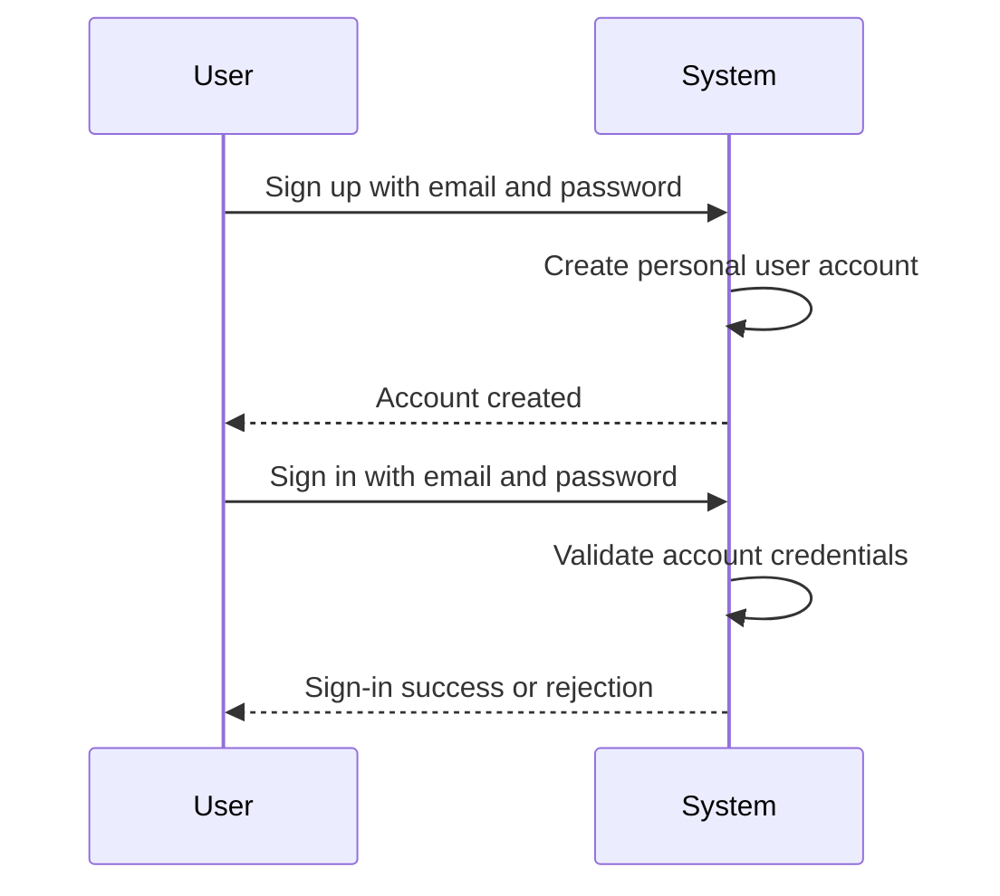

### Password Change Rules

THE hrmTimeTracking system SHALL allow the account owner to change the password for that user account.

WHEN the account owner changes the password, THE hrmTimeTracking system SHALL replace the previous password for future sign-in use.

IF a password change request is made by a person other than the account owner, THEN THE hrmTimeTracking system SHALL reject the request.

IF a password change request does not provide a replacement password, THEN THE hrmTimeTracking system SHALL reject the request.

THE hrmTimeTracking system SHALL continue to associate the changed password with the same personal user account across all organization memberships.

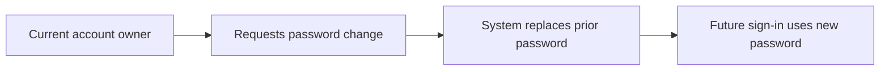

### Multi-Organization Membership and Context Selection Rules

THE hrmTimeTracking system SHALL allow one user account to belong to multiple organizations.

THE hrmTimeTracking system SHALL require the user to select one organization context when beginning work in organization-scoped features.

WHILE no organization context is selected, THE hrmTimeTracking system SHALL reject actions that are scoped to an organization.

WHEN a user selects an organization context, THE hrmTimeTracking system SHALL scope subsequent actions to the selected organization.

WHEN a user belongs to multiple organizations, THE hrmTimeTracking system SHALL allow the user to change the selected organization context without logging out.

WHEN a user switches organization context, THE hrmTimeTracking system SHALL apply the new selected organization to subsequent organization-scoped actions.

IF a user attempts to select an organization that the user account does not belong to, THEN THE hrmTimeTracking system SHALL reject the context selection.

THE hrmTimeTracking system SHALL preserve multi-organization membership independently from sign-in status so that changing context does not require ending the session.

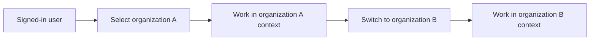

### Account Deletion Ownership Restrictions

IF the user account is the sole owner of any organization, THEN THE hrmTimeTracking system SHALL reject account deletion.

IF the user account is the sole owner of any organization, THEN THE hrmTimeTracking system SHALL require ownership to be transferred before account deletion can proceed.

IF the user account is the sole owner of any organization, THEN THE hrmTimeTracking system SHALL allow account deletion only after that organization has been deleted as an alternative to ownership transfer.

WHEN the user account is not the sole owner of any organization, THE hrmTimeTracking system SHALL allow account deletion to proceed.

THE hrmTimeTracking system SHALL evaluate ownership restrictions against all organizations the user account belongs to before completing account deletion.

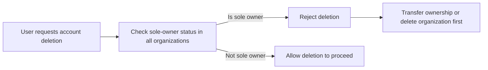

### Account Deletion Effects on Membership Records

WHEN a user account is deleted, THE hrmTimeTracking system SHALL mark that user's employee records in other organizations as deactivated.

WHEN a user account is deleted, THE hrmTimeTracking system SHALL not remove employee records in other organizations as part of the deletion outcome.

THE hrmTimeTracking system SHALL preserve the distinction between the personal user account and organization membership records during account deletion processing.

IF account deletion is blocked by the ownership restriction defined in Account Deletion Ownership Restrictions, THEN THE hrmTimeTracking system SHALL not deactivate employee records through a deletion that did not complete.

WHEN account deletion completes, THE hrmTimeTracking system SHALL apply the deactivated state to the affected employee records across the user's remaining organization memberships.

THE hrmTimeTracking system SHALL ensure that deleting the personal user account does not automatically erase organization membership records except for the deactivation outcome defined in this section.

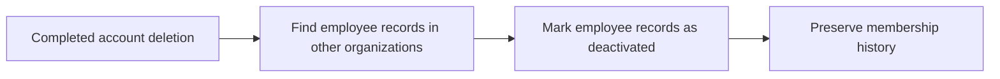

## UserProfile Rules

Each user has one global profile that stores display name, avatar image, and phone number. The profile belongs to the person rather than to a specific organization, so the same profile details are shared wherever that user is a member. Users can edit their own profile information, and those updates should be reflected consistently across all organizations they belong to. Profile rules should treat avatar image and phone number as profile attributes rather than organization-specific employee details. Changes to the global profile must not create separate profile versions for different organizations. The system should keep profile management separate from role assignment, department placement, and other organization-level employee data. If a user updates the display name or avatar image, the platform should use the new profile information anywhere the shared profile is shown.

### Global User Profile Scope and Separation

THE hrmTimeTracking SHALL maintain exactly one global user profile for each user account.

THE hrmTimeTracking SHALL treat the global user profile as organization-independent profile data.

THE hrmTimeTracking SHALL use the same global user profile across all organizations the user belongs to.

THE hrmTimeTracking SHALL NOT create separate profile records for different organizations for the same user account.

THE hrmTimeTracking SHALL keep profile data separate from the employee record in an organization.

THE hrmTimeTracking SHALL treat display name, avatar image, and phone number as profile attributes rather than organization-level employee attributes.

IF a request attempts to treat profile information as organization-specific employee data, THEN THE hrmTimeTracking SHALL reject the request.

IF a request would create more than one profile for the same user account, THEN THE hrmTimeTracking SHALL reject the request.

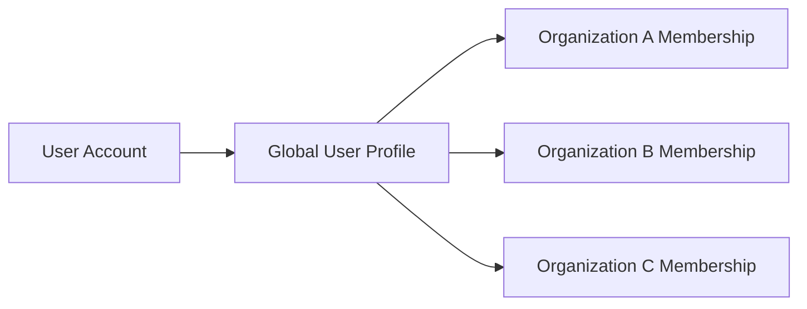

### Display Name, Avatar Image, and Phone Number Management

THE hrmTimeTracking SHALL allow the user to maintain a display name in the global user profile.

THE hrmTimeTracking SHALL allow the user to maintain an avatar image in the global user profile.

THE hrmTimeTracking SHALL allow the user to maintain a phone number in the global user profile.

WHEN the user edits their own profile, THE hrmTimeTracking SHALL apply the change to the existing global user profile rather than creating a new organization-specific version.

WHEN the user updates the display name, THE hrmTimeTracking SHALL use the new display name anywhere the shared profile is shown.

WHEN the user updates the avatar image, THE hrmTimeTracking SHALL use the new avatar image anywhere the shared profile is shown.

WHEN the user updates the phone number, THE hrmTimeTracking SHALL store the updated phone number in the same global user profile shared across memberships.

IF a user attempts to edit another person's global user profile, THEN THE hrmTimeTracking SHALL reject the request.

IF a profile update request does not identify the user whose own profile is being edited, THEN THE hrmTimeTracking SHALL reject the request.

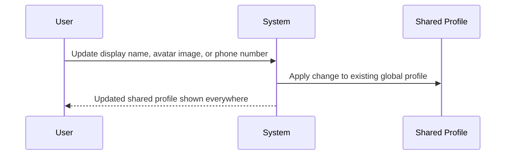

### Shared Profile Consistency Across Organizations

WHEN a user belongs to multiple organizations, THE hrmTimeTracking SHALL show the same global user profile in each organization context.

WHEN the user switches organizations, THE hrmTimeTracking SHALL continue to use the same shared profile for that user.

WHEN profile information is shown in any organization the user belongs to, THE hrmTimeTracking SHALL use the current values from the single shared profile.

WHEN a profile change is saved, THE hrmTimeTracking SHALL reflect that change everywhere the shared profile is shown.

THE hrmTimeTracking SHALL ensure that profile changes do not depend on which organization is currently selected.

IF a profile value shown in one organization differs from the current shared profile for the same user, THEN THE hrmTimeTracking SHALL treat that as invalid and SHALL correct the displayed profile data to match the shared profile.

IF a request attempts to maintain different display names, avatar images, or phone numbers for the same user in different organizations, THEN THE hrmTimeTracking SHALL reject the request.

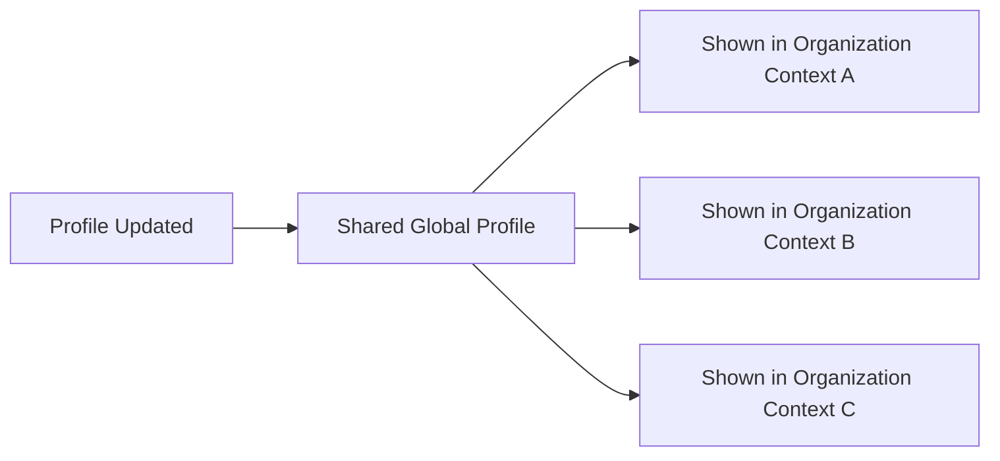

## Organization Rules

An Organization must carry the core business settings needed to operate: name, description, logo image, currency, timezone, and fiscal start month. Organization owners are the only users allowed to edit organization settings. Organization deletion is permitted only when all pending timesheets have been resolved and there are no active employee contracts. Deleting an organization permanently removes its employees, projects, tasks, timelogs, and timesheets. The owner’s personal account is retained after deletion, but it must no longer remain associated with the deleted organization. Organization rules must recognize currency, timezone, and fiscal start month as business settings that affect how the organization operates. These settings belong to the organization itself and are managed independently from individual user preferences. A newly created organization establishes a workspace for the creator, who becomes the owner of that organization.

### Organization Creation and Required Organization Settings

THE hrmTimeTracking SHALL require organization creation during initial sign-up.

THE hrmTimeTracking SHALL create a new organization workspace for the user who completes initial sign-up.

THE hrmTimeTracking SHALL assign the creating user as the owner of the newly created organization.

THE hrmTimeTracking SHALL require the organization to have a name.

THE hrmTimeTracking SHALL allow the organization to have a description.

THE hrmTimeTracking SHALL allow the organization to have a logo image.

THE hrmTimeTracking SHALL require the organization to have a currency setting.

THE hrmTimeTracking SHALL require the organization to have a timezone setting.

THE hrmTimeTracking SHALL require the organization to have a fiscal start month.

IF organization creation is attempted without a name, THEN THE hrmTimeTracking SHALL reject the organization creation request.

IF organization creation is attempted without a currency setting, THEN THE hrmTimeTracking SHALL reject the organization creation request.

IF organization creation is attempted without a timezone setting, THEN THE hrmTimeTracking SHALL reject the organization creation request.

IF organization creation is attempted without a fiscal start month, THEN THE hrmTimeTracking SHALL reject the organization creation request.

THE hrmTimeTracking SHALL treat the organization name, description, logo image, currency, timezone, and fiscal start month as settings owned by the organization rather than by an individual user.

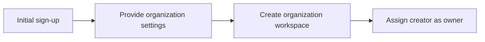

### Organization Settings Governance

THE hrmTimeTracking SHALL allow only organization owners to edit organization settings.

THE hrmTimeTracking SHALL apply organization setting changes to the organization currently being managed.

THE hrmTimeTracking SHALL maintain organization name, description, logo image, currency, timezone, and fiscal start month as editable organization settings.

IF a user who is not an organization owner attempts to edit organization settings, THEN THE hrmTimeTracking SHALL reject the update request.

THE hrmTimeTracking SHALL preserve the distinction between organization settings and shared user profile data.

THE hrmTimeTracking SHALL treat currency as an organization operating setting.

THE hrmTimeTracking SHALL treat timezone as an organization operating setting.

THE hrmTimeTracking SHALL treat fiscal start month as an organization operating setting.

IF an update omits a required organization setting that must be present for the organization to operate, THEN THE hrmTimeTracking SHALL reject the update request.

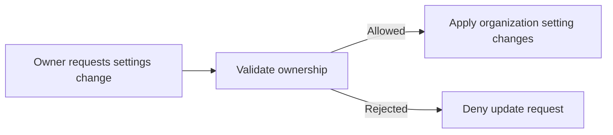

### Organization Deletion Preconditions

THE hrmTimeTracking SHALL allow organization deletion only when all pending timesheets in that organization have been resolved.

THE hrmTimeTracking SHALL treat resolved timesheets as timesheets that are approved or rejected.

THE hrmTimeTracking SHALL block organization deletion while any pending timesheet remains unresolved in that organization.

THE hrmTimeTracking SHALL allow organization deletion only when there are no active employee contracts in that organization.

THE hrmTimeTracking SHALL block organization deletion while any active employee contract exists in that organization.

IF organization deletion is requested while at least one pending timesheet remains unresolved, THEN THE hrmTimeTracking SHALL reject the deletion request.

IF organization deletion is requested while at least one active employee contract exists, THEN THE hrmTimeTracking SHALL reject the deletion request.

IF organization deletion is requested and both unresolved pending timesheets and active employee contracts exist, THEN THE hrmTimeTracking SHALL reject the deletion request.

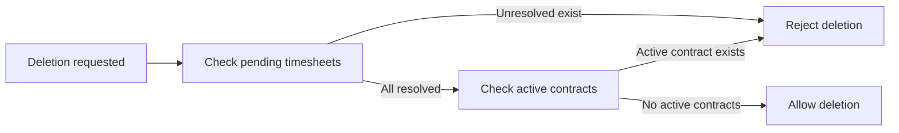

### Organization Deletion Effects

WHEN an organization is deleted, THE hrmTimeTracking SHALL permanently delete all employees in that organization.

WHEN an organization is deleted, THE hrmTimeTracking SHALL permanently delete all projects in that organization.

WHEN an organization is deleted, THE hrmTimeTracking SHALL permanently delete all tasks in that organization.

WHEN an organization is deleted, THE hrmTimeTracking SHALL permanently delete all timelogs in that organization.

WHEN an organization is deleted, THE hrmTimeTracking SHALL permanently delete all timesheets in that organization.

WHEN an organization is deleted, THE hrmTimeTracking SHALL retain the owner's user account.

WHEN an organization is deleted, THE hrmTimeTracking SHALL remove the owner's association with the deleted organization.

THE hrmTimeTracking SHALL ensure that the retained owner account no longer remains a member of the deleted organization.

IF a user attempts to access the deleted organization after deletion, THEN THE hrmTimeTracking SHALL reject access to that organization.

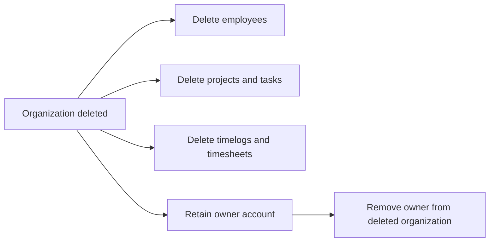

## OrganizationInvitation Rules

Organization invitations are issued by email when authorized users invite new employees. If the invited email already belongs to an existing user account, the invitation results in that user being added to the organization instead of remaining pending. If the email does not yet have an account, a pending invitation is created for that email address. Pending invitations are matched by email when the person later signs up, and the new account is then added to the pending organizations tied to that email. Invitation rules depend on the invited email identity and should not rely on a preexisting profile or employee record. The system must preserve the difference between an accepted membership and a pending invitation awaiting account creation. Invitation handling should support adding a person to the organization only when the email relationship is satisfied by an existing or newly created account.

### Invitation Authorization and Email Validation

WHEN a user issues an organization invitation, THE hrmTimeTracking SHALL allow the invitation only if the user has employee manage permission.

IF the user does not have employee manage permission, THEN THE hrmTimeTracking SHALL reject the invitation request.

WHEN an invitation is created, THE hrmTimeTracking SHALL require an email address as the basis of the invitation.

IF the invitation email address is missing, THEN THE hrmTimeTracking SHALL reject the invitation request.

WHEN an invitation is issued, THE hrmTimeTracking SHALL treat the invited email address as the identity used to determine whether the invitation can be matched to an existing or future user account.

THE hrmTimeTracking SHALL process organization invitations independently of any preexisting employee record.

IF an invitation request depends on an employee record already existing for the invited person, THEN THE hrmTimeTracking SHALL reject that request.

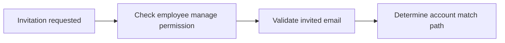

### Invitation Outcome for Existing and Unknown Email Addresses

WHEN the invited email address already belongs to an existing user account, THE hrmTimeTracking SHALL add that user to the organization instead of keeping the invitation in a pending state.

WHEN the invited email address does not belong to an existing user account, THE hrmTimeTracking SHALL create a pending invitation for that email address.

THE hrmTimeTracking SHALL preserve a clear distinction between an accepted membership created for an existing account and a pending invitation awaiting account creation.

IF the invited email address is already associated with an accepted membership in the organization, THEN THE hrmTimeTracking SHALL reject creating a duplicate invitation for that same organization membership.

WHEN invitation outcome is determined, THE hrmTimeTracking SHALL base that outcome only on whether the invited email address is already associated with a user account.

THE hrmTimeTracking SHALL NOT require a user profile to exist before deciding whether the invitation becomes an accepted membership or a pending invitation.

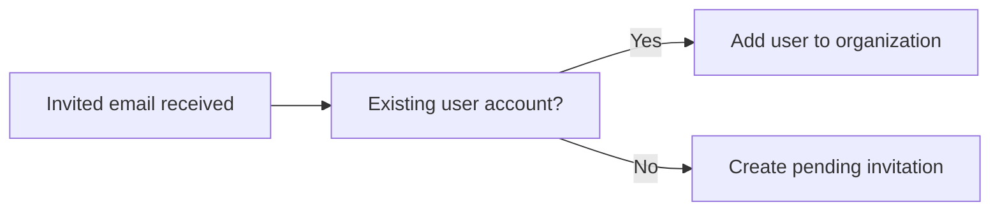

### Email-Based Matching and Automatic Organization Addition After Sign-up

WHEN a person signs up with an email address that matches a pending invitation, THE hrmTimeTracking SHALL match the new user account to the pending invitation by that email address.

WHEN a pending invitation is matched during sign-up, THE hrmTimeTracking SHALL automatically add the new user account to the organization linked to that invitation.

THE hrmTimeTracking SHALL support a user account being added to all pending organizations linked to the invited email address after sign-up with that same email address.

IF a sign-up email address does not match a pending invitation, THEN THE hrmTimeTracking SHALL NOT add the new user account to any organization through invitation matching.

WHEN invitation matching occurs, THE hrmTimeTracking SHALL use the invited email relationship as the condition for organization addition.

IF the sign-up uses a different email address from the invited email address, THEN THE hrmTimeTracking SHALL NOT treat the pending invitation as matched.

THE hrmTimeTracking SHALL keep pending organizations linked to the invited email address until a user account is created with that same email address.

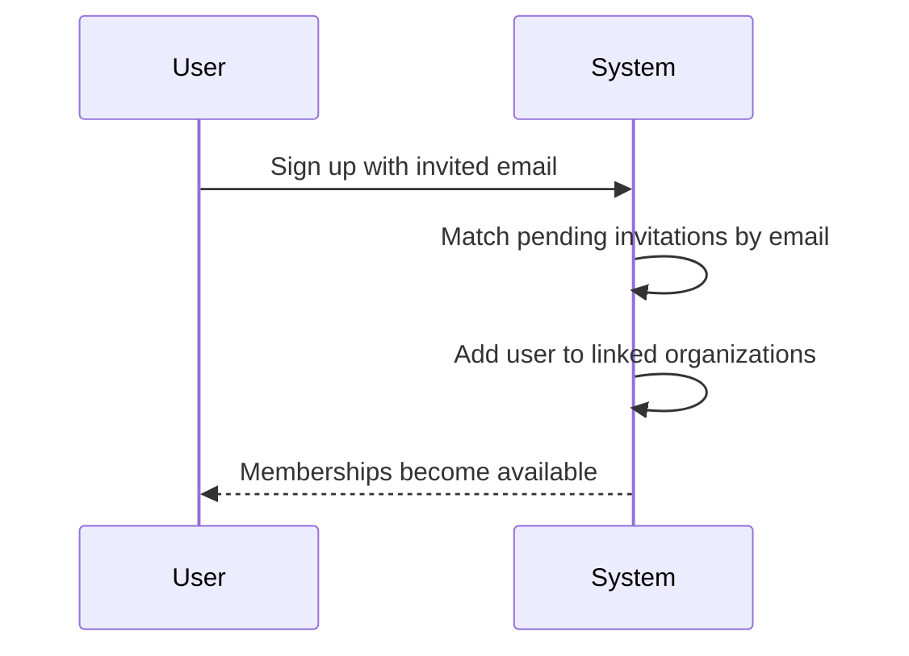

### Invitation State Integrity and Error Handling

THE hrmTimeTracking SHALL maintain invitation records so that pending invitation status and accepted membership status remain distinguishable at all times.

WHEN an invitation has already resulted in organization membership, THE hrmTimeTracking SHALL treat that outcome as accepted membership rather than as a pending invitation.

IF a pending invitation cannot be matched to an existing or newly created user account by email, THEN THE hrmTimeTracking SHALL keep the invitation pending.

IF an invitation request attempts to create organization membership without satisfying the email relationship to an existing or newly created account, THEN THE hrmTimeTracking SHALL reject the request.

THE hrmTimeTracking SHALL NOT convert a pending invitation into accepted membership until the invited email address is satisfied by an existing or newly created user account.

IF the system cannot determine whether the invited email belongs to an existing account, THEN THE hrmTimeTracking SHALL reject completion of the invitation outcome.

THE hrmTimeTracking SHALL ensure that invitation handling remains separate from employee record creation so that membership state is not inferred from employee data.

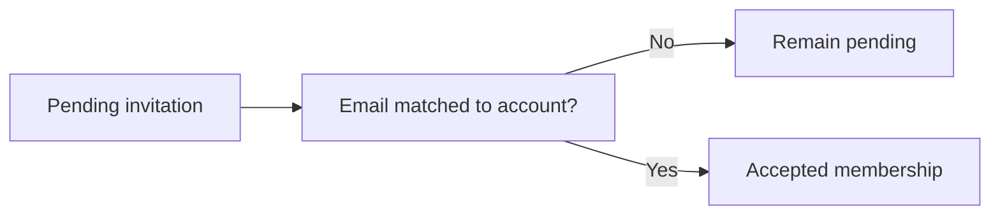

## Role Rules

Each organization maintains its own set of roles, and role definitions do not carry over automatically from one organization to another. Three built-in roles always exist in every organization: Owner, Manager, and Employee. Built-in roles cannot be deleted. Organization owners may create custom roles with a name and a defined set of permissions from the available permission list. Custom roles may be edited by organization owners. A custom role can be deleted only when no employees are currently assigned to it. Every employee in an organization must be assigned exactly one role, so role assignment cannot be left undefined or multiplied. Users who have permission to manage employees may change the role assigned to an employee, but the role itself must remain one valid role within that organization.

### Organization-Specific Role Catalog

THE hrmTimeTracking system SHALL maintain a separate role catalog for each organization.

THE hrmTimeTracking system SHALL treat a role as valid only within the organization where that role is defined.

IF a role from one organization is referenced for an employee in another organization, THEN THE hrmTimeTracking system SHALL reject the assignment.

THE hrmTimeTracking system SHALL ensure that role definitions do not carry over automatically from one organization to another.

THE hrmTimeTracking system SHALL validate role assignment changes against the currently selected organization context.

IF a requested role does not exist in the current organization, THEN THE hrmTimeTracking system SHALL reject the request.

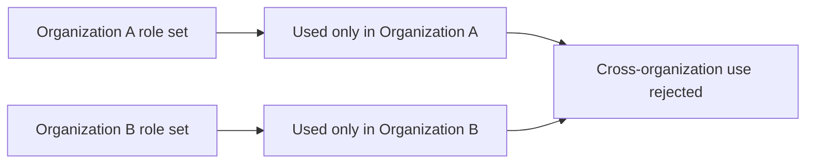

### Built-In Roles and Protected Deletion Rules

THE hrmTimeTracking system SHALL provide the built-in roles "Owner", "Manager", and "Employee" in every organization.

THE hrmTimeTracking system SHALL preserve the exact built-in role names "Owner", "Manager", and "Employee" for built-in role identification.

THE hrmTimeTracking system SHALL recognize the built-in "Owner" role as one of the non-deletable roles in each organization.

THE hrmTimeTracking system SHALL recognize the built-in "Manager" role as one of the non-deletable roles in each organization.

THE hrmTimeTracking system SHALL recognize the built-in "Employee" role as one of the non-deletable roles in each organization.

IF a deletion request targets the built-in "Owner" role, THEN THE hrmTimeTracking system SHALL reject the request.

IF a deletion request targets the built-in "Manager" role, THEN THE hrmTimeTracking system SHALL reject the request.

IF a deletion request targets the built-in "Employee" role, THEN THE hrmTimeTracking system SHALL reject the request.

THE hrmTimeTracking system SHALL apply the non-deletable rule regardless of whether any employees are currently assigned to the built-in role.

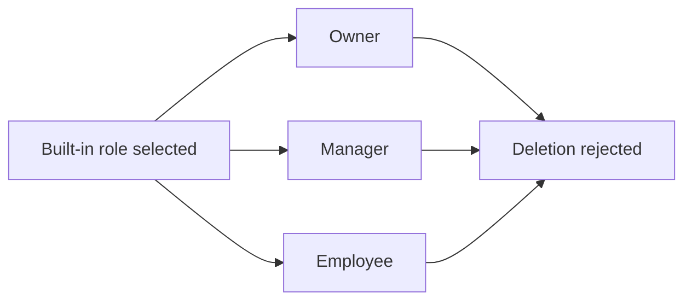

### Custom Role Definition and Permission Validation

WHEN an organization owner creates a custom role, THE hrmTimeTracking system SHALL require a role name and a permission set.

IF a custom role name is missing, THEN THE hrmTimeTracking system SHALL reject role creation.

IF a custom role permission set is missing, THEN THE hrmTimeTracking system SHALL reject role creation.

THE hrmTimeTracking system SHALL allow custom role permissions only from the available permission list defined for the organization.

THE hrmTimeTracking system SHALL recognize the available permission list as: org:manage, employee:manage, employee:view, project:manage, project:view, time:manage, time:approve, time:view_all, and report:view.

IF a custom role includes a permission outside the available permission list, THEN THE hrmTimeTracking system SHALL reject the role definition.

WHEN an organization owner edits a custom role, THE hrmTimeTracking system SHALL validate the updated name and permission set using the same rules as role creation.

IF an edit request targets a built-in role through the custom role editing path, THEN THE hrmTimeTracking system SHALL reject the request.

THE hrmTimeTracking system SHALL store custom role changes only within the organization where the custom role is defined.

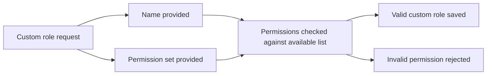

### Custom Role Deletion Eligibility

WHEN an organization owner requests deletion of a custom role, THE hrmTimeTracking system SHALL allow deletion only if no employees are currently assigned to that role.

IF one or more employees are assigned to the custom role, THEN THE hrmTimeTracking system SHALL reject the deletion request.

THE hrmTimeTracking system SHALL evaluate current employee assignments in the same organization as the custom role before deletion is completed.

IF the requested custom role does not exist in the current organization, THEN THE hrmTimeTracking system SHALL reject the deletion request.

THE hrmTimeTracking system SHALL prevent deletion of a role that would leave assigned employees without a valid role by requiring reassignment before deletion.

THE hrmTimeTracking system SHALL permit deletion of an unassigned custom role.

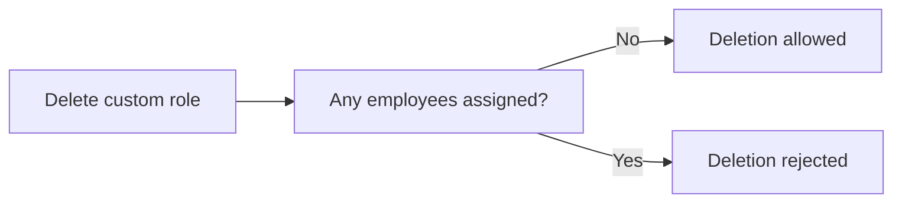

### Single Role Assignment Per Employee

THE hrmTimeTracking system SHALL require each employee in an organization to have exactly one role.

THE hrmTimeTracking system SHALL reject creation or update of an employee record if no role is assigned.

THE hrmTimeTracking system SHALL reject any attempt to assign more than one role to the same employee within the same organization.

THE hrmTimeTracking system SHALL validate that the assigned role belongs to the employee's organization.

IF an assigned role becomes unavailable for use in the current request, THEN THE hrmTimeTracking system SHALL reject the request until one valid role is selected.

THE hrmTimeTracking system SHALL preserve the exactly-one-role rule during employee invitation resolution, employee updates, and role changes.

```mermaid
flowchart LR
    A["Employee role validation"] --> B["No role assigned"]
    A --> C["Exactly one valid role assigned"]
    A --> D["More than one role assigned"]
    B --> E["Rejected"]
    D --> E
    C --> F["Accepted"]
```

### Role Assignment Change Validation

WHEN a user with employee management permission changes an employee's role, THE hrmTimeTracking system SHALL require the new role to be one valid role within the same organization.

IF a role change request is made by a user without employee management permission, THEN THE hrmTimeTracking system SHALL reject the request.

IF the target employee does not belong to the current organization, THEN THE hrmTimeTracking system SHALL reject the role change request.

IF the requested new role does not belong to the current organization, THEN THE hrmTimeTracking system SHALL reject the role change request.

THE hrmTimeTracking system SHALL replace the employee's existing role with the newly assigned role rather than adding an additional role.

THE hrmTimeTracking system SHALL ensure that the employee continues to have exactly one role after the change is completed.

WHEN a role assignment is changed, THE hrmTimeTracking system SHALL record the change as an activity log entry.

```mermaid
sequenceDiagram
    participant M as Manager
    participant S as System
    M->>S: Change employee role
    S->>S: Validate employee management permission
    S->>S: Validate employee and role belong to current organization
    S->>S: Replace existing role with new role
    S->>S: Record activity log entry
    S-->>M: Accept or reject request
```

## Employee Rules

An Employee represents a user’s membership within an organization and carries organization-specific work information. Each employee record must be linked to a user account and assigned exactly one role in that organization. Department and position are optional attributes, so an employee may exist without either being filled in. Employment type is constrained to full-time, part-time, contractor, or intern. Employee status is constrained to active or deactivated. Deactivated employees cannot log time or submit timesheets, but their historical timelogs and timesheets must remain preserved. A deactivated employee may later be reactivated without losing prior records. Employee rules separate organization-specific details such as role, department, position, employment type, and status from the user’s shared global profile.

### Employee Identity and Organization-Specific Record Boundaries

THE hrmTimeTracking system SHALL require every employee record to be linked to one user account.
THE hrmTimeTracking system SHALL reject creation of an employee record that is not linked to a user account.
THE hrmTimeTracking system SHALL treat the employee record as an organization-specific membership record rather than the user’s shared identity.
THE hrmTimeTracking system SHALL keep employee-specific information separate from the user’s global profile.
THE hrmTimeTracking system SHALL allow an employee record to have no department assigned.
THE hrmTimeTracking system SHALL allow an employee record to have no position or title assigned.
IF a department assigned to an employee is removed, THEN THE hrmTimeTracking system SHALL clear the employee’s department assignment rather than remove the employee record.
THE hrmTimeTracking system SHALL preserve the employee record when department assignment or position information is absent.

```mermaid
flowchart LR
    UA["User Account"] --> ER["Employee Record"]
    ER --> ORG["Organization Membership"]
    ER --> ROLE["One Organizational Role"]
    ER --> DEPT["Optional Department"]
    ER --> POS["Optional Position or Title"]
    UA --> GP["Shared Global Profile"]
```

### Role Assignment and Employment Type Validation

THE hrmTimeTracking system SHALL require each employee in an organization to be assigned exactly one organizational role.
THE hrmTimeTracking system SHALL reject any employee state in which no role is assigned.
THE hrmTimeTracking system SHALL reject any employee state in which more than one organizational role is assigned at the same time.
THE hrmTimeTracking system SHALL restrict employee employment type to one of the following values: full-time, part-time, contractor, or intern.
THE hrmTimeTracking system SHALL accept full-time as a valid employment type.
THE hrmTimeTracking system SHALL accept part-time as a valid employment type.
THE hrmTimeTracking system SHALL accept contractor as a valid employment type.
THE hrmTimeTracking system SHALL accept intern as a valid employment type.
IF an employment type outside full-time, part-time, contractor, or intern is provided, THEN THE hrmTimeTracking system SHALL reject the change.
THE hrmTimeTracking system SHALL preserve the assigned role when optional department or position details are absent.


### Employee Status Restrictions, Preservation, and Reactivation

THE hrmTimeTracking system SHALL restrict employee status to active or deactivated.
THE hrmTimeTracking system SHALL allow an employee in active status to remain eligible for time tracking and timesheet submission.
WHILE an employee is in deactivated status, THE hrmTimeTracking system SHALL prevent that employee from logging time.
WHILE an employee is in deactivated status, THE hrmTimeTracking system SHALL prevent that employee from submitting timesheets.
WHILE an employee is in deactivated status, THE hrmTimeTracking system SHALL preserve the employee’s historical timelogs.
WHILE an employee is in deactivated status, THE hrmTimeTracking system SHALL preserve the employee’s historical timesheets.
IF a deactivated employee attempts to create a timelog, THEN THE hrmTimeTracking system SHALL reject the request.
IF a deactivated employee attempts to submit a timesheet, THEN THE hrmTimeTracking system SHALL reject the request.
THE hrmTimeTracking system SHALL allow a deactivated employee to be reactivated.
WHEN an employee is reactivated, THE hrmTimeTracking system SHALL restore the employee’s ability to log time and submit timesheets.
THE hrmTimeTracking system SHALL retain preserved historical timelogs and preserved historical timesheets after reactivation.

```mermaid
flowchart LR
    A["Active"] -->|"Deactivate"| D["Deactivated"]
    D -->|"Reactivate"| A
    D --> R1["Time Logging Blocked"]
    D --> R2["Timesheet Submission Blocked"]
    D --> P1["Historical Timelogs Preserved"]
    D --> P2["Historical Timesheets Preserved"]
```

## EmployeeContract Rules

An employee may have multiple contracts over time to preserve employment history. Only one contract may be active for an employee at any given time. Every contract must include a start date, pay rate, pay period, and working hours per week, while end date and notes are optional. A missing end date means the contract is ongoing. Pay period is limited to hourly, daily, weekly, or monthly. When a new contract begins, the previous active contract must end on the day before the new contract starts so that active periods do not overlap. Users may edit only the current active contract. Past contracts form an immutable historical record and cannot be changed after they are no longer active. Contract rules therefore enforce continuity of history, one active agreement at a time, and preservation of prior terms.

### Contract Data Validation

THE hrmTimeTracking SHALL require every employee contract to include a start date.

THE hrmTimeTracking SHALL require every employee contract to include a pay rate.

THE hrmTimeTracking SHALL require every employee contract to include a pay period.

THE hrmTimeTracking SHALL require every employee contract to include working hours per week.

THE hrmTimeTracking SHALL allow the contract end date to be omitted.

WHEN a contract end date is omitted, THE hrmTimeTracking SHALL treat the contract as ongoing.

THE hrmTimeTracking SHALL allow contract notes to be omitted.

THE hrmTimeTracking SHALL accept only the following pay period values for an employee contract: hourly, daily, weekly, and monthly.

IF a contract is created or updated without a required start date, THEN THE hrmTimeTracking SHALL reject the request.

IF a contract is created or updated without a required pay rate, THEN THE hrmTimeTracking SHALL reject the request.

IF a contract is created or updated without a required pay period, THEN THE hrmTimeTracking SHALL reject the request.

IF a contract is created or updated without required working hours per week, THEN THE hrmTimeTracking SHALL reject the request.

IF a contract uses a pay period other than hourly, daily, weekly, or monthly, THEN THE hrmTimeTracking SHALL reject the request.

```mermaid
flowchart LR
    A["Contract created"] --> B["Validate required start date"]
    B --> C["Validate required pay rate"]
    C --> D["Validate pay period is hourly daily weekly or monthly"]
    D --> E["Validate required working hours per week"]
    E --> F["Store optional end date and optional notes"]
    F --> G["Contract accepted"]
```

### Contract Continuity and Active Period Constraints

THE hrmTimeTracking SHALL allow each employee to have multiple contracts over time as a historical record.

THE hrmTimeTracking SHALL allow only one active contract for an employee at any given time.

WHEN an employee has a contract with no end date, THE hrmTimeTracking SHALL treat that contract as the active contract.

WHEN a new contract is created for an employee who already has an active contract, THE hrmTimeTracking SHALL automatically set the previous active contract end date to the day before the new contract start date.

THE hrmTimeTracking SHALL preserve prior contracts when a new contract is created.

IF a contract change would result in more than one active contract for the same employee at the same time, THEN THE hrmTimeTracking SHALL reject the request.

IF a contract change would leave overlapping active periods for the same employee, THEN THE hrmTimeTracking SHALL reject the request.

IF a previous active contract cannot be ended on the day before the new contract start date without creating an invalid contract history, THEN THE hrmTimeTracking SHALL reject the new contract request.

```mermaid
flowchart LR
    A["Existing active contract"] --> B["New contract starts"]
    B --> C["Previous active contract ends the day before new start date"]
    C --> D["New contract becomes only active contract"]
    D --> E["Older contracts remain historical"]
```

### Contract Editability and Historical Record Protection

THE hrmTimeTracking SHALL allow editing only for the current active contract.

THE hrmTimeTracking SHALL treat past contracts as an immutable historical record.

WHEN a contract is no longer active, THE hrmTimeTracking SHALL prevent further changes to that contract.

IF a user attempts to edit a past contract, THEN THE hrmTimeTracking SHALL reject the request.

IF a contract becomes historical because a newer contract starts, THEN THE hrmTimeTracking SHALL preserve the historical contract terms as recorded.

IF an edit to the current active contract would violate the single-active-contract rule or continuity rules defined in Contract Continuity and Active Period Constraints, THEN THE hrmTimeTracking SHALL reject the request.

```mermaid
flowchart LR
    A["Contract selected for update"] --> B["Is contract current and active?"]
    B -->|"Yes"| C["Update allowed subject to continuity rules"]
    B -->|"No"| D["Request rejected as historical contract"]
```

## Department Rules

Organizations may define departments to group employees for internal structure. Each department has a name, description, and an optional parent department. Department nesting is limited to one level, so a department may have a parent but deeper hierarchies are not allowed. Departments may be updated or removed by authorized organization managers. Deleting a department does not delete any employees. Instead, employees that were assigned to the deleted department must have their department cleared. Department rules therefore preserve employee membership while allowing organizational structure to change over time. The department model supports simple hierarchy without allowing unlimited nesting complexity.

### Department Definition and Required Information

THE hrmTimeTracking system SHALL require each department to have a name.
THE hrmTimeTracking system SHALL allow each department to have a description.
IF a department is created without a name, THEN THE hrmTimeTracking system SHALL reject the request.
WHEN a department is stored, THE hrmTimeTracking system SHALL associate it with the currently selected organization.
IF a user attempts to create or edit a department outside the currently selected organization context, THEN THE hrmTimeTracking system SHALL reject the request.
WHEN a department is viewed in department lists or details, THE hrmTimeTracking system SHALL show the department name and description as the identifying business information for that department.

### Department Hierarchy and Parent Department Constraints

THE hrmTimeTracking system SHALL allow a department to exist without a parent department.
THE hrmTimeTracking system SHALL allow a department to reference one parent department.
IF a parent department is specified, THEN THE hrmTimeTracking system SHALL require that the parent department belong to the same organization as the department being created or edited.
IF a department is assigned a parent department that already has its own parent department, THEN THE hrmTimeTracking system SHALL reject the request.
IF a user attempts to assign a department as its own parent, THEN THE hrmTimeTracking system SHALL reject the request.
IF a user attempts to create deeper hierarchy beyond one level of nesting, THEN THE hrmTimeTracking system SHALL reject the request.
THE hrmTimeTracking system SHALL preserve a simple organizational hierarchy by allowing only top-level departments and one level of child departments.
```mermaid
flowchart LR
    A["Top-level Department"] --> B["Child Department"]
    B --> C["Rejected Additional Child Level"]
```

### Department Management Validation

WHEN an authorized organization manager creates a department, THE hrmTimeTracking system SHALL validate the department information against the department definition and hierarchy rules defined in this unit.
WHEN an authorized organization manager edits a department, THE hrmTimeTracking system SHALL validate the updated information against the same department definition and hierarchy rules.
IF a user without authority to manage organization structure attempts to create, edit, or delete a department, THEN THE hrmTimeTracking system SHALL reject the request.
IF a requested department does not exist in the currently selected organization, THEN THE hrmTimeTracking system SHALL reject the request.
WHEN a department is edited, THE hrmTimeTracking system SHALL update the department record without changing employee records unless the department is deleted.
THE hrmTimeTracking system SHALL allow department deletion as a valid organization-structure change subject to the deletion effects defined in this unit.

### Department Deletion Effects on Employees

WHEN a department is deleted, THE hrmTimeTracking system SHALL delete the department without deleting any employees.
WHEN a department is deleted, THE hrmTimeTracking system SHALL clear the department assignment of every employee that was assigned to that department.
WHEN a department is deleted, THE hrmTimeTracking system SHALL preserve the affected employees as members of the organization.
WHEN a department is deleted, THE hrmTimeTracking system SHALL preserve employee records other than the removed department assignment.
IF a user attempts to access a deleted department, THEN THE hrmTimeTracking system SHALL reject the request.
THE hrmTimeTracking system SHALL treat department deletion as an organizational structure update rather than an employee removal action.
```mermaid
flowchart LR
    A["Department Exists"] --> B["Department Deleted"]
    B --> C["Employees Remain"]
    B --> D["Employee Department Cleared"]
```

## Project Rules

A project must have a name and a color code, while description, budget hours, start date, and end date are optional. Project status is limited to active, archived, or completed. Archived and completed projects remain part of the historical record, but they cannot receive new timelogs. Existing timelogs linked to archived or completed projects must be preserved. Budget hours, when present, represent the project’s estimated total hours and are used for budget comparison in reporting. A project may be edited by authorized users while it remains part of the organization’s portfolio. Project deletion is allowed only when no timelogs are associated with that project. These rules ensure that projects with recorded work cannot be removed in a way that would break time history.

### Project Attribute Validation

THE hrmTimeTracking system SHALL require each project to have a project name.

THE hrmTimeTracking system SHALL reject project creation when the project name is missing.

THE hrmTimeTracking system SHALL require each project to have a project color code.

THE hrmTimeTracking system SHALL reject project creation when the project color code is missing.

THE hrmTimeTracking system SHALL allow a project description to be left blank.

THE hrmTimeTracking system SHALL allow budget hours to be left blank.

THE hrmTimeTracking system SHALL allow a project start date to be left blank.

THE hrmTimeTracking system SHALL allow a project end date to be left blank.

THE hrmTimeTracking system SHALL treat budget hours, when provided, as the project’s estimated total hours for business reporting purposes.

THE hrmTimeTracking system SHALL allow authorized users to update the project name, project color code, project description, budget hours, project start date, and project end date while the project remains in the organization portfolio.

IF an update removes the project name, THEN THE hrmTimeTracking system SHALL reject the update.

IF an update removes the project color code, THEN THE hrmTimeTracking system SHALL reject the update.

### Project Status Constraints

THE hrmTimeTracking system SHALL limit project status to active, archived, or completed.

THE hrmTimeTracking system SHALL reject any project status value other than active, archived, or completed.

WHILE a project is in active status, THE hrmTimeTracking system SHALL allow the project to remain available for normal project work, subject to other applicable business rules.

WHILE a project is in archived status, THE hrmTimeTracking system SHALL preserve the project as part of the organization’s historical record.

WHILE a project is in completed status, THE hrmTimeTracking system SHALL preserve the project as part of the organization’s historical record.

WHILE a project is in archived status, THE hrmTimeTracking system SHALL not allow new timelogs to be recorded against that project.

WHILE a project is in completed status, THE hrmTimeTracking system SHALL not allow new timelogs to be recorded against that project.

IF a user attempts to create a new timelog for an archived project, THEN THE hrmTimeTracking system SHALL reject the request.

IF a user attempts to create a new timelog for a completed project, THEN THE hrmTimeTracking system SHALL reject the request.

THE hrmTimeTracking system SHALL preserve existing timelogs already linked to archived projects.

THE hrmTimeTracking system SHALL preserve existing timelogs already linked to completed projects.

```mermaid
flowchart LR
    A["active"] --> B["archived"]
    A --> C["completed"]
    B --> D["historical record retained"]
    C --> D
    B --> E["new timelogs rejected"]
    C --> E
```


### Project Deletion and Budget Comparison Rules

THE hrmTimeTracking system SHALL allow project deletion only when the project has no timelogs associated with it.

IF a project has one or more timelogs associated with it, THEN THE hrmTimeTracking system SHALL reject project deletion.

WHEN a project is deleted, THE hrmTimeTracking system SHALL remove only projects that satisfy the no-timelogs condition defined in this section.

THE hrmTimeTracking system SHALL preserve projects that have recorded time history by preventing their deletion.

WHERE budget hours are present, THE hrmTimeTracking system SHALL use budget hours for budget comparison in project reporting.

WHERE budget hours are present, THE hrmTimeTracking system SHALL compare the project’s budget hours with the actual hours logged to that project.

IF budget hours are not present, THEN THE hrmTimeTracking system SHALL not treat the project as having a budget value for budget comparison.

THE hrmTimeTracking system SHALL keep budget comparison based on the project’s stored budget hours and the hours logged against that project.

## ProjectMembership Rules

ProjectMembership connects an employee to a project and records that employee’s assigned role within the project. An employee may be assigned to multiple projects. The assigned role in a project is limited to member or project-lead. Project leads have elevated responsibility within their own project because they can manage tasks in that project. Membership rules are important for access to project work, since employees can view the projects they are assigned to. Assignment and removal are controlled by users with project management authority. A valid membership must always reference both an employee and a project within the same organization. Task assignment and time logging rules depend on project membership being in place first.

### Project Membership Integrity

THE hrmTimeTracking system SHALL record each project membership as a link between one employee and one project.

THE hrmTimeTracking system SHALL require a project membership to reference both an employee and a project.

THE hrmTimeTracking system SHALL require the employee and the project in a project membership to belong to the same organization.

THE hrmTimeTracking system SHALL allow an employee to hold project memberships for multiple projects within the same organization.

IF an attempt is made to create a project membership without a valid employee reference, THEN THE hrmTimeTracking system SHALL reject the request.

IF an attempt is made to create a project membership without a valid project reference, THEN THE hrmTimeTracking system SHALL reject the request.

IF an attempt is made to create a project membership using an employee and project from different organizations, THEN THE hrmTimeTracking system SHALL reject the request.

```mermaid
flowchart LR
    E["Employee"] --> M["Project Membership"]
    P["Project"] --> M
    M --> A["Assigned Project Access"]
```

### Project Membership Roles

THE hrmTimeTracking system SHALL require every project membership to carry one assigned role.

THE hrmTimeTracking system SHALL limit the assigned project role to "member" or "project-lead".

THE hrmTimeTracking system SHALL treat "member" as a valid project membership role.

THE hrmTimeTracking system SHALL treat "project-lead" as a valid project membership role.

IF a project membership is created or updated without an assigned project role, THEN THE hrmTimeTracking system SHALL reject the request.

IF a project membership is created or updated with a role other than "member" or "project-lead", THEN THE hrmTimeTracking system SHALL reject the request.

WHILE an employee holds the role "member" in a project membership, THE hrmTimeTracking system SHALL recognize that employee as assigned to that project.

WHILE an employee holds the role "project-lead" in a project membership, THE hrmTimeTracking system SHALL recognize that employee as assigned to that project with project-lead responsibility.

### Membership Assignment and Removal Validation

WHEN a user with project management authority assigns an employee to a project, THE hrmTimeTracking system SHALL create a project membership for that employee and project.

WHEN a user with project management authority removes an employee from a project, THE hrmTimeTracking system SHALL remove that employee's project membership for that project.

IF a user without project management authority attempts to assign an employee to a project, THEN THE hrmTimeTracking system SHALL reject the request.

IF a user without project management authority attempts to remove an employee from a project, THEN THE hrmTimeTracking system SHALL reject the request.

IF an assignment request targets an employee who is already assigned to the same project, THEN THE hrmTimeTracking system SHALL reject the request.

IF a removal request targets an employee who is not assigned to the project, THEN THE hrmTimeTracking system SHALL reject the request.

WHEN a project membership is removed, THE hrmTimeTracking system SHALL stop treating that employee as assigned to that project for subsequent project-specific validations.

### Project-Lead Task Control Constraints

WHILE an employee holds the role "project-lead" in a project membership, THE hrmTimeTracking system SHALL allow that employee to manage tasks within that same project.

IF a project lead attempts to manage tasks for a project where that employee does not hold the role "project-lead", THEN THE hrmTimeTracking system SHALL reject the request.

IF an employee holds the role "member" rather than "project-lead" for a project, THEN THE hrmTimeTracking system SHALL not treat that membership alone as sufficient for project-lead task management.

WHEN evaluating whether a project lead may manage a task, THE hrmTimeTracking system SHALL verify that the task belongs to the same project as the project membership.

IF a task belongs to a different project than the employee's "project-lead" membership, THEN THE hrmTimeTracking system SHALL reject the request.

```mermaid
flowchart LR
    L["Employee with \"project-lead\" membership"] --> C["Task management check"]
    C --> P["Task belongs to same project"]
    P --> R["Task management allowed"]
    C --> X["Different project"]
    X --> Y["Request rejected"]
```

### Membership-Dependent Task Assignment and Time Logging

WHEN assigning a task to an employee, THE hrmTimeTracking system SHALL require that employee to be a member of the task's project.

IF a task assignment is attempted for an employee who is not assigned to the task's project, THEN THE hrmTimeTracking system SHALL reject the request.

WHEN an employee creates a timelog for a project, THE hrmTimeTracking system SHALL require that employee to be assigned to that project before the timelog is accepted.

IF an employee attempts to create a timelog for a project to which that employee is not assigned, THEN THE hrmTimeTracking system SHALL reject the request.

WHEN a timelog includes a task, THE hrmTimeTracking system SHALL apply the project membership check against the project associated with that timelog.

WHEN an employee views assigned projects, THE hrmTimeTracking system SHALL show the projects for which that employee has a project membership.

IF an employee has no project memberships, THEN THE hrmTimeTracking system SHALL return no assigned projects for that employee.

```mermaid
flowchart LR
    M["Project Membership exists"] --> T["Task can be assigned to employee"]
    M --> G["Time can be logged to project"]
    N["No Project Membership"] --> R["Request rejected"]
    N --> S["Project not shown as assigned"]
```

## Task Rules

A task belongs to a project and must have a title, while description, estimated hours, due date, assigned employee, and parent task are optional. Task status is limited to open, in-progress, completed, or closed. Priority is limited to low, medium, high, or urgent. If an employee is assigned to a task, that employee must already be a member of the same project. Parent task support is limited to one level of nesting, so subtasks are allowed but deeper task hierarchies are not. Tasks may be managed by project leads within their project or by users with broader project management authority. Employees can view tasks only in projects to which they are assigned. Task rules therefore tie assignment, visibility, and hierarchy back to valid project participation.

### Task Field Validation

THE hrmTimeTracking system SHALL require every task to have a title.

THE hrmTimeTracking system SHALL allow a task description to be omitted.

THE hrmTimeTracking system SHALL allow estimated hours to be omitted.

THE hrmTimeTracking system SHALL allow a due date to be omitted.

THE hrmTimeTracking system SHALL allow a parent task to be omitted.

IF a task is created or updated without a title, THEN THE hrmTimeTracking system SHALL reject the request.

IF estimated hours are not provided, THEN THE hrmTimeTracking system SHALL keep the task without estimated hours.

IF a due date is not provided, THEN THE hrmTimeTracking system SHALL keep the task without a due date.

IF a description is not provided, THEN THE hrmTimeTracking system SHALL keep the task without a description.

IF a parent task is not provided, THEN THE hrmTimeTracking system SHALL treat the task as a top-level task.

### Task Status and Priority Constraints

THE hrmTimeTracking system SHALL limit task status values to open, in-progress, completed, or closed.

THE hrmTimeTracking system SHALL limit task priority values to low, medium, high, or urgent.

WHEN a task is created without an explicit status, THE hrmTimeTracking system SHALL require the status to be one of the allowed task status values.

WHEN a task is created or updated with a priority, THE hrmTimeTracking system SHALL require the priority to be one of the allowed task priority values.

IF a task status value other than open, in-progress, completed, or closed is provided, THEN THE hrmTimeTracking system SHALL reject the request.

IF a task priority value other than low, medium, high, or urgent is provided, THEN THE hrmTimeTracking system SHALL reject the request.

WHEN a task status changes, THE hrmTimeTracking system SHALL record the change in task history as defined in TaskHistory Rules.

```mermaid
flowchart LR
    A["open"] --> B["in-progress"]
    B --> C["completed"]
    C --> D["closed"]
    B --> D["closed"]
    A --> D["closed"]
```

### Task Assignment and Viewing Rules

WHEN an assigned employee is set for a task, THE hrmTimeTracking system SHALL require that employee to already be a member of the same project.

IF an assigned employee is not a member of the same project, THEN THE hrmTimeTracking system SHALL reject the assignment.

THE hrmTimeTracking system SHALL allow a task to remain unassigned.

WHEN an employee views tasks, THE hrmTimeTracking system SHALL show only tasks from projects to which that employee is assigned.

WHEN tasks are browsed, THE hrmTimeTracking system SHALL support filtering by status, priority, and assigned employee.

WHEN tasks are browsed, THE hrmTimeTracking system SHALL support sorting by due date, priority, and creation date.

IF an employee attempts to view tasks from a project to which the employee is not assigned, THEN THE hrmTimeTracking system SHALL reject the request.

IF a task references a task as its parent from a different project, THEN THE hrmTimeTracking system SHALL reject the request.

### Subtask Hierarchy Constraints

WHEN a parent task is assigned to a task, THE hrmTimeTracking system SHALL treat the task as a subtask.

THE hrmTimeTracking system SHALL allow only one level of subtask nesting.

IF a task is assigned a parent task that is already a subtask, THEN THE hrmTimeTracking system SHALL reject the request.

IF a task hierarchy would create more than one level of nesting, THEN THE hrmTimeTracking system SHALL reject the request.

IF a task is assigned itself as a parent task, THEN THE hrmTimeTracking system SHALL reject the request.

WHEN a parent task is removed from a task, THE hrmTimeTracking system SHALL treat the task as a top-level task.

```mermaid
flowchart LR
    A["Top-level task"] --> B["Subtask"]
    B --> C["Rejected deeper subtask"]
```

### Task Management Authority

WHEN a project lead manages tasks, THE hrmTimeTracking system SHALL allow task management only within that project.

IF a project lead attempts to manage a task outside the project where that employee is a project lead, THEN THE hrmTimeTracking system SHALL reject the request.

WHEN a user with broader project management authority manages tasks, THE hrmTimeTracking system SHALL allow task management across projects within the current organization context.

IF a user without project lead responsibility for the project and without broader project management authority attempts to manage a task, THEN THE hrmTimeTracking system SHALL reject the request.

WHEN a task is created, updated, or reassigned by an authorized user, THE hrmTimeTracking system SHALL apply the field, assignment, and hierarchy validations defined in [Task Field Validation], [Task Assignment and Viewing Rules], and [Subtask Hierarchy Constraints].

```mermaid
flowchart LR
    A["Project lead"] --> B["Manage tasks in own project"]
    C["Broader project management authority"] --> D["Manage tasks in organization context"]
    E["Unauthorized user"] --> F["Request rejected"]
```

## TaskHistory Rules

TaskHistory exists to preserve an audit trail of task status changes. A history entry is created when a task’s status changes, not for unrelated edits. Each entry records when the change happened, the prior status, the new status, and the person who made the change. The recorded old status and new status must reflect valid task status values. Task history should remain attached to the task as part of its work record. Users rely on this history to understand how a task progressed over time from one status to another. Because the requirement only mentions status changes, task history should not be expanded to cover every other task attribute unless separately specified.

### Task History Entry Creation

WHEN a task status is changed, THE hrmTimeTracking SHALL create one task history entry for that status change.

IF a task is edited without changing its status, THEN THE hrmTimeTracking SHALL NOT create a task history entry.

THE hrmTimeTracking SHALL create the task history entry as part of the same task record.

THE hrmTimeTracking SHALL keep each task history entry attached to the task whose status was changed.

IF the task cannot be identified in the current organization context, THEN THE hrmTimeTracking SHALL reject the status change request.

IF the requested status change cannot be applied, THEN THE hrmTimeTracking SHALL NOT create a task history entry.

```mermaid
flowchart LR
    A["Task status unchanged"] --> B["No history entry"]
    C["Task status changed"] --> D["Create task history entry"]
    D --> E["Attach entry to task record"]
```

### Recorded Status Change Details

WHEN a task history entry is created, THE hrmTimeTracking SHALL record the timestamp of the status change.

WHEN a task history entry is created, THE hrmTimeTracking SHALL record the task status value that existed immediately before the change.

WHEN a task history entry is created, THE hrmTimeTracking SHALL record the task status value that results from the change.

WHEN a task history entry is created, THE hrmTimeTracking SHALL record the user who made the status change.

IF the previous status value is not one of the valid task status values, THEN THE hrmTimeTracking SHALL reject the status change request.

IF the new status value is not one of the valid task status values, THEN THE hrmTimeTracking SHALL reject the status change request.

IF the acting user for the status change cannot be determined, THEN THE hrmTimeTracking SHALL reject the status change request.

IF the previous status and new status are the same, THEN THE hrmTimeTracking SHALL NOT create a task history entry.

```mermaid
sequenceDiagram
    participant U as User
    participant S as System
    participant T as Task
    U->>S: Change task status
    S->>T: Read current status
    S->>S: Validate old and new status values
    S->>S: Record timestamp and acting user
    S->>T: Save new status and attached history entry
```

### Task Status Audit Trail Scope

THE hrmTimeTracking SHALL treat task history as an audit trail for task status changes only.

IF a change affects a task attribute other than status, THEN THE hrmTimeTracking SHALL NOT add a task history entry unless the status also changed in the same action.

THE hrmTimeTracking SHALL preserve task history entries as part of the task work record.

THE hrmTimeTracking SHALL present task history in status-change order based on the recorded change timestamp.

IF a task has no recorded status changes, THEN THE hrmTimeTracking SHALL show no task history entries for that task.

THE hrmTimeTracking SHALL ensure that each task history entry remains associated with its original task and is not reassigned to another task.

IF a user requests task history for a task outside the current organization context, THEN THE hrmTimeTracking SHALL reject the request.

```mermaid
flowchart LR
    A["Status change"] --> B["Included in task history"]
    C["Description or assignment change only"] --> D["Not included in task history"]
    B --> E["Remains attached to original task"]
```

## Timelog Rules

A timelog records work performed by an employee for a specific date and duration. Every timelog must include a date, a duration in minutes, and a project, while task and description are optional. The selected project must be one the employee is assigned to. If a task is selected, it must belong to the chosen project. Employees may create timelogs only for themselves. Employees may edit their own timelogs only when those entries are not part of an approved timesheet. Employees may delete their own timelogs only when those entries are not part of any submitted or approved timesheet. Users with time management authority may edit or delete any employee’s timelogs. Billable status is part of the business record and defaults to billable unless changed.

### Timelog Field Validation

THE hrmTimeTracking SHALL require each timelog to include a work date.

THE hrmTimeTracking SHALL require each timelog to include a duration expressed in minutes.

THE hrmTimeTracking SHALL require each timelog to include a project.

WHERE a task is provided on a timelog, THE hrmTimeTracking SHALL accept the timelog with that task as an optional value.

WHERE a work description is provided on a timelog, THE hrmTimeTracking SHALL accept the timelog with that description as an optional value.

THE hrmTimeTracking SHALL treat billable status as part of the timelog business record.

WHEN a timelog is created without an explicitly selected billable status, THE hrmTimeTracking SHALL default the timelog to billable.

IF a timelog is created or updated without a work date, THEN THE hrmTimeTracking SHALL reject the request.

IF a timelog is created or updated without a duration in minutes, THEN THE hrmTimeTracking SHALL reject the request.

IF a timelog is created or updated without a project, THEN THE hrmTimeTracking SHALL reject the request.

### Timelog Project and Task Relationship Rules

THE hrmTimeTracking SHALL allow a timelog to reference only a project to which the employee is assigned.

WHERE a task is selected for a timelog, THE hrmTimeTracking SHALL require the task to belong to the selected project.

IF an employee selects a project that is not assigned to that employee, THEN THE hrmTimeTracking SHALL reject the timelog.

IF a selected task does not belong to the selected project, THEN THE hrmTimeTracking SHALL reject the timelog.

```mermaid
flowchart LR
    A["Employee selects project"] --> B["Check employee assignment to project"]
    B --> C["Project allowed"]
    B --> D["Reject timelog"]
    C --> E["Task provided?"]
    E --> F["No task provided"]
    E --> G["Check task belongs to selected project"]
    G --> H["Task allowed"]
    G --> I["Reject timelog"]
```


### Timelog Ownership, Edit, and Deletion Constraints

THE hrmTimeTracking SHALL allow an employee to create timelogs only for that employee's own work record.

THE hrmTimeTracking SHALL allow an employee to edit that employee's own timelog only before the timelog becomes part of an approved timesheet.

IF an employee attempts to edit a timelog that is part of an approved timesheet, THEN THE hrmTimeTracking SHALL reject the request.

THE hrmTimeTracking SHALL not allow an employee to delete that employee's own timelog when the timelog is part of a submitted timesheet.

THE hrmTimeTracking SHALL not allow an employee to delete that employee's own timelog when the timelog is part of an approved timesheet.

WHEN a user has time management authority, THE hrmTimeTracking SHALL allow that user to edit any employee timelog.

WHEN a user has time management authority, THE hrmTimeTracking SHALL allow that user to delete any employee timelog.

IF an employee attempts to create a timelog for another employee, THEN THE hrmTimeTracking SHALL reject the request.

```mermaid
flowchart LR
    A["Employee requests timelog change"] --> B["Own timelog?"]
    B --> C["Check timesheet state"]
    B --> D["Reject request"]
    C --> E["In approved timesheet"]
    C --> F["In submitted timesheet"]
    C --> G["Not locked by timesheet"]
    E --> H["Reject edit"]
    F --> I["Reject delete"]
    G --> J["Allow permitted change"]
    K["Time manager requests change"] --> L["Allow edit or delete"]
```


## Timesheet Rules

A timesheet represents one employee’s collection of timelogs for a single Monday-to-Sunday week. Each timesheet has an owner, week start date, week end date, status, total hours, submission review information, and an optional rejection reason when rejected. Status is limited to draft, submitted, approved, or rejected. A draft timesheet may include timelogs for that employee within the matching week, and total hours are derived from the included timelogs. A timesheet cannot be submitted if it contains no timelogs. A timesheet also cannot be submitted when another timesheet for the same employee and week is already submitted or approved. Approval locks all included timelogs against further employee editing or deletion. Rejection requires a reason and returns the timesheet to draft so the employee can revise it later. Timesheet rules therefore enforce one active approval path per employee-week and preserve reviewer accountability.

### Timesheet Week Scope and Ownership

THE hrmTimeTracking system SHALL define a timesheet as covering one Monday-to-Sunday week.

THE hrmTimeTracking system SHALL associate each timesheet with exactly one employee as its owner.

WHEN a timesheet is created, THE hrmTimeTracking system SHALL require the week start date to be Monday.

WHEN a timesheet is created, THE hrmTimeTracking system SHALL require the week end date to be Sunday for the same week as the week start date.

IF a timesheet week does not match one complete Monday-to-Sunday week, THEN THE hrmTimeTracking system SHALL reject the timesheet.

IF a user attempts to act on a timesheet not owned by that employee relationship, THEN THE hrmTimeTracking system SHALL reject the action unless the acting user is performing an allowed review action defined elsewhere.

THE hrmTimeTracking system SHALL allow a newly created timesheet to begin in draft status.

```mermaid
flowchart LR
    A["Monday week start"] --> B["Single employee owner"]
    B --> C["Sunday week end"]
    C --> D["Draft timesheet"]
```

### Submission Eligibility and Employee-Week Uniqueness

WHILE a timesheet is in draft status, THE hrmTimeTracking system SHALL allow it to contain timelogs that belong to the same employee and the same Monday-to-Sunday week.

WHEN an employee submits a timesheet, THE hrmTimeTracking system SHALL verify that the timesheet contains at least one included timelog.

IF a timesheet contains no timelogs at submission time, THEN THE hrmTimeTracking system SHALL reject the submission.

WHEN an employee submits a timesheet, THE hrmTimeTracking system SHALL verify that no other timesheet for the same employee and week is already in submitted status.

WHEN an employee submits a timesheet, THE hrmTimeTracking system SHALL verify that no other timesheet for the same employee and week is already in approved status.

IF another timesheet for the same employee and week is already submitted, THEN THE hrmTimeTracking system SHALL reject the submission.

IF another timesheet for the same employee and week is already approved, THEN THE hrmTimeTracking system SHALL reject the submission.

WHEN a draft timesheet is successfully submitted, THE hrmTimeTracking system SHALL change its status to submitted.

```mermaid
flowchart LR
    A["Draft timesheet"] --> B["Check timelog count"]
    B --> C["Check same employee-week uniqueness"]
    C --> D["Submitted timesheet"]
```

### Review Decision Rules and Timelog Locking

WHILE a timesheet is in submitted status, THE hrmTimeTracking system SHALL allow it to be reviewed for approval or rejection.

WHEN a submitted timesheet is approved, THE hrmTimeTracking system SHALL change its status to approved.

WHEN a submitted timesheet is approved, THE hrmTimeTracking system SHALL lock all timelogs included in that timesheet against employee editing.

WHEN a submitted timesheet is approved, THE hrmTimeTracking system SHALL lock all timelogs included in that timesheet against employee deletion.

WHILE a timesheet is in approved status, THE hrmTimeTracking system SHALL preserve the included timelogs as the approved record for that employee-week.

WHEN a submitted timesheet is rejected, THE hrmTimeTracking system SHALL require a rejection reason.

IF a rejection is attempted without a rejection reason, THEN THE hrmTimeTracking system SHALL reject the review decision.

WHEN a submitted timesheet is rejected, THE hrmTimeTracking system SHALL change the timesheet back to draft status.

WHILE a timesheet has returned to draft after rejection, THE hrmTimeTracking system SHALL allow the employee to revise it and submit it again.

```mermaid
flowchart LR
    A["Submitted timesheet"] --> B["Approve"]
    A --> C["Reject with reason"]
    B --> D["Approved timesheet"]
    D --> E["Included timelogs locked"]
    C --> F["Draft timesheet"]
```

### Calculated Totals and Review Audit Fields

THE hrmTimeTracking system SHALL calculate total hours for a timesheet from the timelogs included in that timesheet.

WHEN timelogs are added to or removed from a draft timesheet, THE hrmTimeTracking system SHALL recalculate the total hours from the current included timelogs.

WHEN a timesheet is submitted, THE hrmTimeTracking system SHALL retain the calculated total hours for that set of included timelogs.

WHEN a submitted timesheet is approved, THE hrmTimeTracking system SHALL record the review decision time as reviewed at.

WHEN a submitted timesheet is rejected, THE hrmTimeTracking system SHALL record the review decision time as reviewed at.

WHEN a submitted timesheet is approved, THE hrmTimeTracking system SHALL record the reviewing user as reviewed by.

WHEN a submitted timesheet is rejected, THE hrmTimeTracking system SHALL record the reviewing user as reviewed by.

IF a timesheet has not been approved or rejected, THEN THE hrmTimeTracking system SHALL not record reviewed at or reviewed by.

```mermaid
sequenceDiagram
    participant E as Employee
    participant S as System
    participant R as Reviewer
    E->>S: Submit timesheet
    S->>S: Calculate total hours from included timelogs
    R->>S: Approve or reject
    S->>S: Record "reviewed at"
    S->>S: Record "reviewed by"
```

## Timer Rules

A timer allows an employee to track work in real time before it becomes a timelog. Each employee may have at most one active timer at a time. Starting a timer requires selecting a project, while task is optional. If a task is chosen, it must align with the selected project. A running timer records the start time together with project, task, and description. Employees may update the description and project or task of a running timer while it remains active. Stopping a timer creates a timelog using the elapsed duration rounded to the nearest minute. Discarding a timer ends the live tracking session without creating a timelog. A timer does not stop automatically if the employee forgets to end it, so it continues running until the employee stops or discards it.

### Active Timer Uniqueness

WHEN an employee starts a timer, THE hrmTimeTracking SHALL allow the timer to start only if that employee has no other active timer.

IF an employee already has an active timer, THEN THE hrmTimeTracking SHALL reject any attempt to start another timer.

WHILE an employee has an active timer, THE hrmTimeTracking SHALL treat that timer as the employee's only running timer.

WHEN an active timer is stopped or discarded, THE hrmTimeTracking SHALL allow the employee to start a new timer afterward.

```mermaid
flowchart LR
    A["No active timer"] --> B["Start timer"]
    B --> C["One active timer"]
    C --> D["Stop timer"]
    C --> E["Discard timer"]
    D --> A
    E --> A
    C --> F["Attempt to start another timer"]
    F --> G["Rejected"]
```

### Timer Start Validation and Stored Details

WHEN an employee starts a timer, THE hrmTimeTracking SHALL require a project to be selected.

IF no project is selected when a timer is started, THEN THE hrmTimeTracking SHALL reject the start request.

WHEN a timer is started, THE hrmTimeTracking SHALL allow the task to be left empty.

WHEN a task is selected for a timer, THE hrmTimeTracking SHALL require the selected task to belong to the selected project.

IF a selected task does not belong to the selected project, THEN THE hrmTimeTracking SHALL reject the start request.

WHEN a timer is started, THE hrmTimeTracking SHALL store the timer start timestamp.

WHEN a timer is started, THE hrmTimeTracking SHALL store the selected project.

WHEN a timer is started, THE hrmTimeTracking SHALL store the selected task when one is provided.

WHEN a timer is started, THE hrmTimeTracking SHALL store the description when one is provided.

```mermaid
flowchart LR
    A["Start request"] --> B["Project selected?"]
    B -->|"No"| C["Rejected"]
    B -->|"Yes"| D["Task provided?"]
    D -->|"No"| E["Store start timestamp, project, and description"]
    D -->|"Yes"| F["Task belongs to selected project?"]
    F -->|"No"| C
    F -->|"Yes"| G["Store start timestamp, project, task, and description"]
```

### Running Timer Edits

WHILE a timer is active, THE hrmTimeTracking SHALL allow the employee to edit the timer description.

WHILE a timer is active, THE hrmTimeTracking SHALL allow the employee to change the timer project.

WHILE a timer is active, THE hrmTimeTracking SHALL allow the employee to change the timer task.

WHEN the employee changes the timer project, THE hrmTimeTracking SHALL require the timer task to remain valid for the newly selected project.

IF the current task does not belong to the newly selected project, THEN THE hrmTimeTracking SHALL require the task to be cleared or replaced with a task from the newly selected project before saving the change.

WHEN the employee sets a task while editing a running timer, THE hrmTimeTracking SHALL require that task to belong to the timer's selected project.

IF an edited task does not belong to the selected project, THEN THE hrmTimeTracking SHALL reject the change.

IF there is no active timer, THEN THE hrmTimeTracking SHALL reject attempts to edit timer description, project, or task.

```mermaid
flowchart LR
    A["Active timer"] --> B["Edit description"]
    A --> C["Change project"]
    A --> D["Change task"]
    C --> E["Task still valid for project?"]
    E -->|"Yes"| F["Save change"]
    E -->|"No"| G["Clear or replace task before save"]
    D --> H["Task belongs to selected project?"]
    H -->|"Yes"| F
    H -->|"No"| I["Rejected"]
```

### Timer Stop, Rounding, and Discard Outcomes

WHEN an employee stops an active timer, THE hrmTimeTracking SHALL create a timelog from that timer.

WHEN a timelog is created from a stopped timer, THE hrmTimeTracking SHALL calculate the duration from the elapsed time between the stored start timestamp and the stop time.

WHEN a timelog is created from a stopped timer, THE hrmTimeTracking SHALL round the calculated duration to the nearest minute.

WHEN an employee discards an active timer, THE hrmTimeTracking SHALL end the running timer without creating a timelog.

IF an employee attempts to stop a timer when no active timer exists, THEN THE hrmTimeTracking SHALL reject the request.

IF an employee attempts to discard a timer when no active timer exists, THEN THE hrmTimeTracking SHALL reject the request.

WHILE an active timer has not been stopped or discarded, THE hrmTimeTracking SHALL keep the timer running without automatic stop.

WHEN an employee forgets to stop a timer, THE hrmTimeTracking SHALL continue the timer indefinitely until the employee stops or discards it.

```mermaid
flowchart LR
    A["Active timer"] --> B["Stop timer"]
    A --> C["Discard timer"]
    A --> D["No user action"]
    B --> E["Calculate elapsed duration"]
    E --> F["Round to nearest minute"]
    F --> G["Create timelog"]
    C --> H["End timer without timelog"]
    D --> I["Timer continues running"]
```

## Report Rules

Reports are available only to users who have report viewing permission. The Time Report summarizes total hours logged for a chosen date range and supports grouping by employee, project, or task. It also distinguishes total hours, billable hours, and non-billable hours. The Project Budget Report compares each project’s budget hours against actual logged hours and shows the percentage of budget consumed. Projects that do not have budget hours are excluded from the Project Budget Report. The Weekly Summary Report presents week-by-week results for a selected date range, including total hours, number of timelogs, and number of employees who logged time. Report rules must preserve the exact scope of each report type and not mix measures that were not specified. Filters and groupings belong to the business definition of the report and determine which valid summaries users can view.

### Report Access Validation

WHEN a user attempts to access any report, THE hrmTimeTracking SHALL allow access only if the user has report viewing permission.

IF a user does not have report viewing permission, THEN THE hrmTimeTracking SHALL reject access to organization reports.

WHEN report access is granted, THE hrmTimeTracking SHALL limit the available report types to the Time Report, Project Budget Report, and Weekly Summary Report.

THE hrmTimeTracking SHALL apply report access validation before showing report filters, groupings, or results.

```mermaid
flowchart LR
    A["User requests report access"] --> B["Check report viewing permission"]
    B -->|"Permitted"| C["Show available reports"]
    B -->|"Not permitted"| D["Reject access"]
```

### Time Report Summary Rules

WHEN a user views the Time Report, THE hrmTimeTracking SHALL require a date range.

WHEN a valid date range is provided, THE hrmTimeTracking SHALL summarize hours logged within that date range.

THE hrmTimeTracking SHALL support grouping the Time Report by employee.

THE hrmTimeTracking SHALL support grouping the Time Report by project.

THE hrmTimeTracking SHALL support grouping the Time Report by task.

THE hrmTimeTracking SHALL support filtering the Time Report by employee.

THE hrmTimeTracking SHALL support filtering the Time Report by project.

THE hrmTimeTracking SHALL support filtering the Time Report by billable status.

WHEN the Time Report is generated, THE hrmTimeTracking SHALL show total hours.

WHEN the Time Report is generated, THE hrmTimeTracking SHALL show billable hours.

WHEN the Time Report is generated, THE hrmTimeTracking SHALL show non-billable hours.

IF a requested grouping is not employee, project, or task, THEN THE hrmTimeTracking SHALL reject the Time Report request.

IF the date range is missing, THEN THE hrmTimeTracking SHALL reject the Time Report request.

THE hrmTimeTracking SHALL preserve the selected filters and grouping together when calculating the Time Report results.

THE hrmTimeTracking SHALL not include measures in the Time Report other than total hours, billable hours, and non-billable hours.

```mermaid
flowchart LR
    A["Select Time Report"] --> B["Provide date range"]
    B --> C["Apply optional filters"]
    C --> D["Choose grouping"]
    D --> E["Calculate totals"]
    E --> F["Show total, billable, and non-billable hours"]
```

### Project Budget Report Calculation Rules

WHEN a user views the Project Budget Report, THE hrmTimeTracking SHALL compare each project's budget hours against actual hours logged.

WHEN a project is included in the Project Budget Report, THE hrmTimeTracking SHALL show the percentage of budget consumed.

IF a project does not have budget hours, THEN THE hrmTimeTracking SHALL exclude that project from the Project Budget Report.

THE hrmTimeTracking SHALL use only budget hours and actual hours logged to determine project budget consumption in this report.

THE hrmTimeTracking SHALL not include projects without budget hours in Project Budget Report totals or listings.

THE hrmTimeTracking SHALL not mix Time Report measures or Weekly Summary measures into the Project Budget Report.

```mermaid
flowchart LR
    A["Select Project Budget Report"] --> B["Check project budget hours"]
    B -->|"Budget hours present"| C["Compare budget and actual hours"]
    C --> D["Show percentage consumed"]
    B -->|"No budget hours"| E["Exclude project"]
```

### Weekly Summary Report Aggregation Rules

WHEN a user views the Weekly Summary Report, THE hrmTimeTracking SHALL require a date range.

WHEN a valid date range is provided, THE hrmTimeTracking SHALL present results week by week for that date range.

WHEN the Weekly Summary Report is generated, THE hrmTimeTracking SHALL show total hours for each week.

WHEN the Weekly Summary Report is generated, THE hrmTimeTracking SHALL show the number of timelogs for each week.

WHEN the Weekly Summary Report is generated, THE hrmTimeTracking SHALL show the number of employees who logged time for each week.

THE hrmTimeTracking SHALL support filtering the Weekly Summary Report by project.

THE hrmTimeTracking SHALL apply the selected project filter before calculating weekly totals, weekly timelog counts, and weekly employee counts.

IF the date range is missing, THEN THE hrmTimeTracking SHALL reject the Weekly Summary Report request.

THE hrmTimeTracking SHALL not include measures in the Weekly Summary Report other than total hours, number of timelogs, and number of employees who logged time.

```mermaid
flowchart LR
    A["Select Weekly Summary Report"] --> B["Provide date range"]
    B --> C["Apply optional project filter"]
    C --> D["Aggregate results by week"]
    D --> E["Show weekly hours, timelog count, and employee count"]
```

## ActivityLog Rules

The ActivityLog records significant business actions so organizations can review important changes. Each entry must identify when the action occurred, who performed it, what action type was taken, which target entity was affected, and relevant details. Only the actions explicitly listed in the requirements are guaranteed to be logged: employee invited, deactivated, reactivated, contract created or edited, project created, archived, completed, deleted, task status changed, timesheet submitted, approved, rejected, and role assigned or changed. Users with organization management permission may view the full activity log. Activity log rules should preserve the factual relationship between actor, action, target, and details for auditability. The log is for significant events rather than every minor read or update. If an action is not in the stated logged action list, it should not be assumed to appear in the activity log without separate requirements.

### Activity Entry Integrity

THE hrmTimeTracking SHALL record an activity log entry only for significant actions defined in this section.
THE hrmTimeTracking SHALL store an activity entry timestamp for each recorded activity log entry.
THE hrmTimeTracking SHALL identify the acting user for each recorded activity log entry.
THE hrmTimeTracking SHALL store the action type for each recorded activity log entry.
THE hrmTimeTracking SHALL identify the target entity affected by each recorded activity log entry.
THE hrmTimeTracking SHALL store activity entry details that describe the significant action that occurred.
IF the acting user, action type, target entity, or activity entry timestamp is missing, THEN THE hrmTimeTracking SHALL reject creation of the activity log entry.
IF an action is not one of the explicitly listed logged actions, THEN THE hrmTimeTracking SHALL NOT require an activity log entry for that action.
THE hrmTimeTracking SHALL preserve the factual relationship between the timestamp, acting user, action type, target entity, and details within the same activity log entry.

```mermaid
flowchart LR
    A["Significant action occurs"] --> B["Capture timestamp"]
    B --> C["Capture acting user"]
    C --> D["Capture action type"]
    D --> E["Capture target entity"]
    E --> F["Capture details"]
    F --> G["Store activity log entry"]
```

### Required Logged Employee and Contract Actions

WHEN an employee is invited, THE hrmTimeTracking SHALL create an activity log entry for that invitation.
WHEN an employee is deactivated, THE hrmTimeTracking SHALL create an activity log entry for that deactivation.
WHEN an employee is reactivated, THE hrmTimeTracking SHALL create an activity log entry for that reactivation.
WHEN a contract is created, THE hrmTimeTracking SHALL create an activity log entry for that contract creation.
WHEN a contract is edited, THE hrmTimeTracking SHALL create an activity log entry for that contract edit.
THE hrmTimeTracking SHALL record the affected employee as the target entity context for employee invitation, deactivation, reactivation, contract creation, and contract edit entries.
THE hrmTimeTracking SHALL include details sufficient to distinguish whether the logged contract action was a creation or an edit.
IF a business action completes as one of the listed employee or contract actions, THEN THE hrmTimeTracking SHALL NOT omit its activity log entry.

```mermaid
flowchart LR
    A["Employee invited"] --> E["Activity log entry created"]
    B["Employee deactivated"] --> E
    C["Employee reactivated"] --> E
    D["Contract created or edited"] --> E
```

### Required Logged Project, Task, Timesheet, and Role Actions

WHEN a project is created, THE hrmTimeTracking SHALL create an activity log entry for that project creation.
WHEN a project is archived, THE hrmTimeTracking SHALL create an activity log entry for that project archival.
WHEN a project is completed, THE hrmTimeTracking SHALL create an activity log entry for that project completion.
WHEN a project is deleted, THE hrmTimeTracking SHALL create an activity log entry for that project deletion.
WHEN a task status is changed, THE hrmTimeTracking SHALL create an activity log entry for that task status change.
WHEN a timesheet is submitted, THE hrmTimeTracking SHALL create an activity log entry for that timesheet submission.
WHEN a timesheet is approved, THE hrmTimeTracking SHALL create an activity log entry for that timesheet approval.
WHEN a timesheet is rejected, THE hrmTimeTracking SHALL create an activity log entry for that timesheet rejection.
WHEN a role is assigned, THE hrmTimeTracking SHALL create an activity log entry for that role assignment.
WHEN a role is changed, THE hrmTimeTracking SHALL create an activity log entry for that role change.
THE hrmTimeTracking SHALL record the affected project, task, timesheet, or employee role assignment context as the target entity for each corresponding activity log entry.
THE hrmTimeTracking SHALL include details sufficient to distinguish the specific logged action among project creation, archival, completion, deletion, task status change, timesheet submission, timesheet approval, timesheet rejection, role assignment, and role change.
IF a task update does not change task status, THEN THE hrmTimeTracking SHALL NOT require that update to be logged as a task status changed action.

```mermaid
flowchart LR
    A["Project created archived completed or deleted"] --> E["Activity log entry created"]
    B["Task status changed"] --> E
    C["Timesheet submitted approved or rejected"] --> E
    D["Role assigned or changed"] --> E
```

### Activity Log Visibility and Retrieval Rules

WHEN a user with organization management permission requests the activity log, THE hrmTimeTracking SHALL provide the full activity log for the current organization.
WHEN the activity log is displayed, THE hrmTimeTracking SHALL present entries with their timestamp, acting user, action type, target entity, and details.
IF a user without organization management permission requests the full activity log, THEN THE hrmTimeTracking SHALL reject the request.
THE hrmTimeTracking SHALL support paginated browsing of the activity log.
THE hrmTimeTracking SHALL support filtering the activity log by action type.
THE hrmTimeTracking SHALL support filtering the activity log by user.
THE hrmTimeTracking SHALL support filtering the activity log by date range.
IF a requested filter value does not match available activity log data, THEN THE hrmTimeTracking SHALL return no matching entries rather than altering the filter.
IF a requested page is beyond the available activity log results, THEN THE hrmTimeTracking SHALL return an empty result set for that page.

```mermaid
sequenceDiagram
    participant M as Manager
    participant S as System
    M->>S: View full activity log
    S->>S: Check organization management permission
    S->>S: Apply filters and pagination
    S-->>M: Return matching activity entries or reject request
```

## Dashboard Rules

The Dashboard exposes summary information rather than editable transactional records. Every employee has a personal dashboard that shows hours logged today, hours logged this week, current active timer status, the five most recent timelogs, pending timesheet status for the current week, and assigned tasks that are open or in-progress. Users with report viewing permission also see an organization dashboard. The organization dashboard shows the count of active employees, total hours logged this week across employees, the number of pending timesheets awaiting approval, projects with budget utilization over 80 percent, and the top five employees by hours logged this week. Dashboard rules should keep personal metrics separate from organization-level metrics. The task widget on the personal dashboard is limited to tasks assigned to the employee with statuses open or in-progress. The organization dashboard must use only the business indicators explicitly listed in the requirements.

### Personal Dashboard Visibility and Scope

THE hrmTimeTracking SHALL provide a personal dashboard for every employee in the currently selected organization.
WHEN a user opens the dashboard, THE hrmTimeTracking SHALL show personal dashboard information only for that user's employee record in the currently selected organization.
IF the user does not have an employee record in the currently selected organization, THEN THE hrmTimeTracking SHALL reject access to the personal dashboard for that organization context.
THE hrmTimeTracking SHALL limit personal dashboard data to summary information and SHALL NOT expose editable transactional records through dashboard widgets.
THE hrmTimeTracking SHALL show personal dashboard widgets for hours logged today, hours logged this week, active timer status, recent timelogs, pending timesheet status for the current week, and assigned tasks that are open or in-progress.

```mermaid
flowchart LR
    A["User opens dashboard"] --> B["Apply selected organization context"]
    B --> C["Resolve employee record for user"]
    C --> D["Show personal dashboard summaries"]
    C --> E["Reject if no employee record exists"]
```

### Personal Hours and Timer Widgets

WHEN the personal dashboard is shown, THE hrmTimeTracking SHALL display an hours logged today widget based on the employee's own timelogs dated today in the selected organization.
WHEN the personal dashboard is shown, THE hrmTimeTracking SHALL display an hours logged this week widget based on the employee's own timelogs for the current week in the selected organization.
THE hrmTimeTracking SHALL calculate the hours logged today widget independently from the hours logged this week widget.
WHEN the employee has no timelogs for today, THE hrmTimeTracking SHALL show zero logged hours in the hours logged today widget.
WHEN the employee has no timelogs for the current week, THE hrmTimeTracking SHALL show zero logged hours in the hours logged this week widget.
WHEN the employee has a running timer, THE hrmTimeTracking SHALL display the active timer status widget using that employee's current timer information.
WHEN the employee does not have a running timer, THE hrmTimeTracking SHALL show that no active timer is running.
IF the employee has more than one running timer recorded, THEN THE hrmTimeTracking SHALL reject the dashboard state as invalid because only one active timer is allowed for an employee.

### Recent Timelogs and Current Week Timesheet Widget Rules

WHEN the personal dashboard is shown, THE hrmTimeTracking SHALL display the five most recent timelogs for the employee in the selected organization.
IF fewer than five timelogs exist for the employee in the selected organization, THEN THE hrmTimeTracking SHALL display all available timelogs instead of five entries.
THE hrmTimeTracking SHALL determine recent timelogs by recency of the employee's own timelog records and SHALL NOT include timelogs belonging to another employee.
WHEN the personal dashboard is shown, THE hrmTimeTracking SHALL display the pending timesheet status for the current week for that employee.
WHEN no timesheet exists for the current week, THE hrmTimeTracking SHALL indicate that there is no current week timesheet status to display.
WHEN a current week timesheet exists, THE hrmTimeTracking SHALL show the status of that employee's current week timesheet only.
IF more than one timesheet for the same employee and current week is present in a way that produces conflicting dashboard status, THEN THE hrmTimeTracking SHALL reject the dashboard state as invalid.

```mermaid
flowchart LR
    A["Load employee dashboard"] --> B["Find employee timelogs in selected organization"]
    B --> C["Show last five recent timelogs"]
    A --> D["Find current week timesheet for employee"]
    D --> E["Show current week status"]
    D --> F["Show no status if none exists"]
```

### Assigned Task Widget Rules

WHEN the personal dashboard is shown, THE hrmTimeTracking SHALL display only tasks assigned to the employee.
THE hrmTimeTracking SHALL include only assigned tasks whose status is open or in-progress in the personal dashboard task widget.
THE hrmTimeTracking SHALL exclude assigned tasks whose status is completed or closed from the personal dashboard task widget.
THE hrmTimeTracking SHALL exclude tasks that are not assigned to the employee from the personal dashboard task widget.
WHEN no assigned tasks are in open or in-progress status, THE hrmTimeTracking SHALL show no task entries in the widget.
IF a task is assigned to the employee but belongs to a project outside the selected organization context, THEN THE hrmTimeTracking SHALL exclude that task from the personal dashboard.

### Organization Dashboard Access and Indicator Set

WHEN a user has report:view permission, THE hrmTimeTracking SHALL allow that user to view the organization dashboard for the currently selected organization.
IF a user does not have report:view permission, THEN THE hrmTimeTracking SHALL reject access to the organization dashboard.
THE hrmTimeTracking SHALL keep organization dashboard access separate from personal dashboard availability.
THE hrmTimeTracking SHALL limit the organization dashboard to the following indicators only: active employee count, total hours logged this week across employees, pending timesheets awaiting approval count, projects with budget utilization over 80 percent, and the top five employees by hours logged this week.
IF an indicator is not included in the stated organization dashboard requirements, THEN THE hrmTimeTracking SHALL NOT display it on the organization dashboard.

```mermaid
flowchart LR
    A["User opens dashboard"] --> B["Check report:view permission"]
    B --> C["Show organization dashboard indicators"]
    B --> D["Reject organization dashboard access"]
```

### Organization Dashboard Metric Calculation Rules

WHEN the organization dashboard is shown, THE hrmTimeTracking SHALL display the count of active employees in the selected organization.
THE hrmTimeTracking SHALL exclude deactivated employees from the active employee count widget.
WHEN the organization dashboard is shown, THE hrmTimeTracking SHALL display total hours logged this week using timelogs from all employees in the selected organization for the current week.
WHEN the organization dashboard is shown, THE hrmTimeTracking SHALL display the number of pending timesheets awaiting approval using timesheets that are currently submitted in the selected organization.
WHEN the organization dashboard is shown, THE hrmTimeTracking SHALL display projects whose budget utilization is over 80 percent.
THE hrmTimeTracking SHALL exclude projects without budget hours from the projects over 80 percent budget utilization widget.
THE hrmTimeTracking SHALL calculate budget utilization by comparing actual hours logged to project budget hours.
WHEN the organization dashboard is shown, THE hrmTimeTracking SHALL display the top five employees by hours logged this week in the selected organization.
IF fewer than five employees have logged time this week, THEN THE hrmTimeTracking SHALL display all qualifying employees instead of five entries.
IF no employee has logged time this week, THEN THE hrmTimeTracking SHALL show no entries in the top five employees widget.

### Personal and Organization Dashboard Separation Rules

THE hrmTimeTracking SHALL keep personal dashboard metrics separate from organization dashboard metrics.
THE hrmTimeTracking SHALL NOT use organization-wide data to populate personal dashboard widgets.
THE hrmTimeTracking SHALL NOT use another employee's data to populate a personal dashboard widget.
THE hrmTimeTracking SHALL NOT use personal-only widgets as substitutes for organization indicators.
WHEN a user can view both dashboards, THE hrmTimeTracking SHALL preserve the distinction between employee-specific summaries and organization-level summaries within the same selected organization context.
IF dashboard data from personal and organization scopes becomes mixed in a single widget calculation, THEN THE hrmTimeTracking SHALL reject that dashboard result as invalid.
IF a user switches organization context, THEN THE hrmTimeTracking SHALL refresh both personal and organization dashboard summaries to the newly selected organization before displaying dashboard values.

```mermaid
flowchart LR
    A["Selected organization context"] --> B["Personal dashboard calculations"]
    A --> C["Organization dashboard calculations"]
    B --> D["Employee-only summaries"]
    C --> E["Organization-wide indicators"]
```

# Data Browsing Expectations

Business expectations for how users browse, find, and navigate through lists of data.

## List Browsing Expectations

Define business expectations for how users find, filter, and browse lists.

### Filtering Rules for Browsable Lists

WHEN a user applies filters to a browsable list, THE hrmTimeTracking system SHALL limit the displayed records to items that match all selected filter criteria within the currently selected organization.

THE hrmTimeTracking system SHALL support only the filter types explicitly defined for each list.

WHEN a user browses the employee list, THE hrmTimeTracking system SHALL allow filtering by department, employment type, and status.

WHEN a user browses the project list, THE hrmTimeTracking system SHALL allow filtering by status.

WHEN a user browses task lists, THE hrmTimeTracking system SHALL allow filtering by status, priority, and assigned employee.

WHEN a user browses timelogs, THE hrmTimeTracking system SHALL allow filtering by date range, project, task, and billable status.

WHEN a user browses timesheets, THE hrmTimeTracking system SHALL allow filtering by status and date range.

WHEN a user browses the activity log, THE hrmTimeTracking system SHALL allow filtering by action type, user, and date range.

WHEN a user browses the time report, THE hrmTimeTracking system SHALL allow filtering by date range, employee, project, and billable status.

WHEN a user browses the weekly summary report, THE hrmTimeTracking system SHALL allow filtering by project.

WHEN a user searches the employee list by name, THE hrmTimeTracking system SHALL return only employee records whose names match the entered search value within the selected organization.

IF a user applies a task filter that references an employee who is not relevant to the current organization context, THEN THE hrmTimeTracking system SHALL reject the filter request.

IF a user applies a project or task filter to timelogs using values outside the currently selected organization, THEN THE hrmTimeTracking system SHALL reject the filter request.

IF a user provides an invalid date range filter in a browsable list or report, THEN THE hrmTimeTracking system SHALL reject the filter request.

WHEN a filter request is rejected, THE hrmTimeTracking system SHALL preserve the previously displayed list state until the user changes or clears the invalid filter.

```mermaid
flowchart LR
    A["User opens list"] --> B["Apply filter criteria"]
    B --> C["Validate organization-scoped values"]
    C -->|"Valid"| D["Show matching records"]
    C -->|"Invalid"| E["Reject filter request"]
```

### Sorting Rules for Task Lists and Report Groupings

WHEN a user browses task lists, THE hrmTimeTracking system SHALL allow sorting by due date, priority, and creation date.

THE hrmTimeTracking system SHALL apply one selected task sort order at a time.

WHEN a user changes the sort order for a task list, THE hrmTimeTracking system SHALL redisplay the same filtered result set using the newly selected order.

IF a user requests a sort option for tasks other than due date, priority, or creation date, THEN THE hrmTimeTracking system SHALL reject the sort request.

WHEN a user accesses the time report, THE hrmTimeTracking system SHALL allow the report to be grouped by employee, project, or task.

IF a user requests a time report grouping other than employee, project, or task, THEN THE hrmTimeTracking system SHALL reject the grouping request.

WHEN a user changes the grouping of the time report, THE hrmTimeTracking system SHALL recalculate the displayed totals according to the selected grouping while keeping the applied filters.

WHEN a user views the weekly summary report, THE hrmTimeTracking system SHALL present results as a week-by-week summary for the selected date range.

```mermaid
flowchart LR
    A["Task list or report opened"] --> B["User selects sort or grouping"]
    B --> C["Validate selected option"]
    C -->|"Accepted"| D["Redisplay ordered or grouped results"]
    C -->|"Rejected"| E["Keep previous result arrangement"]
```

### Pagination Rules for Organization Lists

WHEN a user browses the employee list, THE hrmTimeTracking system SHALL present the list in paginated form.

WHEN a user browses the project list, THE hrmTimeTracking system SHALL present the list in paginated form.

WHEN a user browses timelogs, THE hrmTimeTracking system SHALL present the list in paginated form.

WHEN a user browses timesheets, THE hrmTimeTracking system SHALL present the list in paginated form.

WHEN a user browses the activity log, THE hrmTimeTracking system SHALL present the list in paginated form.

WHEN a user moves between pages in a paginated list, THE hrmTimeTracking system SHALL keep the current organization context.

WHEN a user moves between pages after applying filters, THE hrmTimeTracking system SHALL preserve the active filters.

WHEN a user moves between pages after selecting a supported sort order for tasks, THE hrmTimeTracking system SHALL preserve the active ordering.

IF a user requests a page that does not exist for the current result set, THEN THE hrmTimeTracking system SHALL reject the page request.

WHEN a page request is rejected, THE hrmTimeTracking system SHALL keep the user on the current valid page.

WHEN filters change the size of a paginated result set, THE hrmTimeTracking system SHALL recalculate the available pages based on the filtered records.

```mermaid
sequenceDiagram
    participant U as User
    participant S as System
    U->>S: Request paginated list
    S->>S: Apply organization context
    S->>S: Apply active filters and ordering
    S-->>U: Return requested page
    U->>S: Request another page
    S->>S: Validate requested page exists
    S-->>U: Return page or keep current valid page
```

# Error Conditions

Business error scenarios and how the system should respond.

## Error Scenarios

Describe error conditions and expected system responses in natural language.

### Membership, Organization Context, and Access Rejection

WHEN a user attempts to view or act on organization data without selecting an organization context, THE hrmTimeTracking system SHALL reject the request.

WHEN a user attempts to access data belonging to an organization they do not belong to, THE hrmTimeTracking system SHALL reject the request.

WHEN a user who belongs to multiple organizations is working in one selected organization, THE hrmTimeTracking system SHALL reject any attempt to view or act on data from another organization through that active context.

WHEN a user attempts to continue acting under an organization context after they are no longer associated with that organization, THE hrmTimeTracking system SHALL reject the request.

IF a user attempts to delete their account while they are the sole owner of an organization, THEN THE hrmTimeTracking system SHALL reject the account deletion until ownership is transferred or the organization is deleted first.

WHEN an organization owner attempts to delete an organization that still has pending timesheets, THE hrmTimeTracking system SHALL reject the deletion.

WHEN an organization owner attempts to delete an organization that still has active employee contracts, THE hrmTimeTracking system SHALL reject the deletion.

```mermaid
flowchart LR
    A["Request organization-scoped action"] --> B["Organization context selected?"]
    B -->|"No"| C["Reject request"]
    B -->|"Yes"| D["User belongs to selected organization?"]
    D -->|"No"| C
    D -->|"Yes"| E["Proceed"]
```

### Role, Invitation, and Employee Record Exceptions

WHEN an organization owner attempts to delete a built-in role, THE hrmTimeTracking system SHALL reject the deletion.

WHEN an organization owner attempts to delete a custom role that is still assigned to any employee, THE hrmTimeTracking system SHALL reject the deletion.

WHEN a role assignment change would leave an employee without exactly one role in the organization, THEN THE hrmTimeTracking system SHALL reject the change.

WHEN an invited email does not yet belong to an existing account, THE hrmTimeTracking system SHALL create a pending invitation instead of rejecting the invitation.

WHEN a user signs up with an email that matches a pending invitation, THE hrmTimeTracking system SHALL add the user to the pending organization membership instead of treating the invitation as unresolved.

WHEN a deactivated employee attempts to log time, THE hrmTimeTracking system SHALL reject the request.

WHEN a deactivated employee attempts to submit a timesheet, THE hrmTimeTracking system SHALL reject the request.

WHEN a user attempts to edit an employee record that does not belong to the currently selected organization, THE hrmTimeTracking system SHALL reject the request.

```mermaid
flowchart LR
    A["Role deletion requested"] --> B["Built-in role?"]
    B -->|"Yes"| C["Reject deletion"]
    B -->|"No"| D["Assigned to any employee?"]
    D -->|"Yes"| C
    D -->|"No"| E["Allow deletion"]
```

### Contract and Department Validation Failures

WHEN a new contract is created for an employee who already has an active contract, THE hrmTimeTracking system SHALL end the previous active contract on the day before the new contract starts instead of allowing two active contracts at the same time.

IF contract changes would result in more than one active contract for the same employee, THEN THE hrmTimeTracking system SHALL reject the change.

WHEN a user attempts to edit a past contract, THE hrmTimeTracking system SHALL reject the request.

IF a contract is created without a start date, THEN THE hrmTimeTracking system SHALL reject the request.

IF a contract is created without a pay rate, THEN THE hrmTimeTracking system SHALL reject the request.

IF a contract is created without working hours per week, THEN THE hrmTimeTracking system SHALL reject the request.

WHEN a department is deleted, THE hrmTimeTracking system SHALL clear the department assignment from affected employee records instead of rejecting the deletion because employees are assigned to that department.

IF a department relationship would create nesting deeper than one level, THEN THE hrmTimeTracking system SHALL reject the change.

```mermaid
flowchart LR
    A["Create or update contract"] --> B["Required contract data present?"]
    B -->|"No"| C["Reject request"]
    B -->|"Yes"| D["Would result in multiple active contracts?"]
    D -->|"Yes"| C
    D -->|"No"| E["Save contract"]
```

### Project, Membership, and Task Rejection Rules

IF a project is created without a name, THEN THE hrmTimeTracking system SHALL reject the request.

IF a project is created without a color code, THEN THE hrmTimeTracking system SHALL reject the request.

WHEN a user attempts to delete a project that has associated timelogs, THE hrmTimeTracking system SHALL reject the deletion.

WHEN a user attempts to create a timelog on a project with status archived or completed, THE hrmTimeTracking system SHALL reject the request.

WHEN a user attempts to create a task and the assigned employee is not a member of that project, THE hrmTimeTracking system SHALL reject the request.

IF a task relationship would create subtasks deeper than one level, THEN THE hrmTimeTracking system SHALL reject the change.

WHEN an employee attempts to view tasks from a project they are not assigned to, THE hrmTimeTracking system SHALL reject the request.

WHEN an employee is removed from a project, THE hrmTimeTracking system SHALL reject subsequent time logging against that project by that employee.

```mermaid
flowchart LR
    A["Create timelog or task"] --> B["Project eligible for use?"]
    B -->|"No"| C["Reject request"]
    B -->|"Yes"| D["Assigned employee is a project member if assignment is provided?"]
    D -->|"No"| C
    D -->|"Yes"| E["Proceed"]
```

### Timelog and Timer Failure Cases

WHEN an employee attempts to create a timelog for another employee, THE hrmTimeTracking system SHALL reject the request.

IF a timelog is created without a date, THEN THE hrmTimeTracking system SHALL reject the request.

IF a timelog is created without a duration in minutes, THEN THE hrmTimeTracking system SHALL reject the request.

IF a timelog is created without a project, THEN THE hrmTimeTracking system SHALL reject the request.

WHEN a timelog includes a task that does not belong to the selected project, THE hrmTimeTracking system SHALL reject the request.

WHEN an employee attempts to edit their own timelog and that timelog is part of an approved timesheet, THE hrmTimeTracking system SHALL reject the request.

WHEN an employee attempts to delete their own timelog and that timelog is part of a submitted timesheet, THE hrmTimeTracking system SHALL reject the request.

WHEN an employee attempts to delete their own timelog and that timelog is part of an approved timesheet, THE hrmTimeTracking system SHALL reject the request.

WHEN an employee already has an active timer and attempts to start another timer, THE hrmTimeTracking system SHALL reject the request.

WHEN an employee starts a timer without selecting a project, THE hrmTimeTracking system SHALL reject the request.

WHEN a running timer is edited to reference a task that does not belong to its selected project, THE hrmTimeTracking system SHALL reject the change.

```mermaid
flowchart LR
    A["Create or change timelog"] --> B["Required timelog data present?"]
    B -->|"No"| C["Reject request"]
    B -->|"Yes"| D["Task belongs to selected project if provided?"]
    D -->|"No"| C
    D -->|"Yes"| E["Timelog locked by timesheet state?"]
    E -->|"Yes"| C
    E -->|"No"| F["Proceed"]
```

### Timesheet Submission, Approval, and Rejection Exceptions

WHEN an employee attempts to submit a draft timesheet that contains no timelogs, THE hrmTimeTracking system SHALL reject the submission.

WHEN an employee attempts to submit a timesheet for a week where another timesheet for the same employee is already submitted, THE hrmTimeTracking system SHALL reject the submission.

WHEN an employee attempts to submit a timesheet for a week where another timesheet for the same employee is already approved, THE hrmTimeTracking system SHALL reject the submission.

WHEN a timesheet is rejected without a rejection reason, THE hrmTimeTracking system SHALL reject the review action.

WHEN a submitted timesheet is approved, THE hrmTimeTracking system SHALL lock all included timelogs against editing or deletion.

WHEN a submitted timesheet is rejected with a reason, THE hrmTimeTracking system SHALL return the timesheet to draft status.

WHEN a rejected timesheet has returned to draft status, THE hrmTimeTracking system SHALL allow the employee to modify and resubmit it.

WHEN a user attempts to approve or reject a timesheet that is not in submitted status, THE hrmTimeTracking system SHALL reject the review action.

```mermaid
flowchart LR
    A["Submit or review timesheet"] --> B["Submission or review valid for current status?"]
    B -->|"No"| C["Reject action"]
    B -->|"Yes"| D["Rejecting without reason?"]
    D -->|"Yes"| C
    D -->|"No"| E["Apply status change"]
```

### Browsing, Filtering, and Lookup Error Handling

WHEN a user requests the employee list, THE hrmTimeTracking system SHALL return the results in paginated form.

WHEN a user filters the employee list, THE hrmTimeTracking system SHALL apply only the supported filters of department, employment type, and status.

WHEN a user searches the employee list, THE hrmTimeTracking system SHALL apply the search by employee name.

WHEN a user requests the project list, THE hrmTimeTracking system SHALL return the results in paginated form.

WHEN a user filters the project list, THE hrmTimeTracking system SHALL apply only the supported status filter.

WHEN a user requests timelogs, THE hrmTimeTracking system SHALL return the results in paginated form.

WHEN a user filters timelogs, THE hrmTimeTracking system SHALL apply only the supported filters of date range, project, task, and billable status.

WHEN a user requests timesheets, THE hrmTimeTracking system SHALL return the results in paginated form.

WHEN a user filters timesheets, THE hrmTimeTracking system SHALL apply only the supported filters of status and date range.

WHEN a user filters tasks, THE hrmTimeTracking system SHALL apply only the supported filters of status, priority, and assigned employee.

WHEN a user sorts tasks, THE hrmTimeTracking system SHALL apply only the supported sort options of due date, priority, and creation date.

WHEN a user requests the activity log, THE hrmTimeTracking system SHALL return the results in paginated form.

WHEN a user filters the activity log, THE hrmTimeTracking system SHALL apply only the supported filters of action type, user, and date range.

IF a requested record does not exist within the currently selected organization, THEN THE hrmTimeTracking system SHALL reject the request.

```mermaid
flowchart LR
    A["Request list or record"] --> B["Record exists in selected organization?"]
    B -->|"No"| C["Reject request"]
    B -->|"Yes"| D["Apply supported pagination and filters"]
```

### Report and Dashboard Exception Handling

WHEN a user requests the project budget report, THE hrmTimeTracking system SHALL exclude projects that do not have budget hours instead of treating them as report failures.

WHEN a user requests the time report, THE hrmTimeTracking system SHALL apply only the supported groupings of employee, project, and task.

WHEN a user requests the time report, THE hrmTimeTracking system SHALL apply only the supported filters of date range, employee, project, and billable status.

WHEN a user requests the weekly summary report, THE hrmTimeTracking system SHALL present results week by week for the requested date range.

WHEN a user filters the weekly summary report, THE hrmTimeTracking system SHALL apply the project filter when provided.

WHEN a personal dashboard is shown, THE hrmTimeTracking system SHALL present pending timesheet status for the current week based on the employee's own data in the selected organization.

WHEN an organization dashboard is shown, THE hrmTimeTracking system SHALL calculate active employee count, total hours logged this week, pending timesheets awaiting approval, projects with budget utilization over 80%, and the top five employees by hours logged this week using data from the selected organization only.

IF a user attempts to access report or dashboard data outside the selected organization context, THEN THE hrmTimeTracking system SHALL reject the request.

```mermaid
flowchart LR
    A["Request report or dashboard"] --> B["Within selected organization context?"]
    B -->|"No"| C["Reject request"]
    B -->|"Yes"| D["Apply supported report rules"]
    D --> E["Return scoped results"]
```

# Integration Error Handling

Error handling and retry policies for external integrations.

## Integration Failure Policies

Define retry strategies, circuit breaker policies, fallback behavior, and error escalation for external service failures.

### Integration Error Handling

IF an operation depends on an external integration and that integration does not complete successfully, THEN THE hrmTimeTracking system SHALL reject the affected operation instead of presenting it as completed.

IF an external integration returns an error during an organization-scoped operation, THEN THE hrmTimeTracking system SHALL keep the failure scoped to the currently selected organization context.

IF an external integration failure prevents completion of an action, THEN THE hrmTimeTracking system SHALL present the action as failed rather than partially successful.

IF an external integration failure occurs while recording business activity, THEN THE hrmTimeTracking system SHALL not create a misleading business record that implies the integration succeeded.

WHEN an integration-related failure affects a user action, THE hrmTimeTracking system SHALL preserve already existing organization data rather than altering unrelated records.

IF an integration-related failure occurs for a user who belongs to multiple organizations, THEN THE hrmTimeTracking system SHALL not expose or mix data from another organization while handling that failure.

```mermaid
flowchart LR
    A["User action in selected organization"] --> B["External integration invoked"]
    B --> C["Integration succeeds"]
    B --> D["Integration fails"]
    C --> E["Business action completed"]
    D --> F["Action rejected in same organization context"]
```

### Retry Rules

WHERE an external integration supports retry behavior defined by business policy, THE hrmTimeTracking system SHALL retry only the same failed integration action.

IF no retry behavior has been explicitly defined for a specific integration-dependent action, THEN THE hrmTimeTracking system SHALL not assume or apply an undocumented retry policy.

WHEN a retry is attempted for an integration-dependent action, THE hrmTimeTracking system SHALL keep the action within the same organization context as the original request.

IF a retry does not succeed, THEN THE hrmTimeTracking system SHALL treat the action as failed.

IF a retry would cause creation of duplicate business records, THEN THE hrmTimeTracking system SHALL reject the repeated outcome and keep a single valid business result.

WHEN an integration failure is resolved by a successful retry, THE hrmTimeTracking system SHALL complete only the originally requested action.

```mermaid
flowchart LR
    A["Initial integration attempt"] --> B["Failure detected"]
    B --> C["Retry policy defined?"]
    C --> D["Retry same action"]
    C --> E["Fail action"]
    D --> F["Retry succeeds"]
    D --> G["Retry fails"]
    F --> H["Complete original action"]
    G --> E
```

### Circuit Breaker Constraints

WHERE a circuit-breaker policy is explicitly defined for an external integration, THE hrmTimeTracking system SHALL stop sending additional requests through that integration while the circuit-breaker state is active.

IF no circuit-breaker policy has been defined for an integration-dependent action, THEN THE hrmTimeTracking system SHALL not invent circuit-breaker thresholds or activation conditions.

WHILE a circuit-breaker state is active for an external integration, THE hrmTimeTracking system SHALL reject new dependent actions that require that integration.

WHILE a circuit-breaker state is active, THE hrmTimeTracking system SHALL not report the blocked integration-dependent action as completed.

WHEN a circuit-breaker state no longer blocks an integration, THE hrmTimeTracking system SHALL allow new integration-dependent actions to be attempted again.

```mermaid
flowchart LR
    A["Integration requests"] --> B["Circuit-breaker active?"]
    B --> C["Allow request"]
    B --> D["Reject dependent action"]
    C --> E["Integration outcome processed"]
```

### Fallback Behavior

WHERE fallback behavior has been explicitly defined for an integration-dependent action, THE hrmTimeTracking system SHALL use only that defined fallback behavior.

IF no fallback behavior has been explicitly defined for an integration-dependent action, THEN THE hrmTimeTracking system SHALL reject the action instead of substituting an undocumented alternative result.

WHEN fallback behavior is used for an integration-dependent action, THE hrmTimeTracking system SHALL keep the action within the currently selected organization context.

IF fallback behavior cannot satisfy the original business action, THEN THE hrmTimeTracking system SHALL present the action as failed.

IF fallback behavior would expose data outside the selected organization, THEN THE hrmTimeTracking system SHALL reject the fallback result.

```mermaid
flowchart LR
    A["Integration failure"] --> B["Defined fallback available?"]
    B --> C["Use defined fallback"]
    B --> D["Reject action"]
    C --> E["Fallback valid in organization context"]
    E --> F["Return fallback result"]
```

# File Validation Rules

Validation rules and policies for file uploads and storage.

## File Validation and Policies

Define file type restrictions, virus scanning requirements, content validation, and retention policies for uploaded files.

### File Validation

THE hrmTimeTracking system SHALL accept uploaded files only where the upload is for an organization logo image or a user profile avatar image.

IF a file is submitted for any purpose other than an organization logo image or a user profile avatar image, THEN THE hrmTimeTracking system SHALL reject the upload.

THE hrmTimeTracking system SHALL validate that an uploaded file is a file type permitted for the requested image purpose.

IF the uploaded file does not satisfy the permitted validation rules for the requested image purpose, THEN THE hrmTimeTracking system SHALL reject the upload.

THE hrmTimeTracking system SHALL keep file validation scoped to the currently selected organization when the file is an organization logo image.

THE hrmTimeTracking system SHALL keep user profile avatar image handling associated with the user's shared profile across the organizations the user belongs to.

IF a user attempts to replace an organization logo image without access to manage organization settings, THEN THE hrmTimeTracking system SHALL reject the upload request.

IF a user attempts to replace a profile avatar image for another user's profile, THEN THE hrmTimeTracking system SHALL reject the upload request.

```mermaid
flowchart LR
    A["Upload Requested"] --> B["Identify Image Purpose"]
    B --> C["Validate Allowed Purpose"]
    C --> D["Validate File Rules"]
    D --> E["Accept File"]
    D --> F["Reject File"]
```

### Virus Scan

WHEN an uploaded file is submitted for an organization logo image or a user profile avatar image, THE hrmTimeTracking system SHALL subject the file to virus-scan before the file becomes available for use.

IF virus-scan identifies the uploaded file as unsafe, THEN THE hrmTimeTracking system SHALL reject the file.

IF virus-scan does not complete successfully, THEN THE hrmTimeTracking system SHALL not make the uploaded file available for use.

WHILE a file is awaiting a successful virus-scan outcome, THE hrmTimeTracking system SHALL prevent that file from being used as an organization logo image or a user profile avatar image.

THE hrmTimeTracking system SHALL apply the same virus-scan rule to replacement uploads as to first-time uploads.

```mermaid
flowchart LR
    A["File Submitted"] --> B["Virus Scan"]
    B --> C["Safe Result"]
    B --> D["Unsafe Result"]
    B --> E["Scan Not Completed"]
    C --> F["File Available For Use"]
    D --> G["File Rejected"]
    E --> H["File Not Available"]
```

### Content Type Restrictions

THE hrmTimeTracking system SHALL treat organization logo image uploads and user profile avatar image uploads as image content only.

IF the uploaded file content does not match an image content type acceptable for the requested purpose, THEN THE hrmTimeTracking system SHALL reject the upload.

IF the declared content type conflicts with the actual uploaded file content, THEN THE hrmTimeTracking system SHALL reject the upload.

THE hrmTimeTracking system SHALL apply content type validation before the uploaded file is accepted for use.

THE hrmTimeTracking system SHALL not allow a non-image file to be stored as an organization logo image.

THE hrmTimeTracking system SHALL not allow a non-image file to be stored as a user profile avatar image.

```mermaid
flowchart LR
    A["File Received"] --> B["Check Declared Content Type"]
    B --> C["Check Actual File Content"]
    C --> D["Image Content Confirmed"]
    C --> E["Content Type Mismatch"]
    D --> F["Proceed To Acceptance Flow"]
    E --> G["Reject Upload"]
```

### Retention and Replacement Policy

THE hrmTimeTracking system SHALL retain the current organization logo image only while the related organization exists.

WHEN an organization is deleted, THE hrmTimeTracking system SHALL permanently delete the organization logo image together with the organization's data.

THE hrmTimeTracking system SHALL retain the current user profile avatar image as part of the user's shared profile until the user replaces it or deletes the account.

WHEN a user replaces a profile avatar image, THE hrmTimeTracking system SHALL use the newly accepted image as the active profile avatar image.

WHEN an organization owner replaces an organization logo image, THE hrmTimeTracking system SHALL use the newly accepted image as the active organization logo image.

WHEN a user account is deleted, THE hrmTimeTracking system SHALL remove the user's profile avatar image with the account.

IF an uploaded file is rejected during validation or virus-scan, THEN THE hrmTimeTracking system SHALL not retain that file as an active organization logo image or profile avatar image.

```mermaid
flowchart LR
    A["Accepted Active Image"] --> B["Image Replaced"]
    A --> C["Owning Record Deleted"]
    B --> D["New Image Becomes Active"]
    C --> E["Image Removed"]
```