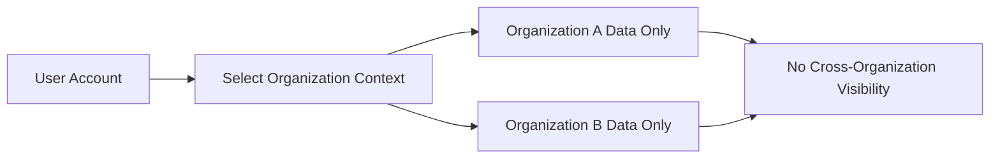
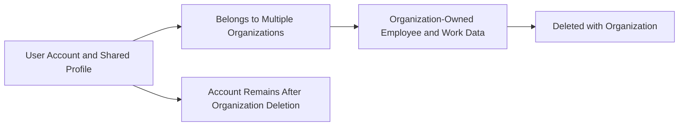
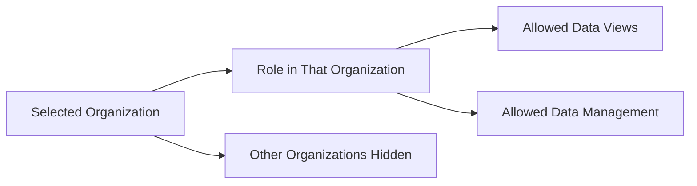
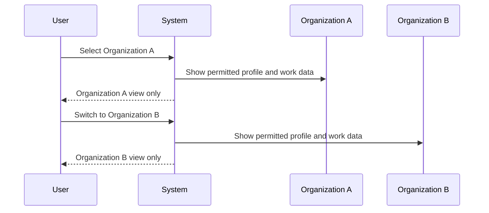
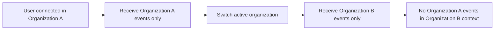

**hrmTimeTracking — Data ownership, privacy, retention, and recovery policies**

Data ownership, privacy, retention, and recovery policies

# Data Policies

Data ownership, privacy, retention, and recovery policies from a business perspective.

## Data Ownership and Privacy

Define who owns what data, who can access it, and privacy boundaries between users.

### Organization Data Isolation

All organization data must be handled within the currently selected organization context. Employees, projects, tasks, timelogs, timesheets, departments, roles, contracts, reports, dashboard data, activity log entries, and invitations for one organization must not be visible or mixed with those of another organization.

A user who belongs to multiple organizations works in one organization at a time. After the user selects an organization during login, all subsequent views and actions must apply only to that organization until the user switches to another one.

Employees in one organization must not be able to see employee records, projects, tasks, timelogs, timesheets, reports, dashboards, departments, roles, or activity history from another organization.

When a user switches organizations without logging out, the system must immediately replace the working context so that only the newly selected organization's data is shown.

Shared user account information is limited to the user's global account and profile. Organization-specific records such as employee status, role, contracts, project assignments, timelogs, and timesheets must remain separate for each organization.

References to data from another organization must not grant visibility across organization boundaries. A relationship such as one user belonging to multiple organizations must not cause records from those organizations to be combined in a single business view.

### Data Ownership Boundaries

Each organization owns its own business records created and maintained within that organization context, including employee records, departments, roles, projects, tasks, project memberships, contracts, timelogs, timesheets, reports, dashboard aggregates, invitations, and activity log entries.

A user owns the user's account credentials and shared profile information, including display name, avatar image, and phone number. That profile is shared across all organizations the user belongs to.

An employee record belongs to the organization in which it was created, even though it references a user account that may also belong to other organizations.

When a user account is deleted, the user account must be removed from organization membership, and employee records in other organizations must be marked as deactivated rather than transferred to another user automatically.

When an organization is deleted, all organization-owned business data associated with that organization must be permanently deleted, including employees, projects, tasks, timelogs, and timesheets. The owner's user account must remain, but it must no longer be associated with the deleted organization.

Historical business records remain organization-owned even when the related employee becomes deactivated. Deactivation must not convert organization records into personal user data.

The system must distinguish between global user-owned profile data and organization-owned operational data so that updates to one do not incorrectly overwrite or remove the other.

### Access Control and Data Visibility

Access to organization data must follow the role and permission assignment defined within that organization. A user's access in one organization must not determine access in another organization.

Only users authorized within an organization may view or manage that organization's records. Visibility of employee data, project data, time data, reports, and activity logs must be limited to the scope granted by the user's role in that organization.

Built-in and custom roles must operate only within the organization where they were defined. A role assignment in one organization must not grant access to another organization.

A user who has permission to view or manage records for all employees in one organization must still be prevented from viewing records from another organization unless separately authorized there.

Users without the relevant access rights must not be able to view full activity history, organization reports, or other employees' work records.

Employees may view their own organization records where the functional requirements allow it, but this self-visibility must remain limited to the currently selected organization context.

Organization dashboards and reports must present only information from the organization in which the user is currently working and only when the user has the required reporting access.

This section defines privacy boundaries for data visibility at a policy level. Detailed permission definitions are specified in [01-actors-and-auth.md](./01-actors-and-auth.md).

### User Privacy and Shared Profile Handling

A user's global profile must be shared across all organizations the user belongs to, but sharing of profile data must be limited to the same user account and must not merge organization-specific employment records.

Organization members may see personal information only to the extent that it is part of the business records and views available to them in the selected organization. Access to phone number, display name, avatar image, department, position, contract information, timelogs, and timesheets must remain subject to organization access boundaries and role-based visibility.

A user's membership in multiple organizations must not expose the existence, identity, employee details, projects, or time records of one organization to members of another organization.

When an invited user does not yet have an account, the pending invitation must be limited to the invited email and the target organization. It must not expose other organization memberships or unrelated personal data.

When employee records are deactivated, historical work records must remain available according to organization access rules, but deactivation must not create broader visibility of the person's information.

Review information recorded on timesheets, task status history, and activity log entries must be visible only within the organization where the action occurred.

The system must treat privacy as an organization-boundary concern: shared identity belongs to the user, while operational visibility belongs to the organization context and the user's assigned role within that context.

## Data Retention and Recovery

Define what happens to deleted data, how long it is retained, and how users can recover it.

### Soft Delete and Deactivation Handling

Employee removal from active use is handled through deactivation rather than immediate destruction of historical work data. When an employee is deactivated in an organization, the employee can no longer log time or submit timesheets, but existing timelogs and timesheets remain preserved as part of the organization record.

User account deletion follows the same preservation principle for organization history. When a user deletes their account, their employee records in other organizations are marked as deactivated rather than being removed outright. This ensures that past time tracking, timesheets, project participation, and related organization history remain available within those organizations.

This platform does not treat deactivation as organization deletion. Deactivation removes active participation while retaining historical business records that were explicitly stated to be preserved.

### Retention of Historical Business Records

Historical employment and work records are retained when the business rules explicitly require preservation. Deactivated employees keep their historical timelogs and timesheets. Employee contracts also retain their historical value because past contracts are immutable historical records and only the current active contract may be edited.

Archived or completed projects do not lose their prior time records. Existing timelogs on archived or completed projects remain preserved even though those projects can no longer receive new timelogs. This supports continued reporting and historical review of work already performed.

The specification does not define any time-based expiration period for retained records. No automatic purge window, scheduled archive period, or recovery deadline is defined beyond the explicit deletion cases described in this section.

### Recovery and Restoration Expectations

Recovery is available only where the source requirements explicitly allow a return from an inactive state. A deactivated employee can be reactivated. A rejected timesheet returns to draft status and can be modified and resubmitted, but the operational rules for that workflow are defined in the functional and business rules sections.

No recovery capability is defined for permanently deleted organizations or permanently deleted organization data. No restore process, recovery window, undo action, or archive-based reinstatement is specified for organization deletion.

No recovery capability is defined for deleted projects after deletion is allowed, and no recovery capability is defined for deleted timelogs once deletion has been completed. Where the requirements are silent, this document does not infer a restoration feature.

### Permanent Deletion Policy

Permanent deletion applies when an organization is deleted and the stated preconditions have been satisfied. Organization deletion is allowed only when all pending timesheets are resolved and there are no active employee contracts.

When an organization is deleted, all employees, projects, tasks, timelogs, and timesheets in that organization are permanently deleted. The owner account remains in the platform but is no longer associated with that organization.

Permanent deletion also applies to project deletion when deletion is allowed under the business rules. A project may be deleted only if it has no timelogs associated with it. The source requirements do not define any soft-delete stage, recycle bin, or recovery path for deleted projects.

This document treats permanent deletion as final removal because the requirements explicitly say the affected organization data is permanently deleted and do not provide any later restoration mechanism.

# Real-time Communication

WebSocket/SSE connection policies and performance requirements.

## WebSocket Security and Performance

Define connection limits, heartbeat intervals, reconnection policies, and security requirements for real-time communication.

### WebSocket Security

Real-time communication must follow the same organization isolation policy as all other organization-scoped actions. A user who belongs to multiple organizations must receive real-time updates only for the organization that is currently selected as the active workspace. Employees in one organization must not receive real-time data from another organization. If the active organization context changes, subsequent real-time communication must be scoped to the newly selected organization.

This section defines privacy and isolation expectations only. Permission definitions remain canonical in [01-actors-and-auth.md](./01-actors-and-auth.md), and business validation or access rejection behavior remains canonical in [04-business-rules.md](./04-business-rules.md).

### Connection Limit

The source requirements do not define any numeric limit for concurrent real-time connections per user, employee, or organization. Therefore, this specification does not introduce a connection cap.

Any real-time connection policy must continue to preserve strict organization isolation. Multiple organization membership must not cause cross-organization event exposure. If a user works in one selected organization, real-time updates visible through that connection must remain limited to that organization context.

This section intentionally does not define throughput targets, concurrency thresholds, or infrastructure constraints because such values were not provided in the source requirements.

### Heartbeat

The source requirements do not define heartbeat intervals, liveness checks, or timer values for real-time communication. Therefore, this specification does not introduce heartbeat frequency or timeout behavior.

If heartbeat or connection-liveness behavior is implemented, it must not expose data across organization boundaries. Maintaining a live connection must not change ownership, privacy, or organization-scoped visibility rules already defined for the platform.

This section intentionally avoids invented operational timings because no such non-functional values were provided by the user.

### Reconnection

The source requirements do not define automatic reconnection behavior, retry intervals, or resume policies for real-time communication. Therefore, this specification does not introduce reconnection timing or retry limits.

If a real-time connection is re-established, the resumed connection must continue to respect the user’s current organization context at the time communication resumes. A reconnected session must not resume delivery of events from a previously selected organization when the user has switched to another organization.

This section defines only continuity expectations for data isolation and privacy. It does not define retry algorithms, delay schedules, or transport-level behavior because those details were not supplied in the source requirements.

# External Dependency SLOs

Service level objectives for external dependency availability.

## External Dependency SLOs

Define availability expectations, timeout thresholds, and degradation policies for external service dependencies.

### Dependency Service Level Objective Policy

External dependency service level objectives for this platform are limited to dependencies that support core business actions such as sign-up, log-in, organization access, invitation resolution, and storage of user-provided images. No numeric availability target, recovery target, or vendor-specific commitment is defined in the source requirements and therefore none is assumed here.

The platform must treat external dependency availability as subordinate to the business rules already defined for organization isolation, account lifecycle, and record integrity. A dependency outage must not cause the system to mix data between organizations, lose ownership relationships, or bypass role-based access decisions.

If an external dependency is unavailable, the platform should preserve already stored business records and prevent partial business outcomes that would leave organizations, employees, projects, timelogs, or timesheets in an inconsistent state from a user perspective.

Availability expectations for external dependencies must be interpreted as safe continuity of business data, not as a promise of uninterrupted access at a specific percentage or within a specific duration, because such targets were not provided in the source requirements.

### External Timeout Handling

When an external dependency does not respond in a reasonable time, the platform must stop waiting and return a clear failure outcome rather than leaving the user action in an indeterminate state. The exact timeout duration is not specified by the source requirements and must not be invented in this document.

Timeout handling must prioritize protection of business records. A timed-out dependency interaction must not create duplicate organization memberships, duplicate invitations, duplicate timesheets, or duplicate timelogs from the same user action.

If a timeout occurs during an operation that would change business data, the platform should avoid presenting the action as completed unless the business outcome is known to be completed. Users must not be misled into believing that an account, invitation acceptance, profile change, or organization update was saved when the result cannot be confirmed.

Timeout behavior must preserve the currently selected organization context. A timeout affecting one action must not switch the user into another organization or expose data outside the active organization context.

### Degradation and Safe Failure Behavior

When an external dependency becomes unavailable or unstable, the platform may operate in a degraded mode only if the degraded mode preserves the core business guarantees defined in this specification. In particular, degradation must not compromise organization isolation, employee access boundaries, role assignment meaning, or the historical integrity of contracts, timelogs, timesheets, and activity log records.

Degraded behavior should favor temporary unavailability of the affected feature over inaccurate or misleading business results. For example, if a dependency needed for completing a user action is unavailable, the platform should block or defer that action instead of recording an uncertain result.

Features that rely on previously stored business data should continue to present that stored data whenever possible, provided doing so does not rely on stale or cross-organization information. Degradation must not cause one organization's employees, projects, tasks, reports, or activity entries to appear in another organization's context.

Degraded operation must also respect deletion and lifecycle rules already defined elsewhere in this specification. An external dependency problem must not cause permanent deletion to occur without satisfying the required business preconditions, and it must not silently skip required state changes such as employee deactivation effects or timesheet review outcomes.

### External Availability Impact on Data Protection

External availability issues must not weaken the platform's data ownership and privacy expectations. A dependency failure must not disclose profile information, employee details, project data, time records, reports, or activity logs to users outside the active organization.

If an external dependency is used to support user-provided assets such as organization logos or avatar images, unavailability of that dependency should affect only the visibility of that asset and must not alter the underlying user account, profile, organization, employee, project, or time-tracking records.

The platform must preserve recoverable business continuity after an external availability event by keeping successfully saved records intact and distinguishable from actions that did not complete. Users should be able to continue from a known business state rather than from an ambiguous one.

External availability limitations must not redefine data retention or deletion rules. If an organization or account deletion action cannot be fully completed because a required dependency is unavailable, the platform should avoid presenting the deletion as final until the business outcome is actually completed.

# Storage Capacity

Storage capacity planning and CDN requirements.

## Storage Capacity Requirements

Define storage requirements and capacity planning for file storage.

### Storage Capacity Scope

No storage capacity limits, file storage quotas, attachment volume expectations, or storage growth targets are defined in the source requirements for this platform.

The requirements do define organization and user profile attributes that may include logo images and avatar images, but they do not specify expected file sizes, upload volume, retention volume, or total storage allocation.

Because 05-non-functional content must be traceable to the source requirements, no storage capacity commitment, planning assumption, or storage reservation policy is defined in this specification.

Any future storage capacity policy for organization logos, avatar images, or other stored business records must be specified separately before it can be treated as a requirement.

### CDN Usage

The source requirements do not mention content delivery network usage for logo images, avatar images, reports, dashboards, or any other platform content.

Accordingly, this specification does not require, assume, or prohibit the use of a content delivery network.

No routing, caching, replication, or distribution policy is defined here because such infrastructure behavior was not included in the original requirements.

If content delivery behavior becomes a business requirement later, it must be introduced in a future revision with explicit scope and ownership.

### Capacity Planning Assumptions

The source requirements define business features such as multi-organization isolation, employee management, project tracking, time logging, timesheets, reporting, activity logging, and dashboards, but they do not define transaction volume, concurrent usage expectations, data growth forecasts, or file storage projections.

For that reason, this specification does not state any capacity planning baseline, scaling threshold, or utilization target.

No non-functional commitment is made here for peak usage, storage headroom, or expansion timing.

Until explicit capacity assumptions are provided by stakeholders, implementation and operational planning for capacity remain out of scope for this requirements document.